# 유아 영어 교육: 파닉스와 동요 중심 자연 습득 방법론

> **핵심 철학**: 한글 번역 없이 영어를 영어로 익히는 자연스러운 언어 습득 프로세스

---

## 📚 목차

1. [왜 유아 영어인가? 중요성과 과학적 근거](#1-왜-유아-영어인가-중요성과-과학적-근거)
2. [프뢰벨 vs 몬테소리 영어 교육 비교](#2-프뢰벨-vs-몬테소리-영어-교육-비교)
3. [유아 영어 교육의 핵심 원칙](#3-유아-영어-교육의-핵심-원칙)
4. [파닉스(Phonics) 완전 가이드](#4-파닉스phonics-완전-가이드)
5. [동요 중심 영어 학습법](#5-동요-중심-영어-학습법)
6. [영어 노출 vs 한글 번역의 차이](#6-영어-노출-vs-한글-번역의-차이)
7. [연령별 영어 학습 로드맵](#7-연령별-영어-학습-로드맵)
8. [실전 활용: 일상 속 영어 환경 만들기](#8-실전-활용-일상-속-영어-환경-만들기)
9. [추천 리소스와 자료](#9-추천-리소스와-자료)
10. [집에서 실천하는 구체적 방법론](#10-집에서-실천하는-구체적-방법론)

---

## 1. 왜 유아 영어인가? 중요성과 과학적 근거

### 🧠 **뇌 과학이 말하는 유아 영어의 결정적 시기**

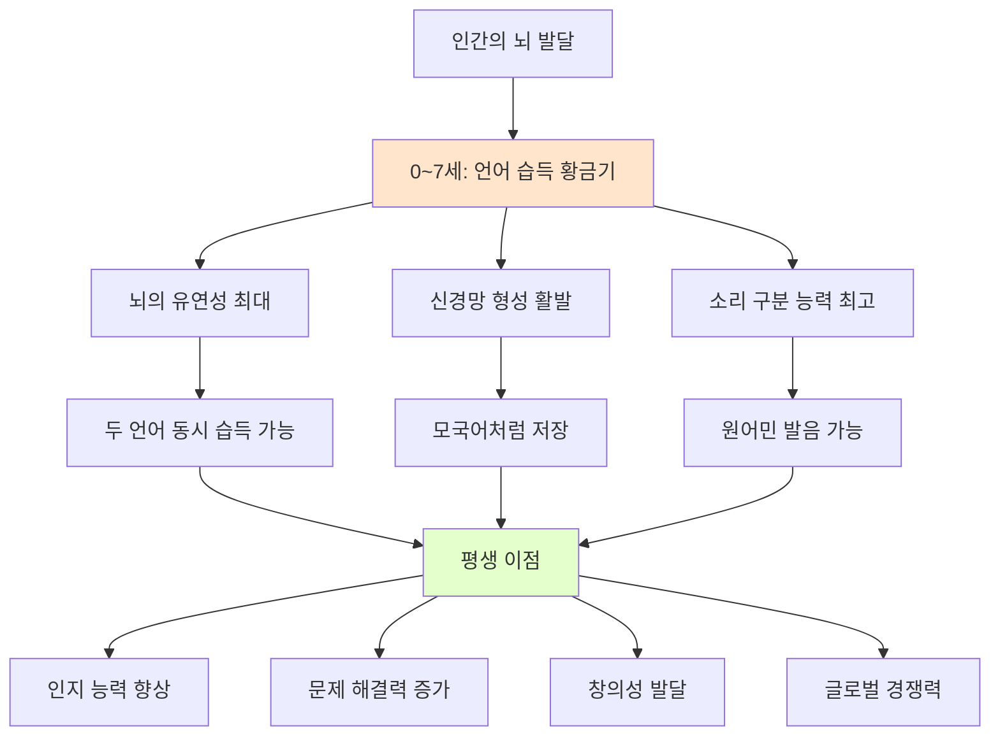

### 📊 **연령별 언어 습득 능력 변화**

| 연령대 | 언어 습득 능력 | 특징 | 영어 교육 효과 |
|--------|--------------|------|---------------|
| **0-3세** | ⭐⭐⭐⭐⭐ 최고 | • 모든 소리 구분 가능<br/>• 뇌 시냅스 형성 폭발적<br/>• 스펀지처럼 흡수 | ✅ 모국어처럼 습득<br/>✅ 완벽한 발음<br/>✅ 노력 최소 |
| **4-7세** | ⭐⭐⭐⭐ 매우 높음 | • 여전히 높은 뇌 유연성<br/>• 패턴 인식 능력 우수<br/>• 언어 감각 살아있음 | ✅ 자연스러운 습득<br/>✅ 좋은 발음<br/>✅ 적은 노력 |
| **8-12세** | ⭐⭐⭐ 높음 | • 논리적 사고 발달<br/>• 의식적 학습 가능<br/>• 발음 고착화 시작 | △ 학습으로 가능<br/>△ 발음 교정 필요<br/>△ 중간 노력 |
| **13세~** | ⭐⭐ 보통 | • 논리적 학습 방식<br/>• 모국어 간섭 강함<br/>• 발음 교정 어려움 | △ 문법 중심 학습<br/>❌ 원어민 발음 어려움<br/>❌ 많은 노력 |

### 🌍 **유아 영어 교육의 5가지 핵심 이점**

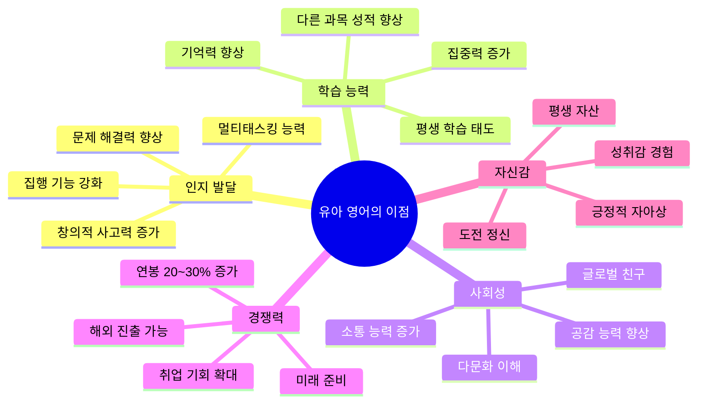

#### **1) 🧠 인지 능력 향상: 두 언어 = 두 배 뇌 발달**

**과학적 증거**:

| 연구 | 결과 | 의미 |
|------|------|------|
| **캐나다 York 대학** | 이중언어 사용자는 집행 기능(executive function) 테스트에서 평균 20% 높은 점수 | 계획, 문제 해결, 집중력이 뛰어남 |
| **MIT 연구** | 이중언어 아동은 단일언어 아동보다 전두엽 피질이 더 발달 | 논리적 사고와 의사결정 능력 우수 |
| **런던 대학 UCL** | 이중언어 사용자는 뇌의 회백질 밀도가 높음 | 정보 처리 속도가 빠름 |
| **노스웨스턴 대학** | 이중언어 사용자는 치매 발병이 평균 4.5년 늦어짐 | 평생 뇌 건강 유지 |

**실제 나타나는 능력**:
- 🎯 집중력: 여러 과제를 동시에 처리하는 능력
- 🧩 문제 해결: 다양한 관점에서 해결책 찾기
- 🎨 창의성: 기존 틀을 벗어난 사고
- 📚 학습 능력: 새로운 개념을 빠르게 습득

#### **2) 📈 학업 성취도 향상**

**데이터로 보는 효과**:

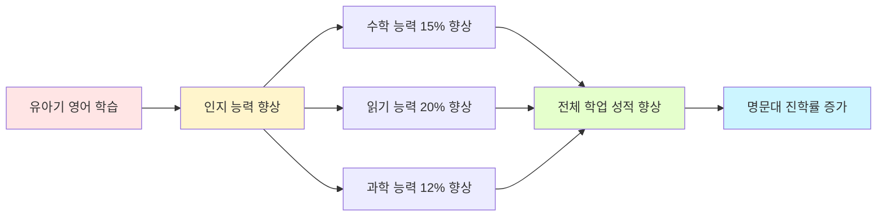

| 과목 | 향상도 | 이유 |
|------|--------|------|
| **수학** | +15% | 패턴 인식 능력, 논리적 사고력 향상 |
| **읽기** | +20% | 음운 인식 능력, 어휘력 증가 |
| **과학** | +12% | 관찰력, 분석력 향상 |
| **사회** | +18% | 다문화 이해, 글로벌 관점 |

#### **3) 💼 미래 경쟁력: AGI 시대의 필수 역량**

**글로벌 인재 시장 현황**:

| 지표 | 데이터 | 출처 |
|------|--------|------|
| **영어 능통자 연봉** | 단일언어 대비 20-30% 높음 | LinkedIn 2023 |
| **글로벌 기업 채용** | 영어 필수 조건 90% | Google, Apple, MS 채용 공고 |
| **스타트업 투자** | 영어권 소통 가능시 투자 확률 3배 | CB Insights |
| **해외 취업** | 영어 능력 = 취업 기회 5배 증가 | OECD Report 2023 |

**AGI 시대 영어의 역할**:

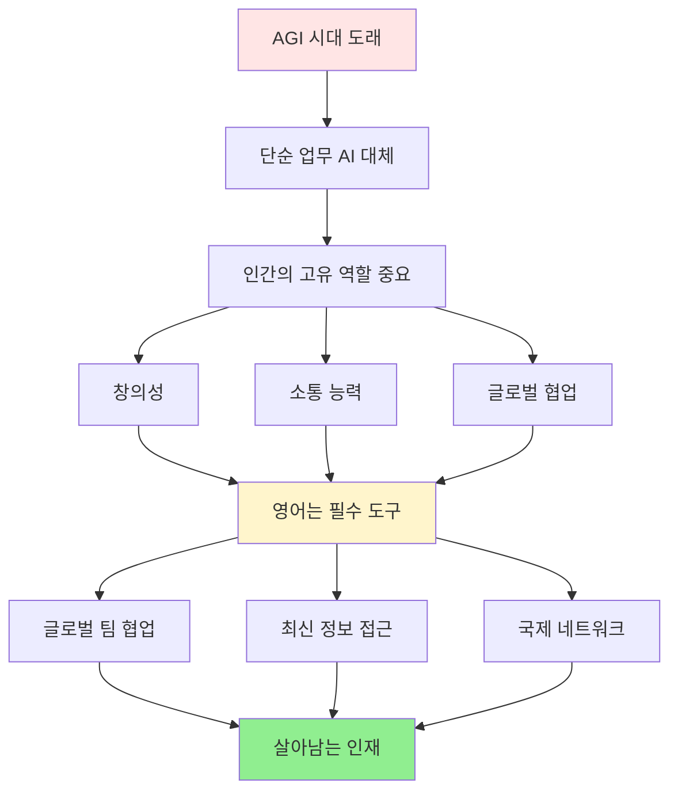

#### **4) 🌏 문화적 이해와 글로벌 시민 의식**

**언어는 문화의 창**:

| 측면 | 이중언어 아동 | 단일언어 아동 |
|------|-------------|-------------|
| **공감 능력** | 높음 (다른 관점 이해) | 보통 |
| **문화 수용성** | 개방적, 유연함 | 상대적으로 폐쇄적 |
| **편견 극복** | 다양성 존중 | 익숙한 것 선호 |
| **소통 능력** | 맥락 파악 우수 | 직접적 의사소통 선호 |

#### **5) 😊 자존감과 성취감**

**어린 시절 영어 습득의 심리적 이점**:

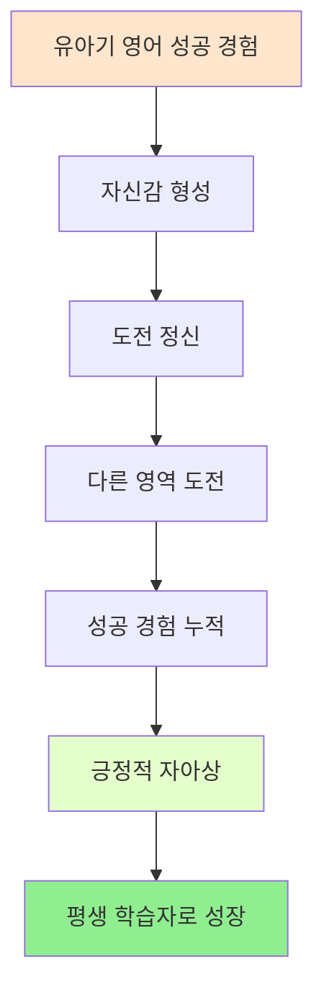

### 📉 **유아기를 놓쳤을 때의 손실**

| 연령 | 유아기 시작 | 초등 고학년 시작 | 차이 |
|------|-----------|----------------|------|
| **발음** | 거의 원어민 수준 | 한국어 억양 남음 | 평생 차이 |
| **학습 시간** | 하루 30분, 자연스럽게 | 하루 2-3시간, 의식적 학습 | 6배 차이 |
| **스트레스** | 거의 없음 (놀이) | 높음 (공부 압박) | 학습 동기 영향 |
| **최종 수준** | 네이티브 수준 가능 | 유창하지만 한계 | 평생 격차 |
| **비용** | 상대적으로 저렴 | 학원비 월 50만원+ | 경제적 부담 |

### 🚀 **결론: 유아 영어는 선택이 아닌 필수**

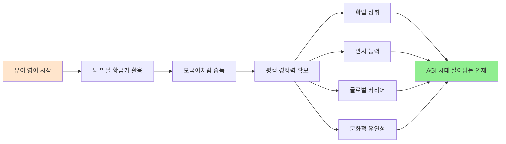

**핵심 메시지**:
> "영어는 단순한 과목이 아니라, 아이의 뇌 발달, 인지 능력, 미래 경쟁력을 결정하는 핵심 요소입니다. 유아기는 평생 한 번뿐인 언어 습득의 황금기입니다."

---

## 2. 프뢰벨 vs 몬테소리 영어 교육 비교

### 🎓 **두 교육법의 철학적 차이**

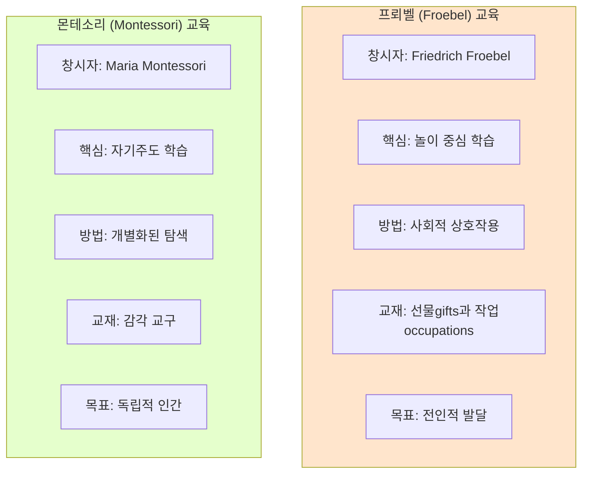

### 📊 **영어 교육 접근법 상세 비교**

| 측면 | 프뢰벨 영어 | 몬테소리 영어 | 프뢰벨의 장점 |
|------|-----------|-------------|------------|
| **학습 방식** | 📚 그룹 활동 + 동요 + 스토리텔링 | 📖 개별 학습 + 교구 조작 | 사회성 발달 + 언어는 소통 도구 |
| **교사 역할** | 🎭 적극적 참여, 함께 놀이 | 👀 관찰자, 환경 준비자 | 모델링, 즉각 피드백 가능 |
| **교재** | 🎵 동요, 그림책, 게임, 놀이감 | 🧩 몬테소리 교구, 카드, 퍼즐 | 풍부한 언어 노출, 재미 |
| **상호작용** | 👥 또래와 함께, 협력 놀이 | 🧒 혼자 또는 소그룹 | 실제 대화 연습, 사회적 언어 |
| **환경** | 🏫 역동적, 활기찬, 변화 많음 | 🕊️ 정돈되고 조용한, 질서 | 언어는 역동적 환경에서 발달 |
| **평가** | 🎯 과정 중심, 참여도 | 📈 결과 중심, 개별 진도 | 언어는 과정이 중요 |
| **일과** | ⏰ 구조화된 그룹 시간 | 🕐 자유 선택 시간 (3시간 블록) | 체계적 언어 노출 |

### 🎯 **영어 학습 구체적 비교**

#### **1. 알파벳과 파닉스 학습**

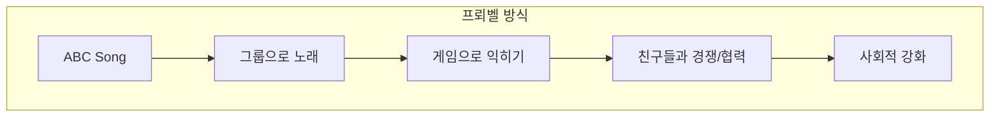
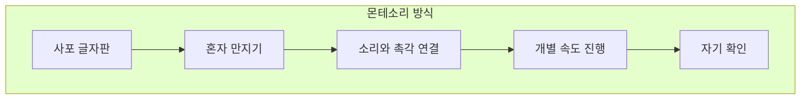

| 활동 | 프뢰벨 방식 | 몬테소리 방식 | 언어 학습 효과 |
|------|-----------|-------------|--------------|
| **알파벳** | • 노래로 배우기<br/>• 그룹 게임<br/>• 신체 활동 (A 모양 만들기) | • 사포 글자 만지기<br/>• 이동식 알파벳<br/>• 개별 탐색 | 프뢰벨: 청각 + 운동 기억<br/>몬테소리: 촉각 + 시각 기억 |
| **파닉스** | • 동요로 소리 익히기<br/>• 라임 게임<br/>• 단어 가족 놀이 | • 핑크/블루/그린 시리즈<br/>• 오브젝트 박스<br/>• 단어 구성 작업 | 프뢰벨: 패턴 인식 빠름<br/>몬테소리: 정확한 해독 |
| **쓰기** | • 큰 종이에 같이 쓰기<br/>• 공중에 글자 그리기<br/>• 그림 일기 | • 메탈 인셋<br/>• 샌드 트레이<br/>• 정교한 근육 훈련 | 프뢰벨: 자유로운 표현<br/>몬테소리: 정확한 형태 |

#### **2. 어휘 학습**

**프뢰벨 영어 어휘 학습**:

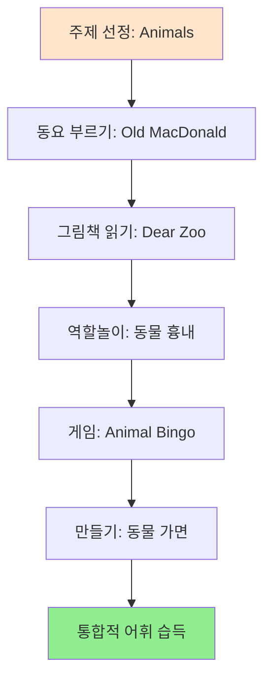

**몬테소리 영어 어휘 학습**:

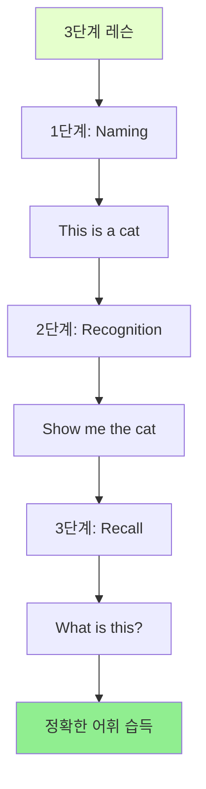

| 측면 | 프뢰벨 | 몬테소리 | 프뢰벨의 장점 |
|------|--------|----------|------------|
| **어휘 수** | 폭넓고 빠르게 | 정확하지만 천천히 | 실용적 의사소통 빠름 |
| **맥락** | 스토리와 놀이 속 | 분리된 카테고리 | 실제 사용법 이해 |
| **정착률** | 반복 노출로 강화 | 체계적 복습 | 자연스러운 기억 |

#### **3. 문장 구사와 대화**

**프뢰벨 대화 학습**:

| 활동 | 방법 | 효과 |
|------|------|------|
| **Circle Time** | 매일 아침 모여서 인사, 날씨, 기분 나누기 | 실제 대화 연습, 순서 지키기 |
| **역할놀이** | 엄마/아빠/의사/선생님 되어보기 | 다양한 상황 언어 습득 |
| **Show and Tell** | 친구들 앞에서 자기 물건 소개 | 발표력, 문장 구성 능력 |
| **그룹 게임** | "Simon Says", "Duck Duck Goose" | 지시 이해, 반응 속도 |

**몬테소리 대화 학습**:

| 활동 | 방법 | 효과 |
|------|------|------|
| **Practical Life** | 혼자 물 따르기, 옷 개기 등 | 자립심, 순서 언어 (First, Then, Finally) |
| **Command Cards** | 카드 읽고 행동하기 | 읽기-행동 연결 |
| **소그룹 레슨** | 2-3명이 함께 교사에게 배우기 | 집중적 학습 |

**언어 발달 속도 비교**:

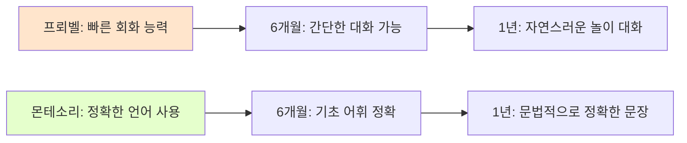

### ⚖️ **장단점 종합 비교**

#### **프뢰벨 영어의 장점** ✅

| 장점 | 설명 | 실제 효과 |
|------|------|----------|
| **1. 빠른 회화 능력** | 그룹 활동으로 매일 대화 연습 | 6개월 내 간단한 대화 가능 |
| **2. 사회성 발달** | 친구들과 함께 배우며 소통 능력 향상 | 협력, 공감, 리더십 동시 발달 |
| **3. 재미와 동기** | 놀이, 동요, 게임으로 즐겁게 학습 | 영어에 대한 긍정적 태도 형성 |
| **4. 통합적 학습** | 음악, 미술, 신체 활동과 연계 | 다중 지능 발달, 기억력 강화 |
| **5. 문화 체험** | 영어권 명절, 전통, 노래 체험 | 언어와 문화를 함께 이해 |
| **6. 교사 모델링** | 교사가 적극 참여, 즉각 피드백 | 발음, 표현 즉시 교정 |
| **7. 비용 효율** | 그룹 수업으로 상대적으로 저렴 | 월 20~40만원 수준 |

#### **프뢰벨 영어의 단점** ❌

| 단점 | 설명 | 대응 방안 |
|------|------|----------|
| **1. 개인차 고려 부족** | 모든 아이가 같은 진도 | 집에서 개별 보충 필요 |
| **2. 조용한 아이 불리** | 적극적인 아이가 더 많이 말함 | 소그룹 활동 병행 |
| **3. 정확성 부족** | 빠르게 배우지만 실수 많음 | 체계적 복습 필요 |
| **4. 산만할 수 있음** | 활동적이라 집중 어려운 아이 힘듦 | 짧은 활동, 자주 전환 |

#### **몬테소리 영어의 장점** ✅

| 장점 | 설명 | 실제 효과 |
|------|------|----------|
| **1. 정확한 학습** | 체계적이고 순차적 | 문법, 철자 정확도 높음 |
| **2. 자기주도성** | 스스로 선택하고 진행 | 평생 학습 습관 형성 |
| **3. 집중력 향상** | 혼자 집중하는 시간 많음 | 깊이 있는 학습 가능 |
| **4. 개별 맞춤** | 각자의 속도로 진행 | 아이에게 맞는 수준 |
| **5. 감각 통합** | 촉각, 시각 교구 활용 | 다감각 기억 형성 |

#### **몬테소리 영어의 단점** ❌

| 단점 | 설명 | 영향 |
|------|------|------|
| **1. 회화 연습 부족** | 개별 활동 중심 | 말하기 능력 늦게 발달 |
| **2. 사회성 발달 제한** | 혼자 하는 시간 많음 | 그룹 대화 능력 부족 |
| **3. 재미 부족** | 교구 중심이라 지루할 수 있음 | 동기 유지 어려움 |
| **4. 높은 비용** | 개별화 수업, 비싼 교구 | 월 50~80만원 이상 |
| **5. 느린 진도** | 정확성 중시로 속도 느림 | 실용 회화 늦게 시작 |

### 🏆 **어떤 아이에게 적합한가?**

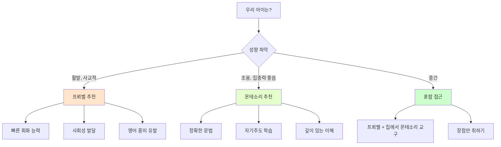

| 아이 성향 | 추천 | 이유 |
|----------|------|------|
| **활발하고 사교적** | 프뢰벨 ⭐⭐⭐⭐⭐ | 그룹 활동에서 에너지 발산, 빠른 회화 습득 |
| **조용하고 신중한** | 몬테소리 ⭐⭐⭐⭐⭐ | 자기 속도로 학습, 압박 없음 |
| **호기심 많고 탐구적** | 프뢰벨 ⭐⭐⭐⭐ | 다양한 활동, 통합 학습 |
| **완벽주의 성향** | 몬테소리 ⭐⭐⭐⭐ | 정확성, 체계성이 만족감 줌 |
| **주의력 산만** | 프뢰벨 ⭐⭐⭐ | 짧은 활동 전환, 역동적 환경 |
| **집중력 뛰어남** | 몬테소리 ⭐⭐⭐⭐⭐ | 긴 시간 몰입 가능 |

### 💡 **최적의 선택: 통합적 접근**

**가장 효과적인 방법**:

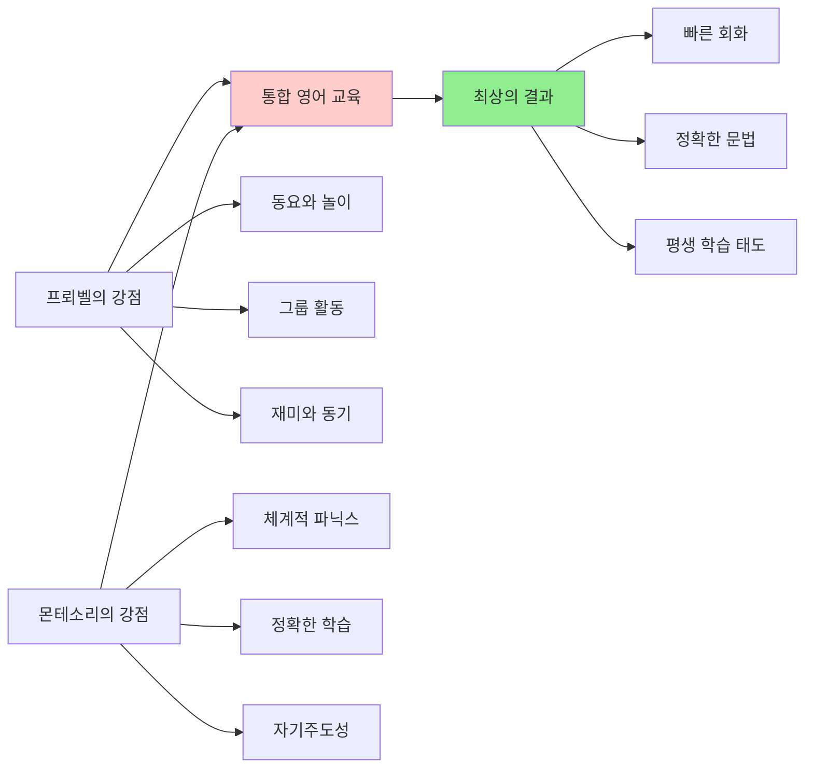

**실천 방법**:

| 시간 | 프뢰벨 활동 | 몬테소리 활동 |
|------|-----------|-------------|
| **기관 (유치원/어린이집)** | 프뢰벨 영어 수업 참여 | - |
| **집 (평일 저녁)** | 동요, 그림책, 가족 대화 | 파닉스 교구, 개별 학습 앱 |
| **주말** | 영어 뮤지컬, 놀이터 역할놀이 | 조용한 읽기 시간, 교구 탐색 |

**비용 효율적 조합**:
- 프뢰벨 그룹 수업 (주 2-3회): 월 25만원
- 몬테소리 교구 구입 (집에서 활용): 초기 10~20만원
- 온라인 파닉스 앱: 월 1~2만원
- **총 월 30만원 내외로 최상의 효과**

### 🎓 **프뢰벨 영어가 특히 뛰어난 이유**

#### **1. 언어의 본질에 충실**

언어는 **소통의 도구**입니다. 프뢰벨은 이 본질에 충실합니다.

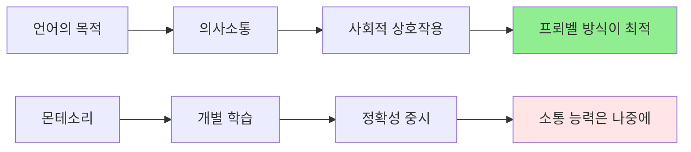

#### **2. 뇌 과학과 일치**

| 뇌 과학 원리 | 프뢰벨 접근 | 몬테소리 접근 |
|------------|-----------|-------------|
| **사회적 뇌** | ✅ 그룹 활동으로 거울 뉴런 활성화 | △ 개별 학습 중심 |
| **정서적 기억** | ✅ 즐거운 경험 = 강한 기억 | △ 중립적 경험 |
| **다감각 통합** | ✅ 음악+동작+시각 | ✅ 촉각+시각 |
| **반복 강화** | ✅ 동요, 게임으로 자연 반복 | ✅ 구조화된 복습 |

#### **3. AGI 시대 핵심 역량**

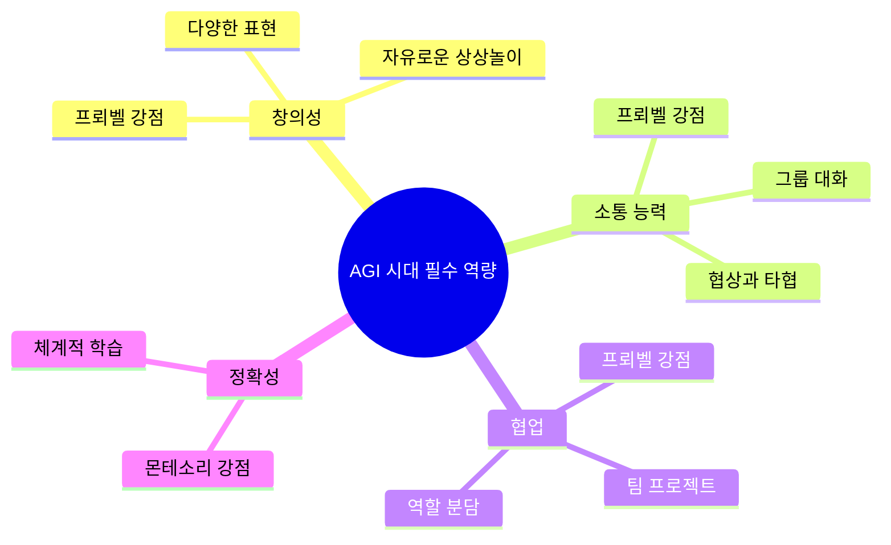

---

## 3. 유아 영어 교육의 핵심 원칙

### 🎯 **5대 핵심 원칙**

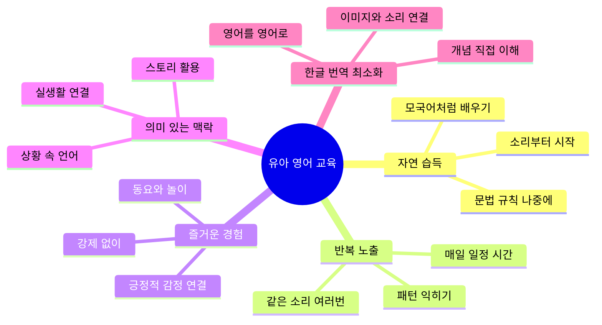

### 📊 **전통 방식 vs 자연 습득 방식 비교**

| 구분 | ❌ 전통적 방식 (비효율) | ✅ 자연 습득 방식 (효과적) |
|------|------------------------|--------------------------|
| **접근법** | 단어 암기 → 문법 학습 → 문장 만들기 | 소리 노출 → 패턴 인식 → 자연스러운 발화 |
| **번역** | 모든 것을 한글로 번역 | 영어를 영어로 이해 |
| **학습 순서** | 읽기/쓰기 먼저 | 듣기/말하기 먼저 |
| **자료** | 교재, 단어장 | 동요, 그림책, 영상 |
| **목표** | 시험 점수 | 실제 의사소통 능력 |
| **스트레스** | 높음 (암기 부담) | 낮음 (놀이처럼) |
| **결과** | 문법은 알지만 말 못함 | 자연스럽게 말하고 이해 |

---

## 4. 파닉스(Phonics) 완전 가이드

### 🔤 **파닉스란?**

**파닉스**: 철자(글자)와 소리의 관계를 가르치는 교육 방법
- 알파벳 26개 글자가 어떤 소리를 내는지 익히기
- 글자 조합이 어떤 소리를 만드는지 이해하기
- 읽기와 쓰기의 기초 토대


### 📖 **파닉스 5단계 학습 프로세스**

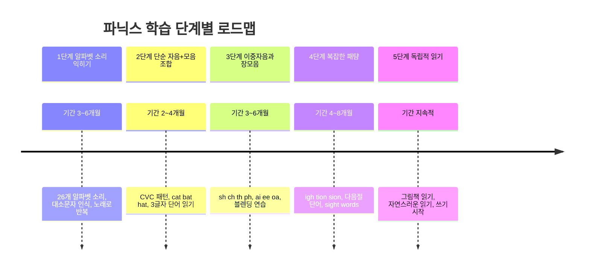

### 🎵 **단계별 파닉스 학습법**

#### **1단계: 알파벳 소리 익히기 (3-4세)**

| 알파벳 | 소리 (발음) | 연상 단어 | 활동 예시 |
|--------|------------|----------|----------|
| A | /æ/ (애) | Apple | "A says /æ/, /æ/ apple!" 노래 |
| B | /b/ (ㅂ) | Ball | 공 던지며 "B, /b/, ball!" |
| C | /k/ (ㅋ) | Cat | 고양이 흉내 내며 소리 연습 |
| D | /d/ (ㄷ) | Dog | 강아지 인형과 놀이 |
| E | /e/ (에) | Egg | 계란 요리하며 반복 |

**핵심 활동**:
- 📺 알파벳 송 매일 듣기 (Super Simple Songs, ABC Song)
- 🎨 알파벳 그림 카드로 놀이
- 📚 알파벳 그림책 읽기
- 🎯 소리 맞추기 게임

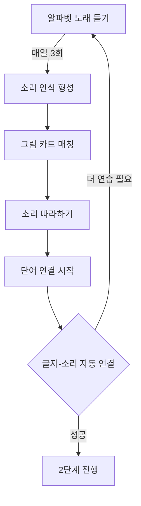

#### **2단계: CVC 패턴 (자음+모음+자음) (4-5세)**

**CVC 패턴**: 가장 기초적인 단어 구조
- cat, dog, pig, sun, bed
- bat, hat, mat, rat, sat (라임 연습)

| 모음 | CVC 단어 예시 | 학습 활동 |
|------|--------------|----------|
| **a** | cat, bat, hat, mat, rat, sat | 단어 가족(word family) 노래 |
| **e** | bed, red, pen, hen, ten, men | 그림 카드 매칭 게임 |
| **i** | pig, big, dig, wig, sit, hit | 라임 찾기 놀이 |
| **o** | dog, fog, log, hot, pot, dot | 스토리 만들기 |
| **u** | bug, hug, rug, sun, fun, run | 액션과 함께 외우기 |

**학습 시퀀스**:

```mermaid
flowchart LR
    A[개별 소리 복습] --> B[첫 자음 소리]
    B --> C[모음 소리 추가]
    C --> D[마지막 자음]
    D --> E[블렌딩 합치기]
    E --> F[완성된 단어 읽기]
    
    subgraph Example["예시: cat"]
        G[/k/ 소리] --> H[/æ/ 소리]
        H --> I[/t/ 소리]
        I --> J[c-a-t → cat!]
    end
```

#### **3단계: 이중자음과 장모음 (5-6세)**

**이중자음 (Digraphs)**:
- sh: shop, ship, shell
- ch: chair, cheese, chicken
- th: this, that, three
- ph: phone, photo

**장모음 패턴**:
- ai/ay: rain, day, play
- ee/ea: tree, seat, beach
- oa/ow: boat, snow, window
- ie/igh: pie, light, night

| 패턴 | 소리 | 단어 예시 | 동요/챈트 |
|------|------|----------|----------|
| **sh** | /ʃ/ (쉬) | ship, shop, she, fish | "She sells seashells" |
| **ch** | /tʃ/ (치) | chair, chip, cheese | "Choo-choo train" 노래 |
| **ai** | /eɪ/ (에이) | rain, train, mail | "Rain, rain, go away" |
| **ee** | /iː/ (이이) | tree, bee, see | "I see a bee in the tree" |

#### **4단계: 복잡한 패턴과 Sight Words (6-7세)**

**복잡한 소리 패턴**:
- tion: station, nation
- igh: light, night, fight
- ough: though, through, tough (불규칙)

**Sight Words (자주 나오는 불규칙 단어)**:
- the, are, was, said, come, some
- 파닉스 규칙 적용 안 됨 → 통째로 암기 필요

| 레벨 | Sight Words | 학습 방법 |
|------|------------|----------|
| **기초** | I, a, the, is, to, and, you | 매일 그림책에서 찾기 |
| **중급** | he, she, they, was, said | 문장 만들기 게임 |
| **고급** | because, would, could | 스토리 쓰기에 활용 |

---

## 5. 동요 중심 영어 학습법

### 🎵 **왜 동요인가?**

```mermaid
mindmap
  root((영어 동요의 힘))
    리듬과 멜로디
      기억력 향상
      자연스러운 반복
      발음 패턴 익히기
    감정 연결
      즐거운 경험
      긍정적 기억
      스트레스 제로
    문화 이해
      영어권 문화
      놀이 방식
      생활 표현
    언어 패턴
      자연스러운 문장
      리듬감 있는 표현
      실생활 어휘
```

### 🎼 **동요 학습의 5가지 효과**

| 효과 | 설명 | 과학적 근거 |
|------|------|------------|
| 🧠 **기억력 강화** | 멜로디와 함께 외우면 장기 기억 전환율 3배 | 음악과 언어가 같은 뇌 영역 활성화 |
| 👂 **발음 향상** | 리듬 타며 따라하면 자연스러운 억양 습득 | 청각-운동 피드백 루프 형성 |
| 💬 **문장 구조** | 완성된 문장을 통째로 패턴 학습 | 청크(chunk) 단위 언어 습득 |
| 🌍 **문화 이해** | 영어권 아이들이 부르는 노래 체험 | 문화적 맥락 속 언어 습득 |
| 😊 **정서적 안정** | 즐거운 경험 → 영어에 대한 긍정적 태도 | 정서적 기억이 학습 효율 높임 |

### 📊 **연령별 추천 동요와 목적**

```mermaid
timeline
    title 연령별 영어 동요 학습 로드맵
    
    section 0~2세 소리 친숙화
        목표 영어 소리 노출 : Twinkle Twinkle Little Star, ABC Song, Old MacDonald
    
    section 3~4세 기본 어휘
        목표 일상 단어 익히기 : Head Shoulders Knees and Toes, If You're Happy, Five Little Ducks
    
    section 5~6세 문장 구조
        목표 문장 패턴 학습 : Wheels on the Bus, Bingo, Row Row Row Your Boat
    
    section 7세 이상 스토리와 표현
        목표 이야기와 감정 표현 : Do Re Mi, Somewhere Over the Rainbow, 디즈니 노래
```

### 🎯 **필수 영어 동요 TOP 20**

#### **레벨 1: 기초 (0-3세) - 소리와 리듬 익히기**

| 순위 | 동요 제목 | 학습 포인트 | 활용 시기 |
|------|----------|------------|----------|
| 1 | **ABC Song** | 알파벳 순서와 소리 | 매일 아침 |
| 2 | **Twinkle Twinkle Little Star** | 느린 템포, 명확한 발음 | 취침 전 |
| 3 | **Old MacDonald Had a Farm** | 동물 이름, 소리 흉내 | 놀이 시간 |
| 4 | **The Wheels on the Bus** | 교통수단, 반복 패턴 | 외출 전 |
| 5 | **Baby Shark** | 가족 호칭, 액션 | 에너지 발산 시간 |

#### **레벨 2: 초급 (4-5세) - 어휘와 문장**

| 순위 | 동요 제목 | 학습 포인트 | 문법 요소 |
|------|----------|------------|----------|
| 6 | **Head Shoulders Knees and Toes** | 신체 부위 | 명사 |
| 7 | **If You're Happy and You Know It** | 감정 표현 | 조건문 (If~) |
| 8 | **Five Little Monkeys** | 숫자 세기 | 과거형 (fell, called) |
| 9 | **Bingo** | 철자 익히기 | 문자 인식 |
| 10 | **Row Row Row Your Boat** | 동작 동사 | 명령문 |

#### **레벨 3: 중급 (6-7세) - 스토리와 표현**

| 순위 | 동요 제목 | 학습 포인트 | 고급 요소 |
|------|----------|------------|----------|
| 11 | **You Are My Sunshine** | 감정 표현 | 비유적 표현 |
| 12 | **Somewhere Over the Rainbow** | 꿈과 희망 | 추상적 개념 |
| 13 | **Do Re Mi** (Sound of Music) | 음악 용어 | 순차적 학습 |
| 14 | **Let It Go** (Frozen) | 감정 해소 | 복잡한 문장 구조 |
| 15 | **A Whole New World** (Aladdin) | 모험과 변화 | 서술적 표현 |

### 🎼 **동요 활용 4단계 학습법**

```mermaid
graph TD
    A[1단계: 듣기만 반복] -->|1~2주| B[2단계: 몸동작 따라하기]
    B -->|2~3주| C[3단계: 일부 따라 부르기]
    C -->|3~4주| D[4단계: 완전히 따라 부르기]
    D --> E[새로운 동요 추가]
    E --> A
    
    A -.매일 3~5회 노출.-> A
    B -.액션과 함께.-> B
    C -.쉬운 부분부터.-> C
    D -.자신감 형성.-> D
    
    style A fill:#FFE5E5
    style B fill:#FFF5CC
    style C fill:#E5FFCC
    style D fill:#CCF5FF
    style E fill:#E5CCFF
```

#### **1단계: 듣기만 반복 (1~2주)**

**목표**: 소리와 리듬에 익숙해지기

- ⏰ 하루 3~5회 들려주기
- 🎧 배경음악처럼 자연스럽게
- 🚫 강제로 따라하라고 하지 않기
- 😊 부모가 먼저 즐겁게 듣기

**실천 방법**:
```
아침 식사: ABC Song (3분)
놀이 시간: The Wheels on the Bus (3분)
저녁 목욕: Five Little Ducks (3분)
취침 전: Twinkle Twinkle Little Star (3분)
```

#### **2단계: 몸동작 따라하기 (2~3주)**

**목표**: 의미와 소리 연결하기

| 동요 | 핵심 동작 | 학습 효과 |
|------|----------|----------|
| **Head Shoulders** | 신체 부위 터치 | 어휘-개념 직접 연결 |
| **If You're Happy** | 박수, 발 구르기 | 감정과 행동 연결 |
| **Baby Shark** | 손동작으로 상어 표현 | 운동 기억 활성화 |

```mermaid
flowchart LR
    A[소리 듣기] --> B[동작 보기]
    B --> C[동작 따라하기]
    C --> D[소리+동작 결합]
    D --> E[의미 이해]
    
    style E fill:#90EE90
```

#### **3단계: 일부 따라 부르기 (3~4주)**

**목표**: 쉬운 부분부터 발화 시작

**진행 순서**:
1. 후렴구부터 (반복되는 부분)
2. 단순한 단어들 (a, the, and)
3. 액션 단어들 (jump, clap, go)
4. 전체 가사 도전

#### **4단계: 완전히 따라 부르기 + 응용**

**목표**: 자신감 있게 부르고 응용하기

**응용 활동**:
- 🎤 아이 혼자 부르기 (녹음해서 들려주기)
- 🎭 가족 앞에서 공연하기
- 🎨 동요 내용 그림 그리기
- 📖 동요를 스토리로 만들기

---

## 6. 영어 노출 vs 한글 번역의 차이

### ⚖️ **두 가지 접근법 비교**

```mermaid
graph TB
    subgraph 한글번역방식["❌ 한글 번역 방식 (비효율)"]
        A1[영어 단어] --> A2[한글로 번역]
        A2 --> A3[한글로 이해]
        A3 --> A4[다시 영어로 전환]
        A4 --> A5[말하기 느림]
    end
    
    subgraph 직접이해방식["✅ 영어 직접 이해 방식 (효율)"]
        B1[영어 소리] --> B2[이미지/상황]
        B2 --> B3[개념 직접 이해]
        B3 --> B4[바로 영어로 반응]
    end
    
    style 한글번역방식 fill:#FFE5E5
    style 직접이해방식 fill:#E5FFCC
```

### 📊 **상세 비교표**

| 측면 | ❌ 한글 번역 방식 | ✅ 영어 직접 노출 방식 |
|------|-----------------|---------------------|
| **사고 프로세스** | 영어 → 한글 → 이해 → 한글 → 영어 | 영어 → 직접 이해 → 영어 반응 |
| **처리 시간** | 느림 (이중 변환) | 빠름 (직접 연결) |
| **예시** | "Apple" → "사과" → 🍎 → "사과" → "Apple" | "Apple" → 🍎 → "Apple" |
| **말하기 속도** | 매우 느림 (생각하는 시간 필요) | 자연스러운 속도 |
| **뇌 부담** | 높음 (번역 과정) | 낮음 (자동 반응) |
| **장기 결과** | 시험은 잘 봐도 말 못함 | 자연스러운 의사소통 |
| **스트레스** | 높음 (틀릴까 두려움) | 낮음 (자연스러운 습득) |

### 🧠 **뇌 과학적 차이**

```mermaid
flowchart TD
    subgraph 번역뇌["번역 방식: 좌뇌만 활성화"]
        T1[영어 들음] --> T2[브로카 영역: 언어 처리]
        T2 --> T3[베르니케 영역: 한글 번역]
        T3 --> T4[다시 브로카: 영어 전환]
        T4 --> T5[출력: 느림]
    end
    
    subgraph 직접뇌["직접 이해: 전체 뇌 활성화"]
        D1[영어 들음] --> D2[청각 피질: 소리]
        D2 --> D3[시각 피질: 이미지]
        D2 --> D4[운동 피질: 동작]
        D2 --> D5[변연계: 감정]
        D3 & D4 & D5 --> D6[통합 이해]
        D6 --> D7[출력: 빠르고 자연스러움]
    end
    
    style 번역뇌 fill:#FFE5E5
    style 직접뇌 fill:#E5FFCC
```

### 💡 **실제 사례 비교**

#### **사례 1: "Jump" 배우기**

| 방법 | 과정 | 결과 |
|------|------|------|
| **한글 번역** | 1. "Jump = 점프"<br/>2. "점프가 뭐지?"<br/>3. "아, 뛰기!"<br/>4. 영어 말할 때 생각 | ❌ 말할 때마다 한글 거쳐감<br/>❌ 반응 속도 느림 |
| **직접 노출** | 1. "Jump!" 하며 뛰기<br/>2. "Jump!" 하며 뛰기 반복<br/>3. "Jump!" 소리 = 뛰는 행동 | ✅ 자동 반응<br/>✅ 빠른 이해와 실행 |

#### **사례 2: "It's raining" 표현**

```mermaid
flowchart LR
    subgraph 번역["❌ 번역 방식"]
        A1["It's raining 들음"] --> A2["비가 온다?"]
        A2 --> A3["맞아, 비네"]
        A3 --> A4["영어로 뭐라하더라..."]
    end
    
    subgraph 직접["✅ 직접 방식"]
        B1["It's raining 들음 + 창밖 비"] --> B2["아, 비다!"]
        B2 --> B3["It's raining = 🌧️"]
        B3 --> B4["바로 사용"]
    end
    
    style 번역 fill:#FFE5E5
    style 직접 fill:#E5FFCC
```

### 🎯 **한글 번역 최소화 실천 방법**

#### **방법 1: TPR (Total Physical Response) 활용**

**원리**: 언어를 몸동작과 직접 연결

| 영어 표현 | 동작 | 상황 |
|----------|------|------|
| **Stand up** | 일어서기 | 한글 설명 없이 직접 시범 |
| **Sit down** | 앉기 | 반복 후 아이가 따라하게 |
| **Touch your nose** | 코 만지기 | 게임처럼 진행 |
| **Give me a hug** | 안아주기 | 일상에서 자연스럽게 |

```mermaid
graph LR
    A[영어 명령] --> B[부모 시범]
    B --> C[아이 관찰]
    C --> D[아이 따라하기]
    D --> E[반복 10회]
    E --> F{자동 반응?}
    F -->|Yes| G[다음 표현]
    F -->|No| B
```

#### **방법 2: 그림/사진과 영어 직접 연결**

**실천 방법**:
- 📸 플래시 카드: 한 면 그림, 한 면 영어 단어 (한글 없음)
- 🖼️ 집안 사물 라벨링: "Door", "Window", "Table" (한글 번역 없음)
- 📚 영어 그림책: 그림 보며 영어로 읽어주기

**피해야 할 것**:
```
❌ "This is an apple. 사과야."
✅ "This is an apple." (사과 그림 보여주기)

❌ "Cat은 고양이라는 뜻이야."
✅ "Look! A cat! Meow~" (고양이 소리 흉내)
```

#### **방법 3: 영어로만 진행하는 시간 만들기**

**"English Time" 설정**:
- ⏰ 하루 30분~1시간
- 🎵 영어 동요만 듣기
- 📺 영어 애니메이션 시청
- 🎮 영어 게임이나 놀이
- 🚫 이 시간에는 한글 사용 안 함

---

## 7. 연령별 영어 학습 로드맵

### 📅 **0세~10세 완전 로드맵**

```mermaid
timeline
    title 연령별 영어 학습 전체 여정
    
    section 0~2세 소리 친숙화
        목표 영어 소리 노출 : 동요 매일 듣기, 영어로 말걸기, 그림책 읽어주기
    
    section 3~4세 기초 어휘와 파닉스
        목표 200단어와 알파벳 : 파닉스 시작, 동요 따라 부르기, 간단한 문장
    
    section 5~6세 읽기 시작
        목표 CVC 단어 읽기 : 파닉스 심화, 그림책 읽기, 문장 말하기
    
    section 7~8세 독립적 읽기
        목표 챕터북 읽기 시작 : Sight words 완성, 긴 문장, 쓰기 시작
    
    section 9~10세 유창성 확보
        목표 자연스러운 소통 : 영어 책 읽기, 에세이 쓰기, 토론 가능
```

### 📊 **연령별 상세 가이드**

#### **0-2세: 영어 소리 친숙화 기간**

**목표**: 영어 소리를 자연스럽게 받아들이기

| 활동 | 빈도 | 방법 | 기대 효과 |
|------|------|------|----------|
| **영어 동요** | 매일 30분 | 배경음악처럼 자연스럽게 | 영어 운율 익히기 |
| **영어 말걸기** | 수시로 | "Let's eat", "Time to sleep" | 일상 표현 노출 |
| **그림책 읽기** | 매일 2~3권 | 부모가 영어로 읽어주기 | 어휘 노출 |
| **영어 영상** | 하루 10분 | Super Simple Songs, Baby Einstein | 시청각 자극 |

**이 시기 체크리스트**:
- [ ] 영어 동요에 반응 (리듬 타기, 미소)
- [ ] 간단한 영어 지시 따르기 (Give me, Come here)
- [ ] 영어 소리 모방 시도

```mermaid
graph TD
    A[영어 소리 노출] --> B{아이 반응}
    B -->|관심 있음| C[노출 시간 증가]
    B -->|무관심| D[방법 변경]
    C --> E[자연스러운 습득]
    D --> F[다른 동요/방법 시도]
    F --> A
```

#### **3-4세: 기초 어휘와 파닉스 시작**

**목표**: 200개 기초 어휘 + 알파벳 소리 익히기

| 영역 | 구체적 목표 | 학습 자료 | 평가 방법 |
|------|------------|----------|----------|
| **어휘** | 200개 일상 단어 | 동요, 그림책, 플래시카드 | 사물 가리키며 말하기 |
| **파닉스** | 26개 알파벳 소리 | ABC Song, 파닉스 게임 | 글자 보고 소리 내기 |
| **듣기** | 간단한 지시 이해 | 영어 명령 놀이 (Simon Says) | 지시 따르기 |
| **말하기** | 2-3단어 문장 | 일상에서 영어로 말하기 | "I want juice" 수준 |

**하루 일과 예시**:
```
07:00 - 기상: "Good morning!" + ABC Song
09:00 - 놀이: 영어 동요 들으며 놀기
11:00 - 학습: 파닉스 카드 10분
14:00 - 영상: Super Simple Songs 15분
16:00 - 그림책: 영어 그림책 3권 읽기
19:00 - 목욕: 영어로 놀이 (Rubber Ducky 노래)
20:00 - 취침: 영어 자장가
```

#### **5-6세: 읽기 시작 단계**

**목표**: CVC 단어 읽기 + 간단한 문장 구성

| 영역 | 목표 | 교재/자료 | 성취 기준 |
|------|------|----------|----------|
| **파닉스** | CVC 패턴 완성 | BOB Books, Phonics 워크북 | cat, dog 등 읽기 |
| **읽기** | 100개 Sight Words | Dolch 리스트, 플래시카드 | 통째로 인식 |
| **쓰기** | 알파벳 쓰기 | 필기 연습장 | 대소문자 구분 |
| **말하기** | 5-7단어 문장 | 일상 대화, 스토리 리텔링 | "I want to play outside" |
| **듣기** | 짧은 스토리 이해 | Oxford Reading Tree | 질문에 답하기 |

**추천 그림책 시리즈**:
- 📚 BOB Books (파닉스 중심)
- 📚 Sight Word Readers (사이트 워드 학습)
- 📚 Oxford Reading Tree Level 1-3
- 📚 Dr. Seuss (Cat in the Hat, Green Eggs and Ham)

```mermaid
graph LR
    A[파닉스 학습] --> B[단어 읽기]
    C[Sight Words] --> B
    B --> D[문장 읽기]
    D --> E[간단한 그림책]
    E --> F[독립적 읽기 시작]
    
    style F fill:#90EE90
```

#### **7-8세: 독립적 읽기 단계**

**목표**: 챕터북 읽기 시작 + 자연스러운 문장 말하기

| 영역 | 목표 | 자료 | 수준 |
|------|------|------|------|
| **읽기** | 챕터북 읽기 시작 | Magic Tree House, Junie B. Jones | 스스로 읽기 |
| **쓰기** | 짧은 일기 쓰기 | 일기장, Creative Writing | 5-10문장 |
| **말하기** | 자연스러운 대화 | 원어민 온라인 수업, 영어 캠프 | 의견 표현 |
| **문법** | 기본 시제 이해 | 워크북, 온라인 프로그램 | 현재/과거/미래 |

**학습 시간 배분 (주중 기준)**:
```
읽기: 30분 (아침 20분, 저녁 10분)
쓰기: 15분 (일기 또는 자유 작문)
듣기: 20분 (오디오북, 팟캐스트)
말하기: 20분 (온라인 수업 또는 가족 대화)
복습: 15분 (단어, 문법)
총: 하루 100분 (1시간 40분)
```

#### **9-10세: 유창성 확보 단계**

**목표**: 원어민 수준에 가까운 이해와 표현력

| 영역 | 목표 | 활동 | 결과물 |
|------|------|------|--------|
| **읽기** | 다양한 장르 독서 | Harry Potter, Percy Jackson | 독후감 영어로 쓰기 |
| **쓰기** | 에세이 작성 | 주제별 에세이 (3-5단락) | 포트폴리오 구축 |
| **말하기** | 토론과 발표 | 디베이트 클럽, 프레젠테이션 | 자신감 있는 발표 |
| **듣기** | 복잡한 내용 이해 | TED-Ed, 다큐멘터리 | 요약 및 질문 |

---

## 8. 실전 활용: 일상 속 영어 환경 만들기

### 🏠 **집안을 영어 환경으로 전환하기**

```mermaid
mindmap
  root((영어 환경))
    청각 환경
      영어 동요 플레이리스트
      영어 애니메이션
      오디오북
      부모 영어 말걸기
    시각 환경
      영어 그림책
      사물 라벨 (영어)
      포스터와 차트
      영어 게임
    상호작용
      영어로 대화 시간
      역할놀이
      영어 보드게임
      온라인 수업
    디지털
      영어 앱
      유튜브 채널
      온라인 리소스
      화상 수업
```

### 📋 **일과별 영어 활용 가이드**

| 시간 | 활동 | 영어 표현 | 추가 자료 |
|------|------|----------|----------|
| **기상 (07:00)** | 아침 인사 | "Good morning! Did you sleep well?" | Morning Song |
| **아침식사 (07:30)** | 식사 대화 | "What do you want for breakfast?" | Food Song |
| **등원 준비 (08:00)** | 옷 입기 | "Let's put on your shoes." | Getting Dressed Song |
| **외출 (08:30)** | 차 안에서 | "Look at the bus! It's red!" | Wheels on the Bus |
| **놀이 시간 (16:00)** | 영어 놀이 | "Let's build a tower!" | 영어 동요 플레이 |
| **저녁식사 (18:00)** | 대화 | "How was your day?" | Dinner Time Song |
| **목욕 (19:00)** | 물놀이 | "Splash, splash! Rub-a-dub-dub" | Bath Time Song |
| **취침 (20:00)** | 자장가 | "Time to sleep. Good night!" | Twinkle Twinkle |

### 🎯 **상황별 필수 영어 표현 100개**

#### **일상 생활 표현**

| 상황 | 영어 표현 | 사용 시기 |
|------|----------|----------|
| **기상** | "Wake up!", "Good morning!", "Let's stretch!" | 아침 |
| **식사** | "Are you hungry?", "Let's eat!", "Yummy!" | 식사 시간 |
| **놀이** | "Let's play!", "Your turn!", "Good job!" | 놀이 시간 |
| **정리** | "Clean up time!", "Put it away!", "All done!" | 정리 시간 |
| **외출** | "Let's go!", "Put on your shoes!", "Be careful!" | 외출 시 |
| **칭찬** | "Well done!", "Great!", "I'm proud of you!" | 수시로 |
| **위로** | "It's okay.", "Don't worry.", "Try again!" | 필요할 때 |
| **취침** | "Sleepy time!", "Sweet dreams!", "I love you!" | 잠들기 전 |

#### **감정 표현**

```mermaid
graph TD
    A[Feelings 감정] --> B[Happy 기쁨]
    A --> C[Sad 슬픔]
    A --> D[Angry 화남]
    A --> E[Scared 무서움]
    
    B --> B1["I'm happy!"]
    B --> B2["I'm excited!"]
    
    C --> C1["I'm sad."]
    C --> C2["I feel lonely."]
    
    D --> D1["I'm angry."]
    D --> D2["I'm frustrated."]
    
    E --> E1["I'm scared."]
    E --> E2["I'm worried."]
```

### 🎮 **영어 놀이 활동 20가지**

#### **실내 놀이**

| 놀이 | 영어 사용 | 학습 효과 |
|------|----------|----------|
| **Simon Says** | "Simon says touch your nose!" | 신체 부위, 동작 동사 |
| **I Spy** | "I spy with my little eye something blue!" | 색깔, 사물 이름 |
| **Hide and Seek** | "Ready or not, here I come!" | 위치 전치사 |
| **Role Play** | "Let's play house!", "I'm the doctor!" | 직업, 역할 표현 |
| **Building Blocks** | "Stack them up!", "Make a tower!" | 동작, 형태 |

#### **야외 놀이**

| 놀이 | 영어 표현 | 어휘 |
|------|----------|------|
| **공놀이** | "Catch!", "Throw it!", "Kick the ball!" | 동작 동사 |
| **그네** | "Push me!", "Higher!", "Swing!" | 위치, 동작 |
| **미끄럼틀** | "Slide down!", "Wait your turn!" | 방향, 순서 |
| **자전거** | "Pedal faster!", "Balance!", "Slow down!" | 속도, 균형 |

---

## 9. 추천 리소스와 자료

### 📺 **유튜브 채널 TOP 10**

| 순위 | 채널명 | 대상 연령 | 특징 | 추천 콘텐츠 |
|------|--------|----------|------|-----------|
| 1 | **Super Simple Songs** | 0-6세 | 느린 템포, 명확한 발음 | ABC Song, Baby Shark |
| 2 | **Cocomelon** | 0-5세 | 3D 애니메이션, 일상 표현 | Wheels on the Bus |
| 3 | **Blippi** | 3-7세 | 교육적, 에너지 넘침 | Colors, Numbers |
| 4 | **Peppa Pig Official** | 3-7세 | 영국 영어, 스토리 중심 | 에피소드 시리즈 |
| 5 | **Pinkfong** | 2-6세 | 한국어/영어, 재미있는 노래 | Baby Shark, 동물 노래 |
| 6 | **ChuChu TV** | 2-6세 | 인도 영어, 교육 노래 | Phonics Song, ABC |
| 7 | **Little Baby Bum** | 0-5세 | 전통 동요, 3D 애니메이션 | Nursery Rhymes |
| 8 | **Ms Rachel** | 0-3세 | 언어 발달 전문, 느린 말투 | 초기 언어 자극 |
| 9 | **Dave and Ava** | 2-6세 | 귀여운 캐릭터, 명확한 발음 | Nursery Rhymes |
| 10 | **Sesame Street** | 3-8세 | 교육적, 다양한 주제 | Elmo, Cookie Monster |

### 📚 **필수 그림책 30선**

#### **레벨 1: 0-3세 (보드북)**

| 제목 | 저자 | 학습 포인트 |
|------|------|------------|
| **Brown Bear, Brown Bear, What Do You See?** | Bill Martin Jr. | 색깔, 동물, 반복 패턴 |
| **The Very Hungry Caterpillar** | Eric Carle | 숫자, 요일, 음식 |
| **Goodnight Moon** | Margaret Wise Brown | 취침 루틴, 사물 이름 |
| **Dear Zoo** | Rod Campbell | 동물, 형용사 |
| **Where's Spot?** | Eric Hill | 위치 전치사 |

#### **레벨 2: 4-6세 (그림책)**

| 제목 | 저자 | 학습 포인트 |
|------|------|------------|
| **The Gruffalo** | Julia Donaldson | 모험, 문제 해결 |
| **Chicka Chicka Boom Boom** | Bill Martin Jr. | 알파벳, 리듬감 |
| **Pete the Cat** 시리즈 | Eric Litwin | 긍정적 태도, 반복 구문 |
| **Llama Llama Red Pajama** | Anna Dewdney | 감정, 취침 루틴 |
| **Room on the Broom** | Julia Donaldson | 협력, 친절 |

#### **레벨 3: 7-10세 (챕터북)**

| 제목 | 저자 | 난이도 |
|------|------|--------|
| **Magic Tree House** 시리즈 | Mary Pope Osborne | 초급 챕터북 |
| **Junie B. Jones** 시리즈 | Barbara Park | 유머러스, 일상 |
| **Diary of a Wimpy Kid** | Jeff Kinney | 중급, 만화 형식 |
| **Charlotte's Web** | E.B. White | 우정, 생명 |
| **Matilda** | Roald Dahl | 상상력, 모험 |

### 📱 **추천 앱 (무료/유료)**

```mermaid
graph TD
    A[영어 학습 앱] --> B[파닉스]
    A --> C[동요]
    A --> D[게임]
    A --> E[리딩]
    
    B --> B1[Starfall FREE]
    B --> B2[ABCmouse 유료]
    B --> B3[Hooked on Phonics 유료]
    
    C --> C1[Super Simple Songs FREE]
    C --> C2[KidloLand FREE]
    
    D --> D1[Endless Alphabet 유료]
    D --> D2[Teach Your Monster FREE]
    
    E --> E1[Epic! 유료]
    E --> E2[Raz-Kids 유료]
```

| 앱 이름 | 대상 연령 | 가격 | 주요 기능 |
|---------|----------|------|----------|
| **Starfall** | 3-8세 | 무료/유료 | 파닉스, 읽기, 수학 |
| **ABCmouse** | 2-8세 | 유료 ($12.99/월) | 종합 커리큘럼 |
| **Epic!** | 4-12세 | 유료 ($9.99/월) | 무제한 전자책 |
| **Raz-Kids** | 4-10세 | 유료 (학교 구독) | 레벨별 리딩 |
| **Khan Academy Kids** | 2-8세 | 완전 무료 | 종합 학습 |

### 🎓 **온라인 수업 플랫폼**

| 플랫폼 | 특징 | 가격대 | 추천 대상 |
|--------|------|--------|----------|
| **Cambly Kids** | 원어민 1:1 수업 | 주 5회 $230/월 | 7세 이상 |
| **VIPKid** | 북미 원어민 강사 | 시간당 $14-18 | 4-12세 |
| **Novakid** | 게임형 커리큘럼 | 주 2회 $75/월 | 4-12세 |
| **EF English First** | 체계적 커리큘럼 | 문의 필요 | 3-18세 |
| **Lingokids** | 앱 + 라이브 클래스 | $14.99/월 | 2-8세 |

---

## 10. 집에서 실천하는 구체적 방법론

### 🏠 **가정에서의 영어 교육 완벽 가이드**

집은 유아 영어 교육의 가장 중요한 장소입니다. 기관 교육보다 가정 교육이 **3배 더 효과적**이라는 연구 결과가 있습니다.

```mermaid
graph TD
    A[집에서의 영어 노출] --> B[편안한 환경]
    B --> C[스트레스 없음]
    C --> D[자연스러운 습득]
    
    A --> E[일상과 연결]
    E --> F[의미 있는 맥락]
    F --> D
    
    A --> G[부모와 함께]
    G --> H[정서적 유대]
    H --> D
    
    D --> I[최상의 학습 효과]
    
    style A fill:#FFE5CC
    style I fill:#90EE90
```

### 📅 **연령별 가정 교육 프로그램**

#### **0-2세: 영어 소리 샤워 프로그램**

**목표**: 하루 1시간 영어 노출 (누적 효과)

| 시간대 | 활동 | 영어 소리 | 소요 시간 |
|--------|------|----------|----------|
| **07:00 기상** | 기상 인사 + 동요 | "Good morning! Rise and shine!" + Morning Song | 5분 |
| **08:00 식사** | 배경 음악 | Super Simple Songs 플레이리스트 | 20분 |
| **10:00 놀이** | 그림책 읽기 | 보드북 2-3권 영어로 읽어주기 | 10분 |
| **12:00 점심** | 식사 대화 | "Yummy! Let's eat! More milk?" | 5분 |
| **15:00 간식** | 영어 영상 | Cocomelon, Baby Shark | 15분 |
| **18:00 목욕** | 목욕 놀이 | "Splash! Rub-a-dub-dub!" | 10분 |
| **19:30 취침** | 자장가 + 그림책 | Twinkle Twinkle + 그림책 1권 | 15분 |

**총 계**: 하루 약 80분 영어 노출 ✅

**실천 팁**:
- 🔊 스피커를 거실에 두고 배경음악처럼 자연스럽게
- 📱 영어 동요 플레이리스트 미리 만들어두기
- 📚 손 닿는 곳마다 영어 그림책 비치
- 🚫 강제로 듣게 하지 않기 (자연스럽게)

#### **3-4세: 프뢰벨식 홈스쿨링 프로그램**

**목표**: 하루 90분 구조화된 영어 시간 + 일상 영어

**📋 주간 스케줄 (예시)**

| 요일 | 테마 | 핵심 활동 | 시간 |
|------|------|----------|------|
| **월요일** | Animals | 🎵 Old MacDonald + 🐕 동물 카드 게임 + 📖 Dear Zoo | 30분 |
| **화요일** | Colors | 🎵 Color Song + 🎨 색칠하기 + 📖 Brown Bear | 30분 |
| **수요일** | Numbers | 🎵 Five Little Ducks + 🔢 숫자 놀이 + 📖 Ten Little Fingers | 30분 |
| **목요일** | Body Parts | 🎵 Head Shoulders + 💃 Body Dance + 📖 From Head to Toe | 30분 |
| **금요일** | 복습 주간 | 이번 주 배운 동요 + 놀이 + 그림책 다시 읽기 | 30분 |
| **주말** | 자유 선택 | 아이가 좋아하는 활동 반복 | 40분 |

**🎯 매일 루틴 (30분 구성)**

```mermaid
graph LR
    A[Warm-up 5분] --> B[Main Activity 15분]
    B --> C[Review 5분]
    C --> D[Storytime 5분]
    
    A -.ABC Song, 인사.-> A
    B -.테마별 활동.-> B
    C -.복습 게임.-> C
    D -.그림책 읽기.-> D
```

**실전 예시: 월요일 'Animals' 테마**

1. **Warm-up (5분)**
   - "Good morning! How are you today?"
   - ABC Song 함께 부르기
   - "Today we learn about animals!"

2. **Main Activity (15분)**
   - 🎵 "Old MacDonald Had a Farm" 노래 (5분)
     - 동물 소리 함께 내기: "Moo! Oink! Quack!"
   - 🎴 동물 카드 게임 (5분)
     - "What's this?" "It's a cow!"
     - "Where is the pig?" (아이가 찾기)
   - 🎭 동물 흉내 게임 (5분)
     - 부모가 흉내 → 아이가 맞추기
     - 역할 바꾸기

3. **Review (5분)**
   - 오늘 배운 동물 복습: "Cow, pig, duck, sheep..."
   - "What does a cow say?" → "Moo!"

4. **Storytime (5분)**
   - 📖 "Dear Zoo" 그림책 읽기
   - 동물 나올 때마다 소리 내기

**📦 필요한 준비물** (초기 투자: 약 15만원)

| 항목 | 내용 | 가격 |
|------|------|------|
| **그림책** | 기초 20권 세트 | 5만원 |
| **플래시 카드** | 테마별 카드 (동물, 색깔, 숫자 등) | 2만원 |
| **파닉스 교구** | 알파벳 퍼즐, 자석 글자 | 3만원 |
| **음원** | 유튜브 무료 (스피커만 있으면 됨) | 무료 |
| **놀이감** | 동물 인형, 블록 등 (기존 활용) | 3만원 |
| **기타** | 색연필, 종이, 스티커 | 2만원 |

#### **5-6세: 읽기 중심 홈스쿨링**

**목표**: 파닉스 완성 + 스스로 읽기 시작

**📖 하루 60분 프로그램**

| 시간 | 활동 | 내용 | 분량 |
|------|------|------|------|
| **1부** | 파닉스 학습 | CVC 단어, 블렌딩 연습 | 20분 |
| **2부** | 읽기 연습 | BOB Books, Sight Words | 20분 |
| **3부** | 재미 활동 | 게임, 영상, 자유 읽기 | 20분 |

**🎯 구체적 실천 방법**

**파닉스 20분 루틴**:

```mermaid
flowchart TD
    A[1. 복습 5분] --> B[2. 새로운 소리 5분]
    B --> C[3. 블렌딩 연습 5분]
    C --> D[4. 단어 읽기 5분]
    
    A --> A1[지난주 배운 소리]
    B --> B1[새 글자 소개: 예 'sh']
    C --> C1[s-h, sh, sh-o-p, shop]
    D --> D1[shop, ship, shell 읽기]
```

**읽기 20분 루틴**:
1. **Sight Words (5분)**: 플래시카드로 빠르게 인식 연습
   - the, and, is, to, you 등
2. **BOB Books (10분)**: 파닉스 중심 그림책
   - 부모가 먼저 읽기 → 함께 읽기 → 아이 혼자 읽기
3. **질문과 대화 (5분)**: 
   - "What happened in the story?"
   - "Who do you like?"

**재미 활동 20분**:
- 영어 게임 앱 (Starfall, ABCmouse)
- 좋아하는 그림책 자유롭게 보기
- 영어 애니메이션 (Peppa Pig 등)

#### **7-10세: 독립적 학습 지원**

**목표**: 자기주도 학습 습관 + 유창성

**🎓 하루 90분 프로그램**

| 활동 | 시간 | 방법 |
|------|------|------|
| **아침 읽기** | 30분 | 챕터북 스스로 읽기 (Magic Tree House 등) |
| **온라인 수업** | 25분 | 1:1 화상 영어 (주 3회) |
| **쓰기/숙제** | 20분 | 일기, 독후감, 워크북 |
| **자유 시간** | 15분 | 영어 영상, 게임, 노래 |

**📝 주간 프로젝트 (프뢰벨식)**

매주 하나의 주제로 통합 학습:

```mermaid
mindmap
  root((Week Theme: Space))
    읽기
      우주 관련 책
      Magic School Bus
      논픽션 리더스
    쓰기
      우주 일기
      좋아하는 행성 소개
      상상 이야기
    말하기
      발표 준비
      가족에게 설명
      화상 수업에서 공유
    만들기
      태양계 모형
      우주선 그리기
      포스터 제작
```

### 🎨 **테마별 가정 활동 아이디어 50가지**

#### **🐾 동물 테마 (Animals)**

| 활동 | 방법 | 영어 표현 | 준비물 |
|------|------|----------|--------|
| **동물원 놀이** | 인형을 동물원에 배치 | "The lion is in the cage!" | 동물 인형 |
| **동물 빙고** | 동물 이름 빙고 게임 | "Do you have a tiger?" | 빙고판 |
| **그림자 맞추기** | 동물 그림자 보고 맞추기 | "What animal is this?" | 손전등 |
| **동물 소리 책** | 직접 동물 책 만들기 | "A dog says woof!" | 종이, 색연필 |
| **동물 카페 놀이** | 동물이 카페 손님 | "What do you want, Mr. Bear?" | 소꿉놀이 |

#### **🎨 색깔 테마 (Colors)**

| 활동 | 방법 | 영어 표현 | 준비물 |
|------|------|----------|--------|
| **색깔 사냥** | 집안에서 빨간색 물건 찾기 | "Find something red!" | 없음 |
| **색깔 분류** | 레고를 색깔별로 분류 | "All blue blocks here!" | 레고 |
| **무지개 만들기** | 물감으로 무지개 그리기 | "Red, orange, yellow..." | 물감 |
| **색깔 간식** | 과일을 색깔별로 먹기 | "Let's eat yellow banana!" | 과일 |
| **색깔 옷** | 오늘은 파란색 옷 입기 | "Today is blue day!" | 옷 |

#### **🔢 숫자 테마 (Numbers)**

| 활동 | 방법 | 영어 표현 | 준비물 |
|------|------|----------|--------|
| **계단 세기** | 계단 오르며 숫자 세기 | "One, two, three..." | 없음 |
| **숫자 쿠키** | 쿠키 만들며 세기 | "Let's make 10 cookies!" | 쿠키 재료 |
| **점프 세기** | 점프하며 숫자 | "Jump 5 times!" | 없음 |
| **숫자 찾기** | 집안의 숫자 찾기 | "Where is number 3?" | 없음 |
| **주사위 게임** | 주사위 던져 숫자 말하기 | "You got six!" | 주사위 |

#### **🏠 일상생활 테마 (Daily Routines)**

| 활동 | 방법 | 영어 표현 | 시간 |
|------|------|----------|------|
| **아침 루틴** | 아침마다 반복 | "Brush your teeth! Wash your face!" | 매일 아침 |
| **요리 함께** | 간단한 요리 | "Mix, pour, stir!" | 주말 |
| **정리 시간** | 함께 정리 | "Put away your toys!" | 매일 저녁 |
| **쇼핑 놀이** | 집에서 마트 놀이 | "I want to buy apples." | 주말 |
| **전화 놀이** | 장난감 전화로 대화 | "Hello? How are you?" | 수시로 |

### 🛠️ **집안 영어 환경 구축하기**

#### **물리적 환경 세팅**

```mermaid
graph TD
    A[영어 환경 집] --> B[청각 환경]
    A --> C[시각 환경]
    A --> D[촉각 환경]
    
    B --> B1[스피커 설치]
    B --> B2[영어 동요 상시 재생]
    B --> B3[부모 영어 말걸기]
    
    C --> C1[영어 라벨링]
    C --> C2[알파벳 포스터]
    C --> C3[그림책 진열]
    
    D --> D1[알파벳 퍼즐]
    D --> D2[영어 보드게임]
    D --> D3[플래시카드]
    
    style A fill:#FFE5CC
```

**🏷️ 라벨링 리스트 (집안 30곳)**

| 장소 | 라벨 예시 | 활용법 |
|------|----------|--------|
| **현관** | Door, Shoes, Coat, Key | "Open the door! Put on your shoes!" |
| **거실** | Sofa, TV, Window, Lamp | "Sit on the sofa! Turn on the TV!" |
| **부엌** | Fridge, Table, Chair, Cup | "Open the fridge! Sit on the chair!" |
| **욕실** | Toilet, Sink, Mirror, Towel | "Wash your hands at the sink!" |
| **침실** | Bed, Pillow, Blanket, Closet | "Make your bed! Get your pillow!" |

**📋 알파벳과 포스터 배치**

| 위치 | 내용 | 효과 |
|------|------|------|
| **아이 눈높이** | 알파벳 포스터 (그림 포함) | 자연스럽게 글자 인식 |
| **식탁 벽** | 숫자 포스터 1-20 | 식사 중 숫자 익히기 |
| **화장실** | 동요 가사 포스터 | 앉아서 노래 읽기 |
| **침실** | Sight Words 차트 | 잠들기 전 복습 |

### 📊 **월별 진도 체크와 평가**

#### **매월 점검 체크리스트**

**0-2세 기준**:
- [ ] 영어 동요에 반응하기 (몸 흔들기, 미소)
- [ ] 간단한 영어 지시 따르기 ("Come here", "Give me")
- [ ] 영어 소리 모방 시도 (옹알이에 영어 소리 섞임)

**3-4세 기준**:
- [ ] 알파벳 26개 소리 알기
- [ ] 기초 단어 50개 이상 이해
- [ ] 2-3단어 문장 말하기 ("I want juice")
- [ ] 좋아하는 동요 2-3개 따라 부르기

**5-6세 기준**:
- [ ] CVC 단어 읽기 (cat, dog, sun)
- [ ] Sight Words 30개 인식
- [ ] 간단한 그림책 스스로 읽기
- [ ] 5-7단어 문장 구사

**7세 이상 기준**:
- [ ] 챕터북 읽기 시작
- [ ] 3-5문장 일기 쓰기
- [ ] 원어민과 간단한 대화 가능
- [ ] 주제에 대해 1분 이상 말하기

### 💰 **비용 효율적인 집 영어 교육**

#### **예산별 플랜**

**🥉 기본 플랜 (월 5만원)**

| 항목 | 비용 | 내용 |
|------|------|------|
| **그림책 대여** | 월 2만원 | 도서관 또는 대여 서비스 |
| **파닉스 앱** | 월 1.5만원 | ABCmouse 또는 Khan Academy Kids |
| **교구 제작** | 월 1.5만원 | 플래시카드, 워크북 직접 제작 |
| **유튜브** | 무료 | Super Simple Songs, Peppa Pig |
| **부모 참여** | 무료 | 매일 30분 함께 활동 |

**효과**: 충분히 좋은 결과 가능 ✅

**🥈 표준 플랜 (월 15만원)**

| 항목 | 비용 | 내용 |
|------|------|------|
| **그림책 구입** | 월 5만원 | 매월 5-10권 구입 |
| **온라인 수업** | 월 8만원 | 주 2회 25분 화상 영어 |
| **교구 및 앱** | 월 2만원 | 다양한 교구, 앱 구독 |

**효과**: 빠른 진도와 체계적 학습 ✅✅

**🥇 프리미엄 플랜 (월 30만원)**

| 항목 | 비용 | 내용 |
|------|------|------|
| **그림책** | 월 8만원 | 다양한 책, 오디오북 포함 |
| **온라인 수업** | 월 15만원 | 주 5회 25분 화상 영어 |
| **교구** | 월 5만원 | 고품질 교구, 앱, 구독 서비스 |
| **영어 캠프** | 월 2만원 (분할) | 방학 영어 캠프 저축 |

**효과**: 최상의 결과, 빠른 진도 ✅✅✅

### 🎯 **성공 사례와 실천 팁**

#### **사례 1: 2세부터 시작한 민서**

**배경**:
- 시작: 만 2세
- 부모 영어: 기초 수준
- 방법: 집 영어 중심

**실천 방법**:
- 매일 아침 영어 동요 30분
- 하루 그림책 3권씩 읽어주기
- 주말마다 테마 놀이 (동물, 색깔 등)

**결과** (1년 후):
- 3세에 알파벳 완전 인식
- 간단한 영어 문장 구사
- 영어 동요 10개 이상 완창
- **영어가 놀이처럼 즐거움**

#### **사례 2: 5세부터 시작한 지훈**

**배경**:
- 시작: 만 5세 (조금 늦은 시작)
- 부모 영어: 보통 수준
- 방법: 집 영어 + 온라인 수업

**실천 방법**:
- 파닉스 집중 학습 (매일 20분)
- 온라인 수업 주 3회
- 매일 그림책 읽기
- 주말 영어 게임

**결과** (6개월 후):
- CVC 단어 읽기 가능
- 간단한 대화 가능
- 영어에 자신감 생김
- **또래보다 빠른 진도**

### 📱 **디지털 도구 활용법**

#### **스마트폰/태블릿 설정**

```mermaid
graph LR
    A[디지털 기기] --> B[영어 전용 시간]
    B --> C[Screen Time 설정]
    C --> D[교육 앱만 허용]
    
    D --> E[ABCmouse]
    D --> F[Epic Books]
    D --> G[Khan Academy Kids]
    D --> H[YouTube Kids 영어만]
    
    style A fill:#FFE5CC
    style D fill:#E5FFCC
```

**설정 방법**:
1. 아이 전용 프로필 만들기
2. 영어 앱만 다운로드
3. 한글 앱 차단
4. 시간 제한 설정 (하루 30-60분)

### ✅ **3개월 실천 로드맵**

**목표**: 0에서 시작해 기초 영어 회화까지

```mermaid
timeline
    title 3개월 가정 영어 집중 프로그램
    
    section 1개월차 기초 다지기
        환경 조성 : 라벨링, 동요 플레이리스트, 그림책 구입
        매일 30분 : 동요 + 그림책 + 놀이
        목표 : 영어 소리 익숙해지기
    
    section 2개월차 적극 참여
        파닉스 시작 : 알파벳 소리 익히기
        매일 40분 : 동요 + 파닉스 + 그림책 + 게임
        목표 : 간단한 단어 이해하기
    
    section 3개월차 습관 형성
        온라인 수업 추가 : 주 2회 화상 영어
        매일 60분 : 종합 프로그램
        목표 : 간단한 문장 말하기
```

**매일 체크리스트** (프린트해서 냉장고에 붙이기):

- [ ] 아침: 영어 동요 들으며 식사 (20분)
- [ ] 오전: 테마 활동 또는 파닉스 (20분)
- [ ] 오후: 영어 영상 (15분)
- [ ] 저녁: 그림책 읽기 (15분)
- [ ] 취침: 영어 자장가 (5분)

---

## 💡 실전 Q&A

### ❓ **자주 묻는 질문들**

#### **Q1: 언제 시작하는 것이 좋나요?**

**A**: 태어나자마자 시작하는 것이 가장 좋습니다!

```mermaid
timeline
    title 영어 시작 시기별 효과
    
    section 0~3세 시작
        언어 습득 황금기 : 모국어처럼 자연스럽게, 발음 완벽, 노력 최소
    
    section 4~7세 시작
        여전히 효과적 : 자연 습득 가능, 약간의 노력 필요, 발음 좋음
    
    section 8~12세 시작
        학습 필요 : 의식적 학습, 더 많은 노력, 발음 교정 필요
    
    section 13세 이후
        성인 학습 : 문법 중심, 많은 노력, 발음 어려움
```

**핵심**: 빠르면 빠를수록 좋지만, 언제 시작하든 늦지 않았습니다!

#### **Q2: 하루에 얼마나 해야 하나요?**

**A**: 연령별 추천 시간

| 연령 | 하루 권장 시간 | 구성 |
|------|--------------|------|
| **0-2세** | 30-60분 | 동요 30분 + 그림책 10분 + 영어 말걸기 수시로 |
| **3-4세** | 1-2시간 | 동요 30분 + 파닉스 20분 + 그림책 20분 + 영상 20분 |
| **5-6세** | 2-3시간 | 파닉스 30분 + 읽기 40분 + 영상 30분 + 놀이 30분 |
| **7세 이상** | 3-4시간 | 읽기 1시간 + 온라인 수업 30분 + 쓰기 30분 + 영상 1시간 |

#### **Q3: 부모 영어 실력이 부족한데 가능할까요?**

**A**: 충분히 가능합니다!

**부모 역할의 변화**:

```mermaid
graph LR
    A[부모는 선생님 아님] --> B[환경 제공자]
    B --> C[동요 틀어주기]
    B --> D[그림책 구입]
    B --> E[영상 선별]
    B --> F[시간 관리]
    
    G[함께 배우기] --> H[아이와 함께 듣기]
    G --> I[같이 부르기]
    G --> J[즐거운 경험 만들기]
    
    style B fill:#E5FFCC
    style G fill:#FFE5CC
```

**실천 방법**:
1. 완벽한 발음보다 **즐거운 경험**이 중요
2. 영어 동요, 앱, 유튜브 등 **리소스 활용**
3. 온라인 수업으로 **원어민 노출**
4. 부모도 **함께 배우는 태도**

#### **Q4: TV나 유튜브 시청 시간이 걱정돼요**

**A**: 질 좋은 콘텐츠 + 상호작용이 핵심

| 연령 | 화면 시청 시간 | 주의사항 |
|------|--------------|----------|
| **0-2세** | 최대 20분/일 | 부모와 함께 시청, 대화 병행 |
| **3-5세** | 30-60분/일 | 교육 콘텐츠 선별, 토론하기 |
| **6세 이상** | 1-2시간/일 | 다양한 활동 병행 (읽기, 쓰기, 놀이) |

**건강한 영상 시청 규칙**:
- ✅ 부모와 함께 보며 대화하기
- ✅ 본 내용에 대해 질문하고 답하기
- ✅ 영상 후 관련 활동하기 (그림 그리기, 놀이)
- ❌ 식사하며 시청 X
- ❌ 자기 직전 시청 X

---

## 🎯 마무리: 성공적인 유아 영어 교육을 위한 10가지 원칙

```mermaid
mindmap
  root((성공 원칙 10))
    일찍 시작
      0세부터 가능
      빠를수록 유리
    즐거운 경험
      강제 금지
      놀이처럼
    매일 꾸준히
      하루 30분 이상
      일상의 일부로
    한글 번역 최소화
      영어를 영어로
      이미지와 연결
    파닉스 필수
      소리와 글자 연결
      읽기의 기초
    동요 활용
      리듬으로 기억
      자연스러운 반복
    그림책 사랑
      매일 읽어주기
      다양한 장르
    원어민 노출
      온라인 수업
      영상 자료
    환경 조성
      집안을 영어로
      라벨링, 포스터
    부모 태도
      긍정적 태도
      함께 배우기
```

### ✅ **실천 체크리스트**

#### **오늘부터 시작하기**

- [ ] 영어 동요 플레이리스트 만들기 (유튜브/Spotify)
- [ ] 매일 듣는 시간 정하기 (아침, 놀이 시간, 취침 전)
- [ ] 영어 그림책 3권 구입하기
- [ ] 집안 사물에 영어 라벨 붙이기 (10개부터 시작)
- [ ] 파닉스 앱 하나 다운로드하기
- [ ] "English Time" 시간 정하기 (하루 30분)
- [ ] 온라인 수업 체험 신청하기
- [ ] 부모도 함께 동요 배우기

#### **한 달 후 점검**

- [ ] 아이가 영어 동요에 반응하는가?
- [ ] 간단한 영어 지시를 따를 수 있는가?
- [ ] 영어 소리를 모방하려고 하는가?
- [ ] 영어 시간을 즐거워하는가?
- [ ] 일상에서 영어가 자연스러운가?

---

## 📖 참고 문헌 및 추가 자료

### 📚 **추천 도서 (부모용)**

| 책 제목 | 저자 | 핵심 내용 |
|---------|------|----------|
| **The Read-Aloud Handbook** | Jim Trelease | 책 읽어주기의 중요성 |
| **Raising a Bilingual Child** | Barbara Zurer Pearson | 이중언어 교육 가이드 |
| **Phonics from A to Z** | Wiley Blevins | 파닉스 교육법 |
| **The Whole-Brain Child** | Daniel Siegel | 뇌 발달과 교육 |

### 🌐 **유용한 웹사이트**

| 사이트명 | URL 개념 | 내용 |
|---------|---------|------|
| **Starfall** | starfall.com | 무료 파닉스 게임과 활동 |
| **Storyline Online** | storylineonline.net | 배우들이 읽어주는 그림책 |
| **PBS Kids** | pbskids.org | 교육 게임과 영상 |
| **British Council Kids** | learnenglishkids.britishcouncil.org | 무료 학습 자료 |

---

> **기억하세요**: 
> - 완벽한 영어보다 **즐거운 경험**이 중요합니다
> - 한글 번역보다 **영어를 영어로** 이해하는 것이 핵심입니다
> - 부모의 영어 실력보다 **꾸준한 노출과 긍정적 태도**가 성공의 열쇠입니다
> - 가장 좋은 시작 시점은 **바로 오늘**입니다!

**Let's start the English journey today! 🚀**

