# 글로벌 AI 교육 현황과 프로젝트 기반 학습의 중요성

 
 


---

## 📑 목차

1. [전세계 AI 교육의 필요성](#1-전세계-ai-교육의-필요성)
2. [국가별 AI 리터러시 교육 현황](#2-국가별-ai-리터러시-교육-현황)
   - [미국 K-12 AI 교육](#21-미국-k-12-ai-교육)
   - [일본 AI 교육](#22-일본-ai-교육)
   - [중국 AI 교육](#23-중국-ai-교육)
   - [유럽 AI 교육](#24-유럽-ai-교육)
3. [AI 시대의 기업가정신 교육](#3-ai-시대의-기업가정신-교육)
4. [프로젝트 기반 학습의 중요성](#4-프로젝트-기반-학습의-중요성)
5. [미네르바 스쿨의 혁신적 교육 모델](#5-미네르바-스쿨의-혁신적-교육-모델)
6. [토론식 교육과 실전 문제 해결](#6-토론식-교육과-실전-문제-해결)
7. [프뢰벨 교육과의 연계](#7-프뢰벨-교육과의-연계)

---

## 1. 전세계 AI 교육의 필요성

### 1.1 AI 시대의 도래


### 1.2 AI 교육이 필요한 이유


### 1.3 AI 리터러시 5대 핵심 역량

| 역량 | 설명 | 교육 목표 | 실천 방법 |
|------|------|----------|----------|
| 🧠 **AI 개념 이해** | AI 기술의 원리와 작동 방식 | AI가 무엇인지 명확히 이해 | 기초 개념 학습, 실습 |
| 🛠️ **도구 활용** | AI 도구를 실제로 사용하는 능력 | ChatGPT, DALL-E 등 활용 | 프로젝트에 AI 통합 |
| 📊 **데이터 해석** | AI가 처리한 데이터 분석 | 결과를 해석하고 판단 | 데이터 분석 프로젝트 |
| 💡 **문제 해결** | AI를 활용한 창의적 해결 | 실제 문제에 AI 적용 | 실전 프로젝트 수행 |
| ⚖️ **윤리 판단** | AI 사용의 윤리적 고려 | 책임감 있는 AI 활용 | 윤리 토론, 사례 분석 |

---

## 2. 국가별 AI 리터러시 교육 현황

### 2.0 글로벌 AI 교육 지형도


---

## 2.1 미국 K-12 AI 교육

### 교육 철학: 민주 시민을 위한 AI 리터러시

```mermaid
mindmap
  root((미국<br/>AI 교육))
    AI4K12 프레임워크
      5대 핵심 개념
      학령별 성취 목표
      체계적 커리큘럼
    민주 시민 교육
      차별 금지
      시민권 보호
      공정성 강조
      사회적 책임
    주별 정책
      캘리포니아 의무화
      뉴욕 파일럿
      텍사스 선택 과목
    실전 중심
      프로젝트 학습
      문제 해결
      협업 강조
      창의성 개발
```



### 2.1.1 AI4K12 프레임워크


### 2.1.2 미국 AI 교육 5대 핵심 개념

| 핵심 개념 | 초등학교 (K-5) | 중학교 (6-8) | 고등학교 (9-12) |
|----------|--------------|------------|---------------|
| **🤖 인식 (Perception)** | AI가 어떻게 보고 듣는가 | 센서와 데이터 수집 | 컴퓨터 비전, 음성 인식 |
| **🧠 표현과 추론** | AI가 어떻게 생각하는가 | 지식 표현 방법 | 추론 알고리즘, 의사결정 |
| **📚 학습 (Learning)** | AI가 어떻게 배우는가 | 패턴 인식, 분류 | 머신러닝, 딥러닝 |
| **💬 자연어 처리** | AI와 대화하기 | 챗봇의 원리 | NLP 기술, 생성형 AI |
| **🤝 사회적 영향** | AI와 함께 사는 세상 | AI 윤리와 편향 | 사회적 책임, 정책 |

### 2.1.3 캘리포니아 AI 교육 의무화 (2025년~)


### 2.1.4 AI4K12 5대 핵심 개념 심화

#### 🤖 개념 1: 인식 (Perception)


**학령별 학습 활동**

| 학년 | 학습 목표 | 활동 예시 | 프로젝트 |
|------|----------|---------|---------|
| **K-2** | AI가 보고 듣는다 | 음성비서와 대화하기 | "알렉사는 어떻게 내 목소리를 알아들을까?" |
| **3-5** | 센서와 데이터 | 카메라로 물체 분류하기 | "우리 학교 쓰레기 분류 AI 만들기" |
| **6-8** | 컴퓨터 비전 기초 | Teachable Machine 사용 | "표정 인식 AI로 감정 분석기" |
| **9-12** | 딥러닝 모델 | CNN 이해하고 훈련 | "의료 영상 분석 AI 개발" |

---

#### 🧠 개념 2: 표현과 추론 (Representation & Reasoning)


**프로젝트 예시: AI 의사결정 시뮬레이션**

| 학년 | 프로젝트 주제 | AI 역할 | 학생 역할 |
|------|-------------|---------|----------|
| **초등** | "로봇 미로 탈출" | 길 찾기 알고리즘 | 미로 설계, 규칙 정하기 |
| **중등** | "스마트 교통 신호" | 최적화 알고리즘 | 교통 데이터 분석, 규칙 설계 |
| **고등** | "AI 게임 에이전트" | 강화학습 | 게임 환경 설계, 보상 체계 |

---

#### 📚 개념 3: 학습 (Machine Learning)


**바이브 코딩으로 머신러닝 프로젝트 만들기**

| 단계 | 전통 방식 | AI 바이브 코딩 | 시간 절감 |
|------|----------|---------------|----------|
| **1. 아이디어** | 브레인스토밍 회의 | ChatGPT와 대화로 아이디어 확장 | 70% ↓ |
| **2. 데이터 수집** | 수동 검색, 정리 | AI로 데이터셋 찾기, 전처리 코드 생성 | 60% ↓ |
| **3. 모델 설계** | 논문 읽고 이해 | "이미지 분류 모델 알려줘" → 즉시 설명 | 80% ↓ |
| **4. 코딩** | 모든 코드 수작업 | AI가 기본 코드 생성 → 수정만 | 50% ↓ |
| **5. 디버깅** | 에러 찾기 힘듦 | AI에게 에러 보여주면 해결책 제시 | 70% ↓ |
| **6. 최적화** | 하이퍼파라미터 튜닝 | AI가 최적값 제안 | 40% ↓ |
| **7. 문서화** | 수동 작성 | AI가 자동 문서 생성 | 90% ↓ |

---

#### 💬 개념 4: 자연어 처리 (Natural Language Processing)


**생성형 AI 시대의 NLP 프로젝트**

| 프로젝트 | 대상 | AI 도구 | 학습 목표 |
|---------|------|---------|----------|
| **나만의 동화책 작가** | 초등 1-3 | ChatGPT, DALL-E | 스토리텔링, AI 협업 |
| **자동 번역기 만들기** | 초등 4-6 | Google Translate API | 다국어, 문화 이해 |
| **감정 분석 챗봇** | 중등 1-3 | Python + NLTK | 감정 이해, 공감 능력 |
| **뉴스 요약 AI** | 고등 1-3 | GPT API, LangChain | 정보 처리, 비판적 사고 |

---

#### 🤝 개념 5: 사회적 영향 (Societal Impact)


**AI 윤리 프로젝트 사례**

| 학년 | 주제 | 탐구 질문 | 활동 |
|------|------|----------|------|
| **초등** | AI와 친구 되기 | AI는 사람일까? | 토론, 그림 그리기 |
| **중등** | AI 편향 탐구 | AI도 차별할까? | 편향 데이터 실험, 보고서 |
| **고등** | AI 거버넌스 | AI를 어떻게 규제할까? | 정책 제안서, 모의 청문회 |

---

### 2.1.5 기획자 + 실행자(디버거) + 기업가 정신 통합 교육


#### 역량별 상세 설명

**1. 기획자 (Planner) 역량**


**AI를 활용한 기획자 훈련**

| 활동 | 전통 방식 | AI 활용 방식 | 효과 |
|------|----------|------------|------|
| **시장 조사** | 설문, 인터뷰 (1주) | ChatGPT로 시장 분석 (1일) | 시간 80% 단축 |
| **경쟁사 분석** | 수작업 비교표 (3일) | AI가 자동 비교 (1시간) | 효율성 95% 향상 |
| **프로젝트 계획** | Gantt 차트 수작업 (2일) | AI 프로젝트 도구 (2시간) | 정확도 향상 |
| **위험 분석** | 브레인스토밍 (1일) | AI로 시나리오 생성 (1시간) | 포괄성 3배 증가 |

---

**2. 실행자/디버거 (Developer/Debugger) 역량**


**바이브 코딩 (Vibe Coding) 실전 예시**

```python
# ===== 전통적인 코딩 방식 =====
# 1시간 동안 구글 검색, 스택오버플로우 뒤지기
# 2시간 동안 코드 작성
# 1시간 동안 디버깅
# 총 4시간 소요

# ===== AI 바이브 코딩 방식 =====

# 학생: "ChatGPT, 이미지 분류 모델 만들고 싶어. 
#        고양이와 강아지를 구분하는 거야."

# ChatGPT: "좋아요! TensorFlow로 만들어볼게요."
# → 5분 만에 기본 코드 생성

# 학생: "에러 났어: ValueError: Input shape mismatch"

# ChatGPT: "이미지 크기를 조정해야 해요."
# → 1분 만에 해결책 제공

# 학생: "정확도 70%인데 더 높이고 싶어"

# ChatGPT: "데이터 증강 기법을 추가해볼게요."
# → 3분 만에 개선 코드 제공

# 총 소요 시간: 30분 (시간 87% 단축!)
```

**AI 디버거 활용 프로세스**


---

**3. 기업가 (Entrepreneur) 정신 역량**


**기업가정신 프로젝트 사례**

| 단계 | 활동 | AI 역할 | 학생 역할 | 결과물 |
|------|------|---------|----------|--------|
| **1. 문제 발견** | 우리 동네 관찰 | 트렌드 분석 제공 | 페인 포인트 발견 | 문제 정의서 |
| **2. 아이디어** | 브레인스토밍 | 100개 아이디어 생성 | 최적 아이디어 선택 | 아이디어 카드 |
| **3. 검증** | 고객 인터뷰 | 설문 분석, 인사이트 | 인터뷰 실행 | 검증 보고서 |
| **4. 프로토타입** | MVP 제작 | 코드 생성, 디자인 | 피드백 반영 | 작동 프로토타입 |
| **5. 피치** | 발표 준비 | 피치덱 초안 작성 | 스토리텔링 | 투자 유치 성공 |

---

### 2.1.6 AI로 프로젝트 교육이 혁명적으로 쉬워진 이유


#### 혁명적 변화 비교표

| 프로젝트 단계 | 전통 방식 | 소요 시간 | AI 활용 방식 | 소요 시간 | 개선율 |
|-------------|---------|----------|------------|----------|--------|
| **아이디어** | 브레인스토밍 회의 | 2시간 | AI와 대화로 확장 | 20분 | 83% ↓ |
| **조사** | 도서관, 검색 | 5시간 | AI 요약, 큐레이션 | 1시간 | 80% ↓ |
| **기획** | 계획서 작성 | 3시간 | AI 템플릿, 자동 생성 | 30분 | 83% ↓ |
| **코딩** | 모든 코드 수작업 | 10시간 | AI 코드 생성 + 수정 | 2시간 | 80% ↓ |
| **디버깅** | 스택오버플로우 검색 | 5시간 | AI 디버거 질문 | 30분 | 90% ↓ |
| **디자인** | 포토샵 배우기 | 4시간 | AI 디자인 도구 | 30분 | 88% ↓ |
| **발표** | PPT 수작업 | 3시간 | AI 자동 생성 | 30분 | 83% ↓ |
| **문서화** | 수동 작성 | 2시간 | AI 자동 문서화 | 10분 | 92% ↓ |
| **총합** | **34시간** | - | **5시간 30분** | - | **84% ↓** |

---

#### 바이브 코딩 실전 프로젝트: "AI 환경 지킴이 앱"


**프로젝트 대화 시나리오**

```
👦 학생: "ChatGPT, 플라스틱 쓰레기 줄이는 앱을 만들고 싶어."

🤖 AI: "멋진 아이디어네요! 다음 기능들을 고려해보세요:
       1. 쓰레기 사진 찍으면 재활용 분류 알려주기
       2. 플라스틱 사용량 추적하기
       3. 친구들과 챌린지 게임
       4. 포인트 적립해서 실제 나무 심기
       어떤 기능부터 시작할까요?"

👦 학생: "1번! 근데 어떻게 만들어?"

🤖 AI: "Python과 TensorFlow로 이미지 분류 모델을 만들겠습니다.
       코드를 단계별로 만들어드릴게요."
       
       [30초 후]
       
       "기본 코드가 준비됐어요! 
       1. 데이터 수집 코드
       2. 모델 훈련 코드
       3. 예측 코드
       
       각 부분을 설명해드릴까요?"

👦 학생: "응! 그리고 앱 화면도 예쁘게 만들고 싶어."

🤖 AI: "Figma로 디자인해볼게요. 
       환경 친화적인 녹색 테마로 UI 초안을 만들었어요.
       이미지를 보여드릴까요?"

👦 학생: "완전 좋아! 근데 에러가 났어..."

🤖 AI: "에러 메시지를 보여주세요. 
       [에러 확인]
       아, 이미지 경로가 잘못됐네요. 
       13번째 줄을 이렇게 수정하세요: ..."

👦 학생: "됐어! 고마워!"

🤖 AI: "잘했어요! 이제 친구들한테 발표할 자료를 만들어볼까요?"
```

---

### 2.1.7 AI 시대 프로젝트 교육의 새로운 패러다임


**AI가 가능하게 한 프로젝트들**

| 프로젝트 | 이전 난이도 | 필요 기술 | AI 시대 난이도 | 초등생 가능? |
|---------|------------|----------|--------------|------------|
| **웹사이트 제작** | 상 | HTML, CSS, JS | 하 | ✅ 가능 |
| **모바일 앱** | 상 | Swift, Kotlin | 중 | ✅ 가능 |
| **AI 챗봇** | 최상 | NLP, 딥러닝 | 하 | ✅ 가능 |
| **데이터 분석** | 상 | Python, 통계 | 하 | ✅ 가능 |
| **게임 개발** | 상 | Unity, C# | 중 | ✅ 가능 |
| **3D 모델링** | 상 | Blender, 3D 수학 | 하 | ✅ 가능 |
| **음악 작곡** | 중 | 음악 이론 | 하 | ✅ 가능 |
| **영상 제작** | 중 | 프리미어, 애펙 | 하 | ✅ 가능 |

---

### 2.1.8 미국 학교 AI 교육 실제 사례

| 학교/프로그램 | 대상 | 주요 내용 | 특징 |
|------------|------|---------|------|
| **MIT AI4K12** | 전체 K-12 | AI 기초 개념, 실습 | 무료 온라인 자료 제공 |
| **Google CS First** | 초4-중2 | 블록 코딩으로 AI 배우기 | 게임화된 학습 |
| **Code.org AI Lab** | 중고등 | AI 윤리, 편향 탐구 | 프로젝트 중심 |
| **Carnegie Mellon CS Academy** | 고등 | Python으로 AI 개발 | 대학 수준 심화 |
| **AI4ALL** | 고등 | AI + 사회적 영향 | 소외 계층 우선 |
| **Stanford AI4ALL** | 고등 | 연구 중심 AI 교육 | 대학 연구실 경험 |

---

## 2.2 일본 AI 교육

### 교육 철학: Society 5.0을 위한 디지털 인재 양성


### 2.2.1 일본 학령별 AI 교육 체계

```mermaid
timeline
    title 일본 프로그래밍·AI 교육 로드맵
    
    section 초등학교 (2020년~)
        기초 단계 : 블록형 프로그래밍
                  : 논리적 사고 훈련
                  : 문제 해결 경험
                  : 5-6학년 중심
    
    section 중학교 (2021년~)
        응용 단계 : 프로그래밍 필수
                  : 데이터 활용
                  : 정보 기술 이해
                  : 네트워크와 AI
    
    section 고등학교 (2022년~)
        전문 단계 : 정보Ⅰ 필수
                   : AI 원리 학습
                   : 데이터 사이언스
                   : 프로젝트 수행
```

### 2.2.2 일본 AI 교육 커리큘럼

| 학년 | 과목 | 주요 내용 | 시간 배정 | 평가 방법 |
|------|------|---------|----------|----------|
| **초5-6** | 총합(종합) | 블록 코딩, 프로그래밍적 사고 | 연간 10-15시간 | 프로젝트 결과물 |
| **중1-3** | 기술·가정 | 프로그래밍, 정보 보안, 데이터 | 3년간 총 87.5시간 | 실기 평가 |
| **고1-3** | 정보Ⅰ (필수) | AI, 데이터 과학, 프로그래밍 | 2-4학점 | 실습 + 필기 |
| **고2-3** | 정보Ⅱ (선택) | 심화 AI, 알고리즘, 모델링 | 2-4학점 | 프로젝트 평가 |

### 2.2.3 일본 AI 교육 특징

```mermaid
mindmap
  root((일본<br/>AI 교육<br/>특징))
    국가 주도
      문부과학성 총괄
      표준 교과서 제공
      교사 연수 체계
    실생활 연계
      지역 문제 해결
      전통과 기술 융합
      협동 조합 모델
    단계적 접근
      초등: 체험
      중등: 이해
      고등: 창조
    국제 협력
      한국과 교류
      글로벌 네트워크
      해외 사례 벤치마킹
```

---

## 2.3 중국 AI 교육

### 교육 철학: AI 강국을 위한 전략적 인재 양성

```mermaid
graph TB
    A[중국 AI 발전 계획<br/>2017-2030] --> B[교육 정책]
    
    B --> B1[초중등 AI 교육 강화]
    B --> B2[대학 AI 전공 확대]
    B --> B3[산학 협력 강화]
    
    B1 --> C[기초 교육 체계]
    
    C --> C1[유치원: AI 체험]
    C --> C2[초등학교: AI 개념]
    C --> C3[중학교: AI 활용]
    C --> C4[고등학교: AI 개발]
    
    C1 --> D[실행 전략]
    C2 --> D
    C3 --> D
    C4 --> D
    
    D --> D1[교과서 개발]
    D --> D2[AI 실험실 구축]
    D --> D3[기업 파트너십]
    D --> D4[대회 및 경진대회]
    
    style A fill:#FF6B6B,color:#fff
    style C fill:#4ECDC4,color:#fff
    style D fill:#95E1D3,color:#fff
```

### 2.3.1 중국 AI 교육 체계

```mermaid
timeline
    title 중국 AI 교육 발전 타임라인
    
    section 2017-2019
        기반 구축 : AI 발전 계획 발표
                  : 교과서 개발 시작
                  : 파일럿 학교 선정
    
    section 2020-2021
        확산 단계 : 코로나로 온라인 교육 확대
                  : 공중교실 플랫폼
                  : AI 활용 교육 가속화
    
    section 2022-2024
        성숙 단계 : AI 교육 전국 확대
                  : 교육 현대화 2035
                  : 스마트 교육 인프라
    
    section 2025-2030
        선도 단계 : AI 교육 글로벌 리더
                   : 혁신 인재 대량 배출
                   : 교육-산업 완전 융합
```

### 2.3.2 중국 학령별 AI 교육 내용

| 단계 | 학년 | 교육 목표 | 주요 내용 | 교재/플랫폼 |
|------|------|----------|----------|-----------|
| **입문** | 초1-3 | AI 인식 및 흥미 | 로봇 놀이, AI 체험 | 교육용 로봇, 게임 |
| **기초** | 초4-6 | AI 개념 이해 | 프로그래밍, 데이터 개념 | 『인공지능 기초』 교과서 |
| **응용** | 중1-3 | AI 도구 활용 | Python, 머신러닝 기초 | 『AI 입문』, 실습 플랫폼 |
| **심화** | 고1-3 | AI 시스템 개발 | 딥러닝, 프로젝트 개발 | 대학 연계 프로그램 |
| **전문** | 대학 | AI 전문가 양성 | 연구 개발, 산업 프로젝트 | AI 학부, 대학원 |

### 2.3.3 중국 AI 교육 특징

```mermaid
mindmap
  root((중국<br/>AI 교육<br/>강점))
    국가 전략적 접근
      2030 AI 강국 목표
      막대한 투자
      정책 일관성
    규모의 경제
      거대한 학생 수
      빅데이터 활용
      플랫폼 효과
    기술 기업 참여
      바이두 AI 교육
      알리바바 클라우드
      텐센트 교육
      화웨이 협력
    실전 중심
      대회 활성화
      프로젝트 필수
      산업 연계 강화
```

### 2.3.4 중국 AI 교육 혁신 사례

```mermaid
graph LR
    A[공중교실<br/>空中课堂] --> B[특징]
    
    B --> B1[전국 규모 온라인 교육]
    B --> B2[AI 개인화 학습]
    B --> B3[빅데이터 분석]
    
    B1 --> C[성과]
    B2 --> C
    B3 --> C
    
    C --> C1[2억 명 이상 학생]
    C --> C2[교육 격차 완화]
    C --> C3[학습 데이터 축적]
    
    C1 --> D[미래 방향]
    C2 --> D
    C3 --> D
    
    D --> D1[메타버스 교실]
    D --> D2[AI 튜터 고도화]
    D --> D3[글로벌 확장]
    
    style A fill:#FF6B6B,color:#fff
    style C fill:#4ECDC4,color:#fff
    style D fill:#95E1D3,color:#fff
```

---

## 2.4 유럽 AI 교육

### 교육 철학: 윤리적이고 포용적인 AI 리터러시

```mermaid
mindmap
  root((유럽<br/>AI 교육<br/>철학))
    인권 중심
      프라이버시 보호
      데이터 주권
      개인 존엄성
      차별 금지
    포용성
      모든 학생 접근권
      디지털 격차 해소
      다양성 존중
      평등한 기회
    윤리 강조
      AI 윤리 교육
      사회적 책임
      지속가능성
      투명성
    협력적 접근
      EU 회원국 협력
      표준 프레임워크
      자원 공유
      최우수 사례 전파
```

### 2.4.1 유럽 국가별 AI 교육 정책

```mermaid
graph TD
    A[EU AI 교육 프레임워크] --> B[회원국별 정책]
    
    B --> C1[독일]
    B --> C2[프랑스]
    B --> C3[핀란드]
    B --> C4[에스토니아]
    
    C1 --> D1[초3부터 AI 교육<br/>산업 4.0 연계<br/>듀얼 시스템]
    C2 --> D2[AI 윤리 필수<br/>중학교부터<br/>철학적 접근]
    C3 --> D3[교사 AI 역량 최우수<br/>프로젝트 중심<br/>학생 자율성]
    C4 --> D4[디지털 선진국<br/>e-Residency 연계<br/>코딩 필수]
    
    D1 --> E[공통 특징]
    D2 --> E
    D3 --> E
    D4 --> E
    
    E --> E1[윤리 교육 중시]
    E --> E2[교사 연수 강화]
    E --> E3[프로젝트 기반]
    E --> E4[평가 혁신]
    
    style A fill:#FF6B6B,color:#fff
    style E fill:#4ECDC4,color:#fff
```

### 2.4.2 유럽 국가별 AI 교육 비교

| 국가 | 시작 시기 | 초등학교 | 중학교 | 고등학교 | 특징 |
|------|----------|---------|--------|----------|------|
| 🇩🇪 **독일** | 2024년 | 3학년부터 AI 기초 | AI와 사회, 데이터 과학 | 심화 AI, 산업 프로젝트 | 산업 연계 강함 |
| 🇫🇷 **프랑스** | 2023년 | 4학년 코딩 시작 | **AI 윤리 필수** | AI 철학, 사회적 영향 | 인문학적 접근 |
| 🇫🇮 **핀란드** | 2016년 | 프로그래밍 통합 | 자율 프로젝트 | 학생 선택 중심 | 교사 역량 최고 |
| 🇪🇪 **에스토니아** | 2012년 | 1학년부터 코딩 | 로보틱스, AI | 스타트업 프로젝트 | 디지털 국가 모델 |
| 🇬🇧 **영국** | 2014년 | Computing 필수 | 컴퓨터 과학 | A-Level Computer Science | 대학 입시 반영 |

### 2.4.3 EU AI 교육 4대 원칙

```mermaid
graph LR
    A[EU AI Act<br/>2024] --> B[교육 원칙]
    
    B --> C1[인간 중심<br/>Human-Centric]
    B --> C2[신뢰할 수 있는 AI<br/>Trustworthy AI]
    B --> C3[포용적 접근<br/>Inclusive Access]
    B --> C4[윤리적 사용<br/>Ethical Use]
    
    C1 --> D1[인간 존엄성 우선<br/>AI는 도구]
    C2 --> D2[투명성과 설명가능성<br/>안전성 보장]
    C3 --> D3[모든 학생 접근<br/>격차 해소]
    C4 --> D4[편향 인식<br/>책임감 교육]
    
    D1 --> E[교육 실천]
    D2 --> E
    D3 --> E
    D4 --> E
    
    E --> F1[AI 윤리 토론]
    E --> F2[사례 연구]
    E --> F3[프로젝트 평가]
    E --> F4[성찰 활동]
    
    style A fill:#FF6B6B,color:#fff
    style B fill:#4ECDC4,color:#fff
    style E fill:#95E1D3,color:#fff
```

---

## 2.5 글로벌 AI 교육 트렌드 비교

### 2.5.1 국가별 AI 교육 종합 비교

| 비교 항목 | 🇺🇸 미국 | 🇯🇵 일본 | 🇨🇳 중국 | 🇪🇺 유럽 | 🇰🇷 한국 |
|----------|---------|---------|---------|---------|---------|
| **시작 시기** | 2018년~ | 2020년~ | 2017년~ | 2012년~ | 2020년~ |
| **교육 철학** | 민주시민 양성 | Society 5.0 | AI 강국 전략 | 윤리와 포용 | 디지털 혁신 |
| **필수/선택** | 주별 상이 | 필수 (2020~) | 필수 (단계적) | 국가별 상이 | 필수 (2025~) |
| **초등 시작** | K학년부터 | 5학년부터 | 1학년부터 | 국가별 1-4학년 | 3학년부터 |
| **중점 분야** | 공정성, 편향 | 논리적 사고 | 기술 혁신 | AI 윤리 | 실생활 활용 |
| **평가 방식** | 프로젝트 중심 | 실기+필기 | 대회 중심 | 과정 평가 | 역량 평가 |
| **교사 지원** | 온라인 자료 | 국가 연수 | 플랫폼 제공 | 체계적 연수 | 디지털 교과서 |
| **특징** | 다양성, 자율 | 체계적, 단계적 | 대규모, 속도 | 윤리, 인권 | 융합, 혁신 |

### 2.5.2 글로벌 AI 교육 공통점과 차이점

```mermaid
graph TB
    subgraph 공통점[🌍 글로벌 공통 트렌드]
        A1[프로젝트 기반 학습]
        A2[실전 문제 해결]
        A3[윤리 교육 강화]
        A4[교사 역량 강화]
        A5[산업 연계]
    end
    
    subgraph 미국식[🇺🇸 미국형 모델]
        B1[민주주의와 AI]
        B2[비판적 사고]
        B3[다양성 존중]
    end
    
    subgraph 아시아식[🌏 아시아형 모델]
        C1[국가 주도]
        C2[체계적 커리큘럼]
        C3[대회와 경쟁]
    end
    
    subgraph 유럽식[🇪🇺 유럽형 모델]
        D1[인권 중심]
        D2[포용적 접근]
        D3[철학적 사고]
    end
    
    공통점 --> E[미래 지향적 교육]
    미국식 --> E
    아시아식 --> E
    유럽식 --> E
    
    E --> F[창의적 문제 해결 인재]
    
    style 공통점 fill:#FFD93D,color:#fff
    style E fill:#4ECDC4,color:#fff
    style F fill:#6BCB77,color:#fff
```

---

## 3. AI 시대의 기업가정신 교육

### 3.1 기업가정신의 새로운 정의

```mermaid
mindmap
  root((AI 시대<br/>기업가정신))
    문제 발견 능력
      관찰력
      질문력
      공감 능력
      사회 문제 인식
    창의적 해결
      아이디어 발상
      AI 도구 활용
      프로토타입 제작
      혁신적 접근
    실행력
      프로젝트 기획
      팀워크
      자원 관리
      끈기와 인내
    도전 정신
      실패 수용
      빠른 학습
      지속적 개선
      성장 마인드셋
```

### 3.2 AI와 기업가정신의 시너지

```mermaid
graph TD
    A[AI 도구] --> B{기업가정신과 결합}
    C[기업가정신] --> B
    
    B --> D[문제 발견]
    B --> E[아이디어 개발]
    B --> F[프로토타이핑]
    B --> G[시장 검증]
    B --> H[확장]
    
    D --> D1[AI로 데이터 분석<br/>트렌드 파악]
    E --> E1[AI 브레인스토밍<br/>아이디어 확장]
    F --> F1[AI로 빠른 프로토타입<br/>MVP 제작]
    G --> G1[AI 설문 분석<br/>피드백 수집]
    H --> H1[AI 자동화<br/>효율성 극대화]
    
    D1 --> I[혁신 속도 가속화]
    E1 --> I
    F1 --> I
    G1 --> I
    H1 --> I
    
    I --> J[더 많은 문제 해결]
    I --> K[더 큰 사회적 영향]
    
    style A fill:#FF6B6B,color:#fff
    style C fill:#4ECDC4,color:#fff
    style I fill:#95E1D3,color:#fff
```

### 3.3 학령별 기업가정신 교육

| 학년 | 핵심 역량 | 교육 방법 | 프로젝트 예시 | AI 활용 |
|------|----------|----------|--------------|---------|
| **초1-3** | 호기심, 관찰 | 놀이 기반 탐구 | 우리 반 문제 해결하기 | AI 음성비서 체험 |
| **초4-6** | 창의성, 협력 | 팀 프로젝트 | 학교 환경 개선 아이디어 | ChatGPT로 조사 |
| **중1-3** | 문제 해결, 실행 | 사회 문제 프로젝트 | 지역 사회 캠페인 | AI 데이터 분석 |
| **고1-3** | 혁신, 리더십 | 스타트업 시뮬레이션 | 실제 비즈니스 모델 | AI 앱 개발 |

---

## 4. 프로젝트 기반 학습의 중요성

### 4.1 전통 교육 vs 프로젝트 기반 학습

```mermaid
graph TB
    subgraph 전통교육[❌ 전통적 교육]
        A1[교사 중심 강의]
        A2[개별 학습]
        A3[암기 위주]
        A4[정답 찾기]
        A5[시험 평가]
    end
    
    subgraph PBL[✅ 프로젝트 기반 학습]
        B1[학생 중심 탐구]
        B2[협력 학습]
        B3[이해와 적용]
        B4[문제 정의와 해결]
        B5[과정 평가]
    end
    
    전통교육 --> C{21세기 요구}
    PBL --> C
    
    C --> D[미래 역량]
    
    전통교육 -.부족.-> D
    PBL ==>적합==> D
    
    D --> E1[창의성]
    D --> E2[협업]
    D --> E3[의사소통]
    D --> E4[비판적 사고]
    
    style 전통교육 fill:#FFA07A,color:#fff
    style PBL fill:#90EE90,color:#fff
    style D fill:#FFD700,color:#fff
```

### 4.2 프로젝트 기반 학습의 5대 핵심 요소

```mermaid
mindmap
  root((PBL<br/>5대 요소))
    실제 문제
      Real-world Problem
      학생이 관심 있는 주제
      사회적 가치
      해결 가능한 범위
    탐구 과정
      Inquiry Process
      질문 생성
      자료 조사
      실험과 검증
      지속적 탐구
    학생 주도
      Student Voice
      주제 선택권
      방법 결정권
      자기주도 학습
      책임감
    협력과 소통
      Collaboration
      팀워크
      역할 분담
      의사소통
      피드백 교환
    결과물 제작
      Public Product
      실제 작동하는 것
      발표와 공유
      사회적 영향
      성찰과 개선
```

### 4.3 프로젝트 기반 학습 효과

```mermaid
graph LR
    A[PBL 경험] --> B[인지적 효과]
    A --> C[정의적 효과]
    A --> D[사회적 효과]
    
    B --> B1[깊은 이해<br/>30% ↑]
    B --> B2[장기 기억<br/>40% ↑]
    B --> B3[응용 능력<br/>50% ↑]
    
    C --> C1[학습 동기<br/>60% ↑]
    C --> C2[자신감<br/>45% ↑]
    C --> C3[성취감<br/>70% ↑]
    
    D --> D1[협력 능력<br/>55% ↑]
    D --> D2[의사소통<br/>50% ↑]
    D --> D3[리더십<br/>40% ↑]
    
    B1 --> E[종합 역량 향상]
    B2 --> E
    B3 --> E
    C1 --> E
    C2 --> E
    C3 --> E
    D1 --> E
    D2 --> E
    D3 --> E
    
    E --> F[미래 인재]
    
    style A fill:#FF6B6B,color:#fff
    style E fill:#4ECDC4,color:#fff
    style F fill:#FFD700,color:#fff
```

### 4.4 프로젝트 기반 학습과 AI의 결합

| 단계 | 활동 | 전통 방식 | AI 활용 PBL | 효과 |
|------|------|----------|------------|------|
| **1. 문제 발견** | 주제 탐색 | 도서관 책 | AI 검색, 트렌드 분석 | 시간 50% 단축 |
| **2. 계획 수립** | 로드맵 작성 | 수작업 계획 | AI 프로젝트 관리 도구 | 체계성 향상 |
| **3. 자료 조사** | 정보 수집 | 책, 인터넷 검색 | AI 큐레이션, 요약 | 정보량 3배 증가 |
| **4. 분석** | 데이터 해석 | 수작업 분석 | AI 데이터 분석 | 인사이트 발견 |
| **5. 제작** | 결과물 생성 | 전통 도구 | AI 디자인, 코딩 도움 | 품질 향상 |
| **6. 발표** | 프레젠테이션 | PowerPoint | AI 자동 생성, 번역 | 전문성 향상 |
| **7. 성찰** | 피드백 정리 | 수기 기록 | AI 패턴 분석 | 개선점 명확화 |

---

## 5. 미네르바 스쿨의 혁신적 교육 모델

### 5.1 미네르바 스쿨 개요

```mermaid
mindmap
  root((Minerva<br/>Schools))
    설립 배경
      2012년 설립
      하버드 출신 창립
      전통 대학 혁신
      21세기 인재 양성
    교육 철학
      실전 중심
      글로벌 시민
      비판적 사고
      문제 해결
    혁신 요소
      캠퍼스 없음
      전 세계 7개 도시
      100% 온라인 수업
      19명 이하 세미나
    교육 성과
      구글 취업률 높음
      창업가 배출
      대학원 진학 우수
      글로벌 리더십
```

### 5.2 미네르바 스쿨의 교육 혁신

```mermaid
graph TD
    A[미네르바 스쿨] --> B[4가지 혁신]
    
    B --> C1[능동적 학습<br/>Active Learning]
    B --> C2[글로벌 경험<br/>Global Immersion]
    B --> C3[실전 프로젝트<br/>Real Projects]
    B --> C4[역량 기반 평가<br/>Competency-Based]
    
    C1 --> D1[소크라테스식 대화<br/>질문 중심 수업<br/>토론과 논쟁]
    
    C2 --> D2[4년간 7개 도시<br/>샌프란시스코-서울<br/>하이데라바드-베를린<br/>부에노스아이레스-런던-타이페이]
    
    C3 --> D3[지역 기반 과제<br/>기업 협업<br/>사회 문제 해결]
    
    C4 --> D4[지식보다 역량<br/>과정 평가<br/>포트폴리오]
    
    D1 --> E[미네르바 졸업생]
    D2 --> E
    D3 --> E
    D4 --> E
    
    E --> F1[비판적 사고력]
    E --> F2[문화적 유연성]
    E --> F3[실전 역량]
    E --> F4[글로벌 네트워크]
    
    style A fill:#FF6B6B,color:#fff
    style E fill:#4ECDC4,color:#fff
```

### 5.3 미네르바 스쿨의 4년 여정

```mermaid
timeline
    title 미네르바 스쿨 4년 글로벌 여정
    
    section 1학년: 기초 (샌프란시스코)
        가을학기 : 비판적 사고
                 : 창의적 사고
                 : 효과적 소통
        봄학기 : 효과적 상호작용
               : 샌프란시스코 탐험
               : 팀 프로젝트
    
    section 2학년: 집중 (서울 + 하이데라바드)
        가을학기 : 전공 선택
                 : 서울 문화 체험
                 : 한국 기업 협업
        봄학기 : 전공 심화
               : 인도 사회 탐구
               : 글로벌 프로젝트
    
    section 3학년: 심화 (베를린 + 부에노스아이레스)
        가을학기 : 전문 역량 개발
                 : 베를린 스타트업
                 : 유럽 문화
        봄학기 : 연구 프로젝트
               : 남미 사회 문제
               : 다문화 이해
    
    section 4학년: 통합 (런던 + 타이페이)
        가을학기 : 졸업 프로젝트
                 : 런던 금융 산업
                 : 전문가 멘토링
        봄학기 : 캡스톤 프로젝트
               : 타이페이 기술 기업
               : 커리어 준비
```

### 5.4 미네르바 vs 전통 대학 비교

| 구분 | 🏛️ 전통 대학 | 🌍 미네르바 스쿨 | 장점 |
|------|------------|---------------|------|
| **캠퍼스** | 고정 캠퍼스 | 캠퍼스 없음 (7개 도시) | 글로벌 경험, 비용 절감 |
| **수업 방식** | 대형 강의 | 19명 이하 세미나 | 깊은 참여, 개인화 |
| **학습 형태** | 강의 청취 | 능동적 토론 | 비판적 사고 강화 |
| **평가** | 시험 중심 | 역량 중심 | 실전 역량 평가 |
| **프로젝트** | 학기말 과제 | 매 학기 실전 프로젝트 | 포트폴리오 구축 |
| **기업 연계** | 제한적 | 매 도시 기업 협업 | 실무 경험 풍부 |
| **네트워크** | 같은 도시 | 전 세계 | 글로벌 인맥 |
| **등록금** | $50,000+ | $30,000 내외 | 경제적 부담 적음 |
| **합격률** | 5-20% | 2% 내외 | 초우수 학생 선발 |

---

## 6. 토론식 교육과 실전 문제 해결

### 6.1 미네르바 스쿨의 토론식 수업 구조

```mermaid
graph TD
    A[수업 시작] --> B[사전 학습<br/>Pre-class]
    
    B --> B1[읽기 자료 학습]
    B --> B2[영상 시청]
    B --> B3[사전 과제 제출]
    
    B1 --> C[실시간 세미나<br/>75분]
    B2 --> C
    B3 --> C
    
    C --> C1[문제 제시<br/>15분]
    C --> C2[토론 1<br/>20분]
    C --> C3[활동<br/>20분]
    C --> C4[토론 2<br/>15분]
    C --> C5[정리<br/>5분]
    
    C1 --> D[교수의 역할]
    D --> D1[질문 던지기]
    D --> D2[토론 촉진]
    D --> D3[피드백 제공]
    
    C5 --> E[사후 학습<br/>Post-class]
    
    E --> E1[성찰 일지]
    E --> E2[동료 피드백]
    E --> E3[프로젝트 작업]
    
    style A fill:#FF6B6B,color:#fff
    style C fill:#4ECDC4,color:#fff
    style E fill:#95E1D3,color:#fff
```

### 6.2 소크라테스식 질문법

```mermaid
mindmap
  root((소크라테스식<br/>질문))
    명료화 질문
      그게 무슨 의미인가요?
      예를 들어 설명해주세요
      다시 정리하면?
    가정 탐색
      어떤 가정을 했나요?
      왜 그렇게 생각하나요?
      다른 가능성은?
    근거 요구
      증거가 있나요?
      어떻게 알 수 있나요?
      신뢰할 수 있나요?
    관점 전환
      다른 입장에서는?
      반대 의견은?
      영향을 받는 사람은?
    결과 예측
      그렇다면 어떻게 될까요?
      장기적 영향은?
      의도하지 않은 결과는?
```

### 6.3 실전 기업 문제 해결 프로세스

```mermaid
graph LR
    A[기업 파트너] --> B[실제 문제 제시]
    
    B --> C[학생 팀 구성]
    C --> C1[다양한 배경<br/>5-6명]
    
    C1 --> D[문제 분석<br/>1주]
    D --> D1[이해관계자 인터뷰]
    D --> D2[시장 조사]
    D --> D3[데이터 수집]
    
    D1 --> E[솔루션 개발<br/>4-6주]
    D2 --> E
    D3 --> E
    
    E --> E1[브레인스토밍]
    E --> E2[프로토타입]
    E --> E3[테스트]
    E --> E4[반복 개선]
    
    E4 --> F[최종 발표<br/>1주]
    F --> F1[기업 임원 앞 발표]
    F --> F2[Q&A]
    F --> F3[피드백]
    
    F3 --> G[실제 구현 가능성]
    G --> G1[30% 실제 채택]
    G --> G2[학생 인턴십 제안]
    
    style A fill:#FF6B6B,color:#fff
    style E fill:#4ECDC4,color:#fff
    style G fill:#FFD700,color:#fff
```

### 6.4 미네르바 프로젝트 사례

| 도시 | 협력 기업/기관 | 프로젝트 주제 | 학생 활동 | 성과 |
|------|-------------|-------------|----------|------|
| **서울** | 삼성전자 | 차세대 스마트홈 UX | 사용자 리서치, 프로토타입 | 실제 제품에 아이디어 반영 |
| **베를린** | 스타트업 Incubator | 지속가능한 비즈니스 모델 | 시장 분석, 비즈니스 플랜 | 2개 팀 시드 투자 유치 |
| **부에노스아이레스** | 비영리단체 | 교육 격차 해소 | 교육 프로그램 설계 | 현지 학교에 도입 |
| **런던** | 금융회사 | 핀테크 혁신 | 블록체인 앱 개발 | POC 개발 완료 |
| **타이페이** | 테크 기업 | AI 윤리 가이드라인 | 정책 연구, 제안서 | 기업 정책에 채택 |

### 6.5 다양한 시각으로 문제 바라보기

```mermaid
graph TD
    A[복잡한 문제] --> B[다각도 분석]
    
    B --> C1[경제적 관점]
    B --> C2[사회적 관점]
    B --> C3[환경적 관점]
    B --> C4[기술적 관점]
    B --> C5[윤리적 관점]
    
    C1 --> D[토론과 논쟁]
    C2 --> D
    C3 --> D
    C4 --> D
    C5 --> D
    
    D --> E1[찬성 입장 변론]
    D --> E2[반대 입장 변론]
    D --> E3[중립 입장 조정]
    
    E1 --> F[통합적 해결책]
    E2 --> F
    E3 --> F
    
    F --> G1[더 깊은 이해]
    F --> G2[창의적 솔루션]
    F --> G3[비판적 사고력]
    
    style A fill:#FF6B6B,color:#fff
    style D fill:#4ECDC4,color:#fff
    style F fill:#FFD700,color:#fff
```

### 6.6 토론식 교육의 효과

| 효과 영역 | 전통 강의 | 토론식 교육 | 향상도 |
|----------|---------|-----------|--------|
| **비판적 사고력** | 40% | 85% | +45% |
| **문제 해결 능력** | 45% | 88% | +43% |
| **의사소통 능력** | 50% | 90% | +40% |
| **협업 능력** | 35% | 82% | +47% |
| **창의성** | 38% | 79% | +41% |
| **학습 만족도** | 55% | 92% | +37% |
| **장기 기억력** | 30% | 75% | +45% |

---

## 7. 프뢰벨 교육과의 연계

### 7.1 프뢰벨-미네르바 교육 철학 연결

```mermaid
mindmap
  root((프뢰벨+미네르바<br/>통합 모델))
    유아기 프뢰벨 교육
      놀이 기반 학습
      호기심 자극
      창의성 개발
      자기주도성
    초등 프로젝트 학습
      질문 생성 능력
      탐구 습관
      협력 경험
      문제 해결
    중고등 심화 학습
      비판적 사고
      실전 프로젝트
      사회 문제 인식
      AI 도구 활용
    대학 미네르바 모델
      글로벌 경험
      기업 협업
      다양한 관점
      실전 역량
```

### 7.2 연령별 통합 교육 로드맵

```mermaid
timeline
    title 프뢰벨 → 미네르바 연계 교육 여정
    
    section 유아기 (4-7세)
        프뢰벨 놀이 : 호기심과 탐구
                    : 질문하는 습관
                    : 창의적 표현
    
    section 초등 (8-13세)
        프로젝트 학습 : 문제 기반 학습
                      : 책과 AI 활용
                      : 협력 프로젝트
    
    section 중고등 (14-18세)
        심화 PBL : 사회 문제 해결
                 : 기업가정신
                 : 실전 경험
    
    section 대학 (19-22세)
        미네르바 모델 : 글로벌 프로젝트
                      : 기업 협업
                      : 다문화 경험
```

### 7.3 프뢰벨 AI 교육과 미네르바의 공통점

| 교육 요소 | 프뢰벨 프로젝트 학습 | 미네르바 스쿨 | 통합 효과 |
|----------|-------------------|------------|----------|
| **학습 방식** | 놀이와 탐구 기반 | 토론과 실전 중심 | 평생 능동적 학습자 |
| **교사 역할** | 촉진자, 관찰자 | 질문자, 코치 | 자기주도 학습 극대화 |
| **평가** | 과정 중심, 포트폴리오 | 역량 중심, 실전 평가 | 진정한 역량 평가 |
| **AI 활용** | 탐구 도구로 AI | 협업 파트너로 AI | AI와 공존하는 능력 |
| **프로젝트** | 실생활 문제 | 기업 실전 문제 | 점진적 난이도 상승 |
| **협력** | 또래 협력 | 글로벌 팀워크 | 다양성 속 협력 |
| **결과물** | 창작물, 발표 | 실제 솔루션 | 사회적 영향력 |

### 7.4 프뢰벨 AI 교육 → 글로벌 인재 로드맵

```mermaid
graph TD
    A[만 4-7세<br/>프뢰벨 놀이 교육] --> B[질문하는 습관<br/>호기심 폭발]
    
    B --> C[초등 1-3학년<br/>탐구 프로젝트]
    C --> D[관찰력<br/>창의성]
    
    D --> E[초등 4-6학년<br/>AI 활용 PBL]
    E --> F[문제 해결<br/>AI 리터러시]
    
    F --> G[중학교<br/>사회 문제 프로젝트]
    G --> H[비판적 사고<br/>기업가정신]
    
    H --> I[고등학교<br/>실전 프로젝트]
    I --> J[실행력<br/>리더십]
    
    J --> K[대학<br/>미네르바 모델]
    K --> L[글로벌 역량<br/>실전 경험]
    
    L --> M[글로벌 혁신 인재]
    
    M --> M1[세계적 기업 취업]
    M --> M2[사회적 기업 창업]
    M --> M3[연구 혁신 리더]
    
    style A fill:#FFE5E5,color:#fff
    style E fill:#E5F5FF,color:#fff
    style K fill:#E5CCFF,color:#fff
    style M fill:#FFD700,color:#fff
```

### 7.5 프뢰벨 교육에서 배우는 미네르바 핵심 역량

```mermaid
graph LR
    A[프뢰벨 교육 원리] --> B[4대 핵심]
    
    B --> C1[자기 활동]
    B --> C2[사회 참여]
    B --> C3[창조성]
    B --> C4[통합성]
    
    C1 --> D1[자기주도 학습<br/>Self-directed]
    C2 --> D2[협력과 소통<br/>Collaboration]
    C3 --> D3[창의적 문제 해결<br/>Creativity]
    C4 --> D4[융합적 사고<br/>Integration]
    
    D1 --> E[미네르바 역량]
    D2 --> E
    D3 --> E
    D4 --> E
    
    E --> F1[비판적 사고]
    E --> F2[효과적 소통]
    E --> F3[창의적 사고]
    E --> F4[효과적 상호작용]
    
    style A fill:#FF6B6B,color:#fff
    style E fill:#4ECDC4,color:#fff
    style F1 fill:#95E1D3,color:#fff
    style F2 fill:#95E1D3,color:#fff
    style F3 fill:#95E1D3,color:#fff
    style F4 fill:#95E1D3,color:#fff
```

---

## 8. 프뢰벨 AI 교육의 실천 전략

### 8.1 가정에서의 실천 방법

```mermaid
mindmap
  root((가정 교육<br/>실천))
    일상 속 AI 체험
      음성비서 대화
      AI 추천 시스템 관찰
      스마트홈 기기 경험
    질문하는 문화
      "왜?"라고 물어보기
      "어떻게 작동할까?"
      "만약에...라면?"
    프로젝트 시간
      주말 미니 프로젝트
      가족 협력 활동
      결과물 만들기
    AI 도구 활용
      ChatGPT로 조사
      AI 그림 그리기
      학습 도우미 활용
```

### 8.2 학교에서의 실천 방법

| 단계 | 교육 내용 | 방법 | AI 활용 | 평가 |
|------|----------|------|---------|------|
| **1단계: 인식** | AI가 무엇인지 알기 | 일상 속 AI 찾기 | AI 음성비서 체험 | 관찰 일지 |
| **2단계: 이해** | AI 원리 배우기 | 블록 코딩, 실습 | Scratch, 엔트리 | 프로젝트 |
| **3단계: 활용** | AI 도구 사용하기 | 프로젝트에 통합 | ChatGPT, DALL-E | 결과물 |
| **4단계: 창조** | AI로 문제 해결 | 실전 프로젝트 | Python, 앱 개발 | 포트폴리오 |
| **5단계: 성찰** | AI 윤리 고민 | 토론과 논쟁 | 사례 분석 | 에세이 |

### 8.3 프뢰벨 AI 교육 주차별 커리큘럼 예시 (초등 4학년)

```mermaid
gantt
    title 12주 프로젝트: AI와 함께하는 환경 보호
    dateFormat YYYY-MM-DD
    
    section 1-3주: 발견
    AI로 환경 문제 조사         :2024-01-01, 7d
    데이터 수집과 분석          :2024-01-08, 7d
    문제 정의하기              :2024-01-15, 7d
    
    section 4-6주: 계획
    해결책 브레인스토밍         :2024-01-22, 7d
    AI 도구 선택               :2024-01-29, 7d
    프로젝트 계획 수립          :2024-02-05, 7d
    
    section 7-10주: 실행
    프로토타입 제작            :2024-02-12, 14d
    AI 활용 개발               :2024-02-19, 14d
    테스트와 개선              :2024-02-26, 7d
    
    section 11-12주: 발표
    발표 자료 준비             :2024-03-04, 7d
    최종 발표와 성찰           :2024-03-11, 7d
```

### 8.4 프뢰벨-미네르바 통합 교육의 기대 효과

```mermaid
graph TD
    A[프뢰벨+미네르바<br/>통합 교육] --> B[4대 역량]
    
    B --> C1[글로벌 시민 의식]
    B --> C2[AI 리터러시]
    B --> C3[기업가정신]
    B --> C4[문제 해결 능력]
    
    C1 --> D1[다문화 이해<br/>사회적 책임<br/>지속가능성]
    C2 --> D2[AI 활용 능력<br/>윤리적 판단<br/>비판적 사고]
    C3 --> D3[혁신적 사고<br/>실행력<br/>리더십]
    C4 --> D4[창의적 해결<br/>협력 능력<br/>실전 경험]
    
    D1 --> E[21세기 혁신 인재]
    D2 --> E
    D3 --> E
    D4 --> E
    
    E --> F1[세계적 기업 리더]
    E --> F2[사회적 혁신가]
    E --> F3[연구 개발자]
    E --> F4[창업가]
    
    style A fill:#FF6B6B,color:#fff
    style E fill:#4ECDC4,color:#fff
    style F1 fill:#FFD700,color:#fff
    style F2 fill:#FFD700,color:#fff
    style F3 fill:#FFD700,color:#fff
    style F4 fill:#FFD700,color:#fff
```

---

## 9. 결론: AI 시대의 교육 혁신

### 9.1 핵심 메시지

```mermaid
mindmap
  root((AI 시대<br/>교육 혁신))
    전세계 움직임
      미국: 민주시민 AI 교육
      일본: Society 5.0
      중국: AI 강국 전략
      유럽: 윤리와 포용
    기업가정신
      문제 발견 능력
      창의적 해결
      실행력
      도전 정신
    프로젝트 학습
      실제 문제
      협력 학습
      AI 도구 활용
      결과물 제작
    미네르바 모델
      토론식 교육
      글로벌 경험
      기업 협업
      다양한 시각
```

### 9.2 프뢰벨 교육의 차별화된 가치

| 비교 항목 | 전통 교육 | 일반 AI 교육 | 프뢰벨 AI 교육 |
|----------|---------|------------|--------------|
| **시작 연령** | 초등 고학년 | 초등 중학년 | 유아기부터 |
| **교육 철학** | 지식 전달 | 기술 활용 | 창의적 문제 해결자 |
| **학습 방식** | 강의 중심 | 실습 중심 | 프로젝트 기반 |
| **AI 역할** | 없음 | 학습 도구 | 협업 파트너 |
| **평가** | 시험 점수 | 작품 평가 | 과정+역량+영향력 |
| **목표** | 대학 입시 | AI 기술 습득 | 글로벌 혁신 인재 |
| **강점** | 체계성 | 실용성 | 창의성+실전+윤리 |

### 9.3 실천을 위한 행동 계획

```mermaid
graph LR
    A[지금 시작하기] --> B[1단계: 가정]
    A --> C[2단계: 학교]
    A --> D[3단계: 사회]
    
    B --> B1[AI 체험하기<br/>주말 프로젝트<br/>질문 문화]
    
    C --> C1[PBL 도입<br/>AI 도구 활용<br/>토론 수업]
    
    D --> D1[기업 협력<br/>멘토링<br/>대회 참가]
    
    B1 --> E[통합 실행]
    C1 --> E
    D1 --> E
    
    E --> F1[1년 후:<br/>AI 리터러시 향상]
    E --> F2[3년 후:<br/>프로젝트 완수]
    E --> F3[5년 후:<br/>글로벌 인재]
    
    style A fill:#FF6B6B,color:#fff
    style E fill:#4ECDC4,color:#fff
```

### 9.4 미래를 위한 제언

**교육자에게**
- 강의자에서 촉진자로 역할 전환
- AI를 적으로 보지 말고 협력 도구로 활용
- 학생의 질문과 호기심을 최우선으로

**부모에게**
- 정답을 주지 말고 함께 탐구하기
- 실패를 격려하고 과정을 칭찬하기
- AI 시대에 필요한 역량에 투자하기

**학생에게**
- 두려워하지 말고 AI와 친구 되기
- 질문하고, 탐구하고, 만들어보기
- 세상의 문제를 내가 해결할 수 있다고 믿기

**정책 입안자에게**
- 유아기부터 체계적인 AI 교육 과정 구축
- 교사 연수와 인프라에 적극 투자
- 프로젝트 기반 학습 평가 체계 도입

---

## 10. 참고 자료 및 더 알아보기

### 10.1 주요 참고 문헌

| 분야 | 자료명 | 출처 | 내용 |
|------|--------|------|------|
| **미국 AI 교육** | AI4K12 Initiative | ai4k12.org | K-12 AI 교육 프레임워크 |
| **일본 AI 교육** | Society 5.0 for SDGs | 일본 내각부 | 디지털 인재 양성 정책 |
| **중국 AI 교육** | 중국 교육 현대화 2035 | 중국 교육부 | AI 교육 국가 전략 |
| **유럽 AI 교육** | EU AI Act | 유럽연합 | AI 윤리와 교육 정책 |
| **미네르바 스쿨** | Minerva Schools | minerva.edu | 혁신적 교육 모델 |
| **프로젝트 학습** | PBLWorks | pblworks.org | 프로젝트 기반 학습 자료 |

### 10.2 추천 온라인 플랫폼

```mermaid
mindmap
  root((AI 교육<br/>플랫폼))
    무료 자료
      AI4K12
      Code.org
      Scratch MIT
      Khan Academy
    AI 도구
      ChatGPT
      DALL-E
      Midjourney
      Runway
    코딩 교육
      엔트리
      코드닷오알지
      Python.org
    프로젝트 공유
      GitHub
      Notion
      Seesaw
      Google Classroom
```

### 10.3 관련 도서

| 대상 | 도서명 | 저자 | 내용 |
|------|--------|------|------|
| **교육자** | 『AI 시대의 교육』 | 이주호 | 한국의 AI 교육 방향 |
| **부모** | 『질문하는 아이로 키우는 법』 | 하시모토 다케시 | 호기심 교육법 |
| **학생** | 『헬로 AI』 | 한국과학창의재단 | AI 입문서 |
| **정책** | 『미네르바 스쿨이 만든 교육 혁명』 | 켄 로스 | 미네르바 사례 연구 |

---

## 🌟 함께 만드는 AI 교육의 미래

```mermaid
graph TD
    A[당신의 선택] --> B{어떤 교육을 선택하시겠습니까?}
    
    B -->|전통 교육| C[암기와 시험]
    B -->|AI 도구만| D[기술 활용]
    B -->|프뢰벨 AI 교육| E[창의적 문제 해결]
    
    C --> F1[제한된 미래]
    D --> F2[도구 사용자]
    E --> F3[혁신 창조자]
    
    F3 --> G[미네르바형 인재]
    G --> H[글로벌 리더]
    
    style A fill:#FF6B6B,color:#fff
    style E fill:#4ECDC4,color:#fff
    style F3 fill:#FFD700,color:#fff
    style H fill:#95E1D3,color:#fff
```

---

**프뢰벨 프로젝트 기반 AI 교육**은 단순히 AI 기술을 가르치는 것이 아니라, 
**AI와 함께 세상의 문제를 해결하는 창의적 인재**를 양성합니다.

유아기부터 시작하여 미네르바 스쿨로 이어지는 
**평생 학습자의 여정**을 지금 시작하세요!

---

## 📞 문의 및 추가 정보

**프뢰벨 AI 교육 프로그램**
- 웹사이트: [https://total-system.co.kr/](https://total-system.co.kr/)
- 프로젝트 기반 교육 상담
- AI 리터러시 교육 프로그램
- 미네르바형 인재 양성 로드맵

---

*본 문서는 전세계 AI 교육 현황과 프로젝트 기반 학습, 미네르바 스쿨의 혁신적 교육 모델을 통합하여 프뢰벨 교육의 방향성을 제시합니다.*

*최종 업데이트: 2025년 12월 8일*

**© 2025 프뢰벨 AI 교육 프로그램. All rights reserved.**
