# 🎓 2028 대입 전략 완전 정복
> 작성일: 2026년 4월 | 대상: 현 중2~중3 (2028년도 입시 해당 학생)
> 출처: 교육부 공식 발표, 진학사, 베리타스알파, 교육을비추다, 에듀인사이트

---

## 📌 목차

```
2028 입시 완전 정복
├── 1. 핵심 변화 한눈에 보기
├── 2. 수능 변화 (기존 vs 2028 완전 비교)
├── 3. 내신 변화 (9등급 → 5등급)
├── 4. 전형별 비율 차트 (학종/교과/논술/정시)
│   ├── 4-1. 전국 수시·정시 비율
│   ├── 4-2. 주요 대학별 전형 비율
│   └── 4-3. 전형 내 평가 요소 비율
├── 5. 학생부종합전형(학종) 심층 분석
├── 6. 전형별 완전 비교 (학종 vs 교과 vs 논술 vs 정시)
├── 7. 학년별 대비 로드맵 (중3~고3)
│   ├── 7-1. 중3: 방향 설정
│   ├── 7-2. 고1: 기초 세팅
│   ├── 7-3. 고2: 본격 준비
│   └── 7-4. 고3: 마무리 전략
├── 8. 수능 이후 ~ 최종 합격 타임라인
├── 9. AI 시대의 입시 변화 예측
└── 10. 나에게 맞는 전략 선택법
```

---

## 1. 핵심 변화 한눈에 보기

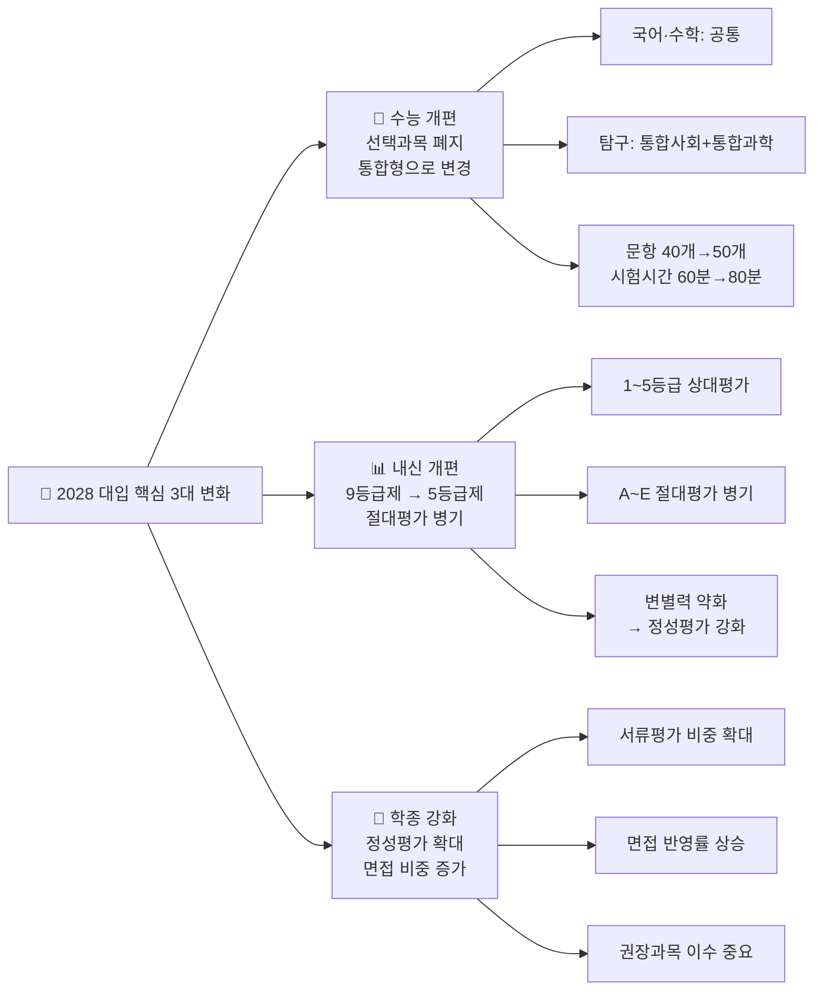

---

## 2. 수능 변화: 기존 vs 2028 완전 비교

### 📋 영역별 변화 비교표

| 영역 | 기존 수능 (2027까지) | 2028 수능 | 핵심 변화 포인트 |
|------|---------------------|-----------|----------------|
| **국어** | 공통 + 선택(언어와매체/화법과작문) | 공통만 (선택 없음) | 유불리 사라짐 |
| **수학** | 공통 + 선택(확통/미적분/기하) | 공통만 (미적분·기하 제외) | 수능 수학 범위 축소 |
| **영어** | 절대평가 | 절대평가 유지 | 변화 없음 |
| **탐구** | 사탐/과탐 각 선택 2과목 | 통합사회 + 통합과학 | 문항 40→50개, 시간 60→80분 |
| **한국사** | 절대평가 | 절대평가 유지 | 변화 없음 |
| **제2외국어** | 선택 | 선택 유지 | 변화 없음 |

### 📊 수능 변화 전·후 구조 비교

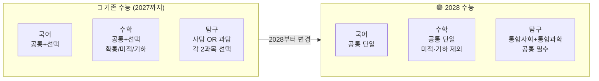

### 🔄 폐지 과목 목록

| 구분 | 폐지되는 선택과목 |
|------|----------------|
| **수학** | 미적분, 기하 (확률과통계만 공통 포함) |
| **사회탐구** | 생활과윤리, 윤리와사상, 한국지리, 세계지리, 동아시아사, 세계사, 정치와법, 경제, 사회문화 |
| **과학탐구** | 물리학Ⅰ·Ⅱ, 화학Ⅰ·Ⅱ, 생명과학Ⅰ·Ⅱ, 지구과학Ⅰ·Ⅱ |

### ⚠️ 수능 변화가 가져오는 결과

| 변화 | 이유 | 대학의 반응 |
|------|------|-----------|
| 수능 변별력 약화 | 범위 축소, 선택과목 폐지 | 수능 100% 전형 폐지 대학 증가 |
| 정시에서도 내신 반영 | 수능만으론 구별 어려움 | 서울대 교과평가 20%→40% |
| 면접·서류 강화 | 정량평가 한계 | 학종 비중 확대 |

---

## 3. 내신 변화: 9등급 → 5등급

### 📋 등급 체계 비교

| 구분 | 기존 (9등급제) | 2028 (5등급제) | 변화 의미 |
|------|---------------|---------------|---------|
| 등급 수 | 9단계 | 5단계 | 등급 구분 단순화 |
| 1등급 비율 | 상위 4% | 상위 10% | 1등급 받기 쉬워짐 |
| 평가 방식 | 상대평가만 | 상대(1~5) + 절대(A~E) | 이중 기재 |
| 변별력 | 높음 ✅ | 낮아짐 ⚠️ | 정성평가 강화 필요 |

### 📊 등급별 기준 상세

| 등급 | 절대평가 | 상위 누적% | 비고 |
|------|---------|-----------|------|
| **1등급** | A | ~ 10% | 상위 1/10 이내 |
| **2등급** | B | ~ 34% | 상위 1/3 이내 |
| **3등급** | C | ~ 66% | 중간 |
| **4등급** | D | ~ 90% | 하위권 |
| **5등급** | E | 90% 초과 | 최하위 |

### 🔄 내신 변화가 미치는 영향

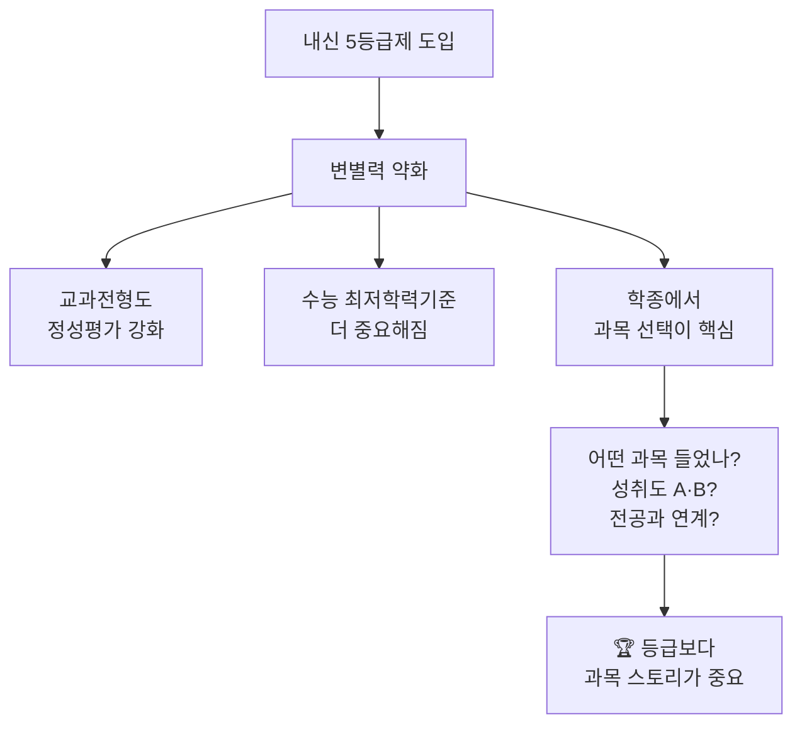

---

## 4. 전형별 비율 차트

### 4-1. 전국 수시 · 정시 비율 (현재 → 2028 예상)

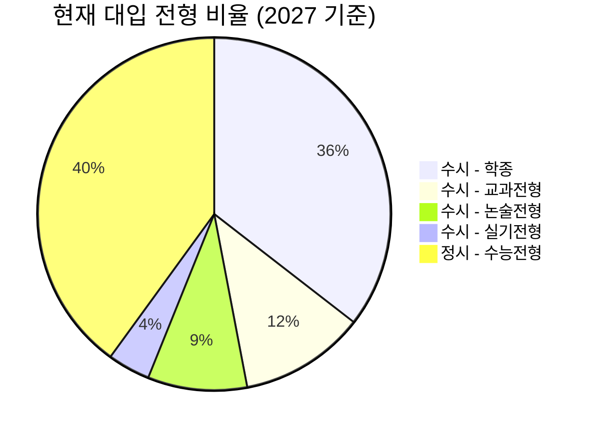

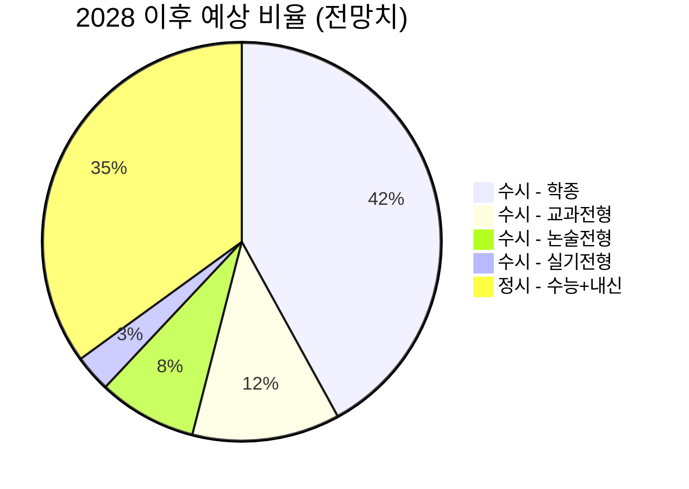

### 📋 수시/정시 비율 변화 비교표

| 전형 | 2027 (현재) | 2028 예상 | 방향 |
|------|------------|----------|------|
| **학종** | 35.5% | 42% ↑ | 가장 많이 늘어남 |
| **교과전형** | 11.5% | 12% → | 비슷하게 유지 |
| **논술전형** | 9.1% | 8% ↓ | 소폭 감소 |
| **실기전형** | 3.9% | 3% → | 비슷 |
| **정시** | 40% | 35% ↓ | 축소 예정 |

---

### 4-2. 주요 대학별 전형 비율 비교 (2028 예상)

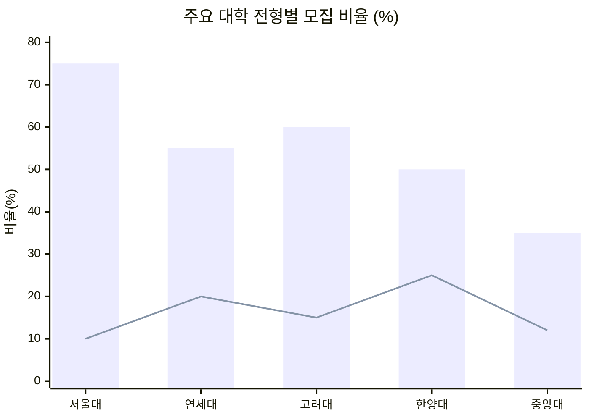

> 📌 막대(bar) = 학종 비율, 선(line) = 교과전형 비율 (예상치)

### 📋 대학별 전형 전략 비교표

| 대학 | 학종 | 교과 | 논술 | 정시 | 핵심 변화 |
|------|------|------|------|------|---------|
| **서울대** | ~75% | 없음 | 없음 | ~25% | 정시 교과평가 20%→**40%** |
| **연세대** | ~50% | 소수 | ~10% | ~40% | 학종 면접 강화 |
| **고려대** | ~55% | 소수 | 없음 | ~40% | 권장과목 이수 평가 |
| **한양대** | ~50% | 없음 | ~10% | ~40% | 면접 20%→**30%** |
| **중앙대** | 35.5% | 11.5% | 9.1% | ~44% | 논술 비율 높은 편 |

---

### 4-3. 학종 내부 평가 요소 비율

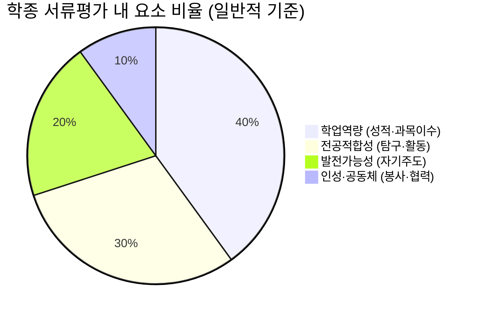

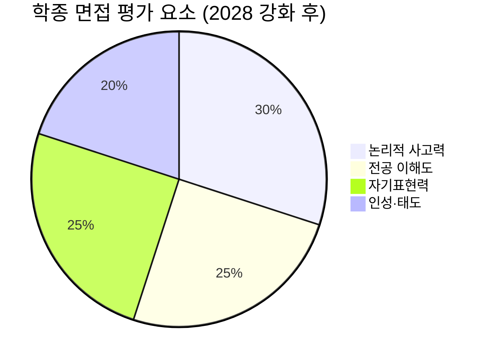

### 📋 전형별 평가 요소 비중 비교

| 평가 요소 | 학종 | 교과전형 | 논술전형 | 정시 |
|----------|------|---------|---------|------|
| **수능 점수** | 최저만 사용 | 최저만 사용 | 최저+일부 | ⭐⭐⭐⭐⭐ |
| **내신 등급** | 참고 | ⭐⭐⭐⭐⭐ | 참고 | 2028부터 반영 |
| **서류(학생부)** | ⭐⭐⭐⭐⭐ | 일부 | 없음 | 없음 |
| **면접** | ⭐⭐⭐⭐ | 없음 | 없음 | 없음 |
| **논술 시험** | 없음 | 없음 | ⭐⭐⭐⭐⭐ | 없음 |
| **과목 선택** | ⭐⭐⭐⭐ | ⭐⭐⭐ | 없음 | 없음 |

---

## 5. 학생부종합전형(학종) 심층 분석

> **학종 = 성적만이 아닌 '나'라는 사람 전체를 평가하는 전형**
> 비유: 학종은 "내 삶의 이야기 책"을 보여주는 것 📖

### 📋 학종 평가 요소별 변화 (기존 vs 2028)

| 평가 요소 | 기존 평가 방식 | 2028 이후 변화 | 학생 전략 |
|----------|-------------|--------------|---------|
| **학업역량** | 내신 등급 숫자 위주 | 과목 선택 + 성취도 A/B | 어려운 과목 도전 + A등급 |
| **전공적합성** | 비교과 활동 목록 | 권장과목 이수 여부 | 전공 관련 과목 필수 이수 |
| **발전가능성** | 수상실적 개수 | 탐구 과정과 성장 스토리 | 보고서·연구 기록 |
| **인성** | 봉사시간 수치 | 활동의 의미와 영향 | 지속적이고 진정성 있는 활동 |
| **면접** | 일부 대학만 | 대부분 대학으로 확대 | 말하기·논리력 훈련 필수 |

### 🎯 권장과목 이수 흐름도

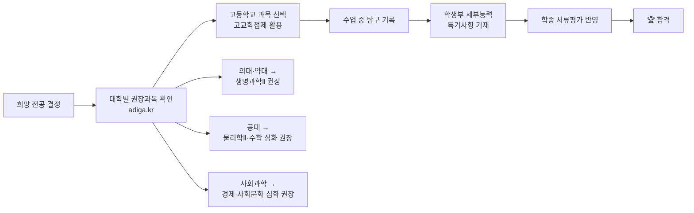

### 📋 주요 대학 면접 반영 비율 변화

| 대학 | 기존 면접 반영 | 2028 면접 반영 | 변화 | 면접 유형 |
|------|--------------|--------------|------|---------|
| **서울대** | 정시 교과 20% | 정시 교과 **40%** | +20%p ↑↑ | 구술면접 |
| **한양대 (면접형)** | 2단계 20% | 2단계 **30%** | +10%p ↑ | 인성면접 |
| **광운대** | 2단계 30% | 2단계 **40%** | +10%p ↑ | 서류기반 |
| **세종대** | 2단계 30% | 2단계 **40%** | +10%p ↑ | 인성면접 |

---

## 6. 전형별 완전 비교 (학종 vs 교과 vs 논술 vs 정시)

### 📋 4대 전형 핵심 비교표

| 비교 항목 | 🟦 학종 | 🟩 교과전형 | 🟨 논술전형 | 🟥 정시 |
|----------|--------|-----------|-----------|--------|
| **핵심 평가** | 학생부 서류 + 면접 | 내신 등급 | 논술 시험 점수 | 수능 점수 |
| **내신 중요도** | 참고 (과목 선택 중요) | ⭐⭐⭐⭐⭐ 최중요 | 낮음 | 2028부터 반영↑ |
| **수능 역할** | 최저학력기준 | 최저학력기준 | 최저학력기준 | ⭐⭐⭐⭐⭐ |
| **면접 여부** | 대부분 있음 | 없음 | 없음 | 없음 |
| **논술 여부** | 없음 | 없음 | ⭐⭐⭐⭐⭐ | 없음 |
| **준비 기간** | 고1~고3 3년 | 고1~고3 내신 관리 | 고2~고3 논술 준비 | 고3 집중 가능 |
| **강점 학생** | 탐구·발표 잘함 | 내신 최상위 | 글쓰기·논리 강함 | 수능 압도적 |
| **약점 학생** | 내신만 높음 | 활동 다양함 | 내신 낮음 | 내신 낮음 |
| **경쟁률** | 높음 (20~100:1) | 중간 (10~30:1) | 매우 높음 (50~200:1) | 중간 (3~10:1) |

### 📊 학생 유형별 추천 전형

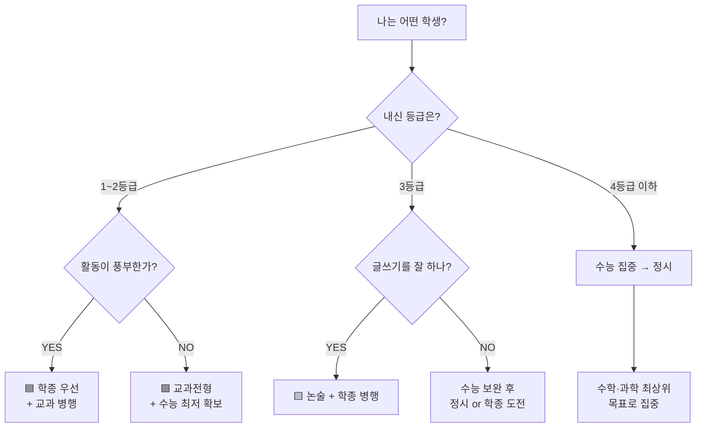

### 📋 전형별 수능 최저학력기준 (주요 대학 기준)

| 전형 | 수능 최저 기준 (예시) | 영향력 |
|------|-------------------|------|
| **학종** | 2~3개 합 7 이내 (대학별 상이) | 최저 못 맞추면 탈락 |
| **교과전형** | 2~3개 합 5~6 이내 | 최저 기준 더 높음 |
| **논술전형** | 2개 합 5~6 이내 | 최저 맞추면 논술로 역전 가능 |
| **정시** | 없음 | 수능 점수 자체가 당락 결정 |

---

## 7. 학년별 대비 로드맵 (중3 ~ 고3)

### 🗺️ 전체 로드맵 흐름도

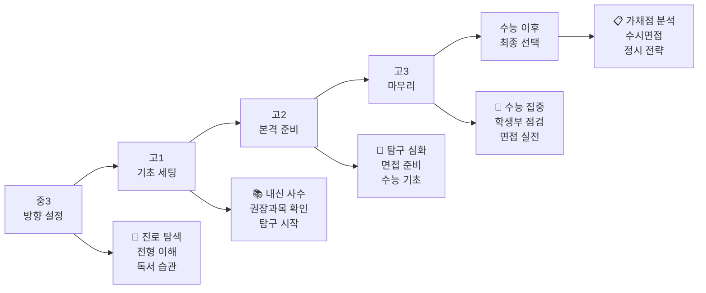

---

### 7-1. 중3: 방향 설정기 (지금 이 시점!)

> 비유: 여행을 떠나기 전 지도를 보는 단계 🗺️

| 시기 | 할 일 | 이유 |
|------|-------|------|
| **중3 1학기** | 고등학교 선택 (일반고/특목고/자사고) | 학교 유형이 전형 전략에 영향 |
| **중3 1학기** | 희망 전공 분야 탐색 (넓게) | 권장과목 선택의 출발점 |
| **중3 여름방학** | 독서 습관 형성 (월 2~3권) | 학종 독서 기록, 논술 기초 |
| **중3 2학기** | 입시 전형 구조 이해 (학종/교과/논술/정시) | 전략 없이 고등학교 입학 시 손해 |
| **중3 2학기** | 수학 선행 점검 (중등 수학 완성) | 고1 내신 1등급의 기초 |

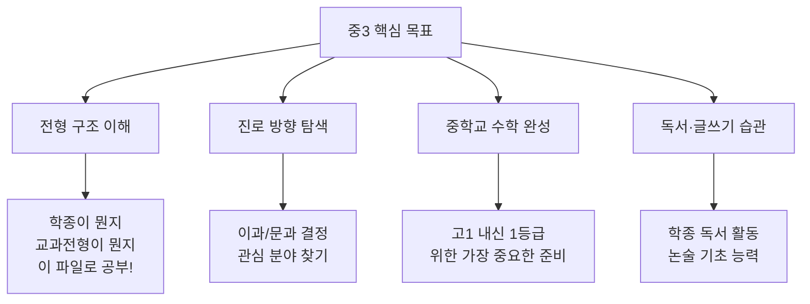

---

### 7-2. 고1: 기초 세팅기

> 비유: 집을 짓기 전 튼튼한 기초 공사를 하는 단계 🏗️

| 시기 | 할 일 | 중요도 |
|------|-------|--------|
| **고1 입학 전** | 권장과목 목록 확인 (adiga.kr) | ⭐⭐⭐⭐⭐ |
| **고1 1학기** | 내신 1~2등급 사수 (모든 과목) | ⭐⭐⭐⭐⭐ |
| **고1 1학기** | 고교학점제 과목 선택 전략 수립 | ⭐⭐⭐⭐⭐ |
| **고1 여름방학** | 탐구 주제 찾기 (관심 분야 조사) | ⭐⭐⭐⭐ |
| **고1 2학기** | 동아리·교과 활동 시작 | ⭐⭐⭐⭐ |
| **고1 2학기** | 독서 기록 꾸준히 유지 | ⭐⭐⭐ |

### 📋 고1 과목 선택 전략 (고교학점제)

| 전공 방향 | 필수 이수 권장 과목 | 피하면 안 되는 과목 |
|---------|-----------------|----------------|
| **의대·약대** | 생명과학Ⅱ, 화학Ⅱ | 수학 공통 완벽 이해 |
| **공대·이공계** | 물리학Ⅱ, 수학Ⅱ·미적분 | 과학 심화 과목 |
| **경영·경제** | 경제, 수학 심화 | 통합사회 성취도 A |
| **사회과학** | 사회·문화, 법과정치 | 글쓰기·논술 능력 |
| **교육·인문** | 심리학, 윤리와사상 | 독서·탐구 기록 |

---

### 7-3. 고2: 본격 준비기

> 비유: 건물 골조를 올리는 단계 — 가장 바쁘고 중요한 시기 🔨

| 시기 | 할 일 | 중요도 |
|------|-------|--------|
| **고2 1학기** | 권장과목 이수 시작 (전공 심화) | ⭐⭐⭐⭐⭐ |
| **고2 1학기** | 탐구보고서 1~2개 완성 | ⭐⭐⭐⭐⭐ |
| **고2 여름방학** | 수능 기초 (수학·영어·국어) 점검 | ⭐⭐⭐⭐⭐ |
| **고2 2학기** | 모의면접 연습 시작 | ⭐⭐⭐⭐ |
| **고2 2학기** | 논술 준비 (논술전형 고려 시) | ⭐⭐⭐⭐ |
| **고2 겨울방학** | 지원 대학·전형 리스트 작성 | ⭐⭐⭐⭐ |

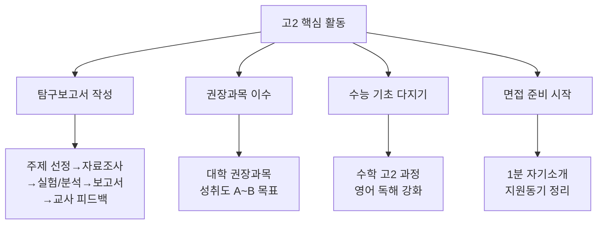

### 📋 고2 탐구보고서 작성 가이드

| 단계 | 내용 | 기간 |
|------|------|------|
| 1. 주제 선정 | 전공 관심 분야 + 수업 연계 | 2주 |
| 2. 자료 조사 | 논문·책·뉴스 읽고 정리 | 3주 |
| 3. 탐구/실험 | 직접 조사·실험·인터뷰 | 4주 |
| 4. 보고서 작성 | A4 3~5페이지 분량 | 2주 |
| 5. 교사 피드백 | 담당 선생님께 첨삭 요청 | 1주 |

---

### 7-4. 고3: 마무리 전략기

> 비유: 인테리어와 최종 점검 단계 — 빈틈없이 채우기 🏠✨

| 시기 | 할 일 | 중요도 |
|------|-------|--------|
| **고3 1학기** | 수능 수학·국어 집중 (최저 확보) | ⭐⭐⭐⭐⭐ |
| **고3 1학기** | 학생부 마지막 활동 기록 완성 | ⭐⭐⭐⭐⭐ |
| **고3 1학기** | 지원 대학 최종 결정 (6~9개교) | ⭐⭐⭐⭐⭐ |
| **고3 여름방학** | 수능 실전 모의고사 주 1회 | ⭐⭐⭐⭐⭐ |
| **고3 여름방학** | 자기소개서 초안 작성 (학종 해당) | ⭐⭐⭐⭐⭐ |
| **고3 8~9월** | 수시 원서 접수 (최대 6개교) | ⭐⭐⭐⭐⭐ |
| **고3 10~11월** | 면접 실전 연습 (주 3회 이상) | ⭐⭐⭐⭐⭐ |
| **고3 11월** | 수능 시험 | 🎯 All-in |

### 📋 고3 수시 원서 배분 전략 (6개교 기준)

| 분류 | 추천 개수 | 전략 |
|------|---------|------|
| **상향 지원** | 1~2개 | 도전! 합격하면 대박 |
| **적정 지원** | 2~3개 | 현실적인 내 수준 |
| **안정 지원** | 1~2개 | 반드시 합격해야 하는 곳 |

---

## 8. 수능 이후 ~ 최종 합격 타임라인

### 📅 수능 이후 입시 흐름도

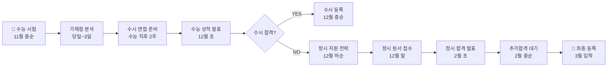

### 📋 수능 이후 단계별 체크리스트

| 단계 | 시기 | 할 일 | 주의사항 |
|------|------|-------|---------|
| ① 가채점 | 수능 당일 | 예상 점수 계산, 수시 포기 여부 판단 | 오차 발생 가능, 섣부른 결정 금지 |
| ② 수시 면접 | 수능 후 1~2주 | 수시 최선 다하기 | 수능 성적 발표 전이므로 포기 금물 |
| ③ 성적 확인 | 12월 초 | 실제 등급·표준점수 확인 | 전년도 합격선과 비교 |
| ④ 수시 등록 | 12월 중순 | 합격 시 반드시 등록 | 등록 안 하면 자동 포기 |
| ⑤ 정시 전략 | 12월 하순 | 가·나·다군 배분 | 군별 중복 지원 불가 |
| ⑥ 추가합격 | 2월 | 포기자 발생 시 연락 | 연락처 항상 확인 |

### 📋 정시 가·나·다군 전략

| 군 | 특징 | 추천 전략 |
|----|------|---------|
| **가군** | 서울대, 일부 상위권 대학 | 상향 or 적정 지원 |
| **나군** | 연세대, 고려대, 성균관대 등 | 적정 지원 |
| **다군** | 한양대, 중앙대, 이화여대 등 | 안정 지원 |

---

## 9. AI 시대의 입시 변화 예측

> ⚠️ 아래 내용은 현재 교육부 발표 + 전문가 예측을 종합한 내용입니다

### 📊 AI 시대 입시 평가 변화 예측표

| 평가 항목 | 현재 (2026) | 5년 후 예측 (2031) | 학생 대응 전략 |
|----------|------------|------------------|--------------|
| **내신 시험** | 선다형 + 서술형 | 서술·논술형 비중 증가 | 글쓰기 능력 키우기 |
| **수행평가** | 과제 제출 위주 | 과정 중심 평가 강화 | 과정 기록 습관화 |
| **학종 서류평가** | 입학사정관 전체 검토 | AI 1차 분류 + 인간 정성평가 | 진정성 있는 활동 기록 |
| **면접** | 일부 대학 | 대부분 대학 필수화 | 말하기·논리력 훈련 |
| **포트폴리오** | 일부 예체능 | 전 계열 확산 가능 | 나만의 탐구 기록 축적 |
| **AI 활용 평가** | 없음 | AI 글쓰기 판별 강화 | 자신만의 언어로 작성 |

### 🤖 AI 도입 후 입시 흐름 예측

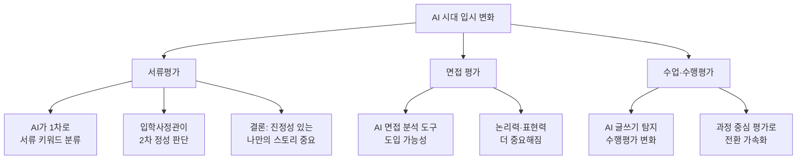

### 💡 AI 시대에 살아남는 학생 스펙

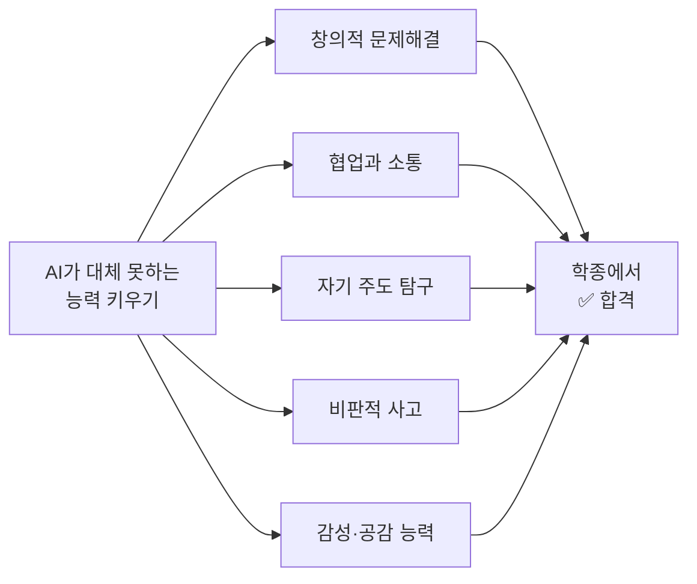

---

## 10. 나에게 맞는 전략 선택법

### 📋 학생 유형별 추천 전략 한눈에 보기

| 학생 유형 | 내신 | 수능 | 활동 | 1순위 전형 | 2순위 전형 | 핵심 포인트 |
|---------|------|------|------|----------|----------|-----------|
| **올라운더형** | 1~2등급 | 강함 | 풍부 | 학종 | 교과 | 면접 집중 준비 |
| **내신형** | 1~2등급 | 보통 | 보통 | 교과전형 | 학종 | 수능 최저 확보 |
| **수능형** | 3등급↓ | 매우 강함 | 보통 | 정시 | 논술 | 수학·과학 집중 |
| **논술형** | 3등급 | 보통 | 보통 | 논술 | 정시 | 글쓰기 집중 훈련 |
| **탐구형** | 2~3등급 | 보통 | 매우 풍부 | 학종 | 논술 | 스토리 완성 |
| **역전형** | 3등급↓ | 보통 | 보통 | 수능 보강 | 논술 도전 | 고2 겨울부터 집중 |

### 🔄 최종 전략 선택 순서도

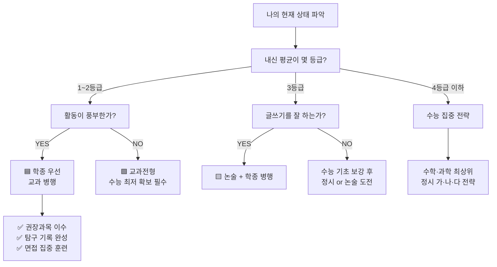

---

## 📌 총정리: 2028 입시 핵심 요약

### ✅ 반드시 알아야 할 3가지

> 1. **수능**은 선택과목이 사라지고 통합형으로 바뀐다 → 수학·과학이 더 중요해진다
> 2. **내신**은 5등급제로 변별력이 줄어든다 → 등급보다 어떤 과목 들었는지가 중요해진다
> 3. **학종**이 가장 강화된다 → 성적이 아닌 나만의 탐구 스토리와 면접이 핵심이다

### 📋 전형별 핵심 한 줄 요약

| 전형 | 한 줄 요약 |
|------|---------|
| **학종** | "나는 이런 사람입니다"를 학생부로 보여주는 전형 |
| **교과전형** | "내신 최상위 + 수능 최저" 두 가지 모두 잡아야 하는 전형 |
| **논술전형** | "내신이 약해도 논술로 역전" 가능한 틈새 전형 |
| **정시** | "수능 하나로 승부" 단순하지만 가장 치열한 전형 |

---

## 🔗 참고 출처

- [교육부 2028 대입 개편 확정안 공식 발표](https://www.korea.kr/briefing/policyBriefingView.do?newsId=156607888)
- [나무위키: 2028 대학입시제도 개편](https://namu.wiki/w/2028%20%EB%8C%80%ED%95%99%EC%9E%85%EC%8B%9C%EC%A0%9C%EB%8F%84%20%EA%B0%9C%ED%8E%B8)
- [베리타스알파: 상위15개대 정성평가 강화](http://www.veritas-a.com/news/articleView.html?idxno=562665)
- [교육을비추다: 2028 대입 지각변동](https://www.kyobit.com/news/articleView.html?idxno=2046)
- [에듀인사이트: 2028 정시 축소 수시 전략](https://exitbasic.com/2028-%EC%A0%95%EC%8B%9C-%EC%B6%95%EC%86%8C-%EC%88%98%EC%8B%9C-%EC%A0%84%EB%9E%B5-%EB%8C%80%EC%9E%85-%EB%B3%80%ED%99%94-sky-%EC%A4%91%EC%8B%AC-%ED%95%99%EC%A2%85-%ED%99%95%EB%8C%80-%EA%B0%80%EB%8A%A5/)
- [산에듀: 선택과목 사라지는 2028 수능](https://sanedu.com/%EC%84%A0%ED%83%9D%EA%B3%BC%EB%AA%A9-%EC%82%AC%EB%9D%BC%EC%A7%80%EB%8A%94-2028%ED%95%99%EB%85%84-%EC%88%98%EB%8A%A5-%ED%83%90%EA%B5%AC%EC%98%81%EC%97%AD-%EB%AC%B8%ED%95%AD-40%EA%B0%9C%E2%86%9250/)
- [진학사: 2028학년도 대입 변화](https://www.jinhak.com/jh/high12/univ-entrance-info/ipsi-strategy/100000094)
- [메가스터디: 서울대 2028 대입 핵심](https://mcc.megastudy.net/exam/report_view.asp?code=26424)
- [베리타스알파: 2027 전형계획 정시 학생부 반영](http://www.veritas-a.com/news/articleView.html?idxno=552184)

---
*📝 본 자료는 2026년 4월 기준 공개된 교육부 발표 및 입시 전문 기관 분석을 바탕으로 작성되었습니다.*
*AI 평가 도입 등 일부 내용은 예측 및 트렌드 분석 내용이 포함되어 있습니다.*
