# 🤖 AI 메이커 프로젝트 학종 전략
## 은물 → 메이커 → AI 기업가 사고까지: 유아~고등 완전 로드맵

> 작성일: 2026년 4월
> 핵심 메시지: **"AI 에이전트가 단순 업무를 대체하는 시대, 학생에게 필요한 것은 기획·관리·창조하는 기업가적 사고입니다."**

---

## 📌 목차

```
AI 메이커 프로젝트 학종 전략
│
├── [필요성] 0. 왜 지금 메이커 + AI인가? (긴급한 이유)
├── [필요성] 0-1. 우리 아이에게 무슨 일이 벌어지고 있는가?
├── [필요성] 0-2. 대학과 기업이 원하는 인재가 바뀌었다
│
├── 1. 핵심 개념: 은물 → 메이커 → AI 기업가의 연결고리
├── 2. 메이커 교육 철학과 학종 연결
├── 3. AI 도구 활용 단계 (얕게→깊게)
│
├── ★ 단계별 메이커 로드맵 ★
│   ├── 4.  🌱 유아기 (5~7세): 은물·놀이·메이커의 씨앗
│   ├── 5.  🐣 초1·2 (7~8세): 손으로 만드는 탐구
│   ├── 6.  📦 초3·4 (9~10세): 첫 메이커 프로젝트
│   ├── 7.  🔬 초5·6 (11~12세): AI 도구 입문 + 첫 작품 출품
│   ├── 8.  🌿 중1·2 (13~14세): AI 활용 심화 프로젝트
│   ├── 9.  🎯 중3 (15세): 메이커페어 도전 + 학종 연결
│   ├── 10. 🏗️ 고1 (16세): 바이브 AI 도구로 서비스 제작
│   ├── 11. 🔨 고2 (17세): 창업형 탐구보고서 완성
│   └── 12. 💪 고3 (18세): 포트폴리오 완성 + 면접 스토리
│
├── 13. 메이커페어 참가 완전 가이드
├── 14. 단계별 AI 도구 가이드 (실전 사용법 포함)
├── 15. 학종 연결 전략 (세특·보고서·면접 실전 예시)
└── 16. 학부모 메이커 지원 가이드
```

---

# 🚨 [필요성] 왜 지금 당장 시작해야 하는가?

---

## 0. 왜 지금 메이커 + AI인가? (긴급한 이유)

### 🌐 지금 세상에서 실제로 벌어지고 있는 일

> **비유**: 기차역에서 기차가 출발하고 있습니다. 지금 탑승하지 않으면 다음 기차는 훨씬 오래 기다려야 합니다.

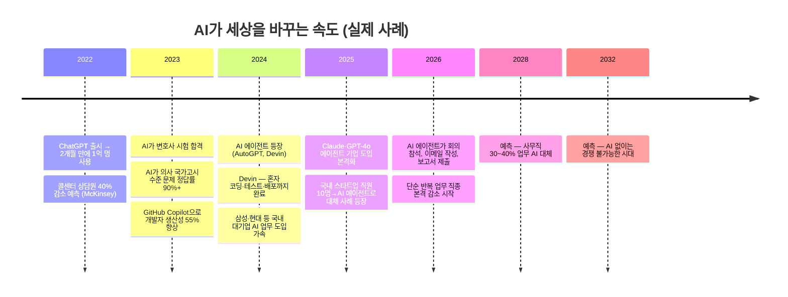

---

### 📋 실제로 AI가 대체하는 직업 vs 살아남는 직업

| 구분 | 사라지고 있는 직업 | 살아남고 성장하는 직업 |
|------|-------------|----------------|
| **특징** | 정해진 일을 반복, 정보 처리 | 새로운 문제 발견, 창조, 관리 |
| **사례** | 데이터 입력원, 콜센터 상담원, 기초 번역가, 단순 회계사, 정형화된 기사 작성 | 기획자, 창업가, AI 관리자, 복잡한 문제 해결사, 창작자 |
| **현재 상황** | 이미 감소 시작 (2023~2026) | 오히려 연봉·수요 상승 |
| **우리 아이가 취업할 때** | 2032~2040년 | 이 역량이 없으면 취업 불가 |

> 💡 **핵심**: 지금 초등학생인 아이들이 대학을 졸업하는 2040년에는, AI가 못 하는 일을 할 수 있어야 합니다.

---

### 📊 AI 에이전트란 무엇인가? (쉬운 설명)

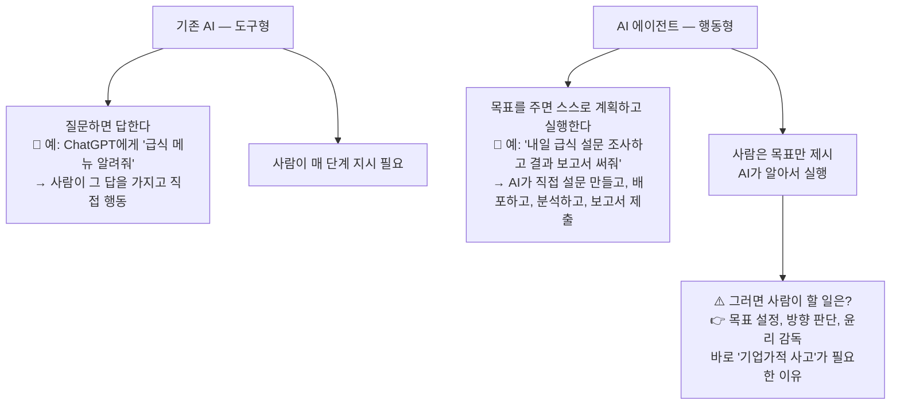

---

### 🔴 지금 아이에게 이것을 안 가르치면 어떻게 되나?

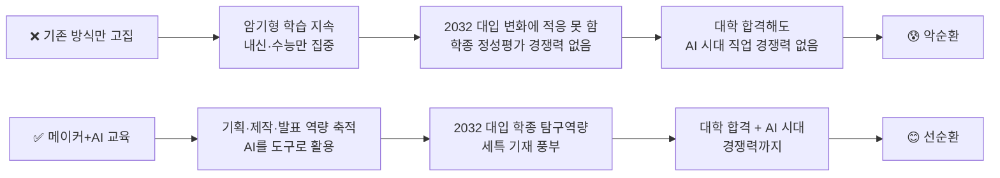

---

## 0-1. 우리 아이에게 무슨 일이 벌어지고 있는가?

### 📌 지금 초등학생 아이, 대학 갈 때 세상이 어떻게 바뀌나?

| 현재 나이 | 대학 입학 연도 | 그 시대 AI 상황 | 필요한 역량 |
|--------|-----------|------------|---------|
| **7세 (초1)** | 2036년 | AI가 대부분 사무직 업무 담당 | 창조·기획·감독 |
| **10세 (초4)** | 2033년 | AI 에이전트가 팀원처럼 일함 | 프로젝트 관리·메이커 |
| **13세 (중1)** | 2030년 | 대기업 신입 채용에 AI 역량 필수 | AI 활용 + 기획력 |
| **16세 (고1)** | 2027년 | 이미 AI 없이 업무 불가한 분야 多 | 지금 당장 배워야 |

> 🚨 **긴급 메시지**: 지금 7살이라면 2036년에 대학에 갑니다. 그 세상은 지금과 완전히 다릅니다. 유치원 때 은물로 만들기를 즐기는 것이 그 아이의 미래를 바꿉니다.

---

### 💡 실전 사례: 메이커 교육이 학종·취업으로 이어진 실제 이야기

#### 📖 사례 1: 초4부터 시작한 환경 프로젝트 → SKY 합격

```
📌 학생 A (가상 사례, 실제 패턴 기반)

초4: 학교 앞 분리수거함이 지저분하다는 걸 발견
     → 박스로 새 분리수거함 모형 제작 (첫 메이커 프로젝트)

초6: AI 도구로 환경 데이터 조사 탐구보고서 작성
     → 교내 과학전람회 출품

중2: 지역 환경 오염 데이터 수집 앱 직접 제작 (Glide 활용)
     → 메이커페어 서울 출품 → 특별상 수상

중3: AI로 분석한 우리 동네 미세먼지 데이터 탐구보고서
     → 세특 기재: "환경공학적 사고력과 AI 활용 데이터 분석 역량 탁월"

고1~2: 학교 주변 환경 모니터링 서비스 개발 (Bolt.new + Python)
      → 실제 지역사회 활용 → 환경부 공모전 수상

고3 면접: "초4부터 10년 동안 환경 문제를 탐구해온 스토리"
         → 연세대 환경공학과 합격
```

#### 📖 사례 2: 바이브 코딩으로 앱 만든 고1 → 학종 역전

```
📌 학생 B (가상 사례, 실제 패턴 기반)

내신: 3~4등급 (수능형 공부 약함)
강점: 아이디어 풍부, AI 도구 능숙

고1 3월: Bolt.new로 "학교 급식 평점 앱" 제작 (2주 소요)
         → 전교생 200명 사용 → 실제 데이터 수집
고1 7월: 급식 데이터 분석 탐구보고서 완성
         → 세특 기재: "실제 서비스를 기획·개발하고 사용자 피드백을 분석하는
                      기업가적 사고력과 데이터 리터러시가 탁월함"
고2: 메이커페어 서울 출품 → 관람객 1,000명 이상 체험
    창업형 탐구보고서: "교내 급식 만족도와 학생 건강의 상관관계 연구"

고3 학종 면접 질문: "학교 앱을 만들게 된 계기는?"
                  → 2년간의 스토리로 20분 답변 가능
                  → 고려대 경영학과 합격 (내신 역전)
```

---

## 0-2. 대학과 기업이 원하는 인재가 바뀌었다

### 📊 2028~2032 대입, 대학이 실제로 보는 것

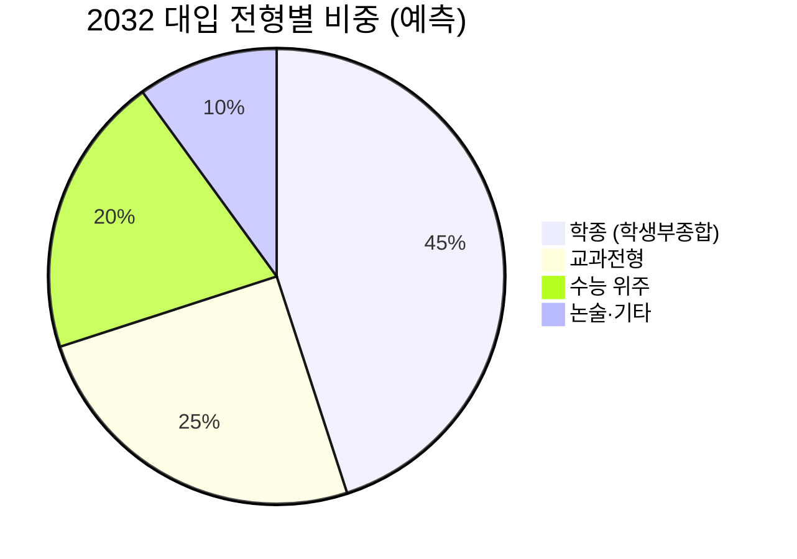

### 📋 SKY 대학이 학종에서 실제로 보는 것 (공개 자료 기반)

| 대학 | 발표한 인재상 | 메이커 활동 연결 |
|------|-----------|-------------|
| **서울대** | "학문적 호기심, 자기주도 탐구, 사회 기여 의지" | 탐구보고서 + 사회 문제 해결 프로젝트 |
| **연세대** | "창의적 사고, 글로벌 리더십, 협력 능력" | AI 메이커 팀 프로젝트 + 발표 경험 |
| **고려대** | "도전 정신, 실천적 리더십, 전공 적합성" | 메이커페어 출품 + 창업형 탐구 |
| **KAIST** | "수학·과학 심화 탐구, 문제해결력, 협업" | AI 개발 프로젝트 + 논문 수준 보고서 |

> ✅ **공통점**: 모두 "무언가를 직접 만들고 해결한 경험"을 원합니다. 시험 점수가 아닙니다.

---

### 📊 학종 합격자와 불합격자의 차이 (실전 분석)

```mermaid
graph LR
    A[같은 내신 3등급] --> B[❌ 불합격 패턴]
    A --> C[✅ 합격 패턴]

    B --> B1[수상 경력: 교내 수학경시대회]
    B --> B2[탐구: 교과서 수준의 탐구보고서]
    B --> B3[세특: '수업에 열심히 참여함']
    B --> B4[면접: "의사가 꿈이라 공부 열심히 했어요"]

    C --> C1[수상: 메이커페어 특별상, 환경부 공모전 장려상]
    C --> C2[탐구: AI로 실제 데이터 분석 + 실생활 해결]
    C --> C3[세특: '사회 문제를 발견하고 AI 도구로 앱을 직접 개발하여 300명에게 배포']
    C --> C4[면접: "초4부터 환경 문제를 탐구해온 10년의 스토리"]
```

---

# 1. 핵심 개념: 은물 → 메이커 → AI 기업가의 연결고리

## 🎁 프뢰벨의 은물(恩物)이란?

> **비유**: 은물은 19세기판 LEGO + STEAM 교육입니다.
> 프뢰벨(Friedrich Froebel)이 1837년에 만든 세계 최초의 체계적 교육 교구로,
> "놀이가 곧 배움"이라는 철학을 담고 있습니다.

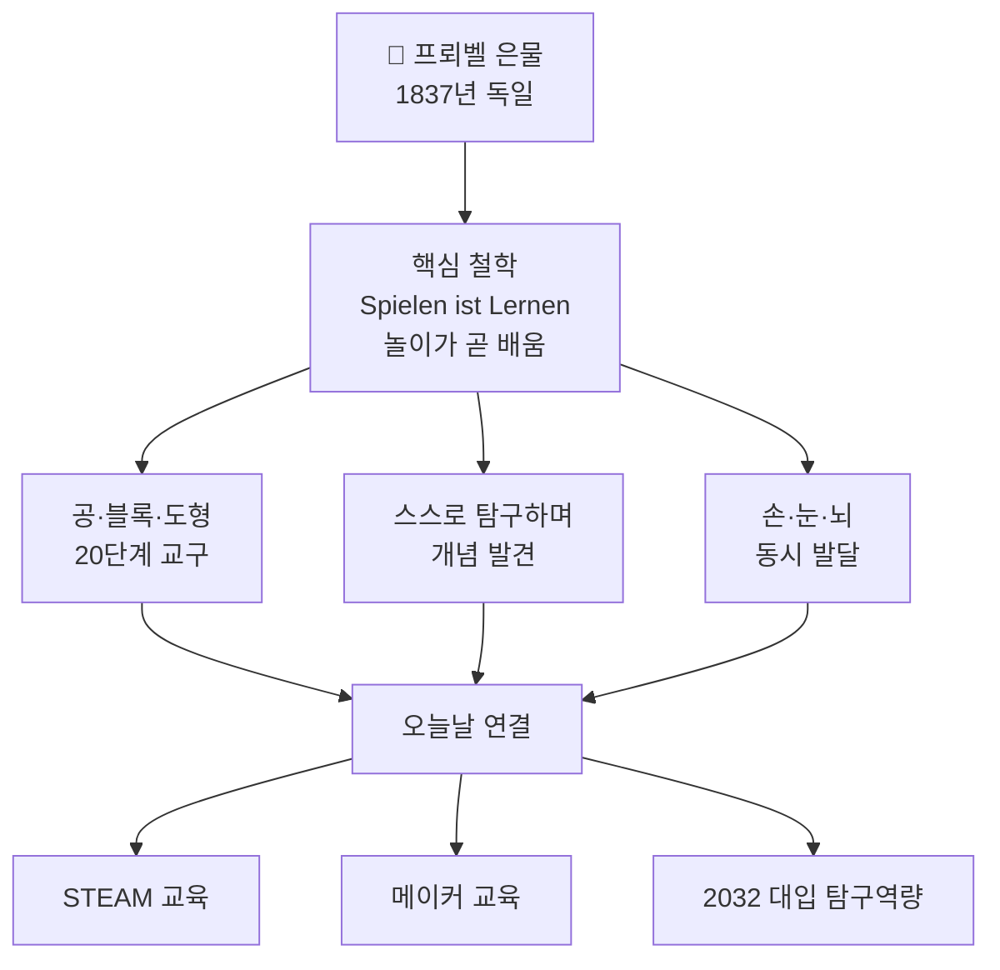

---

### 📋 은물 단계별 역량 연결표 (실전 활용)

| 은물 단계 | 교구 형태 | 실제 활동 예시 | 키우는 역량 | 2032 대입 연결 |
|---------|---------|------------|---------|-----------|
| **1단계** | 색깔 공 6개 | 공 던지고 색 구별하기 | 감각·색·형태 인식 | 관찰력·표현력 |
| **2단계** | 구·원기둥·육면체 | 굴리기·쌓기·비교 | 입체 감각, 수학적 사고 | 공간사고·수학 |
| **3~6단계** | 나무 블록 세트 | 건물·다리·패턴 만들기 | 구조·패턴·설계 이해 | 공학적 사고 |
| **7~10단계** | 평면 도형 | 퍼즐·대칭·무늬 만들기 | 면·선·점, 비율 이해 | 디자인·설계 역량 |
| **11~20단계** | 점토·종이·자연재료 | 자유롭게 만들고 표현 | 창작·표현·예술 | 메이커 역량 |

---

### 🔗 은물 → 메이커 → AI 기업가: 역량 계승 흐름

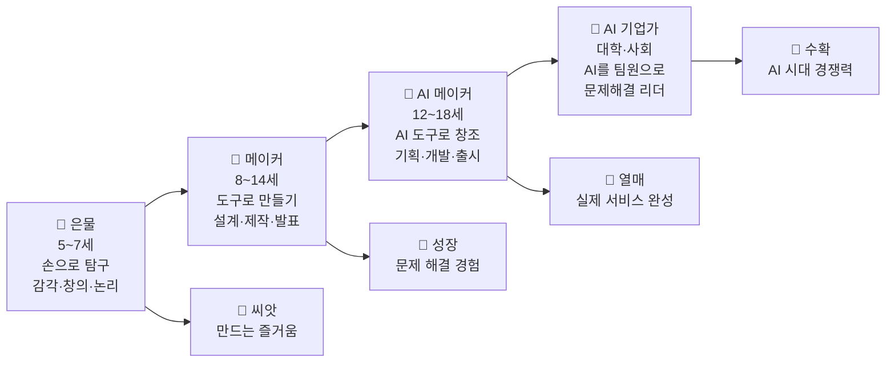

---

### 💡 실전 비유: 은물이 어떻게 AI 기업가로 이어지나?

```
📌 상상해보세요:

6살 민준이가 은물 블록으로 탑을 쌓다가 자꾸 무너집니다.
→ "왜 무너지지?" (문제 발견)
→ 밑을 더 넓게 만들어봅니다. (가설과 실험)
→ 성공! "넓으면 안 무너지는구나!" (결론)

이 경험이 13년 후,
고2 민준이가 "건물 안전 모니터링 AI 앱"을 만드는 씨앗이 됩니다.
→ "왜 건물이 무너지지?" (문제 발견 — 은물에서 시작)
→ 센서 데이터 + AI 분석으로 해결책 설계 (가설)
→ Bolt.new로 앱 제작, 실제 테스트 (실험·실행)
→ 탐구보고서 + 메이커페어 출품 (결론 공유)

🎯 6살의 블록 놀이가 19살의 학종 면접 스토리가 됩니다.
```

---

# 2. 메이커 교육 철학과 학종 연결

## 📚 메이커 교육의 핵심 원칙 (3M)

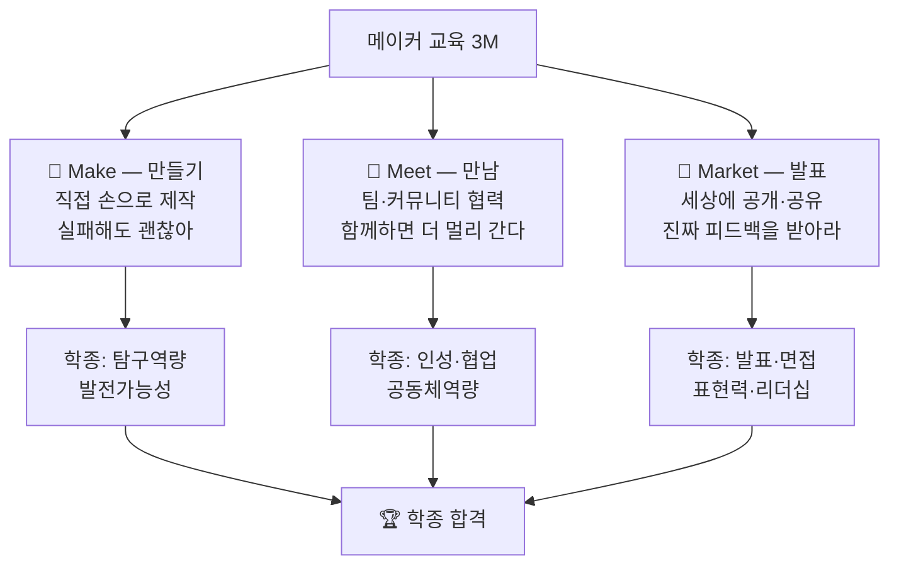

---

### 📋 메이커 교육 vs 기존 교육 비교 (상세)

| 비교 항목 | 기존 교육 | 메이커 교육 | AI 시대 더 필요한 것 |
|---------|---------|-----------|--------------|
| **학습 주체** | 교사가 가르침 | 학생이 만들고 발견 | 메이커 ✅ |
| **목표** | 정답 찾기 | 문제 해결하기 | 메이커 ✅ |
| **평가** | 시험 점수 | 완성된 작품·과정 | 메이커 ✅ |
| **실패의 의미** | 나쁜 것, 피해야 할 것 | 배움의 기회, 다시 도전 | 메이커 ✅ |
| **결과물** | 보고서·답안지 | 제품·서비스·작품 | 메이커 ✅ |
| **협력** | 개인 경쟁 | 팀 협업 | 메이커 ✅ |
| **AI 관계** | AI가 이 방식을 대체함 | AI가 도와줌 | 메이커 ✅ |
| **학종 연결** | 내신 등급 | 탐구보고서 + 세특 기록 | 메이커 ✅ |

---

### 📊 메이커 프로젝트 → 학종 세특 연결 흐름

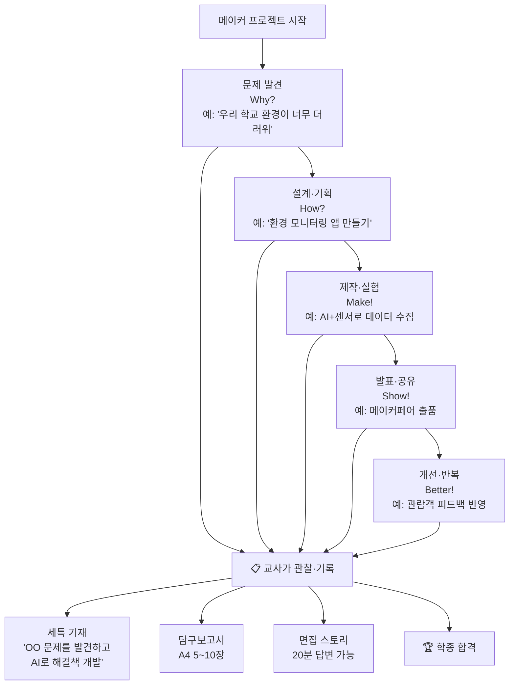

---

# 3. AI 도구 활용 단계: 얕게 → 깊게

## 📊 단계별 AI 도구 활용 레벨

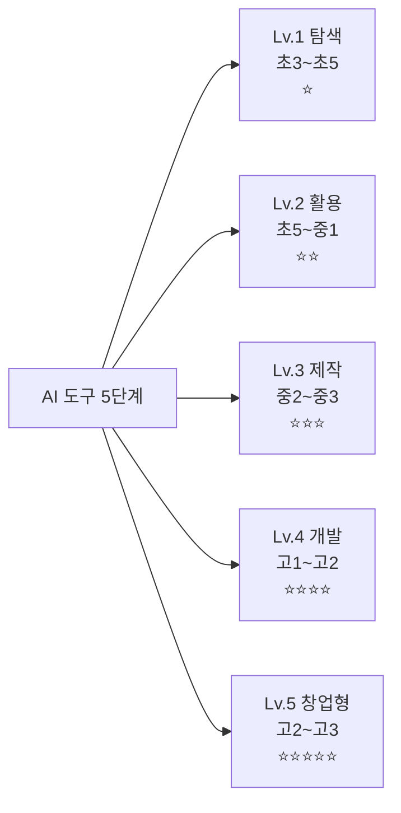

---

### 📋 단계별 추천 AI 도구 상세표 (실전 사용법 포함)

| 레벨 | 대상 | 주요 도구 | 실전 사용 예시 | 주의사항 |
|------|------|---------|------------|--------|
| **Lv.1** | 초3~5 | ChatGPT, 뤼튼 | "광합성에 대해 쉽게 설명해줘" 입력 후 탐구보고서 참고자료로 활용 | AI 답변 그대로 복사 ❌ |
| **Lv.2** | 초5~중1 | Canva AI, Gamma | Gamma에서 "환경오염 탐구 발표자료 5장" 자동 생성 후 내용 직접 수정 | 내용은 반드시 직접 확인 |
| **Lv.3** | 중2~3 | Glide, Bubble, Make | Glide에서 구글 시트 연결해 학교 도서 추천 앱 30분 만에 완성 | 개인정보 포함 주의 |
| **Lv.4** | 고1~2 | Cursor, v0.dev, Bolt.new | Bolt.new에 "급식 평점 웹앱 만들어줘" 입력 → 코드 자동 생성 → Vercel 배포 | 코드 내용 이해 필수 |
| **Lv.5** | 고2~3 | Claude, Cursor, Supabase | Claude로 복잡한 기능 구현, Supabase 데이터베이스 연결, 실제 서비스 출시 | 저작권·보안 검토 |

---

## 💡 바이브 코딩(Vibe Coding)이란? (쉬운 설명)

> **비유**: 요리를 몰라도 레시피 앱에 "오늘 냉장고에 있는 재료로 저녁 메뉴 추천해줘"라고 하면
> 앱이 메뉴를 추천해주는 것처럼, 코딩을 몰라도 "이런 앱 만들어줘"라고 하면
> AI가 코드를 짜주는 것이 바이브 코딩입니다.

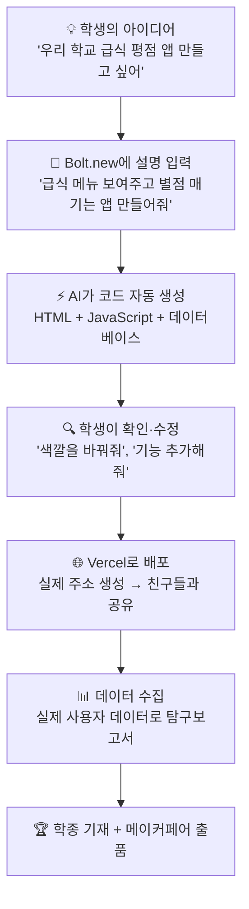

### 📌 실전 바이브 코딩 대화 예시 (Bolt.new)

```
📱 실제 입력 예시:

학생 입력: "고등학생이 급식 메뉴에 별점(1~5점)을 줄 수 있고,
            오늘 평균 별점이 보이는 웹앱을 만들어줘.
            디자인은 깔끔하게 흰색 배경에 파란색 버튼으로 해줘."

→ Bolt.new가 30초 안에 완성된 앱 코드 생성
→ 바로 미리보기 가능
→ 원하는 대로 추가 수정 요청 가능

추가 입력: "메뉴 이름을 입력할 수 있는 칸도 추가해줘"
→ 즉시 반영

📌 소요 시간: 아이디어 → 작동하는 앱 완성까지 약 2시간
📌 필요한 능력: 코딩 ❌ / 아이디어 + AI 대화 능력 ✅
```

---

# ★ 단계별 메이커 로드맵 ★

---

## 4. 🌱 유아기 (5~7세): 은물·놀이·메이커의 씨앗

> **핵심 철학**: 만드는 즐거움이 기업가 정신의 첫 씨앗입니다.
> **비유**: 레고 한 조각이 훗날 앱 하나를 만드는 손의 시작입니다. 🧱

---

### 💡 이 시기가 왜 중요한가? (필요성 강조)

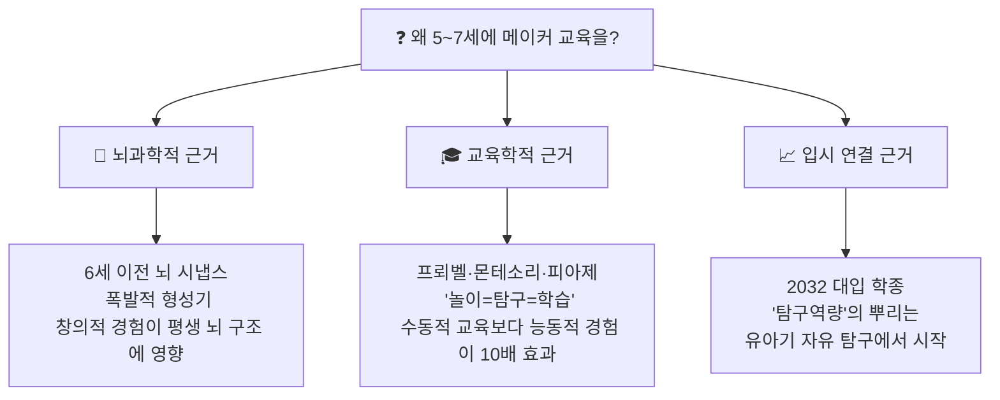

---

### 📊 유아기 은물·메이커 활동 연결표

| 은물 단계 | 실제 놀이 활동 | 어른의 역할 | 키우는 역량 | AI 시대 연결 역량 |
|---------|------------|---------|---------|--------------|
| **1~2단계** | 공·블록 탐색, 색깔 맞추기 | 이름만 말해주기 | 감각·색·형태 인식 | 관찰력·분류력 |
| **3~6단계** | 블록 쌓기·분해·탑 만들기 | "왜 무너졌을까?" 질문 | 공간지각·구조 이해 | 설계·분해 사고 |
| **7~10단계** | 도형 맞추기, 패턴 만들기 | 패턴 함께 찾기 | 패턴·논리 이해 | 알고리즘 기초 |
| **11~20단계** | 만들기·꾸미기·이야기 만들기 | 완성품 사진 찍기 | 창작·표현 | 메이커 정신 |

---

### 🎮 유아 메이커 활동 상세 가이드

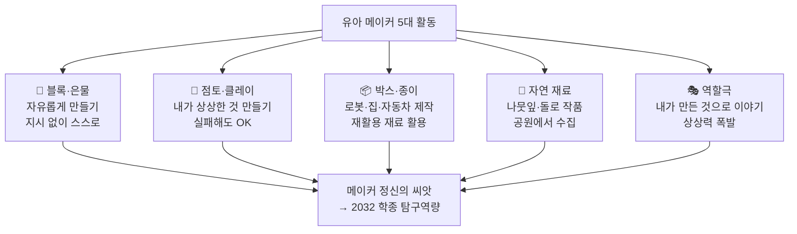

---

### 📋 유아 메이커 활동 주간 루틴 예시

| 요일 | 활동 | 소요 시간 | 핵심 질문 | 키우는 능력 |
|------|------|---------|---------|----------|
| **월** | 은물 자유 탐구 | 30분 | "뭘 만들었어? 왜?" | 창의력·자기표현 |
| **화** | 박스 아트 | 45분 | "어떻게 만들었어?" | 설계·제작 기초 |
| **수** | 공원 자연 탐구 | 1시간 | "왜 이걸 골랐어?" | 관찰·선택·표현 |
| **목** | 점토 만들기 | 30분 | "다음엔 어떻게 바꿀까?" | 실험·개선 사고 |
| **금** | 작품 발표 | 15분 | "친구에게 설명해봐" | 표현력·자신감 |

---

### 💡 부모가 해야 할 말 vs 하면 안 되는 말

| 상황 | ❌ 하면 안 되는 말 | ✅ 해야 하는 말 | 이유 |
|------|-------------|------------|------|
| 블록이 무너졌을 때 | "엄마가 도와줄게" | "왜 무너졌을까? 어떻게 고치면 좋을까?" | 문제해결 사고 촉진 |
| 뭔가 만들었을 때 | "잘 만들었네~" (칭찬만) | "이게 뭐야? 어떻게 만들었어? 어려웠어?" | 사고 과정 언어화 |
| 마음대로 안 될 때 | "그냥 다른 거 해" | "실패해도 괜찮아. 다시 해봐" | 실패 내성·도전 정신 |
| 창작물이 이상할 때 | "이게 뭐야?" (부정) | "우와, 이건 처음 보는 거다! 설명해줘" | 창의 표현 격려 |

---

## 5. 🐣 초1·2 (7~9세): 손으로 만드는 탐구

> **핵심 철학**: "만들면서 배운다" — 교과서보다 손이 먼저입니다.

---

### 💡 이 시기에 꼭 해야 하는 이유

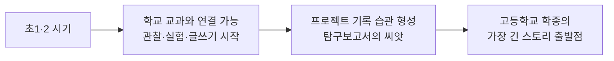

---

### 📦 초1·2 메이커 프로젝트 사례 (상세)

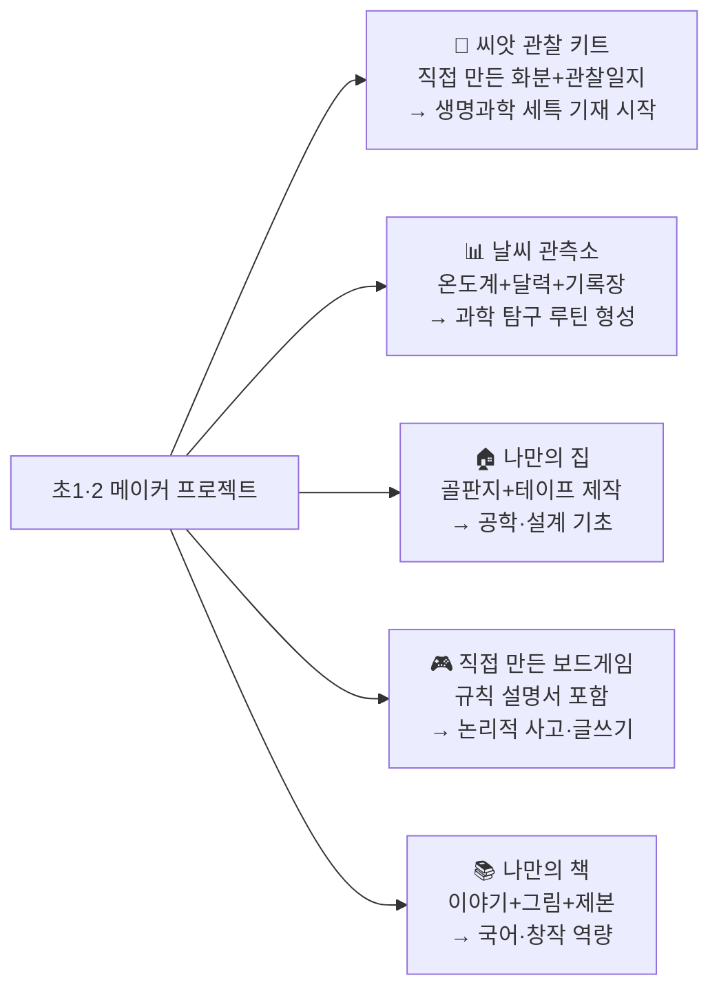

---

### 📋 초1·2 메이커 프로젝트 기록 방법 (탐구보고서 씨앗)

| 기록 항목 | 내용 | 초1 버전 | 초2 버전 (발전) |
|---------|------|---------|------------|
| **만든 이유** | 왜 이걸 만들었나? | 그림으로 표현 | 한 문장 글쓰기 |
| **재료 목록** | 무엇을 사용했나? | 그림으로 나열 | 글로 작성 |
| **만드는 과정** | 어떻게 만들었나? | 순서대로 그림 | 그림+설명 |
| **잘된 점** | 뭐가 마음에 드나? | 말로 표현 | 한 문장 |
| **고칠 점** | 다음엔 어떻게 바꿀까? | 말로 표현 | 한 문장 + 그림 |

> 📌 이 5가지가 훗날 **탐구보고서 5단계 구조**의 씨앗입니다!
> 초1의 그림 일지가 고2의 논문형 보고서로 성장합니다.

---

### 💡 실전 프로젝트 따라하기: 씨앗 관찰 키트

```
📌 프로젝트명: "나만의 씨앗 성장 관찰소"

준비물: 요거트 컵, 흙, 씨앗(강낭콩 추천), 색연필, 공책

📋 진행 방법:
1. 컵에 흙 넣고 씨앗 심기
2. 매일 같은 시간에 관찰
3. 그림으로 변화 기록 (날짜 꼭 적기!)
4. 질문 만들기: "왜 키가 클까?" "햇빛이 없으면?"
5. 4주 후 부모님께 발표하기

📋 기록 양식 (초1용):
날짜: ____월 ____일
오늘 키: ____cm
오늘 모습 그림:

[그림 공간]

오늘 새로운 것:
궁금한 것:

🎯 이것이 훗날 탐구보고서의 '관찰 데이터 수집' 파트가 됩니다!
```

---

## 6. 📦 초3·4 (9~11세): 첫 메이커 프로젝트

> **핵심 철학**: "문제를 발견하고 직접 해결해보는 첫 경험"
> **비유**: 이 시기의 작은 프로젝트가 고등학교 탐구보고서의 뿌리입니다. 🌳

---

### 💡 초3·4가 결정적 시기인 이유

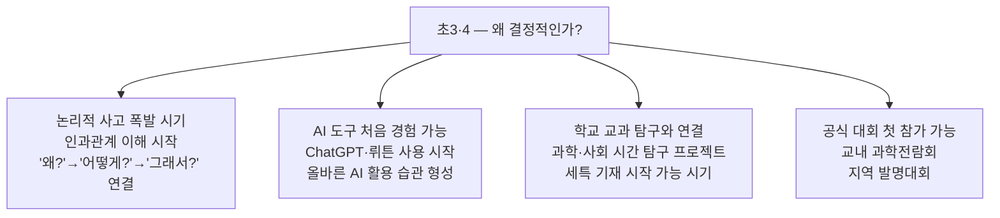

---

### 🔨 초3·4 메이커 프로젝트 5단계 완전 가이드

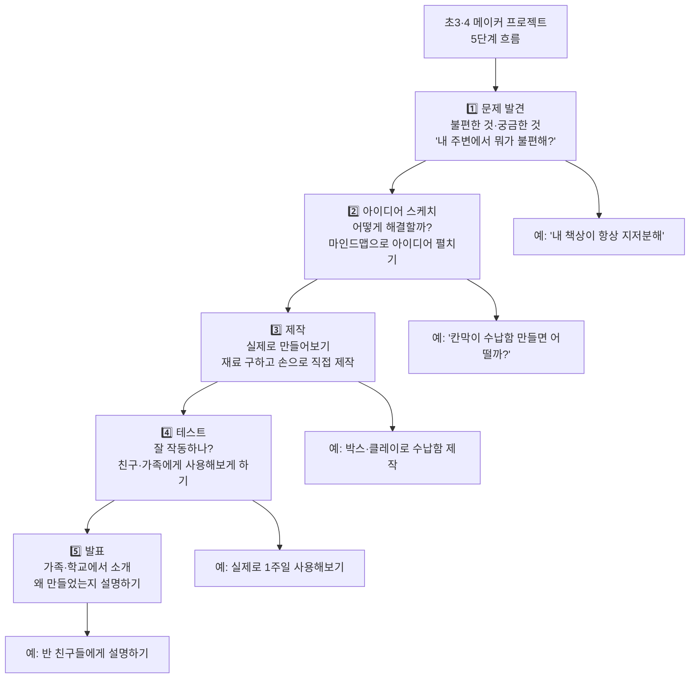

---

### 📋 초3·4 프로젝트 분야별 사례 + AI 활용

| 분야 | 프로젝트 사례 | 도구·재료 | AI 활용법 (Lv.1) | 학종 연결 |
|------|------------|---------|------------|---------|
| **환경** | 학교 분리수거함 개선안 | 박스·색지·스티커 | ChatGPT에 "분리수거 잘 되는 방법" 조사 | 환경 탐구역량 |
| **생명** | 우리 동네 식물 도감 제작 | 스케치북·카메라 | 뤼튼에 식물 특징 질문·정리 | 생명과학 탐구 |
| **수학** | 우리 반 급식 만족도 통계 | 색지·그래프 종이 | AI로 통계 기초 개념 학습 | 수리 탐구력 |
| **기술** | 간단한 LED 회로 등 | 배터리·전구·전선 키트 | AI로 전기 원리 조사 | 전기·공학 기초 |
| **사회** | 우리 동네 안전지도 만들기 | 종이지도·색연필·스티커 | AI로 안전 위험 요소 조사 | 사회 탐구력 |

---

### 🤖 초3·4 첫 AI 도구 사용 가이드 (Lv.1)

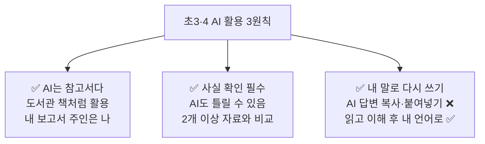

**📌 실전 AI 활용 대화 예시 (뤼튼 사용)**

```
학생 입력: "분리수거를 더 잘하게 만드는 방법 3가지 알려줘.
           초등학생이 이해하기 쉽게 설명해줘."

AI 답변: [3가지 방법 제시]

학생이 할 일:
1. AI 답변 읽기
2. "이 중에 내 학교에 맞는 건 뭐지?" 생각하기
3. 자기 말로 노트에 정리
4. 직접 학교 분리수거함 관찰하기
5. AI 내용과 실제가 맞는지 비교

❌ 하지 말 것: AI 답변 그대로 복사 → 보고서에 붙여넣기
```

---

## 7. 🔬 초5·6 (11~13세): AI 도구 입문 + 첫 작품 출품

> **핵심 철학**: "AI를 도구로 써서 내 아이디어를 현실로 만든다"
> ⚠️ **중요**: 지금 초5·6인 학생이 2032년 대입 대상자입니다! 지금이 합격의 씨앗을 심는 시기입니다.

---

### 💡 초5·6이 2032 대입에서 핵심 시기인 이유

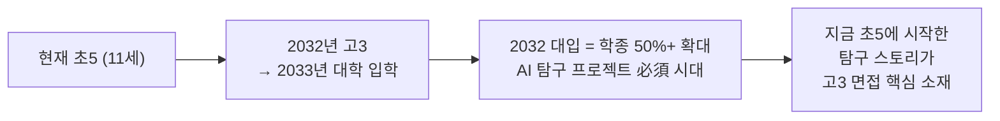

---

### 📊 초5·6 메이커 프로젝트 전략 (마인드맵)

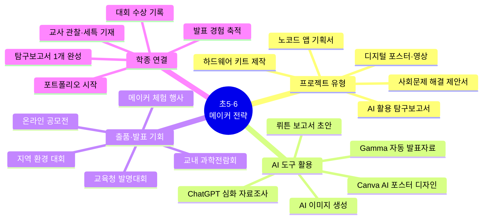

---

### 📋 초5·6 AI 활용 탐구보고서 6단계 작성법

| 단계 | 내용 | AI 활용 방법 | 직접 해야 할 것 | 결과물 |
|------|------|---------|------------|------|
| **① 주제 선정** | 내가 궁금한 것 찾기 | AI에게 "관련 주제 5가지 추천해줘" 요청 | 최종 주제는 내가 결정 | 주제 1개 |
| **② 자료 조사** | 배경 지식 수집 | ChatGPT로 개념·원리 질문 | 사실 확인은 직접 (책·사이트) | 참고자료 5개 이상 |
| **③ 탐구 실행** | 실험·관찰·설문 진행 | AI로 설문 문항 초안 작성 보조 | 실제 탐구는 반드시 직접 | 데이터 수집표 |
| **④ 분석** | 결과 해석하기 | AI로 패턴·경향 파악 도움 | 해석·의견은 내 생각으로 | 분석 결과 3가지 이상 |
| **⑤ 보고서 작성** | A4 3~5장 작성 | Gamma/Notion AI로 구조 잡기 | 핵심 내용은 반드시 내 언어로 | 완성 보고서 |
| **⑥ 발표** | 발표 자료 제작 | Canva AI로 포스터 디자인 | 발표 내용 암기·연습은 직접 | 발표 자료 + 실제 발표 |

---

### 💡 실전 탐구보고서 예시: "우리 교실 공기질 탐구"

```
📋 탐구보고서 실전 예시 (초6)

제목: 우리 교실 이산화탄소 농도와 집중력의 관계 탐구

1. 탐구 동기
   수업 중 졸리고 집중이 안 될 때가 많았습니다.
   인터넷에서 이산화탄소가 높으면 집중력이 떨어진다는
   내용을 보고 직접 조사해보고 싶었습니다.

2. 탐구 방법
   - 이산화탄소 측정 앱(CO₂ 센서 앱) 활용
   - 오전/오후/환기 전후 비교 측정
   - 같은 날 집중력 테스트(간단한 수학 문제) 병행

3. AI 활용 방법
   - ChatGPT에 "이산화탄소와 집중력 관계" 조사
   - 뤼튼으로 측정 방법 조언 받기
   - Canva AI로 결과 그래프 시각화

4. 탐구 결과
   [표: 시간대별 이산화탄소 수치 + 정답률]
   → 오후 3교시 이산화탄소 1,500ppm 이상
   → 수학 정답률 평균 12% 감소

5. 결론 및 제안
   환기만 해도 집중력이 높아집니다.
   학교에 공기질 알림 시스템이 필요합니다.

6. 느낀 점
   AI로 조사는 했지만, 실제 측정은 직접 해야
   진짜 우리 교실 데이터가 나온다는 걸 알았습니다.

✅ 이 보고서가 중학교 과학 세특 + 환경 탐구 스토리의 시작!
```

---

### 🏆 초5·6 첫 대회 도전 가이드

| 대회명 | 주최 | 참가 방법 | 준비 기간 | 학종 활용 |
|-------|------|---------|---------|---------|
| **메이커 페어 서울** | 서울시립과학관 | makerfaireseoul.com 신청 | 3~6개월 | 탐구역량 + 발표 경험 |
| **학생 발명대회** | 한국발명진흥회 | kipa.org 신청 | 2~3개월 | 창의·발명 역량 |
| **교육부 과학전람회** | 교육청별 공고 | 학교 선생님 통해 신청 | 3~4개월 | 과학 탐구역량 |
| **SW·AI 경진대회** | 지역 교육청 | 학교 공문 확인 | 1~2개월 | AI 역량 증명 |
| **환경 사랑 공모전** | 환경부·환경재단 | 각 기관 홈페이지 | 1~2개월 | 환경 탐구 스토리 |

---

## 8. 🌿 중1·2 (13~15세): AI 활용 심화 프로젝트

> **핵심 철학**: AI를 도구로 써서 실제 문제를 해결하는 "작은 창업가"가 되는 시기

---

### 💡 중1·2가 학종 핵심 시기인 이유

```mermaid
graph TD
    A["중1·2 — 학종 핵심 시기"] --> B["고등학교 학종 평가의<br> '성장 스토리' 시작점<br> 지금 경험이 고3 면접 소재"]
    A --> C["AI 도구 본격 활용 가능<br> 노코드 앱 직접 제작 수준<br> 실제 서비스 기획 경험"]
    A --> D["메이커페어 팀 출품 도전<br> 첫 번째 공식 발표 경험<br> 전문가 피드백 받기"]
```

---

### 🚀 중1·2 프로젝트 심화 유형

```mermaid
graph TD
    A[중1·2 프로젝트 유형] --> B["📱 노코드 앱 개발<br>Glide·AppSheet<br>코딩 없이 실제 앱"]
    A --> C["📊 데이터 분석 시각화<br>구글 시트 + AI<br>수치로 문제 증명"]
    A --> D["🌐 웹사이트 제작<br>Notion·Wix·AI빌더<br>실제 주소 있는 사이트"]
    A --> E["🤖 AI 챗봇 기획<br>ChatGPT API 활용<br>문제 해결 챗봇"]
    A --> F["🔧 하드웨어 제작<br>아두이노·라즈베리파이<br>물리적 제품"]

    B --> G["학종 기재 가능<br>세특 + 탐구보고서"]
    C --> G
    D --> G
    E --> G
    F --> G
```

---

### 📋 중1·2 프로젝트 사례 + 세특 기재 예시

| 프로젝트 | 사용 도구 | 세특 기재 예시 | 연결 전공 |
|---------|---------|------------|---------|
| **급식 만족도 앱** | Glide + 구글폼 | "학교 급식 만족도를 측정하는 앱을 직접 기획·개발하여 200명의 데이터를 수집하고 통계 분석하여 개선 방안을 제안하는 기업가적 사고력을 발휘함" | 컴공·경영 |
| **동네 환경오염 데이터 지도** | 구글 시트 + Canva | "지역 환경오염 현황을 직접 측정·수집하고 시각적 데이터 지도로 제작하여 지역 주민에게 공유하는 실천적 환경 탐구 역량이 탁월함" | 환경·생명 |
| **학교 분실물 챗봇** | ChatGPT API + 노션 | "AI API를 활용하여 학교 분실물 검색 챗봇을 기획·구현하고 실제 학교 시스템에 연결을 시도하는 창의적 문제해결 과정이 돋보임" | AI·공학 |
| **역사 인물 인터뷰 영상** | Canva + AI 더빙 | "역사적 인물의 관점을 연구하여 AI 도구로 가상 인터뷰 영상을 제작하고 역사적 맥락과 현재의 연결성을 창의적으로 표현함" | 인문·교육 |

---

### 💡 실전 프로젝트 따라하기: 급식 만족도 앱 (Glide)

```
📱 실전 프로젝트: "우리 학교 급식 만족도 앱"

📋 제작 순서:

Step 1. 구글 폼 만들기 (30분)
   - 급식 메뉴명 입력 칸
   - 별점 (1~5점)
   - 한 줄 의견

Step 2. Glide 앱 연결 (1시간)
   - glideapps.com 접속 → 무료 시작
   - 구글 시트 연결
   - 앱 자동 생성 → 원하는 디자인 선택

Step 3. 친구들에게 배포
   - 링크 공유 → 실제 사용
   - 1개월 데이터 수집

Step 4. 분석 + 보고서
   - 구글 시트로 데이터 분석
   - ChatGPT로 패턴 파악 도움받기
   - A4 5장 탐구보고서 작성

Step 5. 선생님께 보고 + 세특 기재 요청

⏱ 총 소요 시간: 약 4주
💰 비용: 0원 (무료 도구만 활용)
🎯 결과: 세특 기재 + 탐구보고서 + 메이커페어 출품 가능
```

---

### 🤖 중1·2 AI 도구 심화 활용 (Lv.2~3)

```mermaid
graph LR
    A["Lv.2 활용 단계<br> (중1 추천)"] --> B["Canva AI<br>발표·포스터 자동 생성"]
    A --> C["Gamma AI<br>보고서 슬라이드 자동화"]
    A --> D["Notion AI<br>탐구 노트 AI 정리"]

    E["Lv.3 제작 단계<br> (중2 추천)"] --> F["Glide/AppSheet<br>노코드 앱 제작"]
    E --> G["Make.com<br>업무 자동화 워크플로우"]
    E --> H["ChatGPT API<br>간단한 챗봇 기획"]
```

---

## 9. 🎯 중3 (15~16세): 메이커페어 도전 + 학종 연결

> **핵심 철학**: "완성된 작품을 세상에 공개하는 첫 경험"

---

### 🏆 메이커페어 출품 월별 로드맵

```mermaid
gantt
    title 중3 메이커페어 도전 연간 계획
    dateFormat MM
    axisFormat %m월

    section 기획 단계
    아이디어 탐색 · 팀 구성    :01, 2M
    주제 확정 · 기획서 작성    :03, 1M

    section 제작 단계
    설계 · 프로토타입 제작     :04, 2M
    AI 도구 활용 개발          :06, 2M

    section 완성 단계
    테스트 · 개선              :08, 1M
    포스터 · 발표 준비         :09, 1M

    section 출품 · 기록
    메이커페어 출품            :10, 1M
    탐구보고서 완성            :11, 1M
    세특 기재 · 포트폴리오     :12, 1M
```

---

### 📋 메이커페어 출품 작품 기획서 양식 (중3용)

```
🎯 메이커 프로젝트 기획서

━━━━━━━━━━━━━━━━━━━━━━━━━━━━━
팀명: _______________
프로젝트명: _______________
팀원: _______________ (2~4명)
━━━━━━━━━━━━━━━━━━━━━━━━━━━━━

📌 1. 문제 정의
   우리가 발견한 문제:
   └─ _______________________________________________

   이 문제가 중요한 이유:
   └─ _______________________________________________

   영향받는 사람들:
   └─ _______________________________________________

💡 2. 해결 아이디어
   우리의 해결책:
   └─ _______________________________________________

   기존 방법과 다른 점:
   └─ _______________________________________________

🔨 3. 제작 계획
   사용할 도구·재료:
   └─ _______________________________________________

   AI 활용 방법:
   └─ _______________________________________________

   제작 기간: ________월 ~ ________월

🎯 4. 기대 효과
   누가 어떻게 사용할 수 있나:
   └─ _______________________________________________

   사회에 미치는 영향:
   └─ _______________________________________________

📊 5. 역할 분담
   팀원 A (        ): _______________
   팀원 B (        ): _______________
   팀원 C (        ): _______________
━━━━━━━━━━━━━━━━━━━━━━━━━━━━━
```

---

### 💡 중3 메이커페어 우수 작품 사례 분석

| 작품 유형 | 문제 | 해결책 | 사용 기술 | 학종 스토리 |
|---------|------|------|---------|---------|
| **시각장애인 점자 학습 앱** | 점자 교육 자료 부족 | AI로 텍스트→점자 변환 앱 | Glide + AI API | 사회적 약자 문제 + AI 기술 융합 |
| **교내 음식물 쓰레기 측정 시스템** | 급식 잔반량 파악 어려움 | 이미지 AI로 잔반 자동 측정 | 아두이노 + AI | 환경 문제 + 하드웨어 융합 |
| **독거 어르신 안부 챗봇** | 고령층 사회 고립 문제 | 매일 안부 묻는 AI 챗봇 | ChatGPT API | 사회 문제 + AI 기술 + 따뜻한 스토리 |

---

## 10. 🏗️ 고1 (16~17세): 바이브 AI 도구로 서비스 제작

> **핵심 철학**: "코딩 없이도 AI로 진짜 서비스를 만드는 시대가 왔다"

---

### 🛠️ 고1 바이브 코딩 단계별 입문 가이드

```mermaid
graph LR
    A["🎨 Step 1<br>아이디어 구체화<br>어떤 서비스를 만들까?<br>사용자 누구? 문제 뭐?"] --> B["📐 Step 2<br>v0.dev로 UI 먼저<br>어떻게 생겼으면 좋겠어?<br> 화면 레이아웃 자동 생성"]
    B --> C["⚡ Step 3<br>Bolt.new로 기능 구현<br>서비스 설명 입력<br> → 전체 코드 자동 생성"]
    C --> D["🔧 Step 4<br>Cursor로 세부 수정<br> 원하는 기능 추가<br> 버그 고치기"]
    D --> E["🌐 Step 5<br>Vercel로 배포<br> 실제 주소 생성<br> 친구들과 공유!"]
```

---

### 📋 고1 AI 메이커 프로젝트 월별 계획

| 시기 | 프로젝트 단계 | 사용 도구 | 결과물 | 학종 연결 |
|------|-----------|---------|-------|---------|
| **3~4월** | 서비스 기획 + 와이어프레임 | Figma(무료), Gamma | 기획서 + 화면 설계서 | 기획 역량 증명 |
| **5~6월** | 바이브 코딩으로 MVP 제작 | Bolt.new, v0.dev | 실제 작동하는 서비스 | AI 활용 개발 역량 |
| **7~8월** | 사용자 피드백 + 개선 | Cursor, AI | 개선된 v2 서비스 | 반복 개선 역량 |
| **9~10월** | 탐구보고서 + 발표 자료 | Canva, Notion | 보고서 A4 7장 + PPT | 학종 직접 연결 |
| **11~12월** | 메이커페어 출품 준비 | 전체 도구 | 출품 작품 + 포스터 | 세특 기재 |

---

### 📋 고1 AI 프로젝트 아이디어 + 세특 기재 예시

| 프로젝트 아이디어 | 핵심 기능 | 기술 스택 | 세특 기재 예시 |
|--------------|---------|---------|------------|
| **학교 커뮤니티 익명 Q&A 앱** | 질문 올리고 답변 받기 | Bolt.new + Supabase | "교내 소통 부재 문제를 발견하고 AI 도구로 커뮤니티 플랫폼을 기획·개발하여 실제 300명이 사용하는 서비스를 완성하는 기업가적 실행력이 돋보임" |
| **환경 데이터 시각화 대시보드** | 지역 공기질 실시간 표시 | Python + Streamlit | "공공 데이터 API를 활용하여 환경 데이터 시각화 대시보드를 구현하고 기후 변화의 지역적 영향을 데이터 기반으로 탐구하여 보고서를 완성함" |
| **지역 어르신 연결 서비스** | 봉사자-어르신 매칭 | Glide + AI | "고령화 사회 문제에 관심을 갖고 AI 기반 봉사 매칭 서비스를 설계하여 실제 지역사회에 제안하는 과정에서 사회 혁신적 사고력을 발휘함" |

---

## 11. 🔨 고2 (17~18세): 창업형 탐구보고서 완성

> **핵심 철학**: "탐구보고서는 단순 보고서가 아니라 '작은 스타트업 리포트'입니다"

---

### 📊 창업형 탐구보고서 vs 일반 탐구보고서 비교

| 구분 | 일반 탐구보고서 | 창업형 탐구보고서 |
|------|------------|--------------|
| **문제 출발** | 교과서에 나온 개념 | 내가 직접 발견한 사회 문제 |
| **조사 방법** | 책·인터넷 자료 조사 | 실제 사용자 20명 이상 인터뷰 |
| **해결책** | 이론적 제안 | 실제 작동하는 프로토타입 제작 |
| **검증** | 참고 문헌 인용 | 실제 사용자 피드백 데이터 |
| **결과물** | A4 3~5장 | A4 7~10장 + 실제 서비스 |
| **학종 임팩트** | 보통 | 매우 강력 |
| **면접 소재** | 짧은 답변 | 20분 이상 풍부한 스토리 |

---

### 📋 창업형 탐구보고서 구조 (6단계)

```mermaid
graph TD
    A["창업형 탐구보고서<br>6단계 구조"] --> B["1단계: 문제 정의<br>Problem Statement<br>'왜 이 문제가 중요한가?'"]
    A --> C["2단계: 사용자 조사<br>User Research<br>'실제로 누가 불편한가?'"]
    A --> D["3단계: 해결책 설계<br>Solution Design<br>'어떻게 해결할까?'"]
    A --> E["4단계: 프로토타입 제작<br>MVP Build<br>'직접 만들어보자'"]
    A --> F["5단계: 검증·피드백<br>Validation<br>'실제로 효과가 있나?'"]
    A --> G["6단계: 개선·성찰<br>Iteration<br>'무엇을 배웠나?'"]

    B --> H["💡 기존 탐구보고서와 다른 점<br>✅ 실제 사용자 있음<br>✅ AI로 직접 제작<br>✅ 세상에 공개됨"]
```

---

### 💡 창업형 탐구보고서 실전 예시 (완전판)

```
━━━━━━━━━━━━━━━━━━━━━━━━━━━━━━━━━━━━━━━━━━━━━━━━━
📋 창업형 탐구보고서 실전 예시

제목: 청소년 정신건강 자가 진단 앱 개발 및 효과성 연구

━━━━━━━━━━━━━━━━━━━━━━━━━━━━━━━━━━━━━━━━━━━━━━━━━

1. 문제 정의 (Problem Statement)

   📌 발견한 문제:
   학교 상담실 이용률이 전체 학생의 3%에 불과하다.
   (출처: 직접 학교 상담 선생님 인터뷰)

   📌 문제의 원인 분석:
   • 상담이 '문제 있는 학생'이라는 낙인 효과
   • 상담실 운영 시간이 수업 시간과 겹침
   • 자신의 심리 상태를 모르는 학생 많음

   📌 해결하고 싶은 것:
   언제 어디서나 익명으로 자신의 정신건강을
   확인할 수 있는 앱을 만들자

2. 사용자 조사 (User Research)

   📊 설문 조사 결과 (전교생 200명 중 150명 응답):
   • 최근 스트레스 높음: 78%
   • 상담실 이용 경험: 8%
   • 앱이 있으면 사용하겠다: 65%

   📊 심층 인터뷰 (5명):
   "혼자 해결하려다 더 힘들어진 적 있어요" (고1 여학생)
   "상담실 가면 친구들이 볼까봐 무서워요" (고2 남학생)

3. 해결책 설계 (Solution Design)

   앱 이름: "마음날씨"
   핵심 기능:
   • 매일 1분 감정 체크 (5가지 이모지)
   • 1주일 감정 변화 그래프
   • 스트레스 높을 때 호흡법 가이드
   • 익명으로 전문가 상담 연결

4. 프로토타입 제작 (MVP Build)

   사용 도구: Bolt.new + Supabase (데이터베이스)
   제작 기간: 3주 (하루 2~3시간)

   Bolt.new 입력 프롬프트:
   "매일 감정을 이모지로 기록하고,
    일주일 치 감정 그래프를 보여주는
    익명 정신건강 앱을 만들어줘.
    미니멀하고 따뜻한 디자인으로"

   → 기본 앱 생성 (2시간)
   → Cursor로 그래프 기능 추가 (1주)
   → 실제 배포: myhealth.vercel.app

5. 검증·피드백 (Validation)

   베타 테스터: 학교 친구 30명 (2주 사용)
   결과:
   • 매일 사용: 23명 (77%)
   • 감정 표현이 편해졌다: 87%
   • "이런 앱이 필요했어요": 다수

   개선 사항 반영:
   • 알림 기능 추가 (매일 밤 9시)
   • 색깔 테마 선택 기능

6. 성찰 (Reflection)

   배운 것:
   • 문제는 데이터로 증명해야 설득력이 생긴다
   • 사용자 피드백이 내 생각보다 중요하다
   • AI 도구는 도구일 뿐, 아이디어는 사람이 낸다

   한계점:
   • 의학적 진단 불가 (앱 내 명시 필요)
   • 더 많은 사용자 데이터 필요

   앞으로:
   • 학교 상담 선생님과 협력 방안 논의
   • 심리학 전공 입학 후 정식 연구로 발전

━━━━━━━━━━━━━━━━━━━━━━━━━━━━━━━━━━━━━━━━━━━━━━━━━
```

---

## 12. 💪 고3 (18세): 포트폴리오 완성 + 면접 스토리

> **핵심 철학**: "고3은 새로 만드는 것이 아니라 쌓아온 것을 정리하는 시기"

---

### 📋 AI 메이커 포트폴리오 구성 (최종판)

```mermaid
graph TD
    A["고3 포트폴리오<br>완성 구조"] --> B["📌 나의 문제의식<br>'내가 왜 이 문제에 관심 갖게 됐나?'<br> (초등학교 경험부터)"]
    A --> C["🗺️ 탐구 여정<br> '어떤 단계를 거쳐 성장했나?'<br> (연도별 프로젝트 타임라인)"]
    A --> D["🔨 제작한 것들<br> '실제로 만든 서비스·작품 목록'<br> (링크·데이터 포함)"]
    A --> E["📈 배운 것·성장<br> '실패에서 무엇을 배웠나?'<br> (구체적 에피소드)"]
    A --> F["🚀 앞으로의 계획<br> '대학에서 어떻게 발전시킬 것인가?'<br> (구체적 연구·창업 계획)"]

    B --> G["면접에서<br> 강력한 스토리<br> 20분 답변 가능"]
    C --> G
    D --> G
    E --> G
    F --> G
```

---

### 📋 면접 스토리 구성 프레임 (STARG 모델)

| 구성 요소 | 내용 | 실전 예시 | 시간 |
|---------|------|---------|------|
| **S (상황)** | 어떤 문제를 발견했나? | "중1 때 학교 급식 잔반이 너무 많다는 것을 발견했습니다. 하루 30kg의 음식이 버려졌어요." | 1분 |
| **T (도전)** | 무엇을 해결하려 했나? | "잔반을 줄이는 시스템을 직접 만들어보고 싶었습니다." | 30초 |
| **A (행동)** | 구체적으로 무엇을 했나? | "중2에 Glide로 급식 사전 선택 앱을 만들었고, 고1에 Bolt.new로 AI 잔반 예측 시스템으로 발전시켰습니다." | 2분 |
| **R (결과)** | 어떤 변화가 생겼나? | "앱 도입 후 3개월간 잔반 22% 감소, 메이커페어 서울 수상, 실제 학교 시스템에 시범 적용." | 1분 |
| **G (성장)** | 무엇을 배웠나? | "데이터가 있어야 설득이 된다는 것, AI는 도구이고 문제의식은 사람이 가져야 한다는 것." | 1분 |

> 📌 **총 5분 30초 — 면접관이 끊을 때까지 이야기할 수 있는 풍부한 스토리**

---

# 13. 메이커페어 참가 완전 가이드

## 🗓️ 메이커페어 서울 참가 프로세스

```mermaid
graph TD
    A["메이커페어 참가 결심!"] --> B["📅 3~6개월 전<br> 작품 기획·제작 시작<br> 팀 구성 (2~4명 추천)"]
    B --> C["📝 1~2개월 전<br> 메이커 등록 신청<br> makerfaireseoul.com"]
    C --> D["🎨 행사 2주 전<br> 포스터 제작 (Canva AI)<br> 전시 준비·연습"]
    D --> E["🎪 행사 당일<br> 전시·발표·관람객 소통<br> 전문가 피드백 받기"]
    E --> F["📋 행사 후 1주일 내<br> 탐구보고서 작성<br> 피드백 반영 개선"]
    F --> G["✅ 세특 기재 요청<br> 포트폴리오 추가<br> 다음 버전 계획"]

    C --> C1["🌐 사이트: makerfaireseoul.com<br> 또는 science.seoul.go.kr"]
    E --> E1["💡 관람객 반응 기록<br> 전문가 명함 받기<br> 미디어 인터뷰 가능"]
```

---

### 📋 메이커페어 포스터 제작 가이드 (Canva AI 활용)

```
📌 메이커페어 포스터 만들기 (Canva AI)

Step 1. canva.com 접속 → "포스터" 검색
Step 2. 과학 포스터 템플릿 선택
Step 3. Canva AI에 입력:
         "환경 문제 해결 앱 메이커페어 포스터,
          파란색과 초록색 계열, 깔끔한 디자인"
Step 4. 생성된 디자인 수정:
         • 프로젝트 제목
         • 팀명
         • 핵심 기능 3가지
         • QR코드 (실제 서비스 링크)
         • 데이터/결과 그래프

📐 크기: A1 또는 A0 (메이커페어 기준)
🖨️ 출력: 학교 행정실 또는 인쇄소

💡 QR코드는 qr-code-generator.com에서 무료 생성
```

---

### 📋 메이커페어 참가 분야 및 학생 추천

| 분야 | 내용 설명 | 학생 추천 이유 | 준비 팁 |
|------|---------|------------|--------|
| **AI·로봇** | AI 활용 서비스, 로봇 제작 | 학종 AI 역량 직접 증명 가능 | 실제 작동 데모 필수 |
| **청소년 발명** | 아이디어 기반 발명품 | 초등~고등 전 연령 참가 가능 | 간단해도 독창성이 핵심 |
| **환경·ESG** | 환경 문제 해결 작품 | 사회 문제 연결 스토리 강력 | 데이터로 문제 증명 |
| **메디컬·헬스** | 건강 관련 기술 | 의대·약대·보건 학종 연결 | 안전성 강조 |
| **교육·SW** | 교육용 앱·게임·콘텐츠 | 교육학·컴공 학종 연결 | 실제 학생 사용 데이터 확보 |

---

### 📋 학교급별 메이커페어 참가 전략

| 학교급 | 추천 참가 형태 | 준비 기간 | 기대 효과 | 주의사항 |
|-------|------------|---------|---------|--------|
| **초5~6** | 관람 + 체험 부스 참가 | 1개월 | 영감·동기 부여, 분위기 경험 | 강제하지 말고 즐기게 |
| **중1~2** | 팀으로 출품 첫 도전 | 3~4개월 | 첫 발표 경험, 전문가 피드백 | 수상보다 참가 경험이 목적 |
| **중3** | 완성도 있는 작품 출품 | 4~6개월 | 학종 스토리 구축, 수상 도전 | 탐구보고서와 연계 필수 |
| **고1~2** | AI 서비스 출품 | 6개월+ | 세특 기재, 면접 핵심 소재 | 실제 사용자 데이터 확보 |
| **고3** | 포트폴리오 전시 | 이전 작품 정리 | 입시 면접 최강 소재 | 11월 이후는 시간 부족 |

---

# 14. 단계별 AI 도구 가이드 (실전 사용법)

## 📋 연령별 AI 도구 완전 가이드

| 연령 | 도구명 | 사이트 | 실전 사용 예시 | 주의사항 |
|------|-------|--------|------------|--------|
| **초3~4** | 뤼튼 (wrtn.ai) | wrtn.ai | "광합성이 뭔지 초등학생처럼 설명해줘" | 답변 그대로 복사 ❌ |
| **초3~4** | ChatGPT | chatgpt.com | "분리수거 잘하는 방법 3가지 알려줘" | 사실 확인 필수 |
| **초5~6** | Canva AI | canva.com | 포스터 → AI 생성 → 내용 수정 | 저작권 확인 |
| **초5~6** | Gamma.app | gamma.app | "환경오염 탐구 발표자료 5슬라이드" | 내용은 직접 작성 |
| **중1~2** | Notion AI | notion.so | 탐구 노트 작성 → AI 요약·정리 | 핵심 내용은 직접 |
| **중1~2** | Glide | glideapps.com | 구글 시트 → 앱 자동 생성 | 데이터 보안 주의 |
| **중3** | Bolt.new | bolt.new | "급식 평점 앱 만들어줘" 입력 | 퍼블리시 전 검토 |
| **고1~2** | Cursor | cursor.com | AI 제안 받으며 코드 수정·개선 | 코드 이해 후 사용 |
| **고1~2** | v0.dev | v0.dev | "로그인 화면 디자인해줘" | 저작권 확인 |
| **고2~3** | Claude | claude.ai | 복잡한 기능, 논리 구조, 보고서 | 결과 직접 검증 |

---

## 🎓 AI 도구 사용 황금 원칙 3가지

```mermaid
graph TD
    A["AI 도구 황금 원칙"] --> B["✅ 원칙 1: AI는 도우미<br> 아이디어·판단은 내가<br> 실행 도움은 AI에게"]
    A --> C["✅ 원칙 2: 사실 확인 필수<br> AI는 틀릴 수 있다<br> 2개 이상 자료와 교차 확인"]
    A --> D["✅ 원칙 3: 내 언어로 표현<br> AI 답변 복사 ❌<br> 읽고 이해 → 내 말로 ✅"]
```

---

# 15. 학종 연결 전략 (실전 완전판)

## 📊 메이커 활동 → 학종 4대 요소 완전 연결

```mermaid
graph LR
    A[메이커 활동] --> B["📚 학업역량<br> 탐구보고서<br> AI 활용 데이터 분석<br> 심화 개념 적용"]
    A --> C["🎯 전공적합성<br> 프로젝트 분야<br> 관련 전공 연결<br> 전문가 인터뷰"]
    A --> D["🌱 발전가능성<br> 성장 스토리<br> 실패→개선 경험<br> 자기주도성"]
    A --> E["🤝 인성·공동체<br> 팀 협업<br> 사회 문제 해결<br> 봉사·나눔 연결"]

    B --> F[🏆 학종 합격]
    C --> F
    D --> F
    E --> F
```

---

### 📋 전공별 메이커 프로젝트 추천 + 세특 기재 전략

| 희망 전공 | 추천 프로젝트 | 핵심 역량 강조 | 세특 포인트 |
|---------|------------|------------|---------|
| **컴퓨터공학** | AI 서비스 개발, 알고리즘 탐구 | AI 기술 이해 + 실제 구현 | "직접 개발한 서비스가 OOO명에게 사용됨" |
| **의학·간호** | 건강 모니터링 앱, 의료 AI 탐구 | 생명 윤리 + 기술 융합 | "환자 중심 설계, 실제 사용자 피드백 반영" |
| **환경공학** | 환경 데이터 수집·분석, 탄소 계산기 | 데이터 기반 환경 탐구 | "실측 데이터와 AI 분석의 융합적 접근" |
| **경영학** | 창업 시뮬레이션, 시장 조사 앱 | 기업가적 사고 + 데이터 | "실제 고객 인터뷰 + MVP 제작 + 반복 개선" |
| **심리학** | 감정 기록 앱, 설문 분석 | 인간 이해 + AI 도구 | "300명 데이터 수집, 심리 이론 기반 해석" |
| **교육학** | 교육용 게임·앱, 학습 분석 | 교육 혁신 + 기술 활용 | "학생 참여율 OO% 향상 데이터 제시" |

---

### 📋 학종 세특 기재 요청 방법 (학생 가이드)

```
📌 선생님께 세특 기재 요청하는 방법

Step 1. 프로젝트 완료 후 "메이커 활동 보고서" 제출
        (A4 1~2장: 무엇을 만들었나, 어떤 과정이었나, 무엇을 배웠나)

Step 2. 선생님께 직접 찾아가 말씀드리기
        "선생님, 이번에 AI 도구로 OOO 서비스를 직접 만들었는데요,
         과학(또는 수학, 정보) 시간에 배운 OOO 개념을 활용했습니다.
         세부능력 특기사항에 반영해주실 수 있을까요?"

Step 3. 구체적인 내용 제공
        • 사용한 AI 도구 명칭
        • 적용한 교과 개념
        • 실제 결과 데이터 (사용자 수, 개선 수치 등)
        • 탐구보고서 첨부

✅ 선생님이 쓰기 좋은 세특 초안 예시:
"OO 수업에서 배운 통계 개념을 활용하여 학교 급식 만족도를
AI 도구로 데이터 수집·분석하고, 실제 200명이 사용하는 앱을
개발하여 잔반 감소에 기여하는 기업가적 문제해결 역량을 보임"
```

---

# 16. 학부모 메이커 지원 가이드

## 📋 시기별 학부모 역할 + 구체적 지원 방법

| 시기 | 학부모 역할 | 구체적 지원 방법 | 하면 안 되는 것 |
|------|-----------|--------------|------------|
| **유아기** | 놀이 파트너 | 은물·블록 함께 놀기, 박스 재료 항상 준비 | "이렇게 만들어" 지시 |
| **초1~2** | 기록자·응원자 | 완성품 사진 기록, "왜 만들었어?" 질문 | 대신 만들어주기 |
| **초3~4** | 아이디어 코치 | "뭐가 불편했어?" 질문, 과학관·도서관 함께 | 프로젝트 내용 결정 |
| **초5~6** | AI 탐색 파트너 | 함께 AI 도구 써보기, 대회 정보 검색 공유 | 보고서 대신 써주기 |
| **중학교** | 프로젝트 후원자 | 메이커스페이스 등록, 재료·서비스 비용 지원 | 과정 간섭 |
| **고등학교** | 스토리 코치 | 면접 모의 연습, 경험 스토리 정리 도움 | 포트폴리오 대신 작성 |

---

### 💡 학부모가 지금 당장 할 수 있는 5가지

```mermaid
graph TD
    A["학부모 즉시 실천 5가지"] --> B["🧱 만들기 재료 코너 마련<br> 박스·테이프·클레이·전선·글루건<br> 집 한쪽 '메이커 코너' 만들기"]
    A --> C["🏭 메이커스페이스 등록<br> 서울·경기·부산 전국 운영<br> 팹랩 서울(fab.seoul.kr)<br> 무료~저렴한 비용으로 장비 사용"]
    A --> D["🎪 메이커페어 관람<br> makerfaireseoul.com<br> 아이와 함께 가서 '뭐가 재밌어?' 물어보기"]
    A --> E["🤖 AI 도구 함께 체험<br> 뤼튼·ChatGPT 계정 만들기<br> 부모도 함께 배우기"]
    A --> F["📝 경험 기록 습관<br> 사진·영상·메모<br> 훗날 포트폴리오 소재"]

    B --> G["아이의 메이커 정신<br> 씨앗 심기"]
    C --> G
    D --> G
    E --> G
    F --> G
```

---

### 📋 메이커스페이스 전국 안내

| 지역 | 시설명 | 사이트 | 주요 장비 |
|------|-------|--------|---------|
| **서울** | 팹랩 서울 | fab.seoul.kr | 3D프린터, 레이저커터, 아두이노 |
| **서울** | 서울창업허브 메이커 | seoulstartuphub.com | 3D프린터, CNC, 전자장비 |
| **전국** | 무한상상실 | ideaall.net | 전국 100개+ 운영 |
| **학교** | 교내 메이커실 | 학교별 상이 | 기본 만들기 장비 |
| **도서관** | 공공도서관 메이커실 | 지역별 도서관 | 3D프린터, 기초 장비 |

---

## 📌 최종 요약: AI 메이커 학종 전략 핵심

### ✅ 왜 지금 시작해야 하는가? (3줄 요약)

> 1. **AI 에이전트가 단순 업무를 대체** → 기획·창조·감독하는 인재만 살아남는다
> 2. **2028~2032 대입이 학종 중심으로 변화** → 메이커 탐구 경험이 합격의 열쇠
> 3. **은물에서 시작한 만들기 즐거움** → 고3 면접 스토리의 뿌리가 된다

---

### 📋 단계별 핵심 메이커 목표 (총 정리)

| 시기 | 핵심 목표 | 핵심 활동 | 결과물 | 학종 연결 |
|------|---------|---------|-------|---------|
| **유아기** | 만들기 즐거움 경험 | 은물·박스·점토 놀이 | 손으로 만든 작품 | 메이커 정신 씨앗 |
| **초1·2** | 관찰·기록 습관 | 씨앗 관찰, 나만의 책 | 관찰일지 + 만들기 기록 | 탐구보고서 씨앗 |
| **초3·4** | 문제 발견 + 첫 프로젝트 | AI Lv.1 + 5단계 프로젝트 | 메이커 프로젝트 보고서 | 세특 시작 가능 |
| **초5·6** | AI 입문 + 첫 출품 | Canva·Gamma + 대회 도전 | AI 활용 탐구보고서 | 대회 수상 기록 |
| **중1·2** | 노코드 앱·서비스 제작 | Glide·Bubble + 데이터 분석 | 작동하는 디지털 서비스 | 세특 기재 강화 |
| **중3** | 메이커페어 출품 도전 | 팀 프로젝트 + 메이커페어 | 출품 작품 + 탐구보고서 | 학종 핵심 스토리 시작 |
| **고1** | 바이브 코딩 서비스 | Bolt.new + Vercel 배포 | 실제 배포된 서비스 | 세특 폭발적 강화 |
| **고2** | 창업형 탐구보고서 | 사용자 조사 + MVP + 보고서 | 7~10장 심화 보고서 | 학종 최강 소재 |
| **고3** | 포트폴리오 완성 | STARG 스토리 정리 | 면접 핵심 스토리 | 학종 합격 마무리 |

---

### 🗺️ 전체 로드맵 한눈에 보기

```mermaid
graph LR
    A["🌱 유아기<br>은물·만들기<br>메이커 정신"] --> B["🐣 초1·2<br>관찰·기록<br>탐구 습관"]
    B --> C["📦 초3·4<br>첫 프로젝트<br>AI 입문"]
    C --> D["🔬 초5·6<br>탐구보고서<br>첫 대회"]
    D --> E["🌿 중1·2<br>노코드 앱<br>데이터 분석"]
    E --> F["🎯 중3<br>메이커페어<br>학종 연결"]
    F --> G["🏗️ 고1<br>바이브 코딩<br>서비스 배포"]
    G --> H["🔨 고2<br>창업형 보고서<br>MVP 완성"]
    H --> I["💪 고3<br>포트폴리오<br>면접 스토리"]
    I --> J["🏆 2032 대입<br>학종 합격!"]
```

> 🎯 **핵심 메시지**: 지금 유치원에서 은물로 블록을 쌓는 아이가,
> 2032년에 AI로 세상의 문제를 해결하는 사람이 됩니다.
> 그 여정은 오늘 시작됩니다.
