# 🎯 2032 대입 단계별 전략 완전 가이드
## 유아 · 초등 · 중등 · 고등 맞춤 로드맵 (유아·초등 집중 확장판)

> 작성일: 2026년 4월
> 대상: 현 유아(5세) ~ 중3 (2032 대입 해당 학생 및 학부모)
> **핵심 메시지: "2032 대입은 고등학교 3년만으로는 부족합니다. 유아기부터 쌓아야 합니다."**

---

## 📌 목차

```
2032 대입 단계별 전략 가이드 (유아·초등 집중)
│
├── 0. 전체 흐름 한눈에 보기
│
├── ★ 유아·초등 집중 파트 ★
│   ├── 1. 🌱 유아기 (5~7세): 호기심·놀이·언어의 씨앗
│   ├── 2. 🐣 초1·2 (7~8세): 독서·표현·탐구 기초
│   ├── 3. 📚 초3·4 (9~10세): 글쓰기·논리·발표 형성
│   └── 4. 🔬 초5·6 (11~12세): 탐구 프로젝트·진로 탐색
│
├── 중·고등 파트
│   ├── 5. 🌿 중1·2 (13~14세): 역량 심화
│   ├── 6. 🎯 중3 (15세): 전략 수립
│   ├── 7. 🏗️ 고1 (16세): 기초 세팅
│   ├── 8. 🔨 고2 (17세): 본격 준비
│   └── 9. 💪 고3 (18세): 마무리 전략
│
├── 10. 단계별 역량 발달 비교표
└── 11. 학부모 단계별 가이드
```

---

## 0. 전체 흐름 한눈에 보기

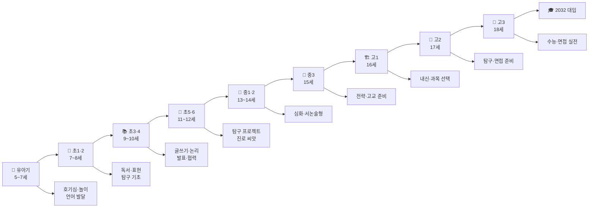

### 📋 단계별 핵심 목표 요약

| 시기 | 핵심 목표 | 가장 중요한 것 | 절대 하지 말아야 할 것 |
|------|---------|------------|-------------------|
| **유아기 (5~7세)** | 호기심과 언어 발달 | 대화·책·놀이 | 과도한 학습지·선행 |
| **초1·2 (7~8세)** | 독서·표현력 기초 | 매일 책 읽기 + 말하기 | 결과만 칭찬 |
| **초3·4 (9~10세)** | 글쓰기·논리 형성 | 독후감·토론 연습 | 문제집만 풀기 |
| **초5·6 (11~12세)** | 탐구 습관 + 진로 탐색 | 탐구 프로젝트 1개 완성 | 분야 너무 넓게 벌리기 |
| **중1·2 (13~14세)** | 서논술형 적응 | 보고서 + 토론 훈련 | 내신 등급에만 집착 |
| **중3 (15세)** | 전략 수립 | 고교·전형 선택 확정 | 준비 없이 진학 |
| **고1 (16세)** | 기초 세팅 | 성취도 A + 과목 선택 | 한 과목 올인 |
| **고2 (17세)** | 탐구·면접 준비 | 탐구보고서 2개 완성 | 수능만 준비 |
| **고3 (18세)** | 마무리 실전 | 수능 + 면접 실전 | 늦은 전략 변경 |

---

---

# ★ 유아·초등 집중 파트 ★

> - **왜 유아·초등부터 시작해야 하나?**
> - 2032 대입의 핵심인 학종(학생부종합전형)은 **"나는 어떤 사람인가"**를 증명하는 전형입니다.
> - 이 스토리는 하루아침에 만들어지지 않습니다.
> - 탐구심·독서력·글쓰기·표현력은 **유아기부터 쌓아야** 고등학교에서 빛납니다.

---

## 1. 🌱 유아기 (5~7세): 호기심·놀이·언어의 씨앗

> **핵심 철학**: 이 시기는 "가르치는 것"이 아니라 "느끼게 하는 것"입니다.
> 비유: 씨앗에 억지로 물을 퍼붓지 말고, 햇빛과 바람과 적당한 물만 주세요. 🌱

### 📊 유아기 발달과 2032 대입 연결 고리

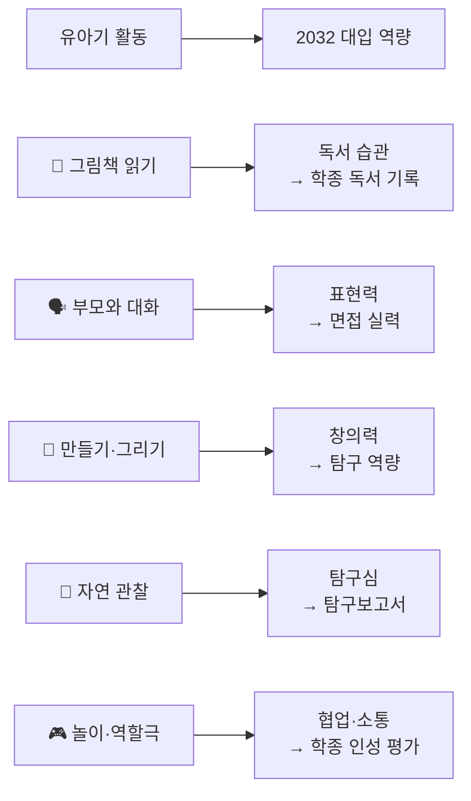

### 📋 연령별 발달 특성과 맞춤 활동

| 나이 | 발달 특성 | 맞춤 활동 | 학종 연결 |
|------|---------|---------|---------|
| **5세** | 상상력 최고조, "왜?"가 많음 | 그림책 하루 2권, 역할 놀이 | 탐구심의 씨앗 |
| **6세** | 언어 폭발, 이야기 구성 가능 | 책 읽고 내용 말하기, 관찰 일지 | 표현력 + 기록 습관 |
| **7세** | 읽기 시작, 논리 싹 | 간단한 그림 일기, 과학 그림책 | 글쓰기 + 탐구 기초 |

---

### 📖 유아기 독서 전략 (5~7세)

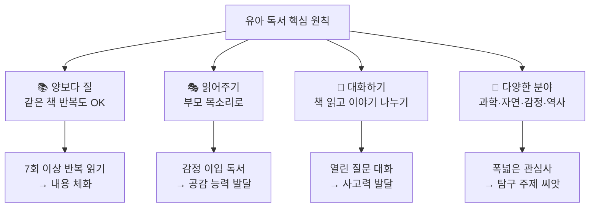

| 독서 유형 | 추천 내용 | 효과 |
|---------|---------|------|
| **과학 그림책** | 동물·식물·우주·날씨 | 탐구심·관찰력 |
| **감정 그림책** | 친구·가족·용기·배려 | 공감·인성 |
| **역사·위인** | 쉬운 위인 그림책 | 사회적 사고 |
| **창작·환상** | 동화·상상 이야기 | 창의력·상상력 |
| **수학·논리** | 수 개념 그림책 | 논리적 사고 기초 |

---

### 🗣️ 유아기 언어·표현력 키우기

> 비유: 면접은 결국 "말"로 나를 증명하는 것. 그 말하기 능력은 5살부터 시작됩니다.

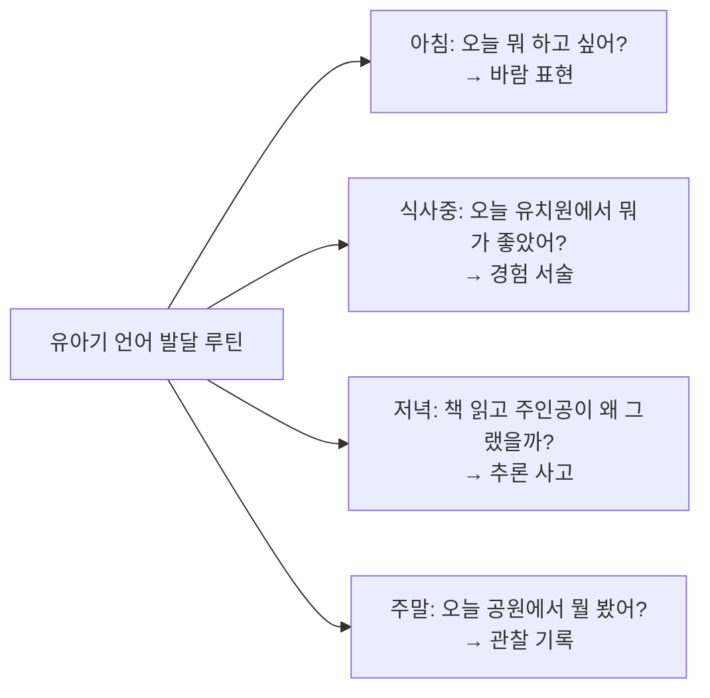

| 대화 유형 | 예시 질문 | 키우는 능력 |
|---------|---------|----------|
| **감정 표현** | "그때 어떤 느낌이었어?" | 감성 + 자기표현 |
| **이유 말하기** | "왜 그렇게 생각해?" | 논리적 사고 |
| **상상하기** | "만약 네가 그 주인공이라면?" | 창의력 |
| **관찰 서술** | "오늘 공원에서 뭘 봤어?" | 관찰력 + 어휘 |
| **예측하기** | "다음엔 어떻게 될 것 같아?" | 추론 능력 |

---

### 🎨 유아기 창의력·탐구력 놀이

| 놀이 종류 | 방법 | 키우는 역량 | 2032 연결 |
|---------|------|----------|---------|
| **자연 탐험** | 공원·텃밭에서 관찰하고 "왜?"질문 | 탐구심·관찰력 | 탐구 보고서의 씨앗 |
| **블록·레고** | 자유롭게 만들고 설명하기 | 공간사고·표현력 | 논리+창의 |
| **역할극** | 의사·과학자·선생님 역할 | 공감·소통·협업 | 학종 인성 평가 |
| **그림 그리기** | 본 것·느낀 것 그림으로 표현 | 관찰·표현력 | 기록 습관 |
| **실험 놀이** | 물·모래·얼음 등 감각 탐구 | 과학적 탐구 기초 | 실험 보고서 기초 |
| **수 놀이** | 장보기·요리할 때 수 개념 | 수학 개념 이해 | 수능 수학 기초 |

### ⚠️ 유아기 절대 하지 말아야 할 것

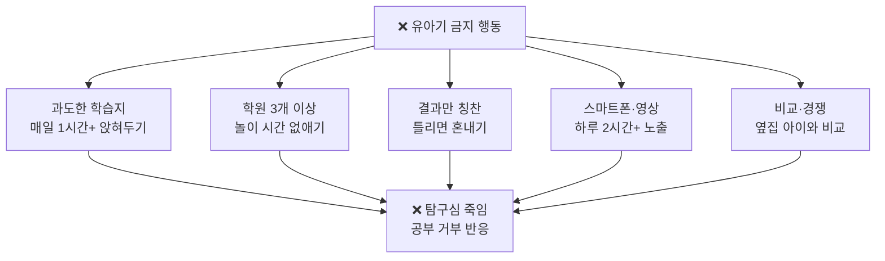

---

## 2. 🐣 초1·2 (7~8세): 독서·표현·탐구 기초

> **핵심 철학**: 공부의 기술을 가르치기 전에, "스스로 읽고 쓰는 즐거움"을 심어주세요.
> 비유: 글자를 깨친 것이 시작이 아니라, 글자로 세상을 탐험하는 것이 시작입니다. 🗺️

### 📊 초1·2의 핵심 발달 과제

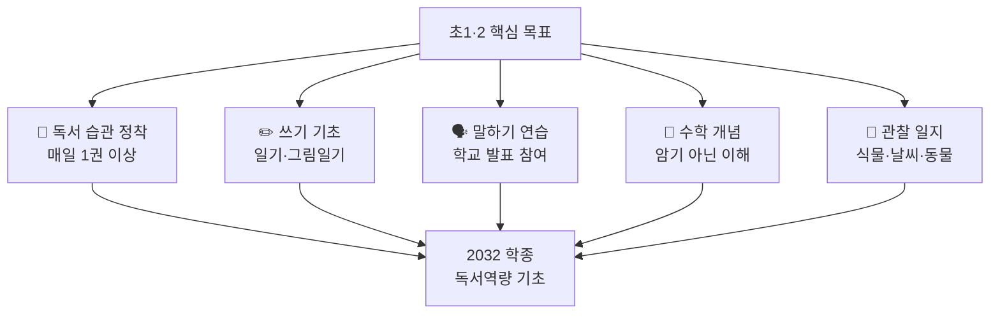

---

### 📖 초1·2 독서 전략: "읽는 아이" 만들기

| 시기 | 독서 목표 | 추천 방법 | 권수 |
|------|---------|---------|------|
| **초1 1학기** | 스스로 읽기 시작 | 쉬운 그림책 + 부모 함께 | 주 5권 |
| **초1 2학기** | 혼자 읽기 정착 | 짧은 동화 혼자 읽기 | 주 5권 |
| **초2 1학기** | 다양한 분야 접촉 | 과학·역사·사회 번갈아 | 주 4~5권 |
| **초2 2학기** | 내용 말하기 연습 | 읽고 부모에게 줄거리 말하기 | 주 4~5권 |

### 📋 초1·2 독서 분야 비율 가이드

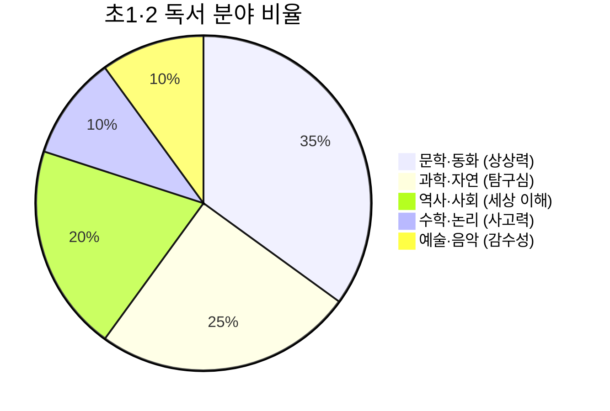

---

### ✏️ 초1·2 글쓰기 기초: "쓰는 아이" 만들기

> 비유: 글쓰기는 근육과 같습니다. 매일 조금씩 써야 나중에 힘을 발휘합니다. 💪

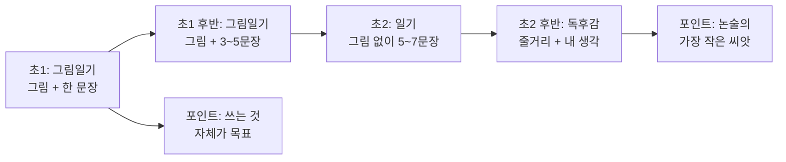

| 글쓰기 유형 | 방법 | 주의사항 |
|---------|------|---------|
| **그림일기** | 하루 일 중 가장 기억나는 것 | 맞춤법 지적 금지! |
| **관찰 일기** | 식물 키우며 매일 변화 기록 | 짧아도 OK |
| **독후감** | "이 책에서 00이 좋았다. 왜냐면 ~" | 느낌 표현이 핵심 |
| **상상 글쓰기** | "만약 내가 공룡이라면~" | 자유롭게 쓰기 |

---

### 🌿 초1·2 탐구 기초: 관찰 일지 만들기

> 탐구의 첫 시작은 **"보고 기록하는 것"**입니다.

| 관찰 주제 | 방법 | 기록 방식 |
|---------|------|---------|
| **씨앗 키우기** | 화분에 씨앗 심고 매일 관찰 | 날짜+그림+한 줄 기록 |
| **날씨 일기** | 매일 날씨·온도 기록 | 달력에 날씨 스티커 + 메모 |
| **곤충 관찰** | 공원에서 곤충 찾아 기록 | 그림 + 특징 쓰기 |
| **요리 실험** | 요리할 때 재료 변화 관찰 | 사진 + 변화 기록 |
| **하늘 관찰** | 구름 모양·별자리 관찰 | 그림 일기 형식 |

---

### 🗣️ 초1·2 말하기·발표 훈련

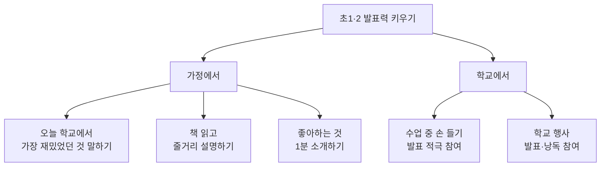

---

## 3. 📚 초3·4 (9~10세): 글쓰기·논리·발표 형성

> **핵심 철학**: 생각을 문장으로, 문장을 단락으로, 단락을 글로 만드는 시기입니다.
> 비유: 이 시기는 작은 나무가 줄기를 뻗는 단계입니다. 🌲

### 📊 초3·4 핵심 역량 개발 방향

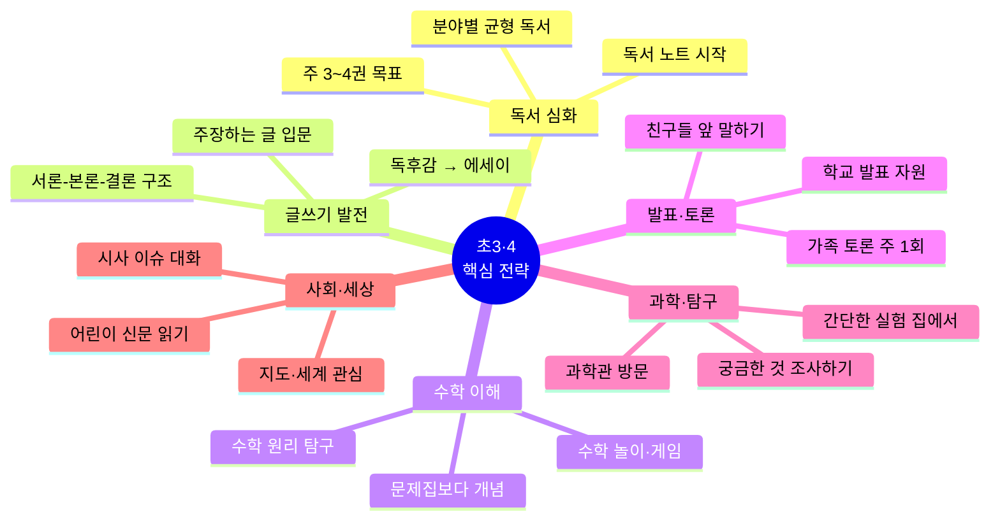

---

### 📖 초3·4 독서 전략: "읽고 생각하는 아이"

| 독서 활동 | 방법 | 빈도 | 효과 |
|---------|------|------|------|
| **독서 노트** | 책 제목·날짜·기억나는 문장·느낌 기록 | 매 권마다 | 기록 습관 + 정리력 |
| **분야별 독서** | 과학·역사·사회·문학 번갈아 | 주 3~4권 | 폭넓은 관심사 |
| **어린이 신문** | 헤드라인 읽고 부모와 이야기 | 주 1~2회 | 세상 이해 + 어휘력 |
| **전공 관련 책** | 관심 분야 1개 집중 | 월 2권 | 탐구 주제 씨앗 |
| **고전 동화** | 명작 동화 원본 읽기 | 한 달에 1권 | 문해력 + 감수성 |

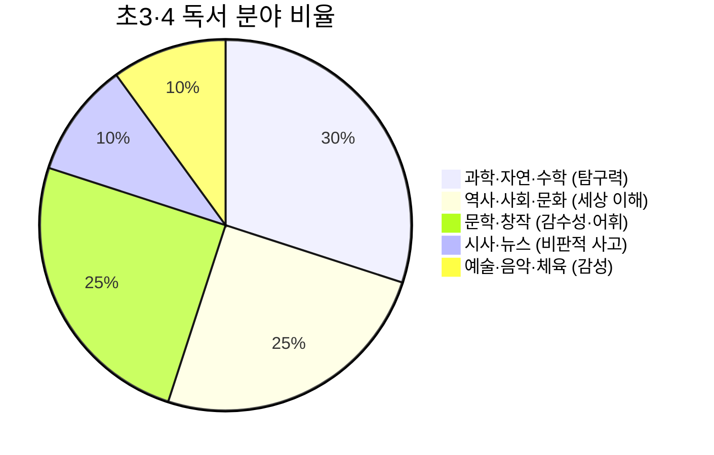

---

### ✍️ 초3·4 글쓰기 발전: "논리적으로 쓰는 아이"

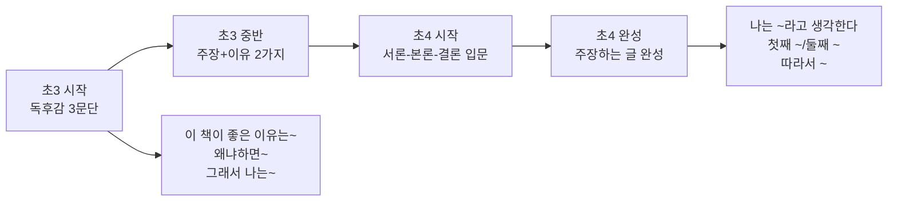

| 글쓰기 유형 | 초3 목표 | 초4 목표 |
|---------|---------|---------|
| **독후감** | 줄거리+느낌+배운 점 (3단락) | 주제+근거+비판 (5단락) |
| **주장하는 글** | 한 가지 의견 + 이유 2개 | 서론-본론-결론 완성 |
| **설명하는 글** | 좋아하는 것 소개 | 원인-결과 구조 |
| **관찰 보고서** | 관찰 + 결과 (그림 포함) | 가설-실험-결과-결론 |

---

### 🔬 초3·4 탐구 입문: "궁금증을 조사하는 아이"

> 비유: 탐구보고서의 씨앗은 "궁금한 것을 그냥 넘기지 않는 것"입니다.

#### 초3·4 탐구 프로세스

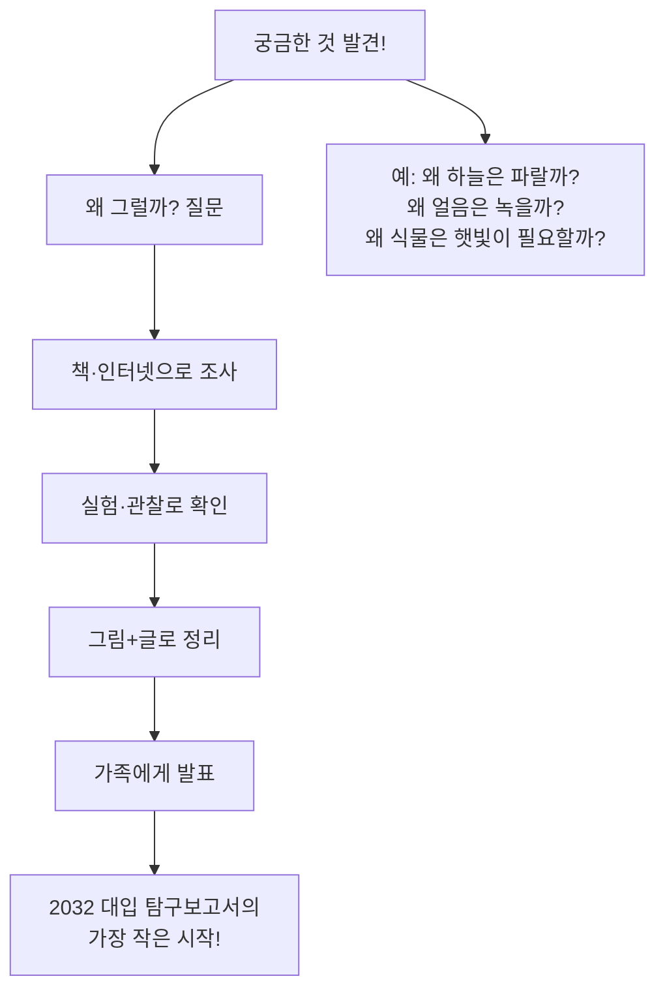

| 탐구 주제 예시 | 방법 | 결과물 |
|------------|------|-------|
| 씨앗이 자라는 조건 | 햇빛/어둠/물 차이 실험 | 관찰 일지 + 사진 |
| 설탕이 녹는 속도 | 온도별 실험 | 표 + 그래프 |
| 우리 동네 나무 종류 | 산책하며 나무 조사 | 스케치북 식물도감 |
| 음식이 상하는 이유 | 온도별 변화 관찰 | 관찰 일지 |

---

### 🗣️ 초3·4 발표·토론: "내 생각을 말하는 아이"

| 활동 | 방법 | 주 빈도 | 키우는 능력 |
|------|------|--------|----------|
| **가족 토론** | 저녁 식사 중 주제 하나 토론 | 주 2회 | 논리력 + 의견 표현 |
| **학교 발표** | 수업 중 발표 적극 자원 | 수시로 | 자신감 + 발표력 |
| **책 소개** | 읽은 책 1분 소개하기 | 월 2회 | 요약력 + 표현력 |
| **뉴스 말하기** | 어린이 신문 기사 한 가지 설명 | 주 1회 | 세상 이해 + 어휘 |

#### 초3·4 가족 토론 주제 예시

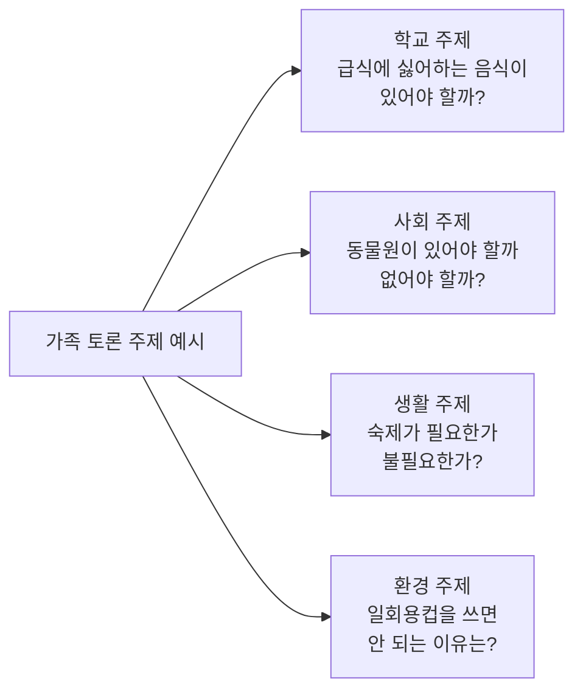

---

## 4. 🔬 초5·6 (11~12세): 탐구 프로젝트·진로 탐색

> **핵심 철학**: 지금 현재 2032 대입의 직접 대상자! 이 시기가 가장 중요합니다.
> 비유: 나무가 꽃을 피우기 전 가지를 뻗는 시기. 지금 넓히고 깊어져야 합니다. 🌳

### 📊 초5·6 핵심 전략 4가지

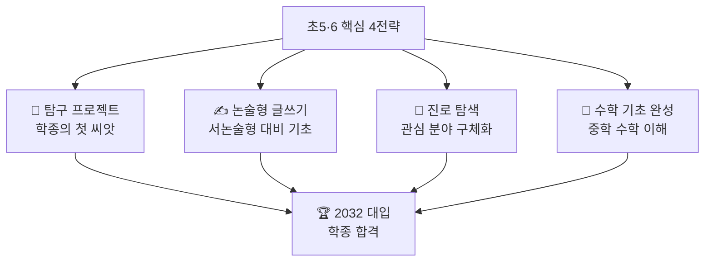

---

### 🔬 초5·6 탐구 프로젝트 완전 가이드

> 비유: 탐구 프로젝트는 "나만의 작은 연구"입니다. 처음엔 서툴러도 괜찮습니다.

#### 탐구 프로젝트 5단계 프로세스

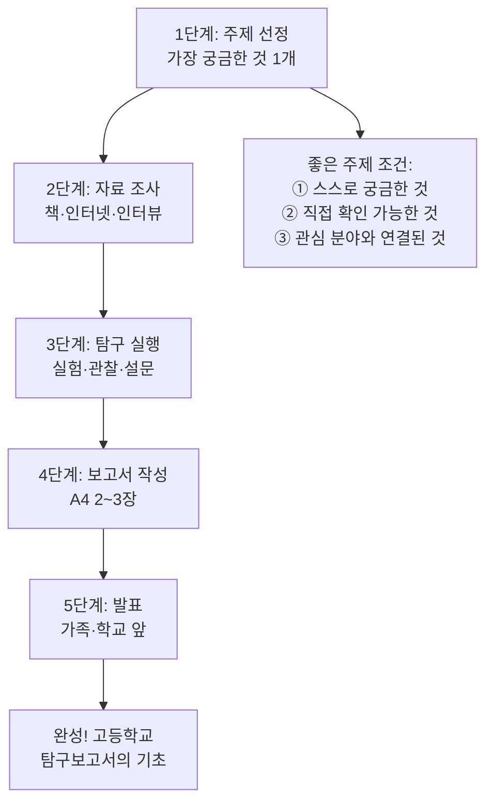

#### 초5·6 탐구 주제 예시 (분야별)

| 분야 | 초5 탐구 주제 예시 | 초6 심화 주제 예시 |
|------|----------------|----------------|
| **생명과학** | 식물이 잘 자라는 조건 | 미생물이 음식 부패에 미치는 영향 |
| **물리·화학** | 물질의 상태 변화 탐구 | 산화·환원 반응 일상 사례 |
| **사회·환경** | 우리 동네 쓰레기 분리수거 현황 | 기후변화가 농업에 미치는 영향 |
| **수학·통계** | 학급 친구들 수면 시간과 성적 관계 | 확률로 보는 날씨 예측 |
| **기술·AI** | AI가 할 수 있는 것과 없는 것 | 챗GPT를 사용한 사람들의 변화 |
| **역사·문화** | 우리 지역 역사 속 숨은 이야기 | 조선시대 과학 기술의 현대 활용 |

---

### 📋 초5·6 탐구보고서 작성 양식

```
📄 나의 첫 탐구보고서 (초등용)

1. 탐구 주제: _______________________
2. 주제를 선택한 이유: ________________
3. 탐구 전 내 예상 (가설): ____________
4. 탐구 방법:
   □ 실험   □ 관찰   □ 자료조사   □ 설문
5. 탐구 과정 (날짜 순서대로):
   날짜: ___ / 한 일: _____________
   날짜: ___ / 한 일: _____________
6. 탐구 결과: ______________________
7. 예상과 달랐던 점: _________________
8. 알게 된 점 + 느낀 점: ______________
9. 더 궁금한 것: ____________________
```

---

### ✍️ 초5·6 논술형 글쓰기: "주장하고 설득하는 아이"

> 2032 수능에는 서논술형이 도입됩니다. 지금부터 연습해야 합니다.

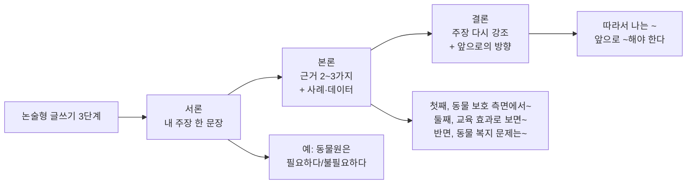

| 글쓰기 훈련 | 초5 목표 | 초6 목표 |
|---------|---------|---------|
| **논설문** | 주장 + 근거 2개 (5단락) | 반론 포함 6단락 |
| **탐구보고서** | 주제+방법+결과 (A4 2장) | 서론+본론+결론 (A4 3장) |
| **독후감** | 작가 의도 분석 + 비판 | 사회적 맥락 연결 |
| **에세이** | 경험 + 의미 (700자) | 성찰 + 배운 점 (1000자) |

---

### 🎯 초5·6 진로 탐색: "나는 무엇에 흥미가 있나?"

> 비유: 진로는 "정답"이 아니라 "방향"입니다. 지금 결정하는 게 아니라 탐험하는 겁니다.

```mermaid
graph TD
    A[초5·6 진로 탐색 방법] --> B[체험·경험]
    A --> C[독서·영상]
    A --> D[대화·인터뷰]
    A --> E[관심사 기록]

    B --> B1[과학관·박물관·미술관<br>직업 체험 프로그램<br>동아리·방과후 활동]
    C --> C1[전문가 유튜브 채널<br>전공 관련 책<br>TED 강연 (영어)]
    D --> D1[부모 직장 탐방<br>관심 직업 인터뷰<br>선생님과 대화]
    E --> E1[관심 분야 노트<br>꿈 일기 쓰기<br>포트폴리오 시작]
```

#### 초5·6 진로 탐색 관심사 점검표

| 영역 | 나는 이게 좋다 (✅) | 관련 학과 |
|------|----------------|---------|
| **생명·의학** | 동물, 식물, 몸, 건강 | 의대·약대·수의대·생명과학 |
| **물리·공학** | 기계, 전기, 컴퓨터, 로봇 | 공대·전자·기계·컴공 |
| **수학·통계** | 숫자, 패턴, 논리, 퍼즐 | 수학·통계·경제·데이터 |
| **사회·인문** | 사람, 역사, 문화, 정치 | 사회학·역사·법·행정 |
| **언어·글쓰기** | 읽기, 쓰기, 외국어 | 국문·영문·언론·교육 |
| **예술·디자인** | 그리기, 음악, 영상 | 미대·음대·디자인·영상 |
| **AI·데이터** | 코딩, 분석, 인공지능 | AI학과·소프트웨어 |

---

### 📐 초5·6 수학 전략: "개념을 이해하는 아이"

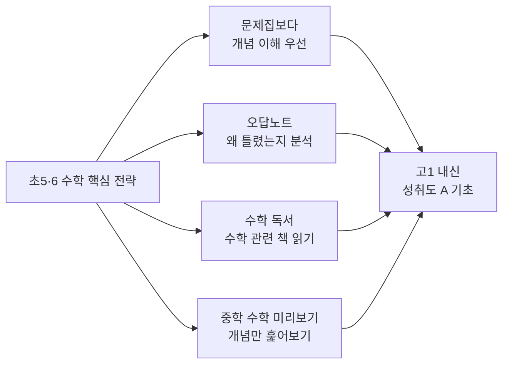

| 학기 | 수학 목표 | 방법 |
|------|---------|------|
| **초5 1학기** | 분수·소수 완벽 이해 | 개념 설명 후 응용 |
| **초5 2학기** | 약수·배수·비율 완성 | 실생활 연결 이해 |
| **초6 1학기** | 비례·통계 완성 | 그래프 그리기 연습 |
| **초6 2학기** | 중1 수학 개념 미리보기 | 방정식·함수 기초 |

---

### 💻 초5·6 AI·디지털 역량: AI 시대 기초

> 2032 대입을 보는 아이들은 AI 원어민 세대입니다. AI를 두려워하지 말고 친구처럼 쓰세요.

| AI·디지털 활동 | 방법 | 효과 |
|-------------|------|------|
| **AI 도구 탐색** | ChatGPT·뤼튼 등 사용해보기 | AI 원리 이해 |
| **AI와 탐구** | 탐구 자료 조사에 AI 활용 | AI 활용 능력 |
| **코딩 기초** | 스크래치·엔트리로 게임 만들기 | 논리적 사고 |
| **정보 검증** | AI 답변이 맞는지 확인하기 | 비판적 사고 |
| **디지털 창작** | 영상·PPT·포스터 만들기 | 표현력 + 도구 활용 |

---

---

# 중·고등 파트 (요약)

---

## 5. 🌿 중1·2 (13~14세): 역량 심화

> **핵심 철학**: 광범위한 탐색에서 "깊이 있는 집중"으로 전환하는 시기

### 📋 중1·2 핵심 과제

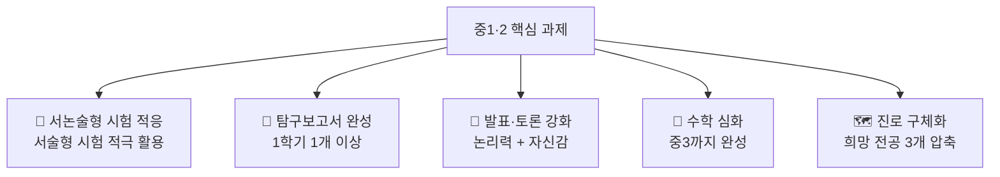

| 구분 | 중1 | 중2 |
|------|-----|-----|
| **독서** | 월 4권, 다양한 분야 | 월 4권, 전공 분야 집중 |
| **글쓰기** | 독후감 → 에세이 | 주장하는 글 → 논문 형식 |
| **탐구** | 관심 주제 탐구 1개 | 심화 탐구 2개 이상 |
| **수학** | 중1 완성 | 중2~3 심화 |
| **AI 활용** | AI 도구 탐색 | AI 활용 탐구 보조 |

---

## 6. 🎯 중3 (15세): 전략 수립

### 📋 중3 필수 의사결정

```mermaid
graph TD
    A[중3 핵심 선택] --> B[고교 유형 결정]
    A --> C[희망 전공 TOP3]
    A --> D[전형 전략 수립]
    A --> E[수학 기초 완성]

    B --> B1[일반고/과학고/자사고/예술고]
    C --> C1[권장과목 목록 확인]
    D --> D1[학종/교과/논술/정시]
    E --> E1[고1 내신 1등급 기초]
```

---

## 7. 🏗️ 고1 (16세): 기초 세팅

| 핵심 과제 | 내용 | 중요도 |
|---------|------|--------|
| 내신 성취도 A 사수 | 모든 과목 90% 이상 | ⭐⭐⭐⭐⭐ |
| 권장과목 선택 | 전공 연계 과목 필수 이수 | ⭐⭐⭐⭐⭐ |
| 탐구보고서 1개 | 주제 선정~완성 | ⭐⭐⭐⭐⭐ |
| 수능 기초 개념 | 수학·국어·영어 | ⭐⭐⭐⭐ |
| 세특 관리 | 수업 중 발표·질문 | ⭐⭐⭐⭐ |

---

## 8. 🔨 고2 (17세): 본격 준비 ← 가장 중요한 1년

| 핵심 과제 | 내용 | 완료 목표 |
|---------|------|---------|
| 탐구보고서 2개 | 전공 연계 심화 탐구 | 12월까지 |
| 면접 기초 훈련 | 1분 자기소개 + 예상 질문 30개 | 9월까지 |
| 수능 수학 완성 | 수학Ⅱ + 확률통계 | 12월까지 |
| 권장과목 성취도 | A 등급 달성 | 매 학기 |
| AI 면접 연습 | AI 모의면접 도구 활용 | 10월부터 |

---

## 9. 💪 고3 (18세): 마무리 전략

| 시기 | 핵심 과제 |
|------|---------|
| **1~8월** | 수능 집중 + 학생부 마무리 |
| **9월** | 🎯 수능 시험 (2032 예측: 9월) |
| **10~11월** | 면접 실전 집중 |
| **12월** | 통합 원서 접수 (예측) |

---

## 10. 단계별 역량 발달 비교표

### 📋 8단계 × 8개 역량 발달 완전 비교

| 핵심 역량 | 유아기 | 초1·2 | 초3·4 | 초5·6 | 중1·2 | 중3 | 고1 | 고2 | 고3 |
|---------|------|------|------|------|------|-----|-----|-----|-----|
| **독서** | 그림책 | 동화 | 다양한 분야 | 전공 탐색 | 전공 집중 | 전공 심화 | 학술 도서 | 논문 입문 | 마무리 |
| **글쓰기** | 그림일기 | 일기 | 독후감 | 논설문 | 탐구보고서 | 심화 보고서 | 세특 관리 | 보고서 완성 | 자소서 |
| **수학** | 수 개념 | 사칙연산 | 분수·소수 | 중1 미리보기 | 중3 완성 | 고1 기초 | 고1 완성 | 수능 수학 | 수능 완성 |
| **탐구** | 자연관찰 | 관찰일지 | 첫 탐구 | 탐구 프로젝트 | 보고서 | 심화 탐구 | 연계 탐구 | 2개 완성 | 마무리 |
| **발표·면접** | 이야기 | 발표 참여 | 발표 도전 | 토론 참여 | 논리 토론 | 1분 소개 | 학교 발표 | 면접 중급 | 실전 면접 |
| **AI 활용** | 없음 | 기초 접촉 | 영상·도구 | 탐구 보조 | AI 검색 | AI 분석 | AI 학습 | AI 면접 | AI 모의 |
| **진로** | 관심사 탐색 | 좋아하는 것 | 체험·경험 | 분야 좁히기 | 전공 탐색 | 학과 결정 | 대학 조사 | 전형 결정 | 지원 확정 |
| **글로벌** | 외국어 노출 | 영어 노래 | 영어 독서 | 영어 원서 | 독해 강화 | 절대평가 | 1등급 목표 | 유지 | 유지 |

---

## 11. 학부모 단계별 가이드

> **핵심 메시지**: 성적을 올려주는 것이 아닌, 아이의 "스토리"를 함께 만들어 주세요.

### 📋 시기별 학부모 역할 변화

```mermaid
graph LR
    A[유아기<br>경험 제공자] --> B[초1·2<br>독서 파트너]
    B --> C[초3·4<br>글쓰기 코치]
    C --> D[초5·6<br>탐구 지원자]
    D --> E[중학교<br>전략 파트너]
    E --> F[고등학교<br>심리 서포터]

    A --> A1[다양한 경험<br>제공·질문 수용]
    B --> B1[함께 읽기<br>대화·반응]
    C --> C1[글쓰기 피드백<br>토론 상대]
    D --> D1[탐구 조력<br>체험 기회 마련]
    E --> E1[입시 정보 파악<br>방향 같이 고민]
    F --> F1[건강·식사<br>감정 지지]
```

### 📋 시기별 학부모 해야 할 것 vs 하지 말아야 할 것

| 시기 | ✅ 해야 할 것 | ❌ 하지 말아야 할 것 |
|------|-----------|----------------|
| **유아기** | 함께 책 읽기 / 질문에 같이 찾아보기 / 자연 탐험 | 과도한 학원 / 선행학습 강요 / 스마트폰 과다 |
| **초1·2** | 매일 독서 환경 / 일기 쓰도록 격려 / 발표 응원 | 맞춤법 지적 / 결과만 칭찬 / 비교 |
| **초3·4** | 가족 토론 / 글쓰기 피드백 / 과학관 방문 | 숙제 대신 해주기 / 문제집만 풀리기 |
| **초5·6** | 탐구 주제 같이 고민 / 체험 활동 지원 / AI 도구 함께 탐색 | 탐구보고서 대신 써주기 / 분야 강요 |
| **중학교** | 전형 정보 같이 공부 / 탐구 피드백 / 모의면접 상대 | 부모 의견 강요 / 과도한 사교육 |
| **고등학교** | 심리적 지지 / 건강 관리 / 정보 수집 대신 공유 | 과도한 간섭 / 성적에만 집착 |

### 💡 학부모가 지금 당장 할 수 있는 3가지

```mermaid
graph TD
    A[학부모 즉시 실천] --> B[1. 오늘 저녁<br>아이에게 질문하기<br>"오늘 뭐가 제일 궁금했어?"]
    A --> C[2. 이번 주말<br>도서관·과학관 가기<br>아이 관심 분야로]
    A --> D[3. 이번 달부터<br>독서 노트 시작<br>읽은 책 기록하기]

    B --> E[🏆 2032 대입<br>학종 합격의<br>작은 시작]
    C --> E
    D --> E
```

---

## 📌 최종 요약

### ✅ 유아·초등이 2032 대입에서 이기는 핵심 5가지

> 1. **유아기부터 독서** → 어휘력·사고력·공감력의 기초
> 2. **초등부터 글쓰기** → 서논술형 수능의 출발점
> 3. **초5·6부터 탐구 프로젝트** → 학종 스토리의 씨앗
> 4. **매 단계 발표·토론** → 면접 실력의 뿌리
> 5. **AI와 친해지기** → 도구로 활용하되 진정성은 자신이

### 📋 단계별 핵심 한 줄 요약

| 시기 | 한 줄 요약 |
|------|---------|
| **유아기** | "왜?"라는 질문이 탐구보고서의 씨앗입니다 |
| **초1·2** | 매일 책 1권이 10년 뒤 면접 실력이 됩니다 |
| **초3·4** | 독후감 1장이 논술 1페이지의 기초입니다 |
| **초5·6** | 탐구 프로젝트 1개가 학종 합격의 출발점입니다 |
| **중1·2** | 서논술형 시험이 익숙한 아이가 2032 대입을 이깁니다 |
| **중3** | 전략 없이 고등학교 가면 3년이 낭비됩니다 |
| **고1** | 성취도 A와 과목 선택이 학종의 첫 단추입니다 |
| **고2** | 탐구보고서 2개 + 면접 훈련이 고2의 전부입니다 |
| **고3** | 마무리입니다. 새로 시작이 아닙니다 |

---

## 🔗 참고 출처

- [경기도교육청 미래 대입개혁 연구](https://www.goe.go.kr/resource/goe/na/bbs_2675/2025/11/6b926081-60e5-4d74-8ea6-c11f9a368dd4.pdf)
- [아이스크림 홈런: 2025 개정 교육과정](https://www.home-learn.co.kr/newsroom/news/A/2497)
- [큐라이트: AI 시대 아이 학습 능력 키우기](https://quewrite.ai/en/blog/ai-%EC%8B%9C%EB%8C%80-%EC%9A%B0%EB%A6%AC-%EC%95%84%EC%9D%B4%EC%9D%98-%ED%95%99%EC%8A%B5-%EB%8A%A5%EB%A0%A5-%EC%96%B4%EB%96%BB%EA%B2%8C-%ED%82%A4%EC%9B%8C%EC%A4%84%EA%B9%8C)
- [코칭맘: 경쟁력 있는 학생부 과학 탐구보고서](https://coachingmom.co.kr/education/strategy/4406/%EA%B2%BD%EC%9F%81%EB%A0%A5-%EC%9E%88%EB%8A%94-%ED%95%99%EA%B5%90%EC%83%9D%ED%99%9C%EA%B8%B0%EB%A1%9D%EB%B6%80%EC%9D%98-%ED%95%B5%EC%8B%AC-%EC%9E%AC%EB%A3%8C-%EA%B3%BC%ED%95%99-%EA%B3%BC%EC%A0%9C/)
- [베이비뉴스: 독서 환경 만들기](https://www.ibabynews.com/news/articleView.html?idxno=84653)
- [나일에듀: 학종 독서활동 제대로 읽기](https://naeiledu.co.kr/31791)
- [서울교육청 2040 수능폐지 제안](https://www.edpl.co.kr/news/articleView.html?idxno=18929)
- [에듀진: 학종 면접 유형별 대비법](http://www.edujin.co.kr/news/articleView.html?idxno=40244)

---
*📝 본 자료는 2026년 4월 기준 교육부·교육청 발표, 입시 전문 기관 분석, 발달 교육 전문가 자료를 종합하여 작성되었습니다.*
*2032 대입 관련 내용은 제안·예측 단계이며, 교육부 최종 확정안과 다를 수 있습니다.*
