# 🔮 2032 대입 예측 완전 분석
> 작성일: 2026년 4월 | 대상: 현 초5~초6 (2032년도 입시 해당 학생)
> ⚠️ 이 자료는 교육부·교육청 공식 발표 + 전문가 분석 + 예측을 종합한 자료입니다.
> 아직 확정되지 않은 내용은 🔮 예측 표시로 구분합니다.

---

## 📌 목차

```
2032 대입 예측 완전 분석
├── 1. 2032 대입을 이해하는 핵심 키워드
├── 2. 2028 vs 2032 대입 완전 비교
├── 3. 수능 대변신 (절대평가 + 서논술형)
│   ├── 3-1. 수능 구조 변화
│   ├── 3-2. 수능 이원화: 수능I vs 수능II
│   └── 3-3. AI 채점 3단계 시스템
├── 4. 내신 완전 변화 (성취평가제 전면 도입)
├── 5. 전형별 비율 차트 및 예측
│   ├── 5-1. 수시·정시 통합 후 전형 비율
│   ├── 5-2. 학종 강화 예측 비율
│   └── 5-3. 전형 내 평가 요소 비율
├── 6. 수시·정시 통합의 의미
├── 7. 학종(학생부위주전형) 대변환
├── 8. AI 시대 평가 혁신
├── 9. 로드맵: 2028 → 2032 → 2040 미래 입시
├── 10. 학년별 대비 전략 (초5~중3)
├── 11. 2028 vs 2032 전략 비교표
└── 12. 핵심 요약 및 결론
```

---

## 1. 2032 대입을 이해하는 핵심 키워드

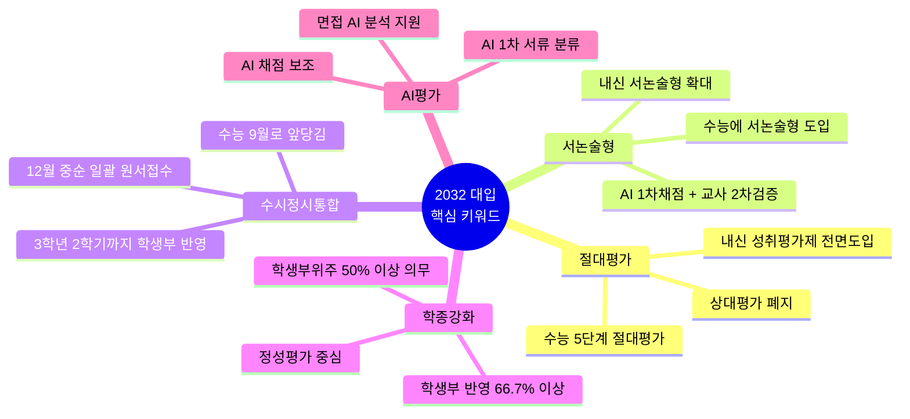
```mermaid
mindmap
  root((2032 대입<br>핵심 키워드))
    절대평가
      수능 5단계 절대평가
      내신 성취평가제 전면도입
      상대평가 폐지
    서논술형
      수능에 서논술형 도입
      내신 서논술형 확대
      AI 1차채점 + 교사 2차검증
    수시정시통합
      12월 중순 일괄 원서접수
      수능 9월로 앞당김
      3학년 2학기까지 학생부 반영
    학종강화
      학생부위주 50% 이상 의무
      학생부 반영 66.7% 이상
      정성평가 중심
    AI평가
      AI 1차 서류 분류
      AI 채점 보조
      면접 AI 분석 지원
```

### 📋 2032 대입 핵심 변화 한눈에 보기

| 구분 | 2028 (현재 변화) | 2032 (예측) | 변화 방향 |
|------|----------------|------------|---------|
| **수능 평가** | 상대평가 (일부 절대평가) | 5단계 절대평가 전면 | 경쟁→성취 |
| **수능 형식** | 객관식 중심 | 객관식 + 서논술형 병행 | 암기→사고력 |
| **영어 듣기** | 유지 | 🔮 폐지 예정 | 부담 축소 |
| **내신 평가** | 5등급 상대평가 | 절대평가(성취평가) 전면 | 경쟁→성장 |
| **수시·정시** | 분리 운영 | 🔮 통합 (12월 일괄) | 복잡→단순 |
| **학종 비율** | 42% 예상 | 🔮 50% 이상 의무 | 확대 |
| **AI 활용** | 면접 보조 수준 | AI 채점·평가 공식화 | 도입→정착 |

---

## 2. 2028 vs 2032 대입 완전 비교

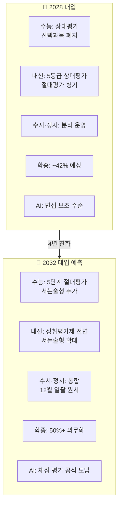
```mermaid
graph TD
    subgraph A28["📘 2028 대입"]
        A1[수능: 상대평가<br>선택과목 폐지]
        A2[내신: 5등급 상대평가<br>절대평가 병기]
        A3[수시·정시: 분리 운영]
        A4[학종: ~42% 예상]
        A5[AI: 면접 보조 수준]
    end

    subgraph A32["📗 2032 대입 예측"]
        B1[수능: 5단계 절대평가<br>서논술형 추가]
        B2[내신: 성취평가제 전면<br>서논술형 확대]
        B3[수시·정시: 통합<br>12월 일괄 원서]
        B4[학종: 50%+ 의무화]
        B5[AI: 채점·평가 공식 도입]
    end

    A28 -->|4년 진화| A32
```

### 📋 전형 구조 완전 비교표

| 비교 항목 | 2028 대입 | 2032 대입 (예측) | 누가 유리해지나? |
|----------|---------|---------------|--------------|
| **수능 역할** | 최저 or 정시 핵심 | 절대평가로 변별력 약화 | 수능형 불리 |
| **내신 역할** | 5등급 (변별력 약) | 절대평가 (더 약해짐) | 내신형도 불리 |
| **학종 역할** | 강화 시작 | 과반 이상 독식 | 학종형 유리 |
| **서논술형** | 없음 | 수능·내신 모두 도입 | 사고력 강한 학생 |
| **수능 시기** | 11월 | 🔮 9월로 앞당김 | 고3 2학기 학생부↑ |
| **원서접수** | 수시9월/정시12월 | 🔮 12월 통합 | 전략 단순화 |
| **면접** | 일부 확대 | 전반적 필수화 | 말 잘하는 학생 |

---

## 3. 수능 대변신

### 3-1. 수능 구조 변화 흐름

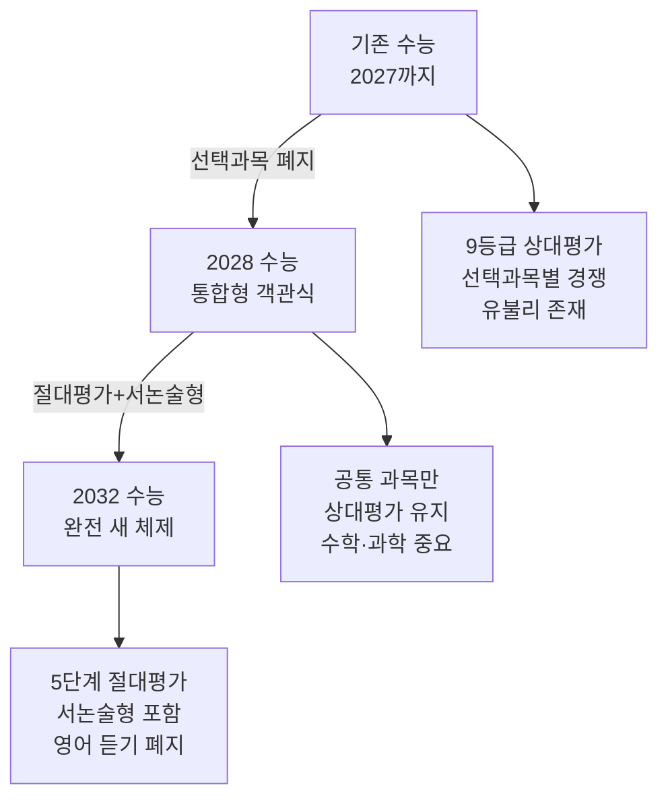
```mermaid
graph TD
    A[기존 수능<br>2027까지] -->|선택과목 폐지| B[2028 수능<br>통합형 객관식]
    B -->|절대평가+서논술형| C[2032 수능<br>완전 새 체제]

    A --> A1[9등급 상대평가<br>선택과목별 경쟁<br>유불리 존재]
    B --> B1[공통 과목만<br>상대평가 유지<br>수학·과학 중요]
    C --> C1[5단계 절대평가<br>서논술형 포함<br>영어 듣기 폐지]
```

### 📋 수능 3단계 변화 비교표

| 수능 영역 | 기존 (2027) | 2028 | 2032 (예측) |
|----------|-----------|------|-----------|
| **국어** | 상대평가+선택 | 공통 상대평가 | 5단계 절대+서논술 |
| **수학** | 상대평가+선택 | 공통 상대평가 | 5단계 절대+서논술 |
| **영어** | 절대평가 | 절대평가 유지 | 절대평가+듣기폐지 |
| **탐구** | 선택과목 | 통합사회+통합과학 | 절대평가 통합형 |
| **한국사** | 절대평가 | 절대평가 | 절대평가 유지 |
| **평가 형식** | 객관식 | 객관식 | 객관식+서논술형 |
| **채점 방식** | 기계채점 | 기계채점 | AI 1차+교사 2차 |

---

### 3-2. 수능 이원화: 수능Ⅰ vs 수능Ⅱ

> 비유: 수능이 두 개로 나뉜다! 🔲🔳

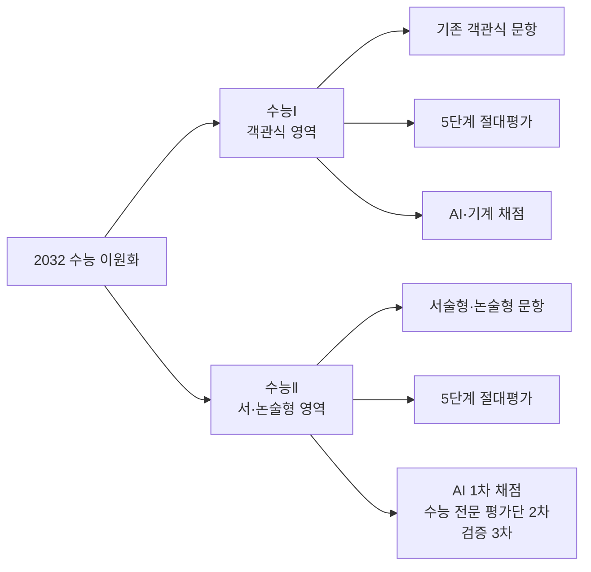
```mermaid
graph LR
    A[2032 수능 이원화] --> B[수능Ⅰ<br>객관식 영역]
    A --> C[수능Ⅱ<br>서·논술형 영역]

    B --> B1[기존 객관식 문항]
    B --> B2[5단계 절대평가]
    B --> B3[AI·기계 채점]

    C --> C1[서술형·논술형 문항]
    C --> C2[5단계 절대평가]
    C --> C3[AI 1차 채점<br>수능 전문 평가단 2차<br>검증 3차]
```

### 📋 수능Ⅰ vs 수능Ⅱ 비교표

| 구분 | 수능Ⅰ (객관식) | 수능Ⅱ (서논술형) |
|------|-------------|--------------|
| **문항 유형** | OMR 마킹 | 직접 작성 |
| **평가 내용** | 지식 이해·적용 | 사고력·창의력·논리력 |
| **채점 방법** | 기계 자동채점 | AI 1차 + 전문가 검증 |
| **준비 방법** | 유형별 반복 훈련 | 글쓰기·논리 훈련 |
| **변별력** | 낮음 (절대평가) | 상대적으로 높음 |

---

### 3-3. AI 채점 3단계 시스템

> 비유: 선생님 혼자 100명 채점 → AI가 먼저 정리하고 선생님이 확인하는 방식

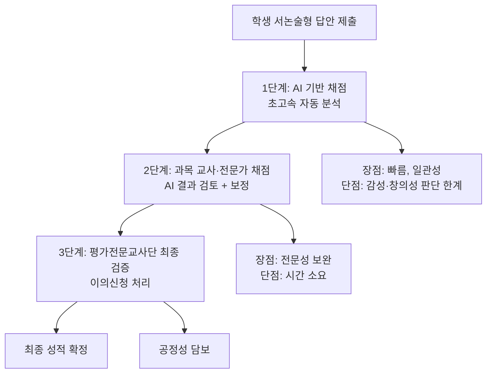
```mermaid
graph TD
    A[학생 서논술형 답안 제출] --> B[1단계: AI 기반 채점<br>초고속 자동 분석]
    B --> C[2단계: 과목 교사·전문가 채점<br>AI 결과 검토 + 보정]
    C --> D[3단계: 평가전문교사단 최종 검증<br>이의신청 처리]
    D --> E[최종 성적 확정]

    B --> B1[장점: 빠름, 일관성<br>단점: 감성·창의성 판단 한계]
    C --> C1[장점: 전문성 보완<br>단점: 시간 소요]
    D --> D1[공정성 담보]
```

### 📋 내신 서논술형 채점 vs 수능 서논술형 채점 비교

| 구분 | 내신 서논술형 채점 | 수능 서논술형 채점 |
|------|----------------|----------------|
| **1단계** | AI 기반 채점 | AI 기반 채점 |
| **2단계** | 담당 과목 교사 | 수능 전문 평가단 |
| **3단계** | 평가전문교사단 보정 | 검증팀 최종 확인 |
| **기간** | 학기 중 상시 | 수능 후 단기 집중 |

---

## 4. 내신 완전 변화: 성취평가제 전면 도입

### 📊 내신 3단계 변화 흐름

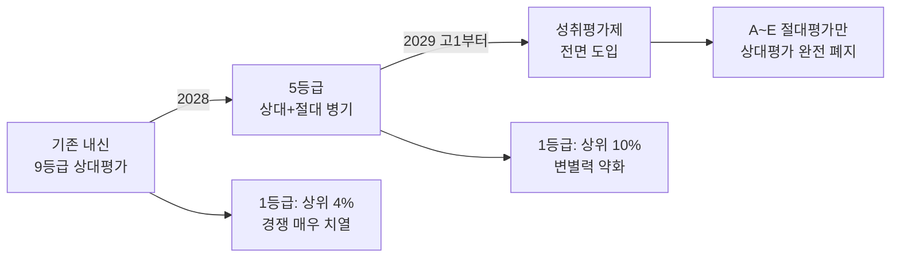
```mermaid
graph LR
    A[기존 내신<br>9등급 상대평가] -->|2028| B[5등급<br>상대+절대 병기]
    B -->|2029 고1부터| C[성취평가제<br>전면 도입]

    A --> A1[1등급: 상위 4%<br>경쟁 매우 치열]
    B --> B1[1등급: 상위 10%<br>변별력 약화]
    C --> C1[A~E 절대평가만<br>상대평가 완전 폐지]
```

### 📋 내신 변화 단계별 일정

| 시기 | 대상 | 변화 내용 |
|------|------|---------|
| **2026 (현재)** | 중학교 1학년 입학생 | 서·논술형 평가 비중 점진적 확대 시작 |
| **2029** | 고등학교 1학년 | 전 과목 절대평가(성취평가) 전면 도입 |
| **2031** | 중·고교 전 학년 | 지필평가 서·논술형 확대 완성 |
| **2032** | 대입 적용 | 절대평가 내신 + 수능으로 대입 |

### 📋 성취평가제 등급 기준 (예상)

| 등급 | 성취율 | 의미 | 기존 9등급 비교 |
|------|--------|------|--------------|
| **A** | 90% 이상 | 최상위 달성 | 1등급과 유사 |
| **B** | 80~89% | 상위 달성 | 2~3등급 |
| **C** | 70~79% | 보통 달성 | 4~5등급 |
| **D** | 60~69% | 기초 달성 | 6~7등급 |
| **E** | 60% 미만 | 미달 | 8~9등급 |

### 💡 성취평가제 도입의 핵심 의미

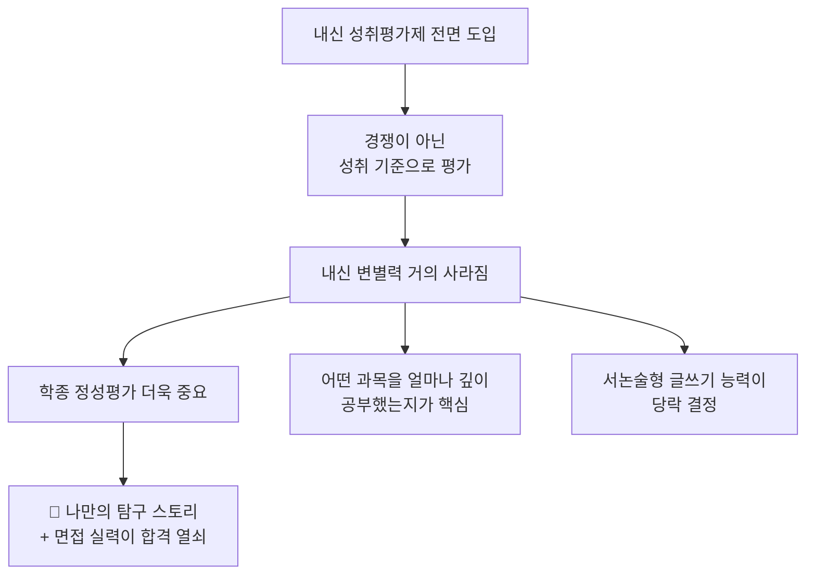
```mermaid
graph TD
    A[내신 성취평가제 전면 도입] --> B[경쟁이 아닌<br>성취 기준으로 평가]
    B --> C[내신 변별력 거의 사라짐]
    C --> D1[학종 정성평가 더욱 중요]
    C --> D2[어떤 과목을 얼마나 깊이<br>공부했는지가 핵심]
    C --> D3[서논술형 글쓰기 능력이<br>당락 결정]

    D1 --> E[🔑 나만의 탐구 스토리<br>+ 면접 실력이 합격 열쇠]
```

---

## 5. 전형별 비율 차트 및 예측

### 5-1. 수시·정시 통합 후 전형 비율 예측

> ⚠️ 수시·정시 통합 후에는 '1차 모집'과 '2차 모집'으로 운영 예상

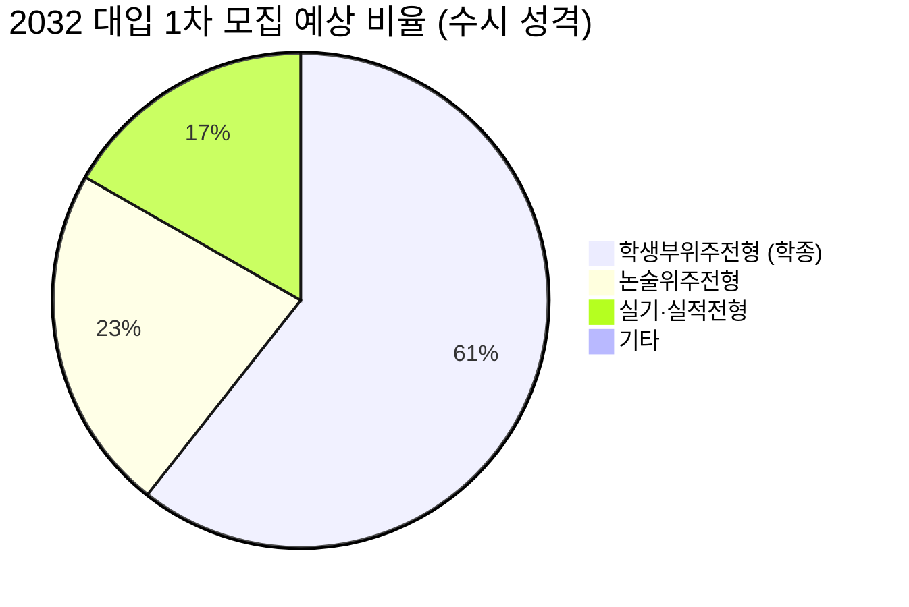
```mermaid
pie title 2032 대입 1차 모집 예상 비율 (수시 성격)
    "학생부위주전형 (학종)" : 60.5
    "논술위주전형" : 22.6
    "실기·실적전형" : 16.7
    "기타" : 0.2
```

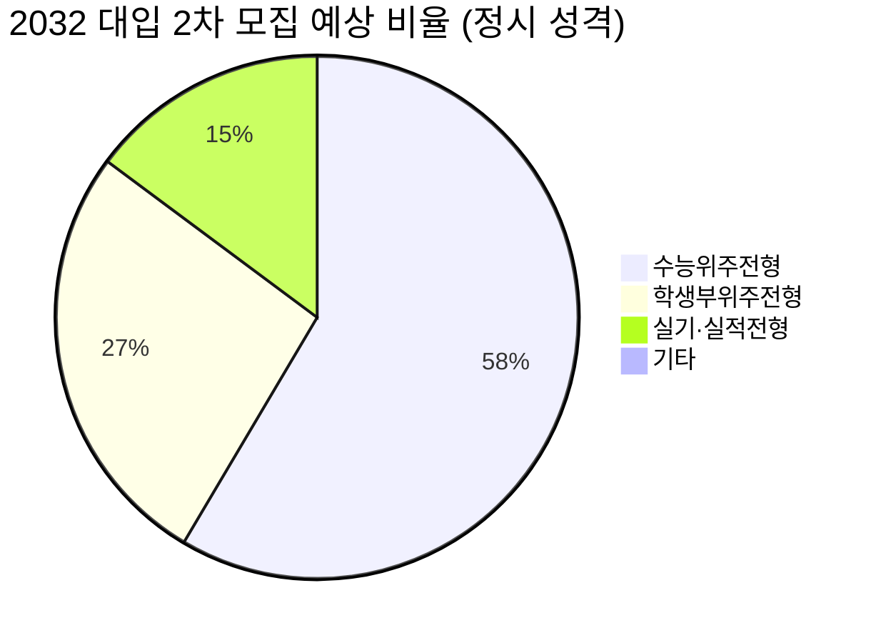
```mermaid
pie title 2032 대입 2차 모집 예상 비율 (정시 성격)
    "수능위주전형" : 58.4
    "학생부위주전형" : 26.6
    "실기·실적전형" : 14.8
    "기타" : 0.2
```

### 📋 1차·2차 통합 전형 비율 비교표

| 전형 | 1차 모집 (수시 성격) | 2차 모집 (정시 성격) | 특징 |
|------|-------------------|-------------------|------|
| **학생부위주 (학종)** | 60.5% | 26.6% | 1차에서 압도적 |
| **수능위주** | 없음 | 58.4% | 2차에서 핵심 |
| **논술위주** | 22.6% | 없음 | 1차에만 존재 |
| **실기·실적** | 16.7% | 14.8% | 양쪽 비슷 |

---

### 5-2. 2028 vs 2032 학종 비율 변화

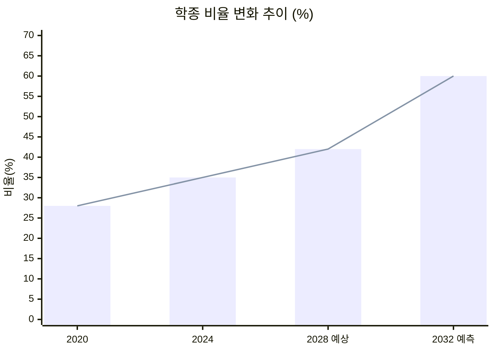
```mermaid
xychart-beta
    title "학종 비율 변화 추이 (%)"
    x-axis ["2020", "2024", "2028 예상", "2032 예측"]
    y-axis "비율(%)" 0 --> 70
    bar [28, 35, 42, 60]
    line [28, 35, 42, 60]
```

### 📋 전형별 비중 변화 (2020→2032)

| 전형 | 2020 | 2024 | 2028 예상 | 2032 예측 | 트렌드 |
|------|------|------|---------|---------|------|
| **학종** | 28% | 35% | 42% | 60%+ | 📈 지속 증가 |
| **교과전형** | 20% | 14% | 12% | 10% | 📉 감소 |
| **논술** | 10% | 9% | 8% | 5%? | 📉 감소 |
| **정시(수능)** | 40% | 40% | 35% | 25% | 📉 감소 |

---

### 5-3. 학종 내부 평가 요소 비율 (2032 예측)

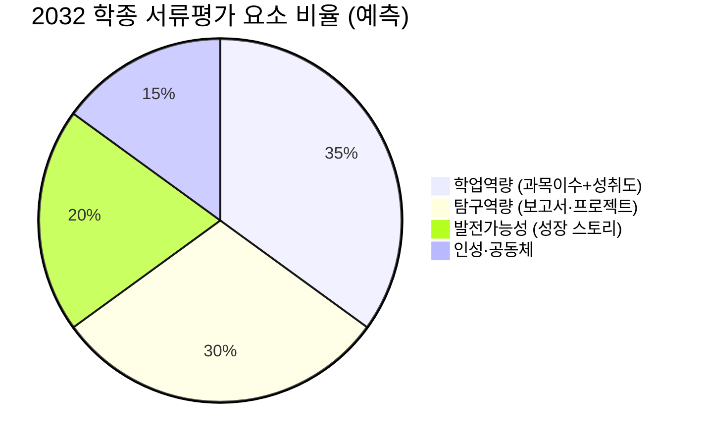
```mermaid
pie title 2032 학종 서류평가 요소 비율 (예측)
    "학업역량 (과목이수+성취도)" : 35
    "탐구역량 (보고서·프로젝트)" : 30
    "발전가능성 (성장 스토리)" : 20
    "인성·공동체" : 15
```

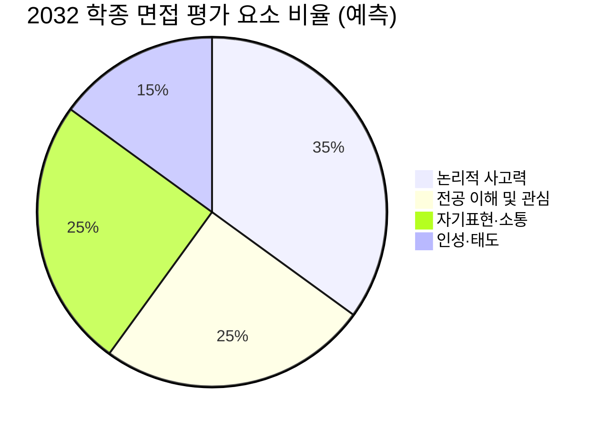
```mermaid
pie title 2032 학종 면접 평가 요소 비율 (예측)
    "논리적 사고력" : 35
    "전공 이해 및 관심" : 25
    "자기표현·소통" : 25
    "인성·태도" : 15
```

---

## 6. 수시·정시 통합의 의미

### 🔄 수시·정시 통합 전후 비교

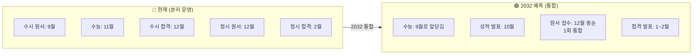
```mermaid
graph LR
    subgraph OLD["🔴 현재 (분리 운영)"]
        A1[수시 원서: 9월]
        A2[수능: 11월]
        A3[수시 합격: 12월]
        A4[정시 원서: 12월]
        A5[정시 합격: 2월]
    end

    subgraph NEW["🟢 2032 예측 (통합)"]
        B1[수능: 9월로 앞당김]
        B2[성적 발표: 10월]
        B3[원서 접수: 12월 중순<br>1회 통합]
        B4[합격 발표: 1~2월]
    end

    OLD -->|2032 통합| NEW
```

### 📋 통합 전형의 핵심 변화

| 항목 | 현재 분리 | 2032 통합 | 학생 입장 변화 |
|------|---------|---------|------------|
| **수능 시기** | 11월 | 🔮 9월 | 수능 후 학생부 기록 가능 |
| **원서 접수** | 수시 9월, 정시 12월 | 12월 중순 1회 | 전략 단순화 |
| **학생부 반영** | 3학년 1학기까지 | 🔮 3학년 2학기까지 | 학생부 완성도 ↑ |
| **전략 복잡도** | 매우 복잡 | 단순화 | 스트레스 감소 |
| **재수 불이익** | 없음 | 상대적으로 감소 | 재학생 유리 |

---

## 7. 학종(학생부위주전형) 대변환

> 2032년에는 학종이 입시의 중심이 됩니다!

### 📊 학종 강화 핵심 규정 (경기도교육청 제안)

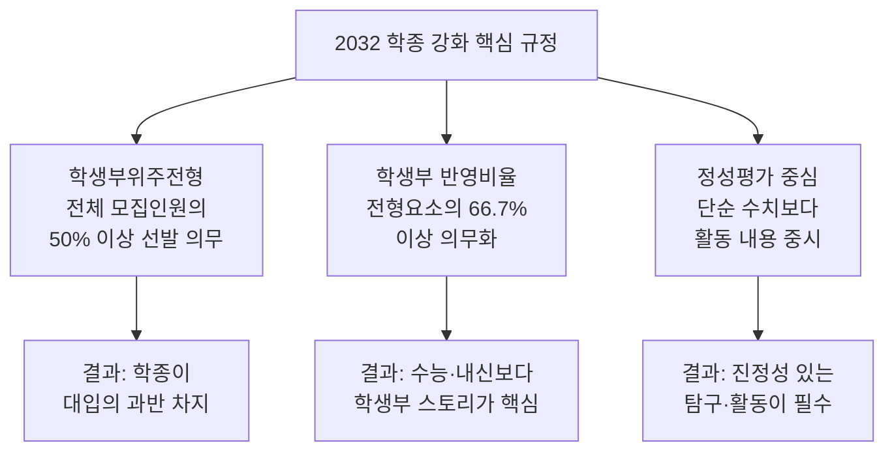
```mermaid
graph TD
    A[2032 학종 강화 핵심 규정] --> B[학생부위주전형<br>전체 모집인원의<br>50% 이상 선발 의무]
    A --> C[학생부 반영비율<br>전형요소의 66.7%<br>이상 의무화]
    A --> D[정성평가 중심<br>단순 수치보다<br>활동 내용 중시]

    B --> E[결과: 학종이<br>대입의 과반 차지]
    C --> F[결과: 수능·내신보다<br>학생부 스토리가 핵심]
    D --> G[결과: 진정성 있는<br>탐구·활동이 필수]
```

### 📋 학종 평가 요소 변화 (2028 → 2032)

| 평가 요소 | 2028 평가 방식 | 2032 예측 평가 방식 | 변화 방향 |
|----------|-------------|-----------------|---------|
| **학업역량** | 내신 등급 + 과목 선택 | 성취도(A/B) + 과목 깊이 | 등급→깊이 |
| **탐구역량** | 탐구보고서 유무 | 탐구 과정·성장 스토리 | 결과→과정 |
| **전공적합성** | 권장과목 이수 | 과목+활동 연계 스토리 | 목록→맥락 |
| **면접** | 30~40% 반영 | 40~50% 반영 확대 | 비중 증가 |
| **포트폴리오** | 일부 대학만 | 전 계열 확산 가능 | 도입 확산 |
| **AI 활용 흔적** | 채점 불가 | AI 활용 여부 검증 | 진정성 검증 |

### 🎯 2032 학종 합격을 위한 핵심 요소

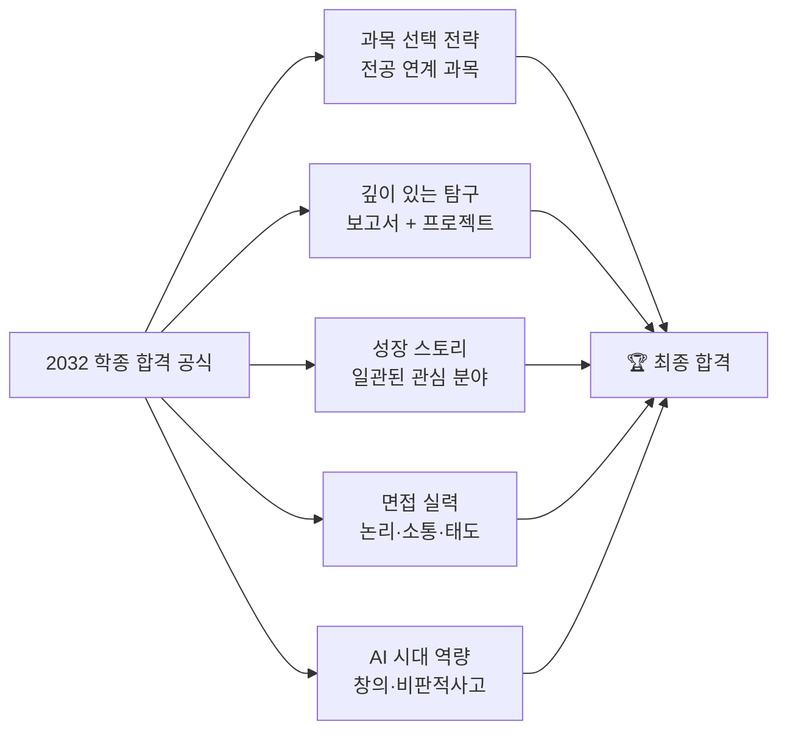
```mermaid
graph LR
    A[2032 학종 합격 공식] --> B[과목 선택 전략<br>전공 연계 과목]
    A --> C[깊이 있는 탐구<br>보고서 + 프로젝트]
    A --> D[성장 스토리<br>일관된 관심 분야]
    A --> E[면접 실력<br>논리·소통·태도]
    A --> F[AI 시대 역량<br>창의·비판적사고]

    B --> G[🏆 최종 합격]
    C --> G
    D --> G
    E --> G
    F --> G
```

---

## 8. AI 시대 평가 혁신

### 🤖 AI가 입시에 활용되는 3가지 방식

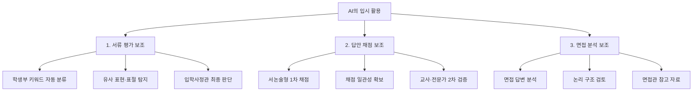
```mermaid
graph TD
    A[AI의 입시 활용] --> B[1. 서류 평가 보조]
    A --> C[2. 답안 채점 보조]
    A --> D[3. 면접 분석 보조]

    B --> B1[학생부 키워드 자동 분류]
    B --> B2[유사 표현·표절 탐지]
    B --> B3[입학사정관 최종 판단]

    C --> C1[서논술형 1차 채점]
    C --> C2[채점 일관성 확보]
    C --> C3[교사·전문가 2차 검증]

    D --> D1[면접 답변 분석]
    D --> D2[논리 구조 검토]
    D --> D3[면접관 참고 자료]
```

### 📋 AI 도입 전후 평가 방식 비교

| 평가 항목 | AI 도입 전 (현재) | AI 도입 후 (2032) | 학생 대응 전략 |
|----------|----------------|----------------|------------|
| **서류 1차 검토** | 입학사정관 전담 | AI 1차 분류 → 사정관 판단 | 진정성·일관성 있는 활동 기록 |
| **서논술형 채점** | 교사만 채점 | AI 1차 + 교사 2차 | 논리적이고 명확한 글쓰기 |
| **표절/AI생성 감지** | 없음 | AI 탐지 시스템 도입 | 나만의 언어로 직접 작성 |
| **면접 준비** | 예상 질문 암기 | AI 모의면접 도구 활용 | AI 피드백으로 연습 |
| **자기소개서** | 제한적 AI 활용 | AI 생성 여부 검증 | 자신의 경험을 직접 서술 |

### 💡 AI 시대에 절대 통하지 않는 것 vs 통하는 것

| ❌ AI로 쉽게 대체되는 것 | ✅ AI가 절대 못 하는 것 |
|----------------------|---------------------|
| 정보 검색 + 요약 정리 | 나만의 실제 경험 이야기 |
| 틀에 박힌 자기소개서 | 진심에서 우러난 탐구 동기 |
| 암기식 면접 답변 | 즉흥적 논리력과 창의력 |
| 복사+붙여넣기 보고서 | 직접 실험·조사한 과정 기록 |
| 평균적인 활동 목록 | 나만의 독특한 관심 분야 |

---

## 9. 로드맵: 2028 → 2032 → 2040 미래 입시

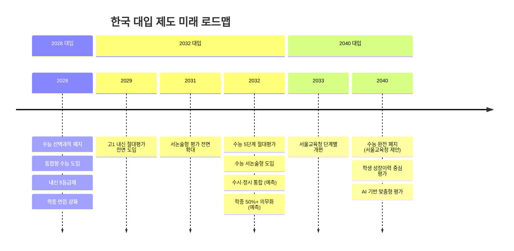
```mermaid
timeline
    title 한국 대입 제도 미래 로드맵
    section 2028 대입
        2028 : 수능 선택과목 폐지
             : 통합형 수능 도입
             : 내신 5등급제
             : 학종 면접 강화
    section 2032 대입
        2029 : 고1 내신 절대평가 전면 도입
        2031 : 서논술형 평가 전면 확대
        2032 : 수능 5단계 절대평가
             : 수능 서논술형 도입
             : 수시·정시 통합 (예측)
             : 학종 50%+ 의무화 (예측)
    section 2040 대입
        2033 : 서울교육청 단계별 개편
        2040 : 수능 완전 폐지 (서울교육청 제안)
             : 학생 성장이력 중심 평가
             : AI 기반 맞춤형 평가
```

### 📋 2028 → 2032 → 2040 단계별 비교

| 구분 | 2028 | 2032 (예측) | 2040 (제안) |
|------|------|-----------|-----------|
| **수능** | 통합형 유지 | 절대평가+서논술형 | 🔮 폐지 가능 |
| **내신** | 5등급제 | 성취평가 전면 | 성취평가 완성 |
| **학종** | ~42% | ~60% | ~70%+ |
| **AI 역할** | 면접 보조 | 채점·평가 보조 | 평가 중심 |
| **핵심 역량** | 수능+학종 균형 | 탐구·글쓰기·면접 | 창의·융합·포트폴리오 |

---

## 10. 학년별 대비 전략 (초5 ~ 중3)

### 🗺️ 전체 준비 로드맵

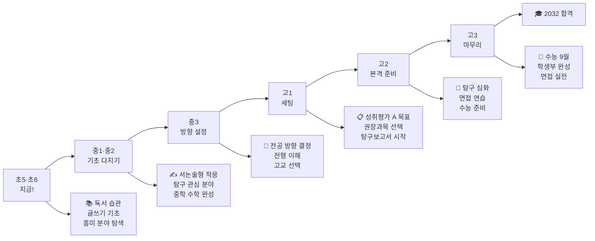
```mermaid
graph LR
    A[초5·초6<br>지금!] --> B[중1·중2<br>기초 다지기]
    B --> C[중3<br>방향 설정]
    C --> D[고1<br>세팅]
    D --> E[고2<br>본격 준비]
    E --> F[고3<br>마무리]
    F --> G[🎓 2032 합격]

    A --> A1[📚 독서 습관<br>글쓰기 기초<br>흥미 분야 탐색]
    B --> B1[✍️ 서논술형 적응<br>탐구 관심 분야<br>중학 수학 완성]
    C --> C1[🎯 전공 방향 결정<br>전형 이해<br>고교 선택]
    D --> D1[📋 성취평가 A 목표<br>권장과목 선택<br>탐구보고서 시작]
    E --> E1[🔬 탐구 심화<br>면접 연습<br>수능 준비]
    F --> F1[💪 수능 9월<br>학생부 완성<br>면접 실전]
```

---

### 10-1. 초5·초6: 씨앗 심기 단계 (지금!)

> 비유: 큰 나무가 되려면 지금 좋은 씨앗을 심어야 합니다 🌱

| 할 일 | 구체적 방법 | 이유 |
|-------|---------|------|
| **독서 습관** | 매주 1권, 다양한 분야 | 학종 독서 기록, 논술 기초 |
| **글쓰기 연습** | 독후감·일기·생각 정리 | 서논술형 대비 가장 중요 |
| **흥미 분야 탐색** | 과학관, 박물관, 강연 참여 | 탐구 주제 씨앗 찾기 |
| **수학 흥미** | 문제풀이보다 개념 이해 | 수능 수학의 기초 |
| **AI 도구 익히기** | ChatGPT 등 활용법 이해 | AI 시대 기초 소양 |

---

### 10-2. 중1·중2: 기초 다지기 단계

> 비유: 튼튼한 뿌리를 내리는 단계 🌿

| 할 일 | 구체적 방법 | 중요도 |
|-------|---------|--------|
| **서논술형 적응** | 시험에서 서술형 적극 활용 | ⭐⭐⭐⭐⭐ |
| **탐구 관심 분야 발굴** | 1개 이상 깊이 파고들기 | ⭐⭐⭐⭐⭐ |
| **중학교 수학 완성** | 고1 내신 위한 선행 불필요, 이해 중심 | ⭐⭐⭐⭐ |
| **영어 독해 강화** | 원서 읽기, 영어 뉴스 | ⭐⭐⭐⭐ |
| **탐구보고서 연습** | 학교 과제를 깊이 있게 | ⭐⭐⭐⭐ |

---

### 10-3. 중3: 방향 설정 단계

> 비유: 목적지를 정하고 GPS를 켜는 단계 🗺️

| 할 일 | 내용 | 체크 |
|-------|------|------|
| **전공 방향 결정** | 이과/문과/예체능 방향 잡기 | □ |
| **고교 선택** | 일반고/과학고/자사고 장단점 비교 | □ |
| **2032 전형 공부** | 이 파일 반복 읽기! | □ |
| **탐구 주제 선정** | 고1에서 이어갈 탐구 주제 결정 | □ |
| **면접 기초** | 발표·토론 경험 쌓기 | □ |

### 📋 고교 유형별 2032 입시 전략 비교

| 고교 유형 | 특징 | 2032 유리한 점 | 주의사항 |
|---------|------|------------|---------|
| **일반고** | 내신 경쟁 보통 | 절대평가로 부담 감소 | 탐구 활동 적극 참여 필수 |
| **과학고/영재고** | 심화 탐구 가능 | 학종 탐구역량 최고 어필 | 내신 불리할 수 있음 |
| **자사고** | 다양한 프로그램 | 스펙 쌓기 유리 | 비용 부담, 경쟁 치열 |
| **예술고/체육고** | 실기 특화 | 실기·실적 전형 유리 | 학종 일반형은 불리 |

---

## 11. 2028 vs 2032 전략 비교표

### 📋 전형별 준비 전략 비교

| 전략 항목 | 2028 입시 전략 | 2032 입시 전략 | 방향 변화 |
|----------|-------------|-------------|---------|
| **수능 비중** | 최저학력기준 + 정시 핵심 | 최저기준 역할만 (절대평가) | ↓ 중요도 하락 |
| **내신 전략** | 5등급 1등급 사수 | 성취도 A 달성 + 과목 선택 | → 질적 변화 |
| **학종 준비** | 3년 장기 준비 | 초등부터 장기 준비 | ↑ 더 일찍, 더 깊게 |
| **글쓰기** | 자기소개서 중심 | 서논술형 수능·내신 모두 | ↑↑ 핵심 역량 |
| **면접** | 고3 집중 준비 | 중학부터 논리·토론 연습 | ↑ 훨씬 중요 |
| **탐구활동** | 고1~고2 보고서 | 중학부터 깊이 있는 탐구 | ↑↑ 더 중요 |
| **AI 활용** | 면접 연습 보조 | AI 도구로 학습·연습 | 필수 도구화 |

### 📋 학생 유형별 2032 전략

| 학생 유형 | 강점 | 2032 추천 전략 | 핵심 준비 |
|---------|------|-------------|---------|
| **탐구형** | 깊이 파고드는 스타일 | 학종 최우선 | 보고서·프로젝트 축적 |
| **글쓰기형** | 논리·표현 강함 | 수능Ⅱ서논술 + 학종 | 서논술 집중 훈련 |
| **말하기형** | 발표·토론 자신감 | 학종 면접형 | 면접 역량 극대화 |
| **올라운더형** | 균형 잡힌 역량 | 학종 전방위 | 일관된 스토리 완성 |
| **수능형** | 시험 능력 강함 | 수능Ⅰ + 2차 정시 | 절대평가 A 다수 확보 |

---

## 12. 핵심 요약 및 결론

### ✅ 2032 대입 핵심 5가지

> 1. **수능은 절대평가**가 된다 → 점수 경쟁이 아닌 기준 달성 방식
> 2. **서논술형**이 수능과 내신 모두에 들어온다 → 글쓰기·논리력이 최고 스펙
> 3. **수시·정시 통합**으로 한 번에 지원한다 → 전략이 단순해지지만 학생부가 더 중요
> 4. **학종이 과반**을 차지한다 → 나만의 탐구 스토리가 합격을 결정
> 5. **AI가 채점·평가에 공식 도입**된다 → 진정성 있는 나만의 언어로 기록해야 한다

### 📋 2032 대입 한눈에 보는 전략 지도

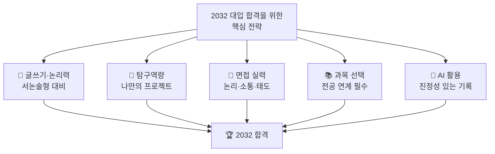
```mermaid
graph TD
    A[2032 대입 합격을 위한<br>핵심 전략] --> B[📖 글쓰기·논리력<br>서논술형 대비]
    A --> C[🔬 탐구역량<br>나만의 프로젝트]
    A --> D[🎤 면접 실력<br>논리·소통·태도]
    A --> E[📚 과목 선택<br>전공 연계 필수]
    A --> F[🤖 AI 활용<br>진정성 있는 기록]

    B --> G[🏆 2032 합격]
    C --> G
    D --> G
    E --> G
    F --> G
```

---

## 🔗 참고 출처

- [경기도교육청 미래 대입개혁 연구 자료 (PDF)](https://www.goe.go.kr/resource/goe/na/bbs_2675/2025/11/6b926081-60e5-4d74-8ea6-c11f9a368dd4.pdf)
- [괜찮은뉴스: 2032학년도 대입 수시정시통합 분석](https://www.nextplay.kr/news/articleView.html?idxno=8472)
- [교육을비추다: 수능 절대평가·서논술형 2032 도입](https://www.kyobit.com/news/articleView.html?idxno=1495)
- [임태희 경기교육감 2032 수능 상대평가 폐지 제안](https://kpinews.kr/newsView/1065588299328292)
- [서울교육청 2040 수능폐지 단계별 대입 개편안](https://www.edpl.co.kr/news/articleView.html?idxno=18929)
- [교육플러스: 대입개혁 내신·수능 절대평가 제안](https://www.edpl.co.kr/news/articleView.html?idxno=16370)
- [한국경제: 입시 틀 바꿔야 공교육 정상화 AI평가](https://www.hankyung.com/article/2025112303251)
- [에듀프레스: 2032 수능 절대평가 영어듣기폐지](https://www.edupress.kr/news/articleView.html?idxno=20494)
- [인사이트노트: 2032 대입 개편 정리](https://learningdays.kr/151)
- [나무위키: 학생부종합전형](https://namu.wiki/w/%ED%95%99%EC%83%9D%EB%B6%80%EC%A2%85%ED%95%A9%EC%A0%84%ED%98%95)

---

## ⚠️ 중요 안내

```
📌 이 자료의 신뢰도 구분

✅ 공식 발표 (확정)
 - 2029 고1 내신 절대평가 전면 도입 (경기도교육청 연구 제안)
 - 2032 수능 절대평가 + 서논술형 도입 (교육감 제안)
 - AI 3단계 채점 시스템 (경기도교육청 제안)

🔮 예측/제안 (미확정)
 - 수시·정시 통합 운영 방식
 - 학종 50% 의무화
 - 수능 시기 9월 이동
 - 영어 듣기평가 폐지

📋 교육감 제안은 교육부 최종 확정 전까지 변경될 수 있습니다.
   최신 교육부 공식 발표를 항상 확인하세요: www.moe.go.kr
```

---
*📝 본 자료는 2026년 4월 기준 경기도교육청·서울교육청 발표, 교육 전문 언론 분석을 바탕으로 작성되었습니다.*
*일부 내용은 예측 및 제안 단계이며, 교육부 최종 확정안과 다를 수 있습니다.*
