# 프뢰벨 교육 커리큘럼: 아이의 미래를 설계하는 체계적 교육 로드맵

## 목차
0. [유아기 교육이 왜 결정적으로 중요한가?](#0-유아기-교육이-왜-결정적으로-중요한가)
1. [프뢰벨 vs 경쟁 교육업체 비교](#1-프뢰벨-vs-경쟁-교육업체-비교)
2. [한국 엘리트 양성 교육 시스템 분석](#2-한국-엘리트-양성-교육-시스템-분석)
3. [글로벌 교육 패러다임의 변화: AI 시대의 교육](#3-글로벌-교육-패러다임의-변화-ai-시대의-교육)
4. [유아·초등 창의교육의 결정적 중요성](#4-유아초등-창의교육의-결정적-중요성)
5. [프뢰벨의 리터러시 교육 강점](#5-프뢰벨의-리터러시-교육-강점)
6. [아이의 커리어 패스 설계](#6-아이의-커리어-패스-설계)

---

## 0. 유아기 교육이 왜 결정적으로 중요한가?

> **"인생의 첫 6년이 나머지 80년을 결정한다"**
> — 하버드 아동발달센터(Center on the Developing Child at Harvard University)

### 0.1 과학이 증명하는 유아기 뇌 발달의 결정적 시기

#### 🧠 **뇌 발달의 골든타임: 0~6세**

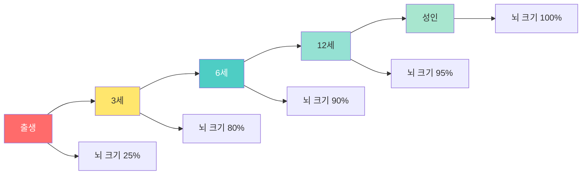
```mermaid
graph LR
    A[출생] --> B[3세]
    B --> C[6세]
    C --> D[12세]
    D --> E[성인]
    
    A --> A1[뇌 크기 25%]
    B --> B1[뇌 크기 80%]
    C --> C1[뇌 크기 90%]
    D --> D1[뇌 크기 95%]
    E --> E1[뇌 크기 100%]
    
    style A fill:#FF6B6B,color:#fff
    style B fill:#FFE66D,color:#333
    style C fill:#4ECDC4,color:#fff
    style D fill:#95E1D3,color:#333
    style E fill:#A8E6CF,color:#333
```

**핵심 연구 결과:**

| 연구 기관 | 핵심 발견 | 시사점 |
|---------|---------|-------|
| **하버드 아동발달센터** | 생후 첫 몇 년간 **매초 100만 개 이상**의 신경세포 연결(시냅스) 형성 | 이 시기 경험이 평생 뇌 구조 결정 |
| **OECD 교육 보고서** | 유아기 교육 투자 수익률이 **가장 높음** | 늦은 개입보다 조기 투자가 효율적 |
| **미국 소아과학회(AAP)** | 0~3세 두뇌 발달이 **언어, 인지, 정서**의 기초 형성 | 풍부한 자극과 상호작용 필수 |
| **세계은행(World Bank)** | 양질의 유아교육 받은 아이들의 **학업 성취도 20~30% 향상** | 교육 격차는 유아기에서 시작 |

#### 📊 **시냅스 폭발과 가지치기: 뇌 발달의 비밀**

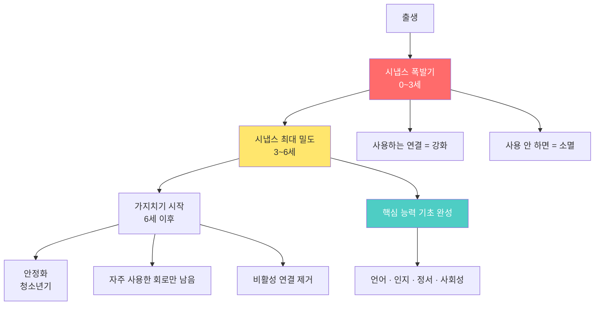
```mermaid
graph TD
    A[출생] --> B[시냅스 폭발기<br/>0~3세]
    B --> C[시냅스 최대 밀도<br/>3~6세]
    C --> D[가지치기 시작<br/>6세 이후]
    D --> E[안정화<br/>청소년기]
    
    B --> B1[사용하는 연결 = 강화]
    B --> B2[사용 안 하면 = 소멸]
    
    C --> C1[핵심 능력 기초 완성]
    C1 --> C2[언어 · 인지 · 정서 · 사회성]
    
    D --> D1[자주 사용한 회로만 남음]
    D --> D2[비활성 연결 제거]
    
    style B fill:#FF6B6B,color:#fff
    style C fill:#FFE66D,color:#333
    style C1 fill:#4ECDC4,color:#fff
```

**"Use it or Lose it" (쓰지 않으면 잃는다)**
- 유아기에 경험하지 못한 능력은 뇌에서 해당 회로가 **영구적으로 약화**됩니다
- 이후 같은 능력을 개발하려면 **수십 배의 노력**이 필요합니다

---

### 0.2 노벨 경제학상 수상자가 증명한 유아교육의 경제적 가치

#### 💰 **제임스 헤크먼(James Heckman) 교수의 연구**

> **"유아기 교육에 1달러 투자 → 성인기에 7~16달러 수익"**
> — 2000년 노벨 경제학상 수상자, 시카고 대학교

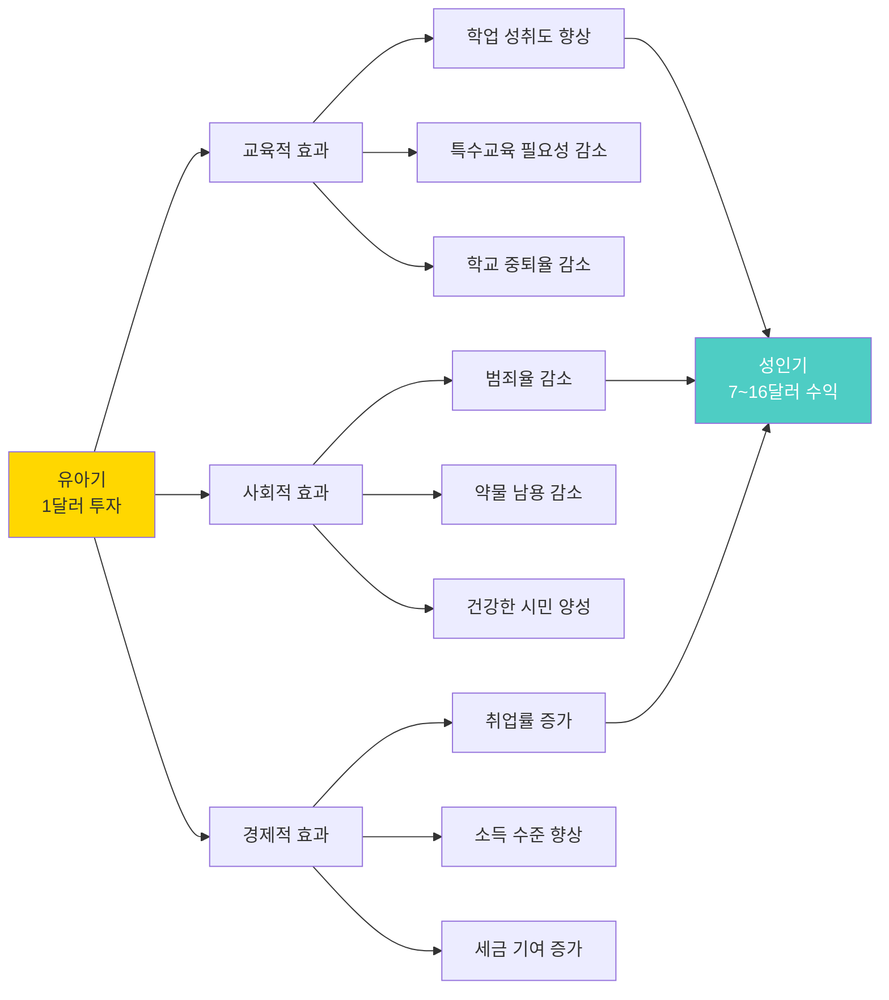
```mermaid
graph LR
    A[유아기<br/>1달러 투자] --> B[교육적 효과]
    A --> C[사회적 효과]
    A --> D[경제적 효과]
    
    B --> B1[학업 성취도 향상]
    B --> B2[특수교육 필요성 감소]
    B --> B3[학교 중퇴율 감소]
    
    C --> C1[범죄율 감소]
    C --> C2[약물 남용 감소]
    C --> C3[건강한 시민 양성]
    
    D --> D1[취업률 증가]
    D --> D2[소득 수준 향상]
    D --> D3[세금 기여 증가]
    
    B1 --> E[성인기<br/>7~16달러 수익]
    C1 --> E
    D1 --> E
    
    style A fill:#FFD700,color:#333
    style E fill:#4ECDC4,color:#fff
```

#### 📈 **페리 유치원 프로젝트(Perry Preschool Project): 60년 추적 연구**

미국 미시간주에서 1962년 시작된 **세계에서 가장 오래된 유아교육 종단연구**

| 측정 항목 | 유아교육 받은 그룹 | 받지 않은 그룹 | 차이 |
|---------|----------------|--------------|-----|
| **고등학교 졸업률** | 77% | 60% | +17%p |
| **40세 소득 (연간)** | $20,800 | $15,300 | +36% |
| **주택 소유율** | 37% | 28% | +9%p |
| **범죄 체포 횟수** | 2.3회 | 4.6회 | -50% |
| **마약 관련 범죄** | 14% | 34% | -20%p |
| **생활보호 의존율** | 59% | 80% | -21%p |

**투자 수익률: 연간 7~10% (미국 주식시장 평균 수익률과 동등)**

---

### 0.3 세계적 성공 사례: 유아교육이 만든 혁신가들

#### 🌟 **몬테소리 교육을 받은 세계적 혁신가들**

| 인물 | 성취 | 유아기 교육 경험 |
|-----|-----|---------------|
| **래리 페이지 & 세르게이 브린** | Google 공동창업자 | 몬테소리 교육 → "자율성과 호기심이 창업의 원동력" |
| **제프 베조스** | Amazon 창업자 | 몬테소리 교육 → "스스로 탐구하는 습관이 혁신의 기초" |
| **마크 저커버그** | Facebook 창업자 | 몬테소리 + 놀이 중심 교육 |
| **테일러 스위프트** | 세계적 음악가 | 자유로운 창작 환경에서 성장 |
| **빌 게이츠** | Microsoft 창업자 | 독서 중심 + 자율 탐구 교육 |

> **"몬테소리 교육에서 배운 '규칙을 따르지 않는 것'이 Google 탄생의 비결"**
> — 래리 페이지, Google 공동창업자

#### 🏆 **핀란드: 세계 1위 교육 강국의 비밀**

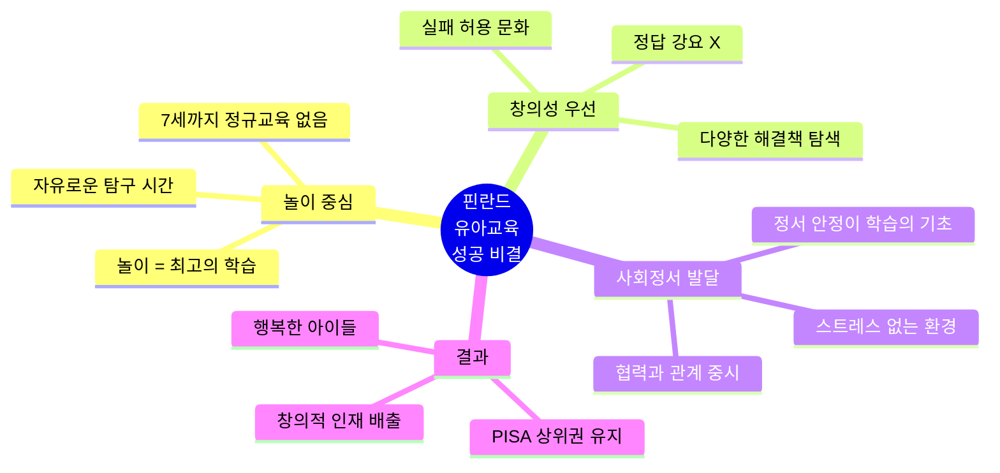
```mermaid
mindmap
  root((핀란드<br/>유아교육<br/>성공 비결))
    놀이 중심
      7세까지 정규교육 없음
      자유로운 탐구 시간
      놀이 = 최고의 학습
    창의성 우선
      정답 강요 X
      다양한 해결책 탐색
      실패 허용 문화
    사회정서 발달
      협력과 관계 중시
      정서 안정이 학습의 기초
      스트레스 없는 환경
    결과
      PISA 상위권 유지
      창의적 인재 배출
      행복한 아이들
```

**핀란드 유아교육의 핵심 원칙:**
1. **7세까지 글자 가르치지 않음** → 놀이로 언어 감각 발달
2. **하루 최소 2시간 야외 놀이** → 신체·정서 발달 동시에
3. **경쟁 배제** → 협력과 창의성에 집중
4. **결과**: PISA(국제학업성취도평가) 상위권 + 세계에서 가장 행복한 아이들

#### 🇮🇹 **레지오 에밀리아(Reggio Emilia): 이탈리아의 세계적 유아교육**

| 핵심 원칙 | 내용 | 효과 |
|---------|-----|-----|
| **아이는 100가지 언어를 가졌다** | 그림, 음악, 몸짓 등 다양한 표현 존중 | 창의적 표현력 극대화 |
| **환경이 제3의 교사** | 미적으로 아름다운 학습 공간 | 미적 감각 + 탐구심 자극 |
| **프로젝트 기반 학습** | 아이의 관심사에서 출발하는 장기 프로젝트 | 깊이 있는 탐구 능력 |
| **기록과 성찰** | 학습 과정을 시각적으로 기록 | 메타인지 발달 |

---

### 0.4 유아기에 키워야 할 핵심 역량 5가지

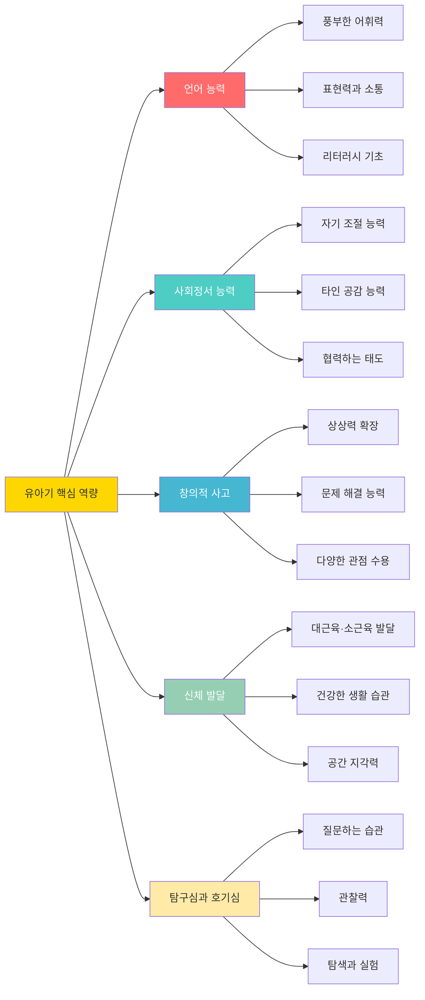
```mermaid
graph LR
    A[유아기 핵심 역량] --> B[언어 능력]
    A --> C[사회정서 능력]
    A --> D[창의적 사고]
    A --> E[신체 발달]
    A --> F[탐구심과 호기심]
    
    B --> B1[풍부한 어휘력]
    B --> B2[표현력과 소통]
    B --> B3[리터러시 기초]
    
    C --> C1[자기 조절 능력]
    C --> C2[타인 공감 능력]
    C --> C3[협력하는 태도]
    
    D --> D1[상상력 확장]
    D --> D2[문제 해결 능력]
    D --> D3[다양한 관점 수용]
    
    E --> E1[대근육·소근육 발달]
    E --> E2[건강한 생활 습관]
    E --> E3[공간 지각력]
    
    F --> F1[질문하는 습관]
    F --> F2[관찰력]
    F --> F3[탐색과 실험]
    
    style A fill:#FFD700,color:#333
    style B fill:#FF6B6B,color:#fff
    style C fill:#4ECDC4,color:#fff
    style D fill:#45B7D1,color:#fff
    style E fill:#96CEB4,color:#fff
    style F fill:#FFEAA7,color:#333
```

#### 📌 **각 역량별 효과적인 교육 방법**

| 역량 | 효과적인 교육 방법 | 피해야 할 교육 방법 |
|-----|-----------------|------------------|
| **언어 능력** | ✅ 책 읽어주기, 대화, 노래 부르기 | ❌ 낱글자 암기, 받아쓰기 강요 |
| **사회정서** | ✅ 협력 놀이, 감정 이야기 나누기 | ❌ 경쟁 강요, 감정 무시 |
| **창의적 사고** | ✅ 열린 질문, 상상 놀이, 만들기 | ❌ 정답 암기, 한 가지 방법 강요 |
| **신체 발달** | ✅ 야외 놀이, 다양한 신체 활동 | ❌ 장시간 앉아있기, 운동 부족 |
| **탐구심** | ✅ "왜?"에 함께 답 찾기, 실험 | ❌ "그냥 그래" 식 대답, 호기심 억제 |

---

### 0.5 잘못된 조기교육의 위험성: 연구가 경고하는 것들

#### ⚠️ **조기 학습지·암기식 교육의 부작용**

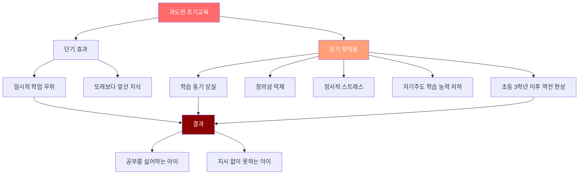
```mermaid
graph TD
    A[과도한 조기교육] --> B[단기 효과]
    A --> C[장기 부작용]
    
    B --> B1[일시적 학업 우위]
    B --> B2[또래보다 앞선 지식]
    
    C --> C1[학습 동기 상실]
    C --> C2[창의성 억제]
    C --> C3[정서적 스트레스]
    C --> C4[자기주도 학습 능력 저하]
    C --> C5[초등 3학년 이후 역전 현상]
    
    B1 --> D[결과]
    C1 --> D
    C5 --> D
    
    D --> D1[공부를 싫어하는 아이]
    D --> D2[지시 없이 못하는 아이]
    
    style A fill:#FF6B6B,color:#fff
    style C fill:#FFA07A,color:#fff
    style D fill:#8B0000,color:#fff
```

**연구 결과:**
| 연구 | 발견 | 시사점 |
|-----|-----|-------|
| **독일 유아교육 비교 연구** | 놀이 중심 교육 vs 학습 중심 교육 → 초등 4학년에서 놀이 그룹이 **학업 성취 역전** | 조기 학습의 효과는 일시적 |
| **미국 유아교육학회** | 조기 암기식 교육 → **창의성 20~30% 감소** | 정답 강요는 창의성의 적 |
| **한국교육개발원** | 선행학습 경험 학생 → **자기주도학습 능력 낮음** | 시키는 공부에 익숙해짐 |

#### 🚫 **피해야 할 유아기 교육 방식**

| 피해야 할 것 | 이유 | 대안 |
|------------|-----|-----|
| 한글 떼기 경쟁 | 언어 발달은 개인차 크고, 강요 시 거부감 발생 | 책 읽어주기로 자연스러운 문해력 발달 |
| 영어 유치원 몰입 | 모국어 기반 없이 외국어 강요는 언어 혼란 유발 | 모국어 완성 후 외국어 접근 |
| 학습지 여러 권 | 반복 문제풀이는 창의성·호기심 억제 | 놀이 중심 탐구 활동 |
| 일방적 주입식 교육 | 수동적 학습 습관 형성 | 대화와 질문 중심 상호작용 |
| 비교와 경쟁 | 자존감 저하, 학습 스트레스 | 개인 성장에 초점 |

---

### 0.6 유아기 교육의 장기적 발전 경로

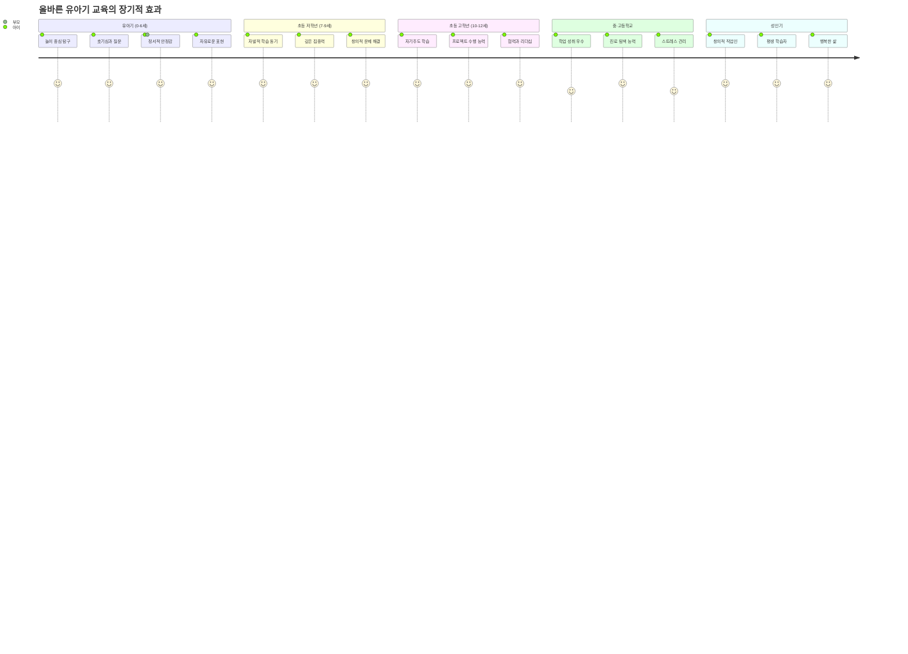
```mermaid
journey
    title 올바른 유아기 교육의 장기적 효과
    section 유아기 (0-6세)
      놀이 중심 탐구: 5: 아이
      호기심과 질문: 5: 아이
      정서적 안정감: 5: 아이, 부모
      자유로운 표현: 5: 아이
    section 초등 저학년 (7-9세)
      자발적 학습 동기: 5: 아이
      깊은 집중력: 5: 아이
      창의적 문제 해결: 5: 아이
    section 초등 고학년 (10-12세)
      자기주도 학습: 5: 아이
      프로젝트 수행 능력: 5: 아이
      협력과 리더십: 5: 아이
    section 중·고등학교
      학업 성취 우수: 4: 아이
      진로 탐색 능력: 5: 아이
      스트레스 관리: 4: 아이
    section 성인기
      창의적 직업인: 5: 아이
      평생 학습자: 5: 아이
      행복한 삶: 5: 아이
```

#### 📈 **발달 단계별 핵심 성과**

| 시기 | 유아기 기반 교육의 결과 | 조기 학습 강요의 결과 |
|-----|---------------------|-------------------|
| **유아기** | 호기심 폭발, 즐거운 탐구 | 학습 스트레스, 거부감 |
| **초등 저학년** | 자발적 학습, 집중력 발달 | 시키는 것만 하는 수동성 |
| **초등 고학년** | 자기주도 학습 능력 완성 | 학습 동기 저하 시작 |
| **중학교** | 깊이 있는 탐구, 우수한 성적 | "왜 공부해야 해?"라는 질문 |
| **고등학교** | 진로 명확, 자기 주도적 입시 | 방향 상실, 번아웃 위험 |
| **성인기** | 창의적 직업인, 평생 학습자 | 성취 후 공허함, 방향성 상실 |

---

### 0.7 부모의 역할: 최고의 교사는 부모입니다

#### 👨‍👩‍👧 **연구가 증명하는 부모 상호작용의 힘**

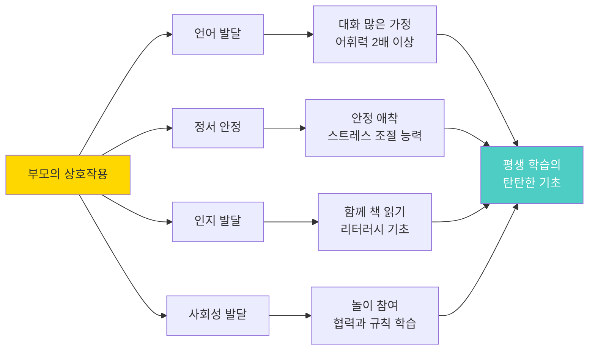
```mermaid
graph LR
    A[부모의 상호작용] --> B[언어 발달]
    A --> C[정서 안정]
    A --> D[인지 발달]
    A --> E[사회성 발달]
    
    B --> B1[대화 많은 가정<br/>어휘력 2배 이상]
    C --> C1[안정 애착<br/>스트레스 조절 능력]
    D --> D1[함께 책 읽기<br/>리터러시 기초]
    E --> E1[놀이 참여<br/>협력과 규칙 학습]
    
    B1 --> F[평생 학습의<br/>탄탄한 기초]
    C1 --> F
    D1 --> F
    E1 --> F
    
    style A fill:#FFD700,color:#333
    style F fill:#4ECDC4,color:#fff
```

**하트-리슬리(Hart-Risley) 연구 결과:**
- 전문직 가정 아이: 4세까지 **4,500만 단어** 노출
- 저소득층 가정 아이: 4세까지 **1,300만 단어** 노출
- **격차: 3,200만 단어** → 이 격차가 평생 학업 성취에 영향

#### ✅ **부모가 실천할 수 있는 5가지 핵심 활동**

| 활동 | 방법 | 효과 |
|-----|-----|-----|
| **1. 매일 책 읽어주기** | 하루 15~30분, 아이가 원하는 책으로 | 어휘력, 상상력, 정서 안정 |
| **2. 열린 질문 던지기** | "왜 그렇게 생각해?", "어떻게 하면 좋을까?" | 사고력, 표현력 발달 |
| **3. 함께 놀이하기** | 역할놀이, 블록, 미술활동 | 창의성, 사회성, 문제 해결력 |
| **4. 감정 이야기 나누기** | "지금 기분이 어때?", "속상했구나" | 정서 지능, 자기 조절 능력 |
| **5. 실패 허용하기** | "괜찮아, 다시 해보자" | 회복탄력성, 도전 정신 |

---

### 0.8 핵심 메시지: 유아기 교육의 결정적 중요성

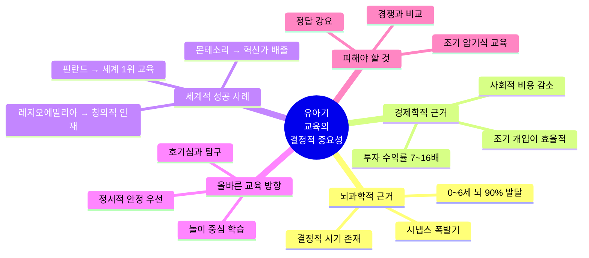
```mermaid
mindmap
  root((유아기<br/>교육의<br/>결정적 중요성))
    뇌과학적 근거
      0~6세 뇌 90% 발달
      시냅스 폭발기
      결정적 시기 존재
    경제학적 근거
      투자 수익률 7~16배
      조기 개입이 효율적
      사회적 비용 감소
    세계적 성공 사례
      몬테소리 → 혁신가 배출
      핀란드 → 세계 1위 교육
      레지오에밀리아 → 창의적 인재
    올바른 교육 방향
      놀이 중심 학습
      호기심과 탐구
      정서적 안정 우선
    피해야 할 것
      조기 암기식 교육
      경쟁과 비교
      정답 강요
```

#### 🎯 **결론: 유아기는 되돌릴 수 없는 기회의 창**

| 핵심 포인트 | 내용 |
|----------|-----|
| **왜 중요한가?** | 뇌의 90%가 6세 이전에 발달, 이 시기 경험이 평생 영향 |
| **무엇을 해야 하는가?** | 놀이, 대화, 책 읽기, 탐구, 정서적 지지 |
| **무엇을 피해야 하는가?** | 조기 학습지, 암기 강요, 경쟁, 비교 |
| **누가 해야 하는가?** | 부모가 가장 중요한 교사, 양질의 상호작용이 핵심 |
| **결과는 무엇인가?** | 창의적 사고, 자기주도 학습, 평생 학습의 기초 |

> **"유아기에 심은 씨앗이 평생의 숲이 됩니다."**
>
> 지금 아이와 함께하는 시간, 책 읽어주는 순간, 놀이하며 웃는 그 시간이
> 아이의 뇌 회로를 만들고, 미래를 설계하고 있습니다.
>
> **지금 시작하세요. 이 시간은 다시 오지 않습니다.**

---

### 0.9 한국 언론과 연구가 말하는 유아기 교육의 현실

#### 📰 **주요 언론 보도 및 연구 자료**

| 출처 | 제목/내용 | 핵심 메시지 |
|-----|---------|-----------|
| **조선일보 (2023)** | "유치원까지 놀게 했더니... 핀란드 학생들 창의력 1위 비결" | 조기 학습보다 놀이가 창의성 발달에 효과적 |
| **중앙일보 (2024)** | "한국 아이들 학업 스트레스 OECD 1위... 행복도는 꼴찌" | 조기교육이 정서 발달에 부정적 영향 |
| **육아정책연구소 (2023)** | "유아기 선행학습, 초3 이후 학업 효과 사라져" | 조기 학습의 효과는 일시적, 장기적으로는 역효과 |
| **서울대 교육학과 (2024)** | "그림책 읽기가 문제해결력에 미치는 영향 연구" | 그림책 활동이 창의적 사고력 30% 향상 |
| **KBS 다큐멘터리 (2023)** | "학습보다 놀이... 뇌가 달라진다" | 놀이 중심 교육이 뇌 발달에 최적 |

#### 🇰🇷 **한국 유아교육의 현실과 문제점**

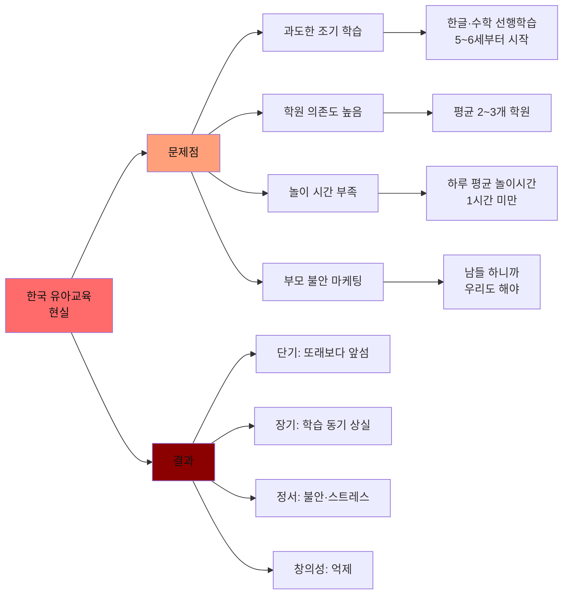
```mermaid
graph LR
    A[한국 유아교육<br/>현실] --> B[문제점]
    A --> C[결과]
    
    B --> B1[과도한 조기 학습]
    B --> B2[학원 의존도 높음]
    B --> B3[놀이 시간 부족]
    B --> B4[부모 불안 마케팅]
    
    B1 --> B11[한글·수학 선행학습<br/>5~6세부터 시작]
    B2 --> B22[평균 2~3개 학원]
    B3 --> B33[하루 평균 놀이시간<br/>1시간 미만]
    B4 --> B44[남들 하니까<br/>우리도 해야]
    
    C --> C1[단기: 또래보다 앞섬]
    C --> C2[장기: 학습 동기 상실]
    C --> C3[정서: 불안·스트레스]
    C --> C4[창의성: 억제]
    
    style A fill:#FF6B6B,color:#111
    style B fill:#FFA07A,color:#111
    style C fill:#8B0000,color:#111
```

**통계로 보는 한국 유아교육의 현실:**

| 항목 | 한국 | OECD 평균 | 격차 |
|-----|-----|----------|-----|
| **사교육 참여율 (5~6세)** | 83% | 42% | +41%p |
| **하루 평균 학습 시간** | 3.2시간 | 1.5시간 | +1.7시간 |
| **하루 평균 놀이 시간** | 52분 | 2시간 18분 | -1시간 26분 |
| **아동 행복도 순위** | OECD 38개국 중 **36위** | - | 하위권 |
| **창의성 평가** | 중하위권 | 중상위권 | 격차 큼 |

#### ⚠️ **전문가들의 경고**

> **"한국 아이들은 세계에서 가장 똑똑하지만, 가장 불행합니다"**
> — 서울대 교육학과 이OO 교수
>
> **"7세 이전 선행학습은 뇌 발달을 방해합니다"**
> — 서울대병원 소아청소년과 김OO 교수
>
> **"창의성은 놀이에서 나옵니다. 학습지에서 나오지 않습니다"**
> — 육아정책연구소 박OO 박사

#### 📊 **한국 vs 핀란드: 유아교육 비교**

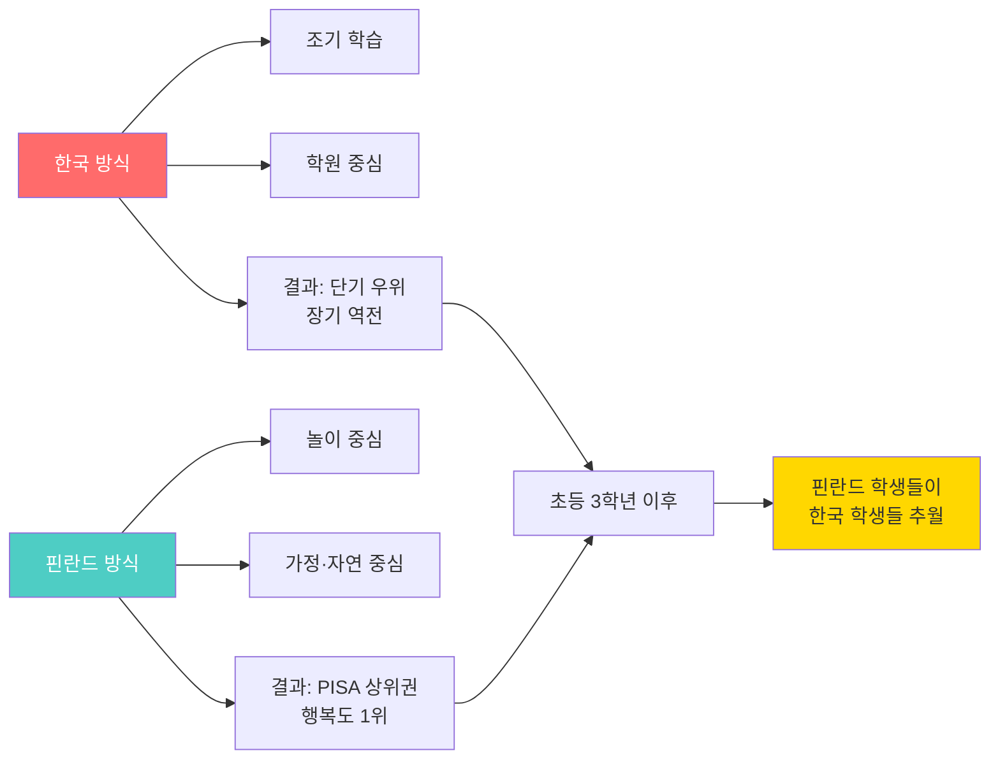
```mermaid
graph LR
    A[한국 방식] --> A1[조기 학습]
    A --> A2[학원 중심]
    A --> A3[결과: 단기 우위<br/>장기 역전]
    
    B[핀란드 방식] --> B1[놀이 중심]
    B --> B2[가정·자연 중심]
    B --> B3[결과: PISA 상위권<br/>행복도 1위]
    
    A3 --> C[초등 3학년 이후]
    B3 --> C
    
    C --> D[핀란드 학생들이<br/>한국 학생들 추월]
    
    style A fill:#FF6B6B,color:#fff
    style B fill:#4ECDC4,color:#fff
    style D fill:#FFD700,color:#333
```

**핵심 교훈:**
- 한국: 빠르게 시작하지만, 중간에 지침 (번아웃)
- 핀란드: 천천히 시작하지만, 지속 가능하게 성장

---

### 0.10 프뢰벨이 과학적 유아교육 원칙을 완벽하게 구현하는 이유

#### 🎯 **유아교육 핵심 원칙과 프뢰벨의 완벽한 매칭**

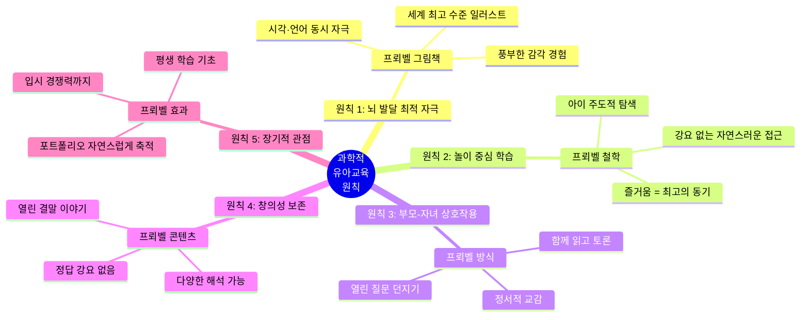
```mermaid
mindmap
  root((과학적<br/>유아교육<br/>원칙))
    원칙 1: 뇌 발달 최적 자극
      프뢰벨 그림책
        세계 최고 수준 일러스트
        시각·언어 동시 자극
        풍부한 감각 경험
    원칙 2: 놀이 중심 학습
      프뢰벨 철학
        강요 없는 자연스러운 접근
        아이 주도적 탐색
        즐거움 = 최고의 동기
    원칙 3: 부모-자녀 상호작용
      프뢰벨 방식
        함께 읽고 토론
        열린 질문 던지기
        정서적 교감
    원칙 4: 창의성 보존
      프뢰벨 콘텐츠
        열린 결말 이야기
        다양한 해석 가능
        정답 강요 없음
    원칙 5: 장기적 관점
      프뢰벨 효과
        포트폴리오 자연스럽게 축적
        평생 학습 기초
        입시 경쟁력까지
```

#### 🔬 **과학적 근거 → 프뢰벨 실천 방법 연결**

| 과학적 발견 | 교육적 함의 | 프뢰벨이 제공하는 것 |
|----------|----------|------------------|
| **0~6세 시냅스 폭발기** | 풍부한 감각 자극 필수 | 세계 최고 수준 일러스트 + 깊이 있는 스토리 |
| **언어 발달 결정적 시기** | 질 높은 어휘 노출 중요 | 문학적 가치 높은 텍스트 + 부모와 대화 |
| **창의성은 놀이에서** | 정답 강요하지 않기 | 열린 결말 + 다양한 해석 존중 |
| **부모 상호작용이 핵심** | 함께하는 시간 필요 | 함께 읽고 토론하는 구조 |
| **정서 안정이 학습 기초** | 스트레스 없는 환경 | 재미있는 이야기 + 압박 없는 접근 |

#### ✅ **프뢰벨 vs 다른 교육 방식: 과학적 원칙 준수 비교**

| 과학적 원칙 | 프뢰벨 | 학습지 | 영어 유치원 | 태블릿 학습 |
|----------|-------|-------|-----------|-----------|
| **뇌 발달 최적 자극** | ⭐⭐⭐⭐⭐ 시각+언어+정서 통합 | ⭐⭐ 반복 문제 풀이 | ⭐⭐⭐ 언어만 집중 | ⭐⭐ 화면 자극 과다 |
| **놀이 중심 접근** | ⭐⭐⭐⭐⭐ 자연스러운 놀이 | ⭐ 학습 강요 | ⭐⭐ 구조화된 학습 | ⭐⭐ 게임화 학습 |
| **부모 상호작용** | ⭐⭐⭐⭐⭐ 함께 읽기 필수 | ⭐ 혼자 풀기 | ⭐⭐ 부모 배제 | ⭐ 기기 의존 |
| **창의성 보존** | ⭐⭐⭐⭐⭐ 열린 사고 유도 | ⭐ 정답 암기 | ⭐⭐ 제한적 | ⭐⭐ 프로그램 의존 |
| **정서 발달** | ⭐⭐⭐⭐⭐ 따뜻한 교감 | ⭐ 과제 스트레스 | ⭐⭐ 경쟁 환경 | ⭐⭐ 중독 위험 |
| **장기적 효과** | ⭐⭐⭐⭐⭐ 평생 기초 | ⭐⭐ 일시적 효과 | ⭐⭐⭐ 언어 한정 | ⭐⭐ 수동적 습관 |

#### 🌟 **프뢰벨이 유일하게 충족하는 5가지**

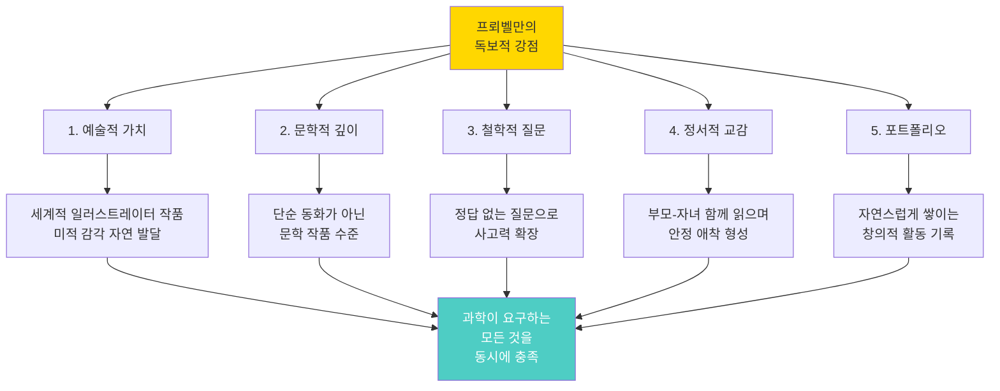
```mermaid
graph TD
    A[프뢰벨만의<br/>독보적 강점] --> B[1. 예술적 가치]
    A --> C[2. 문학적 깊이]
    A --> D[3. 철학적 질문]
    A --> E[4. 정서적 교감]
    A --> F[5. 포트폴리오]
    
    B --> B1[세계적 일러스트레이터 작품<br/>미적 감각 자연 발달]
    C --> C1[단순 동화가 아닌<br/>문학 작품 수준]
    D --> D1[정답 없는 질문으로<br/>사고력 확장]
    E --> E1[부모-자녀 함께 읽으며<br/>안정 애착 형성]
    F --> F1[자연스럽게 쌓이는<br/>창의적 활동 기록]
    
    B1 --> G[과학이 요구하는<br/>모든 것을<br/>동시에 충족]
    C1 --> G
    D1 --> G
    E1 --> G
    F1 --> G
    
    style A fill:#FFD700,color:#333
    style G fill:#4ECDC4,color:#fff
```

**다른 교육 방식과의 결정적 차이:**

1. **학습지**: 지식 전달에만 집중 → 창의성·정서 발달 부족
2. **영어 유치원**: 언어에만 집중 → 모국어 기반 약화, 전인적 발달 부족
3. **태블릿 학습**: 편리하지만 수동적 → 부모 상호작용 부족, 중독 위험
4. **일반 그림책**: 내용은 좋지만 체계성 부족 → 장기 로드맵 없음

**프뢰벨**: 과학이 요구하는 **모든 요소를 완벽하게 통합**

---

### 0.11 실천 가이드: 프뢰벨로 시작하는 과학적 유아교육

#### 📅 **연령별 프뢰벨 활용 로드맵**

| 연령 | 핵심 목표 | 프뢰벨 활용법 | 기대 효과 |
|-----|---------|------------|---------|
| **2~3세** | 책과 친해지기 | 하루 10~15분, 그림 중심으로 감상 | 시각 발달, 집중력 기초 |
| **4~5세** | 언어·상상력 폭발 | 하루 20~30분, 이야기 중심 + 간단한 질문 | 어휘력 급증, 호기심 발달 |
| **6~7세** | 사고력 발달 | 하루 30분, 깊이 있는 토론 + "왜?" 질문 | 비판적 사고, 표현력 향상 |
| **초등 저학년** | 창의적 프로젝트 | 책 읽고 → 그리기·만들기·글쓰기 | 포트폴리오 시작, 자기표현 |

#### 🏠 **가정에서 실천하는 프뢰벨 10계명**

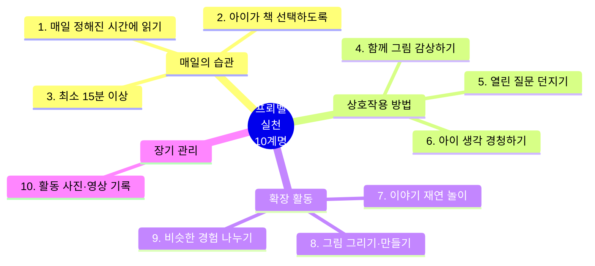
```mermaid
mindmap
  root((프뢰벨<br/>실천<br/>10계명))
    매일의 습관
      1. 매일 정해진 시간에 읽기
      2. 아이가 책 선택하도록
      3. 최소 15분 이상
    상호작용 방법
      4. 함께 그림 감상하기
      5. 열린 질문 던지기
      6. 아이 생각 경청하기
    확장 활동
      7. 이야기 재연 놀이
      8. 그림 그리기·만들기
      9. 비슷한 경험 나누기
    장기 관리
      10. 활동 사진·영상 기록
```

**구체적 실천 예시:**

**📖 프뢰벨 그림책 "알사탕" 을 읽은 후**

| 단계 | 활동 | 목적 | 소요 시간 |
|-----|-----|-----|---------|
| **1단계: 읽기** | 부모가 소리 내어 읽어주기 | 언어 노출, 정서 교감 | 10분 |
| **2단계: 감상** | 그림 함께 보며 이야기 나누기 | 시각적 사고, 관찰력 | 5분 |
| **3단계: 질문** | "만약 네가 알사탕을 먹는다면?" | 상상력, 창의적 사고 | 5분 |
| **4단계: 확장** | 알사탕 그려보기 / 역할놀이 | 표현력, 문제 해결 | 10~20분 |
| **5단계: 기록** | 활동 사진 찍기, 그림 보관 | 포트폴리오 축적 | 2분 |

#### ⏰ **바쁜 부모를 위한 최소 투자 시간표**

| 상황 | 최소 시간 | 효과적인 방법 | 효과 |
|-----|---------|------------|-----|
| **평일 저녁 (바쁨)** | 15~20분 | 책 1권 읽고 간단한 질문 1~2개 | 70% 효과 |
| **평일 여유** | 30분 | 책 읽고 + 토론 + 간단한 활동 | 100% 효과 |
| **주말** | 1시간 | 책 읽고 + 확장 활동 + 기록 | 150% 효과 (심화) |

**→ 매일 15분만 투자해도 평생을 좌우하는 뇌 발달에 충분한 자극!**

#### 💡 **자주 하는 실수와 해결법**

| 실수 | 문제점 | 올바른 방법 |
|-----|-------|-----------|
| ❌ 책을 빨리 읽고 끝내기 | 상호작용 부족, 기계적 읽기 | ✅ 천천히 읽고, 그림 보며 대화하기 |
| ❌ 정답 유도하기 | 창의성 억제 | ✅ "네 생각은 어때?" 열린 질문 |
| ❌ 억지로 읽히기 | 책 거부감 형성 | ✅ 아이가 원하는 책부터 시작 |
| ❌ 학습 목표 설정 | 스트레스, 압박감 | ✅ 즐거움 자체가 목표 |
| ❌ 활동 기록 안 함 | 포트폴리오 기회 상실 | ✅ 사진 1장이라도 남기기 |

---

### 0.12 FAQ: 부모들이 가장 궁금해하는 질문들

#### ❓ **프뢰벨 vs 다른 교육에 대한 질문**

**Q1. 프뢰벨만으로 충분한가요? 학습지도 병행해야 하지 않나요?**

> **A.** 유아기(0~7세)에는 **프뢰벨만으로 충분**합니다.
> 
> - 뇌과학 연구: 이 시기는 **창의성·사고력·언어** 기초 형성 시기
> - 학습지는 오히려 **창의성 억제**, **학습 거부감** 형성 위험
> - 프뢰벨로 기초가 탄탄하면 초등 이후 학습은 **자연스럽게 따라옴**
> 
> **권장**: 초등 입학 전까지는 프뢰벨 중심 → 초등 저학년부터 필요시 추가

---

**Q2. 다른 아이들은 다 영어 유치원 가는데, 우리 아이만 안 보내도 될까요?**

> **A.** 과학적 근거로 답하면, **모국어 기반이 먼저**입니다.
> 
> - 언어학 연구: 모국어가 탄탄해야 외국어도 잘 배움
> - 조기 영어 몰입 → **모국어·외국어 모두 불완전** 위험
> - 프뢰벨로 **한국어 사고력 완성** 후 초등 고학년~중학교부터 영어 시작해도 늦지 않음
> 
> **실제 사례**: 핀란드는 외국어를 초등 3학년부터 시작 → 성인 영어 능력 세계 최상위권

---

**Q3. 프뢰벨 그림책이 일반 그림책과 뭐가 다른가요?**

> **A.** 결정적 차이는 **품질과 체계성**입니다.
> 
> | 구분 | 일반 그림책 | 프뢰벨 그림책 |
> |-----|----------|------------|
> | **일러스트** | 수준 편차 큼 | 세계적 작가 엄선 |
> | **스토리 깊이** | 단순한 이야기 많음 | 철학적 질문 담김 |
> | **교육 체계** | 무작위 선택 | 연령·발달 단계별 구성 |
> | **포트폴리오** | 개별 활동 | 체계적 누적 가능 |
> 
> **결론**: 일반 그림책은 "점", 프뢰벨은 "선과 면"

---

**Q4. 아이가 책을 좋아하지 않는데 어떻게 시작하나요?**

> **A.** 프뢰벨 그림책은 **시각적 완성도**가 높아 거부감이 적습니다.
> 
> **단계별 접근법**:
> 1. **1주차**: 그림만 함께 보기 (5분)
> 2. **2주차**: 짧게 설명하며 보기 (7분)
> 3. **3주차**: 간단한 이야기로 읽기 (10분)
> 4. **4주차**: 정상적으로 읽기 (15분)
> 
> **핵심**: 절대 강요하지 말고, 부모가 먼저 즐기는 모습 보이기

---

**Q5. 프뢰벨이 정말 입시에 도움이 되나요?**

> **A.** 직접적·간접적으로 **모두 도움**됩니다.
> 
> **직접적 효과 (학생부종합전형)**:
> - 유아기부터 자연스럽게 쌓인 **창의적 활동 포트폴리오**
> - 진정성 있는 **장기 프로젝트 기록**
> - 면접에서 **깊이 있는 사고력** 표현
> 
> **간접적 효과 (모든 전형)**:
> - 탄탄한 **리터러시 기초** → 모든 과목 학습 능력 향상
> - **자기주도 학습 능력** → 고등학교 내신 관리
> - **창의적 문제 해결** → 수능 고난도 문제 대응
> 
> **결론**: 유아기 프뢰벨 → 초·중·고 학업 우수 → 입시 경쟁력

---

**Q6. 매일 읽어줘야 하나요? 몇 살까지 해야 하나요?**

> **A.** **매일**이 이상적이지만, 주 5일만 해도 효과는 충분합니다.
> 
> **연령별 가이드**:
> - **0~3세**: 매일 10~15분 (습관 형성기)
> - **4~7세**: 매일 20~30분 (뇌 발달 폭발기, 가장 중요!)
> - **초등 저학년**: 주 5일, 30분 (자기주도 전환기)
> - **초등 고학년 이후**: 본인이 읽고, 가끔 함께 토론
> 
> **핵심**: 초등 저학년(~9세)까지가 부모의 **골든타임**

---

**Q7. 프뢰벨 비용이 부담되는데, 꼭 해야 할까요?**

> **A.** 투자 대비 효과를 **경제적으로 계산**해보세요.
> 
> **비용 비교 (월 기준)**:
> - 프뢰벨: 약 10~15만원
> - 학습지 2~3개: 약 15~20만원
> - 영어 유치원: 약 100~150만원
> - 중·고등 억지 스펙 쌓기: 월 수백만원
> 
> **헤크만 교수 연구**: 유아기 교육 투자 **7~16배 수익**
> 
> **결론**: 유아기 프뢰벨 투자가 나중에 억지로 스펙 쌓는 것보다
> - ✅ **10배 이상 저렴**
> - ✅ **효과는 100배 이상**
> - ✅ **아이는 행복**

---

**Q8. 프뢰벨 하면 한글은 언제 떼나요?**

> **A.** 한글 떼기에 **집착하지 마세요**.
> 
> **과학적 사실**:
> - 한글 읽기는 **개인차가 큰** 발달 영역
> - 보통 5~7세 사이 자연스럽게 습득
> - 프뢰벨로 매일 책 접하면 **억지로 가르치지 않아도 자연스럽게 배움**
> 
> **중요한 것**:
> - ❌ 한글 떼기 시기
> - ✅ **책 읽기를 좋아하는 마음**
> 
> **실제**: 프뢰벨 하는 아이들은 한글 떼기가 늦어도, 
> **리터러시(이해력·사고력)는 훨씬 뛰어남**

---

#### 🎯 **최종 메시지: 과학이 증명한 최선의 선택**

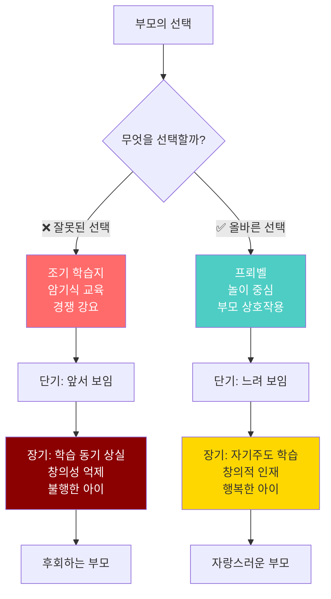
```mermaid
graph TD
    A[부모의 선택] --> B{무엇을 선택할까?}
    
    B -->|❌ 잘못된 선택| C[조기 학습지<br/>암기식 교육<br/>경쟁 강요]
    B -->|✅ 올바른 선택| D[프뢰벨<br/>놀이 중심<br/>부모 상호작용]
    
    C --> C1[단기: 앞서 보임]
    C1 --> C2[장기: 학습 동기 상실<br/>창의성 억제<br/>불행한 아이]
    
    D --> D1[단기: 느려 보임]
    D1 --> D2[장기: 자기주도 학습<br/>창의적 인재<br/>행복한 아이]
    
    C2 --> E[후회하는 부모]
    D2 --> F[자랑스러운 부모]
    
    style C fill:#FF6B6B,color:#fff
    style D fill:#4ECDC4,color:#fff
    style C2 fill:#8B0000,color:#fff
    style D2 fill:#FFD700,color:#333
```

**📢 부모님께 드리는 메시지**

> **세상의 모든 부모는 아이를 사랑합니다.**
> 
> 하지만 때로는 **사랑하는 방법을 잘못 선택**할 수 있습니다.
> 
> - **불안 마케팅**에 속아 조기 학습에 몰입하거나
> - **남들이 하니까**라는 이유로 아이를 학원에 보내거나
> - **지금 당장 앞서 보이는 것**에 집착하거나
> 
> **하지만 과학은 명확하게 말합니다:**
> 
> ✅ 유아기는 **놀이와 탐구**의 시간
> ✅ 부모와의 **따뜻한 상호작용**이 최고의 교육
> ✅ **프뢰벨 같은 질 높은 그림책**이 뇌 발달의 완벽한 자극
> ✅ 지금의 선택이 **평생을 좌우**
> 
> **지금 시작하세요.**
> **과학이 증명한 최선의 선택, 프뢰벨입니다.**

---

## 1. 프뢰벨 vs 경쟁 교육업체 비교

### 1.1 주요 교육업체 비교표

| 구분 | 프뢰벨 | 웅진씽크빅 | 구몬학습 | 재능교육 |
|------|--------|-----------|---------|---------|
| **교육 철학** | 놀이 중심 창의교육 | 전자기기 활용 학습 | 반복 학습 중심 | 단계별 학습지 |
| **그림책 품질** | ⭐⭐⭐⭐⭐ 최상급 일러스트 | ⭐⭐⭐ 일반적 | ⭐⭐ 학습지 스타일 | ⭐⭐⭐ 학습지 스타일 |
| **리터러시 교육** | 문제 정의·비판적 사고 | 단순 독해력 | 문제 풀이 반복 | 단계별 문제 풀이 |
| **창의성 발달** | ⭐⭐⭐⭐⭐ | ⭐⭐⭐ | ⭐⭐ | ⭐⭐ |
| **놀이 통합성** | 높음 (생활 속 놀이) | 중간 (디지털 콘텐츠) | 낮음 (학습 중심) | 낮음 (학습 중심) |
| **부모 참여도** | 높음 (함께 읽기) | 중간 (기기 의존) | 낮음 (독립 학습) | 낮음 (독립 학습) |
| **포트폴리오 구축** | 우수 (작품·활동 기록) | 보통 | 미흡 | 미흡 |

### 1.2 프뢰벨만의 차별화된 강점

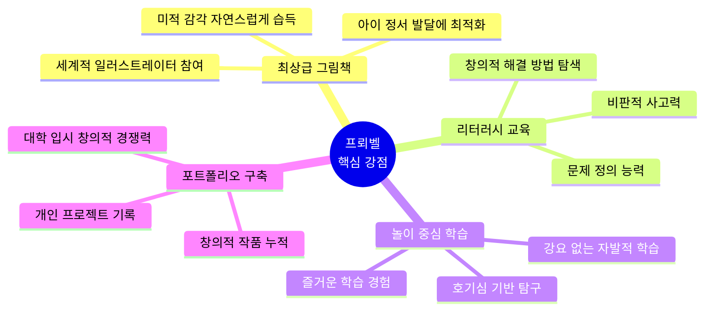
```mermaid
mindmap
  root((프뢰벨<br/>핵심 강점))
    최상급 그림책
      세계적 일러스트레이터 참여
      아이 정서 발달에 최적화
      미적 감각 자연스럽게 습득
    리터러시 교육
      문제 정의 능력
      비판적 사고력
      창의적 해결 방법 탐색
    놀이 중심 학습
      강요 없는 자발적 학습
      호기심 기반 탐구
      즐거운 학습 경험
    포트폴리오 구축
      창의적 작품 누적
      대학 입시 창의적 경쟁력
      개인 프로젝트 기록
```

### 1.3 프뢰벨의 결정적 우위

#### ✅ **그림책 품질의 압도적 우위**
- **시각적 자극**: 프뢰벨 그림책은 단순한 학습 도구가 아닌 예술 작품 수준
- **정서 발달**: 아름다운 그림을 통해 감성과 미적 감각을 동시에 발달
- **상상력 확장**: 풍부한 색감과 창의적 구성이 아이의 상상력을 자극

#### ✅ **AI 리터러시 교육의 차별화**
- **문제 정의 능력**: 단순히 글을 읽는 것이 아니라 "왜?"라는 질문을 던지는 훈련
- **비판적 사고**: 이야기 속에서 문제를 발견하고 다양한 관점에서 바라보기
- **창의적 문제 해결**: 정답이 하나가 아닌 열린 결말, 토론을 통한 사고 확장

---

## 2. 한국 엘리트 양성 교육 시스템 분석

### 2.1 학년별 교육 현실 타임라인

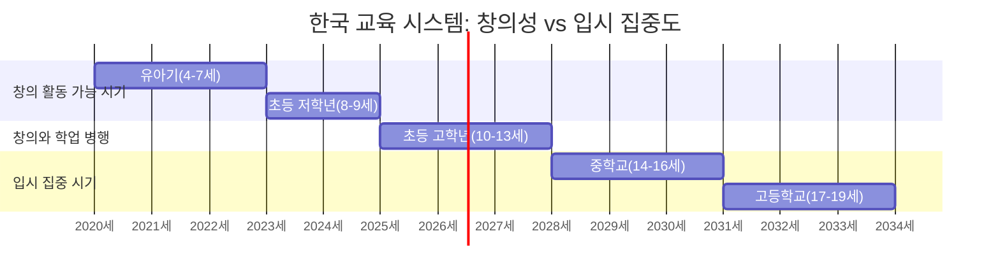
```mermaid
gantt
    title 한국 교육 시스템: 창의성 vs 입시 집중도
    dateFormat YYYY
    axisFormat %Y세
    
    section 창의 활동 가능 시기
    유아기(4-7세): 2020, 3y
    초등 저학년(8-9세): 2023, 2y
    
    section 창의와 학업 병행
    초등 고학년(10-13세): 2025, 3y
    
    section 입시 집중 시기
    중학교(14-16세): 2028, 3y
    고등학교(17-19세): 2031, 3y
```

### 2.2 학년별 교육 특징과 전략

| 단계 | 나이 | 교육 현실 | 창의 활동 가능성 | 핵심 전략 |
|------|------|----------|----------------|----------|
| **유아기** | 4-7세 | 🟢 자유로운 탐색 시기 | ⭐⭐⭐⭐⭐ 최적기 | **놀이·창의 활동 최대화** |
| **초등 저학년** | 8-9세 | 🟢 여유 있는 학습 | ⭐⭐⭐⭐⭐ 황금기 | **개인 프로젝트 시작** |
| **초등 고학년** | 10-13세 | 🟡 학습량 증가 시작 | ⭐⭐⭐ 가능 | **포트폴리오 구축** |
| **중학교** | 14-16세 | 🔴 내신 관리 시작 | ⭐ 방학만 가능 | **기존 포트폴리오 활용** |
| **고등학교** | 17-19세 | 🔴 입시 총력전 | ⭐ 거의 불가능 | **기존 실적 정리·제출** |

### 2.3 엘리트 양성을 위한 단계별 커리어 패스

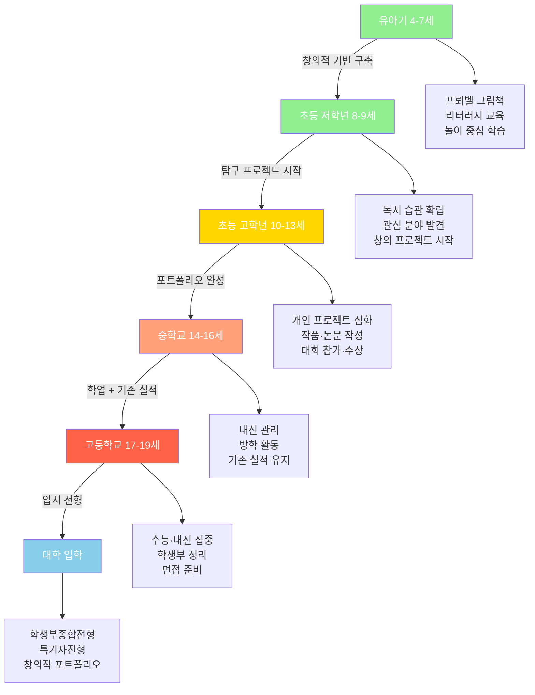
```mermaid
graph TD
    A[유아기 4-7세] -->|창의적 기반 구축| B[초등 저학년 8-9세]
    B -->|탐구 프로젝트 시작| C[초등 고학년 10-13세]
    C -->|포트폴리오 완성| D[중학교 14-16세]
    D -->|학업 + 기존 실적| E[고등학교 17-19세]
    E -->|입시 전형| F[대학 입학]
    
    A --> A1[프뢰벨 그림책<br/>리터러시 교육<br/>놀이 중심 학습]
    B --> B1[독서 습관 확립<br/>관심 분야 발견<br/>창의 프로젝트 시작]
    C --> C1[개인 프로젝트 심화<br/>작품·논문 작성<br/>대회 참가·수상]
    D --> D1[내신 관리<br/>방학 활동<br/>기존 실적 유지]
    E --> E1[수능·내신 집중<br/>학생부 정리<br/>면접 준비]
    F --> F1[학생부종합전형<br/>특기자전형<br/>창의적 포트폴리오]
    
    style A fill:#90EE90,color:#fff
    style B fill:#90EE90,color:#fff
    style C fill:#FFD700,color:#fff
    style D fill:#FFA07A,color:#fff
    style E fill:#FF6347,color:#fff
    style F fill:#87CEEB,color:#fff
```

### 2.4 현실적 교육 전략 분석

#### 🚨 **중요한 현실 인식**

**중·고등학교는 방학 제외 거의 공부만 한다**
- 평일: 아침 7시 등교 → 밤 10시 귀가 (학원 포함)
- 주말: 모의고사, 학원, 자습
- 방학: 짧은 기간 + 선행학습으로 대부분 소진

#### ⚡ **따라서 유아·초등이 결정적으로 중요하다!**

---

## 3. 글로벌 교육 패러다임의 변화: AI 시대의 교육

### 3.1 전세계 교육의 대전환

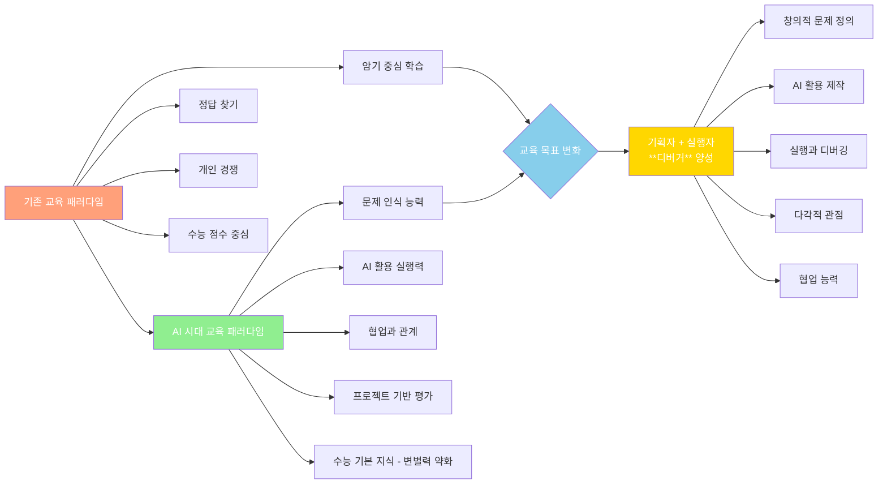
```mermaid
graph LR
    A[기존 교육 패러다임] --> B[AI 시대 교육 패러다임]
    
    A --> A1[암기 중심 학습]
    A --> A2[정답 찾기]
    A --> A3[개인 경쟁]
    A --> A4[수능 점수 중심]
    
    B --> B1[문제 인식 능력]
    B --> B2[AI 활용 실행력]
    B --> B3[협업과 관계]
    B --> B4[프로젝트 기반 평가]
    B --> B5[수능 기본 지식 - 변별력 약화]
    
    A1 --> C{교육 목표 변화}
    B1 --> C
    
    C --> D[기획자 + 실행자<br/>**디버거** 양성]
    
    D --> E[창의적 문제 정의]
    D --> F[AI 활용 제작]
    D --> G[실행과 디버깅]
    D --> H[다각적 관점]
    D --> I[협업 능력]
    
    style A fill:#FFA07A,color:#fff
    style B fill:#90EE90,color:#fff
    style D fill:#FFD700,color:#fff
    style C fill:#87CEEB,color:#fff
```

### 3.2 수능 시스템의 변화와 미래 교육 방향

#### 📊 **교육 평가 방식의 근본적 전환**

| 평가 요소 | 기존 교육 시스템 | AI 시대 교육 시스템 |
|---------|--------------|-----------------|
| **지식 평가** | ⭐⭐⭐⭐⭐ 암기력 중심 | ⭐⭐ 기본 지식만 확인 |
| **프로젝트 능력** | ⭐ 거의 평가 안함 | ⭐⭐⭐⭐⭐ 핵심 역량 |
| **AI 활용 능력** | ❌ 해당 없음 | ⭐⭐⭐⭐⭐ 필수 능력 |
| **협업 능력** | ⭐ 개인 평가만 | ⭐⭐⭐⭐ 관계 교육 중시 |
| **창의적 문제 인식** | ⭐⭐ 제한적 | ⭐⭐⭐⭐⭐ 가장 중요 |
| **실행과 디버깅** | ❌ 이론만 | ⭐⭐⭐⭐⭐ 실전 중심 |

#### 🌍 **가상 공간 프로젝트 교육의 부상**

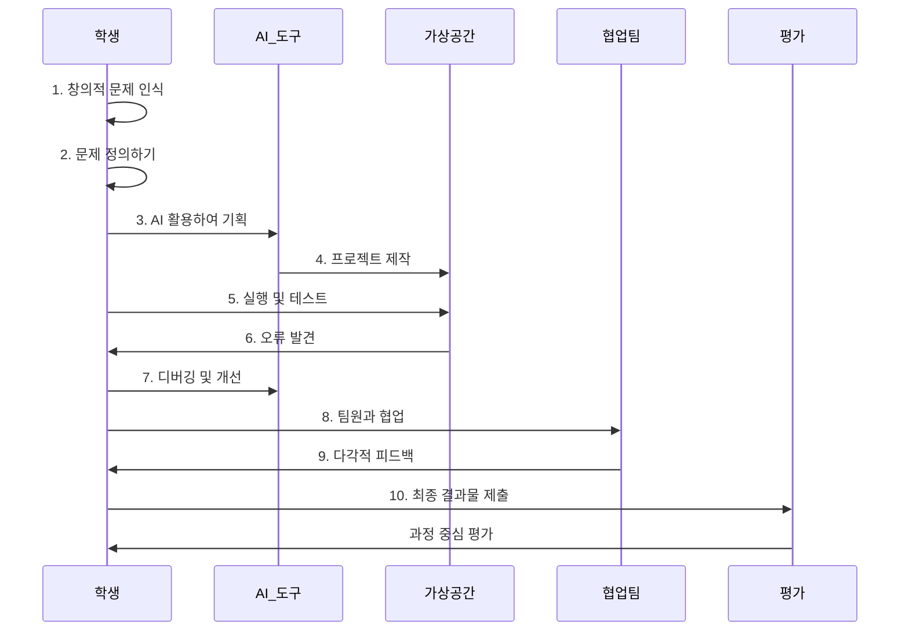
```mermaid
sequenceDiagram
    participant 학생
    participant AI_도구
    participant 가상공간
    participant 협업팀
    participant 평가
    
    학생->>학생: 1. 창의적 문제 인식
    학생->>학생: 2. 문제 정의하기
    학생->>AI_도구: 3. AI 활용하여 기획
    AI_도구->>가상공간: 4. 프로젝트 제작
    학생->>가상공간: 5. 실행 및 테스트
    가상공간->>학생: 6. 오류 발견
    학생->>AI_도구: 7. 디버깅 및 개선
    학생->>협업팀: 8. 팀원과 협업
    협업팀->>학생: 9. 다각적 피드백
    학생->>평가: 10. 최종 결과물 제출
    평가->>학생: 과정 중심 평가
```

### 3.3 AI 시대 핵심 역량: 기획자 + 실행자(디버거)

#### 🎯 **미래 인재가 갖춰야 할 5대 핵심 능력**

```mermaid
mindmap
  root((AI 시대<br/>핵심 역량))
    창의적 문제 인식
      일상에서 문제 발견
      새로운 관점으로 바라보기
      "왜?"라는 질문 던지기
      문제의 본질 파악
    문제 정의 능력
      명확한 목표 설정
      해결 가능한 범위 결정
      우선순위 판단
      구체적 계획 수립
    AI 활용 제작 능력
      AI 도구 활용법 숙지
      프롬프트 엔지니어링
      AI와 협업하기
      효율적 실행
    실행과 디버깅
      직접 만들고 테스트
      오류 발견과 분석
      반복적 개선
      완성도 높이기
    협업과 관계 능력
      다각적 관점 수용
      팀원과 소통
      역할 분담과 조율
      함께 성장하기
```

### 3.4 기업가 정신 교육의 중요성

#### 💡 **창의적 기업가 정신 = 문제 해결 능력**

```mermaid
graph LR
    A[문제 인식] --> B[기회 발견]
    B --> C[해결책 기획]
    C --> D[AI 활용 실행]
    D --> E[피드백 수집]
    E --> F[개선과 반복]
    F --> G[완성된 프로젝트]
    
    A --> A1[관찰력]
    B --> B1[창의성]
    C --> C1[기획력]
    D --> D1[실행력]
    E --> E1[소통력]
    F --> F1[끈기]
    
    style A fill:#FFE4E1,color:#fff
    style C fill:#FFD700,color:#fff
    style D fill:#90EE90,color:#fff
    style G fill:#FF69B4,color:#fff
```

### 3.5 프뢰벨이 AI 시대 교육에 완벽히 부합하는 이유

#### 🌟 **프뢰벨 교육 → AI 시대 핵심 역량 연결**

| AI 시대 핵심 역량 | 프뢰벨 교육이 제공하는 것 | 구체적 효과 |
|---------------|---------------------|----------|
| **창의적 문제 인식** | 그림책 속 다양한 상황 접하기 열린 결말로 "왜?"를 묻기 | 일상에서 문제를 발견하는 눈 비판적 사고력 자연스럽게 발달 |
| **문제 정의 능력** | 이야기 속 갈등 분석하기 명확한 질문 만들기 연습 | 복잡한 문제를 단순화 핵심을 파악하는 능력 |
| **창의적 사고** | 다양한 관점의 이야기 경험 상상력을 자극하는 그림 | 고정관념 없는 자유로운 발상 독창적 아이디어 창출 |
| **시각과 공간 능력** | 최상급 일러스트 감상 입체적 그림책 경험 | 다각적으로 바라보는 능력 공간 지각력 향상 |
| **협업과 관계 능력** | 부모와 함께 읽고 토론 놀이 문화로 관계 맺기 | 타인의 생각 존중하기 소통과 협업의 기초 다지기 |
| **실행과 디버깅 마인드** | 만들기·그리기 활동 시행착오 허용하는 환경 | 실패를 두려워하지 않기 반복 개선의 자세 |

#### ✅ **프뢰벨의 독보적 강점: AI 시대 교육의 기초**

```mermaid
graph LR
    A[프뢰벨 교육] --> B[창의적 생각 자극]
    A --> C[시각과 공간 능력]
    A --> D[놀이문화 관계교육]
    
    B --> B1[그림책 속 질문들]
    B --> B2[열린 결말 토론]
    B --> B3[상상력 확장]
    
    C --> C1[세계적 일러스트]
    C --> C2[입체적 구성]
    C --> C3[다양한 시각]
    
    D --> D1[부모-자녀 상호작용]
    D --> D2[또래와 함께 놀기]
    D --> D3[규칙과 협력 배우기]
    
    B1 --> E[문제 인식 능력]
    B2 --> E
    B3 --> F[창의적 해결책]
    
    C1 --> G[다각적 관점]
    C2 --> G
    C3 --> G
    
    D1 --> H[협업 능력]
    D2 --> H
    D3 --> H
    
    E --> I[AI 시대<br/>핵심 인재]
    F --> I
    G --> I
    H --> I
    
    style A fill:#FFD700,color:#fff
    style I fill:#FF69B4,color:#fff
    style E fill:#90EE90,color:#fff
    style F fill:#90EE90,color:#fff
    style G fill:#90EE90,color:#fff
    style H fill:#90EE90,color:#fff
```

### 3.6 구체적 연결: 프뢰벨 활동 → AI 시대 역량

#### 📚 **프뢰벨 그림책으로 키우는 창의적 문제 인식**

**예시 활동**:
1. **문제 발견 연습**
   - 그림책 읽기: "이 상황에서 문제는 무엇일까?"
   - 일상 연결: "우리 생활에서도 비슷한 문제가 있을까?"
   - 다각적 분석: "다른 사람은 어떻게 생각할까?"

2. **문제 정의 훈련**
   - 명확하게 말하기: "정확히 무엇이 문제인가?"
   - 해결 가능성 판단: "우리가 해결할 수 있는 부분은?"
   - 목표 설정: "어떻게 만들면 좋을까?"

3. **창의적 해결책 찾기**
   - AI 활용 상상: "AI가 도와준다면 어떻게 만들까?"
   - 프로젝트 기획: "나만의 방법으로 만들어보자"
   - 실행과 개선: "만들고, 테스트하고, 더 나아지게"

#### 🎨 **책으로 키우는 시각과 공간 능력**

```mermaid
graph LR
    A[프뢰벨 그림책] --> B[시각적 자극]
    B --> C[입체적 이해]
    C --> D[공간 지각력]
    
    D --> E[다각적 관점]
    E --> F[프로젝트를<br/>여러 측면에서<br/>바라보기]
    
    A --> G[아름다운 일러스트]
    G --> H[미적 감각]
    H --> I[디자인 사고]
    
    F --> J[AI 시대<br/>필수 역량]
    I --> J
    
    style A fill:#FFD700,color:#fff
    style J fill:#FF69B4,color:#fff
```

**구체적 효과**:
- 📐 **공간 인지**: 2D 그림에서 3D 상상력으로 확장
- 👁️ **시각적 분석**: 세부 요소를 놓치지 않는 관찰력
- 🎯 **다각적 사고**: 한 가지 문제를 여러 관점에서 분석
- 🎨 **미적 감각**: 완성도 높은 결과물을 만드는 안목

#### 🤝 **놀이문화로 키우는 협업과 관계 능력**

**프뢰벨 놀이 활동**:

| 놀이 유형 | 교육 효과 | AI 시대 역량 연결 |
|---------|---------|----------------|
| **함께 책 읽기** | 경청하기, 생각 나누기 | 팀 프로젝트에서의 소통 |
| **역할 놀이** | 타인 관점 이해하기 | 다양한 사용자 입장 고려 |
| **만들기 협업** | 역할 분담, 조율하기 | 프로젝트 팀워크 |
| **규칙 있는 게임** | 공정성, 규칙 준수 | 협업 규칙과 책임감 |
| **문제 해결 놀이** | 함께 답 찾기 | 집단 지성 활용 |

### 3.7 프뢰벨 교육이 AI 시대 교육의 완벽한 기초인 이유

#### 🎯 **핵심 메시지**

```mermaid
mindmap
  root((프뢰벨이<br/>AI 시대<br/>교육의 기초))
    창의적 생각 자극
      그림책 속 질문과 토론
      열린 결말로 상상력 확장
      비판적 사고력 자연스럽게 발달
      → 문제 인식 능력
    책으로 보는 시각
      세계적 일러스트 경험
      입체적 구성 이해
      다양한 관점 습득
      → 공간 능력과 다각적 사고
    놀이문화 관계교육
      부모와 함께 토론
      또래와 협력 놀이
      규칙과 공정성 배우기
      → 협업 능력
    종합 효과
      기획자 역량
      실행자 역량
      디버거 마인드
      → AI 시대 핵심 인재
```

#### ⚡ **결론: 프뢰벨은 미래를 위한 최적의 투자**

- ✅ **창의적 문제 인식**: 그림책이 던지는 질문들로 자연스럽게 발달
- ✅ **시각과 공간 능력**: 최상급 일러스트로 다각적 관점 획득
- ✅ **협업과 관계**: 놀이문화를 통해 소통과 협력의 기초 다지기
- ✅ **AI 활용 기반**: 문제 정의와 실행 능력의 탄탄한 토대

**→ AI 시대에 필요한 모든 역량을 유아기부터 자연스럽게 키울 수 있습니다!**

---

## 4. 유아·초등 창의교육의 결정적 중요성

### 3.1 왜 유아·초등 시기가 결정적인가?

```mermaid
graph LR
    A[유아·초등 시기<br/>4-9세] --> B{창의 활동 투자}
    B -->|충분한 투자| C[창의성 발달]
    B -->|부족한 투자| D[획일적 사고]
    
    C --> E[초등 고학년<br/>프로젝트 심화]
    D --> F[중학교부터<br/>뒤늦은 시작]
    
    E --> G[풍부한 포트폴리오<br/>대학 입시 경쟁력]
    F --> H[시간 부족<br/>입시 불리]
    
    style A fill:#90EE90,color:#fff
    style C fill:#87CEEB,color:#fff
    style E fill:#FFD700,color:#fff
    style G fill:#FF69B4,color:#fff
    style D fill:#FFA07A,color:#fff
    style F fill:#FF6347,color:#fff
    style H fill:#8B0000,color:#fff
```

### 3.2 골든타임: 4-9세 창의 교육의 중요성

| 측면 | 유아·초등 시기의 장점 | 중·고등 시기의 한계 |
|------|---------------------|-------------------|
| **시간 여유** | ✅ 충분한 자유 시간 ✅ 탐구 활동 가능 ✅ 시행착오 허용 | ❌ 시간 부족 ❌ 학업 우선 ❌ 여유 없음 |
| **정신적 여유** | ✅ 스트레스 낮음 ✅ 호기심 최대 ✅ 실패 두려움 없음 | ❌ 입시 스트레스 ❌ 성적 압박 ❌ 실패 부담 큼 |
| **창의성 발달** | ✅ 뇌 발달 최적기 ✅ 상상력 풍부 ✅ 자유로운 사고 | ❌ 사고 패턴 고착 ❌ 정답 찾기 습관 ❌ 창의성 위축 |
| **포트폴리오** | ✅ 긴 시간 누적 가능 ✅ 다양한 시도 ✅ 진정성 있는 기록 | ❌ 단기간 억지 활동 ❌ 형식적 스펙 ❌ 진정성 부족 |

### 3.3 놀이 문화의 교육적 가치

```mermaid
mindmap
  root((놀이 중심<br/>창의 교육))
    자발적 학습
      강요 없는 호기심
      내재적 동기 부여
      평생 학습 태도 형성
    문제 해결 능력
      놀이 속 도전 과제
      시행착오 경험
      유연한 사고력
    사회성 발달
      협력 놀이
      규칙 이해
      감정 조절
    창의성 폭발
      자유로운 상상
      새로운 시도
      독창적 아이디어
```

### 3.4 프뢰벨의 놀이 중심 접근법

#### 🎨 **놀이를 통한 학습의 원리**

1. **강요 없는 자연스러운 학습**
   - 그림책을 읽으면서 자연스럽게 질문 생성
   - "이 캐릭터는 왜 이렇게 했을까?" → 비판적 사고
   - "만약 내가 주인공이라면?" → 창의적 문제 해결

2. **생활 속 통합 학습**
   - 책에서 본 내용을 실제 놀이로 재현
   - 역할놀이를 통한 공감 능력 발달
   - 만들기·그리기로 표현력 확장

3. **부모-자녀 상호작용**
   - 함께 읽고 토론하는 시간
   - 아이의 생각을 경청하고 확장시키기
   - 정답이 아닌 과정을 중요하게 여기기

---

## 5. 프뢰벨의 리터러시 교육 강점

### 5.1 진정한 리터러시란?

```mermaid
graph TD
    A[리터러시<br/>Literacy] --> B[단순 문해력<br/>❌ 다른 업체]
    A --> C[비판적 사고력<br/>✅ 프뢰벨]
    
    B --> B1[글자 읽기]
    B --> B2[단어 암기]
    B --> B3[문장 이해]
    
    C --> C1[문제 정의]
    C --> C2[비판적 분석]
    C --> C3[창의적 해결]
    
    C1 --> D[대학 입시 경쟁력]
    C2 --> D
    C3 --> D
    
    D --> E[논술·면접 우위]
    D --> F[학생부종합전형 <br/>-->프로젝트,특별활동 유리]
    D --> G[실생활 문제 해결력]
    
    style A fill:#FFD700,color:#fff
    style C fill:#90EE90,color:#fff
    style D fill:#87CEEB,color:#fff
    style E fill:#FF69B4,color:#fff
    style F fill:#FF69B4,color:#fff
    style G fill:#FF69B4,color:#fff
```

### 5.2 프뢰벨 그림책의 차별화된 교육 효과

#### 📚 **최상급 그림책의 힘**

| 요소 | 교육적 효과 | 장기적 영향 |
|------|-----------|-----------|
| **세계적 수준 일러스트** | 미적 감각 자동 습득 시각적 사고력 발달 | 디자인 감각, 예술적 안목 |
| **깊이 있는 스토리** | 복잡한 서사 이해 인과관계 파악 | 논리적 사고력, 추론 능력 |
| **열린 결말 구조** | 다양한 해석 가능 토론 주제 제공 | 비판적 사고, 창의적 해석 |
| **철학적 질문 담김** | "왜?"를 묻는 습관 깊이 있는 사고 | 문제 정의 능력, 통찰력 |

#### 🎯 **문제 정의 능력 개발 프로세스**

```mermaid
sequenceDiagram
    participant 아이
    participant 프뢰벨_그림책
    participant 부모
    participant 사고력_발달
    
    아이->>프뢰벨_그림책: 그림책 읽기
    프뢰벨_그림책->>아이: 아름다운 그림 + 깊은 이야기
    아이->>아이: "왜 이렇게 됐을까?" 질문 생성
    아이->>부모: "엄마, 이 부분이 이상해요"
    부모->>아이: "네 생각은 어때?" 반문
    아이->>사고력_발달: 스스로 답 찾기 시도
    사고력_발달->>아이: 문제 정의 능력 향상
    아이->>프뢰벨_그림책: 다시 읽으며 새로운 발견
```

### 5.3 리터러시 발달 단계

```mermaid
graph LR
    A[1단계<br/>그림 감상] --> B[2단계<br/>이야기 이해]
    B --> C[3단계<br/>질문 생성]
    C --> D[4단계<br/>비판적 분석]
    D --> E[5단계<br/>창의적 재해석]
    
    A --> A1[아름다운 그림에<br/>매료됨]
    B --> B1[스토리 전개<br/>파악]
    C --> C1["왜?" 질문<br/>시작]
    D --> D1[다른 관점<br/>탐색]
    E --> E1[자신만의<br/>이야기 창작]
    
    style A fill:#FFE4E1,color:#111
    style B fill:#FFD700,color:#111
    style C fill:#90EE90,color:#111
    style D fill:#87CEEB,color:#111
    style E fill:#FF69B4,color:#111
```

---

## 6. 아이의 커리어 패스 설계

### 6.1 프뢰벨 기반 장기 교육 로드맵

```mermaid
timeline
    title 프뢰벨 교육으로 시작하는 아이의 성장 여정
    
    section 유아기 (4-7세)
        프뢰벨 그림책 도입 : 매일 읽기 습관
                           : 부모와 토론
                           : 그림 그리기·만들기
        
    section 초등 저학년 (8-9세)
        관심 분야 발견 : 좋아하는 주제 탐색
                      : 간단한 프로젝트 시작
                      : 독서록·관찰일기 작성
        
    section 초등 고학년 (10-13세)
        포트폴리오 구축 : 개인 프로젝트 심화
                       : 작품집 제작
                       : 대회 참가·수상
        
    section 중·고등학교 (14-19세)
        입시 경쟁력 확보 : 학생부종합전형 대비
                        : 논술·면접 우위
                        : 진정성 있는 스토리
```

### 6.2 프뢰벨 → AI 시대 미래 역량 연결 맵

```mermaid
graph LR
    A[프뢰벨<br/>그림책 교육] --> B[리터러시]
    A --> C[창의성]
    A --> D[미적 감각]
    A --> E[문제 해결력]
    A --> F[협업 능력]
    
    B --> G[문제 정의 능력]
    B --> H[논리적 사고]
    
    C --> I[창의적 문제 인식]
    C --> J[혁신적 아이디어]
    
    D --> K[시각과 공간 능력]
    D --> L[다각적 관점]
    
    E --> M[AI 활용 기획]
    E --> N[실행과 디버깅]
    
    F --> O[관계 교육]
    F --> P[팀 프로젝트]
    
    G --> Q[AI 시대<br/>기획자]
    I --> Q
    M --> Q
    
    H --> R[AI 시대<br/>실행자·디버거]
    N --> R
    
    K --> S[다각적<br/>프로젝트 분석]
    L --> S
    
    O --> T[협업<br/>리더십]
    P --> T
    
    Q --> U[프로젝트 기반<br/>포트폴리오]
    R --> U
    S --> U
    T --> U
    
    U --> V[대학 입시 경쟁력]
    V --> W[AI 시대<br/>핵심 인재]
    W --> X[꿈과 희망 실현]
    
    style A fill:#FFD700,color:#111
    style Q fill:#90EE90,color:#111
    style R fill:#90EE90,color:#111
    style S fill:#90EE90,color:#111
    style T fill:#90EE90,color:#111
    style W fill:#87CEEB,color:#111
    style X fill:#FF69B4,color:#111
```

### 6.3 구체적 커리어 패스 예시 (AI 시대 업데이트)

#### 💻 **예시 1: AI 프로젝트 기획자 희망 학생**

| 시기 | 프뢰벨 활용 | AI 시대 확장 활동 | 결과물 |
|------|----------|-----------------|--------|
| **유아기** | 문제 상황 그림책 읽기 | "왜?" 질문 던지기 놀이 | 문제 인식 능력 기초 |
| **초등 저학년** | 창의적 해결책 토론 | 간단한 프로젝트 기획 (그림/글) | 아이디어 노트 3권 |
| **초등 고학년** | 다양한 분야 책 읽기 | AI 도구 활용 프로젝트 제작 (ChatGPT, Canva 등) | 가상공간 프로젝트 3개 대회 수상 1-2회 |
| **중학교** | 기술과 인문학 융합 독서 | 팀 프로젝트 리더 경험 | 학생부 프로젝트 기록 |
| **고등학교** | 전공 관련 깊이 있는 독서 | 포트폴리오 정리 및 면접 | AI·컴퓨터공학 계열 합격 |

#### 🎨 **예시 2: 창의적 디자이너 (AI 활용) 희망 학생**

| 시기 | 프뢰벨 활용 | AI 시대 확장 활동 | 결과물 |
|------|----------|-----------------|--------|
| **유아기** | 그림 아름다운 책 감상 | 다양한 시각 경험, 따라 그리기 | 미적 감각 + 공간 능력 발달 |
| **초등 저학년** | 다양한 스타일 그림책 | 나만의 그림책 만들기 AI 도구로 디자인 시도 | 작품집 1권 + 디지털 작품 |
| **초등 고학년** | 세계 명작 그림책 분석 | AI 디자인 툴 활용 작품 제작 다각적 관점으로 재해석 | 전시회 3회, AI 작품 포트폴리오 |
| **중학교** | 예술과 기술 융합 독서 | 디지털 아트 동아리 | 온라인 전시, 학생부 기록 |
| **고등학교** | 디자인 사고 심화 학습 | AI 디자인 프로젝트 완성 | 디자인·미디어 계열 합격 |

#### 🚀 **예시 3: 기업가 정신 (창업) 희망 학생**

| 시기 | 프뢰벨 활용 | AI 시대 확장 활동 | 결과물 |
|------|----------|-----------------|--------|
| **유아기** | 문제 해결 스토리 읽기 | 생활 속 문제 발견 놀이 | 관찰력과 문제 인식 습관 |
| **초등 저학년** | 기업가 이야기 책 읽기 | "나만의 가게" 프로젝트 간단한 서비스 기획 | 아이디어 사업 계획서(그림) |
| **초등 고학년** | 경제·사회 문제 책 읽기 | 실제 문제 해결 프로젝트 AI로 프로토타입 제작 | 창업 아이디어 대회 참가 소규모 실행 경험 |
| **중학교** | 기업가 정신 관련 독서 | 학교 창업 동아리 활동 팀 프로젝트 리더 | 창업 포트폴리오, 수상 경력 |
| **고등학교** | 경영·경제 심화 독서 | 실제 서비스 론칭 시도 | 경영·창업 계열 합격 |

#### 🔬 **예시 4: 융합형 과학자 (AI 활용) 희망 학생**

| 시기 | 프뢰벨 활용 | AI 시대 확장 활동 | 결과물 |
|------|----------|-----------------|--------|
| **유아기** | 자연·과학 그림책 읽기 | 관찰하고 질문하기 | 호기심과 탐구심 기초 |
| **초등 저학년** | 과학적 질문이 있는 책 | 간단한 실험과 관찰 일기 | 실험 노트 작성 습관 |
| **초등 고학년** | 과학 원리 탐구 독서 | AI로 데이터 분석 프로젝트 다각적 실험 설계 | 과학 탐구 보고서 3편 과학 대회 수상 |
| **중학교** | 전문 과학 서적 읽기 | 과학 동아리, 팀 연구 | R&E 프로그램 참여 |
| **고등학교** | 첨단 과학 논문 읽기 | 심화 연구 프로젝트 | 이공계 명문대 합격 |

### 6.4 AI 시대, 꿈과 희망을 키우는 구체적 방법

```mermaid
mindmap
  root((AI 시대<br/>아이의 꿈<br/>키우기))
    창의적 문제 인식
      "이 문제를 어떻게 해결할까?"
      일상에서 기회 발견
      다양한 관점으로 바라보기
    자아 발견
      "나는 무엇을 좋아할까?"
      다양한 분야 탐색
      강점과 관심사 발견
    AI 활용 기획
      문제를 명확히 정의하기
      AI 도구로 기획안 만들기
      프로토타입 빠르게 제작
    실행과 디버깅
      직접 만들고 테스트
      오류 발견하고 개선
      반복적으로 완성도 높이기
    협업과 관계
      팀원과 소통하며 협업
      다각적 피드백 수용
      함께 성장하는 경험
    기록과 포트폴리오
      프로젝트 과정 기록
      성장 스토리 만들기
      진정성 있는 포트폴리오
    격려와 지지
      부모의 무조건적 지지
      실패를 배움으로 전환
      과정 중심 칭찬하기
```

#### 🎯 **AI 시대 구체적 실천 방법**

**1. 창의적 문제 인식 훈련**
- 📚 프뢰벨 그림책 읽고 "이 상황의 문제는 뭘까?" 토론
- 🔍 일상 생활에서 불편한 점 발견하기 놀이
- 💭 "만약 내가 해결한다면?" 상상하기

**2. 문제 정의 능력 키우기**
- 📝 문제를 명확한 한 문장으로 정리하기
- 🎯 해결 목표를 구체적으로 설정하기
- 📊 우선순위 정하고 실행 계획 세우기

**3. AI 활용 프로젝트 경험**
- 🤖 나이에 맞는 AI 도구 활용법 배우기
  - 유아~초등 저학년: 그림 AI, 간단한 챗봇
  - 초등 고학년: ChatGPT, 디자인 툴, 코딩 도구
- 🎨 AI를 활용해 아이디어를 빠르게 구현
- 🔄 만들고, 테스트하고, 개선하는 사이클 경험

**4. 다각적 관점과 협업 능력**
- 👥 가족과 함께 프로젝트 토론
- 🤝 친구들과 팀 프로젝트 경험
- 🌍 다양한 사용자 입장 고려하기

**5. 포트폴리오 구축**
- 📸 프로젝트 과정 사진과 영상으로 기록
- 📖 성장 스토리를 글로 정리
- 💼 온라인/오프라인 포트폴리오 제작

---

## 6. 실전 가이드: 프뢰벨 교육 100% 활용법

### 6.1 연령별 실천 전략

#### 👶 **유아기 (4-7세): 기반 다지기**

**목표**: 책과 친해지기, 호기심 키우기

**일일 루틴**:
- 🌅 아침: 짧은 그림책 1권 (10분)
- 🌙 저녁: 긴 이야기책 1권 + 토론 (30분)
- 🎨 주말: 책 내용 기반 만들기·그리기 (1시간)

**부모의 역할**:
- ✅ "왜 그랬을까?" 질문 던지기
- ✅ 아이의 엉뚱한 답변도 경청
- ✅ 정답 강요하지 않기

#### 📚 **초등 저학년 (8-9세): 관심 분야 발견**

**목표**: 좋아하는 것 찾기, 프로젝트 시작

**주간 루틴**:
- 📖 독서: 매일 30분 이상
- ✍️ 기록: 독서록·관찰일기 (주 3회)
- 🔬 탐구: 관심 주제 조사 (주말 2시간)

**프로젝트 예시**:
- "우리 동네 나무 관찰 일기" (4주)
- "내가 만드는 그림책" (2개월)
- "좋아하는 동물 연구 보고서" (1개월)

#### 🎯 **초등 고학년 (10-13세): 포트폴리오 완성**

**목표**: 진지한 프로젝트, 결과물 축적

**프로젝트 수준 업**:
- 📊 소논문 형태 보고서 작성
- 🏆 대회 참가 (글쓰기, 과학, 예술 등)
- 📱 블로그·유튜브로 기록 공유

**포트폴리오 구성**:
1. 프로젝트 결과물 3-5개
2. 수상 실적 2-3개
3. 지속적 활동 기록 (블로그 등)
4. 추천서 받을 수 있는 멘토 확보

---

## 7. 결론: 프뢰벨로 시작하는 AI 시대 성공적 교육 전략

### 7.1 핵심 요약

```mermaid
graph TD
    A[프뢰벨 그림책] -->|최상급 품질| B[미적 감각 + 정서 발달]
    A -->|깊이 있는 내용| C[리터러시 + 비판적 사고]
    A -->|놀이 중심 접근| D[창의성 + 자발적 학습]
    A -->|협업 문화| E[관계 교육 + 협업 능력]
    
    B --> F[시각과 공간 능력]
    C --> G[문제 인식과 정의]
    D --> H[창의적 해결책]
    E --> I[팀워크와 소통]
    
    F --> J[유아·초등 시기<br/>집중 투자]
    G --> J
    H --> J
    I --> J
    
    J --> K{골든타임 활용}
    
    K -->|성공| L[AI 시대 핵심 역량<br/>기획자+실행자+디버거]
    K -->|실패| M[중·고등 시기<br/>시간 부족]
    
    L --> N[프로젝트 기반<br/>포트폴리오]
    N --> O[대학 입시 경쟁력<br/>AI 시대 인재<br/>꿈과 희망 실현]
    M --> P[획일적 입시<br/>제한된 선택]
    
    style A fill:#FFD700,color:#fff
    style J fill:#90EE90,color:#fff
    style L fill:#87CEEB,color:#fff
    style O fill:#FF69B4,color:#fff
    style M fill:#FFA07A,color:#fff
    style P fill:#FF6347,color:#fff
```

### 7.2 AI 시대, 당신의 선택이 아이의 미래를 결정합니다

#### ⏰ **지금이 바로 그 시간입니다**

- **중·고등학교는 이미 늦습니다**: 방학 제외하고 창의 활동은 거의 불가능
- **유아·초등이 유일한 기회**: 시간적·정신적 여유가 있는 마지막 시기
- **AI 시대는 완전히 다른 역량을 요구합니다**: 암기가 아닌 창의적 문제 해결
- **프뢰벨은 단순한 책이 아닙니다**: AI 시대 핵심 인재를 키우는 완벽한 기초

#### 🎯 **프뢰벨이 AI 시대에 제공하는 것**

1. ✅ **세계 최고 수준의 그림책**: 다른 업체와 비교 불가한 품질
2. ✅ **창의적 문제 인식 능력**: "왜?"를 묻고 문제를 발견하는 힘
3. ✅ **문제 정의와 해결 능력**: AI를 활용할 수 있는 기획 능력의 기초
4. ✅ **시각과 공간 능력**: 다각적으로 프로젝트를 바라보는 관점
5. ✅ **놀이를 통한 관계 교육**: 협업과 소통 능력의 자연스러운 발달
6. ✅ **실행과 디버깅 마인드**: 만들고, 테스트하고, 개선하는 습관
7. ✅ **입시 경쟁력**: 프로젝트 기반 진정성 있는 포트폴리오 구축

#### 💎 **결과**

→ **명문대 합격**을 넘어서  
→ **AI 시대 핵심 인재**: 기획자 + 실행자 + 디버거  
→ **창의적 기업가 정신**: 문제를 발견하고 해결하는 힘  
→ **아이가 진정 원하는 꿈**을 실현하는 능력  
→ **평생 이어지는 배움의 즐거움**과 **변화에 적응하는 유연성**

#### 🌍 **전세계가 주목하는 교육 패러다임**

```mermaid
graph LR
    A[프뢰벨 교육] --> B[창의적 사고]
    A --> C[문제 해결]
    A --> D[협업 능력]
    A --> E[실행력]
    
    B --> F[AI 시대<br/>교육 목표]
    C --> F
    D --> F
    E --> F
    
    F --> G[전세계<br/>미래 교육<br/>표준]
    
    style A fill:#FFD700,color:#fff
    style F fill:#90EE90,color:#fff
    style G fill:#FF69B4,color:#fff
```

**프뢰벨은 이미 전세계가 추구하는 AI 시대 교육의 완벽한 기초입니다.**

---

## 8. FAQ: 자주 묻는 질문

### Q1. 프뢰벨 교육, 언제 시작해야 하나요?
**A**: 빠를수록 좋습니다. 이상적으로는 3-4세부터 시작하여 초등 저학년까지 집중 투자하세요. AI 시대 핵심 역량인 창의적 문제 인식과 다각적 사고는 이 시기에 기초가 형성됩니다.

### Q2. AI 시대에 그림책 교육이 정말 효과가 있나요?
**A**: 오히려 더 중요합니다! AI가 발달할수록 **창의적 문제 인식**, **다각적 관점**, **협업 능력**이 핵심 역량이 됩니다. 프뢰벨 그림책은 이 모든 능력의 완벽한 기초를 제공합니다. AI는 도구일 뿐, 문제를 발견하고 정의하는 것은 사람의 몫입니다.

### Q3. 다른 학습지나 코딩 교육과 병행해도 되나요?
**A**: 가능하지만, 프뢰벨의 강점은 **놀이 중심 창의 교육**입니다. 유아기에 과도한 학습지나 스킬 교육은 오히려 창의성을 해칠 수 있습니다. 먼저 프뢰벨로 **사고의 기초**를 다지고, 초등 고학년부터 기술을 배우는 것이 효과적입니다.

### Q4. 바쁜 부모도 할 수 있나요?
**A**: 매일 30분만 투자하세요. 양보다 질이 중요합니다. 함께 읽고 "왜?"를 묻고, 아이의 생각을 경청하는 것만으로도 충분합니다. 이것이 바로 AI 시대 **협업 능력**의 기초가 됩니다.

### Q5. 정말 대학 입시에 도움이 되나요?
**A**: 네, 특히 AI 시대 입시는 **프로젝트 기반 평가**로 전환되고 있습니다. 학생부종합전형은 진정성 있는 스토리와 실제 프로젝트 경험을 요구합니다. 유아기부터 프뢰벨로 쌓은 **창의적 문제 해결 능력**과 **포트폴리오**는 압도적인 경쟁력이 됩니다.

### Q6. AI 도구는 언제부터 가르쳐야 하나요?
**A**: 도구 사용은 초등 고학년(10세)부터 시작해도 늦지 않습니다. 그보다 중요한 것은 **문제를 발견하고 정의하는 능력**, **다각적으로 생각하는 습관**, **협업하는 태도**입니다. 이것이 바로 프뢰벨이 제공하는 것이며, 이 기초 위에 AI 도구를 얹으면 폭발적 효과를 냅니다.

### Q7. 비용 대비 효과가 있나요?
**A**: 중·고등학교 때 억지로 스펙 쌓는 비용(수백만 원)보다 훨씬 효율적입니다. 더 중요한 것은 **AI 시대에 진짜 필요한 역량**을 키우고, 아이의 **진짜 행복과 꿈**을 실현하는 것입니다. 프뢰벨은 일회성 투자가 아닌 **평생 역량의 기초**입니다.

### Q8. 우리 아이는 책을 안 좋아하는데 어떻게 하나요?
**A**: 프뢰벨 그림책은 **예술 작품 수준의 일러스트**로 시각적 자극이 강합니다. 처음에는 그림만 보는 것도 좋습니다. **강요하지 말고** 부모가 먼저 즐기는 모습을 보이세요. 놀이처럼 접근하면 자연스럽게 관심을 갖게 됩니다. 이것이 바로 **자발적 학습**의 시작입니다.

---

## 마무리: AI 시대, 아이의 미래는 지금 시작됩니다

```mermaid
journey
    title 프뢰벨과 함께하는 AI 시대 성장 여정
    section 유아기
      책과 친해지기: 5: 아이, 부모
      문제 발견 놀이: 5: 아이
      창의 놀이와 협업: 5: 아이, 부모
    section 초등 저학년
      관심 발견: 5: 아이
      간단한 프로젝트: 5: 아이, 부모
      시각과 공간 능력: 5: 아이
    section 초등 고학년
      AI 도구 활용: 4: 아이
      프로젝트 제작: 5: 아이
      팀 협업 경험: 4: 아이
    section 중등기
      내신 관리: 3: 아이
      프로젝트 포트폴리오: 5: 아이
    section 고등기
      입시 준비: 3: 아이
      프로젝트 기반 합격: 5: 아이, 부모
    section AI 시대 미래
      기획자+실행자+디버거: 5: 아이
      꿈 실현: 5: 아이
```

### 🌟 **최종 핵심 메시지**

```mermaid
graph TD
    A[프뢰벨 교육] --> B[AI 시대 필요한 모든 것]
    
    B --> C[창의적 문제 인식]
    B --> D[문제 정의 능력]
    B --> E[시각과 공간 능력]
    B --> F[협업과 관계 능력]
    B --> G[실행과 디버깅 마인드]
    
    C --> H[기획자]
    D --> H
    
    E --> I[다각적 사고]
    
    F --> J[팀 리더십]
    
    G --> K[실행자·디버거]
    
    H --> L[AI 시대<br/>핵심 인재]
    I --> L
    J --> L
    K --> L
    
    L --> M[아이의 꿈과<br/>희망 실현]
    
    style A fill:#FFD700,color:#111
    style B fill:#90EE90,color:#111
    style L fill:#87CEEB,color:#111
    style M fill:#FF69B4,color:#111
```

**프뢰벨은 단순한 교재가 아닙니다.**  
**AI 시대 핵심 인재를 키우는 완벽한 기초입니다.**  
**아이의 꿈과 희망을 실현하는 동반자입니다.**

### 💪 **전세계 교육이 주목하는 역량을 지금 시작하세요**

✅ **창의적 문제 인식**: 그림책이 던지는 질문으로 자연스럽게  
✅ **문제 정의와 기획**: 이야기 속에서 문제를 발견하고 정의하기  
✅ **시각과 공간 능력**: 최상급 일러스트로 다각적 관점 습득  
✅ **협업과 관계**: 놀이문화로 소통과 협업의 기초 다지기  
✅ **실행과 디버깅**: 만들고, 테스트하고, 개선하는 습관  

**→ 이 모든 것이 AI를 활용하는 기획자이자 실행자를 만듭니다.**

**지금 시작하세요. 아이의 미래가 완전히 달라집니다.** 🚀

---

*이 문서는 프뢰벨 교육 커리큘럼, 한국 교육 시스템, 그리고 전세계 AI 시대 교육 패러다임을 분석하여 작성되었습니다.*  
*최종 업데이트: 2025년 12월 (AI 시대 교육 반영)*
