# 프뢰벨 프로젝트 기반 교육 과정: 창의적 문제 해결자 양성 로드맵

 
 


---

## 📑 목차

1. [교육 철학: 왜 프로젝트 기반 학습인가?](#1-교육-철학-왜-프로젝트-기반-학습인가)
2. [프뢰벨 프로젝트 학습 프로세스](#2-프뢰벨-프로젝트-학습-프로세스)
3. [단계별 교육 패스: 유아~초등](#3-단계별-교육-패스-유아초등)
4. [프로젝트 기반 학습 로드맵](#4-프로젝트-기반-학습-로드맵)
5. [AI 활용 프로젝트 가이드](#5-ai-활용-프로젝트-가이드)
6. [책 읽기 → 프로젝트화 전략](#6-책-읽기--프로젝트화-전략)
7. [실전 프로젝트 예시](#7-실전-프로젝트-예시)
8. [평가 및 포트폴리오](#8-평가-및-포트폴리오)

---

## 1. 교육 철학: 왜 프로젝트 기반 학습인가?

### 1.1 주입식 교육의 한계

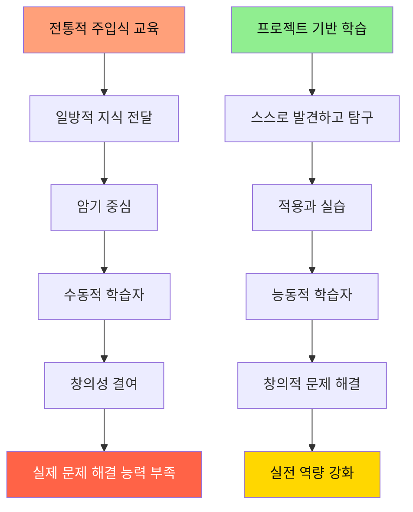

### 1.2 프뢰벨 프로젝트 학습의 핵심 가치

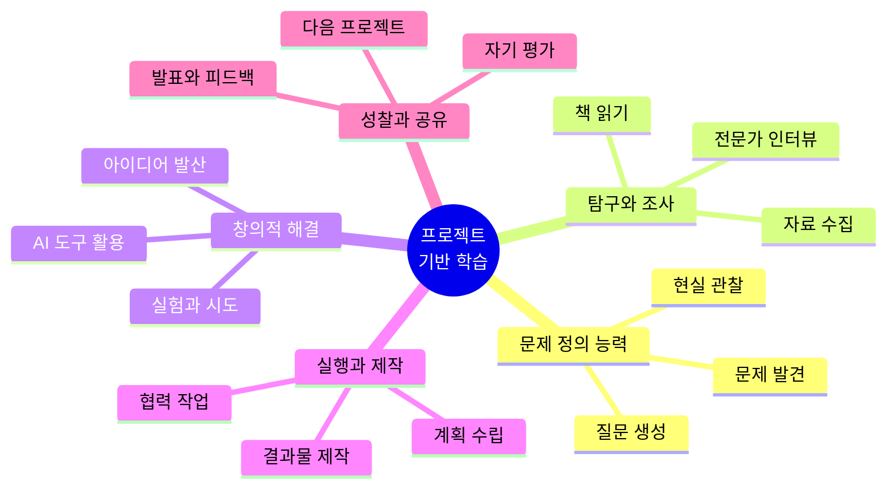

### 1.3 미래 사회가 요구하는 역량

| 주입식 교육이 키우는 것 | 프로젝트 학습이 키우는 것 |
|---------------------|----------------------|
| ❌ 정해진 답 찾기 | ✅ 문제 정의하기 |
| ❌ 혼자 공부하기 | ✅ 협력하여 해결하기 |
| ❌ 시험 점수 | ✅ 실제 결과물 |
| ❌ 단편적 지식 | ✅ 통합적 사고 |
| ❌ 수동적 수용 | ✅ 능동적 탐구 |

---

## 2. 프뢰벨 프로젝트 학습 프로세스

### 2.1 5단계 프로젝트 사이클

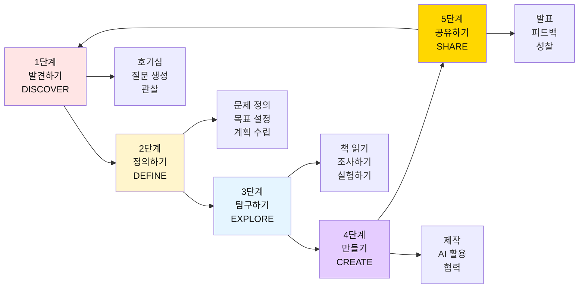

### 2.2 각 단계별 상세 활동

#### 🔍 1단계: 발견하기 (DISCOVER)

**목표**: 일상에서 호기심 발견, 질문 만들기

| 활동 | 방법 | 산출물 |
|------|------|--------|
| **관찰하기** | 주변 환경, 자연, 사람들 관찰 | 관찰 일기 |
| **책 읽기** | 프뢰벨 그림책으로 세상 탐색 | 질문 리스트 |
| **질문 만들기** | "왜?", "어떻게?", "만약에?" | 질문 카드 10개 |

**핵심**: 정답을 가르치지 말고, 질문을 격려하기

---

#### 📝 2단계: 정의하기 (DEFINE)

**목표**: 탐구할 문제 명확히 하기

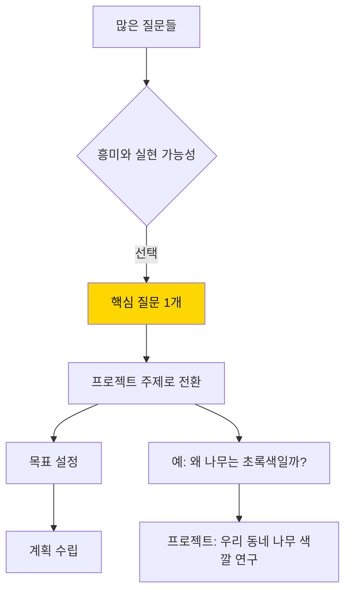

| 활동 | 질문 예시 | 프로젝트 전환 |
|------|----------|--------------|
| **주제 선택** | "왜 비가 올까?" | "날씨 관찰 프로젝트" |
| **목표 설정** | "새는 어떻게 날까?" | "새 관찰 및 모형 제작" |
| **계획 수립** | "로봇은 왜 움직일까?" | "간단한 로봇 만들기" |

---

#### 🔬 3단계: 탐구하기 (EXPLORE)

**목표**: 다양한 방법으로 정보 수집 및 학습

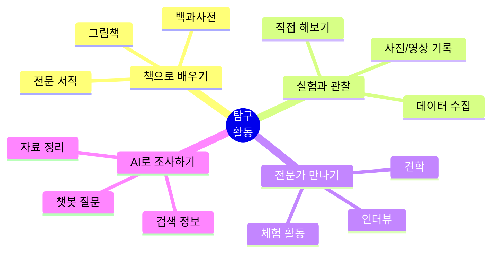

**핵심 활동**:
- 📚 **책 읽기**: 주제 관련 책 최소 3권 이상
- 🔬 **실험**: 직접 해보고 관찰하기
- 💬 **질문하기**: 궁금한 점을 계속 질문
- 🤖 **AI 활용**: ChatGPT 등으로 추가 조사

---

#### 🎨 4단계: 만들기 (CREATE)

**목표**: 배운 것을 바탕으로 창조적 결과물 제작

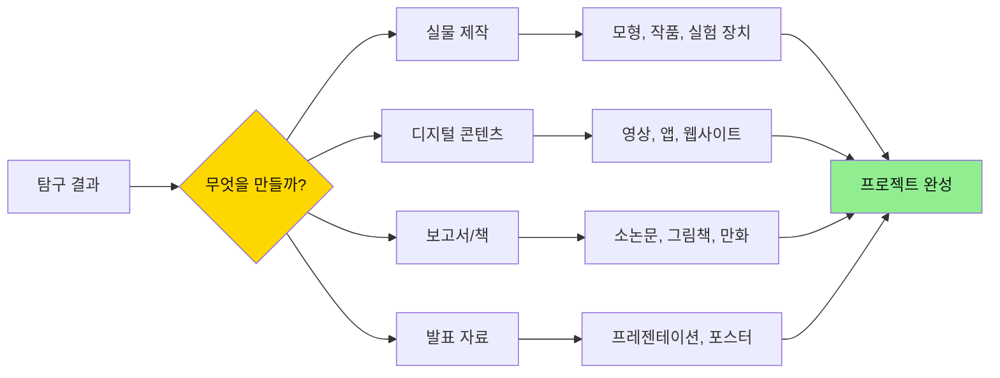

**AI 활용 사례**:
- 🎨 **디자인**: DALL-E로 아이디어 시각화
- 📝 **글쓰기**: ChatGPT와 함께 초안 작성
- 🎬 **영상**: AI 편집 도구 활용
- 📊 **데이터**: AI로 데이터 분석 및 시각화

---

#### 🎤 5단계: 공유하기 (SHARE)

**목표**: 결과를 발표하고 피드백 받기

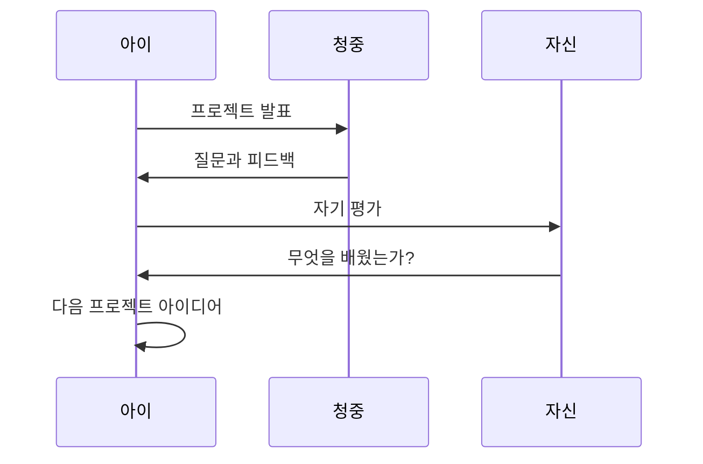

**발표 형식**:
- 🗣️ 구두 발표 (5-10분)
- 📊 포스터 전시
- 🎥 영상 상영
- 📱 온라인 공유 (블로그, SNS)

---

## 3. 단계별 교육 패스: 유아~초등

### 3.1 전체 교육 로드맵

```mermaid
timeline
    title 프뢰벨 프로젝트 기반 학습 여정 (4-13세)
    
    section 1단계: 탐색기 (만 4-5세)
        호기심 폭발 : 질문 만들기
                    : 짧은 탐구 활동
                    : 놀이로 배우기
    
    section 2단계: 발견기 (만 6-7세)
        관심 발견 : 좋아하는 주제 찾기
                  : 1주일 미니 프로젝트
                  : 그림과 글로 표현
    
    section 3단계: 탐구기 (초등 1-2학년)
        체계적 탐구 : 2-4주 프로젝트
                    : 책과 실험 병행
                    : 간단한 보고서
    
    section 4단계: 창조기 (초등 3-4학년)
        창의적 제작 : 1-2개월 프로젝트
                    : AI 도구 활용 시작
                    : 작품과 논문
    
    section 5단계: 혁신기 (초등 5-6학년)
        사회 문제 해결 : 3-6개월 심화 프로젝트
                       : AI 적극 활용
                       : 대회 참가 수준
```

### 3.2 연령별 상세 교육 패스

---

## 🌱 만 4-5세: 탐색기 (호기심과 질문의 시작)

### 핵심 목표
- ✅ 책과 친해지기
- ✅ "왜?"라고 질문하는 습관
- ✅ 관찰하고 표현하기
- ✅ 즐거운 탐구 경험

### 프로젝트 형태

| 프로젝트 주제 | 기간 | 활동 | 결과물 |
|-------------|------|------|--------|
| **우리 집 식물 관찰** | 1주 | 매일 관찰, 그림 그리기 | 관찰 일기 |
| **내가 좋아하는 동물** | 1주 | 책 읽기, 흉내 내기 | 동물 가면 만들기 |
| **색깔 찾기 모험** | 3일 | 집안 색깔 찾기, 분류 | 색깔 책 만들기 |

### 프로젝트 프로세스 예시: "우리 집 식물 관찰"

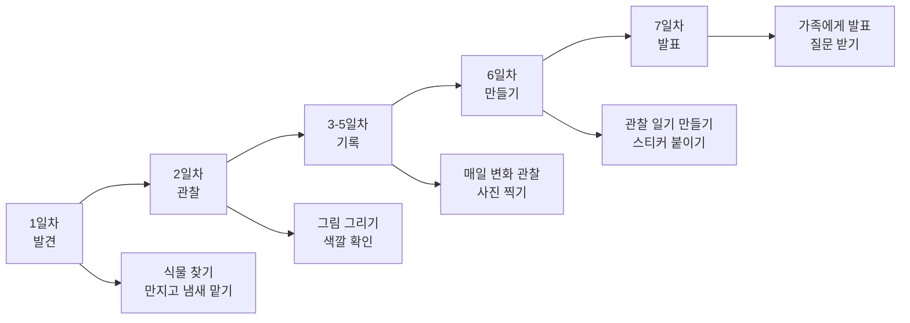

### 부모 가이드

**해야 할 것 ✅**
- 아이의 모든 질문에 귀 기울이기
- "네 생각은 어때?" 반문하기
- 과정을 칭찬하기

**하지 말아야 할 것 ❌**
- 정답 바로 알려주기
- "나중에 커서 알게 될 거야" 회피하기
- 결과물의 완성도 요구하기

---

## 🌿 만 6-7세: 발견기 (나만의 관심사 찾기)

### 핵심 목표
- ✅ 좋아하는 것 발견
- ✅ 1-2주 프로젝트 완성
- ✅ 그림과 글로 기록
- ✅ 발표 경험

### 프로젝트 형태

| 프로젝트 주제 | 기간 | 활동 | 결과물 |
|-------------|------|------|--------|
| **공룡 대탐험** | 2주 | 책 5권 읽기, 박물관 가기 | 공룡 모형 + 설명서 |
| **우리 동네 지도** | 2주 | 산책하며 관찰, 사진 찍기 | 손그림 지도 |
| **물의 여행** | 1주 | 실험 3가지, 그림일기 | 실험 보고서(그림) |

### 프로젝트 프로세스 예시: "공룡 대탐험"

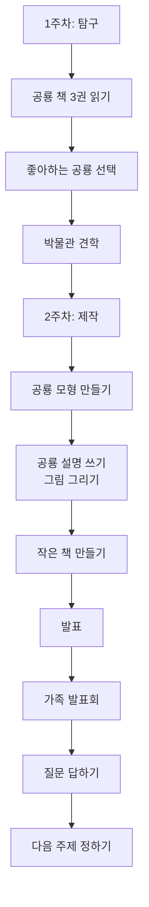

### 책 활용 전략

**책 → 질문 → 프로젝트 흐름**

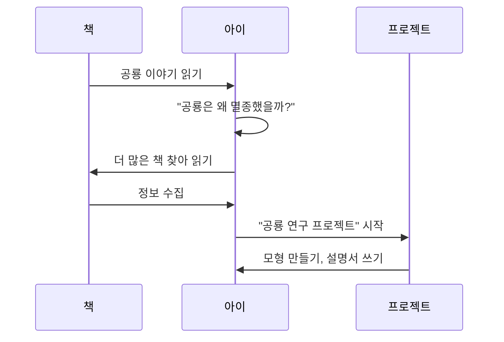

---

## 📚 초등 1-2학년: 탐구기 (체계적 프로젝트 시작)

### 핵심 목표
- ✅ 2-4주 프로젝트 완성
- ✅ 책과 실험을 통한 탐구
- ✅ 간단한 보고서 작성
- ✅ AI 도구 첫 경험

### 프로젝트 형태

| 프로젝트 주제 | 기간 | 활동 | 결과물 | AI 활용 |
|-------------|------|------|--------|---------|
| **나비의 한살이** | 4주 | 책 읽기, 실제 관찰 | 관찰일기 + 그림책 | 이미지 검색 |
| **우리 동네 나무 도감** | 4주 | 나무 조사, 표본 수집 | 나무 도감 제작 | ChatGPT로 나무 정보 |
| **물의 순환** | 3주 | 실험 5가지, 기록 | 실험 보고서 | 그림 생성 AI |

### 프로젝트 프로세스 예시: "나비의 한살이"

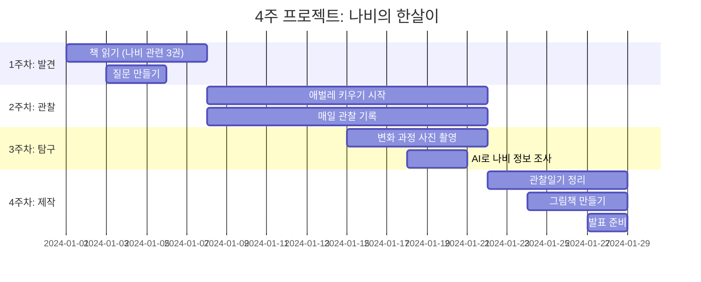

### AI 활용 가이드 (초보)

#### 1. **정보 검색**
```
[ChatGPT 사용 예시]
아이: "나비는 어떻게 날개를 펴요?"
ChatGPT: "나비가 번데기에서 나올 때..."
```

#### 2. **그림 생성**
- DALL-E, 미드저니로 나비 이미지 생성
- 보고서에 활용

#### 3. **글쓰기 도움**
- ChatGPT와 대화하며 아이디어 정리
- 문장 다듬기

**중요**: AI는 도구일 뿐, 직접 관찰과 생각이 우선!

---

## 🎯 초등 3-4학년: 창조기 (AI 활용 본격화)

### 핵심 목표
- ✅ 1-2개월 심화 프로젝트
- ✅ AI 도구 적극 활용
- ✅ 소논문 수준 보고서
- ✅ 대회 참가 가능 수준

### 프로젝트 형태

| 프로젝트 주제 | 기간 | 활동 | 결과물 | AI 활용 |
|-------------|------|------|--------|---------|
| **플라스틱 쓰레기 문제** | 8주 | 실태 조사, 캠페인 | 연구 보고서 + 영상 | 데이터 분석, 영상 편집 |
| **우리 학교 에너지 절약** | 6주 | 전기 사용량 조사 | 절약 프로젝트 + 앱 | 스프레드시트, 간단한 앱 |
| **AI와 함께 만드는 동화** | 4주 | 스토리 창작 | 그림책 + 오디오북 | ChatGPT, DALL-E, 음성 생성 |

### 프로젝트 프로세스 예시: "플라스틱 쓰레기 문제"

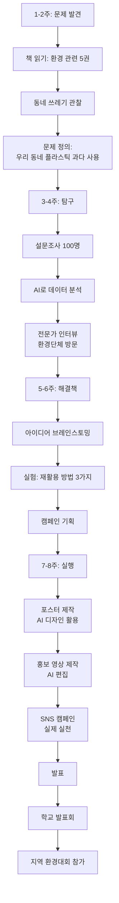

### AI 활용 가이드 (중급)

#### 📊 **데이터 분석**
```python
# ChatGPT에게 요청
"우리 반 친구들 100명에게 물어봤어요.
- 플라스틱 물병 사용: 70명
- 텀블러 사용: 30명
이 데이터를 그래프로 보여줘."
```

#### 🎨 **디자인 제작**
- Canva + AI로 포스터 디자인
- DALL-E로 캠페인 이미지 생성

#### 🎬 **영상 제작**
- 스크립트: ChatGPT와 함께 작성
- 영상 편집: CapCut, Vrew 활용
- 음성: AI 음성 생성 도구

---

## 🚀 초등 5-6학년: 혁신기 (사회 문제 해결)

### 핵심 목표
- ✅ 3-6개월 대규모 프로젝트
- ✅ 실제 사회 문제 해결
- ✅ AI와 협업하는 능력
- ✅ 대회 수상 및 포트폴리오

### 프로젝트 형태

| 프로젝트 주제 | 기간 | 활동 | 결과물 | AI 활용 |
|-------------|------|------|--------|---------|
| **시각장애인을 위한 앱** | 12주 | 인터뷰, 프로토타입 제작 | 앱 + 논문 | AI 음성인식, 앱 개발 |
| **우리 마을 역사 디지털 아카이브** | 16주 | 인터뷰, 자료 수집 | 웹사이트 + 책 | AI 정리, 웹 개발 |
| **AI로 만드는 개인 맞춤 학습 도우미** | 10주 | 학습 패턴 분석 | 챗봇 + 보고서 | ChatGPT API, 파이썬 |

### 프로젝트 프로세스 예시: "시각장애인을 위한 앱"

```mermaid
graph TD
    subgraph 1단계: 공감 (2주)
        A1[시각장애 체험]
        A2[복지관 방문]
        A3[당사자 인터뷰 5명]
        A4[문제 정의]
    end
    
    subgraph 2단계: 정의 (2주)
        B1[불편 사항 정리]
        B2[해결 가능한 문제 선택]
        B3[앱 기능 기획]
        B4[목표 설정]
    end
    
    subgraph 3단계: 아이디어 (2주)
        C1[브레인스토밍]
        C2[기존 솔루션 조사]
        C3[AI 기술 조사]
        C4[최종 아이디어 선정]
    end
    
    subgraph 4단계: 프로토타입 (4주)
        D1[종이 프로토타입]
        D2[AI 음성인식 테스트]
        D3[앱 인벤터로 제작]
        D4[사용성 테스트]
    end
    
    subgraph 5단계: 테스트 및 개선 (2주)
        E1[실사용자 테스트]
        E2[피드백 반영]
        E3[최종 완성]
    end
    
    A4 --> B1
    B4 --> C1
    C4 --> D1
    D4 --> E1
```

### AI 활용 가이드 (고급)

#### 🤖 **AI 음성인식 활용**
```javascript
// AI 음성인식 API 사용
"주변 사물 인식해줘" 
→ AI가 카메라 이미지 분석 
→ "앞에 의자가 있습니다" 음성 출력
```

#### 💻 **프로그래밍과 AI**
- ChatGPT로 코드 작성 도움
- AI 디버깅 도구 활용
- AI API 연동

#### 📊 **데이터 과학**
- 파이썬으로 데이터 분석
- AI로 패턴 발견
- 결과 시각화

---

## 4. 프로젝트 기반 학습 로드맵

### 4.1 프로젝트 복잡도 진화

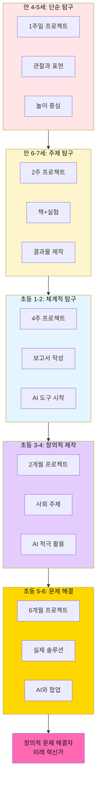

### 4.2 주제 선택 가이드

#### 좋은 프로젝트 주제 기준

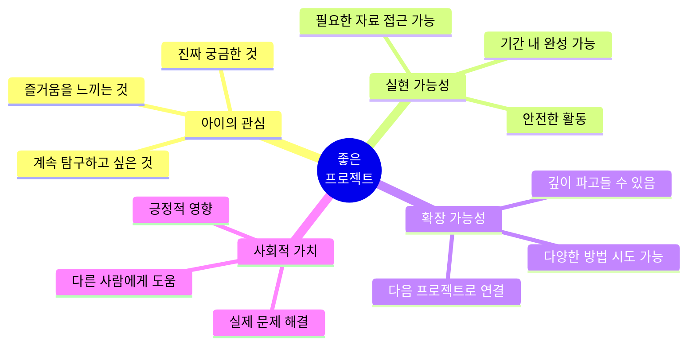

#### 연령별 추천 주제 카테고리

| 연령 | 자연·과학 | 사회·문화 | 예술·창작 | 기술·AI |
|------|---------|---------|---------|---------|
| **만 4-5세** | 동식물 관찰 | 우리 가족 | 색깔과 모양 | - |
| **만 6-7세** | 날씨, 계절 | 우리 동네 | 이야기 만들기 | 로봇 놀이 |
| **초등 1-2** | 실험, 관찰 | 학교, 친구 | 그림책 창작 | 코딩 기초 |
| **초등 3-4** | 환경 문제 | 역사, 문화 | 디지털 창작 | AI 도구 활용 |
| **초등 5-6** | 기후변화 | 사회 문제 | 미디어 제작 | AI 프로젝트 |

---

## 5. AI 활용 프로젝트 가이드

### 5.1 AI 도구 활용 단계별 로드맵

```mermaid
timeline
    title AI 활용 능력 발달 단계
    
    section 1단계: 인식 (초등 1-2)
        AI 체험 : AI 이미지 인식 놀이
                : 음성 비서 사용
                : AI 그림 감상
    
    section 2단계: 이해 (초등 3-4)
        AI 활용 : ChatGPT로 정보 검색
                : DALL-E로 그림 생성
                : AI 도구로 과제 해결
    
    section 3단계: 창조 (초등 5-6)
        AI 협업 : AI와 함께 프로젝트
                : AI 기능이 있는 앱 제작
                : AI 윤리 이해
```

### 5.2 프로젝트 단계별 AI 활용법

#### 📝 **1단계: 문제 정의** 
```
[ChatGPT 활용]
아이: "플라스틱 쓰레기가 왜 문제인지 5살 동생도 이해할 수 있게 설명해줘."
ChatGPT: "플라스틱은 자연에서 썩지 않아요. 바다로 가면..."
→ 프로젝트 방향성 명확화
```

#### 🔍 **2단계: 탐구**
```
[AI 검색 & 정리]
- ChatGPT: "플라스틱 재활용 방법 3가지 알려줘"
- Perplexity: 최신 연구 자료 검색
- AI 요약: 긴 기사를 아이 수준으로 요약
```

#### 🎨 **3단계: 제작**
```
[다양한 AI 도구]
- DALL-E: 캠페인 포스터 아이디어
- Canva AI: 디자인 템플릿
- ChatGPT: 발표 스크립트 초안
- Vrew: 영상 자막 자동 생성
```

#### 📊 **4단계: 데이터 분석**
```python
# ChatGPT에게 요청
"이 데이터를 분석하고 그래프로 만들어줘"
[데이터 붙여넣기]
→ AI가 인사이트 제공
→ 시각화 코드 생성
```

### 5.3 AI 윤리 교육

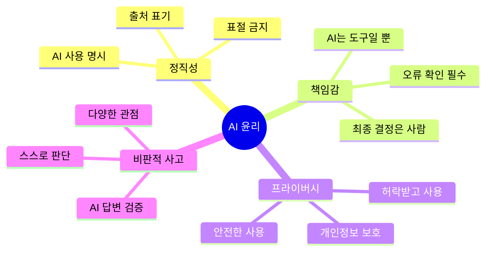

**AI 사용 원칙**:
1. ✅ AI는 조수, 나는 감독관
2. ✅ AI 결과는 반드시 확인하고 수정
3. ✅ AI 사용 사실을 명시
4. ✅ AI가 할 수 없는 것: 직접 경험, 감정, 윤리 판단

---

## 6. 책 읽기 → 프로젝트화 전략

### 6.1 프뢰벨 그림책 → 프로젝트 전환 프로세스

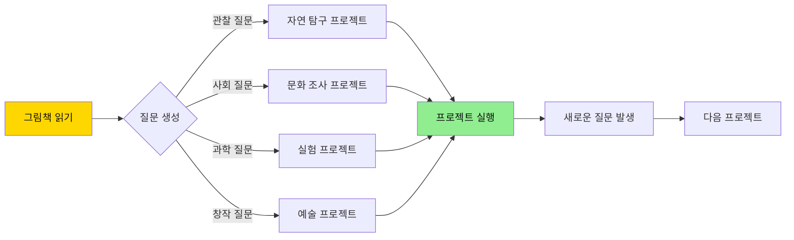

### 6.2 책 → 질문 → 프로젝트 사례

#### 예시 1: 『나무를 심은 사람』

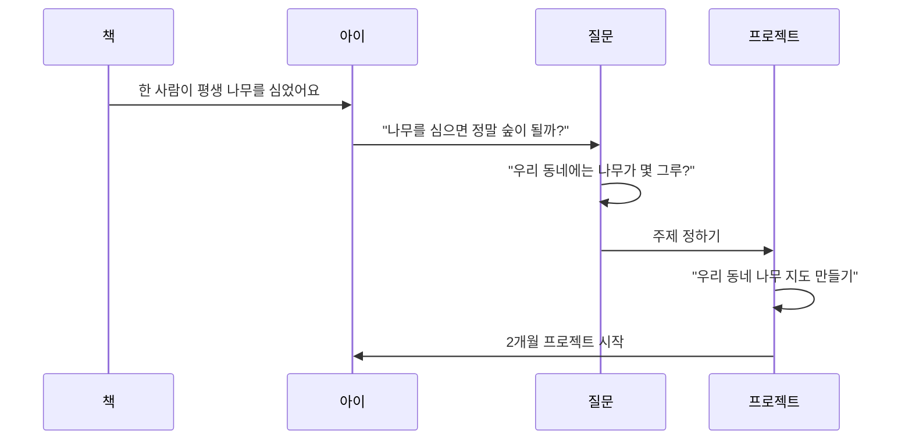

**프로젝트 구성**:
- **1주차**: 동네 나무 조사 (50그루 촬영)
- **2주차**: 나무 종류 분류 (AI 활용)
- **3주차**: 지도 제작
- **4주차**: 나무 심기 캠페인 기획
- **결과물**: 동네 나무 지도 + 캠페인 포스터

---

#### 예시 2: 『플라스틱 섬』

```mermaid
graph TD
    A[책 읽기] --> B[충격적인 내용<br/>플라스틱으로 뒤덮인 바다]
    B --> C{질문 폭발}
    
    C --> C1["왜 플라스틱이<br/>바다로 갈까?"]
    C --> C2["우리 동네도<br/>심각할까?"]
    C --> C3["내가 할 수 있는<br/>일은?"]
    
    C1 --> D[프로젝트 1:<br/>플라스틱 여행 조사]
    C2 --> E[프로젝트 2:<br/>동네 쓰레기 실태 조사]
    C3 --> F[프로젝트 3:<br/>플라스틱 프리 챌린지]
    
    D --> G[통합 프로젝트:<br/>플라스틱 줄이기 캠페인]
    E --> G
    F --> G
```

**프로젝트 구성** (2개월):
- **탐구**: 플라스틱 문제 조사
- **실험**: 우리 집 플라스틱 사용량 측정
- **해결책**: 대안 찾기 (장바구니, 텀블러 등)
- **캠페인**: 학교 친구들과 함께 실천
- **결과물**: 연구 보고서 + 실천 영상 + SNS 캠페인

---

### 6.3 독서 → 프로젝트 루틴

#### 일주일 루틴 예시 (초등 3학년)

| 요일 | 활동 | 시간 | 목표 |
|------|------|------|------|
| **월** | 책 읽기 + 질문 쓰기 | 30분 | 5개 질문 만들기 |
| **화** | 추가 자료 조사 (AI 활용) | 40분 | 배경지식 쌓기 |
| **수** | 실험 또는 관찰 | 1시간 | 직접 경험 |
| **목** | 기록하고 정리 | 40분 | 사진, 글, 그림 |
| **금** | AI로 자료 정리 | 30분 | 보고서 초안 |
| **토** | 결과물 제작 | 2시간 | 포스터, 모형 등 |
| **일** | 가족 발표회 | 30분 | 피드백 받기 |

---

## 7. 실전 프로젝트 예시

### 7.1 환경 프로젝트: "우리 동네 플라스틱 다이어트"

#### 프로젝트 개요
- **대상**: 초등 4학년
- **기간**: 8주
- **형태**: 환경 캠페인 프로젝트

#### 전체 과정

```mermaid
gantt
    title 8주 프로젝트 타임라인
    dateFormat YYYY-MM-DD
    
    section 준비 및 탐구
    책 읽기 (환경 관련)           :2024-01-01, 7d
    동네 쓰레기 관찰              :2024-01-05, 5d
    문제 정의                   :2024-01-08, 2d
    
    section 조사 및 연구
    설문조사 (100명)             :2024-01-10, 10d
    AI로 데이터 분석             :2024-01-18, 3d
    전문가 인터뷰                :2024-01-20, 5d
    
    section 해결책 개발
    아이디어 회의                :2024-01-25, 3d
    프로토타입 제작              :2024-01-28, 7d
    
    section 캠페인 실행
    포스터 제작 (AI 활용)        :2024-02-04, 5d
    SNS 캠페인                  :2024-02-08, 14d
    학교 발표                   :2024-02-20, 2d
    
    section 마무리
    보고서 작성                 :2024-02-22, 5d
    최종 발표                   :2024-02-27, 1d
```

#### 주차별 상세 활동

**1주차: 발견하기**
- 📚 환경 책 5권 읽기
  - 『플라스틱 섬』
  - 『지구를 위한 한 시간』
  - 『쓰레기가 쌓이고 쌓이면』
- 🚶 동네 쓰레기 관찰 프로젝트
  - 하루에 버려지는 쓰레기 사진 촬영
  - 플라스틱 비율 측정
- ❓ **핵심 질문**: "우리 동네에 플라스틱이 왜 이렇게 많을까?"

**2주차: 문제 정의**
```
문제 정의 워크시트:
1. 현상: 우리 동네 쓰레기의 70%가 플라스틱
2. 원인: 일회용품 과다 사용
3. 영향: 환경 오염, 재활용 어려움
4. 목표: 우리 동네 플라스틱 사용 20% 줄이기
5. 방법: 인식 개선 캠페인
```

**3-4주차: 조사하기**
- 📊 설문조사 (친구, 가족, 이웃 100명)
  - "하루에 플라스틱 몇 개 사용하나요?"
  - "재활용 제대로 하시나요?"
- 🤖 AI로 데이터 분석
  ```
  ChatGPT에게 요청:
  "이 설문 결과를 분석하고 그래프로 만들어줘"
  → 주요 인사이트 발견
  ```
- 👤 전문가 인터뷰
  - 환경단체 방문
  - 재활용 업체 견학

**5-6주차: 해결책 만들기**
- 💡 브레인스토밍 (50개 아이디어)
  - 플라스틱 프리 챌린지
  - 텀블러 사용 캠페인
  - 장바구니 나눔 프로젝트
- 🎨 캠페인 자료 제작 (AI 활용)
  - DALL-E로 포스터 디자인 아이디어
  - Canva로 실제 포스터 제작
  - ChatGPT로 슬로건 만들기

**7-8주차: 실행하기**
- 📱 SNS 캠페인
  - 인스타그램 계정 개설
  - 매일 실천 인증샷
  - 친구들 참여 독려
- 🏫 학교 발표
  - 전교생 대상 발표
  - 실천 방법 공유
- 📝 보고서 완성
  - 과정 기록
  - 결과 분석
  - 느낀 점

#### 결과물

1. **연구 보고서** (20페이지)
   - 문제 정의
   - 조사 과정
   - 데이터 분석
   - 해결책 제안

2. **캠페인 자료**
   - 포스터 5종
   - 홍보 영상 (3분)
   - SNS 콘텐츠 20개

3. **실천 기록**
   - 100명 참여 인증
   - 플라스틱 사용 감소 20% 달성

---

### 7.2 기술 프로젝트: "AI 독서 친구 만들기"

#### 프로젝트 개요
- **대상**: 초등 6학년
- **기간**: 10주
- **형태**: AI 챗봇 개발 프로젝트

#### 프로젝트 과정

```mermaid
graph TD
    A[1-2주: 문제 발견] --> A1[책을 안 읽는 친구들 관찰]
    A1 --> A2[이유 조사:<br/>재미없음, 어려움]
    A2 --> A3[아이디어:<br/>AI가 독서 도와주면?]
    
    B[3-4주: 기술 조사] --> B1[ChatGPT 기능 연구]
    B1 --> B2[챗봇 만드는 법 배우기]
    B2 --> B3[Python 기초 학습]
    
    C[5-7주: 제작] --> C1[기능 설계<br/>책 추천, 질문 답변, 퀴즈]
    C1 --> C2[프로토타입 개발]
    C2 --> C3[AI API 연동]
    
    D[8-9주: 테스트] --> D1[친구들 사용 테스트]
    D1 --> D2[피드백 반영]
    D2 --> D3[개선 및 완성]
    
    E[10주: 발표] --> E1[학교 발표]
    E1 --> E2[대회 출품]
    
    A3 --> B
    B3 --> C
    C3 --> D
    D3 --> E
```

#### 주요 기능

**1. 책 추천 기능**
```python
# AI에게 질문
"공룡을 좋아하는 초등학생에게 추천할 책 5권"
→ AI가 추천 + 이유 설명
```

**2. 독서 도우미**
```python
# 어려운 단어 설명
"이 단어가 무슨 뜻인지 쉽게 설명해줘"
→ AI가 5살도 이해할 수 있게 설명
```

**3. 독서 퀴즈**
```python
# 이해도 체크
"이 책의 내용으로 퀴즈 5개 만들어줘"
→ 재미있게 복습
```

#### 결과물
- 💻 작동하는 챗봇 프로토타입
- 📱 스마트폰에서 사용 가능
- 📊 20명 사용 테스트 결과
- 📝 개발 일지 및 소논문

---

### 7.3 사회 프로젝트: "우리 동네 어르신 이야기 책"

#### 프로젝트 개요
- **대상**: 초등 5학년
- **기간**: 12주
- **형태**: 구술사 기록 프로젝트

#### 프로젝트 의의
- 지역 역사 보존
- 세대 간 소통
- 글쓰기 및 인터뷰 능력
- 디지털 아카이빙

#### 프로젝트 과정

**1-3주: 준비**
- 인터뷰 방법 배우기
- 질문지 만들기 (50개)
- 녹음/촬영 연습

**4-9주: 인터뷰 및 기록**
- 매주 어르신 2분 인터뷰
- 총 10분 인터뷰
- AI로 음성을 텍스트로 변환
- 사진 정리

**10-11주: 책 만들기**
- ChatGPT로 글 다듬기
- 사진 편집 (AI 도구)
- 레이아웃 디자인

**12주: 출판 및 배포**
- 전자책 제작
- 마을 도서관에 기증
- 발표회 개최

#### 결과물
- 📖 『우리 동네 어르신 10인의 이야기』 (100페이지)
- 🎥 다큐멘터리 영상 (15분)
- 💾 디지털 아카이브 웹사이트

---

## 8. 평가 및 포트폴리오

### 8.1 프로젝트 평가 기준

```mermaid
graph TD
    A[프로젝트 평가] --> B[과정 평가 60%]
    A --> C[결과 평가 30%]
    A --> D[발표 평가 10%]
    
    B --> B1[질문의 질]
    B --> B2[탐구 노력]
    B --> B3[문제 해결 과정]
    B --> B4[AI 윤리적 사용]
    
    C --> C1[창의성]
    C --> C2[완성도]
    C --> C3[실용성]
    
    D --> D1[발표 능력]
    D --> D2[질문 답변]
    
    style A fill:#FFD700,color:#111
    style B fill:#90EE90,color:#111
```

### 8.2 과정 중심 평가

#### 프로젝트 일지 (매일 작성)

```markdown
# 프로젝트 일지

## 날짜: 2024년 1월 15일
## 오늘 한 일
- 나비 책 2권 읽음
- 애벌레 관찰 (2cm 자람!)
- AI에게 나비 변태 과정 물어봄

## 새로 안 것
- 애벌레가 허물을 벗는다는 사실
- 번데기가 되는 데 1-2주 걸림

## 어려웠던 점
- 애벌레가 잘 안 보여서 사진 찍기 힘들었음

## 다음에 할 일
- 매일 같은 시간에 관찰
- 허물 벗는 순간 촬영하기

## 느낀 점
- 생명의 신비함
- 기다리는 것도 과학이다
```

#### 자기 평가 체크리스트

| 평가 항목 | ⭐⭐⭐⭐⭐ | ⭐⭐⭐⭐ | ⭐⭐⭐ | ⭐⭐ | ⭐ |
|----------|---------|---------|---------|------|-----|
| 질문을 스스로 만들었나? | | | | | |
| 책을 충분히 읽었나? | | | | | |
| 다양한 방법으로 조사했나? | | | | | |
| AI를 윤리적으로 사용했나? | | | | | |
| 끝까지 포기하지 않았나? | | | | | |
| 새로운 것을 배웠나? | | | | | |
| 재미있었나? | | | | | |

### 8.3 포트폴리오 구성

```mermaid
graph TD
    A[프로젝트 포트폴리오] --> B[프로젝트 개요]
    A --> C[과정 기록]
    A --> D[결과물]
    A --> E[성찰]
    
    B --> B1[주제 선정 이유]
    B --> B2[목표]
    B --> B3[계획]
    
    C --> C1[프로젝트 일지]
    C --> C2[사진/영상]
    C --> C3[시행착오]
    
    D --> D1[보고서]
    D --> D2[작품]
    D --> D3[발표 자료]
    
    E --> E1[배운 점]
    E --> E2[어려웠던 점]
    E --> E3[다음 계획]
    
    style A fill:#FFD700,color:#111
```

#### 포트폴리오 템플릿

```markdown
# 프로젝트 포트폴리오

## 📌 프로젝트 정보
- **제목**: 우리 동네 나비 관찰 프로젝트
- **기간**: 2024.01.01 - 2024.01.28 (4주)
- **학년**: 초등학교 2학년
- **카테고리**: 자연 과학

## 🎯 프로젝트 동기
"봄에 꽃밭에서 나비를 봤는데, 나비는 어떻게 태어날까 궁금했어요."

## 📚 읽은 책
1. 『애벌레가 들려주는 나비 이야기』
2. 『나비의 한살이』
3. 『우리 동네 나비 도감』

## 🔍 탐구 과정
### 1주차: 준비
- [사진] 애벌레 키우기 세트 준비
- [일기] 매일 관찰 시작

### 2주차: 관찰
- [사진] 애벌레 성장 과정 (10장)
- [그림] 크기 변화 그래프

### 3주차: 변화
- [사진] 번데기 만드는 모습
- [영상] 타임랩스 촬영 (30초)

### 4주차: 탄생
- [사진] 나비가 나오는 순간!
- [감동] 날개를 펼 때 가슴이 뛰었어요

## 🤖 AI 활용
- ChatGPT로 나비 정보 조사
- AI 이미지 검색으로 나비 종류 확인
- DALL-E로 나비 일러스트 생성

## 📊 결과물
1. **관찰 일기** (28일 기록)
2. **사진첩** (100장)
3. **그림책** "애벌레의 꿈" (12페이지)
4. **발표 영상** (5분)

## 💡 배운 점
- 생명의 신비로움
- 인내심의 중요성
- 관찰하는 즐거움
- AI는 좋은 선생님

## 😊 느낀 점
"처음엔 징그러웠는데, 매일 보니까 정이 들었어요. 
나비가 날아가던 날, 슬프기도 하고 기쁘기도 했어요.
다음엔 잠자리도 키워보고 싶어요!"

## 🏆 수상 및 인정
- 학교 과학의 날 우수상
- 선생님 칭찬 10번
- 친구들이 부러워함

## 📸 대표 사진
[프로젝트 최고의 순간 사진]

## 🎬 프로젝트 영상
[유튜브 링크 또는 파일]

---
*이 프로젝트로 나는 작은 과학자가 되었어요!*
```

### 8.4 디지털 포트폴리오 플랫폼

| 플랫폼 | 특징 | 추천 연령 |
|--------|------|----------|
| **Seesaw** | 학교 연동 가능, 부모 공유 | 초등 전학년 |
| **Google Sites** | 웹사이트 형식, 무료 | 초등 3학년+ |
| **Notion** | 체계적 정리, 협업 | 초등 5학년+ |
| **블로그** | 공개 공유, SNS 연동 | 초등 4학년+ |
| **유튜브** | 영상 중심, 대중적 | 초등 전학년 |

---

## 9. 학부모 가이드

### 9.1 프로젝트 학습을 위한 부모의 역할

```mermaid
mindmap
  root((부모의<br/>역할))
    촉진자
      질문 던지기
      자료 찾기 도움
      환경 조성
    관찰자
      과정 기록
      성장 모니터링
      칭찬과 격려
    동반자
      함께 탐구
      경험 공유
      대화 파트너
    조언자
      방향 제시
      자원 연결
      안전 관리
```

### 9.2 부모가 해야 할 것 vs 하지 말아야 할 것

#### ✅ **해야 할 것**

1. **질문에 질문으로 답하기**
   ```
   아이: "나비는 왜 날개가 예쁜 거예요?"
   부모: "좋은 질문이네! 너는 왜 그럴 것 같아?"
   ```

2. **실패를 격려하기**
   ```
   "실험이 잘 안 됐구나. 왜 그랬을까? 다시 해볼까?"
   ```

3. **과정을 칭찬하기**
   ```
   "결과도 좋지만, 포기하지 않고 계속한 네가 자랑스러워"
   ```

4. **자료 접근 돕기**
   ```
   "도서관 가서 책 찾아볼까?"
   "전문가에게 메일 보내볼까?"
   ```

5. **기록 습관 만들기**
   ```
   매일 10분, 프로젝트 일지 쓰는 시간
   ```

#### ❌ **하지 말아야 할 것**

1. **대신 해주기**
   ```
   "내가 해줄게" → "함께 해볼까?"
   ```

2. **완벽 요구하기**
   ```
   "이게 뭐야, 다시 해" → "네 방식대로 해봐"
   ```

3. **정답 강요하기**
   ```
   "정답은 이거야" → "다른 방법도 있을까?"
   ```

4. **비교하기**
   ```
   "옆집 아이는..." → "너는 이만큼 성장했네"
   ```

5. **결과만 중시하기**
   ```
   "상 탔어?" → "뭘 배웠어?"
   ```

### 9.3 가정에서의 프로젝트 지원 환경

#### 물리적 환경

```mermaid
graph LR
    A[프로젝트 공간] --> B[책상과 의자]
    A --> C[책장]
    A --> D[재료 보관함]
    A --> E[전시 공간]
    
    B --> B1[집중할 수 있는 조명]
    C --> C1[프뢰벨 책<br/>참고 도서]
    D --> D1[종이, 펜, 가위<br/>블록, 레고 등]
    E --> E1[작품 걸기<br/>자랑하기]
```

#### 시간 확보

| 평일 | 주말 |
|------|------|
| 매일 30분-1시간 | 2-3시간 |
| 저녁 식사 후 | 오전 또는 오후 |
| TV/게임 시간 대체 | 가족 프로젝트 시간 |

---

## 10. 결론: 프로젝트 기반 학습으로 미래 준비하기

### 10.1 핵심 메시지

```mermaid
graph TD
    A[프뢰벨<br/>프로젝트 기반 학습] --> B[문제 정의 능력]
    A --> C[창의적 사고]
    A --> D[AI 활용 능력]
    A --> E[자기주도 학습]
    
    B --> F[미래 인재]
    C --> F
    D --> F
    E --> F
    
    F --> G[행복한 배움]
    F --> H[실전 역량]
    F --> I[평생 학습자]
    
    style A fill:#FFD700,color:#111
    style F fill:#90EE90,color:#111
    style G fill:#FF69B4,color:#111
    style H fill:#FF69B4,color:#111
    style I fill:#FF69B4,color:#111
```

### 10.2 프로젝트 학습이 만드는 변화

#### Before (주입식 교육)
- ❌ 수동적 지식 수용
- ❌ 시험을 위한 암기
- ❌ 정해진 답 찾기
- ❌ 혼자 공부하기
- ❌ 책은 지루한 것

#### After (프로젝트 기반 학습)
- ✅ 능동적 지식 탐구
- ✅ 이해를 위한 학습
- ✅ 문제를 정의하고 해결
- ✅ 협력하여 창조
- ✅ 책은 친구이자 도구

### 10.3 실천을 위한 첫 걸음

```mermaid
journey
    title 프로젝트 학습 시작하기
    section 1단계
      책 읽기: 5: 아이, 부모
      질문 만들기: 4: 아이
    section 2단계
      주제 선택: 4: 아이, 부모
      계획 세우기: 3: 아이, 부모
    section 3단계
      탐구 시작: 5: 아이
      AI 도움받기: 4: 아이
    section 4단계
      결과물 만들기: 5: 아이
      발표하기: 4: 아이
    section 5단계
      성찰하기: 5: 아이, 부모
      다음 프로젝트: 5: 아이
```

### 10.4 지금 바로 시작하세요!

**오늘부터 할 수 있는 것**:

1. 📚 **오늘 밤, 프뢰벨 책 한 권 읽기**
   - 책 읽은 후: "이 책에서 뭐가 제일 궁금해?" 질문

2. ❓ **질문 3개 만들기**
   - "왜?", "어떻게?", "만약에?" 질문하기

3. 📝 **주제 정하기**
   - 가장 궁금한 것 1개 선택
   - "이번 주 미니 프로젝트" 시작

4. 🤖 **AI 도구 체험**
   - ChatGPT에 질문 하나 해보기
   - AI와 함께 탐구하기

5. 📸 **기록 시작**
   - 사진 1장, 메모 1줄부터
   - 프로젝트 일지 시작

---

## 🌟 당신의 아이는 이미 탐험가입니다

```mermaid
mindmap
  root((아이의<br/>무한한<br/>가능성))
    타고난 호기심
      모든 것이 신기함
      질문이 끊임없음
      배우고 싶어 함
    창의적 사고
      독특한 아이디어
      자유로운 상상
      새로운 시도
    문제 해결 능력
      포기하지 않음
      다양한 시도
      스스로 해결
    협력 능력
      친구와 함께
      가족과 함께
      사회와 함께
```

**필요한 것은 단 하나:**
✨ **기회를 주는 것** ✨

프뢰벨 프로젝트 기반 학습은 
아이의 잠재력을 깨우는 열쇠입니다.

---

## 📞 문의 및 지원

**웹사이트**: [https://total-system.co.kr/](https://total-system.co.kr/)

### 프로젝트 지원 프로그램
- 📚 프로젝트 아이디어 뱅크
- 🤝 온라인 멘토링
- 🏆 프로젝트 대회 정보
- 💬 학부모 커뮤니티

---

*본 문서는 프뢰벨 교육 철학과 프로젝트 기반 학습(PBL)을 결합한 혁신적 교육 과정입니다.*

*최종 업데이트: 2025년 12월 8일*

**© 2025 프뢰벨 프로젝트 기반 교육 프로그램. All rights reserved.**

