# 🧠 AI 시대, 유아를 '폴리매스'로 키우는 교육 역량 가이드
> 프뢰벨 토탈 시그니처 × 뇌과학 × AI 시대 핵심 역량 | 왜 유아기에 시작해야 하는가?

---

# 📌 전체 구조

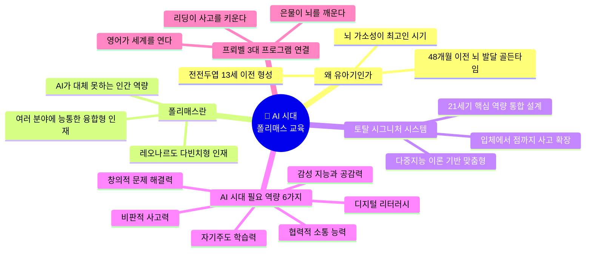

---

---

# 🔬 PART 1 — 왜 유아기(48개월 이전)에 시작해야 하는가?

## 뇌과학이 증명한 유아기 교육의 결정적 이유

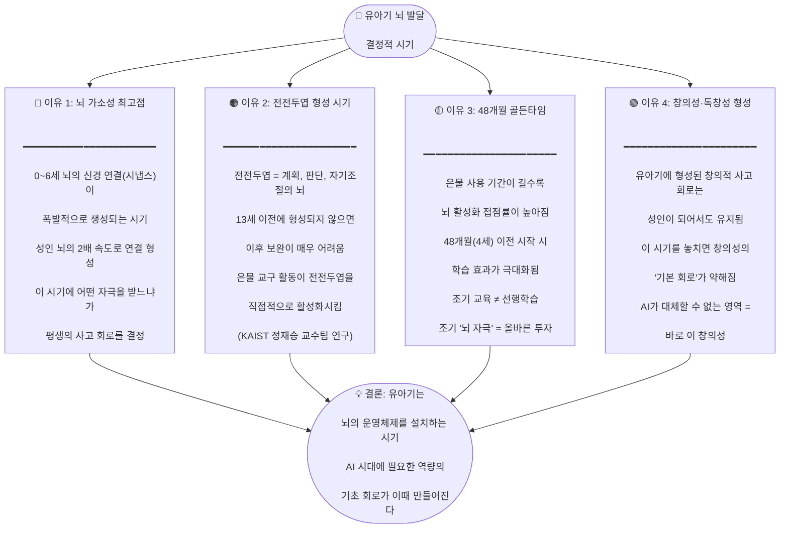

## 뇌 발달 타임라인과 교육 연결

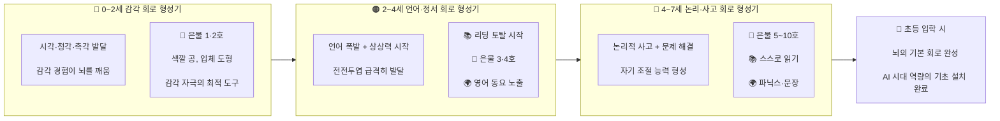

## 뇌과학 근거 핵심 요약표

| 뇌과학 연구 결과 | 의미 | 프뢰벨 교육과의 연결 |
|:---:|:---:|:---:|
| 0~6세 시냅스 폭발적 생성 | 자극이 많을수록 뇌 연결 풍부 | 은물 교구 = 손 감각 자극 → 뇌 회로 형성 |
| 전전두엽 13세 이전 형성 | 계획·판단·자기조절의 뇌가 이때 만들어짐 | 은물 구조 만들기 = 계획→실행→평가 훈련 |
| 48개월 이전 시작 효과 극대화 | 사용 기간 길수록 뇌 활성화 접점률 ↑ | 2세부터 은물 1호 시작 → 6년간 축적 |
| 억제 조절·인지적 유연성 발달 | AI 시대 핵심인 '유연한 사고'의 기초 | 은물 + 리딩 통합 수업 = 인지 유연성 훈련 |
| 다중지능(하워드 가드너) | 8가지 지능을 골고루 발달시켜야 | 토탈 시그니처 = 다중지능 맞춤형 교육 |

---

---

# 🌟 PART 2 — 폴리매스(Polymath)란 무엇인가?

## 폴리매스 개념 정의

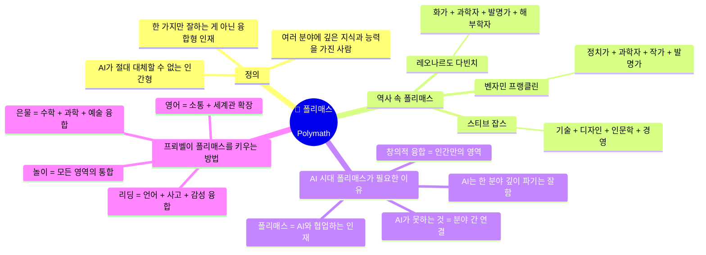

## AI가 잘하는 것 vs 인간(폴리매스)만 잘하는 것

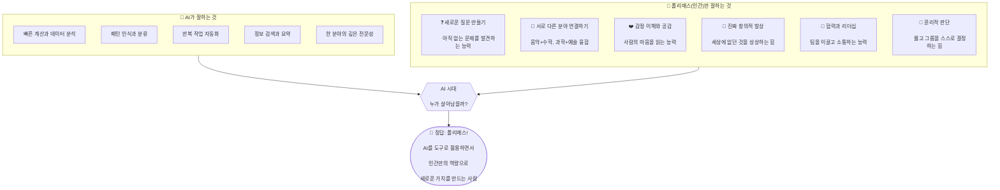

## 왜 유아기에 폴리매스 교육을 시작해야 하는가?

| 이유 | 설명 | 비유 |
|:---:|------|:---:|
| **뇌 회로가 만들어지는 시기** | 유아기는 뇌의 '운영체제(OS)'를 설치하는 시기. 이때 다양한 경험을 하면 풍부한 연결 회로가 생김 | 🖥️ 컴퓨터에 윈도우 설치하는 것 |
| **융합 사고의 씨앗** | 분야 간 경계가 없는 유아기에 다양한 경험을 하면 자연스럽게 연결 짓는 습관이 형성됨 | 🌱 씨앗은 어릴 때 심어야 |
| **호기심이 최고점인 시기** | "왜?" 질문이 폭발하는 3~5세에 다양한 답을 경험하면 평생의 탐구심이 형성됨 | 🔥 불꽃이 가장 클 때 나무를 넣어야 |
| **실패에 두려움이 없는 시기** | 유아는 틀리는 것을 두려워하지 않음. 이때 다양한 시도를 경험해야 도전 정신이 형성됨 | 🛡️ 두려움이 없을 때 용기가 만들어짐 |
| **AI 시대는 이미 시작** | 지금 2세인 아이가 취업할 때(2044년) AI는 모든 곳에 있을 것. 지금 준비하지 않으면 늦음 | ⏰ 미래는 준비하는 자의 것 |

---

---

# 🎯 PART 3 — AI 시대 핵심 교육 역량 6가지 정의

## AI 시대 필요 역량 전체 구조

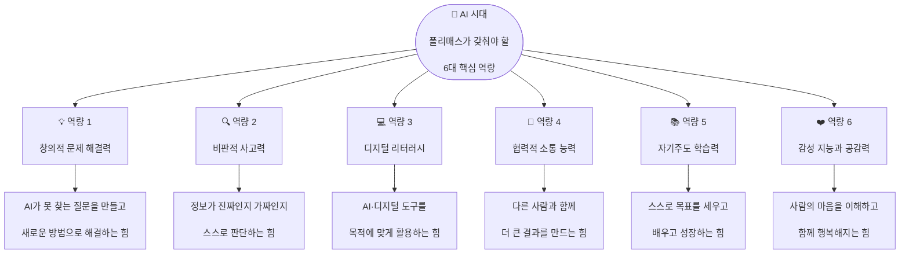

---

## 6대 역량 상세 정의 + 유아기 연결

### 💡 역량 1 — 창의적 문제 해결력

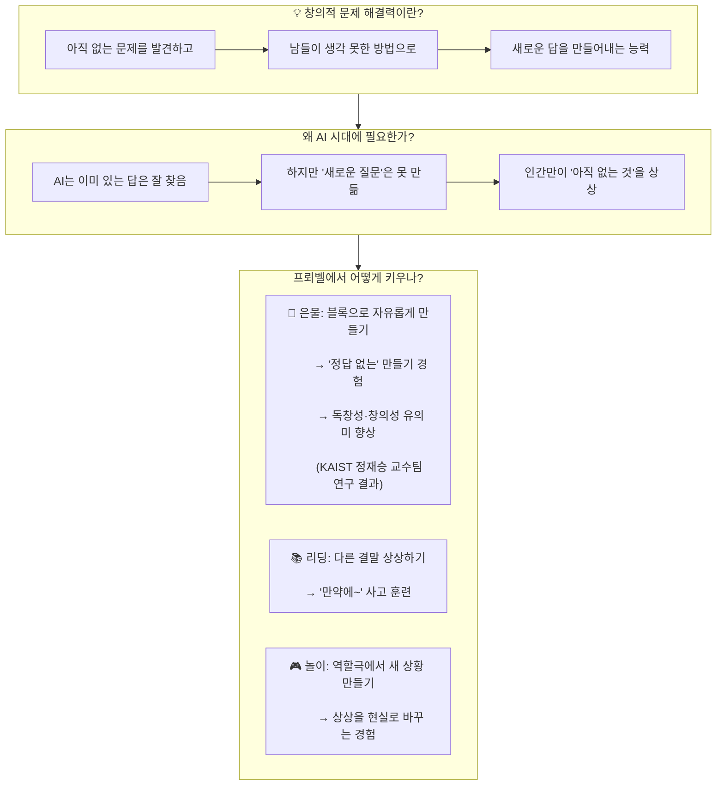

| 연령 | 유아기 활동 예시 | 키워지는 능력 |
|------|--------------|-----------|
| 2~3세 | 은물 1·2호 자유 탐색 — "이걸로 뭘 할 수 있을까?" | 탐색적 사고, 호기심 |
| 3~4세 | 은물 3·4호로 이야기 속 장면 만들기 | 상상력→구현력 연결 |
| 4~5세 | 은물 5·6·7호로 동물원 설계하기 | 계획→실행→수정 경험 |
| 5~6세 | 그림책 읽고 "다른 결말" 만들어보기 | 대안적 사고 |
| 6~7세 | 팀 프로젝트로 나만의 도시 설계 | 융합적 문제 해결 |

---

### 🔍 역량 2 — 비판적 사고력

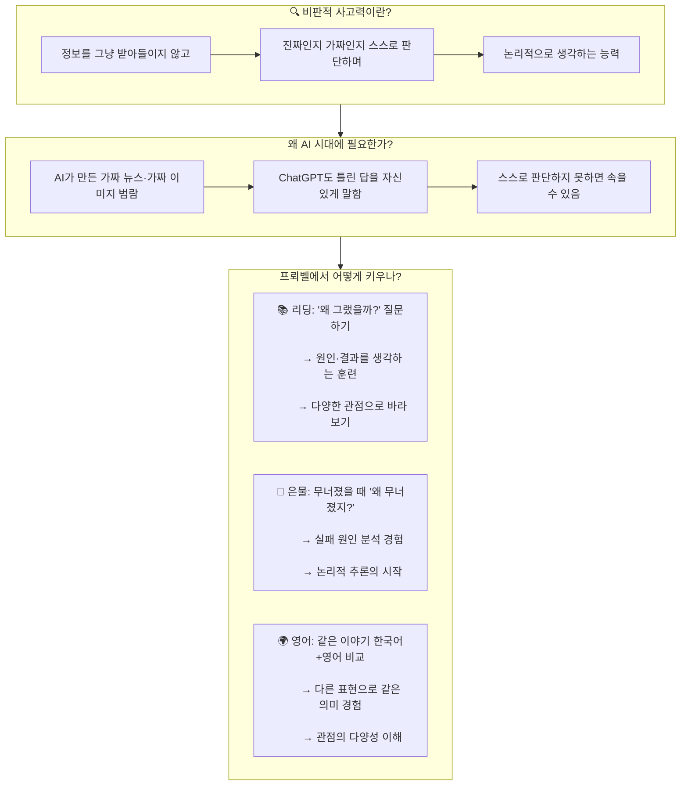

| 연령 | 유아기 활동 예시 | 키워지는 능력 |
|------|--------------|-----------|
| 3~4세 | "이 친구 기분이 어떨까?" 감정 추론 | 타인 관점 이해 |
| 4~5세 | "늑대가 정말 나쁠까?" 다른 시각 경험 | 다양한 관점 사고 |
| 5~6세 | "왜 블록이 무너졌을까?" 원인 분석 | 논리적 추론 |
| 6~7세 | 독서 토론 "나는 다르게 생각해" | 근거 기반 의견 표현 |

---

### 💻 역량 3 — 디지털 리터러시

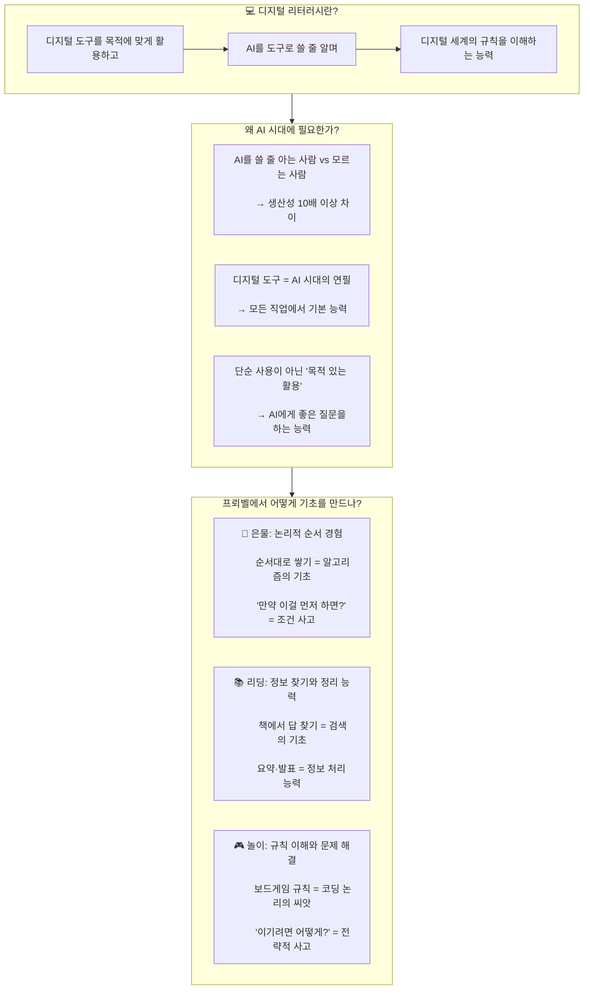

| 유아기 경험 | → AI 시대 연결되는 능력 |
|-----------|-------------------|
| 은물을 순서대로 쌓기 | → 알고리즘(순서) 이해의 기초 |
| "만약 이걸 빼면?" 실험 | → 조건문(if-then) 사고의 기초 |
| 블록 패턴 만들기 (ABAB) | → 반복(loop) 개념의 기초 |
| 분류·그룹 나누기 | → 데이터 분류의 기초 |
| 책에서 답 찾아 발표하기 | → 정보 검색·활용의 기초 |
| 보드게임 전략 세우기 | → 문제 해결 알고리즘의 기초 |

---

### 🤝 역량 4 — 협력적 소통 능력

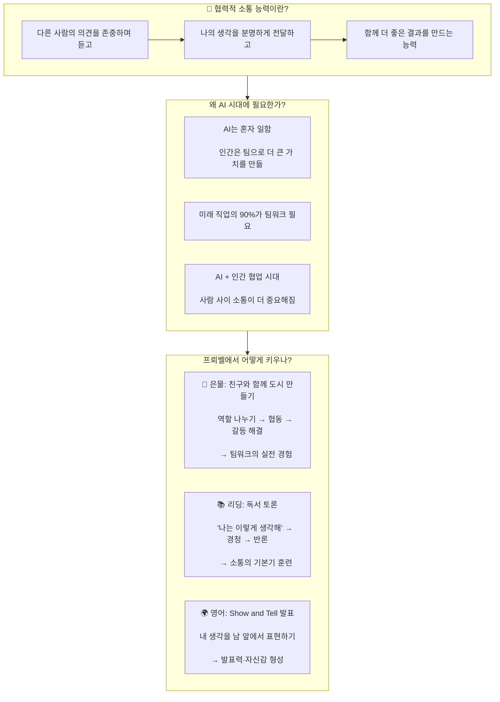

---

### 📚 역량 5 — 자기주도 학습력

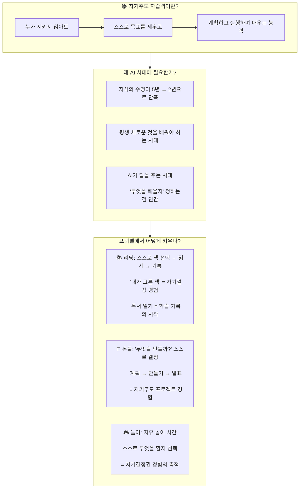

---

### ❤️ 역량 6 — 감성 지능과 공감력

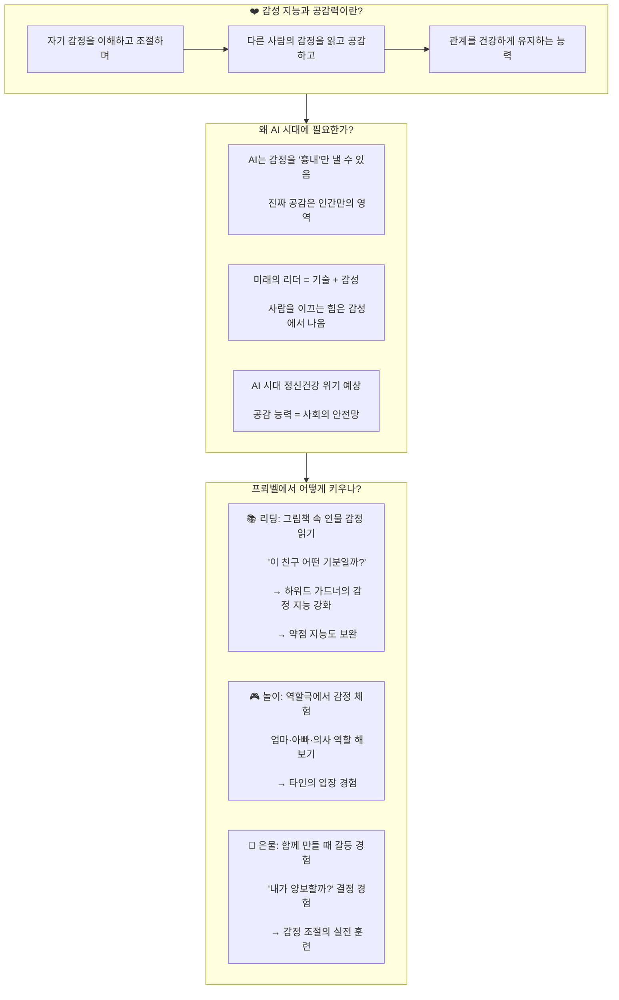

---

## 6대 역량 통합 비교표

| 역량 | 한 줄 정의 | AI가 못하는 이유 | 프뢰벨 연결 | 유아기 핵심 활동 | 뇌과학 근거 |
|:---:|---------|:---:|:---:|---------|:---:|
| **💡 창의적 문제 해결** | 없던 것을 상상하고 만드는 힘 | AI는 기존 데이터 조합만 가능 | 은물 자유 만들기 | 블록으로 자유 창작 | 전전두엽 활성화 |
| **🔍 비판적 사고** | 진짜와 가짜를 구별하는 힘 | AI는 판단 기준이 없음 | 리딩 토론 질문 | "왜?" "정말?" 질문 습관 | 인지 조절 능력 |
| **💻 디지털 리터러시** | AI를 도구로 활용하는 힘 | AI는 목적을 정하지 못함 | 은물 순서·패턴 | 규칙 놀이, 분류 활동 | 논리 회로 형성 |
| **🤝 협력적 소통** | 함께 더 큰 걸 만드는 힘 | AI는 혼자만 일함 | 협동 프로젝트 | 팀 만들기, 역할극 | 사회성 뇌 발달 |
| **📚 자기주도 학습** | 스스로 배우고 성장하는 힘 | AI는 목표를 세우지 못함 | 자기 선택 독서 | "내가 골라요!" 결정 | 동기 회로 형성 |
| **❤️ 감성·공감** | 마음을 읽고 함께하는 힘 | AI는 진짜 감정이 없음 | 감정 그림책 읽기 | 감정 카드, 역할극 | 거울 뉴런 발달 |

---

---

# 🔗 PART 4 — 토탈 시그니처 시스템과 6대 역량 연결

## 토탈 시그니처 시스템이란?

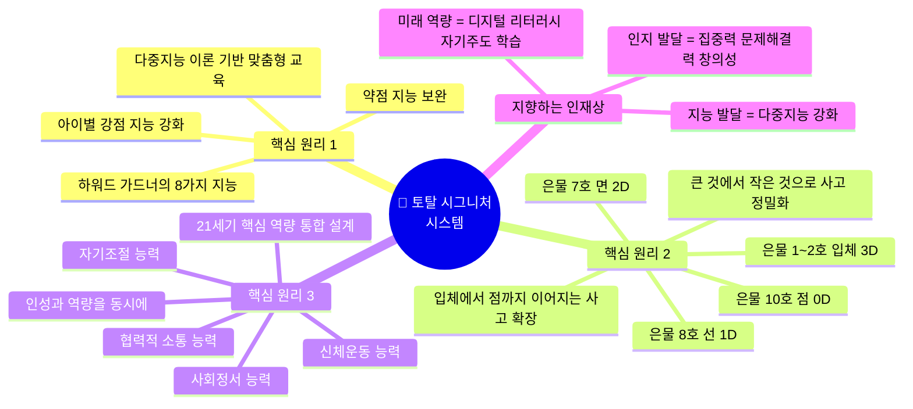

## 토탈 시그니처 3대 원리 → 6대 역량 연결 도식

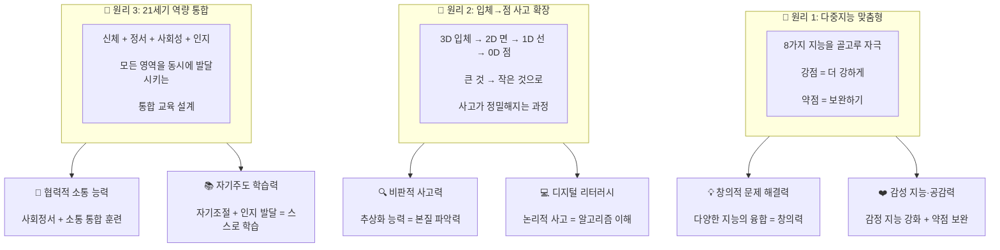

## 다중지능 8가지 × 프뢰벨 프로그램 연결표

| 하워드 가드너 8가지 지능 | 정의 | 프뢰벨 주요 활동 | 연결 역량 |
|:---:|------|:---:|:---:|
| **언어 지능** | 말하기·읽기·쓰기 능력 | 📚 리딩 토탈 (독서·발표·감상문) | 비판적 사고, 소통 |
| **논리수학 지능** | 수·논리·패턴 이해 능력 | 🧱 은물 (수 세기·패턴·연산) | 디지털 리터러시, 문제 해결 |
| **공간 지능** | 공간·방향·구조 파악 능력 | 🧱 은물 (3D 구조물 설계) | 창의적 문제 해결 |
| **신체운동 지능** | 몸으로 표현·조작하는 능력 | 🧱 은물 (교구 조작) + 🎮 놀이 | 자기주도 학습 |
| **음악 지능** | 리듬·멜로디 감각 | 🌍 영어 동요·챈트 | 감성 지능 |
| **대인관계 지능** | 타인 이해·협력 능력 | 🎮 협동 놀이 + 독서 토론 | 협력적 소통, 공감력 |
| **자기이해 지능** | 자기 감정·강점 인식 | 📚 감정 그림책 + 독서 일기 | 감성 지능, 자기주도 |
| **자연탐구 지능** | 자연·환경 관찰 능력 | 🎮 바깥 놀이 + 탐구 프로젝트 | 비판적 사고 |

## 입체→점 사고 확장과 AI 역량 연결

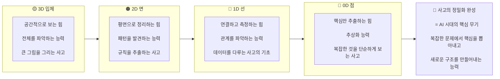

| 차원 | 은물 교구 | 키워지는 사고력 | AI 시대 연결 능력 |
|:---:|:---:|---------|:---:|
| **3D 입체** | 1~6호 | 공간 파악, 전체 조망 | 시스템적 사고 |
| **2D 면** | 7호 색판 | 패턴 발견, 규칙 추출 | 데이터 패턴 인식 |
| **1D 선** | 8호 막대 | 연결, 측정, 관계 | 관계형 사고 |
| **0D 점** | 9·10호 | 추상화, 핵심 추출 | 알고리즘적 사고 |

---

---

# 📊 PART 5 — 미래 인재 발달 영역 통합 요약

## 프뢰벨 토탈 시그니처가 지향하는 3대 발달 영역

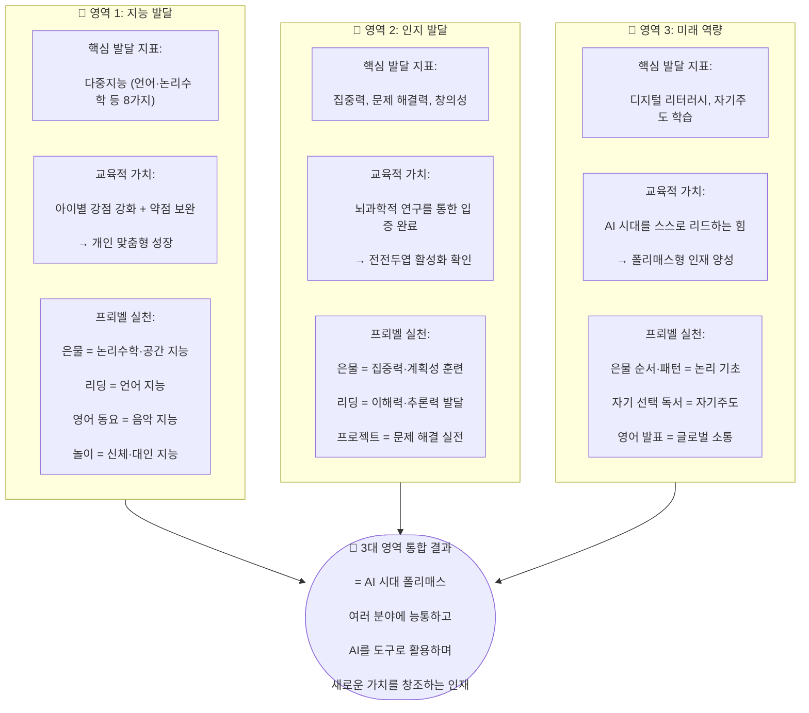

## 3대 영역 × 6대 역량 × 프뢰벨 프로그램 통합 매트릭스

| 발달 영역 | 6대 역량 | 프뢰벨 프로그램 | 핵심 활동 | 기대 성과 |
|:---:|:---:|:---:|---------|:---:|
| **지능 발달** | 💡 창의적 문제 해결 | 🧱 은물 자유 만들기 | 정답 없는 만들기, 프로젝트 설계 | 독창성·창의성 |
| **지능 발달** | ❤️ 감성·공감 | 📚 감정 그림책 읽기 | 인물 감정 읽기, 역할극 | 감정 지능 강화 |
| **인지 발달** | 🔍 비판적 사고 | 📚 리딩 토론·질문 | "왜?" "정말?" "다르게 생각하면?" | 논리적 판단력 |
| **인지 발달** | 💻 디지털 리터러시 | 🧱 은물 패턴·순서 | 패턴 만들기, 분류, 규칙 놀이 | 알고리즘 이해 기초 |
| **미래 역량** | 🤝 협력적 소통 | 🎮 협동 프로젝트 | 팀 만들기, 독서 토론, 발표 | 팀워크·소통력 |
| **미래 역량** | 📚 자기주도 학습 | 📚 자기선택 독서 + 🎮 자유놀이 | 스스로 고르기, 계획, 기록 | 자기결정·성장 |

---

---

# 🎓 PART 6 — 연령별 폴리매스 성장 로드맵

```mermaid
flowchart TD
    START([👶 유아 교육 시작]) --> Y2

    subgraph Y2["🟡 2~3세: 뇌 운영체제 설치"]
        Y2A["감각 회로 열기<br>
        은물 1·2호 감각 탐색<br>
        그림책 들려주기<br>
        영어 동요 듣기"]
        Y2B["이때 형성되는 역량:<br>
        ❤️ 감성 기초 (안정 애착)<br>
        💡 호기심 (감각 탐색)"]
    end

    subgraph Y3["🟠 3~4세: 언어·상상 회로 확장"]
        Y3A["언어 폭발 + 상상력<br>
        은물 3·4·5호 쌓기·만들기<br>
        그림책 역할극<br>
        영어 따라 말하기"]
        Y3B["이때 형성되는 역량:<br>
        💡 창의력 (상상 놀이)<br>
        ❤️ 공감력 (감정 읽기)<br>
        🤝 소통 시작 (친구 관심)"]
    end

    subgraph Y4["🔴 4~5세: 논리·규칙 회로 형성"]
        Y4A["왜? 어떻게? 질문 폭발<br>
        은물 5·6·7·8호 설계·패턴<br>
        리딩 예측·토론<br>
        파닉스 시작"]
        Y4B["이때 형성되는 역량:<br>
        🔍 비판적 사고 (왜? 질문)<br>
        💻 논리 기초 (패턴·순서)<br>
        🤝 협동 (함께 만들기)"]
    end

    subgraph Y5["🟣 5~6세: 학습 준비 회로 완성"]
        Y5A["글자 인식 + 수학 기초<br>
        은물 8·9·10호 수·도형<br>
        스스로 읽기 도전<br>
        파닉스 완성·단어 읽기"]
        Y5B["이때 형성되는 역량:<br>
        📚 자기주도 (스스로 읽기)<br>
        💻 디지털 기초 (논리 완성)<br>
        🔍 분석력 (요약·발표)"]
    end

    subgraph Y6["🔵 6~7세: 폴리매스 기초 완성"]
        Y6A["자기주도 학습 시작<br>
        수학 프로젝트<br>
        독서 토론·감상문<br>
        영어 발표·일기"]
        Y6B["이때 완성되는 역량:<br>
        💡🔍💻🤝📚❤️<br>
        6대 역량 기초 전부 형성!"]
    end

    Y2 --> Y3 --> Y4 --> Y5 --> Y6

    Y6 --> GOAL(["🌟 초등 입학 시<br>
    AI 시대 폴리매스의 기초 완성<br>
    ✅ 창의적으로 문제를 해결하고<br>
    ✅ 진짜와 가짜를 구별하며<br>
    ✅ 디지털 도구를 이해하고<br>
    ✅ 친구와 협력하며<br>
    ✅ 스스로 배우고<br>
    ✅ 사람의 마음을 이해하는 아이"])
```

---

## 핵심 한 줄 정리

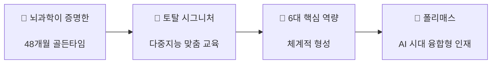

> **AI 시대, 아이에게 필요한 것은 '더 많은 지식'이 아니라 '더 다양한 경험'입니다.**
> 프뢰벨 토탈 시그니처는 은물·리딩·영어·놀이를 통해
> 유아기 뇌에 AI가 대체할 수 없는 6가지 역량의 회로를 심어줍니다.
> 이것이 200년 프뢰벨 교육 철학과 현대 뇌과학이 만나
> AI 시대 '폴리매스'를 키우는 방법입니다.

---

> 📝 **작성 기준** : 프뢰벨 토탈 시그니처 시스템 + 뇌과학 연구 (KAIST 정재승 교수팀) + 하워드 가드너 다중지능 이론
> 🗓️ **작성일** : 2026년 4월 6일
> 👨‍🏫 **활용 대상** : 유아 교육 교사, AI 교육 컨텐츠 개발자, 부모 설명 자료
