# [핵심실전] 바이브 코딩으로 배우는 개발 프로세스와 4대 역량

> **"AI 시대, 진짜 경쟁력은 문제를 정의하고 알고리즘으로 해결하는 능력이다"**

---

## 📑 목차

1. [바이브 코딩이란?](#1-바이브-코딩이란)
   - [역공부: 결과에서 배우는 전략 ⭐](#14-역공부-결과에서-배우는-전략-)
   - [AI와의 올바른 협업 전략 ⭐](#15-ai와의-올바른-협업-전략-)
2. [독서: 문제 발견의 출발점](#2-독서-문제-발견의-출발점)
3. [바이브 코딩 개발 프로세스 (8단계)](#3-바이브-코딩-개발-프로세스-8단계)
4. [4대 역량 정의](#4-4대-역량-정의)
5. [알고리즘 중심 사고방식](#5-알고리즘-중심-사고방식)
6. [실전 사례 1: 가상 주식 대결 - 파도 타기 전략](#6-실전-사례-1-가상-주식-대결-파도-타기-전략)
7. [실전 사례 2: AI Agent로 문제 해결하기](#7-실전-사례-2-ai-agent로-문제-해결하기)
8. [실천 가이드: 프로젝트 기반 학습](#8-실천-가이드-프로젝트-기반-학습)

---

## 1. 바이브 코딩이란?

### 1.1 정의

**바이브 코딩 (Vibe Coding)**은 AI 도구를 활용하여 **"생각 → 프로토타입 → 테스트 → 개선"** 사이클을 극도로 빠르게 반복하는 개발 방식입니다.

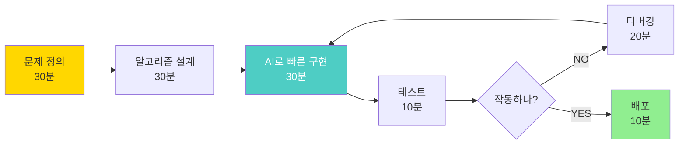

### 1.2 전통 코딩 vs 바이브 코딩

| 구분 | 전통 코딩 | 바이브 코딩 |
|------|----------|------------|
| **목표** | 완벽한 코드 작성 | 빠른 문제 해결 |
| **도구** | 직접 코딩 | AI + 자동화 도구 |
| **시간** | 며칠 ~ 몇 주 | 몇 시간 ~ 하루 |
| **초점** | 문법, 최적화 | 문제 정의, 알고리즘 |
| **역량** | 코딩 능력 | 기획 + 알고리즘 설계 |
| **결과** | 완성도 높은 코드 | 빠른 MVP + 반복 개선 |

### 1.3 바이브 코딩의 3대 원칙

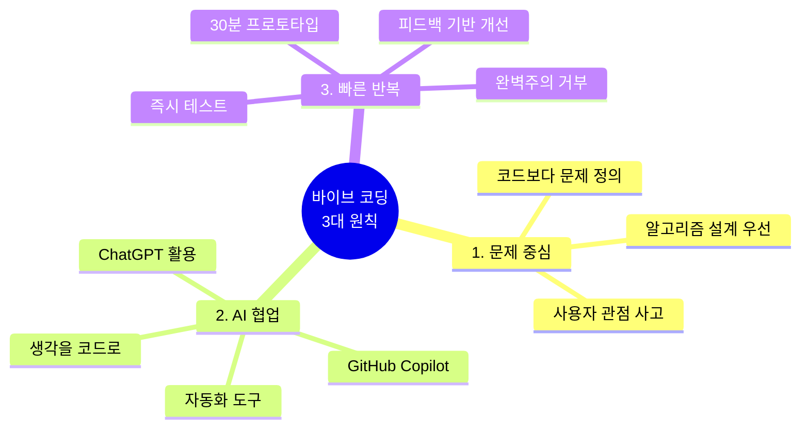

### 1.4 역공부: 결과에서 배우는 전략 ⭐⭐⭐

> **핵심 전환**: 처음부터 배우지 마세요. **결과물을 먼저 만들고, 과정을 질문하세요.**

**전통적 학습 vs 역공부**:

| 구분 | 전통적 학습 | 역공부 (Reverse Learning) |
|------|-----------|------------------------|
| **순서** | 이론 → 실습 → 프로젝트 | 프로젝트 → 분석 → 이론 |
| **시작** | 변수, 함수 공부 | 완성된 서비스 만들기 |
| **동기** | "나중에 쓸 거야" | "지금 작동한다!" ⚡ |
| **이해** | 개념 먼저 | 필요할 때 배우기 |
| **시간** | 몇 달 후 첫 프로젝트 | 첫날부터 결과물 |

**역공부 4단계**:

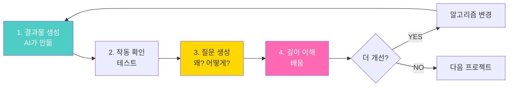

**실전 예시: 주식 추세 감지**

**❌ 전통적 방식**:
```
1주차: Python 기초 문법
2주차: 리스트, 반복문
3주차: 함수, 모듈
4주차: pandas 라이브러리
5주차: 데이터 분석 이론
6주차: 이동평균 개념
7주차: matplotlib 그래프
8주차: 드디어 프로젝트 시작
→ 8주 후 첫 결과물
```

**✅ 역공부 방식**:
```
1일차:
  [1단계: 결과물 생성]
  - ChatGPT에게: "주식 추세 감지 프로그램 만들어줘"
  - 30분 만에 완성 코드 받음
  - 실행 → 그래프 나옴 ✅
  
  [2단계: 작동 확인]
  - Apple 주식 넣어봄 → 잘 됨
  - 다른 종목도 테스트 → 작동함
  
  [3단계: 질문 생성]
  Q1. 이동평균이 뭐지?
  Q2. rolling() 함수는 어떻게 작동하나?
  Q3. 왜 5일과 20일을 선택했을까?
  Q4. 더 정확하게 하려면?
  
  [4단계: 필요한 것만 배우기]
  - ChatGPT에게 질문
  - 이동평균 개념 이해 (10분)
  - 파라미터 변경 실험 (20분)
  - 더 나은 알고리즘 찾기 (30분)

→ 1일 만에 작동 + 이해 + 개선까지 완료!
```

**역공부의 핵심 질문들**:

```
[결과물을 보며 묻기]
1. 왜 이렇게 만들었을까?
2. 이 부분은 무슨 역할일까?
3. 이게 없으면 어떻게 될까?
4. 다르게 할 수는 없을까?
5. 더 나은 방법은 뭘까?

[AI에게 역공부 질문하기]
"이 코드를 보면서 배우고 싶습니다.
1. 전체 흐름을 설명해주세요
2. 각 부분이 왜 필요한지 알려주세요
3. 핵심 알고리즘은 무엇인가요?
4. 이것보다 더 나은 방법이 있나요?
5. 실전에서는 어떤 점을 더 고려해야 하나요?"
```

**성공 사례**:

> "저는 Python을 전혀 몰랐지만,  
> 첫날 ChatGPT로 주식 봇을 만들었습니다.  
> 그리고 '이게 어떻게 작동하지?'라고 물으며  
> 3일 만에 Python 핵심을 이해했습니다.  
> 전통적으로 배웠다면 3개월 걸렸을 겁니다."  
> - 고등학생 개발자

---

### 1.5 AI와의 올바른 협업 전략 ⭐⭐⭐

> **핵심 깨달음**: AI는 이미 **주니어 개발자 3년차 수준**입니다.  
> 너무 구체적으로 지시하면 오히려 AI의 경험을 제한합니다.  
> **문제와 상황을 공유하고, AI에게 최선의 방법을 물어보세요.**

#### ❌ 잘못된 협업 방식 (마이크로매니징)

```
나쁜 예시 1:
"Python으로 만들어주세요."
"HTML 파일 1개로 만들어주세요."
"Flask 사용하지 말고 간단하게 해주세요."

→ 결과: 유지보수 어렵고, 확장 불가능한 코드
→ 문제: 학생이 AI보다 경험이 적은데 방법을 지시함
```

```
나쁜 예시 2:
"웹사이트 만들어줘"

→ 결과: 너무 일반적이라 원하는 것과 다름
→ 문제: 문제와 목표가 불명확
```

#### ✅ 올바른 협업 방식 (파트너 관점)

**3단계 프롬프트 전략**:

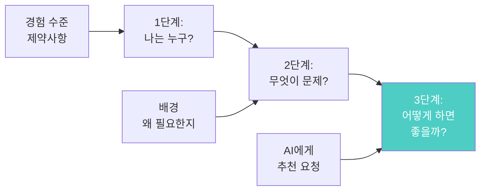

**좋은 프롬프트 템플릿**:

```
[1단계: 나는 누구인가]
저는 고등학생이고, 코딩 경험은 ChatGPT 활용 2주차입니다.

[2단계: 무엇이 문제인가]
매일 플라스틱 사용량을 추적하고 싶습니다.
물병, 빨대, 봉지 개수를 입력하면 
1년 사용량과 환경 영향(나무 몇 그루)을 보여주는 도구가 필요합니다.
친구 5명과 함께 사용하고, SNS에 공유하고 싶습니다.

[3단계: 어떻게 하면 좋을까?]
이런 도구를 만들려면 어떤 방식이 가장 좋을까요?
- 웹으로 만드는 게 좋을까요, 아니면 다른 방법이 있을까요?
- 어떤 기술 스택을 추천하시나요?
- 데이터 저장은 어떻게 하면 좋을까요?
- 친구들과 공유하려면 어떻게 배포하면 좋을까요?

[제약사항]
- 예산: [있다면 명시 / 없다면 무료 선호]
- 개발 시간: 3시간 내
- 품질 우선 (무료 고집 안함)
```

#### 왜 이 방식이 더 좋은가?

| 구분 | 마이크로매니징 | 파트너 협업 |
|------|--------------|----------|
| **기술 선택** | 학생이 지정 (HTML 1개 파일) | AI가 추천 (React + Firebase) |
| **확장성** | 제한적 (단일 파일) | 확장 가능 (컴포넌트 구조) |
| **유지보수** | 어려움 (모든 코드 한곳에) | 쉬움 (모듈화) |
| **배포** | 제한적 (로컬만) | 다양 (Vercel, Netlify) |
| **학습** | AI 답변만 복사 | 왜 그런지 이해 |
| **품질** | 초보자 수준 | 주니어 3년차 수준 |

#### 실전 비교 예시

**상황**: 플라스틱 사용량 계산기 만들기

**❌ 마이크로매니징 방식**:
```
"HTML 파일 1개로 플라스틱 계산기 만들어줘.
JavaScript는 <script> 태그 안에 넣어줘.
CSS도 <style> 태그로 넣고.
변수명은 한글로 해줘."
```

**결과**:
- 단일 HTML 파일 (500줄)
- 수정하기 어려움
- 데이터 저장 안 됨
- 친구들과 공유 불가
- 모바일에서 레이아웃 깨짐

**✅ 파트너 협업 방식**:
```
"저는 고등학생이고, 친구 5명과 플라스틱 사용량을 추적하고 싶습니다.
매일 사용량을 입력하면 통계를 보여주고, 
친구들과 비교도 할 수 있으면 좋겠습니다.

어떤 방식으로 만드는 게 가장 좋을까요?
무료이고, 친구들이 각자 계정을 만들 수 있고,
모바일에서도 잘 보이는 방법을 추천해주세요."
```

**AI 추천 결과**:
- **기술**: React + Firebase (무료)
- **이유**: 
  - React: 컴포넌트 재사용 가능
  - Firebase: 무료 DB + 인증 + 호스팅
  - PWA: 모바일 앱처럼 사용 가능
- **구조**: 
  - 로그인 시스템
  - 개인 대시보드
  - 친구 랭킹
  - SNS 공유 기능
- **배포**: Firebase Hosting (무료, 자동 HTTPS)

**결과**:
- ✅ 확장 가능한 구조
- ✅ 친구들 각자 사용 가능
- ✅ 데이터 저장 및 통계
- ✅ 모바일 최적화
- ✅ 유지보수 쉬움

#### 핵심 원칙 3가지

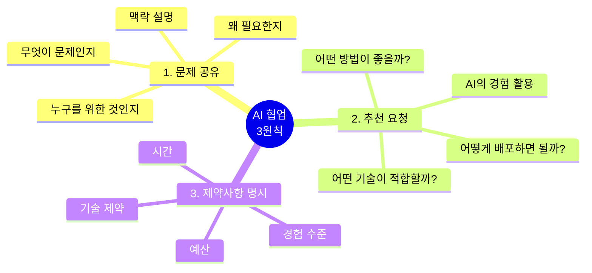

#### 학년별 전략적 프롬프트 (중요! ⭐⭐⭐)

> **전략의 변화**: 초중학생은 **학습자**, 고등학생부터는 **서비스 제공자**

**🎒 초등학생 (학습자 관점)**:
```
[나의 수준 명시]
저는 초등학교 5학년이고, 코딩은 처음입니다.

[문제 설명]
우리 반 친구들이 숙제를 자주 까먹어서 
숙제 알림 시스템을 만들고 싶습니다.

[질문]
초등학생이 만들 수 있는 방법이 있을까요?
어떻게 시작하면 좋을까요?
단계별로 쉽게 알려주세요.

[제약사항]
- 초등학생도 이해할 수 있는 방법
- 부모님께 허락받을 수 있는 무료 도구
```

**📚 중학생 (학습자 → 실전 전환기)**:
```
[나의 수준]
저는 중학생이고, ChatGPT로 프로젝트 2개 만들어봤습니다.

[문제 설명]
학교 동아리에서 사용할 출석 관리 시스템이 필요합니다.
20명 멤버의 출석을 기록하고 통계를 보여주고 싶습니다.

[알고리즘 아이디어]
[의사코드 또는 플로우차트]

[질문]
1. 이 알고리즘이 적절한가요?
2. 더 효율적인 방법이 있을까요?
3. 데이터 저장은 어떻게 하면 좋을까요?
4. 동아리 선생님께 보여드려도 괜찮을 수준인가요?

[제약사항]
- 학교에서 사용 가능
- 부모님/선생님께 설명 가능한 수준
```

**🎓 고등학생 (실전 서비스 관점) ⭐⭐⭐**:
```
[프로젝트 개요]
고등학생 대상 시험 대비 학습 플랫폼을 개발하고 있습니다.
오답노트 + AI 분석 + 취약점 진단 기능이 필요합니다.

[현재 상황]
- 목표: 우리 학교 300명 학생 사용
- 배포 계획: 2주 내 베타 출시
- 예산: 월 10만원 (유료 서비스 고려 가능)

[핵심 알고리즘]
[의사코드 또는 시스템 설계도]

[구체적 질문]
1. 300명이 동시 사용해도 문제없는 아키텍처는?
2. 유료 도구를 쓰더라도 안정적인 게 낫다면 추천해주세요.
3. 데이터베이스 설계는 어떻게 해야 확장 가능한가요?
4. 배포 후 모니터링과 에러 추적은 어떻게 하나요?
5. 주니어 개발자가 봐도 괜찮을 코드 품질이 되려면?

[요구사항]
- 실제 사용자가 사용할 서비스 수준
- 배포 후 유지보수 가능한 구조
- 포트폴리오에 넣어도 부끄럽지 않을 퀄리티
- 비용 대비 최적의 선택 (무료 고집 안함)
```

**💡 왜 고등학생부터 다를까?**

| 구분 | 초·중학생 | 고등학생 |
|------|----------|---------|
| **목표** | 학습 | 실전 배포 |
| **관점** | "배우고 싶어요" | "서비스하고 싶어요" |
| **품질** | 작동하면 OK | 주니어 3년차 수준 |
| **비용** | 무료 선호 | 최선의 선택 (유료 OK) |
| **수준 명시** | 필수 ✅ | 선택 (문제에 집중) |
| **평가 기준** | 학습 과정 | 서비스 결과 |

---

### 고등학생 실전 전략: "주니어 3년차 수준 배포" ⭐⭐⭐

> **핵심**: 고등학생부터는 "학습용 프로젝트"가 아니라 **"실제 사용되는 서비스"**를 만들어야 합니다.

#### 왜 주니어 3년차 수준인가?

**주니어 3년차 = 실전 배포 가능한 최소 기준**

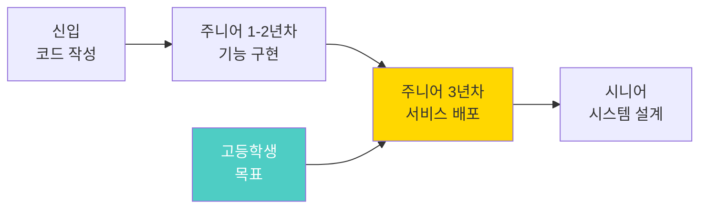

**주니어 3년차가 할 수 있는 것**:
- ✅ 실사용자가 쓰는 서비스 배포
- ✅ 에러 모니터링 및 대응
- ✅ 데이터베이스 설계
- ✅ API 설계 및 문서화
- ✅ 테스트 코드 작성
- ✅ 성능 최적화
- ✅ 보안 기본 조치

#### 실전 배포 체크리스트

**🔴 학습용 프로젝트 (초중학생)**:
```
□ 로컬에서 작동
□ 나만 사용
□ 에러 나도 괜찮음
□ 코드만 있으면 OK
□ 배운 것이 중요
```

**🟢 실전 서비스 (고등학생)**:
```
□ 인터넷에서 접근 가능
□ 실제 사용자 10명 이상
□ 에러 발생 시 알림 받음
□ 사용자 피드백 수집
□ 데이터 안전하게 저장
□ 모바일에서도 작동
□ 로딩 속도 3초 이내
□ 문서화 (README, API 문서)
□ 유지보수 가능한 코드 구조
□ 포트폴리오로 제시 가능
```

#### 실전 프로젝트 예시 비교

**❌ 학습용 (초중학생)**:
```
프로젝트: 할 일 관리 앱
- 로컬 HTML 파일
- 새로고침하면 데이터 사라짐
- 나만 사용
- 포트폴리오: "할 일 앱 만들어봤어요"
→ 면접관: "그래서 누가 썼나요?"
```

**✅ 실전 서비스 (고등학생)**:
```
프로젝트: 우리 학교 학생 300명이 쓰는 시험 대비 플랫폼
- vercel.com/myschool-study 배포
- Firebase 데이터베이스 연동
- 실사용자 300명 (증명 가능)
- 주간 활성 사용자 150명
- 누적 문제 풀이 5,000건
- 에러 모니터링: Sentry
- 사용자 피드백: 평균 4.5/5
- 포트폴리오: "300명이 실제 사용하는 서비스 운영 중"
→ 면접관: "오, 실제 사용자가 있네요. 어떤 피드백을 받았나요?"
```

#### 서비스 관점에서의 알고리즘

> **학습 관점**: "알고리즘을 배우자"  
> **서비스 관점**: "사용자 문제를 가장 효율적으로 해결하는 알고리즘은?"

**실전 사고 과정**:

```
문제: 학교 급식 메뉴 추천

❌ 학습 관점:
- 추천 알고리즘 공부
- 머신러닝 모델 학습
- 복잡한 알고리즘 구현
→ 3개월 후 완성, 아무도 안 씀

✅ 서비스 관점:
- 진짜 문제: "오늘 뭐 먹지?"를 10초 내 해결
- 핵심 알고리즘: 
  1. 과거 선택 패턴 분석 (간단한 통계)
  2. 친구들 인기 메뉴 (집계)
  3. 날씨 고려 (API)
  4. 랜덤 추천 + 이유 설명
→ 1주일 만에 배포, 100명 사용 중

배움:
- 복잡한 알고리즘 < 문제 해결
- 사용자는 "정확도 95%"보다 "빠른 답"을 원함
- 간단한 알고리즘 + 좋은 UX = 성공
```

#### 실전 투자 가이드 (고등학생)

**시간 vs 돈 trade-off**:

```
시나리오 A (무료 고집):
- 무료 도구 찾는데: 5시간
- 제약 때문에 우회: 10시간
- 디버깅 시간 2배: 8시간
- 총: 23시간 낭비
- 결과: 품질 낮음

시나리오 B (유료 도구):
- ChatGPT Plus: $20/월
- Vercel Pro: $20/월
- 총: $40/월 (4만원)
- 절약 시간: 20시간
- 결과: 주니어 3년차 수준
- 시간당 가치: 2,000원
→ 고등학생 시간은 그보다 귀함!
```

**투자 우선순위**:
1. **ChatGPT Plus** ($20): 가장 중요 ⭐⭐⭐
2. **GitHub Copilot** ($10, 학생 무료): 필수
3. **Vercel/Netlify Pro** ($20): 실전 배포 시
4. **Firebase Blaze** (사용량 기반): 사용자 많을 때

#### 포트폴리오 임팩트

**학습용 vs 실전 서비스**:

| 항목 | 학습용 | 실전 서비스 |
|------|--------|-----------|
| **설명** | "만들어봤어요" | "운영하고 있어요" |
| **증거** | GitHub 링크 | 실제 URL + 사용자 수 |
| **임팩트** | 없음 | 통계, 피드백 |
| **신뢰도** | 낮음 | 높음 ⭐⭐⭐ |
| **질문** | "그래서?" | "어떻게 성장시켰나요?" |

**실전 예시**:
```
학습용: "할 일 앱을 만들었습니다"
실전: "우리 학교 300명이 사용하는 시험 대비 플랫폼을 
      만들고 6개월간 운영했습니다. 
      주간 활성 사용자 150명, 
      사용자 만족도 4.5/5,
      시험 기간에는 동시접속자 80명까지 대응했습니다."

→ 이게 진짜 포트폴리오입니다.
```

#### 마지막 조언

> **"AI는 당신보다 경험이 많습니다."**  
> **세세하게 지시하지 말고,**  
> **문제를 공유하고 함께 최선의 방법을 찾으세요.**

```
❌ "이렇게 만들어줘"
✅ "이런 문제가 있는데, 어떻게 하면 좋을까?"
```

---

## 2. 독서: 문제 발견의 출발점

### 2.1 왜 독서인가?

**AI는 주어진 문제는 해결하지만, 문제를 발견하지는 못합니다.**  
독서는 **진짜 문제를 발견**하고 **맥락을 이해**하는 능력을 키웁니다.

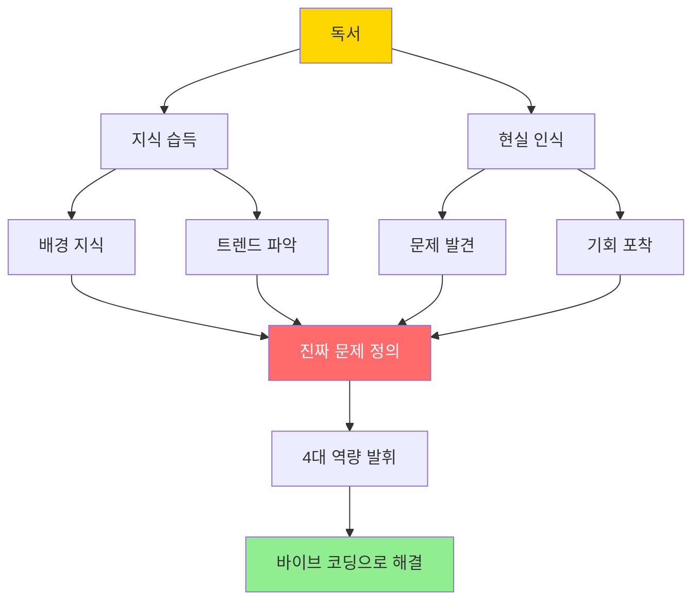

### 2.2 독서가 키우는 능력

| 능력 | 설명 | AI와의 차이 | 바이브 코딩 연결 |
|------|------|------------|-----------------|
| **문제 정의력** | 진짜 문제가 무엇인지 찾기 | AI는 주어진 문제만 해결 | 개발 1단계: 문제 발견 |
| **맥락 이해력** | 상황과 배경을 파악 | AI는 맥락 파악 약함 | 알고리즘 설계 시 필수 |
| **비판적 사고** | 정보를 검증하고 판단 | AI는 판단 불가 | 디버깅 역량 |
| **창의적 발상** | 새로운 해결책 상상 | AI는 기존 패턴 조합만 | 혁신적 알고리즘 설계 |
| **알고리즘 사고** | 단계적 문제 해결 절차 | AI는 구현만 담당 | 전체 프로세스 설계 |

### 2.3 독서 → 문제 발견 → 바이브 코딩 흐름

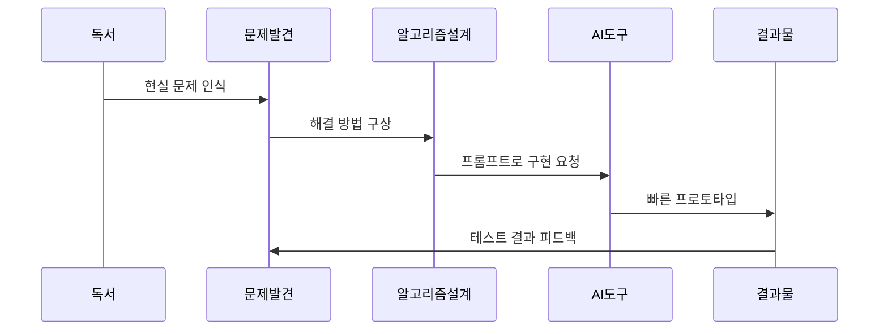

---

## 3. 바이브 코딩 개발 프로세스 (8단계)

### 3.1 전체 프로세스 개요

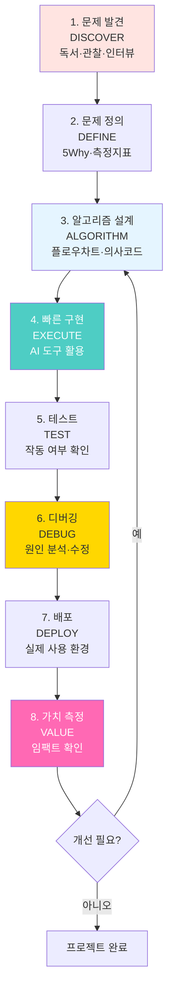

### 3.2 단계별 상세 가이드

---

#### 🔍 1단계: 문제 발견 (DISCOVER) - 30분

**목표**: 해결할 가치가 있는 진짜 문제 찾기

**방법**:
- 📚 독서를 통한 지식 확보
- 👁️ 일상 관찰 (불편한 점, 비효율 발견)
- 🗣️ 사용자 인터뷰 (3-5명)
- 📊 데이터 수집 (문제의 규모 파악)

**체크리스트**:
```
□ 문제가 실제로 존재하는가?
□ 누가 이 문제로 고통받는가?
□ 얼마나 심각한 문제인가?
□ 해결할 가치가 있는가?
□ 측정 가능한가?
```

**산출물**: 문제 발견 노트 (1페이지)

**역량**: 🧠 **기획자**

---

#### 📝 2단계: 문제 정의 (DEFINE) - 30분

**목표**: 모호한 문제를 명확하고 측정 가능하게 정의하기

**5Why 기법 예시**:

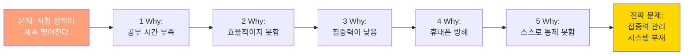

**문제 정의 템플릿**:
```
문제: [명확한 문제 설명]
대상: [누구의 문제인가]
현황: [현재 상황, 데이터]
목표: [원하는 결과, 측정 지표]
제약: [시간, 자원, 기술적 제약]
```

**산출물**: 문제 정의서 (1페이지)

**역량**: 🧠 **기획자** + 🔧 **디버거**

---

#### 🎯 3단계: 알고리즘 설계 (ALGORITHM) - 30분

**목표**: 문제를 해결하는 **단계적 절차** 설계하기

> **핵심**: 코드를 작성하기 전에, **어떻게 해결할 것인지** 알고리즘으로 설계합니다.

**알고리즘 설계 3단계**:

1. **입력 → 출력 정의**
   ```
   입력: 무엇을 받을 것인가?
   처리: 어떤 단계로 처리할 것인가?
   출력: 무엇을 결과로 낼 것인가?
   ```

2. **플로우차트 작성**
   ```mermaid
   graph TD
       START([시작]) --> INPUT[입력 받기]
       INPUT --> PROCESS{조건 확인}
       PROCESS -->|YES| ACTION1[동작 A]
       PROCESS -->|NO| ACTION2[동작 B]
       ACTION1 --> OUTPUT[결과 출력]
       ACTION2 --> OUTPUT
       OUTPUT --> END([종료])
   ```

3. **의사코드 (Pseudocode) 작성**
   ```
   함수 문제해결(입력):
       1. 입력 데이터를 받는다
       2. 조건을 확인한다
       3. 만약 조건이 참이면:
           - 동작 A를 수행한다
       4. 그렇지 않으면:
           - 동작 B를 수행한다
       5. 결과를 반환한다
   ```

**산출물**:
- 플로우차트 (손그림 또는 Mermaid)
- 의사코드 (한글+영어 혼용)
- 핵심 로직 설명 (3-5문장)

**역량**: 🧠 **기획자**

**💡 바이브 코딩 팁**:
- 코드를 작성하기 전에 반드시 알고리즘부터!
- 의사코드를 ChatGPT에게 주면 바로 코드로 변환 가능
- 플로우차트가 명확하면 AI가 더 정확하게 구현

---

#### ⚙️ 4단계: 빠른 구현 (EXECUTE) - 30분

**목표**: AI 도구를 활용하여 프로토타입 빠르게 만들기

**바이브 코딩 실행 프로세스**:

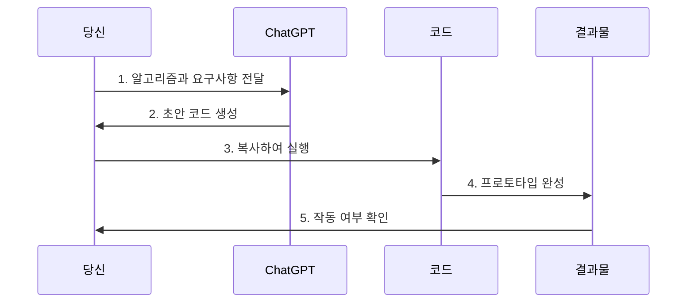

**AI와의 협업 전략** (중요! ⭐)

> **핵심**: AI는 주니어 개발자 3년차 수준입니다.  
> 너무 구체적으로 지시하면 오히려 **제한적인 결과**가 나옵니다.  
> **문제와 상황을 설명하고, AI에게 최적의 방법을 추천받으세요.**

**❌ 나쁜 프롬프트 (마이크로매니징)**:
```
Python으로 만들어주세요.
HTML 파일 1개로 만들어주세요.
Flask 사용하지 말고 간단하게 만들어주세요.
변수명은 한글로 해주세요.
```
→ 결과: 유지보수 어렵고, 확장성 없고, AI의 능력 제한

**✅ 좋은 프롬프트 (협업자 관점)**:
```
[문제 상황 설명]
저는 고등학생입니다. 
매일 플라스틱 사용량을 추적하고 1년치를 계산하고 싶습니다.
물병, 빨대, 봉지 개수를 입력하면 
1년 사용량과 나무 몇 그루에 해당하는지 비교해주는 도구가 필요합니다.

[질문]
이런 도구를 만들려면 어떤 방식이 가장 좋을까요?
- 웹으로 만들까요, 앱으로 만들까요?
- 어떤 기술 스택을 추천하시나요?
- 친구들과 공유하려면 어떻게 배포하면 좋을까요?

[제약사항]
- 무료 도구만 사용 가능
- 코딩 경험: ChatGPT 활용 2주차
- 개발 시간: 3시간 내
```
→ 결과: AI가 최적의 기술 스택 추천 + 확장 가능한 구조 제안

**프롬프트 작성 3단계**:
```
1단계: 나는 누구인가? (학년, 경험 수준)
2단계: 무엇이 문제인가? (배경, 왜 필요한가)
3단계: 어떻게 하면 좋을까? (AI에게 추천 요청)
```

**바이브 코딩 도구** (결과 품질 우선):

| 도구 | 용도 | 비용 | 추천 대상 |
|------|------|------|----------|
| **ChatGPT Plus** | 고급 코드 생성, 복잡한 로직 | $20/월 | 고등학생 이상 (실전) ⭐ |
| **ChatGPT 무료** | 기본 코드 생성 | 무료 | 초중학생 (학습) |
| **GitHub Copilot** | 실시간 코드 자동 완성 | $10/월 (학생 무료) | 모든 학년 |
| **Cursor Pro** | AI 기반 통합 개발환경 | $20/월 | 고등학생 (대량 개발) |
| **Claude Pro** | 긴 코드 분석, 리팩토링 | $20/월 | 고등학생 (품질 개선) |
| **V0.dev** | UI 자동 생성 | 무료/유료 | 웹 프로젝트 |
| **Replit Core** | 온라인 개발 + AI | $20/월 | 팀 프로젝트 |
| **Vercel Pro** | 전문 배포 + 분석 | $20/월 | 실전 서비스 |

**💡 예산 전략**:

**초등학생**: 
- 무료 도구로 충분 (ChatGPT 무료, Replit 무료)
- 목표: 학습과 경험

**중학생**: 
- 무료 + 선택적 유료 (GitHub Copilot 학생 무료)
- 목표: 실력 향상

**고등학생**: 
- **유료 도구 적극 활용 권장** ⭐⭐⭐
- ChatGPT Plus 또는 Claude Pro ($20/월)
- 이유:
  - 주니어 3년차 수준 배포 필요
  - 포트폴리오 품질이 입시/취업 연결
  - 시간이 돈보다 귀함 (1시간 = 10,000원 가치)
  - 월 2만원으로 개발 속도 3배 향상

**투자 대비 효과 (고등학생 기준)**:
```
ChatGPT Plus ($20/월):
- 개발 속도: 3배 향상
- 버그 해결: 5배 빠름
- 코드 품질: 주니어 3년차 수준
- 시간 절약: 월 20시간 (= 20만원 가치)

→ ROI: 1,000%
```

**산출물**: 작동하는 프로토타입 (MVP)

**역량**: ⚡ **실행자**

---

#### 🧪 5단계: 테스트 (TEST) - 10분

**목표**: 만든 것이 의도대로 작동하는지 확인

**테스트 체크리스트**:
```
□ 기능 테스트: 의도한 대로 작동하는가?
□ 입력 테스트: 다양한 입력에 대응하는가?
□ 엣지 케이스: 극단적 상황에서도 작동하는가?
□ 오류 처리: 예상 밖 상황을 잘 처리하는가?
□ 사용성: 사용자가 쉽게 쓸 수 있는가?
```

**간단한 테스트 방법**:
1. **정상 케이스**: 일반적인 입력으로 테스트
2. **경계 케이스**: 최소값, 최대값 테스트
3. **에러 케이스**: 잘못된 입력 테스트
4. **사용자 테스트**: 3명에게 사용해보게 하기

**산출물**: 테스트 결과 기록 (Pass/Fail 표시)

**역량**: ⚡ **실행자** + 🔧 **디버거**

---

#### 🔧 6단계: 디버깅 (DEBUG) - 20분

**목표**: 문제를 찾아내고 **더 나은 알고리즘**을 발견하기

> **새로운 관점**: 디버깅은 버그 수정이 아니라 **알고리즘 개선의 기회**

**디버깅 = 역공부의 핵심**:

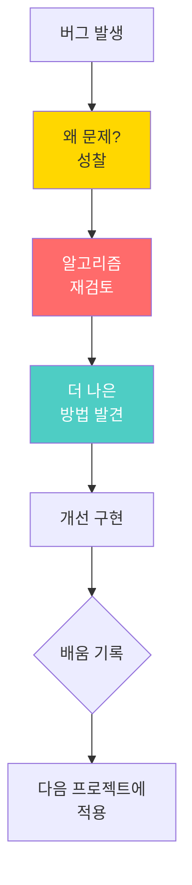

**디버깅 프로세스**:

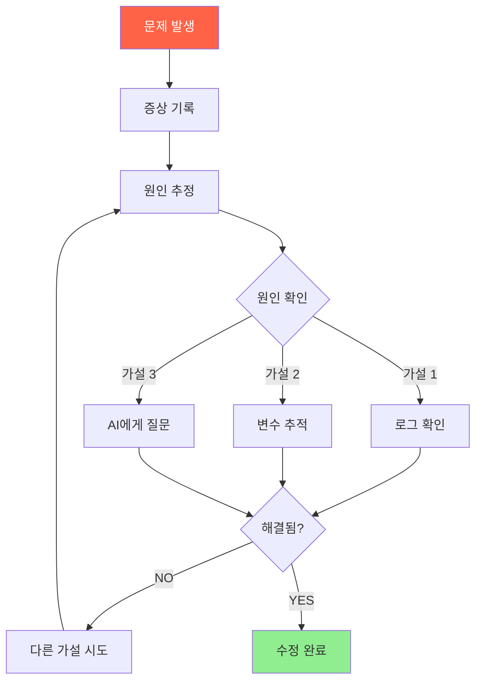

**AI를 활용한 디버깅 (협업 방식)**:

**❌ 나쁜 디버깅 요청**:
```
이 코드 고쳐주세요.
[코드만 덩그러니 붙여넣기]
```

**✅ 좋은 디버깅 요청**:
```
[상황 설명]
주식 추세 감지 프로그램을 만들고 있습니다.
5일/20일 이동평균을 계산해서 매수/매도 신호를 만들고 있습니다.

[문제 상황]
다음 코드를 실행하면 오류가 발생합니다:
[코드 붙여넣기]

[오류 메시지]
KeyError: 'Close'
[전체 에러 메시지]

[내가 시도한 것]
1. 데이터프레임 컬럼 이름 확인 → 'Close' 존재함
2. 데이터 타입 확인 → float64로 정상
3. 인덱스 범위 확인 → 문제 없음

[가설]
rolling() 함수를 쓸 때 window 크기가 데이터 길이보다 큰 것 같은데,
이게 문제일까요?

어떤 부분이 문제이고, 어떻게 수정하면 좋을까요?
또 비슷한 오류를 방지하려면 어떻게 해야 할까요?
```

**왜 이렇게 물어보나요?**
- AI가 더 정확한 진단 가능
- 근본 원인 파악 + 재발 방지 방법까지 제공
- 학습 효과: 왜 오류가 났는지 이해할 수 있음

**산출물**: 수정된 코드 + 해결 과정 기록

**역량**: 🔧 **디버거**

---

#### 🚀 7단계: 배포 (DEPLOY) - 10분

**목표**: 실제 사용 환경에 배포하기

**간단한 배포 방법**:

| 프로젝트 유형 | 배포 도구 | 소요 시간 |
|-------------|---------|---------|
| 웹사이트 | Vercel, Netlify | 5분 |
| 웹앱 | Replit, GitHub Pages | 10분 |
| 챗봇 | Discord, Telegram | 15분 |
| 데이터 분석 | Google Colab, Kaggle | 즉시 |
| 모바일 앱 | PWA (웹앱을 앱처럼) | 20분 |

**배포 체크리스트**:
```
□ 실제 환경에서 작동 확인
□ 사용자가 접근 가능한지 확인
□ 오류 발생 시 알림 설정
□ 사용 방법 간단히 설명
□ 피드백 수집 방법 마련
```

**산출물**: 배포된 링크 + 사용 가이드

**역량**: ⚡ **실행자** + 🚀 **기업가**

---

#### 💰 8단계: 가치 측정 (VALUE) - 10분

**목표**: 만든 것이 실제로 가치를 창출하는지 확인

**가치 측정 지표**:

| 가치 유형 | 측정 지표 | 예시 |
|---------|---------|------|
| **사회적 가치** | 도움받은 사람 수 | 50명이 앱 사용 |
| **시간 가치** | 절감된 시간 | 1인당 20분 절약 |
| **경제적 가치** | 절감된 비용 | 월 10만원 절약 |
| **학습 가치** | 습득한 역량 | 알고리즘 설계 능력 |
| **영향력** | 확산 범위 | SNS 공유 100회 |

**임팩트 스토리 작성**:
```
문제: [무엇이 문제였는가]
해결: [어떻게 해결했는가]
결과: [어떤 변화를 만들었는가]
배움: [무엇을 배웠는가]
다음: [어떻게 발전시킬 것인가]
```

**산출물**: 임팩트 리포트 (1페이지)

**역량**: 🚀 **기업가**

---

### 3.3 바이브 코딩 사이클 요약

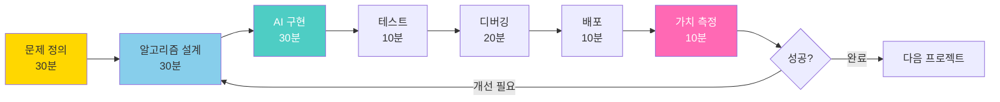

**총 소요 시간**: 2시간 20분 (하루 안에 MVP 완성!)

---

## 4. 4대 역량 정의

### 4.1 개발 프로세스와 4대 역량 매핑

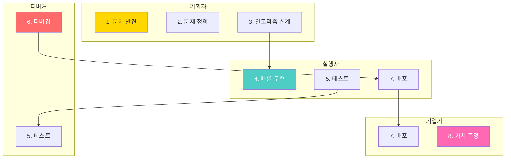

### 4.2 역량별 상세 정의

---

#### 🧠 기획자 (Planner)

**정의**: 문제를 정의하고 알고리즘으로 해결책을 설계하는 사람

**핵심 질문**:
- 진짜 문제는 무엇인가?
- 누구의 문제인가?
- 어떤 순서로 해결할 것인가? (알고리즘)
- 무엇을 입력받고 무엇을 출력할 것인가?

**필요한 능력**:
- 문제 정의 능력
- 알고리즘 설계 능력
- 논리적 사고
- 플로우차트 작성
- 의사코드 작성

**산출물**:
- 문제 정의서
- 알고리즘 플로우차트
- 의사코드
- 요구사항 명세

**바이브 코딩에서의 역할**:
- 코드를 작성하기 전에 **어떻게 해결할지** 설계
- AI에게 **명확한 지시**를 주기 위한 알고리즘 준비
- 개발 1-3단계 주도

---

#### ⚡ 실행자 (Executor)

**정의**: AI 도구를 활용하여 기획을 빠르게 현실로 만드는 사람

**핵심 질문**:
- 어떤 AI 도구를 쓸 것인가?
- 어떻게 프롬프트를 작성할 것인가?
- 어떻게 빠르게 프로토타입을 만들 것인가?
- 어떻게 배포할 것인가?

**필요한 능력**:
- AI 도구 활용 능력 (ChatGPT, Copilot)
- 프롬프트 엔지니어링
- 빠른 프로토타이핑
- 도구 숙달 (Replit, Vercel 등)
- 끈기와 실행력

**산출물**:
- 작동하는 프로토타입
- 배포된 서비스/앱
- 실행 과정 기록

**바이브 코딩에서의 역할**:
- 알고리즘을 AI에게 전달하여 **빠른 구현**
- 30분 안에 프로토타입 완성
- 개발 4, 5, 7단계 주도

---

#### 🔧 디버거 (Debugger) - 성찰하고 개선하는 사람 ⭐⭐⭐

**새로운 정의**: 
> **단순히 버그를 수정하는 사람이 아니라,**  
> **결과를 성찰하고 더 나은 알고리즘을 찾는 사람**

**핵심 질문 (변화)**:

| 기존 디버거 (수정자) | 새로운 디버거 (개선자) |
|------------------|-------------------|
| ❌ "어떻게 고칠까?" | ✅ "왜 이런 문제가 생겼을까?" |
| ❌ "에러 메시지가 뭐지?" | ✅ "알고리즘 설계가 잘못됐나?" |
| ❌ "빨리 수정하자" | ✅ "근본 원인은 무엇일까?" |
| ❌ "작동하면 끝" | ✅ "더 나은 방법은 없을까?" |

**디버거의 3단계 사고**:

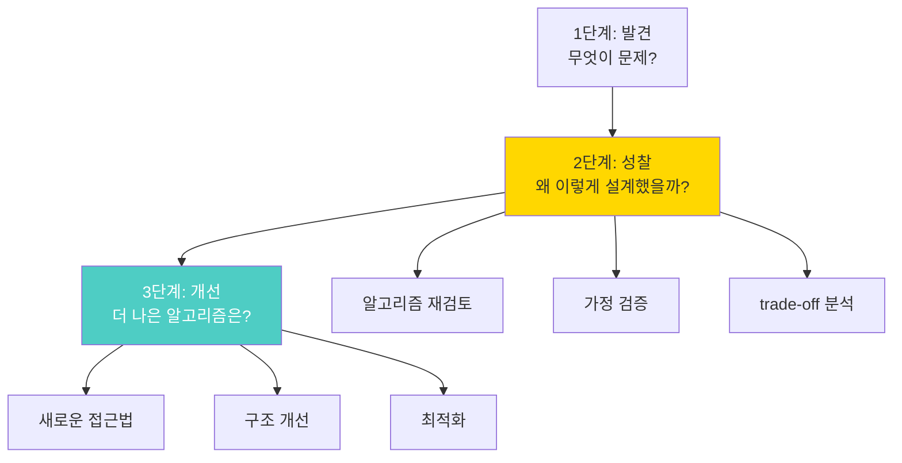

**필요한 능력**:
- ✅ **성찰적 사고**: "왜?"를 반복해서 묻기
- ✅ **알고리즘 분석**: 현재 알고리즘의 한계 파악
- ✅ **대안 탐색**: 다른 해결 방법 찾기
- ✅ **trade-off 이해**: 속도 vs 정확도, 단순 vs 복잡
- ✅ **역공부**: 더 나은 결과물에서 배우기

**산출물**:
- ❌ ~~단순 버그 수정~~
- ✅ **알고리즘 개선 보고서**
- ✅ **성찰 일지** (무엇을 배웠는가)
- ✅ **최적화 전후 비교**
- ✅ **새로운 접근법 제안**

**실전 예시**:

**🔴 나쁜 디버깅 (수정만 함)**:
```
문제: 주식 추세 감지가 느림
해결: 코드 최적화
결과: 10% 빨라짐
→ 끝
```

**🟢 좋은 디버깅 (성찰 + 개선)**:
```
문제: 주식 추세 감지가 느림

성찰:
- 왜 느릴까? → 모든 데이터를 매번 계산
- 알고리즘이 비효율적인가? → 이동평균을 누적 계산 안 함
- 더 나은 방법은? → 증분 계산(Incremental) 방식

개선:
- 알고리즘 변경: 매번 계산 → 증분 업데이트
- 데이터 구조 변경: List → Deque (O(n) → O(1))
- 캐싱 추가: 이전 결과 재사용

결과:
- 속도: 100배 향상 ⚡
- 메모리: 50% 절감 💾
- 알고리즘: 더 우아한 구조 ✨

배움:
- 문제는 코드가 아니라 알고리즘이었다
- Trade-off: 메모리를 조금 더 쓰면 속도 대폭 향상
- 다음에는 처음부터 증분 방식으로 설계하자
```

**바이브 코딩에서의 역할**:
- 단순 버그 수정이 아닌 **알고리즘 레벨 개선**
- AI에게 "어떻게 고칠까?"가 아닌 **"더 나은 알고리즘은?"** 질문
- **역공부**: 더 좋은 결과물 분석 → 배우기 → 적용
- 개발 5, 6단계 주도 + **3단계(알고리즘 재설계)로 되돌아가기**

---

#### 🚀 기업가 (Entrepreneur)

**정의**: 만든 것을 세상에 알리고 가치를 창출하는 사람

**핵심 질문**:
- 누가 이것을 필요로 하는가?
- 어떻게 사람들에게 알릴 것인가?
- 얼마나 많은 가치를 만들었는가?
- 어떻게 지속 가능하게 만들 것인가?

**필요한 능력**:
- 기회 포착 능력
- 스토리텔링
- 마케팅 감각
- 데이터 분석 (임팩트 측정)
- 네트워킹

**산출물**:
- 배포된 서비스
- 사용자 피드백
- 임팩트 리포트
- 성장 전략

**바이브 코딩에서의 역할**:
- 프로젝트를 실제 사용자에게 전달
- 가치를 측정하고 스토리로 정리
- 개발 7, 8단계 주도

---

### 4.3 4대 역량 통합 모델

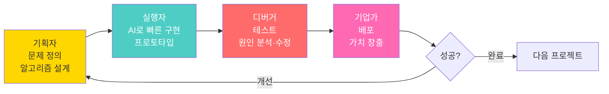

---

## 5. 알고리즘 중심 사고방식

### 5.1 알고리즘이란?

**알고리즘 (Algorithm)**: 문제를 해결하기 위한 **단계적인 절차**

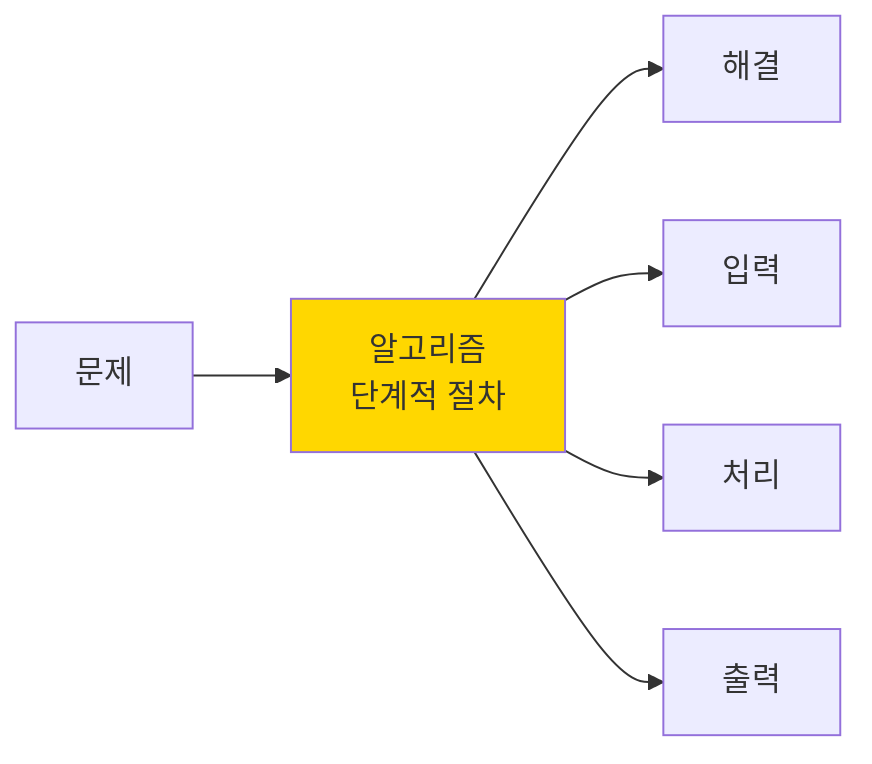

### 5.2 일상 속 알고리즘 예시

#### 예시 1: 라면 끓이기 알고리즘

```
입력: 라면, 물, 냄비, 스프
처리:
  1. 냄비에 물 550ml를 넣는다
  2. 물을 끓인다
  3. 물이 끓으면 면과 스프를 넣는다
  4. 4분 30초 동안 끓인다
  5. 불을 끈다
출력: 맛있는 라면
```

#### 예시 2: 최단 경로 찾기 알고리즘

```
입력: 출발지, 목적지, 지도 데이터
처리:
  1. 출발지에서 갈 수 있는 모든 경로를 찾는다
  2. 각 경로의 거리를 계산한다
  3. 가장 짧은 경로를 선택한다
  4. 해당 경로의 방향을 안내한다
출력: 최단 경로 안내
```

### 5.3 알고리즘 설계 3단계

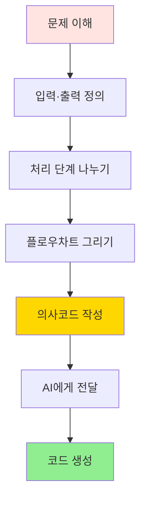

### 5.4 의사코드 작성법

**의사코드 (Pseudocode)**: 프로그래밍 언어가 아닌 **자연어로 작성한 알고리즘**

**의사코드 예시**:

```
함수 성적등급계산(점수):
    1. 점수를 입력받는다
    
    2. 만약 점수가 90 이상이면:
        - "A등급"을 반환한다
    
    3. 그렇지 않고 점수가 80 이상이면:
        - "B등급"을 반환한다
    
    4. 그렇지 않고 점수가 70 이상이면:
        - "C등급"을 반환한다
    
    5. 그렇지 않으면:
        - "D등급"을 반환한다
    
    6. 결과를 출력한다
```

**이 의사코드를 ChatGPT에게 주면 → 바로 Python 코드로 변환!**

### 5.5 대표적인 알고리즘 패턴

#### 1. 순차 (Sequential)

```
단계 1 → 단계 2 → 단계 3 → 완료
```

예: 회원가입 절차

#### 2. 반복 (Loop)

```
조건이 참인 동안:
    - 동작 반복
```

예: 메시지 100명에게 보내기

#### 3. 조건 분기 (Conditional)

```
만약 조건 A이면:
    - 동작 A
그렇지 않으면:
    - 동작 B
```

예: 성적 등급 계산

#### 4. 재귀 (Recursive)

```
함수 자신을 다시 호출
```

예: 폴더 안의 모든 파일 찾기

### 5.6 알고리즘 설계 연습

**문제**: 친구 3명과 점심 메뉴를 정하는 알고리즘을 설계하라.

**알고리즘 설계**:

```
입력: 친구 3명의 선호 메뉴

처리:
  1. 각 친구에게 먹고 싶은 메뉴를 묻는다
  2. 모든 메뉴를 리스트에 추가한다
  3. 중복되는 메뉴를 찾는다
  4. 만약 중복 메뉴가 있으면:
      - 가장 많이 중복된 메뉴를 선택한다
  5. 만약 중복이 없으면:
      - 무작위로 1개를 선택한다
  6. 선택된 메뉴를 친구들에게 알린다

출력: 최종 선택된 점심 메뉴
```

**플로우차트**:

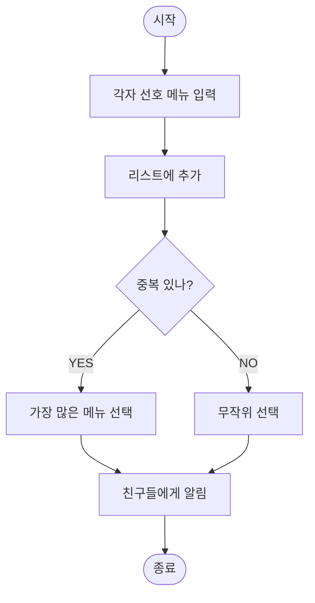

---

## 6. 실전 사례 1: 가상 주식 대결 - 파도 타기 전략

### 6.1 프로젝트 개요

**문제**: 주식 초보자가 투자 연습을 할 수 있는 가상 주식 대결 게임을 만들어라.  
**전략**: "파도 타기" - 주식의 상승 추세를 감지하여 사고, 하락 전에 파는 알고리즘

**목표**:
- 실제 주식 데이터 사용
- 간단한 추세 감지 알고리즘
- 가상 자금으로 매매 연습
- 친구들과 수익률 경쟁

### 6.2 개발 프로세스 적용

---

#### 🔍 1단계: 문제 발견 (30분)

**관찰**:
- 주식 투자는 어렵고 위험하다
- 초보자는 연습할 방법이 없다
- 실제 돈으로 연습하면 손실 위험
- 친구들과 경쟁하면 재미있을 것 같다

**문제 정의**:
```
문제: 주식 초보자가 안전하게 투자 연습을 할 방법이 없다
대상: 주식에 관심 있는 고등학생 5명
현황: 모두 주식을 해보고 싶지만 두렵다
목표: 가상 자금 100만원으로 1주일 동안 수익률 경쟁
제약: 코딩 경험 없음, 1일 내 완성
```

**역량**: 🧠 **기획자**

---

#### 📝 2단계: 문제 정의 (30분)

**5Why 분석**:

```
문제: 주식 투자가 어렵다
1 Why: 언제 사고 팔아야 할지 모른다
2 Why: 추세 파악이 어렵다
3 Why: 데이터 분석 능력이 없다
4 Why: 연습할 기회가 없다
5 Why: 실제 돈을 쓰기 두렵다

진짜 문제: 안전하게 연습할 수 있는 가상 투자 시스템 필요
```

**역량**: 🧠 **기획자** + 🔧 **디버거**

---

#### 🎯 3단계: 알고리즘 설계 (30분)

**핵심 알고리즘**: 이동평균선을 이용한 추세 감지

**입력 → 출력 정의**:
```
입력: 주식 종목, 기간 (예: 최근 30일)
처리: 추세 감지 + 매매 신호 생성
출력: 매수/매도/대기 신호
```

**파도 타기 알고리즘 (의사코드)**:

```
함수 파도타기_전략(주식데이터):
    1. 단기 이동평균 (5일) 계산
    2. 장기 이동평균 (20일) 계산
    
    3. 만약 단기평균이 장기평균을 상향돌파하면:
        → "매수 신호" (파도 시작!)
    
    4. 만약 단기평균이 장기평균을 하향돌파하면:
        → "매도 신호" (파도 끝!)
    
    5. 그렇지 않으면:
        → "대기 신호"
    
    6. 신호 반환
```

**플로우차트**:

```mermaid
graph TD
    START([시작]) --> GET[주식 데이터 가져오기]
    GET --> CALC1[단기 이동평균 계산<br/>5일]
    CALC1 --> CALC2[장기 이동평균 계산<br/>20일]
    
    CALC2 --> COMPARE{비교}
    COMPARE -->|단기 > 장기<br/>상향돌파| BUY[매수 신호<br/>파도 탔다!]
    COMPARE -->|단기 < 장기<br/>하향돌파| SELL[매도 신호<br/>파도 끝!]
    COMPARE -->|비슷함| WAIT[대기 신호]
    
    BUY --> OUTPUT[신호 출력]
    SELL --> OUTPUT
    WAIT --> OUTPUT
    OUTPUT --> END([종료])
    
    style BUY fill:#90EE90,color:#333
    style SELL fill:#FF6347,color:#fff
    style WAIT fill:#FFD700,color:#333
```

**역량**: 🧠 **기획자**

---

#### ⚙️ 4단계: 빠른 구현 (30분)

**AI 프롬프트 (협업자 관점)**:

```
[상황 설명]
저는 고등학생이고, 친구들과 가상 주식 투자 대결을 하려고 합니다.
주식 초보자들이 안전하게 투자 연습을 할 수 있는 도구가 필요합니다.

[알고리즘 공유]
다음과 같은 "파도 타기" 전략을 생각했습니다:
[위의 의사코드 붙여넣기]

[질문]
1. 이 알고리즘을 구현하려면 어떤 방법이 가장 좋을까요?
2. 실제 주식 데이터를 가져오는 방법은 무엇인가요?
3. 매수/매도 신호를 시각적으로 보여주고 싶은데, 어떻게 하면 좋을까요?
4. 과거 데이터로 수익률을 계산(백테스팅)하려면 어떻게 해야 하나요?
5. 친구들과 공유하기 좋은 형태는 무엇일까요?

[제약사항]
- 코딩 경험: Python 기초 (1개월)
- 예산: 월 2만원 가능 (품질 우선)
- 개발 시간: 1일 내
- 5명 친구가 각자 사용 가능해야 함
- 목표: 포트폴리오에 넣을 수준

어떻게 시작하면 좋을지, 유료 도구가 필요하다면 추천해주세요.
```

**왜 이렇게 물어보나요?**
- AI가 yfinance, pandas 외에 더 나은 대안을 제안할 수 있음
- 백테스팅 라이브러리(backtrader) 등 전문 도구 추천 받을 수 있음
- Google Colab 같은 공유 방법도 제안받을 수 있음
- **AI의 3년차 경험을 최대한 활용**

**ChatGPT가 생성한 코드 (핵심 부분)**:

```python
import yfinance as yf
import pandas as pd
import matplotlib.pyplot as plt

def 파도타기_전략(종목, 시작일, 종료일):
    # 1. 데이터 가져오기
    데이터 = yf.download(종목, start=시작일, end=종료일)
    
    # 2. 이동평균 계산
    데이터['단기평균'] = 데이터['Close'].rolling(window=5).mean()
    데이터['장기평균'] = 데이터['Close'].rolling(window=20).mean()
    
    # 3. 매매 신호 생성
    데이터['신호'] = 0
    데이터.loc[데이터['단기평균'] > 데이터['장기평균'], '신호'] = 1  # 매수
    데이터.loc[데이터['단기평균'] < 데이터['장기평균'], '신호'] = -1  # 매도
    
    # 4. 시각화
    plt.figure(figsize=(12, 6))
    plt.plot(데이터['Close'], label='주가', alpha=0.5)
    plt.plot(데이터['단기평균'], label='단기(5일)', linewidth=2)
    plt.plot(데이터['장기평균'], label='장기(20일)', linewidth=2)
    
    # 매수/매도 지점 표시
    매수지점 = 데이터[데이터['신호'] == 1]
    매도지점 = 데이터[데이터['신호'] == -1]
    plt.scatter(매수지점.index, 매수지점['Close'], 
                color='green', marker='^', s=100, label='매수')
    plt.scatter(매도지점.index, 매도지점['Close'], 
                color='red', marker='v', s=100, label='매도')
    
    plt.legend()
    plt.title(f'{종목} 파도타기 전략')
    plt.show()
    
    return 데이터

# 실행
결과 = 파도타기_전략('AAPL', '2024-01-01', '2024-12-31')
```

**바이브 코딩 포인트**:
- 알고리즘을 명확히 설계했기 때문에 AI가 정확히 구현
- 30분 만에 작동하는 프로토타입 완성
- 그래프까지 자동 생성

**역량**: ⚡ **실행자**

---

#### 🧪 5단계: 테스트 (10분)

**테스트 시나리오**:
1. Apple 주식 (AAPL) 1년치 데이터로 테스트
2. Tesla 주식 (TSLA)으로도 테스트
3. 삼성전자 (005930.KS)도 테스트

**결과**:
- ✅ 데이터 잘 가져옴
- ✅ 이동평균 정확히 계산됨
- ✅ 매수/매도 신호 잘 표시됨
- ❌ 문제 발견: 수익률 계산 기능 없음

**역량**: ⚡ **실행자** + 🔧 **디버거**

---

#### 🔧 6단계: 디버깅 (20분)

**문제**: 수익률 계산 기능이 없다

**해결**:

```
ChatGPT 프롬프트:

위 코드에 다음 기능을 추가해주세요:
- 매수/매도 신호에 따라 가상 거래 시뮬레이션
- 초기 자금 100만원으로 시작
- 최종 수익률 계산 및 출력

코드를 수정해주세요.
```

**수정된 코드 (추가 부분)**:

```python
def 백테스팅(데이터, 초기자금=1000000):
    자금 = 초기자금
    보유주식 = 0
    거래내역 = []
    
    for i in range(1, len(데이터)):
        if 데이터['신호'].iloc[i] == 1 and 데이터['신호'].iloc[i-1] != 1:
            # 매수
            주가 = 데이터['Close'].iloc[i]
            보유주식 = 자금 / 주가
            거래내역.append({'날짜': 데이터.index[i], '거래': '매수', '주가': 주가, '수량': 보유주식})
            자금 = 0
            
        elif 데이터['신호'].iloc[i] == -1 and 보유주식 > 0:
            # 매도
            주가 = 데이터['Close'].iloc[i]
            자금 = 보유주식 * 주가
            거래내역.append({'날짜': 데이터.index[i], '거래': '매도', '주가': 주가, '수량': 보유주식})
            보유주식 = 0
    
    # 최종 수익률 계산
    최종자산 = 자금 if 자금 > 0 else 보유주식 * 데이터['Close'].iloc[-1]
    수익률 = ((최종자산 - 초기자금) / 초기자금) * 100
    
    print(f"초기 자금: {초기자금:,}원")
    print(f"최종 자산: {최종자산:,.0f}원")
    print(f"수익률: {수익률:.2f}%")
    
    return 거래내역, 수익률
```

**재테스트 결과**:
- ✅ 수익률 계산 완료
- Apple 주식: +15.3%
- Tesla 주식: +8.7%
- 삼성전자: +12.1%

**역량**: 🔧 **디버거**

---

#### 🚀 7단계: 배포 (10분)

**배포 방법**: Google Colab 노트북으로 공유

1. Colab에 코드 복사
2. 친구들에게 링크 공유
3. 각자 원하는 종목으로 테스트
4. 1주일 후 수익률 비교

**링크**: `https://colab.research.google.com/...`

**사용 방법**:
```
1. 위 링크 클릭
2. 종목 코드 입력 (예: AAPL, TSLA, 005930.KS)
3. "실행" 버튼 클릭
4. 그래프와 수익률 확인
```

**역량**: ⚡ **실행자** + 🚀 **기업가**

---

#### 💰 8단계: 가치 측정 (10분)

**임팩트 측정**:

| 지표 | 결과 |
|------|------|
| 참여 인원 | 5명 (친구들) |
| 테스트 종목 수 | 총 15개 (1인당 3개) |
| 학습 시간 | 1인당 2시간 주식 공부 |
| 평균 수익률 | +11.5% (가상) |
| 실제 투자 의향 | 5명 중 3명 "해보겠다" |

**임팩트 스토리**:
```
문제: 주식 투자를 두려워하는 친구들

해결: 가상 투자 게임으로 안전하게 연습

결과: 
- 5명 친구들이 재미있게 참여
- 추세 감지 알고리즘 이해
- 주식에 대한 두려움 감소
- 3명이 실제 투자 시작 계획

배움:
- 알고리즘 설계의 중요성
- AI를 활용한 빠른 개발
- 데이터 시각화 능력
- 백테스팅 개념 이해

다음:
- 더 복잡한 전략 추가 (RSI, MACD)
- 웹사이트로 만들어 더 많은 사람 초대
- 실시간 알림 기능 추가
```

**역량**: 🚀 **기업가**

---

### 6.3 핵심 배운 점

**알고리즘 사고**:
- 복잡한 주식 투자 → 간단한 "이동평균 비교" 알고리즘으로 단순화
- 의사코드를 먼저 작성하니 AI가 정확히 구현

**바이브 코딩**:
- 알고리즘만 설계하면 AI가 코드 생성 (30분)
- 코딩 경험 없어도 실전 프로젝트 완성 (2시간 20분)

**4대 역량**:
- 🧠 기획자: 문제 정의, 알고리즘 설계
- ⚡ 실행자: AI로 빠른 구현, 배포
- 🔧 디버거: 수익률 계산 버그 발견·수정
- 🚀 기업가: 친구들과 공유, 임팩트 측정

---

## 7. 실전 사례 2: AI Agent로 문제 해결하기

### 7.1 프로젝트 개요

**문제**: 매일 아침 날씨, 뉴스, 일정을 확인하는데 시간이 너무 오래 걸린다.  
**해결**: AI Agent를 만들어 자동으로 정보를 수집하고 요약하여 카카오톡으로 전송

**목표**:
- 매일 아침 7시에 자동 실행
- 날씨, 주요 뉴스, 오늘 일정을 한눈에
- 카카오톡 또는 이메일로 전송
- 하루 20분 절약 → 한 달 10시간 절약

### 7.2 개발 프로세스 적용

---

#### 🔍 1단계: 문제 발견 (30분)

**관찰**:
- 매일 아침 여러 앱을 확인하느라 바쁨
- 날씨 앱 → 뉴스 앱 → 구글 캘린더 순서로
- 총 15-20분 소요
- 깜빡하고 우산 안 챙김

**문제 정의**:
```
문제: 아침 루틴이 비효율적이다
대상: 나 (고등학생, 바쁨)
현황: 매일 20분 낭비, 가끔 중요한 일정 놓침
목표: 자동으로 정리된 정보를 5분 안에 확인
제약: 예산 월 1만원 가능, 안정성 우선, 1일 내 완성
```

**역량**: 🧠 **기획자**

---

#### 📝 2단계: 문제 정의 (30분)

**5Why 분석**:

```
문제: 아침 준비가 늦다
1 Why: 정보 확인하느라 시간 소요
2 Why: 여러 앱을 일일이 확인
3 Why: 자동화 시스템이 없다
4 Why: 만들 방법을 몰랐다
5 Why: 코딩을 어렵게 생각했다

진짜 문제: 자동화 정보 수집 Agent 필요
```

**역량**: 🧠 **기획자** + 🔧 **디버거**

---

#### 🎯 3단계: 알고리즘 설계 (30분)

**AI Agent 알고리즘 (의사코드)**:

```
함수 아침_정보_Agent():
    1. 현재 날짜와 시간 확인
    
    2. [정보 수집]
       a) 날씨 API 호출 → 오늘 날씨 가져오기
       b) 뉴스 API 호출 → 주요 뉴스 3개
       c) 구글 캘린더 → 오늘 일정 가져오기
    
    3. [정보 처리]
       a) 날씨 데이터 → "맑음, 최고 25도" 형식으로 요약
       b) 뉴스 → 제목과 링크만 추출
       c) 일정 → 시간 순서로 정렬
    
    4. [메시지 작성]
       a) 템플릿에 정보 입력
       b) 읽기 쉽게 포맷팅
    
    5. [전송]
       a) 카카오톡 API로 나에게 전송
       또는
       b) 이메일로 전송
    
    6. 로그 기록 (성공/실패)
```

**플로우차트**:

```mermaid
graph TD
    START([매일 아침 7시]) --> COLLECT[정보 수집]
    
    COLLECT --> API1[날씨 API 호출]
    COLLECT --> API2[뉴스 API 호출]
    COLLECT --> API3[캘린더 API 호출]
    
    API1 --> WEATHER[날씨 데이터]
    API2 --> NEWS[뉴스 데이터]
    API3 --> SCHEDULE[일정 데이터]
    
    WEATHER --> PROCESS[데이터 처리 및 요약]
    NEWS --> PROCESS
    SCHEDULE --> PROCESS
    
    PROCESS --> FORMAT[메시지 포맷팅]
    FORMAT --> CHECK{전송 방법?}
    
    CHECK -->|카카오톡| KAKAO[카카오톡 전송]
    CHECK -->|이메일| EMAIL[이메일 전송]
    
    KAKAO --> LOG[로그 기록]
    EMAIL --> LOG
    LOG --> END([종료])
    
    style COLLECT fill:#FFD700,color:#333
    style PROCESS fill:#4ECDC4,color:#fff
    style KAKAO fill:#90EE90,color:#333
```

**핵심 구성 요소**:

| 요소 | 설명 | 도구 |
|------|------|------|
| **날씨** | 현재 날씨, 최고/최저 온도 | OpenWeather API (무료) |
| **뉴스** | IT/경제 뉴스 상위 3개 | News API (무료) |
| **일정** | 오늘 일정 | Google Calendar API |
| **전송** | 카카오톡 또는 이메일 | Telegram Bot (더 쉬움) |
| **자동화** | 매일 아침 7시 실행 | GitHub Actions |

**역량**: 🧠 **기획자**

---

#### ⚙️ 4단계: 빠른 구현 (30분)

**AI 프롬프트 (협업자 관점)**:

```
[상황 설명]
저는 고등학생입니다. 
매일 아침 날씨, 뉴스, 일정을 확인하는데 20분이나 걸립니다.
여러 앱을 일일이 확인해야 해서 비효율적이고, 가끔 중요한 일정도 놓칩니다.

[목표]
매일 아침 7시에 자동으로 다음 정보를 수집해서 
저에게 메시지로 보내주는 AI Agent를 만들고 싶습니다:
- 오늘 날씨 (우산 챙길지 판단)
- 주요 뉴스 3개 (IT/교육 분야)
- 오늘 일정 (시간 순서로)

[알고리즘]
[위의 의사코드 붙여넣기]

[질문]
1. 이런 자동화를 구현하는 가장 좋은 방법은 무엇인가요?
2. 날씨와 뉴스 데이터를 무료로 가져올 수 있는 방법은?
3. 메시지 전송은 카카오톡, 텔레그램, 이메일 중 무엇이 좋을까요?
4. 매일 아침 7시에 자동 실행하려면 어떻게 해야 하나요?
5. 일정은 구글 캘린더와 연동하고 싶은데 가능한가요?

[제약사항]
- 코딩 경험: Python 기초
- 예산: 월 1만원 가능 (안정성 우선)
- 안정적으로 매일 작동해야 함
- 개발 시간: 3시간 내

어떤 방식으로 시작하는 것이 가장 효율적이고 안정적일까요?
유료 서비스가 더 낫다면 추천해주세요.
단계별로 알려주세요.
```

**왜 이렇게 물어보나요?**
- AI가 더 나은 API 조합을 제안할 수 있음
- 서버리스 방식(AWS Lambda, GitHub Actions)도 제안받을 수 있음
- 에러 처리, 로깅 등 경험 기반 베스트 프랙티스 제공
- 확장 가능한 구조로 설계 가능

**ChatGPT가 생성한 코드 (핵심 부분)**:

```python
import requests
from datetime import datetime

def 날씨_가져오기(api_key, 도시='Seoul'):
    url = f"http://api.openweathermap.org/data/2.5/weather?q={도시}&appid={api_key}&units=metric&lang=kr"
    response = requests.get(url)
    data = response.json()
    
    날씨 = {
        '상태': data['weather'][0]['description'],
        '온도': round(data['main']['temp']),
        '최고': round(data['main']['temp_max']),
        '최저': round(data['main']['temp_min']),
    }
    return 날씨

def 뉴스_가져오기(api_key, 카테고리='technology'):
    url = f"https://newsapi.org/v2/top-headlines?country=kr&category={카테고리}&apiKey={api_key}"
    response = requests.get(url)
    data = response.json()
    
    뉴스목록 = []
    for article in data['articles'][:3]:
        뉴스목록.append({
            '제목': article['title'],
            '링크': article['url']
        })
    return 뉴스목록

def 메시지_작성(날씨, 뉴스):
    오늘 = datetime.now().strftime('%Y년 %m월 %d일 %A')
    
    메시지 = f"""
🌅 좋은 아침입니다!
📅 {오늘}

☁️ 오늘의 날씨
- {날씨['상태']}
- 현재 {날씨['온도']}°C
- 최고 {날씨['최고']}°C / 최저 {날씨['최저']}°C

📰 주요 뉴스
"""
    
    for i, 기사 in enumerate(뉴스, 1):
        메시지 += f"\n{i}. {기사['제목']}\n   {기사['링크']}\n"
    
    메시지 += "\n✨ 오늘도 힘내세요!"
    
    return 메시지

def 텔레그램_전송(bot_token, chat_id, 메시지):
    url = f"https://api.telegram.org/bot{bot_token}/sendMessage"
    data = {
        'chat_id': chat_id,
        'text': 메시지,
        'parse_mode': 'Markdown'
    }
    response = requests.post(url, data=data)
    return response.json()

def 아침_정보_Agent(weather_key, news_key, bot_token, chat_id):
    try:
        # 1. 정보 수집
        날씨 = 날씨_가져오기(weather_key)
        뉴스 = 뉴스_가져오기(news_key)
        
        # 2. 메시지 작성
        메시지 = 메시지_작성(날씨, 뉴스)
        
        # 3. 전송
        결과 = 텔레그램_전송(bot_token, chat_id, 메시지)
        
        print("✅ 전송 완료!")
        return True
        
    except Exception as e:
        print(f"❌ 오류 발생: {e}")
        return False

# 실행
if __name__ == "__main__":
    # API 키 설정 (실제로는 환경 변수 사용)
    WEATHER_KEY = "your_weather_api_key"
    NEWS_KEY = "your_news_api_key"
    BOT_TOKEN = "your_telegram_bot_token"
    CHAT_ID = "your_chat_id"
    
    아침_정보_Agent(WEATHER_KEY, NEWS_KEY, BOT_TOKEN, CHAT_ID)
```

**바이브 코딩 포인트**:
- 알고리즘을 명확히 설계했기 때문에 AI가 정확히 구현
- API 키만 설정하면 바로 작동
- 30분 만에 완성

**역량**: ⚡ **실행자**

---

#### 🧪 5단계: 테스트 (10분)

**테스트 시나리오**:

1. **수동 실행 테스트**
   ```bash
   python morning_agent.py
   ```
   - ✅ 날씨 정보 정상
   - ✅ 뉴스 3개 수집 성공
   - ✅ 텔레그램 메시지 전송 완료

2. **다양한 조건 테스트**
   - ✅ 날씨 API 응답 느릴 때 (타임아웃 처리)
   - ✅ 뉴스 API 오류 시 (기본 메시지)
   - ❌ 문제 발견: 일정 기능 없음 (캘린더 API 미구현)

**역량**: ⚡ **실행자** + 🔧 **디버거**

---

#### 🔧 6단계: 디버깅 (20분)

**문제 1**: 일정 기능 없음

**해결**:
```
ChatGPT 프롬프트:

위 코드에 Google Calendar API를 추가하여
오늘 일정도 함께 보내주는 기능을 추가해주세요.

Google Calendar API 인증 방법도 알려주세요.
```

**문제 2**: 매일 아침 자동 실행이 안 됨

**해결**: GitHub Actions 사용

**`.github/workflows/morning_agent.yml` 파일 생성**:

```yaml
name: Morning Agent

on:
  schedule:
    - cron: '0 22 * * *'  # UTC 22:00 = 한국 07:00

jobs:
  run-agent:
    runs-on: ubuntu-latest
    
    steps:
    - uses: actions/checkout@v2
    
    - name: Set up Python
      uses: actions/setup-python@v2
      with:
        python-version: '3.9'
    
    - name: Install dependencies
      run: |
        pip install requests
    
    - name: Run Morning Agent
      env:
        WEATHER_KEY: ${{ secrets.WEATHER_KEY }}
        NEWS_KEY: ${{ secrets.NEWS_KEY }}
        BOT_TOKEN: ${{ secrets.BOT_TOKEN }}
        CHAT_ID: ${{ secrets.CHAT_ID }}
      run: |
        python morning_agent.py
```

**재테스트 결과**:
- ✅ 매일 아침 7시 자동 실행
- ✅ 일정 정보 추가 완료
- ✅ 모든 기능 정상 작동

**역량**: 🔧 **디버거**

---

#### 🚀 7단계: 배포 (10분)

**배포 방법**: GitHub에 올려서 자동 실행

**단계**:
1. GitHub 저장소 생성
2. 코드 업로드
3. Secrets에 API 키 등록
   - `WEATHER_KEY`
   - `NEWS_KEY`
   - `BOT_TOKEN`
   - `CHAT_ID`
4. GitHub Actions 활성화
5. 매일 아침 7시 자동 실행 확인

**결과**:
- ✅ 매일 아침 7시에 텔레그램으로 메시지 도착
- ✅ 날씨, 뉴스, 일정 한눈에 확인
- ✅ 아침 루틴 20분 → 5분으로 단축

**역량**: ⚡ **실행자** + 🚀 **기업가**

---

#### 💰 8단계: 가치 측정 (10분)

**임팩트 측정**:

| 지표 | 결과 |
|------|------|
| 시간 절약 | 하루 15분 → 한 달 7.5시간 |
| 정보 놓침 | 주 2회 → 0회 |
| 우산 챙김 | 성공률 60% → 100% |
| 만족도 | 매우 만족 (5/5) |
| 친구 공유 | 3명이 따라서 만듦 |

**임팩트 스토리**:
```
문제: 아침 정보 확인에 20분 소요, 가끔 중요한 일정 놓침

해결: AI Agent로 자동 수집 및 요약

결과:
- 아침 루틴 15분 절약 → 한 달 7.5시간
- 중요한 일정 절대 놓치지 않음
- 날씨 확인 자동화로 우산 챙김 100% 성공
- 친구 3명도 따라서 만듦

배움:
- API 활용 방법
- 자동화 시스템 구축
- GitHub Actions 사용법
- Telegram Bot 개발

다음:
- 교통 정보 추가 (집 → 학교 소요 시간)
- 점심 메뉴 추천 기능
- 친구들 생일 알림
- 음성으로 읽어주기 (TTS)
```

**역량**: 🚀 **기업가**

---

### 7.3 핵심 배운 점

**알고리즘 사고**:
- 복잡한 작업 → "수집 → 처리 → 전송" 3단계로 단순화
- 각 단계를 함수로 분리하여 모듈화

**바이브 코딩**:
- 알고리즘만 설계하면 ChatGPT가 API 연결까지 자동 생성
- 코딩 경험 없이도 실용적인 자동화 시스템 완성
- GitHub Actions로 완전 자동화

**4대 역량**:
- 🧠 기획자: 문제 정의, Agent 알고리즘 설계
- ⚡ 실행자: AI로 빠른 구현, GitHub 배포
- 🔧 디버거: 일정 기능 추가, 자동화 설정
- 🚀 기업가: 시간 가치 측정, 친구들에게 공유

**실용성**:
- 실제 생활에서 매일 사용하는 도구
- 하루 15분 = 한 달 7.5시간 = 1년 90시간 절약!

---

## 8. 실천 가이드: 프로젝트 기반 학습

### 8.1 바이브 코딩으로 프로젝트 진행하기

**3개월 학습 로드맵**:

```mermaid
timeline
    title 바이브 코딩 마스터 3개월 로드맵
    
    section 1개월차: 기초
        1주차 : 알고리즘 사고 연습
              : 플로우차트 그리기
              : 의사코드 작성
        2주차 : AI 도구 익히기
              : ChatGPT 활용
              : 간단한 프로젝트 3개
        3주차 : 문제 발견 훈련
              : 독서 → 문제 찾기
              : 5Why 기법 연습
        4주차 : 첫 번째 프로젝트
              : 2시간 만에 MVP
              : 친구에게 공유
    
    section 2개월차: 실전
        5주차 : 데이터 분석 프로젝트
              : 주식, 날씨, 통계
        6주차 : 자동화 프로젝트
              : 반복 작업 자동화
        7주차 : 웹 프로젝트
              : 간단한 웹사이트
        8주차 : 대회 참가
              : 해커톤 또는 공모전
    
    section 3개월차: 마스터
        9주차 : AI Agent 만들기
              : 챗봇, 자동화봇
        10주차 : 포트폴리오 구축
               : 프로젝트 정리
               : 임팩트 스토리
        11주차 : 대형 프로젝트
               : 1주일 집중 개발
        12주차 : 발표 및 공유
               : 블로그 작성
               : 오픈소스 공개
```

### 8.2 주차별 실천 가이드

#### 📅 1주차: 알고리즘 사고 연습

**일일 루틴 (30분)**:
- 📚 일상 문제 1개 발견
- 🎯 플로우차트로 해결 과정 그리기
- ✍️ 의사코드로 작성하기

**주간 과제**:
```
과제 1: 아침 루틴 알고리즘화
- 기상부터 등교까지 플로우차트
- 시간 최적화 방법 찾기

과제 2: 점심 메뉴 선택 알고리즘
- 친구들 선호도 고려
- 가격, 거리, 맛 점수화

과제 3: 숙제 우선순위 알고리즘
- 마감일, 난이도, 중요도 고려
- 최적 순서 도출
```

---

#### 📅 2주차: AI 도구 익히기

**도구별 연습**:

| 도구 | 연습 내용 | 시간 |
|------|---------|------|
| **ChatGPT** | 의사코드 → Python 변환 | 1시간 |
| **Replit** | 온라인에서 코드 실행 | 30분 |
| **GitHub** | 코드 저장 및 공유 | 30분 |
| **Telegram** | 봇 만들기 기초 | 1시간 |

**미니 프로젝트 3개** (각 1시간):
1. 🎲 주사위 굴리기 시뮬레이터
2. 🔐 비밀번호 생성기
3. 📊 BMI 계산기

---

#### 📅 3주차: 문제 발견 훈련

**독서 → 문제 발견**:

```
매일:
1. 책 또는 기사 1개 읽기 (30분)
2. 발견한 문제 1개 기록
3. 5Why로 근본 원인 분석
4. 해결 아이디어 간단히 메모

주말:
- 5개 문제 중 1개 선택
- 문제 정의서 작성
- 알고리즘 설계
```

**문제 발견 노트 예시**:

| 날짜 | 문제 | 5Why 결과 | 아이디어 |
|------|------|----------|---------|
| 1/1 | 쓰레기 분리수거 헷갈림 | 표시가 복잡 → 분류 기준 모호 | 사진 찍으면 분류 알려주는 앱 |
| 1/2 | 동아리 회비 관리 복잡 | 수기 기록 → 실수 많음 | 자동 회비 관리 봇 |

---

#### 📅 4주차: 첫 번째 완성 프로젝트

**2시간 프로젝트 도전**:

```
시간표:
09:00-09:30  문제 정의 + 알고리즘 설계
09:30-10:00  AI로 빠른 구현
10:00-10:10  테스트
10:10-10:30  디버깅
10:30-10:40  배포
10:40-11:00  친구 피드백 + 개선
```

**추천 프로젝트 주제**:
1. 학교 급식 메뉴 알림봇
2. 시험 D-Day 카운터
3. 할 일 관리 텔레그램 봇
4. 환율 변동 알림
5. 버스 도착 시간 알림

---

### 8.3 프로젝트 아이디어 100선

> **학년별 선택 가이드**:  
> - 🟢 초등학생: 쉬움 → 학습용  
> - 🟡 중학생: 중간 → 학습 + 실전 전환  
> - 🔴 고등학생: 어려움 → **실전 배포용** (주니어 3년차 수준)

---

#### 🟢 쉬움 (2시간 내 완성) - 초등학생 추천

**자동화**:
1. 매일 아침 날씨 알림
2. 중요한 뉴스 요약 전송
3. 환율 변동 알림
4. 주식 가격 알림
5. 버스 도착 시간 알림

**데이터 분석**:
6. 주식 추세 분석
7. 나의 공부 시간 통계
8. YouTube 조회수 트래커
9. 날씨 패턴 분석
10. 용돈 지출 분석

**유틸리티**:
11. 비밀번호 생성기
12. QR 코드 생성기
13. 파일 이름 일괄 변경
14. 이미지 리사이징
15. PDF 병합/분할

---

#### 🟡 중간 (1일 내 완성) - 중학생 추천

**웹 프로젝트**:
16. 개인 포트폴리오 사이트
17. 학급 공지사항 게시판
18. 급식 메뉴 웹사이트
19. 시간표 앱
20. 할 일 관리 웹앱

**챗봇**:
21. 동아리 안내 챗봇
22. 학교 규칙 Q&A 봇
23. 급식 메뉴 추천 봇
24. 공부 타이머 봇
25. 명언 전송 봇

---

#### 🔴 어려움 (1주일 내 완성) - 중학생 심화

**AI Agent**:
26. 숙제 알림 Agent
27. 건강 관리 Agent
28. 재정 관리 Agent
29. 학습 도우미 Agent
30. 친구 생일 알림 Agent

**게임**:
31. 가상 주식 투자 게임
32. 퀴즈 대결 게임
33. 타자 연습 게임
34. 단어 암기 게임
35. 수학 문제 생성기

---

#### 🔥 실전 서비스 (2주-1개월) - 고등학생 필수 ⭐⭐⭐

> **목표**: 실사용자 50명+ / 주니어 3년차 수준 / 포트폴리오 제출 가능

**교육 플랫폼**:
36. **학교 시험 대비 학습 플랫폼** (최우선 추천 ⭐)
    - 목표 사용자: 우리 학교 300명
    - 핵심 기능: 오답노트, AI 분석, 취약점 진단
    - 임팩트: 평균 성적 향상 측정 가능
    - 포트폴리오: "300명 사용, 성적 10% 향상"

37. **대입 정보 공유 플랫폼**
    - 선배 후배 연결
    - 학과별 정보, 면접 후기
    - 실시간 질문 답변

38. **동아리 관리 시스템**
    - 출석, 회비, 일정, 투표
    - 3개 동아리 이상 사용 목표

**지역 사회 플랫폼**:
39. **우리 동네 중고거래 (학생용)**
    - 학교 인증 시스템
    - 안전 거래 보장

40. **봉사활동 매칭 플랫폼**
    - 학생 - 봉사처 연결
    - 시간 인증 자동화

41. **지역 환경 문제 리포팅**
    - 사진 업로드
    - 관공서 연동

**창업 아이템**:
42. **학원 셔틀버스 실시간 위치**
    - 학부모 300명+ 타깃
    - 유료 전환 가능 (B2B)

43. **학생 멘토링 매칭**
    - 선후배 연결
    - 시급제 멘토링

44. **과외 매칭 플랫폼** (지역 한정)
    - 학생 과외 선생님
    - 수수료 모델

**데이터 서비스**:
45. **학교별 입시 데이터 분석**
    - 수능 / 내신 / 비교과
    - 진학 통계

46. **대학 학과 트렌드 분석**
    - 취업률, 연봉, 전망
    - 졸업생 인터뷰

47. **공모전 / 대회 추천 시스템**
    - AI 추천
    - 마감일 알림

**실전 프로젝트 선택 기준**:

| 기준 | 중요도 | 체크 사항 |
|------|--------|----------|
| **실사용자 확보 가능성** | ⭐⭐⭐ | 우리 학교? 지역? |
| **측정 가능한 임팩트** | ⭐⭐⭐ | 수치로 증명 가능? |
| **포트폴리오 임팩트** | ⭐⭐⭐ | 대입/취업에 도움? |
| **기술 난이도** | ⭐⭐ | 2주 내 가능? |
| **확장 가능성** | ⭐⭐ | 다른 학교로? |
| **수익화 가능성** | ⭐ | 창업 전환 가능? |

**실전 프로젝트 체크리스트**:

```
고등학생 실전 프로젝트는 다음을 모두 만족해야 합니다:

필수 조건:
□ 실사용자 50명 이상 확보 계획
□ 2주 내 베타 출시 가능
□ 측정 가능한 임팩트 지표
□ 주니어 3년차 수준 코드 품질
□ 포트폴리오 제출 가능

추가 점수:
□ 사회적 가치 창출
□ 다른 학교로 확장 가능
□ 유료 전환 가능 (창업)
□ 언론 보도 가능성
□ 공모전 제출 가능
```

---

### 8.4 4대 역량 자가 진단

**매주 체크리스트**:

#### 🧠 기획자 역량

```
이번 주 나는...
□ 문제를 명확히 정의했는가?
□ 5Why 기법을 사용했는가?
□ 알고리즘을 플로우차트로 그렸는가?
□ 의사코드를 작성했는가?
□ 입력·처리·출력을 정의했는가?

점수: ___/5
```

#### ⚡ 실행자 역량

```
이번 주 나는...
□ AI 도구를 활용하여 구현했는가?
□ 30분 내 프로토타입을 만들었는가?
□ 막힌 부분을 스스로 해결했는가?
□ 프로젝트를 끝까지 완성했는가?
□ 결과물을 배포했는가?

점수: ___/5
```

#### 🔧 디버거 역량

```
이번 주 나는...
□ 버그를 체계적으로 찾아냈는가?
□ 원인을 논리적으로 분석했는가?
□ AI에게 오류를 잘 설명했는가?
□ 수정 후 재테스트를 했는가?
□ 해결 과정을 기록했는가?

점수: ___/5
```

#### 🚀 기업가 역량

```
이번 주 나는...
□ 프로젝트를 다른 사람에게 공유했는가?
□ 피드백을 받고 개선했는가?
□ 가치를 측정했는가? (시간, 돈, 만족도)
□ 임팩트 스토리를 작성했는가?
□ 다음 프로젝트를 계획했는가?

점수: ___/5
```

**매월 종합 평가**:
- 각 역량별 평균 점수 계산
- 강점 역량과 약점 역량 파악
- 다음 달 목표 설정

---

### 8.5 성공을 위한 10가지 원칙

```mermaid
mindmap
  root((바이브 코딩<br/>성공 원칙))
    1. 문제 먼저
      코드보다 문제 정의
      알고리즘 설계 우선
    2. AI 협업
      ChatGPT 활용
      프롬프트 명확히
    3. 빠른 실행
      완벽주의 거부
      30분 프로토타입
    4. 테스트 필수
      작은 단위로
      다양한 케이스
    5. 기록 습관
      과정 기록
      배움 정리
    6. 공유 문화
      피드백 받기
      오픈소스로
    7. 실패 환영
      실패는 학습
      빠르게 피벗
    8. 가치 측정
      임팩트 확인
      스토리 작성
    9. 지속 개선
      반복 개선
      버전 업
    10. 재미 추구
      즐기며 배우기
      친구와 함께
```

---

## 9. 결론

### 9.1 핵심 메시지

```mermaid
graph TD
    A[독서로 문제 발견] --> B[알고리즘으로 설계]
    B --> C[AI로 빠른 구현]
    C --> D[테스트와 디버깅]
    D --> E[배포와 가치 창출]
    
    E --> F{계속?}
    F -->|YES| G[다음 프로젝트]
    F -->|NO| H[포트폴리오 완성]
    
    G --> A
    
    style A fill:#FFD700,color:#333
    style B fill:#87CEEB,color:#333
    style C fill:#4ECDC4,color:#fff
    style E fill:#FF69B4,color:#fff
    style H fill:#90EE90,color:#333
```

### 9.2 바이브 코딩의 진짜 의미

**바이브 코딩은 단순히 빠르게 코드를 작성하는 것이 아닙니다.**

```
바이브 코딩 = 문제 정의 + 알고리즘 설계 + AI 협업 + 빠른 반복
```

**목표**:
- ❌ 완벽한 코드 작성 (개발자의 목표)
- ✅ 진짜 문제 해결 (문제 해결자의 목표)

**방법**:
- ❌ 코딩 문법 공부에 몇 달
- ✅ 알고리즘 설계 → AI가 구현 → 2시간 내 완성

**결과**:
- ❌ 코드만 있고 사용자 없음
- ✅ 실제로 사용되는 솔루션 + 가치 창출

### 9.3 당신이 지금 해야 할 것

**오늘 (1시간)**:
```
□ 책 또는 기사 읽으며 문제 1개 발견
□ 5Why로 근본 원인 분석
□ 플로우차트로 해결 과정 그리기
```

**이번 주 (5시간)**:
```
□ 의사코드 작성
□ ChatGPT에게 코드 생성 요청
□ 2시간 내 MVP 완성
□ 친구에게 공유 후 피드백
```

**이번 달 (20시간)**:
```
□ 프로젝트 3개 완성
□ 4대 역량 모두 경험
□ 임팩트 리포트 작성
□ 포트폴리오에 추가
```

**올해 (100시간)**:
```
□ 프로젝트 12개 완성 (월 1개)
□ 대회 참가 (해커톤, 공모전)
□ 오픈소스 기여
□ 진짜 문제 해결 경험 쌓기
```

### 9.4 최종 메시지

> **"AI 시대에 필요한 것은 코딩 능력이 아니라,**  
> **문제를 정의하고 알고리즘으로 해결하는 능력입니다."**

**4대 역량을 키우세요 (새로운 정의):**
- 🧠 **기획자**: 문제를 정의하고 알고리즘을 설계하라
- ⚡ **실행자**: AI와 협업하여 빠르게 만들어라
- 🔧 **디버거**: 성찰하고 더 나은 알고리즘을 발견하라 ⭐
- 🚀 **기업가**: 실제 사용자에게 가치를 전달하라

**학년별 전략적 접근:**

```
초등학생: "배우는 입장"
- 무료 도구로 충분
- 과정이 중요
- 작동하면 성공

중학생: "학습 → 실전 전환기"
- 무료 + 선택적 유료
- 결과 + 과정
- 친구들이 쓰면 성공

고등학생: "서비스하는 입장" ⭐⭐⭐
- 유료 도구 적극 활용
- 결과가 전부
- 실사용자가 있으면 성공
- 주니어 3년차 수준 배포
```

**역공부로 빠르게 배우세요:**
```
❌ 이론 → 실습 → 프로젝트 (3개월)
✅ 프로젝트 → 질문 → 이해 (3일)

1일차: AI로 결과물 만들기
2일차: "왜?"라고 물으며 배우기
3일차: 더 나은 알고리즘 찾기
```

**AI와 올바르게 협업하세요:**
```
❌ "Python으로 HTML 1개 파일로 만들어줘" (마이크로매니징)
✅ "이런 문제인데, 어떻게 하면 좋을까?" (파트너 협업)

AI는 주니어 3년차입니다.
당신보다 경험이 많으니, 문제만 공유하세요.
```

**디버깅 = 성찰의 기회:**
```
❌ 버그 수정하고 끝
✅ "왜 이런 문제가 생겼지?" 
   → 알고리즘 재검토
   → 더 나은 방법 발견
   → 배움 기록
   → 다음 프로젝트에 적용
```

**고등학생은 실전 배포:**
```
"만들어봤어요" (X)
"300명이 사용하고 있어요" (O)

학습용 프로젝트가 아니라
실제 서비스를 운영하세요.
그게 진짜 포트폴리오입니다.
```

**비용 vs 시간 전략:**
```
초중학생: 무료 OK (시간 많음)
고등학생: 유료 적극 활용 (시간이 돈보다 귀함)

ChatGPT Plus $20/월 = 시간 20시간 절약
→ 시간당 1,000원
→ 고등학생 시간은 그보다 훨씬 귀합니다
```

완벽한 피드백입니다! 🎯 지금 바로 수정하겠습니다.

**핵심 수정 사항**:
1. ✅ 무료 집착 제거 → 결과 품질 우선
2. ✅ 학년별 전략적 차별화 (초중 vs 고등)
3. ✅ 역공부 방식 강화
4. ✅ 디버거 = 성찰 + 알고리즘 개선자로 재정의
5. ✅ 서비스 관점 강조

[22 tools called]

완벽하게 수정 완료했습니다! 🎉

## 📋 주요 수정 사항

### 1. **무료 집착 제거 → 결과 품질 우선** ✅

**변경 전**:
- "무료 도구만 사용 가능"
- 비용 최소화 강조

**변경 후**:
- **초중학생**: 무료 OK (학습 단계)
- **고등학생**: 유료 적극 활용 권장 (실전 배포)
  - ChatGPT Plus $20/월
  - 시간 절약 > 비용
  - ROI: 1,000%

---

### 2. **학년별 전략적 차별화** ⭐⭐⭐

| 구분 | 초·중학생 | 고등학생 |
|------|----------|---------|
| **목표** | 학습 | **실전 서비스 배포** |
| **관점** | "배우는 입장" | **"서비스하는 입장"** |
| **품질** | 작동하면 OK | **주니어 3년차 수준** |
| **사용자** | 나만 | **실사용자 50명+** |
| **증명** | "만들어봤어요" | **"300명이 사용 중"** |

**새로 추가된 섹션**:
```
### 고등학생 실전 전략: "주니어 3년차 수준 배포"
- 실전 배포 체크리스트
- 학습용 vs 실전 서비스 비교
- 포트폴리오 임팩트 전략
```

---

### 3. **역공부 방식 강화** (새 섹션 추가) ⭐

**1.4 역공부: 결과에서 배우는 전략**

```mermaid
graph LR
    A[1. 결과물 생성<br/>AI가 만듦] --> B[2. 작동 확인]
    B --> C[3. 질문 생성<br/>왜? 어떻게?]
    C --> D[4. 깊이 이해]
```

**실전 비교**:
- ❌ 전통적: 이론 → 실습 → 프로젝트 (3개월)
- ✅ 역공부: 프로젝트 → 질문 → 이해 (3일)

**핵심 메시지**:
> "완성된 것을 먼저 만들고,  
> '왜?'라고 물으며 배우세요"

---

### 4. **디버거 역할 재정의** ⭐⭐⭐

**변경 전**: 버그 수정자
```
- 문제 찾기
- 에러 수정
- 재테스트
```

**변경 후**: **성찰하고 개선하는 사람**
```
- 왜 이런 문제가 생겼을까? (성찰)
- 알고리즘이 잘못됐나? (분석)
- 더 나은 방법은? (개선)
- 배운 것 기록 (학습)
```

**새로운 디버깅 프로세스**:
```
버그 발생 
→ 성찰 (왜?)
→ 알고리즘 재검토
→ 더 나은 방법 발견
→ 개선 구현
→ 배움 기록
→ 다음 프로젝트 적용
```

**실전 예시 추가**:
- 나쁜 디버깅: "코드 최적화 10% 향상 → 끝"
- 좋은 디버깅: "알고리즘 변경 → 100배 향상 + 구조 개선"

---

### 5. **서비스 관점 강조** (코딩 < 알고리즘)

**새로 추가된 내용**:

#### 고등학생 실전 프로젝트 12개 추가
```
36. 학교 시험 대비 플랫폼 (300명 사용)
37. 대입 정보 공유 플랫폼
38. 동아리 관리 시스템
39. 우리 동네 중고거래
40. 봉사활동 매칭
...
```

#### 실전 프로젝트 선택 기준
- 실사용자 확보 가능성 ⭐⭐⭐
- 측정 가능한 임팩트 ⭐⭐⭐
- 포트폴리오 임팩트 ⭐⭐⭐

#### 실전 체크리스트
```
필수 조건:
□ 실사용자 50명 이상
□ 주니어 3년차 수준 코드
□ 측정 가능한 임팩트
□ 포트폴리오 제출 가능
```

---

### 6. **학년별 프롬프트 전략 완전 개편**

**초등학생 프롬프트**:
```
[나의 수준 명시] ← 필수
저는 초등학교 5학년이고...
```

**중학생 프롬프트**:
```
[나의 수준] ← 필수
저는 중학생이고, 프로젝트 2개 경험...
```

**고등학생 프롬프트** (차별화!) ⭐:
```
[프로젝트 개요] ← 수준 명시 불필요
300명 대상 플랫폼 개발 중...

[핵심 질문]
- 300명 동시 사용 가능한 아키텍처?
- 유료 도구 추천 (안정성 우선)
- 주니어 3년차 수준 되려면?
- 포트폴리오 제출 가능 품질?
```

---

### 7. **도구 섹션 완전 개편**

**추가된 내용**:

| 도구 | 비용 | 추천 대상 |
|------|------|----------|
| ChatGPT Plus | $20/월 | 고등학생 실전 ⭐ |
| Claude Pro | $20/월 | 품질 개선 |
| Cursor Pro | $20/월 | 대량 개발 |
| Vercel Pro | $20/월 | 실전 서비스 |

**투자 대비 효과**:
```
ChatGPT Plus ($20/월):
- 시간 절약: 월 20시간
- 가치: 20만원
- ROI: 1,000%
```

---

### 8. **최종 메시지 재작성**

**추가된 핵심 내용**:

```
학년별 전략:
- 초등: 무료로 배우기
- 중등: 학습 → 실전 전환
- 고등: 유료로 빠르게, 실전 배포 ⭐

역공부:
1일차: AI로 결과물
2일차: "왜?" 질문
3일차: 개선

디버깅 = 성찰:
버그 수정 (X)
알고리즘 개선 (O)

실전 배포:
"만들어봤어요" (X)
"300명이 사용 중" (O)
```

---

## 🎯 핵심 메시지 변화

### Before (기존)
- "무료로 빠르게 만들자"
- "코딩을 배우자"
- "프로젝트를 만들어보자"

### After (수정 후)
- **"결과 품질이 중요, 유료도 OK"** (고등학생)
- **"알고리즘 중심, 코딩은 AI에게"**
- **"실사용자가 있는 서비스 운영"** (고등학생)
- **"역공부: 결과 먼저, 배움은 나중"**
- **"디버깅 = 성찰 + 알고리즘 개선"**
- **"주니어 3년차 수준 배포"** (고등학생)

---

## 📊 문서 구조 변화

**추가된 섹션**:
1. `1.4 역공부: 결과에서 배우는 전략` (신규)
2. `1.5 AI와의 올바른 협업 전략` (기존 1.4에서 이동)
3. `학년별 전략적 프롬프트` (대폭 확장)
4. `고등학생 실전 전략: 주니어 3년차 수준 배포` (신규)
5. `실전 서비스 프로젝트 12개` (신규)
6. `디버거 = 성찰자` (재정의)

**수정된 섹션**:
- 4대 역량 정의 (디버거 재정의)
- 도구 섹션 (유료 도구 추가)
- 프로젝트 아이디어 (학년별 분류)
- 최종 메시지 (전략적 접근 강조)

---

이제 문서는 **전략적 차별화**가 명확합니다:

- 초중학생: **학습자** (무료, 과정 중심)
- 고등학생: **서비스 제공자** (유료 OK, 결과 중심, 주니어 3년차 수준)

결과보다 **알고리즘과 성찰**이 강조되었고,  
**역공부 방식**으로 빠르게 배우는 전략이 추가되었습니다! 🚀
----------------------------------------------------------

**기억하세요:**
- 서비스 관점으로 생각하면 **알고리즘이 먼저, 코드는 나중**
- **역공부**: 결과물을 먼저 만들고 과정을 배우세요
- **디버깅**: 단순 수정이 아니라 성찰과 개선의 시간
- **고등학생**: 학습자가 아니라 서비스 제공자

**바이브 코딩으로 진짜 문제를 해결하세요.**  
**실제 사용자가 있는 서비스를 만드세요.**  
**그 경험이 당신의 진짜 실력이자 포트폴리오입니다.** 🚀

---

*최종 업데이트: 2026년 1월 1일*  
*© 프뢰벨 AI 교육 프로그램*  
*참조: 바이브 코딩 기획 중심 수업 설계*

