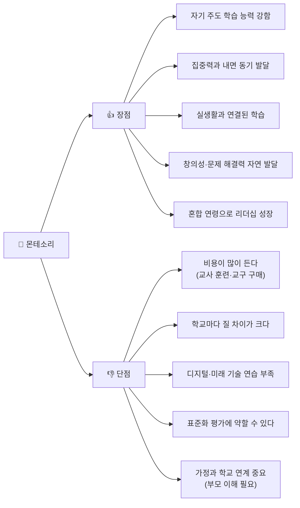
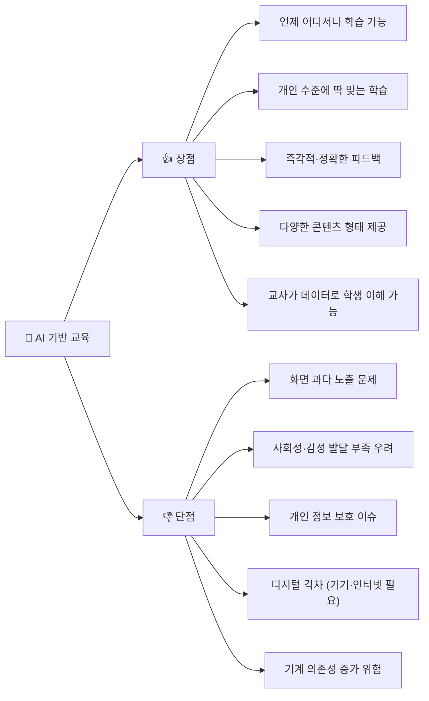
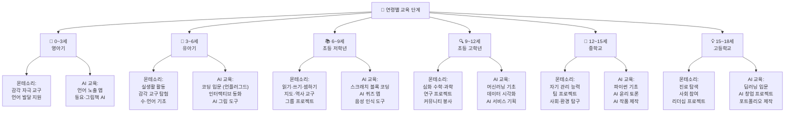
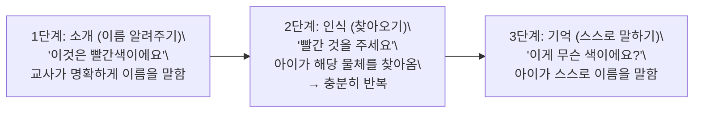
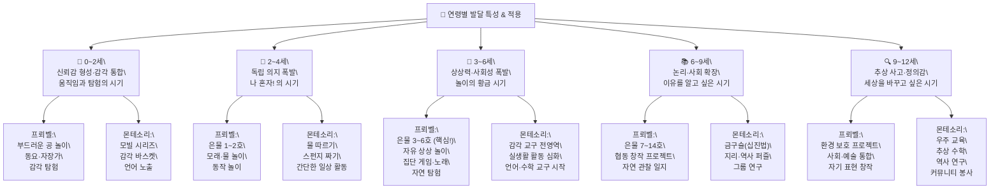

# 🎓 몬테소리 vs AI 기반 교육 완전 비교 가이드

> 작성일: 2026-04-06
> 대상: 유아 ~ 초·중·고등학생 교육자, AI 교육 콘텐츠 개발자
> 목적: 두 교육 철학의 차이를 이해하고 현장에 균형 있게 적용하기

---

## 📌 목차

```
1. 한눈에 보는 비교 (개요)
2. 역사와 탄생 배경
3. 교육 철학 비교
4. 교육 방식 비교
5. 장점과 단점
6. 연령별 · 단계별 적용 방법
7. 통합 적용 모델 (몬테소리 + AI)
8. 핵심 요약 정리
```

---

## 1️⃣ 한눈에 보는 비교 (개요)

```mermaid
mi<br> dmap
  root((교육 비교))
    몬테소리
      탄생: 1907년 이탈리아
      핵심: 아이가 스스로 배운다
      도구: 손으로 만지는 교구
      공간: 준비된 환경
      교사: 안내자·관찰자
    AI 기반 교육
      탄생: 2010년대 이후
      핵심: 맞춤형 개인 학습
      도구: 디지털·AI 소프트웨어
      공간: 온·오프라인 혼합
      교사: 설계자·코치
```

---

## 2️⃣ 역사와 탄생 배경

### 🏛️ 타임라인 비교

```mermaid
timeli<br> e
    title 두 교육 방법의 역사
    1870 : 마리아 몬테소리 탄생 (이탈리아)
    1907 : 로마 빈민가 아이들을 위한 첫 번째 어린이집 Casa dei Bambi<br> i 설립
    1929 : 국제몬테소리협회(AMI) 창립
    1950 : 전 세계 몬테소리 학교 확산
    1980 : 컴퓨터 보조 학습(CAL) 등장 - AI 교육의 씨앗
    2010 : 머신러닝 기반 개인 맞춤 학습 플랫폼 등장
    2016 : 알파고 이후 AI 교육 열풍 본격화
    2022 : ChatGPT 등장으로 AI 교육 대혁신
    2026 : AI 튜터·코치 일상화
```

---

### 📊 역사 비교표

| 구분 | 몬테소리 | AI 기반 교육 |
|------|---------|-------------|
| **시작 연도** | 1907년 | 2010년대 이후 |
| **만든 사람** | 마리아 몬테소리 (의사·교육학자) | 다양한 연구자·기업들 |
| **탄생 배경** | 로마 빈민가 아이들을 돕기 위해 | 인터넷·컴퓨터의 발전과 함께 |
| **처음 대상** | 3~6세 유아 | 모든 연령 (처음엔 대학생) |
| **퍼진 방식** | 교사 교육과 철학 공유 | 앱·플랫폼·정책으로 빠르게 확산 |
| **현재 규모** | 전 세계 2만개 이상 학교 | 수억 명이 사용하는 플랫폼들 |

---

## 3️⃣ 교육 철학 비교

```mermaid
flowchart LR
    subgraph M["🌱 몬테소리 철학"]
        directio<br>  TB
        M1["아이는 태어날 때부터 <br> 배움의 능력이 있다"]
        M2["스스로 선택하고 <br> 탐험할 때 가장 잘 배운다"]
        M3["손으로 만지고 <br> 몸으로 느끼는 경험이 중요"]
        M4["실수는 잘못이 아니라 <br> 배움의 기회다"]
        M1 --> M2 --> M3 --> M4
    e<br> d

    subgraph A["🤖 AI 기반 교육 철학"]
        directio<br>  TB
        A1["모든 아이는 다른 속도와 <br> 방식으로 배운다"]
        A2["데이터로 나만의 학습 경로를 <br> 찾을 수 있다"]
        A3["즉각적인 피드백으로 <br> 더 빠르게 성장한다"]
        A4["디지털 도구로 창의력과 <br> 문제 해결력을 키운다"]
        A1 --> A2 --> A3 --> A4
    e<br> d

    M4 -.->|"공통점: 개인 맞춤 학습"| A1
```

---

### 📊 철학 핵심 키워드 비교

| 철학 요소 | 몬테소리 | AI 기반 교육 |
|---------|---------|------------|
| **아이 역할** | 능동적 탐험가 | 능동적 학습자 |
| **교사 역할** | 관찰자·안내자 | 설계자·멘토 |
| **학습 속도** | 아이 스스로 결정 | AI가 분석해 조절 |
| **평가 방식** | 관찰과 포트폴리오 | 데이터와 진단 테스트 |
| **환경** | 물리적 준비 환경 | 디지털 맞춤 환경 |
| **핵심 가치** | 자립심, 집중력, 내면 동기 | 효율성, 개인화, 접근성 |

---

## 4️⃣ 교육 방식 비교

```mermaid
flowchart TB
    subgraph MO<br> T["🌿 몬테소리 교육 방식"]
        MA["준비된 환경 구성 <br> (교구·재료 배치)"]
        MB["자유 선택 시간 제공 <br> (3시간 작업 사이클)"]
        MC["교사의 조용한 관찰 <br> (직접 개입 최소화)"]
        MD["또래와 협력·대화 <br> (혼합 연령 그룹)"]
        ME["손으로 하는 활동 <br> (감각 교구 사용)"]
        MA --> MB --> MC --> MD --> ME
    e<br> d

    subgraph AIED["💻 AI 기반 교육 방식"]
        AA["학습자 데이터 수집 <br> (수준·관심사 파악)"]
        AB["AI가 학습 경로 설계 <br> (맞춤형 커리큘럼)"]
        AC["즉각적 피드백 제공 <br> (정답·오답 즉시 확인)"]
        AD["인터랙티브 콘텐츠 <br> (영상·게임·시뮬레이션)"]
        AE["학습 결과 분석 <br> (교사에게 리포트 제공)"]
        AA --> AB --> AC --> AD --> AE
    e<br> d
```

---

### 📊 교육 방식 상세 비교표

| 비교 항목 | 몬테소리 | AI 기반 교육 |
|---------|---------|------------|
| **수업 시간** | 긴 자유 탐험 시간 (3시간 블록) | 짧고 집중적인 유닛 |
| **학습 재료** | 나무·천·금속 등 물리적 교구 | 태블릿·컴퓨터·앱 |
| **그룹 구성** | 혼합 연령 (3살 차이) | 주로 같은 수준별 |
| **교사 개입** | 최소한 (필요할 때만) | 데이터 기반 개입 |
| **피드백 시기** | 아이가 스스로 발견 | 즉각적 자동 피드백 |
| **평가 방법** | 관찰 기록, 포트폴리오 | 진단 테스트, 대시보드 |
| **창의성 방식** | 자유로운 탐험으로 자연 발생 | 프로젝트·코딩으로 훈련 |
| **사회성** | 함께하는 실제 경험 중심 | 온라인 협업 도구 활용 |

---

## 5️⃣ 장점과 단점

### ✅ 몬테소리 장단점



---

### ✅ AI 기반 교육 장단점



---

### 📊 장단점 종합 비교표

| 비교 항목 | 몬테소리 | AI 기반 교육 |
|---------|---------|------------|
| **자기 주도성** | ⭐⭐⭐⭐⭐ 매우 강함 | ⭐⭐⭐ 보통 (안내받음) |
| **개인화 학습** | ⭐⭐⭐⭐ 강함 (관찰 기반) | ⭐⭐⭐⭐⭐ 매우 강함 (데이터 기반) |
| **사회성 발달** | ⭐⭐⭐⭐⭐ 매우 강함 | ⭐⭐⭐ 보통 |
| **접근성 (비용)** | ⭐⭐ 낮음 (비쌈) | ⭐⭐⭐⭐⭐ 매우 높음 |
| **미래 기술 준비** | ⭐⭐ 낮음 | ⭐⭐⭐⭐⭐ 매우 강함 |
| **신체 활동** | ⭐⭐⭐⭐⭐ 매우 강함 | ⭐⭐ 낮음 |
| **창의성** | ⭐⭐⭐⭐⭐ 매우 강함 | ⭐⭐⭐⭐ 강함 |
| **집중력 훈련** | ⭐⭐⭐⭐⭐ 매우 강함 | ⭐⭐⭐ 보통 |

---

## 6️⃣ 연령별 · 단계별 적용 방법


---


---
---

# 🌳 프뢰벨 vs 몬테소리 심층 비교 가이드
## — 놀이·철학·교구·수업·방문·AI 역량 완전 분석 —

> 추가 작성일: 2026-04-06
> 핵심 질문: "놀이와 교육, 어떻게 다르게 바라보는가?"
> 적용 범위: 유아~초등 교육 현장 · 방문 수업 · 가정 연계 · AI 융합 교육

---

## 📌 목차

```
A. 두 사람은 누구인가? (인물 심층 비교)
B. 교육 철학 심층 비교
C. 프뢰벨 은물(Gabe<br> ) 전체 체계
D. 몬테소리 교구 5영역 전체 체계
E. 놀이 이론 심층 비교
F. 교사의 역할·언어·태도 비교
G. 하루 일과 & 수업 구조 비교
H. 수업 형태별 심층 비교 (기관·방문·가정)
I. 연령별 발달 특성과 단계별 적용
J. 관찰과 평가 방법 비교
K. 부모 교육 및 가정 연계 비교
L. 장단점 심층 비교
M. AI 시대, 두 철학에서 배우는 미래 교육 역량
<br> . 교육자를 위한 통합 적용 가이드
```

---

## A. 두 사람은 누구인가?

프뢰벨과 몬테소리는 약 90년의 시간 차이를 두고 태어났지만, 두 사람 모두 "아이를 제대로 이해하면 교육이 달라진다"는 믿음에서 출발했습니다. 프뢰벨은 독일의 작은 마을에서 어머니를 일찍 여의고 홀로 숲과 들판 속에서 자랐습니다. 자연이 그의 첫 번째 선생님이었던 셈입니다. 반면 몬테소리는 이탈리아에서 여성 최초로 의대를 졸업한 의사였습니다. 그녀는 병원에서 장애 아동들을 치료하면서 "이 아이들이 왜 이렇게 빠르게 배울까?"라는 질문을 스스로 던졌고, 그 답을 찾아가는 과정에서 몬테소리 교육이 탄생했습니다.

두 사람의 배경이 다른 만큼, 교육을 바라보는 시선도 달랐습니다. 프뢰벨은 철학자처럼 "아이 안에 신성이 있다"고 믿었고, 몬테소리는 과학자처럼 "아이를 관찰하면 답이 나온다"고 믿었습니다.

### 🗺️ 생애 타임라인

```mermaid
timeli<br> e
    title 프뢰벨 & 몬테소리 생애 비교
    1782 : 프리드리히 프뢰벨 탄생 (독일 오버바이스바흐)
           어머니를 일찍 여의고 자연 속에서 홀로 자람
    1805 : 페스탈로치 학교 방문 → 아동 중심 교육 철학 흡수
    1837 : 세계 최초 유치원 Ki<br> dergarte<br>  창설 (Bad Bla<br> ke<br> burg)
    1844 : 은물(Gabe<br> ) 교구 체계 완성·출판
    1852 : 프뢰벨 사망 (70세)
    1870 : 마리아 몬테소리 탄생 (이탈리아 키아라발레)
    1896 : 이탈리아 최초 여성 의사 졸업
    1907 : 로마 빈민가 Casa dei Bambi<br> i 설립
    1929 : 국제몬테소리협회(AMI) 창립
    1952 : 몬테소리 사망 (81세)
```

---

### 📊 인물 심층 비교표

| 비교 항목 | 프뢰벨 | 몬테소리 |
|---------|-------|---------|
| **출생·국가** | 1782년, 독일 | 1870년, 이탈리아 |
| **어린 시절** | 어머니 일찍 여읨 → 자연이 어머니 역할 | 수학·과학에 뛰어난 소녀 |
| **직업 배경** | 측량사 → 교사 → 교육 철학자 | 의사 → 심리학자 → 교육학자 |
| **영향받은 스승** | 루소, 페스탈로치 (자연주의 교육) | 세강, 이타르 (장애아 감각 훈련) |
| **핵심 비유** | "아이는 씨앗, 교육은 햇빛과 물" | "아이는 건축가, 스스로 자신을 짓는다" |
| **교육 대상** | 3~7세 유아 중심 | 0~18세 전 연령 |

---

### 🌐 두 사람에게 영향 준 철학 계보

두 사람의 교육 철학은 갑자기 생겨난 것이 아닙니다. 마치 강이 여러 샘에서 물을 모아 흐르듯, 앞선 사상가들의 생각이 모여 각자의 교육법이 완성됐습니다. 특히 루소의 "아이는 원래 선하다"는 생각은 두 사람 모두에게 깊은 영향을 주었습니다.

```mermaid
flowchart TB
    ROUSSEAU["💭 루소 (1712~1778)\<br> 자연으로 돌아가라\<br> 아이는 원래 선하다"]
    PESTALOZZI["💭 페스탈로치 (1746~1827)\<br> 머리·가슴·손의 교육\<br> 빈민 아동 교육"]
    HEGEL["💭 헤겔 (1770~1831)\<br> 통일의 원리\<br> 반대되는 것의 연결"]
    SEGUI<br> ["💭 세강·이타르 (19세기)\<br> 장애아 감각 훈련\<br> 개별화 교육 교구"]

    ROUSSEAU --> PESTALOZZI
    PESTALOZZI --> FROEBEL["🌳 프뢰벨\<br> 놀이·은물·유치원"]
    HEGEL --> FROEBEL
    SEGUI<br>  --> MO<br> TESSORI["🌱 몬테소리\<br> 교구·준비된 환경"]
    PESTALOZZI --> MO<br> TESSORI

    FROEBEL --> TODAY["🎓 현대 유아 교육"]
    MO<br> TESSORI --> TODAY
```

---

## B. 교육 철학 심층 비교

### 🔍 세계를 바라보는 방식의 차이

프뢰벨의 철학 핵심은 **"통일(Ei<br> heit)"**입니다. 그는 신·자연·인간이 모두 하나로 연결되어 있다고 믿었습니다. 씨앗 하나 안에 나무 전체가 들어있듯, 아이 안에도 이미 완전한 인간이 들어있다는 것입니다. 교육의 역할은 그 씨앗이 자연스럽게 피어날 수 있도록 햇빛과 물을 주는 것, 즉 올바른 환경과 놀이를 제공하는 것입니다.

몬테소리의 출발점은 전혀 달랐습니다. 의사였던 그녀는 로마의 가난한 동네 아이들을 관찰하면서 "아이들이 강요받지 않아도 스스로 배운다"는 사실을 발견했습니다. 그녀는 이것을 **"흡수하는 정신(Absorbe<br> t Mi<br> d)"**이라고 불렀습니다. 0~6세 아이는 스펀지처럼 주변 환경을 통째로 흡수한다는 뜻입니다. 따라서 교육의 핵심은 좋은 말이나 훈육이 아니라, 아이가 스스로 탐험할 수 있는 **준비된 환경**을 만들어주는 것입니다.

```mermaid
flowchart LR
    subgraph FP["🌳 프뢰벨의 세계관"]
        directio<br>  TB
        FP1["통일의 원리\<br> 신·자연·인간은 하나다"]
        FP2["내면 활동의 법칙\<br> 아이 안의 신성이 밖으로 나온다"]
        FP3["놀이 = 가장 높은 수준의 활동\<br> (억지로 가르치지 않는다)"]
        FP4["자기 표현\<br> 만들고 창조함으로써 성장한다"]
        FP1 --> FP2 --> FP3 --> FP4
    e<br> d

    subgraph MP["🌱 몬테소리의 세계관"]
        directio<br>  TB
        MP1["흡수하는 정신\<br> 0~6세는 환경을 통째로 흡수한다"]
        MP2["민감기\<br> 특정 시기에 특정 능력이 폭발적으로 발달"]
        MP3["준비된 환경\<br> 아이에게 맞는 공간이 스스로 배우게 한다"]
        MP4["정규화\<br> 충분히 집중할 때 아이는 가장 건강하다"]
        MP1 --> MP2 --> MP3 --> MP4
    e<br> d
```

---

### 📊 철학 핵심 개념 비교표

| 개념 | 프뢰벨 | 몬테소리 |
|-----|-------|---------|
| **아이의 본질** | 신성한 씨앗 (내면에 성장의 힘이 있다) | 자기 건설자 (스스로 자신을 만든다) |
| **성장의 원동력** | 내면의 힘이 놀이를 통해 밖으로 나옴 | 민감기에 환경을 통해 스스로 발달 |
| **교육의 목적** | 내면의 신성을 자유롭게 꽃피우는 것 | 독립적이고 자유로운 인간 형성 |
| **놀이의 위치** | 배움의 전부 (가장 높은 활동) | 배움의 수단 (교구 활동 = 일) |
| **자연의 역할** | 교육 철학의 중심 | 탐구·관찰의 대상 |
| **공동체 가치** | 함께할 때 더 잘 성장 | 개인의 독립이 먼저, 협력은 자연 발생 |

---

### 🕰️ 몬테소리 민감기(Se<br> sitive Period) 상세

민감기란 아이가 특정 능력을 가장 쉽고 빠르게 흡수하는 '황금 시기'입니다. 예를 들어 3~4세 아이가 글씨 쓰기에 갑자기 집착하는 시기가 있는데, 이때 사포 글자 교구를 충분히 제공하면 쓰기 능력이 놀랍도록 빠르게 발달합니다. 이 시기를 놓치면 나중에 배울 수는 있지만 훨씬 더 많은 노력이 필요합니다. 프뢰벨은 이 개념을 명확히 정의하지 않았지만, 몬테소리는 과학적 관찰을 통해 8가지 민감기를 체계화했습니다.

| 민감기 | 시기 | 아이에게 나타나는 신호 | 교육적 대응 |
|------|-----|------------------|----------|
| **질서의 민감기** | 0~3세 | 물건이 제자리에 없으면 울거나 불안해함 | 환경 일관성 유지, 항상 같은 자리 |
| **언어의 민감기** | 0~6세 | 끊임없이 질문하고 새 단어를 흡수 | 풍부한 어휘 환경, 정확한 말 사용 |
| **감각의 민감기** | 0~5세 | 모든 것을 만지고 냄새 맡고 탐험 | 다양한 질감·소리·색 교구 제공 |
| **소근육 민감기** | 1.5~4세 | 단추·지퍼·끈을 계속 만지고 조작 | 드레싱 프레임, 집게·핀셋 활동 |
| **사회성 민감기** | 2.5~6세 | 친구에게 갑자기 강한 관심 | 혼합 연령 환경, 함께하는 활동 |
| **쓰기의 민감기** | 3.5~4.5세 | 글씨 쓰기에 강한 흥미, 낙서 증가 | 모래판 글씨, 이동 알파벳 |
| **읽기의 민감기** | 4.5~5.5세 | 간판·책 글자를 읽으려 시도 | 파닉스 카드, 읽기 교구 |
| **수학의 민감기** | 4~6세 | 수 세기·비교하기에 집착 | 수 막대, 방추 상자 |

---

## C. 프뢰벨 은물(Gabe<br> ) 전체 체계

### 🎁 은물이란 무엇인가?

'은물(Gabe<br> )'은 독일어로 **"선물"**이라는 뜻입니다. 프뢰벨은 이 교구들을 "신이 아이에게 주는 선물"이라고 표현했습니다. 단순한 장난감이 아니라, 아이가 세상의 법칙(형태·수·크기·관계)을 손으로 만지면서 자연스럽게 이해하도록 설계된 체계적인 교구 세트입니다.

은물의 가장 중요한 특징은 **단순함에서 복잡함으로, 전체에서 부분으로** 나아간다는 것입니다. 1호는 부드러운 공 하나지만, 6호가 되면 36개의 블록으로 복잡한 건물을 지을 수 있습니다. 마치 언어를 배울 때 자음·모음 하나에서 시작해 문장·이야기로 발전하는 것처럼, 은물도 같은 원리로 설계되어 있습니다.

또한 각 은물에는 **세 가지 놀이 방식**이 있습니다.
- **형태놀이**: 실제 사물을 표현 (블록으로 집·기차 만들기)
- **지식놀이**: 수학·기하 개념 탐험 (반으로 나누면 몇 개?)
- **아름다움놀이**: 자유로운 패턴·디자인 창조

```mermaid
flowchart TB
    GABE<br> ["🎁 은물(Gabe<br> ) 전체 체계\<br> 단순 → 복잡 / 입체(3D) → 평면(2D)"]

    GABE<br>  --> G3D["📦 3D 입체 시리즈\<br> (은물 1~6호)"]
    GABE<br>  --> G2D["📄 2D 평면 시리즈\<br> (은물 7~20호)"]

    G3D --> G1["1호: 6색 털실 공\<br> 가장 기초 — 색·움직임·물체 영속성"]
    G3D --> G2["2호: 나무 공·원기둥·정육면체 3종\<br> 기본 형태 3가지를 손으로 비교"]
    G3D --> G3["3호: 정육면체 → 8조각 블록\<br> 전체가 부분으로 나뉜다는 개념"]
    G3D --> G4["4호: 직육면체 → 8조각\<br> 납작한 벽돌 형태, 건축 놀이"]
    G3D --> G5["5호: 27개 정육면체 세트\<br> (반쪽·모서리 조각 포함) 복잡한 구성"]
    G3D --> G6["6호: 36개 직육면체 블록\<br> 마을·성·다리 등 대형 건축"]

    G2D --> G7["7호: 색 나무 타일\<br> (사각·삼각·원) 패턴·모자이크"]
    G2D --> G8["8호: 나무 막대 (길이별)\<br> 선으로 그림 만들기"]
    G2D --> G9["9호: 점(콩·씨앗)\<br> 점으로 수 세기·그림"]
    G2D --> G10["10~14호: 접기·짜기·바느질·오리기\<br> 손 협응력·2D→3D 변환"]
    G2D --> G15["15~20호: 모래·점토·콩·나무 막대 구조물\<br> 재료 탐험·조각·건축"]
```

---

### 📊 은물 상세 활동표

| 은물 | 교구 내용 | 연령 | 3가지 놀이 예시 | 발달 영역 |
|-----|---------|-----|-------------|---------|
| **1호** | 6색 털실 공 | 0~2세 | 색 말하기, 굴리기, 잡기 | 색 인식, 물체 영속성, 눈-손 협응 |
| **2호** | 나무 공·원기둥·정육면체 | 1~3세 | 굴리는 것/안 굴리는 것 분류, 쌓기 | 형태 인식, 비교, 물리 개념 |
| **3호** | 정육면체 8조각 | 2~4세 | 집 만들기, 반으로 나누기, 패턴 만들기 | 공간감, 분수 기초, 대칭 |
| **4호** | 납작 직육면체 8조각 | 3~5세 | 다리 만들기, 긴 것/짧은 것 비교, 격자 패턴 | 비율 감각, 균형 |
| **5호** | 27개 정육면체 (반·모서리 포함) | 4~6세 | 계단 탑, 분수 탐험, 대칭 건물 | 기하학, 덧셈·뺄셈 기초 |
| **6호** | 36개 직육면체 세트 | 4~7세 | 마을 만들기, 대칭 성, 패턴 건축 | 건축적 사고, 창의성 |
| **7호** | 색 나무 타일 (사각·삼각·원) | 4~8세 | 태양 모양, 집 모자이크, 규칙 패턴 | 도형, 색 혼합, 패턴 인식 |
| **8호** | 나무 막대 (길이별) | 4~8세 | 글자 만들기, 집 윤곽, 길이 비교 | 측정, 선 개념, 문자 기초 |
| **9호** | 콩·씨앗 점 재료 | 4~8세 | 동물 점 그림, 수 배열, 별자리 | 수 개념, 창의적 표현 |
| **10호** | 종이 접기 | 5~9세 | 새·배·꽃 접기 | 공간 사고, 기하학적 변환 |
| **11호** | 종이 짜기 (직조) | 5~9세 | 색 체크무늬, 격자 패턴 | 협응력, 수학적 패턴 |
| **12~14호** | 바느질·오리기·그리기 | 5~9세 | 바느질 그림, 콜라주, 점선 그리기 | 소근육, 창의성 |
| **15~20호** | 완두콩+막대 구조물, 점토, 모래 | 6~10세 | 3D 다리, 조각 만들기, 모래 조형 | 공학적 사고, 촉각 탐험 |

---

## D. 몬테소리 교구 5영역 전체 체계

### 📚 5영역은 왜 이렇게 구성됐나?

몬테소리 교구는 무작위로 만들어진 것이 아닙니다. 아이가 세상을 이해하는 순서, 즉 **"몸(감각) → 일상 → 수 → 언어 → 세계"** 라는 흐름을 따라 설계되어 있습니다. 모든 교구는 세 가지 원칙을 따릅니다. 첫째, **구체적인 것에서 추상적인 것으로** (손으로 만지다가 나중에 머릿속으로 계산). 둘째, **자기 교정** (스스로 실수를 발견할 수 있도록 설계). 셋째, **한 번에 하나의 개념** (교구마다 하나의 핵심 개념만 가르침).

예를 들어 분홍탑은 크기만 다르고 나머지(재료·색·무게 비율)는 모두 같습니다. 덕분에 아이는 크기 개념에만 집중할 수 있습니다. 이것이 "고립된 개념(Isolatio<br>  of Co<br> cept)"이라고 부르는 몬테소리 교구 설계 원칙입니다.

```mermaid
mi<br> dmap
  root((몬테소리 교구 5영역))
    ① 일상생활 영역
      기본 생활 기술
        단추·지퍼·끈 프레임
        자물쇠와 열쇠
        신발끈 묶기
      음식 준비
        과일 껍질 벗기기
        주스 짜기
        빵 자르기
      환경 관리
        걸레질·청소·빗질
        꽃꽂이
        식물 물주기
    ② 감각 영역
      시각 (크기·색·형태)
        분홍탑 (크기 10단계)
        갈색 계단 (두께 10단계)
        색 원기둥
        색판 3상자
      촉각·온각
        촉감판
        직물 상자
        온도 병
      청각
        소리 상자
        몬테소리 벨 교구
    ③ 수학 영역
      수 소개
        수 막대 (1~10)
        사포 숫자
        방추 상자
      십진법
        금구슬 교구
        스탬프 게임
        비드 체인
      사칙연산
        덧셈·뺄셈판
        곱셈판·나눗셈판
        분수 교구
    ④ 언어 영역
      구어 발달
        그림·사물 카드
        이야기 순서 카드
      쓰기 준비
        모래판 글씨
        금속 인세츠
        이동식 알파벳
      읽기
        음소 카드
        읽기 분석 카드
    ⑤ 문화 영역
      지리
        세계 대륙 퍼즐
        국기 카드
      과학·생물
        동식물 분류 카드
        생물 표본
      역사
        시간 선 (Timeli<br> e)
        문명 카드
```

---

### 📊 몬테소리 5영역 상세 목적 비교

| 영역 | 핵심 목적 | 대표 교구 | 연령 | 왜 이 순서인가? |
|-----|---------|---------|-----|-------------|
| **① 일상생활** | 독립심·집중력·소근육 훈련 | 드레싱 프레임, 빵 자르기 | 2~6세 | 가장 먼저 — 아이가 자기 몸을 돌보는 힘이 모든 학습의 기초 |
| **② 감각** | 감각 정제·분류 능력·비교 사고 | 분홍탑, 색 원기둥, 소리 상자 | 2~5세 | 두 번째 — 감각이 정확해야 수·언어 개념도 정확해짐 |
| **③ 수학** | 수 개념·연산·추상적 사고 | 금구슬, 스탬프 게임 | 3~9세 | 세 번째 — 감각 교구에서 훈련한 '비교·분류' 능력이 수학으로 연결 |
| **④ 언어** | 말하기·쓰기·읽기 | 사포 글자, 이동 알파벳 | 3~7세 | 네 번째 — 쓰기 민감기(3.5세)와 읽기 민감기(4.5세)를 따름 |
| **⑤ 문화** | 세계 이해·탐구심·시민 의식 | 대륙 퍼즐, 생물 카드 | 4~9세 | 마지막 — 자기 자신을 알고 나서 세상으로 관심이 확장됨 |

---

### 🔄 몬테소리 3단계 레슨법

3단계 레슨법은 몬테소리 교사가 새로운 개념을 아이에게 소개할 때 사용하는 방법입니다. 핵심은 **아이가 충분히 이해한 후에만 다음 단계로 넘어간다**는 것입니다. 교사가 3단계를 서두르면 아이는 그냥 따라 말하는 것처럼 보이지만 실제로는 이해하지 못한 채 넘어갑니다. 특히 2단계에서 충분히 놀고 반복해야 3단계에서 아이가 자신감 있게 대답할 수 있습니다.



> 💡 **주의사항**: 3단계에서 아이가 틀리게 대답하면, "아니야"라고 하지 않고 조용히 1단계로 돌아갑니다. 틀림을 지적하지 않는 것이 몬테소리 원칙입니다.


## E. 놀이 이론 심층 비교

### 🎮 놀이를 바라보는 근본적 차이

프뢰벨과 몬테소리의 가장 큰 차이점 중 하나가 바로 **"놀이"를 어떻게 보느냐**입니다. 프뢰벨은 "놀이는 아이의 가장 높은 수준의 활동이다"라고 말했습니다. 아이가 블록으로 성을 쌓고, 소꿉놀이를 하고, 역할 놀이를 할 때 — 그것 자체가 완전한 배움이라는 뜻입니다. 교사는 그 놀이를 방해하는 것이 아니라 함께 참여하며 더 풍성하게 만들어주는 역할을 합니다.

반면 몬테소리는 '일(Work)'이라는 단어를 즐겨 사용했습니다. 아이가 교구를 가져다가 혼자 집중해서 탐험하는 활동을 '작업'이라고 불렀습니다. 이것이 아이에게 가장 의미 있는 놀이라는 것입니다. 따라서 몬테소리 교실에서는 자유로운 상상 놀이보다 교구를 통한 목적 있는 활동이 중심이 됩니다. 나무 블록이 기차나 성이 되는 상상 놀이는 몬테소리 철학에서는 제한적으로 다루어집니다.

이 차이는 교실 분위기에서도 고스란히 드러납니다. 프뢰벨 유치원에서는 노래 소리, 웃음 소리, 블록 쌓는 소리가 들립니다. 몬테소리 교실에서는 조용하지만 집중하는 아이들이 각자의 작업에 몰두해 있습니다. 어느 쪽이 맞고 틀린 것이 아니라, **다른 방식으로 성장을 돕는 것**입니다.

```mermaid
flowchart TB
    subgraph FPlay["🌳 프뢰벨의 놀이 철학"]
        FP1["놀이 = 아이의 삶 그 자체\<br> 가장 순수한 정신 활동"]
        FP2["자유 상상 놀이 적극 권장\<br> 블록이 기차도 되고 성도 된다"]
        FP3["집단 놀이\<br> 함께 놀 때 사회성이 자란다"]
        FP4["노래·율동·게임\<br> 몸·마음·정신이 하나로 통합된다"]
        FP1 --> FP2
        FP1 --> FP3 --> FP4
    e<br> d

    subgraph MPlay["🌱 몬테소리의 놀이 철학"]
        MP1["일(Work) = 아이의 놀이\<br> 놀이와 일을 구분하지 않는다"]
        MP2["목적 있는 활동\<br> 교구를 통해 개념이 발달한다"]
        MP3["개인 집중 작업\<br> 방해받지 않을 때 가장 깊이 배운다"]
        MP4["자기 교정 교구\<br> 스스로 실수를 발견하고 고친다"]
        MP1 --> MP2
        MP1 --> MP3 --> MP4
    e<br> d

    DIFF["⚖️ 핵심 차이\<br> 프뢰벨: 놀이 자체가 목적\<br> 몬테소리: 놀이가 발달의 수단"]
    FPlay --- DIFF
    MPlay --- DIFF
```

---

### 📊 놀이 유형별 상세 비교

각 놀이 유형이 두 방법에서 어떻게 다루어지는지 구체적으로 살펴보면, 교실 현장에서 어떤 활동을 강조해야 할지 명확해집니다. 예를 들어 '역할 놀이'를 보면, 프뢰벨은 아이가 의사 놀이를 하는 것을 적극 권장하지만, 몬테소리는 실제 붕대 감는 방법을 가르치는 것을 선호합니다. 같은 목표(사회 역할 이해)를 다른 방법으로 접근하는 것입니다.

| 놀이 유형 | 프뢰벨 관점과 방법 | 몬테소리 관점과 방법 | 현장 예시 |
|---------|----------------|-----------------|---------|
| **자유 상상 놀이** | 핵심 활동으로 매일 충분히 제공 | 제한적, 실물 활동 선호 | 소꿉놀이 vs 실제 요리 활동 |
| **역할 놀이** | 사회성 발달에 매우 중요 | 실제 생활 활동으로 대체 | 의사 놀이 vs 실제 붕대 감기 |
| **구성 놀이** | 은물로 핵심 활동 | 교구로 핵심 활동 | 은물 블록 쌓기 vs 분홍탑 쌓기 |
| **집단 게임** | 매일 필수 활동 | 보조적·선택적 | 달팽이 집 게임 vs 침묵 게임 |
| **신체 놀이** | 율동·야외 놀이 중심 | 자유로운 움직임 허용 | 줄서기 게임 vs 리듬 걷기 |
| **음악·율동** | 매일 필수, 교육의 핵심 | 선택적, 짧게 | 프뢰벨 노래 vs 몬테소리 종소리 |
| **자연 놀이** | 철학의 핵심, 매일 야외 | 관찰·탐구 목적으로 | 자연물 창작 vs 식물 관찰 일지 |
| **실생활 활동** | 놀이처럼 즐겁게 포함 | 교육의 핵심 영역 | 함께 요리 vs 혼자 과일 자르기 |

---

### 🎵 프뢰벨 노래와 율동의 교육적 의미

프뢰벨이 노래와 율동을 교육의 핵심으로 삼은 데는 깊은 이유가 있습니다. 노래는 단순히 즐거운 활동이 아니라, **리듬(수학)·언어·신체·감성**을 동시에 발달시키는 통합 도구입니다. 아이가 노래를 부르면서 손뼉을 치고 율동을 할 때, 뇌의 여러 영역이 동시에 활성화됩니다. 특히 반복되는 노래는 언어 발달에 가장 효과적인 방법 중 하나입니다.

| 노래·게임 유형 | 구체적 예시 | 교육 목적 | 발달 효과 |
|------------|---------|---------|---------|
| **손 게임 노래** | 이 손은 아빠 손 / 주먹 쥐고 | 소근육·언어 동시 발달 | 집중력, 어휘 발달 |
| **원형 게임** | 달팽이 집 / 둥글게 둥글게 | 공간 인식, 규칙 이해 | 사회성, 방향 감각 |
| **자연 노래** | 봄이 왔어요 / 씨앗의 노래 | 계절·자연 감수성 | 환경 인식, 감성 발달 |
| **리듬 율동** | 곰 세 마리 / 머리 어깨 무릎 발 | 신체 협응력 | 음악성, 운동 발달 |
| **이야기 노래** | 은물을 주제로 한 이야기 노래 | 언어·상상력 통합 | 문해력, 창의성 |

---

## F. 교사의 역할·언어·태도 비교

### 👩‍🏫 교사는 어떤 사람이어야 하는가?

두 교육법에서 교사의 모습은 매우 다릅니다. 프뢰벨의 교사는 **"함께 노는 친구이자 안내자"**입니다. 아이들과 같이 앉아서 은물을 탐험하고, 노래를 리드하며, 이야기를 들려줍니다. 에너지가 넘치고 표현이 풍부해야 합니다. 아이들의 눈높이에서 함께 즐기는 것이 중요합니다.

몬테소리의 교사는 정반대입니다. **"조용한 관찰자이자 환경 준비자"**가 이상적인 몬테소리 교사입니다. 수업 중에는 뒤로 물러서서 아이들이 스스로 탐험하는 것을 방해하지 않습니다. "손 씻어", "이리 와"라는 말도 최소화합니다. 대신 수업 전에 교구를 완벽하게 준비하고, 수업 중에는 메모하며 관찰 기록을 남깁니다. 처음 이것을 배우는 교사들이 가장 어렵다고 말하는 것이 바로 "아무것도 하지 않고 기다리는 것"입니다.

```mermaid
flowchart LR
    subgraph FT["🌳 프뢰벨 교사의 하루"]
        FT1["수업 전\<br> 노래 연습\<br> 은물 세팅\<br> 이야기 준비"]
        FT2["수업 중\<br> 아이와 함께 참여\<br> 그룹 리드\<br> 이야기·노래 진행"]
        FT3["수업 후\<br> 창작물 기록\<br> 부모 피드백 카드\<br> 다음 활동 계획"]
        FT1 --> FT2 --> FT3
    e<br> d

    subgraph MT["🌱 몬테소리 교사의 하루"]
        MT1["수업 전\<br> 교구 점검·보충\<br> 환경 재배열\<br> 관찰 기록지 준비"]
        MT2["수업 중\<br> 뒤에서 조용히 관찰\<br> 개별 레슨 (필요시)\<br> 기록 작성"]
        MT3["수업 후\<br> 관찰 기록 정리\<br> 다음 레슨 계획\<br> 부모 리포트 준비"]
        MT1 --> MT2 --> MT3
    e<br> d
```

---

### 📊 교사 언어 & 행동 패턴 — 상황별 대화 비교

교사가 어떤 말을 하느냐는 아이의 발달에 직접적인 영향을 줍니다. 아래 표는 같은 상황에서 두 교육법의 교사가 어떻게 다르게 반응하는지 보여줍니다.

| 상황 | 프뢰벨 교사의 말·행동 | 몬테소리 교사의 말·행동 |
|-----|----------------|-----------------|
| **수업 시작** | "자, 다 모여요! 오늘 노래 먼저 불러볼까요~?" | (조용히 교구를 꺼내 혼자 작업을 시작하면 아이들이 자연스럽게 모여옴) |
| **아이가 막힐 때** | "이렇게 해봐! 같이 해보자, 잘 되지?" | (5분 이상 기다린 후) "내가 보여줄게요, 잘 봐요" → 시범 후 아이에게 넘김 |
| **실수했을 때** | "괜찮아! 다시 해보자~ 네가 잘 하고 있어!" | (침묵) 아이가 스스로 발견하도록 기다림. 교구가 자기 교정 기능을 함 |
| **잘 했을 때** | "와! 정말 멋진 집이야! 친구들한테 보여줄까?" | "네가 해냈네." (과한 칭찬 자제 — 내면 동기를 키우기 위해) |
| **전환 시간** | 노래나 리듬 박수로 자연스럽게 모임 | 조용한 개별 신호 또는 라인 타임으로 전환 |
| **아이가 싸울 때** | 함께 상황 파악, 이야기로 해결 유도 | "평화 테이블"로 이동 — 스스로 해결 연습 |
| **정리 시간** | "정리 노래 부르자~" (함께 정리) | (침묵) 아이 스스로 교구 제자리에 정리 — 습관화 |

---

### 📊 교사 준비·역량 비교

| 준비 항목 | 프뢰벨 교사 | 몬테소리 교사 |
|---------|-----------|------------|
| **필수 자격** | 프뢰벨 교육법 연수 (기관마다 다름) | AMI 또는 AMS 국제 자격증 (1~3년) |
| **핵심 역량** | 에너지, 음악성, 이야기 능력, 창의성 | 인내심, 관찰력, 절제, 과학적 기록력 |
| **수업 준비** | 노래·이야기 연습, 은물 세팅, 자연물 준비 | 교구 상태 점검, 관찰 기록 업데이트 |
| **수업 중 언어** | 풍부하고 감성적, 노래·이야기 많음 | 간결하고 정확, 필요할 때만 말함 |
| **개입 빈도** | 높음 (항상 함께 참여) | 매우 낮음 (관찰이 주 역할) |
| **가장 어려운 점** | 모든 아이를 그룹으로 이끌기 | "개입하지 않고 기다리기" |

---

## G. 하루 일과 & 수업 구조 비교

### 🌅 프뢰벨 유치원 하루 일과

프뢰벨 유치원의 하루는 **함께 모이는 것**으로 시작됩니다. 아이들이 등원하면 교사는 아침 노래로 하루를 열고, 오늘 할 활동을 이야기로 소개합니다. 활동은 짧고 다양하게 구성됩니다. 아이들의 집중력이 짧기 때문에 한 가지 활동에 30~40분 이상 머물지 않고, 은물 탐험 → 야외 활동 → 창작 활동처럼 성격이 다른 활동을 번갈아 제공합니다. 하루의 마무리도 함께 하는 것으로 끝납니다. 오늘 만든 것, 오늘 느낀 것을 나누고, 마무리 노래를 부르며 귀가합니다.

```mermaid
ga<br> tt
    title 프뢰벨 유치원 하루 일과 (3~6세)
    dateFormat HH:mm
    sectio<br>  오전
        등원·자유 놀이           : 09:00, 30m
        아침 모임 (노래·율동·이야기) : 09:30, 30m
        은물 탐험 시간            : 10:00, 40m
        간식·정리                 : 10:40, 20m
    sectio<br>  중간
        야외 자연 놀이·텃밭        : 11:00, 50m
        그룹 게임·율동             : 11:50, 30m
        점심·낮잠                  : 12:20, 80m
    sectio<br>  오후
        자유 창작 활동             : 13:40, 50m
        소그룹 은물 탐험           : 14:30, 40m
        마무리 모임·노래           : 15:10, 20m
        귀가                       : 15:30, 30m
```

---

### 🌿 몬테소리 유치원 하루 일과

몬테소리 교실의 가장 중요한 특징은 **3시간 비방해 작업 블록(3-hour u<br> i<br> terrupted work cycle)**입니다. 아이가 교구를 선택하고 집중하고 마무리하는 전체 사이클이 완성되려면 최소 3시간이 필요하다는 연구 결과에 기반한 것입니다. 오전 9시부터 12시까지 교사의 개입을 최소화한 채, 아이들이 자유롭게 작업을 선택하고 탐험합니다. 교사는 이 시간 동안 메모하며 관찰하거나, 필요한 아이에게만 개별 3단계 레슨을 제공합니다.

```mermaid
ga<br> tt
    title 몬테소리 유치원 하루 일과 (3~6세)
    dateFormat HH:mm
    sectio<br>  오전 작업 블록
        등원·준비·라인 타임         : 09:00, 20m
        자유 작업 블록 1            : 09:20, 60m
        교사 개인 레슨 (소수)       : 10:20, 30m
        자유 작업 블록 2            : 10:50, 40m
    sectio<br>  중간
        간식 (아이 스스로 준비)     : 11:30, 20m
        야외 활동·자연 관찰         : 11:50, 40m
        그룹 레슨 (선택적)          : 12:30, 20m
        점심·정리                   : 12:50, 60m
    sectio<br>  오후
        조용한 시간·낮잠            : 13:50, 60m
        자유 작업 블록 3            : 14:50, 40m
        정리·마무리 라인 타임       : 15:30, 20m
        귀가                        : 15:50, 10m
```

---

### 📊 수업 구조 핵심 비교

| 수업 요소 | 프뢰벨 | 몬테소리 |
|---------|-------|---------|
| **수업 시작** | 모임 노래·율동 (모두 함께) | 조용한 개인 전환 (각자) |
| **핵심 시간** | 짧은 활동 여러 개 (30~40분) | 3시간 비방해 작업 블록 |
| **누가 주도?** | 교사가 활동을 이끔 | 아이가 활동을 선택 |
| **소음 수준** | 활기차고 노래·대화 있음 | 조용하고 집중된 분위기 |
| **중심 활동** | 집단 활동 | 개인 작업 |
| **마무리** | 나눔·노래로 함께 끝냄 | 혼자 정리 후 조용히 마무리 |


## H. 수업 형태별 심층 비교

### 🏫 기관 수업 환경 구성

교실 환경을 보면 두 교육법의 철학이 한눈에 보입니다. 프뢰벨 유치원에서는 교실 중앙에 큰 원을 그려놓거나 카펫을 깔아두는 경우가 많습니다. 이 공간이 바로 아이들이 모여 노래하고 이야기를 나누는 '모임 공간'입니다. 교실 밖에는 반드시 텃밭이나 정원이 있어야 합니다. 자연은 프뢰벨 교육에서 교실만큼 중요한 학습 공간입니다.

몬테소리 교실은 마치 잘 정돈된 도서관처럼 보입니다. 낮은 오픈 선반들이 교실을 구분하고, 각 선반에는 교구들이 왼쪽에서 오른쪽, 위에서 아래로 순서대로 배열되어 있습니다. 아이 키에 딱 맞는 테이블과 의자, 바닥에 펼쳐서 작업할 수 있는 러그가 있습니다. 모든 것이 "아이가 스스로 할 수 있도록" 설계되어 있습니다.

```mermaid
flowchart TB
    subgraph FE["🌳 프뢰벨 기관 환경"]
        FE1["교실 중앙\<br> 원형 모임 공간\<br> (카펫·원 그려진 바닥)"]
        FE2["은물 탐험 테이블\<br> 교구 바구니 배치"]
        FE3["창작 코너\<br> 종이·가위·풀·크레파스"]
        FE4["필수: 야외 정원·텃밭\<br> 아이마다 작은 화단"]
        FE5["자연물 코너\<br> 나뭇가지·솔방울·돌 바구니"]
    e<br> d

    subgraph ME["🌱 몬테소리 기관 환경"]
        ME1["낮은 오픈 선반\<br> (영역별 교구 정렬)"]
        ME2["아이 키 맞는 테이블·의자\<br> (1인용·2인용 혼용)"]
        ME3["작업 러그\<br> (바닥 작업 공간)"]
        ME4["실생활 코너\<br> (청소·요리·물 따르기 도구)"]
        ME5["자연 관찰 코너\<br> (식물·동물·과학 재료)"]
    e<br> d
```

---

### 🏠 방문 수업 심층 매뉴얼

방문 수업은 기관 수업과 다른 도전이 있습니다. 교사가 아이의 익숙한 환경으로 들어가는 것이기 때문에, 아이는 더 편안하지만 동시에 집중하기 어려울 수도 있습니다. 또 부모가 같은 공간에 있어 아이가 교사보다 부모에게 더 의존하려는 경향도 생깁니다. 이런 상황을 잘 관리하는 것이 방문 수업 교사의 핵심 역량입니다.

프뢰벨 방식의 방문 수업은 상대적으로 준비가 간단합니다. 은물 1~3개 세트와 노래책, 자연물 주머니만 있으면 거의 모든 연령에 적용할 수 있습니다. 부모도 함께 참여하도록 초대하면 가정 연계 교육 효과도 얻을 수 있습니다.

몬테소리 방식의 방문 수업은 이동형 교구 케이스를 준비해야 합니다. 교구가 무겁고 부피가 있기 때문에 방문용으로 선별해야 합니다. 또한 몬테소리 교육에서 '준비된 환경'이 매우 중요하기 때문에, 방문할 공간에 작은 테이블과 조용한 환경을 미리 요청하는 것이 좋습니다.

```mermaid
flowchart TB
    VISIT["🏠 방문 수업 단계별 흐름"]

    VISIT --> PREP["1단계: 출발 전 준비"]
    PREP --> ARRIVE["2단계: 도착·환경 확인"]
    ARRIVE --> OPE<br> ["3단계: 수업 열기"]
    OPE<br>  --> MAI<br> ["4단계: 본 활동"]
    MAI<br>  --> CLOSE["5단계: 마무리"]
    CLOSE --> FOLLOW["6단계: 사후 관리"]

    PREP --> P_F["프뢰벨 준비물:\<br> 은물 2~3호, 자연물 주머니\<br> 노래책, 그림책 1~2권\<br> (가방 하나로 가능)"]
    PREP --> P_M["몬테소리 준비물:\<br> 이동형 교구 케이스\<br> 감각·실생활·언어 교구 2~3종씩\<br> 관찰 기록지"]

    ARRIVE --> A_ALL["도착 후 확인:\<br> 바닥 공간 1.5m² 이상?\<br> 소음 수준은 적당한가?\<br> 부모 위치 안내 (뒤에 앉기)"]

    OPE<br>  --> O_F["프뢰벨 시작:\<br> 인사 노래 (2~3분)\<br> 손 게임으로 집중 유도\<br> 오늘 이야기 예고"]
    OPE<br>  --> O_M["몬테소리 시작:\<br> 조용히 인사\<br> 교구 하나 꺼내 제시\<br> '오늘 이거 해볼래요?' 제안"]

    MAI<br>  --> M_F["프뢰벨 본 활동:\<br> ① 은물 소개 (이야기 연결)\<br> ② 함께 탐험 (교사 참여)\<br> ③ 자유 창작 시간\<br> ④ 자연물 활동 추가"]
    MAI<br>  --> M_M["몬테소리 본 활동:\<br> ① 교구 제시 (천천히 보여주기)\<br> ② 3단계 레슨\<br> ③ 아이 혼자 작업 (교사 관찰)\<br> ④ 아이가 다음 교구 선택"]

    CLOSE --> C_F["프뢰벨 마무리:\<br> 마무리 노래\<br> 오늘 만든 것 이야기 나누기\<br> 다음 시간 활동 예고"]
    CLOSE --> C_M["몬테소리 마무리:\<br> 교구 함께 정리\<br> '오늘 네가 해낸 것' 간단 언급\<br> 다음 활동 힌트"]

    FOLLOW --> F_ALL["사후 관리:\<br> 프뢰벨 → 가정 활동 카드 제공\<br> 몬테소리 → 관찰 기록지 부모 공유\<br> 다음 방문 계획 확정"]
```

---

### 📊 방문 수업 체크리스트

| 준비 항목 | 프뢰벨 방문 수업 | 몬테소리 방문 수업 |
|---------|--------------|----------------|
| **필수 교구** | 은물 2~3호, 자연물 주머니, 노래책 | 이동형 교구 케이스 (10~15개) |
| **선택 교구** | 그림책, 색 타일(7호), 종이·크레파스 | 수 막대, 사포 글자, 이동 알파벳 |
| **공간 요건** | 바닥 or 낮은 테이블, 1.5m² 이상 | 작은 테이블 1개, 조용한 환경 |
| **시간 배분** | 인사노래 5분 + 은물 25분 + 자유창작 15분 + 마무리 5분 | 환경 초대 5분 + 작업 35~45분 + 정리 5분 |
| **부모 역할** | 함께 참여 권장 | 관찰자 (뒤에서 조용히) |
| **화면 사용** | 없음 | 없음 |
| **기록 방법** | 사진 + 간단 메모 | 관찰 기록지 작성 |
| **연속성 관리** | 은물 번호 순서로 진행 | 아이 흥미에 따른 다음 교구 선정 |

---

### 📋 방문 수업 연령별 활동 가이드

| 연령 | 프뢰벨 방문 수업 핵심 활동 | 몬테소리 방문 수업 핵심 활동 |
|-----|-------------------|--------------------|
| **12~24개월** | 은물 1호(공 굴리기·색 탐험) + 동요 3곡 + 촉감 탐험 | 물 따르기, 스펀지 짜기, 소리 상자 탐험 |
| **2~3세** | 은물 2호(굴리기·쌓기) + 자연물 탐험 + 간단한 손 게임 | 숟가락 옮기기, 집게 활동, 색 원기둥 |
| **3~4세** | 은물 3호(블록 이야기 만들기) + 노래 2곡 + 색 탐험 | 분홍탑, 드레싱 프레임, 사포 숫자 |
| **4~5세** | 은물 4~5호 + 색 타일(7호) 패턴 + 간단한 접기 | 감각 교구 심화, 수 막대, 모래판 글씨 |
| **5~6세** | 은물 6호 + 종이 짜기(11호) + 이야기 창작 | 이동 알파벳, 방추 상자, 세계 지도 |
| **6~9세** | 은물 7~14호 + 자연 관찰 미션 + 협동 창작 | 금구슬 교구, 스탬프 게임, 읽기 분석 |

---

### 🏡 가정 연계 교육 비교

가정에서의 연계 교육은 두 방법 모두에서 중요하지만, 접근법이 다릅니다. 프뢰벨은 부모가 아이와 함께 노래하고 자연 속에서 탐험하는 것을 강조합니다. 특별한 교구 없이도 집 안에 있는 자연물(화분·나뭇잎·돌)과 노래책만으로 연계 활동이 가능합니다. 반면 몬테소리는 가정 환경 자체를 변환하도록 안내합니다. 아이 키에 맞는 낮은 선반, 아이가 혼자 쓸 수 있는 작은 컵과 접시, 아이 전용 빗자루 등을 구비하도록 권장합니다.

| 항목 | 프뢰벨 가정 연계 | 몬테소리 가정 연계 |
|-----|--------------|----------------|
| **환경 구성** | 자연물 바구니, 간단한 은물, 그림책 | 낮은 선반·아이 키 맞는 도구·정돈된 공간 |
| **부모 참여도** | 높음 (함께 노래·놀이 참여) | 중간 (기다리기, 기회 주기) |
| **주간 과제** | 자연 탐험 미션, 가족 노래 시간 | 실생활 과제 (요리 돕기, 청소 담당) |
| **책 읽기** | 이야기 들려주기 (감성·상상력) | 정확한 어휘의 사실적 그림책 |
| **부모 교육** | 은물 사용법 + 노래·이야기 알려주기 | 몬테소리 철학 이해 + "개입하지 않기" 훈련 |

---

## I. 연령별 발달 특성과 단계별 적용

### 👶 연령별로 왜 다르게 접근해야 하는가?

아이의 뇌와 몸은 나이에 따라 발달 방식이 완전히 다릅니다. 3세 아이에게 9세 아이처럼 앉아서 집중하기를 요구하면 오히려 역효과가 납니다. 반대로 9세 아이에게 1세 수준의 단순한 놀이만 제공하면 지루해서 발전이 없습니다. 따라서 좋은 교육은 반드시 **그 나이 아이의 발달 특성을 이해**하는 것에서 출발해야 합니다.



---

### 📊 연령별 상세 비교표

#### 🍼 0~2세 | 영아~걸음마기 — "세상을 처음 만나는 시기"

이 시기 아이들은 오감으로 세상을 탐험합니다. 모든 것을 만지고, 입에 넣고, 냄새 맡고, 소리를 들으며 "세상이 어떤 곳인지" 배웁니다. 이 시기의 교육은 "가르치는 것"이 아니라 "탐험할 수 있는 안전한 환경을 주는 것"입니다.

| 구분 | 프뢰벨 | 몬테소리 |
|-----|-------|---------|
| **핵심 목표** | 감각 자극, 언어 노출, 안정감 형성 | 감각 정제, 독립 기초, 질서 습관 |
| **대표 교구** | 은물 1호 (6색 털실 공) | 무나리 모빌 → 고비 모빌 → 감각 바스켓 |
| **핵심 활동** | 공 굴리기·던지기, 쌓고 무너뜨리기 | 물 따르기, 스펀지 짜기, 물건 넣고 꺼내기 |
| **언어 자극** | 동요·자장가로 자연스럽게 노출 | 명확하고 천천히 사물 이름 말해주기 |
| **부모 팁** | 함께 노래하고 리듬 놀이 참여 | 물건을 항상 같은 자리에 두기 |

#### 🌱 2~4세 | 유아기 초기 — "'나 혼자!' 의 시기"

이 시기 아이들은 "내가 직접 하고 싶어!"라는 강한 욕구가 생깁니다. 어른이 도와주면 오히려 화를 냅니다. 이 욕구를 존중하는 것이 두 교육법 모두의 핵심입니다. 프뢰벨은 이 욕구를 놀이로 표현하게 하고, 몬테소리는 실제 생활 활동을 직접 할 수 있도록 환경을 만들어줍니다.

| 구분 | 프뢰벨 | 몬테소리 |
|-----|-------|---------|
| **핵심 목표** | 창의적 탐험, 자연 감수성 | 독립심, 소근육 민감기 대응 |
| **대표 교구** | 은물 2~3호 (기본 형태 탐험) | 분홍탑, 갈색 계단, 드레싱 프레임 |
| **핵심 활동** | 블록 쌓기·이야기 연결, 물·모래 탐험 | 단추 끼우기, 집게 활동, 물 따르기 |
| **그룹 활동** | 소그룹 노래·율동 (5~10분) | 짧은 그룹 소개 레슨 |
| **부모 팁** | "같이 만들자" 참여형 | "네가 해봐" 기다리기 |

#### 🌻 3~6세 | 유아기 핵심 시기 — "놀이의 황금 시기"

두 교육법 모두 이 시기를 가장 중요하게 봅니다. 프뢰벨은 은물 3~6호를 통해 창조적 표현이 꽃피는 시기라고 하고, 몬테소리는 감각 교구·언어·수학 교구를 통해 인지 발달의 기초가 완성되는 시기라고 합니다.

| 구분 | 프뢰벨 | 몬테소리 |
|-----|-------|---------|
| **핵심 목표** | 창의적 표현, 공동체 의식, 자연 사랑 | 독립심, 집중력, 읽기·쓰기·수 기초 |
| **대표 교구** | 은물 3~6호 + 색 타일(7호) | 감각 5영역 + 수학·언어 교구 |
| **핵심 활동** | 은물로 마을 만들기, 집단 노래·게임, 텃밭 | 사포 글자, 이동 알파벳, 수 막대 |
| **방문 수업 핵심** | 은물 + 이야기 + 자연물 활동 | 교구 3종 + 3단계 레슨 |
| **가장 중요한 것** | 충분한 자유 놀이 시간 보장 | 3시간 비방해 작업 시간 보장 |

#### 📚 6~9세 | 초등 저학년 — "이유를 알고 싶은 시기"

이 시기 아이들은 갑자기 "왜요?"를 많이 물어봅니다. 규칙에 대한 이유, 자연 현상의 이유, 역사 속 사건의 이유가 궁금해집니다. 이 지적 호기심을 살리는 것이 핵심입니다.

| 구분 | 프뢰벨 | 몬테소리 |
|-----|-------|---------|
| **핵심 목표** | 창의적 표현 심화, 자연·사회 이해 | 추상 개념 기초, 연구 능력 시작 |
| **대표 교구** | 은물 7~14호 (2D 작업 시리즈) | 금구슬 교구, 대륙 퍼즐, 스탬프 게임 |
| **프로젝트 예시** | "우리 동네 자연 지도 그리기" | "세계의 동물을 분류하고 연구하기" |
| **사회성** | 협동 창작, 집단 게임 | 혼합 연령 멘토링, 그룹 연구 |

---

## J. 관찰과 평가 방법 비교

### 📋 왜 시험 점수로 평가하지 않는가?

두 교육법 모두 숫자로 아이를 평가하는 것을 거부합니다. 프뢰벨은 아이의 놀이를 관찰하면서 창의성, 집중도, 사회성의 변화를 기록합니다. 몬테소리는 어떤 교구를 언제 달성했는지를 체크리스트로 기록하고, 아이가 혼자서 교구를 완성했는지 관찰합니다. 중요한 것은 **아이를 다른 아이와 비교하는 것이 아니라, 아이 자신의 어제와 오늘을 비교하는 것**입니다.

```mermaid
flowchart LR
    subgraph FA["🌳 프뢰벨 평가"]
        FA1["교사 관찰 일지\<br> 놀이 참여도·창의성 기록"]
        FA2["창작물 포트폴리오\<br> 은물 작품·그림·만들기 수집"]
        FA3["그룹 참여도\<br> 협동·사회성 관찰"]
        FA4["부모 피드백 카드\<br> 가정 연계 활동 확인"]
        FA1 --- FA2 --- FA3 --- FA4
    e<br> d

    subgraph MA["🌱 몬테소리 평가"]
        MA1["교구별 달성 기록지\<br> 언제 어떤 교구를 혼자 완성했나"]
        MA2["3단계 레슨 체크\<br> 개념 이해도 확인"]
        MA3["작업 포트폴리오\<br> 교구 사용 기록 축적"]
        MA4["발달 체크리스트\<br> 영역별 달성 지표 관리"]
        MA1 --- MA2 --- MA3 --- MA4
    e<br> d
```

| 평가 항목 | 프뢰벨 | 몬테소리 |
|---------|-------|---------|
| **평가 철학** | 성장 과정 관찰 (결과보다 과정) | 독립성·개념 이해 관찰 |
| **기록 도구** | 관찰 일지, 사진, 작품 수집 | 교구별 달성 기록지, 발달 체크리스트 |
| **평가 빈도** | 주간 관찰 기록 | 일일 관찰 기록 (더 체계적) |
| **부모 공유** | 월간 부모 상담 | 학기별 관찰 리포트 |
| **시험** | 없음 | 없음 |
| **강점 발견 초점** | 창의성·표현력·사회성 | 독립성·집중력·개념 이해 |

---

## K. 부모 교육 및 가정 연계 비교

부모 교육에서 두 방법의 가장 큰 차이는 **부모에게 무엇을 요청하는가**입니다. 프뢰벨은 부모에게 "아이와 함께 놀아주세요, 노래 불러주세요"를 요청합니다. 반면 몬테소리는 부모에게 "아이가 스스로 할 때 기다려주세요, 개입하지 마세요"를 요청합니다. 이것이 때로 몬테소리 부모에게 더 어렵게 느껴지기도 합니다. 아이가 힘들어하는 것을 보면서 도와주지 않는 것이 의외로 쉽지 않기 때문입니다.

| 부모 교육 항목 | 프뢰벨 | 몬테소리 |
|------------|-------|---------|
| **오리엔테이션** | 은물 사용법 + 노래·이야기 배우기 | 몬테소리 철학 이해 + 관찰법 교육 |
| **부모 참여 형태** | 수업 참여 (함께 놀기) 권장 | 관찰자 역할 (개입 없이 지켜보기) |
| **가정 환경 안내** | 자연물 바구니, 간단한 은물 구비 | 낮은 선반·아이 도구·준비된 공간 구성 |
| **가장 어려운 점** | 은물 활용법 익히기 | "개입하지 않기" 실천하기 |

### 📋 가정에서 할 수 있는 활동 비교

| 상황 | 프뢰벨 가정 활동 | 몬테소리 가정 활동 |
|-----|-------------|---------------|
| **식사 준비** | 노래하며 함께 재미있게 준비 | 아이 혼자 수저 놓기, 물 따르기 |
| **청소 시간** | 정리 노래 부르며 같이 청소 | 아이 전용 빗자루·걸레로 혼자 청소 |
| **책 읽기** | 목소리 바꾸며 이야기 들려주기 | 실물 그림의 정확한 단어 그림책 |
| **자연 관찰** | 산책 중 노래·이야기 연결 | 나뭇잎 분류, 관찰 일지 쓰기 |
| **요리** | 함께 반죽 놀이, 모양 만들기 | 아이 혼자 과일 자르기, 주스 짜기 |
| **취침 준비** | 자장가, 하루 이야기 나누기 | 잠옷 혼자 입기, 이불 정리 습관 |


## L. 장단점 심층 비교

### 🔍 각 방법이 정말 잘 하는 것과 부족한 것

어떤 교육법도 완벽하지 않습니다. 프뢰벨은 아이의 감성·창의성·사회성을 키우는 데 탁월하지만, 개인 맞춤 학습이나 논리적 개념 교육은 상대적으로 약합니다. 몬테소리는 자기 주도성·집중력·논리적 사고를 키우는 데 탁월하지만, 자유로운 상상 놀이와 집단 공동체 활동은 제한적입니다. 좋은 교사는 두 방법의 강점을 이해하고, 아이의 특성과 상황에 맞게 균형 있게 활용하는 사람입니다.

```mermaid
quadra<br> tChart
    title 프뢰벨 vs 몬테소리 교육 포지셔닝
    x-axis 개인 중심 ← → 공동체 중심
    y-axis 구조화 됨 ← → 자유로움
    quadra<br> t-1 공동체 + 자유
    quadra<br> t-2 개인 + 자유
    quadra<br> t-3 개인 + 구조화
    quadra<br> t-4 공동체 + 구조화
    프뢰벨: [0.78, 0.82]
    몬테소리: [0.32, 0.58]
    일반 유치원: [0.6, 0.2]
    발도르프: [0.7, 0.78]
    레지오에밀리아: [0.85, 0.75]
    전통 학교: [0.4, 0.15]
```

---

### 📊 장단점 종합 비교표

| 비교 항목 | 프뢰벨 | 몬테소리 |
|---------|-------|---------|
| **🏆 가장 큰 강점** | 집단 놀이·창의성·자연 감수성 | 자기 주도·집중력·독립심 |
| **사회성 발달** | ⭐⭐⭐⭐⭐ 매우 강함 | ⭐⭐⭐⭐ 강함 (자연스럽게) |
| **창의적 표현** | ⭐⭐⭐⭐⭐ 매우 강함 | ⭐⭐⭐⭐ 강함 (교구 안에서) |
| **자기 주도성** | ⭐⭐⭐ 보통 | ⭐⭐⭐⭐⭐ 매우 강함 |
| **집중력 훈련** | ⭐⭐⭐ 보통 | ⭐⭐⭐⭐⭐ 매우 강함 |
| **자연 감수성** | ⭐⭐⭐⭐⭐ 철학의 핵심 | ⭐⭐⭐ 탐구 대상 수준 |
| **독립심·자기 관리** | ⭐⭐⭐ 보통 | ⭐⭐⭐⭐⭐ 매우 강함 |
| **음악·예술** | ⭐⭐⭐⭐⭐ 핵심 활동 | ⭐⭐⭐ 보조적 |
| **논리·수학 기초** | ⭐⭐⭐ 은물로 간접 경험 | ⭐⭐⭐⭐⭐ 교구로 직접 경험 |
| **방문 수업 적합** | ⭐⭐⭐⭐⭐ 준비 간단·적용 쉬움 | ⭐⭐⭐⭐ 교구 이동 필요 |
| **가정 연계 쉬움** | ⭐⭐⭐⭐⭐ 자연물·노래로 바로 가능 | ⭐⭐⭐ 환경 구성 필요 |
| **교사 훈련 난이도** | ⭐⭐⭐ 중간 | ⭐⭐⭐⭐⭐ 매우 높음 (자격증 필수) |
| **교구 비용** | ⭐⭐⭐⭐ 비교적 저렴 | ⭐⭐ 비쌈 (정품 고가) |
| **0~3세 적합성** | ⭐⭐⭐ 제한적 | ⭐⭐⭐⭐⭐ 매우 강함 |
| **3~6세 적합성** | ⭐⭐⭐⭐⭐ 최고 적합 | ⭐⭐⭐⭐⭐ 최고 적합 |
| **6세 이상 확장성** | ⭐⭐⭐ 제한적 | ⭐⭐⭐⭐⭐ 18세까지 체계적 |

---

### 📊 단점 및 한계 비교

두 방법 모두 혼자 쓰면 놓치는 부분이 있습니다. 아래 표는 각 방법이 단독으로 사용될 때 나타날 수 있는 한계입니다. 교육 현장에서 두 방법을 잘 섞으면 이 단점들을 상당 부분 보완할 수 있습니다.

| 단점 항목 | 프뢰벨의 한계 | 몬테소리의 한계 |
|---------|-----------|------------|
| **개인 맞춤** | 집단 중심이라 개인 맞춤이 어려움 | 잘 설계된 편이나 교사 관찰 역량에 의존 |
| **상상 놀이** | 강함 | 실물 중심이라 상상 놀이 제한적 |
| **학습 진도 관리** | 측정·추적이 어려움 | 교구 달성 체계로 잘 관리됨 |
| **집중력 훈련** | 짧은 활동 위주라 깊은 집중 훈련 부족 | 매우 강함 |
| **사회성** | 매우 강함 | 개인 작업 위주라 집단 협력 경험 부족 |
| **교사 의존도** | 교사 주도로 교사 역량에 크게 의존 | 교구 의존 (교구 없으면 진행 어려움) |
| **디지털 연계** | 디지털 도구 연계 이론 없음 | 교구 우선으로 디지털 도구 활용 제한 |

---

## M. AI 시대, 두 철학에서 배우는 미래 교육 역량

### 🤖 AI가 바꾸는 세상, 교육은 어떻게 변해야 하는가?

AI가 점점 더 많은 일을 대신하는 시대가 되면서, 교육에서도 중요한 질문이 생겼습니다. "AI가 할 수 없는 것을 아이들에게 가르쳐야 한다면, 그것은 무엇인가?" AI는 정보를 빠르게 찾고, 계산하고, 패턴을 분석하는 것을 잘합니다. 하지만 진짜 창의성, 감성적 공감, 스스로 동기를 찾는 힘, 새로운 질문을 던지는 능력 — 이것들은 여전히 사람이 훨씬 뛰어납니다.

놀랍게도 프뢰벨과 몬테소리가 100년 전에 강조한 것들이 바로 이 역량들과 깊이 연결됩니다. 프뢰벨의 자유로운 창조 놀이는 창의적 발상력을 키우고, 몬테소리의 자기 주도 집중 작업은 스스로 배우는 능력을 키웁니다. 두 철학은 서로 다른 방식으로 "AI 시대에 가장 필요한 인간다운 능력"을 키웁니다.

```mermaid
mi<br> dmap
  root((AI 시대\<br> 핵심 역량 6가지))
    ① 창의적 문제 해결력
      기존 아이디어를 새롭게 연결
      실패해도 다시 시도하는 힘
      프로토타입으로 빠르게 테스트
    ② 비판적·논리적 사고
      AI 결과물이 맞는지 검토
      근거 있는 주장 만들기
      데이터 뒤에 숨은 의미 읽기
    ③ 협업과 소통 능력
      다른 사람과 팀으로 일하기
      다양한 의견을 존중하기
      디지털 도구로 함께 협력
    ④ 자기 주도 학습 능력
      스스로 목표를 세우고 계획
      내가 얼마나 알고 모르는지 파악
      평생 배우는 습관
    ⑤ 디지털·AI 리터러시
      AI 도구를 목적에 맞게 활용
      개인정보와 AI 윤리 이해
      AI의 장단점을 알고 사용
    ⑥ 감성 지능과 공감 능력
      자신의 감정을 이해하고 조절
      다른 사람의 감정에 공감
      AI가 대체할 수 없는 인간의 핵심
```

---

### 📊 6가지 역량과 두 철학 연결 — 구체적 수업 예시

| AI 시대 역량 | 프뢰벨에서 배우는 방법 | 몬테소리에서 배우는 방법 | AI 연계 수업 예시 |
|-----------|-------------|--------------|--------------|
| **① 창의적 문제 해결** | 은물로 자유 창조 — 같은 블록으로 100가지 결과물 만들기 | 교구 오류를 스스로 수정 — 반복 시도 경험 | 은물 작품을 AI 이미지로 표현하고 비교하기 |
| **② 비판적 사고** | "왜 이렇게 됐을까?" 자연 탐구 질문 습관 | 교구 단계별 논리 — 순서가 왜 중요한지 이해 | AI가 낸 답이 맞는지 직접 검증해보기 |
| **③ 협업·소통** | 집단 놀이·공동 창작 — 의견 조율 경험 | 혼합 연령 멘토링 — 가르치고 배우기 | AI 도구 함께 사용 → 팀 결과물 발표 |
| **④ 자기 주도 학습** | 자유 선택 놀이 시간 — 내가 원하는 것을 고르는 경험 | 3시간 자유 작업 블록 — 방해 없이 몰입 | 오늘 배울 AI 주제를 스스로 정하기 |
| **⑤ AI 리터러시** | 자연 vs 디지털 균형 감각 형성 | 실물 교구 우선 — AI 결과와 실물 비교 | AI 그림 도구 vs 직접 그린 그림 비교 |
| **⑥ 감성 지능** | 노래·율동·이야기 — 감정 표현과 공감 | 실생활 활동 공감 — 타인의 필요 인식 | AI 챗봇과 사람의 감정 반응 차이 토론 |

---

### 🔮 AI 시대 역량 연결 흐름도

```mermaid
flowchart TB
    subgraph FROEBEL_R["🌳 프뢰벨 → AI 역량"]
        FR1["자유 상상 놀이\<br> → 창의적 발상력"]
        FR2["집단 율동·게임\<br> → 협업·소통 능력"]
        FR3["자연 탐험·텃밭\<br> → 환경 감수성·AI 윤리 의식"]
        FR4["이야기 만들기\<br> → 서사적 사고·설명 능력"]
    e<br> d

    subgraph MO<br> TESSORI_R["🌱 몬테소리 → AI 역량"]
        MR1["자유 작업 선택\<br> → 자기 주도 학습"]
        MR2["교구 논리적 순서\<br> → 알고리즘적 사고"]
        MR3["스스로 오류 발견\<br> → 디버깅·비판적 사고"]
        MR4["3시간 집중 블록\<br> → 딥워크·몰입 능력"]
    e<br> d

    subgraph RESULT["🌟 키워지는 역량"]
        R1["창의적 문제 해결"]
        R2["비판적 사고"]
        R3["협업·소통"]
        R4["자기 주도 학습"]
        R5["AI 리터러시"]
        R6["감성 지능"]
    e<br> d

    FR1 --> R1
    FR2 --> R3
    FR3 --> R5
    FR4 --> R1
    MR1 --> R4
    MR2 --> R2
    MR3 --> R2
    MR4 --> R4
    FR3 --> R6
    FR2 --> R6
```

---

### 📊 연령별 AI 역량 교육 로드맵

| 연령 | 프뢰벨 기반 AI 준비 활동 | 몬테소리 기반 AI 준비 활동 | AI 도구 연계 |
|-----|----------------|------------------|-----------|
| **0~3세** | 노래·자연으로 감각 풍부하게 | 질서·독립 습관 형성 | 없음 (실물 집중) |
| **3~5세** | 은물로 패턴·창조 경험 | 감각 교구로 분류·비교 | 언플러그드 코딩 카드 |
| **5~7세** | 집단 놀이로 협동 경험 | 교구 순서 → 순서도 이해 | 스크래치Jr, 로봇 장난감 |
| **7~9세** | 창작 활동 → 프로토타입 사고 | 수학 교구 → 논리 훈련 | 스크래치, 마이크로비트 |
| **9~11세** | 자연 프로젝트 → 데이터 수집 | 연구 프로젝트 → 분석 | 머신러닝 카드, 데이터 시각화 |
| **11~13세** | 사회·예술 → AI 윤리 연결 | 우주 교육 → AI 설계 | 파이썬 기초, AI 서비스 기획 |

---

### 💡 AI 시대 통합 수업 프로젝트 5가지 예시

아래 프로젝트들은 프뢰벨의 탐험 정신과 몬테소리의 집중 작업을 결합하고, AI 도구로 마무리하는 통합 수업 모델입니다. 각 프로젝트는 1~2주 단위로 진행할 수 있습니다.

| 프로젝트명 | 프뢰벨 활동 (탐험·표현) | 몬테소리 활동 (집중·분류) | AI 연계 (확장·분석) |
|---------|-------------|------------|-----------|
| **"씨앗부터 밥상까지"** | 텃밭 가꾸기 + 식물 노래 | 식물 관찰 일지 + 생물 분류 카드 | AI 식물 인식 앱 + 성장 데이터 그래프 |
| **"내가 만든 도시"** | 은물 6호로 마을 건축 | 지리 교구로 지도 연구 | AI 건축 시뮬레이터 + 마을 설계 |
| **"우리 동네 소리 탐험"** | 소리 게임·율동 | 소리 상자 교구 분류 | AI 소리 분류 + 파형 비교 |
| **"동물 친구 연구"** | 동물 모방 놀이·노래 | 생물 분류 카드 연구 | AI 동물 인식 앱 + 생태 발표 |
| **"AI한테 편지 써봐"** | 이야기 노래로 감정 표현 | 사포 글자 → 이동 알파벳 작성 | AI 챗봇과 대화 → 사람 감정과 비교 토론 |

---

## <br> . 교육자를 위한 통합 적용 가이드

### 🗺️ 어떤 방법을 선택해야 할까?

"프뢰벨이 좋아요, 몬테소리가 좋아요?"라는 질문에는 정답이 없습니다. 대신 "이 아이에게 지금 무엇이 필요한가?"라는 질문이 더 좋은 출발점입니다. 집중력이 부족한 아이에게는 몬테소리의 조용한 개인 작업이 도움이 되고, 표현력이 풍부하지만 혼자 하기 싫어하는 아이에게는 프뢰벨의 집단 놀이가 강점을 키워줄 수 있습니다. 아래 흐름도는 아이의 특성에 따라 어떤 접근을 선택할지 도와줍니다.

```mermaid
flowchart TD
    START["👶 아이의 특성 파악하기"]

    START --> Q1{"주로 어떤 상황에서\<br> 잘 배우나요?"}
    Q1 -->|"친구들과 함께할 때"| FROEBEL["🌳 프뢰벨 중심 접근"]
    Q1 -->|"혼자 집중할 때"| MO<br> TESSORI["🌱 몬테소리 중심 접근"]
    Q1 -->|"둘 다 좋아함"| MIXED["🌟 통합 접근"]

    FROEBEL --> FA["은물 + 집단 게임\<br> + 자연 탐험\<br> + 노래·율동 중심"]
    MO<br> TESSORI --> MA["교구 작업\<br> + 실생활 활동\<br> + 자기 주도 시간 중심"]
    MIXED --> MiA["오전: 몬테소리 작업 (집중)\<br> 오후: 프뢰벨 놀이 (표현)\<br> + AI 도구 선택적 연계"]

    FA --> AI_Q{"AI 도구\<br> 연계할까요?"}
    MA --> AI_Q
    MiA --> AI_Q

    AI_Q -->|"예 (7세 이상)"| AI_ACT["적합한 AI 도구 선택\<br> (연령·목적별 로드맵 참고)"]
    AI_Q -->|"아니오 (6세 이하)"| PURE["실물 교구·자연 집중\<br> 충분한 탐험 시간 보장"]

    AI_ACT --> RESULT["✅ 목표: 창의성 + 독립심\<br> + AI 리터러시를 갖춘 아이"]
    PURE --> RESULT
```

---

### 📋 수업 설계 통합 체크리스트

좋은 수업을 설계하기 위한 체크리스트입니다. 프뢰벨과 몬테소리의 요소를 균형 있게 담고 있는지 확인해보세요.

| 체크 항목 | 프뢰벨 요소 확인 | 몬테소리 요소 확인 | AI 시대 추가 |
|---------|-----------|------------|------------|
| **수업 시작** | ☐ 모임 노래·율동 있나? | ☐ 조용한 전환 시간 있나? | ☐ 오늘 활동 목표를 아이와 함께 정했나? |
| **자유 시간** | ☐ 상상 놀이가 허용됐나? | ☐ 비방해 작업 시간이 충분한가? | ☐ 아이가 스스로 선택했나? |
| **교구 준비** | ☐ 은물·자연물 준비됐나? | ☐ 교구 상태 점검됐나? | ☐ 실물과 디지털 균형이 맞나? |
| **교사 역할** | ☐ 함께 참여했나? | ☐ 관찰 기록을 남겼나? | ☐ AI 결과물에 대한 토론이 있었나? |
| **자연 연결** | ☐ 자연 요소가 포함됐나? | ☐ 실물 관찰 기회가 있었나? | ☐ 디지털-실물 비교 경험이 있었나? |
| **사회성** | ☐ 집단 활동이 있었나? | ☐ 자기 표현 기회가 있었나? | ☐ 팀 협업 요소가 있었나? |
| **마무리** | ☐ 나눔·노래로 함께 끝냈나? | ☐ 혼자 정리 습관이 됐나? | ☐ 오늘 배운 것을 기록·공유했나? |

---

### 📊 상황별 추천 접근법

| 상황 | 추천 방법 | 핵심 전략 |
|-----|---------|---------|
| **방문 수업 (0~3세)** | 몬테소리 중심 | 이동 교구 3종 + 부모 관찰 코칭 |
| **방문 수업 (3~6세)** | 프뢰벨+몬테소리 병행 | 은물 + 노래 + 교구 1~2종 |
| **그룹 수업 (5명 이하)** | 프뢰벨 중심 | 집단 노래 → 은물 탐험 → 자연 활동 |
| **그룹 수업 (6명 이상)** | 통합 | 모임 (프뢰벨) → 개인 작업 (몬테소리) |
| **집중력 부족 아이** | 프뢰벨 → 몬테소리 순서 | 노래로 시작 → 점차 집중 시간 늘리기 |
| **자기 표현 강한 아이** | 프뢰벨 중심 | 자유 창작 + 이야기 만들기 |
| **조용하고 집중력 강한 아이** | 몬테소리 중심 | 개인 교구 + 심화 작업 |
| **AI 교육 연계** | 통합 + AI | 실물 탐험 후 AI 도구로 확장 |
| **가정 부모 교육** | 프뢰벨 가이드 먼저 | 쉬운 자연 활동·노래 → 몬테소리 환경 안내 |

---

### 🌟 최종 핵심 메시지

```mermaid
flowchart LR
    F["🌳 프뢰벨\<br> 놀이가 곧 배움이다\<br> 자연과 함께 자란다\<br> 함께 노래하고 창조한다"]

    M["🌱 몬테소리\<br> 아이가 스스로 만든다\<br> 준비된 환경이 교사다\<br> 실수도 배움이다"]

    AI["🤖 AI 시대\<br> 도구를 다루는 사람이\<br> 세상을 바꾼다\<br> 하지만 사람이 먼저다"]

    CHILD["💫 아이\<br> 나답게\<br> 생각하고\<br> 느끼고\<br> 만들고\<br> 연결한다"]

    F -->|"창의성·공동체·자연"| CHILD
    M -->|"독립심·집중력·논리"| CHILD
    AI -->|"디지털 역량·미래 준비"| CHILD
```

---

> 📝 **종합 결론**
>
> **프뢰벨**은 이렇게 말합니다. *"아이가 노래하고, 만들고, 자연과 이야기를 나눌 때 — 그것이 가장 깊은 배움입니다. 놀이는 낭비가 아니라, 아이가 세상을 이해하는 가장 진지한 방법입니다."*
>
> **몬테소리**는 이렇게 말합니다. *"아이가 스스로 집중하고, 스스로 실수를 발견하고, 스스로 해냈다고 느낄 때 — 그때 아이는 가장 크게 자랍니다. 좋은 교육은 가르치는 것이 아니라 기다리는 것입니다."*
>
> **AI 시대**는 이렇게 덧붙입니다. *"두 철학이 길러낸 아이 — 창의적으로 생각하고, 스스로 배우며, 사람을 깊이 이해하는 아이 — 가 AI를 가장 현명하게 쓸 수 있는 사람입니다. AI는 도구이고, 사람이 주인입니다."*
>
> 세 가지를 균형 있게 담으면, 아이들은 **손으로 만지고, 마음으로 느끼고, 머리로 생각하며, AI와 함께 미래를 설계하는** 온전한 사람으로 자랄 수 있습니다. 🌟

---

*작성: 프뢰벨·몬테소리·AI 교육 통합 심층 가이드 | 2026*
