# 나이별 프뢰벨 교육과 AI 시대: 종합 교육 로드맵

> **어릴 때 받은 자극은 평생을 간다**  
> 눈높이가 높아지고, 리터러시가 탄탄해지면, AI 시대의 주인공이 된다

---

## 📑 목차

1. [나이별 교육 컨텐츠 전체 로드맵](#1-나이별-교육-컨텐츠-전체-로드맵)
2. [음악 교육과 AI의 관계](#2-음악-교육과-ai의-관계)
3. [영어 교육과 AI의 관계](#3-영어-교육과-ai의-관계)
4. [책의 질과 리터러시 교육](#4-책의-질과-리터러시-교육)
5. [놀이 문화와 협업 능력](#5-놀이-문화와-협업-능력)
6. [작품 문화와 포트폴리오](#6-작품-문화와-포트폴리오)
7. [함께 기록하고 토론하는 문화](#7-함께-기록하고-토론하는-문화)
8. [어릴 때 자극이 평생 가는 이유](#8-어릴-때-자극이-평생-가는-이유)
9. [대학 입시와 사회에서의 변화](#9-대학-입시와-사회에서의-변화)
10. [AI 시대, 프뢰벨 출신의 압도적 우위](#10-ai-시대-프뢰벨-출신의-압도적-우위)

---

## 1. 나이별 교육 컨텐츠 전체 로드맵

### 1.1 전체 교육 여정 시각화

```mermaid
timeline
    title 프뢰벨 교육 11년 여정: 나이별 핵심 역량 개발
    
    section 만 2-3세: 감각 발달기
        오감 자극 : 촉각책, 소리책
        애착 형성 : 부모와 함께
        언어 기초 : 단어 습득
    
    section 만 4-5세: 호기심 폭발기
        그림책 탐험 : 세계적 일러스트
        질문 습관 : "왜?" 연발
        음악과 리듬 : 동요, 악기
        영어 시작 : 파닉스 기초
    
    section 만 6-7세: 창의성 발달기
        독서 습관 : 하루 30분
        만들기 : 손으로 창조
        음악 심화 : 악기 연주 시작
        영어 확장 : 간단한 문장
        놀이 문화 : 보드게임, 규칙
    
    section 초등 1-2학년: 탐구 시작기
        독서량 증가 : 100권/년
        프로젝트 : 2-4주 단위
        음악 창작 : 간단한 작곡
        영어 독해 : 짧은 책 읽기
        은뮬 놀이 : 전략 사고
        작품 제작 : 월 1-2개
    
    section 초등 3-4학년: 창조기
        전문 독서 : 관심 분야
        프로젝트 심화 : 2개월 단위
        음악과 AI : AI 작곡 도구
        영어 글쓰기 : 일기, 에세이
        복잡한 놀이 : 전략 게임
        디지털 작품 : AI 활용
    
    section 초등 5-6학년: 전문성 구축기
        깊이 있는 탐구 : 소논문
        사회 문제 해결 : 6개월 프로젝트
        음악 프로듀싱 : AI와 협업
        영어 원서 : 100페이지 이상
        고급 전략 놀이 : 체스, 바둑
        포트폴리오 : 입시 준비
    
    section 중고등: 결실기
        입시 경쟁력 : 포트폴리오
        AI 활용 능력 : 프로젝트 제작
        다중 언어 : 영어+α
        리더십 : 협업 경험
```

### 1.2 나이별 교육 컨텐츠 종합표

| 나이 | 리터러시 | 음악 교육 | 영어 교육 | 책의 질 | 놀이 문화 | 작품 문화 | AI 교육 | 학습 목표 | 기대 결과 |
|------|---------|---------|---------|---------|---------|---------|---------|---------|---------|
| **만 2-3세** | 그림 보기<br/>단어 익히기 | 동요 듣기<br/>리듬 놀이 | 영어 동요<br/>단어 5개 | 촉각책<br/>보드북 | 블록 쌓기<br/>색깔 분류 | 낙서하기<br/>찰흙 놀이 | - | 오감 발달<br/>애착 형성 | 안정적 애착<br/>기본 언어 |
| **만 4-5세** | 그림책 읽기<br/>질문하기 | 악기 탐색<br/>노래 부르기 | 파닉스<br/>단어 50개 | 세계적 그림책<br/>다양한 화풍 | 역할놀이<br/>간단한 게임 | 그림 그리기<br/>만들기 | AI 이미지 감상 | 호기심 자극<br/>창의성 기초 | 질문 습관<br/>상상력 풍부 |
| **만 6-7세** | 스토리 이해<br/>간단한 독서록 | 악기 기초<br/>리듬 읽기 | 간단한 문장<br/>파닉스 완성 | 장편 그림책<br/>동화책 | 보드게임<br/>은뮬 입문 | 작품 제작<br/>월 2개 | AI 음성 비서<br/>체험 | 독립적 활동<br/>표현력 향상 | 독서 습관<br/>자신감 |
| **초등 1-2** | 100권/년<br/>독서록 작성 | 악기 연주<br/>합주 경험 | 짧은 책 읽기<br/>영어 일기 | 지식책<br/>소설 입문 | 전략 게임<br/>팀 놀이 | 프로젝트<br/>월 1개 | AI 검색<br/>그림 생성 | 체계적 탐구<br/>기록 습관 | 관심 분야 발견<br/>탐구력 |
| **초등 3-4** | 전문 독서<br/>비판적 읽기 | 작곡 시도<br/>음악 이론 | 챕터북<br/>영어 에세이 | 전문 서적<br/>다양한 장르 | 복잡한 전략<br/>창의적 놀이 | 디지털 작품<br/>격월 1개 | AI 도구 활용<br/>프롬프트 | 창의적 제작<br/>AI 협업 | 작품 누적<br/>AI 리터러시 |
| **초등 5-6** | 소논문<br/>다중 관점 | AI 작곡<br/>프로듀싱 | 원서 100p+<br/>영어 발표 | 학술 자료<br/>원서 | 고급 게임<br/>체스, 바둑 | 심화 프로젝트<br/>분기 1개 | AI 앱 제작<br/>데이터 분석 | 전문성 구축<br/>사회 문제 해결 | 포트폴리오<br/>입시 경쟁력 |

---

## 2. 음악 교육과 AI의 관계

### 2.1 나이별 음악 교육 로드맵

```mermaid
graph TD
    A[만 2-3세<br/>음악 감각] --> A1[동요 듣기]
    A1 --> A2[리듬 놀이]
    A2 --> A3[소리 탐색]
    
    B[만 4-5세<br/>음악 탐험] --> B1[악기 만지기]
    B1 --> B2[노래 부르기]
    B2 --> B3[박자 맞추기]
    
    C[만 6-7세<br/>음악 기초] --> C1[악기 선택]
    C1 --> C2[기초 연주]
    C2 --> C3[악보 읽기]
    
    D[초등 1-2<br/>음악 실력] --> D1[악기 연주]
    D1 --> D2[합주 경험]
    D2 --> D3[음악 감상]
    
    E[초등 3-4<br/>음악 창작] --> E1[간단한 작곡]
    E1 --> E2[AI 작곡 도구]
    E2 --> E3[멜로디 창작]
    
    F[초등 5-6<br/>음악 프로듀싱] --> F1[AI와 협업]
    F1 --> F2[완성된 곡]
    F2 --> F3[음악 포트폴리오]
    
    A3 --> B
    B3 --> C
    C3 --> D
    D3 --> E
    E3 --> F
    
    F3 --> G[창의적 예술가<br/>AI 활용 능력]
    
    style A fill:#FFE5E5,color:#111
    style B fill:#FFF5CC,color:#111
    style C fill:#E5F5FF,color:#111
    style D fill:#E5FFCC,color:#111
    style E fill:#FFD4E5,color:#111
    style F fill:#D4E5FF,color:#111
    style G fill:#FFD700,color:#111
```

### 2.2 음악 교육의 교육적 가치

| 음악 교육 요소 | 발달 영역 | AI 시대 연결 | 구체적 효과 |
|-------------|---------|------------|----------|
| **리듬 감각** | 수학적 사고<br/>패턴 인식 | 알고리즘 이해<br/>반복 구조 파악 | 코딩 기초 사고<br/>데이터 패턴 발견 |
| **화음 이해** | 다층적 사고<br/>조화 감각 | 다중 변수 처리<br/>시스템 사고 | 복잡한 문제 해결<br/>통합적 사고 |
| **작곡 경험** | 창의적 표현<br/>구조 설계 | 프로젝트 기획<br/>설계 능력 | 창의적 콘텐츠 제작<br/>스토리텔링 |
| **합주 경험** | 협업 능력<br/>타이밍 조절 | 팀 프로젝트<br/>동기화 능력 | 협업 리더십<br/>커뮤니케이션 |
| **음악 감상** | 미적 감각<br/>감성 지능 | UX/UI 감각<br/>사용자 공감 | 디자인 사고<br/>감성적 접근 |

### 2.3 음악 + AI 융합 프로젝트 예시

#### 초등 3-4학년: "AI와 함께 동요 만들기"

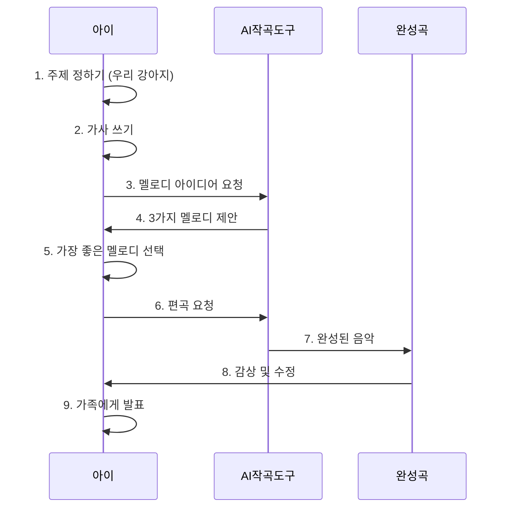

**활용 도구**:
- 🎵 Suno AI: AI 작곡 도구
- 🎹 Chrome Music Lab: 간단한 작곡 체험
- 🎼 MuseScore + AI: 악보 작성 및 편곡

---

## 3. 영어 교육과 AI의 관계

### 3.1 나이별 영어 교육 로드맵

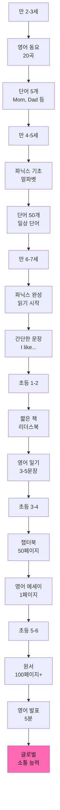

### 3.2 영어 교육과 AI 활용

| 단계 | 영어 학습 내용 | AI 활용 방법 | 학습 효과 | 프뢰벨 연계 |
|------|-------------|------------|---------|-----------|
| **만 4-5세** | 영어 동요<br/>기본 단어 | AI 음성 인식<br/>발음 연습 | 정확한 발음<br/>듣기 능력 | 영어 그림책<br/>함께 읽기 |
| **만 6-7세** | 파닉스<br/>간단한 문장 | AI 읽기 도우미<br/>발음 피드백 | 읽기 자신감<br/>파닉스 완성 | 영어 동화책<br/>매일 1권 |
| **초등 1-2** | 리더스북<br/>영어 일기 | ChatGPT 대화<br/>문법 교정 | 회화 능력<br/>쓰기 기초 | 영어 독서록<br/>주 3회 |
| **초등 3-4** | 챕터북<br/>영어 에세이 | AI 첨삭<br/>표현 제안 | 글쓰기 실력<br/>어휘 확장 | 영어 프로젝트<br/>월 1개 |
| **초등 5-6** | 원서<br/>영어 발표 | AI 발표 코치<br/>스크립트 작성 | 프레젠테이션<br/>논리적 표현 | 영어 논문<br/>포트폴리오 |

### 3.3 영어 + 프뢰벨 + AI 통합 학습

#### 초등 4학년 예시: "영어 그림책 만들기 프로젝트"

```
주제: "My Dream AI Robot" (나의 꿈의 AI 로봇)

1주차: 영어 원서 읽기 (로봇 관련 3권)
2주차: 나만의 로봇 설계
        - ChatGPT와 영어로 대화하며 아이디어 발전
        - "What can my robot do?"
3주차: 영어 스토리 쓰기
        - AI 첨삭 도움
        - 그림 그리기 (DALL-E 활용)
4주차: 영어 그림책 완성
        - 영어 발표 (AI 발음 코치)
        - 가족 및 친구들에게 공유

결과물:
- 12페이지 영어 그림책
- 5분 영어 발표 영상
- 영어 실력 + AI 활용 + 창의성 동시 성장
```

---

## 4. 책의 질과 리터러시 교육

### 4.1 프뢰벨 책의 압도적 품질

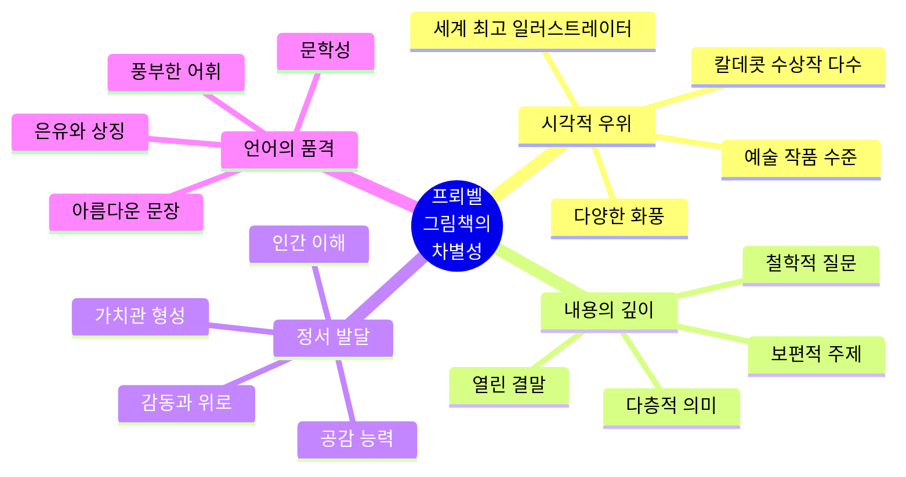

### 4.2 책의 질에 따른 장기적 영향

| 책의 질 | 단기 효과 (유아기) | 중기 효과 (초등) | 장기 효과 (입시/사회) | AI 시대 연결 |
|--------|---------------|-------------|------------------|------------|
| **최상급<br/>(프뢰벨)** | 미적 감각 자동 습득<br/>풍부한 어휘<br/>사고력 자극 | 독서 습관 확립<br/>비판적 사고<br/>창의적 글쓰기 | 논술 우위<br/>면접 경쟁력<br/>높은 직무 능력 | 문제 정의 능력<br/>다각적 사고<br/>창의적 표현 |
| **중급<br/>(일반 그림책)** | 기본 어휘<br/>이야기 이해 | 보통 독서력<br/>평범한 글쓰기 | 일반적 입시 경쟁력<br/>표준적 직무 능력 | 기본 AI 활용<br/>지시 수행 |
| **하급<br/>(학습지)** | 제한적 어휘<br/>단편적 지식 | 독서 기피<br/>창의성 부족 | 논술 불리<br/>암기 의존 | AI 도구 이해 부족<br/>창의성 결여 |

### 4.3 리터러시 발달 단계와 AI 시대 역량

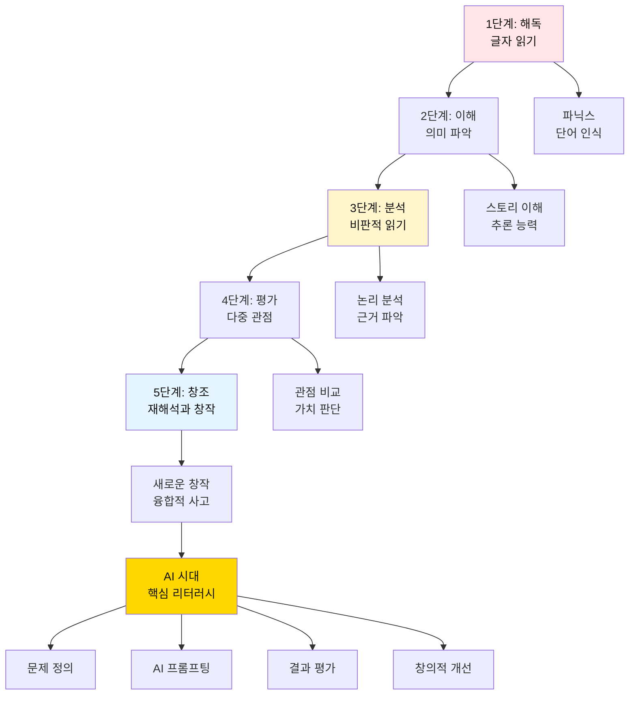

### 4.4 프뢰벨 책으로 키우는 AI 시대 리터러시

**핵심 원리**: 질 좋은 책을 많이 읽으면 → 사고의 깊이와 폭이 넓어진다 → AI를 더 잘 활용할 수 있다

| 프뢰벨 그림책 특징 | 발달하는 능력 | AI 활용 시 효과 |
|----------------|------------|--------------|
| 철학적 질문 던지기 | 문제 정의 능력 | 명확한 프롬프트 작성 |
| 열린 결말 | 다양한 해석 능력 | AI 결과의 다양한 활용 |
| 아름다운 일러스트 | 시각적 사고력 | 이미지 AI 활용 능력 |
| 깊이 있는 스토리 | 맥락 이해 능력 | AI 답변의 적절성 판단 |
| 다층적 의미 | 비판적 사고 | AI 결과 검증 및 개선 |

---

## 5. 놀이 문화와 협업 능력

### 5.1 나이별 놀이 문화 로드맵

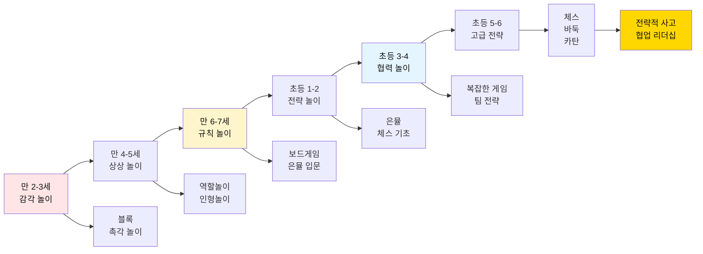

### 5.2 놀이를 통한 AI 시대 역량 개발

| 놀이 유형 | 대표 놀이 | 발달 능력 | AI 시대 연결 | 협업 능력 |
|---------|---------|---------|------------|---------|
| **감각 놀이** | 블록, 퍼즐 | 공간 지각<br/>문제 해결 | 3D 모델링 사고<br/>구조 이해 | 나눠서 만들기 |
| **역할 놀이** | 소꿉놀이<br/>직업 놀이 | 공감 능력<br/>상상력 | 사용자 관점 이해<br/>시나리오 작성 | 역할 분담<br/>협력 스토리 |
| **규칙 놀이** | 보드게임<br/>카드 게임 | 규칙 이해<br/>순서 지키기 | 알고리즘 사고<br/>논리 구조 | 공정한 경쟁<br/>규칙 준수 |
| **전략 놀이** | 은뮬<br/>체스 | 전략 사고<br/>예측 능력 | 시뮬레이션 사고<br/>최적화 | 팀 전략<br/>의사소통 |
| **협력 놀이** | 팀 게임<br/>공동 프로젝트 | 협업 능력<br/>리더십 | 프로젝트 관리<br/>팀워크 | 역할 조율<br/>갈등 해결 |

### 5.3 은뮬 놀이와 AI 시대 사고력

#### 은뮬이 키우는 핵심 능력

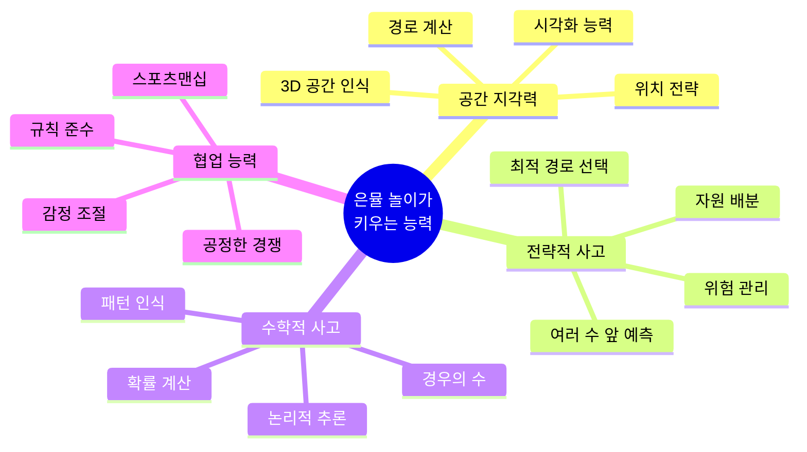

**AI 프로젝트와의 연결**:
- 🎯 전략 게임 경험 → 프로젝트 기획 능력
- 🧮 확률 계산 경험 → 데이터 분석 사고
- 🤝 팀 놀이 경험 → 협업 프로젝트 능력

---

## 6. 작품 문화와 포트폴리오

### 6.1 나이별 작품 제작 로드맵

| 나이 | 작품 주기 | 작품 형태 | 제작 도구 | 누적 개수 (연간) | 포트폴리오 가치 |
|------|----------|---------|---------|---------------|--------------|
| **만 4-5세** | 주 1-2회 | 그림, 만들기 | 크레용, 점토 | 50-100개 | ⭐ 창의성 기초 |
| **만 6-7세** | 주 1회 | 작품, 공예 | 다양한 재료 | 50개 | ⭐⭐ 표현력 발달 |
| **초등 1-2** | 2주 1회 | 프로젝트 결과물 | 기초 도구 | 24개 | ⭐⭐⭐ 탐구 기록 |
| **초등 3-4** | 월 1회 | 디지털+실물 | AI 도구 활용 | 12개 | ⭐⭐⭐⭐ 포트폴리오 시작 |
| **초등 5-6** | 분기 1회 | 대형 프로젝트 | 고급 AI 도구 | 4개 (심화) | ⭐⭐⭐⭐⭐ 입시 경쟁력 |

### 6.2 작품 제작 과정과 AI 활용

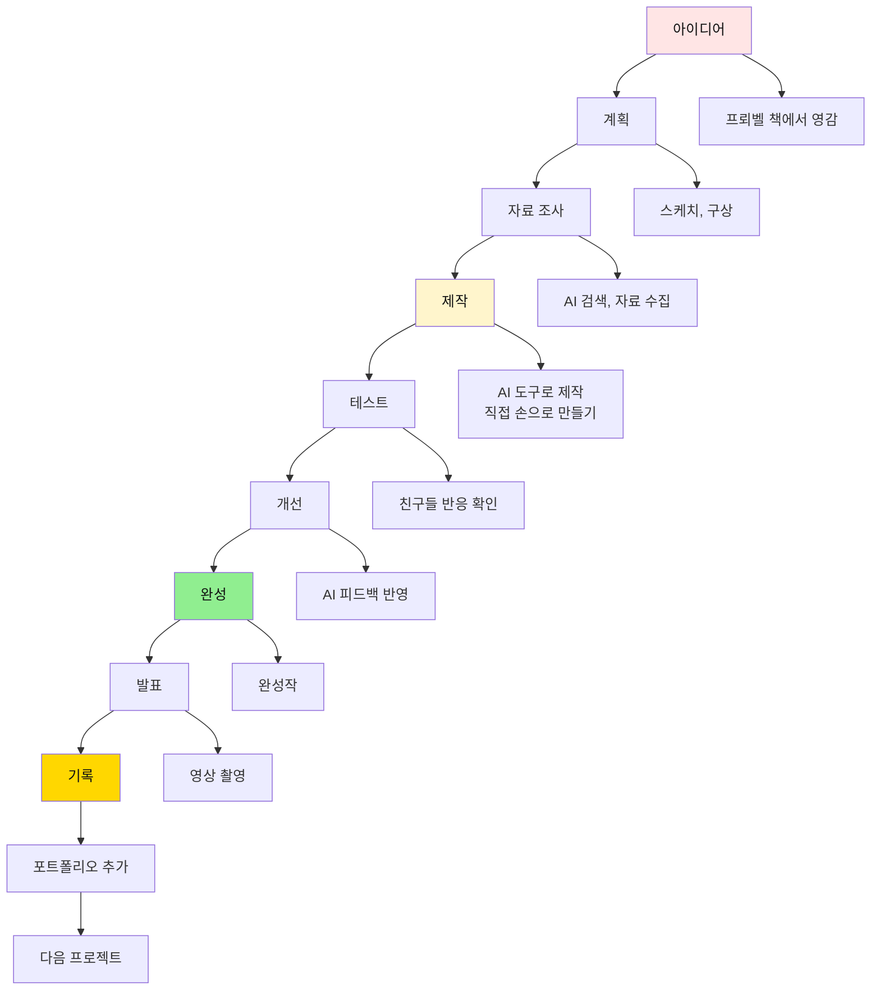

### 6.3 작품 문화가 만드는 차이

| 측면 | 작품 문화 있음 (프뢰벨) | 작품 문화 없음 (일반) |
|------|---------------------|------------------|
| **자신감** | ✅ "나는 만들 수 있어"<br/>자기 효능감 높음 | ❌ "나는 못해"<br/>수동적 태도 |
| **창의성** | ✅ 새로운 시도 두려움 없음<br/>실패를 배움으로 전환 | ❌ 정답만 찾으려 함<br/>실패 두려움 |
| **포트폴리오** | ✅ 10년간 수백 개 작품<br/>진정성 있는 스토리 | ❌ 고3 때 급조한 스펙<br/>형식적 활동 |
| **입시 경쟁력** | ✅ 학생부종합 압도적 우위<br/>면접 때 실제 경험 이야기 | ❌ 평범한 스펙<br/>공허한 자기소개서 |
| **사회 진출** | ✅ 실제로 만드는 능력<br/>프로젝트 수행 능력 | ❌ 이론만 알고 실행 못함<br/>현장 적응 어려움 |

---

## 7. 함께 기록하고 토론하는 문화

### 7.1 나이별 기록과 토론 문화

```mermaid
timeline
    title 기록과 토론 문화 발달 단계
    
    section 만 4-5세: 표현 시작
        그림으로 표현 : 오늘 본 것 그리기
        말로 설명 : "이게 뭐야?" 질문에 답하기
        부모와 대화 : 하루 10분 대화
    
    section 만 6-7세: 기록 습관
        간단한 일기 : 그림+한 줄
        짧은 발표 : 가족 앞에서 3분
        질문과 답변 : "왜 그랬어?" 토론
    
    section 초등 1-2: 체계적 기록
        독서록 : 책 읽고 생각 쓰기
        프로젝트 일지 : 매일 기록
        발표 습관 : 주 1회 가족 발표
    
    section 초등 3-4: 깊이 있는 토론
        논리적 글쓰기 : 근거 있는 주장
        토론 참여 : 친구들과 토론
        영상 기록 : 과정 촬영
    
    section 초등 5-6: 전문가 수준
        소논문 : 연구 보고서
        공개 발표 : 대회 발표
        디지털 기록 : 블로그, 유튜브
```

### 7.2 함께 기록하고 토론하는 방법

#### 🌙 **매일 저녁 30분: 가족 토론 시간**

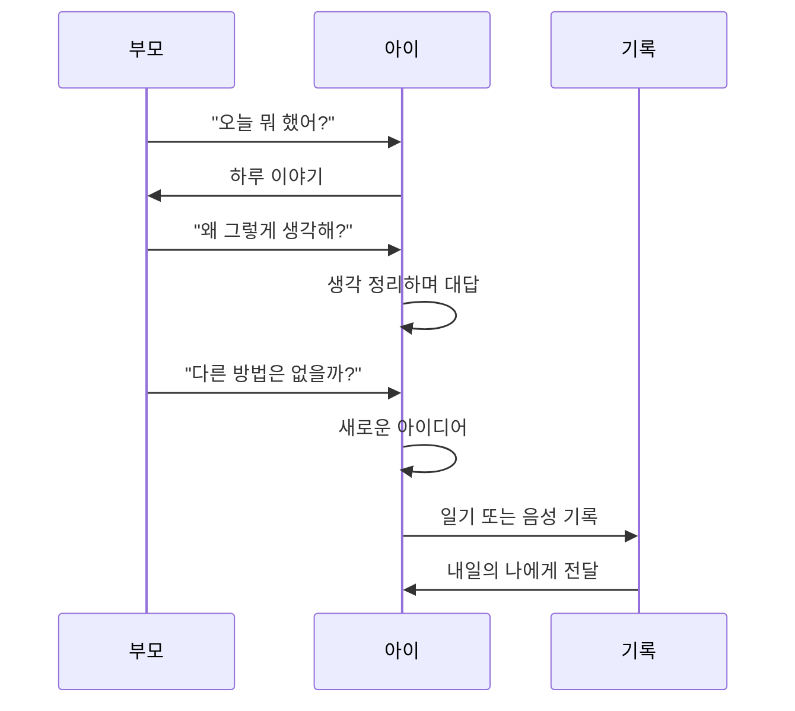

**핵심 질문 5가지**:
1. "오늘 가장 재미있었던 건 뭐야?"
2. "왜 그렇게 생각해?"
3. "만약 네가 주인공이라면 어떻게 했을까?"
4. "다른 사람은 어떻게 생각할까?"
5. "내일은 뭘 해보고 싶어?"

### 7.3 기록과 토론이 AI 시대 역량을 키우는 이유

| 활동 | 발달 능력 | AI 시대 활용 | 장기적 효과 |
|------|---------|------------|----------|
| **매일 기록** | 메타인지<br/>자기 성찰 | 프로젝트 일지<br/>진행 상황 관리 | 자기 관리 능력<br/>지속적 개선 |
| **가족 토론** | 논리적 사고<br/>언어 표현력 | 명확한 프롬프트<br/>AI와 대화 | 소통 능력<br/>설득력 |
| **친구 토론** | 다양한 관점<br/>비판적 사고 | 다각적 문제 접근<br/>협업 능력 | 리더십<br/>팀워크 |
| **공개 발표** | 자신감<br/>프레젠테이션 | 결과 공유<br/>피드백 수용 | 대중 연설<br/>영향력 |
| **디지털 기록** | 디지털 리터러시<br/>포트폴리오 | 온라인 브랜딩<br/>영향력 확산 | 퍼스널 브랜드<br/>네트워크 |

### 7.4 토론 문화가 만드는 결정적 차이

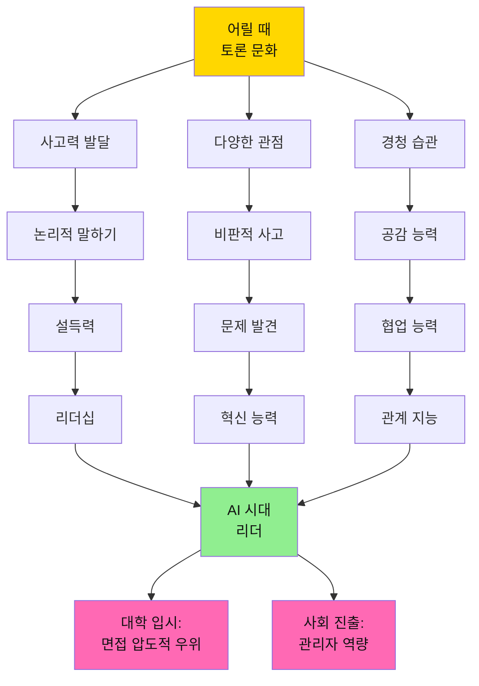

---

## 8. 어릴 때 자극이 평생 가는 이유

### 8.1 뇌 발달의 결정적 시기

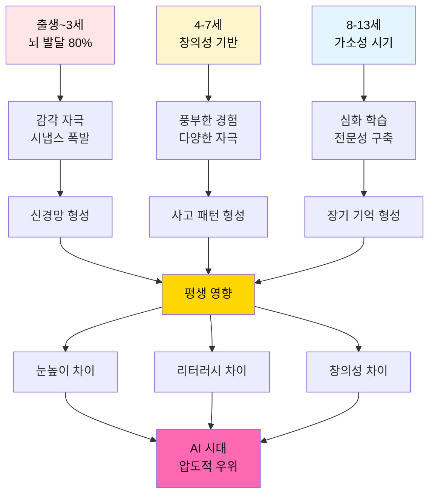

### 8.2 자극의 질에 따른 평생 영향

| 자극 유형 | 저품질 자극 | 고품질 자극 (프뢰벨) | 10년 후 차이 | 20년 후 차이 |
|---------|----------|-----------------|-----------|-----------|
| **시각 자극** | 단조로운 그림<br/>TV, 유튜브 | 세계적 일러스트<br/>예술 작품 | 미적 감각 차이<br/>디자인 안목 | 창의적 표현력<br/>시각적 사고 |
| **언어 자극** | 단순 반복<br/>"공부해" | 깊이 있는 대화<br/>"왜 그럴까?" | 어휘력 차이<br/>표현력 차이 | 논리력<br/>설득력 |
| **정서 자극** | 성적 압박<br/>비교 | 공감과 격려<br/>과정 칭찬 | 자존감 차이<br/>학습 태도 | 정서 지능<br/>리더십 |
| **인지 자극** | 정답 찾기<br/>암기 | 질문 만들기<br/>탐구 | 사고력 차이<br/>창의성 | 문제 해결력<br/>혁신 능력 |
| **사회 자극** | 혼자 공부<br/>경쟁 | 함께 토론<br/>협력 | 소통 능력<br/>협업 능력 | 관계 지능<br/>영향력 |

### 8.3 눈높이가 높아지는 메커니즘

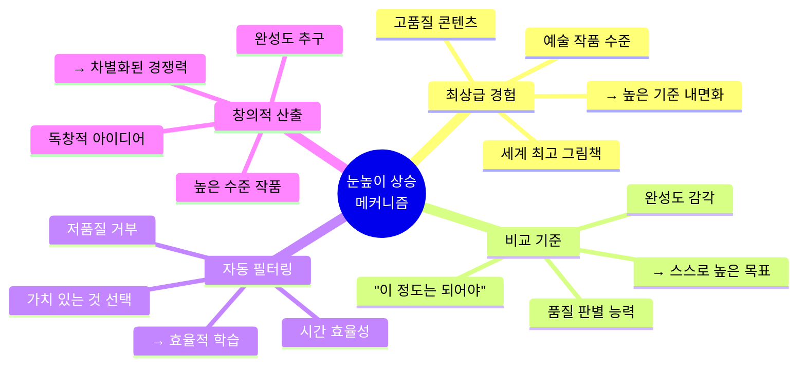

**구체적 예시**:

| 영역 | 일반 아이 (저품질 자극) | 프뢰벨 아이 (고품질 자극) |
|------|---------------------|---------------------|
| **그림 그리기** | "대충 이 정도면 되지" | "색감이 어색한데, 다시 해볼까?" |
| **글쓰기** | "100자 채웠으니 끝" | "표현이 더 정확할 순 없을까?" |
| **프로젝트** | "일단 제출하면 돼" | "사용자 관점에서 다시 보자" |
| **AI 활용** | "AI가 준 답을 그대로" | "AI 결과를 내 방식대로 개선" |

### 8.4 리터러시가 탄탄해지는 이유

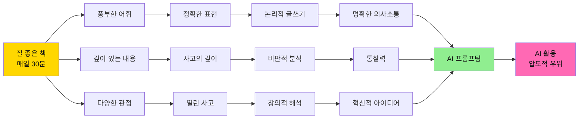

**리터러시 탄탄함이 만드는 AI 시대 우위**:

1. **명확한 프롬프트 작성**
   - 일반: "강아지 그림 그려줘"
   - 프뢰벨: "따뜻한 햇살 아래 풀밭에서 뛰노는 골든 리트리버, 수채화 느낌, 밝고 행복한 분위기"

2. **AI 결과 평가**
   - 일반: "AI가 줬으니까 맞겠지"
   - 프뢰벨: "이 표현이 정확한가? 더 나은 방법은?"

3. **창의적 활용**
   - 일반: AI 결과 그대로 사용
   - 프뢰벨: AI 결과를 기반으로 자신만의 창작

---

## 9. 대학 입시와 사회에서의 변화

### 9.1 프뢰벨 출신 vs 일반 학생: 입시 경쟁력

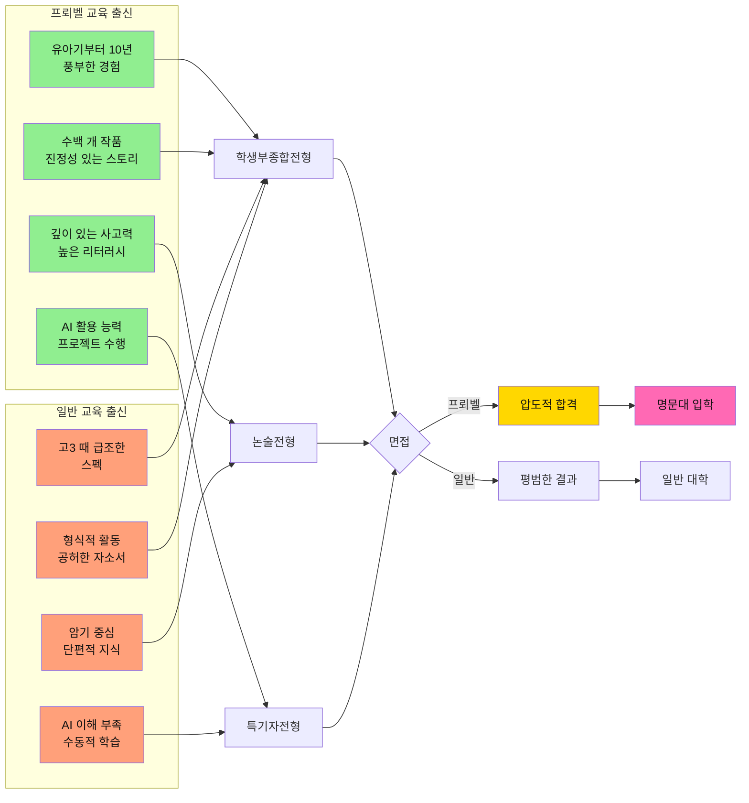

### 9.2 입시 전형별 프뢰벨의 강점

| 전형 | 평가 요소 | 프뢰벨 출신의 강점 | 일반 학생과의 격차 |
|------|---------|-----------------|----------------|
| **학생부종합** | 창의적 활동<br/>진정성<br/>성장 스토리 | ✅ 10년간 누적된 포트폴리오<br/>✅ 구체적이고 진정성 있는 경험<br/>✅ 지속적 성장 궤적 | ⭐⭐⭐⭐⭐<br/>압도적 우위 |
| **논술** | 독해력<br/>논리력<br/>창의적 사고 | ✅ 수천 권 독서로 쌓은 사고력<br/>✅ 비판적 분석 능력<br/>✅ 명확한 논리 전개 | ⭐⭐⭐⭐⭐<br/>논리 구조 탁월 |
| **면접** | 의사소통<br/>순발력<br/>진정성 | ✅ 토론 문화로 키운 표현력<br/>✅ 실제 경험 기반 답변<br/>✅ 자신감 있는 태도 | ⭐⭐⭐⭐⭐<br/>진정성 압도 |
| **수능** | 독해력<br/>사고력<br/>문제 해결 | ✅ 높은 리터러시<br/>✅ 복잡한 지문 이해력<br/>✅ 논리적 추론 | ⭐⭐⭐⭐<br/>기본 역량 탄탄 |

### 9.3 대학 생활과 사회 진출에서의 차이

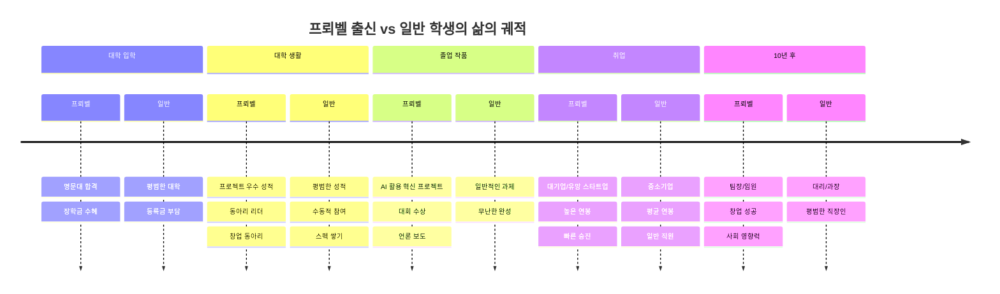

### 9.4 사회에서 프뢰벨 교육이 만드는 차이

| 상황 | 프뢰벨 출신 | 일반 출신 | 결과 |
|------|-----------|---------|------|
| **회의에서** | "이 문제를 다르게 접근하면 어떨까요?" (문제 정의 능력) | "지시하신 대로 하겠습니다" (수동적) | 프뢰벨: 혁신 제안자 |
| **프로젝트 수행** | AI 도구 활용해 빠르게 프로토타입 (실행력) | 기존 방식대로 천천히 (비효율) | 프뢰벨: 빠른 성과 |
| **팀 협업** | "각자 강점을 살려서 역할 분담하죠" (리더십) | "나는 이거 할게요" (개인주의) | 프뢰벨: 팀 리더 |
| **프레젠테이션** | 논리적이고 설득력 있는 발표 (소통력) | 자료만 읽는 발표 (형식적) | 프뢰벨: 영향력 |
| **위기 상황** | "실패했지만 배운 점은..." (성장 마인드) | "제 잘못입니다" (두려움) | 프뢰벨: 회복탄력성 |

---

## 10. AI 시대, 프뢰벨 출신의 압도적 우위

### 10.1 AI 시대 핵심 역량과 프뢰벨 교육의 완벽한 매치

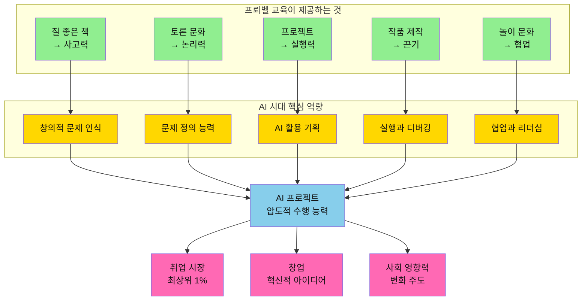

### 10.2 AI 프로젝트 제작 시 프뢰벨 출신의 유리한 점

| AI 프로젝트 단계 | 필요한 능력 | 프뢰벨이 제공한 것 | 구체적 우위 |
|---------------|----------|----------------|----------|
| **1. 문제 발견** | 관찰력<br/>문제 인식 | 그림책 속 질문들<br/>"왜?" 습관 | 일상에서 문제를 발견하는 눈<br/>본질을 꿰뚫는 통찰 |
| **2. 문제 정의** | 명확한 표현<br/>논리적 사고 | 토론 문화<br/>글쓰기 연습 | 복잡한 문제를 단순화<br/>명확한 목표 설정 |
| **3. 아이디어 발산** | 창의성<br/>다양한 관점 | 상상력 자극<br/>다양한 경험 | 독창적 아이디어<br/>고정관념 없는 발상 |
| **4. AI 프롬프팅** | 명확한 지시<br/>디테일 표현 | 높은 리터러시<br/>풍부한 어휘 | 정확한 프롬프트<br/>원하는 결과 도출 |
| **5. 프로토타입 제작** | 빠른 실행<br/>도구 활용 | 프로젝트 경험<br/>만들기 문화 | 아이디어를 빠르게 구현<br/>반복 개선 |
| **6. 테스트 및 디버깅** | 문제 해결<br/>끈기 | 시행착오 경험<br/>성장 마인드 | 오류를 배움으로 전환<br/>지속적 개선 |
| **7. 협업** | 소통<br/>역할 분담 | 놀이 문화<br/>팀 프로젝트 | 효과적인 협업<br/>리더십 발휘 |
| **8. 발표 및 공유** | 프레젠테이션<br/>설득력 | 발표 경험<br/>토론 능력 | 설득력 있는 발표<br/>영향력 확산 |

### 10.3 실제 AI 프로젝트 비교: 프뢰벨 vs 일반

#### 프로젝트 주제: "학교 급식 개선 AI 앱"

| 단계 | 일반 학생 | 프뢰벨 출신 학생 |
|------|---------|---------------|
| **문제 발견** | "선생님이 주제 주셨어요" | "친구들이 급식을 많이 남기더라. 왜 그럴까?" |
| **문제 정의** | "급식 앱 만들기" | "학생 선호도를 반영한 맞춤형 식단 추천 시스템" |
| **조사** | 인터넷 검색 | 100명 설문 + 영양사 인터뷰 + 급식 데이터 분석 |
| **AI 활용** | ChatGPT: "급식 앱 만들어줘" | ChatGPT: "중학생의 영양 균형을 고려하면서도 선호도가 높은 식단을 추천하는 알고리즘을 설계해줘. 데이터는..." |
| **결과물** | 간단한 메뉴 보기 앱 | - AI 추천 알고리즘<br/>- 학생 맞춤 식단<br/>- 음식물 쓰레기 20% 감소 예측<br/>- 실제 학교 시범 운영 |
| **발표** | PPT 읽기 | 스토리텔링 + 실제 데이터 + 시연 |
| **평가** | "열심히 했네" | "혁신적이다, 실제로 도입하면 좋겠다" |

### 10.4 왜 프뢰벨 출신이 AI를 더 잘 활용하는가?

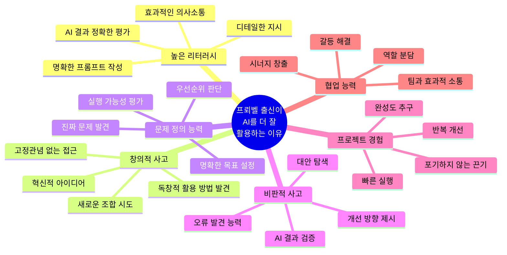

### 10.5 구체적 사례: 프뢰벨 교육이 만든 AI 활용 능력

#### 사례 1: 초등 6학년 서준이의 AI 활용

**배경**: 유아기부터 프뢰벨 교육, 특히 독서와 프로젝트 중심

**프로젝트**: "우리 동네 쓰레기 문제 해결 AI 앱"

**AI 활용 수준**:
```
1. 문제 정의 (ChatGPT 활용)
   "우리 동네 쓰레기 문제를 분석하고, 주민들이 쉽게 참여할 수 있는 
   솔루션을 제안해줘. 고려사항은..."

2. 데이터 분석 (Python + AI)
   "이 설문 데이터에서 주요 패턴을 찾고 시각화해줘"

3. 앱 디자인 (Figma + AI)
   "사용자 친화적인 UI를 제안해줘. 주 사용자는 40-60대"

4. 프로토타입 제작 (MIT App Inventor + AI)
   AI 도움으로 기능 구현

5. 결과: 지역 환경대회 대상, 실제 구청에서 관심
```

**핵심**: AI를 단순히 사용하는 것이 아니라, **AI와 협업하여 창조**

---

## 11. 종합 결론: 지금 시작해야 하는 이유

### 11.1 최종 메시지

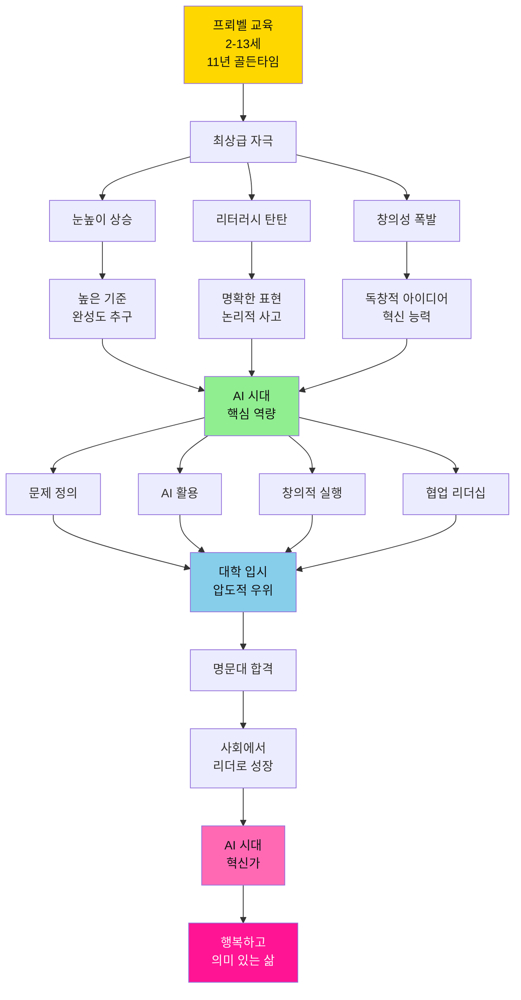

### 11.2 나이별 핵심 액션 플랜

| 현재 나이 | 남은 골든타임 | 즉시 시작할 것 | 1년 목표 | 기대 효과 |
|---------|------------|------------|---------|---------|
| **만 4-5세** | ⏰ 9년 | 프뢰벨 그림책 매일 30분<br/>질문 습관 만들기 | 100권 독서<br/>작품 50개 | 창의성 기초<br/>질문 습관 |
| **만 6-7세** | ⏰ 7년 | 독서 + 만들기<br/>보드게임 주 2회 | 150권 독서<br/>프로젝트 12개 | 독서 습관<br/>창의적 제작 |
| **초등 1-2** | ⏰ 5년 | 프로젝트 학습<br/>독서록 작성 | 200권 독서<br/>프로젝트 24개 | 관심 발견<br/>기록 습관 |
| **초등 3-4** | ⏰ 3년 | AI 도구 활용<br/>디지털 작품 | 전문 독서<br/>AI 프로젝트 12개 | AI 리터러시<br/>작품 포트폴리오 |
| **초등 5-6** | ⏰ 1년 | 대형 프로젝트<br/>포트폴리오 완성 | 소논문 4편<br/>대회 출품 | 입시 경쟁력<br/>전문성 |

### 11.3 프뢰벨 교육의 핵심 가치

```mermaid
mindmap
  root((프뢰벨 교육<br/>핵심 가치))
    어릴 때 자극은 평생
      감각기 풍부한 경험
      신경망 형성
      기준 내면화
      평생 영향
    눈높이가 높아짐
      최상급 경험
      높은 기준 자동 적용
      완성도 추구
      차별화된 결과
    리터러시가 탄탄
      질 좋은 책
      풍부한 어휘
      논리적 사고
      명확한 표현
    AI 시대 우위
      문제 정의
      창의적 활용
      비판적 평가
      협업 능력
    입시와 사회
      포트폴리오
      진정성
      실전 능력
      리더십
```

### 11.4 지금 당장 시작하세요!

**오늘 밤부터 할 수 있는 것**:

1. 📚 **프뢰벨 그림책 1권 읽기** (30분)
2. ❓ **"왜?" 질문 3개 만들기** (10분)
3. 🎨 **간단한 그림 그리기** (10분)
4. 💬 **가족 토론 시간** (10분)
5. 📝 **오늘의 기록** (5분)

**이번 주말에 할 것**:

1. 🎯 **미니 프로젝트 시작** (2시간)
2. 🤖 **AI 도구 체험** (ChatGPT 첫 질문)
3. 🎲 **보드게임 가족 놀이** (1시간)
4. 📸 **과정 사진 촬영** (기록 습관)

**이번 달 목표**:

1. 📚 그림책 10권 읽기
2. 🎨 작품 2개 완성
3. 🤖 AI 도구 3가지 사용해보기
4. 💬 매일 10분 가족 토론

---

## 🌟 당신의 선택이 아이의 미래를 결정합니다

```mermaid
journey
    title 프뢰벨 교육과 함께하는 11년 여정
    section 만 4-5세
      프뢰벨 시작: 5: 부모, 아이
      질문 습관: 5: 아이
      창의성 싹: 5: 아이
    section 만 6-7세
      독서 습관: 5: 아이
      만들기: 5: 아이
      자신감: 5: 아이
    section 초등 1-2
      관심 발견: 5: 아이
      프로젝트: 5: 아이
      기록 습관: 4: 아이
    section 초등 3-4
      AI 활용: 5: 아이
      작품 제작: 5: 아이
      포트폴리오: 5: 아이
    section 초등 5-6
      전문성: 5: 아이
      대회 수상: 5: 아이
      입시 준비: 4: 아이
    section 대학 입시
      명문대 합격: 5: 아이, 부모
      꿈 실현: 5: 아이
    section AI 시대
      혁신가: 5: 아이
      리더: 5: 아이
      행복한 삶: 5: 아이
```

### ✨ 프뢰벨 교육은:

- ✅ **어릴 때 받은 최상급 자극**이 평생을 갑니다
- ✅ **눈높이가 높아져** 스스로 높은 기준을 추구합니다
- ✅ **리터러시가 탄탄해져** AI 시대의 핵심 역량을 갖춥니다
- ✅ **음악, 영어, 놀이, 작품**이 통합되어 전인적 성장을 이룹니다
- ✅ **함께 기록하고 토론**하며 소통과 협업을 배웁니다
- ✅ **대학 입시에서 압도적 우위**를 가집니다
- ✅ **사회에서 리더로 성장**하며 영향력을 발휘합니다
- ✅ **AI 시대에 혁신가**가 되어 세상을 변화시킵니다

---

## 📞 지금 바로 시작하세요!

**골든타임은 기다려주지 않습니다.**

중학교에 가면 이미 늦습니다.  
지금 이 순간이 아이의 미래를 바꿀 수 있는 마지막 기회입니다.

**프뢰벨 교육으로 아이의 무한한 가능성을 열어주세요.** 🚀

---

*문서 작성일: 2025년 12월 8일*  
*핵심 원칙: 어릴 때 자극은 평생을 간다 | 눈높이가 곧 경쟁력이다 | 리터러시가 AI 시대를 지배한다*

**© 2025 프뢰벨 교육 종합 가이드. All rights reserved.**
