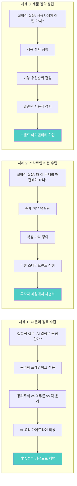
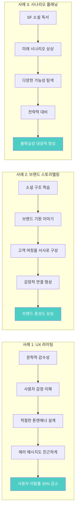

# 리딩 리듬: 미네르바식 독서, 소크라테스 토론, AI 활용 프로젝트

> **"AI 시대, 진짜 경쟁력은 '진짜 문제'를 발견하고 해결하는 능력이다"**
> **— 미네르바 대학교 교육 철학**
>
> 미네르바 대학교는 캠퍼스 없이 7개 도시를 순회하며  
> **19명 이하 소크라테스식 세미나**로 100% 액티브 러닝을 실천한다.  
> 전통적 강의는 없고, 매주 실제 기업과 협력하는 프로젝트만 있다.
>
> **도서관은 책을 빌리는 곳이 아니라**  
> **뜻 맞는 사람들이 만나 진짜 문제를 발견하고**  
> **AI를 도구로 10배 빠르게 해결하는 공간이다.**
>
> **AI는 정보를 주지만, 의미는 인간이 부여한다.**  
> **AI는 코드를 짜지만, 무엇을 만들지는 인간이 결정한다.**  
> **AI는 도구일 뿐, 질문하고, 협업하고, 끝까지 완수하는 것은 인간만이 할 수 있다.**

---

## 📑 목차
### 🎯 Part 1: 리딩 리듬의 정의와 중요성
1. [리딩 리듬이란 무엇인가?](#1-리딩-리듬이란-무엇인가)
2. [왜 함께 읽고 생각을 나눠야 하는가?](#2-왜-함께-읽고-생각을-나눠야-하는가)
3. [AI 시대, 도서관과 독서의 미래](#3-ai-시대-도서관과-독서의-미래)

### 📚 Part 2: AI 시대 다각적 사고의 필요성
4. [왜 다각적 사고가 필수인가?](#4-왜-다각적-사고가-필수인가)
5. [인문학·사회학·철학이 AI 시대에 더 중요한 이유](#5-인문학사회학철학이-ai-시대에-더-중요한-이유)
   - 5.9 [미네르바 대학교 필독서 기반 인문학 커리큘럼](#59-미네르바-대학교-필독서-기반-인문학-커리큘럼)
   - 5.10 [세계 명문 교육기관의 인문학 수업 비교 분석](#510-세계-명문-교육기관의-인문학-수업-비교-분석)
6. [AI 시대, 진짜 문제 해결 능력이 핵심이다](#6-ai-시대-진짜-문제-해결-능력이-핵심이다)

### 🎓 Part 3: 단계별 실천 방법론
7. [중학생: 질문하는 독서의 시작](#7-중학생-질문하는-독서의-시작)
8. [고등학생: 관점 확장과 미니 프로젝트](#8-고등학생-관점-확장과-미니-프로젝트)
9. [대학생: 프로젝트 기반 독서와 실전 적용](#9-대학생-프로젝트-기반-독서와-실전-적용)
   - 9.9 [미네르바식 소크라테스 세미나](#99-미네르바식-소크라테스-세미나-socratic-seminar)

### 🚀 Part 4: 프로젝트와 커리어 연결
10. [프로젝트가 취업·창업에 미치는 영향](#10-프로젝트가-취업창업에-미치는-영향)
11. [프로젝트 트레이닝: AI 시대 살아남는 유일한 길](#11-프로젝트-트레이닝-ai-시대-살아남는-유일한-길)
12. [종합 실천 가이드와 로드맵](#12-종합-실천-가이드와-로드맵)

---

## 1. 리딩 리듬이란 무엇인가?

### 1.1 리딩 리듬의 정의


#### 📖 **리딩 리듬 = 읽기 + 나누기 + 만들기**

| 요소 | 전통적 독서 | 리딩 리듬 |
|-----|----------|---------|
| **읽기** | 혼자 책을 읽고 끝 | 질문하며 능동적으로 읽기 |
| **나누기** | 독후감 쓰기 (일방향) | 토론, 관점 교환, 피드백 (쌍방향) |
| **만들기** | 없음 | 프로젝트, 글쓰기, 발표, 창작물 |
| **성장** | 지식 축적 | 사고력 + 협업력 + 실행력 동시 성장 |

### 1.2 왜 "리듬"인가?


**리듬의 의미:**
- 🎵 **반복되는 패턴**: 읽기-생각-나누기-만들기의 순환
- 🎵 **지속 가능한 습관**: 매주, 매달 이어지는 리듬감 있는 활동
- 🎵 **협주와 조화**: 혼자가 아닌 함께하는 독서의 리듬

---

## 2. 왜 함께 읽고 생각을 나눠야 하는가?

### 2.1 인지과학이 증명하는 함께 읽기의 힘


#### 📊 **연구 결과로 보는 함께 읽기의 효과**

| 연구 | 발견 | 시사점 |
|-----|-----|-------|
| **소크라테스 세미나 연구** | 토론 기반 독서 → 비판적 사고력 **40% 향상** | 질문과 대화가 사고력의 핵심 |
| **협동 학습 메타분석** | 함께 학습 시 개인 학습 대비 **이해도 25% 증가** | 설명하면서 더 깊이 이해 |
| **하버드 Project Zero** | 사고의 가시화(Visible Thinking) → 메타인지 발달 | 생각을 말로 표현하면 사고력 증가 |
| **핀란드 교육 연구** | 토론 중심 수업 → 창의성, 협업 능력 동시 향상 | 함께 생각하면 창의성도 키워짐 |

### 2.2 왜 다른 사람의 생각이 필요한가?


#### 🧠 **사고의 확장 과정**


### 2.3 AI 시대에 함께 읽기가 더 중요한 이유

| AI가 할 수 있는 것 | AI가 할 수 없는 것 (인간만 가능) |
|------------------|---------------------------|
| 요약, 분석, 정보 제공 | **"왜 이 책이 나에게 의미 있는가?"** 판단 |
| 객관적 해석 제시 | **감정적 공명, 경험과의 연결** |
| 다양한 관점 나열 | **관점을 선택하고 통합하는 가치 판단** |
| 빠른 검색과 정리 | **함께 웃고, 공감하고, 토론하는 경험** |
| 정보의 정확성 검증 | **새로운 질문을 던지는 창의적 호기심** |

> **"AI는 정답을 주지만, 인간은 질문을 만든다.  
> 함께 읽고 토론하는 과정에서 그 질문이 탄생한다."**

---

## 3. AI 시대, 도서관과 독서의 미래

### 3.1 도서관의 진화: 대출소 → 사고의 허브


### 3.2 미래 도서관의 모습


#### 📍 **미래 도서관의 핵심 변화**

| 변화 영역 | 전통 도서관 | 미래 도서관 |
|---------|----------|----------|
| **핵심 기능** | 책 보관 및 대출 | 사고와 협업의 플랫폼 |
| **공간 구성** | 조용한 열람실 | 토론실 + 프로젝트룸 + 메이커 스페이스 |
| **이용자 관계** | 개인 → 책 | 사람 → 사람 → 프로젝트 |
| **사서 역할** | 자료 관리자 | 학습 촉진자, 커뮤니티 매니저 |
| **결과물** | 지식 습득 | 프로젝트, 창작물, 협업 네트워크 |

### 3.3 뜻 맞는 사람들의 프로젝트 탄생


> **"도서관은 책을 빌리는 곳에서,  
> 생각을 나누고 프로젝트가 탄생하는 곳으로 진화한다.  
> 뜻 맞는 사람들이 만나 세상을 바꾸는 아이디어가 시작되는 곳."**

---

## 4. 왜 다각적 사고가 필수인가?

### 4.1 AI 시대, 단일 관점의 한계


### 4.2 다각적 사고의 구조


### 4.3 다각적 사고를 위한 질문 프레임워크

| 관점 | 핵심 질문 | 독서에서 적용 |
|-----|---------|-------------|
| **기술적 관점** | "어떻게 작동하는가?" | 기술서, 과학서 읽기 |
| **인문학적 관점** | "인간에게 어떤 의미인가?" | 철학, 문학, 역사 읽기 |
| **사회학적 관점** | "사회에 어떤 영향을 미치는가?" | 사회과학, 경제학 읽기 |
| **윤리적 관점** | "옳은 것인가? 누구를 위한 것인가?" | 윤리학, 철학 읽기 |
| **미학적 관점** | "아름다운가? 사용자 경험은?" | 예술, 디자인 읽기 |
| **생태적 관점** | "환경에 어떤 영향인가?" | 환경, 지속가능성 읽기 |

#### 💡 **다각적 사고 연습 예시**


---

## 5. 인문학·사회학·철학이 AI 시대에 더 중요한 이유

### 5.1 AI가 못하는 것 = 인문학이 하는 것


### 5.2 전인적 인간이 각광받는 시대

#### 🌟 **AI 시대가 원하는 인재상**


### 5.3 인문학이란 무엇인가? (정의와 범위)


#### 📖 **인문학의 정의**

> **인문학(人文學, Humanities)**: 인간의 사상, 문화, 가치관, 역사, 언어, 예술 등을 연구하는 학문 분야.  
> 자연과학이 "어떻게(How)"를 묻는다면, 인문학은 "**왜(Why)**"와 "**무엇을 위해(For What)**"를 묻는다.

| 구분 | 자연과학/공학 | 인문학 |
|-----|------------|-------|
| **질문** | "어떻게 작동하는가?" | "왜 존재하는가? 어떤 의미인가?" |
| **방법** | 실험, 측정, 증명 | 해석, 비판, 토론 |
| **정답** | 하나의 정답 지향 | 다양한 해석 가능 |
| **목표** | 사실 발견 | 의미 이해 |
| **AI 시대 역할** | AI가 점점 대체 | AI가 대체 불가 |

---

### 5.4 철학(Philosophy): 근본을 묻는 힘

#### 🔍 **정의**

> **철학**: 존재, 지식, 가치, 이성, 마음, 언어 등 근본적인 문제에 대해 질문하고 탐구하는 학문.  
> 그리스어 **Philosophia** = "지혜(sophia)를 사랑함(philo)"


#### 🎯 **왜 배워야 하는가?**

| 이유 | 설명 | AI 시대 연결 |
|-----|-----|------------|
| **근본 질문** | "왜?"를 끝까지 묻는 능력 | AI는 답만 줌, 질문은 인간이 생성 |
| **논리적 사고** | 주장-근거-반론의 구조 파악 | 알고리즘 설계와 디버깅의 기초 |
| **가치 판단** | 옳고 그름, 좋고 나쁨의 기준 | AI 윤리, 기술의 방향 결정 |
| **개념 명확화** | 모호한 개념을 명확히 정의 | 문제 정의, 요구사항 분석 |
| **다양한 관점** | 하나의 문제를 여러 각도에서 | 다학제적 프로젝트의 기초 |

#### 💼 **적용 사례**



| 적용 분야 | 철학적 질문 | 실제 결과물 | 성공 사례 |
|---------|----------|----------|---------|
| **AI 윤리** | "AI의 결정이 공정한가?" | AI 윤리 가이드라인 | Google AI Principles |
| **제품 기획** | "이 제품의 존재 이유는?" | 제품 철학 문서 | Apple의 "Think Different" |
| **조직 문화** | "우리는 왜 함께 일하는가?" | 미션/비전 스테이트먼트 | Patagonia의 환경 철학 |
| **정책 수립** | "정의로운 정책이란?" | 정책 평가 기준 | 롤스의 정의론 적용 |
| **기술 방향** | "기술 발전의 목적은?" | 기술 로드맵 | 휴먼 센터드 AI |

#### 📚 **철학 필수 독서 목록**

| 도서 | 저자 | 핵심 내용 | 적용점 |
|-----|-----|---------|-------|
| 《정의란 무엇인가》 | 마이클 샌델 | 정의의 다양한 관점 | 공정한 시스템 설계 |
| 《소크라테스의 변명》 | 플라톤 | 질문의 힘, 무지의 자각 | 비판적 사고의 시작 |
| 《니코마코스 윤리학》 | 아리스토텔레스 | 좋은 삶, 덕 윤리 | 리더십, 의사결정 |
| 《존재와 시간》 (입문서) | 하이데거 | 존재의 의미 | 기술과 인간 관계 |
| 《정신현상학》 (입문서) | 헤겔 | 변증법적 사고 | 통합적 문제 해결 |

---

### 5.5 문학(Literature): 인간을 이해하는 힘

#### 🔍 **정의**

> **문학**: 언어를 매체로 인간의 경험, 감정, 사상을 예술적으로 표현하는 것.  
> 소설, 시, 희곡, 에세이 등을 통해 **인간 존재의 깊이**를 탐구한다.


#### 🎯 **왜 배워야 하는가?**

| 이유 | 설명 | AI 시대 연결 |
|-----|-----|------------|
| **공감 능력** | 타인의 감정과 경험을 이해 | 사용자 경험 설계, 서비스 디자인 |
| **스토리텔링** | 감동을 주는 이야기 구성 | 피칭, 마케팅, 브랜딩 |
| **상상력** | 없는 것을 상상하는 힘 | 혁신적 아이디어 발상 |
| **언어 감수성** | 정확하고 아름다운 표현 | 글쓰기, 커뮤니케이션 |
| **인간 다양성** | 다양한 삶의 방식 이해 | 글로벌 마인드, 포용성 |

#### 💼 **적용 사례**



| 적용 분야 | 문학에서 배우는 것 | 실제 결과물 | 성공 사례 |
|---------|----------------|----------|---------|
| **UX 라이팅** | 감정을 담은 언어 | 사용자 친화적 인터페이스 | Mailchimp의 위트 있는 UX |
| **브랜드 스토리** | 서사 구조와 캐릭터 | 브랜드 스토리 | Nike의 영웅 여정 광고 |
| **프레젠테이션** | 극적 구성과 클라이맥스 | 임팩트 있는 피칭 | Steve Jobs의 발표 |
| **콘텐츠 마케팅** | 독자를 사로잡는 도입부 | 바이럴 콘텐츠 | 뉴욕타임스 스노우폴 |
| **시나리오 플래닝** | SF적 상상력 | 미래 전략 시나리오 | Shell의 시나리오 플래닝 |

#### 📚 **문학 필수 독서 목록**

| 도서 | 저자 | 핵심 가치 | 적용점 |
|-----|-----|---------|-------|
| 《1984》 | 조지 오웰 | 기술과 권력, 감시 사회 | AI 윤리, 프라이버시 |
| 《멋진 신세계》 | 올더스 헉슬리 | 기술 유토피아의 위험 | 기술 발전의 방향성 |
| 《이방인》 | 알베르 카뮈 | 부조리와 존재 의미 | 의미 있는 일의 정의 |
| 《데미안》 | 헤르만 헤세 | 자아 찾기, 성장 | 자기 발견과 리더십 |
| 《연금술사》 | 파울로 코엘료 | 꿈과 여정 | 비전 설정, 동기 부여 |

---

### 5.6 역사(History): 맥락을 파악하는 힘

#### 🔍 **정의**

> **역사**: 과거 인간 사회의 사건, 변화, 발전을 연구하고 해석하는 학문.  
> 단순한 사실 나열이 아닌, **왜 그런 일이 일어났고, 어떤 결과를 낳았는지**를 분석한다.


#### 🎯 **왜 배워야 하는가?**

| 이유 | 설명 | AI 시대 연결 |
|-----|-----|------------|
| **맥락 이해** | 현재를 과거의 연장선에서 이해 | 기술 트렌드의 본질 파악 |
| **패턴 인식** | 역사적 반복 패턴 발견 | 미래 예측, 리스크 관리 |
| **장기적 관점** | 단기가 아닌 장기로 사고 | 지속 가능한 전략 수립 |
| **교훈 도출** | 과거 실패와 성공에서 배움 | 같은 실수 반복 방지 |
| **변화 이해** | 변화의 동력과 저항 이해 | 혁신 전략, 변화 관리 |

#### 💼 **적용 사례**

```mermaid
graph LR
    subgraph 사례1[사례 1: 기술 혁신 전략]
        A1[기술사 연구] --> A2[과거 혁신 패턴 분석]
        A2 --> A3[S-curve 이론 적용]
        A3 --> A4[현재 기술 위치 파악]
        A4 --> A5[다음 혁신 타이밍 예측]
    end
    
    subgraph 사례2[사례 2: 시장 진입 전략]
        B1[산업사 연구] --> B2[과거 시장 진입 사례 분석]
        B2 --> B3[성공/실패 요인 도출]
        B3 --> B4[현재 시장에 적용]
        B4 --> B5[리스크 최소화 전략]
    end
    
    subgraph 사례3[사례 3: 조직 변화 관리]
        C1[조직사 연구] --> C2[변화 저항 패턴 분석]
        C2 --> C3[성공적 변화 요인 도출]
        C3 --> C4[변화 관리 전략 수립]
        C4 --> C5[조직 변화 성공률 향상]
    end
    
    style A5 fill:#4ECDC4,color:#fff
    style B5 fill:#4ECDC4,color:#fff
    style C5 fill:#4ECDC4,color:#fff
```

| 적용 분야 | 역사에서 배우는 것 | 실제 결과물 | 성공 사례 |
|---------|----------------|----------|---------|
| **기술 전략** | 기술 혁신의 역사적 패턴 | 기술 로드맵 | Gartner Hype Cycle |
| **시장 분석** | 산업 흥망성쇠의 역사 | 시장 진입 전략 | Clayton Christensen의 파괴적 혁신 |
| **리더십** | 위대한 리더들의 결정 | 리더십 원칙 | 역사 속 리더 사례 연구 |
| **리스크 관리** | 과거 위기와 대응 | 위기 대응 매뉴얼 | 금융위기 대응 전략 |
| **브랜드 헤리티지** | 기업/브랜드의 역사 | 브랜드 스토리 | Hermès 200년 역사 활용 |

#### 📚 **역사 필수 독서 목록**

| 도서 | 저자 | 핵심 가치 | 적용점 |
|-----|-----|---------|-------|
| 《총, 균, 쇠》 | 재레드 다이아몬드 | 문명 발전의 근본 원인 | 시스템적 사고 |
| 《사피엔스》 | 유발 하라리 | 인류 역사의 큰 그림 | 장기적 관점 |
| 《혁신의 역사》 | 맷 리들리 | 기술 혁신의 패턴 | 혁신 전략 |
| 《대분기》 | 케네스 포메란츠 | 동서양 분기점 | 발전 경로 이해 |
| 《기술의 충격》 | 케빈 켈리 | 기술 변화의 방향 | 미래 기술 예측 |

---

### 5.7 사회학(Sociology): 관계와 구조를 보는 힘

#### 🔍 **정의**

> **사회학**: 인간 사회의 구조, 제도, 관계, 변화를 과학적으로 연구하는 학문.  
> 개인이 아닌 **집단, 조직, 사회 전체**의 작동 원리를 탐구한다.

```mermaid
mindmap
  root((사회학<br/>Sociology))
    연구 대상
      사회 구조: 계층, 제도
      사회 집단: 가족, 조직, 커뮤니티
      사회 변동: 혁명, 운동, 트렌드
      사회 문제: 불평등, 차별, 갈등
    핵심 개념
      사회화: 개인이 사회 구성원이 되는 과정
      규범: 행동의 기준
      역할: 지위에 따른 기대
      권력: 영향력의 분배
    키우는 역량
      구조적 사고
      비판적 분석
      데이터 해석
      사회 변화 이해
```

#### 🎯 **왜 배워야 하는가?**

| 이유 | 설명 | AI 시대 연결 |
|-----|-----|------------|
| **구조 이해** | 보이지 않는 사회 구조 파악 | 플랫폼, 네트워크 설계 |
| **집단 역학** | 집단 행동의 원리 이해 | 커뮤니티 관리, 바이럴 마케팅 |
| **불평등 인식** | 사회적 격차와 원인 분석 | 공정한 서비스 설계 |
| **변화 동력** | 사회 변화가 일어나는 원리 | 혁신 확산, 트렌드 예측 |
| **비판적 시각** | 당연시되는 것에 질문 | 기존 관행 개선 |

#### 💼 **적용 사례**

```mermaid
graph LR
    subgraph 사례1[사례 1: 플랫폼 설계]
        A1[사회적 네트워크 이론] --> A2[사용자 관계 분석]
        A2 --> A3[커뮤니티 구조 설계]
        A3 --> A4[인센티브 시스템 구축]
        A4 --> A5[플랫폼 활성화 성공]
    end
    
    subgraph 사례2[사례 2: 디지털 격차 해소]
        B1[불평등 연구] --> B2[디지털 소외 계층 분석]
        B2 --> B3[접근성 장벽 파악]
        B3 --> B4[포용적 서비스 설계]
        B4 --> B5[사회적 가치 창출]
    end
    
    subgraph 사례3[사례 3: 조직 문화 혁신]
        C1[조직사회학] --> C2[현 조직 문화 진단]
        C2 --> C3[변화 저항 요인 분석]
        C3 --> C4[문화 변화 전략]
        C4 --> C5[조직 성과 향상]
    end
    
    style A5 fill:#4ECDC4,color:#fff
    style B5 fill:#4ECDC4,color:#fff
    style C5 fill:#4ECDC4,color:#fff
```

| 적용 분야 | 사회학에서 배우는 것 | 실제 결과물 | 성공 사례 |
|---------|-----------------|----------|---------|
| **플랫폼 비즈니스** | 네트워크 효과, 사회적 자본 | 커뮤니티 설계 | LinkedIn의 약한 연결 활용 |
| **사회적 기업** | 사회 문제 구조 분석 | 사회적 임팩트 측정 | Grameen Bank 마이크로파이낸스 |
| **정책 설계** | 사회적 영향 분석 | 정책 영향 평가 | 복지 정책 설계 |
| **마케팅** | 집단 행동, 트렌드 확산 | 바이럴 마케팅 전략 | 사회적 증거 활용 |
| **HR/조직** | 조직 문화, 권력 구조 | 조직 진단 및 개발 | Netflix 문화 혁신 |

#### 📚 **사회 구조와 생성 원리를 이해하는 사회학 필독서**

| 도서 | 저자 | 핵심 가치 | 적용점 |
|-----|-----|---------|-------|
| 《문명학 개론》 | 아널드 토인비 외 | 문명 탄생과 흥망, 구조적 요인 분석 | 사회 변화와 패턴 이해 |
| 《바블런의 유한 계급론》 | 소스타인 바블런 | 근대 계급 구조 탄생, 과시적 소비의 사회적 이유 | 계급과 소비 행태 분석 |
| 《사회적 행위의 구조》 | 안소니 기든스 | 사회 구조와 개인 행위의 관계, 구조화 이론 | 사회 제도와 실천 분석 |
| 《프로테스탄트 윤리와 자본주의 정신》 | 막스 베버 | 종교와 자본주의 구조 탄생의 역사적 이유 | 경제 구조와 문화 연관 이해 |
| 《불평등의 대가》 | 조지프 스티글리츠 | 불평등의 구조와 영향 | 공정한 시스템 설계 |
| 《군중의 지혜》 | 제임스 서로위키 | 집단지성의 조건 | 플랫폼, 커뮤니티 설계 |
| 《네트워크 과학》 | 알버트 라슬로 바라바시 | 연결의 과학 | 네트워크 분석 |
| 《사회학적 상상력》 | C. 라이트 밀스 | 개인과 사회의 연결 | 사회적 맥락 이해 |
| 《감시와 처벌》 | 미셸 푸코 | 권력과 통제 | 기술과 권력 관계 |

---

### 5.8 심리학(Psychology): 마음을 이해하는 힘

#### 🔍 **정의**

> **심리학**: 인간의 마음과 행동을 과학적으로 연구하는 학문.  
> **인지, 감정, 동기, 성격, 발달, 사회적 행동** 등을 탐구한다.

```mermaid
mindmap
  root((심리학<br/>Psychology))
    주요 분야
      인지심리학: 사고와 기억
      발달심리학: 성장과 변화
      사회심리학: 타인과의 관계
      임상심리학: 정신 건강
      조직심리학: 직장 행동
    핵심 개념
      인지 편향: 판단의 오류
      동기: 행동의 원인
      감정: 느낌과 반응
      학습: 경험을 통한 변화
    키우는 역량
      자기 이해
      타인 이해
      행동 예측
      설득과 영향
```

#### 🎯 **왜 배워야 하는가?**

| 이유 | 설명 | AI 시대 연결 |
|-----|-----|------------|
| **인지 편향 이해** | 판단 오류의 패턴 인식 | 더 나은 의사결정, AI 편향 인식 |
| **동기 이해** | 행동의 원인 파악 | 사용자 행동 설계, 동기 부여 |
| **감정 지능** | 감정을 인식하고 조절 | 리더십, 팀워크, 갈등 관리 |
| **사용자 이해** | 사용자 심리 파악 | UX 설계, 제품 기획 |
| **자기 인식** | 자신의 패턴 이해 | 성장, 번아웃 예방 |

#### 💼 **적용 사례**

```mermaid
graph LR
    subgraph 사례1[사례 1: UX/UI 설계]
        A1[인지심리학 원리] --> A2[사용자 인지 부하 분석]
        A2 --> A3[정보 구조 최적화]
        A3 --> A4[직관적 인터페이스 설계]
        A4 --> A5[사용자 만족도 향상]
    end
    
    subgraph 사례2[사례 2: 행동 변화 앱]
        B1[행동심리학 이론] --> B2[습관 형성 원리 적용]
        B2 --> B3[작은 단계, 즉각적 보상]
        B3 --> B4[게이미피케이션 설계]
        B4 --> B5[사용자 행동 변화 성공]
    end
    
    subgraph 사례3[사례 3: 팀 성과 향상]
        C1[조직심리학] --> C2[팀 역학 분석]
        C2 --> C3[심리적 안전감 구축]
        C3 --> C4[피드백 문화 정착]
        C4 --> C5[팀 성과 2배 향상]
    end
    
    style A5 fill:#4ECDC4,color:#fff
    style B5 fill:#4ECDC4,color:#fff
    style C5 fill:#4ECDC4,color:#fff
```

| 적용 분야 | 심리학에서 배우는 것 | 실제 결과물 | 성공 사례 |
|---------|-----------------|----------|---------|
| **UX 설계** | 인지 부하, 주의, 기억 | 사용자 친화적 인터페이스 | Apple의 직관적 UI |
| **행동 설계** | 습관, 동기, 보상 | 행동 변화 제품 | Duolingo 게이미피케이션 |
| **마케팅** | 설득, 인지 편향 | 마케팅 전략 | Amazon의 넛지 활용 |
| **리더십** | 감정 지능, 동기 부여 | 리더십 개발 | Google의 심리적 안전 연구 |
| **HR** | 성격, 적합성 | 채용, 팀 구성 | MBTI, 강점 기반 채용 |

#### 📚 **심리학 필수 독서 목록**

| 도서 | 저자 | 핵심 가치 | 적용점 |
|-----|-----|---------|-------|
| 《생각에 관한 생각》 | 대니얼 카너먼 | 인지 편향과 의사결정 | 더 나은 판단 |
| 《넛지》 | 리처드 탈러 | 행동 변화 설계 | 제품 설계, 정책 |
| 《설득의 심리학》 | 로버트 치알디니 | 설득의 6가지 원칙 | 마케팅, 협상 |
| 《몰입》 | 미하이 칙센트미하이 | 몰입 상태의 조건 | 생산성, 경험 설계 |
| 《마음의 작동법》 | 스티븐 핑커 | 마음의 진화적 기원 | 인간 본성 이해 |
| 《사이코드라마: 집단에서의 자기이해와 치유》 | 야곱 L. 모레노 | 집단 심리와 역할극을 통한 자기이해 | 심리치료, 팀워크, 교육현장 활용 |
| 《나는 네가 지난 여름에 한 일을 알고 있다》 | 모레노 & 자하리 | 집단적 무의식과 역할 실습 | 또래 상담, 실행학습 |
| 《게슈탈트 심리치료》 | 프리츠 펄스 | 체험과 인식의 통합 | 감정표현 훈련, 자기성장 |
| 《심리극의 탄생과 이론》 | 김정일 | 심리극 기반 자기 표현의 힘 | 집단 상담, 학교 교육 프로그램 |
| 《사이코드라마 워크북》 | 개빈 볼러 | 사이코드라마 실제 기법 | 프로젝트형 워크숍, 워밍업 기법 개발 |

---

### 5.9 미네르바 대학교 필독서 기반 인문학 커리큘럼

**미네르바 스쿨의 인문학 교육 철학:**
- 모든 전공이 인문학적 사고 기반 위에 구축됨
- 소크라테스식 질문법으로 근본을 탐구
- 다학제적 융합으로 실제 문제 해결
- AI 시대에 더욱 중요한 인간 고유의 역량

| 분야 | 미네르바 필독서 | 키우는 역량 | 프로젝트 연계 | AI 시대 적용 |
|-----|-------------|----------|------------|------------|
| **철학** | 《How to Prove It》<br/>《Justice》(Michael Sandel)<br/>《The Republic》(Plato) | 논리적 추론, 가치 판단, 윤리적 사고 | AI 윤리 가이드라인 개발 | AI 의사결정의 윤리적 기준 |
| **문학** | 《1984》(Orwell)<br/>《Brave New World》<br/>《The Handmaid's Tale》 | 공감, 상상력, 비판적 독해 | 디스토피아 시나리오 분석 | AI 시대 인간성 탐구 |
| **역사** | 《Sapiens》(Harari)<br/>《Guns, Germs, and Steel》<br/>《The Innovator's Dilemma》 | 시스템적 사고, 패턴 인식 | 기술 혁신 역사 분석 | 기술 발전의 사회적 영향 |
| **사회학** | 《The Sociological Imagination》<br/>《Capital》(Bourdieu)<br/>《Evicted》 | 구조 분석, 불평등 인식 | 사회적 기업 비즈니스 모델 | 기술 격차 해소 프로젝트 |
| **심리학** | 《Thinking, Fast and Slow》<br/>《Predictably Irrational》<br/>《The Power of Habit》 | 인지 편향, 행동 디자인 | 습관 변화 앱 개발 | 사용자 행동 분석 및 설계 |

**🎓 미네르바식 독서 3단계:**
1. **사전 독서** (Pre-Class): 책을 읽고 핵심 질문 5개 준비
2. **세미나 토론** (75분): 소크라테스식 질문으로 깊이 탐구
3. **프로젝트 적용** (Post-Class): 배운 개념을 실제 문제에 적용

### 5.10 세계 명문 교육기관의 인문학 수업 비교 분석

#### 🌍 **학교급별 인문학 교육 방식 비교**

```mermaid
graph LR
    A[교육 단계] --> B[중학교]
    A --> C[고등학교]
    A --> D[대학교]
    
    B --> B1[한국 국제중<br/>토론식 수업]
    B --> B2[영국 Eton<br/>Tutorial]
    B --> B3[미국 Phillips<br/>Harkness Method]
    
    C --> C1[한국 특목고<br/>독서 토론]
    C --> C2[미국 Phillips Exeter<br/>Harkness Table]
    C --> C3[IB 디플로마<br/>TOK+EE]
    
    D --> D1[하버드<br/>세미나]
    D --> D2[옥스브리지<br/>Tutorial]
    D --> D3[미네르바<br/>100% 액티브]
    
    style A fill:#FF6B6B,color:#fff
    style D3 fill:#FFD700,color:#333
```

#### 📊 **중학교 단계: 질문하는 습관 형성**

| 학교 | 국가 | 수업 방식 | 반 크기 | 평가 | 특징 |
|------|------|----------|--------|------|------|
| **대원국제중** | 한국 | 소크라테스 세미나 | 20명 | 참여도+발표 | 독서 토론 중심 |
| **Eton College** | 영국 | Tutorial (1:1 or 1:2) | 1-2명 | 에세이 | 개인 맞춤 질문 |
| **Phillips Academy** | 미국 | Harkness Method | 12-15명 | 토론 기여도 | 원탁 토론 |
| **Singapore ACSI** | 싱가포르 | Project-Based | 25명 | 프로젝트 | 탐구 중심 |

**공통점:** 암기 대신 질문, 수동적 듣기 대신 능동적 참여

#### 📊 **고등학교 단계: 비판적 사고 심화**

| 학교/프로그램 | 수업 방식 | 필독서 | 평가 방식 | 미네르바 연계 |
|------------|----------|--------|----------|------------|
| **Phillips Exeter** | Harkness Table | 학생이 토론 주도 | 참여+에세이 | ⭐⭐⭐⭐⭐ 거의 동일 |
| **IB Diploma** | TOK (Theory of Knowledge) | 다학제 융합 | 에세이+발표 | ⭐⭐⭐⭐ 융합 사고 |
| **민사고/하나고** | 인문학 세미나 | 고전 100권 | 독서 노트+토론 | ⭐⭐⭐ 독서량 우수 |
| **St. Paul's School** | Seminar + Tutorial | 소크라테스 대화 | 논문 | ⭐⭐⭐⭐ 깊이 있음 |

**Phillips Exeter Harkness Method 예시:**

```mermaid
graph TD
    A[원탁에 12명 앉음] --> B[교사는 질문만 제시]
    B --> C["오늘 질문: 정의란 무엇인가?"]
    C --> D[학생 A: 의견 제시]
    D --> E[학생 B: 반론]
    E --> F[학생 C: 다른 관점]
    F --> G[학생 D: 종합]
    G --> H[교사: 더 깊은 질문]
    H --> I[45분 자유 토론]
    I --> J[각자 성찰 에세이]
    
    style A fill:#FF6B6B,color:#fff
    style B fill:#4ECDC4,color:#fff
    style I fill:#FFD700,color:#333
```

#### 📊 **대학교 단계: 실전 문제 해결**

| 대학 | 수업 방식 | 규모 | 핵심 | 문제 해결 연계 | 미네르바 차이점 |
|------|----------|------|------|-------------|--------------|
| **하버드** | 세미나+케이스 | 15-20명 | 케이스 스터디 | 이론적 분석 | 실제 실행 ❌ |
| **옥스브리지** | Tutorial (1:2) | 2명 | 에세이 방어 | 논리적 논증 | 프로젝트 제작 ❌ |
| **시카고대** | Great Books | 15명 | 고전 읽기 | 사상사 이해 | 현대 문제 적용 약함 |
| **미네르바** | 100% 액티브 | 19명 | 실전 프로젝트 | **매주 기업 협업** ✅ | **유일무이** |

**미네르바의 차별점:**

```mermaid
mindmap
  root((미네르바만의<br/>강점))
    문제 해결
      이론 → 즉시 실행
      7개 도시 실제 기업
      측정 가능한 영향
      지속적 개선
    글로벌 경험
      문화적 맥락 이해
      다국적 팀 협업
      현지 문제 발견
      확장 가능성 검증
    AI 통합
      전 과목 AI 활용
      최신 도구 실습
      윤리 동시 교육
      실전 개발 경험
    19명 세미나
      100% 참여 보장
      숨을 곳 없음
      즉각적 피드백
      깊은 관계
```

#### 🎯 **중고등학교 vs 대학 인문학 교육 발전 단계**

```mermaid
graph TD
    A[중학교<br/>13-15세] --> B[고등학교<br/>16-18세]
    B --> C[대학교<br/>19-22세]

    A --> A1[질문: 이게 뭐야?]
    A --> A2[수준: 이해와 설명]
    A --> A3[결과: 독서 노트]

    B --> B1[질문: 왜 그럴까?]
    B --> B2[수준: 분석과 비판]
    B --> B3[결과: 분석 에세이]

    C --> C1[질문: 어떻게 해결?]
    C --> C2[수준: 통합과 적용]
    C --> C3[결과: 실행 프로젝트]

    A1 --> D[미네르바 준비]
    B1 --> D
    C1 --> D

    D --> E[진짜 문제 해결 능력]

    style A fill:#FFE66D,color:#333
    style B fill:#4ECDC4,color:#fff
    style C fill:#FF69B4,color:#fff
    style E fill:#FFD700,color:#333
```
# End of Selection

#### 💡 **한국 학생을 위한 단계별 준비 전략**

| 학년 | 국내 활동 | 국제 수준 | 미네르바 연계 | 액션 아이템 |
|------|----------|----------|------------|----------|
| **중1-2** | 독서 토론 동아리 | Phillips 스타일 연습 | 질문하는 습관 | 매주 토론 모임 참여 |
| **중3** | 인문학 세미나 참가 | Harkness Method 체험 | 다양한 관점 | 온라인 국제 토론 |
| **고1** | 독서 50권 + 에세이 | IB TOK 수준 도전 | 융합적 사고 | 3개 분야 융합 독서 |
| **고2** | 프로젝트 2-3개 | 미네르바식 실행 | 문제 해결 | 사회 문제 해결 PBL |
| **고3** | 캡스톤 프로젝트 | 측정 가능한 영향 | 포트폴리오 완성 | 6개월 대형 프로젝트 |

### 5.11 인문학적 사고 트레이닝 방법

```mermaid
graph TD
    A[인문학적 사고<br/>트레이닝] --> B[읽기 <br> 단계]
    A --> C[질문 <br> 단계]
    A --> D[토론 <br> 단계]
    A --> E[적용 <br> 단계]
    
    B --> B1[다양한 <br> 분야 <br> 책 읽기]
    B --> B2[고전과 <br> 현대서 <br> 병행]
    B --> B3[반대 관점<br>  책도 읽기]
    
    
    C --> C1["왜?" <br> 5번 질문하기]
    C --> C2[저자의 <br> 전제 의심하기]
    C --> C3[나라면 어떻게? <br> 질문]
    
    D --> D1[다른 사람과 <br> 관점 교환]
    D --> D2[반론 <br> 제기 <br> 연습]
    D --> D3[통합적 <br> 결론 <br> 도출]
    
    E --> E1[현실 <br> 문제에 <br> 적용]
    E --> E2[글쓰기로 <br> 정리]
    E --> E3[프로젝트로 <br> 실행]
    
    style A fill:#FFD700,color:#333
    style B fill:#FFD700,color:#333
    style C fill:#FFD700,color:#333
    style D fill:#FFD700,color:#333
    style E fill:#FFD700,color:#333
    style E3 fill:#4ECDC4,color:#fff
```

---

## 6. AI 시대, 진짜 문제 해결 능력이 핵심이다

### 6.1 왜 "진짜 문제"를 찾는 훈련이 필요한가?

**AI 시대의 역설:**
- 정보는 넘치지만 → **진짜 문제를 정의하는 능력은 부족**
- 도구는 많지만 → **무엇을 만들지 결정하는 힘이 약함**
- 해답은 빠르지만 → **올바른 질문을 하는 사람이 드뭄**

```mermaid
graph TD
    A[AI 시대<br/>가장 중요한 역량] --> B[문제 발견]
    A --> C[문제 정의]
    A --> D[해결책 기획]
    A --> E[AI 활용 실행]
    
    B --> B1["왜?"를 묻는 습관]
    B --> B2[현장 관찰]
    B --> B3[사용자 인터뷰]
    
    C --> C1[근본 원인 파악]
    C --> C2[측정 가능한 형태]
    C --> C3[해결 가능한 범위]
    
    D --> D1[다양한 솔루션 탐색]
    D --> D2[실행 가능성 판단]
    D --> D3[우선순위 결정]
    
    E --> E1[AI 도구 선택]
    E --> E2[빠른 프로토타입]
    E --> E3[반복 개선]
    
    B1 --> F[미네르바가<br/>원하는 인재]
    C1 --> F
    D1 --> F
    E1 --> F
    
    style A fill:#FF6B6B,color:#fff
    style F fill:#FFD700,color:#333
```

**미네르바 입학 평가 기준:**
- ❌ "AI를 얼마나 잘 다루는가?" (도구는 누구나 배울 수 있음)
- ✅ **"진짜 문제를 발견하고 해결한 경험이 있는가?"**
- ✅ **"측정 가능한 사회적 영향을 만들었는가?"**
- ✅ **"프로젝트를 끝까지 완수한 끈기가 있는가?"**

### 6.2 진짜 문제 vs 가짜 문제

| 구분 | 가짜 문제 (표면적) | 진짜 문제 (근본적) | AI 프로젝트 연결 |
|------|----------------|----------------|---------------|
| **교육** | "학생들이 공부를 안 해" | 학습 동기가 없는 이유는? 개인화 부족? | AI 맞춤 학습 플랫폼 |
| **환경** | "쓰레기가 많아" | 왜 분리수거를 안 할까? 불편함? 모름? | AI 쓰레기 분류 앱 |
| **노인** | "어르신들이 스마트폰 못 써" | 왜 어려울까? 글씨? 복잡함? 두려움? | 시니어 친화 AI 인터페이스 |
| **건강** | "운동을 안 해" | 왜 안 할까? 시간? 동기? 재미없음? | 게이미피케이션 운동 앱 |

**진짜 문제 찾는 5Why 기법:**

```mermaid
graph LR
    A["표면: 학생들이 <br>수학을 <br>못해"] --> B["1차 Why: 왜?<br/>이해가 <br>안 돼서"]
    B --> C["2차 Why: 왜?<br/>설명이 <br>어려워서"]
    C --> D["3차 Why: 왜?<br/>일방적 <br>강의라서"]
    D --> E["4차 Why: 왜?<br/>개인 수준 <br>다름"]
    E --> F["5차 Why: 왜?<br/>맞춤 <br>학습 <br>불가능"]
    
    F --> G[진짜 문제:<br/>개인화 <br>학습 <br>부재]
    G --> H[AI 솔루션:<br/>적응형 <br>학습 <br>시스템]
    
    style A fill:#FFA07A,color:#fff
    style G fill:#FF6B6B,color:#fff
    style H fill:#4ECDC4,color:#fff
```

### 6.3 AI 활용 개발 프로세스 (미네르바 방식)

**전통적 개발 vs AI 시대 개발**

```mermaid
graph LR
    subgraph 전통적[전통적 방법 - 느리고 비효율]
        T1[아이디어] --> T2[완벽한 계획 6개월]
        T2 --> T3[코딩 1년]
        T3 --> T4[테스트]
        T4 --> T5[출시]
        T5 --> T6[피드백 받고 좌절]
    end
    
    subgraph AI시대[AI 활용 방법 - 빠르고 반복]
        A1[문제 발견] --> A2[AI로 빠른 리서치<br/>1주]
        A2 --> A3[AI 도움받아<br/>프로토타입 1주]
        A3 --> A4[소규모 테스트]
        A4 --> A5[피드백 반영<br/>AI로 빠른 수정]
        A5 --> A6{검증됨?}
        A6 -->|No| A3
        A6 -->|Yes| A7[확장]
    end
    
    style T6 fill:#FFA07A,color:#fff
    style A7 fill:#4ECDC4,color:#fff
```

#### 🚀 **AI 활용 6단계 프로세스 (미네르바 학생들이 실제로 하는 방법)**

| 단계 | 활동 | AI 도구 활용 | 기간 | 핵심 역량 |
|------|------|------------|------|----------|
| **1. 문제 발견** | 관찰, 인터뷰, 데이터 수집 | ChatGPT로 인터뷰 질문 생성 | 1-2주 | 공감 능력 |
| **2. 문제 정의** | 근본 원인 분석, 측정 지표 | AI 데이터 분석 (Python) | 1주 | 분석적 사고 |
| **3. 아이디어** | 브레인스토밍, 사례 조사 | ChatGPT/Claude로 아이디어 확장 | 3일 | 창의적 사고 |
| **4. 프로토타입** | 최소 기능 제품 (MVP) | AI 코딩 보조 (GitHub Copilot) | 1-2주 | 빠른 실행 |
| **5. 테스트** | 사용자 피드백 수집 | AI 설문 분석 | 1주 | 경청 능력 |
| **6. 반복 개선** | 피드백 반영, 재테스트 | AI 자동화 | 지속적 | 끈기 |

**실제 사례: 학습 플랫폼 개발 (미네르바 학생)**


| 주차        | 주요 단계      | 실제 활동 및 AI 활용 예시                                         |
|-------------|---------------|-------------------------------------------------------------------|
| 1–2주차     | 문제 발견      | • 학생 100명 인터뷰<br>• ChatGPT로 질문지 생성<br>• 인터뷰 녹음→AI 자동 전사<br>• 패턴 분석 |
| 3주차       | 문제 정의      | • 5Why 기법으로 원인 분석<br>• 측정 지표 설정<br>• AI로 유사 사례 검색           |
| 4–5주차     | 프로토타입     | • GitHub Copilot로 코딩 50% 단축<br>• ChatGPT로 버그 해결<br>• AI 생성 UI 디자인  |
| 6–8주차     | 테스트         | • 30명 대상으로 베타 테스트<br>• AI 설문 자동 분석<br>• 사용 패턴 분석<br>• 개선점 도출 |
| 9–10주차    | 개선           | • AI 자동 코드 리팩토링<br>• A/B 테스트<br>• 성능 최적화                    |
| 11–12주차   | 확장           | • 200명 오픈<br>• 자동 온보딩<br>• AI 챗봇 지원<br>• 영향 측정              |

### 6.4 인간과 AI의 역할 분담 (재정의)

```mermaid
graph LR
    subgraph 인간만_가능[인간만 할 수 있는 것 - 대체 불가]
        A1[진짜 문제 발견<br/>공감하며 관찰]
        A2[의미 부여<br/>왜 중요한가?]
        A3[가치 판단<br/>윤리적 결정]
        A4[기획과 방향<br/>무엇을 만들까?]
        A5[협업과 소통<br/>팀워크]
        A6[최종 책임<br/>결과에 대한 책임]
    end
    
    subgraph AI가_도움[AI가 도와주는 것 - 효율 증폭]
        B1[정보 검색<br/>10배 빠름]
        B2[데이터 분석<br/>패턴 발견]
        B3[코드 생성<br/>50% 단축]
        B4[다양한 옵션<br/>아이디어 확장]
        B5[반복 작업<br/>자동화]
        B6[피드백 정리<br/>요약 분석]
    end
    
    A1 --> B1
    A2 --> B6
    A4 --> B3
    B4 --> A3
    B2 --> A6
    
    style A1 fill:#FF69B4,color:#fff
    style A4 fill:#FF69B4,color:#fff
    style A6 fill:#FF69B4,color:#fff
    style B3 fill:#4ECDC4,color:#fff
```

**핵심 메시지:**
> **"AI는 당신을 10배 빠르게 만들 수 있다.  
> 하지만 올바른 방향을 선택하는 것은 오직 당신만 할 수 있다.  
> 그래서 '무엇을 만들 것인가'를 결정하는 능력이  
> AI 시대의 가장 중요한 경쟁력이다."**

### 6.2 독서에서 AI 동반자 활용법

| 독서 단계 | 인간의 역할 | AI 동반자 활용 |
|---------|----------|--------------|
| **책 선정** | 관심사와 목표 정의 | 추천 받기, 리뷰 요약 |
| **읽기 전** | 읽는 목적 설정 | 배경 지식, 저자 정보 조사 |
| **읽는 중** | 질문 생성, 메모, 밑줄 | 어려운 개념 설명, 관련 자료 찾기 |
| **읽은 후** | 핵심 인사이트 정리 | 요약 보조, 다른 관점 제시 |
| **토론** | 관점 교환, 반론 | 토론 질문 생성, 사례 찾기 |
| **적용** | 프로젝트 기획 | 실행 계획 초안, 리소스 조사 |

#### 💬 **AI와 대화하며 읽는 독서 예시**

```mermaid
sequenceDiagram
    participant 나
    participant 책
    participant AI
    participant 동료
    
    나->>책: 1. 읽으면서 질문 생성
    나->>AI: 2. "이 개념이 현실에서 어떻게 적용돼?"
    AI->>나: 3. 사례와 데이터 제공
    나->>나: 4. 나만의 해석 형성
    나->>동료: 5. 생각 공유
    동료->>나: 6. 다른 관점 제시
    나->>AI: 7. "반대 의견은 뭐야?"
    AI->>나: 8. 반론과 비판 정리
    나->>나: 9. 통합적 관점 형성
    나->>나: 10. 프로젝트 아이디어 도출
```

### 6.3 메이커 정신: 기획-제작-개선의 순환

```mermaid
graph LR
    A[문제 발견<br/>독서에서 <br>시작] --> B[문제 정의<br/>왜 <br>중요한가?]
    B --> C[아이디어 기획<br/>해결책 구상]
    C --> D[AI 활용 제작<br/>빠른 프로토타입]
    D --> E[테스트와 피드백<br/>동료와 검증]
    E --> F[개선과 반복<br/>더 나은 버전]
    F --> G[실제 세상에 적용<br/>가치 창출]
    G --> A
    
    style A fill:#FF6B6B,color:#fff
    style C fill:#4ECDC4,color:#fff
    style D fill:#45B7D1,color:#fff
    style G fill:#FFD700,color:#333
```

> **"AI 시대, 방법과 도구는 넘친다.  
> 부족한 것은 '무엇을 만들 것인가'를 결정하는 기획력과 콘텐츠다.  
> 이것은 인간만이 할 수 있고, 함께 읽고 생각을 나누는 과정에서 탄생한다."**

---

## 7. 중학생: 질문하는 독서의 시작

### 7.1 중학생 단계의 목표와 정의

```mermaid
mindmap
  root((중학생<br/>13-15세))
    목표
      질문하는 습관 형성
      다양한 분야 탐색
      토론 경험 시작
      자기 관점 형성
    핵심 역량
      비판적 읽기 시작
      의견 표현 연습
      경청과 존중
      메모와 기록 습관
    독서 특징
      관심사 기반 선택
      청소년 권장도서
      고전 입문서
      사회 이슈 관련 책
```

### 7.2 중학생 리딩 리듬 방법론

#### 📚 **단계별 실천 가이드**

```mermaid
graph LR
    A[1단계<br/>혼자 읽기] --> B[2단계<br/>질문 만들기]
    B --> C[3단계<br/>친구와 나누기]
    C --> D[4단계<br/>생각 정리하기]
    D --> E[5단계<br/>작은 결과물]
    
    A --> A1[주 1권 목표<br/>30분/일]
    B --> B1[5개 이상 질문<br/>왜? 어떻게?]
    C --> C1[소그룹 토론<br/>3-5명]
    D --> D1[독서노트 작성<br/>나의 관점]
    E --> E1[블로그 글<br/>발표 자료]
    
    style A fill:#FFE66D,color:#333
    style C fill:#4ECDC4,color:#fff
    style E fill:#FF69B4,color:#fff
```

#### 📋 **중학생 독서 질문 프레임워크**

| 질문 유형 | 예시 질문 | 키우는 역량 |
|---------|---------|----------|
| **이해 질문** | "저자가 말하려는 핵심은?" | 요약력, 핵심 파악 |
| **분석 질문** | "왜 이런 주장을 했을까?" | 논리적 사고 |
| **비판 질문** | "이 주장에 반론은 없을까?" | 비판적 사고 |
| **연결 질문** | "내 경험/다른 책과 연결점은?" | 통합적 사고 |
| **적용 질문** | "이것을 내 삶에 어떻게 적용할까?" | 실천적 사고 |

### 7.3 중학생 추천 독서 분야와 방법

| 분야 | 추천 도서 유형 | 토론 주제 예시 | 결과물 아이디어 |
|-----|-------------|-------------|--------------|
| **철학 입문** | 청소년 철학 에세이 | "정의란 무엇인가?" | 나만의 정의 정의하기 |
| **사회 이슈** | 청소년 시사 도서 | "기후변화 해결책은?" | 실천 아이디어 카드 |
| **과학 교양** | 청소년 과학서 | "AI가 인간을 대체할까?" | 미래 예측 글쓰기 |
| **인물 전기** | 위인전, 창업가 이야기 | "이 사람의 성공 비결은?" | 롤모델 분석 발표 |
| **문학** | 청소년 소설, 고전 | "주인공의 선택은 옳았나?" | 대안 결말 쓰기 |

### 7.4 중학생 주간 리딩 리듬 스케줄

```mermaid
gantt
    title 중학생 주간 리딩 리듬
    dateFormat X
    axisFormat %s
    
    section 월-금
    개인 독서 (30분/일)     :a1, 0, 5
    
    section 토요일
    질문 정리 (30분)        :a2, 5, 1
    
    section 일요일
    친구와 토론 (1시간)     :a3, 6, 1
    생각 정리 글쓰기 (30분) :a4, 7, 1
```

### 7.5 중학생 필수 독서 목록 (분야별 구체적 추천)

#### 📚 **철학·사고력 분야**

| 도서명 | 저자 | 핵심 내용 | 토론 질문 |
|-------|-----|---------|---------|
| 《정의란 무엇인가 (청소년판)》 | 마이클 샌델 | 정의와 공정의 개념 | "공정한 사회란 어떤 사회일까?" |
| 《소크라테스 익스프레스》 | 에릭 와이너 | 철학자들의 삶과 지혜 | "철학이 일상에 필요한 이유는?" |
| 《생각하는 십대를 위한 철학교실》 | 샤론 케이 | 철학적 질문 입문 | "나는 누구인가?" |
| 《논리의 기술》 | 제럴드 그라프 | 논증과 반박의 기초 | "좋은 주장의 조건은?" |
| 《어린 왕자》 | 생텍쥐페리 | 본질과 관계에 대한 성찰 | "중요한 것은 눈에 보이지 않는다?" |

#### 🌍 **사회·시사 분야**

| 도서명 | 저자 | 핵심 내용 | 프로젝트 연결 |
|-------|-----|---------|-------------|
| 《십대를 위한 세계미래보고서》 | 박영숙 | 미래 사회 변화 예측 | 미래 직업 탐색 리포트 |
| 《왜 세계의 절반은 굶주리는가》 | 장 지글러 | 기아와 불평등 | 공정무역 캠페인 기획 |
| 《기후변화 교과서》 | 조천호 | 기후위기와 대응 | 학교 탄소중립 프로젝트 |
| 《10대를 위한 경제학》 | 티모시 테일러 | 경제 원리 입문 | 용돈 관리 앱 기획 |
| 《세상을 바꾼 10대들》 | 정창훈 | 청소년 사회참여 사례 | 우리 동네 문제 해결 프로젝트 |

#### 🔬 **과학·기술 분야**

| 도서명 | 저자 | 핵심 내용 | 토론 질문 |
|-------|-----|---------|---------|
| 《호모 데우스 (청소년판)》 | 유발 하라리 | AI와 인류의 미래 | "인간만의 가치는 무엇일까?" |
| 《코스모스》 | 칼 세이건 | 우주와 과학적 사고 | "우리는 왜 우주를 탐구할까?" |
| 《이기적 유전자》 | 리처드 도킨스 | 진화와 생존 원리 | "이타심은 본능인가 학습인가?" |
| 《파인만의 물리학 강의》 | 리처드 파인만 | 과학적 사고방식 | "호기심이 과학을 어떻게 발전시키나?" |
| 《AI 시대, 십대를 위한 안내서》 | 김대식 | AI 이해와 활용 | "AI와 어떻게 공존할까?" |

### 7.6 중학생 프로젝트 실제 사례

```mermaid
graph LR
    subgraph 사례1[사례 1: 우리 동네 환경 문제]
        A1[《기후변화 교과서》 독서] --> A2[동네 쓰레기 문제 발견]
        A2 --> A3[토론: 해결책 아이디어]
        A3 --> A4[분리수거 캠페인 기획]
        A4 --> A5[인포그래픽 제작]
        A5 --> A6[학교 게시판 게재]
    end
    
    subgraph 사례2[사례 2: 학교 급식 개선]
        B1[《10대를 위한 경제학》 독서] --> B2[급식 만족도 낮음 인식]
        B2 --> B3[토론: 원인 분석]
        B3 --> B4[설문조사 설계·실행]
        B4 --> B5[분석 보고서 작성]
        B5 --> B6[학생회에 제안]
    end
    
    subgraph 사례3[사례 3: 또래 고민 상담]
        C1[《청소년 심리학》 독서] --> C2[친구들 스트레스 관찰]
        C2 --> C3[토론: 도울 방법]
        C3 --> C4[익명 고민 게시판 기획]
        C4 --> C5[카드뉴스 제작]
        C5 --> C6[학급 운영 시작]
    end
    
    style A6 fill:#4ECDC4,color:#fff
    style B6 fill:#4ECDC4,color:#fff
    style C6 fill:#4ECDC4,color:#fff
```

#### 📋 **프로젝트 상세 사례**

| 사례 | 시작 책 | 발견한 문제 | 해결 과정 | 결과물 | 배운 점 |
|-----|--------|----------|---------|-------|--------|
| **A학생** | 《정의란 무엇인가》 | 학교 벌점 제도 불공정 | 5명 토론 → 대안 탐색 | 벌점 개선 제안서 | 다양한 관점의 중요성 |
| **B학생** | 《왜 세계의 절반은 굶주리는가》 | 급식 음식물 쓰레기 | 원인 조사 → 캠페인 | 잔반 줄이기 포스터 | 작은 실천의 가치 |
| **C학생** | 《AI 시대 안내서》 | 친구들 AI 이해 부족 | 쉬운 설명 콘텐츠 기획 | 유튜브 영상 3편 | 가르치면서 배움 |
| **D학생** | 《생각하는 십대를 위한 철학교실》 | 진로 고민 많음 | 철학적 질문 워크숍 | 진로 탐색 가이드북 | 질문의 힘 |
| **E학생** | 《세상을 바꾼 10대들》 | 동아리 활성화 부족 | 성공 사례 분석 | 동아리 홍보 전략 | 리더십 경험 |

### 7.7 중학생 독서 토론 실전 가이드

```mermaid
sequenceDiagram
    participant 진행자
    participant 참가자A
    participant 참가자B
    participant 참가자C
    participant 정리자
    
    진행자->>참가자A: 1. 오늘의 질문 제시
    Note right of 진행자: "정의로운 사회란?"
    참가자A->>참가자A: 2. 1분 생각 정리
    참가자A->>참가자B: 3. 의견 발표 (2분)
    참가자B->>참가자A: 4. 반론 또는 질문
    참가자C->>참가자A: 5. 다른 관점 제시
    참가자A->>참가자B: 6. 재반박
    진행자->>정리자: 7. 토론 내용 정리 요청
    정리자->>진행자: 8. 핵심 논점 3개 정리
    진행자->>참가자A: 9. 각자 입장 변화 공유
    참가자A->>정리자: 10. 오늘의 인사이트 기록
```

#### 📝 **토론 진행 체크리스트**

| 단계 | 활동 | 시간 | 체크 |
|-----|-----|-----|-----|
| 1️⃣ | 오늘의 책과 주제 소개 | 5분 | ☐ |
| 2️⃣ | 개인 의견 정리 시간 | 3분 | ☐ |
| 3️⃣ | 돌아가며 의견 발표 | 10분 | ☐ |
| 4️⃣ | 자유 토론 (반론, 질문) | 15분 | ☐ |
| 5️⃣ | 핵심 논점 정리 | 5분 | ☐ |
| 6️⃣ | 각자 입장 변화 공유 | 5분 | ☐ |
| 7️⃣ | 다음 주 책과 주제 선정 | 2분 | ☐ |

---

## 8. 고등학생: 관점 확장과 미니 프로젝트

### 8.1 고등학생 단계의 목표와 정의

```mermaid
mindmap
  root((고등학생<br/>16-18세))
    목표
      다학제적 관점 형성
      깊이 있는 분석
      미니 프로젝트 경험
      진로와 연결
    핵심 역량
      융합적 사고
      논증과 반박
      프로젝트 기획
      발표와 설득
    독서 특징
      전공 탐색 독서
      심화 교양서
      원서 도전
      논문 입문
```

### 8.2 고등학생 리딩 리듬 방법론

#### 📚 **심화된 단계별 실천 가이드**

```mermaid
graph TD
    A[1단계<br/>주제 설정] --> B[2단계<br/>관련 책 3권 이상]
    B --> C[3단계<br/>다각적 분석]
    C --> D[4단계<br/>토론과 세미나]
    D --> E[5단계<br/>미니 프로젝트]
    E --> F[6단계<br/>발표와 피드백]
    
    A --> A1[관심 주제 선정<br/>진로와 연결]
    B --> B1[같은 주제<br/>다른 관점의 책들]
    C --> C1[인문·사회·과학<br/>융합 분석]
    D --> D1[소크라테스 세미나<br/>심층 토론]
    E --> E1[보고서, 영상<br/>웹사이트, 앱 기획]
    F --> F1[교내외 발표<br/>대회 참가]
    
    style A fill:#FFE66D,color:#333
    style C fill:#4ECDC4,color:#fff
    style E fill:#FF69B4,color:#fff
    style F fill:#96CEB4,color:#fff
```

### 8.3 다각적 독서 방법: 하나의 주제, 여러 관점

#### 📖 **주제 기반 융합 독서 예시: "인공지능의 미래"**

| 관점 | 추천 도서 | 핵심 질문 | 통합 분석 |
|-----|---------|---------|---------|
| **기술적** | 《AI 2041》 | AI 기술의 발전 방향은? | 기술 가능성 이해 |
| **철학적** | 《특이점이 온다》 | 의식이란 무엇인가? | 인간 본질 질문 |
| **사회학적** | 《일자리의 미래》 | 사회 구조 변화는? | 사회적 영향 분석 |
| **윤리적** | 《AI 윤리》 | AI의 결정은 공정한가? | 윤리적 기준 정립 |
| **경제적** | 《제4차 산업혁명》 | 경제 시스템 변화는? | 비즈니스 기회 탐색 |

```mermaid
graph LR
    A[주제: AI의 미래] --> B[기술서]
    A --> C[철학서]
    A --> D[사회학서]
    A --> E[윤리학서]
    A --> F[경제학서]
    
    B --> G[융합적 관점]
    C --> G
    D --> G
    E --> G
    F --> G
    
    G --> H[나만의 종합 분석]
    H --> I[미니 프로젝트<br/>예: AI 윤리 가이드라인 제안]
    
    style A fill:#FFD700,color:#333
    style G fill:#4ECDC4,color:#fff
    style I fill:#FF69B4,color:#fff
```

### 8.4 고등학생 미니 프로젝트 유형

| 프로젝트 유형 | 설명 | 결과물 예시 | 활용처 |
|------------|-----|----------|-------|
| **탐구 보고서** | 주제 심층 분석 | 10-20페이지 보고서 | 학생부, R&E |
| **정책 제안서** | 사회 문제 해결책 | 정책 보고서, 인포그래픽 | 토론대회, 학생회 |
| **콘텐츠 제작** | 지식 공유 | 유튜브, 팟캐스트, 블로그 | 포트폴리오 |
| **앱/서비스 기획** | 문제 해결 도구 | 기획서, 프로토타입 | 창업 경진대회 |
| **사회 캠페인** | 인식 개선 활동 | 캠페인 계획서, 실행 | 봉사활동, 동아리 |

### 8.5 고등학생 월간 리딩 리듬 스케줄

```mermaid
gantt
    title 고등학생 월간 리딩 리듬
    dateFormat YYYY-MM-DD
    
    section 1주차
    주제 선정과 책 선택    :a1, 2024-01-01, 7d
    
    section 2주차
    다각적 독서 (3권)     :a2, 2024-01-08, 7d
    
    section 3주차
    분석과 토론           :a3, 2024-01-15, 7d
    
    section 4주차
    미니 프로젝트 제작    :a4, 2024-01-22, 7d
    발표와 피드백         :a5, 2024-01-29, 2d
```

### 8.6 고등학생 필수 독서 목록 (주제별 융합 독서 세트)

#### 📚 **주제 1: AI와 인간의 미래**

```mermaid
graph LR
    A[주제: AI와 인간] --> B[기술]
    A --> C[철학]
    A --> D[사회]
    A --> E[윤리]
    A --> F[경제]
    
    B --> B1[《AI 2041》<br/>리카이푸, 천치우판]
    C --> C1[《마음의 아이들》<br/>한스 모라벡]
    D --> D1[《21세기를 위한 21가지 제언》<br/>유발 하라리]
    E --> E1[《윤리적 AI》<br/>마크 코켈버그]
    F --> F1[《일자리의 미래》<br/>수닐 굽타]
    
    style A fill:#FFD700,color:#333
```

| 도서 | 저자 | 관점 | 핵심 질문 |
|-----|-----|-----|---------|
| 《AI 2041》 | 리카이푸, 천치우판 | 기술적 | "20년 후 AI는 어디까지 발전할까?" |
| 《마음의 아이들》 | 한스 모라벡 | 철학적 | "기계도 의식을 가질 수 있는가?" |
| 《21세기를 위한 21가지 제언》 | 유발 하라리 | 사회적 | "AI 시대 인간의 역할은?" |
| 《윤리적 AI》 | 마크 코켈버그 | 윤리적 | "AI의 결정은 누가 책임지나?" |
| 《일자리의 미래》 | 수닐 굽타 | 경제적 | "어떤 일자리가 생기고 사라지나?" |

#### 📚 **주제 2: 기후위기와 지속가능성**

| 도서 | 저자 | 관점 | 프로젝트 연결 |
|-----|-----|-----|-------------|
| 《파란 하늘 빨간 지구》 | 조천호 | 과학적 | 탄소발자국 계산기 앱 |
| 《침묵의 봄》 | 레이첼 카슨 | 생태적 | 학교 생태계 조사 보고서 |
| 《도넛 경제학》 | 케이트 레이워스 | 경제적 | 지속가능한 학교 정책 제안 |
| 《인류세》 | 클라이브 해밀턴 | 철학적 | 인류세 다큐멘터리 제작 |
| 《2050 거주불능 지구》 | 데이비드 월러스 웰즈 | 미래학적 | 기후 시나리오 분석 발표 |

#### 📚 **주제 3: 민주주의와 정의**

| 도서 | 저자 | 관점 | 토론 주제 |
|-----|-----|-----|---------|
| 《정의란 무엇인가》 | 마이클 샌델 | 정치철학 | "능력주의는 정의로운가?" |
| 《군중의 지혜》 | 제임스 서로위키 | 사회학 | "집단지성은 어떻게 작동하나?" |
| 《민주주의의 정원》 | 에릭 리우 | 시민교육 | "좋은 시민이란?" |
| 《자유론》 | 존 스튜어트 밀 | 고전철학 | "개인의 자유 한계는?" |
| 《국가》 | 플라톤 | 고전철학 | "이상적인 국가란?" |

#### 📚 **주제 4: 창업과 혁신**

| 도서 | 저자 | 관점 | 프로젝트 연결 |
|-----|-----|-----|-------------|
| 《제로 투 원》 | 피터 틸 | 창업 전략 | 스타트업 아이디어 기획서 |
| 《린 스타트업》 | 에릭 리스 | 실행 방법론 | MVP 프로토타입 제작 |
| 《이노베이터》 | 월터 아이작슨 | 혁신 역사 | 혁신 사례 분석 발표 |
| 《넛지》 | 리처드 탈러 | 행동경제학 | 행동 변화 캠페인 기획 |
| 《스프린트》 | 제이크 냅 | 디자인 사고 | 5일 프로젝트 실행 |

### 8.7 고등학생 미니 프로젝트 실제 사례

```mermaid
graph TD
    subgraph 사례1[사례 1: AI 윤리 가이드라인]
        A1[AI 관련 5권 독서] --> A2[AI 편향 문제 발견]
        A2 --> A3[소크라테스 세미나 4회]
        A3 --> A4[학교용 AI 윤리 가이드 작성]
        A4 --> A5[교내 발표 + 학생회 채택]
        A5 --> A6[교육청 공모전 은상]
        style A6 fill:#FFD700,color:#333
    end
```

```mermaid
graph TD
    
    subgraph 사례2[사례 2: 지역 상권 활성화]
        B1[경제·사회학 독서] --> B2[지역 상점 쇠퇴 관찰]
        B2 --> B3[상인 인터뷰 + 데이터 분석]
        B3 --> B4[청년 유입 방안 보고서]
        B4 --> B5[구청 정책 제안]
        B5 --> B6[지역신문 보도 + 실제 정책 반영]
        style B6 fill:#FFD700,color:#333
    end
```

```mermaid
graph TD    
    subgraph 사례3[사례 3: 정신건강 앱 기획]
        C1[심리학·UX 독서] --> C2[청소년 스트레스 문제]
        C2 --> C3[100명 설문조사 실시]
        C3 --> C4[힐링 앱 프로토타입]
        C4 --> C5[실사용 테스트 + 개선]
        C5 --> C6[창업경진대회 대상]
    end
    
    style C6 fill:#FFD700,color:#333
```

#### 📋 **프로젝트 상세 사례**

| 학생 | 독서 세트 | 발견한 문제 | 해결 과정 | 결과물 | 성과 |
|-----|---------|----------|---------|-------|-----|
| **A학생** | AI+철학+윤리 | 학교 AI 도구 사용 기준 부재 | 5명 팀 → 세미나 4회 → 가이드 작성 | AI 윤리 가이드북 40p | 교육청 공모전 은상, 학생부 기재 |
| **B학생** | 경제+사회+도시 | 원도심 상권 쇠퇴 | 상인 30명 인터뷰 → 분석 | 상권 활성화 보고서 | 구청 정책 반영, 지역신문 보도 |
| **C학생** | 심리+디자인+기술 | 청소년 정신건강 | 설문+프로토타입+테스트 | 힐링 앱 MVP | 창업경진대회 대상, 특허 출원 |
| **D학생** | 환경+경제+정책 | 학교 에너지 낭비 | 에너지 사용량 분석 → 제안 | 제로 에너지 학교 로드맵 | 환경부 장관상, R&E 연계 |
| **E학생** | 역사+정치+미디어 | 가짜뉴스 문제 | 팩트체크 방법론 연구 | 청소년 미디어 리터러시 가이드 | 언론재단 우수상, 대학 면접 활용 |

### 8.8 고등학생 소크라테스 세미나 실전 가이드

```mermaid
graph TD
    A[소크라테스<br/>세미나 준비] --> B[사전 준비]
    A --> C[세미나 <br> 진행]
    A --> D[사후 <br> 정리]
    
    B --> B1[모든 <br> 참가자 <br> 같은 책 읽기]
    B --> B2[개인별 <br> 질문 <br> 5개 이상 <br> 준비]
    B --> B3[핵심 발췌 <br> 부분 <br> 표시]
    
    C --> C1[Opening: <br> 핵심 <br> 질문 <br> 던지기]
    C --> C2[Core: <br> 자유 토론 <br> 40분]
    C --> C3[Closing:<br>  입장 <br> 변화 <br> 공유]
    
    D --> D1[핵심 논점 <br> 3개 <br> 정리]
    D --> D2[나의 관점 <br> 변화 <br> 기록]
    D --> D3[프로젝트 <br> 아이디어 <br> 도출]
    
    style A fill:#FFD700,color:#333
    style C2 fill:#4ECDC4,color:#fff
    style D3 fill:#FF69B4,color:#fff
```

#### 📝 **소크라테스 세미나 규칙**

| 규칙 | 설명 | 목적 |
|-----|-----|-----|
| **텍스트 기반** | 반드시 책 내용을 근거로 말하기 | 깊이 있는 분석 |
| **질문 중심** | 주장보다 질문으로 대화 이끌기 | 사고 확장 |
| **경청** | 상대 말 끝까지 듣고 반응 | 상호 존중 |
| **반론 환영** | 다른 의견을 기회로 보기 | 관점 확장 |
| **정답 없음** | 결론보다 과정 중시 | 열린 사고 |
| **평등한 참여** | 모든 참가자 발언 기회 보장 | 다양성 확보 |

### 8.9 고등학생 포트폴리오 구축 전략

```mermaid
graph LR
    A[고1] --> B[고2]
    B --> C[고3]
    
    A --> A1[관심 분야 탐색<br/>3개 주제 독서]
    A --> A2[미니 프로젝트 1개<br/>블로그 시작]
    
    B --> B1[심화 주제 2개로 집중<br/>융합 독서 심화]
    B --> B2[본격 프로젝트 2개<br/>대회 참가]
    
    C --> C1[핵심 주제 1개로 집중<br/>전문성 증명]
    C --> C2[포트폴리오 정리<br/>스토리텔링]
    
    style A fill:#FFE66D,color:#333
    style B fill:#4ECDC4,color:#fff
    style C fill:#FF69B4,color:#fff
```

#### 📊 **학년별 포트폴리오 구성**

| 학년 | 독서 | 프로젝트 | 결과물 | 학생부 반영 |
|-----|-----|---------|-------|----------|
| **고1** | 15권+ (탐색적) | 미니 프로젝트 1개 | 블로그 5편, 보고서 1편 | 진로활동, 자율활동 |
| **고2** | 20권+ (심화) | 본격 프로젝트 2개 | 대회 수상, 논문 형식 보고서 | 동아리활동, 세특 |
| **고3** | 10권+ (전문) | 기존 프로젝트 발전 | 최종 포트폴리오 | 자소서, 면접 |

---

## 9. 대학생: 프로젝트 기반 독서와 실전 적용

### 9.1 대학생 단계의 목표와 정의

```mermaid
mindmap
  root((대학생<br/>19세 이상))
    목표
      전문성 + 융합 역량
      실전 프로젝트 경험
      취업과 창업 연결
      사회 기여
    핵심 역량
      전문 분야 깊이
      팀 프로젝트 리더십
      문제 정의와 해결
      네트워킹
    독서 특징
      전공 심화서
      학술 논문
      산업 트렌드
      해외 원서
```

### 9.2 대학생 리딩 리듬 방법론

#### 📚 **실전 중심 단계별 가이드**

```mermaid
graph TD
    A[1단계<br/>실제 문제 발견] --> B[2단계<br/>문헌 조사]
    B --> C[3단계<br/>전문가와 토론]
    C --> D[4단계<br/>팀 프로젝트 기획]
    D --> E[5단계<br/>AI 활용 제작]
    E --> F[6단계<br/>실전 테스트]
    F --> G[7단계<br/>포트폴리오화]
    
    A --> A1[인턴, 봉사, 일상에서<br/>문제 발견]
    B --> B1[관련 도서, 논문<br/>사례 연구]
    C --> C1[교수, 현업 전문가<br/>멘토링]
    D --> D1[팀 구성<br/>역할 분담]
    E --> E1[프로토타입<br/>MVP 제작]
    F --> F1[실사용자 피드백<br/>개선]
    G --> G1[GitHub, 포트폴리오<br/>논문, 특허]
    
    style A fill:#FF6B6B,color:#fff
    style D fill:#4ECDC4,color:#fff
    style E fill:#45B7D1,color:#fff
    style G fill:#FFD700,color:#333
```

### 9.3 대학생 프로젝트 기반 독서 프레임워크

#### 📖 **문제 해결 독서 사이클**

```mermaid
sequenceDiagram
    participant 문제
    participant 독서
    participant 토론
    participant 제작
    participant 피드백
    participant 성과
    
    문제->>독서: 1. 문제 관련 도서 탐색
    독서->>독서: 2. 다학제적 독서
    독서->>토론: 3. 스터디그룹, 세미나
    토론->>제작: 4. 해결책 기획
    제작->>제작: 5. AI 활용 프로토타입
    제작->>피드백: 6. 실사용자 테스트
    피드백->>제작: 7. 개선
    제작->>성과: 8. 최종 결과물
    성과->>문제: 9. 새로운 문제 발견
```

### 9.4 대학생 독서 및 프로젝트 매트릭스

| 전공 계열 | 인문학 독서 | 융합 주제 | 프로젝트 예시 |
|---------|----------|---------|------------|
| **공학** | 철학, 윤리학 | 기술의 사회적 책임 | AI 윤리 가이드라인 개발 |
| **경영** | 심리학, 사회학 | 소비자 행동과 사회 | 사회적 기업 비즈니스 모델 |
| **의료** | 생명윤리, 철학 | 의료 접근성 | 취약계층 헬스케어 서비스 |
| **디자인** | 인류학, 심리학 | 사용자 경험 | 접근성 높은 인터페이스 |
| **사회과학** | 기술 트렌드 | 디지털 사회 변화 | 디지털 격차 해소 프로젝트 |

### 9.5 대학생 학기별 리딩 리듬 스케줄

```mermaid
gantt
    title 대학생 학기별 리딩 리듬
    dateFormat YYYY-MM-DD
    
    section 3-4월
    문제 발견과 탐색    :a1, 2024-03-01, 30d
    관련 도서 10권 읽기 :a2, 2024-03-15, 45d
    
    section 5-6월
    심층 분석과 토론    :a3, 2024-05-01, 30d
    프로젝트 기획       :a4, 2024-05-15, 30d
    
    section 7-8월
    프로젝트 제작       :a5, 2024-07-01, 45d
    테스트와 개선       :a6, 2024-08-01, 30d
    
    section 9-12월
    실전 적용          :a7, 2024-09-01, 60d
    포트폴리오 정리    :a8, 2024-11-01, 30d
    발표와 공유        :a9, 2024-12-01, 15d
```

### 9.6 대학생 필수 독서 목록 (전공별 융합 독서 세트)

#### 📚 **공통 필수: 시대를 읽는 인문학 기초**

| 도서 | 저자 | 핵심 내용 | 모든 전공 연결점 |
|-----|-----|---------|---------------|
| 《사피엔스》 | 유발 하라리 | 인류 역사와 미래 | 인간 본질 이해, 장기적 관점 |
| 《총, 균, 쇠》 | 재레드 다이아몬드 | 문명 발전의 패턴 | 시스템적 사고, 맥락 이해 |
| 《생각에 관한 생각》 | 대니얼 카너먼 | 인간 판단과 의사결정 | 편향 인식, 더 나은 결정 |
| 《이기적 유전자》 | 리처드 도킨스 | 진화와 행동의 원리 | 동기 이해, 협력의 조건 |
| 《열린 사회와 그 적들》 | 칼 포퍼 | 비판적 사고의 철학 | 열린 태도, 반증 가능성 |

#### 📚 **공학 계열 + 인문학 융합**

```mermaid
graph TD
    A[공학 전공] --> B[기술적 <br>역량]
    A --> C[인문학적 <br>역량]
    
    B --> B1[《클린 코드》 <br>로버트 마틴]
    B --> B2[《디자인 패턴》 <br>GoF]
    B --> B3[《시스템 설계 인터뷰》]
    
    C --> C1[《기술의 충격》 <br>케빈 켈리]
    C --> C2[《테크놀로지와 인간》 <br>한나 아렌트]
    C --> C3[《AI 윤리》 <br>마크 코켈버그]
    
    B1 --> D[융합 프로젝트]
    C1 --> D
    
    D --> E[예: 윤리적 AI 서비스 개발]
    
    style A fill:#FFD700,color:#333
    style D fill:#4ECDC4,color:#fff
    style E fill:#FF69B4,color:#fff
```

| 기술 도서 | 인문학 도서 | 융합 질문 | 프로젝트 예시 |
|---------|----------|---------|------------|
| 《클린 코드》 | 《기술의 충격》 | "좋은 기술의 기준은?" | 사용자 중심 오픈소스 |
| 《딥러닝》 | 《AI 윤리》 | "공정한 AI는 가능한가?" | 편향 감지 알고리즘 |
| 《시스템 설계》 | 《복잡성 과학》 | "복잡계를 어떻게 설계?" | 지속가능한 아키텍처 |

#### 📚 **경영 계열 + 인문학 융합**

| 경영 도서 | 인문학 도서 | 융합 질문 | 프로젝트 예시 |
|---------|----------|---------|------------|
| 《제로 투 원》 | 《정의란 무엇인가》 | "정의로운 비즈니스란?" | 사회적 기업 BM 설계 |
| 《린 스타트업》 | 《넛지》 | "행동 변화를 어떻게?" | 습관 변화 서비스 |
| 《플랫폼 레볼루션》 | 《군중의 지혜》 | "집단지성 활용법?" | 커뮤니티 기반 플랫폼 |
| 《하이 아웃풋 매니지먼트》 | 《사피엔스》 | "진정한 리더십이란?" | 팀 문화 혁신 프로젝트 |

#### 📚 **디자인 계열 + 인문학 융합**

| 디자인 도서 | 인문학 도서 | 융합 질문 | 프로젝트 예시 |
|----------|----------|---------|------------|
| 《Don't Make Me Think》 | 《공감의 시대》 | "진정한 공감 디자인?" | 접근성 높은 UI/UX |
| 《디자인의 디자인》 | 《미학 오디세이》 | "아름다움의 기준?" | 문화 반영 디자인 시스템 |
| 《서비스 디자인 씽킹》 | 《관찰의 힘》 | "사용자를 어떻게 이해?" | 에스노그래피 기반 리서치 |

#### 📚 **사회과학 계열 + 기술 융합**

| 사회과학 도서 | 기술 도서 | 융합 질문 | 프로젝트 예시 |
|------------|---------|---------|------------|
| 《불평등의 대가》 | 《빅데이터 인문학》 | "데이터로 불평등 해소?" | 사회문제 데이터 시각화 |
| 《민주주의의 정원》 | 《플랫폼 정부》 | "디지털 시민참여?" | 청년 정책 플랫폼 기획 |
| 《공정하다는 착각》 | 《알고리즘의 편향》 | "공정한 시스템 설계?" | 알고리즘 공정성 연구 |

### 9.7 대학생 프로젝트 실제 사례

```mermaid
graph LR
    subgraph 사례1[사례 1: AI 편향 감지 서비스]
       
        A1[《AI 윤리》+ <br> 《공정하다는 착각》 독서] --> A2[채용 AI 편향 문제 발견]
        A2 --> A3[CS+사회학 팀 구성 4명]
        A3 --> A4[편향 감지 알고리즘 개발]
        A4 --> A5[기업 파일럿 테스트]
        A5 --> A6[창업, 시드 투자 유치]
    end
    
    subgraph 사례2[사례 2: 시니어 디지털 격차 해소]
        B1[《디지털 격차》+《노년의 역사》 독서] --> B2[어르신 스마트폰 어려움]
        B2 --> B3[디자인+사회복지 팀 구성]
        B3 --> B4[시니어 맞춤 UI 가이드]
        B4 --> B5[복지관 교육 프로그램 연계]
        B5 --> B6[SK 대학생 자원봉사대상]
    end
    
    subgraph 사례3[사례 3: 기후 데이터 시각화]
        C1[《파란 하늘 빨간 지구》+《데이터 시각화》 독서] --> C2[기후 데이터 접근성 낮음]
        C2 --> C3[환경공학+디자인 팀 구성]
        C3 --> C4[인터랙티브 기후 대시보드]
        C4 --> C5[환경부 공식 채널 게재]
        C5 --> C6[해외 학회 발표, 논문 게재]
    end
    
    style A6 fill:#FFD700,color:#333
    style B6 fill:#FFD700,color:#333
    style C6 fill:#FFD700,color:#333
```

#### 📋 **프로젝트 상세 사례**

| 팀 | 독서 세트 | 발견한 문제 | 팀 구성 | 개발 과정 | 결과물 | 커리어 연결 |
|---|---------|----------|-------|---------|-------|----------|
| **A팀** | AI+철학+사회 | 채용 AI 편향 | CS 2, 사회학 1, 철학 1 | 6개월 개발+테스트 | 편향 감지 API | 창업, 투자 유치 |
| **B팀** | 디자인+복지+심리 | 시니어 디지털 소외 | 디자인 2, 사회복지 2 | 현장조사+프로토타입 | 시니어 UI 가이드 | 대기업 UX팀 채용 |
| **C팀** | 환경+데이터+디자인 | 기후 정보 접근성 | 환경공학 2, 디자인 1, 개발 1 | 데이터 수집+시각화 | 기후 대시보드 | 해외 대학원 합격 |
| **D팀** | 의료+AI+윤리 | 의료 AI 신뢰 문제 | 의학 1, CS 2, 철학 1 | 의료진 인터뷰+개발 | 설명가능 AI 데모 | 의료 AI 스타트업 합류 |
| **E팀** | 교육+게임+심리 | 학습 동기 저하 | 교육학 1, 게임개발 2, 심리 1 | 게이미피케이션 설계 | 학습 동기 앱 | 에듀테크 취업 |

### 9.8 대학생 팀 프로젝트 운영 가이드

```mermaid
graph TD
    A[팀 프로젝트<br/>성공 요소] --> B[팀 구성]
    A --> C[운영 방식]
    A --> D[커뮤니케이션]
    A --> E[성과 관리]
    
    B --> B1[다학제 구성<br/>최소 2개 전공]
    B --> B2[역할 명확화<br/>PM, 개발, 디자인, 리서치]
    B --> B3[동기 일치<br/>목표 공유]
    
    C --> C1[주간 스프린트<br/>매주 목표 설정]
    C --> C2[회고 미팅<br/>2주마다]
    C --> C3[AI 도구 활용<br/>생산성 극대화]
    
    D --> D1[문서화<br/>Notion, GitHub]
    D --> D2[비동기 소통<br/>Slack, Discord]
    D --> D3[정기 미팅<br/>주 1-2회]
    
    E --> E1[마일스톤 설정<br/>월 단위 목표]
    E --> E2[피드백 수집<br/>사용자 테스트]
    E --> E3[반복 개선<br/>MVP → 완성]
    
    style A fill:#FFD700,color:#333
    style B1 fill:#4ECDC4,color:#fff
    style C3 fill:#FF69B4,color:#fff
```

#### 📝 **팀 프로젝트 체크리스트**

| 단계 | 활동 | 기간 | 체크 |
|-----|-----|-----|-----|
| 1️⃣ 팀 빌딩 | 다학제 팀 구성, 역할 분담, 목표 합의 | 1주 | ☐ |
| 2️⃣ 문제 정의 | 리서치, 사용자 인터뷰, 문제 명확화 | 2주 | ☐ |
| 3️⃣ 문헌 조사 | 관련 도서 10권+, 논문, 사례 연구 | 3주 | ☐ |
| 4️⃣ 아이디어 | 브레인스토밍, 컨셉 선정 | 1주 | ☐ |
| 5️⃣ 프로토타입 | MVP 개발, 빠른 검증 | 4주 | ☐ |
| 6️⃣ 테스트 | 사용자 피드백, 개선 반복 | 2주 | ☐ |
| 7️⃣ 발표 | 데모, 피칭, 공유 | 1주 | ☐ |
| 8️⃣ 포트폴리오 | 문서화, 결과물 정리 | 1주 | ☐ |

### 9.9 미네르바식 소크라테스 세미나 (Socratic Seminar)

**미네르바 대학교 100% 액티브 러닝 모델**

#### 🎓 **미네르바 세미나 구조 (75분)**

```mermaid
graph TD
    A[사전 준비<br/>Pre-Class] --> B[실시간 세미나<br/>75분]
    B --> C[사후 활동<br/>Post-Class]
    
    A --> A1[필독 자료 읽기<br/>논문, 케이스 스터디]
    A --> A2[핵심 질문 3-5개 준비]
    A --> A3[자신의 입장 정리]
    
    B --> B1[문제 제시 15분<br/>교수의 도발적 질문]
    B1 --> B2[소그룹 토론 20분<br/>4-5명 브레이크아웃]
    B2 --> B3[액티비티 20분<br/>역할극/시뮬레이션]
    B3 --> B4[전체 통합 15분<br/>다양한 관점 통합]
    B4 --> B5[성찰 5분<br/>배운 개념 정리]
    
    C --> C1[성찰 일지 작성]
    C --> C2[프로젝트 적용]
    C --> C3[동료 피드백]
    
    style A fill:#FF6B6B,color:#fff
    style B fill:#4ECDC4,color:#fff
    style C fill:#95E1D3,color:#fff
```

#### 📊 **소크라테스식 질문 7단계 (미네르바 방식)**

| 단계 | 질문 유형 | 예시 질문 | 목적 |
|------|----------|----------|------|
| **1. 명확화** | "무슨 뜻인가요?" | "AI 편향이라고 했는데, 정확히 무엇을 의미하나요?" | 개념 정확히 이해 |
| **2. 가정 탐색** | "어떤 전제를 깔고 있나요?" | "모든 AI가 편향적이라고 가정하시나요?" | 숨은 전제 드러내기 |
| **3. 근거 요구** | "왜 그렇게 생각하나요?" | "그 주장을 뒷받침하는 데이터가 있나요?" | 논리적 근거 강화 |
| **4. 관점 확장** | "다른 시각은?" | "피해자 입장에서 보면 어떨까요?" | 다각적 사고 |
| **5. 함의 탐구** | "그렇다면?" | "그 정책을 시행하면 어떤 결과가 예상되나요?" | 영향 예측 |
| **6. 반론 제기** | "반대 의견은?" | "당신 주장과 모순되는 사례는 없나요?" | 비판적 검증 |
| **7. 메타 질문** | "우리 토론 과정은?" | "지금 우리가 놓친 관점이 있나요?" | 사고 과정 성찰 |

#### 🌍 **미네르바 실제 세미나 사례: "AI 윤리" (서울 학기)**

**주제:** 채용 AI의 공정성

```mermaid
sequenceDiagram
    participant 교수
    participant 학생A_미국
    participant 학생B_한국
    participant 학생C_인도
    participant 학생D_브라질
    participant AI분석
    
    교수->>전체: "Amazon 채용 AI가 여성 지원자를 불리하게 평가했다. 왜?"
    학생A_미국->>전체: "훈련 데이터에 남성 편향이 있었다"
    교수->>학생A_미국: "어떤 가정을 깔고 있나요?"
    학생A_미국->>교수: "과거 채용 데이터 = 좋은 채용..."
    학생B_한국->>전체: "한국에서는 나이 차별도 문제"
    학생C_인도->>전체: "인도는 카스트 제도 편향"
    학생D_브라질->>전체: "빈민가 출신 차별"
    
    교수->>전체: "그럼 공정한 AI는 가능한가?"
    전체->>AI분석: [소그룹 토론 20분]
    AI분석->>전체: 각 그룹 해결책 발표
    
    교수->>전체: "이번 주 프로젝트: 편향 감지 시스템 설계"
```

**세미나 후 프로젝트 연계:**
1. 팀별로 채용 데이터셋 분석
2. 편향 유형 분류 및 측정
3. 완화 알고리즘 개발
4. 실제 기업에 제안

#### 🎯 **미네르바 vs 전통 대학 토론 비교**

| 항목 | 전통 대학 | 미네르바 대학 |
|------|----------|------------|
| **수업 규모** | 50-300명 강의 | 19명 이하 세미나 |
| **교수 역할** | 강의자, 지식 전달 | 촉진자(Facilitator), 질문 제시 |
| **학생 역할** | 수동적 청취 | 능동적 참여 필수 |
| **준비** | 선택사항 | 필수 (준비 안 하면 티남) |
| **평가** | 시험 점수 | 참여도 + 사고 과정 |
| **질문** | 교수 → 학생 | 교수 ↔ 학생 ↔ 학생 |
| **결과물** | 필기 노트 | 프로젝트 적용 |

#### 🎓 **형식 2: 하브루타 토론 (미네르바 활용)**

| 단계 | 활동 | 시간 | 핵심 | 미네르바 적용 |
|-----|-----|-----|-----|-------------|
| **1. 짝 토론** | 2인 1조로 책 내용 질문-답변 | 15분 | 깊은 이해 | 서로 다른 국적 매칭 |
| **2. 입장 교환** | 상대 입장에서 주장하기 | 10분 | 관점 확장 | 문화적 차이 체험 |
| **3. 통합** | 두 관점 통합한 새 주장 | 10분 | 창의적 사고 | 융합 솔루션 도출 |
| **4. 전체 공유** | 각 조 인사이트 공유 | 15분 | 다양성 확보 | 글로벌 관점 통합 |
| **5. 적용** | 현실 문제에 적용 토론 | 10분 | 실천 연결 | 7개 도시 맥락 적용 |

#### 💡 **진짜 문제를 찾는 소크라테스 질문법**

**문제 발견 질문:**
1. "왜 이것이 문제인가?" (Why)
2. "누구에게 문제인가?" (Who)
3. "어떻게 측정할 수 있는가?" (How to measure)
4. "근본 원인은 무엇인가?" (Root cause)
5. "해결하지 않으면?" (Consequences)

**해결책 검증 질문:**
1. "이 해결책은 누구를 위한 것인가?"
2. "의도하지 않은 결과는?"
3. "확장 가능한가?"
4. "지속 가능한가?"
5. "더 나은 대안은 없는가?"

### 9.10 대학생 커리어 연결 로드맵

```mermaid
graph LR
    A[1-2학년] --> B[3학년]
    B --> C[4학년]
    C --> D[졸업 후]
    
    A --> A1[탐색<br/>다양한 분야 독서]
    A --> A2[소규모 프로젝트<br/>교내 활동]
    
    B --> B1[심화<br/>전공+융합 독서]
    B --> B2[본격 프로젝트<br/>대회, 인턴]
    
    C --> C1[전문화<br/>관심 분야 집중]
    C --> C2[포트폴리오 완성<br/>취업/창업/대학원]
    
    D --> D1[취업: 프로젝트 기반 면접]
    D --> D2[창업: 프로젝트 → 사업화]
    D --> D3[대학원: 프로젝트 → 연구 주제]
    
    style A fill:#FFE66D,color:#333
    style B fill:#4ECDC4,color:#fff
    style C fill:#FF69B4,color:#fff
    style D fill:#FFD700,color:#333
```

#### 📊 **학년별 권장 활동**

| 학년 | 독서 | 프로젝트 | 대외활동 | 결과물 |
|-----|-----|---------|---------|-------|
| **1학년** | 월 4권 (폭넓게) | 교내 미니 프로젝트 1-2개 | 동아리, 스터디 | 블로그, 발표 경험 |
| **2학년** | 월 5권 (전공+인문) | 팀 프로젝트 1-2개 | 해커톤, 공모전 | 수상, 첫 포트폴리오 |
| **3학년** | 월 6권 (융합 심화) | 장기 프로젝트 1개 | 인턴, 연구 참여 | 실무 경험, 논문/특허 |
| **4학년** | 월 3권 (전문 집중) | 기존 프로젝트 발전 | 취업/창업/대학원 | 최종 포트폴리오 |

---

## 10. 프로젝트가 취업·창업에 미치는 영향

### 10.1 왜 프로젝트 경험이 결정적인가?

```mermaid
graph TD
    A[채용 담당자의 관점] --> B{평가 기준}
    
    B --> C[스펙<br/>학점, 어학, 자격증]
    B --> D[프로젝트 경험]
    
    C --> C1[기본 역량 확인]
    C --> C2[변별력 <br>낮음]
    C --> C3[실행력 <br>불명확]
    
    D --> D1[실제 문제 <br>해결 증명]
    D --> D2[팀워크와 <br>리더십 <br>확인]
    D --> D3[기획-실행-개선 <br>사이클 경험]
    D --> D4[열정과 <br>자기주도성 <br>증명]
    
    C1 --> E{최종 선택}
    D1 --> E
    D2 --> E
    D3 --> E
    D4 --> E
    
    E --> F[프로젝트 경험자 우선 채용]
    
    style D fill:#4ECDC4,color:#fff
    style F fill:#FFD700,color:#333
```

### 10.2 기업이 원하는 프로젝트 경험

| 역량 | 프로젝트에서 증명 가능한 것 | 면접 질문 예시 |
|-----|------------------------|--------------|
| **문제 정의** | 어떤 문제를 발견하고 정의했는가? | "왜 이 문제에 주목했나요?" |
| **기획력** | 해결책을 어떻게 구상했는가? | "접근 방법을 어떻게 정했나요?" |
| **실행력** | 계획을 어떻게 실현했는가? | "가장 어려웠던 점과 극복 방법은?" |
| **협업** | 팀에서 어떤 역할을 했는가? | "팀 갈등을 어떻게 해결했나요?" |
| **개선** | 피드백을 어떻게 반영했는가? | "실패에서 무엇을 배웠나요?" |
| **영향력** | 실제로 어떤 변화를 만들었는가? | "프로젝트의 성과는 무엇인가요?" |

### 10.3 독서 기반 프로젝트의 취업·창업 연결

```mermaid
graph LR
    A[독서] --> B[문제 <br>인식]
    B --> C[다각적 <br>분석]
    C --> D[해결책 <br>기획]
    D --> E[프로젝트 <br>실행]
    E --> F[포트폴리오]
    F --> G{진로}
    
    G --> H[취업]
    G --> I[창업]
    G --> J[대학원]
    
    H --> H1[면접에서 프로젝트 설명<br/>실행력 증명]
    I --> I1[사업 아이디어 기반<br/>팀 구성 경험]
    J --> J1[연구 주제 발견<br/>논문 기초]
    
    style A fill:#FFE66D,color:#333
    style E fill:#4ECDC4,color:#fff
    style F fill:#FF69B4,color:#fff
```

### 10.4 성공 사례: 독서에서 시작된 프로젝트

| 사례 | 시작 | 프로젝트 | 결과 |
|-----|-----|---------|-----|
| **A학생** | 《정의란 무엇인가》 독서 | 지역 사회 공정무역 캠페인 | 사회적 기업 취업 |
| **B학생** | 《제로 투 원》 독서 | 대학생 멘토링 플랫폼 개발 | 스타트업 창업 |
| **C학생** | 《사피엔스》 독서 | 인류세 환경 문제 다큐 제작 | 환경 NGO 합격 |
| **D학생** | 《넛지》 독서 | 건강 습관 앱 기획 | 테크 기업 UX 직무 합격 |
| **E학생** | 《AI 2041》 독서 | AI 윤리 연구 프로젝트 | 해외 대학원 합격 |

---

## 11. 프로젝트 트레이닝: AI 시대 살아남는 유일한 길

### 11.1 왜 프로젝트 경험이 필수인가?

**미네르바 대학교 입학 사정관의 말:**
> "우리는 GPA 4.0보다 실패한 프로젝트 10개를 가진 학생을 선호한다.  
> 완벽한 성적은 과거를 증명하지만,  
> 프로젝트 경험은 미래를 만드는 능력을 증명한다."

```mermaid
graph TD
    A[AI 시대<br/>생존 능력] --> B[❌ 지식 암기]
    A --> C[❌ 시험 점수]
    A --> D[✅ 문제 해결]
    A --> E[✅ 실행 능력]
    
    B --> B1[AI가 더 잘함]
    C --> C1[의미 없음]
    
    D --> D1[진짜 문제 발견]
    D --> D2[창의적 해결책]
    D --> D3[실행과 완수]
    
    E --> E1[빠른 프로토타입]
    E --> E2[반복 개선]
    E --> E3[측정 가능한 결과]
    
    D1 --> F[미네르바 합격]
    D2 --> F
    D3 --> F
    E1 --> F
    E2 --> F
    E3 --> F
    
    F --> G[글로벌 리더]
    
    style A fill:#FF6B6B,color:#fff
    style D fill:#4ECDC4,color:#fff
    style E fill:#4ECDC4,color:#fff
    style F fill:#FFD700,color:#333
```

**프로젝트 경험이 키우는 5대 역량:**

| 역량 | 전통 교육으로 가능? | 프로젝트로만 가능 | 왜 중요한가? |
|------|----------------|--------------|-----------|
| **문제 정의** | ❌ 교과서는 답만 | ✅ 스스로 질문 만들기 | AI가 못하는 영역 |
| **불확실성 관리** | ❌ 정해진 답 찾기 | ✅ 길 없는 곳 개척 | 미래는 불확실 |
| **협업** | ❌ 개인 시험 | ✅ 팀 프로젝트 | 혼자는 못함 |
| **실패 극복** | ❌ 실패하면 F | ✅ 실패는 배움 | 혁신의 필수 과정 |
| **영향 측정** | ❌ 점수만 | ✅ 실제 변화 | 사회적 가치 |

### 11.2 프로젝트 트레이닝 로드맵 (15년)

**3세부터 18세까지 프로젝트 누적 전략**

```mermaid
timeline
    title 15년 프로젝트 트레이닝 로드맵
    
    section 3-7세 (20개)
        놀이 프로젝트 : 만들기, 관찰, 발표
                      : 실패 두려움 없음
                      : 호기심 유지
    
    section 8-12세 (10개)
        탐구 프로젝트 : 문제 발견
                      : 팀 협력
                      : AI 도구 활용
    
    section 13-15세 (4~5개)
        사회 프로젝트 : 실제 영향
                      : 멘토 협업
                      : 대회 참가
    
    section 16-18세 (2개)
        캡스톤 프로젝트 : 6-12개월 대형
                       : 측정 가능한 성과
                       : 포트폴리오 완성
```

**총 누적: 40개 프로젝트 경험**
- 작은 프로젝트 30개
- 중형 프로젝트 2~3개
- 대형 프로젝트 2개

### 11.3 메이커 정신의 정의 (재정의)

```mermaid
mindmap
  root((메이커 정신<br/>Maker Mindset))
    핵심 가치
      만들면서 배운다
      실패는 학습이다
      공유하고 협업한다
      개선을 멈추지 않는다
    필수 역량
      문제 발견
      기획과 설계
      프로토타이핑
      피드백 수용
      반복적 개선
    AI 시대 의미
      도구는 AI가 제공
      기획은 인간이 담당
      콘텐츠는 인간이 창조
      의미는 인간이 부여
    프로젝트 트레이닝
      매년 8-20개 실행
      점점 큰 규모로
      사회적 영향 추구
      끝까지 완수
```

### 11.4 프로젝트 실패의 가치

**미네르바 입학 에세이 질문:**
> "당신의 가장 큰 실패와 그로부터 배운 것을 설명하세요."

**실패 없는 프로젝트 = 도전하지 않았다는 증거**

```mermaid
graph LR
    A[프로젝트 시작] --> B{결과}
    
    B -->|성공| C[무엇이 잘 됐나?]
    B -->|실패| D[무엇을 배웠나?]
    
    C --> C1[재현 가능한가?]
    C --> C2[확장 가능한가?]
    C --> C3[다른 곳에 적용?]
    
    D --> D1[왜 실패했나?]
    D --> D2[다시 하면?]
    D --> D3[피봇 필요한가?]
    
    C1 --> E[다음 프로젝트]
    C2 --> E
    C3 --> E
    D1 --> E
    D2 --> E
    D3 --> E
    
    E --> F[성장]
    
    style A fill:#FF6B6B,color:#fff
    style D fill:#4ECDC4,color:#fff
    style E fill:#FFD700,color:#333
```

**실패한 프로젝트 사례와 배운 점:**

| 학생 | 프로젝트 | 왜 실패? | 배운 점 | 다음 프로젝트 |
|------|---------|---------|--------|------------|
| **A학생** | 영어 학습 앱 | 사용자 0명 | 수요 검증 안 함 | 먼저 인터뷰 100명 |
| **B학생** | 환경 캠페인 | 참여 저조 | 실행 방법 모호 | 구체적 액션 제시 |
| **C학생** | 코딩 교육 | 6개월 만에 중단 | 혼자서 무리 | 팀 구성 먼저 |
| **D학생** | 스마트팜 | 기술 장벽 | 준비 부족 | 전문가 멘토 섭외 |

**공통된 교훈:**
1. 사용자 조사 필수
2. 작게 시작 (MVP)
3. 팀의 중요성
4. 멘토의 가치
5. 끈기와 피봇

### 11.5 프로젝트 vs 과제의 차이

```mermaid
graph LR
    A[학교 과제] --> A1[주어진 문제]
    A --> A2[정해진 답]
    A --> A3[혼자 해결]
    A --> A4[교사 평가]
    A --> A5[끝나면 잊음]
    
    B[프로젝트] --> B1[스스로 발견]
    B --> B2[다양한 해법]
    B --> B3[팀으로 협력]
    B --> B4[실사용자 피드백]
    B --> B5[계속 개선]
    
    A1 --> C[단기 기억]
    A2 --> C
    A3 --> C
    A4 --> C
    A5 --> C
    
    B1 --> D[평생 역량]
    B2 --> D
    B3 --> D
    B4 --> D
    B5 --> D
    
    C --> E[시험 점수]
    D --> F[포트폴리오]
    
    E --> G[입시에 약함]
    F --> H[미네르바 합격]
    
    style A fill:#FFA07A,color:#fff
    style B fill:#4ECDC4,color:#fff
    style H fill:#FFD700,color:#333
```

**프로젝트가 과제와 다른 7가지:**
1. **주인의식**: 내가 선택한 문제
2. **실제성**: 가상이 아닌 진짜 사용자
3. **불확실성**: 답을 모르는 상태에서 시작
4. **장기성**: 몇 주~몇 달
5. **협업**: 다양한 역할 분담
6. **반복**: 한 번이 아닌 계속 개선
7. **영향**: 측정 가능한 변화

### 11.2 기획-제작-개선 순환 구조

```mermaid
graph TD
    A[1. 문제 발견<br/>독서와 관찰에서] --> B[2. 문제 정의<br/>핵심 질문 도출]
    B --> C[3. 아이디어 발상<br/>다양한 해결책 탐색]
    C --> D[4. 기획<br/>실행 계획 수립]
    D --> E[5. 프로토타입<br/>빠른 제작]
    E --> F[6. 테스트<br/>실사용자 피드백]
    F --> G{7. 검증}
    G -->|개선 필요| H[8. 개선<br/>피드백 반영]
    H --> E
    G -->|완성| I[9. 배포<br/>세상에 공개]
    I --> J[10. 새로운 문제 발견]
    J --> A
    
    style A fill:#FF6B6B,color:#fff
    style D fill:#4ECDC4,color:#fff
    style E fill:#45B7D1,color:#fff
    style I fill:#FFD700,color:#333
```

### 11.3 AI 시대 메이커의 역할

| 영역 | AI가 하는 것 | 인간 메이커가 하는 것 |
|-----|-----------|------------------|
| **아이디어** | 트렌드 분석, 사례 검색 | **문제 발견, 기회 포착** |
| **기획** | 템플릿 제공, 초안 생성 | **방향 결정, 가치 판단** |
| **제작** | 코드 생성, 디자인 보조 | **품질 판단, 최종 결정** |
| **콘텐츠** | 정보 정리, 요약 | **의미 부여, 스토리텔링** |
| **개선** | 데이터 분석, 패턴 발견 | **우선순위 결정, 방향 전환** |

### 11.4 독서에서 메이커로: 실천 로드맵

```mermaid
timeline
    section 1단계 읽는 사람
      다양한 분야 독서: 5, 나
      질문하며 읽기: 4, 나
      독서 노트 작성: 4, 나
    section 2단계 생각하는 사람
      문제 인식: 5, 나
      다각적 분석: 4, 나
      나만의 관점 형성: 4, 나
  ```
  ```mermaid
  timeline
    section 3단계 나누는 사람
      독서 모임 참여: 5, 나, 동료
      토론과 피드백: 4, 나, 동료
      관점 통합: 4, 나
    section 4단계 만드는 사람
      프로젝트 기획: 5, 나, 팀
      프로토타입 제작: 4, 나, 팀
      개선과 반복: 4, 나, 팀

```
```mermaid
  timeline
    section 5단계 기여하는 사람
      세상에 공개: 5, 나
      가치 창출: 5, 나
      새로운 문제 발견: 5, 나
```
# End of Selection

---

## 12. 종합 실천 가이드와 로드맵

### 12.1 단계별 종합 비교

| 항목 | 중학생 | 고등학생 | 대학생 |
|-----|-------|---------|-------|
| **독서량** | 월 4권 | 월 6권 (주제별 3권) | 월 10권 + 논문 |
| **독서 방식** | 질문하며 읽기 | 다각적 독서 | 프로젝트 기반 독서 |
| **토론** | 소그룹 토론 (주 1회) | 세미나 (주 1-2회) | 전문가 포함 토론 |
| **결과물** | 독서노트, 블로그 | 미니 프로젝트, 발표 | 실전 프로젝트, 포트폴리오 |
| **AI 활용** | 개념 이해 보조 | 분석 도구 | 제작 도구 |
| **인문학 비중** | 30% | 40% | 50%+ (융합) |

### 12.2 리딩 리듬 종합 로드맵

```mermaid
graph TD
    subgraph 중학생
        A1[질문하는  독서] --> A2[소그룹  토론]
        A2 --> A3[독서노트]
        A3 --> A4[블로그  글]
    end
    
    subgraph 고등학생
        B1[다학제  독서] --> B2[세미나  토론]
        B2 --> B3[융합  분석]
        B3 --> B4[미니  프로젝트]
    end
    
    subgraph 대학생
        C1[문제  기반  독서] --> C2[전문가  토론]
        C2 --> C3[팀  프로젝트]
        C3 --> C4[실전  적용]
        C4 --> C5[포트폴리오]
    end
    
    A4 --> B1
    B4 --> C1
    
    C5 --> D[취업 / 창업 / 대학원]
    
    style A1 fill:#FFE66D,color:#333
    style B1 fill:#4ECDC4,color:#fff
    style C1 fill:#FF69B4,color:#fff
    style D fill:#FFD700,color:#333
```

### 12.3 실천 체크리스트

#### ✅ **중학생 월간 체크리스트**

| 주차 | 활동 | 목표 | 체크 |
|-----|-----|-----|-----|
| 1주 | 책 선정, 읽기 시작 | 관심 분야 책 1권 | ☐ |
| 2주 | 읽으면서 질문 5개 이상 | 질문 노트 작성 | ☐ |
| 3주 | 친구와 토론 | 다른 관점 듣기 | ☐ |
| 4주 | 생각 정리, 블로그 글 | 나만의 관점 표현 | ☐ |

#### ✅ **고등학생 월간 체크리스트**

| 주차 | 활동 | 목표 | 체크 |
|-----|-----|-----|-----|
| 1주 | 주제 선정, 책 3권 선택 | 다각적 관점 확보 | ☐ |
| 2주 | 융합 독서, 분석 | 분야별 관점 정리 | ☐ |
| 3주 | 세미나 토론 | 통합적 결론 도출 | ☐ |
| 4주 | 미니 프로젝트 제작 | 발표 자료 완성 | ☐ |

#### ✅ **대학생 학기별 체크리스트**

| 단계 | 활동 | 목표 | 체크 |
|-----|-----|-----|-----|
| 1단계 | 문제 발견, 관련 독서 10권 | 문제 정의 완료 | ☐ |
| 2단계 | 전문가 멘토링, 팀 구성 | 프로젝트 기획 완료 | ☐ |
| 3단계 | 프로토타입 제작 | MVP 완성 | ☐ |
| 4단계 | 테스트, 개선 | 사용자 피드백 반영 | ☐ |
| 5단계 | 포트폴리오화, 발표 | 성과 정리 완료 | ☐ |

### 12.4 핵심 메시지

```mermaid
mindmap
  root((리딩 리듬의<br/>핵심 메시지))
    함께 읽어라
      혼자 읽으면 한 관점
      함께 읽으면 다각적 관점
      토론이 사고를 확장
    생각을 나눠라
      말하면서 정리됨
      피드백이 성장 촉진
      인지적 충돌이 통찰
    프로젝트로 만들어라
      읽는 것에서 그치지 말라
      만들면서 진짜 배움
      세상에 기여하라
    AI는 동반자
      검색과 분석은 AI
      질문과 기획은 인간
      의미 부여는 인간만
    메이커가 되어라
      기획-제작-개선 순환
      실패는 학습
      계속 만들어라
```

---

## 맺음말: AI 시대, 진짜 문제를 해결하는 사람이 승리한다

### 최종 메시지: 프로젝트 트레이닝이 전부다

```mermaid
graph LR
    A[책을 읽는다<br/>문제를 <br>발견] --> B[진짜 문제인가?<br/>5Why 질문]
    B --> C[함께 <br>토론한다<br/>소크라테스 <br>세미나]
    C --> D[다각적 <br>관점<br/>융합적 <br>사고]
    D --> E[해결책 <br>기획<br/>인간의 <br>역할]
    E --> F[AI <br>활용 <br>개발<br/>10배 <br>빠르게]
    F --> G[프로토타입<br/>빠른 <br>검증]
    G --> H[실사용자 <br>테스트<br/>피드백]
    H --> I[반복 <br>개선<br/>끈기]
    I --> J[측정 <br>가능한 <br>영향<br/>사회 <br>기여]
    J --> K[포트폴리오<br/>미네르바 <br>합격]
    K --> L[새로운 <br>문제<br/>계속 <br>성장]
    L --> A
    
    style A fill:#FFE66D,color:#333
    style B fill:#FF6B6B,color:#fff
    style C fill:#4ECDC4,color:#fff
    style F fill:#45B7D1,color:#fff
    style J fill:#FFD700,color:#333
    style K fill:#95E1D3,color:#fff
```

### 핵심 원칙 10가지

```mermaid
mindmap
  root((AI 시대<br/>성공 공식))
    독서
      인문학 필수
      미네르바 필독서
      다학제 융합
      비판적 읽기
    토론
      소크라테스 세미나
      19명 이하
      100% 참여
      깊은 질문
    문제 발견
      진짜 문제 찾기
      공감적 관찰
      사용자 인터뷰
      5Why 기법
    AI 활용
      10배 빠른 개발
      프로토타입
      반복 개선
      자동화
    프로젝트
      매년 8-20개
      15년 120개
      사회적 영향
      측정 가능
```

**10대 원칙:**

1. **📚 인문학이 기초다** - AI 시대 더욱 중요, 미네르바 필독서 읽기
2. **🤔 질문이 답이다** - 소크라테스식 세미나, 깊이 질문하기
3. **👥 함께 해야 한다** - 혼자는 한계, 다양한 관점 필수
4. **🔍 진짜 문제를 찾아라** - 표면이 아닌 근본, 5Why 기법
5. **🚀 작게 빠르게 시작** - 완벽한 계획 말고 빠른 실행
6. **🤖 AI를 도구로** - AI가 주인 아님, 인간이 기획자
7. **🔄 반복하고 개선** - 한 번에 완성 없음, 계속 개선
8. **📊 영향을 측정하라** - 숫자로 증명, 사회적 가치
9. **💪 끈기가 전부** - 6개월-1년 프로젝트 완수
10. **🌍 세상을 바꿔라** - 포트폴리오가 아닌 진짜 변화

### AI 시대 교육의 패러다임 전환

```mermaid
graph TD
    A[전통 교육<br/>20세기] --> A1[지식 암기]
    A --> A2[시험 점수]
    A --> A3[개인 경쟁]
    A --> A4[정답 찾기]
    
    B[AI 시대 교육<br/>21세기] --> B1[문제 발견]
    B --> B2[프로젝트 실행]
    B --> B3[협력 창조]
    B --> B4[질문 만들기]
    
    A1 --> C[AI가 더 잘함]
    A2 --> C
    A3 --> D[의미 없음]
    A4 --> C
    
    B1 --> E[인간만 가능]
    B2 --> E
    B3 --> E
    B4 --> E
    
    C --> F[도태]
    D --> F
    E --> G[미네르바]
    G --> H[글로벌 리더]
    
    style A fill:#FFA07A,color:#fff
    style B fill:#4ECDC4,color:#fff
    style F fill:#FF6347,color:#fff
    style H fill:#FFD700,color:#333
```

### 당신에게 드리는 질문

**지금 당장 답해보세요:**

1. 지난 한 달간 진짜 문제를 발견하려고 노력했나요?
2. 책을 읽고 다른 사람과 깊이 토론해봤나요?
3. 아이디어를 실제로 만들어 본 적이 있나요?
4. AI를 도구로 활용해 10배 빠르게 일해봤나요?
5. 당신의 프로젝트가 누군가의 삶을 바꿨나요?

**5개 중 3개 이상 "예"라면** → 올바른 방향
**2개 이하라면** → 지금 당장 시작하세요

### 실천 액션 플랜 (내일부터)

| 주 | 독서 | 토론 | 프로젝트 | AI 활용 |
|----|------|------|---------|---------|
| **1주** | 미네르바 필독서 1권 | 질문 5개 준비 | 문제 발견 3개 | ChatGPT 리서치 |
| **2주** | 관련 책 2권 더 | 친구와 토론 | 문제 정의 1개 | AI 아이디어 확장 |
| **3주** | 반대 관점 책 | 소크라테스 세미나 | 솔루션 브레인스토밍 | AI 프로토타입 |
| **4주** | 실행 방법론 책 | 피드백 받기 | MVP 제작 시작 | AI 코딩 보조 |

**3개월 후 목표:**
- 📚 독서 10권
- 💬 토론 12회
- 🚀 프로젝트 1개 완성
- 🤖 AI 능숙하게 활용

### 마지막 메시지

> **"AI 시대, 정보는 넘치지만 의미는 부족하다.  
> 함께 읽고 생각을 나누는 과정에서 의미가 탄생하고,  
> 그 의미를 프로젝트로 실현할 때 진정한 가치가 창출된다."**
>
> **"도서관은 책을 빌리는 곳이 아니라,  
> 뜻 맞는 사람들이 만나 세상을 바꿀 아이디어가 탄생하는 곳이다."**
>
> **"AI는 최고의 도구이자 생각의 동반자다.  
> 하지만 진짜 문제를 발견하고, 의미를 부여하고,  
> 끝까지 실행하는 것은 오직 인간만이 할 수 있다."**
>
> **"미네르바 대학교가 찾는 것은 완벽한 학생이 아니다.  
> 진짜 문제를 해결하려고 끊임없이 도전하는 메이커,  
> 실패를 두려워하지 않고 계속 만드는 사람,  
> 혼자가 아닌 함께 세상을 바꾸려는 리더다."**
>
> **"15년 프로젝트 트레이닝,  
> 40개의 문제 해결 경험,  
> 소크라테스식 사고 훈련,  
> AI를 도구로 10배 빠른 실행."**
>
> **지금 시작하라. 읽고, 질문하고, 토론하고, 만들어라.  
> 당신이 메이커가 될 때, 세상은 확실히 나아진다.**
>
> **AI 시대, 진짜 문제를 해결하는 사람이 승리한다."**

### 시작하기

**오늘 할 수 있는 3가지:**
1. 📚 미네르바 필독서 《Thinking, Fast and Slow》 주문
2. 👥 독서 모임 친구 3명에게 연락
3. 🔍 주변에서 진짜 문제 1개 찾기 (관찰, 인터뷰)

**내일부터:**
- 매일 30분 독서
- 매일 3개 질문
- 매주 1회 토론
- 매월 1개 프로젝트

**1년 후:**
- 독서 50권
- 토론 50회
- 프로젝트 10개
- 포트폴리오 완성

**5년 후:**
- 미네르바 입학 지원
- 또는 다른 글로벌 대학
- 또는 창업
- **진짜 문제를 해결하는 사람**

---

## 📚 참고 자료

### 미네르바 대학교 공식 정보
- **공식 웹사이트**: https://www.minerva.edu
- **입학 정보**: admissions@minerva.edu
- **한국어 정보**: 프뢰벨 AI 교육 연계 프로그램

### 추천 온라인 학습 플랫폼
- **Coursera**: 스탠퍼드, MIT 대학 강의
- **edX**: 하버드, 버클리 무료 강의
- **Khan Academy**: 기초 학습
- **Papers with Code**: AI 논문 + 코드

### 세계 명문 교육기관 인문학 프로그램
- **Phillips Exeter Academy**: Harkness Method
- **Eton College**: Tutorial System
- **IB Diploma**: Theory of Knowledge (TOK)
- **하버드 대학교**: Core Curriculum
- **옥스브리지**: Tutorial System
- **시카고 대학교**: Great Books Program

---

*이 문서는 미네르바 대학교의 교육 철학과 소크라테스식 세미나 방법론을 통합하여*  
*AI 시대 진짜 문제 해결 능력을 키우는 리딩 리듬 가이드입니다.*  

**핵심 메시지:**
- ✅ 인문학 필독서 (미네르바 커리큘럼)
- ✅ 소크라테스식 토론 세미나 (19명 이하)
- ✅ 진짜 문제 발견 및 해결 훈련
- ✅ AI 활용 10배 빠른 개발
- ✅ 프로젝트 트레이닝 (15년 120개)

*최종 업데이트: 2025년 12월 31일*  
*미네르바 대학교 방법론 통합 버전*

