# 미네르바 대학교 완벽 가이드 (1부: 교육과정 & 입학)

 
 

---

## 📑 목차

1. [미네르바 대학교 개요](#1-미네르바-대학교-개요)
2. [교육 철학과 혁신](#2-교육-철학과-혁신)
3. [4년 글로벌 커리큘럼](#3-4년-글로벌-커리큘럼)
4. [학년별 교육 과정](#4-학년별-교육-과정)
5. [전공 및 부전공](#5-전공-및-부전공)
6. [입학 전형](#6-입학-전형)
7. [학비 및 장학금](#7-학비-및-장학금)

---

## 1. 미네르바 대학교 개요

### 1.1 미네르바 대학교란?

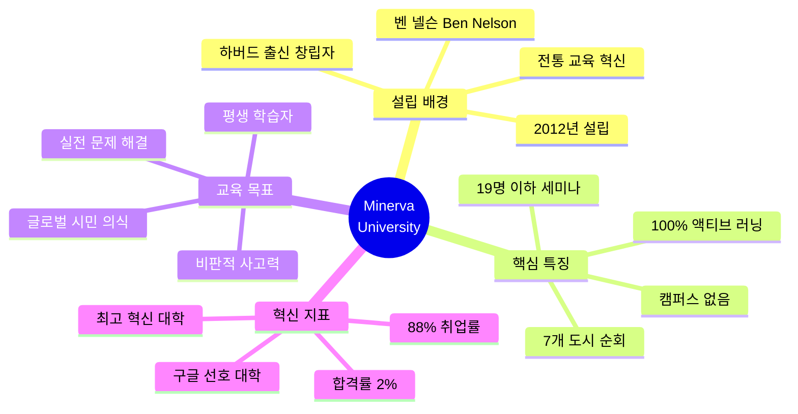
```mermaid
mindmap
  root((Minerva<br/>University))
    설립 배경
      2012년 설립
      하버드 출신 창립자
      벤 넬슨 Ben Nelson
      전통 교육 혁신
    핵심 특징
      캠퍼스 없음
      7개 도시 순회
      100% 액티브 러닝
      19명 이하 세미나
    교육 목표
      비판적 사고력
      글로벌 시민 의식
      실전 문제 해결
      평생 학습자
    혁신 지표
      합격률 2%
      88% 취업률
      구글 선호 대학
      최고 혁신 대학
```

### 1.2 왜 미네르바가 혁신적인가?

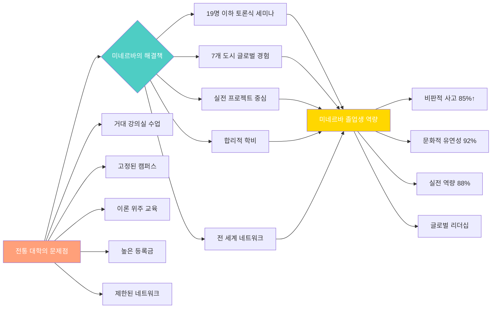
```mermaid
graph LR
    A[전통 대학의 문제점] --> B{미네르바의 해결책}
    
    A --> A1[거대 강의실 수업]
    A --> A2[고정된 캠퍼스]
    A --> A3[이론 위주 교육]
    A --> A4[높은 등록금]
    A --> A5[제한된 네트워크]
    
    B --> C1[19명 이하 토론식 세미나]
    B --> C2[7개 도시 글로벌 경험]
    B --> C3[실전 프로젝트 중심]
    B --> C4[합리적 학비]
    B --> C5[전 세계 네트워크]
    
    C1 --> D[미네르바 졸업생 역량]
    C2 --> D
    C3 --> D
    C4 --> D
    C5 --> D
    
    D --> E1[비판적 사고 85%↑]
    D --> E2[문화적 유연성 92%]
    D --> E3[실전 역량 88%]
    D --> E4[글로벌 리더십]
    
    style A fill:#FFA07A,color:#fff
    style B fill:#4ECDC4,color:#fff
    style D fill:#FFD700,color:#fff
```

### 1.3 미네르바 vs 전통 명문대 비교

| 비교 항목 | 🏛️ 하버드/스탠퍼드 | 🌍 미네르바 대학교 | 미네르바 장점 |
|----------|----------------|---------------|------------|
| **캠퍼스** | 고정 캠퍼스 | 7개 도시 순회 | 글로벌 실전 경험 |
| **수업 규모** | 100-300명 강의 | 19명 이하 세미나 | 깊은 참여와 토론 |
| **수업 방식** | 교수 강의 위주 | 100% 액티브 러닝 | 비판적 사고 강화 |
| **프로젝트** | 학기말 과제 | 매주 실전 프로젝트 | 포트폴리오 풍부 |
| **기업 연계** | 인턴십 선택 | 7개 도시 기업 협업 | 실무 경험 극대화 |
| **합격률** | 3-5% | 2% | 더 선발적 |
| **등록금** | $50,000-60,000 | $23,630 (2024-25) | 절반 수준 |
| **네트워크** | 미국 중심 | 전 세계 | 글로벌 인맥 |
| **취업률** | 75-80% | 88% (6개월 내) | 높은 성과 |

---

## 2. 교육 철학과 혁신

### 2.1 미네르바의 4대 핵심 역량 (HC: Habits and Concepts)

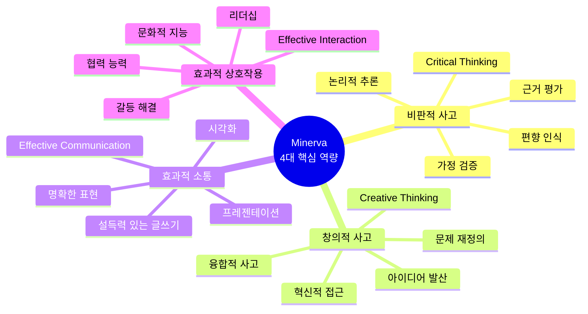
```mermaid
mindmap
  root((Minerva<br/>4대 핵심 역량))
    비판적 사고
      Critical Thinking
      논리적 추론
      가정 검증
      근거 평가
      편향 인식
    창의적 사고
      Creative Thinking
      문제 재정의
      아이디어 발산
      혁신적 접근
      융합적 사고
    효과적 소통
      Effective Communication
      명확한 표현
      설득력 있는 글쓰기
      프레젠테이션
      시각화
    효과적 상호작용
      Effective Interaction
      협력 능력
      리더십
      문화적 지능
      갈등 해결
```

### 2.2 액티브 러닝 (Active Learning) 방식

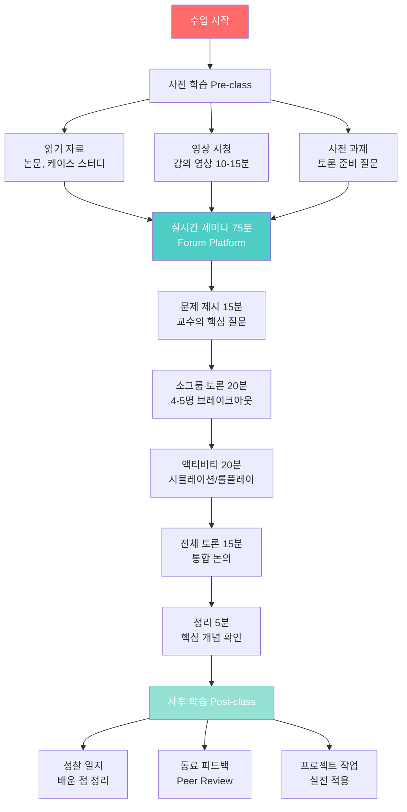
```mermaid
graph TD
    A[수업 시작] --> B[사전 학습 Pre-class]
    
    B --> B1[읽기 자료<br/>논문, 케이스 스터디]
    B --> B2[영상 시청<br/>강의 영상 10-15분]
    B --> B3[사전 과제<br/>토론 준비 질문]
    
    B1 --> C[실시간 세미나 75분<br/>Forum Platform]
    B2 --> C
    B3 --> C
    
    C --> C1[문제 제시 15분<br/>교수의 핵심 질문]
    C1 --> C2[소그룹 토론 20분<br/>4-5명 브레이크아웃]
    C2 --> C3[액티비티 20분<br/>시뮬레이션/롤플레이]
    C3 --> C4[전체 토론 15분<br/>통합 논의]
    C4 --> C5[정리 5분<br/>핵심 개념 확인]
    
    C5 --> D[사후 학습 Post-class]
    
    D --> D1[성찰 일지<br/>배운 점 정리]
    D --> D2[동료 피드백<br/>Peer Review]
    D --> D3[프로젝트 작업<br/>실전 적용]
    
    style A fill:#FF6B6B,color:#fff
    style C fill:#4ECDC4,color:#fff
    style D fill:#95E1D3,color:#fff
```

### 2.3 소크라테스식 질문법 실제 예시

**전통 수업 vs 미네르바 수업**

| 주제 | 전통 대학 | 미네르바 대학교 |
|------|---------|--------------|
| **기후변화** | 교수: "기후변화의 원인은 온실가스 증가입니다." | 교수: "기후변화가 인간이 만든 문제라고 확신할 수 있는 근거는 무엇인가요?" |
| **학생 반응** | (필기하며 듣기) | 학생들이 데이터 분석, 반론 제시, 근거 토론 |
| **AI 윤리** | 교수: "AI는 편향 문제가 있습니다." | 교수: "AI의 편향이 누구에게 해를 끼칠까요? 어떻게 측정할 수 있을까요?" |
| **학생 반응** | (개념 이해) | 사례 분석, 편향 측정 방법 토론, 해결책 제안 |
| **경제 정책** | 교수: "케인즈 이론은..." | 교수: "만약 정부가 지출을 늘린다면 단기/장기적으로 어떤 일이 일어날까요?" |
| **학생 반응** | (이론 암기) | 시나리오 시뮬레이션, 다양한 관점 토론 |

### 2.4 미네르바의 혁신적 평가 방식

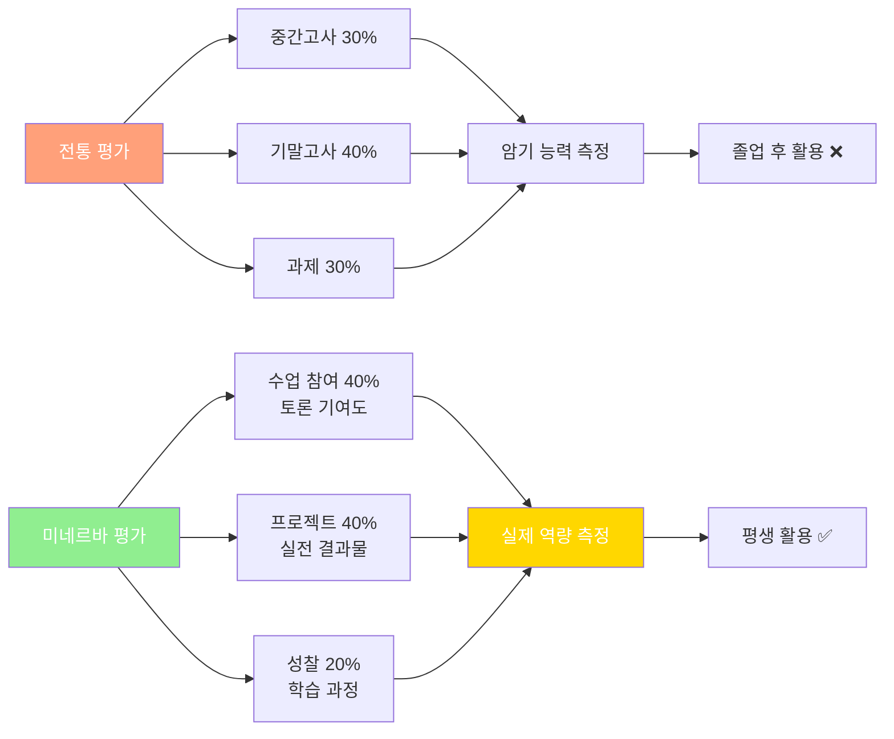
```mermaid
graph LR
    A[전통 평가] --> A1[중간고사 30%]
    A --> A2[기말고사 40%]
    A --> A3[과제 30%]
    
    B[미네르바 평가] --> B1[수업 참여 40%<br/>토론 기여도]
    B --> B2[프로젝트 40%<br/>실전 결과물]
    B --> B3[성찰 20%<br/>학습 과정]
    
    A1 --> C1[암기 능력 측정]
    A2 --> C1
    A3 --> C1
    
    B1 --> C2[실제 역량 측정]
    B2 --> C2
    B3 --> C2
    
    C1 --> D1[졸업 후 활용 ❌]
    C2 --> D2[평생 활용 ✅]
    
    style A fill:#FFA07A,color:#fff
    style B fill:#90EE90,color:#fff
    style C2 fill:#FFD700,color:#fff
```

---

## 3. 4년 글로벌 커리큘럼

### 3.1 2025년 업데이트된 글로벌 로테이션 모델

```mermaid
timeline
    title 미네르바 4년 글로벌 여정 (2025년 모델)
    
    section 1학년: Foundation Year
        샌프란시스코 : 가을학기 + 봄학기
                     : Cornerstone 4과목
                     : 미국 문화 체험
                     : 기초 역량 집중 훈련
    
    section 2학년: Orientation Year
        도쿄 일본 : 가을학기 + 봄학기
                  : 전공 선택
                  : 아시아 문화
                  : 일본 기업 협업
    
    section 3학년: Focus Year
        선택 도시 1 : 베를린/부에노스아이레스/하이데라바드/서울/타이페이
                   : 전공 심화
                   : 지역 프로젝트
        선택 도시 2 : 다른 도시 선택
                   : 연구 프로젝트
    
    section 4학년: Synthesis Year
        선택 도시 3 : 베를린/부에노스아이레스/하이데라바드/서울/타이페이
                   : 캡스톤 프로젝트
        샌프란시스코 : Manifest 발표
                     : 졸업식
```

### 3.2 각 도시에서 배우는 것

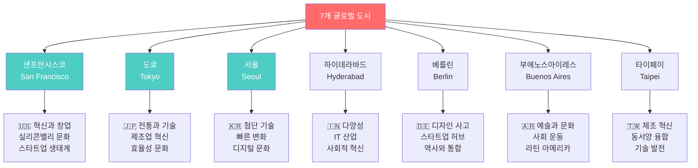
```mermaid
graph TD
    A[7개 글로벌 도시] --> B[샌프란시스코<br/>San Francisco]
    A --> C[도쿄<br/>Tokyo]
    A --> D[서울<br/>Seoul]
    A --> E[하이데라바드<br/>Hyderabad]
    A --> F[베를린<br/>Berlin]
    A --> G[부에노스아이레스<br/>Buenos Aires]
    A --> H[타이페이<br/>Taipei]
    
    B --> B1[🇺🇸 혁신과 창업<br/>실리콘밸리 문화<br/>스타트업 생태계]
    C --> C1[🇯🇵 전통과 기술<br/>제조업 혁신<br/>효율성 문화]
    D --> D1[🇰🇷 첨단 기술<br/>빠른 변화<br/>디지털 문화]
    E --> E1[🇮🇳 다양성<br/>IT 산업<br/>사회적 혁신]
    F --> F1[🇩🇪 디자인 사고<br/>스타트업 허브<br/>역사와 통합]
    G --> G1[🇦🇷 예술과 문화<br/>사회 운동<br/>라틴 아메리카]
    H --> H1[🇹🇼 제조 혁신<br/>동서양 융합<br/>기술 발전]
    
    style A fill:#FF6B6B,color:#fff
    style B fill:#4ECDC4,color:#fff
    style C fill:#4ECDC4,color:#fff
    style D fill:#4ECDC4,color:#fff
```

### 3.3 도시별 실제 프로젝트 예시

| 도시 | 학기 | 협력 기관/기업 | 프로젝트 주제 | 학생 활동 | 결과물 |
|------|------|-------------|-------------|----------|--------|
| **샌프란시스코** | 1학년 가을 | Salesforce | 비영리단체 디지털 전환 | CRM 시스템 설계 | 실제 도입 제안서 |
| **도쿄** | 2학년 가을 | Sony | 차세대 UX 디자인 | 사용자 리서치, 프로토타입 | UI/UX 개선안 |
| **서울** | 3학년 봄 | 삼성전자 | AI 스마트홈 혁신 | IoT 통합 솔루션 | POC 개발 |
| **하이데라바드** | 3학년 가을 | Microsoft India | 교육 격차 해소 AI | 학습 플랫폼 설계 | 파일럿 프로그램 |
| **베를린** | 3학년 봄 | Siemens | 지속가능 에너지 | 에너지 효율화 시스템 | 실증 테스트 |
| **부에노스아이레스** | 4학년 가을 | 비영리단체 | 사회적 기업 모델 | 비즈니스 플랜 | 실제 사업 런칭 |
| **타이페이** | 4학년 봄 | TSMC | 반도체 공급망 최적화 | 데이터 분석, AI 모델 | 최적화 알고리즘 |

---

## 4. 학년별 교육 과정

### 4.1 1학년 - 기초 역량 (Foundation Year)

**위치:** 샌프란시스코 (가을학기 + 봄학기)

**4대 코너스톤 과목 (Cornerstone Courses)**

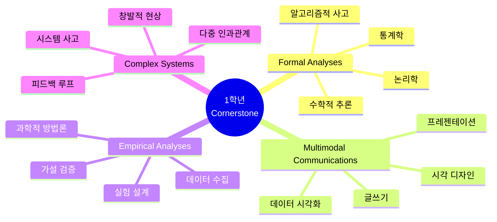
```mermaid
mindmap
  root((1학년<br/>Cornerstone))
    Formal Analyses
      논리학
      통계학
      알고리즘적 사고
      수학적 추론
    Multimodal Communications
      글쓰기
      프레젠테이션
      시각 디자인
      데이터 시각화
    Empirical Analyses
      과학적 방법론
      가설 검증
      실험 설계
      데이터 수집
    Complex Systems
      시스템 사고
      다중 인과관계
      피드백 루프
      창발적 현상
```

**1학년 샘플 스케줄**

| 학기 | 과목 | 주당 시간 | 주요 내용 | 평가 방식 |
|------|------|----------|---------|----------|
| **가을** | Formal Analyses | 6시간 | 논리, 통계, 알고리즘 | 문제 해결 프로젝트 |
| | Multimodal Communications | 6시간 | 효과적 소통 기술 | 프레젠테이션, 에세이 |
| **봄** | Empirical Analyses | 6시간 | 과학적 연구 방법 | 연구 프로젝트 |
| | Complex Systems | 6시간 | 복잡계 이해 | 시스템 분석 보고서 |

### 4.2 2학년 - 전공 집중 (Orientation Year)

**위치:** 도쿄 (가을학기 + 봄학기)

**전공 선택 (5개 전공)**

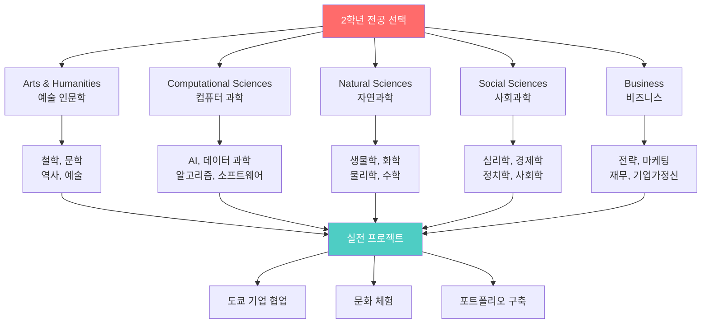
```mermaid
graph TD
    A[2학년 전공 선택] --> B1[Arts & Humanities<br/>예술 인문학]
    A --> B2[Computational Sciences<br/>컴퓨터 과학]
    A --> B3[Natural Sciences<br/>자연과학]
    A --> B4[Social Sciences<br/>사회과학]
    A --> B5[Business<br/>비즈니스]
    
    B1 --> C1[철학, 문학<br/>역사, 예술]
    B2 --> C2[AI, 데이터 과학<br/>알고리즘, 소프트웨어]
    B3 --> C3[생물학, 화학<br/>물리학, 수학]
    B4 --> C4[심리학, 경제학<br/>정치학, 사회학]
    B5 --> C5[전략, 마케팅<br/>재무, 기업가정신]
    
    C1 --> D[실전 프로젝트]
    C2 --> D
    C3 --> D
    C4 --> D
    C5 --> D
    
    D --> E1[도쿄 기업 협업]
    D --> E2[문화 체험]
    D --> E3[포트폴리오 구축]
    
    style A fill:#FF6B6B,color:#fff
    style D fill:#4ECDC4,color:#fff
```

**2학년 실제 프로젝트 사례: AI 전공**

| 학기 | 과목 | 프로젝트 | 협력 기업 | 결과 |
|------|------|---------|----------|------|
| **가을** | Machine Learning 기초 | 일본어 감정 분석 AI | 라쿠텐 | 95% 정확도 모델 |
| | 데이터 구조 | 도쿄 교통 최적화 | 도쿄 메트로 | 혼잡도 예측 앱 |
| **봄** | 딥러닝 | 애니메이션 스타일 변환 | 애니메이션 스튜디오 | GAN 모델 개발 |
| | AI 윤리 | AI 편향 분석 | Sony AI | 윤리 가이드라인 |

### 4.3 3-4학년 - 심화 및 통합 (Focus & Synthesis Years)

**위치:** 선택 도시 (베를린/부에노스아이레스/하이데라바드/서울/타이페이)

**캡스톤 프로젝트 (Capstone Project)**

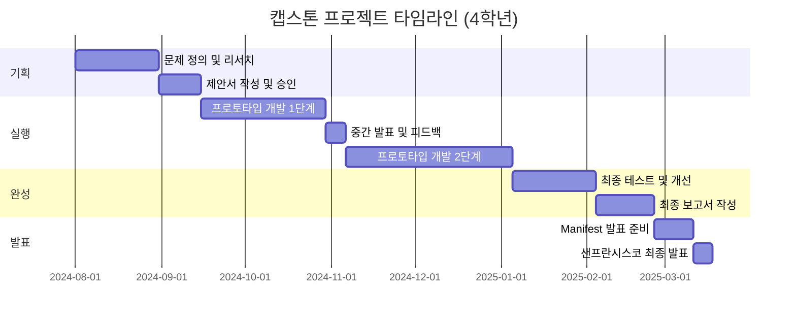
```mermaid
gantt
    title 캡스톤 프로젝트 타임라인 (4학년)
    dateFormat YYYY-MM-DD
    
    section 기획
    문제 정의 및 리서치        :2024-08-01, 30d
    제안서 작성 및 승인        :2024-08-31, 15d
    
    section 실행
    프로토타입 개발 1단계      :2024-09-15, 45d
    중간 발표 및 피드백        :2024-10-30, 7d
    프로토타입 개발 2단계      :2024-11-06, 60d
    
    section 완성
    최종 테스트 및 개선        :2025-01-05, 30d
    최종 보고서 작성          :2025-02-04, 21d
    
    section 발표
    Manifest 발표 준비        :2025-02-25, 14d
    샌프란시스코 최종 발표     :2025-03-11, 7d
```

**실제 캡스톤 프로젝트 사례**

| 학생 팀 | 전공 | 프로젝트 제목 | 도시 | 성과 |
|---------|------|-------------|------|------|
| 3명 | Computational Sciences | 의료 영상 AI 진단 시스템 | 서울 | 병원 파일럿 테스트 |
| 4명 | Social Sciences + Business | 난민 교육 플랫폼 | 베를린 | NGO 채택, 5개국 확산 |
| 5명 | Natural Sciences | 미세플라스틱 감지 센서 | 타이페이 | 특허 출원, 스타트업 |
| 3명 | Arts & Humanities | AI 윤리 교육 게임 | 부에노스아이레스 | 10개 학교 도입 |
| 4명 | Business | 농업 공급망 블록체인 | 하이데라바드 | 시드 투자 $100K |

---

## 5. 전공 및 부전공

### 5.1 5대 전공 상세 정보

#### 📚 1. Arts & Humanities (예술 인문학)

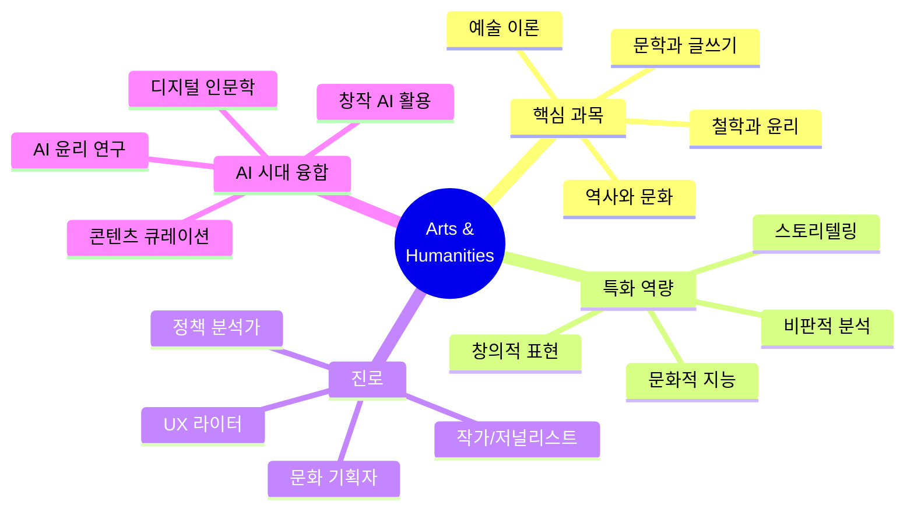
```mermaid
mindmap
  root((Arts &<br/>Humanities))
    핵심 과목
      철학과 윤리
      문학과 글쓰기
      역사와 문화
      예술 이론
    특화 역량
      비판적 분석
      창의적 표현
      문화적 지능
      스토리텔링
    진로
      작가/저널리스트
      문화 기획자
      UX 라이터
      정책 분석가
    AI 시대 융합
      AI 윤리 연구
      창작 AI 활용
      디지털 인문학
      콘텐츠 큐레이션
```

**샘플 커리큘럼**

| 학년 | 필수 과목 | 선택 과목 | 프로젝트 |
|------|----------|----------|---------|
| 2학년 | 철학 입문, 문학 분석 | 동양 철학, 현대 문학 | 문화 비평 에세이 |
| 3학년 | 윤리학, 예술사 | AI 윤리, 디지털 스토리텔링 | 다큐멘터리 제작 |
| 4학년 | 캡스톤 세미나 | 고급 주제 선택 | 윤리 가이드라인 개발 |

---

#### 💻 2. Computational Sciences (컴퓨터 과학)

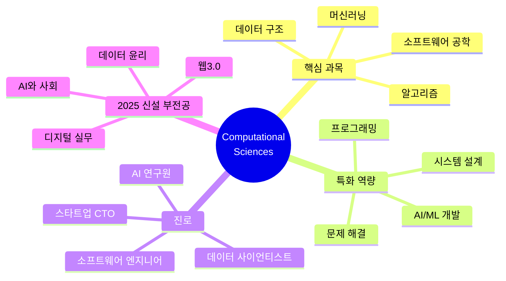
```mermaid
mindmap
  root((Computational<br/>Sciences))
    핵심 과목
      알고리즘
      데이터 구조
      머신러닝
      소프트웨어 공학
    특화 역량
      프로그래밍
      시스템 설계
      AI/ML 개발
      문제 해결
    진로
      소프트웨어 엔지니어
      데이터 사이언티스트
      AI 연구원
      스타트업 CTO
    2025 신설 부전공
      디지털 실무
      AI와 사회
      데이터 윤리
      웹3.0
```

**AI 교육 특화 커리큘럼**

| 학년 | 과목 | AI 프로젝트 | 사용 도구 |
|------|------|-----------|----------|
| **2학년** | Python 프로그래밍 | 챗봇 개발 | OpenAI API |
| | 머신러닝 기초 | 이미지 분류 모델 | TensorFlow |
| **3학년** | 딥러닝 | 자연어 처리 프로젝트 | PyTorch, Hugging Face |
| | AI 윤리 | 편향 감지 시스템 | Fairness Indicators |
| **4학년** | 고급 AI | 생성형 AI 응용 | GPT-4, DALL-E 3 |
| | 캡스톤 | 실전 AI 시스템 | 선택 (Full Stack) |

---

#### 🔬 3. Natural Sciences (자연과학)

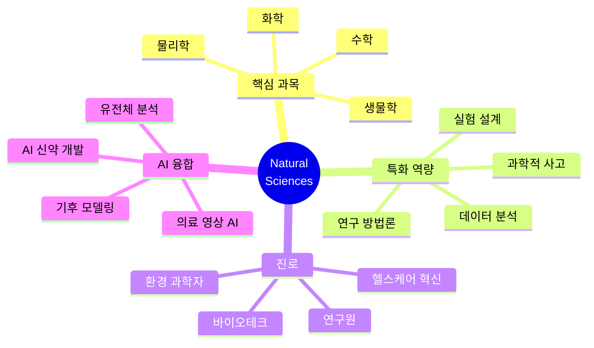
```mermaid
mindmap
  root((Natural<br/>Sciences))
    핵심 과목
      생물학
      화학
      물리학
      수학
    특화 역량
      과학적 사고
      실험 설계
      데이터 분석
      연구 방법론
    진로
      연구원
      바이오테크
      헬스케어 혁신
      환경 과학자
    AI 융합
      AI 신약 개발
      유전체 분석
      기후 모델링
      의료 영상 AI
```

---

#### 🌍 4. Social Sciences (사회과학)

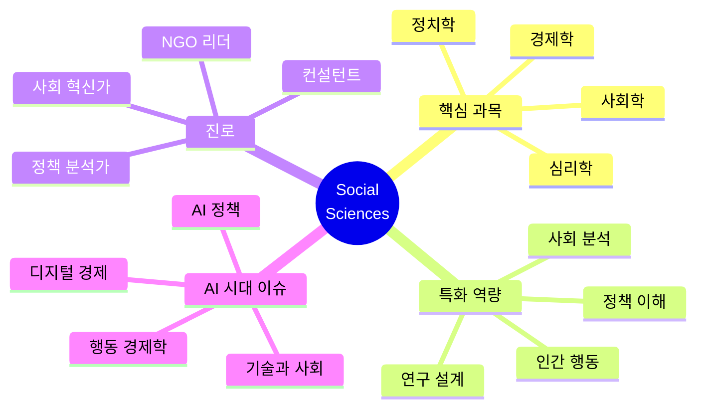
```mermaid
mindmap
  root((Social<br/>Sciences))
    핵심 과목
      심리학
      경제학
      정치학
      사회학
    특화 역량
      사회 분석
      정책 이해
      인간 행동
      연구 설계
    진로
      정책 분석가
      NGO 리더
      사회 혁신가
      컨설턴트
    AI 시대 이슈
      AI 정책
      디지털 경제
      기술과 사회
      행동 경제학
```

---

#### 💼 5. Business (비즈니스)

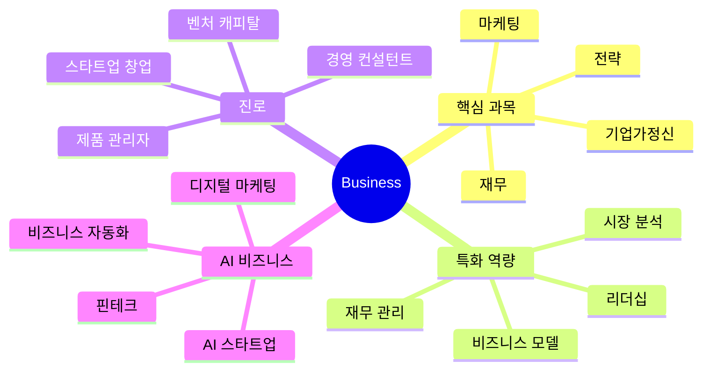
```mermaid
mindmap
  root((Business))
    핵심 과목
      전략
      마케팅
      재무
      기업가정신
    특화 역량
      비즈니스 모델
      시장 분석
      재무 관리
      리더십
    진로
      경영 컨설턴트
      스타트업 창업
      제품 관리자
      벤처 캐피탈
    AI 비즈니스
      AI 스타트업
      디지털 마케팅
      핀테크
      비즈니스 자동화
```

### 5.2 2024-2025년 신설 부전공

#### 🆕 Interdisciplinary Digital Practices (학제간 디지털 실무)

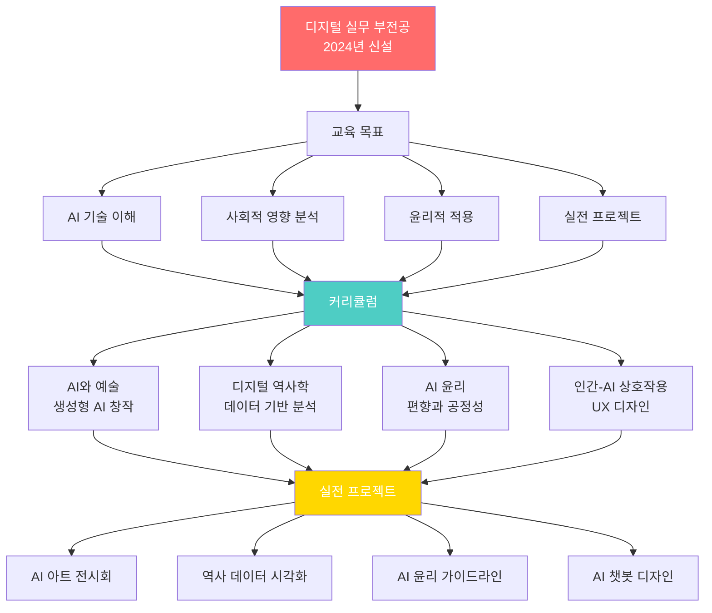
```mermaid
graph TD
    A[디지털 실무 부전공<br/>2024년 신설] --> B[교육 목표]
    
    B --> B1[AI 기술 이해]
    B --> B2[사회적 영향 분석]
    B --> B3[윤리적 적용]
    B --> B4[실전 프로젝트]
    
    B1 --> C[커리큘럼]
    B2 --> C
    B3 --> C
    B4 --> C
    
    C --> C1[AI와 예술<br/>생성형 AI 창작]
    C --> C2[디지털 역사학<br/>데이터 기반 분석]
    C --> C3[AI 윤리<br/>편향과 공정성]
    C --> C4[인간-AI 상호작용<br/>UX 디자인]
    
    C1 --> D[실전 프로젝트]
    C2 --> D
    C3 --> D
    C4 --> D
    
    D --> E1[AI 아트 전시회]
    D --> E2[역사 데이터 시각화]
    D --> E3[AI 윤리 가이드라인]
    D --> E4[AI 챗봇 디자인]
    
    style A fill:#FF6B6B,color:#fff
    style C fill:#4ECDC4,color:#fff
    style D fill:#FFD700,color:#fff
```

#### 🌱 Sustainability (지속가능성)

**2022년 신설, 환경과 사회를 위한 학제간 접근**

| 과목 | 내용 | AI 활용 | 프로젝트 예시 |
|------|------|---------|-------------|
| **기후 변화** | 기후 과학, 정책 | AI 기후 모델링 | 탄소 배출 예측 시스템 |
| **지속가능 비즈니스** | 순환 경제, ESG | AI 공급망 최적화 | 친환경 물류 플랫폼 |
| **사회적 영향** | 환경 정의, 불평등 | 데이터 분석 | 취약 지역 리스크 맵핑 |
| **재생 에너지** | 청정 에너지, 기술 | AI 에너지 관리 | 스마트 그리드 설계 |

---

## 6. 입학 전형

### 6.1 미네르바 입학의 특징

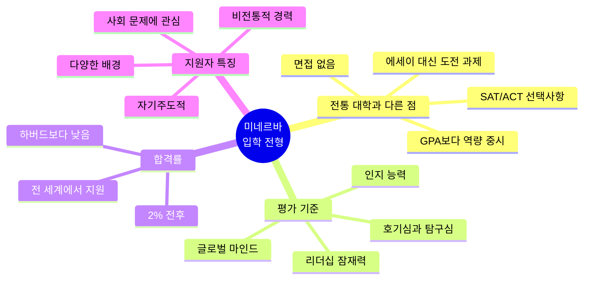
```mermaid
mindmap
  root((미네르바<br/>입학 전형))
    전통 대학과 다른 점
      SAT/ACT 선택사항
      GPA보다 역량 중시
      에세이 대신 도전 과제
      면접 없음
    평가 기준
      인지 능력
      호기심과 탐구심
      리더십 잠재력
      글로벌 마인드
    합격률
      2% 전후
      하버드보다 낮음
      전 세계에서 지원
    지원자 특징
      다양한 배경
      비전통적 경력
      사회 문제에 관심
      자기주도적
```

### 6.2 2026년 가을 입학 전형 일정

| 전형 | 지원 마감 | 재정지원 마감 | 합격 발표 | 특징 |
|------|----------|-------------|----------|------|
| **Early Action** | 2025년 11월 1일 | 11월 8일 | 12월 19일 | Binding 옵션 가능 |
| **Regular Decision I** | 2026년 1월 13일 | 1월 20일 | 3월 5일 | 일반 전형 |
| **Regular Decision II** | 2026년 2월 24일 | 3월 3일 | 4월 10일 | 추가 기회 |
| **Extended Decision** | 2026년 4월 7일 | 4월 14일 | 4월 24일 | 최종 전형 |

### 6.3 입학 지원 3단계 프로세스

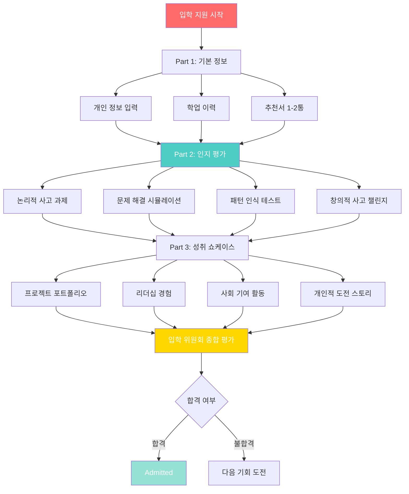
```mermaid
graph TD
    A[입학 지원 시작] --> B[Part 1: 기본 정보]
    
    B --> B1[개인 정보 입력]
    B --> B2[학업 이력]
    B --> B3[추천서 1-2통]
    
    B1 --> C[Part 2: 인지 평가]
    B2 --> C
    B3 --> C
    
    C --> C1[논리적 사고 과제]
    C --> C2[문제 해결 시뮬레이션]
    C --> C3[패턴 인식 테스트]
    C --> C4[창의적 사고 챌린지]
    
    C1 --> D[Part 3: 성취 쇼케이스]
    C2 --> D
    C3 --> D
    C4 --> D
    
    D --> D1[프로젝트 포트폴리오]
    D --> D2[리더십 경험]
    D --> D3[사회 기여 활동]
    D --> D4[개인적 도전 스토리]
    
    D1 --> E[입학 위원회 종합 평가]
    D2 --> E
    D3 --> E
    D4 --> E
    
    E --> F{합격 여부}
    F -->|합격| G[Admitted]
    F -->|불합격| H[다음 기회 도전]
    
    style A fill:#FF6B6B,color:#fff
    style C fill:#4ECDC4,color:#fff
    style E fill:#FFD700,color:#fff
    style G fill:#95E1D3,color:#fff
```

### 6.4 입학 지원서 Part 2: 인지 평가 예시

**실제 문제 유형 (공개된 샘플)**

| 평가 영역 | 문제 유형 | 예시 | 평가 목적 |
|----------|----------|------|----------|
| **논리적 추론** | 패턴 완성 | 숫자/도형 시퀀스 | 귀납적 사고 |
| **비판적 사고** | 주장 평가 | 논증의 강점/약점 분석 | 논리적 분석 |
| **문제 해결** | 시뮬레이션 | 자원 배분 최적화 게임 | 전략적 사고 |
| **창의성** | 오픈 엔디드 | "만약 중력이 없다면?" | 상상력, 아이디어 |
| **데이터 해석** | 차트 분석 | 그래프에서 인사이트 도출 | 분석 능력 |

### 6.5 합격자 프로필 (실제 사례)

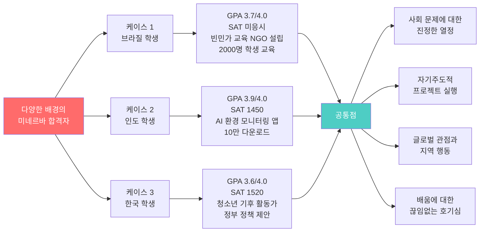
```mermaid
graph LR
    A[다양한 배경의<br/>미네르바 합격자] --> B1[케이스 1<br/>브라질 학생]
    A --> B2[케이스 2<br/>인도 학생]
    A --> B3[케이스 3<br/>한국 학생]
    
    B1 --> C1[GPA 3.7/4.0<br/>SAT 미응시<br/>빈민가 교육 NGO 설립<br/>2000명 학생 교육]
    
    B2 --> C2[GPA 3.9/4.0<br/>SAT 1450<br/>AI 환경 모니터링 앱<br/>10만 다운로드]
    
    B3 --> C3[GPA 3.6/4.0<br/>SAT 1520<br/>청소년 기후 활동가<br/>정부 정책 제안]
    
    C1 --> D[공통점]
    C2 --> D
    C3 --> D
    
    D --> E1[사회 문제에 대한<br/>진정한 열정]
    D --> E2[자기주도적<br/>프로젝트 실행]
    D --> E3[글로벌 관점과<br/>지역 행동]
    D --> E4[배움에 대한<br/>끊임없는 호기심]
    
    style A fill:#FF6B6B,color:#fff
    style D fill:#4ECDC4,color:#fff
```

### 6.6 입학 준비 로드맵

**고등학교 1학년부터 시작하기**

| 학년 | 학업 | 프로젝트 | 리더십 | AI 활용 |
|------|------|---------|--------|---------|
| **9학년** | 기초 과목 충실 | 관심 분야 탐색 | 동아리 가입 | AI 도구 체험 |
| **10학년** | 심화 과목 선택 | 소규모 프로젝트 시작 | 동아리 임원 | ChatGPT로 조사 |
| **11학년** | AP/IB 도전 | 사회 문제 해결 프로젝트 | 활동 주도 | AI 프로젝트 개발 |
| **12학년** | 성적 유지 | 캡스톤 프로젝트 | 영향력 확장 | 포트폴리오 완성 |

---

## 7. 학비 및 장학금

### 7.1 2024-2025년 학비 구조

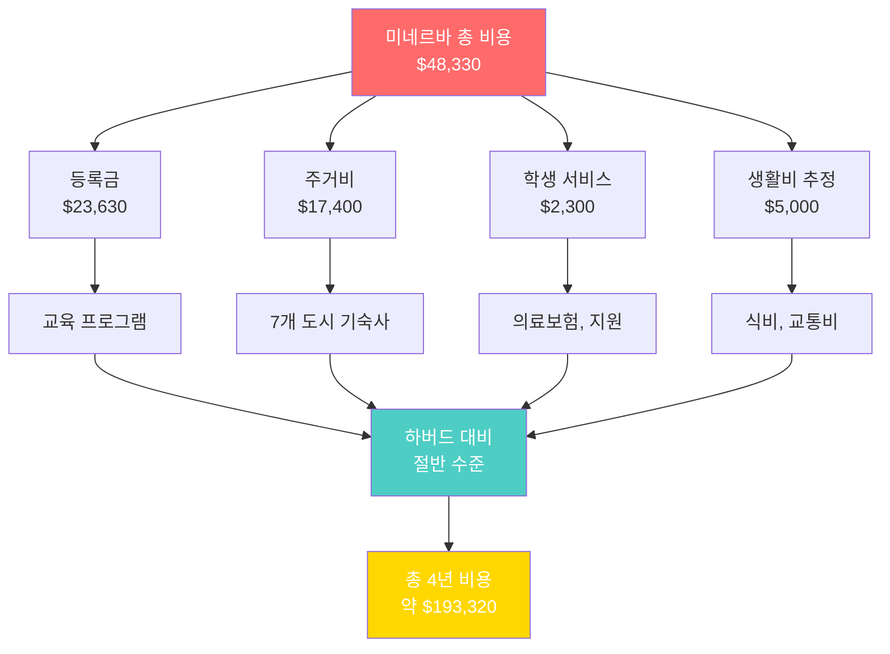
```mermaid
graph TD
    A[미네르바 총 비용<br/>$48,330] --> B[등록금<br/>$23,630]
    A --> C[주거비<br/>$17,400]
    A --> D[학생 서비스<br/>$2,300]
    A --> E[생활비 추정<br/>$5,000]
    
    B --> F[교육 프로그램]
    C --> G[7개 도시 기숙사]
    D --> H[의료보험, 지원]
    E --> I[식비, 교통비]
    
    F --> J[하버드 대비<br/>절반 수준]
    G --> J
    H --> J
    I --> J
    
    J --> K[총 4년 비용<br/>약 $193,320]
    
    style A fill:#FF6B6B,color:#fff
    style J fill:#4ECDC4,color:#fff
    style K fill:#FFD700,color:#fff
```

### 7.2 전통 명문대 vs 미네르바 비용 비교

| 대학 | 연간 등록금 | 주거/식비 | 기타 | 총 비용 | 4년 총액 |
|------|-----------|---------|------|--------|--------|
| **하버드** | $54,269 | $18,389 | $7,000 | $79,658 | $318,632 |
| **스탠퍼드** | $58,416 | $19,922 | $6,500 | $84,838 | $339,352 |
| **MIT** | $57,986 | $17,800 | $7,000 | $82,786 | $331,144 |
| **미네르바** | $23,630 | $17,400 | $7,300 | $48,330 | $193,320 |

**💰 절감액: 약 $125,000 - $145,000 (4년 기준)**

### 7.3 재정 지원 (Financial Aid)

```mermaid
mindmap
  root((미네르바<br/>재정 지원))
    Need-Based Only
      Merit 장학금 없음
      필요 기반 지원
      공정한 기회
    지원 구성
      저금리 학자금 대출
      Work-Study $5000/년
      Need-Based 장학금
      외부 장학금 병행
    신청 방법
      CSS Profile 제출
      재정 설문 작성
      소득/자산 증빙
      마감일 엄수
    지원 범위
      100% 필요 충족
      평균 지원 $25000
      국제학생 포함
      매년 재심사
```

### 7.4 외부 장학금 사례

**미네르바 학생들이 받은 외부 장학금**

| 장학금 재단 | 금액 | 대상 | 미네르바 수혜 학생 수 |
|-----------|------|------|-------------------|
| **Masason Foundation** | 전액 + 생활비 | 아시아 우수 학생 | 5-10명/년 |
| **Last Mile Fund** | $10,000-50,000 | 아프리카 학생 | 3-7명/년 |
| **Amazon Future Engineer** | $10,000 | STEM 학생 | 10-15명/년 |
| **Adobe Circle Scholarship** | $5,000-25,000 | 창의적 프로젝트 | 5-8명/년 |
| **Jack Kent Cooke Foundation** | 최대 $40,000/년 | 미국 저소득층 우수학생 | 2-5명/년 |

### 7.5 Work-Study 프로그램

**연간 최대 $5,000 벌 수 있는 기회**

```mermaid
graph LR
    A[Work-Study<br/>프로그램] --> B[교내 업무]
    A --> C[지역 사회]
    A --> D[온라인 업무]
    
    B --> B1[학생 멘토<br/>$15-20/시간]
    B --> B2[입학 지원<br/>$18-22/시간]
    B --> B3[연구 조교<br/>$20-25/시간]
    
    C --> C1[NGO 인턴<br/>$15-20/시간]
    C --> C2[스타트업 파트타임<br/>$20-30/시간]
    
    D --> D1[콘텐츠 제작<br/>$18-25/시간]
    D --> D2[튜터링<br/>$25-40/시간]
    
    B1 --> E[장점]
    B2 --> E
    B3 --> E
    C1 --> E
    C2 --> E
    D1 --> E
    D2 --> E
    
    E --> F1[실무 경험]
    E --> F2[네트워크 구축]
    E --> F3[이력서 강화]
    E --> F4[재정 부담 완화]
    
    style A fill:#FF6B6B,color:#fff
    style E fill:#4ECDC4,color:#fff
```

---

## 📊 핵심 요약표

### 미네르바 대학교 한눈에 보기

| 항목 | 내용 |
|------|------|
| **설립** | 2012년, 벤 넬슨 창립 |
| **위치** | 7개 글로벌 도시 (캠퍼스 없음) |
| **학생 수** | 약 1,000명 (학년당 250명) |
| **합격률** | 약 2% (2024년 기준) |
| **등록금** | $23,630/년 (2024-25) |
| **총 비용** | $48,330/년 |
| **4년 총액** | 약 $193,320 |
| **재정 지원** | 평균 $25,000/년 |
| **전공** | 5개 (예술인문/컴퓨터/자연과학/사회과학/비즈니스) |
| **부전공** | 디지털 실무, 지속가능성 등 |
| **수업 방식** | 100% 액티브 러닝, 19명 이하 세미나 |
| **취업률** | 88% (6개월 내) |
| **대학원 진학** | 우수 (MIT, 스탠퍼드 등) |

---

*다음 2부에서는 AI 교육, 프로젝트 사례, 취업 창업, 졸업생 후기를 다룹니다.*

**© 2025 미네르바 대학교 가이드. All rights reserved.**
*최종 업데이트: 2025년 12월 11일*