# 미네르바 대학교 완벽 가이드 (3부: 3세~12세 교육 패스)

 
 


---

## 📑 목차

1. [15년 프로젝트 개요](#1-15년-프로젝트-개요)
2. [3-4세: 호기심의 씨앗](#2-3-4세-호기심의-씨앗)
3. [5-7세: 질문하는 아이](#3-5-7세-질문하는-아이)
4. [8-10세: 탐구하는 학생](#4-8-10세-탐구하는-학생)
5. [11-12세: 프로젝트 리더](#5-11-12세-프로젝트-리더)
6. [유아~초등 추천 도서](#6-유아초등-추천-도서)

---

## 1. 15년 프로젝트 개요

### 1.1 미네르바 준비 마스터 플랜

```mermaid
timeline
    title 3세부터 시작하는 미네르바 대학교 준비 로드맵
    
    section 3-4세: 씨앗 심기
        프뢰벨 놀이 교육 : 자유 놀이
                         : 오감 발달
                         : 기본 사회성
    
    section 5-7세: 싹 틔우기
        호기심 폭발 : 끊임없는 질문
                    : 관찰과 탐구
                    : 간단한 프로젝트
    
    section 8-10세: 뿌리 내리기
        기초 프로젝트 : 문제 발견
                      : 팀 협력
                      : AI 도구 체험
    
    section 11-12세: 줄기 자라기
        본격 PBL : 사회 문제 인식
                 : 실행 프로젝트
                 : 발표와 공유
    
    section 13-15세: 가지 치기
        심화 프로젝트 : 전문성 개발
                      : 멘토 찾기
                      : 대회 참가
    
    section 16-18세: 열매 맺기
        미네르바 준비 : 캡스톤 프로젝트
                      : 사회적 영향
                      : 포트폴리오 완성
```

### 1.2 연령별 핵심 역량 개발

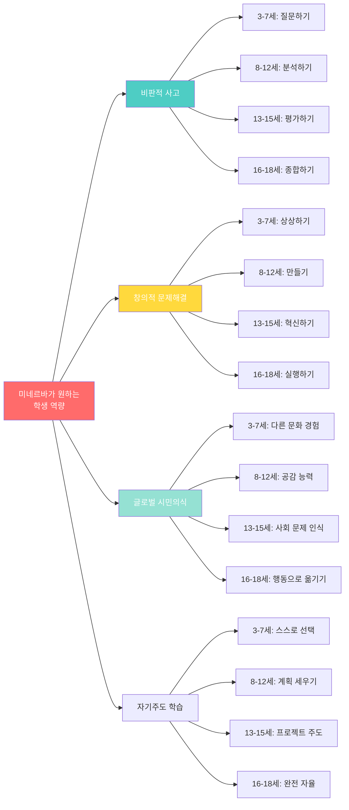

### 1.3 프로젝트 개수 및 복잡도 로드맵

| 연령대 | 프로젝트 수 | 평균 기간 | 복잡도 | 결과물 예시 |
|--------|-----------|----------|--------|-----------|
| **3-4세** | 연 10-15개 | 1-2주 | ⭐ | 블록 작품, 그림 |
| **5-7세** | 연 12-20개 | 2-4주 | ⭐⭐ | 관찰 일기, 간단한 발명품 |
| **8-10세** | 연 8-12개 | 1-2개월 | ⭐⭐⭐ | 탐구 보고서, 프로토타입 |
| **11-12세** | 연 6-8개 | 2-3개월 | ⭐⭐⭐⭐ | 앱, 캠페인, 사회 프로젝트 |
| **13-15세** | 연 4-6개 | 3-6개월 | ⭐⭐⭐⭐ | 연구 논문, 스타트업 MVP |
| **16-18세** | 연 2-4개 | 6-12개월 | ⭐⭐⭐⭐⭐ | 사회적 영향 프로젝트 |

**총 누적: 약 60-80개 프로젝트 (15년간)**

---

## 2. 3-4세: 호기심의 씨앗

### 2.1 교육 목표

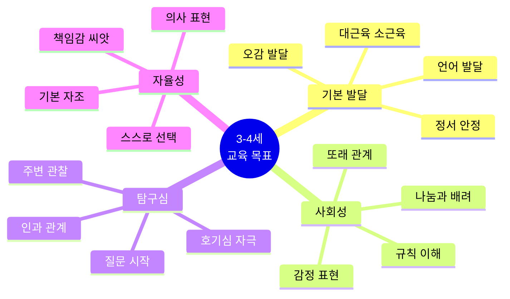

### 2.2 일과 구성 (프뢰벨 놀이 중심)

| 시간 | 활동 | 목적 | 미네르바 연계 |
|------|------|------|-------------|
| **오전 9-10시** | 자유 놀이 | 창의성, 사회성 | 자기주도 선택 능력 |
| **오전 10-11시** | 감각 놀이 (물, 모래, 점토) | 탐구심, 집중력 | 관찰과 실험 정신 |
| **오전 11-12시** | 그림책, 이야기 | 상상력, 언어 | 질문하는 습관 |
| **오후 2-3시** | 바깥 놀이 | 신체 발달, 탐구 | 자연 관찰 |
| **오후 3-4시** | 만들기 활동 | 창의성, 소근육 | 프로젝트 기초 |
| **오후 4-5시** | 발표/공유 시간 | 표현력, 자신감 | 프레젠테이션 기초 |

### 2.3 월별 미니 프로젝트 (3-4세)

#### 🌱 1월: "우리 집 탐험"

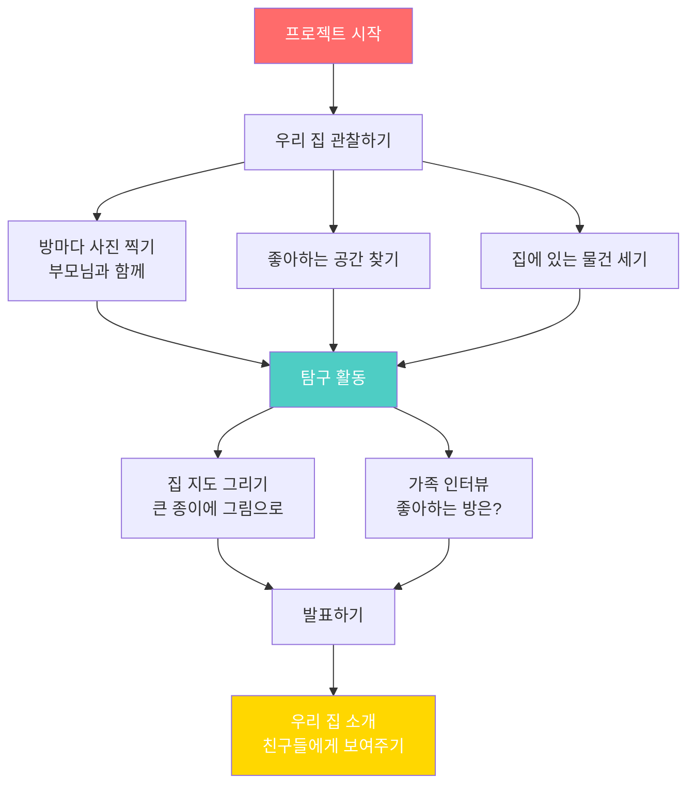

**배우는 것:**
- 관찰 능력 (집의 구조, 물건)
- 기본 수 개념 (방 개수, 의자 개수)
- 표현력 (그림으로 설명)
- 가족 소통

**부모의 역할:**
- 함께 탐험하며 질문하기
- "왜 거실이 제일 클까?"
- "침실에는 뭐가 있을까?"
- 그림 그리기 도와주기

---

#### 🌸 3월: "봄 관찰 프로젝트"

| 주차 | 활동 | 관찰 대상 | 기록 방법 |
|------|------|----------|----------|
| **1주** | 씨앗 심기 | 강낭콩 | 그림으로 그리기 |
| **2주** | 매일 관찰 | 싹 트는 모습 | 사진 찍기 (부모님) |
| **3주** | 변화 기록 | 잎 나오기 | 크기 재기 (손가락으로) |
| **4주** | 발표 준비 | 한 달 변화 | "우리 콩이" 발표 |

**AI 연계 (부모님이 도와주기):**
- 📱 식물 인식 앱으로 주변 꽃 이름 알아보기
- 🎨 AI 그림 도구로 상상의 꽃 만들어보기
- 🎥 타임랩스 영상으로 성장 과정 보기

---

#### 🌈 6월: "색깔 프로젝트"

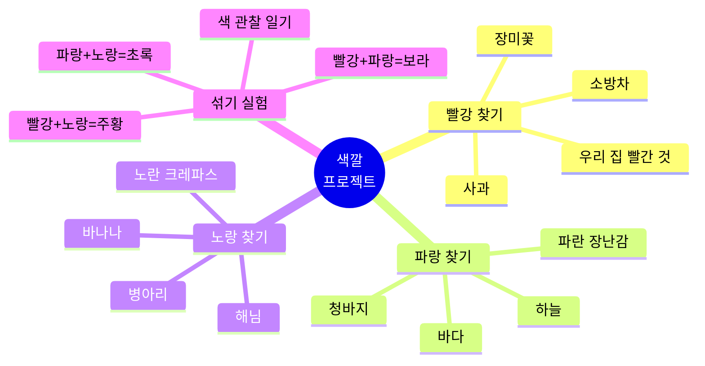

**활동:**
1. **1주:** 집에서 색깔 찾기 (사진 찍기)
2. **2주:** 바깥에서 색깔 찾기 (산책)
3. **3주:** 색 섞기 실험 (물감 놀이)
4. **4주:** 나만의 무지개 만들기 (작품 전시)

---

### 2.4 3-4세 AI 체험 활동

**목표: AI를 마법처럼 신기한 도구로 경험하기**

| AI 도구 | 활동 | 배우는 것 | 주의사항 |
|---------|------|----------|----------|
| **음성 비서** | "알렉사, 공룡 노래 틀어줘" | 말로 요청하기 | 하루 30분 이내 |
| **사진 인식** | 식물 이름 찾기 앱 | 관찰과 분류 | 부모님과 함께 |
| **그림 AI** | 간단한 AI 그림 앱 | 창의적 표현 | 스크린 타임 제한 |
| **음악 추천** | 어린이 음악 플레이리스트 | 취향 발견 | 적절한 콘텐츠 |

**부모 가이드:**
- ⏰ 디지털 기기 사용 시간: 하루 총 1시간 이내
- 👨‍👩‍👧 항상 부모와 함께 사용
- 💬 AI가 어떻게 작동하는지 간단히 설명
- 🎨 디지털과 아날로그 놀이 균형

---

## 3. 5-7세: 질문하는 아이

### 3.1 교육 목표

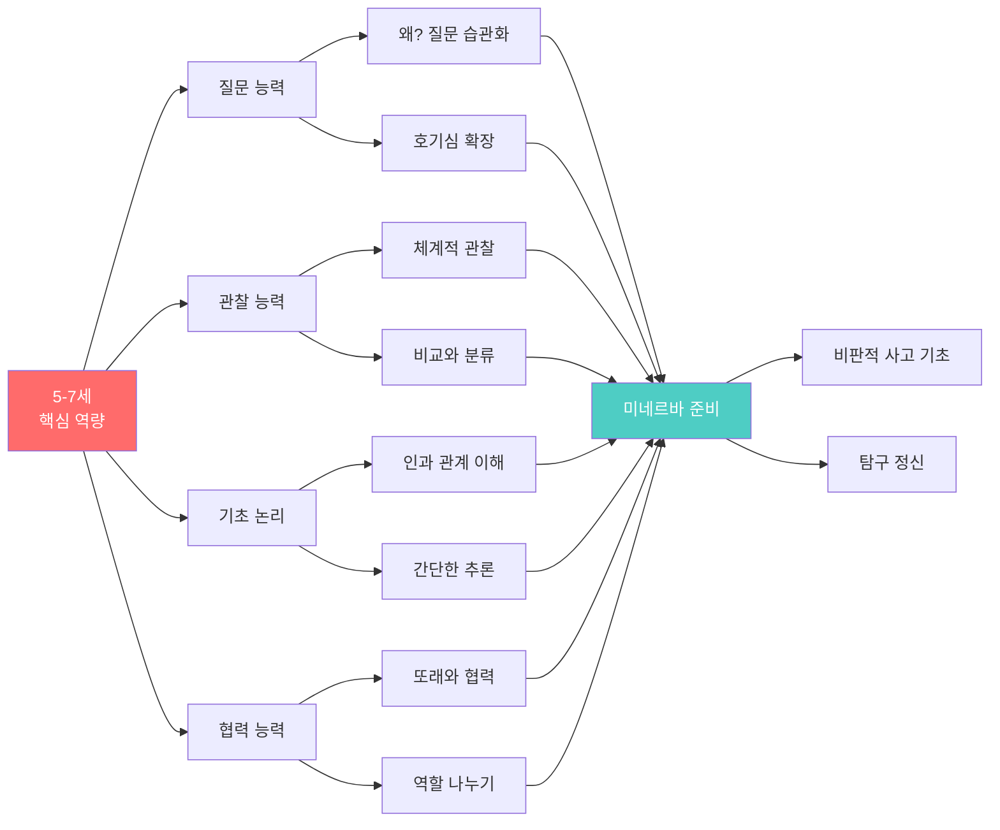

### 3.2 학기별 프로젝트 (5-7세)

#### 📚 1학기 (3-7월): "우리 동네 탐험가"

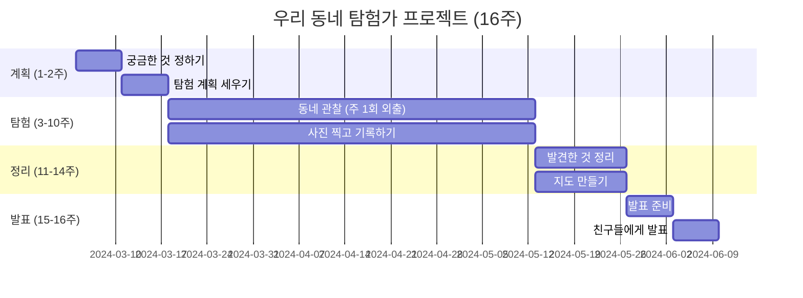

**주차별 활동:**

| 주 | 활동 | 관찰 대상 | 질문 |
|----|------|----------|------|
| **1주** | 계획 세우기 | 무엇을 알고 싶나? | "동네에 공원이 몇 개?" |
| **2주** | 지도 보기 | 우리 집 위치 찾기 | "왜 지도가 필요할까?" |
| **3-4주** | 공원 탐험 | 나무, 꽃, 놀이터 | "왜 공원이 필요할까?" |
| **5-6주** | 상점 관찰 | 빵집, 슈퍼마켓 | "어떤 가게가 많을까?" |
| **7-8주** | 교통 조사 | 버스 정류장, 횡단보도 | "사람들은 어떻게 이동할까?" |
| **9-10주** | 사람들 관찰 | 다양한 직업 | "누가 동네를 돌볼까?" |
| **11-12주** | 정리하기 | 발견한 것 분류 | "가장 중요한 것은?" |
| **13-14주** | 지도 만들기 | 큰 종이에 그리기 | "어떻게 표현할까?" |
| **15-16주** | 발표 준비 | 이야기 만들기 | "친구들에게 뭘 알려줄까?" |

**AI 활용:**
- 🗺️ Google Maps로 우리 동네 위성 사진 보기
- 📸 AI 사진 앱으로 건물, 식물 이름 알아보기
- 🎨 발표 자료를 Canva Kids로 만들기
- 🎤 ChatGPT에게 "우리 동네에 뭐가 있으면 좋을까?" 질문하기

**결과물:**
- 📍 우리 동네 지도 (그림)
- 📷 관찰 사진 앨범 (30-50장)
- 📝 탐험 일기 (부모님 도움으로 매주 기록)
- 🎤 5분 발표 (친구들 앞에서)

---

#### 🔬 2학기 (9-12월): "왜 그럴까? 과학 탐구"

**주제 선택 (4개 중 1개):**

1. **물과 놀기**
   - 물은 왜 위에서 아래로 흐를까?
   - 얼음은 왜 녹을까?
   - 배는 왜 물에 뜰까?

2. **자석의 비밀**
   - 자석은 왜 붙을까?
   - 모든 것이 다 붙을까?
   - 자석으로 무엇을 할 수 있을까?

3. **빛과 그림자**
   - 그림자는 왜 생길까?
   - 햇빛 vs 전등 빛 차이는?
   - 그림자로 놀이하기

4. **식물 키우기**
   - 식물은 무엇이 필요할까?
   - 햇빛 있을 때 vs 없을 때
   - 물 많이 vs 적게

**프로젝트 진행:**

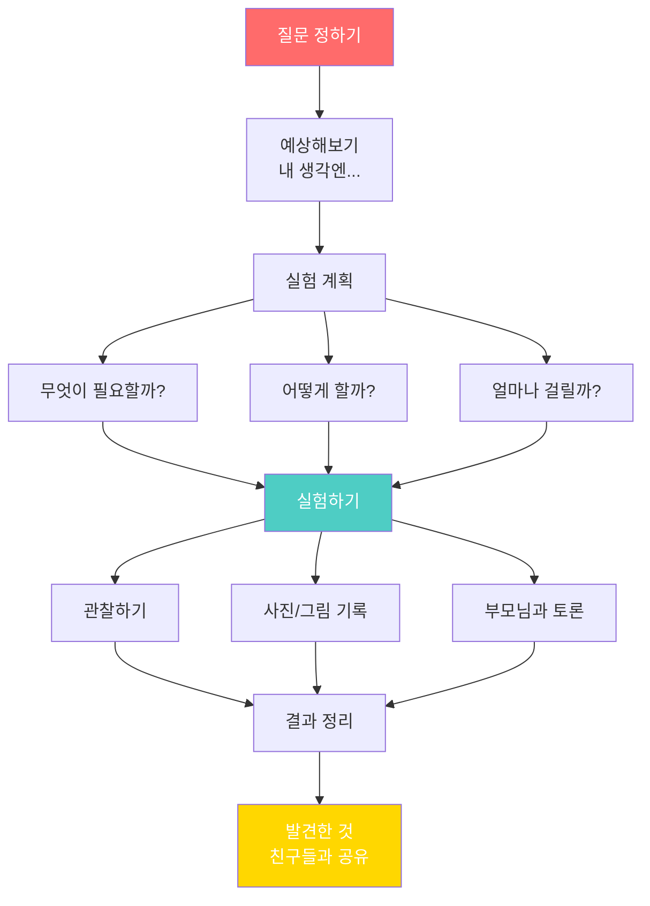

**AI 활용 (부모님 도움):**
- 🔍 YouTube Kids에서 과학 실험 영상 보기
- 💬 ChatGPT에게 "자석은 어떻게 작동해?" 질문
- 📊 관찰 결과를 간단한 그래프로 만들기
- 🎥 실험 과정 동영상 찍어서 타임랩스 만들기

---

### 3.3 5-7세 AI 활용 프로젝트

#### 프로젝트: "AI 친구와 함께하는 동화 만들기"

**도구:** ChatGPT (부모님 계정), AI 그림 생성기

**진행 (4주):**

| 주 | 활동 | AI 역할 | 아이 역할 |
|----|------|---------|----------|
| **1주** | 이야기 아이디어 | ChatGPT에게 "공룡과 로봇이 친구가 되는 이야기" 요청 | 상상하기, 수정하기 |
| **2주** | 캐릭터 만들기 | AI 그림 생성기로 캐릭터 그림 | 색깔, 모양 선택 |
| **3주** | 이야기 완성 | ChatGPT와 대화하며 스토리 발전 | 다음 내용 제안 |
| **4주** | 책 만들기 | 부모님이 편집 도움 | 그림 배치, 발표 |

**배우는 것:**
- 💡 AI가 창작의 파트너가 될 수 있음
- 🤔 AI 제안을 비판적으로 평가 ("이 부분은 다르게 하고 싶어요")
- 🎨 기술과 창의성의 결합
- 📚 스토리텔링 능력

---

### 3.4 가정에서 실천하기

**일상 속 질문 습관 만들기**

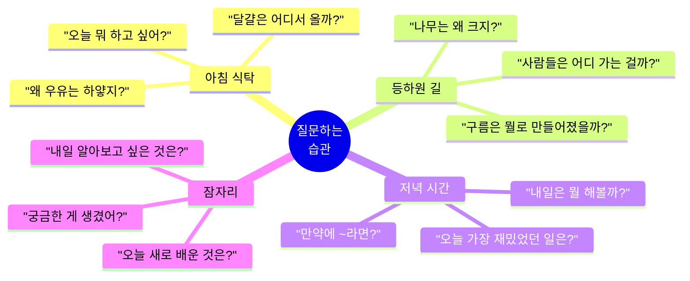

**부모의 질문 스킬:**

| 나쁜 질문 ❌ | 좋은 질문 ✅ | 효과 |
|-----------|-----------|------|
| "이거 색깔이 뭐야?" | "이 색을 보니 뭐가 떠올라?" | 상상력 자극 |
| "정답은 빨강이야" | "왜 빨강이라고 생각해?" | 논리적 사고 |
| "그건 안 돼" | "안 되는 이유가 뭘까?" | 비판적 사고 |
| "조용히 해" | "어떻게 생각해?" | 의견 표현 |

---

## 4. 8-10세: 탐구하는 학생

### 4.1 교육 목표

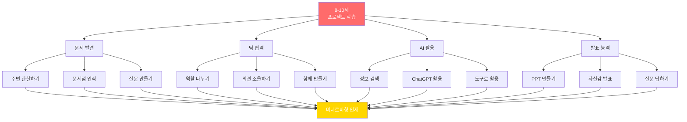

### 4.2 연간 프로젝트 로드맵 (8-10세)

| 시기 | 프로젝트 | 기간 | 주제 | AI 활용 |
|------|---------|------|------|---------|
| **3-5월** | 봄 학기 프로젝트 | 12주 | 환경 보호 | 데이터 조사 |
| **6-8월** | 여름 방학 프로젝트 | 8주 | 자유 주제 | 만들기 도구 |
| **9-11월** | 가을 학기 프로젝트 | 12주 | 우리 학교 개선 | 설문 분석 |
| **12-2월** | 겨울 방학 프로젝트 | 8주 | 독서와 창작 | AI 글쓰기 |

---

### 4.3 대표 프로젝트: "플라스틱 줄이기 캠페인" (3-5월, 12주)

#### 프로젝트 타임라인

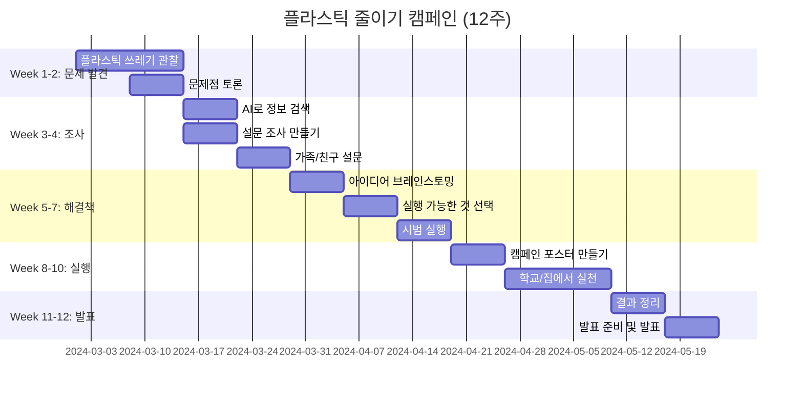

#### 주차별 상세 활동

**Week 1-2: 문제 발견**

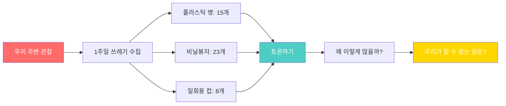

**활동:**
- 📊 가족 쓰레기 1주일 분류하고 세기
- 📷 사진 찍어서 기록하기
- 💭 친구들과 토론: "왜 플라스틱이 문제일까?"
- 📝 질문 목록 만들기

---

**Week 3-4: AI로 조사하기**

**ChatGPT 활용 (부모님과 함께):**

| 질문 | AI 답변 활용 | 학생 활동 |
|------|------------|----------|
| "플라스틱이 환경에 미치는 영향은?" | 정보 정리 | 요약 노트 작성 |
| "플라스틱을 줄이는 방법 10가지" | 아이디어 얻기 | 우리 상황에 맞게 수정 |
| "초등학생이 할 수 있는 캠페인은?" | 사례 학습 | 우리만의 계획 세우기 |

**설문 조사 만들기 (Google Forms + AI):**

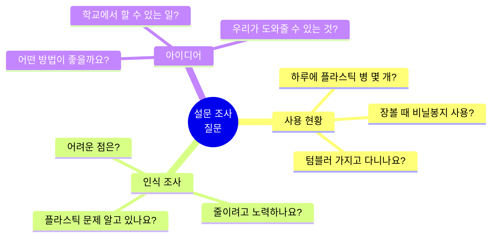

**AI 도움:**
- 📝 ChatGPT에게 "초등학생용 설문 질문 만들어줘"
- 📊 Google Sheets로 자동 집계
- 📈 AI가 그래프 만들어주기

**결과:**
- 가족 20명, 친구 30명, 이웃 15명 = 총 65명 응답
- 데이터 분석: "90%가 플라스틱 줄이기 원하지만 실천은 30%만"

---

**Week 5-7: 해결책 개발**

**브레인스토밍 (팀 4-5명):**

| 아이디어 | 실행 가능성 | 영향력 | 선택 |
|---------|-----------|-------|------|
| 학교에 텀블러 대여 | ⭐⭐⭐ | ⭐⭐⭐ | ✅ |
| 일회용 컵 금지 | ⭐ | ⭐⭐⭐⭐ | ❌ (너무 어려움) |
| 플라스틱 없는 날 | ⭐⭐⭐⭐ | ⭐⭐ | ✅ |
| 포스터 캠페인 | ⭐⭐⭐⭐⭐ | ⭐⭐ | ✅ |
| 재활용 교육 | ⭐⭐⭐⭐ | ⭐⭐⭐ | ✅ |

**선택된 3가지:**
1. 매주 수요일 "플라스틱 없는 날"
2. AI로 만든 포스터 캠페인
3. 재활용 교육 영상 제작

**AI 활용:**
- 🎨 DALL-E로 캠페인 포스터 디자인
- 📝 ChatGPT로 슬로건 만들기
- 🎬 Canva로 교육 영상 편집

---

**Week 8-10: 실행**

**활동 기록표:**

| 주 | 활동 | 참여자 | 결과 |
|----|------|--------|------|
| **8주** | 포스터 10개 부착 | 전교생 200명 | 인식 향상 |
| **9주** | 수요일 텀블러 사용 | 1학년 30명 참여 | 플라스틱 컵 30개 절약 |
| **10주** | 재활용 교육 | 3개 반 90명 | 분리수거 정확도 향상 |

**측정 가능한 성과:**
- 📉 학교 플라스틱 쓰레기 25% 감소
- 📈 텀블러 사용 학생 15% → 45% 증가
- 🎯 200명 인식 개선

---

**Week 11-12: 발표 및 성찰**

**발표 자료 구성 (PPT 15슬라이드):**

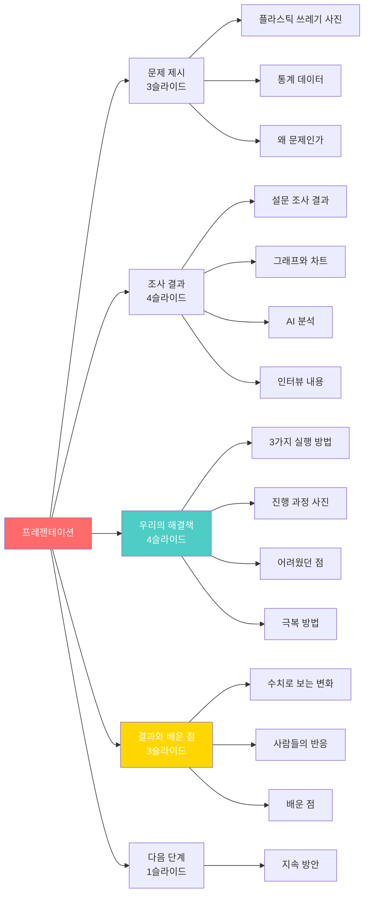

**발표 연습:**
- 🎤 팀원별 역할 분담 (각자 3분)
- ⏱️ 총 12분 발표 + 3분 질의응답
- 🎥 동영상 촬영해서 피드백
- 🤝 학부모, 선생님, 친구들 앞에서 발표

**배운 점 (성찰 일기):**
- "설문조사가 생각보다 어려웠다"
- "AI가 포스터 만들기를 도와줘서 좋았다"
- "작은 실천이 큰 변화를 만든다는 걸 알았다"
- "팀원들과 의견이 안 맞을 때 대화로 해결했다"

---

### 4.4 8-10세 AI 활용 가이드

#### AI 도구 활용 능력

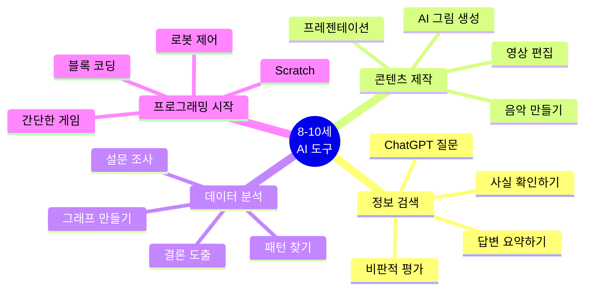

#### 프로젝트별 AI 활용 예시

| 프로젝트 주제 | AI 도구 | 사용 목적 | 학습 효과 |
|------------|---------|----------|----------|
| **환경 캠페인** | ChatGPT | 정보 조사, 슬로건 | 정보 활용 능력 |
| | DALL-E | 포스터 디자인 | 창의적 표현 |
| | Google Forms | 설문 제작 및 분석 | 데이터 해석 |
| **학교 개선** | Canva | 제안서 만들기 | 시각화 능력 |
| | ChatGPT | 아이디어 확장 | 문제 해결 |
| **발명품** | Tinkercad | 3D 디자인 | 공간 지각 |
| | Scratch | 프로그래밍 | 논리적 사고 |
| **이야기 창작** | ChatGPT | 스토리 개발 | 창의적 글쓰기 |
| | Midjourney | 삽화 제작 | 예술적 표현 |

---

## 5. 11-12세: 프로젝트 리더

### 5.1 교육 목표

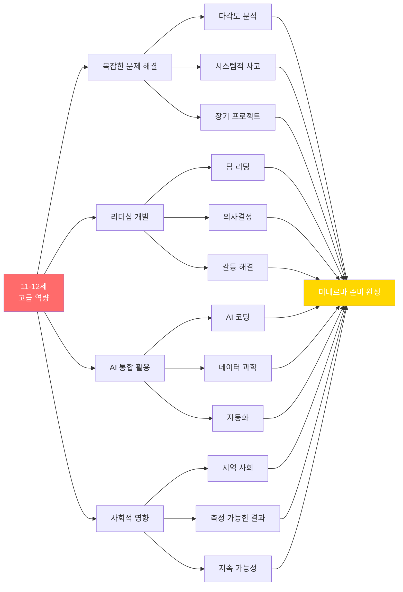

### 5.2 연간 대형 프로젝트 (11-12세)

| 학기 | 프로젝트 | 기간 | 규모 | 목표 |
|------|---------|------|------|------|
| **1학기** | 사회 문제 해결 | 5개월 | 팀 3-4명 | 실제 영향 창출 |
| **여름** | 창업 시뮬레이션 | 2개월 | 개인/팀 | 비즈니스 경험 |
| **2학기** | 기술 프로젝트 | 5개월 | 팀 3-4명 | 앱/웹 개발 |

---

### 5.3 대표 프로젝트: "어르신을 위한 AI 도우미" (5개월)

#### 프로젝트 개요

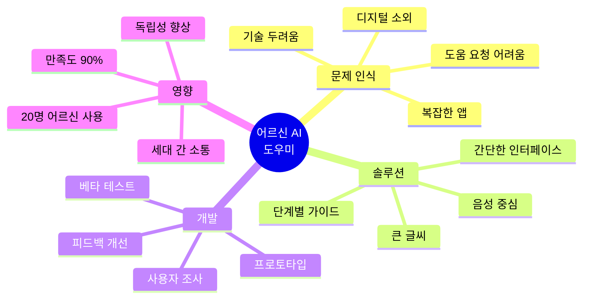

#### 5개월 타임라인

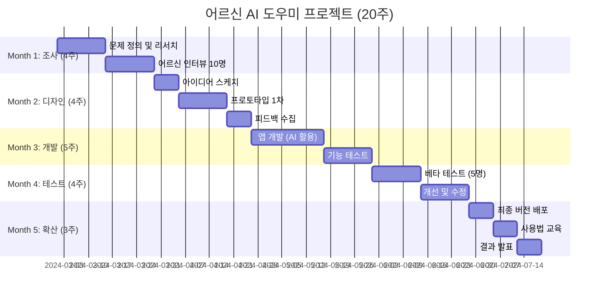

#### 단계별 상세 활동

**Month 1: 사용자 조사**

| 주 | 활동 | 방법 | 인사이트 |
|----|------|------|----------|
| **1주** | 문제 정의 | 뉴스 조사, ChatGPT 질문 | 어르신 50% 스마트폰 어려움 |
| **2주** | 인터뷰 준비 | 질문지 작성 | 경청과 공감이 중요 |
| **3주** | 인터뷰 진행 | 동네 경로당 방문 10명 | "버튼이 너무 작아요" |
| **4주** | 데이터 분석 | 공통 불편점 정리 | 상위 5가지 문제 도출 |

**인터뷰 질문 예시:**
- 스마트폰 사용하실 때 가장 어려운 점은?
- 어떤 앱을 가장 많이 쓰시나요?
- 도움이 필요할 때 누구에게 물어보시나요?
- 이런 기능이 있으면 좋겠다고 생각하신 적 있나요?

**발견한 Top 5 문제:**
1. 글씨가 너무 작아서 안 보임 (80%)
2. 버튼을 잘못 눌러서 실수 (70%)
3. 어디를 눌러야 할지 모름 (65%)
4. 음성 인식이 잘 안 됨 (60%)
5. 도움 요청하기 부끄러움 (55%)

---

**Month 2-3: 디자인 및 개발**

**프로토타입 특징:**

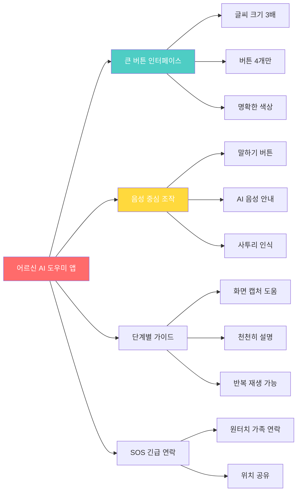

**개발 도구 (AI 활용):**
- 📱 **MIT App Inventor**: 블록 코딩으로 앱 개발
- 🤖 **ChatGPT API**: 음성 질문 답변
- 🎨 **Figma**: UI 디자인 (어르신 피드백 반영)
- 🗣️ **Google Speech API**: 음성 인식
- 🎨 **Canva**: 사용 설명서 제작

**개발 과정에서 배운 것:**
- Python 기초 (ChatGPT가 코드 설명)
- API 연결하는 법
- 사용자 중심 디자인
- 반복 개선의 중요성

---

**Month 4: 베타 테스트**

**테스트 참여자 5명:**

| 참여자 | 연령 | 스마트폰 경험 | 테스트 기간 | 피드백 |
|--------|------|-------------|-----------|--------|
| 김○○ 할머니 | 72세 | 초급 | 2주 | "버튼이 커서 좋아요" |
| 이○○ 할아버지 | 68세 | 중급 | 2주 | "음성이 편해요" |
| 박○○ 할머니 | 75세 | 초급 | 2주 | "손자한테 안 물어봐도 돼요" |
| 최○○ 할머니 | 70세 | 초급 | 2주 | "사투리도 알아들어요!" |
| 정○○ 할아버지 | 73세 | 중급 | 2주 | "설명이 친절해요" |

**측정 지표:**

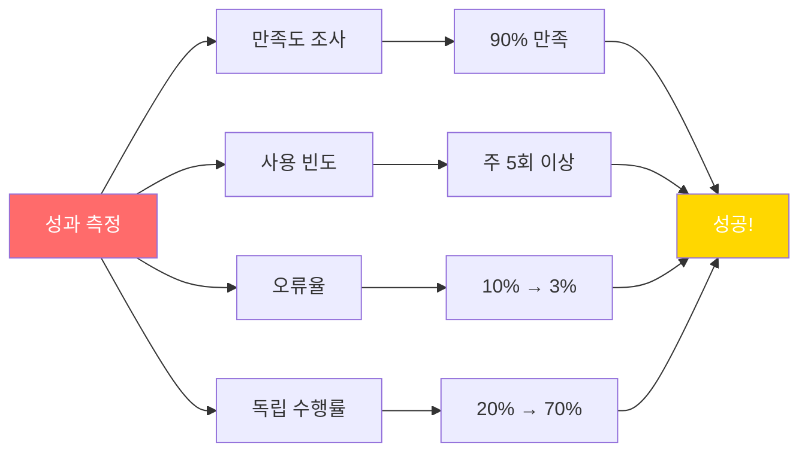

---

**Month 5: 확산 및 발표**

**성과:**
- 📱 앱 다운로드: 25명
- 📊 평균 만족도: 90%
- 💬 추천 의향: 95%
- 🏆 학교 과학 발표회 금상

**사회적 영향:**
- 어르신들의 디지털 독립성 향상
- 세대 간 소통 도구
- 지역 경로당에 무료 배포
- 시청에서 관심 표명

**학생들이 배운 것:**
- 👵 공감 능력: 사용자 관점에서 생각하기
- 💻 기술 능력: 앱 개발 전 과정 경험
- 🤝 협업: 4명이 역할 분담 (기획, 디자인, 개발, 테스트)
- 📊 데이터: 인터뷰와 설문 분석
- 🎤 발표: 복잡한 프로젝트를 명확히 설명
- 🌱 지속성: 5개월 장기 프로젝트 완수

**미네르바 입학 지원서에 활용:**
- 포트폴리오 메인 프로젝트
- 사회적 영향 증명
- 기술 역량 증명
- 리더십과 협업 증명

---

### 5.4 11-12세 AI 심화 활용

#### Python으로 간단한 AI 만들기

**프로젝트: "질문 답변 봇 만들기"**

```python
# ChatGPT API를 활용한 간단한 챗봇
# (부모님이 API 키 설정 도와주기)

import openai

def ask_ai(question):
    response = openai.ChatCompletion.create(
        model="gpt-3.5-turbo",
        messages=[{"role": "user", "content": question}]
    )
    return response.choices[0].message.content

# 사용 예시
question = input("궁금한 것을 물어보세요: ")
answer = ask_ai(question)
print(f"AI 답변: {answer}")
```

**배우는 것:**
- 기본 프로그래밍 개념
- API의 작동 원리
- AI를 도구로 활용하는 법
- 코드 구조 이해

---

## 6. 유아~초등 추천 도서

### 6.1 3-4세 그림책

| 책 제목 | 저자 | 주제 | 배우는 것 |
|---------|------|------|----------|
| **곰 사냥을 떠나자** | 마이클 로젠 | 모험 | 용기, 반복 패턴 |
| **배고픈 애벌레** | 에릭 칼 | 변화 | 관찰, 생명 주기 |
| **괜찮아** | 토드 파 | 감정 | 공감, 정서 발달 |
| **무지개 물고기** | 마커스 피스터 | 나눔 | 사회성, 협력 |
| **똥 싸개 행성** | 고정순 | 유머 | 상상력, 웃음 |

### 6.2 5-7세 그림책 & 동화

```mermaid
mindmap
  root((5-7세<br/>필독서))
    과학 탐구
      "과학자처럼 생각해요"
      "왜 그럴까요?"
      "놀라운 과학"
      "실험하는 아이들"
    문제 해결
      "생각을 모아요"
      "함께 해결해요"
      "아이디어가 번쩍"
      "작은 발명가"
    질문 능력
      "궁금한 게 많아요"
      "왜왜왜 백과"
      "질문이 답이다"
      "생각하는 아이"
    사회 이해
      "우리는 친구"
      "다르지만 같아요"
      "함께 사는 세상"
      "배려하는 마음"
```

### 6.3 8-10세 읽기 책

#### 과학/수학

| 책 제목 | 저자 | 추천 이유 | 프로젝트 연계 |
|---------|------|----------|-------------|
| **재밌어서 밤새읽는 과학 이야기** | 사마키 다케오 | 호기심 자극 | 과학 실험 프로젝트 |
| **수학 귀신** | 한스 엔첸스베르거 | 수학적 사고 | 패턴 찾기 프로젝트 |
| **세상을 바꾼 과학자** | 신현정 | 롤모델 발견 | 전기 프로젝트 |
| **Why? 시리즈** | 예림당 | 다양한 주제 | 주제별 탐구 |

#### 사회/역사

| 책 제목 | 주제 | 배우는 것 |
|---------|------|----------|
| **열두 살에 부자가 된 키라** | 경제 | 기업가정신 |
| **Who? 시리즈** | 위인 | 성장 마인드셋 |
| **나무를 심은 사람** | 환경 | 지속 가능성 |
| **어린이를 위한 세계사** | 역사 | 글로벌 시민의식 |

### 6.4 11-12세 심화 독서

#### 프로젝트/창업

```mermaid
graph LR
    A[11-12세<br/>추천 도서] --> B[비즈니스]
    A --> C[기술/코딩]
    A --> D[사회 혁신]
    A --> E[자기계발]
    
    B --> B1["어린이를 위한 경제학"]
    B --> B2["10대를 위한 돈의 철학"]
    B --> B3["세상을 바꾸는 착한 기업"]
    
    C --> C1["스크래치로 배우는 코딩"]
    C --> C2["AI 첫걸음"]
    C --> C3["메이커 다은쌤의 3D 프린팅"]
    
    D --> D1["체인지메이커"]
    D --> D2["10대와 통하는 환경 이야기"]
    D --> D3["착한 프로젝트"]
    
    E --> E1["마인드셋 성장의 힘"]
    E --> E2["습관의 힘"]
    E --> E3["생각하는 10대"]
    
    style A fill:#FF6B6B,color:#fff
    style B fill:#4ECDC4,color:#fff
    style C fill:#FFD93D,color:#fff
```

#### 영문 원서 (영어 가능한 학생)

| 책 제목 | 저자 | 레벨 | 주제 |
|---------|------|------|------|
| **The Lemonade War** | Jacqueline Davies | 중급 | 경제, 창업 |
| **Hatchet** | Gary Paulsen | 중급 | 생존, 문제 해결 |
| **Wonder** | R.J. Palacio | 중급 | 공감, 다양성 |
| **The Wild Robot** | Peter Brown | 초급 | AI, 공존 |

---

## 📊 유아~초등 교육 체크리스트

### 연령별 마일스톤

| 연령 | 프로젝트 수 | 발표 횟수 | AI 도구 | 목표 역량 |
|------|-----------|----------|---------|----------|
| **3-4세** | 10-15개/년 | 월 1회 | 음성비서 | 호기심, 관찰 |
| **5-7세** | 12-20개/년 | 월 2회 | ChatGPT 체험 | 질문, 탐구 |
| **8-10세** | 8-12개/년 | 분기 1회 큰 발표 | 검색, 제작 | 문제 해결, 협력 |
| **11-12세** | 6-8개/년 | 학기 1회 대발표 | 코딩, 분석 | 리더십, 영향력 |

### 미네르바 준비도 평가 (12세 기준)

```mermaid
graph LR
    A[미네르바 준비도] --> B[비판적 사고<br/>80%]
    A --> C[프로젝트 경험<br/>15개 이상]
    A --> D[AI 활용<br/>능숙]
    A --> E[발표 능력<br/>자신감]
    
    B --> F[Ready!]
    C --> F
    D --> F
    E --> F
    
    F --> G[중고등 심화 준비]
    
    style A fill:#FF6B6B,color:#fff
    style F fill:#4ECDC4,color:#fff
    style G fill:#FFD700,color:#fff
```

---

*다음 4부에서는 13-18세 중고등 교육 패스와 미네르바 실제 교재를 다룹니다.*

**© 2025 미네르바 준비 가이드. All rights reserved.**
*최종 업데이트: 2025년 12월 11일*
