# 미네르바 대학교 완벽 가이드 (4부: 13-18세 교육 패스 & 교재)

 
 


---

## 📑 목차

1. [13-15세: 전문성 개발](#1-13-15세-전문성-개발)
2. [16-18세: 미네르바 최종 준비](#2-16-18세-미네르바-최종-준비)
3. [미네르바 실제 교재 및 참고 도서](#3-미네르바-실제-교재-및-참고-도서)
4. [입학 지원 포트폴리오 구축](#4-입학-지원-포트폴리오-구축)
5. [최종 체크리스트](#5-최종-체크리스트)

---

## 1. 13-15세: 전문성 개발

### 1.1 중학생 교육 목표

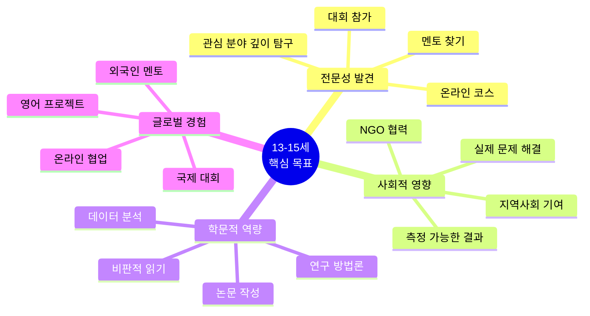

### 1.2 연간 프로젝트 구조 (13-15세)

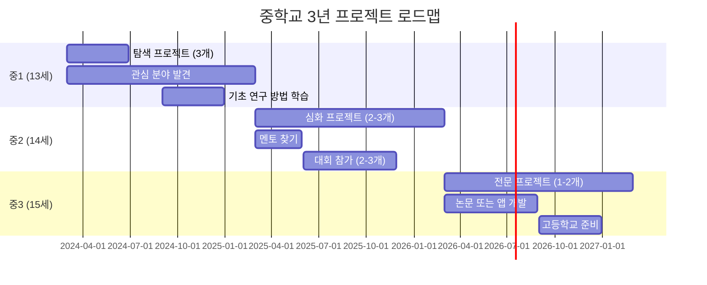

### 1.3 대표 프로젝트: "AI 기반 학습 격차 해소 플랫폼" (중2-중3, 12개월)

#### 프로젝트 개요

**문제 인식:**
- 코로나 이후 학습 격차 30% 증가
- 저소득층 학생들의 학원 접근성 제한
- 일대일 맞춤 교육의 높은 비용

**솔루션:**
- AI 개인 맞춤 학습 플랫폼
- 무료 제공 (광고 수익 모델)
- 취약 계층 우선 지원

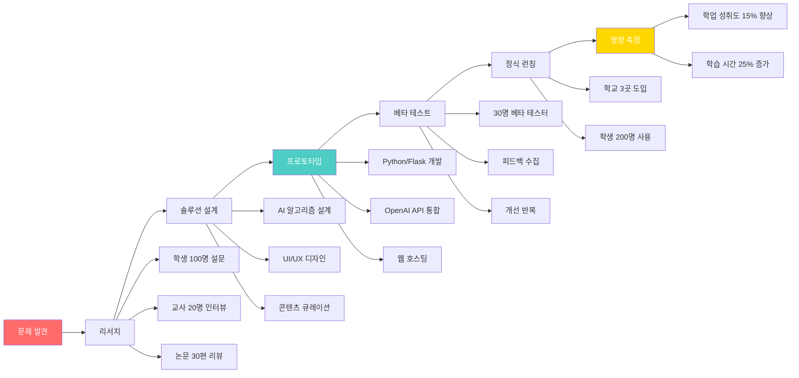

#### 12개월 타임라인

| 단계 | 기간 | 주요 활동 | 결과물 |
|------|------|----------|--------|
| **조사** | 1-2개월 | 문헌 조사, 설문, 인터뷰 | 연구 보고서 30페이지 |
| **설계** | 2-3개월 | 알고리즘, UI, 데이터베이스 | 설계 문서 50페이지 |
| **개발** | 3-4개월 | 코딩, AI 통합, 테스트 | 작동하는 웹 앱 |
| **베타** | 2개월 | 30명 테스트, 피드백 | 개선 로그 |
| **런칭** | 1개월 | 3개 학교 도입 | 200명 사용자 |
| **평가** | 2개월 | 데이터 수집, 분석 | 영향 평가 보고서 |

#### 기술 스택 (AI 활용)

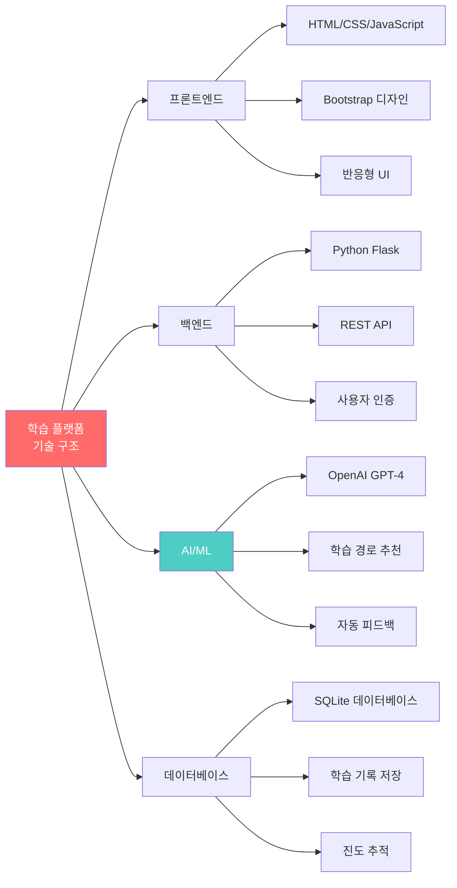

**배우는 기술:**
- Python 웹 개발 (Flask)
- AI API 통합 (OpenAI, Anthropic)
- 데이터베이스 설계
- 사용자 경험 디자인
- 프로젝트 관리
- A/B 테스트

**성과:**
- 💻 GitHub에 오픈소스 공개 (Star 50+)
- 📊 학업 성취도 평균 15% 향상
- 🏆 과학 경진대회 대상 수상
- 📰 지역 신문 기사화
- 💰 교육청에서 확산 예산 지원 제안

---

### 1.4 13-15세 추천 대회 및 활동

#### 국내 대회

| 대회명 | 주최 | 분야 | 대상 | 혜택 |
|--------|------|------|------|------|
| **한국과학창의재단 YSC** | 과기부 | 과학 | 중고생 | 대통령상, 장학금 |
| **삼성 주니어 SW 창작대회** | 삼성 | 코딩 | 중학생 | 상금, 멘토링 |
| **청소년 사회혁신 아이디어 대회** | 사회적기업진흥원 | 사회혁신 | 중고생 | 사업화 지원 |
| **AI 챌린지** | NAVER | AI | 중고생 | 장학금, 교육 |
| **메이커 페어** | 민간 | 발명 | 전연령 | 네트워킹 |

#### 국제 대회/프로그램

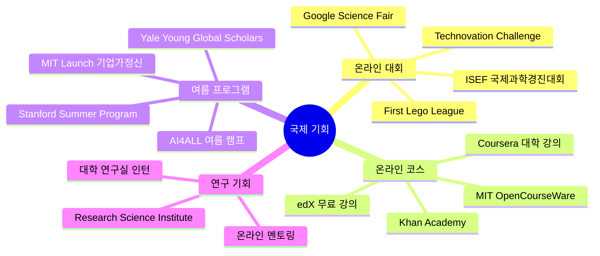

---

### 1.5 중학생 독서 리스트

#### 필수 도서 (영향력 큰 책)

| 책 제목 | 저자 | 주제 | 읽는 시기 | 프로젝트 연계 |
|---------|------|------|----------|-------------|
| **사피엔스** | 유발 하라리 | 인류사 | 중1 | 역사 프로젝트 |
| **총 균 쇠** | 재레드 다이아몬드 | 문명 | 중1 | 사회과학 탐구 |
| **코스모스** | 칼 세이건 | 과학 | 중1-2 | 과학 프로젝트 |
| **이기적 유전자** | 리처드 도킨스 | 생물학 | 중2 | 진화 연구 |
| **생각에 관한 생각** | 대니얼 카너먼 | 심리학 | 중2-3 | 행동경제학 |
| **넛지** | 리처드 탈러 | 경제학 | 중3 | 사회 실험 |
| **팩트풀니스** | 한스 로슬링 | 데이터 | 중3 | 통계 분석 |

#### AI/기술 관련

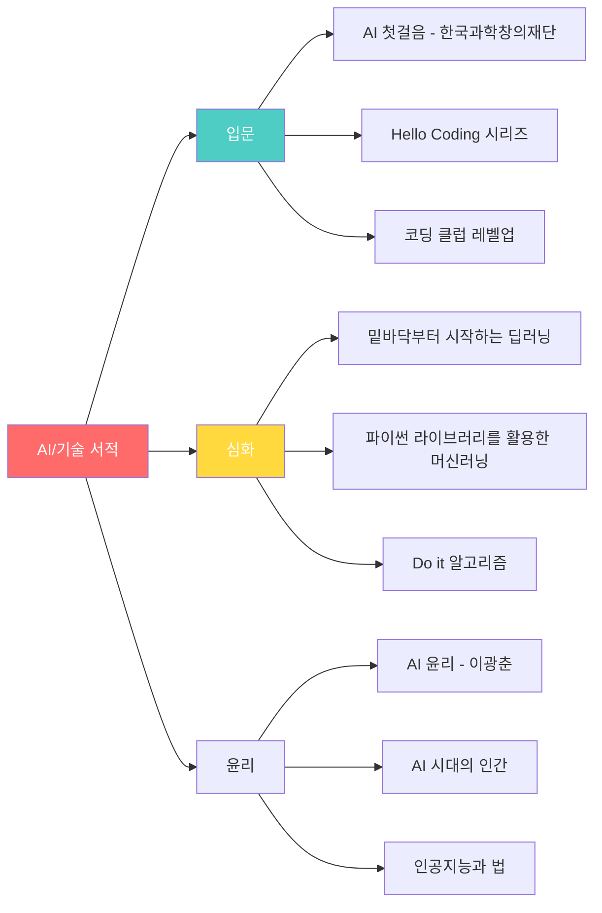

---

## 2. 16-18세: 미네르바 최종 준비

### 2.1 고등학생 교육 목표

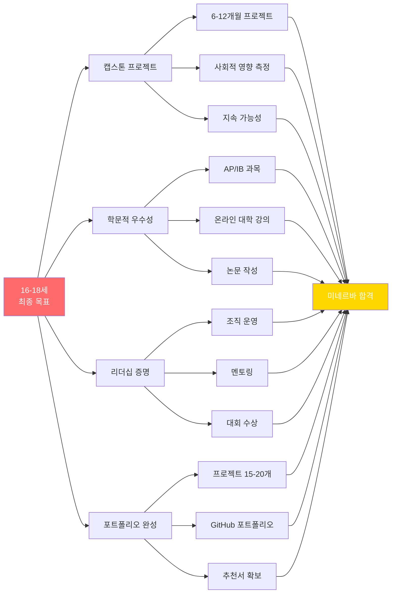

### 2.2 대표 캡스톤 프로젝트: "지역 탄소 중립 로드맵" (고2-고3, 18개월)

#### 프로젝트 배경

**글로벌 문제 → 지역 실천**
- 2030년까지 탄소 배출 50% 감축 목표
- 우리 도시의 현재 배출량?
- 학생이 할 수 있는 역할?

```mermaid
timeline
    title 지역 탄소 중립 프로젝트 18개월
    
    section Month 1-3: 조사
        데이터 수집 : 시청, 기업, 가정 데이터
                    : 배출원 분석
                    : 국제 사례 연구
    
    section Month 4-6: 모델링
        AI 예측 모델 : Python 데이터 분석
                     : 시나리오 시뮬레이션
                     : 감축 경로 계산
    
    section Month 7-12: 실행
        파일럿 프로젝트 : 학교 3곳 탄소 측정
                       : 감축 캠페인
                       : 기업 10곳 협력
    
    section Month 13-15: 정책 제안
        로드맵 작성 : 2030 목표 달성 계획
                   : 정책 제안서 100페이지
                   : 시의회 발표
    
    section Month 16-18: 확산
        플랫폼 구축 : 웹사이트 개발
                   : 다른 도시 확산
                   : 최종 보고서
```

#### 연구 방법론

**1. 데이터 수집 (정량적)**

| 데이터 유형 | 출처 | 수집 방법 | 분석 도구 |
|-----------|------|----------|----------|
| **도시 배출량** | 시청 환경과 | 공공 데이터 요청 | Python Pandas |
| **전력 사용** | 한국전력 | 월별 데이터 | 시계열 분석 |
| **교통량** | 교통공단 | 센서 데이터 | Google Maps API |
| **가정 배출** | 300가구 설문 | Google Forms | 통계 분석 |
| **기업 배출** | 10개 기업 인터뷰 | 자체 조사 | 케이스 스터디 |

**2. AI 모델링**

```python
# 탄소 배출 예측 모델 (간단한 예시)
import pandas as pd
from sklearn.linear_model import LinearRegression
import matplotlib.pyplot as plt

# 데이터 로드
data = pd.read_csv('carbon_emissions.csv')

# 특징: 인구, GDP, 자동차 수, 재생에너지 비율
X = data[['population', 'gdp', 'vehicles', 'renewable_ratio']]
y = data['carbon_emissions']

# 모델 훈련
model = LinearRegression()
model.fit(X, y)

# 2030년 예측
future_data = [[500000, 50000000, 200000, 0.4]]  # 예상 수치
prediction = model.predict(future_data)

print(f"2030년 예상 배출량: {prediction[0]:.0f}톤")

# 시각화
plt.scatter(data['year'], y, label='실제')
plt.plot(data['year'], model.predict(X), label='예측', color='red')
plt.xlabel('연도')
plt.ylabel('탄소 배출량(톤)')
plt.legend()
plt.savefig('carbon_prediction.png')
```

**3. 시나리오 분석**

| 시나리오 | 조건 | 2030년 배출량 | 목표 달성 |
|---------|------|-------------|----------|
| **BAU** | 현재 추세 유지 | 100만톤 | ❌ 실패 |
| **온건** | 재생에너지 30% | 70만톤 | ❌ 부족 |
| **적극** | 재생에너지 50% + 교통 전환 | 45만톤 | ✅ 달성 |
| **혁신** | 탄소 포집 + 전면 전환 | 25만톤 | ✅ 초과 달성 |

**결론:** "적극 시나리오" 실행 가능하고 목표 달성 가능

---

#### 실행 단계: 파일럿 프로젝트

**학교 3곳 탄소 중립 챌린지**

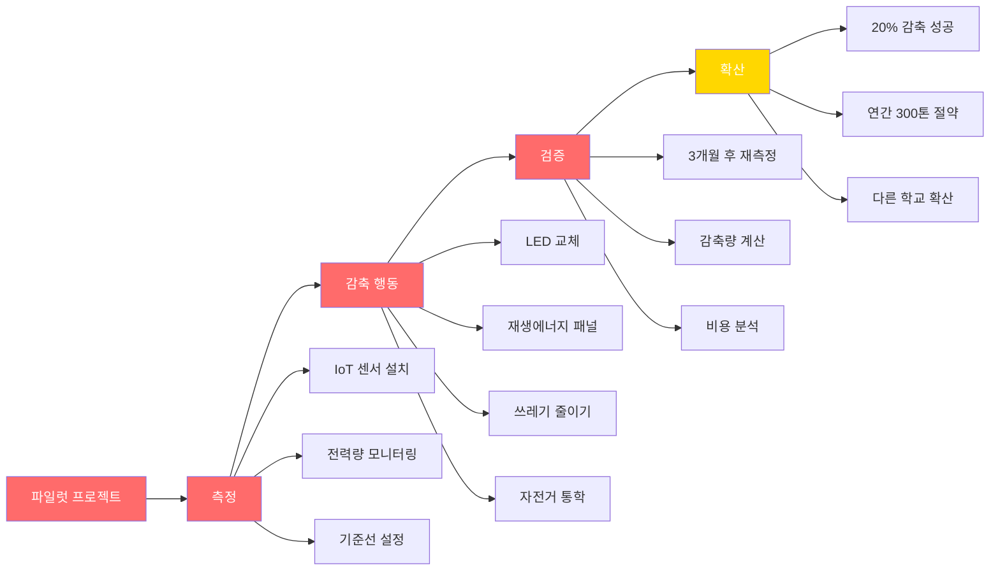

**측정 가능한 성과:**
- 📉 3개 학교 탄소 배출 평균 22% 감축
- 💰 연간 에너지 비용 1억원 절감
- 👥 학생 1,500명 참여
- 🏆 환경부 장관상 수상
- 📰 중앙 언론 보도 3회

---

#### 정책 제안

**시의회 발표 (30분)**

**제안서 구조:**
1. **현황 분석** (10페이지)
   - 우리 도시 배출량 현황
   - 부문별 기여도
   - 국제 비교

2. **목표 및 전략** (20페이지)
   - 2030년 50% 감축 로드맵
   - 5대 핵심 전략
   - 연도별 마일스톤

3. **실행 계획** (30페이지)
   - 부문별 세부 과제 50개
   - 예산 및 재원
   - 추진 체계

4. **기대 효과** (10페이지)
   - 환경적 효과
   - 경제적 효과
   - 사회적 효과

5. **파일럿 결과** (20페이지)
   - 학교 3곳 사례
   - 데이터 분석
   - 확산 가능성

6. **결론 및 제언** (10페이지)

**발표 반응:**
- 시장: "고등학생이 만든 줄 몰랐다"
- 시의원: "실행 가능한 제안"
- 환경과장: "실제 정책에 반영하겠다"
- 📰 지역 뉴스 메인 기사

---

### 2.3 고등학교 학업 로드맵

#### AP/IB 과목 추천 (미네르바 지원자)

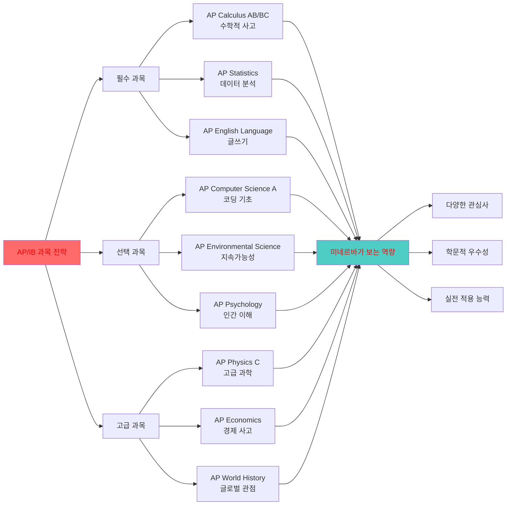

**추천 조합 (전공별):**

| 희망 전공 | 필수 AP | 추천 AP | 온라인 코스 |
|----------|---------|---------|-----------|
| **Computer Science** | Calculus BC, CS A | Physics C, Statistics | Stanford CS106A |
| **Business** | Statistics, Micro/Macro Econ | Calculus AB, Psychology | Wharton Business Fundamentals |
| **Natural Sciences** | Calculus BC, Biology/Chemistry | Physics, Environmental | MIT Biology |
| **Social Sciences** | Statistics, Psychology | World History, Economics | Harvard Justice |
| **Arts & Humanities** | English Lit, World History | Art History, Psychology | Yale Philosophy |

---

### 2.4 온라인 대학 강의 (무료)

#### Coursera 추천 강의

| 강의명 | 대학 | 난이도 | 시간 | 수료증 |
|--------|------|--------|------|--------|
| **Machine Learning** | Stanford (Andrew Ng) | 중급 | 11주 | 유료 |
| **CS50 Introduction to CS** | Harvard | 초중급 | 12주 | 무료 |
| **Data Science** | Johns Hopkins | 중급 | 10개월 | 유료 |
| **Game Theory** | Stanford | 중급 | 8주 | 유료 |
| **Social Psychology** | Wesleyan | 초급 | 5주 | 유료 |

#### edX 추천 강의

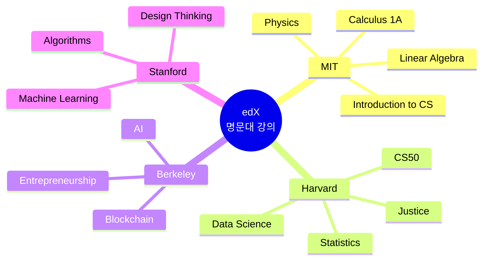

---

### 2.5 고등학생 독서 리스트

#### 미네르바 지원자 필독서

| 책 제목 | 저자 | 주제 | 왜 중요한가 |
|---------|------|------|-----------|
| **Thinking, Fast and Slow** | Daniel Kahneman | 인지과학 | 비판적 사고의 기초 |
| **Sapiens** | Yuval Harari | 인류사 | 큰 그림 보기 |
| **The Lean Startup** | Eric Ries | 창업 | 실행 방법론 |
| **Outliers** | Malcolm Gladwell | 성공 | 맥락적 사고 |
| **Freakonomics** | Levitt & Dubner | 경제학 | 숨은 인센티브 |
| **The Innovator's Dilemma** | Clayton Christensen | 혁신 | 파괴적 혁신 이해 |
| **Guns, Germs, and Steel** | Jared Diamond | 문명 | 시스템적 사고 |

#### 전공별 심화 독서

**Computer Science:**
- "Code" - Charles Petzold
- "The Pragmatic Programmer"
- "Cracking the Coding Interview"

**Business:**
- "Zero to One" - Peter Thiel
- "Good to Great" - Jim Collins
- "The Hard Thing About Hard Things"

**Natural Sciences:**
- "The Selfish Gene" - Richard Dawkins
- "A Brief History of Time" - Stephen Hawking
- "The Double Helix" - James Watson

---

## 3. 미네르바 실제 교재 및 참고 도서

### 3.1 미네르바 1학년 Cornerstone 교재

#### Formal Analyses (형식 분석)

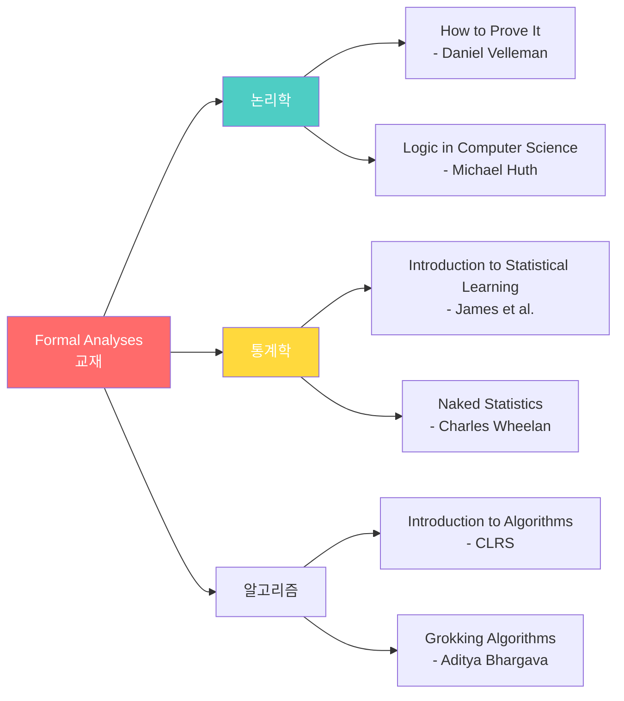

**실제 사용 교재:**

| 과목 | 주교재 | 보조 교재 | 온라인 자료 |
|------|--------|----------|-----------|
| **논리학** | "How to Prove It" | 교수 작성 노트 | Khan Academy Logic |
| **통계학** | "OpenIntro Statistics" (무료) | R 실습 자료 | DataCamp |
| **프로그래밍** | "Python Crash Course" | Leetcode 문제 | Codecademy |

---

#### Multimodal Communications (다양한 소통)

**교재 리스트:**

| 영역 | 교재 | 저자 | 사용 목적 |
|------|------|------|----------|
| **글쓰기** | "They Say / I Say" | Graff & Birkenstein | 학술 글쓰기 |
| **프레젠테이션** | "Presentation Zen" | Garr Reynolds | 시각적 소통 |
| **데이터 시각화** | "The Visual Display" | Edward Tufte | 정보 디자인 |
| **수사학** | "Thank You for Arguing" | Jay Heinrichs | 설득 기술 |

---

#### Empirical Analyses (경험적 분석)

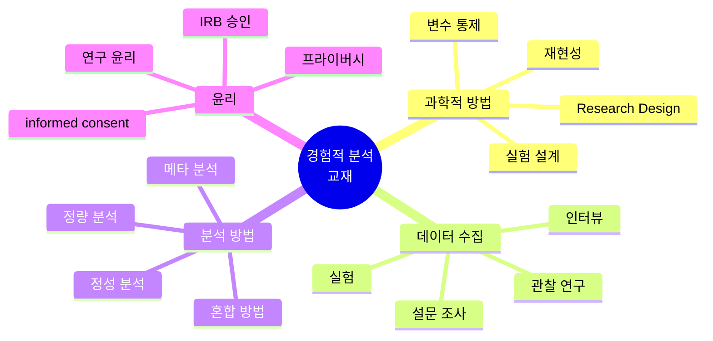

**주요 교재:**
- "Research Design" - John Creswell
- "Thinking, Fast and Slow" - Daniel Kahneman
- "The Signal and the Noise" - Nate Silver

---

#### Complex Systems (복잡계)

**교재:**

| 주제 | 교재 | 핵심 개념 |
|------|------|----------|
| **시스템 사고** | "Thinking in Systems" - Donella Meadows | 피드백 루프, 창발 |
| **네트워크** | "Networks" - Mark Newman | 네트워크 이론 |
| **복잡성** | "Complexity" - Mitchell Waldrop | 적응 시스템 |
| **게임 이론** | "The Art of Strategy" - Dixit & Nalebuff | 전략적 사고 |

---

### 3.2 미네르바 전공별 주요 교재

#### Computational Sciences (컴퓨터 과학)

**2-4학년 교재:**

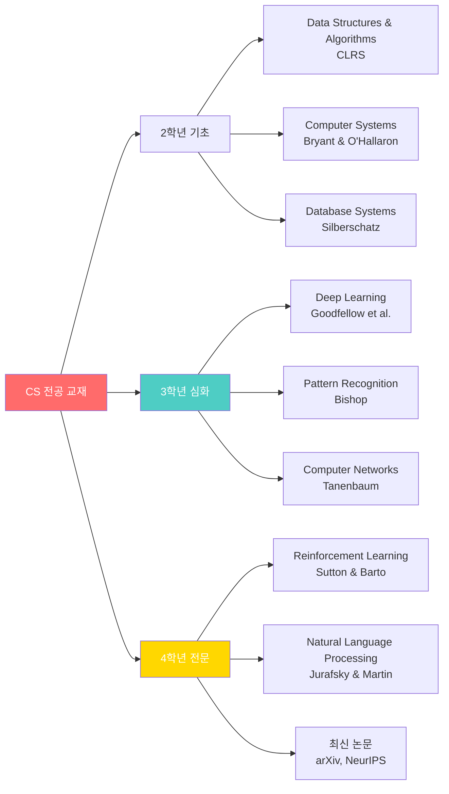

**AI/ML 특화 교재:**

| 과목 | 교재 | 온라인 버전 | 난이도 |
|------|------|-----------|--------|
| **Machine Learning** | "Pattern Recognition and ML" - Bishop | 무료 PDF | ⭐⭐⭐⭐ |
| **Deep Learning** | "Deep Learning" - Goodfellow | deeplearningbook.org | ⭐⭐⭐⭐⭐ |
| **NLP** | "Speech and Language Processing" | 무료 온라인 | ⭐⭐⭐⭐ |
| **Computer Vision** | "Computer Vision" - Szeliski | 무료 PDF | ⭐⭐⭐⭐ |

---

#### Business (비즈니스)

**핵심 교재:**

| 영역 | 교재 | 저자 | 미네르바 사용 |
|------|------|------|------------|
| **전략** | "Good Strategy Bad Strategy" | Richard Rumelt | 2학년 |
| **마케팅** | "Marketing Management" | Kotler | 2학년 |
| **재무** | "Corporate Finance" | Ross | 3학년 |
| **기업가정신** | "The Lean Startup" | Eric Ries | 3학년 |
| **혁신** | "The Innovator's Dilemma" | Christensen | 4학년 |

---

#### Social Sciences (사회과학)

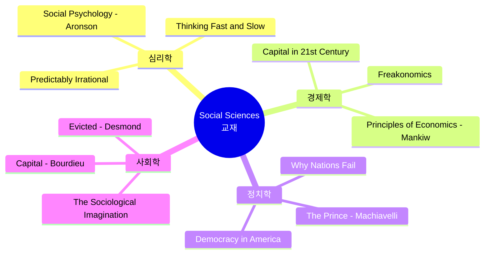

---

### 3.3 미네르바 학생들이 읽는 논문

#### 분야별 중요 논문 (학부생 수준)

**AI/Machine Learning:**

| 논문 제목 | 저자 | 연도 | 중요도 |
|---------|------|------|--------|
| "Attention Is All You Need" | Vaswani et al. | 2017 | ⭐⭐⭐⭐⭐ |
| "ImageNet Classification" | Krizhevsky et al. | 2012 | ⭐⭐⭐⭐⭐ |
| "BERT: Pre-training" | Devlin et al. | 2018 | ⭐⭐⭐⭐ |
| "GPT-3" | Brown et al. | 2020 | ⭐⭐⭐⭐⭐ |

**어디서 읽나:**
- 📚 arXiv.org (최신 논문)
- 📚 Papers With Code (코드 포함)
- 📚 Google Scholar (검색)
- 📚 Semantic Scholar (AI 추천)

---

### 3.4 한국 학생을 위한 준비 도서

#### 영어 원서 읽기 로드맵

**난이도별 추천 (고등학생):**

| 난이도 | 책 제목 | 페이지 | 예상 시간 |
|--------|---------|--------|----------|
| **입문** | "The Giver" - Lois Lowry | 240p | 1주 |
| **초급** | "Holes" - Louis Sachar | 230p | 1주 |
| **중급** | "The Outsiders" - S.E. Hinton | 192p | 1주 |
| **중고급** | "To Kill a Mockingbird" | 324p | 2주 |
| **고급** | "1984" - George Orwell | 328p | 2-3주 |
| **고급+** | "Sapiens" - Yuval Harari | 464p | 3-4주 |

**학술 영어:**
- "They Say / I Say" - 학술 글쓰기
- "The Elements of Style" - Strunk & White
- "On Writing Well" - William Zinsser

---

## 4. 입학 지원 포트폴리오 구축

### 4.1 미네르바 포트폴리오 체크리스트

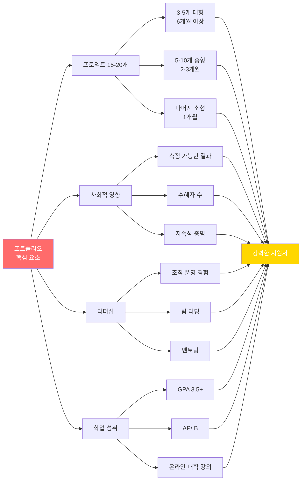

### 4.2 프로젝트 포트폴리오 예시 (합격자)

**합격자 A (Class of 2024):**

| 연령 | 프로젝트 | 규모 | 영향 |
|------|---------|------|------|
| **12세** | 학교 플라스틱 줄이기 | 학교 200명 | 25% 감축 |
| **13세** | 코딩 교육 봉사 | 초등생 50명 | 6개월 프로그램 |
| **14세** | 청소년 멘탈헬스 앱 | 사용자 500명 | 평점 4.5 |
| **15세** | 지역 환경 NGO 설립 | 회원 30명 | 활동 지속 중 |
| **16세** | AI 학습 격차 해소 플랫폼 | 학생 200명 | 성적 15% 향상 |
| **17세** | 탄소 중립 로드맵 | 시의회 채택 | 정책 반영 |

**총 16개 프로젝트, 5개 대형, 수혜자 1,000명+**

---

### 4.3 GitHub 포트폴리오 만들기

**구조:**

```
├── README.md (자기소개, 프로젝트 요약)
├── ai-learning-platform/
│   ├── README.md
│   ├── src/
│   ├── docs/
│   └── demo/
├── carbon-neutral-model/
│   ├── data/
│   ├── notebooks/
│   └── reports/
├── community-projects/
│   └── (각종 소규모 프로젝트)
└── research-papers/
    └── (논문, 보고서 PDF)
```

**README 예시:**

```markdown
# 김철수 - Aspiring Innovator

## About Me
고등학생 개발자이자 사회 혁신가입니다. 
기술로 교육 격차를 해소하는 것이 꿈입니다.

## Featured Projects

### 1. AI Learning Platform (2023-2024)
- 200명 학생 사용, 학업 성취도 15% 향상
- Tech: Python, Flask, OpenAI API
- [Live Demo](링크) | [상세 설명](링크)

### 2. Carbon Neutral Roadmap (2024)
- 시의회 정책 제안 채택
- 데이터 분석, AI 시뮬레이션
- [보고서 PDF](링크)

## Skills
- Python, JavaScript, React
- Machine Learning, Data Analysis
- Project Management, Public Speaking

## Recognition
- 과학 경진대회 대상 (2024)
- 환경부 장관상 (2024)
```

---

### 4.4 추천서 전략

**누구에게 받나:**

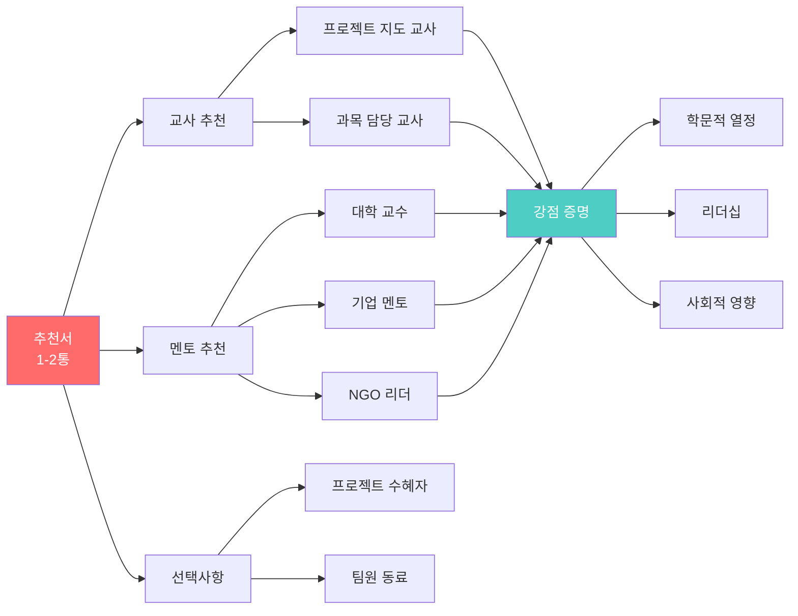

**추천서에 포함되어야 할 내용:**
- 프로젝트 과정에서 본 학생의 모습
- 구체적인 사례 (수치 포함)
- 다른 학생과의 차별점
- 미네르바에 적합한 이유

---

## 5. 최종 체크리스트

### 5.1 미네르바 지원 준비도 평가

**12학년 9월 기준 체크리스트:**

| 영역 | 항목 | 목표 | 달성 |
|------|------|------|------|
| **프로젝트** | 총 개수 | 15-20개 | ⬜ |
| | 대형 프로젝트 | 3-5개 | ⬜ |
| | 사회적 영향 | 측정 가능 | ⬜ |
| | GitHub 포트폴리오 | 정리됨 | ⬜ |
| **학업** | GPA | 3.5+ | ⬜ |
| | AP/IB | 5-8과목 | ⬜ |
| | 온라인 대학 강의 | 2-3개 | ⬜ |
| | 독서 | 영문 원서 20권+ | ⬜ |
| **리더십** | 조직 운영 | 1개 이상 | ⬜ |
| | 멘토링 | 10명 이상 | ⬜ |
| | 대회 수상 | 2-3개 | ⬜ |
| **AI 역량** | 코딩 능력 | Python 능숙 | ⬜ |
| | AI 프로젝트 | 2-3개 | ⬜ |
| | 데이터 분석 | 실전 경험 | ⬜ |
| **글로벌** | 영어 | 유창 | ⬜ |
| | 국제 협업 | 경험 있음 | ⬜ |
| | 문화 이해 | 다양성 존중 | ⬜ |

### 5.2 연령별 마일스톤 요약

```mermaid
timeline
    title 3세-18세 미네르바 준비 완전 로드맵
    
    section 3-7세: 기초
        호기심 개발 : 질문하는 습관
                    : 관찰과 탐구
                    : 프로젝트 10-20개/년
    
    section 8-12세: 구축
        프로젝트 능력 : 문제 해결 경험
                      : AI 도구 활용
                      : 팀 협력
                      : 프로젝트 8-12개/년
    
    section 13-15세: 발전
        전문성 개발 : 멘토 찾기
                    : 대회 참가
                    : 사회 영향
                    : 프로젝트 4-6개/년
    
    section 16-18세: 완성
        포트폴리오 : 캡스톤 프로젝트
                   : 15-20개 누적
                   : 미네르바 지원
                   : 합격!
```

### 5.3 15년 프로젝트 총정리

**누적 통계 (3세-18세):**

| 항목 | 수량 |
|------|------|
| **총 프로젝트 수** | 60-80개 |
| **대형 프로젝트** | 5-7개 |
| **사회적 영향** | 수혜자 1,000명+ |
| **발표 횟수** | 100회+ |
| **독서량** | 200권+ (영문 50권+) |
| **AI 프로젝트** | 10-15개 |
| **코딩 경험** | 5-8년 |
| **대회 수상** | 5-10개 |

---

## 🎓 최종 메시지

### 미네르바 합격의 공식


**핵심은:**
- ✅ **일찍 시작**: 3-4세부터 호기심과 질문
- ✅ **꾸준히**: 매년 8-20개 프로젝트
- ✅ **실제 영향**: 숫자로 증명 가능한 결과
- ✅ **AI 통합**: 모든 프로젝트에 AI 활용
- ✅ **글로벌 마인드**: 다양성 존중, 여러 문화 경험
- ✅ **자기주도**: 스스로 선택하고 실행
- ✅ **지속성**: 15년 장기 프로젝트

**프뢰벨 교육 → 미네르바 대학 → 글로벌 혁신 리더**

이것이 AI 시대 최고의 교육 경로입니다.

---

## 📚 추가 자료

### 유용한 웹사이트

| 사이트 | URL | 용도 |
|--------|-----|------|
| **미네르바 공식** | minerva.edu | 입학 정보 |
| **Coursera** | coursera.org | 온라인 강의 |
| **edX** | edx.org | 대학 강의 |
| **Khan Academy** | khanacademy.org | 기초 학습 |
| **GitHub** | github.com | 코드 포트폴리오 |
| **Papers with Code** | paperswithcode.com | AI 논문 |
| **Kaggle** | kaggle.com | 데이터 과학 |

### 한국 커뮤니티

- **네이버 카페**: "미네르바 대학 준비"
- **페이스북 그룹**: "미네르바 한국 학생"
- **Discord**: 프뢰벨-미네르바 연계 교육
- **카카오톡 오픈채팅**: "미네르바 지원자 모임"

---

**© 2025 미네르바 준비 가이드 완성편. All rights reserved.**
*최종 업데이트: 2025년 12월 11일*

**15년 프로젝트, 지금 시작하세요!**