# 세특 탐구 · 바이브 코딩 워크플로우
> 진짜 문제 발견 → 기획 성찰 → AI 구현 → 배포까지 살아있는 프로세스

---

## 핵심 철학

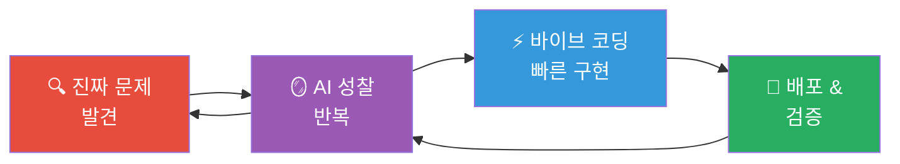

> **바이브 코딩이란?**
> AI와 자연어 대화만으로 프로토타입을 즉시 만드는 방식.
> 단, **무엇을 만들지를 결정하는 기획·성찰 단계**가 전체 품질을 좌우합니다.
> 코드보다 **문제를 정확히 정의하는 능력**이 핵심입니다.

---

## 전체 순서도

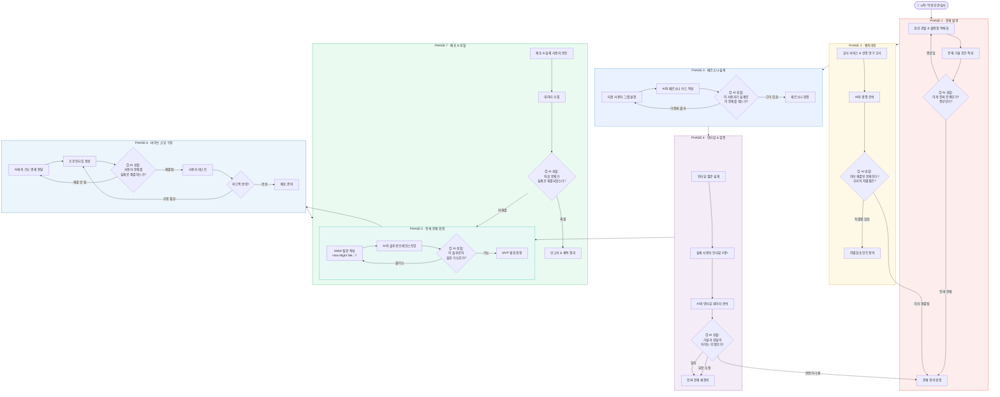

---

## PHASE 1 · 문제 발견

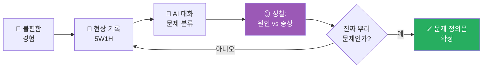

**문제 정의문 작성 공식**

| 항목 | 나쁜 예 | 좋은 예 |
|------|--------|--------|
| 현상 | "앱이 불편하다" | "고1 학생의 68%가 식단 관리 앱을 3일 내 포기한다" |
| 원인 | "UI가 복잡해서" | "매번 음식을 수동 검색해야 해서 귀찮음이 누적된다" |
| 영향 | "불편하다" | "건강 관리 습관 형성에 실패하고 자기효능감이 낮아진다" |

**AI 성찰 대화 — PHASE 1 전용 프롬프트**

| 질문 목적 | AI에게 물어볼 내용 |
|----------|-----------------|
| 증상 vs 원인 구분 | "내가 정의한 문제가 근본 원인인지, 아니면 증상인지 5-Why 분석으로 파악해줘" |
| 문제 범위 조정 | "이 문제가 너무 크거나 너무 좁은지 평가하고, 6주 안에 탐구 가능한 범위로 조정해줘" |
| 선입견 제거 | "내 문제 정의에서 내가 가진 편견이나 가정을 찾아줘" |

---

## PHASE 2 · 벤치마킹

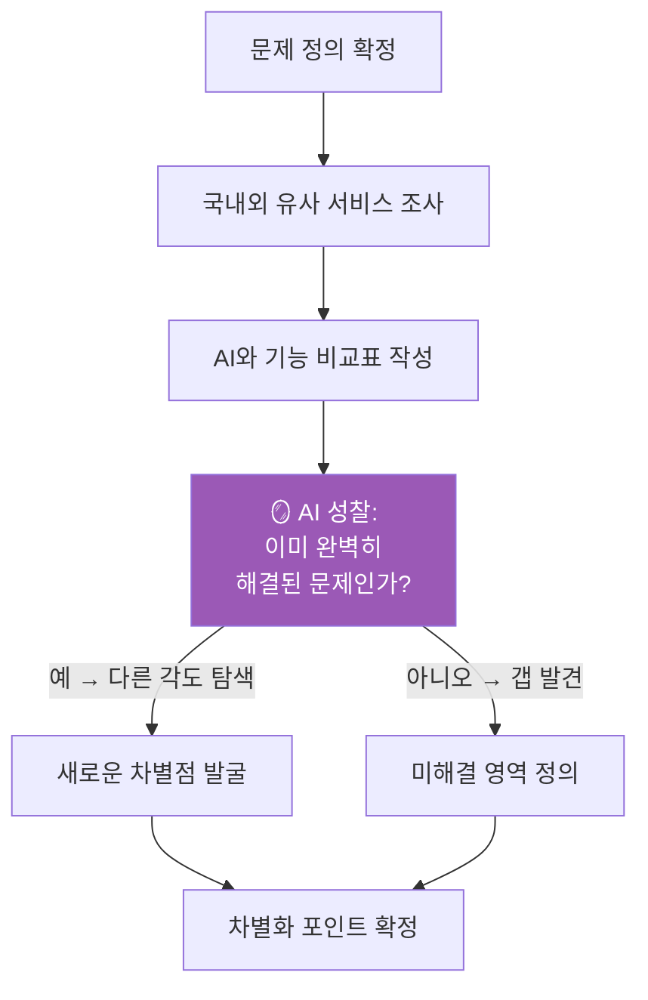

**벤치마킹 분석표**

| 분석 항목 | 서비스 A | 서비스 B | 서비스 C | 우리의 기회 |
|----------|---------|---------|---------|-----------|
| 핵심 기능 | | | | |
| 타겟 사용자 | | | | |
| 해결하는 문제 | | | | |
| 미해결 부분 | | | | |
| 기술 방식 | | | | |
| 한계점 | | | | |

**AI와 벤치마킹 성찰 대화**

| 질문 목적 | AI에게 물어볼 내용 |
|----------|-----------------|
| 시장 갭 발견 | "이 서비스들이 공통적으로 해결하지 못한 문제가 뭐야?" |
| 차별점 검증 | "내가 생각한 차별점이 실제로 의미 있는 차이인지 평가해줘" |
| 실패 사례 | "비슷한 시도가 실패한 이유를 알려줘. 우리가 피해야 할 것은?" |

---

## PHASE 3 · 페르소나 설계

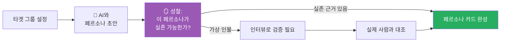

**페르소나 카드 구조**

| 항목 | 내용 작성 |
|------|---------|
| 이름 / 나이 / 직업 | (구체적인 인물 설정) |
| 하루 루틴 | (이 사람의 일상에서 문제가 언제 발생하는가) |
| 핵심 목표 | (이 사람이 진짜 원하는 것) |
| 겪는 불편함 | (현재 어떻게 문제를 해결하고 있나) |
| 현재 해결 방식 | (임시방편은 무엇인가) |
| 기술 수준 | (앱을 얼마나 잘 쓰는가) |
| 인용구 | "이 사람이 할 법한 말 한 마디" |

**AI 성찰 대화 — 페르소나 검증**

| 질문 목적 | AI에게 물어볼 내용 |
|----------|-----------------|
| 현실성 검토 | "이 페르소나가 너무 이상적이거나 비현실적인 부분은 어디야?" |
| 다양성 확인 | "이 페르소나로 대표되지 않는 중요한 사용자 그룹이 있어?" |
| 편견 제거 | "내가 페르소나를 나 자신처럼 만들지는 않았는지 확인해줘" |

---

## PHASE 4 · 인터뷰 & 진짜 문제 발견

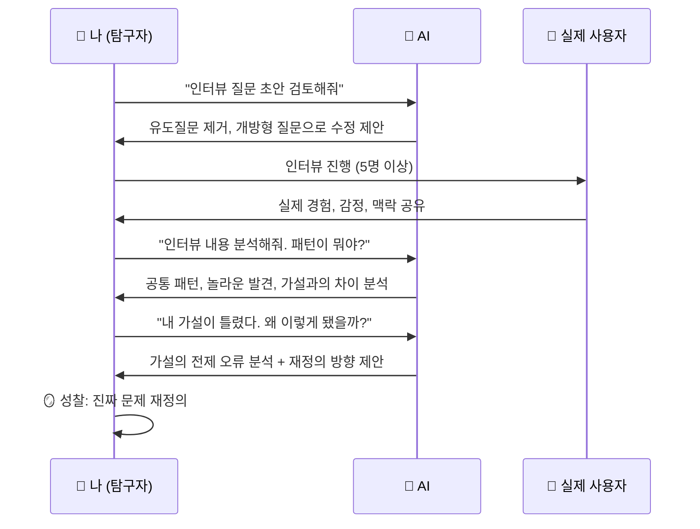

**인터뷰 질문 설계 원칙**

| 유형 | ❌ 나쁜 질문 | ✅ 좋은 질문 |
|------|-----------|-----------|
| 유도 금지 | "이 기능이 유용할 것 같죠?" | "이런 상황에서 어떻게 하셨어요?" |
| 과거 경험 | "앞으로 어떻게 할 것 같아요?" | "마지막으로 이 문제를 겪었을 때 이야기해주세요" |
| 감정 탐색 | "불편하셨나요?" | "그 순간 어떤 기분이었어요?" |
| 현재 해결 | "앱이 있으면 쓰시겠어요?" | "지금은 이 문제를 어떻게 해결하세요?" |

**AI와 인터뷰 분석 성찰**

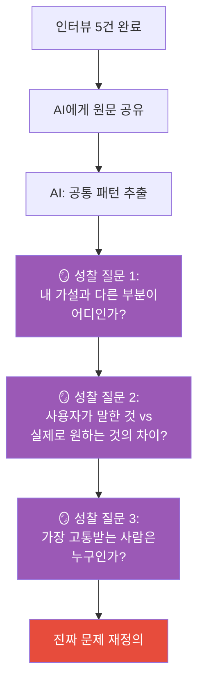

---

## PHASE 5 · 진짜 문제 확정 & 솔루션 설계

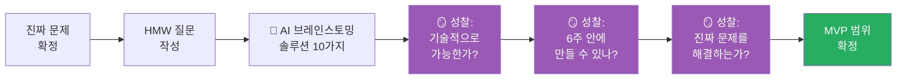

**HMW (How Might We) 질문 공식**

> "우리는 어떻게 하면 [페르소나]가 [문제 상황]에서 [목표]를 달성하도록 도울 수 있을까?"

| 구성 요소 | 예시 |
|---------|-----|
| 페르소나 | 건강에 관심 있는 고1 학생이 |
| 문제 상황 | 매번 음식을 검색해야 하는 귀찮음 없이 |
| 목표 | 식단 기록을 30일 이상 지속하도록 |
| HMW 완성 | "어떻게 하면 건강에 관심 있는 고1 학생이 검색 없이도 식단을 30일 이상 기록하게 할 수 있을까?" |

**MVP 범위 결정표**

| 기능 | 필수 (MVP) | 나중에 | 안 함 |
|-----|----------|------|------|
| 음식 사진 촬영 → AI 자동 인식 | ✅ | | |
| 영양소 상세 분석 | | ✅ | |
| SNS 공유 | | | ✅ |
| 식단 추천 | | ✅ | |

---

## PHASE 6 · 바이브 코딩 구현

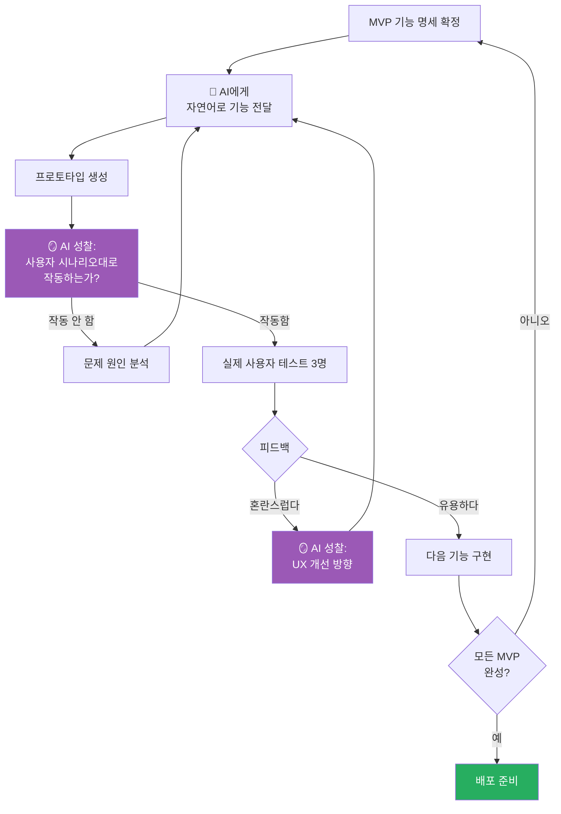

**바이브 코딩 AI 프롬프트 작성법**

| 나쁜 프롬프트 | 좋은 프롬프트 |
|------------|------------|
| "앱 만들어줘" | "고1 학생이 점심 후 30초 안에 식사 사진을 찍으면 AI가 자동으로 음식을 인식해서 칼로리를 기록하는 웹앱 만들어줘. 기술 스택: Python Flask, OpenAI Vision API" |
| "버튼 추가해줘" | "메인 화면에 카메라 아이콘 버튼을 추가해줘. 클릭하면 카메라가 열리고, 사진 촬영 후 /analyze 엔드포인트로 POST 전송해줘" |
| "에러 고쳐줘" | "아래 에러 메시지가 발생했어. 원인과 해결 방법을 단계별로 알려줘: [에러 내용]" |

**바이브 코딩 성찰 체크포인트**

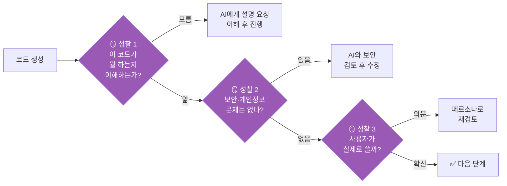

---

## PHASE 7 · 배포 & 성찰 보고

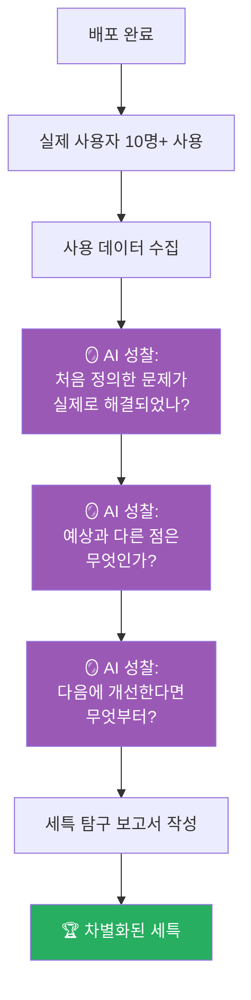

**배포 후 검증 데이터 수집표**

| 지표 | 측정 방법 | 성공 기준 |
|-----|---------|---------|
| 재사용률 | 3일 후 재방문 여부 | 50% 이상 |
| 핵심 기능 사용 | 로그 분석 | 방문자의 70%가 핵심 기능 사용 |
| 사용 시간 | 세션 길이 | 목표 작업 완료 시간 내 |
| 주관적 만족도 | 사용 후 설문 1문항 | 5점 중 4점 이상 |
| 진짜 문제 해결 여부 | 인터뷰 재진행 | "문제가 줄었다"고 응답 |

---

## 성찰 루프 전체 구조

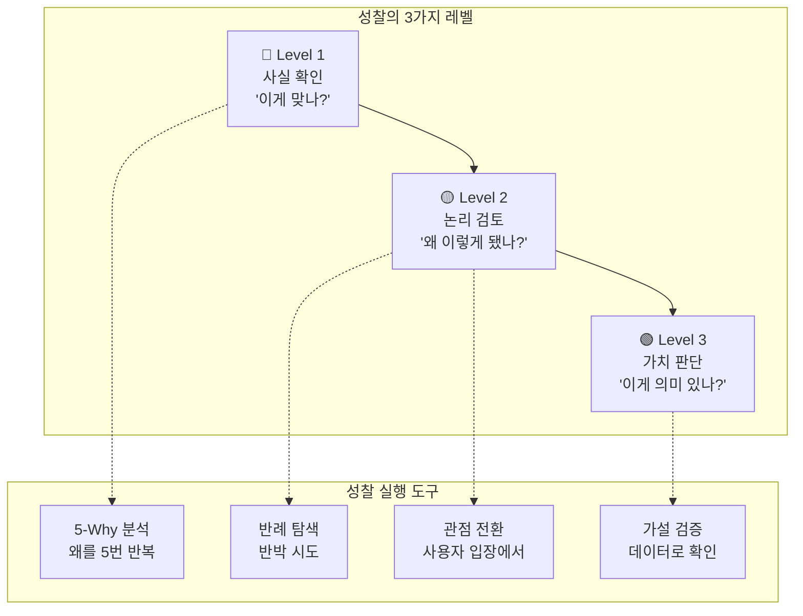

**단계별 핵심 성찰 질문 모음**

| 단계 | 성찰 질문 | 기대 결과 |
|------|---------|---------|
| 문제 발견 | "이게 증상인가, 원인인가?" | 진짜 문제 식별 |
| 벤치마킹 | "우리가 더 잘할 수 있는 이유가 있나?" | 차별점 명확화 |
| 페르소나 | "이 사람이 실제로 존재하는가?" | 가상 사용자 경계 |
| 인터뷰 | "말한 것 vs 원하는 것의 차이는?" | 잠재 니즈 발굴 |
| 솔루션 | "기술이 아니라 문제를 해결하는가?" | 과잉 설계 방지 |
| 구현 | "코드를 이해하고 있는가?" | 블랙박스 방지 |
| 배포 | "처음 문제가 해결되었는가?" | 결과 책임 |

---

## 실전 프로젝트 예시 (전체 흐름)

### "학교 급식 잔반 줄이기 프로젝트"

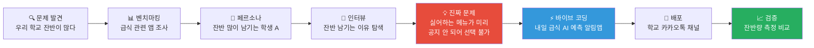

| 단계 | 실제 한 일 | AI가 도운 것 | 성찰을 통한 변화 |
|------|---------|-----------|--------------|
| 문제 발견 | 급식실 관찰 1주일 | "잔반 문제의 근본 원인 5가지 제시" | 음식 맛 → **선택권 부재**로 재정의 |
| 벤치마킹 | 유사 앱 5개 분석 | 기능 비교표 작성 지원 | 알림 기능은 있지만 예측 기능 없음 발견 |
| 페르소나 | 학생 30명 설문 | 설문 편향 제거 검토 | 잔반 많은 학생 ≠ 편식 학생 수정 |
| 인터뷰 | 학생 8명 심층 인터뷰 | 인터뷰 패턴 분석 | "몰라서 가져왔다"가 핵심 발견 |
| 구현 | 급식 데이터 크롤링 + 알림 | Flask 코드, 카카오 API 연동 | 예측 → 단순 공지로 범위 축소 |
| 배포 | 카카오채널 300명 구독 | 사용자 행동 분석 | 알림 후 잔반 23% 감소 확인 |

---

## 세특 보고서 최종 구조

| 섹션 | 내용 | AI 활용 | 분량 |
|-----|-----|---------|-----|
| 탐구 동기 | 문제 발견 과정 & 성찰 기록 | 동기 구체화 | 0.5p |
| 선행 연구 | 벤치마킹 + 차별점 | 논문 요약, 비교표 | 1p |
| 탐구 방법 | 인터뷰 설계 + 바이브 코딩 과정 | 방법론 검토 | 1p |
| 결과 분석 | 데이터 + 시각화 | 통계 분석, 그래프 | 1p |
| 결론 & 성찰 | 배포 결과 + 한계점 + 배운 것 | 반례 & 개선점 | 0.5p |

---

*작성일: 2026-04-09 | AI 기반 바이브 코딩 + 디자인씽킹 워크플로우*
