# 유아~초등 저학년 대회 & 교육 가이드 (3-9세)

 
 


---

## 📑 목차

1. [3-9세 교육 목표 및 역량](#1-3-9세-교육-목표-및-역량)
2. [그림/미술 대회](#2-그림미술-대회)
3. [발명/과학 대회](#3-발명과학-대회)
4. [글쓰기/독서 대회](#4-글쓰기독서-대회)
5. [예체능 대회](#5-예체능-대회)
6. [추천 도서 & 교육 자료](#6-추천-도서--교육-자료)
7. [역량 개발 로드맵](#7-역량-개발-로드맵)

---

## 1. 3-9세 교육 목표 및 역량

### 1.1 연령별 핵심 목표

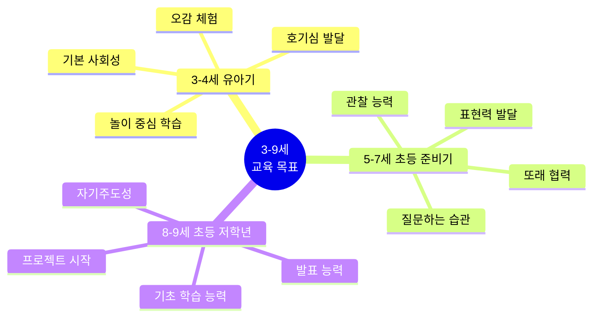

### 1.2 미네르바 대학 연계 역량

| 역량 | 3-4세 | 5-7세 | 8-9세 | 미네르바 연계 |
|------|-------|-------|-------|-------------|
| **비판적 사고** | 왜? 질문 시작 | 인과관계 이해 | 비교·분석 | 논리적 사고 기초 |
| **창의성** | 자유 놀이 | 상상력 확장 | 문제 해결 아이디어 | 혁신적 사고 |
| **협력 능력** | 나눔과 배려 | 팀 활동 | 역할 분담 | 글로벌 협업 |
| **의사소통** | 감정 표현 | 발표하기 | 설득하기 | 효과적 소통 |
| **자기주도성** | 스스로 선택 | 계획 세우기 | 프로젝트 실행 | 평생 학습자 |

### 1.3 역량별 발달 단계

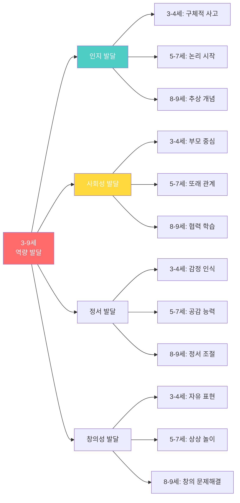

---

## 2. 프로젝트 기반 대회 활동

### 2.1 미술 프로젝트 대회

#### 📌 프로젝트형 그림 대회 (문제 해결 중심)

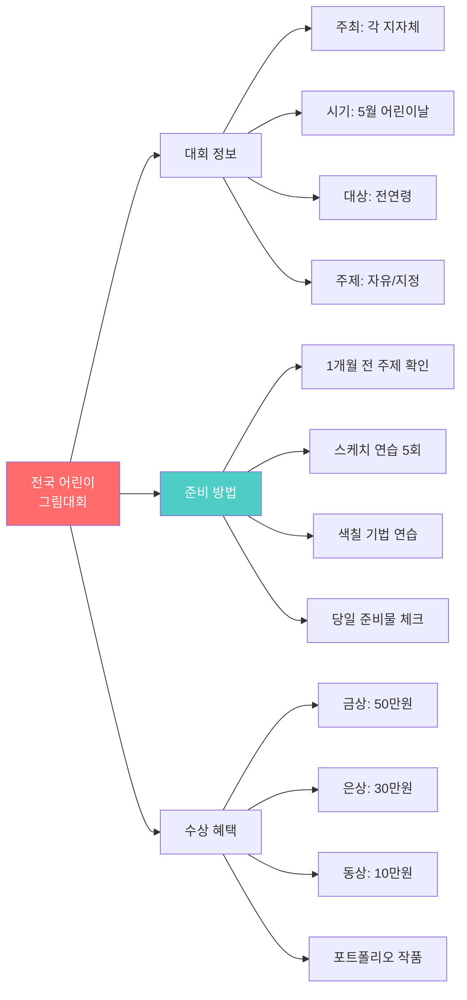

**참가 전략:**

| 단계 | 활동 | 기간 | 포인트 |
|------|------|------|--------|
| **사전 준비** | 주제 연구 | 2주 | 다양한 자료 찾기 |
| **스케치** | 아이디어 구상 | 1주 | 5개 이상 스케치 |
| **채색 연습** | 색감 테스트 | 1주 | 물감/크레파스 선택 |
| **최종 작품** | 완성도 높이기 | 3일 | 디테일 집중 |
| **대회 당일** | 시간 배분 | 2-3시간 | 여유 있게 마무리 |

#### 📌 환경사랑 어린이 그림 공모전

| 항목 | 내용 |
|------|------|
| **주최** | 환경부 |
| **접수** | 매년 4-5월 |
| **대상** | 유치원~초등6년 |
| **주제** | 환경 보호, 기후변화, 생태계 |
| **형식** | 4절지, 자유 표현 |
| **시상** | 대상 50만원, 금상 30만원 |
| **특전** | 환경부 장관상, 전시회 |
| **홈페이지** | me.go.kr |

**주제별 아이디어:**
- 🌳 숲 보호: 나무 심기, 산불 예방
- 🐋 바다 보호: 플라스틱 줄이기, 해양 생물
- 🌡️ 기후변화: 재생에너지, 탄소 중립
- 🌸 생태계: 멸종위기 동물, 생물 다양성

#### 📌 교통안전 포스터 공모전

**대회 상세:**

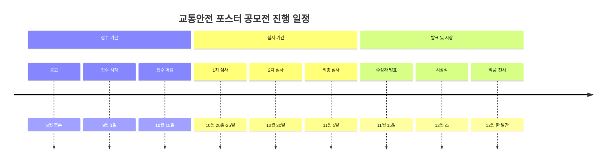

| 구분 | 내용 | 예시 |
|------|------|------|
| **주제 예시** | 횡단보도 안전 | "손 들고 건너요" |
| | 안전벨트 | "생명을 지키는 띠" |
| | 음주운전 금지 | "술은 브레이크를 망가뜨려요" |
| | 자전거 안전 | "헬멧은 내 머리를 지켜줘요" |
| **표현 요소** | 슬로건 | 짧고 기억하기 쉽게 |
| | 그림 | 명확한 메시지 |
| | 색상 | 강렬하고 대비 |
| | 레이아웃 | 균형감 있게 |

---

### 2.2 국제 대회 (상세)

#### 🌏 도요타 꿈의 자동차 대회

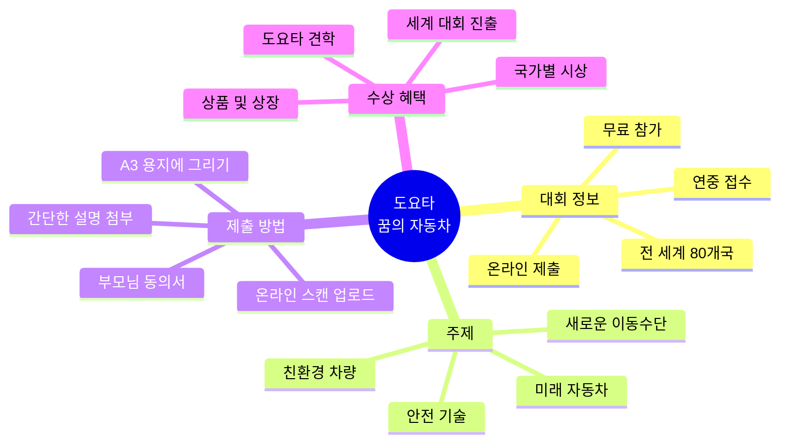

**역대 수상작 분석:**

| 수상년도 | 주제 | 특징 | 배울 점 |
|---------|------|------|---------|
| 2023 금상 | 하늘을 나는 청소차 | 환경+기술 융합 | 사회 문제 해결 아이디어 |
| 2022 금상 | 장애인을 돕는 자동차 | 배려와 기술 | 약자를 생각하는 마음 |
| 2021 금상 | 바다 쓰레기 수거 차 | 해양 보호 | 창의적 문제 해결 |

#### 🎨 샤프란 국제아동화전

**참가 가이드:**

| 항목 | 세부 내용 |
|------|----------|
| **주최 국가** | 체코 |
| **역사** | 50년 전통 |
| **참가국** | 140개국 |
| **연령** | 4-16세 (카테고리별) |
| **주제** | 매년 변경 (예: "평화", "꿈", "자연") |
| **작품 규격** | A3 (29.7 x 42cm) |
| **매체** | 제한 없음 (크레파스, 물감, 콜라주 등) |
| **접수** | 4-5월 온라인 제출 |
| **시상** | 금/은/동메달, 특별상 |
| **전시** | 체코 샤프란 미술관 전시 |

---

### 2.3 대회 준비 전략 (연령별)

#### 3-4세 (유아)

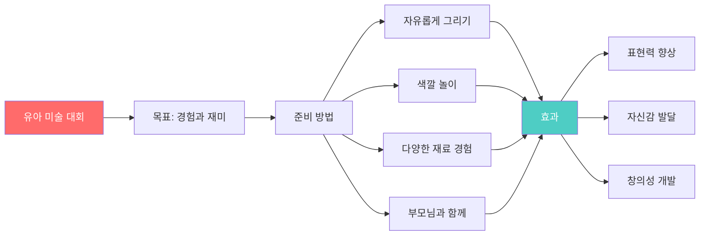

**준비 체크리스트:**
- [ ] 편안한 환경 (스트레스 없이)
- [ ] 다양한 재료 제공 (크레파스, 물감, 스티커)
- [ ] 칭찬과 격려
- [ ] 과정 중시 (결과보다는 즐거움)
- [ ] 사진 촬영 (성장 기록)

#### 5-7세 (초등 준비)

| 준비 단계 | 활동 | 시간 | 부모 역할 |
|----------|------|------|-----------|
| **1주차** | 주제 이해하기 | 매일 10분 | 그림책, 사진 보며 대화 |
| **2주차** | 스케치 연습 | 매일 20분 | 아이디어 함께 생각 |
| **3주차** | 색 칠하기 | 매일 30분 | 색 선택 조언 |
| **4주차** | 완성하기 | 2-3회 | 디테일 도움 |

#### 8-9세 (초등 저학년)

**체계적 준비 방법:**

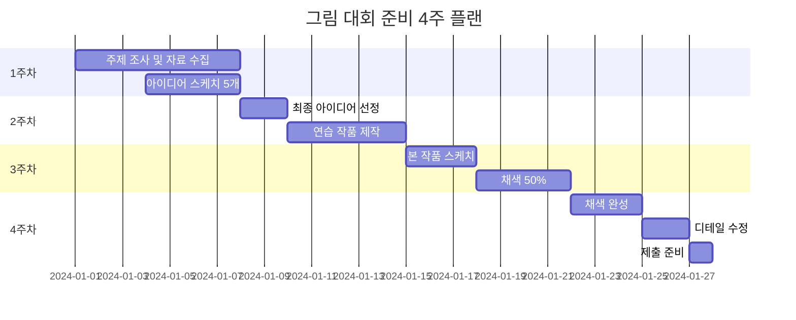

---

## 3. 발명/과학 프로젝트 대회

### 3.1 문제 해결형 발명 프로젝트 - YIP 초등부

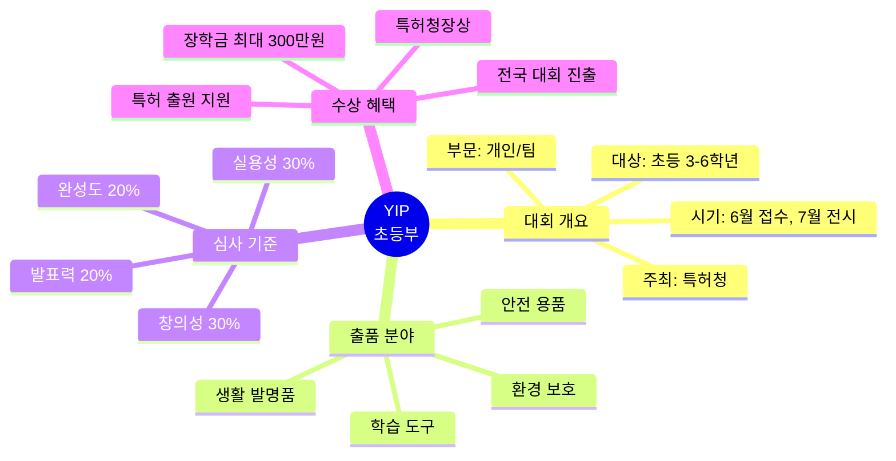

**발명 아이디어 찾기 방법:**

| 단계 | 질문 | 활동 | 결과 |
|------|------|------|------|
| **문제 발견** | 불편한 것이 뭘까? | 일주일 관찰 일기 | 문제 리스트 10개 |
| **아이디어** | 어떻게 해결할까? | 브레인스토밍 | 해결책 3개 |
| **선택** | 가장 좋은 방법은? | 장단점 비교 | 최종 아이디어 1개 |
| **설계** | 어떻게 만들까? | 스케치 5장 | 설계도 완성 |
| **제작** | 재료는? 방법은? | 프로토타입 제작 | 시제품 완성 |
| **테스트** | 잘 작동하나? | 5명 테스트 | 피드백 수집 |
| **개선** | 무엇을 고칠까? | 수정 작업 | 최종 작품 |

#### 역대 수상작 예시

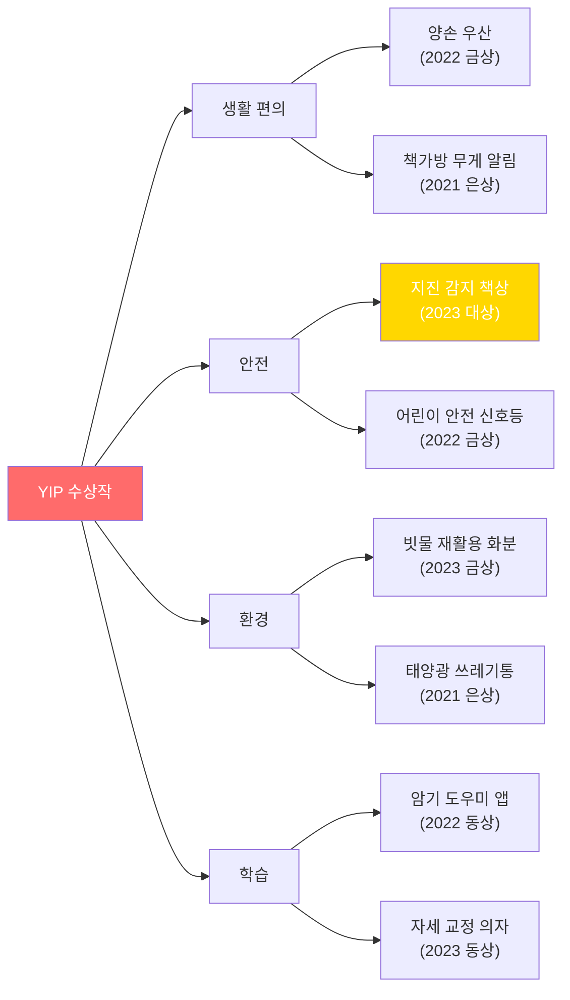

---

### 3.2 어린이 과학탐구대회

**대회 구조:**

| 부문 | 대상 | 과제 유형 | 준비 기간 |
|------|------|----------|----------|
| **물리 부문** | 초3-6 | 실험 관찰 | 2개월 |
| **화학 부문** | 초3-6 | 물질 변화 | 2개월 |
| **생물 부문** | 초3-6 | 생명 관찰 | 3개월 |
| **지구과학 부문** | 초3-6 | 자연 현상 | 3개월 |

**탐구 보고서 작성 가이드:**

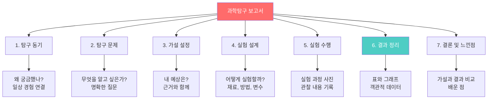

---

### 3.3 로봇창의대회

**대회 미션 예시:**

| 연도 | 주제 | 미션 | 필요 기술 |
|------|------|------|----------|
| 2024 | 재난 구조 | 로봇이 미로를 통과해 생존자 구출 | 센서, 프로그래밍 |
| 2023 | 환경 보호 | 쓰레기 분리수거 로봇 | 색상 인식, 집게 |
| 2022 | 스마트 농장 | 자동 물주기 로봇 | 수분 센서, 모터 |

**입문용 로봇 키트:**
- 🤖 **레고 마인드스톰**: 블록 조립 + 프로그래밍
- 🤖 **알버트**: 한국형 코딩 로봇
- 🤖 **대시 로봇**: 앱 프로그래밍
- 🤖 **오조봇**: 색 코딩 로봇

---

## 4. 글쓰기/독서 대회

### 4.1 전국 초등학생 글짓기 대회

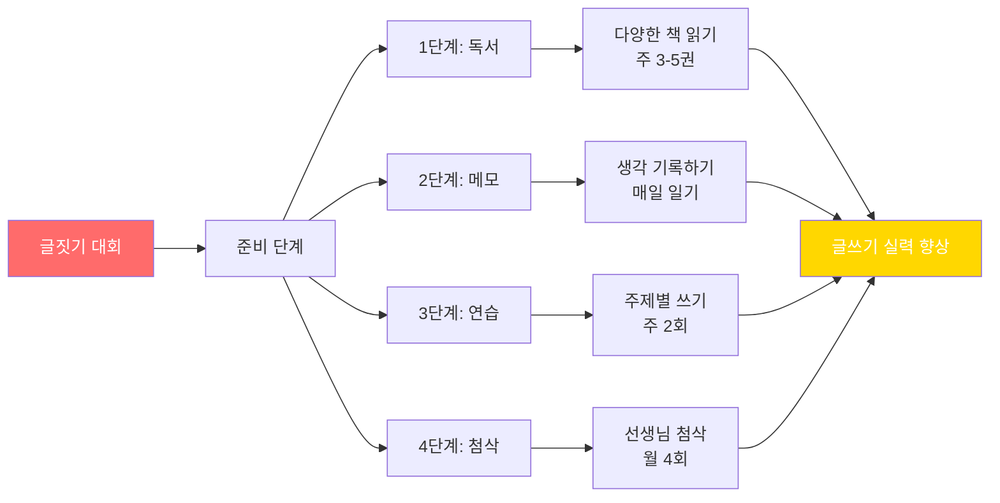

**글감 찾기 방법:**

| 카테고리 | 주제 예시 | 글감 메모 |
|---------|----------|-----------|
| **경험** | 가족 여행, 친구와의 추억 | 5W1H 기록 |
| **관찰** | 계절 변화, 동네 풍경 | 오감 표현 |
| **상상** | 미래, 만약에... | 자유 상상 |
| **감정** | 기쁨, 슬픔, 분노 | 솔직한 감정 |
| **교훈** | 배운 것, 깨달은 것 | 변화한 생각 |

---

### 4.2 독서감상문 대회

**좋은 독서감상문 구조:**

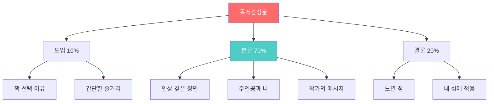

**연령별 추천 도서 (대회용):**

| 학년 | 장르 | 추천 도서 | 이유 |
|------|------|----------|------|
| **1-2학년** | 동화 | "마당을 나온 암탉" | 꿈과 자유 |
| | 그림책 | "강아지똥" | 존재 가치 |
| **3-4학년** | 동화 | "몽실 언니" | 역사와 인권 |
| | 과학 | "과학 탐정" 시리즈 | 탐구 정신 |
| **5-6학년** | 소설 | "완득이" | 차이와 이해 |
| | 전기 | "세상을 바꾼 과학자들" | 도전 정신 |

---

## 5. 예체능 대회

### 5.1 음악 대회

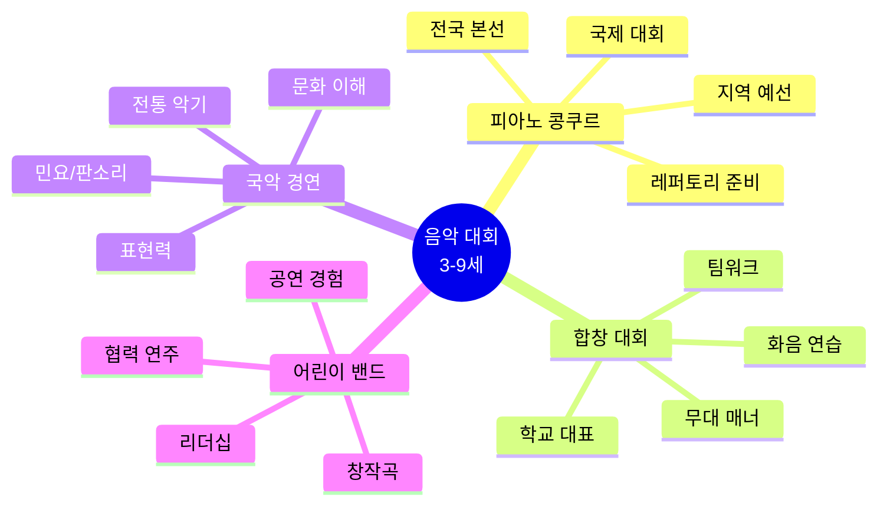

**음악 대회 준비 타임라인:**

| 시기 | 개인 연습 | 선생님 레슨 | 모의 연주 | 컨디션 관리 |
|------|-----------|------------|----------|------------|
| **D-90일** | 주 5일, 1시간 | 주 1회 | - | 충분한 수면 |
| **D-60일** | 주 6일, 1.5시간 | 주 2회 | 월 1회 | 규칙적 생활 |
| **D-30일** | 매일 2시간 | 주 2회 | 주 1회 | 스트레스 관리 |
| **D-7일** | 매일 1시간 | 주 1회 | 매일 | 긍정 마인드 |
| **당일** | 가볍게 리허설 | - | - | 충분한 휴식 |

---

### 5.2 체육 대회

**종목별 대회:**

| 종목 | 대회명 | 연령 | 특징 | 준비 기간 |
|------|--------|------|------|----------|
| **태권도** | 품새 대회 | 5-9세 | 개인/단체 | 6개월 |
| **축구** | 유소년 리그 | 6-9세 | 팀 스포츠 | 1년 |
| **수영** | 전국체전 | 7-9세 | 개인 기록 | 2년 |
| **체조** | 꿈나무 체육대회 | 5-8세 | 유연성 | 1년 |
| **배드민턴** | 초등부 대회 | 8-9세 | 반응 속도 | 1년 |

---

## 6. 추천 도서 & 교육 자료

### 6.1 연령별 필독서

#### 📚 3-4세 (유아)

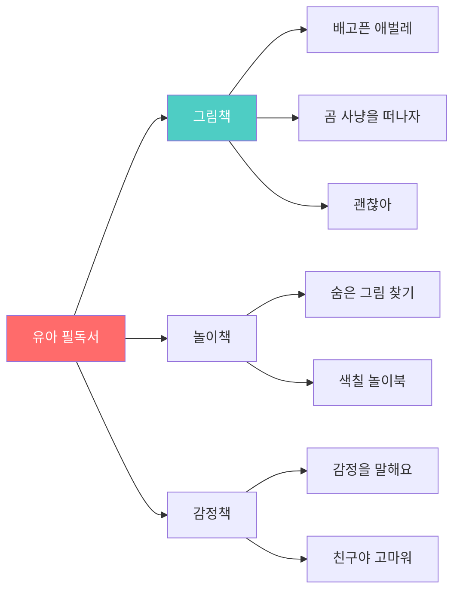

| 책 제목 | 저자 | 주제 | 교육 효과 |
|---------|------|------|----------|
| **무지개 물고기** | 마커스 피스터 | 나눔 | 사회성 발달 |
| **똥 싸개 행성** | 고정순 | 유머 | 상상력 |
| **내가 정말?** | 앤서니 브라운 | 자아 | 자존감 |
| **종이봉지 공주** | 로버트 문치 | 용기 | 문제 해결 |

---

#### 📚 5-7세 (초등 준비)

**과학 탐구:**

| 책 제목 | 주제 | 추천 이유 | 프로젝트 연계 |
|---------|------|----------|-------------|
| **과학자처럼 생각해요** | 과학적 방법 | 관찰과 실험 | 과학 탐구 대회 |
| **Why? 시리즈** | 다양한 주제 | 호기심 충족 | 모든 대회 배경지식 |
| **놀라운 과학** | 과학 현상 | 실험 아이디어 | 발명 대회 |

**사회성 발달:**

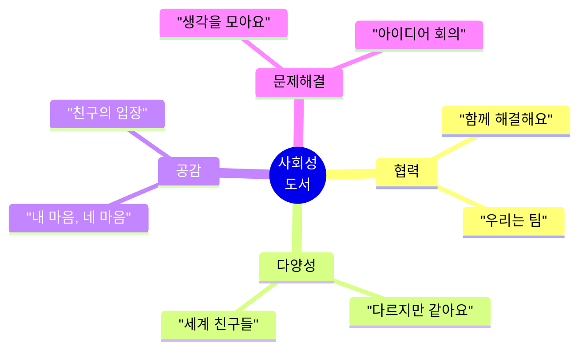

---

#### 📚 8-9세 (초등 저학년)

**학년별 추천:**

| 학년 | 분야 | 도서명 | 목표 역량 |
|------|------|--------|----------|
| **초1** | 한글 | "받아쓰기 100일 완성" | 기초 문해력 |
| | 수학 | "수학 귀신" | 수학적 사고 |
| **초2** | 과학 | "재밌어서 밤새 읽는 과학" | 과학 흥미 |
| | 역사 | "한국사 첫걸음" | 역사 인식 |
| **초3** | 경제 | "열두 살에 부자가 된 키라" | 경제 개념 |
| | 철학 | "어린이를 위한 철학" | 비판적 사고 |

---

### 6.2 부모 교육 가이드북

**추천 육아서:**

| 책 제목 | 저자 | 핵심 메시지 | 적용 연령 |
|---------|------|------------|----------|
| **아이의 사생활** | EBS 제작팀 | 뇌과학 기반 육아 | 0-10세 |
| **마시멜로 이야기** | 호아킴 데 포사다 | 자기 조절력 | 5-10세 |
| **부모라면 유대인처럼** | 전성수 | 질문 육아법 | 3-15세 |
| **영재의 탄생** | 박경호 | 재능 발견과 개발 | 5-12세 |

---

### 6.3 온라인 교육 자료

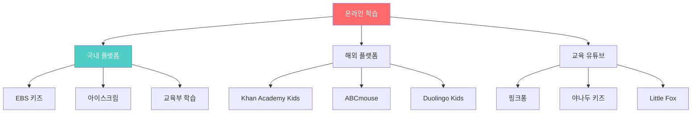

---

## 7. 프로젝트 기반 역량 개발

### 7.1 3-9세 프로젝트 중심 학습 전략

```mermaid
timeline
    title 3-9세 프로젝트 기반 학습 타임라인
    
    section 3-4세: 관찰 프로젝트
        우리 집 탐험 : 사진 20장
                     : 지도 그리기
                     : 가족 발표
        색깔 찾기 : 색 분류 활동
                  : 색 섞기 실험
                  : 무지개 만들기
    
    section 5-7세: 탐구 프로젝트
        동네 탐험가 : 4주 관찰
                    : 지도 제작
                    : 발표 10분
        과학 실험 : 씨앗 키우기
                  : 관찰 일기
                  : 성장 기록
    
    section 8-9세: 문제 해결 프로젝트
        플라스틱 줄이기 : 12주 캠페인
                        : 25% 감축
                        : 200명 참여
        코딩 게임 : Scratch 활용
                  : 교육용 게임
                  : 대회 출품
```

---

### 7.2 대회 참가 연간 계획

**8-9세 권장 대회 일정:**

| 월 | 대회 유형 | 준비 기간 | 목표 |
|----|----------|----------|------|
| **3월** | 과학의 날 행사 | 2개월 | 과학 탐구 경험 |
| **5월** | 어린이날 그림 대회 | 1개월 | 예술 표현 |
| **6월** | 발명의 날 | 3개월 | 창의적 사고 |
| **9월** | 글짓기 대회 | 지속적 | 글쓰기 실력 |
| **11월** | 로봇 대회 | 6개월 | 코딩 경험 |

**연간 목표:**
- ✅ 총 5-8개 대회 참가
- ✅ 2개 이상 수상
- ✅ 포트폴리오 축적
- ✅ 다양한 분야 경험

---

### 7.3 미네르바 대학 준비 체크리스트 (9세 기준)

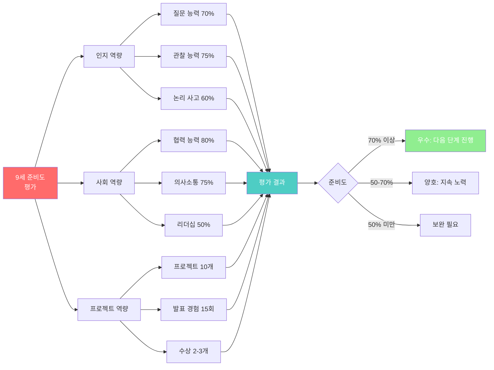

---

## 📊 핵심 요약표

### 3-9세 대회 참가 가이드 요약

| 연령 | 추천 대회 수 | 주요 분야 | 핵심 목표 | 부모 역할 |
|------|------------|----------|----------|-----------|
| **3-4세** | 2-3개/년 | 그림, 체험 | 경험과 재미 | 적극적 동행 |
| **5-7세** | 4-6개/년 | 미술, 발명, 글쓰기 | 흥미 발견 | 격려와 지원 |
| **8-9세** | 5-8개/년 | 과학, 코딩, 대회 | 실력 향상 | 자율성 존중 |

---

## 8. 프로젝트 기반 대회 참가 전략

### 8.1 대회를 프로젝트로 전환하는 방법

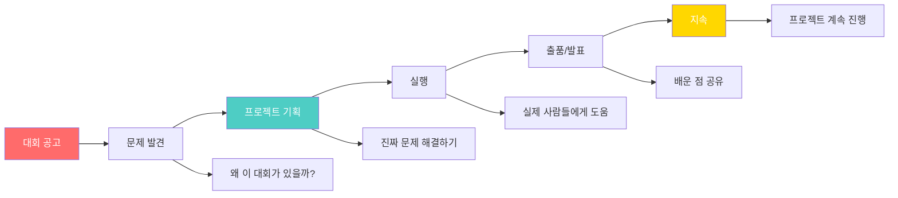

### 8.2 3-9세 프로젝트 예시

#### 🎨 환경 그림 대회 → 환경 프로젝트

| 단계 | 단순 참가 ❌ | 프로젝트 기반 ✅ |
|------|-----------|---------------|
| **준비** | 그림만 그림 | 환경 문제 조사 (1주) |
| **활동** | 대회 당일만 | 가족과 환경 실천 (2주) |
| **결과** | 그림 1장 | 그림 + 실천 일기 + 사진 |
| **발표** | - | 어떻게 변했는지 공유 |
| **지속** | 끝 | 계속 환경 보호 활동 |

---

## 🎯 마무리 조언

### 프로젝트 기반 대회 참가 5원칙

1. **진짜 문제**: 대회 주제에서 실제 문제 찾기
2. **실행 중심**: 직접 해보고 경험하기
3. **기록**: 과정을 사진과 글로 남기기
4. **발표**: 배운 점을 다른 사람과 공유
5. **지속**: 대회 끝나도 프로젝트 계속

### 부모 가이드

**프로젝트형 질문법:**
- ❌ "그림 그릴 준비 됐어?"
- ✅ "환경을 지키려면 우리가 뭘 할 수 있을까?"

- ❌ "대회에서 상 타야지?"
- ✅ "이 프로젝트로 누구를 도울 수 있을까?"

---

**© 2025 유아~초등 저학년 프로젝트 기반 가이드. All rights reserved.**
*업데이트: 2025년 12월 12일*

**다음 단계: 초등 고학년 (10-12세) 가이드에서 계속됩니다!**
