# 초등 고학년 대회 & 교육 가이드 (10-12세)

 
 


---

## 📑 목차

1. [10-12세 교육 목표 및 역량](#1-10-12세-교육-목표-및-역량)
2. [과학/공학 대회](#2-과학공학-대회)
3. [수학 대회](#3-수학-대회)
4. [코딩/SW 대회](#4-코딩sw-대회)
5. [영어/언어 대회](#5-영어언어-대회)
6. [사회/역사 대회](#6-사회역사-대회)
7. [추천 도서 & 역량 개발](#7-추천-도서--역량-개발)

---

## 1. 10-12세 교육 목표 및 역량

### 1.1 초등 고학년 핵심 목표

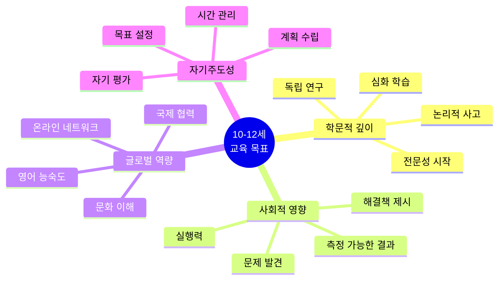

### 1.2 미네르바 대학 연계 역량 (심화)

| 역량 | 초등 고학년 목표 | 구체적 활동 | 평가 지표 | 미네르바 연계 |
|------|---------------|-----------|----------|-------------|
| **비판적 사고** | 다각도 분석 | 토론, 논술 | 근거 제시 능력 | Formal Analyses |
| **창의적 문제해결** | 프로젝트 완수 | 대회 출전 | 독창적 해결책 | Complex Systems |
| **데이터 분석** | 통계 이해 | 설문 조사 | 그래프 해석 | Empirical Analyses |
| **협업 리더십** | 팀 프로젝트 리딩 | 동아리 운영 | 팀 성과 | Effective Interaction |
| **효과적 소통** | 발표 & 글쓰기 | 대회 프레젠테이션 | 청중 이해도 | Multimodal Communication |

### 1.3 12세 기준 성취 목표

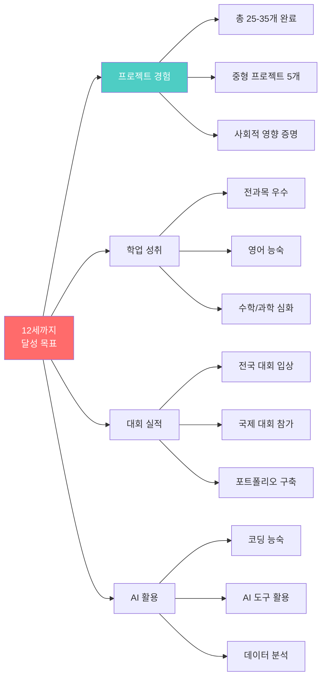

---

## 2. 과학/공학 대회

### 2.1 YIP(한국학생발명전시회) - 심화

#### 🏆 대회 구조 및 준비 전략

```mermaid
timeline
    title YIP 준비 6개월 타임라인
    
    section Month 1: 아이디어
        문제 발견 : 일상 관찰 2주
        브레인스토밍 : 해결책 20개
        아이디어 선정 : 실현 가능성 검토
    
    section Month 2-3: 설계
        선행 기술 조사 : 특허 검색
        상세 설계 : CAD 도면
        재료 구입 : 예산 계획
    
    section Month 4: 제작
        프로토타입 1차 : 기본 기능
        테스트 : 문제점 발견
        개선 : 수정 작업
    
    section Month 5: 완성
        최종 제작 : 완성도 향상
        사용자 테스트 : 10명 피드백
        포스터 제작 : 시각 자료
    
    section Month 6: 발표
        발표 연습 : 3분 스피치
        질의응답 준비 : 예상 질문 20개
        대회 참가 : 최종 발표
```

#### 📋 발명 분야별 성공 사례

| 분야 | 발명품 | 학년 | 핵심 아이디어 | 수상 | 특허 |
|------|--------|------|-------------|------|------|
| **안전** | 지진 감지 책상 | 초6 | 센서 + 자동 대피 | 대상 | 출원 |
| **환경** | 태양광 쓰레기 압축기 | 초5 | 재생에너지 활용 | 금상 | 출원 |
| **편의** | 시각장애인 보조 지팡이 | 초6 | 초음파 센서 | 금상 | 출원 |
| **교육** | AR 학습 도구 | 초6 | 스마트폰 앱 연동 | 은상 | - |
| **의료** | 약 복용 알림 장치 | 초5 | IoT 기술 | 동상 | - |

#### 💡 발명 아이디어 도출 프레임워크

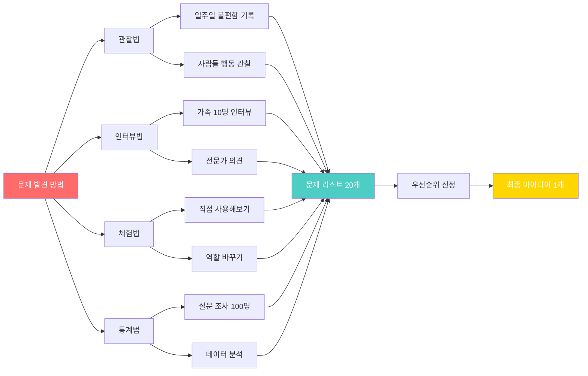

---

### 2.2 전국학생과학발명품경진대회

#### 🔬 과학 발명품 vs 일반 발명품 차이

| 구분 | 일반 발명품 | 과학 발명품 | 예시 |
|------|-----------|-----------|------|
| **원리** | 기계적 구조 | 과학 원리 활용 | 자석, 전기, 화학 반응 |
| **설명** | 작동 방법 | 과학적 근거 | 왜 작동하는가? |
| **자료** | 설계도 중심 | 실험 데이터 | 측정값, 그래프 |
| **심사** | 실용성 | 과학성 + 실용성 | 논리적 설명 |

#### 📊 과학 발명품 보고서 구성

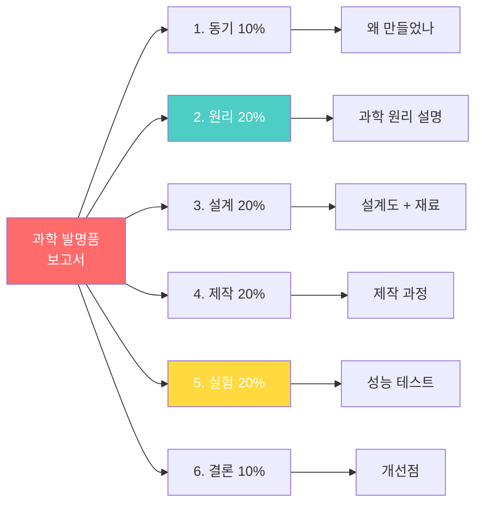

---

### 2.3 FLL (First Lego League)

#### 🤖 FLL 대회 구조

| 부문 | 배점 | 내용 | 준비 기간 |
|------|------|------|----------|
| **로봇 게임** | 40% | 미션 수행 (2분 30초) | 3-4개월 |
| **혁신 프로젝트** | 30% | 사회 문제 해결 | 2-3개월 |
| **로봇 디자인** | 15% | 설계 및 프로그래밍 | 3개월 |
| **코어 밸류** | 15% | 팀워크와 태도 | 상시 |

#### 🎯 로봇 게임 미션 준비 전략

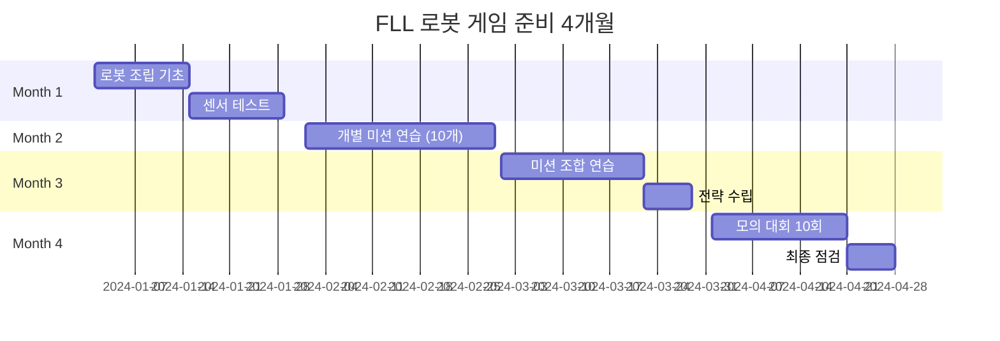

#### 💻 추천 로봇 프로그래밍 언어

| 언어/도구 | 난이도 | 학습 기간 | 추천 학년 | 특징 |
|---------|--------|----------|----------|------|
| **레고 블록 코딩** | ⭐⭐ | 1개월 | 초4-5 | 직관적, 입문용 |
| **Scratch** | ⭐⭐⭐ | 2개월 | 초5-6 | 비주얼 프로그래밍 |
| **Python** | ⭐⭐⭐⭐ | 3-4개월 | 초6 | 실전 코딩 |

---

## 3. 수학 대회

### 3.1 KMO (한국수학올림피아드) 초등부

#### 📐 KMO 난이도 및 준비 전략

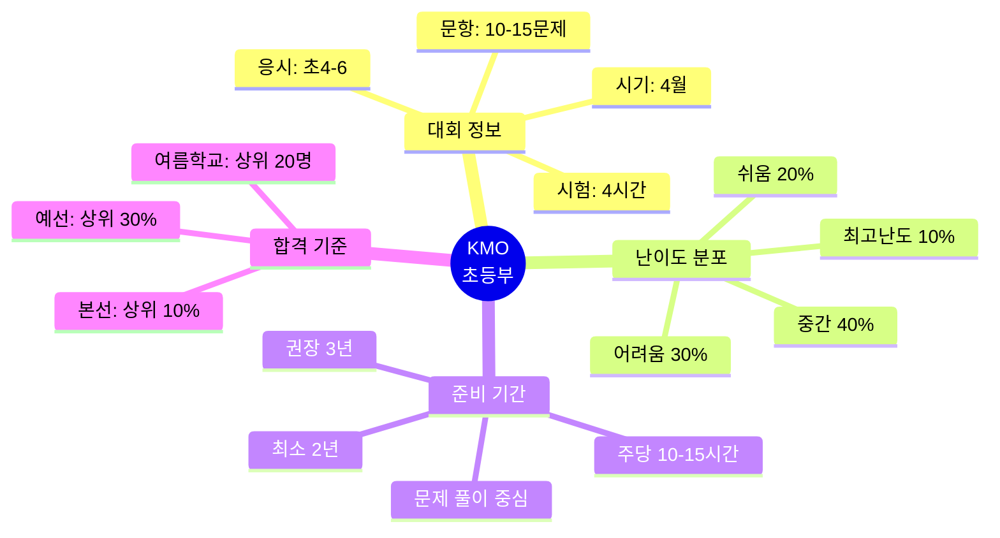

#### 📚 KMO 준비 교재 로드맵

| 단계 | 교재 | 학습 기간 | 목표 |
|------|------|----------|------|
| **기초** | 초등 수학의 발견 | 3개월 | 개념 완성 |
| **입문** | 초등 수학 올림피아드 시리즈 | 6개월 | 문제 유형 파악 |
| **심화** | KMO 기출문제집 (최근 10년) | 6개월 | 실전 감각 |
| **최고급** | 정수론, 조합론 전문서 | 6개월 | 고급 기법 |

#### 🎯 주제별 출제 비중 및 공략법

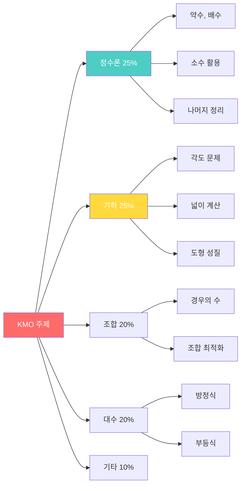

---

### 3.2 Math Kangaroo (국제 수학 경시)

#### 🌍 Math Kangaroo 특징

| 항목 | 내용 |
|------|------|
| **참가국** | 전 세계 80개국 |
| **응시자** | 연간 600만명 |
| **시기** | 매년 3월 |
| **시험 시간** | 75분 |
| **문항 수** | 24-30문제 (객관식) |
| **난이도** | 쉬움→어려움 단계별 |
| **특징** | 창의적 사고, 논리 퍼즐 |

#### 💡 Math Kangaroo vs KMO 비교

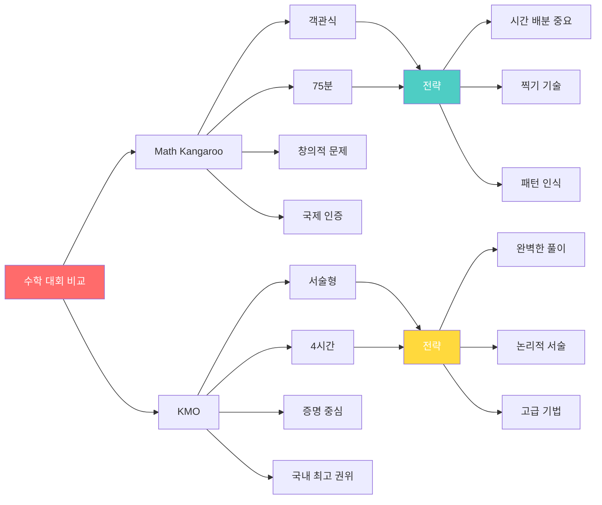

---

## 4. 코딩/SW 대회

### 4.1 삼성 주니어 SW 창작대회

#### 💻 대회 구조 및 부문

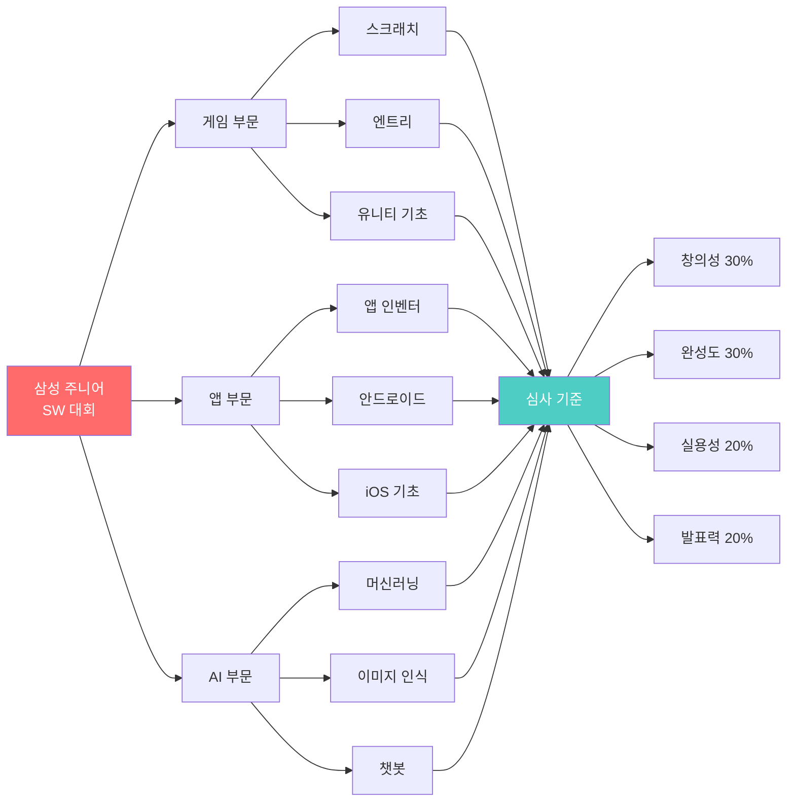

#### 🎮 수상작 분석 및 성공 요인

| 연도 | 작품명 | 부문 | 핵심 기능 | 성공 요인 |
|------|--------|------|----------|----------|
| 2023 | "할머니 도우미" | 앱 | 음성 인식 약 알림 | 사회적 가치 |
| 2023 | "환경 지킴이 게임" | 게임 | 재미+교육 | 게임성 우수 |
| 2022 | "AI 학습 친구" | AI | 맞춤 문제 추천 | AI 활용 |
| 2022 | "청소 로봇 시뮬레이터" | 게임 | 물리 엔진 | 기술력 |

#### 📱 프로젝트 개발 6개월 플랜

```mermaid
timeline
    title SW 창작 프로젝트 개발 과정
    
    section Month 1-2: 기획
        아이디어 회의 : 10개 도출
        사용자 조사 : 50명 설문
        기획서 작성 : 30페이지
    
    section Month 3-4: 개발
        프로토타입 : 핵심 기능
        알파 테스트 : 버그 수정
        기능 추가 : 80% 완성
    
    section Month 5: 완성
        베타 테스트 : 20명
        최종 수정 : 완성도 향상
        영상 제작 : 데모 영상
    
    section Month 6: 제출
        PPT 제작 : 발표 자료
        발표 연습 : 10회
        대회 참가 : 최종 발표
```

---

### 4.2 정보올림피아드 (KOI) 초등부

#### 🏅 KOI 초등부 특징

| 항목 | 세부 내용 |
|------|----------|
| **응시 자격** | 초등 4-6학년 |
| **시험 시기** | 5-6월 (예선/본선) |
| **시험 형식** | 알고리즘 문제 풀이 |
| **사용 언어** | C, C++, Python, Java |
| **문제 수** | 예선 4-5문제, 본선 5-6문제 |
| **시험 시간** | 3-4시간 |
| **난이도** | ⭐⭐⭐⭐⭐ (최고난도) |

#### 💡 알고리즘 학습 로드맵

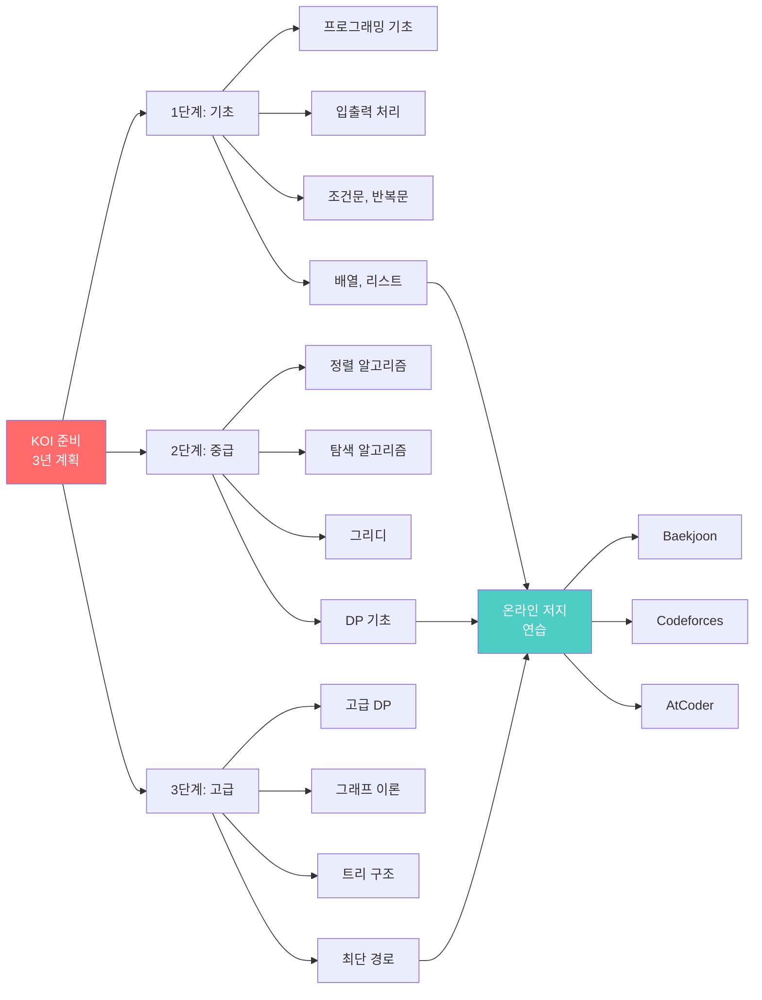

#### 📊 일일 학습 계획 (초6 기준)

| 시간대 | 활동 | 내용 | 목표 |
|-------|------|------|------|
| **방과 후** | 개념 학습 | 알고리즘 이론 | 1개 개념 |
| **저녁 7-8시** | 문제 풀이 | Baekjoon 3문제 | 실전 감각 |
| **저녁 8-9시** | 코드 리뷰 | 다른 사람 풀이 분석 | 다양한 접근 |
| **주말** | 모의 대회 | 3시간 집중 | 시험 감각 |

---

## 5. 영어/언어 대회

### 5.1 전국 초등학생 영어 말하기 대회

#### 🎤 말하기 대회 준비 전략

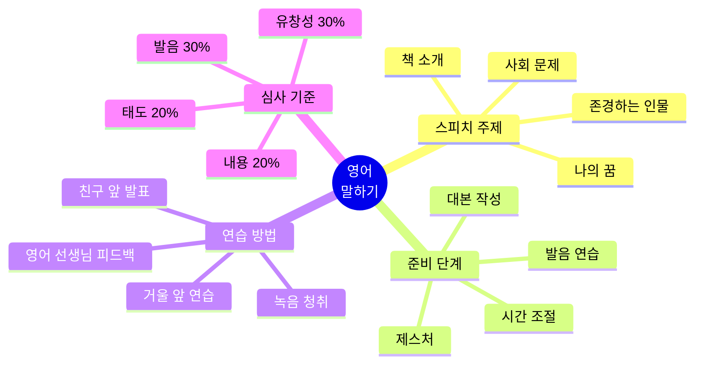

#### 📝 스피치 준비 4주 플랜

| 주차 | 목표 | 세부 활동 | 체크포인트 |
|------|------|----------|-----------|
| **1주** | 대본 완성 | 주제 선정, 초안 작성 | 2분 분량 |
| **2주** | 암기 | 매일 10분씩 암기 | 60% 암기 |
| **3주** | 발음 교정 | 원어민 피드백 | 발음 정확도 |
| **4주** | 종합 연습 | 10회 이상 리허설 | 자신감 |

---

### 5.2 영어 에세이 콘테스트 (주한 미국대사관)

#### ✍️ 에세이 작성 가이드

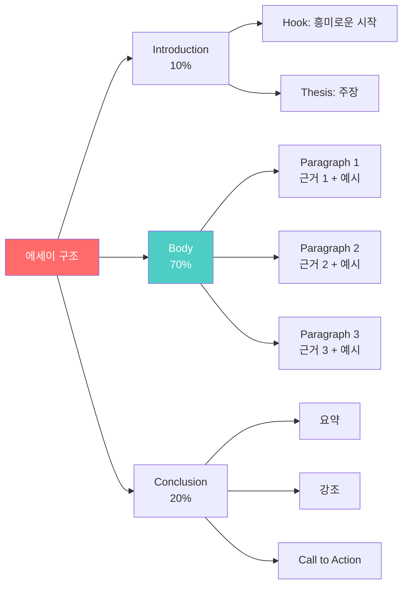

#### 📊 수상 에세이 분석

| 연도 | 주제 | 핵심 전략 | 배울 점 |
|------|------|----------|---------|
| 2023 | "평화란 무엇인가" | 개인 경험 → 보편적 가치 | 스토리텔링 |
| 2022 | "기후 변화와 우리" | 데이터 + 해결책 | 논리적 전개 |
| 2021 | "다양성의 가치" | 비교 문화 경험 | 글로벌 관점 |

---

### 5.3 Spelling Bee (철자법 대회)

#### 📚 준비 전략 및 암기법

| 단계 | 활동 | 시간 | 방법 |
|------|------|------|------|
| **1단계** | 기본 단어 500개 | 1개월 | 매일 20개 암기 |
| **2단계** | 중급 단어 1000개 | 2개월 | 매일 25개 암기 |
| **3단계** | 고급 단어 500개 | 1개월 | 매일 20개 암기 |
| **4단계** | 모의 대회 연습 | 상시 | 주 2회 |

**암기 팁:**
- 🔤 어원 학습 (그리스어, 라틴어)
- 🎵 리듬으로 외우기
- 📝 손으로 쓰며 암기
- 🎮 온라인 게임 활용 (SpellingCity)

---

## 6. 사회/역사 대회

### 6.1 역사신문 만들기 대회

#### 📰 역사신문 제작 가이드

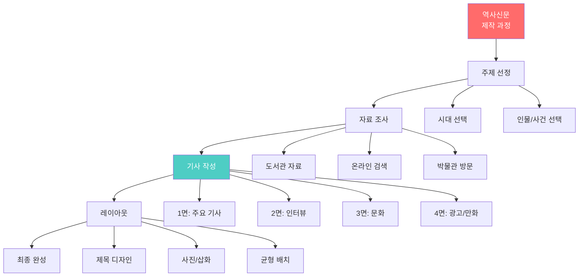

#### 🏆 역대 수상작 주제

| 시대 | 주제 | 특징 | 학년 |
|------|------|------|------|
| 조선시대 | "세종대왕의 한글 창제" | 당시 관점으로 기사화 | 초6 |
| 일제강점기 | "3·1운동 현장 르포" | 생생한 현장감 | 초6 |
| 고려시대 | "몽골의 침입" | 다양한 시각 | 초5 |
| 삼국시대 | "백제의 찬란한 문화" | 문화재 중심 | 초5 |

---

### 6.2 독도 사랑 글짓기

#### 🏝️ 주제별 접근 방법

| 주제 유형 | 접근 방법 | 예시 | 강조점 |
|----------|----------|------|--------|
| **역사** | 역사적 근거 제시 | 신라시대부터의 기록 | 객관적 사실 |
| **자연** | 생태계 가치 | 독특한 동식물 | 보호 필요성 |
| **감성** | 개인적 경험 | 독도 방문 후기 | 애국심 |
| **미래** | 미래 비전 | 독도의 역할 | 희망적 메시지 |

---

## 7. 추천 도서 & 역량 개발

### 7.1 필독서 리스트 (10-12세)

#### 📚 과학/수학 분야

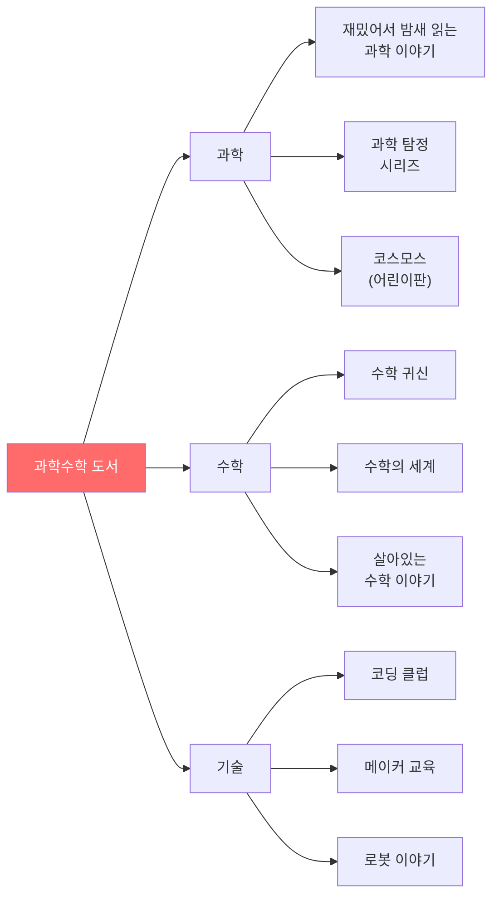

#### 📖 인문/사회 분야

| 분야 | 도서명 | 저자 | 핵심 내용 | 연계 역량 |
|------|--------|------|----------|----------|
| **경제** | "열두 살에 부자가 된 키라" | 보도 셰퍼 | 금융 교육 | 경제 이해 |
| **역사** | "어린이를 위한 한국사" | 김원미 | 역사 통사 | 역사 의식 |
| **철학** | "소피의 세계" | 요슈타인 가아더 | 철학 입문 | 비판적 사고 |
| **사회** | "세상을 바꾼 착한 기업들" | 임영신 | 사회적 기업 | 사회 문제 인식 |

---

### 7.2 영문 원서 읽기 시작

#### 📕 레벨별 추천 원서

| 레벨 | 책 제목 | 페이지 | 장르 | 예상 기간 |
|------|---------|--------|------|----------|
| **AR 3.0** | "Charlotte's Web" | 192 | 동화 | 2주 |
| **AR 4.0** | "The Lion, Witch and Wardrobe" | 206 | 판타지 | 3주 |
| **AR 5.0** | "Holes" | 233 | 모험 | 3주 |
| **AR 6.0** | "The Giver" | 240 | SF | 4주 |

#### 📊 영어 독서 목표 (12세 기준)

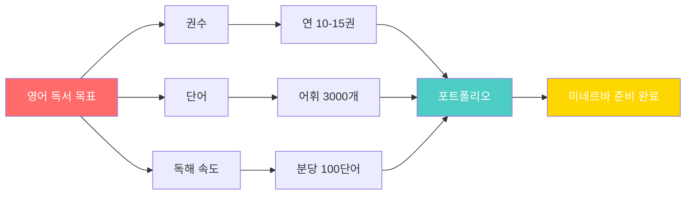

---

### 7.3 역량 개발 종합 계획

#### 📅 10-12세 연간 활동 계획

| 월 | 대회/활동 | 독서 | 프로젝트 | 목표 역량 |
|----|----------|------|---------|----------|
| **3월** | 과학의 날 | 과학책 2권 | 과학 실험 | 탐구 능력 |
| **4월** | KMO 응시 | 수학책 1권 | 수학 탐구 | 논리적 사고 |
| **5월** | 어린이날 행사 | 동화 2권 | 미술 작품 | 창의성 |
| **6월** | YIP 제출 | 발명책 1권 | 발명품 완성 | 문제 해결 |
| **7-8월** | 코딩 캠프 | 영문 원서 2권 | 앱 개발 | 기술 역량 |
| **9월** | 글짓기 대회 | 인문 2권 | 에세이 | 표현력 |
| **10월** | 과학 발명 대회 | 과학 2권 | 연구 보고서 | 과학적 방법 |
| **11월** | 로봇 대회 | 기술 1권 | 로봇 제작 | 공학 능력 |
| **12월** | 정리 및 평가 | 종합 2권 | 포트폴리오 | 성찰 |

---

### 7.4 12세 미네르바 준비도 평가

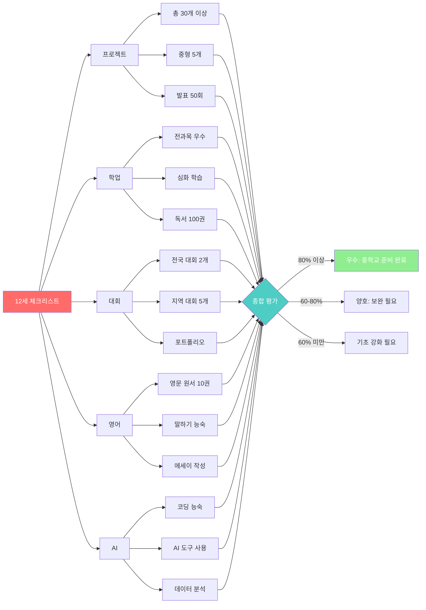

---

## 8. 프로젝트 기반 대회 전략

### 8.1 중형 프로젝트 (2-3개월) 템플릿

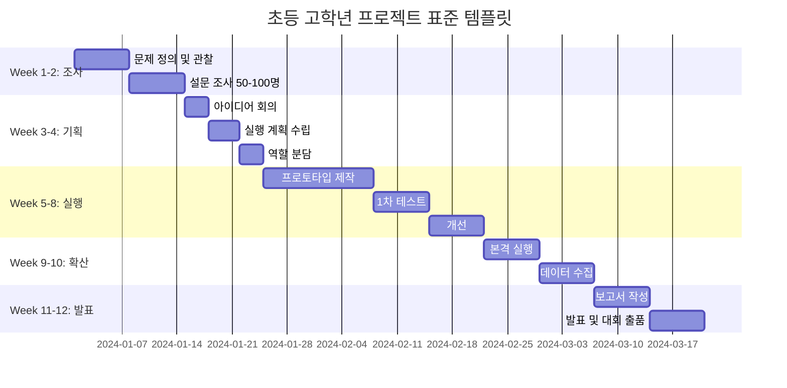

### 8.2 프로젝트 예시: "어르신 AI 도우미 앱" (6개월)

**프로젝트 구성:**

| 월 | 마일스톤 | 활동 | 증명 |
|----|---------|------|------|
| **1월** | 문제 발견 | 경로당 방문, 인터뷰 10명 | 녹음 파일 |
| **2월** | 디자인 | UI 스케치 20장, Figma | 디자인 파일 |
| **3-4월** | 개발 | App Inventor로 제작 | APK 파일 |
| **5월** | 테스트 | 어르신 5명 베타 | 만족도 90% |
| **6월** | 확산 | 25명 사용, 교육 | 사용자 데이터 |

**대회 출품:**
- 🏆 삼성 주니어 SW 대회 은상
- 📰 지역 신문 기사
- 💼 교육청 표창

---

## 🎓 마무리

### 프로젝트 기반 성공 전략

1. **문제 중심**: 대회가 아닌 문제 해결이 목적
2. **측정 가능**: 숫자로 증명 (몇 명, 몇 %, 얼마나)
3. **지속성**: 대회 끝나도 프로젝트 계속
4. **팀워크**: 3-4명 협력, 역할 분담
5. **기록**: GitHub, 블로그, 포트폴리오

### 12세 프로젝트 체크리스트

- [ ] 총 30-35개 프로젝트 완료
- [ ] 중형 프로젝트 5개 (각 2-3개월)
- [ ] 수혜자/참여자 100명 이상
- [ ] 대회 수상 3-5개
- [ ] 발표 경험 50회
- [ ] GitHub 계정 및 5개 프로젝트 업로드

---

**© 2025 초등 고학년 프로젝트 기반 가이드. All rights reserved.**
*업데이트: 2025년 12월 12일*

**다음 단계: 중학생 (13-15세) 가이드에서 계속됩니다!**
