# 중학생 대회 & 교육 가이드 (13-15세)

 
 


---

## 📑 목차

1. [13-15세 교육 목표 및 역량](#1-13-15세-교육-목표-및-역량)
2. [과학 올림피아드](#2-과학-올림피아드)
3. [발명/창업 대회](#3-발명창업-대회)
4. [AI/SW 대회](#4-aisw-대회)
5. [국제 대회](#5-국제-대회)
6. [인문사회 대회](#6-인문사회-대회)
7. [추천 도서 & 역량 심화](#7-추천-도서--역량-심화)

---

## 1. 13-15세 교육 목표 및 역량

### 1.1 중학생 핵심 목표

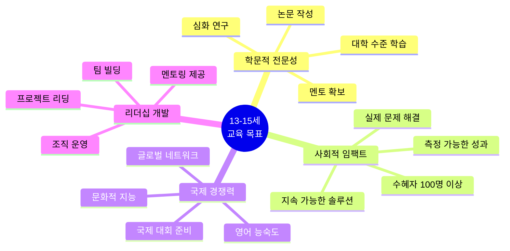

### 1.2 미네르바 대학 직접 연계 역량

| 미네르바 역량 | 중학생 목표 | 구체적 활동 | 평가 방법 | 포트폴리오 |
|-------------|-----------|-----------|----------|-----------|
| **비판적 사고** | 논리적 논증 | 토론 대회, 논문 | 논증 구조 분석 | 논문 3편 |
| **창의적 문제해결** | 혁신적 솔루션 | 창업 프로젝트 | 독창성 평가 | 사업 계획서 |
| **데이터 과학** | 고급 분석 | 연구 프로젝트 | 통계 결과 | 데이터 보고서 |
| **시스템 사고** | 복잡계 이해 | 시뮬레이션 | 인과관계 설명 | 모델링 작품 |
| **글로벌 시민의식** | 사회 문제 인식 | 국제 협력 프로젝트 | 영향력 측정 | 임팩트 보고서 |

### 1.3 15세까지 달성 목표

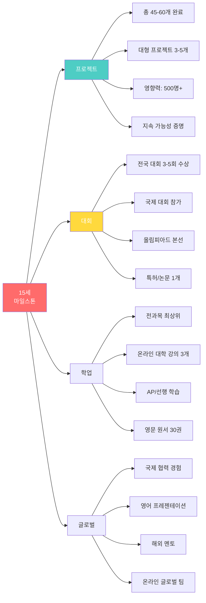

---

## 2. 과학 올림피아드

### 2.1 한국물리올림피아드 (KPhO)

#### 🔬 KPhO 구조 및 준비 전략

```mermaid
timeline
    title KPhO 3년 준비 로드맵
    
    section 중1: 기초 다지기
        고등 물리 선행 : 역학, 열역학
        문제 풀이 시작 : 기출문제 분석
        물리 독서 : 교양 과학서 10권
    
    section 중2: 심화 학습
        전자기학 : 맥스웰 방정식
        광학/파동 : 간섭과 회절
        예선 도전 : 첫 응시
    
    section 중3: 고급 과정
        대학 물리 : 일반물리학
        본선 준비 : 실험 + 이론
        여름학교 목표 : 상위 20명
```

#### 📚 단계별 학습 교재

| 단계 | 교재 | 학습 기간 | 목표 |
|------|------|----------|------|
| **기초** | 일반물리학 (Halliday) | 6개월 | 개념 완성 |
| **중급** | KPhO 기출문제집 | 6개월 | 문제 유형 |
| **고급** | 대학물리학 심화 | 6개월 | 고급 기법 |
| **실험** | 물리 실험 가이드 | 3개월 | 실험 기술 |

#### 🏆 KPhO 수상자 인터뷰 분석

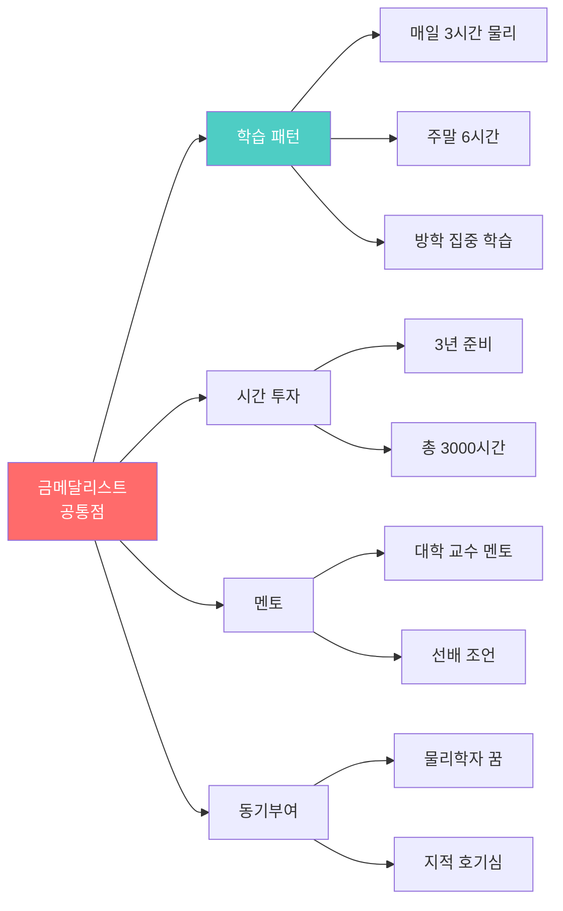

---

### 2.2 한국화학올림피아드 (KChO)

#### 🧪 KChO 특징 및 전략

| 분야 | 출제 비중 | 난이도 | 핵심 내용 |
|------|----------|--------|----------|
| **일반화학** | 30% | ⭐⭐⭐⭐ | 원자 구조, 화학 결합 |
| **무기화학** | 25% | ⭐⭐⭐⭐⭐ | 전이금속, 배위화학 |
| **유기화학** | 25% | ⭐⭐⭐⭐⭐ | 반응 메커니즘 |
| **물리화학** | 15% | ⭐⭐⭐⭐ | 열역학, 양자화학 |
| **분석화학** | 5% | ⭐⭐⭐ | 분광법, 크로마토그래피 |

#### 💡 실험 능력 향상 방법

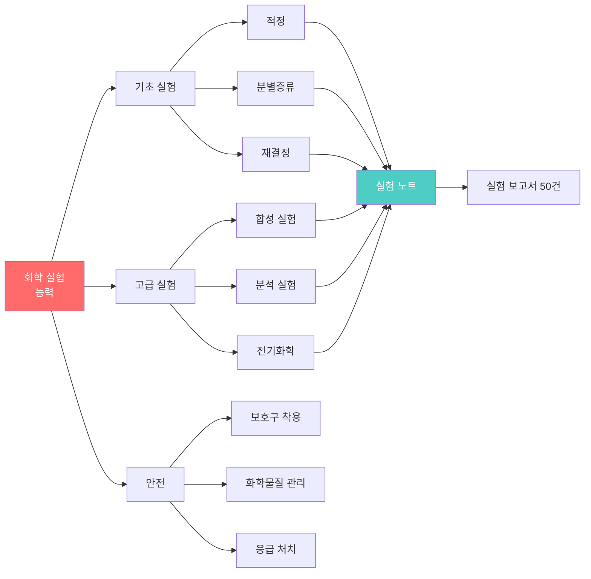

---

### 2.3 한국생물올림피아드 (KBO)

#### 🧬 KBO 학습 로드맵

| 학년 | 학습 내용 | 교재 | 실험 활동 |
|------|----------|------|----------|
| **중1** | 세포 생물학 | Campbell Biology | 현미경 관찰 |
| **중2** | 유전학, 분자생물학 | 유전학 원론 | DNA 추출 |
| **중3** | 생태학, 진화 | 생태학 개론 | 야외 조사 |

#### 🔬 생물 실험 프로젝트 예시

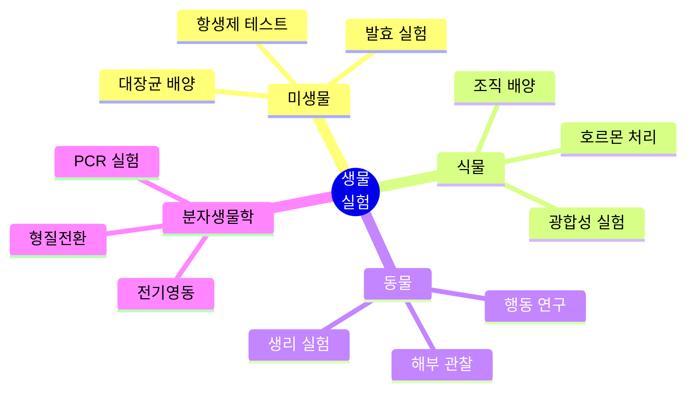

---

### 2.4 한국정보올림피아드 (KOI) 중등부

#### 💻 KOI 중등부 vs 초등부 차이

| 항목 | 초등부 | 중등부 | 차이점 |
|------|--------|--------|--------|
| **난이도** | ⭐⭐⭐⭐ | ⭐⭐⭐⭐⭐ | 알고리즘 복잡도 |
| **문제 수** | 4-5개 | 5-6개 | 시간 압박 |
| **알고리즘** | 기초 DP | 고급 DP, 그래프 | 깊이 |
| **언어** | Python 가능 | C/C++ 권장 | 실행 속도 |

#### 📊 필수 알고리즘 체크리스트

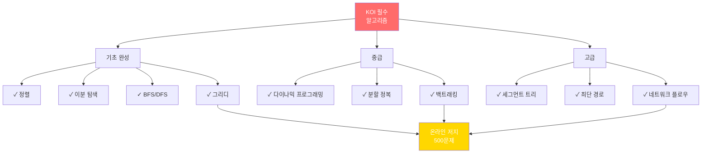

---

## 3. 발명/창업 대회

### 3.1 청소년 창업경진대회

#### 💼 사업 아이디어 발굴 방법

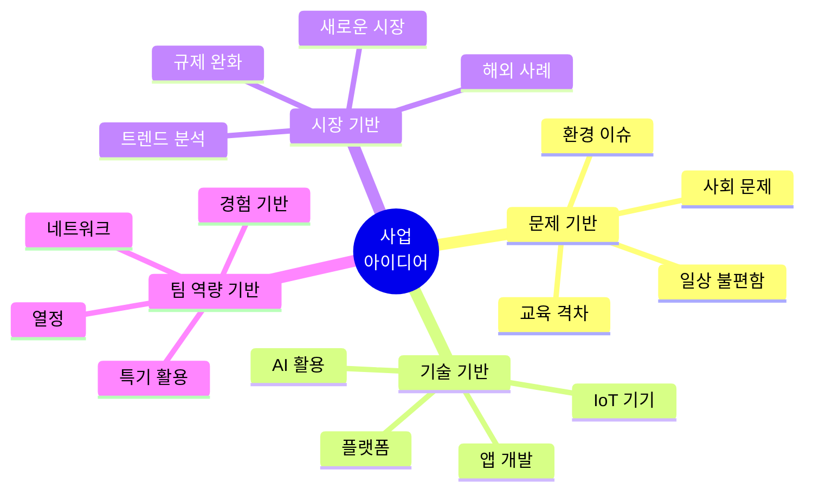

#### 📝 사업계획서 작성 가이드

| 항목 | 내용 | 페이지 | 중요도 |
|------|------|--------|--------|
| **Executive Summary** | 핵심 요약 | 1-2 | ⭐⭐⭐⭐⭐ |
| **문제 정의** | 시장 니즈 | 2-3 | ⭐⭐⭐⭐⭐ |
| **솔루션** | 제품/서비스 | 3-5 | ⭐⭐⭐⭐⭐ |
| **시장 분석** | TAM/SAM/SOM | 3-4 | ⭐⭐⭐⭐ |
| **비즈니스 모델** | 수익 구조 | 2-3 | ⭐⭐⭐⭐⭐ |
| **마케팅 전략** | 고객 확보 | 2-3 | ⭐⭐⭐⭐ |
| **재무 계획** | 손익 예측 | 3-4 | ⭐⭐⭐⭐ |
| **팀 소개** | 역량 증명 | 1-2 | ⭐⭐⭐ |
| **로드맵** | 실행 계획 | 1-2 | ⭐⭐⭐⭐ |

#### 🏆 수상작 사례 분석

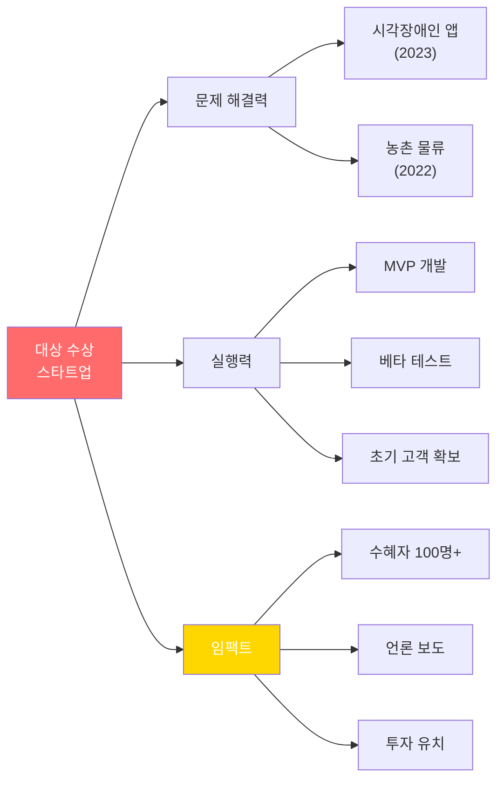

---

### 3.2 소셜벤처 경연대회

#### 🌱 소셜벤처 vs 일반 스타트업

| 구분 | 일반 스타트업 | 소셜벤처 | 평가 기준 |
|------|-------------|---------|----------|
| **목표** | 이윤 극대화 | 사회 문제 해결 + 수익 | 임팩트 우선 |
| **고객** | 시장 세분화 | 취약 계층 포함 | 포용성 |
| **측정** | 매출, 성장률 | 사회적 가치 측정 | 변화 지표 |
| **투자** | VC, 엔젤 | 임팩트 투자 | 지속가능성 |

#### 📊 소셜 임팩트 측정 방법

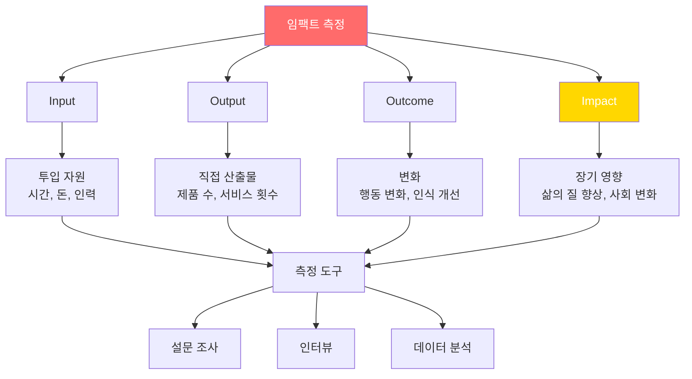

---

## 4. AI/SW 대회

### 4.1 네이버 AI 해커톤

#### 🤖 AI 해커톤 준비 전략

| 준비 영역 | 학습 내용 | 기간 | 자료 |
|----------|----------|------|------|
| **Python** | 고급 문법, 라이브러리 | 3개월 | Codecademy |
| **머신러닝** | Scikit-learn | 2개월 | Coursera |
| **딥러닝** | TensorFlow/PyTorch | 3개월 | Fast.ai |
| **NLP** | 자연어 처리 기초 | 2개월 | Hugging Face |
| **Computer Vision** | 이미지 처리 | 2개월 | OpenCV |
| **Kaggle** | 실전 경험 | 상시 | Kaggle.com |

#### 💡 해커톤 48시간 전략

```mermaid
timeline
    title 해커톤 48시간 타임라인
    
    section Hour 0-4: 기획
        팀 빌딩 : 역할 분담
        아이디어 회의 : 3개 도출
        최종 선정 : 실현 가능성
        개발 계획 : 마일스톤
    
    section Hour 4-24: 개발 1차
        데이터 수집 : 크롤링/API
        전처리 : 정제 작업
        모델 설계 : 베이스라인
        초기 개발 : 30% 완성
    
    section Hour 24-40: 개발 2차
        모델 개선 : 하이퍼파라미터
        UI 개발 : 프론트엔드
        통합 : 백엔드 연결
        80% 완성 : 기능 테스트
    
    section Hour 40-48: 마무리
        버그 수정 : 최종 테스트
        발표 준비 : PPT, 데모
        리허설 : 3분 스피치
        제출 및 발표 : 최종
```

---

### 4.2 Kaggle 입문 대회

#### 📊 Kaggle 학습 로드맵

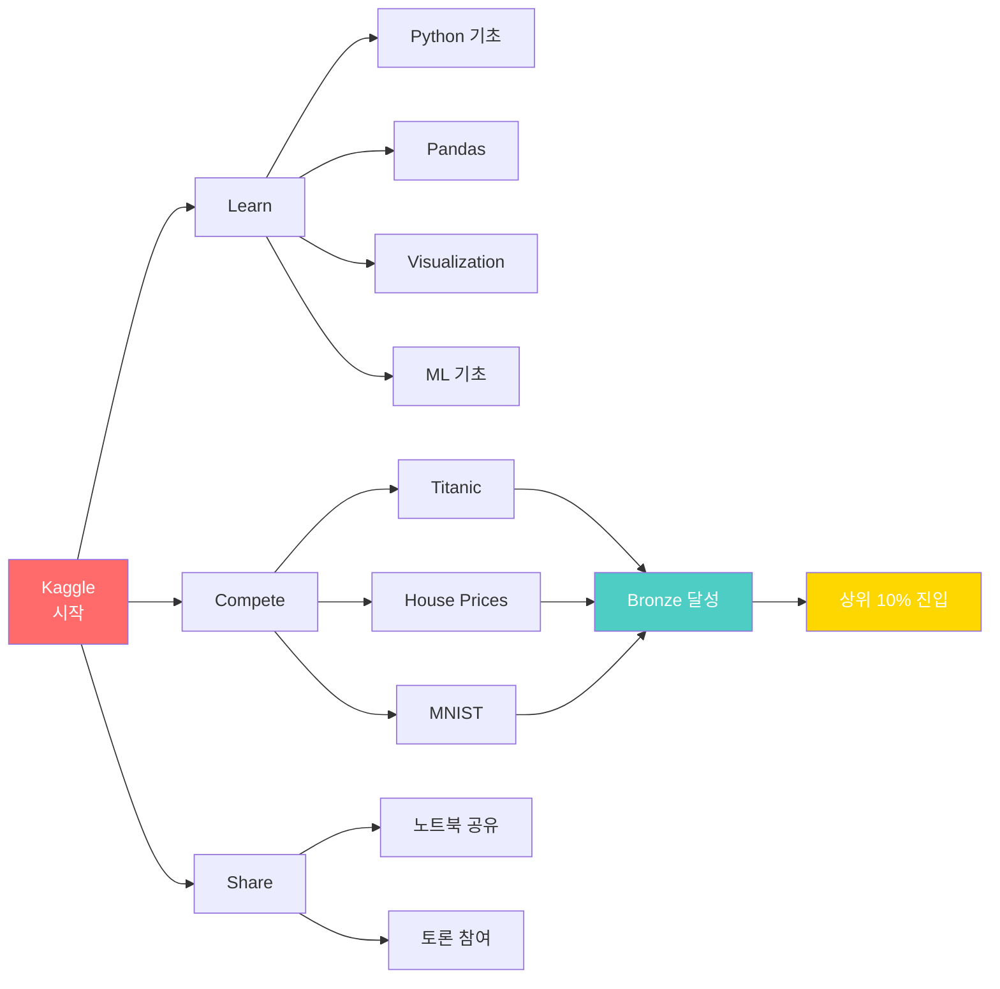

#### 🏅 Kaggle 티어 시스템

| 티어 | 조건 | 혜택 | 중학생 목표 |
|------|------|------|-----------|
| **Novice** | 가입 | - | 시작 |
| **Contributor** | 노트북 1개 | - | 1개월 |
| **Expert** | 메달 2개 | 인증 배지 | 6개월 |
| **Master** | 금메달 1개 | Kaggle 인정 | 1년 목표 |

---

## 5. 국제 대회

### 5.1 ISEF (국제과학경진대회)

#### 🌏 ISEF 출전 과정

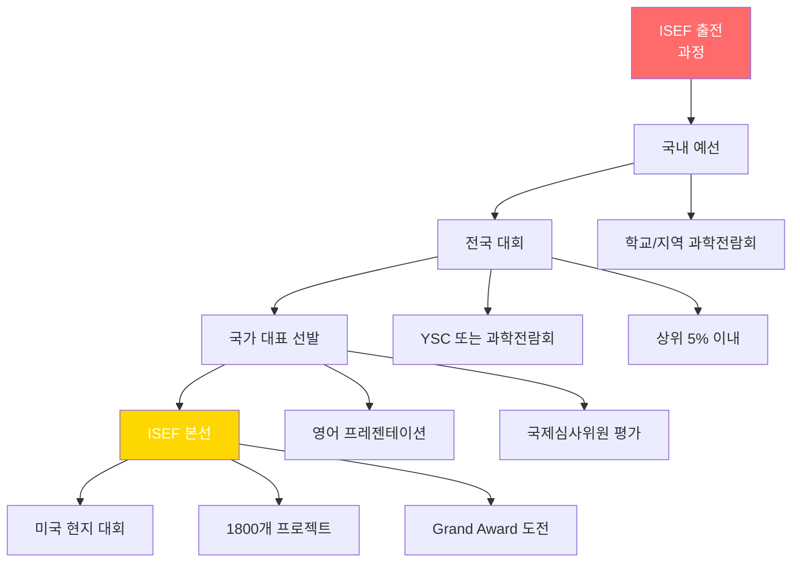

#### 📝 ISEF 프로젝트 요구사항

| 항목 | 세부 내용 | 체크 |
|------|----------|------|
| **연구 기간** | 최소 6개월 | ☐ |
| **연구 윤리** | IRB 승인 (필요시) | ☐ |
| **데이터** | 충분한 샘플 크기 | ☐ |
| **논문** | 20-30페이지 영문 보고서 | ☐ |
| **포스터** | 규격 맞춤 (가로 122cm) | ☐ |
| **발표** | 7분 프레젠테이션 + 질의응답 | ☐ |
| **안전** | 안전 규정 준수 | ☐ |

---

### 5.2 Google Science Fair

#### 💻 온라인 제출 과학 대회

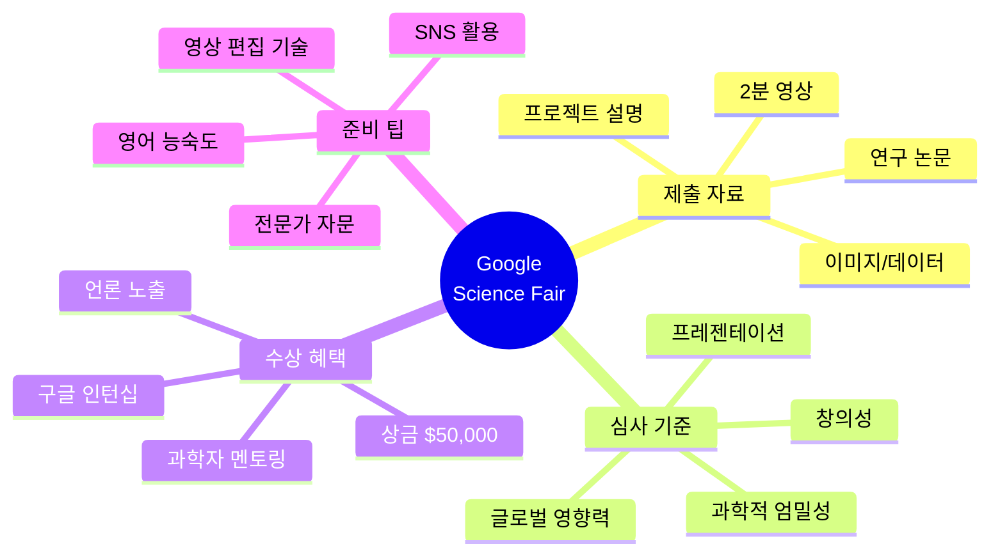

---

### 5.3 Technovation Challenge

#### 📱 여학생 앱 개발 대회

| 부문 | 연령 | 요구사항 | 제출물 |
|------|------|----------|--------|
| **Junior** | 10-12세 | 앱 또는 게임 | 앱, 비즈니스 플랜 |
| **Senior** | 13-18세 | 사회 문제 해결 앱 | 앱, 사업계획서, 피칭 |

**준비 과정 (6개월):**
1. **1-2월**: 팀 구성, 아이디어 회의
2. **3-4월**: 앱 개발 (App Inventor)
3. **5월**: 사업계획서 작성
4. **6월**: 피칭 영상 제작, 제출

---

## 6. 인문사회 대회

### 6.1 전국 중고생 자유발표대회

#### 🎤 발표 주제 카테고리

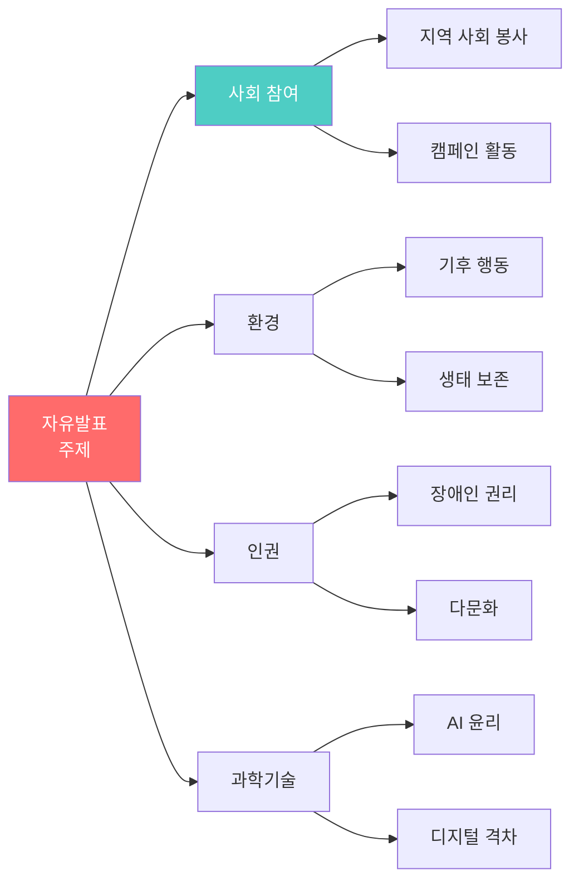

#### 📊 발표 평가 기준

| 항목 | 배점 | 세부 기준 |
|------|------|----------|
| **내용** | 40% | 독창성, 논리성, 깊이 |
| **표현** | 30% | 발표력, 시각 자료 |
| **태도** | 20% | 자신감, 열정 |
| **질의응답** | 10% | 대처 능력 |

---

### 6.2 모의유엔 (MUN)

#### 🌍 MUN 준비 가이드

```mermaid
timeline
    title MUN 준비 3개월
    
    section Month 1: 기초
        UN 시스템 학습 : 6개 주요 기구
        의사규칙 암기 : Rules of Procedure
        국가 배경 조사 : 할당 국가 연구
    
    section Month 2: 심화
        입장문 작성 : Position Paper
        연설문 준비 : Opening Speech
        협상 연습 : 동맹 구축 전략
    
    section Month 3: 실전
        모의 회의 5회 : 실전 연습
        수정안 작성 : Resolution 기술
        MUN 대회 참가 : 본선 도전
```

#### 🏆 MUN 수상 전략

| 상 | 조건 | 팁 |
|----|------|-----|
| **Best Delegate** | 리더십 + 기여도 | 수정안 주도, 협상 리드 |
| **Outstanding** | 발언 우수 | 논리적 연설, 데이터 인용 |
| **Honorable Mention** | 적극 참여 | 질문 많이, 협력 |

---

## 7. 추천 도서 & 역량 심화

### 7.1 중학생 필독서

#### 📚 과학/기술 분야

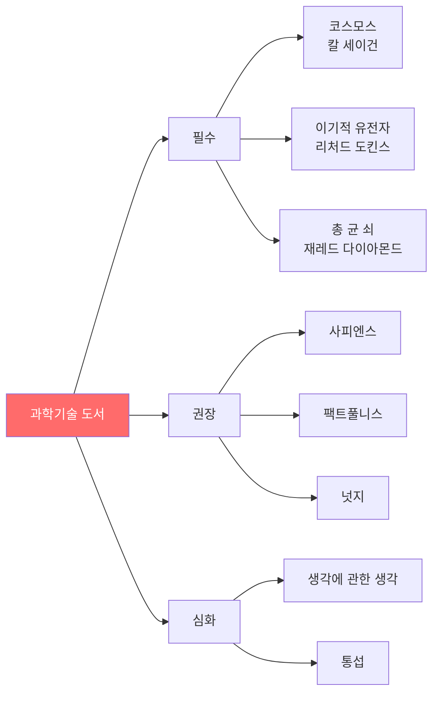

#### 📖 AI/데이터 과학 도서

| 도서명 | 저자 | 난이도 | 추천 학년 |
|--------|------|--------|----------|
| **AI 첫걸음** | 한국과학창의재단 | ⭐⭐ | 중1 |
| **밑바닥부터 시작하는 딥러닝** | 사이토 고키 | ⭐⭐⭐⭐ | 중3 |
| **파이썬 라이브러리를 활용한 머신러닝** | 안드레아스 뮐러 | ⭐⭐⭐⭐ | 중3 |
| **AI 시대의 인간** | 이광춘 | ⭐⭐⭐ | 중2 |

---

### 7.2 영문 원서 (중급-고급)

#### 📕 Fiction (소설)

| 제목 | 저자 | 테마 | AR 레벨 |
|------|------|------|---------|
| **To Kill a Mockingbird** | Harper Lee | 정의, 인종차별 | 5.6 |
| **1984** | George Orwell | 전체주의 | 5.8 |
| **The Giver** | Lois Lowry | 유토피아 | 5.7 |
| **Animal Farm** | George Orwell | 권력 | 5.3 |

#### 📗 Non-Fiction (교양)

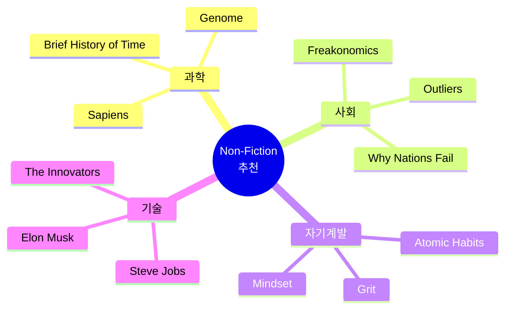

---

### 7.3 온라인 대학 강의 (무료)

#### 🎓 Coursera 추천 강의

| 강의명 | 대학 | 기간 | 수료증 | 추천 학년 |
|--------|------|------|--------|----------|
| **Machine Learning** | Stanford | 11주 | 유료 | 중3 |
| **Python for Everybody** | Michigan | 8개월 | 유료 | 중1 |
| **Introduction to Psychology** | Yale | 6주 | 무료 | 중2 |
| **Financial Markets** | Yale | 7주 | 유료 | 중3 |

---

### 7.4 15세 미네르바 준비도 최종 평가

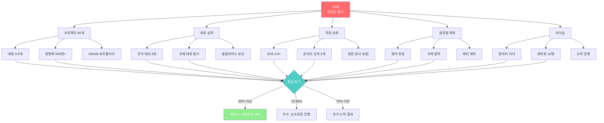

---

## 8. 프로젝트 기반 대회 성공 전략

### 8.1 대형 프로젝트 (3-6개월) 실행 가이드

```mermaid
timeline
    title 중학생 대형 프로젝트 6개월 플랜
    
    section Month 1: 기획
        문제 정의 : 당사자 인터뷰 20명
        선행 연구 : 논문 10편 리뷰
        제안서 작성 : 15페이지
    
    section Month 2-3: 개발
        프로토타입 : MVP 제작
        멘토 자문 : 대학 교수
        알파 테스트 : 10명
    
    section Month 4-5: 실행
        베타 테스트 : 50-100명
        데이터 수집 : 측정 지표
        개선 반복 : 버전 3-5
    
    section Month 6: 확산
        3개 기관 도입 : 500명 영향
        보고서 : 30페이지
        대회 출품 : 전국 대회
```

### 8.2 중학생 핵심 프로젝트 (연 4-6개)

| 프로젝트명 | 기간 | 임팩트 | 기술 | 대회 출품 | 포트폴리오 가치 |
|----------|------|-------|------|----------|---------------|
| **AI 학습 플랫폼** | 6개월 | 200명 | Python, ML | 네이버 AI 해커톤 | ⭐⭐⭐⭐⭐ |
| **환경 캠페인** | 4개월 | 학교 3곳 | 데이터 분석 | 환경부 공모전 | ⭐⭐⭐⭐ |
| **로봇 제작** | 5개월 | 대회 수상 | 아두이노, C++ | FLL 국제 대회 | ⭐⭐⭐⭐ |
| **소셜벤처** | 6개월 | 수혜자 100명 | 앱 개발 | 창업 경진대회 | ⭐⭐⭐⭐⭐ |
| **과학 연구** | 8개월 | 논문 게재 | 실험, 통계 | YSC 도전 | ⭐⭐⭐⭐⭐ |

### 8.3 프로젝트 임팩트 측정 방법

```mermaid
graph TD
    A[임팩트<br/>측정 체계] --> B[정량적 지표]
    A --> C[정성적 지표]
    
    B --> B1[수혜자 수: 500명]
    B --> B2[변화율: 15% 향상]
    B --> B3[비용 절감: 1000만원]
    B --> B4[시간 단축: 30%]
    
    C --> C1[사용자 인터뷰: 20명]
    C --> C2[만족도 조사: 85%]
    C --> C3[행동 변화 사례집]
    C --> C4[추천서]
    
    B1 --> D[종합 임팩트 보고서]
    B2 --> D
    B3 --> D
    C1 --> D
    C2 --> D
    C3 --> D
    
    D --> E[미네르바 포트폴리오 핵심]
    
    style A fill:#FF6B6B,color:#fff
    style D fill:#4ECDC4,color:#fff
    style E fill:#FFD700,color:#fff
```

**측정 도구:**
- 📊 Google Forms (설문 조사)
- 📈 Google Sheets (데이터 분석)
- 📸 사진/영상 (비포 애프터)
- 📰 언론 보도 (사회적 인정)
- 💬 인터뷰 (질적 데이터)

---

## 🎓 마무리

### 프로젝트 기반 중학생 성공 전략

1. **임팩트 중심**: 500명 이상 수혜자
2. **데이터 증명**: 전후 비교 수치 필수
3. **멘토 협력**: 대학 교수/전문가 자문
4. **GitHub**: 모든 코드 오픈소스로 공개
5. **지속성**: 6개월 이상 장기 프로젝트

### 15세 필수 달성 목표

- [ ] 대형 프로젝트 3-5개 완료
- [ ] 누적 임팩트: 총 500명 이상
- [ ] 전국 대회 수상 3개
- [ ] GitHub Star 50+
- [ ] 논문 또는 특허 1개
- [ ] 멘토 확보 (교수/전문가)

---

**© 2025 중학생 프로젝트 기반 가이드. All rights reserved.**
*업데이트: 2025년 12월 12일*

**다음 단계: 고등학생 (16-18세) 가이드에서 완성됩니다!**
