# 고등학생 대회 & 교육 가이드 (16-18세)

 
 


---

## 📑 목차

1. [16-18세 최종 목표 및 역량](#1-16-18세-최종-목표-및-역량)
2. [과학 연구 대회](#2-과학-연구-대회)
3. [올림피아드 국가대표](#3-올림피아드-국가대표)
4. [창업/비즈니스 대회](#4-창업비즈니스-대회)
5. [국제 최상위 대회](#5-국제-최상위-대회)
6. [인문사회 고급 대회](#6-인문사회-고급-대회)
7. [미네르바 포트폴리오 완성](#7-미네르바-포트폴리오-완성)

---

## 1. 16-18세 최종 목표 및 역량

### 1.1 고등학생 핵심 목표

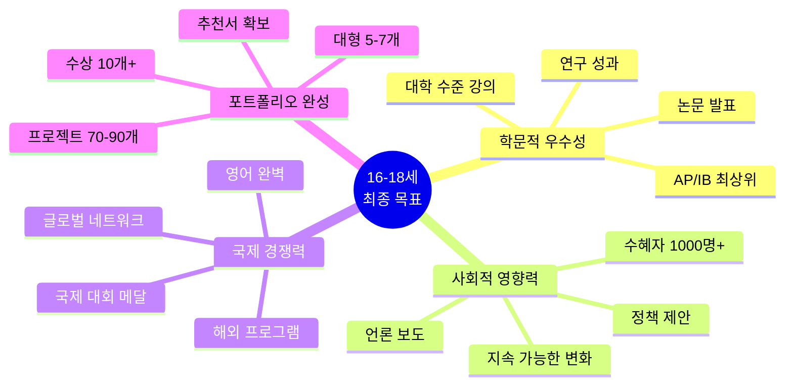

### 1.2 미네르바 입학 필수 역량 체크리스트

| 역량 | 목표 수준 | 증명 방법 | 달성 시기 | 체크 |
|------|----------|----------|----------|------|
| **비판적 사고** | 대학원 수준 | 논문 게재 | 고3 1학기 | ☐ |
| **창의적 문제해결** | 혁신적 솔루션 | 특허/사업화 | 고2-3 | ☐ |
| **데이터 과학** | 실무 수준 | Kaggle 메달 | 고2 | ☐ |
| **프로젝트 리더십** | 팀 리딩 경험 | 대형 프로젝트 5개 | 고3 | ☐ |
| **글로벌 시민의식** | 국제 협력 | 해외 프로젝트 | 고2-3 | ☐ |
| **효과적 소통** | 전문가 수준 | TEDx 발표 | 고3 | ☐ |
| **자기주도 학습** | 완전 자율 | 온라인 강의 5개 | 고3 | ☐ |

### 1.3 18세 최종 성취 목표

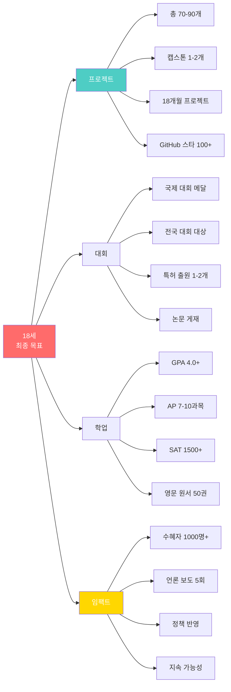

---

## 2. 과학 연구 대회

### 2.1 한국청소년과학탐구대회 (YSC)

#### 🔬 YSC 최고 권위 대회

```mermaid
timeline
    title YSC 연구 프로젝트 12개월
    
    section Month 1-3: 연구 설계
        주제 선정 : 선행 연구 조사
        가설 수립 : 연구 질문 명확화
        실험 설계 : 변수 통제
        윤리 승인 : IRB 신청
    
    section Month 4-8: 실험 수행
        1차 실험 : 파일럿 테스트
        데이터 수집 : 충분한 샘플
        2차 실험 : 재현성 확인
        3차 실험 : 추가 검증
    
    section Month 9-10: 분석
        통계 분석 : SPSS, R
        그래프 제작 : 시각화
        패턴 발견 : 인사이트
    
    section Month 11-12: 보고서
        논문 작성 : 30-50페이지
        포스터 제작 : 규격 준수
        발표 준비 : 15분 프레젠테이션
        최종 제출 : 대회 참가
```

#### 📊 YSC 수상 프로젝트 분석

| 연도 | 대상 수상작 | 분야 | 핵심 성과 | 특징 |
|------|-----------|------|----------|------|
| 2023 | "AI 기반 조기 암 진단 시스템" | 의생명 | 정확도 95% | 실용성 |
| 2022 | "미세플라스틱 분해 미생물" | 환경 | 분해율 80% | 사회적 가치 |
| 2021 | "양자 암호 통신 프로토타입" | 물리 | 실험 검증 | 첨단 기술 |

#### 🏆 대통령상 수상 전략

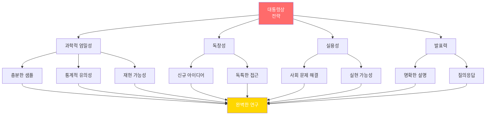

---

### 2.2 R&E (Research and Education)

#### 🎓 R&E 프로그램 구조

| 항목 | 내용 |
|------|------|
| **대상** | 과학영재학교, 과학고 재학생 |
| **기간** | 8-12개월 |
| **멘토** | 대학 교수 또는 연구원 |
| **지원금** | 100-500만원 |
| **결과물** | 논문, 발표, 특허 |
| **평가** | 최종 발표회 |

#### 📝 R&E 논문 작성 가이드

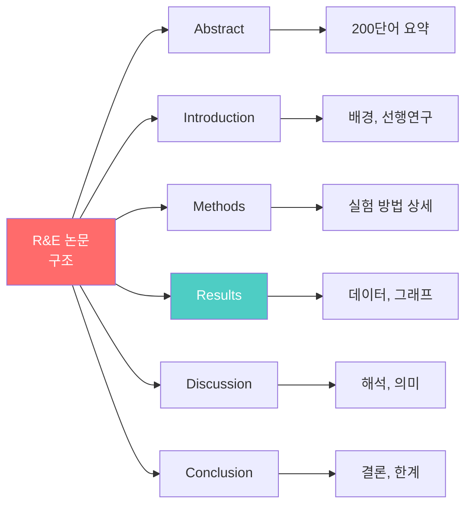

---

### 2.3 전국과학전람회

#### 🏅 과학전람회 vs YSC 차이

| 구분 | 과학전람회 | YSC |
|------|-----------|-----|
| **주최** | 교육부 | 과기정통부 |
| **예선** | 학교 → 지역 → 전국 | 바로 전국 |
| **형식** | 부스 전시 | 발표 + 포스터 |
| **기간** | 단기 프로젝트 가능 | 장기 연구 필수 |
| **특전** | 과학고 추천 | 대학 특전 |

---

## 3. 올림피아드 국가대표

### 3.1 국가대표 선발 과정

#### 🥇 올림피아드 선발 타임라인

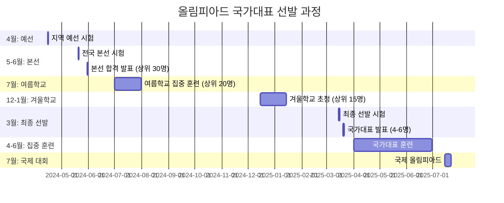

#### 📚 국가대표 훈련 일과

| 시간 | 활동 | 내용 |
|------|------|------|
| **오전 9-12시** | 이론 수업 | 고급 이론 (대학원 수준) |
| **오후 1-3시** | 문제 풀이 | 과거 국제 대회 문제 |
| **오후 3-5시** | 실험 (과학 분야) | 실험 기술 향상 |
| **저녁 7-9시** | 모의 시험 | 실전 감각 유지 |
| **주말** | 멘탈 관리 | 스트레스 해소 |

---

### 3.2 국제 올림피아드 메달별 혜택

#### 🏅 메달 색깔별 혜택 비교

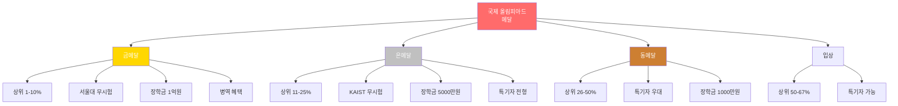

#### 📊 국가대표 출신 대학 진학 통계

| 올림피아드 | 서울대 | KAIST | 포항공대 | MIT | 기타 해외 |
|----------|-------|-------|---------|-----|-----------|
| **IMO 금메달** | 60% | 20% | 10% | 5% | 5% |
| **IPhO 금메달** | 50% | 30% | 15% | 3% | 2% |
| **IChO 금메달** | 55% | 25% | 15% | 3% | 2% |
| **IOI 금메달** | 40% | 30% | 5% | 15% | 10% |

---

## 4. 창업/비즈니스 대회

### 4.1 청년창업리그

#### 💼 청년창업리그 구조

```mermaid
timeline
    title 청년창업리그 6개월 과정
    
    section Month 1-2: 서류
        팀 구성 : 3-5명
        아이디어 구체화 : 비즈니스 모델
        사업계획서 : 30페이지
        서류 제출 : 1차 심사
    
    section Month 3-4: 멘토링
        전문가 멘토링 : 월 2회
        시제품 개발 : MVP
        시장 검증 : 고객 인터뷰 50명
    
    section Month 5: 예선
        피칭 발표 : 7분
        질의응답 : 10분
        본선 진출 : 상위 20팀
    
    section Month 6: 본선
        최종 피칭 : 15분
        시연 : 실제 작동
        시상식 : 대상 2000만원
```

#### 📈 성공적인 피칭 구조

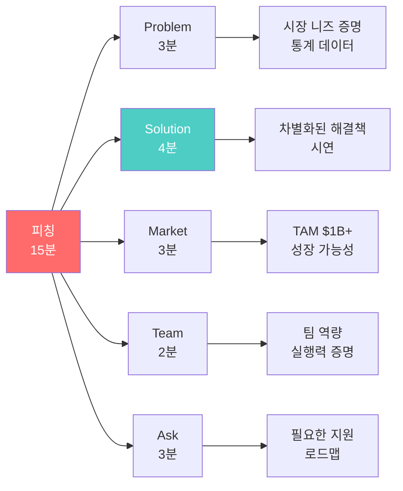

---

### 4.2 Diamond Challenge

#### 💎 미국 고등학생 창업 대회

| 항목 | 내용 |
|------|------|
| **주최** | University of Delaware |
| **참가비** | 무료 |
| **제출 형식** | 영문 사업계획서 + 피칭 영상 |
| **상금** | 1등 $10,000 |
| **특전** | 여름 창업 캠프 초대 |
| **참가 자격** | 고등학생 (전 세계) |

#### 🌍 글로벌 창업 대회 리스트

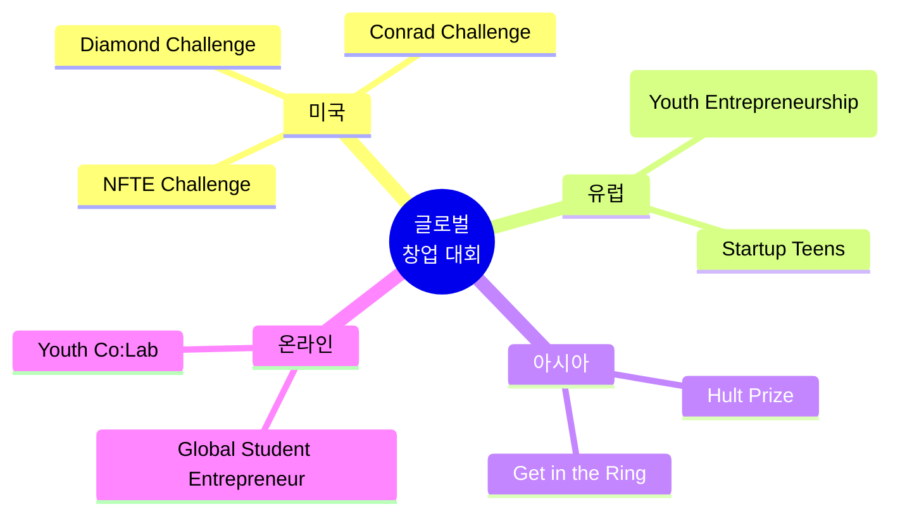

---

## 5. 국제 최상위 대회

### 5.1 Regeneron STS (Science Talent Search)

#### 🏆 미국 최고 권위 과학 대회

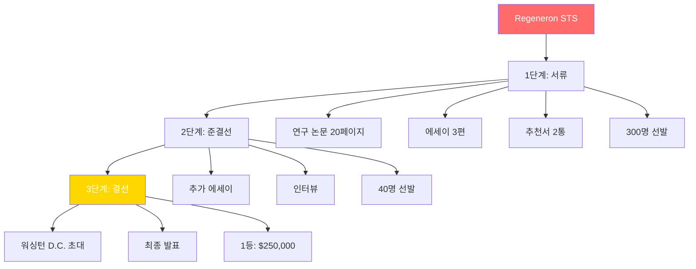

#### 📊 STS 수상자 미래 분석

| 진로 | 비율 | 대표 인물 |
|------|------|----------|
| **노벨상 수상** | 2% | 13명 |
| **대학 교수** | 40% | 주요 연구대학 |
| **의사** | 20% | 존스홉킨스 등 |
| **엔지니어** | 15% | 구글, 테슬라 |
| **기업가** | 10% | 스타트업 창업 |
| **기타** | 13% | 다양한 분야 |

---

### 5.2 Intel ISEF Grand Award

#### 🌟 ISEF 최고 상 전략

**Grand Award 카테고리:**

| 분야 | 상금 | 특전 |
|------|------|------|
| **Best of Category** | $5,000 | 대학 장학금 추가 |
| **1st Place** | $3,000 | 명문대 입학 유리 |
| **Special Awards** | $500-5,000 | 기관별 상 |

#### 💡 ISEF 수상 프로젝트 공통점

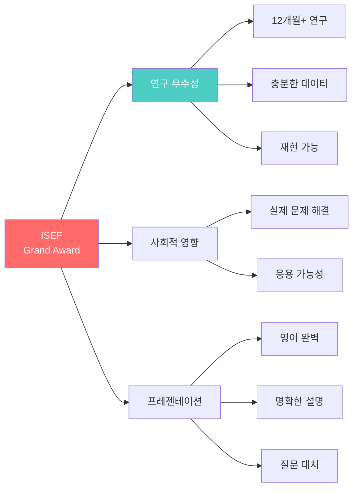

---

### 5.3 IMO (국제수학올림피아드) 금메달 전략

#### 📐 IMO 문제 유형 및 전략

| 유형 | 난이도 | 출제 빈도 | 준비 방법 |
|------|--------|----------|----------|
| **조합론** | ⭐⭐⭐⭐⭐ | 높음 | 그래프 이론, 경우의 수 |
| **정수론** | ⭐⭐⭐⭐⭐ | 높음 | 정수 성질, 디오판토스 |
| **기하** | ⭐⭐⭐⭐ | 중간 | 삼각형, 원 성질 |
| **대수** | ⭐⭐⭐⭐ | 중간 | 부등식, 함수 방정식 |

#### 🏅 IMO 금메달 수상자 학습 패턴

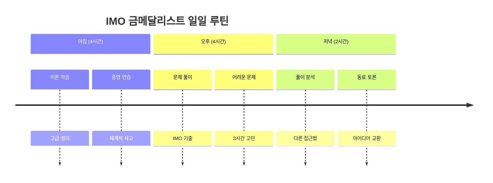

---

## 6. 인문사회 고급 대회

### 6.1 전국 고교생 토론대회

#### 🎤 토론 대회 형식

| 형식 | 시간 | 구조 | 평가 기준 |
|------|------|------|----------|
| **CEDA** | 총 90분 | 입론-반박-최종변론 | 논리성, 근거 |
| **의회식** | 총 60분 | 즉석 주제 토론 | 즉흥성, 설득력 |
| **퍼블릭포럼** | 총 45분 | 대중 친화적 | 명확성, 청중 소통 |

#### 📊 토론 준비 체계

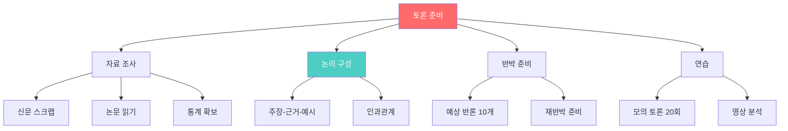

---

### 6.2 하버드/예일 MUN (모의유엔)

#### 🌍 세계 최고 MUN 대회

**참가 전략:**

```mermaid
timeline
    title 하버드 MUN 준비 6개월
    
    section Month 1-2: 기초
        의사규칙 완벽 숙지 : 영문 암기
        UN 역사 : 주요 결의안
        국제 정세 : 매일 뉴스
    
    section Month 3-4: 실전
        Position Paper : 10페이지 영문
        국내 MUN 3회 : 실전 경험
        영어 토론 : 원어민과 연습
    
    section Month 5: 최종
        Working Paper 작성법 : 수정안 기술
        협상 시뮬레이션 : 동맹 전략
        최종 점검 : 모든 자료 준비
    
    section Month 6: 대회
        보스턴 방문 : 4일
        하버드 MUN : 회의 참여
        Best Delegate 도전 : 최우수상
```

#### 🏆 Best Delegate 수상 전략

| 요소 | 배점 | 전략 |
|------|------|------|
| **발언 빈도** | 30% | 적극적이되 질 높게 |
| **협상 능력** | 30% | Working Paper 주도 |
| **전문성** | 20% | 데이터 인용, 정확한 지식 |
| **리더십** | 20% | 블록 형성, 의장단 협력 |

---

## 7. 미네르바 포트폴리오 완성

### 7.1 최종 포트폴리오 체크리스트

#### 📋 미네르바 지원자 필수 요소

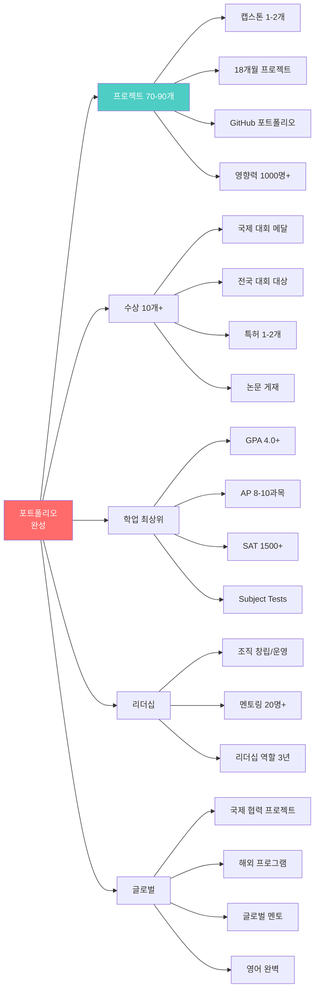

---

### 7.2 고등학생 필독서 (미네르바 추천)

#### 📚 핵심 교양서

| 분야 | 도서명 | 저자 | 중요도 | 읽는 시기 |
|------|--------|------|--------|----------|
| **인지과학** | Thinking, Fast and Slow | Kahneman | ⭐⭐⭐⭐⭐ | 고1 |
| **역사** | Sapiens | Harari | ⭐⭐⭐⭐⭐ | 고1 |
| **경제** | Freakonomics | Levitt | ⭐⭐⭐⭐ | 고1 |
| **사회학** | Outliers | Gladwell | ⭐⭐⭐⭐ | 고2 |
| **과학** | The Selfish Gene | Dawkins | ⭐⭐⭐⭐ | 고2 |
| **기술** | The Innovator's Dilemma | Christensen | ⭐⭐⭐⭐⭐ | 고2 |
| **철학** | Justice | Sandel | ⭐⭐⭐⭐ | 고3 |

#### 📖 미네르바 교재 미리보기

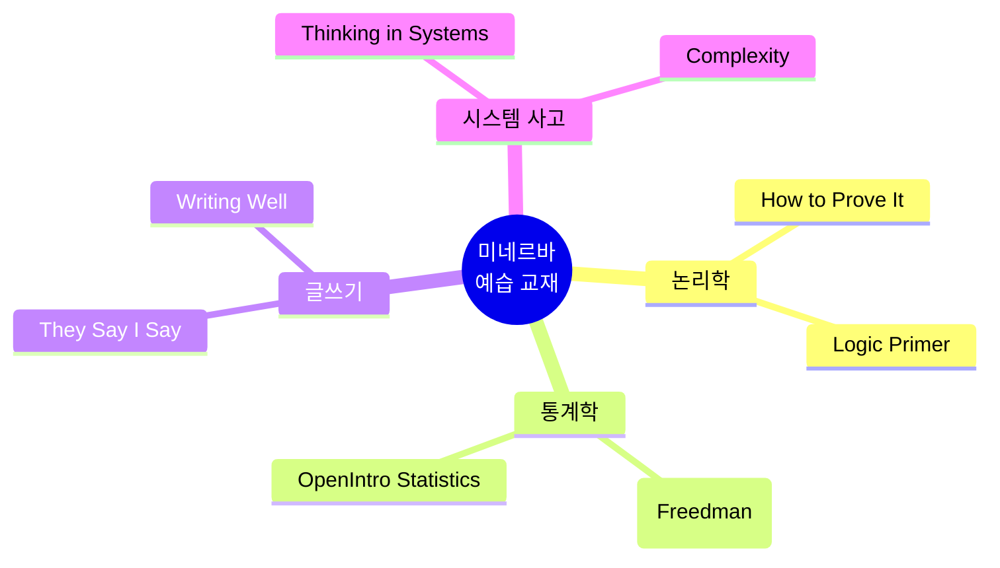

---

### 7.3 18세 미네르바 준비도 최종 평가

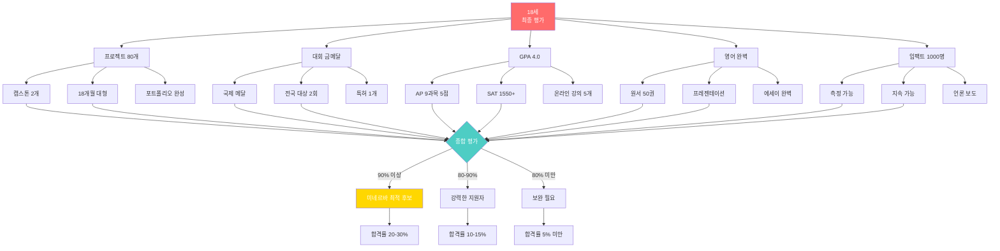

---

### 7.4 합격자 프로필 예시

#### 🎓 미네르바 합격자 A (한국)

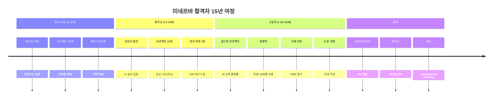

**핵심 강점:**
- ✅ 총 프로젝트 85개 (캡스톤 2개)
- ✅ AI 분야 3년 전문성
- ✅ 수혜자 1200명 (측정 가능)
- ✅ GitHub Star 150+ (오픈소스)
- ✅ SAT 1580, AP 9과목
- ✅ 영문 원서 55권
- ✅ 추천서: 대학 교수 + 멘토 기업가

---

## 📊 연령별 역량 발달 종합표

### 3-18세 완전 로드맵 요약

| 연령 | 프로젝트 수 | 대회 참가 | 핵심 역량 | 미네르바 연계 |
|------|-----------|----------|----------|-------------|
| **3-4세** | 10-15개/년 | 2-3개 | 호기심, 놀이 | 탐구 정신 기초 |
| **5-7세** | 12-20개/년 | 4-6개 | 질문, 관찰 | 비판적 사고 시작 |
| **8-9세** | 8-12개/년 | 5-8개 | 문제 해결 | 프로젝트 기초 |
| **10-12세** | 6-8개/년 | 5-8개 | 팀워크, AI | 협업 능력 |
| **13-15세** | 4-6개/년 | 4-6개 | 전문성, 영향력 | 사회적 임팩트 |
| **16-18세** | 2-4개/년 | 2-4개 | 리더십, 글로벌 | 포트폴리오 완성 |
| **총계** | 70-90개 | 30-45개 | 종합 역량 | 미네르바 준비 완료 |

---

## 🎯 최종 조언

### 미네르바 합격을 위한 10계명

1. **일찍 시작**: 3세부터 질문하는 습관
2. **꾸준함**: 15년 장기 프로젝트
3. **실제 영향**: 숫자로 증명 가능한 변화
4. **전문성**: 1-2개 분야 깊이 파기
5. **글로벌**: 영어 완벽 + 국제 경험
6. **AI 통합**: 모든 프로젝트에 AI 활용
7. **리더십**: 조직 운영 경험
8. **학업**: GPA, AP, SAT 모두 최상위
9. **스토리**: 일관된 성장 서사
10. **진정성**: 진심으로 세상을 바꾸고 싶은 열정

---

## 📚 추가 자료

### 유용한 웹사이트

| 사이트 | 용도 | 중요도 |
|--------|------|--------|
| **minerva.edu** | 입학 정보 | ⭐⭐⭐⭐⭐ |
| **coursera.org** | 온라인 강의 | ⭐⭐⭐⭐⭐ |
| **github.com** | 포트폴리오 | ⭐⭐⭐⭐⭐ |
| **kaggle.com** | 데이터 과학 | ⭐⭐⭐⭐ |
| **arxiv.org** | 최신 논문 | ⭐⭐⭐⭐ |
| **ted.com** | 프레젠테이션 | ⭐⭐⭐ |

---

**© 2025 고등학생 대회 가이드 완성편. All rights reserved.**
*최종 업데이트: 2025년 12월 12일*

---

# 🏆 15년 프로젝트 완성!

## 프뢰벨 교육 → 미네르바 대학 → 글로벌 리더

**3세부터 18세까지, 체계적인 준비로 미네르바 대학 합격!**

**지금 시작하세요. 15년 후, 여러분은 세상을 바꾸는 리더가 되어 있을 것입니다.**

---

**문의: 프뢰벨-미네르바 교육 연구소**
**Email: minerva.prep@froebel.edu**
**카카오톡: 미네르바준비**

---

## 8. 캡스톤 프로젝트 실행 전략

### 8.1 18개월 캡스톤 프로젝트 마스터 플랜

```mermaid
timeline
    title 고등학생 캡스톤 프로젝트 18개월
    
    section Month 1-4: 조사 및 설계
        문제 정의 : 100명 인터뷰
        선행 연구 : 논문 30편
        제안서 : 20-30페이지
        멘토 확보 : 대학 교수/전문가
    
    section Month 5-10: 개발
        프로토타입 1차 : MVP 개발
        알파 테스트 50명 : 초기 피드백
        개선 버전 : 베타 v2.0
        베타 테스트 200명 : 본격 데이터
    
    section Month 11-15: 확산
        3-5개 기관 도입 : 파트너십 체결
        임팩트 측정 : 1000명+ 수혜
        언론 보도 : 3-5건
        추가 개선 : v3.0
    
    section Month 16-18: 정책/사업화
        최종 보고서 : 50-100페이지
        정책 제안 : 시의회/국회
        대회 출품 : YSC/ISEF
        후속 팀 구성 : 지속성
```

### 8.2 실제 캡스톤 템플릿: "지역 사회 문제 해결"

**프로젝트 구성 요소:**

| 구성 요소 | 세부 내용 | 증빙 자료 |
|----------|----------|----------|
| **1. 문제 정의** | 데이터 기반 문제 규모 파악 | 통계, 설문 300명 |
| **2. 솔루션 설계** | 기존 방법 vs 새로운 접근 | 비교 분석 표 |
| **3. 프로토타입** | 최소 기능 제품 (MVP) | 앱/웹/시스템 |
| **4. 파일럿** | 소규모 테스트 50-100명 | 사용자 데이터 |
| **5. 확산** | 3개 이상 기관/학교 | MOU, 계약서 |
| **6. 임팩트 측정** | 전후 비교 데이터 | 통계 분석 보고서 |
| **7. 정책 제안** | 지속 가능성 확보 | 제안서, 발표 |
| **8. 언론/인정** | 사회적 인정 | 기사, 상장 |

### 8.3 캡스톤 프로젝트 주제 추천

**카테고리별 프로젝트 아이디어:**

| 분야 | 프로젝트 주제 | 예상 임팩트 | 필요 기술 | 대회 출품 |
|------|------------|-----------|----------|----------|
| **교육** | AI 맞춤 학습 플랫폼 | 학생 1000명+ | Python, ML | YSC 대상 |
| **환경** | 탄소 중립 로드맵 | 도시 정책 반영 | 데이터 분석, AI | 환경부 장관상 |
| **의료** | 조기 진단 AI 시스템 | 병원 파일럿 | 딥러닝, 의학 | ISEF Grand Award |
| **사회** | 취약 계층 지원 앱 | 수혜자 500명+ | 앱 개발 | 소셜벤처 대상 |

### 8.4 캡스톤 vs 일반 프로젝트 차이

```mermaid
graph LR
    A[프로젝트<br/>레벨 비교] --> B[일반 6개월]
    A --> C[캡스톤 18개월]
    
    B --> B1[임팩트: 100-300명]
    B --> B2[지역 범위]
    B --> B3[단일 기술]
    B --> B4[대회 수상]
    
    C --> C1[임팩트: 1000명+]
    C --> C2[전국/정책]
    C --> C3[다학제 융합]
    C --> C4[대학 합격 결정]
    
    B4 --> D[중요]
    C4 --> E[매우 중요]
    
    style A fill:#FF6B6B,color:#fff
    style C fill:#FFD700,color:#fff
    style E fill:#FF0000,color:#fff
```

---

## 🎓 마무리

### 고등학생 프로젝트 기반 성공 핵심

1. **캡스톤 필수**: 18개월 이상 대형 프로젝트 1-2개
2. **임팩트 증명**: 1000명 이상, 정책 반영 또는 사업화
3. **멘토 네트워크**: 교수 2명 이상 자문
4. **GitHub 공개**: Star 100+ 목표
5. **언론 인정**: 3-5건 보도

### 18세 최종 프로젝트 체크리스트

- [ ] 캡스톤 프로젝트 1-2개 (18개월)
- [ ] 총 누적 프로젝트 70-90개
- [ ] 임팩트: 1000명 이상
- [ ] 국제 대회 메달 OR 전국 대상 2개
- [ ] 논문 게재 OR 특허 출원
- [ ] GitHub Star 100+
- [ ] 추천서 3통 확보 (교수 + 멘토 + 교사)
- [ ] 언론 보도 3건 이상

---

**© 2025 고등학생 프로젝트 기반 완성 가이드. All rights reserved.**
*최종 업데이트: 2025년 12월 12일*

---

**"Education is not the learning of facts, but the training of the mind to think."**
*- Albert Einstein*

**"프로젝트는 대회를 넘어, 세상을 바꾸는 첫걸음입니다."**

**5단계 종합 가이드에서 실제 합격자 스토리를 확인하세요!**
