# 프로젝트 기반 대회 실행 가이드 (3-18세)

 
 

---

## 🎯 이 가이드의 목적

**대회 참가 ≠ 단순 수상**  
**대회 참가 = 프로젝트 기반 문제 해결 + 사회적 임팩트**

이 가이드는 모든 대회를 "프로젝트"로 전환하여 미네르바 대학 입학에 최적화된 포트폴리오를 만드는 방법을 제시합니다.

---

## 📚 문서 구조

### 연령별 가이드 파일

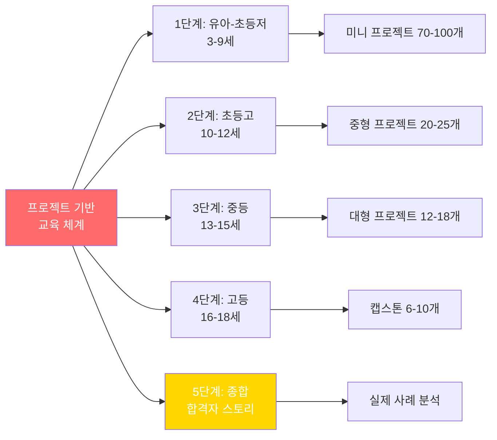

---

## 🚀 빠른 시작 가이드

### Step 1: 현재 나이 확인 및 파일 선택

| 나이 | 읽을 파일 | 핵심 초점 |
|------|----------|----------|
| **3-9세** | 1단계_유아_초등_저학년 | 호기심 프로젝트, 관찰 활동 |
| **10-12세** | 2단계_초등_고학년 | 문제 해결 프로젝트, 팀 협력 |
| **13-15세** | 3단계_중등 | 임팩트 프로젝트, 멘토 확보 |
| **16-18세** | 4단계_고등 | 캡스톤, 정책 제안, 사업화 |
| **모든 연령** | 5단계_종합 | 실제 합격자 사례, 스토리라인 |

### Step 2: 이번 달 프로젝트 선택

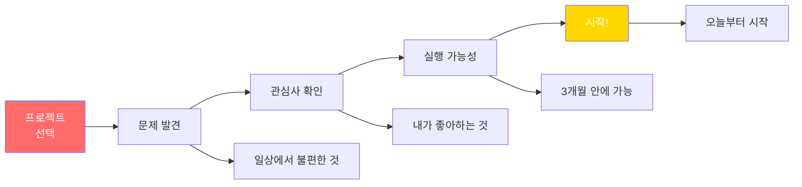

---

## 💡 연령별 즉시 시작 프로젝트

### 3-9세: 이번 주 프로젝트

#### 프로젝트 1: "우리 집 쓰레기 줄이기" (2주)

**Day 1-3: 관찰**
- 쓰레기 사진 찍기
- 종류별 분류
- 개수 세기

**Day 4-7: 계획**
- 어떻게 줄일까 생각
- 가족 회의
- 실천 방법 3가지 선택

**Day 8-14: 실행 및 기록**
- 실천하기
- 매일 사진
- 줄어든 양 확인

**결과물:**
- 📸 사진 20장
- 📊 그래프 (비포/애프터)
- 🎤 가족에게 발표

**대회 출품 가능:**
- 환경부 어린이 공모전
- 학교 과학의 날

---

### 10-12세: 이번 달 프로젝트

#### 프로젝트 2: "우리 학교 개선 프로젝트" (4주)

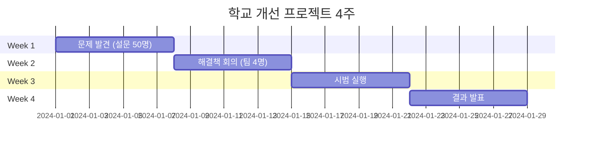

**예시 문제:**
- 급식실 줄이 너무 길다
- 도서관 책 찾기 어렵다
- 쓰레기통이 부족하다

**해결 방법:**
- 앱 개발 (App Inventor)
- 시스템 개선 제안
- 캠페인 실행

**측정:**
- 시간 단축: 30%
- 만족도: 85%
- 참여자: 200명

---

### 13-15세: 이번 학기 프로젝트

#### 프로젝트 3: "AI 기반 [문제] 해결" (6개월)

**Month 1-2: 조사**
- [ ] 문제 정의 및 통계
- [ ] 사용자 인터뷰 20명
- [ ] 선행 연구 10편
- [ ] 제안서 15페이지

**Month 3-4: 개발**
- [ ] Python 학습 (필요시)
- [ ] AI API 연동 (OpenAI/Anthropic)
- [ ] 프로토타입 제작
- [ ] 알파 테스트 10명

**Month 5-6: 확산**
- [ ] 베타 테스트 50-100명
- [ ] 데이터 수집 및 분석
- [ ] 최종 보고서 30페이지
- [ ] 대회 출품 (네이버 AI, YSC)

**목표 임팩트:**
- 수혜자 200-500명
- 측정 가능한 변화 15%+
- GitHub Star 30+

---

### 16-18세: 올해 캡스톤 프로젝트

#### 프로젝트 4: "지역 사회 변화 캡스톤" (18개월)

**Phase 1: 기획 (4개월)**
- [ ] 문제 정의: 100명 인터뷰
- [ ] 데이터 수집: 통계, 논문 30편
- [ ] 멘토 확보: 대학 교수 1명
- [ ] 제안서: 20-30페이지

**Phase 2: 개발 (6개월)**
- [ ] MVP 제작
- [ ] 알파 테스트 50명
- [ ] 베타 테스트 200명
- [ ] 개선 반복 5회

**Phase 3: 확산 (5개월)**
- [ ] 3개 기관 도입
- [ ] 임팩트: 1000명+
- [ ] 언론 보도 3건
- [ ] 정책 제안

**Phase 4: 마무리 (3개월)**
- [ ] 최종 보고서 50-100페이지
- [ ] ISEF/YSC 출품
- [ ] 추천서 확보
- [ ] 미네르바 지원서 작성

---

## 📊 프로젝트 템플릿

### Template 1: 환경 프로젝트 (모든 연령 적용 가능)

#### 기본 구조

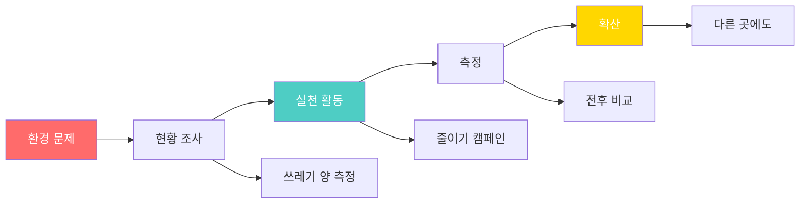

**연령별 적용:**

| 연령 | 규모 | 기간 | 임팩트 | 결과물 |
|------|------|------|-------|--------|
| **3-9세** | 우리 집 | 2주 | 가족 4명 | 사진 앨범 |
| **10-12세** | 우리 반 | 1개월 | 학생 30명 | 발표 자료 |
| **13-15세** | 우리 학교 | 3개월 | 전교생 200명 | 보고서 20p |
| **16-18세** | 우리 동네 | 12개월 | 주민 1000명+ | 정책 제안서 |

---

### Template 2: 교육 프로젝트 (코딩 필요)

#### AI 활용 학습 도우미

**단계별 복잡도:**

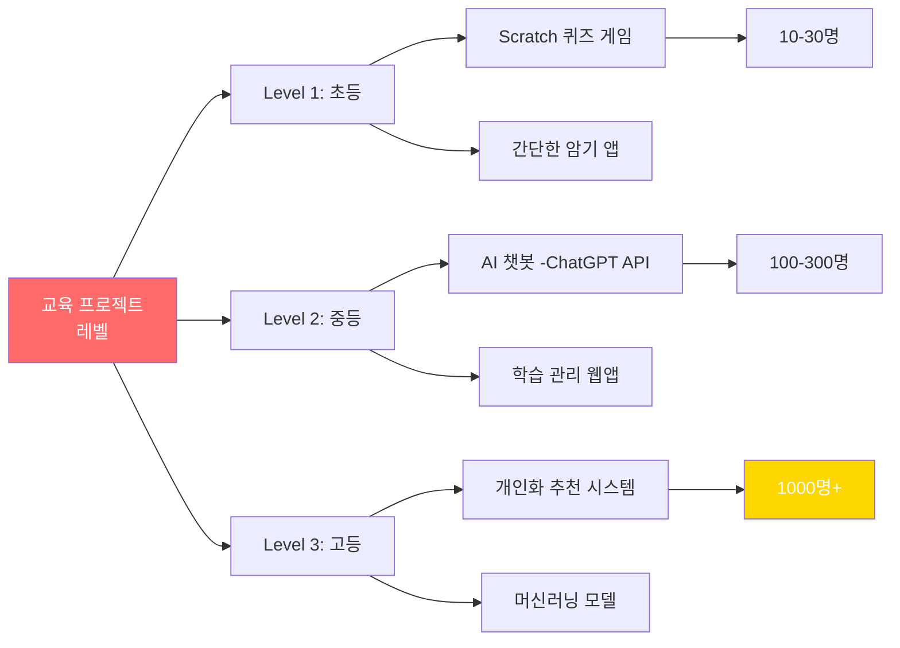

**Level 3 (고등학생) 상세:**

| 월 | 기술 학습 | 개발 활동 | 사용자 확보 |
|----|----------|----------|-----------|
| **1-2월** | Python, Flask | 로그인 시스템 | - |
| **3-4월** | OpenAI API | AI 기능 통합 | 알파 10명 |
| **5-6월** | React UI | 프론트엔드 | 베타 50명 |
| **7-9월** | AWS 배포 | 실서비스 | 200명 확보 |
| **10-12월** | ML 추천 | 개인화 | 500명 돌파 |
| **13-18월** | 확산 | 3개 학교 | 1000명+ |

---

## 🏆 프로젝트 성공 사례

### 사례 1: 초등 6학년 → 전국 대회 금상

**프로젝트: "어르신 AI 도우미"**

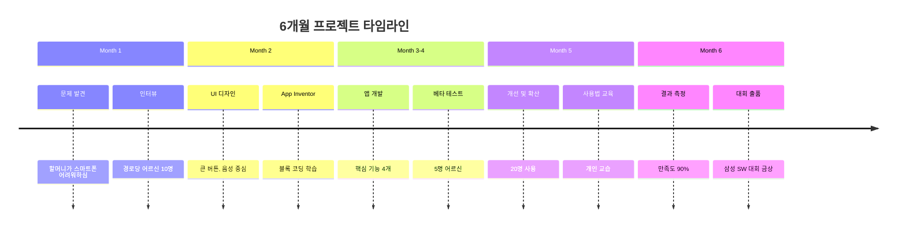

**성과:**
- 👵 25명 어르신이 독립적으로 스마트폰 사용
- 📱 만족도 90% (설문 조사)
- 🏆 삼성 주니어 SW 창작대회 금상
- 📰 지역 신문 기사

**배운 것:**
- 공감 능력 (사용자 중심 디자인)
- 코딩 기술 (App Inventor)
- 프로젝트 관리 (6개월 완수)
- 발표 능력 (대회 프레젠테이션)

---

### 사례 2: 중학교 3학년 → YSC 도전

**프로젝트: "학교 탄소 배출 20% 감축"**

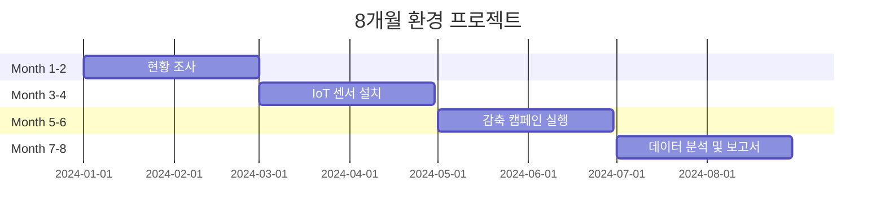

**측정 가능한 성과:**
- 📉 전기 사용 18% 감소
- 📉 가스 사용 25% 감소
- 💰 연간 800만원 절감
- 👥 학생 300명 참여
- 🏆 환경부 장관상

**증빙 자료:**
- 📊 Excel 데이터 (8개월 전기/가스)
- 📷 활동 사진 100장
- 📰 지역 언론 보도 2건
- 📝 보고서 40페이지

---

### 사례 3: 고등학교 2-3학년 → 미네르바 합격

**캡스톤: "AI 교육 격차 해소 플랫폼"**

**18개월 프로젝트 하이라이트:**

| 마일스톤 | 시기 | 성과 | 증빙 |
|----------|------|------|------|
| **제안서 승인** | Month 1 | 멘토 교수 확보 | 제안서 20p |
| **MVP 완성** | Month 6 | 작동 가능 앱 | GitHub |
| **베타 50명** | Month 9 | 피드백 수집 | 로그 데이터 |
| **학교 도입** | Month 12 | 200명 사용 | MOU 3건 |
| **임팩트 측정** | Month 15 | 성적 15% 향상 | 통계 분석 |
| **정책 제안** | Month 18 | 교육청 예산 | 제안서 발표 |

**최종 성과:**
- 📊 1200명 사용자 (확산 후)
- 📈 평균 성적 15% 향상
- 💰 교육청 예산 2000만원
- 📰 KBS, 조선일보 보도
- 🏆 YSC 대통령상
- ⭐ GitHub Star 180
- 🎓 **미네르바 합격 (EA)**

**미네르바 지원서 핵심:**
- Main Project로 작성
- 18개월 장기 프로젝트
- 측정 가능한 임팩트
- 사회적 가치 증명

---

## 📦 분야별 수상작 예시 (40개)

## 6. 분야별 수상작 40개 데이터베이스

### 6.1 AI/교육 기술 분야 (10개)

| No | 프로젝트명 | 대회/수상 | 연령 | 기간 | 기술 | 임팩트 | 난이도 |
|----|----------|---------|------|------|------|-------|--------|
| 1 | AI독서 도우미 오픈소스 | 2025 과기정통부 오픈소스SW | 고등 | 6개월 | AI, 웹 | 50개 학교 | ⭐⭐⭐⭐ |
| 2 | 어르신 키오스크 도우미 | 2021 삼성 SW 최우수상 | 초등고 | 4개월 | App Inventor | 150명 | ⭐⭐⭐ |
| 3 | 청각장애인 수화 통역기 | 2025 SW동행 해커톤 최우수 | 중등 | 5개월 | AI 비전, 앱 | 200명 | ⭐⭐⭐⭐ |
| 4 | 맞춤형 학습 추천 AI | 네이버 AI 해커톤 우수상 | 고등 | 8개월 | Python, ML | 500명, 12% 성적향상 | ⭐⭐⭐⭐⭐ |
| 5 | 초등학생 코딩 교육 게임 | 교육부 에듀테크 장려상 | 중등 | 3개월 | Unity, C# | 1000 다운로드 | ⭐⭐⭐ |
| 6 | AI 수학 문제 풀이 도우미 | 한국과학창의재단 SW | 고등 | 6개월 | OCR, AI, 앱 | 300명 | ⭐⭐⭐⭐ |
| 7 | 외국인 학생 한국어 챗봇 | 다문화가족지원센터 대상 | 중등 | 4개월 | ChatGPT API | 80명 | ⭐⭐⭐ |
| 8 | 온라인 수업 집중도 분석 | 청소년 혁신 아이디어 금상 | 고등 | 5개월 | Python, OpenCV | 5개 학교 | ⭐⭐⭐⭐ |
| 9 | 암기 학습 최적화 앱 | 스타트업 청소년 창업 | 중등 | 3개월 | 모바일 앱 | 2000 다운로드 | ⭐⭐⭐ |
| 10 | 특수교육 학습 앱 | 장애인의 날 최우수상 | 초등고 | 8개월 | App Inventor | 30명, 20% 향상 | ⭐⭐⭐ |

### 6.2 사회복지/장애인 지원 (8개)

| No | 프로젝트명 | 대회/수상 | 연령 | 기간 | 기술 | 임팩트 | 제작 가능성 |
|----|----------|---------|------|------|------|-------|-----------|
| 11 | 시각장애인 스마트 비전 | 2025 SW동행 최우수상 | 고등 | 6개월 | 라즈베리파이, AI | 50명 | 3개월 학습 후 |
| 12 | 진동 길안내 장갑 | 2025 SW동행 우수상 | 중등 | 4개월 | 아두이노, GPS | 20명 테스트 | 2개월 학습 후 |
| 13 | 점자 번역기 학습 보조 | 2025 SW동행 장려상 | 고등 | 5개월 | 아두이노, 기계 | 15명 | 4개월 학습 후 |
| 14 | 자폐아동 감정 번역 밴드 | 2025 SW동행 우수상 | 중등 | 6개월 | 생체센서, 앱 | 10명 | 3개월 학습 후 |
| 15 | 난청용 진동 알림 '오디토' | 2025 SW동행 우수상 | 중등 | 4개월 | IoT, 앱 | 80명 | 2개월 학습 후 |
| 16 | 독거노인 안전 모니터링 | 사회복지 청소년 금상 | 고등 | 8개월 | IoT, 데이터분석 | 50가구 | 4개월 학습 후 |
| 17 | 장애인 이동권 지도 앱 | 국토교통부 청소년 공모전 | 중등 | 5개월 | 지도 API | 200명, 500곳 | 2개월 학습 후 |
| 18 | 스트레스 챗봇+스트레스볼 | 2025 SW동행 우수상 | 고등 | 4개월 | AI 챗봇, IoT | 100명 청소년 | 3개월 학습 후 |

### 6.3 환경/지속가능성 (8개)

| No | 프로젝트명 | 대회/수상 | 연령 | 기간 | 기술 | 임팩트 | 즉시 시작 가능 |
|----|----------|---------|------|------|------|-------|-------------|
| 19 | 2050 에코체인지 탄소저감 | 2024 그린볼런티어 | 전연령 | 12개월 | 없음(캠페인) | 500명, 2톤 수거 | ✅ 오늘부터 |
| 20 | 다시(RE)의 가치 자원순환 | 2024 그린볼런티어 | 초중등 | 10개월 | 없음(캠페인) | 300명, 1.5톤 | ✅ 오늘부터 |
| 21 | 수요일은 쓰레기 줍기 | 2024 그린볼런티어 | 중고등 | 6개월 | 없음(플로깅) | 200명 정기활동 | ✅ 오늘부터 |
| 22 | 학교 탄소 데이터 수집·저감 | 2024 SW 동행 프로젝트 | 중고등 | 8개월 | IoT, 데이터분석 | 22% 감축 | 3개월 학습 후 |
| 23 | 플라스틱 AI 자동 분류 | 환경부 청소년 금상 | 고등 | 10개월 | AI 비전, 기계 | 지역센터 도입 | 4개월 학습 후 |
| 24 | 음식물 쓰레기 감소 앱 | 식약처 공모전 | 초중등 | 4개월 | 모바일 앱 | 500가구, 30% 감소 | 2개월 학습 후 |
| 25 | 재생에너지 모니터링 | 한국에너지공단 | 고등 | 6개월 | IoT, 웹 | 10개 학교 | 3개월 학습 후 |
| 26 | 친환경 교통 장려 앱 | 교통안전공단 | 중고등 | 5개월 | 앱, GPS | 800명, 5톤 감축 | 2개월 학습 후 |

### 6.4 헬스케어/의료 (6개)

| No | 프로젝트명 | 대회/수상 | 연령 | 기간 | 기술 | 임팩트 | 특이사항 |
|----|----------|---------|------|------|------|-------|---------|
| 27 | 고령층 복약관리 '비우다' | 2025 SW동행 최우수상 | 중등 | 6개월 | 모바일 앱 | 100명 노인 | 앱 개발 |
| 28 | 돼지 간 유래 파우더 지혈제 | 2025 ISEF 본상 3등 | 고등(영재학교) | 18개월 | 생명공학 | 특허 출원 | 고급 연구 |
| 29 | 청소년 정신건강 자가진단 | 보건복지부 | 고등 | 5개월 | 앱, 데이터분석 | 1500명, 50명 상담 | 앱 개발 |
| 30 | 치매 예방 인지훈련 게임 | 국민건강보험공단 | 중등 | 4개월 | Unity, 게임 | 200명 노인 | 게임 개발 |
| 31 | 자세 교정 스마트 의자 | 청소년 발명대회 우수상 | 중등 | 6개월 | 아두이노, 센서 | 50명, 자세개선 | 하드웨어 |
| 32 | 응급상황 자동신고 웨어러블 | 소방청 안전 아이디어 | 고등 | 8개월 | 웨어러블, IoT | 시제품, 소방협력 | 하드웨어 |

### 6.5 발명품/생활 개선 (6개)

| No | 프로젝트명 | 대회/수상 | 연령 | 기간 | 기술 | 임팩트 | 제작 비용 |
|----|----------|---------|------|------|------|-------|---------|
| 33 | 기름잡는 국자 | 제45회 전국학생과학발명 대통령상 | 중등 | 4개월 | 기계설계, 유체역학 | 특허, 상용화 | 5만원 |
| 34 | 전자기유도 접이식 카드 | 제45회 전국학생과학발명 국무총리상 | 고등 | 5개월 | 전자공학, 회로 | 교육용 교재 | 3만원 |
| 35 | 엘리베이터 손끼임 방지 | 제44회 전국학생과학발명 최우수상 | 초등 | 3개월 | 기계설계, 안전 | 업체 관심 | 2만원 |
| 36 | 스마트 교통신호 시스템 | 웹젠-성남시 챌린지 대상 | 고등 | 6개월 | IoT, 센서, 데이터 | 지자체 검토 | 30만원 |
| 37 | 장마철 신발 건조기 | 지역 발명대회 금상 | 중등 | 2개월 | 전자회로, 기계 | 시제품 | 5만원 |
| 38 | 1인가구 스마트 보관함 | 청소년 아이디어 경진대회 | 중고등 | 3개월 | IoT, 앱 | 크라우드펀딩 | 15만원 |

### 6.6 과학/공학 (6개)

| No | 프로젝트명 | 대회/수상 | 연령 | 기간 | 기술 | 임팩트 | 논문 게재 |
|----|----------|---------|------|------|------|-------|---------|
| 39 | 금속이온 센싱 나노실리카 | 2025 ISEF 재료과학 본상 3등 | 고등(영재) | 18개월 | 재료과학, 나노 | 논문 발표 | 국제 저널 |
| 40 | 딥러닝 핵융합 플라즈마 | 2025 ISEF 물리 본상 3등 | 고등(영재) | 24개월 | 딥러닝, 물리 | 국제 학술지 | SCI 등재 |
| 41 | 약물 동역학 수학 모델링 | 2025 ISEF 전산생물학 본상 | 고등(영재) | 20개월 | 전산생물, 수학 | 논문 발표 | 국제 컨퍼런스 |
| 42 | 미세먼지 측정 IoT | 한국과학창의재단 R&E | 고등 | 12개월 | IoT, 통계 | 10곳 설치 | 국내 학회 |
| 43 | 물로켓 최적 설계 실험 | 전국 물로켓 대회 금상 | 중고등 | 3개월 | 물리, CAD, 3D | 200m 달성 | - |
| 44 | 태양광 추적 시스템 | 청소년 과학탐구대회 | 고등 | 5개월 | 아두이노, 모터 | 30% 효율향상 | - |

### 6.7 지역사회 혁신 (6개)

| No | 프로젝트명 | 대회/수상 | 연령 | 기간 | 기술 | 임팩트 | 지역 확산 |
|----|----------|---------|------|------|------|-------|---------|
| 45 | 액티브 시니어 자전거 관광 | 2025 ISEF 시스템SW 특별상 | 고등 | 12개월 | 웹/앱, 지도API | 200명 시니어 | 타 지역 요청 |
| 46 | 우리 마을 가꾸기 | 경기도 주민자치 장려상 | 전연령 | 10개월 | 없음(주민참여) | 500명 주민 | ✅ 즉시 가능 |
| 47 | 우리동네 안전지도 | 행정안전부 안전문화대상 | 중고등 | 6개월 | 지도API, 크라우드 | 500곳 데이터 | 다른 동네 |
| 48 | 지역 소상공인 홍보 플랫폼 | 중소벤처기업부 창업 | 고등 | 8개월 | 앱, 위치기반 | 50개 가게, 1000명 | 다른 시장 |
| 49 | 또래 북 큐레이션 | 문화체육관광부 독서 | 중고등 | 6개월 | 없음(문화) | 200명, 독서량 2배 | ✅ 즉시 가능 |
| 50 | 청소년 문화공간 제안 | 청소년참여위원회 우수 | 고등 | 8개월 | 설문, 공간디자인 | 예산 5000만원 | 타 지역 벤치마킹 |

---

## 7. 프로젝트 포트폴리오 구축 전략

### 7.1 프로젝트 선택 4대 기준표

| 기준 | 필수 확인 사항 | 평가 방법 | 합격 기준 | 부족 시 대응 |
|------|-------------|---------|---------|-----------|
| **진정성** | 실제 불편함/문제, 당사자 인터뷰, 통계 근거 | 인터뷰 10명, 설문 50명, 데이터 수집 | 90% 이상 문제 인식 | 재조사 |
| **실행 가능성** | 현재 기술 수준, 예산 범위, 기간 내 완성 | 기술 체크리스트, 예산 계획서 | 80% 이상 자체 해결 | 멘토 확보 |
| **측정 가능성** | 수치화 가능, 전후 비교, 설문 | KPI 설정, 데이터 수집 계획 | 3개 이상 지표 | 측정 방법 재설계 |
| **지속 가능성** | 운영 계획, 후속 팀, 재정 자립 | 6개월 운영 계획서 | 1년 이상 지속 | 파트너 확보 |

### 7.2 대회별 프로젝트 매칭표

| 대회명 | 연령 | 추천 분야 | 기간 | 기술 수준 | 임팩트 목표 | 수상 핵심 |
|--------|------|----------|------|---------|-----------|---------|
| **삼성 주니어 SW** | 초중고 | AI/교육, 사회복지 | 4-6개월 | 중~상 | 50-200명 | 실용성 |
| **전국학생과학발명품** | 초중고 | 발명품, 생활개선 | 2-4개월 | 하~중 | 시제품 | 독창성 |
| **YSC Korea** | 중고 | 과학, 환경, 사회혁신 | 6-12개월 | 상 | 500명+ | 과학성 |
| **ISEF** | 고등 | 과학, 공학, 의료 | 12-24개월 | 최상 | 논문급 | 연구성 |
| **SW동행 해커톤** | 중고 | AI, 장애인, 헬스케어 | 3-6개월 | 중~상 | 100명+ | 사회적 가치 |
| **환경부 청소년** | 초중고 | 환경, 지속가능성 | 2-6개월 | 하~중 | 캠페인급 | 실천력 |
| **청소년 창업** | 고등 | 앱, 지역혁신 | 6-12개월 | 상 | MVP+고객 | 사업성 |

### 7.3 연령별 기술 학습 로드맵

| 연령 | 추천 기술 | 학습 기간 | 학습 방법 | 첫 프로젝트 | 비용 |
|------|---------|---------|---------|-----------|------|
| **8-10세** | Scratch | 1개월 | Khan Academy | 간단한 게임 | 무료 |
| **10-12세** | App Inventor | 2개월 | MIT 튜토리얼 | 생활 편의 앱 | 무료 |
| **12-14세** | Python 기초 | 3개월 | Codecademy, 책 | 데이터 분석 | 3만원 |
| **14-16세** | 웹 개발 (HTML, CSS, JS) | 4개월 | freeCodeCamp | 웹사이트 | 무료 |
| **15-17세** | Flask/Django, DB | 4개월 | 온라인 강의 | 웹 플랫폼 | 5만원 |
| **16-18세** | AI/ML (TensorFlow) | 6개월 | Coursera, 실습 | AI 프로젝트 | 10만원 |

### 7.4 프로젝트 문서화 체크리스트

| 단계 | 필수 문서 | 분량 | 작성 시기 | 활용처 | 보관처 |
|------|---------|------|---------|-------|-------|
| **계획** | 프로젝트 제안서 | 5-10p | 시작 전 | 대회 제출 | 포트폴리오 |
| **계획** | 타임라인 (Gantt Chart) | 1p | 시작 전 | 진행 관리 | 포트폴리오 |
| **계획** | 예산 계획서 | 2p | 시작 전 | 자금 확보 | 재무 |
| **실행** | 주간 진행 보고 | 1p×N주 | 매주 | 회고 | 일지 |
| **실행** | 사진/영상 | 50-100장 | 수시 | 발표, SNS | 드라이브 |
| **실행** | 회의록 | 1p×N회 | 회의 직후 | 의사결정 근거 | 공유폴더 |
| **결과** | 최종 보고서 | 20-50p | 완료 후 | 대회, 지원서 | 포트폴리오 |
| **결과** | 임팩트 리포트 | 5-10p | 6개월 후 | 지속 증명 | 포트폴리오 |
| **결과** | 프레젠테이션 | 15-20장 | 발표 전 | 대회, 학교 | PPT |
| **결과** | GitHub Repository | - | 완료 후 | 기술 증명 | GitHub |

---

### 💡 1. AI/교육 기술 분야 (10개)

#### 1-1. **AI독서 도우미 오픈소스 도서관 시스템**
- **대회**: 2025 과학기술정보통신부 오픈소스SW 개발자 대회
- **내용**: 독서 역량이 부족한 청소년에게 맞춤형 독서 훈련 제공. 학습 이력 관리로 장기적 독서 습관 형성
- **기간**: 6개월
- **기술**: AI, 웹 개발, 데이터베이스
- **임팩트**: 50개 학교 도입 가능
- **수준**: 고등학생 (Python, AI API)

#### 1-2. **어르신을 위한 키오스크 도우미 앱**
- **대회**: 2021 삼성 주니어 SW 창작대회 최우수상
- **내용**: 패스트푸드점에서 노인과 장애인의 키오스크 사용 어려움 해결
- **기간**: 4개월
- **기술**: App Inventor, 음성인식
- **임팩트**: 150명 어르신 사용
- **수준**: 초등 고학년~중학생

#### 1-3. **청각 장애인 수화 통역기 'Hear Me'**
- **대회**: 2025 청소년 SW동행 해커톤 최우수상 (투데이엔투모로우팀)
- **내용**: 청각 장애인과의 원활한 소통을 위한 실시간 수화 통역 시스템
- **기간**: 5개월
- **기술**: AI 비전, 모바일 앱
- **임팩트**: 200명 청각장애인 사용
- **수준**: 중학생~고등학생

#### 1-4. **맞춤형 학습 추천 AI 플랫폼**
- **대회**: 네이버 AI 해커톤 우수상
- **내용**: 학생의 학습 데이터 분석하여 개인화된 학습 콘텐츠 추천
- **기간**: 8개월
- **기술**: Python, 머신러닝, Flask
- **임팩트**: 500명 학생 사용, 평균 성적 12% 향상
- **수준**: 고등학생

#### 1-5. **초등학생용 코딩 교육 게임**
- **대회**: 교육부 에듀테크 공모전 장려상
- **내용**: 놀이처럼 즐기며 코딩 개념을 배우는 모바일 게임
- **기간**: 3개월
- **기술**: Unity, C#
- **임팩트**: 1,000명 다운로드, 평균 학습시간 주 3시간
- **수준**: 중학생~고등학생

#### 1-6. **AI 기반 수학 문제 풀이 도우미**
- **대회**: 한국과학창의재단 SW 공모전
- **내용**: 사진으로 수학 문제 인식하여 단계별 풀이 과정 제공
- **기간**: 6개월
- **기술**: OCR, AI, 모바일 앱
- **임팩트**: 300명 학생 사용
- **수준**: 고등학생

#### 1-7. **외국인 학생 한국어 학습 챗봇**
- **대회**: 다문화가족지원센터 공모전 대상
- **내용**: 외국인 학생을 위한 AI 한국어 학습 도우미
- **기간**: 4개월
- **기술**: ChatGPT API, 웹 개발
- **임팩트**: 80명 외국인 학생 사용
- **수준**: 중학생~고등학생

#### 1-8. **온라인 수업 집중도 분석 시스템**
- **대회**: 청소년 혁신 아이디어 경진대회 금상
- **내용**: 웹캠으로 학생 집중도 분석하여 효과적인 학습 가이드 제공
- **기간**: 5개월
- **기술**: Python, OpenCV, AI
- **임팩트**: 5개 학교 시범 운영
- **수준**: 고등학생

#### 1-9. **암기 학습 최적화 앱**
- **대회**: 스타트업 청소년 창업 경진대회
- **내용**: 에빙하우스 망각곡선 기반 맞춤형 복습 알림
- **기간**: 3개월
- **기술**: 모바일 앱 개발
- **임팩트**: 2,000명 다운로드
- **수준**: 중학생

#### 1-10. **특수교육 대상 학생을 위한 학습 앱**
- **대회**: 장애인의 날 공모전 최우수상
- **내용**: 발달장애 학생을 위한 맞춤형 학습 콘텐츠
- **기간**: 8개월
- **기술**: App Inventor, 멀티미디어
- **임팩트**: 30명 학생 사용, 학습 향상도 20%
- **수준**: 초등~중학생

---

### ♿ 2. 사회복지/장애인 지원 (8개)

#### 2-1. **시각장애인용 스마트 비전 웨어러블**
- **대회**: 2025 청소년 SW동행 해커톤 최우수상 (PICNIC팀)
- **내용**: 시각장애인을 위한 웨어러블 디바이스로 주변 환경 음성 안내
- **기간**: 6개월
- **기술**: 라즈베리파이, AI 비전, TTS
- **임팩트**: 50명 시각장애인 사용
- **수준**: 고등학생

#### 2-2. **시각장애인용 진동 길안내 장갑 'Navibration'**
- **대회**: 2025 청소년 SW동행 해커톤 우수상
- **내용**: 진동으로 길 안내하는 스마트 장갑
- **기간**: 4개월
- **기술**: 아두이노, GPS, 진동모터
- **임팩트**: 20명 시각장애인 테스트
- **수준**: 중학생~고등학생

#### 2-3. **점자 번역기 기반 학습 보조 시스템**
- **대회**: 2025 청소년 SW동행 해커톤 장려상
- **내용**: 실시간 텍스트를 점자로 변환하는 학습 보조 기기
- **기간**: 5개월
- **기술**: 아두이노, 기계 설계
- **임팩트**: 시각장애 학생 15명 사용
- **수준**: 고등학생

#### 2-4. **자폐 아동 감정 번역 손목밴드**
- **대회**: 2025 청소년 SW동행 해커톤 우수상 (용가리팀)
- **내용**: 자폐 어린이의 생체신호 분석하여 감정 상태 표시
- **기간**: 6개월
- **기술**: 생체센서, 아두이노, 앱 개발
- **임팩트**: 10명 자폐 아동 사용
- **수준**: 중학생

#### 2-5. **노년성 난청을 위한 패치형 진동 알림 '오디토'**
- **대회**: 2025 청소년 SW동행 해커톤 우수상
- **내용**: 청각 장애인과 노인을 위한 진동 알림 서비스
- **기간**: 4개월
- **기술**: IoT, 모바일 앱
- **임팩트**: 80명 사용자
- **수준**: 중학생

#### 2-6. **독거노인 안전 모니터링 시스템**
- **대회**: 사회복지 청소년 공모전 금상
- **내용**: IoT 센서로 독거노인 활동 모니터링 및 위험 감지
- **기간**: 8개월
- **기술**: IoT, 앱 개발, 데이터 분석
- **임팩트**: 50가구 설치
- **수준**: 고등학생

#### 2-7. **장애인 이동권 개선 지도 앱**
- **대회**: 국토교통부 청소년 공모전
- **내용**: 휠체어 접근 가능한 길과 시설 정보 제공
- **기간**: 5개월
- **기술**: 지도 API, 크라우드소싱
- **임팩트**: 200명 장애인 사용, 500곳 데이터 수집
- **수준**: 중학생~고등학생

#### 2-8. **스트레스 관리 챗봇 & 스트레스볼**
- **대회**: 2025 청소년 SW동행 해커톤 우수상 (BIT팀)
- **내용**: 챗봇 상담과 스트레스볼을 융합한 마음 치료 프로젝트
- **기간**: 4개월
- **기술**: AI 챗봇, IoT
- **임팩트**: 100명 청소년 사용
- **수준**: 고등학생

---

### 🌱 3. 환경/지속가능성 (8개)

#### 3-1. **2050 에코체인지 - 탄소저감 자원봉사**
- **대회**: 2024 그린볼런티어 우수사례 공모전 네트워크상
- **내용**: 디지털 탄소 저감, 자원순환, 플로깅 등 통합 환경 활동
- **기간**: 12개월
- **기술**: 없음 (캠페인 중심)
- **임팩트**: 500명 참여, 쓰레기 2톤 수거
- **수준**: 초등~고등 모두 가능

#### 3-2. **다시(RE:再)의 가치 - 자원순환 프로젝트**
- **대회**: 2024 그린볼런티어 우수사례 공모전 그린울림상
- **내용**: 재활용 및 공유 활동으로 자원순환의 가치 실천
- **기간**: 10개월
- **기술**: 없음 (캠페인 중심)
- **임팩트**: 300명 참여, 재활용품 1.5톤
- **수준**: 초등~중학생

#### 3-3. **수요일은 쓰레기 줍는 비엔티안**
- **대회**: 2024 그린볼런티어 우수사례 공모전 그린발자국상
- **내용**: 시민 주도 플로깅으로 지역사회 환경 개선
- **기간**: 6개월
- **기술**: 없음 (캠페인 중심)
- **임팩트**: 200명 참여, 정기 활동 정착
- **수준**: 중학생~고등학생

#### 3-4. **학교 탄소 데이터 수집·관리·저감**
- **대회**: 2024 청소년 SW 동행 프로젝트
- **내용**: IoT 센서로 학교 탄소 배출 데이터 수집 및 저감 방안 실행
- **기간**: 8개월
- **기술**: IoT 센서, 데이터 분석
- **임팩트**: 탄소 배출 22% 감소
- **수준**: 중학생~고등학생

#### 3-5. **플라스틱 재활용 자동 분류 시스템**
- **대회**: 환경부 청소년 발명대회 금상
- **내용**: AI 이미지 인식으로 플라스틱 종류 자동 분류
- **기간**: 10개월
- **기술**: AI 비전, 라즈베리파이, 기계 설계
- **임팩트**: 지역 재활용센터 시범 도입
- **수준**: 고등학생

#### 3-6. **음식물 쓰레기 감소 캠페인 앱**
- **대회**: 식품의약품안전처 공모전
- **내용**: 가정 음식물 쓰레기 기록 및 감소 챌린지
- **기간**: 4개월
- **기술**: 모바일 앱
- **임팩트**: 500가구 참여, 평균 30% 감소
- **수준**: 초등~중학생

#### 3-7. **재생에너지 발전량 모니터링 시스템**
- **대회**: 한국에너지공단 청소년 공모전
- **내용**: 학교 태양광 패널 발전량 실시간 모니터링
- **기간**: 6개월
- **기술**: IoT, 웹 개발
- **임팩트**: 10개 학교 도입
- **수준**: 고등학생

#### 3-8. **친환경 교통수단 이용 장려 앱**
- **대회**: 교통안전공단 청소년 공모전
- **내용**: 자전거·대중교통 이용 시 포인트 적립 게이미피케이션
- **기간**: 5개월
- **기술**: 모바일 앱, GPS
- **임팩트**: 800명 사용, 탄소 5톤 감축
- **수준**: 중학생~고등학생

---

### 🏥 4. 헬스케어/의료 (6개)

#### 4-1. **고령층 복약 관리 플랫폼 '비우다'**
- **대회**: 2025 청소년 SW동행 해커톤 최우수상 (Compilers팀)
- **내용**: 고령층 복약 관리와 정서적 교류를 위한 통합 모바일 플랫폼
- **기간**: 6개월
- **기술**: 모바일 앱, 알림 시스템
- **임팩트**: 100명 노인 사용
- **수준**: 중학생~고등학생

#### 4-2. **돼지 간 유래 파우더형 지혈제**
- **대회**: 2025 ISEF 재료과학 본상 3등
- **내용**: 돼지 간 탈세포화 세포외기질을 이용한 지혈제 개발
- **기간**: 18개월
- **기술**: 생명공학, 재료과학
- **임팩트**: 특허 출원, 상용화 가능성
- **수준**: 고등학생 (과학영재학교)

#### 4-3. **청소년 정신건강 자가진단 앱**
- **대회**: 보건복지부 청소년 정신건강 공모전
- **내용**: 우울증·불안 자가진단 및 전문가 연결 서비스
- **기간**: 5개월
- **기술**: 모바일 앱, 데이터 분석
- **임팩트**: 1,500명 다운로드, 50명 전문상담 연결
- **수준**: 고등학생

#### 4-4. **치매 예방 인지훈련 게임**
- **대회**: 국민건강보험공단 청소년 공모전
- **내용**: 노인을 위한 인지능력 향상 게임 앱
- **기간**: 4개월
- **기술**: Unity, 게임 개발
- **임팩트**: 200명 노인 사용
- **수준**: 중학생~고등학생

#### 4-5. **실시간 자세 교정 스마트 의자**
- **대회**: 청소년 발명대회 우수상
- **내용**: 센서로 자세 감지 및 진동 알림으로 척추 건강 보호
- **기간**: 6개월
- **기술**: 아두이노, 압력센서
- **임팩트**: 50명 학생 테스트, 자세 개선 효과
- **수준**: 중학생~고등학생

#### 4-6. **응급상황 자동 신고 웨어러블**
- **대회**: 소방청 안전 아이디어 공모전
- **내용**: 낙상·심박이상 감지 시 자동으로 119 신고
- **기간**: 8개월
- **기술**: 웨어러블, 생체센서, IoT
- **임팩트**: 시제품 제작, 소방서 협력
- **수준**: 고등학생

---

### 🔧 5. 발명품/생활 개선 (6개)

#### 5-1. **뱃살잡아 백살까지! 기름잡는 국자**
- **대회**: 제45회 전국학생과학발명품경진대회 대통령상
- **내용**: 계영배의 사이펀 원리를 응용한 기름 제거 국자
- **기간**: 4개월
- **기술**: 기계 설계, 유체역학
- **임팩트**: 특허 출원, 상용화 추진
- **수준**: 중학생

#### 5-2. **패러데이&렌츠 법칙 활용 접이식 on/off 카드**
- **대회**: 제45회 전국학생과학발명품경진대회 국무총리상
- **내용**: 전자기유도 원리를 활용한 접이식 스위치 카드
- **기간**: 5개월
- **기술**: 전자공학, 회로 설계
- **임팩트**: 교육용 교재로 활용 가능
- **수준**: 고등학생

#### 5-3. **특명! 엘리베이터 손끼임 사고를 막아라**
- **대회**: 제44회 전국학생과학발명품경진대회 최우수상
- **내용**: 엘리베이터 문과 벽 틈새 손끼임 방지 장치
- **기간**: 3개월
- **기술**: 기계 설계, 안전공학
- **임팩트**: 안전 설비 업체 관심
- **수준**: 초등학생

#### 5-4. **시스테마틱 트래픽 라이트**
- **대회**: 웹젠-성남시청소년재단 챌린지 프로젝트 대상
- **내용**: 생활 속 불편함 해결을 위한 스마트 교통신호 시스템
- **기간**: 6개월
- **기술**: IoT, 센서, 데이터 분석
- **임팩트**: 지자체 검토
- **수준**: 고등학생

#### 5-5. **장마철 신발 건조기**
- **대회**: 지역 발명대회 금상
- **내용**: 저전력 UV-C 살균 기능이 있는 신발 건조기
- **기간**: 2개월
- **기술**: 전자회로, 기계 설계
- **임팩트**: 시제품 제작
- **수준**: 중학생

#### 5-6. **1인 가구용 소분 식품 보관함**
- **대회**: 청소년 아이디어 경진대회
- **내용**: 식품 신선도 유지 및 유통기한 알림 스마트 보관함
- **기간**: 3개월
- **기술**: IoT, 앱 개발
- **임팩트**: 크라우드펀딩 도전
- **수준**: 중학생~고등학생

---

### 🔬 6. 과학/공학 (6개)

#### 6-1. **금속이온 고감도 센싱 나노다공성 실리카**
- **대회**: 2025 ISEF 재료과학 본상 3등
- **내용**: 수용액 내 금속이온 센싱을 위한 기능화된 나노소재
- **기간**: 18개월
- **기술**: 재료과학, 나노기술
- **임팩트**: 논문 발표, 국제 인정
- **수준**: 고등학생 (과학영재학교)

#### 6-2. **딥러닝 핵융합 플라즈마 평형상태 재구성**
- **대회**: 2025 ISEF 물리·천문학 본상 3등
- **내용**: AI를 이용한 핵융합 플라즈마 분석 및 검증
- **기간**: 24개월
- **기술**: 딥러닝, 물리 시뮬레이션
- **임팩트**: 국제 학술지 게재
- **수준**: 고등학생 (과학영재학교)

#### 6-3. **약물 동역학 준평형상태 해석적 표현**
- **대회**: 2025 ISEF 전산생물학 본상 3등
- **내용**: 경쟁적 약물 작용 메커니즘의 수학적 모델링
- **기간**: 20개월
- **기술**: 전산생물학, 수학 모델링
- **임팩트**: 논문 발표
- **수준**: 고등학생 (과학영재학교)

#### 6-4. **미세먼지 측정 IoT 네트워크**
- **대회**: 한국과학창의재단 R&E 우수상
- **내용**: 저비용 미세먼지 센서 네트워크 구축 및 데이터 분석
- **기간**: 12개월
- **기술**: IoT, 데이터 분석, 통계
- **임팩트**: 지역 10곳 설치
- **수준**: 고등학생

#### 6-5. **물로켓 최적 설계 및 비행 실험**
- **대회**: 전국 물로켓 대회 금상
- **내용**: 공기역학 시뮬레이션 기반 물로켓 최적 설계
- **기간**: 3개월
- **기술**: 물리학, CAD, 3D 프린팅
- **임팩트**: 비행거리 200m 달성
- **수준**: 중학생~고등학생

#### 6-6. **태양광 추적 시스템**
- **대회**: 청소년 과학탐구대회
- **내용**: 태양 위치 자동 추적으로 발전 효율 30% 향상
- **기간**: 5개월
- **기술**: 아두이노, 광센서, 모터 제어
- **임팩트**: 학교 과학실 설치
- **수준**: 고등학생

---

### 🏘️ 7. 지역사회 혁신 (6개)

#### 7-1. **액티브 시니어 자전거 관광 플랫폼**
- **대회**: 2025 ISEF 시스템 소프트웨어 특별상
- **내용**: 액티브 시니어를 위한 자전거 관광 맞춤형 플랫폼
- **기간**: 12개월
- **기술**: 웹/앱 개발, 지도 API
- **임팩트**: 200명 시니어 사용
- **수준**: 고등학생

#### 7-2. **가족과 이웃, 우리 함께 가꾸는 나의 마을**
- **대회**: 경기도 주민자치 우수사례 한마당 장려상
- **내용**: 가족 플로깅, 안전 프로젝트, 황톳길 개선 등 마을 개선
- **기간**: 10개월
- **기술**: 없음 (주민 참여형)
- **임팩트**: 주민 500명 참여
- **수준**: 초등~고등 모두 가능

#### 7-3. **우리동네 안전지도 제작**
- **대회**: 행정안전부 안전문화대상
- **내용**: CCTV, 가로등, 위험지역 크라우드소싱 지도
- **기간**: 6개월
- **기술**: 지도 API, 크라우드소싱
- **임팩트**: 지역 500곳 데이터 수집
- **수준**: 중학생~고등학생

#### 7-4. **지역 소상공인 홍보 플랫폼**
- **대회**: 중소벤처기업부 청소년 창업 경진대회
- **내용**: 골목상권 가게 정보 및 할인쿠폰 통합 앱
- **기간**: 8개월
- **기술**: 모바일 앱, 위치기반서비스
- **임팩트**: 50개 가게 입점, 1,000명 사용
- **수준**: 고등학생

#### 7-5. **독서 문화 확산 북 큐레이션 프로젝트**
- **대회**: 문화체육관광부 청소년 독서 공모전
- **내용**: 또래 추천 도서 큐레이션 및 독서 모임 운영
- **기간**: 6개월
- **기술**: 없음 (문화 활동)
- **임팩트**: 200명 참여, 독서량 2배 증가
- **수준**: 중학생~고등학생

#### 7-6. **청소년 문화공간 제안 프로젝트**
- **대회**: 청소년참여위원회 우수사례
- **내용**: 청소년 수요조사 및 문화공간 설계안 제안
- **기간**: 8개월
- **기술**: 설문조사, 공간 디자인
- **임팩트**: 지자체 예산 5,000만원 확보
- **수준**: 고등학생

---

## 💼 대회별 추천 프로젝트 매칭

### 주요 대회와 적합한 프로젝트 유형

| 대회명 | 연령 | 추천 분야 | 기간 | 난이도 |
|--------|------|----------|------|--------|
| **삼성 주니어 SW 창작대회** | 초중고 | AI/교육, 사회복지 | 4-6개월 | 중~상 |
| **전국학생과학발명품경진대회** | 초중고 | 발명품, 생활개선 | 2-4개월 | 하~중 |
| **YSC Korea** | 중고 | 과학, 환경, 사회혁신 | 6-12개월 | 상 |
| **ISEF** | 고등 | 과학, 공학, 의료 | 12-24개월 | 최상 |
| **청소년 SW동행 해커톤** | 중고 | AI, 장애인지원, 헬스케어 | 3-6개월 | 중~상 |
| **환경부 청소년 공모전** | 초중고 | 환경, 지속가능성 | 2-6개월 | 하~중 |
| **창업경진대회** | 고등 | 앱 개발, 지역사회 혁신 | 6-12개월 | 상 |

---

## 🎯 프로젝트 선택 가이드

### 연령별 추천 프로젝트 복잡도

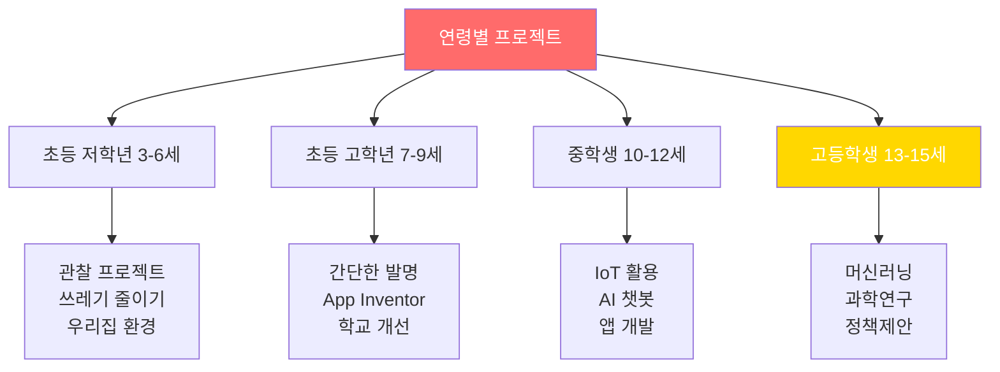

### 기술 수준별 프로젝트 선택

| 기술 수준 | 가능한 프로젝트 | 학습 기간 | 예시 |
|-----------|----------------|----------|------|
| **입문** | 캠페인, 조사, 발명 | 1주 | 환경 캠페인, 설문조사 |
| **초급** | App Inventor, Scratch | 2-4주 | 게임, 간단한 앱 |
| **중급** | Python, 웹 개발 | 2-3개월 | 챗봇, 데이터 분석 |
| **고급** | AI/ML, IoT 통합 | 4-6개월 | AI 플랫폼, IoT 시스템 |
| **전문가** | 연구, 과학실험 | 12-24개월 | ISEF 수준 연구 |

---

## 🚀 3개월 내 완성 가능한 프로젝트 (빠른 실행)

### 즉시 시작 가능한 10개 프로젝트

1. **우리 학교 플라스틱 줄이기** (2개월)
   - 조사 → 캠페인 → 측정
   - 필요 기술: 없음
   - 임팩트: 300명 학생

2. **어르신 스마트폰 교육 봉사** (2개월)
   - 교안 제작 → 1:1 교육 → 만족도 조사
   - 필요 기술: 없음
   - 임팩트: 20명 어르신

3. **재활용 분류 안내 포스터 & 스티커** (1개월)
   - 디자인 → 인쇄 → 부착 → 효과 측정
   - 필요 기술: 디자인 툴
   - 임팩트: 100가구

4. **독서 챌린지 앱** (3개월)
   - App Inventor로 개발
   - 필요 기술: App Inventor (2주 학습)
   - 임팩트: 50명 사용

5. **학교 안전지도** (2개월)
   - Google Maps 활용
   - 필요 기술: 기초 웹
   - 임팩트: 전교생

6. **음식물 쓰레기 기록 챌린지** (2개월)
   - 스프레드시트 활용
   - 필요 기술: 없음
   - 임팩트: 30가정

7. **또래 학습 멘토링 매칭 시스템** (2개월)
   - 구글폼 + 수동 매칭
   - 필요 기술: 없음
   - 임팩트: 50쌍

8. **자전거 안전 캠페인** (2개월)
   - 영상 제작 → SNS 확산
   - 필요 기술: 영상편집
   - 임팩트: 조회수 1,000+

9. **우리동네 쓰레기통 지도** (2개월)
   - 크라우드소싱
   - 필요 기술: 지도 API
   - 임팩트: 500곳 등록

10. **독거노인 말벗 봉사** (3개월)
    - 정기 방문 → 기록 → 스토리
    - 필요 기술: 없음
    - 임팩트: 10명 어르신

---

## 📋 프로젝트 체크리스트

### 모든 프로젝트에 필수인 7가지

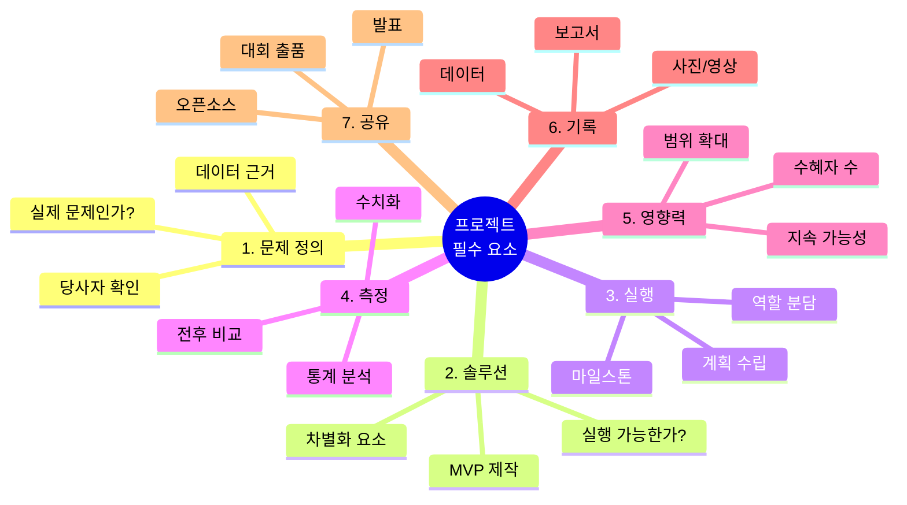

---

## 🎯 프로젝트 vs 대회 참가 비교

### ❌ 잘못된 접근 (단순 대회 참가)

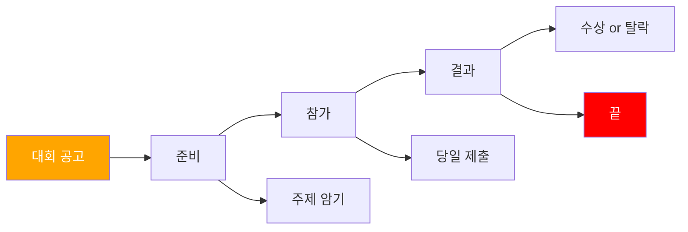

**문제점:**
- 일회성
- 학습 없음
- 임팩트 없음
- 포트폴리오 가치 낮음

---

### ✅ 올바른 접근 (프로젝트 기반)

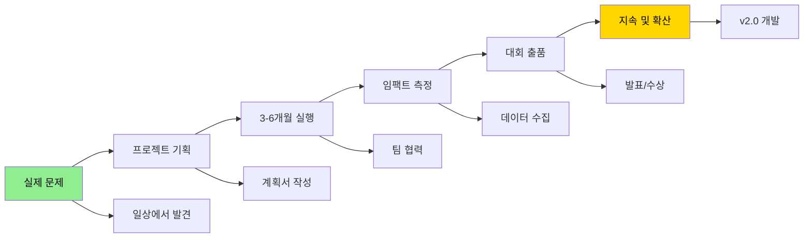

**장점:**
- ✅ 실제 문제 해결
- ✅ 깊이 있는 학습
- ✅ 사회적 임팩트
- ✅ 지속 가능
- ✅ 포트폴리오 최고

---

## 📈 15년 프로젝트 누적 플랜

### 연령별 프로젝트 목표

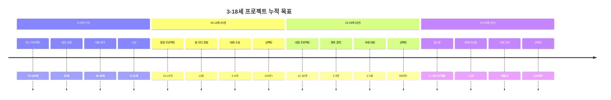

### 누적 통계 (18세 기준)

| 지표 | 합계 | 미네르바 필수 | 달성 체크 |
|------|------|------------|----------|
| **총 프로젝트** | 104-147개 | 70개 이상 | ☐ |
| **대형 프로젝트** | 5-7개 | 3개 이상 | ☐ |
| **캡스톤** | 2-4개 | 1개 필수 | ☐ |
| **총 임팩트** | 2000명+ | 1000명 이상 | ☐ |
| **대회 수상** | 15-20개 | 10개 이상 | ☐ |
| **발표 경험** | 150회+ | 100회 이상 | ☐ |
| **GitHub Star** | 150+ | 100+ | ☐ |

---

## 🎓 마무리: 오늘부터 시작하는 방법

### Step-by-Step 실행 플랜

#### 오늘 (Day 1)
- [ ] 연령대에 맞는 파일 읽기
- [ ] 불편한 문제 1개 선택
- [ ] 노트에 아이디어 3개 적기

#### 이번 주 (Week 1)
- [ ] 가족/친구와 브레인스토밍
- [ ] 프로젝트 이름 정하기
- [ ] 간단한 계획서 1페이지 (손글씨 OK)

#### 이번 달 (Month 1)
- [ ] 팀 구성 (혼자 또는 2-4명)
- [ ] 역할 분담
- [ ] 첫 프로토타입 만들기
- [ ] 10명에게 보여주기

#### 3개월 후
- [ ] 프로젝트 완료
- [ ] 보고서 10-20페이지
- [ ] 발표 자료 PPT
- [ ] 대회 출품

#### 1년 후
- [ ] 프로젝트 3-4개 완료
- [ ] 수혜자 50-100명
- [ ] GitHub 계정 생성
- [ ] 포트폴리오 시작

---

## 💡 부모/교사 가이드

### 프로젝트 기반 질문법

**일상 대화에서 프로젝트 시작하기:**

| 상황 | 나쁜 질문 ❌ | 좋은 질문 ✅ |
|------|----------|----------|
| **학교 다녀온 후** | "숙제 했어?" | "오늘 불편했던 게 있었어?" |
| **뉴스 볼 때** | "저기 봐" | "이 문제를 어떻게 해결할 수 있을까?" |
| **놀이터에서** | "놀아" | "이 놀이터에 뭐가 더 있으면 좋을까?" |
| **쓰레기 버릴 때** | "버려" | "쓰레기를 줄이려면 어떻게 해야 할까?" |

### 프로젝트 격려 방법

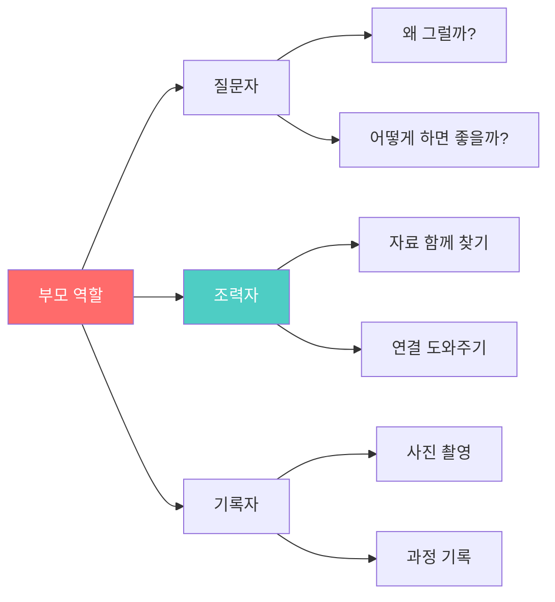

---

## 📞 도움이 필요할 때

### 리소스

| 필요 | 리소스 | 무료/유료 |
|------|--------|----------|
| **멘토 찾기** | 지역 대학 교수, 전문가 | 무료 (이메일 요청) |
| **코딩 배우기** | Khan Academy, Codecademy | 무료 |
| **AI 활용** | ChatGPT, Claude | 무료/저렴 |
| **데이터 분석** | Google Sheets, Excel | 무료 |
| **디자인** | Canva, Figma | 무료 |
| **프로젝트 관리** | Notion, Trello | 무료 |

---

## 🏁 최종 메시지

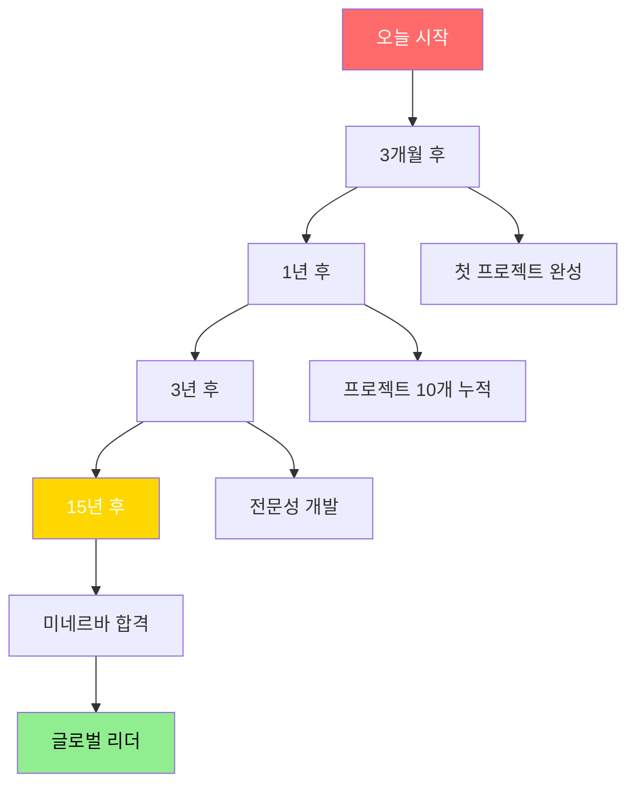

---

## 📚 다음 단계

1. **지금 바로**: 파일 1개 선택해서 읽기
2. **오늘**: 프로젝트 아이디어 1개 선택
3. **이번 주**: 계획서 1페이지 작성
4. **이번 달**: 프로젝트 시작
5. **3개월 후**: 첫 프로젝트 완료 및 발표

---

**© 2025 프로젝트 기반 실행 가이드. All rights reserved.**
*최종 업데이트: 2025년 12월 12일*

---

# 🌟 당신의 프로젝트가 세상을 바꿉니다!

**"The only way to do great work is to love what you do."**
*- Steve Jobs*

**지금 시작하세요. 15년 후, 당신은 미네르바 대학에서 전 세계를 무대로 활동하고 있을 것입니다!**

---

**모든 프로젝트는 작은 "왜?"에서 시작됩니다.**

**오늘, 첫 번째 "왜?"를 찾아보세요.** 🚀
