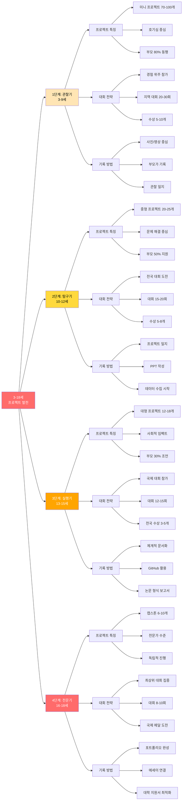
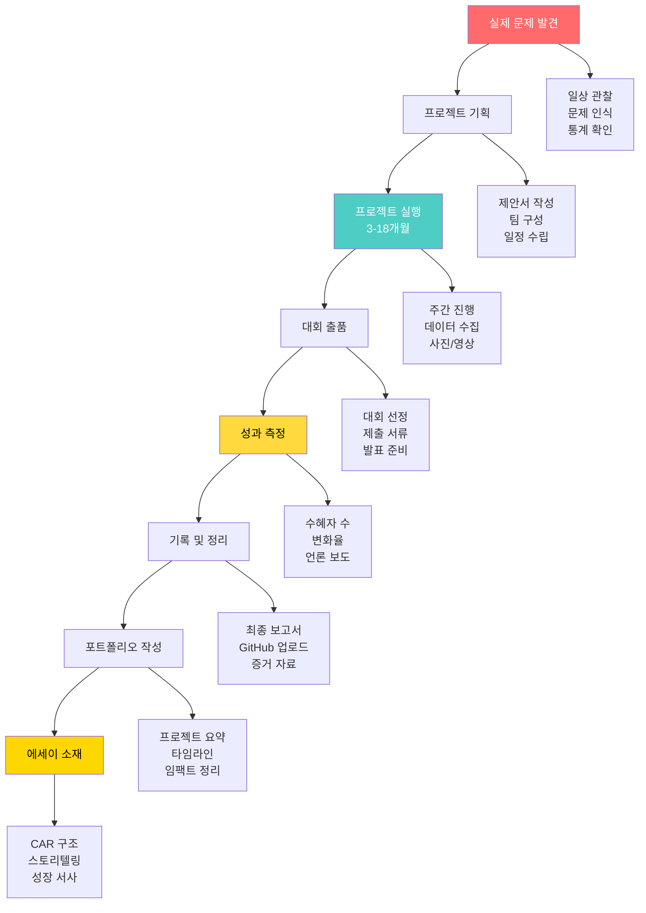
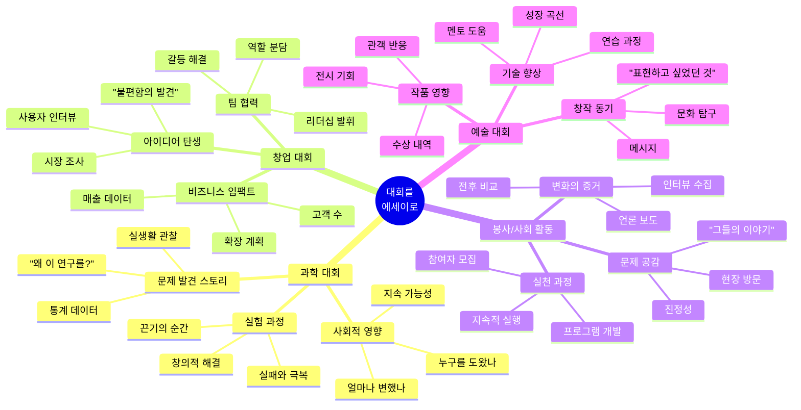
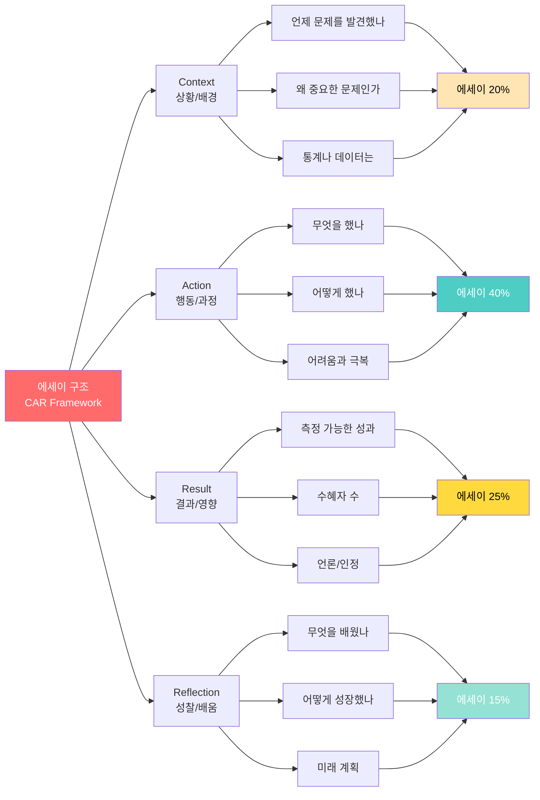
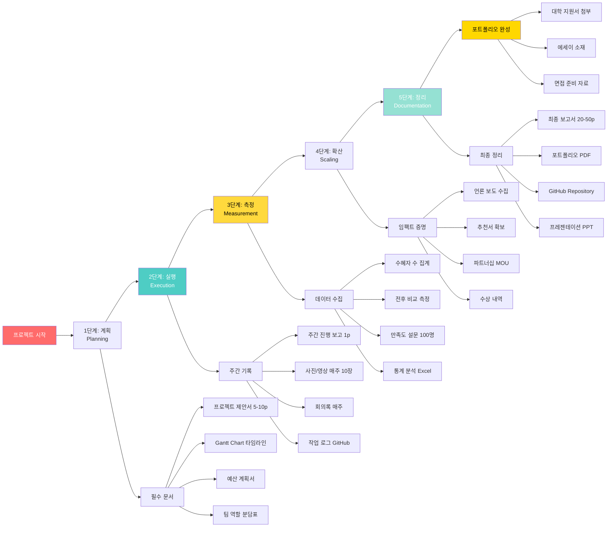
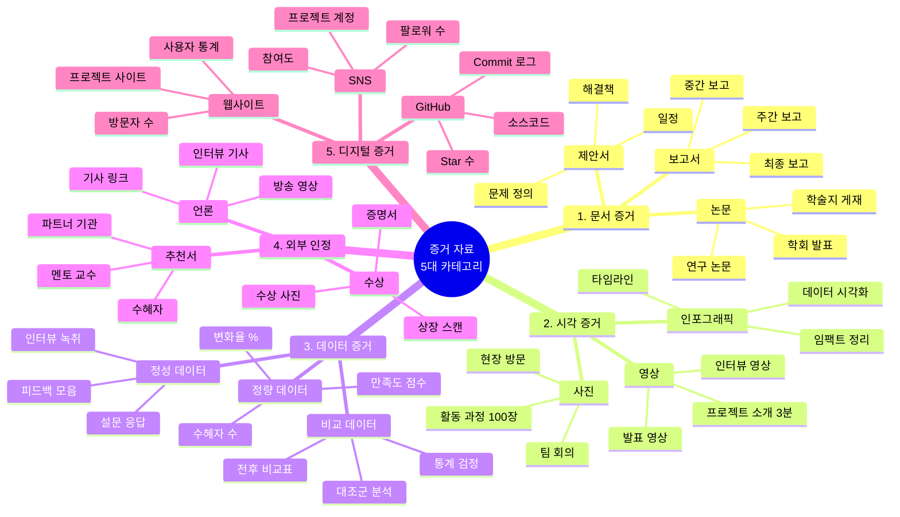
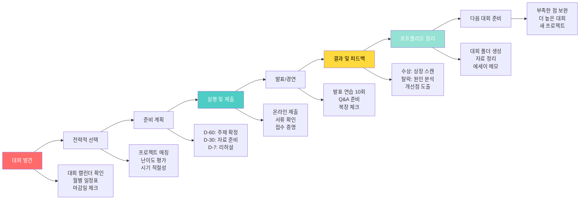
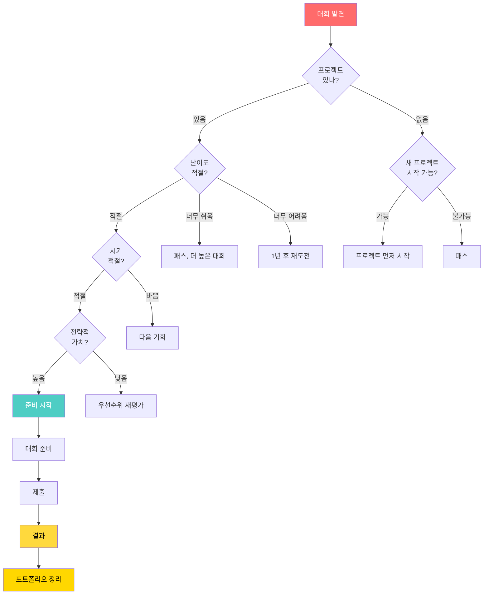
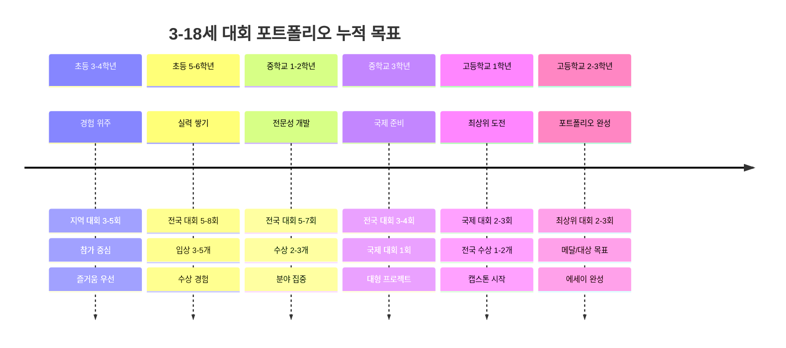

# 미네르바 대학교 완벽 가이드 (5부: 연령별 대회 & 공모전)

 
 


---

## 📑 목차

**PART 1: 전략적 준비 (프로젝트 기반)**
1. [연령별 프로젝트 학습 단계](#part-1-전략적-준비)
2. [프로젝트-대회-에세이 연결 전략](#2-프로젝트-대회-에세이-연결-전략)
3. [프로젝트 기록 및 증거 시스템](#3-프로젝트-기록-및-증거-시스템)
4. [대회 포트폴리오 관리 시스템](#4-대회-포트폴리오-관리-시스템)

**PART 2: 대회 정보 (실전 가이드)**
5. [월별 대회 일정 총정리](#5-월별-대회-일정-총정리)
6. [연령별 대회 가이드](#6-연령별-대회-가이드)
7. [분야별 대회 총집합](#7-분야별-대회-총집합)
8. [국제 대회](#8-국제-대회)
9. [연중 상시 프로그램](#9-연중-상시-프로그램)
10. [대회 준비 전략](#10-대회-준비-전략)

---

# PART 1: 전략적 준비 (프로젝트 기반)

## 1. 연령별 프로젝트 학습 단계

### 1.1 3-18세 프로젝트 발전 로드맵



### 1.2 연령별 학습 내용 및 산출물

| 연령 | 학습 목표 | 프로젝트 유형 | 대회 참가 | 산출물 | 에세이 소재 |
|------|---------|------------|---------|-------|-----------|
| **3-6세** | 호기심 개발 | 관찰 프로젝트 | 발표회 | 사진 앨범 | "첫 발견의 순간" |
| **7-9세** | 질문 습관 | 탐구 프로젝트 | 지역 대회 3-5회 | 탐구 노트 | "왜라는 질문" |
| **10-12세** | 문제 발견 | 문제 해결 | 전국 대회 5-8회 | PPT, 프로토타입 | "문제를 찾다" |
| **13-15세** | 실행력 | 임팩트 프로젝트 | 국제 준비 | 보고서 20p, 데이터 | "변화를 만들다" |
| **16-18세** | 전문성 | 캡스톤 | 국제/최상위 | 논문, GitHub, 언론 | "전문가가 되다" |

---

## 2. 프로젝트-대회-에세이 연결 전략

### 2.1 프로젝트에서 에세이까지 흐름



### 2.2 대회별 에세이 활용 전략



### 2.3 에세이 작성 CAR 프레임워크



**CAR 에세이 예시 (AI 교육 프로젝트):**

| 섹션 | 내용 | 글자 수 | 핵심 메시지 |
|------|------|---------|-----------|
| **Context** | 코로나 이후 교육 격차 30% 증가. 학원비 부담으로 뒤처지는 친구들을 보며 문제 인식 | 150자 | 공감과 문제의식 |
| **Action** | 18개월간 AI 학습 플랫폼 개발. Python, GPT-4 API 학습. 3개 학교 시범 운영. 버그 100건 수정 | 300자 | 실행력과 끈기 |
| **Result** | 200명→1200명 확대. 평균 성적 15% 향상. 교육청 예산 2000만원. KBS 방영 | 200자 | 측정 가능한 임팩트 |
| **Reflection** | 기술이 평등을 실현할 수 있음을 배움. 미네르바에서 글로벌 교육 문제 해결 목표 | 100자 | 성장과 비전 |

---

## 3. 프로젝트 기록 및 증거 시스템

### 3.1 프로젝트 라이프사이클 전체 기록 시스템



### 3.2 증거 자료 수집 체크리스트



### 3.3 증거 자료 저장 구조 (Google Drive 예시)

```
📁 프로젝트 포트폴리오/
│
├── 📁 1. 프로젝트별 폴더/
│   ├── 📁 2023_AI교육플랫폼/
│   │   ├── 📁 1_계획/
│   │   │   ├── 제안서_v1.0.pdf
│   │   │   ├── 타임라인_Gantt.xlsx
│   │   │   └── 예산계획서.pdf
│   │   ├── 📁 2_실행/
│   │   │   ├── 📁 주간보고/
│   │   │   │   ├── Week01_20230301.pdf
│   │   │   │   ├── Week02_20230308.pdf
│   │   │   │   └── ... (총 78주)
│   │   │   ├── 📁 사진/
│   │   │   │   ├── 팀미팅_20230315.jpg
│   │   │   │   └── ... (총 500장)
│   │   │   └── 📁 영상/
│   │   │       ├── 개발과정_01.mp4
│   │   │       └── 사용자인터뷰.mp4
│   │   ├── 📁 3_측정/
│   │   │   ├── 수혜자명단_200명.xlsx
│   │   │   ├── 만족도설문_결과.xlsx
│   │   │   ├── 성적비교_전후.xlsx
│   │   │   └── 통계분석_보고서.pdf
│   │   ├── 📁 4_인정/
│   │   │   ├── YSC대통령상_상장.pdf
│   │   │   ├── KBS뉴스_방영영상.mp4
│   │   │   ├── 조선일보_기사.pdf
│   │   │   ├── 교육청_MOU.pdf
│   │   │   └── 교수_추천서.pdf
│   │   └── 📁 5_최종/
│   │       ├── 최종보고서_50p.pdf
│   │       ├── GitHub_링크.txt
│   │       ├── 포트폴리오_요약.pdf
│   │       └── 발표자료_PPT.pptx
│   │
│   ├── 📁 2024_탄소중립로드맵/
│   │   └── (동일 구조)
│   │
│   └── 📁 2025_메이커프로젝트/
│       └── (동일 구조)
│
├── 📁 2. 대회별 폴더/
│   ├── 📁 YSC_2024/
│   │   ├── 제출서류_패키지.pdf
│   │   ├── 발표자료.pptx
│   │   ├── 질의응답_준비.docx
│   │   ├── 수상_대통령상_상장.pdf
│   │   └── 언론보도_모음.pdf
│   │
│   ├── 📁 삼성SW_2023/
│   └── 📁 ISEF_2025/
│
├── 📁 3. 연도별 정리/
│   ├── 📁 2023년/
│   │   ├── 연간프로젝트_요약.pdf
│   │   ├── 대회참가_리스트.xlsx
│   │   ├── 수상내역_모음.pdf
│   │   └── 사진_베스트100.pdf
│   │
│   ├── 📁 2024년/
│   └── 📁 2025년/
│
├── 📁 4. 미네르바 지원서/
│   ├── 📁 에세이_초안/
│   │   ├── Essay1_초안_v1.docx
│   │   ├── Essay1_초안_v2.docx
│   │   └── Essay1_최종.pdf
│   │
│   ├── 📁 프로젝트_요약/
│   │   ├── 주요프로젝트_3개_요약.pdf
│   │   ├── 임팩트_데이터_정리.xlsx
│   │   └── 타임라인_통합.pdf
│   │
│   └── 📁 추천서/
│       ├── 멘토교수_추천서.pdf
│       ├── 파트너기관_추천서.pdf
│       └── 추천서_요청_메일.pdf
│
└── 📁 5. 백업/
    ├── GitHub_전체백업.zip
    ├── 드라이브_백업_2025.zip
    └── 외장하드_백업_로그.txt
```

---

## 4. 대회 포트폴리오 관리 시스템

### 4.1 대회 참가 전주기 관리



### 4.2 대회 데이터베이스 관리 (Excel/Notion)

| 연번 | 날짜 | 대회명 | 분야 | 결과 | 상 | 증빙 | 프로젝트 연결 | 에세이 활용 | 비고 |
|------|------|--------|------|------|-----|------|------------|-----------|------|
| 1 | 2023.07 | YIP 발명전시회 | 발명 | 동상 | 도지사상 | ✅ 상장, 사진 | AI교육 프로토타입 | Essay 2 | 첫 전국 수상 |
| 2 | 2023.09 | 과학탐구대회 | 과학 | 금상 | 교육감상 | ✅ 상장, 보고서 | 탄소중립 연구 | Essay 1 | 데이터 우수 |
| 3 | 2024.05 | KOI 본선 | 정보 | 은상 | 장려상 | ✅ 상장 | GitHub 프로젝트 | - | 코딩 실력 증명 |
| 4 | 2024.07 | YSC 과학탐구 | 과학연구 | 대통령상 | 1등 | ✅ 상장, 언론, 상금 | AI교육 최종 | Main Essay | 최대 성과 |
| 5 | 2024.11 | 청소년 창업대회 | 창업 | 참가 | - | ✅ 참가증 | 사회혁신 아이디어 | - | 경험 |

**색상 코드:**
- 🟢 녹색: 최상위 수상 (대통령상, 금메달) → Main Essay
- 🟡 노랑: 주요 수상 (금상, 은상) → Supporting Essay
- 🔵 파랑: 참가/입상 → 포트폴리오에만

### 4.3 전략적 대회 선택 의사결정 트리



**전략적 가치 평가 기준 (5점 척도):**

| 항목 | 배점 | 평가 기준 |
|------|------|---------|
| **대학 인정도** | 5점 | 미네르바가 중시하는 대회인가? |
| **프로젝트 연결** | 4점 | 기존 프로젝트와 시너지? |
| **에세이 활용** | 4점 | 좋은 스토리가 되는가? |
| **수상 가능성** | 3점 | 현재 실력으로 수상 가능? |
| **시간 대비 효과** | 3점 | 준비 시간이 합리적인가? |
| **총점** | 19점 | 15점 이상: 강력 추천 / 10-14점: 추천 / 9점 이하: 비추천 |

### 4.4 연령별 대회 포트폴리오 목표



**15년 누적 목표 (18세 기준):**

| 항목 | 최소 | 권장 | 우수 | 비고 |
|------|------|------|------|------|
| **총 대회 참가** | 25회 | 35회 | 45회 | 양보다 질 |
| **전국 수상** | 5개 | 8개 | 12개 | 금상 이상 |
| **국제 참가** | 1회 | 2회 | 3회 | 경험 중요 |
| **최상위 수상** | 1개 | 2개 | 3개 | 대통령상급 |
| **프로젝트 연결** | 70% | 85% | 95% | 대회-프로젝트 매칭 |

---

# PART 2: 대회 정보 (실전 가이드)

## 5. 월별 대회 일정 총정리

### 5.1 연간 대회 캘린더 (2025-2026년 기준)

| 월 | 주요 대회 | 대상 | 분야 | 접수 시기 | 중요도 |
|----|---------|------|------|---------|--------|
| **1월** | 겨울학교 (올림피아드) | 중고 | 과학/수학 | 12월 | ⭐⭐⭐⭐⭐ |
| **1월** | WONDERCHILD 창의발명대회 | 초중고 | 발명 | 11-1월 | ⭐⭐⭐ |
| **1월** | Regeneron STS (미국) | 고등 | 과학 | 11월 | ⭐⭐⭐⭐⭐ |
| **2월** | AMC 10/12 수학 | 중고 | 수학 | 1월 | ⭐⭐⭐⭐ |
| **2월** | 겨울 캠프 및 프로그램 | 전연령 | 다양 | 12-1월 | ⭐⭐⭐ |
| **3월** | Math Kangaroo | 초중고 | 수학 | 2월 | ⭐⭐⭐⭐ |
| **3월** | 올림피아드 국가대표 최종선발 | 고등 | 과학 | - | ⭐⭐⭐⭐⭐ |
| **3월** | KMO 한국수학올림피아드 | 중고 | 수학 | 2월 | ⭐⭐⭐⭐⭐ |
| **4월** | 과학의 날 행사 (4/21) | 전연령 | 과학 | 3월 | ⭐⭐⭐ |
| **4월** | KMO 본선 | 중고 | 수학 | - | ⭐⭐⭐⭐⭐ |
| **4월** | KPhO 물리올림피아드 | 중고 | 물리 | 3월 | ⭐⭐⭐⭐⭐ |
| **4월** | IBO 생물올림피아드 | 중고 | 생물 | 3월 | ⭐⭐⭐⭐⭐ |
| **4월** | KMC 수학인증시험 | 초중고 | 수학 | 3월 | ⭐⭐⭐ |
| **5월** | 어린이날 그림대회 | 초등 | 미술 | 4월 | ⭐⭐ |
| **5월** | 환경사랑 그림 공모전 | 초등 | 미술/환경 | 4-5월 | ⭐⭐⭐ |
| **5월** | 발명의 날 (5/19) | 전연령 | 발명 | 4월 | ⭐⭐⭐ |
| **5월** | 창의력올림피아드 | 초중 | 창의성 | 4월 | ⭐⭐⭐ |
| **5월** | KOI 정보올림피아드 지역예선 | 중고 | 정보 | 4월 | ⭐⭐⭐⭐⭐ |
| **5월** | KESO 지구과학올림피아드 | 중고 | 지구과학 | 4월 | ⭐⭐⭐⭐ |
| **5월** | ISEF 국제과학경진대회 | 고등 | 과학 | - | ⭐⭐⭐⭐⭐ |
| **6월** | 백암재단 사회문제해결 공모전 | 중고대 | 사회혁신 | 6월 | ⭐⭐⭐ |
| **6월** | KChO 화학올림피아드 | 중고 | 화학 | 5월 | ⭐⭐⭐⭐⭐ |
| **6월** | 삼성 주니어 SW창작대회 접수 | 초중고 | SW | 6월 | ⭐⭐⭐⭐ |
| **6월** | KOI 본선 | 중고 | 정보 | - | ⭐⭐⭐⭐⭐ |
| **6월** | 화배 수학 경시대회 | 초등 | 수학 | 5월 | ⭐⭐⭐ |
| **6월** | 인권 포스터 공모전 | 초중 | 인권 | 5-6월 | ⭐⭐⭐ |
| **6월** | 전국 청소년 음악경연대회 접수 | 청소년 | 음악 | 6-7월 | ⭐⭐⭐ |
| **7월** | YIP 한국학생발명전시회 | 초중고 | 발명 | 6월 | ⭐⭐⭐⭐ |
| **7월** | 올림피아드 여름학교 | 중고 | 과학/수학 | - | ⭐⭐⭐⭐⭐ |
| **7월** | 국제 올림피아드 (IPhO, IChO, IBO) | 고등 | 과학 | - | ⭐⭐⭐⭐⭐ |
| **7월** | YSC 청소년과학탐구대회 | 고등 | 과학연구 | 6월 | ⭐⭐⭐⭐⭐ |
| **7월** | 전국과학전람회 | 초중고 | 과학 | 6월 | ⭐⭐⭐⭐ |
| **7월** | 우체국 그림편지 대회 | 초등 | 미술 | 7-8월 | ⭐⭐ |
| **7월** | 네이버 AI 해커톤 | 중고 | AI | 6-7월 | ⭐⭐⭐⭐ |
| **7월** | 청소년 영어 스피치 대회 | 초중고 | 영어 | 7월 | ⭐⭐⭐ |
| **7월** | 청소년 디자인공모전 마감 | 고등 | 디자인 | 2-7월 | ⭐⭐⭐ |
| **8월** | IOI 국제정보올림피아드 | 고등 | 정보 | - | ⭐⭐⭐⭐⭐ |
| **8월** | 삼성 주니어 SW창작대회 본선 | 초중고 | SW | - | ⭐⭐⭐⭐ |
| **8월** | FLL 레고 로봇대회 접수 | 초중고 | 로봇 | 8월 | ⭐⭐⭐⭐ |
| **8월** | 다문화 UCC 공모전 | 초중고 | 영상 | 7-8월 | ⭐⭐⭐ |
| **8월** | 청소년 과학탐구올림픽 | 초중 | 과학 | 7월 | ⭐⭐⭐ |
| **8월** | 소셜벤처 경연대회 | 중고 | 창업 | 8-10월 | ⭐⭐⭐⭐ |
| **8월** | KBS 청소년 토론대회 | 중고 | 토론 | 7월 | ⭐⭐⭐⭐ |
| **9월** | 전국학생과학발명품경진대회 접수 | 초중고 | 발명 | 9월 | ⭐⭐⭐⭐⭐ |
| **9월** | 어린이 과학탐구대회 | 초등 | 과학 | 8월 | ⭐⭐⭐ |
| **9월** | 독서감상문 대회 | 전연령 | 독서 | 8-9월 | ⭐⭐⭐ |
| **9월** | 역사탐구대회 | 중고 | 역사 | 8월 | ⭐⭐⭐ |
| **9월** | 역사신문 만들기 | 초중 | 역사 | 8월 | ⭐⭐⭐ |
| **9월** | 교통안전 포스터 | 초등 | 미술 | 9-10월 | ⭐⭐ |
| **9월** | 전국 고교생 영어말하기 | 고등 | 영어 | 8월 | ⭐⭐⭐ |
| **9월** | 청소년 e스포츠 대회 | 청소년 | e스포츠 | 8-9월 | ⭐⭐ |
| **10월** | 전국학생과학발명품경진대회 본선 | 초중고 | 발명 | - | ⭐⭐⭐⭐⭐ |
| **10월** | 로봇창의대회 접수 | 초중고 | 로봇 | 10월 | ⭐⭐⭐ |
| **10월** | 환경일기 공모전 | 초등 | 환경 | 9-10월 | ⭐⭐ |
| **10월** | KMC 수학인증시험 | 초중고 | 수학 | 9월 | ⭐⭐⭐ |
| **10월** | 독도 사랑 글짓기 | 초중고 | 글짓기 | 9-10월 | ⭐⭐⭐ |
| **10월** | 경제논술대회 | 고등 | 경제 | 9월 | ⭐⭐⭐ |
| **10월** | NIE 신문활용대회 | 중고 | 신문 | 9-10월 | ⭐⭐⭐ |
| **10월** | 네이버 SW교육 페스티벌 | 초중고 | SW | 9월 | ⭐⭐⭐ |
| **11월** | 로봇창의대회 본선 | 초중고 | 로봇 | - | ⭐⭐⭐ |
| **11월** | FLL 레고 로봇대회 본선 | 초중고 | 로봇 | - | ⭐⭐⭐⭐ |
| **11월** | 청소년 비즈쿨 페스티벌 | 중고 | 창업 | - | ⭐⭐⭐⭐ |
| **11월** | 대한민국 청소년 창업경진대회 | 중고 | 창업 | 9-11월 | ⭐⭐⭐⭐ |
| **11월** | POMA 수학올림피아드 | 초등 | 수학 | 10월 | ⭐⭐⭐⭐ |
| **11월** | 화배 수학 경시대회 | 초등 | 수학 | 10월 | ⭐⭐⭐ |
| **11월** | 전국 자유발표대회 | 중고 | 사회참여 | 10월 | ⭐⭐⭐⭐ |
| **11월** | NIE 전국대회 | 중고 | 신문 | - | ⭐⭐⭐ |
| **11월** | Lions 국제평화포스터 | 11-13세 | 미술 | 10-11월 | ⭐⭐⭐ |
| **11월** | 청소년 항공캠프 | 고등 | 진로 | 10월 | ⭐⭐⭐ |
| **12월** | 올림피아드 겨울학교 | 중고 | 과학/수학 | - | ⭐⭐⭐⭐⭐ |
| **12월** | 과학동아리 발표대회 | 중고 | 과학 | 11월 | ⭐⭐⭐ |
| **12월** | COREA 창업발명대전 | 초중고 | 창업/발명 | 11-12월 | ⭐⭐⭐ |

---

### 5.2 월별 상세 일정표

#### 📅 1-2월: 겨울방학 시즌

| 대회명 | 주최 | 대상 | 접수 | 대회일 | 상금/혜택 |
|--------|------|------|------|--------|---------|
| **올림피아드 겨울학교** | 각 학회 | 중고(상위권) | 선발자 | 12-1월(4주) | 국가대표 후보 |
| **WONDERCHILD 창의발명대회** | 주최기관 | 유초중고 | 11-1월 | 2월 본선 | 대상 100만원 |
| **Regeneron STS** | 미국 | 고3 | 11월 | 3월 발표 | $250,000 |
| **AMC 10/12** | MAA | 중고 | 1월 | 2월 | AIME 진출 |
| **겨울 과학캠프** | 각 대학 | 중고 | 12월 | 1-2월 | 대학 체험 |
| **AI 부트캠프** | 각 기관 | 고등 | 12월 | 2월 | AI 학습 |

#### 📅 3-4월: 새학기 & 과학의 날

| 대회명 | 주최 | 대상 | 접수 | 대회일 | 상금/혜택 |
|--------|------|------|------|--------|---------|
| **Math Kangaroo** | 국제 | 초1-고1 | 2월 | 3월 | 국제 인증 |
| **KMO 수학올림피아드** | 대한수학회 | 중고 | 2월 | 3-4월 | 영재학교 특전 |
| **KPhO 물리올림피아드** | 한국물리학회 | 중고 | 3월 | 4-5월 | IPhO 진출 |
| **IBO 생물올림피아드** | 생물과학협회 | 중고 | 3월 | 4월 | IBO 진출 |
| **과학의 날 행사** | 각 학교/기관 | 전연령 | 3월 | 4월 21일 | 학교별 상 |
| **KMC 수학인증시험** | 수학교육학회 | 초3-고2 | 3월 | 4월 | 인증서 |
| **영어 에세이 콘테스트** | 미국대사관 | 초5-6 | 3-4월 | 5월 | 미국 방문 |

#### 📅 5-6월: 발명의 날 & 대회 접수 시즌

| 대회명 | 주최 | 대상 | 접수 | 대회일 | 상금/혜택 |
|--------|------|------|------|--------|---------|
| **어린이날 그림대회** | 각 지자체 | 전연령 | 4월 | 5월 | 문화상품권 |
| **환경사랑 그림 공모전** | 환경부 | 유초 | 4-5월 | 6월 | 장학금 50만원 |
| **창의력올림피아드** | 창의력교육학회 | 초등 | 4월 | 5월 | 문제해결력 |
| **발명의 날 행사** | 특허청 | 전연령 | 4월 | 5월 19일 | 다양한 이벤트 |
| **KOI 정보올림피아드 예선** | 정올위 | 중고 | 4월 | 5월 | 본선 진출 |
| **KESO 지구과학올림피아드** | 지구과학회 | 중고 | 4월 | 5월 | IESO 진출 |
| **Spelling Bee** | 조선일보 | 초3-6 | 4월 | 5월 | 전국대회 |
| **통일 글짓기** | 통일부 | 초중고 | 4월 | 5월 | 장관상 |
| **효행 글짓기** | 복지부 | 초등 | 4월 | 5월 | 장학금 30만원 |
| **KChO 화학올림피아드** | 한국화학회 | 중고 | 5월 | 6월 | IChO 진출 |
| **KOI 본선** | 정올위 | 중고 | - | 6월 | 여름학교 |
| **백암재단 사회문제해결** | 백암재단 | 중고대 | 6월 | 8월 | 대상 100만원 |
| **삼성 SW창작대회 접수** | 삼성전자 | 초중고 | 6월 | 8월 | 대상 300만원 |
| **화배 수학 경시대회** | 창의와탐구 | 초3-6 | 5월 | 6월 | 상장 |
| **인권 포스터** | 국가인권위 | 초중 | 5-6월 | 7월 | 위원장상 |
| **에너지 절약 포스터** | 에너지공단 | 초등 | 6-7월 | 8월 | 상품권 30만원 |
| **인문학 글쓰기** | 대학 | 고등 | 5월 | 6월 | 대학 장학 |
| **전국 글짓기대회** | 글쓰기교육연구회 | 초1-6 | 5월 | 6월 | 문화상품권 |
| **청소년 음악경연대회** | 수원시 | 만14-24세 | 6-7월 | 9월 | 대상 600만원 |

#### 📅 7-8월: 여름방학 & 올림피아드 시즌

| 대회명 | 주최 | 대상 | 접수 | 대회일 | 상금/혜택 |
|--------|------|------|------|--------|---------|
| **YIP 학생발명전시회** | 특허청 | 초중고 | 6월 | 7월 | 대통령상, 300만원 |
| **올림피아드 여름학교** | 각 학회 | 중고(상위) | - | 7월(4주) | 국가대표 후보 |
| **IPhO 물리올림피아드** | 국제 | 고등 | - | 7월 | 금메달 |
| **IChO 화학올림피아드** | 국제 | 고등 | - | 7월 | 금메달 |
| **IBO 생물올림피아드** | 국제 | 고등 | - | 7월 | 금메달 |
| **YSC 청소년과학탐구** | 과기정통부 | 고등 | 6월 | 7월 | 대통령상 1000만원 |
| **전국과학전람회** | 교육부 | 초중고 | 6월 | 7월 | 금상 |
| **우체국 그림편지** | 우정사업본부 | 초등 | 7-8월 | 9월 | 본부장상 |
| **네이버 AI 해커톤** | NAVER | 중고 | 6-7월 | 8월 | 500만원 |
| **청소년 영어 스피치** | 각 교육청 | 초중고 | 7월 | 8월 | 교육감상 |
| **삼성 SW창작대회 본선** | 삼성전자 | 초중고 | - | 8월 | 대상 300만원 |
| **AI 챌린지** | NAVER | 초중고 | 5월 | 7월 | 200만원 |
| **청소년 디자인공모전** | 방송정보교육연합 | 고등 | 2-7월 | 9월 | 대상 |
| **IOI 정보올림피아드** | 국제 | 고등 | - | 8월 | 금메달 |
| **FLL 레고 로봇 접수** | 국제 | 초중고 | 8월 | 11월 | 세계대회 |
| **다문화 UCC** | 여가부 | 초중고 | 7-8월 | 9월 | 장관상 |
| **과학탐구올림픽** | 과학창의재단 | 초중 | 7월 | 8월 | 금상 |
| **소셜벤처 경연** | 사회적기업진흥원 | 중고 | 8-10월 | 11월 | 300만원 |
| **KBS 청소년 토론** | KBS | 중고 | 7월 | 8월 | 방송 출연 |
| **여름 과학캠프** | 각 대학 | 중고 | 5-6월 | 7-8월 | 대학 체험 |

#### 📅 9-10월: 가을 시즌

| 대회명 | 주최 | 대상 | 접수 | 대회일 | 상금/혜택 |
|--------|------|------|------|--------|---------|
| **학생과학발명품경진대회** | 과기정통부 | 초중고 | 9월 | 10월 | 대통령상 |
| **어린이 과학탐구대회** | 과기정통부 | 초3-6 | 8월 | 9월 | 장관상 |
| **독서감상문 대회** | 출판진흥원 | 초중고 | 8-9월 | 10월 | 도서상품권 |
| **용인특례시 독서감상문** | 용인시 | 초중고 | 8-9월 | 11월 | 대상 100만원 |
| **역사탐구대회** | 동북아역사재단 | 중고 | 8월 | 9월 | 장학금 |
| **역사신문 만들기** | 국사편찬위 | 초중 | 8월 | 9월 | 위원장상 |
| **교통안전 포스터** | 도로교통공단 | 초등 | 9-10월 | 11월 | 장관상 |
| **영어말하기 대회** | 각 교육청 | 초5-고3 | 8월 | 9-10월 | 교육감상 |
| **e스포츠 대회** | 각 지자체 | 청소년 | 8-9월 | 9-11월 | 상금 |
| **로봇창의대회 접수** | 로봇진흥원 | 초중고 | 10월 | 11월 | 로봇 키트 |
| **환경일기 공모전** | 환경부 | 초등 | 9-10월 | 11월 | 장관상 |
| **KMC 수학인증시험** | 수학교육학회 | 초3-고2 | 9월 | 10월 | 인증서 |
| **독도 사랑 글짓기** | 동북아역사재단 | 초중고 | 9-10월 | 11월 | 장학금 50만원 |
| **경제논술대회** | 한국은행 | 고등 | 9월 | 10월 | 은행장상 |
| **NIE 대회** | 언론사 | 중고 | 9-10월 | 11월 | 언론사 견학 |
| **네이버 SW 페스티벌** | NAVER | 초중고 | 9월 | 10월 | 장학금 |

#### 📅 11-12월: 연말 & 겨울 준비

| 대회명 | 주최 | 대상 | 접수 | 대회일 | 상금/혜택 |
|--------|------|------|------|--------|---------|
| **로봇창의대회 본선** | 로봇진흥원 | 초중고 | - | 11월 | 로봇 키트 |
| **FLL 레고 로봇 본선** | 국제 | 초중고 | - | 11월 | 세계대회 진출 |
| **청소년 비즈쿨 페스티벌** | 교육부 | 중고 | - | 11월 | 장관상 |
| **청소년 창업경진대회** | 중소벤처부 | 중고 | 9-11월 | 11월 | 대상 500만원 |
| **POMA 수학올림피아드** | POMA | 초3-6 | 10월 | 11월 | 해외대회 추천 |
| **화배 수학 경시대회** | 창의와탐구 | 초3-6 | 10월 | 11월 | 상장 |
| **자유발표대회** | 청소년협의회 | 중고 | 10월 | 11월 | 여가부장관상 |
| **NIE 전국대회** | 조선일보 | 중고 | - | 11월 | 상장 |
| **Lions 평화포스터** | 국제 | 11-13세 | 10-11월 | 12월 | 국제 대회 |
| **유니세프 그림엽서** | 국제 | 초등 | 10-11월 | 12월 | 국제 참여 |
| **청소년 항공캠프** | 항공사 | 고등 | 10월 | 11월 | 장학금 10만원 |
| **올림피아드 겨울학교** | 각 학회 | 중고(상위) | - | 12-1월 | 국가대표 선발 |
| **과학동아리 발표대회** | 각 학교 | 중고 | 11월 | 12월 | 학교별 상 |
| **COREA 창업발명대전** | 주최기관 | 초중고 | 11-12월 | 1월 | 상금 |
| **겨울 과학캠프** | 각 대학 | 중고 | 11월 | 12월-2월 | 대학 체험 |

---

### 5.3 연중 상시 대회 (온라인)

| 플랫폼 | 분야 | 대회 빈도 | 난이도 | 대상 | 특징 |
|--------|------|----------|--------|------|------|
| **Codeforces** | 알고리즘 | 주 2-3회 | ⭐⭐⭐⭐⭐ | 중고 | 레이팅 시스템 |
| **AtCoder** | 알고리즘 | 주 1회 | ⭐⭐⭐⭐ | 중고 | 일본 대회 |
| **LeetCode** | 코딩 | 주 1회 | ⭐⭐⭐ | 중고대 | 취업 준비 |
| **Kaggle** | 데이터 과학 | 상시 10+ | ⭐⭐⭐⭐ | 고대 | 실전 데이터 |
| **TopCoder** | 알고리즘 | 월 2-3회 | ⭐⭐⭐⭐⭐ | 중고대 | 상금 있음 |
| **HackerRank** | 코딩 | 격주 | ⭐⭐⭐ | 중고대 | 기업 연계 |
| **CodeChef** | 알고리즘 | 월 3회 | ⭐⭐⭐⭐ | 중고 | 인도 기반 |
| **Google Kick Start** | 알고리즘 | 분기 1회 | ⭐⭐⭐⭐ | 고대 | Google 채용 |
| **엔트리 창작대회** | 블록코딩 | 연중 | ⭐⭐ | 초중 | 인증서 |
| **굿네이버스 희망편지** | 글쓰기/그림 | 연중 | ⭐ | 유초중고 | 나눔 실천 |

---

## 6. 연령별 대회 가이드

### 6.1 유아~초등 저학년 (3-9세)

#### 그림/미술 대회

| 대회명 | 주최 | 시기 | 접수 | 대상 | 상금/상품 | 홈페이지 |
|--------|------|------|------|------|----------|---------|
| **전국 어린이 그림대회** | 각 지자체 | 5월 | 4월 | 전연령 | 문화상품권 | 지자체별 |
| **환경사랑 어린이 그림** | 환경부 | 4-5월 | 4월 | 유-초6 | 장학금 50만원 | me.go.kr |
| **교통안전 포스터** | 도로교통공단 | 9-10월 | 9월 | 초등 | 장관상 | kotsa.or.kr |
| **우체국 그림편지** | 우정사업본부 | 7-8월 | 7월 | 초등 | 본부장상 | koreapost.go.kr |
| **에너지 절약 포스터** | 에너지공단 | 6-7월 | 6월 | 초등 | 상품권 30만원 | kemco.or.kr |
| **도요타 꿈의 자동차** | 도요타(일본) | 연중 | 연중 | 유-초 | 국제 대회 | toyota.co.jp/dream |
| **샤프란 국제아동화전** | 체코 | 4-5월 | 4월 | 4-16세 | 140개국 참가 | saffron-iccc.cz |
| **유니세프 그림엽서** | 국제 | 10-11월 | 10월 | 초등 | 국제 참여 | unicef.or.kr |
| **Lions 국제평화포스터** | 국제 | 11월 | 10월 | 11-13세 | 평화 주제 | lionsclubs.org |

#### 발명/과학 대회

| 대회명 | 주최 | 시기 | 접수 | 대상 | 분야 | 혜택 |
|--------|------|------|------|------|------|------|
| **YIP 발명전시회** | 특허청/KIPA | 7월 | 6월 | 초등부 | 발명 | 특허청장상, 장학금 |
| **창의력올림피아드** | 창의력교육학회 | 5월 | 4월 | 초등 | 창의성 | 문제해결력 |
| **학생과학발명품경진대회** | 과학창의재단 | 10월 | 9월 | 초등부 | 과학발명 | 대통령상 |
| **어린이 과학탐구대회** | 과기정통부 | 9월 | 8월 | 초3-6 | 과학실험 | 장관상 |
| **로봇창의대회** | 로봇진흥원 | 11월 | 10월 | 초등부 | 로봇 | 로봇 키트 |
| **과학의 날 행사** | 각 학교 | 4월 | 3월 | 전연령 | 과학 | 학교별 상 |
| **WONDERCHILD 창의발명** | 주최기관 | 2월 | 11-1월 | 유초중고 | 발명 | 대상 100만원 |

#### 글쓰기/독서 대회

| 대회명 | 주최 | 시기 | 접수 | 대상 | 형식 | 상금 |
|--------|------|------|------|------|------|------|
| **전국 초등학생 글짓기** | 글쓰기교육연구회 | 5-6월 | 5월 | 초1-6 | 자유 주제 | 문화상품권 |
| **독서감상문 대회** | 출판진흥원 | 9-10월 | 9월 | 초등부 | 감상문 | 도서상품권 |
| **어린이 동시 공모전** | 문학출판사 | 연중 | 연중 | 초등 | 동시 | 작품집 수록 |
| **환경일기 공모전** | 환경부 | 10월 | 9월 | 초등 | 일기 | 장관상 |
| **효행 글짓기** | 보건복지부 | 5월 | 4월 | 초등부 | 효 주제 | 장학금 30만원 |
| **굿네이버스 희망편지** | 굿네이버스 | 연중 | 연중 | 유초중고 | 편지/그림 | 수료증 |

---

### 6.2 초등 고학년 (10-12세)

#### 과학/공학 대회

| 대회명 | 주최 | 시기 | 접수 | 대회일 | 형식 | 상 | 특전 |
|--------|------|------|------|--------|------|-----|------|
| **YIP 학생발명전시회** | 특허청 | 7월 | 6월 | 7월 | 발명품 | 대통령상 | 장학금 300만원 |
| **학생과학발명품경진대회** | 과기정통부 | 10월 | 9월 | 10월 | 과학발명 | 장관상 | 장학금 200만원 |
| **청소년과학탐구대회** | 과학창의재단 | 9월 | 8월 | 9월 | 실험탐구 | 금상 | 영재학교 특전 |
| **삼성 주니어SW창작대회** | 삼성전자 | 8월 | 6월 | 8월 | 코딩/앱 | 대상 | 상금 300만원 |
| **AI 챌린지** | NAVER | 7월 | 5월 | 7월 | AI 프로젝트 | 최우수상 | 장학금 200만원 |
| **로봇창의대회** | 로봇진흥원 | 11월 | 10월 | 11월 | 로봇 제작 | 최우수상 | 로봇 키트 |
| **FLL(First Lego League)** | 국제 | 11월 | 8월 | 11월 | 레고 로봇 | 세계대회 | 미국 대회 진출 |
| **과학탐구올림픽** | 과학창의재단 | 8월 | 7월 | 8월 | 과학실험 | 금상 | 상장 |

#### 수학 대회

| 대회명 | 주최 | 시기 | 접수 | 대상 | 난이도 | 혜택 |
|--------|------|------|------|------|--------|------|
| **KMO 수학올림피아드** | 대한수학회 | 4월 | 2월 | 초4-6 | ⭐⭐⭐⭐⭐ | 영재학교 특전 |
| **KMC 수학인증시험** | 수학교육학회 | 4/10월 | 3/9월 | 초3-6 | ⭐⭐⭐ | 인증서 |
| **Math Kangaroo** | 국제 | 3월 | 2월 | 초1-6 | ⭐⭐⭐⭐ | 국제 인증 |
| **POMA 수학올림피아드** | POMA | 11월 | 10월 | 초3-6 | ⭐⭐⭐⭐ | 해외 대회 추천 |
| **화배 수학 경시대회** | 창의와탐구 | 6/11월 | 5/10월 | 초3-6 | ⭐⭐⭐ | 상장 |

#### 영어/언어 대회

| 대회명 | 주최 | 시기 | 접수 | 형식 | 대상 | 특징 |
|--------|------|------|------|------|------|------|
| **영어말하기 대회** | 각 교육청 | 9-10월 | 8월 | 스피치 | 초5-6 | 교육감상 |
| **영어 에세이 콘테스트** | 미국대사관 | 3-4월 | 3월 | 에세이 | 초5-6 | 미국 방문 |
| **Spelling Bee** | 조선일보 | 5월 | 4월 | 철자법 | 초3-6 | 전국대회 |
| **영어토론대회** | 민간단체 | 연중 | 연중 | 토론 | 초5-6 | 사고력 향상 |
| **한자능력검정시험** | 한국어문회 | 격월 | 격월 | 시험 | 전연령 | 급수 취득 |

#### 코딩/SW 대회

| 대회명 | 주최 | 시기 | 접수 | 형식 | 난이도 | 상금 |
|--------|------|------|------|------|--------|------|
| **삼성 주니어 SW창작대회** | 삼성전자 | 8월 | 6월 | 앱/게임 | ⭐⭐⭐ | 대상 300만원 |
| **네이버 SW교육 페스티벌** | 네이버 | 10월 | 9월 | 프로젝트 | ⭐⭐⭐ | 장학금 |
| **엔트리 창작 대회** | 엔트리교육연구소 | 연중 | 연중 | 블록코딩 | ⭐⭐ | 인증서 |
| **코드잇 챌린지** | 코드잇 | 분기별 | 분기별 | 알고리즘 | ⭐⭐⭐⭐ | 상품권 |
| **정보올림피아드 초등부** | 정올위 | 5월 | 4월 | 코딩 | ⭐⭐⭐⭐⭐ | 특전 |

#### 사회/역사 대회

| 대회명 | 주최 | 시기 | 접수 | 형식 | 주제 | 혜택 |
|--------|------|------|------|------|------|------|
| **역사신문 만들기** | 국사편찬위 | 9월 | 8월 | 신문 제작 | 한국사 | 위원장상 |
| **독도 사랑 글짓기** | 동북아역사재단 | 10월 | 9월 | 글짓기 | 독도 | 장학금 50만원 |
| **통일 글짓기** | 통일부 | 5월 | 4월 | 글짓기 | 통일 | 장관상 |
| **인권 포스터** | 국가인권위 | 6월 | 5월 | 포스터 | 인권 | 위원장상 |
| **다문화 UCC** | 여성가족부 | 8월 | 7월 | 영상 | 다문화 | 장관상 |

---

### 6.3 중학생 (13-15세)

#### 과학 올림피아드

| 대회명 | 영문 | 주최 | 시기 | 예선 | 본선 | 국제대회 | 혜택 |
|--------|------|------|------|------|------|---------|------|
| **한국물리올림피아드** | KPhO | 한국물리학회 | 4-5월 | 4월 | 5월 | IPhO (7월) | 영재학교/과고 특전 |
| **한국화학올림피아드** | KChO | 한국화학회 | 6월 | 5월 | 6월 | IChO (7월) | 특기자 전형 |
| **한국생물올림피아드** | KBO | 생물과학협회 | 3-4월 | 3월 | 4월 | IBO (7월) | 국가대표 선발 |
| **한국지구과학올림피아드** | KESO | 한국지구과학회 | 5월 | 4월 | 5월 | IESO (8월) | 이공계 특전 |
| **한국정보올림피아드** | KOI | 정올위원회 | 5-6월 | 5월 | 6월 | IOI (8월) | IT 특기자 |
| **한국수학올림피아드** | KMO | 대한수학회 | 3-4월 | 3월 | 4월 | IMO (7월) | 수학 특기자 |

**올림피아드 연간 일정:**

| 시기 | 단계 | 활동 | 대상 | 비고 |
|------|------|------|------|------|
| **3-4월** | 지역 예선 | 1차 시험 | 중고 전체 | 학교별 실시 |
| **4-5월** | 전국 본선 | 2차 시험 | 예선 통과자 | 지역별 장소 |
| **7월** | 여름학교 | 4주 집중훈련 | 본선 상위권 | 무료, 숙식 제공 |
| **7-8월** | 국제 대회 | 해외 출전 | 국가대표 4-6명 | 전액 지원 |
| **12-1월** | 겨울학교 | 국가대표 후보 선발 | 여름학교 우수자 | 최종 선발 과정 |

#### 발명/창업 대회

| 대회명 | 주최 | 시기 | 접수 | 형식 | 상금 | 특전 |
|--------|------|------|------|------|------|------|
| **청소년 창업경진대회** | 중소벤처기업부 | 11월 | 9-11월 | 사업계획서 | 대상 500만원 | 창업 지원금 |
| **청소년 비즈쿨 페스티벌** | 교육부 | 11월 | - | 비즈니스 | 장관상 | 멘토링 |
| **소셜벤처 경연대회** | 사회적기업진흥원 | 8-10월 | 8월 | 사회적 기업 | 300만원 | 사업화 지원 |
| **발명장려전람회** | 특허청 | 연중 | 연중 | 발명품 | 장학금 | 특허 출원 지원 |
| **창의융합 아이디어 대회** | 과기정통부 | 7-9월 | 7월 | 융합 아이디어 | 200만원 | 과학캠프 |
| **COREA 창업발명대전** | 주최기관 | 1월 | 11-12월 | 창업/발명 | 대상 | 사업화 |
| **백암재단 사회문제해결** | 백암재단 | 8월 | 6월 | 아이디어 | 대상 100만원 | 멘토링 |

#### AI/SW 대회

**프로그래밍 경진대회:**

| 대회명 | 주최 | 시기 | 언어 | 난이도 | 상금/혜택 |
|--------|------|------|------|--------|----------|
| **KOI 정보올림피아드** | 정올위 | 5-6월 | C/C++/Python | ⭐⭐⭐⭐⭐ | 국가대표 |
| **구글 코드잼** | Google | 연중 | Any | ⭐⭐⭐⭐ | 국제 대회 |
| **삼성 코딩테스트** | 삼성 | 상시 | C++/Java | ⭐⭐⭐⭐ | 채용 우대 |
| **카카오 코드 페스티벌** | Kakao | 9월 | Any | ⭐⭐⭐⭐ | 상금 1000만원 |
| **Codeforces** | 국제 | 주 2-3회 | Any | ⭐⭐⭐⭐⭐ | 레이팅 |
| **AtCoder** | 일본 | 주 1회 | Any | ⭐⭐⭐⭐ | 레이팅 |

**AI 특화 대회:**

| 대회명 | 주최 | 시기 | 주제 | 상금 | 난이도 |
|--------|------|------|------|------|--------|
| **네이버 AI 해커톤** | NAVER | 8월 | AI 앱 개발 | 500만원 | ⭐⭐⭐⭐ |
| **AI 활용 아이디어 공모전** | 과기정통부 | 6-8월 | AI 아이디어 | 300만원 | ⭐⭐⭐ |
| **청소년 AI·SW 창작대회** | 과학창의재단 | 7-9월 | AI 프로젝트 | 장학금 | ⭐⭐⭐ |
| **Kaggle 입문 대회** | Kaggle | 상시 | ML 모델 | - | ⭐⭐⭐⭐ |

#### 국제 대회

| 대회명 | 주최 국가 | 분야 | 시기 | 대상 | 특징 |
|--------|----------|------|------|------|------|
| **Google Science Fair** | 미국 | 과학 | 연중 | 13-18세 | 온라인 제출 |
| **ISEF 국제과학경진대회** | 미국 | 과학 | 5월 | 9-12학년 | 세계 최대 과학대회 |
| **Technovation Challenge** | 미국 | 앱개발 | 12-6월 | 10-18세 | 여학생 앱 개발 |
| **FIRST Robotics** | 미국 | 로봇 | 연중 | 14-18세 | 국제 로봇대회 |
| **Conrad Challenge** | 미국 | 혁신 | 12-4월 | 13-18세 | 사회혁신 |

#### 인문사회 대회

| 대회명 | 주최 | 시기 | 접수 | 형식 | 주제 | 혜택 |
|--------|------|------|------|------|------|------|
| **자유발표대회** | 청소년협의회 | 11월 | 10월 | 발표 | 사회참여 | 여가부장관상 |
| **청소년 토론대회** | KBS | 8월 | 7월 | 토론 | 시사 | 방송 출연 |
| **모의유엔(MUN)** | 각 학교/단체 | 연중 | 연중 | 외교 | 국제문제 | 글로벌 경험 |
| **역사탐구대회** | 동북아역사재단 | 9월 | 8월 | 탐구 | 한국사 | 장학금 |
| **NIE 대회** | 언론사 | 10월 | 9월 | 신문활용 | 시사 | 언론사 견학 |

---

### 6.4 고등학생 (16-18세)

#### 과학 연구 대회

| 대회명 | 주최 | 시기 | 접수 | 형식 | 상 | 대학 특전 |
|--------|------|------|------|------|-----|----------|
| **YSC 청소년과학탐구** | 과기정통부 | 7월 | 6월 | 연구논문 | 대통령상 | 서울대/KAIST 특전 |
| **전국과학전람회** | 교육부 | 7월 | 6월 | 연구발표 | 금상 | 영재학교 추천 |
| **R&E** | 영재학교/과고 | 연중 | 3월 | 장기연구 | 우수 | 논문 게재 |
| **ISEF 국제과학경진** | 미국 | 5월 | 국내선발 | 연구 | Grand Award | 미국 대학 장학금 |
| **Google Science Fair** | Google | 연중 | 연중 | 온라인 | $50,000 | 구글 인턴십 |
| **Regeneron STS** | 미국 | 3월 | 11월 | 연구 | $250,000 | 최고 과학대회 |

#### 올림피아드 고급 과정

| 올림피아드 | 참가자 수 | 국가대표 | 국제대회 | 난이도 | 준비기간 |
|-----------|---------|---------|---------|--------|---------|
| **IMO (수학)** | 200명 | 6명 | 7월 | ⭐⭐⭐⭐⭐ | 3-5년 |
| **IPhO (물리)** | 150명 | 5명 | 7월 | ⭐⭐⭐⭐⭐ | 2-4년 |
| **IChO (화학)** | 120명 | 4명 | 7월 | ⭐⭐⭐⭐⭐ | 2-3년 |
| **IBO (생물)** | 100명 | 4명 | 7월 | ⭐⭐⭐⭐ | 2-3년 |
| **IOI (정보)** | 200명 | 4명 | 8월 | ⭐⭐⭐⭐⭐ | 3-5년 |
| **IESO (지구과학)** | 80명 | 4명 | 8월 | ⭐⭐⭐⭐ | 2년 |

**국제 올림피아드 메달별 혜택:**

| 성적 | 메달 | 대학 특전 | 병역 혜택 | 장학금 |
|------|------|----------|----------|--------|
| **1-3등** | 금메달 | 서울대 무시험 | 산업기능요원 | 1억원 |
| **4-10등** | 은메달 | KAIST 무시험 | 산업기능요원 | 5000만원 |
| **11-30등** | 동메달 | 특기자 전형 우대 | - | 1000만원 |
| **입상** | - | 특기자 전형 가능 | - | - |

#### 창업/비즈니스 대회

| 대회명 | 주최 | 시기 | 접수 | 형식 | 상금 | 후속 지원 |
|--------|------|------|------|------|------|----------|
| **청년창업리그** | 중소벤처기업부 | 11월 | 5-11월 | 사업계획 | 대상 2000만원 | 사업화 지원 |
| **소셜벤처 경연** | 사회적기업진흥원 | 10월 | 8-10월 | 사회적 기업 | 500만원 | 멘토링 1년 |
| **스타트업 위크엔드** | Techstars | 격월 | 격월 | 48시간 해커톤 | - | 네트워킹 |
| **대학 창업경진대회** | 각 대학 | 연중 | 연중 | 피칭 | 300만원 | 창업 공간 |
| **청소년 비즈쿨** | 교육부 | 11월 | - | 비즈니스 | 장관상 | 창업 지원 |

#### 국제 명문 대회

| 대회명 | 국가 | 분야 | 참가자격 | 상금/혜택 | 미국 대학 영향 |
|--------|------|------|----------|----------|---------------|
| **Regeneron STS** | 미국 | 과학 | 고3 | $250,000 | ⭐⭐⭐⭐⭐ |
| **Intel ISEF** | 미국 | 과학 | 9-12학년 | $75,000 | ⭐⭐⭐⭐⭐ |
| **IMO** | 국제 | 수학 | 고등생 | 금메달 | ⭐⭐⭐⭐⭐ |
| **IOI** | 국제 | 정보 | 고등생 | 금메달 | ⭐⭐⭐⭐⭐ |
| **Google Science Fair** | 국제 | 과학 | 13-18세 | $50,000 | ⭐⭐⭐⭐ |
| **Conrad Challenge** | 미국 | 혁신 | 13-18세 | $10,000 | ⭐⭐⭐⭐ |
| **Diamond Challenge** | 미국 | 창업 | 고등생 | $10,000 | ⭐⭐⭐⭐ |
| **TEAMS** | 미국 | 공학 | 9-12학년 | 장학금 | ⭐⭐⭐ |

#### 인문사회 고급 대회

| 대회명 | 주최 | 분야 | 시기 | 형식 | 영향력 |
|--------|------|------|------|------|--------|
| **전국 고교생 토론** | KBS | 토론 | 8월 | 팀 토론 | ⭐⭐⭐⭐ |
| **모의유엔(MUN)** | 하버드/예일 등 | 외교 | 연중 | 영어 토론 | ⭐⭐⭐⭐⭐ |
| **역사논문대회** | 동북아역사재단 | 역사 | 9월 | 논문 | ⭐⭐⭐ |
| **경제논술대회** | 한국은행 | 경제 | 10월 | 논술 | ⭐⭐⭐ |
| **NIE 전국대회** | 조선일보 | 신문 | 11월 | 신문 제작 | ⭐⭐⭐ |
| **인문학 글쓰기** | 대학 | 인문학 | 6월 | 에세이 | ⭐⭐⭐⭐ |

---

## 7. 분야별 대회 총집합

### 7.1 과학/공학 분야 (55개 대회)

| 분야 | 초등 대회 수 | 중학 대회 수 | 고등 대회 수 | 총계 |
|------|-----------|-----------|-----------|------|
| **물리** | 3 | 5 | 8 | 16 |
| **화학** | 2 | 4 | 7 | 13 |
| **생물** | 3 | 4 | 6 | 13 |
| **지구과학** | 2 | 3 | 4 | 9 |
| **융합과학** | 2 | 2 | 4 | 8 |

### 7.2 수학 분야 (20개 대회)

| 대회 수준 | 초등 | 중등 | 고등 | 국제 |
|---------|------|------|------|------|
| **입문** | 5 | - | - | - |
| **중급** | 8 | 5 | - | - |
| **고급** | - | 8 | 10 | - |
| **국제** | 2 | 2 | 3 | 7 |

### 7.3 정보/코딩 분야 (30개 대회)

| 플랫폼 | 온라인/오프라인 | 빈도 | 대상 연령 |
|--------|---------------|------|----------|
| **온라인** | 온라인 | 주 1-3회 | 중고 |
| **오프라인** | 오프라인 | 연 1-2회 | 초중고 |
| **국제** | 온라인/오프라인 | 연 1회 | 고등 |

### 7.4 발명/창업 분야 (25개 대회)

| 유형 | 대회 수 | 주요 시기 | 주최 |
|------|---------|---------|------|
| **발명** | 10 | 5-10월 | 특허청, 교육부 |
| **창업** | 8 | 9-11월 | 중소벤처부 |
| **사회혁신** | 7 | 6-10월 | 사회적기업진흥원 |

### 7.5 예체능 분야 (40개 대회)

| 분야 | 초등 | 중등 | 고등 | 국제 |
|------|------|------|------|------|
| **미술** | 12 | 5 | 3 | 5 |
| **음악** | 8 | 4 | 2 | 2 |
| **체육** | 5 | 3 | 2 | 1 |
| **전통예술** | 3 | 2 | 1 | - |

---

## 8. 국제 대회

### 8.1 국제 과학 올림피아드

| 올림피아드 | 과목 | 개최국(2025) | 시기 | 한국 성적(최근) | 참가국 수 |
|-----------|------|------------|------|--------------|---------|
| **IMO** | 수학 | 오스트레일리아 | 7월 | 금4 은2 | 100+ |
| **IPhO** | 물리 | 몽골 | 7월 | 금3 은2 | 80+ |
| **IChO** | 화학 | 사우디아라비아 | 7월 | 금2 은2 | 80+ |
| **IBO** | 생물 | 카자흐스탄 | 7월 | 금2 은2 | 70+ |
| **IOI** | 정보 | 이집트 | 8월 | 금2 은2 | 90+ |
| **IESO** | 지구과학 | 말레이시아 | 8월 | 금2 은2 | 40+ |

### 8.2 국제 과학 대회

| 대회명 | 주최 | 시기 | 상금 | 미국 대학 영향도 |
|--------|------|------|------|---------------|
| **Regeneron STS** | 미국 | 3월 | $250K | ⭐⭐⭐⭐⭐ |
| **Intel ISEF** | 미국 | 5월 | $75K | ⭐⭐⭐⭐⭐ |
| **Google Science Fair** | Google | 9월 | $50K | ⭐⭐⭐⭐ |
| **Broadcom MASTERS** | 미국 | 10월 | $25K | ⭐⭐⭐ |

### 8.3 해외 여름 프로그램

| 프로그램명 | 대학 | 기간 | 비용 | 특징 | 신청 시기 |
|-----------|------|------|------|------|---------|
| **Stanford Summer Program** | Stanford | 3-8주 | $10,000+ | 대학 학점 | 2-3월 |
| **MIT Launch** | MIT | 4주 | $8,000 | 창업 | 2월 |
| **Yale Young Global Scholars** | Yale | 2주 | $6,000 | 리더십 | 1-2월 |
| **AI4ALL** | 다수 대학 | 2-3주 | 무료-$500 | AI 교육 | 2-3월 |
| **Google CSSI** | Google | 3주 | 무료 | CS 교육 | 3월 |
| **RSI(Research Science Institute)** | MIT | 6주 | 무료 | 최고 과학 프로그램 | 1월 |
| **SSP(Summer Science Program)** | SSP | 6주 | $7,000 | 천문/생화학 | 2월 |

---

## 9. 연중 상시 프로그램

### 9.1 R&E (Research & Education)

| 기관 | 대상 | 기간 | 분야 | 지원금 | 신청 시기 |
|------|------|------|------|--------|---------|
| **과학영재학교** | 재학생 | 8개월 | 전 분야 | 200-500만원 | 3월 |
| **과학고등학교** | 재학생 | 8개월 | 이공계 | 100-300만원 | 3월 |
| **영재교육원** | 수료생 | 6개월 | 과학 | 50-100만원 | 4월 |
| **대학부설연구소** | 고등생 | 8-12개월 | 교수 연구 | 무료 멘토링 | 연중 |

---

## 10. 대회 준비 전략

### 10.1 연령별 연간 대회 참가 목표

| 학년 | 대회 수 | 주요 수상 | 목표 | 주당 준비 시간 |
|------|---------|----------|------|--------------|
| **초4-6** | 5-8개 | 지역 대회 3-5개 | 경험 쌓기 | 3-5시간 |
| **중1-3** | 4-6개 | 전국 대회 2-4개 | 전문성 개발 | 8-12시간 |
| **고1-3** | 2-4개 | 최상위 1-2개 | 영향력 증명 | 15-20시간 |

### 10.2 대회별 준비 기간

| 대회 유형 | 준비 기간 | 학습 방법 | 성공 비결 |
|----------|---------|----------|----------|
| **그림/미술** | 1-3개월 | 꾸준한 연습 | 창의성 |
| **발명** | 3-6개월 | 문제 발견 능력 | 독창성 |
| **과학 올림피아드** | 2-5년 | 심화 학습, 문제 풀이 | 끈기 |
| **수학 올림피아드** | 3-5년 | 매일 문제 풀이 | 열정 |
| **정보 올림피아드** | 2-4년 | 알고리즘 학습 | 연습량 |
| **토론** | 6개월-1년 | 시사 공부, 말하기 | 논리력 |
| **창업** | 6-12개월 | 실행력 | 팀워크 |
| **과학 연구** | 8-12개월 | 장기 연구 | 끈기 |

### 10.3 미네르바 지원자 대회 이력 (이상적)

| 학년 | 대회 수 | 주요 수상 | 목표 | 누적 |
|------|---------|----------|------|------|
| **초4-6** | 10-15개 | 지역 수상 3-5개 | 경험 쌓기 | 10-15개 |
| **중1-3** | 12-18개 | 전국 수상 2-4개 | 전문성 개발 | 22-33개 |
| **고1-3** | 6-10개 | 최상위 수상 1-2개 | 영향력 증명 | 28-43개 |
| **총계** | 28-43개 | 대상/금상급 3-5개 | 포트폴리오 완성 | **28-43개** |

---

## 🏆 대회 참가 10계명

1. **흥미 우선**: 상금보다 재미
2. **과정 중시**: 결과보다 배움
3. **다양한 경험**: 한 분야만 고집 말기
4. **팀워크**: 혼자보다 함께
5. **실패 수용**: 떨어져도 괜찮아
6. **지속성**: 일회성이 아닌 장기전
7. **기록**: 모든 경험 기록하기
8. **네트워크**: 친구들과 정보 공유
9. **멘토**: 선배/선생님 조언 구하기
10. **균형**: 대회가 전부는 아니다

---

**© 2025 미네르바 준비 대회 가이드 완전판. All rights reserved.**
*최종 업데이트: 2025년 12월 12일*

**대회는 수단, 성장이 목표!** 🚀
