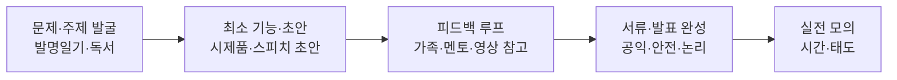
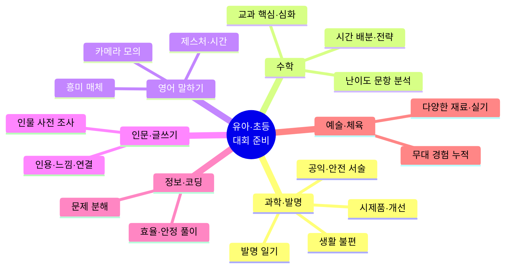

# 유아·초등 분야별 전국 경연·공모: URL · 세부 준비 · 수상 사례 종합

> **목적:** 전국 단위 준비를 **단기 수상 집착**이 아니라, **현재 수준 파악 · 잠재력·사고력 확장 · 학습 자신감**을 위한 **장기 성장**으로 설계할 때 참고합니다.  
> **범위:** 유아(만 5~7세 전후)·초등 저학년(1~3)·초등 고학년(4~6)을 구분하되, 대회마다 **참가 연령·학년**을 반드시 **해당 연도 공식 공고**로 확인하세요.

---

## 문서 사용 전 필수 안내

- **URL·일정·응시료·분량 규정은 매년 변경**될 수 있습니다. 본 문서의 링크는 **참고용**이며, 접수 전 **주최 기관 공지**를 최종 기준으로 삼으세요.
- **유아**는 대부분의 **학생 대상 경시·발명 본선**에 직접 해당되지 않거나, **별도 유아부**만 있는 대회(영어 말하기 등) 위주로 선택하는 것이 일반적입니다.
- 수상 사례 일부는 **보도자료·학교 소식·대회 홈페이지**에 기반한 **발췌 예시**입니다. 동일 작품명이 매년 반복되지는 않습니다.

---

## 1. 한눈에 보는 연령·분야 매트릭스

| 분야 | 유아에서의 의미 | 초등 저학년(1~3) | 초등 고학년(4~6) |
|------|----------------|------------------|------------------|
| 과학·발명 | 관찰·표현·안전한 만들기 습관 | 생활 불편 발견 → 간단 원리·시제품 | 서류·시제품·발표까지 일관된 스토리 |
| 수학 | 수 감각·패턴·말로 설명하기 | 교과 핵심+심화, 문제 읽기 훈련 | 경시형 시간·난이도 대비, 전략적 풀이 |
| 영어 말하기 | 짧은 문장·리듬·듣기 모방 | 주제 말하기·카메라 연습 | 시간 제한·제스처·구성력 |
| 인문·글쓰기 | 말로 감상·그림 일기 | 독후감 구조(인용·느낌·나와 연결) | 인물·사상 사전 조사, 논지 정리 |
| 정보·코딩 | 순서·조건 말하기(언플러그드) | 블록 코딩·간단 논리 | 알고리즘 사고, 효율적 풀이 습관 |
| 예술·체육 | 재료 탐색·신체 리듬 | 표현 다양성·참가 경험 | 암보·실기·무대 적응 누적 |

---

## 2. 분야별 공식·참고 URL 빠른 색인

아래 표는 **대표적으로 자주 검색되는 대회**의 **공식 또는 안내 페이지** 예시입니다. 사이트 구조 변경 시 404가 될 수 있으니, 키워드로 **재검색**하세요.

| 분야 | 대회·행사(예시명) | 공식·참고 URL | 비고 |
|------|-------------------|---------------|------|
| 과학·발명 | 전국학생과학발명품경진대회 | https://www.science.go.kr (국립중앙과학관 → 행사·발명대회 메뉴) | 통합검색·수상작 영상 등 게시 |
| 과학·발명 | 교육허브 등 연계 안내(과거) | http://eduhub.or.kr | 공고 연도별 상이, 교차 확인 권장 |
| 수학 | HME 해법수학 학력평가 | https://hme.chunjae.co.kr | 천재교육 계열 안내 |
| 수학 | 전국 영어·수학 학력경시대회(성대경시 통칭) | https://test.edusky.co.kr | 글로벌영재학회 주관 안내(공고 확인) |
| 수학 | AMC 8 (국제) | https://maa.org/math-competitions/amc-8 | MAA 공식 개요 |
| 수학 | AMC 한국 응시 안내 | https://kgsea.org/amckorea | 한국영재교육평가원(KGSEA) 계열 안내 |
| 수학 | AMC 접수(관행상 많이 쓰는 도메인) | http://www.amctest.org | **접수·규정은 매년 공지대로** |
| 영어 | 코리아 헤럴드 영어 스피치 등 | https://www.heraldenglish.com | 헤럴드 계열 영어대회·창작 쓰기 안내 |
| 영어 | 유니버설 영어 스피치(글로벌스피치) | https://globalspeech.kr | 상업·민간 아카데미 주최 예시 |
| 영어 | 글로벌국제영어말하기(민간 예시) | https://www.geeacademy.com | 주최·규정은 공고 필수 확인 |
| 영어 | SPEAKCUP(유아·초등 스피치) | http://thespeechcontest.com | 부문·일정은 공고 확인 |
| 영어 | 세계예능교류협회(WAAEO) 영어 말하기 | http://www.waaeo.or.kr | 연도·장소·참가비는 공고 필수 |
| 영어 | 대한 전국영어말하기대회(민간 예시) | http://englishspeech.co.kr | ZOOM·유튜브 등 방식은 공고 확인 |
| 인문 | 2026 창원의 책 독후감·독후화 등 | https://lib.changwon.go.kr/cl/libcw/report.html | 창원시도서관사업소 안내 |
| 인문 | 용인 전국 독서감상문(지자체 사례) | https://lib.yongin.go.kr (메뉴·공고 검색) | **전국민 참여**로 확대된 사례(보도 기준) |
| 인문 | 세종의 나라 독서감상문(교보문고 등) | https://store.kyobobook.co.kr (이벤트·공지) | 연도별 이벤트 번호 상이 |
| 인문 | 예스24 어린이 독후감(소년한국일보 등 보도) | YES24·소년한국일보 공지 | **접수 게시판 URL은 매년 변경** |
| 인문 | 지학사 월간 독서평설 전국 어린이 독후감 | 지학사·한국학교사서협회 공지 | 네이버 폼 등 연도별 상이 |
| 인문 | 도산 안창호 글짓기·독후감 | 도산안창호기념사업회·기념관, 흥사단 등 **각 공고** | **주최가 복수**—부문·지역 확인 |
| 정보 | 한국정보올림피아드(KOI) | https://koi.or.kr | 초·중·고 부문, 일정·형식 공지 |
| 정보 | 한국 비버 챌린지(Bebras) | https://www.bebras.kr | 컴퓨팅 사고력, 연령군 문항 상이 |
| 정보 | 비버 스쿨 등 안내 | https://beaverschool.bebras.kr | 교육용 안내 페이지 예시 |

---

## 3. 과학 탐구 및 발명

### 3.1 전국학생과학발명품경진대회

| 항목 | 내용 |
|------|------|
| **성격** | 생활 문제를 과학·기술로 해결한 **발명품**을 응모·심사하는 대표적 학생 발명 경진. |
| **참고 URL** | 국립중앙과학관: https://www.science.go.kr — 메뉴에서 **「전국학생과학발명품경진대회」** 통합검색·공지 확인. |
| **문의(예시, 변경 가능)** | 과학관 공지에 안내된 **과학교육과** 등(과거 보도 기준 042-601-7736 등—**최신 공지 확인**). |
| **대상(일반적)** | **전국 초·중·고 재학생** 등(연도별 요강 필수). **유아 직접 응모**는 구조상 드묾. |
| **평가 경향** | 거창한 이론보다 **일상 불편 해결**, **구현 가능성**, **기록·설명의 논리성**, **안전·윤리·공익**을 함께 서술할수록 설득력이 높아지는 편. |

#### 세부 준비 과정(권장 로드맵: 약 1년 전후)

| 단계 | 기간(가이드) | 활동 | 산출물 |
|------|--------------|------|--------|
| ① 문제 발굴 | 2~3개월 | 가정·학교·놀이터에서 **불편·위험·비효율** 관찰 | **발명 일기**(날짜·상황·스케치·가설) |
| ② 아이디어 선별 | 2~4주 | 비용·시간·안전성 기준으로 **1안 집중** | 선정 이유 5줄 요약 |
| ③ 원리·자료 조사 | 1~2개월 | 교과서·과학관 자료·유사 특허·제품 | 비교 표(기존 방식 vs 나의 방식) |
| ④ 시제품 V1 | 1~2개월 | **저가 재료**로 최소 기능 구현 | 사진·짧은 동영상·실패 기록 |
| ⑤ 개선 루프 | 반복 | 내구·사용성·안전(둥근 모서리 등) | 버전별 메모(V1→V2…) |
| ⑥ 서류·발표 | 대회 전 | **사회적 안전망·환경·취약계층** 등과 연결 가능하면 논리적으로 기술 | 연구 보고서 초안·발표 대본 |
| ⑦ 실전 | 심사일 | 시연 동선·예비 부품·질문 대비 | 체크리스트 |

**발명 일기 예시 항목(템플릿):** 날짜 / 누가 / 어디서 / 무엇이 불편했는지 / 기존 해결 시도 / 나의 아이디어 한 줄 / 다음 실험.

#### 이전 수상작·보도 사례(참고용 발췌)

아래는 **교육적 참고**를 위한 **혼합 예시**(사용자 제공 일반 사례 + **보도에 등장한 작품명**). 매년·매 지역 결과와 다릅니다.

| 구분 | 작품(아이디어) 요지 | 시상·출처 유형 |
|------|---------------------|----------------|
| 생활 안전 | 지진 발생 시 **자동 탈출 가능한 이중 문** | 대통령상(일반적으로 알려진 과거 사례군) |
| 생활 편의 | **첫 장이 깔끔히** 나오는 휴지 관련 발명 | 국무총리상(사례군) |
| 생활 편의 | **셀프 리턴** 우산 커버 | 최우수상(사례군) |
| 위생·생활 | 세균·위생 고려 **빨래 바구니** 개선 | 특상(사례군) |
| 농업·지역 | **신개념 감귤 수확 가위** 등 | 2025년 보도의 초등 수상작 예시 |
| 안전 | **욕실**에서 미끄럼·안전을 고려한 **발판** | 2025년 보도 예시 |
| 교통 | **소리·빛**을 활용한 **교통안전 깃발** | 지역 보도의 특상 예시 |
| 생활 | **흡착·회전**이 가능한 **안전 컵 손잡이** | 지역 보도의 우수상 예시 |

**국립중앙과학관** 사이트의 **수상작품 설명 영상**을 보면, **문제 정의 → 구조 → 시연 → 기대 효과**의 말하기 패턴을 익히기 좋습니다.

#### 유아·초등 나누기

- **유아:** 직접 출전보다 **관찰 그림·부모와 안전 실험·짧은 발명 일기**로 “문제→시도→다음” 습관만 심습니다.
- **초등 저학년:** 한 가지 생활 문제에 **작은 시제품+사진 기록**까지가 목표.
- **초등 고학년:** **개선 버전·데이터(간단 실험)**와 **공익 서술**까지 연결.

---

## 4. 수학

### 4.1 HME 해법수학 학력평가

| 항목 | 내용 |
|------|------|
| **성격** | 전국 규모 **교과 기반** 수학 학력평가에 가까운 시험(민간 주관—요강 확인). |
| **참고 URL** | https://hme.chunjae.co.kr (천재교육 계열 **HME** 안내 페이지—도메인·경로 변경 시 검색). |
| **문항·시간(과거 안내 사례)** | 총 **25문항**, **60분** 등으로 알려진 바 있음—**당해 요강** 확인. 영역: 계산·이해·추론·문제해결 등으로 **소개되는 경우**가 많음. |
| **난이도 분포(소개 사례)** | 앞번호 **기본**, 뒤쪽 **응용·심화** 비중—**연도별 상이**. |

#### 세부 준비 과정

| 주차 루틴(예) | 내용 |
|---------------|------|
| 교과 동기화 | 학교 진도와 맞춰 **개념 카드**(정의·예시·실수 포인트) 작성 |
| 오닝 중심 | 틀린 문제만 **“한 줄 규칙”**으로 정리(예: “나눗셈은 단위 통일 후 계산”) |
| 시간 감각 | 60분 풀세트 **월 1~2회**, 나머지는 **유형별 15분 스프린트** |
| 심화 | 24~25번 유형은 **과거 기출·유사문항**으로 패턴화 |

**유아:** HME 본시험보다 **수 퍼즐·보드게임·패턴 찾기**로 사전 준비.  
**초등 고학년:** 상위권 시 **HMC 경시** 등 연계 자격·할인 안내가 **소개된 적 있음**(당해 공고 확인).

---

### 4.2 성균관대학교 전국 영어·수학 학력경시대회(통칭: 성대경시)

| 항목 | 내용 |
|------|------|
| **성격** | **수학** 또는 **영어** 중 선택·병행 가능한 형태로 알려짐(연도별 요강 확인). |
| **참고 URL** | https://test.edusky.co.kr — **원서·일정·학년** 확인. |
| **시험 시간(보도 예시)** | 수학 **90분**, 영어 **70분** 등—**당해 공고** 확인. |
| **특징** | **정답률이 낮은 변별 문항**이 포함될 수 있어, **교과형 평가**와 다른 **사고력·추론** 대비가 필요하다는 **준비 전략**이 공유됨. |

#### 세부 준비 과정(수학 트랙 중심)

1. **유형 맵 만들기:** 기하·확률·규칙성·문자식 등 대단원별로 **“자주 함정인 조건”** 목록화.  
2. **난이도 스텝업:** 기본 100% 정확도 확보 후, **시간 제한 없이** 난문항 분석 → 이후 **타이머 적용**.  
3. **풀이 말하기:** 풀이를 **말로 설명**하게 하면 추론 구멍이 드러남.  
4. **영어 트랙**을 병행할 경우: **지문 길이·어휘**에 맞춘 **속독·오답 유형**(세부 정보·추론) 훈련.

**유아:** 본 경시 대상 학년 **공고 필수**.  
**초등:** **고학년**부터 비중을 두는 가정이 많으나, **초등 저학년 응시** 가능 여부는 **매년 요강**으로 확인.

---

### 4.3 AMC 8 (미국 수학 경시, 국내 응시)

| 항목 | 내용 |
|------|------|
| **성격** | **8학년 이하**, **25문항**, **40분**—국제적으로 널리 쓰이는 경시. |
| **공식(국제)** | https://maa.org/math-competitions/amc-8 |
| **한국 응시 안내(참고)** | https://kgsea.org/amckorea , 접수 관행상 http://www.amctest.org 등이 언급됨—**당해 KGSEA·공지** 확인. |
| **준비 핵심** | **전체를 한 바퀴**한 뒤 **쉬운 문제부터 확정 정답** 처리, 남은 시간에 중상 난이도 집중. **문장을 식으로 정리**하는 훈련. |

#### 세부 준비 과정(12주 예시)

| 주 | 초점 | 실행 |
|----|------|------|
| 1~4 | 기본 | 대수·기하·확률·패턴 **핵심 공식 카드** |
| 5~8 | 기출·모의 | **40분 타이머** 고정, **오답만** 재풀이 |
| 9~10 | 전략 | **1~15번 속도·정확도**, **16~25번 시도 순서** 개인화 |
| 11~12 | 실전 | 주 2회 풀모의, 컨디션·오답 패턴 점검 |

**초등:** **고학년** 응시가 흔하나, **조기 응시** 사례도 있음—아이 수준·스트레스 고려.

---

## 5. 영어 말하기

### 5.1 코리아 헤럴드 영어 스피치 대회(KHESC)

| 항목 | 내용 |
|------|------|
| **성격** | 역사가 긴 **영어 말하기** 대회로 널리 알려짐. |
| **참고 URL** | https://www.heraldenglish.com — 일정·부문·접수. |
| **문의(사이트 안내 예시)** | 공지에 기재된 이메일 등(예: koreaherald_english@naver.com 언급 사례—**변경 가능**). |
| **부문** | 유치·초등·중등 등 **세분**—**당해 공고** 확인. |

#### 세부 준비 과정

1. **채점 기준 출력:** 유창성·내용·태도 등 **비중** 확인.  
2. **스크립트:** 도입-본론-결론 **고정 문장** + 나머지는 **핵심 키워드만**.  
3. **카메라 모의:** 스마트폰으로 **정면·전신** 촬영, **시선·손 위치** 점검.  
4. **시간:** 제한 **10~15초 여유** 두고 연습(초과 감점 대비).  
5. **발음:** 좋아하는 **영상**으로 리듬·강세 모방(의미 전달 우선).

---

### 5.2 글로벌·민간 영어 말하기(예: 글로벌스피치, GEE 아카데미 등)

민간·아카데미 주최 대회는 **이름이 유사한 행사가 복수**일 수 있습니다.

| 항목 | 내용 |
|------|------|
| **예시 URL** | https://globalspeech.kr (유니버설 영어 스피치 등 안내 예시), https://www.geeacademy.com (글로벌국제영어말하기 등 안내 예시) |
| **준비 시 주의** | **주최사·참가비·환불·심사 위원** 공개 여부를 공고에서 확인. **유창성 비중**이 높다는 **소개**가 있는 대회는 발음·리듬 비중을 올림. |

**GSA(글로벌 스피치 협회) 계열**로 소개되는 대회는 **유창성·전달력·정확성·표현력·자신감** 등 배점 예시가 **블로그·안내**에 올라오는 경우가 있으나, **실제 채점표는 공식 PDF**를 확보하세요.

---

### 5.3 SPEAKCUP(스피컵) 등 유아·초등 특화

| 항목 | 내용 |
|------|------|
| **참고 URL** | http://thespeechcontest.com |
| **특징(일반적)** | **유아부·초등 저·고학년** 등으로 나뉘는 **스피치 페스티벌형** 사례가 많음—**시간·주제(자유/지정)**는 공고 확인. |

#### 세부 준비 과정(유아 vs 초등)

- **유아(48개월~저학년 전후 등, 공고 기준):**  
  - 문장은 짧게, **후렴구·리듬** 있는 스크립트.  
  - **인형 청중**, 부모 **리액션** 고정.  
- **초등:**  
  - **1분/2분** 등 제한에 맞춘 **버전 2개**(짧은 버전·풀 버전).  
  - **제스처:** 허리~머리 사이, **의미 있는 동작**만(과하면 감점인 대회 있음).

---

### 5.4 세계예능교류협회(WAAEO) 영어 말하기 대회

| 항목 | 내용 |
|------|------|
| **참고 URL** | http://www.waaeo.or.kr (협회 소개·대회 안내 페이지—경로는 연도별 상이할 수 있음) |
| **성격(안내에 따른 요지)** | 대한민국 학생 대상 **영어 말하기**로 소개되는 경우가 많으며, **국제 친선·문화 소개** 등을 목적으로 안내된 사례가 있음. |
| **참가 대상(공고 확인)** | **유치부·초·중·고·대학부** 등으로 나뉘어 안내된 해가 있음. **해외 거주 이력**이 있는 경우 **별도 부문·자격**이 붙는 공고가 있음—**세부 요강 필수**. |
| **발표 시간(소개 사례)** | 유치·초등 저학년 **1분 30초**, 초등 고학년·중등 **2분** 등으로 안내된 예가 있음. |
| **심사(소개 사례)** | **원고·내용이 심사에 포함되지 않고**, 발표 정도·발음·감정·자신감·억양·태도 등을 본다는 **안내**가 있는 해가 있음—**실제는 공식 채점표** 확인. |
| **접수(예시)** | 이메일 접수 안내(예: waaeo@naver.com 언급 사례) 등—**스팸·사칭 주의**, **공식 공지만** 신뢰. |

#### 세부 준비 과정

1. **스피치 vs 스크립트:** “내용 미평가”형이면 **짧고 외우기 쉬운 문장**으로 **발음·호흡·감정선**에 자원 배분.  
2. **무대:** 상명아트센터 등 **특정 홀**이 안내된 해가 있음—**발성**(끝까지 전달) 연습.  
3. **영어권 거주 이력:** 해당 여부를 **먼저** 공고에서 확인해 자격 미스매치 방지.

---

### 5.5 대한 전국영어말하기대회 등(온라인·민간)

| 항목 | 내용 |
|------|------|
| **참고 URL** | http://englishspeech.co.kr |
| **성격(일반적)** | **ZOOM·유튜브 생중계** 등 **비대면**으로 진행된다는 **소개**가 있는 민간 대회군—**플랫폼·시간대**는 공고 확인. |
| **준비** | 네트워크·조명·카메라 각도·**배경 소음**까지 포함한 **리허설** 필수. SPEAKCUP·헤럴드 대회와 동일하게 **시간 초과 방지** 훈련을 병행. |

---

## 6. 인문학 및 글쓰기

### 6.1 창원의 책 독후감·독후화 전국 공모전

| 항목 | 내용 |
|------|------|
| **참고 URL** | https://lib.changwon.go.kr/cl/libcw/report.html — **독후감 공모전 소개** 등. |
| **특징(보도·안내 예시)** | **창원의 책** 선정 도서 범위 내에서 응모하는 형태가 많음—**연도별 선정 목록** 필수. |
| **분량(예시)** | 초등부 **A4 1장 이상** 등—**당해 요강** 확인. |
| **독후화** | **6세~초3** 등 연령 표기가 있는 경우—**공고** 확인. |

#### 세부 준비 과정

1. **선정 도서 2권 읽기:** 한 권은 **정서**, 한 권은 **비문학** 등 균형.  
2. **메모:** 인물·갈등·나에게 오는 질문 3가지.  
3. **초안:** 인용(짧게)→감상→**현재 나·사회와 연결**.  
4. **퇴고:** **글자 수·글꼴·제출 형식** 공고와 **완전 일치** 확인.  
5. **표절 방지:** 인용은 출처 표기, AI 사용 허용 여부는 **공고** 확인.

---

### 6.2 용인 전국 독서감상문·기타 지자체 전국 규모

| 항목 | 내용 |
|------|------|
| **성격** | 지자체 주최로 **전국민·전국 참여**로 확대된 **독서감상문** 사례(용인 등). |
| **URL(참고)** | 용인시 도서관: https://lib.yongin.go.kr — 메뉴에서 **「독서감상문 대회」** 등으로 검색(프로그램 번호는 **연도별로 URL이 바뀔 수 있음**). |
| **준비(보도에 따른 예시)** | **선정 도서 다수 중 1권** 선택, 부문 **초등저학년·초등고학년** 등으로 나뉜 해가 있음—**당해 선정 목록·분량** 확인. |
| **준비** | 부문(초등 저·고 등)·**지정 도서 여부**·분량을 **먼저** 확정한 뒤 글 구성. |

---

### 6.3 세종의 나라·교보문고 연계 전국민 독서감상문(예시)

| 항목 | 내용 |
|------|------|
| **참고** | 문화체육관광부 후원 **대한민국 독서대전** 등과 연계된 **대규모 감상문** 행사가 **교보문고 이벤트**로 안내된 사례 있음. |
| **URL** | https://store.kyobobook.co.kr 내 **이벤트 공지** 검색(연도별 번호 상이). |

---

### 6.4 예스24 어린이 독후감 대회(소년한국일보 등 보도)

| 항목 | 내용 |
|------|------|
| **성격** | **유치원생+초등** 대상으로 보도된 사례가 많음—**자유 도서**인 해가 있음. |
| **URL** | YES24 **이벤트/공지**, 소년한국일보 **알림** 기사—**매년 갱신**. |
| **분량(보도 예시)** | 초등 저학년 **300자 이상**, 고학년 **600자 이상** 등 소개된 해 있음. |

#### 세부 준비 과정

- **유치·저학년:** 그림+짧은 글, **글자 수**보다 **진짜 감상 한 줄**이 드러나게.  
- **고학년:** **한 가지 주제 문장**(예: “이 책은 ○○에 대해 묻는다”) 아래 모아 쓰기.

---

### 6.5 지학사 월간 독서평설 전국 어린이 독후감(한국학교사서협회 등)

| 항목 | 내용 |
|------|------|
| **성격** | **지정 도서 다수** 중 선택, **800자 내외** 등으로 안내된 해 있음. |
| **URL** | 지학사·**한국어린이출판연합** 카페·공지—**연도별 검색**. |

---

### 6.6 도산 안창호 글짓기·독후감(주최 복수 주의)

| 항목 | 내용 |
|------|------|
| **성격** | **서울시·기념사업회·흥사단** 등 **주최가 다른** 공모가 공존—**부문(초등/중등)·지역** 확인 필수. |
| **참고 URL 예시** | 부산 흥사단 게시판 등: https://ykabs.or.kr (제2회 독후감 경진대회 요강 **예시**—중·고 대상으로 된 해 있음). |
| **준비** | 인물 공모전이면 **연보·저서·시대상** **타임라인**을 아이와 함께 그린 뒤, **한 가지 가치**(독립·교육·교민 의식 등)에 글을 매칭. |

---

## 7. 정보과학 및 코딩

### 7.1 한국정보올림피아드(KOI)

| 항목 | 내용 |
|------|------|
| **공식 URL** | https://koi.or.kr |
| **성격** | **초등·중등·고등** 부문이 있는 **국내 대표 올림피아드** 계열(공고 확인). |
| **일정·형식** | 연도별로 **1차·2차**, **온라인**, **비버 문제 포함 교시** 등으로 안내된 해 있음—**당해 가이드** 필수. |

#### 세부 준비 과정

1. **언플러그드:** 일상 알고리즘(라면 끓이기 순서)을 **순서도**로 그리기.  
2. **블록 코딩:** 변수·조건·함수 개념을 **스크래치** 등으로 시각화.  
3. **텍스트 언어:** **입력 범위·경계**(0개, 1개, 최대)부터 점검하는 습관.  
4. **실전:** 어려운 알고리즘보다 **안 맞는 테스트 케이스**를 줄이는 쪽이 초등에서 유리한 경우 많음.

#### “이전 수상” 참고 방법

KOI는 **개인 작품명**보다 **등급·통계** 중심 공개가 일반적입니다. **과거 문제**는 공지에 안내된 **온라인 저지**(예: https://www.acmicpc.net — **KOI·대회별 태그**는 공식 안내 확인)로 **난이도 체감**을 할 수 있습니다. 초등은 **입문 난이도**부터 시간을 넉넉히 잡는 것이 좋습니다.

---

### 7.2 한국 비버 챌린지(Bebras)

| 항목 | 내용 |
|------|------|
| **공식 URL** | https://www.bebras.kr |
| **성격** | **사전 지식 최소**로도 참여 가능하다는 취지의 **컴퓨팅 사고력** 축제형 평가. |
| **대상** | **초1~고3** 등 연령군 구분 문항—**공고** 확인. |
| **준비** | **이진·정렬·그래프·일상 알고리즘** 퍼즐을 **게임처럼** 풀기. **연습하기** 기간이 별도로 안내된 해 있음. |

---

## 8. 예술 및 체육

### 8.1 어린이 미술대회·지자체 시상

| 항목 | 내용 |
|------|------|
| **성격** | **김해시장상** 등 **지자체·기관**명이 붙는 **전국 또는 광역** 규모 공모가 많음. |
| **URL** | **“어린이 미술대회 2026”** 등으로 **주최명+연도** 검색—위원회·미술관 공고. |

#### 세부 준비 과정

- **주제 해석 스케치 3종** 후 하나 선택.  
- **재료 테스트:** 마커·크레파스·콜라주 **시안**을 작게.  
- **작품 설명문:** 창작 의도·사용 재료(공모전 요구 시).

---

### 8.2 부여백제 전국 국악 경연대회 등

| 항목 | 내용 |
|------|------|
| **성격** | **암보 연주**·무대 매너가 중요한 **실기 중심**. |
| **URL** | **“부여 백제 국악 경연”** 공식 검색—**부서·연령** 확인. |

#### 세부 준비 과정

- **소절 단위 반복** → **전곡 연결** 순서.  
- **무대 리허설:** 마이크·무대 중앙·인사 **동선** 고정.

---

### 8.3 대교 눈높이 캐릭터 공모전 등

| 항목 | 내용 |
|------|------|
| **성격** | **캐릭터 IP** 공모—**캐릭터 시트**(정면·측면·표정) 제출 요구가 흔함. |
| **URL** | **“눈높이 캐릭터 공모”** 연도별 검색. |

---

### 8.4 보건복지부 장관상 등 음악 경연

| 항목 | 내용 |
|------|------|
| **성격** | 부처·협회 주최 **합창·개인기악** 등—**부문·학년**이 세분. |
| **준비** | **신체 컨디션·악보 암기·앙상블 밸런스**(단체). |

---

## 9. 도식: 장기 준비 흐름(권장)

---

## 10. 도식: 분야별 전략 요약

---

## 11. 전략 체크리스트(실행용)

| 단계 | 할 일 | 메모 |
|------|--------|------|
| ① 선택 | **참가 자격·일정·비용** 공고 확인 | 유아부는 **월령** 표기가 엄격한 경우가 많음 |
| ② 기준 | 해당 대회 **채점 기준** 출력 | 영어는 **유창성·구성·태도** 가중치 확인 |
| ③ 루틴 | 주 2~3회 **짧고 빈번한 연습** | 장시간 한 번보다 효과적인 경우가 많음 |
| ④ 기록 | **오답·개선 한 줄**만 남기기 | 부담을 줄여 지속률을 높임 |
| ⑤ 실전 | **의상·시간·장소**까지 모의 | 심리적 안정에 기여 |

---

## 12. 부록 A: 12개월 준비 캘린더(예시·과학·발명·글쓰기 중심)

**전제:** 목표 대회일을 **D-Day**로 두고 역산합니다. 아래는 **초등 고학년·가족 협력**을 가정한 **템플릿**입니다.

| 월 | 과학·발명 | 수학(경시) | 영어 스피치 | 독후감·글쓰기 |
|----|-----------|------------|-------------|----------------|
| D-12 | 발명 일기 시작(주 3회) | 교과 개념 정리 주1 | 관심 매체 듣기 매일 10분 | 월 2권 독서+한 줄 메모 |
| D-9 | 아이디어 3안 스케치 | 기출·유형 주2 | 스크립트 초안 1분 버전 | 인용·감상 형식 익히기 |
| D-6 | 시제품 V1·사진 | 모의고사 월2 | 카메라 모의 주2 | 초등 1차 초안 |
| D-3 | 개선 V2·V3·안전 점검 | 약점 유형만 | 제스처·시간 실측 | 퇴고·글자수 점검 |
| D-1 | 시연 동선·예비 부품 | 컨디션·도구 | 드레스·발성 | 최종 제출 형식·파일명 |

**유아:** 위 표의 **과학·발명**은 “가족과 안전하게 해보기”, **수학**은 “보드게임·수학 퍼즐”, **영어**는 “짧은 챈트”, **글**은 “말로 감상” 정도로 **강도만 낮춥니다.**

---

## 13. 부록 B: 대회별 제출·실전 체크리스트(상세)

### B.1 과학발명·탐구

| 체크 | 항목 |
|:----:|------|
| ☐ | **응모 자격**(학년·팀 구성·지도교사 필요 여부) |
| ☐ | **시제품** 반입·전시 규격(크기·전원·안전) |
| ☐ | **연구 보고서** 페이지·글꼴·도표 형식 |
| ☐ | **개인정보** 마스킹·초상권(사진·영상) |
| ☐ | **시연** 2분·5분 등 시간 제한 대비 |
| ☐ | **공익·안전** 문단(사회적 가치) 초안 포함 여부 |

### B.2 수학 경시

| 체크 | 항목 |
|:----:|------|
| ☐ | **시험 도구**(연필·컴퍼스·시계) 허용 범위 |
| ☐ | **답안지** 마킹 방식(OMR·서술) |
| ☐ | **오답 처리**(감점 여부) |
| ☐ | **재시험·결시** 규정 |

### B.3 영어 말하기

| 체크 | 항목 |
|:----:|------|
| ☐ | **시간**(초과 시 감점·실격) |
| ☐ | **원고 제출** 필요 여부·암기 허용 범위 |
| ☐ | **의상**(교복·자유) |
| ☐ | **배경음악·소품** 허용 여부 |
| ☐ | **온라인**일 경우 녹화·업로드 마감 |

### B.4 독후감·논술

| 체크 | 항목 |
|:----:|------|
| ☐ | **지정 도서** vs 자유 |
| ☐ | **글자 수·페이지**·행간·글꼴 크기 |
| ☐ | **필기 vs 타이핑** |
| ☐ | **제출** 방문·우편·웹·이메일 |
| ☐ | **저작권·표절·AI 사용** 문구 |

### B.5 정보·코딩

| 체크 | 항목 |
|:----:|------|
| ☐ | **시험 환경**(로컬·웹 IDE) |
| ☐ | **언어** 선택(C++/Python 등) |
| ☐ | **채점** 부분 점수·시간 제한 |

---

## 14. 부록 C: 수상·보도 사례를 학습 자료로 쓰는 방법

1. **작품명 암기**보다 **“어떤 불편을 어떤 원리로 풀었는지”** 한 줄로 요약하는 연습.  
2. **국립중앙과학관** 등 **수상작 영상**이 있으면 **문제 정의→구조→시연→기대효과** 순서를 노트에 옮김.  
3. **독후감**은 수상작 전문이 공개된 경우, **도입·전개·결론** 비율만 재구성해 **자기 글**에 적용.  
4. **수학**은 **상위권 경험담**보다 **자신의 오답 패턴** 통계가 장기적으로 더 큼.

---

## 15. 마무리: 바람직한 관점

전국 단위 준비는 **수상 여부**만이 아니라, **스스로 목표를 세우고 기록하고 개선하는 경험** 자체가 이후 학습 전반이 자산으로 남습니다.  
본 문서의 **URL·사례·분량**은 **참고용**이며, **접수·심사·시상의 최종 기준은 항상 해당 연도 주최 기관의 공식 공고**입니다.

---

*본 문서는 일반 안내용이며, 특정 대회의 공식 규정·저작권·상표 사용을 대체하지 않습니다.*
