# 프뢰벨 교육 커리큘럼: 아이의 미래를 설계하는 체계적 교육 로드맵

## 목차
1. [프뢰벨 vs 경쟁 교육업체 비교](#1-프뢰벨-vs-경쟁-교육업체-비교)
2. [한국 엘리트 양성 교육 시스템 분석](#2-한국-엘리트-양성-교육-시스템-분석)
3. [글로벌 교육 패러다임의 변화: AI 시대의 교육](#3-글로벌-교육-패러다임의-변화-ai-시대의-교육)
4. [유아·초등 창의교육의 결정적 중요성](#4-유아초등-창의교육의-결정적-중요성)
5. [프뢰벨의 리터러시 교육 강점](#5-프뢰벨의-리터러시-교육-강점)
6. [아이의 커리어 패스 설계](#6-아이의-커리어-패스-설계)

---

## 1. 프뢰벨 vs 경쟁 교육업체 비교

### 1.1 주요 교육업체 비교표

| 구분 | 프뢰벨 | 웅진씽크빅 | 구몬학습 | 재능교육 |
|------|--------|-----------|---------|---------|
| **교육 철학** | 놀이 중심 창의교육 | 전자기기 활용 학습 | 반복 학습 중심 | 단계별 학습지 |
| **그림책 품질** | ⭐⭐⭐⭐⭐ 최상급 일러스트 | ⭐⭐⭐ 일반적 | ⭐⭐ 학습지 스타일 | ⭐⭐⭐ 학습지 스타일 |
| **리터러시 교육** | 문제 정의·비판적 사고 | 단순 독해력 | 문제 풀이 반복 | 단계별 문제 풀이 |
| **창의성 발달** | ⭐⭐⭐⭐⭐ | ⭐⭐⭐ | ⭐⭐ | ⭐⭐ |
| **놀이 통합성** | 높음 (생활 속 놀이) | 중간 (디지털 콘텐츠) | 낮음 (학습 중심) | 낮음 (학습 중심) |
| **부모 참여도** | 높음 (함께 읽기) | 중간 (기기 의존) | 낮음 (독립 학습) | 낮음 (독립 학습) |
| **포트폴리오 구축** | 우수 (작품·활동 기록) | 보통 | 미흡 | 미흡 |

### 1.2 프뢰벨만의 차별화된 강점

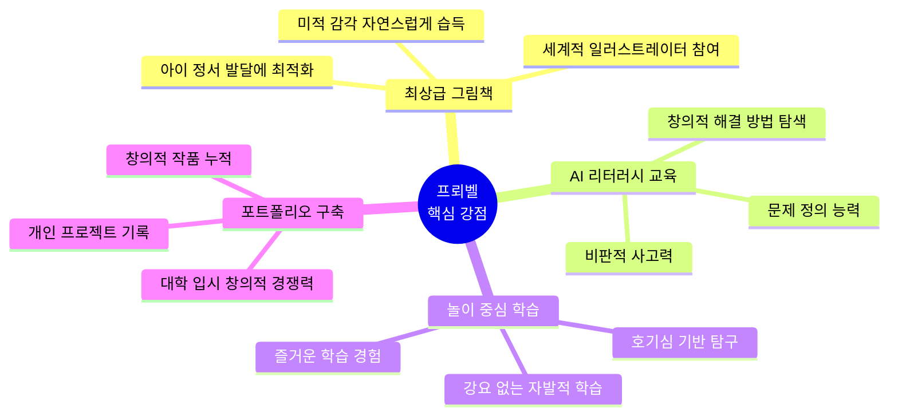

### 1.3 프뢰벨의 결정적 우위

#### ✅ **그림책 품질의 압도적 우위**
- **시각적 자극**: 프뢰벨 그림책은 단순한 학습 도구가 아닌 예술 작품 수준
- **정서 발달**: 아름다운 그림을 통해 감성과 미적 감각을 동시에 발달
- **상상력 확장**: 풍부한 색감과 창의적 구성이 아이의 상상력을 자극

#### ✅ **AI 리터러시 교육의 차별화**
- **문제 정의 능력**: 단순히 글을 읽는 것이 아니라 "왜?"라는 질문을 던지는 훈련
- **비판적 사고**: 이야기 속에서 문제를 발견하고 다양한 관점에서 바라보기
- **창의적 문제 해결**: 정답이 하나가 아닌 열린 결말, 토론을 통한 사고 확장

---

## 2. 한국 엘리트 양성 교육 시스템 분석

### 2.1 학년별 교육 현실 타임라인

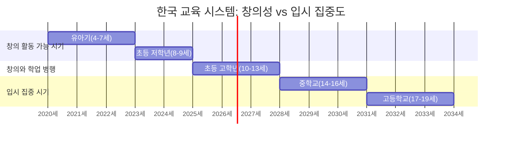

### 2.2 학년별 교육 특징과 전략

| 단계 | 나이 | 교육 현실 | 창의 활동 가능성 | 핵심 전략 |
|------|------|----------|----------------|----------|
| **유아기** | 4-7세 | 🟢 자유로운 탐색 시기 | ⭐⭐⭐⭐⭐ 최적기 | **놀이·창의 활동 최대화** |
| **초등 저학년** | 8-9세 | 🟢 여유 있는 학습 | ⭐⭐⭐⭐⭐ 황금기 | **개인 프로젝트 시작** |
| **초등 고학년** | 10-13세 | 🟡 학습량 증가 시작 | ⭐⭐⭐ 가능 | **포트폴리오 구축** |
| **중학교** | 14-16세 | 🔴 내신 관리 시작 | ⭐ 방학만 가능 | **기존 포트폴리오 활용** |
| **고등학교** | 17-19세 | 🔴 입시 총력전 | ⭐ 거의 불가능 | **기존 실적 정리·제출** |

### 2.3 엘리트 양성을 위한 단계별 커리어 패스

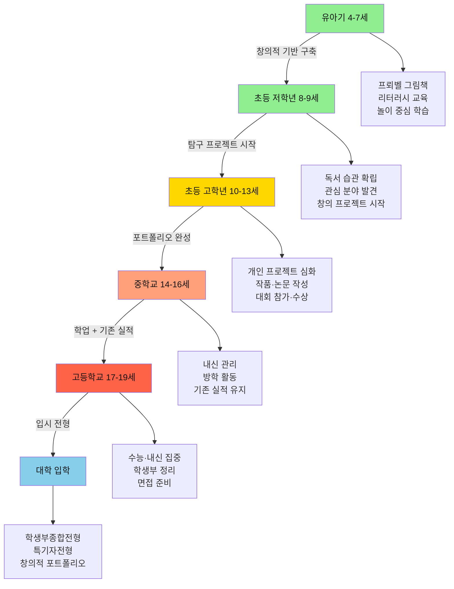

### 2.4 현실적 교육 전략 분석

#### 🚨 **중요한 현실 인식**

**중·고등학교는 방학 제외 거의 공부만 한다**
- 평일: 아침 7시 등교 → 밤 10시 귀가 (학원 포함)
- 주말: 모의고사, 학원, 자습
- 방학: 짧은 기간 + 선행학습으로 대부분 소진

#### ⚡ **따라서 유아·초등이 결정적으로 중요하다!**

---

## 3. 글로벌 교육 패러다임의 변화: AI 시대의 교육

### 3.1 전세계 교육의 대전환

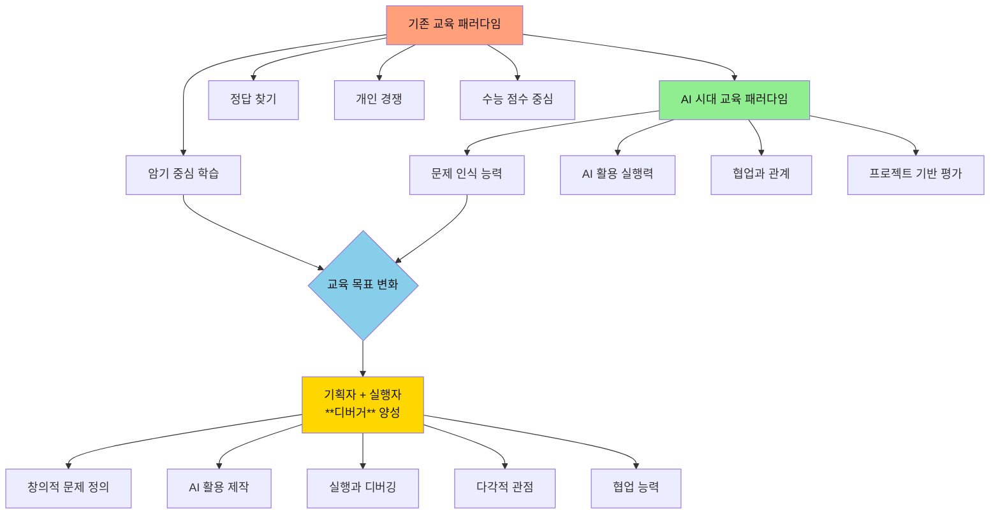

### 3.2 수능 시스템의 변화와 미래 교육 방향

#### 📊 **교육 평가 방식의 근본적 전환**

| 평가 요소 | 기존 교육 시스템 | AI 시대 교육 시스템 |
|---------|--------------|-----------------|
| **지식 평가** | ⭐⭐⭐⭐⭐ 암기력 중심 | ⭐⭐ 기본 지식만 확인 |
| **프로젝트 능력** | ⭐ 거의 평가 안함 | ⭐⭐⭐⭐⭐ 핵심 역량 |
| **AI 활용 능력** | ❌ 해당 없음 | ⭐⭐⭐⭐⭐ 필수 능력 |
| **협업 능력** | ⭐ 개인 평가만 | ⭐⭐⭐⭐ 관계 교육 중시 |
| **창의적 문제 인식** | ⭐⭐ 제한적 | ⭐⭐⭐⭐⭐ 가장 중요 |
| **실행과 디버깅** | ❌ 이론만 | ⭐⭐⭐⭐⭐ 실전 중심 |

#### 🌍 **가상 공간 프로젝트 교육의 부상**

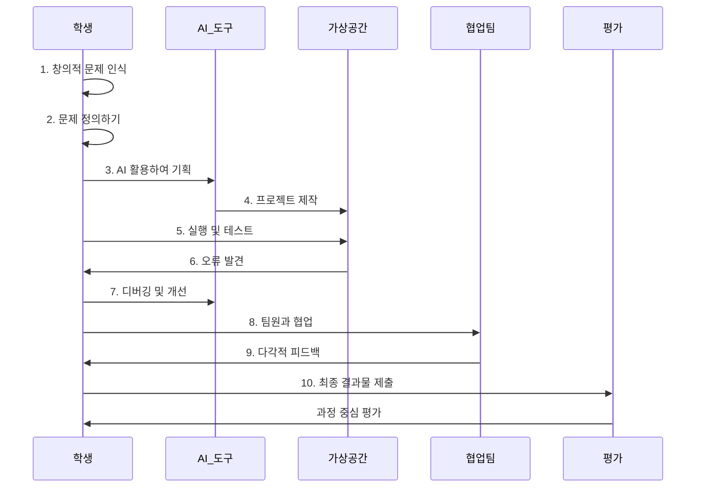

### 3.3 AI 시대 핵심 역량: 기획자 + 실행자(디버거)

#### 🎯 **미래 인재가 갖춰야 할 5대 핵심 능력**

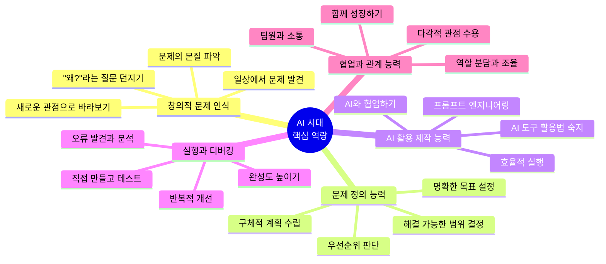

### 3.4 기업가 정신 교육의 중요성

#### 💡 **창의적 기업가 정신 = 문제 해결 능력**

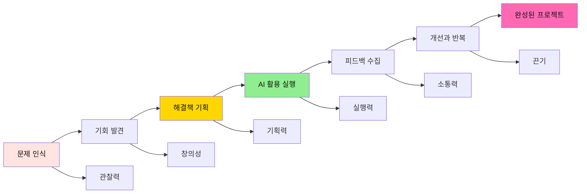

### 3.5 프뢰벨이 AI 시대 교육에 완벽히 부합하는 이유

#### 🌟 **프뢰벨 교육 → AI 시대 핵심 역량 연결**

| AI 시대 핵심 역량 | 프뢰벨 교육이 제공하는 것 | 구체적 효과 |
|---------------|---------------------|----------|
| **창의적 문제 인식** | 그림책 속 다양한 상황 접하기<br/>열린 결말로 "왜?"를 묻기 | 일상에서 문제를 발견하는 눈<br/>비판적 사고력 자연스럽게 발달 |
| **문제 정의 능력** | 이야기 속 갈등 분석하기<br/>명확한 질문 만들기 연습 | 복잡한 문제를 단순화<br/>핵심을 파악하는 능력 |
| **창의적 사고** | 다양한 관점의 이야기 경험<br/>상상력을 자극하는 그림 | 고정관념 없는 자유로운 발상<br/>독창적 아이디어 창출 |
| **시각과 공간 능력** | 최상급 일러스트 감상<br/>입체적 그림책 경험 | 다각적으로 바라보는 능력<br/>공간 지각력 향상 |
| **협업과 관계 능력** | 부모와 함께 읽고 토론<br/>놀이 문화로 관계 맺기 | 타인의 생각 존중하기<br/>소통과 협업의 기초 다지기 |
| **실행과 디버깅 마인드** | 만들기·그리기 활동<br/>시행착오 허용하는 환경 | 실패를 두려워하지 않기<br/>반복 개선의 자세 |

#### ✅ **프뢰벨의 독보적 강점: AI 시대 교육의 기초**

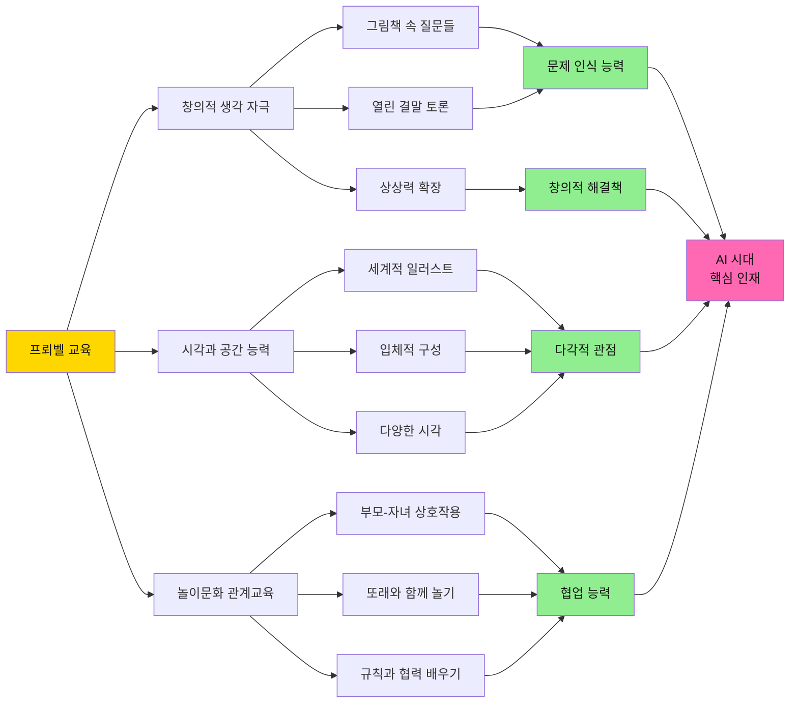

### 3.6 구체적 연결: 프뢰벨 활동 → AI 시대 역량

#### 📚 **프뢰벨 그림책으로 키우는 창의적 문제 인식**

**예시 활동**:
1. **문제 발견 연습**
   - 그림책 읽기: "이 상황에서 문제는 무엇일까?"
   - 일상 연결: "우리 생활에서도 비슷한 문제가 있을까?"
   - 다각적 분석: "다른 사람은 어떻게 생각할까?"

2. **문제 정의 훈련**
   - 명확하게 말하기: "정확히 무엇이 문제인가?"
   - 해결 가능성 판단: "우리가 해결할 수 있는 부분은?"
   - 목표 설정: "어떻게 만들면 좋을까?"

3. **창의적 해결책 찾기**
   - AI 활용 상상: "AI가 도와준다면 어떻게 만들까?"
   - 프로젝트 기획: "나만의 방법으로 만들어보자"
   - 실행과 개선: "만들고, 테스트하고, 더 나아지게"

#### 🎨 **책으로 키우는 시각과 공간 능력**

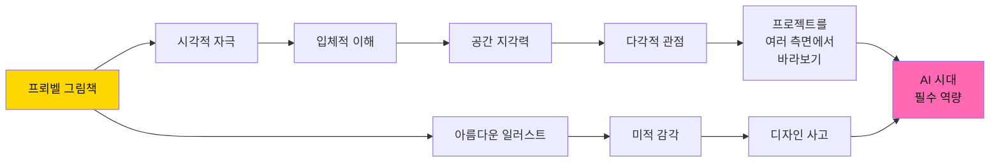

**구체적 효과**:
- 📐 **공간 인지**: 2D 그림에서 3D 상상력으로 확장
- 👁️ **시각적 분석**: 세부 요소를 놓치지 않는 관찰력
- 🎯 **다각적 사고**: 한 가지 문제를 여러 관점에서 분석
- 🎨 **미적 감각**: 완성도 높은 결과물을 만드는 안목

#### 🤝 **놀이문화로 키우는 협업과 관계 능력**

**프뢰벨 놀이 활동**:

| 놀이 유형 | 교육 효과 | AI 시대 역량 연결 |
|---------|---------|----------------|
| **함께 책 읽기** | 경청하기, 생각 나누기 | 팀 프로젝트에서의 소통 |
| **역할 놀이** | 타인 관점 이해하기 | 다양한 사용자 입장 고려 |
| **만들기 협업** | 역할 분담, 조율하기 | 프로젝트 팀워크 |
| **규칙 있는 게임** | 공정성, 규칙 준수 | 협업 규칙과 책임감 |
| **문제 해결 놀이** | 함께 답 찾기 | 집단 지성 활용 |

### 3.7 프뢰벨 교육이 AI 시대 교육의 완벽한 기초인 이유

#### 🎯 **핵심 메시지**

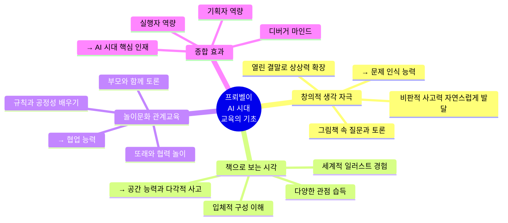

#### ⚡ **결론: 프뢰벨은 미래를 위한 최적의 투자**

- ✅ **창의적 문제 인식**: 그림책이 던지는 질문들로 자연스럽게 발달
- ✅ **시각과 공간 능력**: 최상급 일러스트로 다각적 관점 획득
- ✅ **협업과 관계**: 놀이문화를 통해 소통과 협력의 기초 다지기
- ✅ **AI 활용 기반**: 문제 정의와 실행 능력의 탄탄한 토대

**→ AI 시대에 필요한 모든 역량을 유아기부터 자연스럽게 키울 수 있습니다!**

---

## 4. 유아·초등 창의교육의 결정적 중요성

### 3.1 왜 유아·초등 시기가 결정적인가?

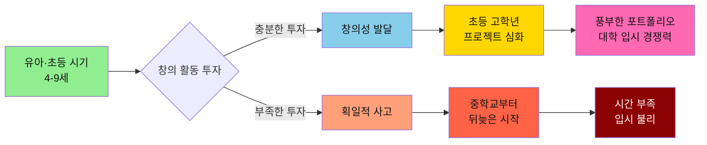

### 3.2 골든타임: 4-9세 창의 교육의 중요성

| 측면 | 유아·초등 시기의 장점 | 중·고등 시기의 한계 |
|------|---------------------|-------------------|
| **시간 여유** | ✅ 충분한 자유 시간<br/>✅ 탐구 활동 가능<br/>✅ 시행착오 허용 | ❌ 시간 부족<br/>❌ 학업 우선<br/>❌ 여유 없음 |
| **정신적 여유** | ✅ 스트레스 낮음<br/>✅ 호기심 최대<br/>✅ 실패 두려움 없음 | ❌ 입시 스트레스<br/>❌ 성적 압박<br/>❌ 실패 부담 큼 |
| **창의성 발달** | ✅ 뇌 발달 최적기<br/>✅ 상상력 풍부<br/>✅ 자유로운 사고 | ❌ 사고 패턴 고착<br/>❌ 정답 찾기 습관<br/>❌ 창의성 위축 |
| **포트폴리오** | ✅ 긴 시간 누적 가능<br/>✅ 다양한 시도<br/>✅ 진정성 있는 기록 | ❌ 단기간 억지 활동<br/>❌ 형식적 스펙<br/>❌ 진정성 부족 |

### 3.3 놀이 문화의 교육적 가치

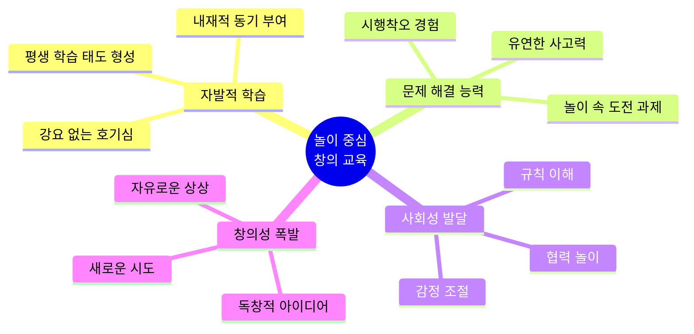

### 3.4 프뢰벨의 놀이 중심 접근법

#### 🎨 **놀이를 통한 학습의 원리**

1. **강요 없는 자연스러운 학습**
   - 그림책을 읽으면서 자연스럽게 질문 생성
   - "이 캐릭터는 왜 이렇게 했을까?" → 비판적 사고
   - "만약 내가 주인공이라면?" → 창의적 문제 해결

2. **생활 속 통합 학습**
   - 책에서 본 내용을 실제 놀이로 재현
   - 역할놀이를 통한 공감 능력 발달
   - 만들기·그리기로 표현력 확장

3. **부모-자녀 상호작용**
   - 함께 읽고 토론하는 시간
   - 아이의 생각을 경청하고 확장시키기
   - 정답이 아닌 과정을 중요하게 여기기

---

## 5. 프뢰벨의 리터러시 교육 강점

### 5.1 진정한 리터러시란?

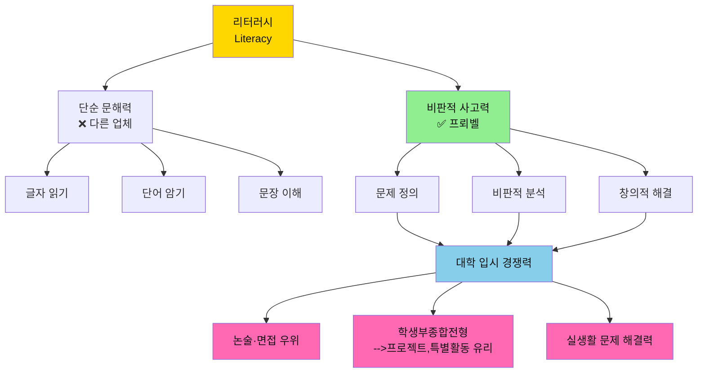

### 5.2 프뢰벨 그림책의 차별화된 교육 효과

#### 📚 **최상급 그림책의 힘**

| 요소 | 교육적 효과 | 장기적 영향 |
|------|-----------|-----------|
| **세계적 수준 일러스트** | 미적 감각 자동 습득<br/>시각적 사고력 발달 | 디자인 감각, 예술적 안목 |
| **깊이 있는 스토리** | 복잡한 서사 이해<br/>인과관계 파악 | 논리적 사고력, 추론 능력 |
| **열린 결말 구조** | 다양한 해석 가능<br/>토론 주제 제공 | 비판적 사고, 창의적 해석 |
| **철학적 질문 담김** | "왜?"를 묻는 습관<br/>깊이 있는 사고 | 문제 정의 능력, 통찰력 |

#### 🎯 **문제 정의 능력 개발 프로세스**

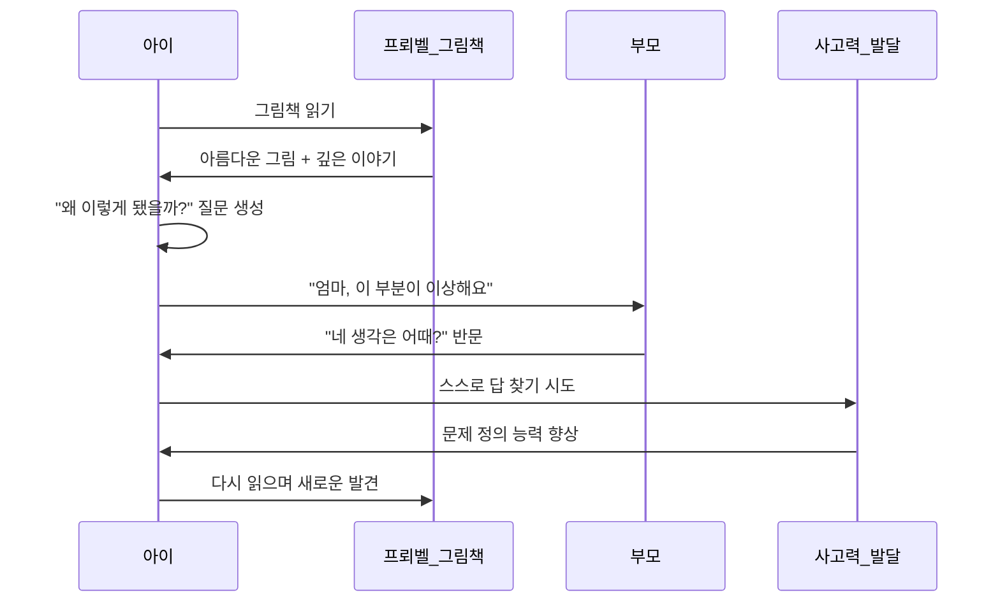

### 5.3 리터러시 발달 단계

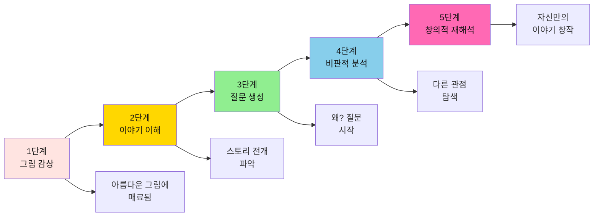

---

## 6. 아이의 커리어 패스 설계

### 6.1 프뢰벨 기반 장기 교육 로드맵

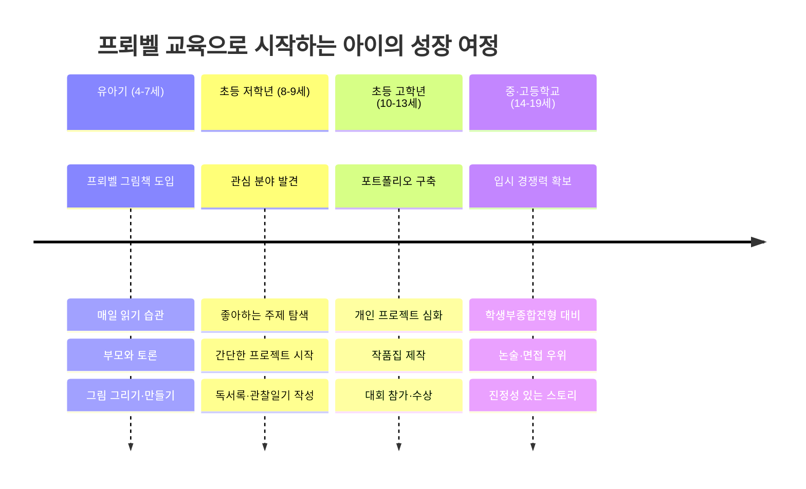

### 6.2 프뢰벨 → AI 시대 미래 역량 연결 맵

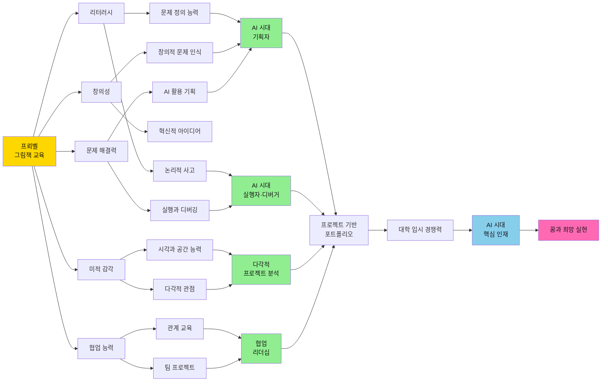

### 6.3 구체적 커리어 패스 예시 (AI 시대 업데이트)

#### 💻 **예시 1: AI 프로젝트 기획자 희망 학생**

| 시기 | 프뢰벨 활용 | AI 시대 확장 활동 | 결과물 |
|------|----------|-----------------|--------|
| **유아기** | 문제 상황 그림책 읽기 | "왜?" 질문 던지기 놀이 | 문제 인식 능력 기초 |
| **초등 저학년** | 창의적 해결책 토론 | 간단한 프로젝트 기획 (그림/글) | 아이디어 노트 3권 |
| **초등 고학년** | 다양한 분야 책 읽기 | AI 도구 활용 프로젝트 제작<br/>(ChatGPT, Canva 등) | 가상공간 프로젝트 3개<br/>대회 수상 1-2회 |
| **중학교** | 기술과 인문학 융합 독서 | 팀 프로젝트 리더 경험 | 학생부 프로젝트 기록 |
| **고등학교** | 전공 관련 깊이 있는 독서 | 포트폴리오 정리 및 면접 | AI·컴퓨터공학 계열 합격 |

#### 🎨 **예시 2: 창의적 디자이너 (AI 활용) 희망 학생**

| 시기 | 프뢰벨 활용 | AI 시대 확장 활동 | 결과물 |
|------|----------|-----------------|--------|
| **유아기** | 그림 아름다운 책 감상 | 다양한 시각 경험, 따라 그리기 | 미적 감각 + 공간 능력 발달 |
| **초등 저학년** | 다양한 스타일 그림책 | 나만의 그림책 만들기<br/>AI 도구로 디자인 시도 | 작품집 1권 + 디지털 작품 |
| **초등 고학년** | 세계 명작 그림책 분석 | AI 디자인 툴 활용 작품 제작<br/>다각적 관점으로 재해석 | 전시회 3회, AI 작품 포트폴리오 |
| **중학교** | 예술과 기술 융합 독서 | 디지털 아트 동아리 | 온라인 전시, 학생부 기록 |
| **고등학교** | 디자인 사고 심화 학습 | AI 디자인 프로젝트 완성 | 디자인·미디어 계열 합격 |

#### 🚀 **예시 3: 기업가 정신 (창업) 희망 학생**

| 시기 | 프뢰벨 활용 | AI 시대 확장 활동 | 결과물 |
|------|----------|-----------------|--------|
| **유아기** | 문제 해결 스토리 읽기 | 생활 속 문제 발견 놀이 | 관찰력과 문제 인식 습관 |
| **초등 저학년** | 기업가 이야기 책 읽기 | "나만의 가게" 프로젝트<br/>간단한 서비스 기획 | 아이디어 사업 계획서(그림) |
| **초등 고학년** | 경제·사회 문제 책 읽기 | 실제 문제 해결 프로젝트<br/>AI로 프로토타입 제작 | 창업 아이디어 대회 참가<br/>소규모 실행 경험 |
| **중학교** | 기업가 정신 관련 독서 | 학교 창업 동아리 활동<br/>팀 프로젝트 리더 | 창업 포트폴리오, 수상 경력 |
| **고등학교** | 경영·경제 심화 독서 | 실제 서비스 론칭 시도 | 경영·창업 계열 합격 |

#### 🔬 **예시 4: 융합형 과학자 (AI 활용) 희망 학생**

| 시기 | 프뢰벨 활용 | AI 시대 확장 활동 | 결과물 |
|------|----------|-----------------|--------|
| **유아기** | 자연·과학 그림책 읽기 | 관찰하고 질문하기 | 호기심과 탐구심 기초 |
| **초등 저학년** | 과학적 질문이 있는 책 | 간단한 실험과 관찰 일기 | 실험 노트 작성 습관 |
| **초등 고학년** | 과학 원리 탐구 독서 | AI로 데이터 분석 프로젝트<br/>다각적 실험 설계 | 과학 탐구 보고서 3편<br/>과학 대회 수상 |
| **중학교** | 전문 과학 서적 읽기 | 과학 동아리, 팀 연구 | R&E 프로그램 참여 |
| **고등학교** | 첨단 과학 논문 읽기 | 심화 연구 프로젝트 | 이공계 명문대 합격 |

### 6.4 AI 시대, 꿈과 희망을 키우는 구체적 방법

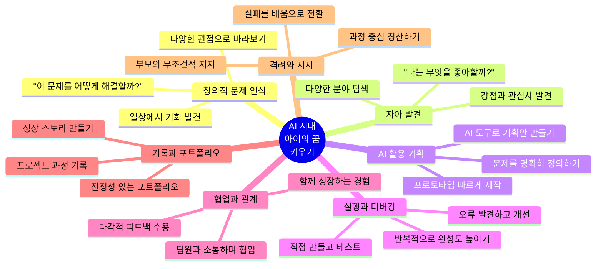

#### 🎯 **AI 시대 구체적 실천 방법**

**1. 창의적 문제 인식 훈련**
- 📚 프뢰벨 그림책 읽고 "이 상황의 문제는 뭘까?" 토론
- 🔍 일상 생활에서 불편한 점 발견하기 놀이
- 💭 "만약 내가 해결한다면?" 상상하기

**2. 문제 정의 능력 키우기**
- 📝 문제를 명확한 한 문장으로 정리하기
- 🎯 해결 목표를 구체적으로 설정하기
- 📊 우선순위 정하고 실행 계획 세우기

**3. AI 활용 프로젝트 경험**
- 🤖 나이에 맞는 AI 도구 활용법 배우기
  - 유아~초등 저학년: 그림 AI, 간단한 챗봇
  - 초등 고학년: ChatGPT, 디자인 툴, 코딩 도구
- 🎨 AI를 활용해 아이디어를 빠르게 구현
- 🔄 만들고, 테스트하고, 개선하는 사이클 경험

**4. 다각적 관점과 협업 능력**
- 👥 가족과 함께 프로젝트 토론
- 🤝 친구들과 팀 프로젝트 경험
- 🌍 다양한 사용자 입장 고려하기

**5. 포트폴리오 구축**
- 📸 프로젝트 과정 사진과 영상으로 기록
- 📖 성장 스토리를 글로 정리
- 💼 온라인/오프라인 포트폴리오 제작

---

## 6. 실전 가이드: 프뢰벨 교육 100% 활용법

### 6.1 연령별 실천 전략

#### 👶 **유아기 (4-7세): 기반 다지기**

**목표**: 책과 친해지기, 호기심 키우기

**일일 루틴**:
- 🌅 아침: 짧은 그림책 1권 (10분)
- 🌙 저녁: 긴 이야기책 1권 + 토론 (30분)
- 🎨 주말: 책 내용 기반 만들기·그리기 (1시간)

**부모의 역할**:
- ✅ "왜 그랬을까?" 질문 던지기
- ✅ 아이의 엉뚱한 답변도 경청
- ✅ 정답 강요하지 않기

#### 📚 **초등 저학년 (8-9세): 관심 분야 발견**

**목표**: 좋아하는 것 찾기, 프로젝트 시작

**주간 루틴**:
- 📖 독서: 매일 30분 이상
- ✍️ 기록: 독서록·관찰일기 (주 3회)
- 🔬 탐구: 관심 주제 조사 (주말 2시간)

**프로젝트 예시**:
- "우리 동네 나무 관찰 일기" (4주)
- "내가 만드는 그림책" (2개월)
- "좋아하는 동물 연구 보고서" (1개월)

#### 🎯 **초등 고학년 (10-13세): 포트폴리오 완성**

**목표**: 진지한 프로젝트, 결과물 축적

**프로젝트 수준 업**:
- 📊 소논문 형태 보고서 작성
- 🏆 대회 참가 (글쓰기, 과학, 예술 등)
- 📱 블로그·유튜브로 기록 공유

**포트폴리오 구성**:
1. 프로젝트 결과물 3-5개
2. 수상 실적 2-3개
3. 지속적 활동 기록 (블로그 등)
4. 추천서 받을 수 있는 멘토 확보

---

## 7. 결론: 프뢰벨로 시작하는 AI 시대 성공적 교육 전략

### 7.1 핵심 요약

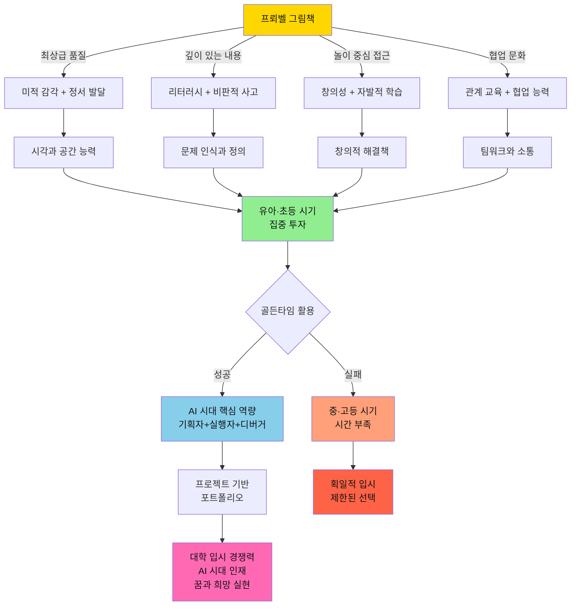

### 7.2 AI 시대, 당신의 선택이 아이의 미래를 결정합니다

#### ⏰ **지금이 바로 그 시간입니다**

- **중·고등학교는 이미 늦습니다**: 방학 제외하고 창의 활동은 거의 불가능
- **유아·초등이 유일한 기회**: 시간적·정신적 여유가 있는 마지막 시기
- **AI 시대는 완전히 다른 역량을 요구합니다**: 암기가 아닌 창의적 문제 해결
- **프뢰벨은 단순한 책이 아닙니다**: AI 시대 핵심 인재를 키우는 완벽한 기초

#### 🎯 **프뢰벨이 AI 시대에 제공하는 것**

1. ✅ **세계 최고 수준의 그림책**: 다른 업체와 비교 불가한 품질
2. ✅ **창의적 문제 인식 능력**: "왜?"를 묻고 문제를 발견하는 힘
3. ✅ **문제 정의와 해결 능력**: AI를 활용할 수 있는 기획 능력의 기초
4. ✅ **시각과 공간 능력**: 다각적으로 프로젝트를 바라보는 관점
5. ✅ **놀이를 통한 관계 교육**: 협업과 소통 능력의 자연스러운 발달
6. ✅ **실행과 디버깅 마인드**: 만들고, 테스트하고, 개선하는 습관
7. ✅ **입시 경쟁력**: 프로젝트 기반 진정성 있는 포트폴리오 구축

#### 💎 **결과**

→ **명문대 합격**을 넘어서  
→ **AI 시대 핵심 인재**: 기획자 + 실행자 + 디버거  
→ **창의적 기업가 정신**: 문제를 발견하고 해결하는 힘  
→ **아이가 진정 원하는 꿈**을 실현하는 능력  
→ **평생 이어지는 배움의 즐거움**과 **변화에 적응하는 유연성**

#### 🌍 **전세계가 주목하는 교육 패러다임**

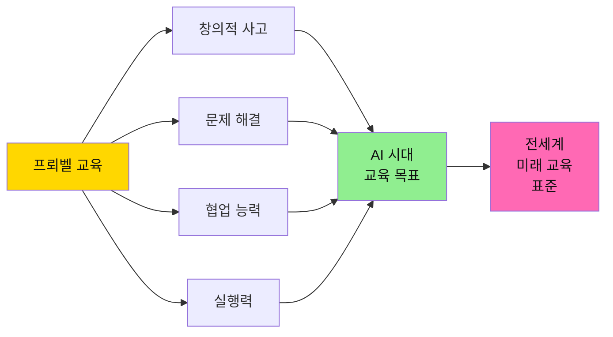

**프뢰벨은 이미 전세계가 추구하는 AI 시대 교육의 완벽한 기초입니다.**

---

## 8. FAQ: 자주 묻는 질문

### Q1. 프뢰벨 교육, 언제 시작해야 하나요?
**A**: 빠를수록 좋습니다. 이상적으로는 3-4세부터 시작하여 초등 저학년까지 집중 투자하세요. AI 시대 핵심 역량인 창의적 문제 인식과 다각적 사고는 이 시기에 기초가 형성됩니다.

### Q2. AI 시대에 그림책 교육이 정말 효과가 있나요?
**A**: 오히려 더 중요합니다! AI가 발달할수록 **창의적 문제 인식**, **다각적 관점**, **협업 능력**이 핵심 역량이 됩니다. 프뢰벨 그림책은 이 모든 능력의 완벽한 기초를 제공합니다. AI는 도구일 뿐, 문제를 발견하고 정의하는 것은 사람의 몫입니다.

### Q3. 다른 학습지나 코딩 교육과 병행해도 되나요?
**A**: 가능하지만, 프뢰벨의 강점은 **놀이 중심 창의 교육**입니다. 유아기에 과도한 학습지나 스킬 교육은 오히려 창의성을 해칠 수 있습니다. 먼저 프뢰벨로 **사고의 기초**를 다지고, 초등 고학년부터 기술을 배우는 것이 효과적입니다.

### Q4. 바쁜 부모도 할 수 있나요?
**A**: 매일 30분만 투자하세요. 양보다 질이 중요합니다. 함께 읽고 "왜?"를 묻고, 아이의 생각을 경청하는 것만으로도 충분합니다. 이것이 바로 AI 시대 **협업 능력**의 기초가 됩니다.

### Q5. 정말 대학 입시에 도움이 되나요?
**A**: 네, 특히 AI 시대 입시는 **프로젝트 기반 평가**로 전환되고 있습니다. 학생부종합전형은 진정성 있는 스토리와 실제 프로젝트 경험을 요구합니다. 유아기부터 프뢰벨로 쌓은 **창의적 문제 해결 능력**과 **포트폴리오**는 압도적인 경쟁력이 됩니다.

### Q6. AI 도구는 언제부터 가르쳐야 하나요?
**A**: 도구 사용은 초등 고학년(10세)부터 시작해도 늦지 않습니다. 그보다 중요한 것은 **문제를 발견하고 정의하는 능력**, **다각적으로 생각하는 습관**, **협업하는 태도**입니다. 이것이 바로 프뢰벨이 제공하는 것이며, 이 기초 위에 AI 도구를 얹으면 폭발적 효과를 냅니다.

### Q7. 비용 대비 효과가 있나요?
**A**: 중·고등학교 때 억지로 스펙 쌓는 비용(수백만 원)보다 훨씬 효율적입니다. 더 중요한 것은 **AI 시대에 진짜 필요한 역량**을 키우고, 아이의 **진짜 행복과 꿈**을 실현하는 것입니다. 프뢰벨은 일회성 투자가 아닌 **평생 역량의 기초**입니다.

### Q8. 우리 아이는 책을 안 좋아하는데 어떻게 하나요?
**A**: 프뢰벨 그림책은 **예술 작품 수준의 일러스트**로 시각적 자극이 강합니다. 처음에는 그림만 보는 것도 좋습니다. **강요하지 말고** 부모가 먼저 즐기는 모습을 보이세요. 놀이처럼 접근하면 자연스럽게 관심을 갖게 됩니다. 이것이 바로 **자발적 학습**의 시작입니다.

---

## 마무리: AI 시대, 아이의 미래는 지금 시작됩니다

```mermaid
journey
    title 프뢰벨과 함께하는 AI 시대 성장 여정
    section 유아기
      책과 친해지기: 5: 아이, 부모
      문제 발견 놀이: 5: 아이
      창의 놀이와 협업: 5: 아이, 부모
    section 초등 저학년
      관심 발견: 5: 아이
      간단한 프로젝트: 5: 아이, 부모
      시각과 공간 능력: 5: 아이
    section 초등 고학년
      AI 도구 활용: 4: 아이
      프로젝트 제작: 5: 아이
      팀 협업 경험: 4: 아이
    section 중등기
      내신 관리: 3: 아이
      프로젝트 포트폴리오: 5: 아이
    section 고등기
      입시 준비: 3: 아이
      프로젝트 기반 합격: 5: 아이, 부모
    section AI 시대 미래
      기획자+실행자+디버거: 5: 아이
      꿈 실현: 5: 아이
```

### 🌟 **최종 핵심 메시지**

```mermaid
graph TD
    A[프뢰벨 교육] --> B[AI 시대 필요한 모든 것]
    
    B --> C[창의적 문제 인식]
    B --> D[문제 정의 능력]
    B --> E[시각과 공간 능력]
    B --> F[협업과 관계 능력]
    B --> G[실행과 디버깅 마인드]
    
    C --> H[기획자]
    D --> H
    
    E --> I[다각적 사고]
    
    F --> J[팀 리더십]
    
    G --> K[실행자·디버거]
    
    H --> L[AI 시대<br/>핵심 인재]
    I --> L
    J --> L
    K --> L
    
    L --> M[아이의 꿈과<br/>희망 실현]
    
    style A fill:#FFD700,color:#111
    style B fill:#90EE90,color:#111
    style L fill:#87CEEB,color:#111
    style M fill:#FF69B4,color:#111
```

**프뢰벨은 단순한 교재가 아닙니다.**  
**AI 시대 핵심 인재를 키우는 완벽한 기초입니다.**  
**아이의 꿈과 희망을 실현하는 동반자입니다.**

### 💪 **전세계 교육이 주목하는 역량을 지금 시작하세요**

✅ **창의적 문제 인식**: 그림책이 던지는 질문으로 자연스럽게  
✅ **문제 정의와 기획**: 이야기 속에서 문제를 발견하고 정의하기  
✅ **시각과 공간 능력**: 최상급 일러스트로 다각적 관점 습득  
✅ **협업과 관계**: 놀이문화로 소통과 협업의 기초 다지기  
✅ **실행과 디버깅**: 만들고, 테스트하고, 개선하는 습관  

**→ 이 모든 것이 AI를 활용하는 기획자이자 실행자를 만듭니다.**

**지금 시작하세요. 아이의 미래가 완전히 달라집니다.** 🚀

---

*이 문서는 프뢰벨 교육 커리큘럼, 한국 교육 시스템, 그리고 전세계 AI 시대 교육 패러다임을 분석하여 작성되었습니다.*  
*최종 업데이트: 2025년 12월 (AI 시대 교육 반영)*
