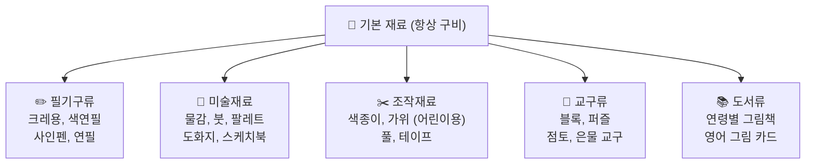
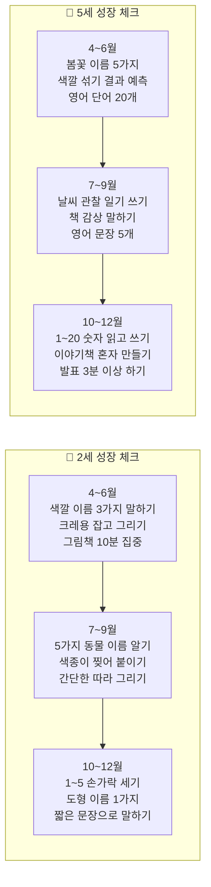

# 🌱 프뢰벨 유아 홈교육 8개월 연간 WBS 계획서
> 기간: 2026년 4월 ~ 12월 | 대상: 2세 (영아) · 5세 (유아) | 운영: 주 5일 2시간 + 토요일 체험

---

## 📌 교육 기본 원칙

| 원칙 | 내용 |
|------|------|
| 🎮 놀이 = 학습 | 억지로 시키지 않고, 놀면서 자연스럽게 배우기 |
| ❤️ 과정 칭찬 | "잘했어!"보다 "어떻게 생각했어?" |
| 👫 함께 성장 | 두 아이가 서로 보고 자극받으며 성장 |
| 🔄 반복의 힘 | 같은 활동을 여러 번 반복해야 진짜 내 것이 됨 |
| 🧩 쉬운 재료 | 색종이, 색칠, 퍼즐 등 집에서 바로 가능한 것 위주 |

---

## 🗺 WBS 전체 구조

```mermaid
flowchart LR
    A["🌱 프뢰벨 홈교육<br> 2세 & 5세<br> 2026.04~12"]

    A --> B["📅 4월<br> 봄 탐색"]
    A --> C["📅 5월<br> 우리 가족"]
    A --> D["📅 6월<br> 색깔 나라"]
    A --> E["📅 7월<br> 여름 자연"]
    A --> F["📅 8월<br> 상상의 나라"]
    A --> G["📅 9월<br> 가을 이야기"]
    A --> H["📅 10월<br> 숫자와 모양"]
    A --> I["📅 11월<br> 이야기 세계"]
    A --> J["📅 12월<br> 겨울·마무리"]

    B --> B1["1주<br> 봄꽃 친구<br> 꽃 색칠·색종이 꽃잎"]
    B --> B2["2주<br> 나비·벌레<br> 손도장 애벌레·나비 접기"]
    B --> B3["3주<br> 씨앗과 싹<br> 콩 심기·관찰 일기"]
    B --> B4["4주<br> 봄비·무지개<br> 색종이 무지개·수채화"]

    C --> C1["1주<br> 엄마 아빠<br> 얼굴 그리기·손 도장"]
    C --> C2["2주<br> 어린이날<br> 왕관 만들기·감사 편지"]
    C --> C3["3주<br> 할머니·할아버지<br> 선물 그리기·카드 만들기"]
    C --> C4["4주<br> 우리 집<br> 블록 집 짓기·도면 그리기"]

    D --> D1["1주<br> 3원색<br> 색깔 카드 매칭·콜라주"]
    D --> D2["2주<br> 6색 확장<br> 색 분류 게임·색 단어 쓰기"]
    D --> D3["3주<br> 색 섞기 실험<br> 핑거페인팅·혼합 실험표"]
    D --> D4["4주<br> 나만의 작품<br> 자유 그림·갤러리 전시"]

    E --> E1["1주<br> 태양과 바람<br> 해 색칠·바람개비 만들기"]
    E --> E2["2주<br> 물과 얼음<br> 얼음 감각·물감 얼음 그림"]
    E --> E3["3주<br> 바다와 물고기<br> 물고기 색칠·바다 콜라주"]
    E --> E4["4주<br> 여름 과일<br> 과일 색칠·점토 과일"]

    F --> F1["1주<br> 동물 세계<br> 동물 퍼즐·흉내 게임"]
    F --> F2["2주<br> 우주 탐험<br> 별 스티커·나만의 별자리"]
    F --> F3["3주<br> 탈것 여행<br> 색칠·블록 도로 만들기"]
    F --> F4["4주<br> 내가 만든 세계<br> 자유 창작·가족 발표"]

    G --> G1["1주<br> 가을 나뭇잎<br> 낙엽 탁본·콜라주"]
    G --> G2["2주<br> 추석 특별<br> 송편 점토·전통 이야기"]
    G --> G3["3주<br> 도토리·열매<br> 자연물 관찰·자연 미술"]
    G --> G4["4주<br> 가을 바람<br> 바람개비·가을 시 쓰기"]

    H --> H1["1주<br> 숫자 탐험<br> 1~5 세기·숫자 색칠"]
    H --> H2["2주<br> 도형 친구<br> 도형 스탬프·은물 분류"]
    H --> H3["3주<br> 크고 작고<br> 크기 분류 게임·비교표"]
    H --> H4["4주<br> 패턴과 규칙<br> 색깔 패턴·은물 6번"]

    I --> I1["1주<br> 좋아하는 책<br> 그림책 읽기·장면 색칠"]
    I --> I2["2주<br> 이야기 만들기<br> 그림카드 3장 이야기"]
    I --> I3["3주<br> 인형극<br> 양말 인형 만들기·공연"]
    I --> I4["4주<br> 나만의 책 완성<br> 이야기책·가족 낭독"]

    J --> J1["1주<br> 눈과 겨울<br> 눈송이 오리기·흰 물감"]
    J --> J2["2주<br> 크리스마스<br> 트리 꾸미기·카드 만들기"]
    J --> J3["3주<br> 한 해 돌아보기<br> 작품 고르기·포트폴리오"]
    J --> J4["4주<br> 새해 준비<br> 소망 그림·목표 3가지"]
```

---

## 📊 8개월 월별 테마 한눈에 보기

| 월 | 테마 | 핵심 키워드 | 2세 포커스 | 5세 포커스 |
|----|------|-----------|-----------|-----------|
| **4월** | 🌸 봄 탐색 | 자연·색깔·감각 | 꽃 색칠, 흙 만지기 | 씨앗 관찰 일기, 봄 단어 |
| **5월** | 👨‍👩‍👧 우리 가족 | 사랑·표현·관계 | 가족 그림 그리기 | 가족 소개 책 만들기 |
| **6월** | 🎨 색깔 나라 | 색·혼합·창의 | 핑거 페인팅 | 색깔 섞기 실험+기록 |
| **7월** | ☀️ 여름 자연 | 물·태양·과학 | 물놀이 감각 | 날씨 관찰 일기 |
| **8월** | 🚀 상상의 나라 | 상상·우주·동물 | 동물 흉내 놀이 | 나만의 우주 그림책 |
| **9월** | 🍂 가을 이야기 | 추석·열매·수확 | 낙엽 찍기 도장 | 추석 전통 만들기 |
| **10월** | 🔢 숫자와 모양 | 수·도형·패턴 | 1~5 손가락 세기 | 1~20 + 도형 프로젝트 |
| **11월** | 📖 이야기 세계 | 독서·창작·발표 | 그림 보고 말하기 | 내가 쓴 이야기책 |
| **12월** | ❄️ 겨울과 마무리 | 겨울·성장·새해 | 눈송이 색종이 오리기 | 1년 성장 포트폴리오 |

---

## 🌸 4월 — 봄 탐색 (자연 감각 깨우기)

> **이달의 목표**
> - 2세: 봄의 색깔(빨강·노랑·분홍)을 눈과 손으로 느끼기
> - 5세: 봄 자연을 관찰하고 그림·단어로 기록하기

### 📋 4월 주차별 계획

| 주차 | 테마 | 2세 활동 | 5세 활동 | 공통 재료 | 핵심 목표 |
|------|------|---------|---------|---------|---------|
| **1주** | 🌸 봄꽃 친구 | 꽃 그림 색칠하기 (굵은 크레용) / 색종이로 꽃잎 찢어 붙이기 | 꽃 관찰 그림 그리기 / 꽃 이름 3가지 써보기 | 색종이, 크레용, 꽃 사진 | 색깔 인식 + 자연 관찰 |
| **2주** | 🦋 나비·벌레 | 나비 색칠하기 / 손가락 도장으로 애벌레 만들기 | 나비 접기 (종이접기) / 영어 단어 Butterfly, Bee | 색종이, 물감, 스탬프 | 손 근육 발달 + 어휘 |
| **3주** | 🌱 씨앗과 싹 | 흙 만지기 감각 / 씨앗 컵에 심기 (콩나물) | 씨앗 관찰 일기 1일차 / 씨앗 종류 그림 그리기 | 투명컵, 콩, 흙, 스케치북 | 과학적 관찰력 |
| **4주** | 🌈 봄비·무지개 | 색종이 무지개 붙이기 / 물 뿌리기 놀이 | 무지개 색 순서 외우기 / 무지개 수채화 | 색종이, 수채물감, 붓 | 색 순서 + 창의 표현 |

---

## 👨‍👩‍👧 5월 — 우리 가족 (관계와 사랑)

> **이달의 목표**
> - 2세: 엄마·아빠·나를 그림으로 표현하고 이름 알기
> - 5세: 가족 구성원을 소개하는 미니 책 만들기

### 📋 5월 주차별 계획

| 주차 | 테마 | 2세 활동 | 5세 활동 | 공통 재료 | 핵심 목표 |
|------|------|---------|---------|---------|---------|
| **1주** | 👩 엄마 아빠 | 엄마·아빠 얼굴 그리기 (동그라미+선) / 손 도장 찍기 | 가족 얼굴 사실적으로 그리기 / "My Family" 영어 문장 | 스케치북, 크레용, 물감 | 가족 개념 + 자기 표현 |
| **2주** | 🎉 어린이날 특별 | 왕관 만들기 (색종이) / 좋아하는 것 말하기 | 내가 원하는 선물 그리기+설명 / 감사 편지 쓰기 | 색종이, 스티커, 풀 | 자기표현 + 감사 표현 |
| **3주** | 👴 할머니·할아버지 | 할머니·할아버지 선물 그리기 / 포옹 흉내 놀이 | 할머니께 드릴 카드 만들기 / 어른 존댓말 연습 | 색도화지, 크레용, 스티커 | 가족 사랑 표현 |
| **4주** | 🏠 우리 집 | 블록으로 집 짓기 / 문·창문 색칠하기 | 우리 집 도면 그리기 / 방 이름 영어(Room, Kitchen) | 블록, 색종이, 자 | 공간 개념 + 어휘 |

---

## 🎨 6월 — 색깔 나라 (색깔 탐구와 창의 표현)

> **이달의 목표**
> - 2세: 빨강·노랑·파랑을 구별하고 이름 말하기
> - 5세: 색깔을 섞으면 어떻게 되는지 실험하고 기록하기

### 📋 6월 주차별 계획

| 주차 | 테마 | 2세 활동 | 5세 활동 | 공통 재료 | 핵심 목표 |
|------|------|---------|---------|---------|---------|
| **1주** | 🔴 빨강·노랑·파랑 | 색깔 카드 매칭 / 색종이 3가지 색 찢어 콜라주 | 3원색으로 그림 그리기 / 영어 색깔 단어 카드 | 색종이, 크레용, 색깔 카드 | 기본 색 인식 |
| **2주** | 🟢 초록·보라·주황 | 색깔 도화지에 크레용으로 자유 그리기 | 색깔 이름 영어+한국어 쓰기 / 색깔 분류 게임 | 도화지 여러 색, 크레용 | 색 어휘 확장 |
| **3주** | 🧪 색깔 섞기 실험 | 물감 손가락으로 섞어보기 (핑거 페인팅) | 빨+노=주황, 파+노=초록 실험 표 만들기 | 물감, 팔레트, 도화지, 앞치마 | 과학적 사고 (혼합) |
| **4주** | 🖼 나만의 색깔 작품 | 좋아하는 색으로 자유 그림 | 나만의 색 이름 만들기 + 갤러리 전시 | 도화지, 물감, 크레용 | 창의 표현 + 자신감 |

---

## ☀️ 7월 — 여름 자연 (물·태양·과학 탐구)

> **이달의 목표**
> - 2세: 물과 얼음을 만지며 차갑다·시원하다 감각 느끼기
> - 5세: 날씨를 관찰하고 일기 형식으로 기록하기

### 📋 7월 주차별 계획

| 주차 | 테마 | 2세 활동 | 5세 활동 | 공통 재료 | 핵심 목표 |
|------|------|---------|---------|---------|---------|
| **1주** | ☀️ 태양과 바람 | 해 그림 색칠 / 바람개비 만들기 (색종이) | 태양계 그림 그리기 / 영어 Sun, Wind, Cloud | 색종이, 빨대, 핀 | 자연 현상 이해 |
| **2주** | 💧 물과 얼음 | 얼음 만지기 감각 / 물감 섞은 얼음 그림 그리기 | 물의 상태(고체·액체·기체) 학습 + 그림 | 얼음, 물감, 지퍼백 | 과학 개념 (물의 변화) |
| **3주** | 🐠 바다와 물고기 | 물고기 색칠하기 / 바다 색종이 찢어 붙이기 | 바다 생물 책 만들기 / 영어 Fish, Whale, Shark | 파란 색종이, 색칠 도안 | 생물 어휘 + 창의 |
| **4주** | 🍉 여름 과일 | 수박·참외 색칠하기 / 점토로 과일 만들기 | 과일 관찰 그림 + 영어 단어 쓰기 / 과일 퍼즐 | 점토, 색칠 도안, 퍼즐 | 관찰력 + 어휘 |

---

## 🚀 8월 — 상상의 나라 (창의력과 상상 표현)

> **이달의 목표**
> - 2세: 동물 흉내를 내며 몸으로 표현하기
> - 5세: 상상 속 세계를 그림책으로 완성하기

### 📋 8월 주차별 계획

| 주차 | 테마 | 2세 활동 | 5세 활동 | 공통 재료 | 핵심 목표 |
|------|------|---------|---------|---------|---------|
| **1주** | 🦁 동물 세계 | 동물 흉내 게임 / 동물 퍼즐 (4~6조각) | 동물 특징 그림+설명 / 영어 Animal 단어 5개 | 동물 퍼즐, 동물 카드 | 어휘 + 신체 표현 |
| **2주** | 🚀 우주 탐험 | 별 스티커 붙이기 / 로켓 색칠하기 | 태양계 그림 만들기 / 나만의 별자리 그리기 | 검정 도화지, 스티커, 은색 크레용 | 상상력 + 과학 호기심 |
| **3주** | 🚗 탈것 여행 | 자동차·기차 색칠하기 / 블록으로 도로 만들기 | 탈것 분류 (육상·해상·항공) / 영어 단어 쓰기 | 블록, 색칠 도안, 자 | 분류 사고 + 어휘 |
| **4주** | 🌈 내가 만든 세계 | 자유 그림 (주제 없이) / 내 그림 설명하기 | 상상 세계 그림책 완성 + 가족에게 발표 | 도화지, 스케치북, 색연필 | 창의 + 발표 자신감 |

---

## 🍂 9월 — 가을 이야기 (추석·자연·수확)

> **이달의 목표**
> - 2세: 낙엽을 주워 도장 찍기, 가을 색깔(주황·노랑·빨강) 경험
> - 5세: 추석 의미를 알고 전통 만들기 활동 참여

### 📋 9월 주차별 계획

| 주차 | 테마 | 2세 활동 | 5세 활동 | 공통 재료 | 핵심 목표 |
|------|------|---------|---------|---------|---------|
| **1주** | 🍁 가을 나뭇잎 | 낙엽 주워 모양 탁본 / 낙엽 붙이기 콜라주 | 낙엽 종류 관찰 + 스케치 / 가을 색 수채화 | 낙엽, 크레용, 도화지 | 자연 관찰 + 미술 |
| **2주** | 🌕 추석 특별 주 | 보름달 색칠하기 / 송편 모양 점토 | 추석 유래 그림 동화 / 송편 만들기 체험 | 점토, 색칠 도안, 동화책 | 전통문화 이해 |
| **3주** | 🌰 도토리·열매 | 도토리 모으기 / 열매 색칠하기 | 열매와 씨앗 관찰 일기 / 자연물로 미술 작품 | 도토리, 자연물, 스케치북 | 과학 관찰 + 창의 |
| **4주** | 🌬 가을 바람 | 바람개비 다시 만들기 / 가을 그림 자유 그리기 | 가을 시 한 편 읽기 + 내가 쓰는 가을 시 | 색종이, 빨대, 스케치북 | 언어 감수성 |

---

## 🔢 10월 — 숫자와 모양 (수 개념과 도형 탐구)

> **이달의 목표**
> - 2세: 1~5까지 손가락으로 세고 말하기
> - 5세: 1~20 세기 + 동그라미·세모·네모 도형으로 그림 만들기

### 📋 10월 주차별 계획

| 주차 | 테마 | 2세 활동 | 5세 활동 | 공통 재료 | 핵심 목표 |
|------|------|---------|---------|---------|---------|
| **1주** | 🔢 숫자 탐험 | 1~5 손가락 세기 / 숫자 1,2,3 색칠하기 | 1~20 숫자 쓰기 / 숫자 카드 게임 | 숫자 색칠 도안, 숫자 카드 | 수 개념 형성 |
| **2주** | 🔵 도형 친구 | 동그라미·세모·네모 스탬프 찍기 | 도형으로 집·자동차·로봇 그리기 / 은물 도형 분류 | 도형 스탬프, 물감, 은물 교구 | 도형 인식 + 창의 |
| **3주** | 📏 크고 작고 | 큰 것 vs 작은 것 분류 게임 / 크기 퍼즐 | 크기 비교 표 만들기 / 대·중·소 그림 그리기 | 다양한 크기 블록, 퍼즐 | 비교 개념 |
| **4주** | 🔄 패턴과 규칙 | 색깔 패턴 따라하기 (빨·파·빨·파) | 패턴 블록으로 규칙 만들기 / 은물 6번 패턴 | 색깔 블록, 은물 교구, 색종이 | 논리적 사고 |

---

## 📖 11월 — 이야기 세계 (독서·창작·발표)

> **이달의 목표**
> - 2세: 그림책의 그림을 보며 자기 말로 이야기하기
> - 5세: 스스로 이야기를 만들고 미니 책으로 완성하기

### 📋 11월 주차별 계획

| 주차 | 테마 | 2세 활동 | 5세 활동 | 공통 재료 | 핵심 목표 |
|------|------|---------|---------|---------|---------|
| **1주** | 📚 내가 좋아하는 책 | 그림책 함께 읽기 / 좋아하는 장면 색칠 | 책 감상문 그림+글쓰기 / 친구에게 책 소개하기 | 그림책, 색칠 도안, 스케치북 | 독서 습관 + 표현 |
| **2주** | ✏️ 이야기 만들기 | 그림 카드 3장으로 이야기 꾸미기 | 이야기 구조(처음·중간·끝) / 나만의 이야기 초안 | 그림 카드, 스케치북 | 서사 구조 이해 |
| **3주** | 🎭 인형극 | 양말 인형 만들기 / 인형 대화 놀이 | 인형극 대본 쓰기 / 역할 정해 인형극 공연 | 양말, 단추, 천 조각, 글루건 | 창의 + 협동 |
| **4주** | 📗 나만의 책 완성 | 그림 여러 장 모아 표지 꾸미기 | 이야기책 완성 + 발표 / 가족 앞에서 낭독 | 스케치북, 색연필, 스티커 | 완성 경험 + 자신감 |

---

## ❄️ 12월 — 겨울과 마무리 (성장 돌아보기)

> **이달의 목표**
> - 2세: 겨울을 눈·하얀색으로 느끼고 표현하기
> - 5세: 1년간 성장한 것을 포트폴리오로 정리하고 발표하기

### 📋 12월 주차별 계획

| 주차 | 테마 | 2세 활동 | 5세 활동 | 공통 재료 | 핵심 목표 |
|------|------|---------|---------|---------|---------|
| **1주** | ❄️ 눈과 겨울 | 눈송이 색종이 오리기 / 흰색 물감 그림 | 겨울 풍경 수채화 / 눈 결정체 관찰·그리기 | 흰 색종이, 가위, 흰 물감 | 계절 감각 + 가위질 |
| **2주** | 🎄 크리스마스 | 크리스마스 트리 꾸미기 / 별 오리기 | 크리스마스 카드 직접 만들기 / 영어 Merry Christmas! | 색종이, 스티커, 색연필 | 창의 만들기 + 감사 |
| **3주** | 🏆 한 해 돌아보기 | 올해 내 그림 중 가장 좋아하는 것 고르기 | 1년 성장 포트폴리오 만들기 / 잘한 것 3가지 말하기 | 스케치북, 색연필, 스티커 | 자기 평가 + 성취감 |
| **4주** | 🌟 새해 준비 | 새해 소망 그림 그리기 | 새해 목표 3가지 쓰기 / 가족에게 발표 | 스케치북, 색연필, 색종이 | 목표 설정 + 미래 지향 |

---

## 🛒 월별 준비 재료 목록

| 시기 | 특별 추가 재료 | 예상 비용 |
|------|-------------|---------|
| **4월 봄** | 씨앗 (콩·해바라기), 투명컵, 흙 | 약 5,000원 |
| **5월 가족** | 스티커, 색도화지, 코팅지 | 약 3,000원 |
| **6월 색깔** | 수채물감 세트, 팔레트, 앞치마 | 약 15,000원 |
| **7월 여름** | 얼음 틀, 지퍼백, 물감 | 약 3,000원 |
| **8월 상상** | 검정 도화지, 은색·금색 크레용 | 약 5,000원 |
| **9월 가을** | 점토, 자연물 (도토리·낙엽) | 약 5,000원 |
| **10월 숫자** | 숫자 카드, 도형 스탬프 | 약 8,000원 |
| **11월 이야기** | 양말 2쌍, 단추, 글루건 | 약 5,000원 |
| **12월 겨울** | 흰 색종이 추가, 크리스마스 스티커 | 약 5,000원 |
| **합계** | | **약 54,000원** |

---

## 📈 발달 성장 체크포인트

---

## 👨‍👩‍👧 두 아이 함께 하는 방법

| 상황 | 2세 역할 | 5세 역할 | 포인트 |
|------|---------|---------|-------|
| **같은 주제 다른 활동** | 꽃 색칠하기 | 꽃 관찰 일기 쓰기 | 서로 결과물 보여주기 |
| **5세가 2세에게 설명** | 듣고 따라하기 | 선생님처럼 설명하기 | 5세의 자신감↑ |
| **함께 만들기** | 색깔 부분 담당 | 구조·형태 담당 | 협동심 + 역할 분담 |
| **책 읽어주기** | 그림 보며 반응 | 소리 내어 읽어주기 | 5세 읽기 연습 자연스럽게 |
| **발표 시간** | 그림 들고 서기 | 설명하기 | 둘 다 발표 경험 |

---

## ✅ 주간 점검 체크리스트

### 매주 금요일 확인 (부모용)

**2세 아이**
- [ ] 이번 주 색깔 이름을 1가지 이상 말했나요?
- [ ] 크레용·색연필을 30초 이상 잡고 그렸나요?
- [ ] 그림책 1권 이상 함께 봤나요?
- [ ] 손가락으로 만지는 감각 놀이를 했나요?
- [ ] 아이가 "또 해요!" 라고 했나요? ⭐

**5세 아이**
- [ ] 이번 주 주제 단어를 3개 이상 말할 수 있나요?
- [ ] 영어 단어 또는 노래를 1가지 익혔나요?
- [ ] 스스로 뭔가를 만들거나 그렸나요?
- [ ] 자기가 만든 것을 설명했나요?
- [ ] 이번 주 책을 1권 이상 읽었나요?

---

## 💡 부모님께 드리는 운영 TIP

| 상황 | 하지 말 것 | 해야 할 것 |
|------|-----------|-----------|
| 아이가 집중 안 할 때 | "왜 안 해?" 혼내기 | 5분 쉬고 다시 시작 / 방법 바꾸기 |
| 결과물이 엉망일 때 | "이게 뭐야?" 실망하기 | "어떻게 만든 거야?" 관심 보이기 |
| 두 아이가 싸울 때 | 둘 다 혼내기 | 역할 나눠주기 (각자 담당) |
| 아이가 "싫어요" 할 때 | 억지로 앉히기 | 내일로 미루기 (2세는 특히!) |
| 잘 따라올 때 | 그냥 넘어가기 | 꼭 칭찬하고 사진 찍어 기록 |

---

> - 📌 **가장 중요한 원칙**
> - 하루에 30분이라도 **꾸준히** 하는 것이 한 번에 3시간 하는 것보다 10배 효과적입니다.
> - 아이들은 **반복**을 통해 진짜 배웁니다. 같은 활동을 여러 번 해도 괜찮습니다! 🌟

---

*작성: 프뢰벨 유아 홈교육 연간 계획 | 2026.04.07 | 대상: 2세·5세*
