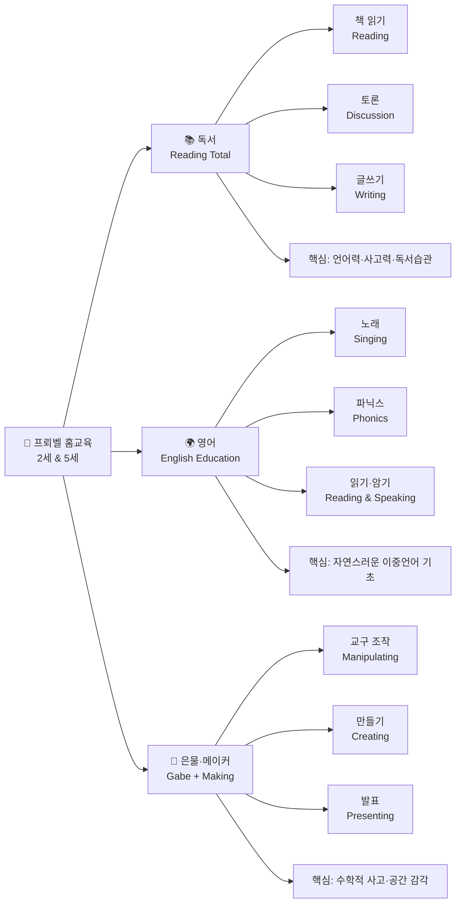
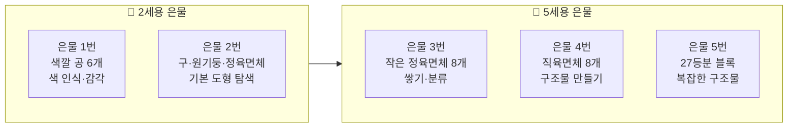
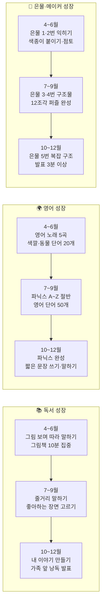

# 🌱 프뢰벨 3대 프로그램 기반 홈교육 WBS 계획서
> 기간: 2026년 4월 ~ 12월 | 대상: 2세 · 5세 | 운영: 주 5일 2시간 + 토요일 체험
> 핵심 3대 프로그램: 📚 독서(Reading Total) · 🌍 영어(English) · 🧱 은물·메이커(Gabe)

---

## 📌 3대 프로그램 구조

---

## 📊 연령별 운영 원칙

| 구분 | 👶 2세 | 🧒 5세 |
|------|--------|--------|
| **놀이 비중** | 35~40% | 30% |
| **최대 집중 시간** | 5~8분 | 15~25분 |
| **학습 방향** | 감각 탐색 + 친숙해지기 | 창의력 폭발 + 논리·규칙 학습 |
| **독서** | 그림 보며 따라 말하기 | 내용 이해 + 토론 + 글쓰기 |
| **영어** | 노래 따라 부르기 + 단어 카드 | 파닉스 + 단어 쓰기 + 짧은 문장 |
| **은물·메이커** | 은물 1~2번 + 점토 + 4조각 퍼즐 | 은물 3~5번 + 종이접기 + 12~24조각 퍼즐 |

---

## 📐 은물 교구 연령 배치

---

## 🗺 8개월 WBS 전체 구조

```mermaid
flowchart LR
    ROOT["🌱 프뢰벨 3대 프로그램<br> 2세 & 5세<br> 2026.04~12"]

    ROOT --> M4["📅 4월<br> 봄·자연"]
    ROOT --> M5["📅 5월<br> 가족·사랑"]
    ROOT --> M6["📅 6월<br> 색깔·감각"]
    ROOT --> M7["📅 7월<br> 여름·과학"]
    ROOT --> M8["📅 8월<br> 상상·창의"]
    ROOT --> M9["📅 9월<br> 가을·수확"]
    ROOT --> M10["📅 10월<br> 숫자·도형"]
    ROOT --> M11["📅 11월<br> 이야기·창작"]
    ROOT --> M12["📅 12월<br> 겨울·마무리"]

    M4 --> W41["1주<br> 봄꽃 이야기"]
    M4 --> W42["2주<br> 나비와 벌레"]
    M4 --> W43["3주<br> 씨앗과 싹"]
    M4 --> W44["4주<br> 봄비 무지개"]

    M5 --> W51["1주<br> 엄마 아빠"]
    M5 --> W52["2주<br> 어린이날"]
    M5 --> W53["3주<br> 할머니 할아버지"]
    M5 --> W54["4주<br> 우리 집"]

    M6 --> W61["1주<br> 빨강 노랑 파랑"]
    M6 --> W62["2주<br> 초록 보라 주황"]
    M6 --> W63["3주<br> 색깔 섞기"]
    M6 --> W64["4주<br> 나만의 색 작품"]

    M7 --> W71["1주<br> 태양과 바람"]
    M7 --> W72["2주<br> 물과 얼음"]
    M7 --> W73["3주<br> 바다와 물고기"]
    M7 --> W74["4주<br> 여름 과일"]

    M8 --> W81["1주<br> 동물 세계"]
    M8 --> W82["2주<br> 우주 탐험"]
    M8 --> W83["3주<br> 탈것 여행"]
    M8 --> W84["4주<br> 내가 만든 세계"]

    M9 --> W91["1주<br> 가을 나뭇잎"]
    M9 --> W92["2주<br> 추석·전통"]
    M9 --> W93["3주<br> 도토리·열매"]
    M9 --> W94["4주<br> 가을 바람·시"]

    M10 --> W101["1주<br> 숫자 탐험"]
    M10 --> W102["2주<br> 도형 친구"]
    M10 --> W103["3주<br> 크고 작고"]
    M10 --> W104["4주<br> 패턴·규칙"]

    M11 --> W111["1주<br> 좋아하는 책"]
    M11 --> W112["2주<br> 이야기 만들기"]
    M11 --> W113["3주<br> 인형극"]
    M11 --> W114["4주<br> 나만의 책"]

    M12 --> W121["1주<br> 눈과 겨울"]
    M12 --> W122["2주<br> 크리스마스"]
    M12 --> W123["3주<br> 한 해 돌아보기"]
    M12 --> W124["4주<br> 새해 준비"]
```

---

## 🌸 4월 — 봄·자연

> 이달의 핵심: 봄을 오감으로 느끼고 / 봄 영어 단어 첫 노출 / 은물로 꽃·나비 만들기

### 📋 1주 — 봄꽃 이야기

| 프로그램 | 👶 2세 활동 | 🧒 5세 활동 | 재료 |
|---------|-----------|-----------|------|
| 📚 **독서** | 꽃 그림책 함께 보기 / 꽃 사진 보며 "예쁘다!" 말하기 | 꽃 그림책 읽기 + "왜 꽃은 색깔이 다를까?" 토론 | 꽃 그림책, 꽃 사진 카드 |
| 🌍 **영어** | Flower Song 따라 부르기 / Flower·Red·Yellow 카드 보기 | 꽃 이름 영어로 쓰기 (Rose, Tulip) / 알파벳 F 파닉스 | 영어 단어 카드, 알파벳 카드 |
| 🧱 **은물·메이커** | 은물 1번 공 굴리기 + 색깔 맞추기 / 색종이 꽃잎 찢어 붙이기 | 은물 3번 블록으로 꽃 모양 만들기 / 완성 후 가족에게 발표 | 은물 1번, 은물 3번, 색종이, 풀 |

### 📋 2주 — 나비와 벌레

| 프로그램 | 👶 2세 활동 | 🧒 5세 활동 | 재료 |
|---------|-----------|-----------|------|
| 📚 **독서** | 나비 그림책 보기 / 손으로 나비 날개 흉내 내기 | 나비 변태 과정 그림책 / 알·애벌레·번데기·나비 순서 맞추기 | 나비 그림책, 순서 카드 |
| 🌍 **영어** | Butterfly Song 따라 부르기 / Butterfly·Bee 카드 보기 | B 파닉스 (Bee, Bug, Butterfly) / 알파벳 B 쓰기 연습 | 알파벳 카드, 색연필 |
| 🧱 **은물·메이커** | 손가락 도장으로 애벌레 만들기 / 물감 손바닥 찍어 나비 날개 | 색종이 나비 접기 (기본 접기) / 색칠하고 이름 붙이기 | 물감, 색종이, 도화지 |

### 📋 3주 — 씨앗과 싹

| 프로그램 | 👶 2세 활동 | 🧒 5세 활동 | 재료 |
|---------|-----------|-----------|------|
| 📚 **독서** | 씨앗 그림책 보기 / 실제 씨앗 만져보기 | 씨앗이 자라는 과정 그림책 / 식물 성장 순서 그림으로 그리기 | 씨앗 그림책, 실제 씨앗 |
| 🌍 **영어** | Seed·Tree·Grow 카드 보기 / "Grow! Grow!" 노래 | S 파닉스 (Seed, Sun, Soil) / Seed grows into a tree 문장 읽기 | 알파벳 카드, 문장 카드 |
| 🧱 **은물·메이커** | 투명 컵에 콩 심기 / 흙 만지기 감각 탐색 | 은물 4번으로 나무 구조 만들기 / 씨앗 관찰 일기 시작 (그림) | 은물 4번, 투명컵, 콩, 흙, 스케치북 |

### 📋 4주 — 봄비와 무지개

| 프로그램 | 👶 2세 활동 | 🧒 5세 활동 | 재료 |
|---------|-----------|-----------|------|
| 📚 **독서** | 비·무지개 그림책 / "비가 와요!" 따라 말하기 | 무지개 그림책 + 왜 무지개가 생기는지 이야기 나누기 | 비 그림책, 무지개 그림책 |
| 🌍 **영어** | Rain Rain Go Away 노래 / Rain·Rainbow 카드 | R 파닉스 (Rain, Rainbow, Red) / Rainbow 색깔 영어로 쓰기 | 알파벳 카드, 색연필 |
| 🧱 **은물·메이커** | 색종이 7색 무지개 찢어 붙이기 | 은물 3번으로 무지개 아치 구조 만들기 / 수채화로 무지개 그리기 + 발표 | 은물 3번, 색종이, 수채물감 |

---

## 👨‍👩‍👧 5월 — 가족·사랑

> 이달의 핵심: 가족을 그림으로 표현 / 가족 영어 단어 / 은물로 우리 집 만들기

### 📋 1주 — 엄마 아빠

| 프로그램 | 👶 2세 활동 | 🧒 5세 활동 | 재료 |
|---------|-----------|-----------|------|
| 📚 **독서** | 가족 그림책 / 엄마·아빠 사진 보며 이름 말하기 | 가족 그림책 읽기 + 우리 가족 소개 문장 만들기 | 가족 그림책, 가족 사진 |
| 🌍 **영어** | Mom·Dad·Baby Song / Mom·Dad·Baby 카드 따라 말하기 | M 파닉스 (Mom, Me, My) / I love my mom 문장 쓰기 | 알파벳 카드, 스케치북 |
| 🧱 **은물·메이커** | 손 도장으로 가족 손바닥 그림 / 얼굴 동그라미 그리기 | 은물 4번으로 가족 인형 구조 만들기 / 가족 소개 그림 발표 | 은물 4번, 물감, 도화지 |

### 📋 2주 — 어린이날 특별 주

| 프로그램 | 👶 2세 활동 | 🧒 5세 활동 | 재료 |
|---------|-----------|-----------|------|
| 📚 **독서** | 어린이날 그림책 / 좋아하는 것 그림 가리키기 | 어린이날 유래 책 읽기 / 내가 바라는 것 문장으로 쓰기 | 어린이날 그림책 |
| 🌍 **영어** | Happy Children's Day 노래 / Happy·Play·Fun 카드 | H 파닉스 (Happy, Home, Hug) / I am happy because 문장 | 알파벳 카드, 문장 카드 |
| 🧱 **은물·메이커** | 색종이 왕관 만들기 (풀로 붙이기) / 스티커 꾸미기 | 은물 5번으로 왕관 구조물 만들기 / 왕관 쓰고 발표: "내가 왕이라면!" | 은물 5번, 색종이, 스티커 |

### 📋 3주 — 할머니·할아버지

| 프로그램 | 👶 2세 활동 | 🧒 5세 활동 | 재료 |
|---------|-----------|-----------|------|
| 📚 **독서** | 조부모 그림책 / 할머니·할아버지 사진 보기 | 조부모와의 추억 그림책 읽기 + 나의 추억 그림 그리기 | 조부모 그림책 |
| 🌍 **영어** | Grandma·Grandpa 카드 / 가족 영어 복습 노래 | G 파닉스 (Grandma, Give, Gift) / I love my grandma 카드 만들기 | 알파벳 카드, 색도화지 |
| 🧱 **은물·메이커** | 선물 상자 색칠하기 / 손도장 카드 만들기 | 은물 4번으로 선물 상자 구조 만들기 / 감사 카드 직접 만들어 전달 | 은물 4번, 색종이, 크레용 |

### 📋 4주 — 우리 집

| 프로그램 | 👶 2세 활동 | 🧒 5세 활동 | 재료 |
|---------|-----------|-----------|------|
| 📚 **독서** | 집 그림책 / "문이에요, 창문이에요" 따라 말하기 | 세계 여러 집 그림책 / 우리 집과 다른 나라 집 비교하기 | 집 그림책 |
| 🌍 **영어** | Home Sweet Home 노래 / Room·Kitchen·Door 카드 | H 파닉스 복습 / This is my room 문장 쓰기 | 단어 카드, 스케치북 |
| 🧱 **은물·메이커** | 블록으로 집 쌓기 / 문·창문 색종이 붙이기 | 은물 5번으로 2층 집 구조 만들기 / 평면도 그리기 + 방 이름 영어로 쓰기 | 은물 5번, 블록, 색종이 |

---

## 🎨 6월 — 색깔·감각

> 이달의 핵심: 색깔을 보고 말하기 / 색깔 영어 단어 / 은물로 색깔 패턴 만들기

### 📋 1주 — 빨강·노랑·파랑 (3원색)

| 프로그램 | 👶 2세 활동 | 🧒 5세 활동 | 재료 |
|---------|-----------|-----------|------|
| 📚 **독서** | 색깔 그림책 / "빨간 사과, 노란 바나나" 따라 말하기 | 색깔 나라 그림책 / 3원색이 왜 특별한지 이야기 | 색깔 그림책 |
| 🌍 **영어** | Rainbow Song (색깔 노래) / Red·Yellow·Blue 카드 | C 파닉스 (Color, Circle, Cat) / Red Yellow Blue 단어 쓰기 | 색깔 카드, 알파벳 카드 |
| 🧱 **은물·메이커** | 은물 1번 색깔 공 분류하기 / 색종이 3색 찢어 붙이기 | 은물 3번 블록 3원색 분류 + 패턴 만들기 / 색 이름 라벨 붙이기 | 은물 1번, 은물 3번, 색종이 |

### 📋 2주 — 초록·보라·주황 (혼합색)

| 프로그램 | 👶 2세 활동 | 🧒 5세 활동 | 재료 |
|---------|-----------|-----------|------|
| 📚 **독서** | 색깔 혼합 그림책 / 초록 개구리 보라 포도 따라 말하기 | 색깔 혼합 원리 책 / 혼합 결과를 예측하며 읽기 | 색깔 그림책 |
| 🌍 **영어** | Green·Purple·Orange 카드 / 색깔 노래 2절 | G P O 파닉스 / 6가지 색 영어 단어 쓰기 | 알파벳 카드, 스케치북 |
| 🧱 **은물·메이커** | 핑거 페인팅으로 색 찍기 / 두 손가락 섞기 | 은물 4번 블록 6색 분류 + 색 그룹 만들기 / 색 이름표 직접 쓰기 | 은물 4번, 물감, 팔레트 |

### 📋 3주 — 색깔 섞기 실험

| 프로그램 | 👶 2세 활동 | 🧒 5세 활동 | 재료 |
|---------|-----------|-----------|------|
| 📚 **독서** | 색깔 마법사 그림책 / 두 색이 만나면? 예측하며 보기 | 색깔 과학 그림책 / 색 혼합 실험 결과 그림 그리기 | 색깔 그림책 |
| 🌍 **영어** | Mix·Make·New 단어 카드 / 색깔 노래 복습 | Mix red and yellow = orange 문장 / 실험 결과 영어로 쓰기 | 문장 카드, 스케치북 |
| 🧱 **은물·메이커** | 물감 두 가지 손가락으로 섞어보기 | 색 혼합 실험표 만들기 (빨+노=주황 등) / 은물 1번으로 색깔 퀴즈 만들기 | 물감, 팔레트, 은물 1번 |

### 📋 4주 — 나만의 색 작품

| 프로그램 | 👶 2세 활동 | 🧒 5세 활동 | 재료 |
|---------|-----------|-----------|------|
| 📚 **독서** | 화가 그림책 (마티스·미로 어린이 책) / 그림 보며 "어떤 느낌이야?" | 유명 화가 그림 감상 / 내 작품과 비교해서 말하기 | 화가 어린이 그림책 |
| 🌍 **영어** | Artist·Paint·Create 단어 / I am an artist! 문장 | A 파닉스 복습 / I painted with red and blue 문장 쓰기 | 단어 카드, 스케치북 |
| 🧱 **은물·메이커** | 좋아하는 색으로 자유 물감 그림 / 손 도장 꾸미기 | 은물 5번으로 나만의 구조물 + 물감으로 채색 / 갤러리 전시·발표 | 은물 5번, 물감, 도화지 |

---

## ☀️ 7월 — 여름·과학

> 이달의 핵심: 여름 자연 그림책 / 여름 영어 단어 / 은물로 여름 구조물 만들기

### 📋 1주 — 태양과 바람

| 프로그램 | 👶 2세 활동 | 🧒 5세 활동 | 재료 |
|---------|-----------|-----------|------|
| 📚 **독서** | 태양 그림책 / "뜨거워요, 따뜻해요" 말하기 | 태양 과학 그림책 / 태양이 없으면 어떻게 될까? 토론 | 태양 그림책 |
| 🌍 **영어** | Mr. Sun 노래 / Sun·Hot·Sky 카드 | S 파닉스 (Sun, Sky, Summer) / The sun is hot and bright 문장 | 알파벳 카드, 문장 카드 |
| 🧱 **은물·메이커** | 해 모양 색종이 오리기·붙이기 / 노란 물감 해 그리기 | 은물 4번으로 태양 광선 구조 만들기 / 색종이 바람개비 만들기 + 발표 | 은물 4번, 색종이, 빨대 |

### 📋 2주 — 물과 얼음

| 프로그램 | 👶 2세 활동 | 🧒 5세 활동 | 재료 |
|---------|-----------|-----------|------|
| 📚 **독서** | 물방울 여행 그림책 / 차갑다·시원하다 감각 말하기 | 물의 세 가지 상태 그림책 / 고체·액체·기체 그림으로 그리기 | 물 그림책 |
| 🌍 **영어** | Water·Ice·Cold 카드 / Splish Splash 노래 | W 파닉스 (Water, Wind, Wet) / Ice is cold, Water is wet 문장 | 단어 카드, 스케치북 |
| 🧱 **은물·메이커** | 물감 섞은 얼음으로 그림 그리기 / 얼음 만지기 | 은물 2번으로 물방울 구조 표현 / 얼음이 녹는 관찰 기록 그림 | 은물 2번, 얼음, 물감 |

### 📋 3주 — 바다와 물고기

| 프로그램 | 👶 2세 활동 | 🧒 5세 활동 | 재료 |
|---------|-----------|-----------|------|
| 📚 **독서** | 바다 그림책 / 물고기 흉내 내며 헤엄치기 | 바다 생물 도감 / 좋아하는 바다 생물 골라 설명하기 | 바다 그림책, 도감 |
| 🌍 **영어** | Under the Sea 노래 / Fish·Sea·Blue 카드 | F 파닉스 (Fish, Fin, Frog) / I can see a fish 문장 쓰기 | 알파벳 카드, 스케치북 |
| 🧱 **은물·메이커** | 파란 색종이 바다 + 물고기 색칠 그림 붙이기 | 은물 3번으로 물고기 모양 만들기 / 바다 생물 미니북 만들기 + 발표 | 은물 3번, 색종이, 색칠 도안 |

### 📋 4주 — 여름 과일

| 프로그램 | 👶 2세 활동 | 🧒 5세 활동 | 재료 |
|---------|-----------|-----------|------|
| 📚 **독서** | 과일 그림책 / 실제 과일 보며 이름 말하기 | 과일 과학 그림책 / 씨 있는 것 없는 것 분류하기 | 과일 그림책, 실제 과일 |
| 🌍 **영어** | Fruit Song (수박·참외·복숭아) / Watermelon·Peach 카드 | W P 파닉스 복습 / My favorite fruit is 문장 쓰기 | 단어 카드, 스케치북 |
| 🧱 **은물·메이커** | 점토로 수박·포도 만들기 / 수박 색칠하기 | 은물 5번으로 과일 바구니 구조 만들기 / 과일 퍼즐 (12조각) 완성 | 은물 5번, 점토, 퍼즐 |

---

## 🚀 8월 — 상상·창의

> 이달의 핵심: 상상 이야기 그림책 / 영어로 상상 표현 / 은물로 창의 구조물 만들기

### 📋 1주 — 동물 세계

| 프로그램 | 👶 2세 활동 | 🧒 5세 활동 | 재료 |
|---------|-----------|-----------|------|
| 📚 **독서** | 동물 그림책 / 동물 소리·흉내 내며 읽기 | 동물 생태 그림책 / 좋아하는 동물 특징 3가지 말하기 | 동물 그림책 |
| 🌍 **영어** | Old MacDonald 노래 / Lion·Tiger·Bear 카드 | A 파닉스 복습 / The lion is big and strong 문장 | 단어 카드, 스케치북 |
| 🧱 **은물·메이커** | 동물 퍼즐 4~6조각 완성 / 동물 색칠하기 | 은물 5번으로 동물원 구조 만들기 / 동물 이름 표지판 써서 붙이기 + 발표 | 은물 5번, 퍼즐, 색칠 도안 |

### 📋 2주 — 우주 탐험

| 프로그램 | 👶 2세 활동 | 🧒 5세 활동 | 재료 |
|---------|-----------|-----------|------|
| 📚 **독서** | 별·달 그림책 / "반짝반짝" 노래하며 읽기 | 우주 탐험 그림책 / 태양계 행성 이름 배우기 | 우주 그림책 |
| 🌍 **영어** | Twinkle Twinkle Little Star / Star·Moon·Space 카드 | S 파닉스 복습 / I want to be an astronaut 문장 | 단어 카드, 스케치북 |
| 🧱 **은물·메이커** | 검정 도화지에 별 스티커 붙이기 / 로켓 색칠 | 은물 5번으로 로켓 구조 만들기 / 나만의 별자리 이름 짓기 + 발표 | 은물 5번, 검정 도화지, 스티커 |

### 📋 3주 — 탈것 여행

| 프로그램 | 👶 2세 활동 | 🧒 5세 활동 | 재료 |
|---------|-----------|-----------|------|
| 📚 **독서** | 탈것 그림책 / 자동차·기차·비행기 소리 흉내 | 탈것 백과 그림책 / 육상·해상·항공 분류하며 읽기 | 탈것 그림책 |
| 🌍 **영어** | Wheels on the Bus 노래 / Car·Train·Plane 카드 | T P C 파닉스 / I go to school by bus 문장 쓰기 | 단어 카드, 스케치북 |
| 🧱 **은물·메이커** | 블록으로 자동차 만들기 / 도로 색종이로 만들기 | 은물 5번으로 기차역 구조 만들기 / 탈것 분류 표 직접 만들기 + 발표 | 은물 5번, 블록, 색종이 |

### 📋 4주 — 내가 만든 세계

| 프로그램 | 👶 2세 활동 | 🧒 5세 활동 | 재료 |
|---------|-----------|-----------|------|
| 📚 **독서** | 상상 나라 그림책 / 내가 그린 그림 이야기하기 | 창의 이야기 그림책 / 내가 만들 세계 계획 말하기 | 상상 그림책 |
| 🌍 **영어** | In my world 문장 카드 / My world is 따라 말하기 | I 파닉스 복습 / In my world, there is a 문장 쓰기 | 문장 카드, 스케치북 |
| 🧱 **은물·메이커** | 자유 그림 그리기 / 내 그림 설명하기 | 은물 5번으로 상상 세계 구조물 만들기 / 세계 이름 짓기·지도 그리기·발표 | 은물 5번, 도화지, 색연필 |

---

## 🍂 9월 — 가을·수확

> 이달의 핵심: 가을 자연 그림책 / 가을 영어 단어 / 은물·자연물로 가을 만들기

### 📋 1주 — 가을 나뭇잎

| 프로그램 | 👶 2세 활동 | 🧒 5세 활동 | 재료 |
|---------|-----------|-----------|------|
| 📚 **독서** | 가을 나뭇잎 그림책 / 실제 낙엽 만지며 읽기 | 가을 변화 과학 그림책 / 잎이 왜 색깔이 변할까? 토론 | 가을 그림책, 낙엽 |
| 🌍 **영어** | Autumn Leaves Song / Leaf·Red·Fall 카드 | A L 파닉스 복습 / In autumn, leaves turn red 문장 | 단어 카드, 스케치북 |
| 🧱 **은물·메이커** | 낙엽 크레용 탁본 / 낙엽 붙이기 콜라주 | 은물 4번으로 나무 구조 만들기 / 가을 나무 수채화 + 발표 | 은물 4번, 낙엽, 크레용, 수채물감 |

### 📋 2주 — 추석·전통

| 프로그램 | 👶 2세 활동 | 🧒 5세 활동 | 재료 |
|---------|-----------|-----------|------|
| 📚 **독서** | 추석 그림책 / "둥근 달이에요!" 따라 말하기 | 추석 유래 그림책 / 우리 전통 추석 풍습 3가지 말하기 | 추석 그림책 |
| 🌍 **영어** | Moon·Family·Harvest 카드 / Full moon 말하기 | M F H 파닉스 복습 / Chuseok is a Korean holiday 문장 | 단어 카드, 스케치북 |
| 🧱 **은물·메이커** | 점토로 송편 모양 만들기 / 보름달 색칠하기 | 은물 5번으로 한옥 구조 만들기 / 추석 카드 만들기 + 가족에게 발표 | 은물 5번, 점토, 색종이 |

### 📋 3주 — 도토리·열매

| 프로그램 | 👶 2세 활동 | 🧒 5세 활동 | 재료 |
|---------|-----------|-----------|------|
| 📚 **독서** | 도토리 그림책 / 실제 도토리·밤 만져보기 | 열매와 씨앗 과학 그림책 / 씨앗이 퍼지는 방법 그리기 | 열매 그림책, 실제 도토리 |
| 🌍 **영어** | Acorn·Chestnut·Harvest 카드 / "I found an acorn!" | A C H 파닉스 / This is an acorn. It grows into a tree 문장 | 단어 카드, 스케치북 |
| 🧱 **은물·메이커** | 도토리·낙엽으로 자연물 꾸미기 | 은물 3번으로 나무·열매 구조 만들기 / 자연물 콜라주 작품 만들기 + 발표 | 은물 3번, 자연물, 풀 |

### 📋 4주 — 가을 바람·시

| 프로그램 | 👶 2세 활동 | 🧒 5세 활동 | 재료 |
|---------|-----------|-----------|------|
| 📚 **독서** | 바람 그림책 / 바람 소리 흉내 "쌩쌩!" | 가을 시 그림책 / 시를 읽고 어떤 느낌인지 말하기 | 바람 그림책, 시 그림책 |
| 🌍 **영어** | Wind·Cool·Leaf 카드 / "The wind blows!" | W C L 파닉스 복습 / The cool wind blows in autumn 문장 | 단어 카드, 스케치북 |
| 🧱 **은물·메이커** | 색종이 바람개비 만들기 / 바람에 돌려보기 | 은물 5번으로 바람개비 구조 만들기 / 가을 짧은 시 1편 써서 낭독 + 발표 | 은물 5번, 색종이, 빨대 |

---

## 🔢 10월 — 숫자·도형

> 이달의 핵심: 수 개념 그림책 / 숫자 영어 / 은물로 도형·패턴 만들기

### 📋 1주 — 숫자 탐험

| 프로그램 | 👶 2세 활동 | 🧒 5세 활동 | 재료 |
|---------|-----------|-----------|------|
| 📚 **독서** | 숫자 그림책 (1~5) / 손가락으로 숫자 따라 세기 | 숫자 이야기 그림책 / 1~20 숫자 이야기 만들기 | 숫자 그림책 |
| 🌍 **영어** | One Two Three Four Five 노래 / 1~5 숫자 카드 | N 파닉스 (Number, Nine) / 1~20 영어 숫자 쓰기 | 숫자 카드, 스케치북 |
| 🧱 **은물·메이커** | 은물 1번 공 1~5개 세며 넣기 / 숫자 색칠하기 | 은물 3번 블록 수 세기 / 숫자 카드 게임 만들기 + 발표 | 은물 1번, 은물 3번, 숫자 카드 |

### 📋 2주 — 도형 친구

| 프로그램 | 👶 2세 활동 | 🧒 5세 활동 | 재료 |
|---------|-----------|-----------|------|
| 📚 **독서** | 도형 그림책 / 동그라미·세모·네모 찾으며 읽기 | 도형 나라 그림책 / 도형으로 어떤 그림이 만들어지는지 | 도형 그림책 |
| 🌍 **영어** | Shape Song / Circle·Triangle·Square 카드 | S T C 파닉스 / I see a circle 문장 / 도형 영어 이름 쓰기 | 단어 카드, 스케치북 |
| 🧱 **은물·메이커** | 은물 2번 도형 만지며 이름 말하기 / 도형 스탬프 찍기 | 은물 4번으로 도형 패턴 만들기 / 도형 조각으로 집·자동차 그림 만들기 + 발표 | 은물 2번, 은물 4번, 스탬프 |

### 📋 3주 — 크고 작고

| 프로그램 | 👶 2세 활동 | 🧒 5세 활동 | 재료 |
|---------|-----------|-----------|------|
| 📚 **독서** | 크기 비교 그림책 / 크다·작다 말하며 읽기 | 크기와 비율 그림책 / 크기 순서대로 배열하기 | 크기 그림책 |
| 🌍 **영어** | Big·Small·Tall·Short 카드 / "Big or small?" 게임 | B S T 파닉스 / The elephant is bigger than the mouse 문장 | 단어 카드, 스케치북 |
| 🧱 **은물·메이커** | 큰 블록·작은 블록 분류하기 / 크기 퍼즐 | 은물 5번으로 대·중·소 타워 쌓기 / 크기 비교표 직접 만들기 + 발표 | 은물 5번, 블록, 퍼즐 |

### 📋 4주 — 패턴·규칙

| 프로그램 | 👶 2세 활동 | 🧒 5세 활동 | 재료 |
|---------|-----------|-----------|------|
| 📚 **독서** | 패턴 그림책 / 색깔 패턴 "다음은 뭐야?" 같이 찾기 | 규칙과 패턴 그림책 / 자연 속 패턴 찾기 (꽃잎·벌집) | 패턴 그림책 |
| 🌍 **영어** | Pattern·Rule·Repeat 카드 / "Red, Blue, Red, Blue…" | P R 파닉스 / I can make a pattern 문장 쓰기 | 단어 카드, 스케치북 |
| 🧱 **은물·메이커** | 색깔 블록 패턴 따라하기 (빨·파 반복) | 은물 5번으로 복잡한 패턴 구조 만들기 / 나만의 패턴 규칙 발표 | 은물 5번, 색깔 블록 |

---

## 📖 11월 — 이야기·창작

> 이달의 핵심: 이야기 만들기 / 영어 이야기 첫 문장 / 은물로 이야기 무대 만들기

### 📋 1주 — 좋아하는 책

| 프로그램 | 👶 2세 활동 | 🧒 5세 활동 | 재료 |
|---------|-----------|-----------|------|
| 📚 **독서** | 그림책 그림만 보며 이야기 꾸미기 / 좋아하는 장면 가리키기 | 그림책 정독 / 줄거리·주인공·결말을 말로 설명하기 | 그림책 여러 권 |
| 🌍 **영어** | 그림책 속 영어 단어 3개 찾기 / 따라 말하기 | B 파닉스 복습 / I like this book because 문장 쓰기 | 영어 그림책, 스케치북 |
| 🧱 **은물·메이커** | 좋아하는 장면 색칠하기 / 주인공 인형 색종이로 만들기 | 은물 5번으로 책 속 배경 만들기 / 책 소개 발표 (1분) | 은물 5번, 색종이, 색칠 도안 |

### 📋 2주 — 이야기 만들기

| 프로그램 | 👶 2세 활동 | 🧒 5세 활동 | 재료 |
|---------|-----------|-----------|------|
| 📚 **독서** | 그림 카드 3장 보고 말하기 / "처음엔 어떻게 됐을까?" | 이야기 구조 배우기 (처음·중간·끝) / 내 이야기 초안 그리기 | 그림 카드, 스케치북 |
| 🌍 **영어** | Once upon a time 따라 말하기 / Story·Once·Happy 카드 | O 파닉스 / Once upon a time, there was a 이야기 시작 문장 | 문장 카드, 스케치북 |
| 🧱 **은물·메이커** | 색종이로 이야기 배경 찢어 붙이기 | 은물 5번으로 이야기 속 집·성 만들기 / 구조물 앞에서 이야기 발표 | 은물 5번, 색종이, 풀 |

### 📋 3주 — 인형극

| 프로그램 | 👶 2세 활동 | 🧒 5세 활동 | 재료 |
|---------|-----------|-----------|------|
| 📚 **독서** | 인형극 그림책 / 인형으로 따라 연기하기 | 인형극 대본 그림책 / 내 대본 초안 쓰기 (짧게) | 인형극 그림책 |
| 🌍 **영어** | Hello! My name is 인형에게 말하기 / 인형 영어 이름 짓기 | H 파닉스 복습 / 인형극 영어 대사 1줄 만들기 | 문장 카드, 스케치북 |
| 🧱 **은물·메이커** | 양말 인형 만들기 (단추 눈 붙이기) / 인형 대화 놀이 | 은물 5번으로 인형극 무대 만들기 / 인형극 공연 (가족 앞) | 은물 5번, 양말, 단추, 글루건 |

### 📋 4주 — 나만의 책 완성

| 프로그램 | 👶 2세 활동 | 🧒 5세 활동 | 재료 |
|---------|-----------|-----------|------|
| 📚 **독서** | 그림 여러 장 모아 표지 꾸미기 / 제목 정하기 | 이야기책 완성 (처음·중간·끝 완결) / 가족 앞 낭독 | 스케치북, 색연필 |
| 🌍 **영어** | 내 책 제목을 영어로 말하기 / My book is about 따라 말하기 | My book title is 문장 / 영어 제목 붙이기 | 스케치북, 영어 라벨 |
| 🧱 **은물·메이커** | 색종이로 책 표지 꾸미기 / 스티커 붙이기 | 은물 5번으로 책장 구조 만들기 / 완성 책 전시 + 발표 | 은물 5번, 색종이, 스티커 |

---

## ❄️ 12월 — 겨울·마무리

> 이달의 핵심: 겨울 이야기 그림책 / 영어 마무리 복습 / 은물로 1년 결산 구조물 만들기

### 📋 1주 — 눈과 겨울

| 프로그램 | 👶 2세 활동 | 🧒 5세 활동 | 재료 |
|---------|-----------|-----------|------|
| 📚 **독서** | 눈 그림책 / "차가워요, 하얘요!" 말하기 | 겨울 자연 그림책 / 겨울잠 자는 동물 이야기 토론 | 겨울 그림책 |
| 🌍 **영어** | Let It Snow 노래 / Snow·White·Cold 카드 | S W C 파닉스 복습 / It is snowing outside 문장 쓰기 | 단어 카드, 스케치북 |
| 🧱 **은물·메이커** | 흰 색종이 눈송이 오리기 / 흰 물감 손 도장 | 은물 5번으로 눈사람 구조 만들기 / 겨울 마을 꾸미기 + 발표 | 은물 5번, 흰 색종이, 흰 물감 |

### 📋 2주 — 크리스마스

| 프로그램 | 👶 2세 활동 | 🧒 5세 활동 | 재료 |
|---------|-----------|-----------|------|
| 📚 **독서** | 크리스마스 그림책 / 산타·루돌프 색 말하기 | 크리스마스 유래 그림책 / 세계 크리스마스 문화 이야기 | 크리스마스 그림책 |
| 🌍 **영어** | Jingle Bells 노래 / Merry Christmas! 말하기 | J C 파닉스 / Merry Christmas! I wish you happiness 카드 쓰기 | 단어 카드, 색도화지 |
| 🧱 **은물·메이커** | 색종이 별·트리 오리기 꾸미기 / 스티커 트리 | 은물 5번으로 크리스마스 트리 구조 만들기 / 크리스마스 카드 만들어 전달 | 은물 5번, 색종이, 스티커 |

### 📋 3주 — 한 해 돌아보기

| 프로그램 | 👶 2세 활동 | 🧒 5세 활동 | 재료 |
|---------|-----------|-----------|------|
| 📚 **독서** | 올해 읽은 책 중 가장 좋아하는 책 다시 보기 | 1년간 읽은 책 목록 보기 / 가장 기억에 남는 책 발표 | 올해 읽은 그림책 |
| 🌍 **영어** | 영어 노래 모두 복습 / 알게 된 단어 카드 전부 펼치기 | 이번 해 배운 영어 단어 퀴즈 / I learned 30 words this year! | 단어 카드 전체, 스케치북 |
| 🧱 **은물·메이커** | 올해 만든 작품 중 좋아하는 것 고르기 / 사진 보기 | 은물 5번으로 1년 성장 기념 구조물 만들기 / 포트폴리오 정리 + 발표 | 은물 5번, 스케치북, 색연필 |

### 📋 4주 — 새해 준비

| 프로그램 | 👶 2세 활동 | 🧒 5세 활동 | 재료 |
|---------|-----------|-----------|------|
| 📚 **독서** | 새해 그림책 / "새해 복 많이 받으세요!" 따라 말하기 | 새해 다짐 그림책 / 내년에 하고 싶은 것 3가지 말하기 | 새해 그림책 |
| 🌍 **영어** | Happy New Year 노래 / New·Year·Wish 카드 | H N Y 파닉스 복습 / My wish for next year is 문장 쓰기 | 단어 카드, 스케치북 |
| 🧱 **은물·메이커** | 새해 소망 그림 그리기 / 색종이 새해 꾸미기 | 은물 5번으로 내년 꿈 구조물 만들기 / 새해 목표 3가지 발표 (가족 앞) | 은물 5번, 색종이, 색연필 |

---

## 📈 3대 프로그램별 8개월 성장 로드맵

---

## 🛒 재료 준비 목록

### 🔧 항상 갖춰두는 기본 재료

| 분류 | 재료 |
|------|------|
| 📝 필기구 | 굵은 크레용 (2세), 색연필, 연필, 사인펜 |
| 🎨 미술 | 수채물감, 붓, 팔레트, 도화지, 스케치북, 앞치마 |
| ✂️ 조작 | 색종이 (여러 색), 어린이 가위, 풀, 테이프 |
| 🧱 교구 | 은물 1·2·3·4·5번, 블록, 점토 |
| 📚 독서 | 월별 주제 그림책 (도서관 활용 권장) |
| 🌍 영어 | 알파벳 카드, 영어 단어 카드, 영어 그림책 |

### 📅 월별 특별 재료

| 월 | 추가 재료 | 예상 비용 |
|----|---------|---------|
| **4월** | 씨앗(콩), 투명컵, 흙 | 5,000원 |
| **5월** | 스티커, 색도화지, 코팅지 | 3,000원 |
| **6월** | 물감 세트, 핑거페인팅 앞치마 | 15,000원 |
| **7월** | 얼음 틀, 지퍼백 | 3,000원 |
| **8월** | 검정 도화지, 은색 크레용, 별 스티커 | 5,000원 |
| **9월** | 점토, 자연물 수집 (직접) | 5,000원 |
| **10월** | 도형 스탬프, 숫자 카드 | 8,000원 |
| **11월** | 양말 2쌍, 단추, 글루건 | 7,000원 |
| **12월** | 흰 색종이, 크리스마스 스티커 | 5,000원 |
| **합계** | | **약 56,000원** |

---

## ✅ 주간 점검 체크리스트

### 매주 금요일 확인

| 프로그램 | 👶 2세 확인 항목 | 🧒 5세 확인 항목 |
|---------|--------------|--------------|
| 📚 **독서** | 그림책 1권 함께 봤나요? | 책 내용을 말로 설명했나요? |
| 🌍 **영어** | 영어 노래 1곡 따라 불렀나요? | 이번 주 단어 3개 쓸 수 있나요? |
| 🧱 **은물·메이커** | 은물 교구 5분 이상 놀았나요? | 만든 것을 스스로 설명했나요? |
| 💬 **공통** | "또 하고 싶어요!" 했나요? ⭐ | 발표할 때 눈 마주치며 말했나요? ⭐ |

---

> 📌 **부모님께 드리는 한 마디**
> 두 아이가 함께할 때 **5세가 2세에게 설명하는 시간**을 꼭 만들어 주세요.
> 가르치면서 더 깊이 배우고, 동생은 형·누나를 보며 배우는 **최고의 1:1+1 학습**이 됩니다. 🌟

---

*작성: 프뢰벨 3대 프로그램 기반 홈교육 WBS | 2026.04.07 | 대상: 2세·5세*
