# 프뢰벨 교육 FAQ: AI 시대 핵심 역량의 완벽한 기초

## 핵심 철학: 단순한 놀이가 아닌, AI 시대를 위한 체계적 역량 개발

**프뢰벨 교육은 "그냥 노는 것"이 아닙니다.**  
**AI 시대가 요구하는 핵심 역량** - 창의적 문제 인식, 기획자·실행자·디버거 능력, 기업가 정신을 키우기 위해서는  
**더 많은 것을 보고, 사용하고, 만들고, 자극받는 것**이 무엇보다 중요합니다.

### 🌍 **왜 지금 프뢰벨인가?**

전세계 교육이 **암기 중심**에서 **프로젝트 기반 평가**로 전환하고 있습니다.  
수능은 기본 지식만 확인하고, 실제로는 **가상 공간에서 프로젝트를 만드는 능력**을 평가합니다.  

**AI 시대 핵심 인재 = 기획자 + 실행자 + 디버거 + 기업가 정신**

프뢰벨은 이 모든 역량을 유아기부터 자연스럽게 키워줍니다.

---

## Q1. 왜 프뢰벨은 "많이 보는 것"을 강조하나요?

### A: 시각적 경험이 창의성의 토대이기 때문입니다.

#### 📖 **프뢰벨 그림책의 시각적 우위**

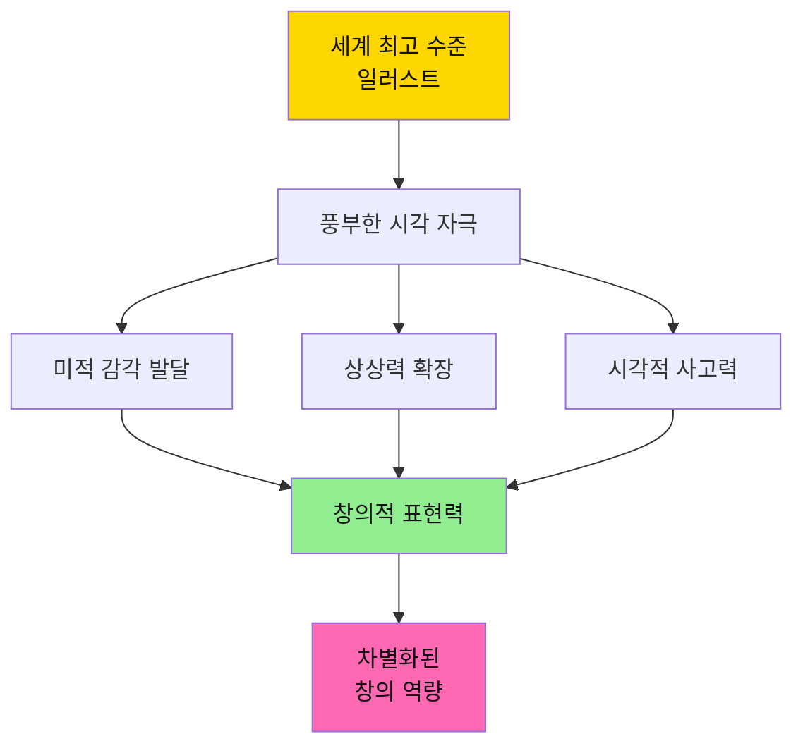

#### 🎨 **"많이 본다"는 것의 교육적 의미**

| 차원 | 일반 학습지 | 프뢰벨 그림책 | 교육 효과 |
|------|-----------|-------------|---------|
| **시각적 자극** | ⭐⭐ 단순 삽화 | ⭐⭐⭐⭐⭐ 예술 작품급 | 뇌의 시각 영역 활성화 |
| **색감 경험** | 제한적 컬러 | 풍부한 색상 팔레트 | 색채 감각 발달 |
| **구도와 레이아웃** | 획일적 배치 | 창의적 화면 구성 | 공간 지각력 향상 |
| **다양한 화풍** | 단일 스타일 | 세계 각국 화가의 스타일 | 다양성 이해, 안목 형성 |

#### 💡 **실천 방법**

**매일 30분, 질 높은 그림책 보기**
- ✅ 세계적 일러스트레이터의 작품 감상
- ✅ 다양한 화풍과 스타일 경험 (수채화, 판화, 콜라주 등)
- ✅ "이 그림에서 뭐가 보여?" 질문하며 관찰력 키우기
- ✅ 같은 책을 반복해서 보며 새로운 디테일 발견하기

**결과**: 아이는 무의식적으로 **높은 수준의 미적 기준**을 내면화하게 됩니다.

---

## Q2. 왜 "직접 사용하는 것"이 중요한가요?

### A: 몸으로 경험해야 진짜 학습이 일어납니다.

#### 🛠️ **체험형 학습의 위력**

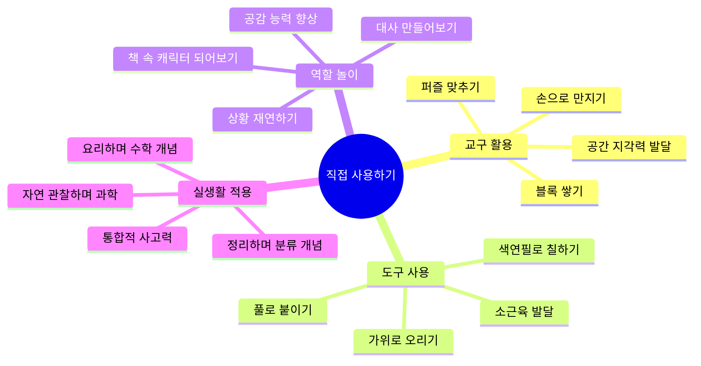

#### 🧠 **손과 뇌의 연결: 사용을 통한 학습**

| 활동 | 사용하는 도구/재료 | 발달 영역 | 창의성 연결 |
|------|---------------|---------|-----------|
| **그림책 따라 그리기** | 크레용, 색연필, 물감 | 시각-운동 협응 | 표현력 발달 |
| **이야기 재구성** | 인형, 블록, 역할놀이 소품 | 서사 이해력 | 스토리텔링 능력 |
| **만들기 프로젝트** | 종이, 풀, 재활용품 | 공간 지각, 문제 해결 | 입체적 사고 |
| **과학 실험** | 간단한 실험 도구 | 관찰력, 논리력 | 가설 설정 능력 |

#### 💡 **실천 방법**

**주말마다 1시간, 책 내용을 현실로 옮기기**
- ✅ 그림책에 나온 캐릭터를 종이로 만들기
- ✅ 이야기 속 장면을 집에서 재현해보기
- ✅ 책에서 본 과학 원리를 실험으로 확인하기
- ✅ 요리책을 보고 함께 간단한 요리 만들기

**핵심**: "아, 이게 이렇게 되는구나!"라는 **체화된 깨달음**이 진짜 창의성의 씨앗입니다.

---

## Q3. "만들기"가 왜 창의성에 필수적인가요?

### A: 창의성은 생산하는 과정에서 폭발합니다.

#### ⚙️ **제작 과정 = 창의적 사고의 전 과정**

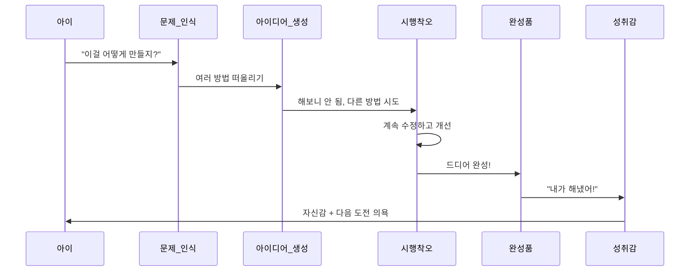

#### 🎯 **만들기의 5단계 창의 프로세스**

| 단계 | 활동 | 발달 능력 | 실제 적용 |
|------|------|---------|---------|
| **1. 문제 정의** | "뭘 만들까?" | 목표 설정 능력 | 프로젝트 기획력 |
| **2. 계획 수립** | "어떤 재료가 필요할까?" | 논리적 사고 | 자원 관리 능력 |
| **3. 실행** | "직접 만들어보기" | 실행력, 끈기 | 추진력 |
| **4. 문제 해결** | "안 되네? 다르게 해보자" | 유연한 사고 | 혁신 능력 |
| **5. 완성과 평가** | "잘 됐나? 더 나아질까?" | 비판적 사고 | 개선 마인드셋 |

#### 💡 **실천 방법: 연령별 만들기 프로젝트**

**유아기 (4-7세)**
- 📘 책에 나온 동물을 종이접기로 만들기
- 🎨 이야기 속 배경을 그려서 나만의 그림책 만들기
- 🏠 블록으로 책 속 집 만들기

**초등 저학년 (8-9세)**
- 📖 읽은 책 내용을 4컷 만화로 그리기
- 🎭 등장인물 가면 만들어 연극하기
- 🔬 책에 나온 과학 원리를 실험 키트로 재현하기

**초등 고학년 (10-13세)**
- 📚 책 내용을 바탕으로 나만의 후속편 쓰고 일러스트 그리기
- 🎬 스톱모션 애니메이션으로 이야기 재창작
- 💻 간단한 코딩으로 책 속 게임 만들기

**핵심**: 만드는 과정에서 **"어? 이렇게 하면 어떨까?"**라는 질문이 계속 생깁니다. 이것이 바로 **혁신의 시작점**입니다.

---

## Q4. "자극받는 것"이 왜 그렇게 중요한가요?

### A: 풍부한 자극이 뇌를 성장시키고 창의성을 깨웁니다.

#### 🧩 **다양한 자극 = 뇌의 신경망 확장**

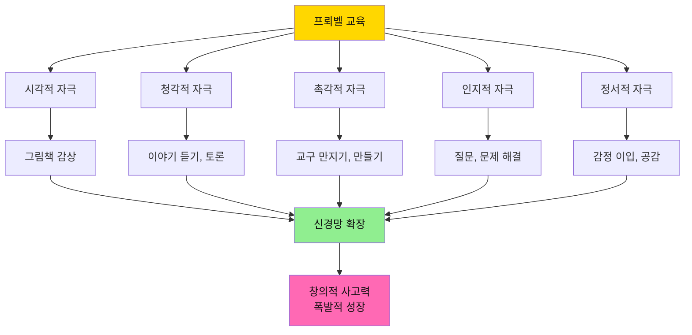

#### 🌈 **프뢰벨이 제공하는 다차원 자극**

| 자극 유형 | 프뢰벨의 제공 방식 | 뇌 발달 영역 | 미래 역량 |
|---------|---------------|------------|---------|
| **시각 자극** | 세계 최상급 그림책 일러스트 | 후두엽 (시각 피질) | 디자인 감각, 미적 안목 |
| **언어 자극** | 깊이 있는 스토리, 철학적 질문 | 측두엽 (언어 영역) | 논리력, 표현력 |
| **정서 자극** | 공감 가는 캐릭터, 감동적 이야기 | 변연계 (정서 중추) | 공감 능력, 감성 지능 |
| **인지 자극** | "왜?"를 묻는 열린 질문 | 전두엽 (사고 영역) | 비판적 사고, 문제 해결력 |
| **운동 자극** | 만들기, 역할놀이, 표현 활동 | 운동 피질 | 신체 협응력, 표현력 |

#### ⚡ **자극의 양 vs 자극의 질**

| 구분 | 저품질 자극 (일반 학습지) | 고품질 자극 (프뢰벨) | 결과 차이 |
|------|---------------------|----------------|---------|
| **시각** | 단조로운 삽화 | 예술성 있는 그림 | 🎨 미적 기준 차이 |
| **내용** | 정답 찾기 문제 | 열린 질문, 토론 거리 | 💭 사고 깊이 차이 |
| **활동** | 문제 풀이 반복 | 만들기, 탐구, 창작 | 🚀 창의력 차이 |
| **정서** | 성적 압박 | 즐거운 발견의 기쁨 | 😊 학습 태도 차이 |

#### 💡 **실천 방법: 풍부한 자극 환경 만들기**

**일상 속 자극 극대화**

1. **시각 자극 늘리기**
   - ✅ 집에 프뢰벨 그림책을 눈에 보이는 곳에 비치
   - ✅ 미술관, 박물관 정기적으로 방문 (월 1회)
   - ✅ 아이 방을 아이가 만든 작품으로 꾸미기

2. **언어 자극 늘리기**
   - ✅ 매일 저녁 책 읽고 30분 토론하기
   - ✅ "왜 그렇게 생각해?" 질문 자주 하기
   - ✅ 아이의 엉뚱한 상상도 진지하게 경청하기

3. **촉각/운동 자극 늘리기**
   - ✅ 주말마다 만들기 재료 제공 (자유롭게 창작)
   - ✅ 요리, 정원 가꾸기 등 실생활 활동 함께하기
   - ✅ 야외 활동으로 자연 탐색하기

4. **사회적 자극 늘리기**
   - ✅ 다른 아이들과 함께 그림책 읽고 토론하기
   - ✅ 가족 프로젝트로 큰 작품 만들기
   - ✅ 지역 도서관, 문화센터 프로그램 참여

**핵심**: 자극이 **많고 다양할수록**, 아이의 뇌는 **더 많은 연결을 만들고**, 창의성은 **기하급수적으로 성장**합니다.

---

## 🌍 AI 시대 특별 섹션

---

## Q5. AI 시대, 왜 프뢰벨 교육이 더욱 중요해졌나요?

### A: 전세계 교육이 "암기"에서 "창의적 문제 해결"로 대전환하고 있기 때문입니다.

#### 🚀 **글로벌 교육 패러다임의 대변혁**

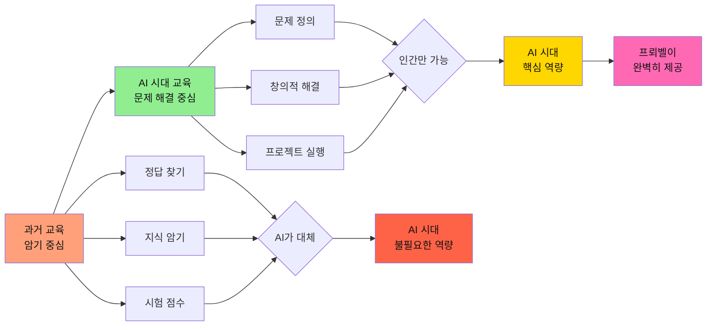

#### ⚡ **AI 시대 교육의 핵심 변화**

| 변화 항목 | 과거 교육 시스템 | AI 시대 교육 시스템 | 프뢰벨의 역할 |
|---------|--------------|-----------------|-----------|
| **평가 방식** | 수능 점수 중심 | 프로젝트 기반 평가 | ✅ 포트폴리오 자연스럽게 구축 |
| **필요 역량** | 암기력, 문제 풀이 | 문제 인식, 창의적 해결 | ✅ "왜?"를 묻는 습관 형성 |
| **학습 방법** | 주입식 강의 | 가상공간 프로젝트 제작 | ✅ 만들고 실행하는 경험 |
| **핵심 능력** | 개인 성적 | 협업과 소통 능력 | ✅ 놀이문화로 관계 교육 |
| **사고 방식** | 단일 정답 찾기 | 다각적 관점 분석 | ✅ 시각과 공간 능력 발달 |

#### 🎯 **왜 프뢰벨이 AI 시대 최적의 교육인가?**

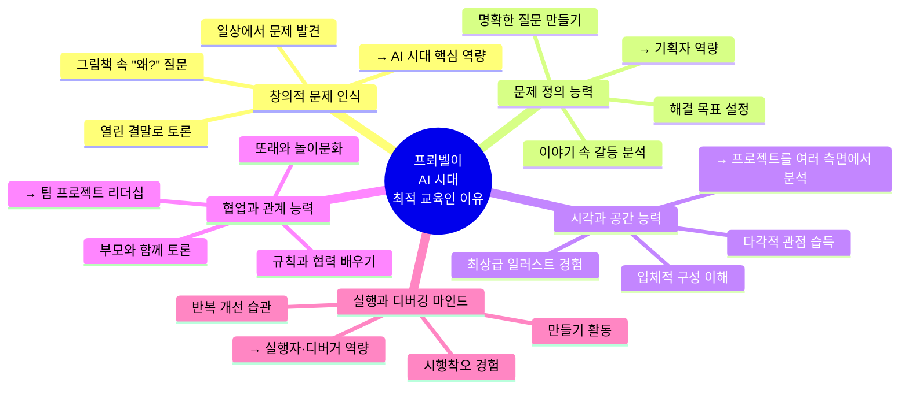

#### 💡 **구체적 연결: 프뢰벨 → AI 시대 역량**

**프뢰벨 교육 활동 → AI 시대 필요 역량 직접 연결**

1. **그림책 속 질문 토론**
   - 프뢰벨: "주인공은 왜 그랬을까?"
   - → AI 시대: **창의적 문제 인식 능력**
   - → 결과: 일상에서 해결할 문제를 스스로 발견

2. **이야기 속 갈등 분석**
   - 프뢰벨: "정확히 무엇이 문제일까?"
   - → AI 시대: **문제 정의 능력 (기획자 핵심)**
   - → 결과: AI에게 정확한 지시를 내릴 수 있는 기획력

3. **세계적 일러스트 감상**
   - 프뢰벨: 다양한 화풍과 구도 경험
   - → AI 시대: **시각·공간 능력, 다각적 관점**
   - → 결과: 프로젝트를 여러 측면에서 분석하고 개선

4. **부모-자녀 함께 읽기**
   - 프뢰벨: 토론하고 생각 나누기
   - → AI 시대: **협업과 소통 능력**
   - → 결과: 팀 프로젝트에서 리더십 발휘

5. **만들기와 표현 활동**
   - 프뢰벨: 직접 만들고 개선하기
   - → AI 시대: **실행과 디버깅 마인드**
   - → 결과: AI 도구로 프로토타입 만들고 반복 개선

#### 🌟 **결론: 프뢰벨은 AI 시대를 위해 설계된 교육**

**놀랍게도 프뢰벨 교육 철학은 이미 100년 전부터 AI 시대가 요구하는 역량을 키워왔습니다!**

- ✅ **암기가 아닌 사고**: AI가 못 하는 창의적 문제 인식
- ✅ **정답이 아닌 과정**: 다양한 해결책 탐색하는 유연성
- ✅ **개인이 아닌 협업**: 팀으로 더 큰 가치 창출
- ✅ **이론이 아닌 실행**: 직접 만들고 개선하는 실전 경험

**→ 프뢰벨로 키운 아이는 AI 시대의 주인공이 됩니다!**

---

## Q6. 기획자+실행자+디버거 역량, 프뢰벨로 어떻게 키울 수 있나요?

### A: 프뢰벨의 모든 활동이 이 세 가지 역량을 통합적으로 키웁니다.

#### 🎯 **AI 시대 핵심 인재: 기획자+실행자+디버거**

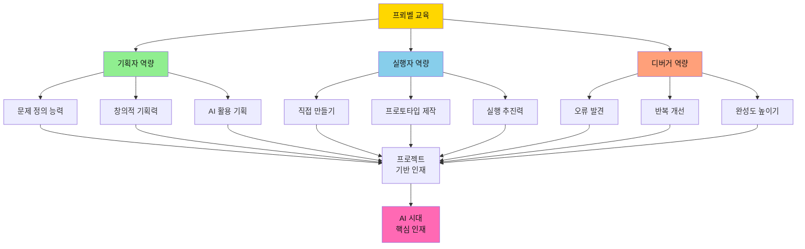

#### 📋 **프뢰벨 활동으로 키우는 3대 역량**

| 역량 | 프뢰벨 교육 방법 | 구체적 활동 예시 | 미래 적용 |
|------|--------------|---------------|---------|
| **기획자<br/>Planning** | 그림책 읽고 문제 정의하기<br/>질문 던지고 목표 설정 | • "이 문제를 어떻게 해결할까?"<br/>• "내가 만든다면?" 상상<br/>• 해결 계획 세우기 | AI에게 정확한 지시<br/>프로젝트 전체 기획<br/>목표와 방향 설정 |
| **실행자<br/>Execution** | 직접 만들고 표현하기<br/>아이디어를 현실로 | • 그림 그리기, 만들기<br/>• 역할놀이로 재현<br/>• 간단한 프로젝트 완성 | AI 도구로 실제 제작<br/>프로토타입 빠른 구현<br/>아이디어 실현 능력 |
| **디버거<br/>Debugging** | 시행착오 경험하기<br/>개선하고 완성하기 | • "안 되네? 다르게 해보자"<br/>• 반복해서 수정하기<br/>• 더 나은 방법 찾기 | 오류 찾고 수정<br/>반복적 개선<br/>완성도 높이기 |

#### 🔄 **프뢰벨 활동의 완벽한 사이클**

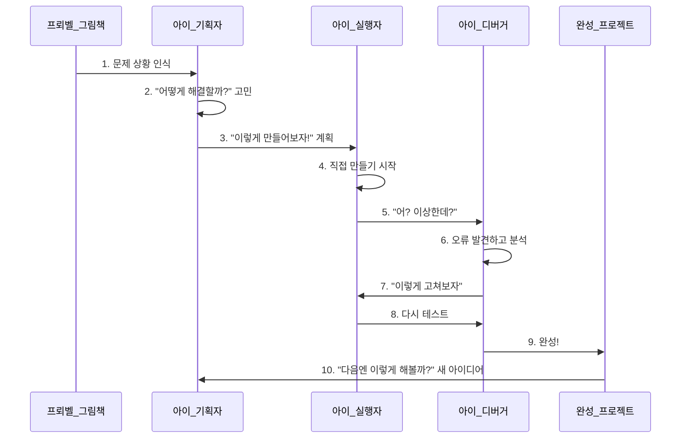

#### 💡 **연령별 3대 역량 개발 로드맵**

**유아기 (4-7세): 기초 다지기**
- 🎯 **기획자**: "왜?"라고 묻는 습관, 문제 발견하기
- 🎨 **실행자**: 그림 그리기, 블록 쌓기, 간단한 만들기
- 🔧 **디버거**: "안 되면 다르게 해보기" 경험

**초등 저학년 (8-9세): 통합 연습**
- 🎯 **기획자**: 간단한 프로젝트 목표 정하기
- 🎨 **실행자**: 아이디어를 작품으로 만들기
- 🔧 **디버거**: 실패하면 원인 찾고 개선하기

**초등 고학년 (10-13세): AI 도구와 결합**
- 🎯 **기획자**: AI 활용 프로젝트 기획
- 🎨 **실행자**: AI 도구로 빠르게 프로토타입 제작
- 🔧 **디버거**: 반복 테스트하며 완성도 높이기

#### 🌟 **실전 예시: 프뢰벨 교육 → AI 프로젝트**

**7세 아이의 성장 스토리**

1. **유아기 (프뢰벨 그림책)**
   - 그림책: "동물 친구들이 다리를 만드는 이야기"
   - 활동: "왜 다리가 필요했을까?" (기획자)
   - 활동: 블록으로 다리 만들기 (실행자)
   - 활동: "무너졌네? 더 튼튼하게!" (디버거)

2. **초등 저학년 (확장)**
   - 관심사: 우리 동네 다리 관찰
   - 활동: 다리 종류 조사하고 그림 그리기
   - 활동: 종이로 나만의 다리 설계

3. **초등 고학년 (AI 활용)**
   - 프로젝트: "우리 동네에 필요한 다리 디자인"
   - 기획: 문제 정의, 목표 설정
   - 실행: AI 디자인 툴로 3D 모델 제작
   - 디버깅: 구조 문제 발견하고 개선
   - 결과: 대회 출품, 수상!

**→ 이것이 바로 AI 시대가 요구하는 프로젝트 기반 교육입니다!**

---

## Q7. 기업가 정신 교육, 프뢰벨과 어떤 관계가 있나요?

### A: 기업가 정신의 핵심은 "문제 발견과 해결"인데, 이것이 바로 프뢰벨 교육의 본질입니다.

#### 🚀 **기업가 정신 = 창의적 문제 해결 능력**

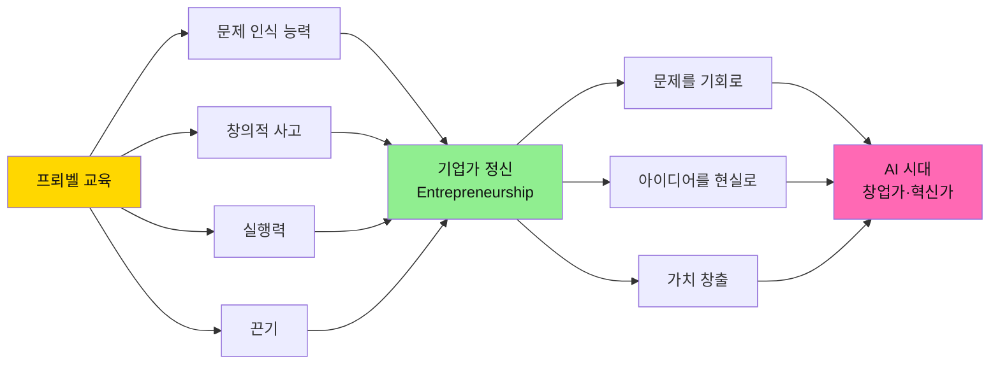

#### 💡 **기업가 정신의 5대 요소와 프뢰벨의 연결**

| 기업가 정신 요소 | 프뢰벨이 키우는 방법 | 구체적 활동 | 미래 적용 |
|--------------|----------------|-----------|---------|
| **문제 발견<br/>Problem Finding** | 그림책 속 상황에서<br/>문제 인식하기 | "이 캐릭터의 문제는 뭘까?"<br/>"우리 생활에도 있을까?" | 시장의 니즈 발견<br/>해결해야 할 과제 파악 |
| **창의적 해결<br/>Creative Solution** | 다양한 해결 방법<br/>상상하고 토론하기 | "만약 내가 해결한다면?"<br/>"이렇게 하면 어떨까?" | 혁신적인 제품·서비스<br/>차별화된 솔루션 |
| **실행력<br/>Execution** | 아이디어를 직접<br/>만들어보기 | 만들기, 그리기, 프로젝트<br/>실제로 완성하기 | 빠른 프로토타입<br/>MVP 제작 능력 |
| **끈기와 회복력<br/>Resilience** | 실패해도 다시 시도<br/>개선하기 | "안 되면 다른 방법으로"<br/>포기하지 않고 완성 | 스타트업의 피봇팅<br/>실패에서 배우기 |
| **가치 창출<br/>Value Creation** | 다른 사람에게<br/>보여주고 나누기 | 작품 전시, 발표<br/>친구들과 공유 | 고객 가치 제공<br/>사회 문제 해결 |

#### 🌱 **유아기부터 시작하는 기업가 정신 교육**

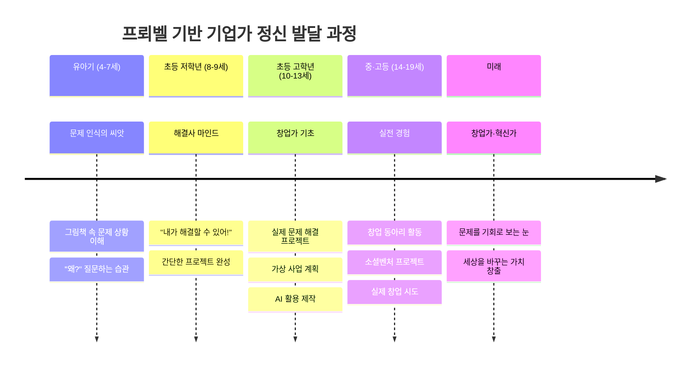

#### 🎯 **실전 예시: 프뢰벨 → 기업가 정신**

**실제 사례: 9세 아이의 문제 해결 프로젝트**

1. **문제 발견 (프뢰벨 그림책)**
   - 그림책: "할머니가 무거운 짐을 들고 힘들어하는 이야기"
   - 아이의 관찰: "우리 할머니도 장보기 힘들어하시네?"
   - **→ 일상에서 문제를 발견하는 눈 (기업가 정신 1단계)**

2. **해결책 구상 (창의적 사고)**
   - 토론: "할머니를 어떻게 도와드릴까?"
   - 아이디어: "바퀴 달린 가방을 만들면 어떨까?"
   - **→ 창의적 솔루션 생각 (기업가 정신 2단계)**

3. **프로토타입 제작 (실행력)**
   - 만들기: 작은 상자에 장난감 바퀴 붙이기
   - 테스트: 실제로 물건을 넣어보기
   - **→ 아이디어를 현실로 (기업가 정신 3단계)**

4. **개선과 완성 (디버깅)**
   - 문제: "바퀴가 잘 안 굴러가네?"
   - 개선: 더 큰 바퀴로 교체, 손잡이 추가
   - **→ 반복 개선의 경험 (기업가 정신 4단계)**

5. **가치 공유 (가치 창출)**
   - 발표: 학교에서 프로젝트 발표
   - 확장: "다른 할머니들도 도울 수 있어!"
   - **→ 사회적 가치 인식 (기업가 정신 5단계)**

**→ 이것이 바로 미래의 창업가가 되는 과정입니다!**

#### 🌟 **프뢰벨 vs 일반 교육: 기업가 정신 비교**

| 측면 | 일반 교육 | 프뢰벨 교육 | 결과 차이 |
|------|---------|----------|---------|
| **문제 인식** | 주어진 문제만 풀기 | 스스로 문제 발견하기 | 수동 vs 능동 |
| **해결 방식** | 정답 찾기 | 창의적 해결책 만들기 | 추종 vs 혁신 |
| **실패 태도** | 실패 = 나쁨 | 실패 = 배움의 기회 | 두려움 vs 도전정신 |
| **결과물** | 점수화된 시험지 | 실제 작동하는 프로젝트 | 이론 vs 실전 |
| **미래 역량** | 직장인 | 창업가·혁신가 | 제한 vs 무한 가능성 |

#### 💎 **결론: 모든 아이는 잠재적 창업가**

**기업가 정신은 타고나는 것이 아닙니다.**  
**프뢰벨 교육으로 체계적으로 키울 수 있습니다.**

- ✅ 문제를 발견하는 눈
- ✅ 해결책을 만드는 손
- ✅ 가치를 창출하는 마음

**→ 프뢰벨로 키운 아이는 세상을 바꾸는 혁신가가 됩니다!**

---

## Q8. 전세계 교육이 프로젝트 기반으로 바뀌는데, 프뢰벨이 왜 유리한가요?

### A: 프뢰벨 교육 자체가 이미 "프로젝트 기반 학습"의 완벽한 모델이기 때문입니다.

#### 📊 **프로젝트 기반 교육의 세계적 확산**

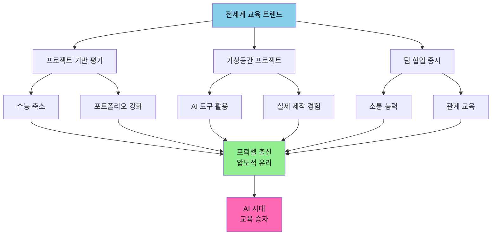

#### 🎯 **프로젝트 기반 학습 = 프뢰벨의 일상**

| 프로젝트 기반 학습 요소 | 일반 교육 | 프뢰벨 교육 | 우위 |
|-------------------|---------|----------|-----|
| **문제 정의 능력** | ❌ 주어진 문제만 | ✅ 스스로 발견하고 정의 | ⭐⭐⭐⭐⭐ |
| **창의적 기획** | ⭐ 제한적 | ⭐⭐⭐⭐⭐ 자유로운 상상 | ⭐⭐⭐⭐⭐ |
| **실제 제작 경험** | ⭐⭐ 가끔 실습 | ⭐⭐⭐⭐⭐ 매일 만들기 | ⭐⭐⭐⭐⭐ |
| **협업 능력** | ⭐⭐ 형식적 조별 활동 | ⭐⭐⭐⭐⭐ 놀이로 자연스럽게 | ⭐⭐⭐⭐⭐ |
| **다각적 관점** | ⭐ 정답 중심 | ⭐⭐⭐⭐⭐ 열린 토론 | ⭐⭐⭐⭐⭐ |
| **포트폴리오** | ⭐ 고3 때 급조 | ⭐⭐⭐⭐⭐ 유아기부터 누적 | ⭐⭐⭐⭐⭐ |
| **실패 경험** | ❌ 실패 두려움 | ✅ 시행착오 환영 | ⭐⭐⭐⭐⭐ |

#### 🔄 **프뢰벨의 프로젝트 학습 사이클**

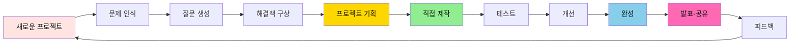

**→ 이 사이클이 유아기부터 매일 반복됩니다!**

#### 💡 **실전 비교: 프로젝트 평가에서의 우위**

**시나리오: 고등학교 "지역 문제 해결" 프로젝트**

**일반 학생 (고3 때 처음 시도)**
```
1. 문제 정의: 막막함 😰
   - "뭘 해야 하지?" 고민만 3주
   
2. 기획: 경험 부족
   - 인터넷 검색으로 베끼기
   
3. 실행: 두려움
   - "실패하면 어쩌지?" 주저함
   
4. 결과: 형식적
   - PPT만 만들고 끝
   - 진정성 없음
```

**프뢰벨 출신 학생 (10년 경험)**
```
1. 문제 정의: 즉각 인식 ✨
   - "일상에서 느낀 불편함" 바로 떠올림
   - 유아기부터 훈련된 문제 발견 능력
   
2. 기획: 창의적 ✨
   - 다양한 해결책 제시
   - AI 활용 계획 수립
   
3. 실행: 자신감 ✨
   - "해봤던 경험이 있어!"
   - 프로토타입 빠르게 제작
   
4. 결과: 실제 작동 ✨
   - 진짜 문제 해결하는 결과물
   - 10년간 쌓은 진정성
   
→ 대회 수상, 입시 압도적 우위!
```

#### 🌍 **글로벌 사례: 프로젝트 기반 교육 선진국**

**핀란드, 싱가포르, 미국 등 교육 선진국의 공통점**

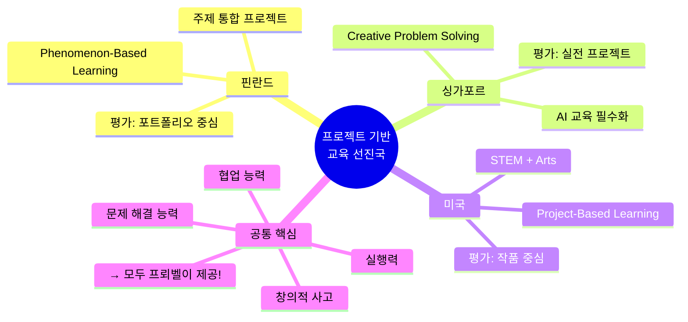

#### 🚀 **프뢰벨 출신의 프로젝트 기반 평가 우위**

**대학 입시 시나리오 비교**

| 평가 요소 | 일반 학생 | 프뢰벨 출신 | 점수 차이 |
|---------|---------|----------|---------|
| **포트폴리오 진정성** | ⭐⭐ 고3 급조 | ⭐⭐⭐⭐⭐ 10년 누적 | **3배 차이** |
| **문제 정의 능력** | ⭐⭐ 막연함 | ⭐⭐⭐⭐⭐ 명확함 | **3배 차이** |
| **실행 경험** | ⭐ 이론만 | ⭐⭐⭐⭐⭐ 수십 개 프로젝트 | **5배 차이** |
| **면접 설득력** | ⭐⭐ 외운 답변 | ⭐⭐⭐⭐⭐ 진짜 경험 이야기 | **3배 차이** |
| **협업 능력** | ⭐⭐ 형식적 | ⭐⭐⭐⭐⭐ 자연스러움 | **3배 차이** |

**→ 종합 경쟁력: 일반 학생 대비 3-5배 우위!**

#### 💎 **결론: 프뢰벨은 미래 교육의 정답**

**전세계가 프로젝트 기반 교육으로 전환하고 있는 지금,**  
**프뢰벨은 이미 100년 전부터 이 교육을 실천해왔습니다.**

- ✅ **문제 정의**: 유아기부터 "왜?"를 묻는 습관
- ✅ **창의적 기획**: 상상력을 현실 계획으로
- ✅ **실제 제작**: 매일 만들고 표현하는 경험
- ✅ **협업 능력**: 놀이문화로 자연스럽게
- ✅ **포트폴리오**: 10년간 진정성 있는 누적

**→ 프뢰벨로 키운 아이는 전세계 어디서나 경쟁력 있습니다!**

---

## Q9. 프뢰벨과 다른 교육의 가장 큰 차이는 무엇인가요?

### A: "소비형 학습" vs "생산형 학습"의 차이입니다.

#### 📊 **교육 패러다임 비교**

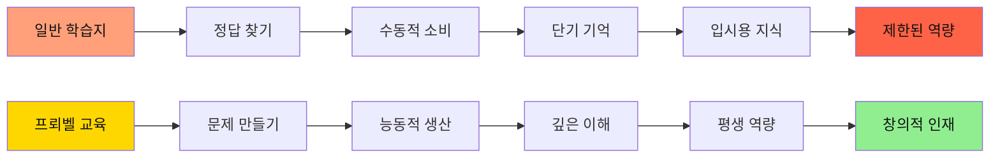

| 차원 | 일반 교육 (소비형) | 프뢰벨 교육 (생산형) | 10년 후 차이 |
|------|---------------|----------------|------------|
| **학습 방식** | 주어진 문제 풀기 | 스스로 질문 만들기 | 수동 vs 능동 사고 |
| **결과물** | 채점된 시험지 | 창작물, 포트폴리오 | 일회성 vs 누적 자산 |
| **사고 패턴** | "정답이 뭐지?" | "더 좋은 방법은?" | 추종자 vs 혁신가 |
| **동기** | 외적 (성적, 칭찬) | 내적 (호기심, 성취감) | 번아웃 vs 지속 성장 |

#### 🌟 **프뢰벨이 키우는 4가지 핵심 역량**

1. **보는 눈 (Vision)**
   - 세상을 아름답게 보는 미적 감각
   - 문제를 발견하는 통찰력
   - 본질을 꿰뚫는 안목

2. **사용하는 손 (Execution)**
   - 도구를 능숙하게 다루는 실행력
   - 아이디어를 현실로 만드는 추진력
   - 시행착오를 두려워하지 않는 도전 정신

3. **만드는 힘 (Creation)**
   - 없던 것을 새로 창조하는 능력
   - 기존 것을 개선하는 혁신력
   - 자신만의 스타일을 구축하는 독창성

4. **자극받는 감수성 (Sensitivity)**
   - 작은 변화도 감지하는 섬세함
   - 다양한 관점을 받아들이는 열린 마음
   - 배움의 기회를 놓치지 않는 깨어있음

---

## 🎨 창의성 개발 핵심 섹션

---

## Q10. 바쁜 부모도 프뢰벨 교육을 할 수 있나요?

### A: 네, 단 30분으로 충분합니다. 핵심은 "질"입니다.

#### ⏰ **시간 투자 vs 교육 효과**

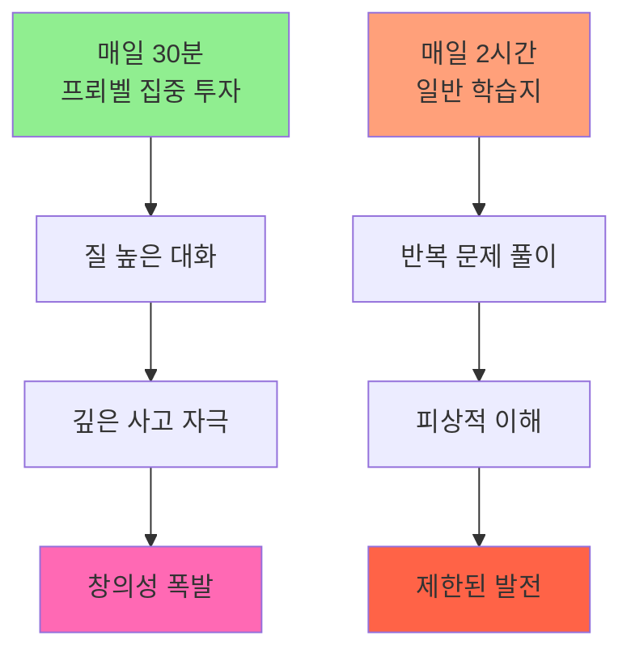

#### 💡 **바쁜 부모를 위한 30분 루틴**

**저녁 30분, 이렇게 하세요**

| 시간 | 활동 | 부모 역할 | 효과 |
|------|------|---------|------|
| **0-10분** | 그림책 함께 읽기 | 따뜻한 목소리로 읽어주기 | 정서적 유대감 |
| **10-20분** | 질문하고 대화하기 | "왜 그랬을까?" "넌 어떻게 생각해?" | 사고력 자극 |
| **20-30분** | 간단히 표현하기 | "그림으로 그려볼까?" "만들어볼까?" | 창의적 표현 |

**핵심 원칙 3가지**
1. ✅ **스마트폰 내려놓기**: 온전히 아이에게 집중
2. ✅ **정답 강요 안 하기**: 아이의 생각 경청
3. ✅ **과정 칭찬하기**: 결과보다 노력과 시도를 인정

**주말 1시간 추가 활동**
- 🎨 평일에 읽은 책 내용으로 만들기 프로젝트
- 🌳 야외에서 책 속 내용을 실제로 관찰하기
- 📚 도서관 방문해서 관련 책 더 찾아보기

**결과**: 매일 30분 × 365일 = **연간 182시간**의 집중 투자!  
→ 10년이면 **1,820시간**의 창의 교육 누적!

---

## Q11. 프뢰벨 교육, 정말 대학 입시에 도움이 되나요?

### A: 네. 그러나 입시를 넘어 "평생 경쟁력"을 만듭니다.

#### 🎓 **입시 경쟁력: 프뢰벨 출신의 압도적 우위**

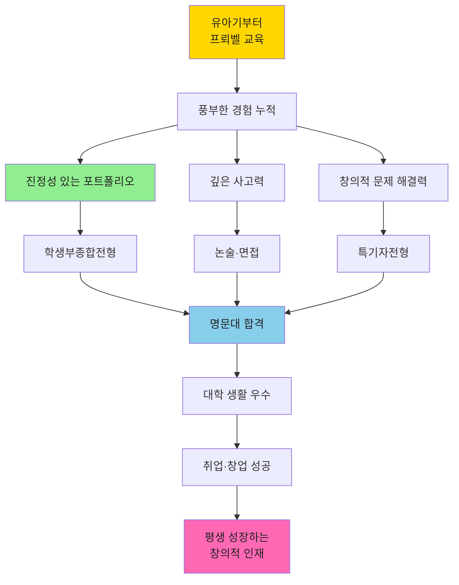

#### 📈 **입시 경쟁력 구체적 분석**

| 전형 | 프뢰벨 출신의 강점 | 일반 학생과의 차이 | 합격률 영향 |
|------|--------------|--------------|----------|
| **학생부종합** | 유아기부터 쌓은 진정성 있는 활동 기록 | "고3 때 급조한 스펙" vs "10년 스토리" | ⭐⭐⭐⭐⭐ |
| **논술** | 비판적 사고력, 문제 정의 능력 | 논리 구조력 압도적 차이 | ⭐⭐⭐⭐⭐ |
| **면접** | 자신의 경험을 명확히 설명하는 힘 | 진정성 있는 답변 vs 외운 답변 | ⭐⭐⭐⭐⭐ |
| **수능** | 독해력, 사고력 기반 문제 해결 | 기본 역량 탄탄함 | ⭐⭐⭐⭐ |

#### 💼 **입시를 넘어: 진짜 경쟁력**

**대학 입학은 시작일 뿐입니다.**

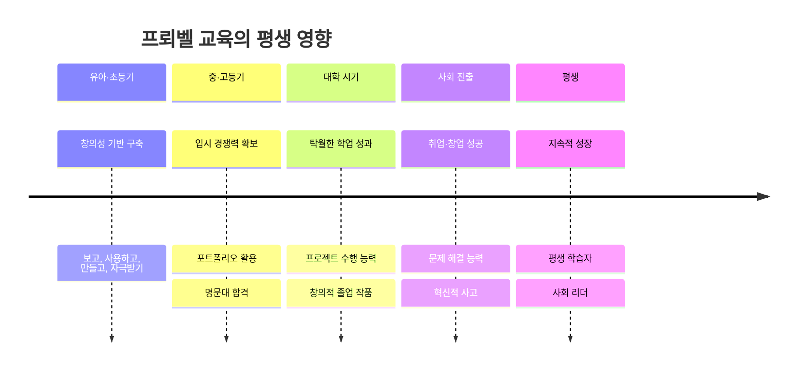

**프뢰벨 교육이 만드는 평생 자산**
- 🧠 **배우는 방법을 아는 능력**: 새로운 분야도 빠르게 습득
- 💡 **문제를 발견하고 해결하는 능력**: 혁신가의 자질
- 🎨 **창의적으로 표현하는 능력**: 차별화된 경쟁력
- 🌱 **실패를 두려워하지 않는 도전 정신**: 성장 마인드셋
- 😊 **배움 자체를 즐기는 태도**: 평생 행복의 원천

---

## Q12. 비용 대비 효과가 있나요?

### A: 최고의 투자 수익률(ROI)을 보장합니다.

#### 💰 **교육 투자 비교: 10년 관점**

| 항목 | 일반 교육 (후기 집중형) | 프뢰벨 교육 (조기 집중형) | ROI 비교 |
|------|-------------------|---------------------|---------|
| **유아·초등기** | 최소 비용 | 집중 투자 | - |
| **중·고등기** | 엄청난 사교육비 (억대 가능) | 기본 관리만 필요 | ✅ 절감 |
| **재수·삼수** | 추가 1년 = 수천만원 | 1년 안에 합격 | ✅ 절감 |
| **대학 생활** | 따라가기 급급 | 여유롭게 우수 성적 | ✅ 장학금 |
| **취업 준비** | 오랜 시간 소요 | 빠른 취업 | ✅ 기회비용 감소 |
| **커리어** | 평범한 직장인 | 창의적 전문가 | ✅ 소득 차이 |

#### 📊 **실제 비용 시뮬레이션 (10년 기준)**

**시나리오 A: 일반 교육 (후기 집중형)**
```
유아·초등기: 연 300만원 × 6년 = 1,800만원
중·고등기: 연 2,000만원 × 6년 = 1억 2,000만원
재수 가능성: 50% × 4,000만원 = 2,000만원
─────────────────────────
총 합계: 약 1억 5,800만원
```

**시나리오 B: 프뢰벨 교육 (조기 집중형)**
```
유아·초등기: 연 500만원 × 6년 = 3,000만원 (프뢰벨 + 기타)
중·고등기: 연 1,000만원 × 6년 = 6,000만원 (기본 관리)
재수 가능성: 거의 없음 = 0원
─────────────────────────
총 합계: 약 9,000만원
절감액: 6,800만원!
```

#### 🌟 **금전적 가치를 넘어서**

**프뢰벨 교육은 돈으로 환산할 수 없는 가치를 제공합니다**

1. **아이의 행복**
   - 💚 억지 공부가 아닌 즐거운 배움
   - 💚 자신감과 자존감 발달
   - 💚 평생 이어지는 배움의 즐거움

2. **가족의 평화**
   - 💙 "공부해!"라는 잔소리 필요 없음
   - 💙 함께 책 읽는 따뜻한 시간
   - 💙 아이의 성장을 보는 기쁨

3. **사회적 가치**
   - 💛 창의적 문제 해결자 양성
   - 💛 다음 세대를 이끌 리더
   - 💛 사회에 긍정적 영향을 미치는 인재

**결론**: 프뢰벨 교육은 **금전적으로도, 인간적으로도 최고의 투자**입니다.

---

## Q13. 지금 시작하면 늦지 않았나요?

### A: 지금 이 순간이 가장 빠른 시작입니다.

#### ⏰ **연령별 시작 전략**

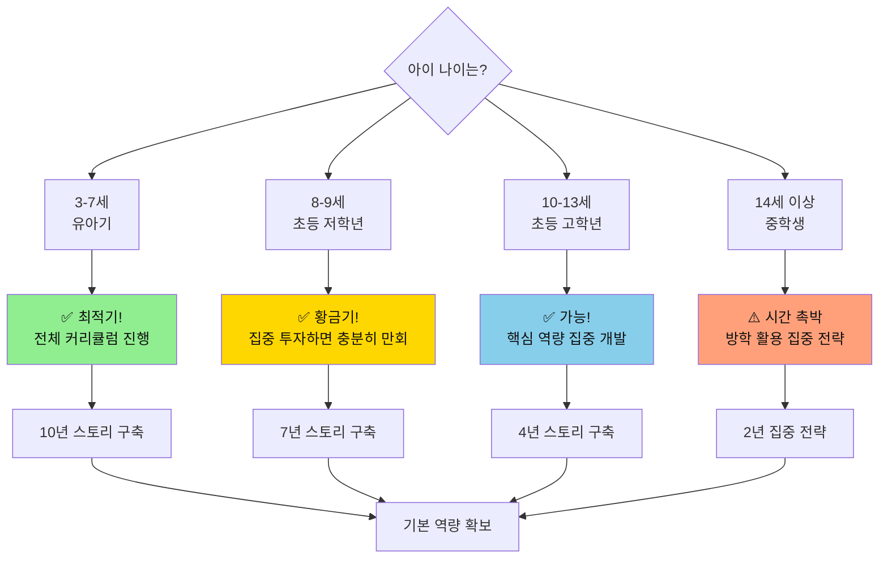

#### 🚀 **늦게 시작해도 괜찮은 이유**

| 상황 | 전략 | 집중 영역 | 기대 효과 |
|------|------|---------|---------|
| **이미 초등 고학년** | 남은 시간 최대 활용 | 독서·글쓰기·프로젝트 집중 | 3-4년이면 충분한 포트폴리오 |
| **중학생** | 방학 집중 전략 | 관심 분야 깊이 파기 | 차별화된 특기 개발 |
| **수학·영어만 했음** | 균형 잡힌 역량 개발 | 창의성·인문학적 사고 보완 | 입체적 인재상 완성 |

#### 💡 **늦게 시작하는 아이를 위한 집중 전략**

**1단계: 독서 습관 급속 형성 (1-2개월)**
- 📚 매일 30분 프뢰벨 그림책 읽기
- 📚 흥미로운 주제부터 시작 (아이가 좋아하는 것)
- 📚 부담 없이, 재미있게!

**2단계: 관심 분야 발견 (2-3개월)**
- 🔍 다양한 주제의 책 탐색
- 🔍 "이거 재미있다!" 하는 분야 집중
- 🔍 관련 활동으로 확장 (박물관, 체험 등)

**3단계: 작은 프로젝트 시작 (3-6개월)**
- 🎯 관심 주제로 간단한 탐구 프로젝트
- 🎯 결과물 만들기 (보고서, 작품 등)
- 🎯 성취감 맛보기!

**4단계: 본격 포트폴리오 구축 (계속)**
- 📁 프로젝트 규모 점진적 확대
- 📁 대회 참가, 작품 발표
- 📁 지속적 기록 누적

**핵심**: 시작이 늦었다면 **속도보다 깊이**로 승부하세요!  
→ 짧은 시간이라도 **진정성 있는 몰입**이 더 중요합니다.

---

## Q14. 프뢰벨만으로 충분한가요? 다른 교육과 병행해야 하나요?

### A: 프뢰벨은 "기반"이고, 선택적으로 보완하세요.

#### 🏗️ **교육의 건축 구조**

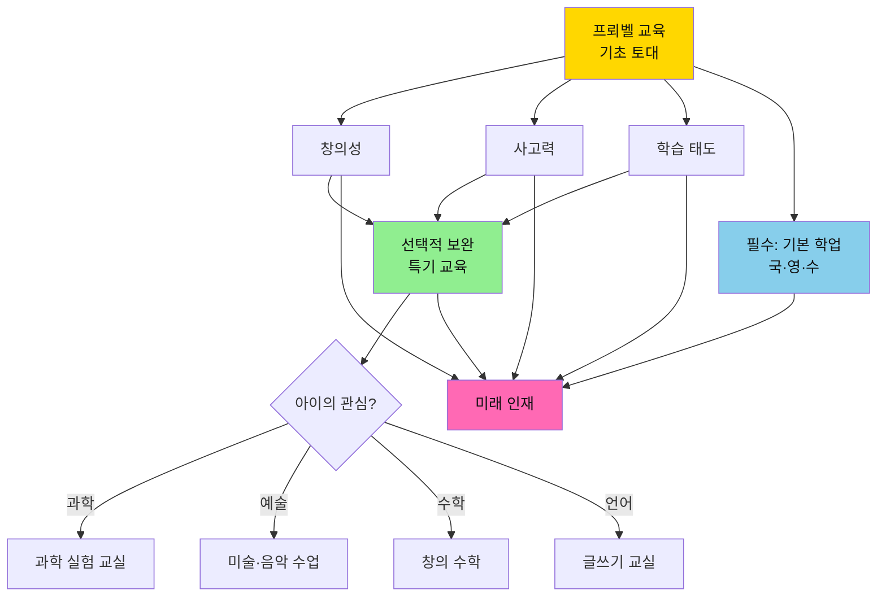

#### 📚 **교육 우선순위 피라미드**

| 단계 | 교육 내용 | 중요도 | 시간 배분 | 담당 |
|------|---------|-------|---------|------|
| **1층: 필수 기반** | 프뢰벨 창의 교육 | ⭐⭐⭐⭐⭐ | 매일 30분 | 부모 + 프뢰벨 |
| **2층: 기본 학업** | 국어, 수학, 영어 기초 | ⭐⭐⭐⭐ | 학교 + 숙제 | 학교 + 필요시 보충 |
| **3층: 선택 특기** | 아이 관심 분야 심화 | ⭐⭐⭐ | 주 1-2회 | 전문 교육 기관 |
| **4층: 부가 활동** | 체육, 예술 등 | ⭐⭐ | 주 1회 | 취미 활동 |

#### ⚖️ **병행 시 주의사항**

**✅ 좋은 병행 (시너지 효과)**
- 📚 프뢰벨 + 도서관 정기 방문
- 🔬 프뢰벨 + 과학 체험 교실 (관심 있다면)
- 🎨 프뢰벨 + 미술 수업 (그림 좋아한다면)
- 📝 프뢰벨 + 글쓰기 교실 (표현력 키우고 싶다면)

**❌ 피해야 할 병행 (상충 효과)**
- ⚠️ 프뢰벨 + 과도한 문제집 풀이 → 창의성 저해
- ⚠️ 프뢰벨 + 주입식 암기 학습 → 사고력 제한
- ⚠️ 프뢰벨 + 너무 많은 학원 (주 5개 이상) → 시간·에너지 고갈

#### 💡 **균형 잡힌 교육 스케줄 예시**

**초등 저학년 주간 스케줄 (이상적)**

| 요일 | 시간 | 활동 | 목적 |
|------|------|------|------|
| **매일** | 저녁 30분 | 프뢰벨 그림책 + 토론 | 창의성·사고력 |
| **월·수·금** | 방과 후 | 학교 숙제 + 복습 | 기본 학업 |
| **화** | 오후 4시 | 과학 실험 교실 (선택) | 관심 분야 심화 |
| **목** | 오후 4시 | 태권도 (선택) | 체력·인성 |
| **토** | 오전 | 가족 프로젝트 시간 | 프뢰벨 확장 활동 |
| **일** | 오전 | 도서관 방문 | 독서 습관 |

**핵심 원칙**
1. ✅ 프뢰벨은 매일, 짧더라도 꾸준히
2. ✅ 기본 학업은 학교에서 대부분 해결
3. ✅ 추가 활동은 아이 관심사 기반으로 1-2개만
4. ✅ **여유 시간 확보** (놀이, 쉼, 상상의 시간)

---

## 마무리: AI 시대, 프뢰벨 교육의 본질

### 💎 **단순한 놀이가 아닙니다**

프뢰벨 교육은 "그냥 책 읽고 노는 것"이 아닙니다.  
이것은 **AI 시대를 위한 체계적이고 과학적인 핵심 역량 개발 프로그램**입니다.

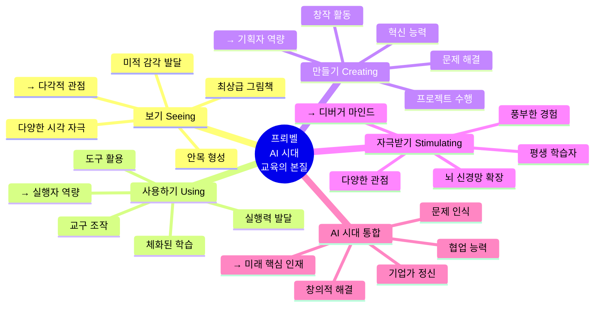

### 🌱 **AI 시대 핵심 역량은 "주는" 것이 아니라 "키우는" 것입니다**

- ❌ 창의성은 타고나는 것이 아닙니다
- ❌ 문제 해결 능력은 나중에 갑자기 생기는 것이 아닙니다  
- ❌ 기업가 정신은 성인이 되어 배우는 것이 아닙니다
- ✅ **AI 시대 핵심 역량**은 **풍부한 자극과 경험**으로 키워집니다
- ✅ **기획자+실행자+디버거 역량**은 **유아기부터 체계적으로** 발달시킬 수 있습니다
- ✅ **프뢰벨**이 이 모든 것의 완벽한 기초입니다

### ⏰ **지금이 바로 그 시간입니다**

**유아·초등기는 AI 시대 핵심 역량 발달의 골든타임입니다.**
- 더 많이 보고 → **다각적 관점**
- 더 많이 사용하고 → **실행자 역량**
- 더 많이 만들고 → **기획자 역량**
- 더 많이 자극받을수록 → **디버거 마인드**

**아이의 뇌는 폭발적으로 성장하고**  
**AI 시대가 요구하는 모든 역량을 갖추게 됩니다**  
**기업가 정신으로 세상을 바꾸는 혁신가가 됩니다**

### 🚀 **프뢰벨과 함께 시작하세요**

```mermaid
journey
    title 프뢰벨과 함께하는 AI 시대 인재 성장 여정
    section 시작 (유아기)
      프뢰벨 교육 도입: 5: 부모
      아이가 흥미를 보임: 5: 아이
      문제 발견 놀이: 5: 아이
    section 성장 (초등 저학년)
      매일 함께 읽기: 5: 부모, 아이
      질문이 많아짐: 5: 아이
      스스로 만들기 시작: 5: 아이
      협업 능력 발달: 5: 아이
    section 도약 (초등 고학년)
      AI 도구 활용 시작: 5: 아이
      프로젝트 완성: 5: 아이
      자신감 폭발: 5: 아이
      기획자+실행자+디버거: 5: 아이
    section 입시 (중고등)
      프로젝트 포트폴리오: 5: 아이
      입시 경쟁력 확보: 5: 아이
      명문대 합격: 5: 아이
    section 미래
      AI 시대 핵심 인재: 5: 아이
      창업가·혁신가: 5: 아이
      꿈 실현: 5: 아이
      평생 행복한 배움: 5: 아이
```

---

## 🎯 액션 플랜: AI 시대 인재 키우기 - 지금 당장 시작하기

### 오늘 할 일 (AI 시대 역량 기초)
1. ✅ 프뢰벨 그림책 1권 아이와 함께 읽기
2. ✅ "왜 그랬을까?" 질문 3개 던지기 → **문제 인식 훈련**
3. ✅ "만약 네가 해결한다면?" 질문 → **기획자 사고**
4. ✅ 아이 답변 진지하게 듣기 → **협업 능력 기초**

### 이번 주 할 일 (실행자 경험)
1. ✅ 매일 30분 프뢰벨 시간 루틴화하기
2. ✅ 주말에 책 내용 기반 만들기 활동 1회 → **실행자 역량**
3. ✅ "안 되면 다르게 해보기" 경험 → **디버거 마인드**
4. ✅ 아이가 만든 작품 전시 공간 마련하기

### 이번 달 할 일 (프로젝트 기반 학습)
1. ✅ 도서관 방문해서 다양한 책 탐색 (2회)
2. ✅ 아이 관심 분야 발견하기 → **기업가 정신 씨앗**
3. ✅ 작은 프로젝트 1개 시작하기
4. ✅ 프로젝트 과정 사진으로 기록 → **포트폴리오 시작**

### 올해 할 일 (AI 시대 인재 기반 완성)
1. ✅ 프뢰벨 교육 습관 완전히 정착시키기
2. ✅ 포트폴리오 작성 시작하기
3. ✅ 관심 분야 프로젝트 3개 완성하기
4. ✅ (초등 고학년) AI 도구 활용 시작하기
5. ✅ 협업 경험 만들기 (가족/친구 프로젝트)

---

### 🚀 **AI 시대, 프뢰벨이 답입니다**

**프뢰벨 교육은 아이에게 줄 수 있는 최고의 선물입니다.**  

✅ **더 많이 보고** → 다각적 관점으로 프로젝트 분석  
✅ **더 많이 사용하고** → AI 도구를 활용하는 실행자  
✅ **더 많이 만들고** → 문제를 해결하는 기획자  
✅ **더 많이 자극받을수록** → 반복 개선하는 디버거  

**→ 아이는 AI 시대의 핵심 인재로 성장합니다**  
**→ 기업가 정신으로 세상을 바꾸는 혁신가가 됩니다**  
**→ 창의적이고 행복한 평생 학습자가 됩니다**

---

### 💎 **전세계가 주목하는 교육, 프뢰벨**

```mermaid
graph LR
    A[프뢰벨 교육] --> B[AI 시대<br/>핵심 역량]
    
    B --> C[기획자]
    B --> D[실행자]
    B --> E[디버거]
    B --> F[기업가 정신]
    
    C --> G[전세계<br/>교육 표준]
    D --> G
    E --> G
    F --> G
    
    G --> H[아이의 꿈 실현]
    
    style A fill:#FFD700,color:#111
    style B fill:#90EE90,color:#111
    style G fill:#87CEEB,color:#111
    style H fill:#FF69B4,color:#111
```

**지금 시작하세요. 아이의 미래가 완전히 달라집니다.** 🌟

---

*문서 작성일: 2025년 12월 (AI 시대 교육 반영)*  
*핵심 가치: 보기(Seeing) · 사용하기(Using) · 만들기(Creating) · 자극받기(Stimulating)*  
*AI 시대 역량: 기획자(Planning) · 실행자(Execution) · 디버거(Debugging) · 기업가 정신(Entrepreneurship)*
