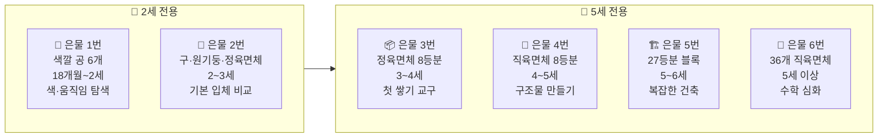
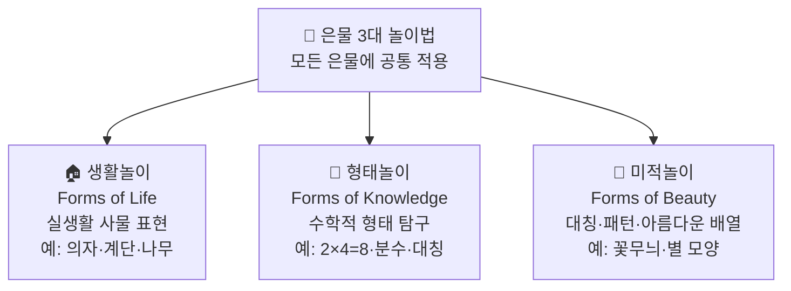
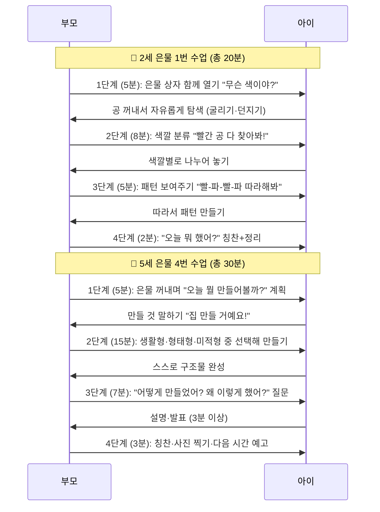
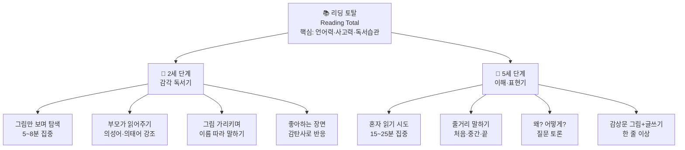
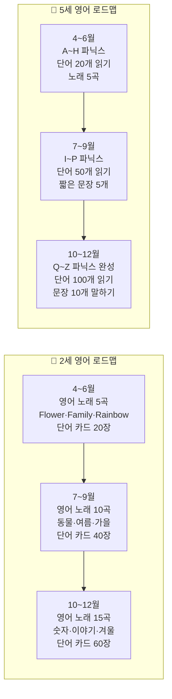
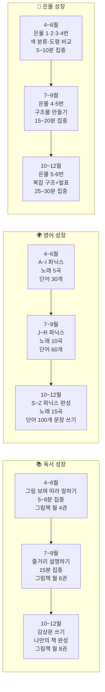

# 🌱 프뢰벨 3대 프로그램 강화판 WBS 계획서
> 기간: 2026년 4월 ~ 12월 | 대상: 2세 · 5세 | 운영: 주 5일 2시간 + 토요일 체험
> 📚 독서(Reading Total) · 🌍 영어(English Education) · 🧱 은물·메이커(Gabe)

---

# 🔬 PART 1. 프뢰벨 교육 심화 이론

## 1-1. 은물(Gabe) 번호별 완전 가이드

> 은물(恩物)이란 "신이 내린 선물"이라는 뜻으로, 프뢰벨이 고안한 유아용 입체 교구입니다.
> **입체(1~6번) → 면(7번) → 선(8번) → 점(9번)** 순으로 3차원→추상 세계로 나아갑니다.

---

### 📦 은물별 상세 스펙 & 3대 놀이법

| 은물 번호 | 구성 | 권장 연령 | 교육 목적 | 생활놀이 예시 | 형태놀이 예시 | 미적놀이 예시 |
|---------|------|---------|---------|------------|------------|------------|
| **1번** | 무지개색 공 6개 | 18개월~2세 | 색 인식, 손-눈 협응, 운동감각 | 공 굴리기·숨기기·흔들기 | 색깔별 분류 (빨·주·노·초·파·보) | 색 순서 패턴 만들기 |
| **2번** | 구·원기둥·정육면체 | 2~3세 | 기본 입체 도형 비교·변별 | 블록 위에 공 얹기 시도 | 구르는 것 vs 안 구르는 것 분류 | 3가지 도형 배열 패턴 |
| **3번** | 작은 정육면체 8개 | 3~4세 | 분수 개념 첫 도입, 전체-부분 관계 | 의자·계단·침대 만들기 | 8=4+4=2+2+2+2 수식 탐구 | 대칭 패턴·탑 쌓기 |
| **4번** | 직육면체 8개 | 4~5세 | 공간감각, 균형, 비율 개념 | 집·다리·터널 만들기 | 길이 비교·직육면체 속성 | 대칭 건물·아치형 구조 |
| **5번** | 27등분 혼합 블록 | 5~6세 | 복잡한 공간 구성, 건축적 사고 | 성·마을·동물원 만들기 | 27=3×3×3 부피 개념 | 복잡한 대칭 구조물 |
| **6번** | 36개 직육면체 | 5세 이상 | 수학 심화 (정렬·세기·분수) | 도시·학교·공원 만들기 | 분수·사칙연산 실물 탐구 | 균형 잡힌 건축물 |

---

## 1-2. 연령별 은물 수업 진행 순서도

---

## 1-3. 독서(리딩 토탈) 연령별 단계

---

## 1-4. 영어 교육 파닉스 로드맵 (4월~12월)

---

# 📅 PART 2. 8개월 주차별 상세 WBS

## 🌸 4월 — 봄·자연 | 이달의 은물: **1번(2세) · 3번(5세)**

> **2세 목표:** 은물 1번 공으로 색깔 6가지 익히기 / 봄 그림책 3권 / 영어 노래 Flower Song
> **5세 목표:** 은물 3번 생활형(꽃·나비 구조) 만들기 / 봄 그림책 토론 / A~C 파닉스

### 📋 4월 1주 — 봄꽃 이야기

| 프로그램 | 👶 2세 (5~8분 단위 활동) | 🧒 5세 (15~25분 집중) | 재료 |
|---------|----------------------|---------------------|------|
| 📚 **독서** | 꽃 그림책 읽어주기 / 꽃 색깔 가리키며 "빨간 꽃!" 따라 말하기 / 의성어 강조 "활짝!" | 꽃 그림책 정독 / "꽃은 왜 색깔이 다를까?" 토론 / 좋아하는 꽃 3가지 고르기 | 꽃 그림책 |
| 🌍 **영어** | Flower Song 3번 따라 부르기 / Flower 단어 카드 보기 / Red·Yellow 카드 매칭 | **A 파닉스:** Apple·Ant·Ace / 알파벳 A 쓰기 / "A is for Apple" 문장 카드 | 영어 카드, 알파벳 카드 |
| 🧱 **은물·메이커** | **은물 1번 — 색깔 분류:** 빨간 공만 찾기·노란 공만 찾기 / 색깔 공 굴리기 놀이 | **은물 3번 — 생활형:** 8개 블록으로 꽃밭 울타리 만들기 / 형태형: 8=4+4 나누기 | 은물 1번, 은물 3번 |
| 🎨 **추가 만들기** | 색종이 꽃잎 찢어 붙이기 / 손가락 도장으로 꽃 만들기 | 색종이 꽃 접기 (기본) / 완성 후 가족에게 발표 | 색종이, 물감, 풀 |

### 📋 4월 2주 — 나비와 벌레

| 프로그램 | 👶 2세 | 🧒 5세 | 재료 |
|---------|--------|--------|------|
| 📚 **독서** | 나비 그림책 / 나비 날개 흉내 내며 읽기 / "날아요!" 따라 말하기 | 나비 변태 과정 그림책 / 알→애벌레→번데기→나비 순서 카드 맞추기 | 나비 그림책, 순서 카드 |
| 🌍 **영어** | Butterfly Song 따라 부르기 / Butterfly·Bee 단어 카드 보기 | **B 파닉스:** Bee·Bug·Butterfly / 알파벳 B 쓰기 / "B is for Butterfly" | 알파벳 카드, 스케치북 |
| 🧱 **은물·메이커** | **은물 1번 — 미적형:** 공을 나비 날개처럼 좌우 대칭으로 놓기 | **은물 3번 — 미적형:** 나비 날개 대칭 패턴 만들기 / "이쪽 4개 저쪽 4개 똑같아!" | 은물 1번, 은물 3번 |
| 🎨 **추가 만들기** | 손바닥 물감 찍어 나비 날개 만들기 | 색종이 나비 접기 / 나비 이름표 영어로 쓰기 | 물감, 색종이 |

### 📋 4월 3주 — 씨앗과 싹

| 프로그램 | 👶 2세 | 🧒 5세 | 재료 |
|---------|--------|--------|------|
| 📚 **독서** | 씨앗 그림책 / 실제 씨앗 만지며 "작아요!" 감탄 / 싹 사진 보기 | 씨앗 성장 과학 그림책 / 관찰 일기 1일차 시작 / 씨앗 종류 그림 그리기 | 씨앗 그림책, 스케치북 |
| 🌍 **영어** | Grow! Grow! 노래 / Seed·Tree·Green 카드 보기 | **C 파닉스:** Carrot·Corn·Cup / "A seed grows into a tree" 문장 | 알파벳 카드, 문장 카드 |
| 🧱 **은물·메이커** | **은물 2번 — 탐색:** 구·원기둥·정육면체 만지며 이름 말하기 / 굴리기 실험 | **은물 3번 — 생활형:** 나무 모양 만들기 (아래 넓고 위 좁게) / "나무처럼 쌓으려면?" | 은물 2번, 은물 3번 |
| 🎨 **추가 만들기** | 투명컵에 콩 심기 / 흙 만지기 감각 탐색 | 씨앗 관찰 일기 (그림+날짜) / 매일 기록 시작 | 투명컵, 콩, 흙, 스케치북 |

### 📋 4월 4주 — 봄비와 무지개

| 프로그램 | 👶 2세 | 🧒 5세 | 재료 |
|---------|--------|--------|------|
| 📚 **독서** | 비 그림책 / "추룩추룩!" 비소리 함께 내기 / 무지개 색 손가락으로 가리키기 | 무지개 과학 그림책 / 빛과 물방울로 무지개가 생기는 원리 이야기 | 비·무지개 그림책 |
| 🌍 **영어** | Rain Rain Go Away 노래 / Rain·Rainbow·Red 카드 | **복습:** A·B·C 파닉스 / Rainbow 색깔 영어로 쓰기 (Red Orange Yellow…) | 알파벳 카드, 색연필 |
| 🧱 **은물·메이커** | **은물 1번 — 미적형:** 무지개 순서대로 공 6개 배열 (빨주노초파보) | **은물 3번 — 미적형:** 무지개 아치 구조물 만들기 / 대칭인지 확인 | 은물 1번, 은물 3번 |
| 🎨 **추가 만들기** | 색종이 7색 무지개 찢어 붙이기 | 수채화로 무지개 풍경 그리기 / 영어 색깔 이름 라벨 붙이기 | 색종이, 수채물감 |

---

## 👨‍👩‍👧 5월 — 가족·사랑 | 이달의 은물: **1·2번(2세) · 4번(5세)**

> **2세 목표:** 은물 2번 도형 이름(구·원기둥·정육면체) 감각으로 익히기 / 가족 그림책
> **5세 목표:** 은물 4번으로 집·방 구조 만들기 / 가족 소개 글쓰기 / D~F 파닉스

### 📋 5월 1주 — 엄마 아빠

| 프로그램 | 👶 2세 | 🧒 5세 | 재료 |
|---------|--------|--------|------|
| 📚 **독서** | 가족 그림책 / 가족 사진 보며 "엄마!", "아빠!" 가리키기 | 가족 그림책 정독 / 우리 가족 소개 문장 2개 쓰기 (This is my mom.) | 가족 그림책, 사진 |
| 🌍 **영어** | Mom·Dad·Baby Song / Mom·Dad 단어 카드 | **D 파닉스:** Dad·Dog·Door / "I love my dad" 문장 쓰기 | 알파벳 카드, 스케치북 |
| 🧱 **은물·메이커** | **은물 2번 — 생활형:** 정육면체=아빠, 구=엄마, 원기둥=나 / 가족 이야기 만들기 | **은물 4번 — 생활형:** 우리 집 구조 만들기 / 방 개수 세기, 문·창문 위치 정하기 | 은물 2번, 은물 4번 |
| 🎨 **추가 만들기** | 손 도장 가족 그림 / 얼굴 동그라미+선으로 그리기 | 가족 얼굴 세밀하게 그리기 / 가족 소개 미니 책 만들기 | 물감, 스케치북 |

### 📋 5월 2주 — 어린이날 특별

| 프로그램 | 👶 2세 | 🧒 5세 | 재료 |
|---------|--------|--------|------|
| 📚 **독서** | 어린이날 그림책 / "선물이에요!" 좋아하는 것 가리키기 | 어린이날 유래 책 / 내가 원하는 세상 3가지 문장으로 쓰기 | 어린이날 그림책 |
| 🌍 **영어** | Happy Birthday 리듬 응용 / Happy·Fun·Play 카드 | **E 파닉스:** Ear·Eye·Eat / "I am happy because I play" 문장 | 알파벳 카드, 스케치북 |
| 🧱 **은물·메이커** | **은물 1번 — 미적형:** 색깔 공으로 왕관 모양 배열 | **은물 4번 — 미적형:** 대칭 왕관 구조물 만들기 / 좌우 대칭 확인 | 은물 1번, 은물 4번 |
| 🎨 **추가 만들기** | 색종이 왕관 만들기 / 스티커 꾸미기 | "내가 왕이라면!" 발표 + 왕관 쓰고 사진 찍기 | 색종이, 스티커 |

### 📋 5월 3주 — 할머니·할아버지

| 프로그램 | 👶 2세 | 🧒 5세 | 재료 |
|---------|--------|--------|------|
| 📚 **독서** | 조부모 그림책 / 할머니·할아버지 사진 보며 이름 말하기 | 조부모와의 추억 그림책 / 나의 추억 그림+한 줄 쓰기 | 조부모 그림책 |
| 🌍 **영어** | Grandma·Grandpa 카드 / 가족 단어 복습 노래 | **F 파닉스:** Family·Fish·Flower / "I love my grandma" 카드 만들기 | 알파벳 카드, 색도화지 |
| 🧱 **은물·메이커** | **은물 2번 — 생활형:** "할머니 집" 정육면체 쌓기 / 지붕 원기둥 올리기 | **은물 4번 — 생활형:** 할머니 집 구조물 만들기 / 마당·문·굴뚝 추가 | 은물 2번, 은물 4번 |
| 🎨 **추가 만들기** | 손 도장 카드 만들기 | 감사 카드 직접 만들어 직접 전달 | 색종이, 크레용 |

### 📋 5월 4주 — 우리 집

| 프로그램 | 👶 2세 | 🧒 5세 | 재료 |
|---------|--------|--------|------|
| 📚 **독서** | 집 그림책 / "문이에요!" "창문이에요!" 따라 말하기 | 세계 여러 집 그림책 / 우리 집 vs 다른 나라 집 비교 발표 | 집 그림책 |
| 🌍 **영어** | Home Sweet Home 노래 / Room·Kitchen·Door 카드 | **D·E·F 파닉스 복습** / "This is my room. It is big." 문장 쓰기 | 단어 카드, 스케치북 |
| 🧱 **은물·메이커** | **은물 2번 — 형태형:** 구르는 것(구·원기둥) vs 안 구르는 것(정육면체) 실험 | **은물 4번 — 생활형:** 2층 집 구조 만들기 / 방 이름 영어로 쓴 라벨 붙이기 | 은물 2번, 은물 4번 |
| 🎨 **추가 만들기** | 블록으로 집 쌓기 / 색종이 문·창문 붙이기 | 우리 집 평면도 직접 그리기 + 발표 | 블록, 색종이, 자 |

---

## 🎨 6월 — 색깔·감각 | 이달의 은물: **1·2번(2세) · 4번(5세)**

> **2세 목표:** 은물 1번으로 6가지 색 완전 익히기 / 핑거 페인팅 경험
> **5세 목표:** 은물 4번 색깔 분류·패턴 / 색 혼합 실험표 기록 / G~I 파닉스

### 📋 6월 1주 — 빨강·노랑·파랑 (3원색)

| 프로그램 | 👶 2세 | 🧒 5세 | 재료 |
|---------|--------|--------|------|
| 📚 **독서** | 3원색 그림책 / "빨간 사과!" "노란 바나나!" 신나게 따라 말하기 | 색깔 나라 그림책 / 3원색이 왜 특별한지 토론 / 색깔 일기 시작 | 색깔 그림책, 스케치북 |
| 🌍 **영어** | Rainbow Song (색깔 순서대로) / Red·Yellow·Blue 카드 | **G 파닉스:** Green·Grape·Go / 3원색 영어 단어 쓰기 | 알파벳 카드, 색연필 |
| 🧱 **은물·메이커** | **은물 1번 — 형태형:** 같은 색끼리만 모으기 / "빨간 공이 몇 개야?" | **은물 4번 — 형태형:** 3원색 블록 그룹 만들기 / "빨강 3개, 노랑 3개, 파랑 2개 = 8개!" | 은물 1번, 은물 4번 |
| 🎨 **추가 만들기** | 색종이 3색 찢어 붙이기 콜라주 | 3원색 물감으로 그림 그리기 / 색 이름 영어 라벨 붙이기 | 색종이, 물감 |

### 📋 6월 2주 — 초록·보라·주황

| 프로그램 | 👶 2세 | 🧒 5세 | 재료 |
|---------|--------|--------|------|
| 📚 **독서** | 혼합색 그림책 / 초록 개구리·보라 포도 따라 말하기 | 색깔 혼합 원리 책 / 혼합 결과 예측하며 읽기 | 색깔 그림책 |
| 🌍 **영어** | Green·Purple·Orange 카드 / 6색 노래 부르기 | **H 파닉스:** Happy·House·Hat / 6색 영어 단어 모두 쓰기 | 알파벳 카드, 스케치북 |
| 🧱 **은물·메이커** | **은물 1번 — 미적형:** 6개 공 색깔 순서대로 줄 세우기 (무지개 순) | **은물 4번 — 미적형:** 대칭 색깔 패턴 구조물 / "이쪽이랑 저쪽이 같아야 예뻐!" | 은물 1번, 은물 4번 |
| 🎨 **추가 만들기** | 핑거 페인팅 자유 탐색 | 6색 분류 도표 직접 만들기 / 색 이름 한국어+영어 병기 | 물감, 도화지 |

### 📋 6월 3주 — 색깔 섞기 실험

| 프로그램 | 👶 2세 | 🧒 5세 | 재료 |
|---------|--------|--------|------|
| 📚 **독서** | 색깔 마법사 그림책 / 두 색이 만나면? 다음 장 예측하기 | 빛과 색 과학 그림책 / 색 혼합 실험 결과 그림 그리기 | 그림책 |
| 🌍 **영어** | Mix·Make·New 단어 카드 | **I 파닉스:** Ice·Ink·Island / "Red + Yellow = Orange" 문장 쓰기 | 알파벳 카드, 스케치북 |
| 🧱 **은물·메이커** | **은물 1번 — 생활형:** 빨간 공·노란 공을 나란히 "주황 친구야!" 표현 | **은물 4번 — 형태형:** 빨간 2개+노란 2개=주황 4개 만들기 규칙 발견 | 은물 1번, 은물 4번 |
| 🎨 **추가 만들기** | 두 손가락으로 물감 섞어보기 | 색 혼합 실험표 직접 만들기 (표+색칠) | 물감, 팔레트, 도화지 |

### 📋 6월 4주 — 나만의 색 작품

| 프로그램 | 👶 2세 | 🧒 5세 | 재료 |
|---------|--------|--------|------|
| 📚 **독서** | 화가 어린이 그림책 / "나도 화가예요!" 따라 말하기 | 유명 화가 그림 감상 / 내 작품과 비교 / 화가 이름 3명 기억하기 | 화가 그림책 |
| 🌍 **영어** | Artist·Paint·Create 카드 / "I am an artist!" 큰 소리로 외치기 | **G·H·I 파닉스 복습** / "I painted with red and blue" 문장 쓰기 | 단어 카드, 스케치북 |
| 🧱 **은물·메이커** | **은물 1번 — 미적형:** 자유롭게 공 배열 / "내 마음대로 예쁘게!" | **은물 4번 — 미적형:** 나만의 대칭 예술 구조물 완성 / 제목 붙이기 | 은물 1번, 은물 4번 |
| 🎨 **추가 만들기** | 좋아하는 색으로 자유 물감 그림 / 손 도장 꾸미기 | 갤러리 전시 + 가족에게 작품 설명 발표 (2분 이상) | 물감, 도화지 |

---

## ☀️ 7월 — 여름·과학 | 이달의 은물: **2번(2세) · 4·5번(5세)**

> **2세 목표:** 은물 2번으로 입체 도형 탐색 심화 / 물·얼음 감각 경험
> **5세 목표:** 은물 4·5번 복합 구조물 / 날씨 관찰 일기 / J~L 파닉스

### 📋 7월 1주 — 태양과 바람

| 프로그램 | 👶 2세 | 🧒 5세 | 재료 |
|---------|--------|--------|------|
| 📚 **독서** | 태양 그림책 / "뜨거워요!" "따뜻해요!" 감각 표현 따라 말하기 | 태양 과학 그림책 / "태양이 없으면?" 토론 / 태양의 역할 3가지 쓰기 | 태양 그림책 |
| 🌍 **영어** | Mr. Sun 노래 / Sun·Hot·Sky 카드 | **J 파닉스:** Jump·Jar·Juice / "The sun is hot and bright" 문장 쓰기 | 알파벳 카드, 스케치북 |
| 🧱 **은물·메이커** | **은물 2번 — 미적형:** 정육면체로 직사각형 탑 / 구를 꼭대기에 태양처럼 올리기 | **은물 4번 — 생활형:** 태양 광선 방사형 구조 만들기 / 은물 5번 탐색 시작 | 은물 2번, 은물 4번, 은물 5번 |
| 🎨 **추가 만들기** | 노란 색종이 해 오리기 붙이기 | 색종이 바람개비 만들기 / 바람에 돌려보며 "바람이 느껴져!" | 색종이, 빨대, 핀 |

### 📋 7월 2주 — 물과 얼음

| 프로그램 | 👶 2세 | 🧒 5세 | 재료 |
|---------|--------|--------|------|
| 📚 **독서** | 물방울 여행 그림책 / 얼음 직접 만지며 "차가워요!" 반응 | 물의 3가지 상태 과학 책 / 고체·액체·기체 그림 그리기 | 물 그림책 |
| 🌍 **영어** | Splish Splash 노래 / Water·Ice·Cold 카드 | **K 파닉스:** King·Kite·Key / "Ice melts into water" 문장 쓰기 | 알파벳 카드, 스케치북 |
| 🧱 **은물·메이커** | **은물 2번 — 형태형:** 구=물방울 모양 / "물방울이 동그랗게 생겼어!" | **은물 5번 — 생활형 (첫 사용):** 27개 블록 꺼내보기 / 물 결정 구조 만들기 | 은물 2번, 은물 5번 |
| 🎨 **추가 만들기** | 물감 섞은 얼음으로 도화지에 그림 그리기 | 얼음이 녹는 관찰 기록 (시간별 그림) | 얼음, 물감, 도화지 |

### 📋 7월 3주 — 바다와 물고기

| 프로그램 | 👶 2세 | 🧒 5세 | 재료 |
|---------|--------|--------|------|
| 📚 **독서** | 바다 그림책 / 물고기 헤엄 흉내 내며 읽기 | 바다 생물 도감 / 좋아하는 바다 생물 3가지 골라 특징 설명 | 바다 그림책, 도감 |
| 🌍 **영어** | Under the Sea 노래 / Fish·Sea·Blue 카드 | **L 파닉스:** Lion·Leaf·Lake / "I can see a big fish" 문장 쓰기 | 알파벳 카드, 스케치북 |
| 🧱 **은물·메이커** | **은물 2번 — 생활형:** 원기둥=물고기 몸통 / 정육면체=물고기 집(바위) 만들기 | **은물 5번 — 생활형:** 물고기 구조 만들기 (27개 블록 활용) / 수족관 만들기 | 은물 2번, 은물 5번 |
| 🎨 **추가 만들기** | 파란 색종이 바다 + 물고기 색칠 붙이기 | 바다 생물 미니북 만들기 / 영어 이름 써서 발표 | 색종이, 색칠 도안 |

### 📋 7월 4주 — 여름 과일

| 프로그램 | 👶 2세 | 🧒 5세 | 재료 |
|---------|--------|--------|------|
| 📚 **독서** | 과일 그림책 / 실제 과일 보며 이름·색 말하기 | 과일 과학 그림책 / 씨 있는 것 vs 없는 것 분류표 만들기 | 과일 그림책, 실제 과일 |
| 🌍 **영어** | Fruit Song / Watermelon·Peach·Grape 카드 | **J·K·L 파닉스 복습** / "My favorite fruit is watermelon" 문장 | 단어 카드, 스케치북 |
| 🧱 **은물·메이커** | **은물 2번 — 미적형:** 구=수박·포도 비유 / 색깔 공=과일 색 분류 놀이 | **은물 5번 — 생활형:** 과일 바구니 구조 만들기 / 각 칸에 과일 이름 영어 라벨 | 은물 2번, 은물 5번 |
| 🎨 **추가 만들기** | 점토로 수박·포도 만들기 | 과일 퍼즐 12조각 완성 + 과일 관찰 그림 그리기 | 점토, 퍼즐, 스케치북 |

---

## 🚀 8월 — 상상·창의 | 이달의 은물: **1·2번(2세) · 5번(5세)**

> **2세 목표:** 은물 1·2번으로 상상 놀이 / 동물 흉내 표현
> **5세 목표:** 은물 5번 복잡한 구조물 / 상상 이야기 그림책 완성 / M~O 파닉스

### 📋 8월 1주 — 동물 세계

| 프로그램 | 👶 2세 | 🧒 5세 | 재료 |
|---------|--------|--------|------|
| 📚 **독서** | 동물 그림책 / 동물 소리·움직임 흉내 내며 읽기 | 동물 생태 그림책 / 좋아하는 동물 특징 3가지 말하기·쓰기 | 동물 그림책 |
| 🌍 **영어** | Old MacDonald Had a Farm / Lion·Tiger·Bear 카드 | **M 파닉스:** Monkey·Mouse·Moon / "The lion is big and strong" 문장 | 알파벳 카드, 스케치북 |
| 🧱 **은물·메이커** | **은물 1·2번 — 생활형:** 공=동물 알, 정육면체=동물 집 / 동물 이야기 꾸미기 | **은물 5번 — 생활형:** 동물원 구조물 만들기 / 우리·입구·표지판 만들기 | 은물 1번, 은물 2번, 은물 5번 |
| 🎨 **추가 만들기** | 동물 퍼즐 4~6조각 완성 / 동물 색칠하기 | 동물 이름 영어 표지판 직접 써서 붙이기 / 가족에게 동물원 설명 | 퍼즐, 색칠 도안 |

### 📋 8월 2주 — 우주 탐험

| 프로그램 | 👶 2세 | 🧒 5세 | 재료 |
|---------|--------|--------|------|
| 📚 **독서** | 별·달 그림책 / "반짝반짝!" 함께 노래하며 읽기 | 우주 탐험 그림책 / 태양계 8개 행성 이름 배우기 | 우주 그림책 |
| 🌍 **영어** | Twinkle Twinkle Little Star / Star·Moon·Space 카드 | **N 파닉스:** Night·Nest·Nose / "I want to be an astronaut" 문장 | 알파벳 카드, 스케치북 |
| 🧱 **은물·메이커** | **은물 1번 — 미적형:** 검정 도화지에 공으로 별자리 배열 / 예쁘게 놓기 | **은물 5번 — 미적형:** 로켓 구조물 만들기 / 나만의 별자리 이름 짓기·발표 | 은물 1번, 은물 5번, 검정 도화지 |
| 🎨 **추가 만들기** | 검정 도화지에 별 스티커 붙이기 | 태양계 행성 그리기 / 행성 이름 영어 라벨 쓰기 | 검정 도화지, 스티커, 은색 크레용 |

### 📋 8월 3주 — 탈것 여행

| 프로그램 | 👶 2세 | 🧒 5세 | 재료 |
|---------|--------|--------|------|
| 📚 **독서** | 탈것 그림책 / 자동차·기차·비행기 소리 흉내 | 탈것 백과 그림책 / 육상·해상·항공 분류하며 읽기 | 탈것 그림책 |
| 🌍 **영어** | Wheels on the Bus 노래 / Car·Train·Plane 카드 | **O 파닉스:** Ocean·Orange·Open / "I go to school by bus" 문장 | 알파벳 카드, 스케치북 |
| 🧱 **은물·메이커** | **은물 2번 — 생활형:** 원기둥=바퀴, 정육면체=자동차 몸통 / 자동차 만들기 | **은물 5번 — 생활형:** 기차역 구조 만들기 / 기차·플랫폼·지붕 구성 발표 | 은물 2번, 은물 5번 |
| 🎨 **추가 만들기** | 블록으로 자동차 만들기 / 색종이 도로 만들기 | 탈것 분류 표 직접 만들기 / 영어 이름 라벨 붙이기 | 블록, 색종이 |

### 📋 8월 4주 — 내가 만든 세계

| 프로그램 | 👶 2세 | 🧒 5세 | 재료 |
|---------|--------|--------|------|
| 📚 **독서** | 상상 나라 그림책 / 그림 보며 "나라면 여기 살고 싶어!" | 창의 이야기 그림책 / 내가 만들 세계 스케치·계획 말하기 | 상상 그림책 |
| 🌍 **영어** | "My world is…" 문장 따라 말하기 / World·Dream·Fun 카드 | **M·N·O 파닉스 복습** / "In my world, there is a magic school" 문장 | 문장 카드, 스케치북 |
| 🧱 **은물·메이커** | **은물 1·2번 자유 탐색:** 오늘은 스스로 배열 / "어떻게 만들었어?" | **은물 5번 — 자유 창작:** 상상 세계 구조물 / 세계 이름·지도·설명 발표 (3분) | 은물 1번, 은물 2번, 은물 5번 |
| 🎨 **추가 만들기** | 자유 그림 그리기 / 내 그림 설명하기 | 상상 세계 그림책 완성 + 가족 발표회 | 도화지, 색연필, 스케치북 |

---

## 🍂 9월 — 가을·수확 | 이달의 은물: **2번(2세) · 5번(5세)**

> **2세 목표:** 은물 2번 도형 완전 복습 / 낙엽 자연 감각
> **5세 목표:** 은물 5번 심화 구조 / 가을 시 쓰기 / P~R 파닉스

### 📋 9월 1주 — 가을 나뭇잎

| 프로그램 | 👶 2세 | 🧒 5세 | 재료 |
|---------|--------|--------|------|
| 📚 **독서** | 가을 나뭇잎 그림책 / 실제 낙엽 만지며 "바스락!" | 가을 변화 과학 그림책 / "잎이 왜 색깔이 변할까?" 토론 | 가을 그림책, 낙엽 |
| 🌍 **영어** | Autumn Leaves Song / Leaf·Red·Fall 카드 | **P 파닉스:** Park·Parrot·Paint / "In autumn, leaves turn red and orange" 문장 | 알파벳 카드, 스케치북 |
| 🧱 **은물·메이커** | **은물 2번 — 미적형:** 가을색(빨·주·노) 공을 가을 나무처럼 배열 | **은물 5번 — 생활형:** 가을 나무 구조물 만들기 / 가지·잎 위치 설명 발표 | 은물 2번, 은물 5번 |
| 🎨 **추가 만들기** | 낙엽 탁본 / 낙엽 붙이기 콜라주 | 가을 나무 수채화 / 낙엽 종류 스케치+이름 쓰기 | 낙엽, 크레용, 수채물감 |

### 📋 9월 2주 — 추석·전통

| 프로그램 | 👶 2세 | 🧒 5세 | 재료 |
|---------|--------|--------|------|
| 📚 **독서** | 추석 그림책 / "둥근 달이에요!" 함께 하늘 보기 | 추석 유래 그림책 / 추석 풍습 3가지 말하기·한 줄 쓰기 | 추석 그림책 |
| 🌍 **영어** | Moon·Harvest·Family 카드 / "Full moon!" 따라 말하기 | **Q 파닉스:** Queen·Quiz / "Chuseok is a Korean holiday in autumn" 문장 | 알파벳 카드, 스케치북 |
| 🧱 **은물·메이커** | **은물 2번 — 생활형:** 구=보름달 / "둥글둥글 달님이에요!" 이야기 만들기 | **은물 5번 — 생활형:** 한옥 구조물 만들기 / 대청마루·기와지붕 표현 발표 | 은물 2번, 은물 5번 |
| 🎨 **추가 만들기** | 점토로 송편 만들기 / 보름달 색칠하기 | 추석 카드 만들어 가족에게 전달 | 점토, 색도화지 |

### 📋 9월 3주 — 도토리·열매

| 프로그램 | 👶 2세 | 🧒 5세 | 재료 |
|---------|--------|--------|------|
| 📚 **독서** | 도토리 그림책 / 실제 도토리·밤 만져보기 | 열매·씨앗 과학 그림책 / 씨앗이 퍼지는 방법 그림 그리기 | 열매 그림책, 도토리 |
| 🌍 **영어** | Acorn·Chestnut·Berry 카드 | **R 파닉스:** Rain·River·Rock / "This acorn will grow into a big oak tree" 문장 | 알파벳 카드, 스케치북 |
| 🧱 **은물·메이커** | **은물 2번 — 생활형:** 정육면체=바구니, 구=도토리 / 도토리 담기 놀이 | **은물 5번 — 생활형:** 나무·열매 구조물 / 자연물로 꾸미기 + 발표 | 은물 2번, 은물 5번, 자연물 |
| 🎨 **추가 만들기** | 도토리·낙엽 콜라주 | 자연물 콜라주 예술 작품 / 제목 붙이기 | 자연물, 풀, 도화지 |

### 📋 9월 4주 — 가을 바람·시

| 프로그램 | 👶 2세 | 🧒 5세 | 재료 |
|---------|--------|--------|------|
| 📚 **독서** | 바람 그림책 / "쌩쌩!" 바람 소리 함께 내기 | 가을 시 그림책 / 시를 읽고 느낌 말하기 / 내 가을 시 4줄 쓰기 | 바람 그림책, 시 그림책 |
| 🌍 **영어** | Wind·Cool·Leaf 카드 / "The wind blows!" 따라 말하기 | **P·Q·R 파닉스 복습** / "Cool autumn wind blows through the leaves" 문장 | 단어 카드, 스케치북 |
| 🧱 **은물·메이커** | **은물 1·2번 복습:** 오늘은 두 세트 모두 꺼내 자유 놀이 | **은물 5번 — 미적형:** 바람개비 회전 구조물 / 대칭·균형 맞추기 | 은물 1번, 은물 2번, 은물 5번 |
| 🎨 **추가 만들기** | 색종이 바람개비 만들기 | 가을 시 낭독 발표 + 시를 쓴 종이 꾸미기 | 색종이, 빨대, 스케치북 |

---

## 🔢 10월 — 숫자·도형 | 이달의 은물: **1·2번(2세) · 5·6번(5세)**

> **2세 목표:** 은물 1번으로 1~6 세기 / 도형 3가지 이름 완전 익히기
> **5세 목표:** 은물 5·6번으로 수학 심화 / 1~20 읽기·쓰기 / S~U 파닉스

### 📋 10월 1주 — 숫자 탐험

| 프로그램 | 👶 2세 | 🧒 5세 | 재료 |
|---------|--------|--------|------|
| 📚 **독서** | 숫자 그림책 (1~5) / 손가락으로 함께 세기 | 숫자 이야기 그림책 / 1~20 숫자 이야기 만들기 | 숫자 그림책 |
| 🌍 **영어** | One Two Three Four Five 노래 / 1~5 숫자 카드 | **S 파닉스:** Star·Sun·Six / 1~20 영어 숫자 쓰기 | 숫자 카드, 스케치북 |
| 🧱 **은물·메이커** | **은물 1번 — 형태형:** "공이 몇 개야?" 1~6 세기 / 하나씩 꺼내며 세기 | **은물 6번 (첫 사용):** 36개 꺼내보기 / 10개·20개·36개 세기 | 은물 1번, 은물 6번 |
| 🎨 **추가 만들기** | 숫자 1~5 색칠하기 / 손가락 숫자 도장 | 1~20 숫자 카드 직접 만들기 / 숫자 퀴즈 게임 | 색칠 도안, 스케치북 |

### 📋 10월 2주 — 도형 친구

| 프로그램 | 👶 2세 | 🧒 5세 | 재료 |
|---------|--------|--------|------|
| 📚 **독서** | 도형 그림책 / 동그라미·세모·네모 찾으며 읽기 | 도형 나라 그림책 / 도형으로 어떤 그림 만들 수 있는지 토론 | 도형 그림책 |
| 🌍 **영어** | Shape Song / Circle·Triangle·Square 카드 | **T 파닉스:** Triangle·Toy·Tree / "I see a square house and a triangle roof" 문장 | 알파벳 카드, 스케치북 |
| 🧱 **은물·메이커** | **은물 2번 — 형태형:** 구=동그라미, 정육면체=네모, 원기둥=세모(위에서 보면 원) 관찰 | **은물 5·6번 — 형태형:** 도형 분류표 만들기 / 정육면체 면이 몇 개? 세기 | 은물 2번, 은물 5번, 은물 6번 |
| 🎨 **추가 만들기** | 도형 스탬프 찍기 / 도형으로 얼굴 만들기 | 도형 조각으로 집·자동차·로봇 그림 만들기 + 발표 | 스탬프, 물감, 도화지 |

### 📋 10월 3주 — 크고 작고

| 프로그램 | 👶 2세 | 🧒 5세 | 재료 |
|---------|--------|--------|------|
| 📚 **독서** | 크기 비교 그림책 / "커요!" "작아요!" 말하며 읽기 | 크기와 비율 그림책 / 크기 순서대로 배열·설명하기 | 크기 그림책 |
| 🌍 **영어** | Big·Small·Tall·Short 카드 / "Big or small?" 게임 | **U 파닉스:** Up·Under·Uncle / "The elephant is much bigger than the mouse" 문장 | 알파벳 카드, 스케치북 |
| 🧱 **은물·메이커** | **은물 1·2번 — 형태형:** 공 6개 크기가 같은지 비교 / 블록 크기 비교 | **은물 6번 — 형태형:** 36개 중 같은 크기끼리 분류 / 크기별 타워 3개 쌓기 | 은물 1번, 은물 2번, 은물 6번 |
| 🎨 **추가 만들기** | 큰 블록·작은 블록 분류하기 | 크기 비교표 직접 만들기 (대·중·소 + 영어) | 블록, 스케치북 |

### 📋 10월 4주 — 패턴·규칙

| 프로그램 | 👶 2세 | 🧒 5세 | 재료 |
|---------|--------|--------|------|
| 📚 **독서** | 패턴 그림책 / "다음은 뭐야?" 함께 찾기 | 자연 속 패턴 그림책 (벌집·꽃잎·조개) / 패턴 규칙 발견하기 | 패턴 그림책 |
| 🌍 **영어** | Pattern·Repeat·Rule 카드 / "Red Blue Red Blue…" 함께 말하기 | **S·T·U 파닉스 복습** / "I made a pattern with squares and triangles" 문장 | 단어 카드, 스케치북 |
| 🧱 **은물·메이커** | **은물 1번 — 미적형:** 색깔 패턴 (빨·파·빨·파) 따라 만들기 | **은물 6번 — 미적형:** 복잡한 대칭 패턴 구조물 / 나만의 패턴 규칙 발표 | 은물 1번, 은물 6번 |
| 🎨 **추가 만들기** | 색깔 블록 패턴 따라하기 | 패턴 블록으로 규칙 만들기 / 친구(동생)에게 내 패턴 규칙 설명하기 | 색깔 블록, 도화지 |

---

## 📖 11월 — 이야기·창작 | 이달의 은물: **1·2번(2세) · 5·6번(5세)**

> **2세 목표:** 은물으로 이야기 만들기 / 그림카드 보고 말하기
> **5세 목표:** 은물 5·6번 이야기 무대 만들기 / 나만의 책 완성 / V~X 파닉스

### 📋 11월 1주 — 좋아하는 책

| 프로그램 | 👶 2세 | 🧒 5세 | 재료 |
|---------|--------|--------|------|
| 📚 **독서** | 그림만 보며 이야기 꾸미기 / 좋아하는 장면 가리키기 | 그림책 정독 / 줄거리·주인공·결말 말로 설명 / 감상문 2줄 쓰기 | 그림책 여러 권 |
| 🌍 **영어** | 그림책에서 영어 단어 3개 찾기 / 따라 말하기 | **V 파닉스:** Van·Vine·Voice / "I like this book because the rabbit is brave" 문장 | 영어 그림책, 스케치북 |
| 🧱 **은물·메이커** | **은물 1·2번 — 생활형:** 책 속 장면 표현 / "토끼가 여기 살아요" 이야기 | **은물 5·6번 — 생활형:** 책 속 배경 구조물 만들기 / 주인공 인형과 함께 발표 | 은물 1번, 은물 2번, 은물 5번, 은물 6번 |
| 🎨 **추가 만들기** | 좋아하는 장면 색칠하기 / 색종이 주인공 만들기 | 책 소개 발표 1~2분 / 구조물 배경 사진 찍기 | 색칠 도안, 색종이 |

### 📋 11월 2주 — 이야기 만들기

| 프로그램 | 👶 2세 | 🧒 5세 | 재료 |
|---------|--------|--------|------|
| 📚 **독서** | 그림 카드 3장 보고 말하기 / 순서 이야기 만들기 | 이야기 구조 배우기 (처음·중간·끝) / 내 이야기 초안 4컷 그리기 | 그림 카드, 스케치북 |
| 🌍 **영어** | "Once upon a time…" 따라 말하기 / Story·Once·Happy 카드 | **W 파닉스:** Wolf·Water·Wish / "Once upon a time, there was a brave girl" 이야기 시작 | 문장 카드, 스케치북 |
| 🧱 **은물·메이커** | **은물 2번 — 생활형:** 구=주인공, 정육면체=집 / 이야기 꾸미기 3분 | **은물 5번 — 생활형:** 이야기 무대 만들기 / 숲·집·성 구성 + 구조물 앞에서 이야기 발표 | 은물 2번, 은물 5번 |
| 🎨 **추가 만들기** | 색종이로 이야기 배경 만들기 | 이야기 초안 4컷 완성하기 | 색종이, 스케치북 |

### 📋 11월 3주 — 인형극

| 프로그램 | 👶 2세 | 🧒 5세 | 재료 |
|---------|--------|--------|------|
| 📚 **독서** | 인형극 그림책 / 인형으로 따라 연기하기 | 인형극 대본 그림책 / 내 대본 초안 쓰기 | 인형극 그림책 |
| 🌍 **영어** | "Hello! My name is…" 인형에게 말하기 / 인형 영어 이름 짓기 | **X 파닉스:** eXit·eXam (X 발음) / 인형극 영어 대사 2줄 만들기 | 문장 카드, 스케치북 |
| 🧱 **은물·메이커** | **은물 2번 — 생활형:** 블록으로 인형극 무대 만들기 / 인형 대화 놀이 | **은물 6번 — 생활형:** 인형극 정식 무대 만들기 / 커튼·무대·조명 구성 + 공연 | 은물 2번, 은물 6번 |
| 🎨 **추가 만들기** | 양말 인형 만들기 (단추 눈 붙이기) | 인형극 공연 (가족 앞·5분 이상) / 박수 받기 | 양말, 단추, 글루건 |

### 📋 11월 4주 — 나만의 책 완성

| 프로그램 | 👶 2세 | 🧒 5세 | 재료 |
|---------|--------|--------|------|
| 📚 **독서** | 그림 여러 장 모아 표지 꾸미기 / 제목 정하기 | 이야기책 완성 (처음·중간·끝 완결·6페이지 이상) / 가족 앞 낭독 | 스케치북 |
| 🌍 **영어** | 내 책 제목 영어로 말하기 / "My book is about…" 따라 말하기 | **V·W·X 파닉스 복습** / 책 영어 제목 붙이기 + 영어 소개 1문장 | 스케치북, 영어 라벨 |
| 🧱 **은물·메이커** | **은물 1·2번:** 책 속 장면 그대로 재현 / 사진 찍기 | **은물 5·6번 — 종합:** 책 전시 책장 구조물 만들기 / 완성 책 꽂아놓기 + 발표 | 은물 전체, 스케치북 |
| 🎨 **추가 만들기** | 색종이로 표지 꾸미기 / 스티커 장식 | 가족 독서회 개최 / 서로 책 읽어주기 | 색종이, 스티커 |

---

## ❄️ 12월 — 겨울·마무리 | 이달의 은물: **전체 복습(2세) · 5·6번 심화(5세)**

> **2세 목표:** 은물 1·2번 완전 복습 / 1년 성장 확인
> **5세 목표:** 은물 5·6번 1년 결산 구조물 / Y~Z 파닉스 완성 / 포트폴리오 발표

### 📋 12월 1주 — 눈과 겨울

| 프로그램 | 👶 2세 | 🧒 5세 | 재료 |
|---------|--------|--------|------|
| 📚 **독서** | 눈 그림책 / "차가워요!" "하얘요!" 표현 | 겨울 자연 과학 그림책 / 겨울잠 자는 동물 이야기 토론 | 겨울 그림책 |
| 🌍 **영어** | Let It Snow 노래 / Snow·White·Cold 카드 | **Y 파닉스:** Yellow·Year·Yell / "It is snowing and everything is white" 문장 | 알파벳 카드, 스케치북 |
| 🧱 **은물·메이커** | **은물 1번 복습:** 흰 공으로 눈송이 패턴 만들기 | **은물 5번 — 생활형:** 눈사람 마을 구조물 / 눈집·눈사람·길 표현 + 발표 | 은물 1번, 은물 5번 |
| 🎨 **추가 만들기** | 흰 색종이 눈송이 오리기 / 흰 물감 손 도장 | 겨울 마을 수채화 / 눈 결정체 그리기 | 흰 색종이, 흰 물감, 수채물감 |

### 📋 12월 2주 — 크리스마스

| 프로그램 | 👶 2세 | 🧒 5세 | 재료 |
|---------|--------|--------|------|
| 📚 **독서** | 크리스마스 그림책 / "산타예요!" "루돌프예요!" 따라 말하기 | 크리스마스 세계 문화 그림책 / 세계 크리스마스 문화 3가지 말하기 | 크리스마스 그림책 |
| 🌍 **영어** | Jingle Bells 노래 / Merry Christmas! 크게 외치기 | **Z 파닉스:** Zebra·Zero·Zoo / "Merry Christmas! I wish you happiness" 카드 쓰기 | 알파벳 카드, 색도화지 |
| 🧱 **은물·메이커** | **은물 2번 복습:** 트리 모양 쌓기 / 원기둥=별, 정육면체=선물 | **은물 6번 — 미적형:** 대칭 크리스마스 트리 구조물 / 스티커·장식 붙이기 + 발표 | 은물 2번, 은물 6번 |
| 🎨 **추가 만들기** | 색종이 트리·별 오리기 / 스티커 장식 | 크리스마스 카드 직접 만들어 가족에게 전달 | 색종이, 스티커 |

### 📋 12월 3주 — 한 해 돌아보기 (1년 결산)

| 프로그램 | 👶 2세 | 🧒 5세 | 재료 |
|---------|--------|--------|------|
| 📚 **독서** | 올해 가장 좋아했던 책 다시 읽기 / "기억나요?" | 올해 읽은 책 목록 적기 / 가장 기억에 남는 책 2분 발표 | 올해 읽은 그림책 전부 |
| 🌍 **영어** | 4월~12월 배운 영어 노래 모두 부르기 / 단어 카드 모두 펼치기 | **A~Z 파닉스 완성 복습** / "I learned 100 words this year!" 선언 | 단어 카드 전체 |
| 🧱 **은물·메이커** | **은물 1·2번 완전 복습:** 4월처럼 처음부터 / 성장 비교 사진 찍기 | **은물 5·6번 — 1년 결산 구조물:** 올해 배운 것 모두 표현 / 포트폴리오 발표 (5분) | 은물 전체 |
| 🎨 **추가 만들기** | 올해 작품 중 가장 좋아하는 것 고르기 | 1년 성장 포트폴리오 정리 / 잘한 것 5가지 말하기 | 올해 작품 전체 |

### 📋 12월 4주 — 새해 준비

| 프로그램 | 👶 2세 | 🧒 5세 | 재료 |
|---------|--------|--------|------|
| 📚 **독서** | 새해 그림책 / "새해 복 많이 받으세요!" 따라 말하기 | 새해 다짐 그림책 / 내년에 하고 싶은 것 3가지 쓰기 | 새해 그림책 |
| 🌍 **영어** | Happy New Year! 노래 / New·Year·Wish 카드 | **Y·Z 파닉스 복습** / "My wish for next year is to read 50 books" 문장 | 단어 카드, 스케치북 |
| 🧱 **은물·메이커** | **은물 1·2번:** 새해 소망 표현 / "이게 내 꿈이에요!" | **은물 5·6번 — 꿈 구조물:** 내년 꿈을 구조물로 표현 / 가족 앞 새해 목표 발표 (3분) | 은물 전체 |
| 🎨 **추가 만들기** | 새해 소망 그림 그리기 / 색종이 새해 꾸미기 | 새해 목표 카드 만들기 / 가족에게 공개 선언 | 색종이, 색연필, 스케치북 |

---

# 📊 PART 3. 성장 지표 & 운영 관리

## 3-1. 프뢰벨 3대 프로그램 8개월 성장 로드맵

## 3-2. 2세 vs 5세 은물 활동 비교표

| 항목 | 👶 2세 | 🧒 5세 |
|------|--------|--------|
| **주 사용 은물** | 1번, 2번 | 3번→4번→5번→6번 (월별 단계 상승) |
| **활동 시간** | 5~10분 단위 | 15~25분 집중 |
| **3대 놀이법 비중** | 생활형 위주 (만지기·이야기) | 3가지 균형 (생활+형태+미적) |
| **수학 요소** | 색깔 분류, 1~6 세기 | 덧셈·뺄셈·분수·패턴 |
| **언어 요소** | 이름 말하기, 감탄사 | 설명하기, 발표, 문장 쓰기 |
| **발표 형태** | "이게 뭐야?" 반응하기 | 구조물 설명 발표 3~5분 |
| **기록 방법** | 사진으로 기록 | 스케치북에 그림+글 기록 |

## 3-3. 주간 점검표

| 프로그램 | 👶 2세 주간 확인 | 🧒 5세 주간 확인 |
|---------|--------------|--------------|
| 📚 **독서** | 그림책 1권 함께 봤나요? | 줄거리를 말로 설명했나요? |
| | 좋아하는 장면을 가리켰나요? | 감상을 1줄 썼나요? |
| 🌍 **영어** | 영어 노래 3번 이상 불렀나요? | 이번 주 파닉스 단어를 썼나요? |
| | 영어 카드 3장 이상 봤나요? | 영어 문장 1개 말했나요? |
| 🧱 **은물** | 은물 교구 5분 이상 가지고 놀았나요? | 생활·형태·미적형 중 2가지 했나요? |
| | 색깔·도형 이름 1가지 말했나요? | 만든 구조물을 설명했나요? |
| ⭐ **공통** | "또 하고 싶어요!" 했나요? | 동생에게 오늘 배운 것 설명했나요? |

---

> 📌 **핵심 메시지**
> 프뢰벨 교육의 본질은 **"아이가 스스로 발견하게 하는 것"**입니다.
> 은물을 꺼내주고 **기다리세요**. 아이가 먼저 탐색하고, 그 다음 이름을 물어보고, 마지막에 칭찬하세요.
> "어떻게 만들었어?" 이 한 마디가 최고의 교육입니다. 🌱

---

Sources:
- [Froebel Gifts - Wikipedia](https://en.wikipedia.org/wiki/Froebel_gifts)
- [Froebel Trust - Froebel's Gifts](https://www.froebel.org.uk/training-and-resources/froebels-gifts)
- [Froebel Blocks 3-6: The Building Gifts](https://www.froebelblocks.com/froebel_gifts_3-6.html)
- [프뢰벨 은물 - 다나와 DPG](https://dpg.danawa.com/news/view?boardSeq=62&listSeq=3030386&past=Y)
- [가베 교육의 효과](http://www.igabe4us.com/what-is-the-gabe/benefit-of-gabe-education/)

*작성: 프뢰벨 3대 프로그램 강화판 WBS | 2026.04.07 | 대상: 2세·5세*
