# 🌱 프뢰벨 유아 교육 프로그램 통합 가이드
> 리딩 토탈 × 은물(10가지) × 영어 교육 | Mermaid 도식 + 전체·세부 목표 체계 + 연령별 시간표

---

# 📌 전체 구조 마인드맵

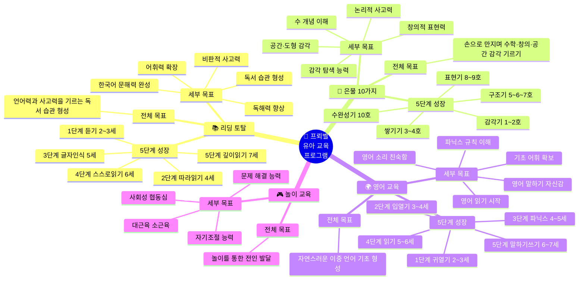

---

---

# 🔷 PART 1 — 3대 프로그램 심층 분석

---

## 📚 프로그램 ① 리딩 토탈 (Reading Total)

### 전체 목표 & 세부 목표 체계

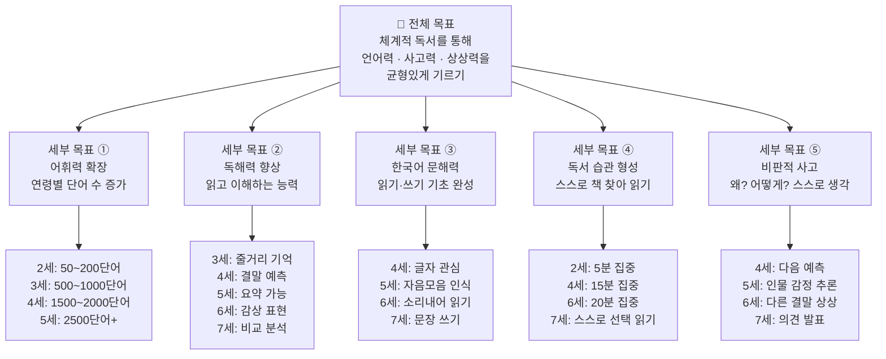

### 리딩 토탈 5단계 성장 로드맵

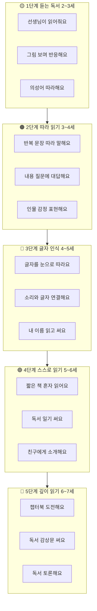

### 리딩 토탈 단계별 상세 활동표

| 단계 | 연령 | 핵심 키워드 | 책 종류 | 교사 역할 | 독서 시간 | 활동 예시 |
|------|------|-----------|--------|---------|---------|---------|
| **1단계** | 2~3세 | 듣기, 감각, 반복 | 의성어 그림책, 반복 구조 책, 촉감 책 | 감정 넣어 읽어주기, 반응 기다리기 | 5~10분 × 2~3회 | 따라 말하기, 그림 가리키기, 박수 치기 |
| **2단계** | 3~4세 | 따라하기, 질문, 상상 | 이야기 구조 그림책, 감정 그림책 | "다음엔 어떻게 될까?" 질문 | 10~15분 × 2회 | 역할극 연계, 감정 카드 고르기, 그림 그리기 |
| **3단계** | 4~5세 | 글자 인식, 소리 연결 | 글자 큰 그림책, 한글 입문 책 | 글자 찾기 게임, 소리 유도 | 15~20분 × 1~2회 | 글자 찾기, 모래판 쓰기, 이름 읽기 |
| **4단계** | 5~6세 | 혼자 읽기, 기록 | 짧은 이야기책, 리더스북 | 곁에서 지켜보기, 막히면 유도 | 20분 × 1~2회 | 독서 일기, 1문장 요약, 책 소개 |
| **5단계** | 6~7세 | 분석, 감상, 토론 | 챕터북, 정보책, 시집 | 비판적 질문, 토론 진행 | 20~25분 × 1회 | 독서 감상문, 독서 클럽, 책 만들기 |

### 리딩 토탈 실전 수업 대화 예시 (4세)

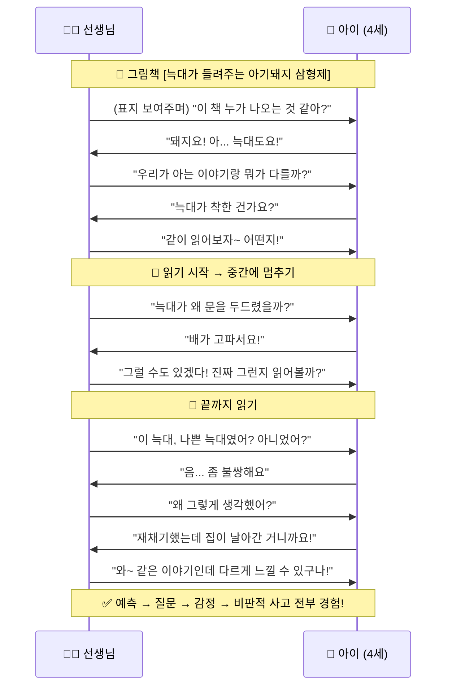

---

---

## 🧱 프로그램 ② 은물 10가지 (Froebel Gifts / Gabe)

### 전체 목표 & 세부 목표 체계

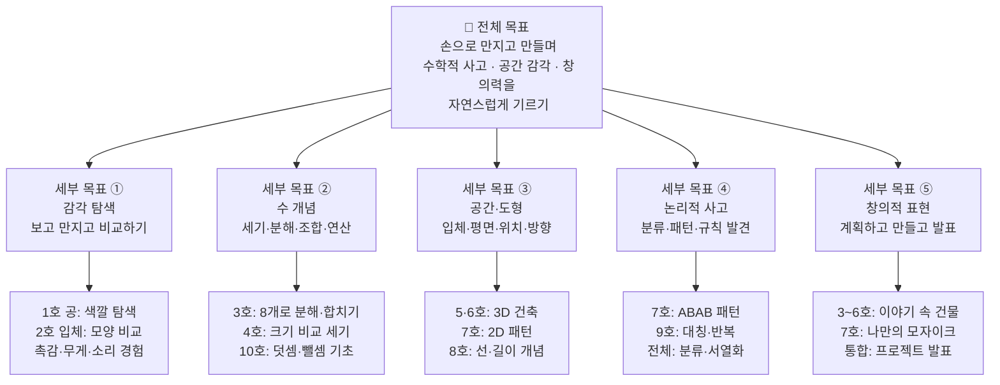

### 은물 10가지 단계 흐름 도식

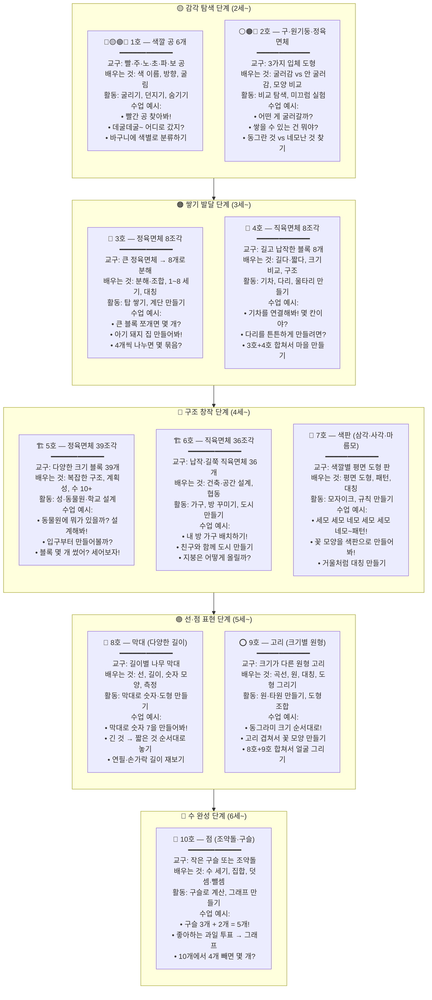

### 은물 전체 통합 비교표

| 호수 | 교구 이름 | 형태 | 개수 | 핵심 개념 | 연결 과목 | 권장 연령 | 집중 시간 |
|------|---------|------|------|---------|---------|---------|---------|
| **1호** | 색깔 공 | 구 (입체) | 6개 | 색깔, 방향, 운동 | 과학 (물리) | 2세~ | 5~10분 |
| **2호** | 입체 도형 | 구·원기둥·정육면체 | 3개 | 입체 비교, 특성 | 수학 (도형) | 2세~ | 8~12분 |
| **3호** | 정육면체 분해 | 정육면체 | 8개 | 분해·조합, 수 세기 | 수학 (수) | 3세~ | 10~15분 |
| **4호** | 직육면체 분해 | 직육면체 | 8개 | 크기 비교, 구조물 | 수학·공학 | 3세~ | 10~15분 |
| **5호** | 정육면체 확장 | 다양한 블록 | 39개 | 복잡 구조, 계획성 | 공학·예술 | 4세~ | 15~20분 |
| **6호** | 직육면체 확장 | 납작·길쭉 블록 | 36개 | 건축, 공간 설계 | 공학·사회 | 4세~ | 15~20분 |
| **7호** | 색판 | 삼각·사각·마름모 | 36개 | 평면 도형, 패턴 | 수학·예술 | 4세~ | 15분 |
| **8호** | 막대 | 다양한 길이 | 다수 | 선, 길이, 숫자 표현 | 수학 (측정) | 5세~ | 15~20분 |
| **9호** | 고리 | 다양한 크기 원 | 다수 | 곡선, 대칭, 도형 | 수학·예술 | 5세~ | 15~20분 |
| **10호** | 점 (구슬) | 작은 구/돌 | 다수 | 수 세기, 집합, 연산 | 수학 (연산) | 6세~ | 15~20분 |

### 은물 수업 실전 대화 예시 (3세, 3호)

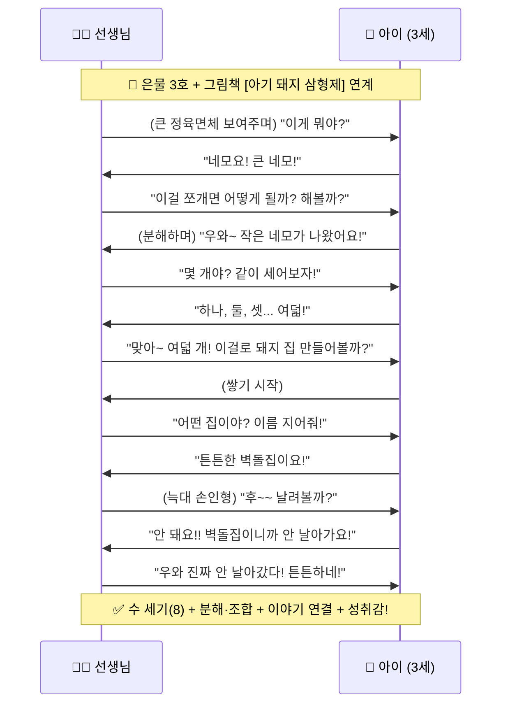

---

---

## 🌍 프로그램 ③ 영어 교육 (English Program)

### 전체 목표 & 세부 목표 체계

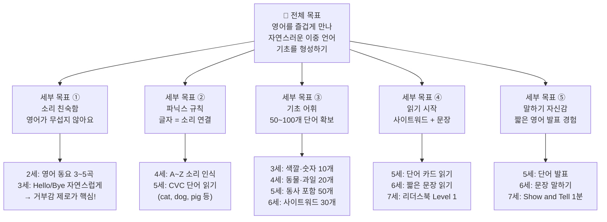

### 영어 교육 5단계 성장 로드맵

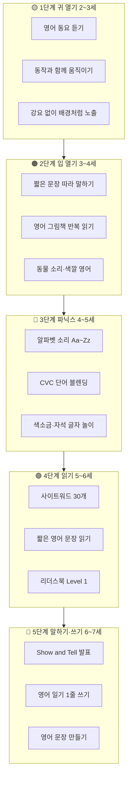

### 영어 교육 단계별 상세 활동표

| 단계 | 연령 | 핵심 활동 | 교구·자료 | 목표 어휘 수 | 교사 원칙 | 활동 시간 |
|------|------|---------|---------|-----------|---------|---------|
| **1단계** | 2~3세 | 동요 듣기, 바디 액션 | 영어 음원, 율동 영상 | 인사말 2~3개 | 강요 절대 금지 | 10분 × 2회 |
| **2단계** | 3~4세 | 따라 말하기, 반복 읽기 | 영어 그림책, 손인형 | 색깔·숫자 10~15개 | 틀려도 칭찬 | 10~15분 × 1~2회 |
| **3단계** | 4~5세 | 파닉스 소리, 단어 만들기 | 알파벳 카드, 색소금판 | 단어 20~30개 | 몸으로 움직이며 | 15~20분 × 1회 |
| **4단계** | 5~6세 | 단어 읽기, 문장 읽기 | 사이트워드 카드, 리더스북 | 사이트워드 30개 | 성공 경험 설계 | 15~20분 × 1회 |
| **5단계** | 6~7세 | 발표, 일기 쓰기, 대화 | 문장 만들기 카드, 템플릿 | 문장 패턴 5~10개 | 구체적 칭찬 | 20분 × 1회 |

### 영어 수업 실전 대화 예시 (4세, 파닉스)

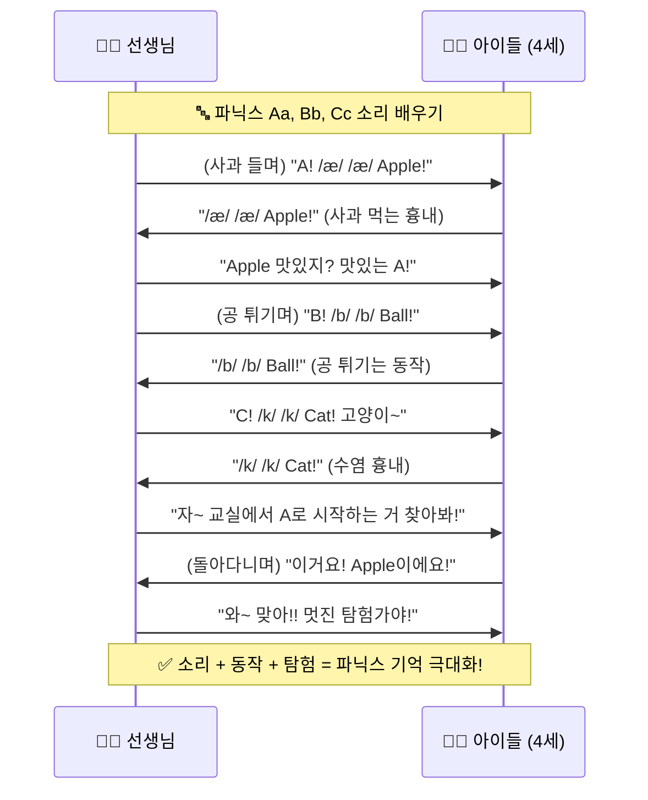

---

---

## 📊 3대 프로그램 통합 비교 대시보드

### 핵심 비교표 (한눈에)

| 비교 항목 | 📚 리딩 토탈 | 🧱 은물 (10가지) | 🌍 영어 교육 |
|-----------|-------------|----------------|-------------|
| **한 줄 설명** | 책을 통해 언어·사고력 기르기 | 교구로 수학·창의·공간 기르기 | 놀이로 영어 기초 만들기 |
| **전체 목표** | 언어력·사고력·독서 습관 형성 | 수학적 사고·공간 감각·창의력 | 자연스러운 이중 언어 기초 |
| **핵심 방법** | 그림책 읽기 → 토론 → 글쓰기 | 교구 조작 → 만들기 → 발표 | 노래 → 파닉스 → 읽기·말하기 |
| **교구/자료** | 그림책, 동화책, 워크북, 독서일기 | 1~10호 교구 세트 | 영어 동화책, 카드, 음원 |
| **성장 단계 수** | 5단계 (듣기→깊이읽기) | 5단계 (감각→수 완성) | 5단계 (귀열기→말하기쓰기) |
| **최적 시작 연령** | 2세 (듣기부터) | 2세 (1호부터) | 2세 (동요부터) |
| **완성 시점** | 7세 (독서 토론·감상문) | 6~7세 (수학 프로젝트) | 7세 (영어 발표·일기) |

### 장점·약점 상세 비교

| 항목 | 📚 리딩 토탈 | 🧱 은물 | 🌍 영어 |
|------|------------|--------|--------|
| **장점 ①** | 상상력·언어 표현력 성장 | 손으로 만지며 개념 형성 (체험 학습) | 어릴수록 발음·억양 자연 습득 |
| **장점 ②** | 집중력·독서 습관 형성 | 수·도형·공간 감각 놀이로 습득 | 영어 거부감 없이 접근 가능 |
| **장점 ③** | 한국어 기초 문해력 강화 | 놀이와 학습이 완전 통합 | 다양한 놀이와 연계 쉬움 |
| **장점 ④** | 비판적 사고력 발달 | 문제 해결력·계획성 향상 | 글로벌 소통 기초 마련 |
| **약점 ①** | 교사의 읽어주기 의존도 높음 | 교구 관리·보관 번거로움 | 꾸준한 노출 없으면 효과 저하 |
| **약점 ②** | 혼자 하면 흥미 유지 어려움 | 연령별 단계 관리 필요 | 한국어 발달과 균형 필요 |
| **약점 ③** | 쓰기·수학 연결 약함 | 영어·언어 연결 부족할 수 있음 | 체계적 문법은 제한적 |
| **해결 방법** | 역할극·독후 활동으로 활동적 연계 | 은물 + 이야기 통합 수업 진행 | 한국어 70% + 영어 30% 균형 유지 |

### 프로그램 간 시너지 도식

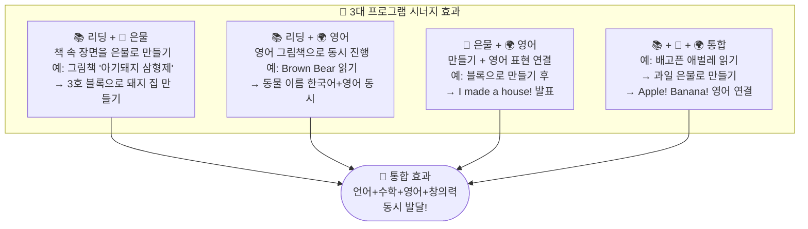

---

---

# 🗓️ PART 2 — 연령별 통합 커리큘럼

---

## 👶 2세 — "감각으로 세상을 탐험해요"

### 2세 발달 & 교육 마인드맵

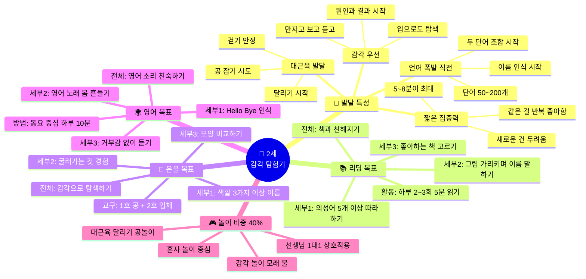

### 2세 전체·세부 목표 정리표

| 프로그램 | 전체 목표 | 세부 목표 ① | 세부 목표 ② | 세부 목표 ③ | 성공 기준 |
|---------|---------|-----------|-----------|-----------|---------|
| **📚 리딩** | 책과 친해지기 | 의성어 5개+ 따라하기 | 그림 가리키며 이름 말하기 | 좋아하는 책 고르기 | 책 보면 다가오는가? |
| **🧱 은물** | 감각으로 탐색하기 | 색깔 3가지+ 이름 말하기 | 굴러가는 것 경험 | 두 모양 비교하기 | 교구에 관심 보이는가? |
| **🌍 영어** | 영어 소리 친숙하기 | Hello/Bye 인식하기 | 영어 노래에 몸 흔들기 | 거부감 없이 듣기 | 영어 동요에 반응하는가? |
| **🎮 놀이** | 안전한 탐색 경험 | 감각 놀이 즐기기 | 대근육 활동 참여 | 선생님과 상호작용 | 놀이에 몰입하는가? |

### 2세 하루 시간표 (총 120분)

```mermaid
gantt
    title 2세 하루 120분 시간표
    dateFormat X
    axisFormat %s분

    section 오전 블록
    🌍 영어 인사 노래 (Hello Song 동작)       :a1, 0, 10
    🧱 은물 1·2호 감각 탐색 (자유 만지기)      :a2, 10, 30
    📚 그림책 읽기 (의성어 반복 책 1권)         :a3, 30, 40

    section 놀이 블록
    🎮 자유 놀이 (블록·인형·탐색)              :b1, 40, 60
    🌍 영어 노래·몸 활동 (Head Shoulders)     :b2, 60, 70
    🎮 대근육·감각 놀이 (공놀이·모래놀이)       :b3, 70, 95

    section 마무리
    📚 마무리 그림책 (조용한 책 1권)            :c1, 95, 110
    정리 & 인사 (영어 Bye~)                   :c2, 110, 120
```

| 시간 | 활동 | 프로그램 | 세부 내용 | 교사 포인트 |
|------|------|---------|---------|-----------|
| 0~10분 | 인사 노래 | 🌍 영어 | Hello Song + 이름 부르기 | 밝은 표정, 눈 맞춤 |
| 10~30분 | 은물 탐색 | 🧱 은물 | 1·2호 자유 탐색, 색 이름 말하기 | "이건 빨간 공이야~" 반복 설명 |
| 30~40분 | 그림책 | 📚 리딩 | 의성어·반복 그림책 1권 읽기 | 의성어에서 멈추고 따라 말하기 유도 |
| 40~60분 | 자유 놀이 | 🎮 놀이 | 블록·인형·탐색 자유 선택 | 관찰 위주, 옆에서 언어 붙여주기 |
| 60~70분 | 영어 몸활동 | 🌍 영어 | Head Shoulders / If You Happy | 천천히 → 빠르게, 웃으면 성공! |
| 70~95분 | 감각 놀이 | 🎮 놀이 | 공 굴리기, 모래·물, 터널 | 다양한 감각 경험 제공 |
| 95~110분 | 마무리 독서 | 📚 리딩 | 조용한 그림책 1권 (자유 선택) | 차분한 목소리로 마무리 |
| 110~120분 | 정리·인사 | 정리 | "오늘 뭐가 재미있었어?" | 영어 Goodbye! 함께 |

---

---

## 🐣 3세 — "말이 터지고 상상이 시작돼요"

### 3세 발달 & 교육 마인드맵

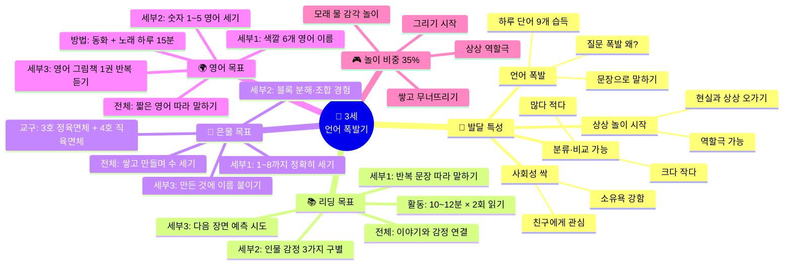

### 3세 전체·세부 목표 정리표

| 프로그램 | 전체 목표 | 세부 목표 ① | 세부 목표 ② | 세부 목표 ③ | 성공 기준 |
|---------|---------|-----------|-----------|-----------|---------|
| **📚 리딩** | 이야기와 감정 연결 | 반복 문장 따라 말하기 | 인물 감정 3가지 구별 | 다음 장면 예측 시도 | 책 읽으며 반응하는가? |
| **🧱 은물** | 쌓고 만들며 수 세기 | 1~8 정확히 세기 | 블록 분해·조합 경험 | 만든 것에 이름 붙이기 | 목적 있게 쌓는가? |
| **🌍 영어** | 짧은 영어 따라 말하기 | 색깔 6개 영어 이름 | 숫자 1~5 영어 세기 | 영어 그림책 반복 듣기 | 자발적으로 따라하는가? |
| **🎮 놀이** | 상상 놀이로 세상 확장 | 역할극에 몰입하기 | 재료 자유롭게 탐색 | 친구와 옆에서 놀기 | 상상 이야기 말하는가? |

### 3세 하루 시간표 (총 130분)

| 시간 | 활동 | 프로그램 | 세부 내용 | 교사 포인트 |
|------|------|---------|---------|-----------|
| 0~10분 | 영어 인사·노래 | 🌍 영어 | Hello Song + 오늘의 영어 단어 (색깔) | "What color is this? Red!" |
| 10~25분 | 그림책 읽기 | 📚 리딩 | 이야기 구조 그림책 + 따라 말하기 | "이 친구 지금 어떤 기분일까?" |
| 25~45분 | 은물 3·4호 | 🧱 은물 | 블록으로 그림책 속 장면 만들기 | "같이 세어보자! 하나, 둘..." |
| 45~65분 | 상상 역할 놀이 | 🎮 놀이 | 그림책 내용으로 역할극 | 아이가 주도, 교사는 참여자 |
| 65~80분 | 영어 동화책 | 🌍 영어 | 짧은 반복 영어 그림책 (Brown Bear 등) | 따라 말하기 유도, 동작 추가 |
| 80~110분 | 자유 창작 놀이 | 🎮 놀이 | 그리기, 만들기, 모래·물 놀이 | 자유 선택, 옆에서 대화하기 |
| 110~125분 | 마무리 책 + 감정 나누기 | 📚 리딩 | 오늘의 감정·경험 이야기 | "오늘 가장 기뻤던 건?" |
| 125~130분 | 정리·인사 | 정리 | 함께 정리 + 영어 Bye! | 정리도 놀이처럼 |

---

---

## 🌱 4세 — "왜? 어떻게? 창의력이 폭발해요"

### 4세 발달 & 교육 마인드맵

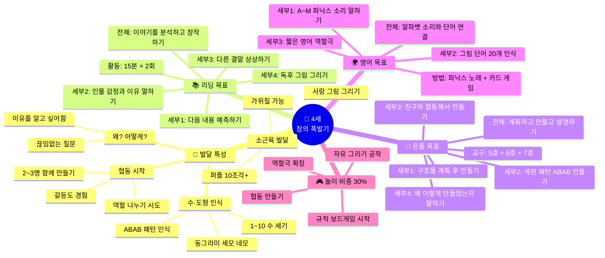

### 4세 전체·세부 목표 정리표

| 프로그램 | 전체 목표 | 세부 ① | 세부 ② | 세부 ③ | 세부 ④ | 성공 기준 |
|---------|---------|--------|--------|--------|--------|---------|
| **📚 리딩** | 이야기 분석·창작 | 다음 내용 예측 | 감정+이유 말하기 | 다른 결말 상상 | 독후 그림 그리기 | "왜 그랬을까?" 질문하는가? |
| **🧱 은물** | 계획→만들기→설명 | 계획 후 만들기 | 패턴 ABAB | 협동 만들기 | 설명하기 | "이건 ○○야" 말하는가? |
| **🌍 영어** | 알파벳 소리+단어 | A~M 소리 | 단어 20개 인식 | 영어 역할극 | — | 알파벳 소리 내는가? |
| **🎮 놀이** | 친구와 함께 만들기 | 협동 경험 | 역할 나누기 | 규칙 게임 | — | 친구와 함께 만드는가? |

### 4세 하루 시간표 (총 140분)

| 시간 | 활동 | 프로그램 | 세부 내용 | 교사 포인트 |
|------|------|---------|---------|-----------|
| 0~15분 | 영어 워밍업 | 🌍 영어 | 파닉스 노래 + 오늘의 알파벳 소리 + 단어 카드 | "/æ/ Apple! /b/ Ball!" 동작과 함께 |
| 15~40분 | 은물 프로젝트 | 🧱 은물 | 5·6·7호 선택 → 주제별 만들기 | "왜 이렇게 만들었어?" 설명 유도 |
| 40~60분 | 그림책 읽기·토론 | 📚 리딩 | 읽기 + 예측 질문 + 감정 토론 | "다음엔 어떻게 될까?" "왜 그랬을까?" |
| 60~85분 | 협동 놀이 | 🎮 놀이 | 2~4명 함께 블록 도시 or 역할극 | 관찰하며 갈등 해결 도움 |
| 85~105분 | 파닉스·영어 게임 | 🌍 영어 | 카드 뒤집기, 알파벳 빙고, 노래 | 틀려도 격려, 몸으로 움직이며 |
| 105~130분 | 자유 창작 놀이 | 🎮 놀이 | 그리기, 점토, 가위·풀 공작 자유 선택 | 개별 관심사 존중, 결과보다 과정 |
| 130~140분 | 마무리 발표 | 📚 리딩 | 오늘 만든 것 1문장 발표 | "저는 ○○을 만들었어요!" 칭찬 |

---

---

## 🌿 5세 — "논리와 규칙을 배워요"

### 5세 발달 & 교육 마인드맵

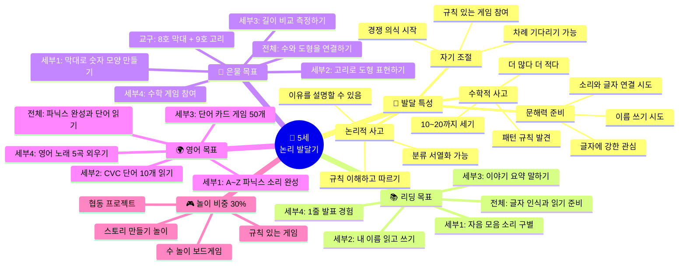

### 5세 전체·세부 목표 정리표

| 프로그램 | 전체 목표 | 세부 ① | 세부 ② | 세부 ③ | 세부 ④ | 성공 기준 |
|---------|---------|--------|--------|--------|--------|---------|
| **📚 리딩** | 글자 인식+읽기 준비 | 자음모음 소리 구별 | 이름 읽고 쓰기 | 이야기 요약 | 1줄 발표 | 글자 보면 소리 내는가? |
| **🧱 은물** | 수와 도형 연결 | 막대로 숫자 만들기 | 고리로 도형 | 길이 비교 | 수학 게임 | 막대로 숫자 7 만드는가? |
| **🌍 영어** | 파닉스 완성+단어 읽기 | A~Z 소리 완성 | CVC 10개 읽기 | 단어 카드 50개 | 노래 5곡 | cat, dog 읽을 수 있는가? |
| **🎮 놀이** | 규칙·경쟁·협력 균형 | 규칙 게임 참여 | 차례 기다리기 | 팀 협동 | — | 규칙 지키며 게임하는가? |

### 5세 하루 시간표 (총 150분)

| 시간 | 활동 | 프로그램 | 세부 내용 | 교사 포인트 |
|------|------|---------|---------|-----------|
| 0~15분 | 파닉스 학습 | 🌍 영어 | 알파벳 소리 복습 + 새 파닉스 | CVC 단어 손뼉 블렌딩 "/k/ /æ/ /t/ → cat!" |
| 15~35분 | 그림책·한글 | 📚 리딩 | 글자 찾기 게임 + 소리내어 읽기 도전 | "ㄱ 들어간 글자 찾아봐!" 재미있게 |
| 35~60분 | 은물 8·9호 | 🧱 은물 | 막대로 숫자 만들기, 고리로 도형 표현 | "막대 3개로 삼각형!" 수와 도형 연결 |
| 60~85분 | 수 놀이 | 🎮 놀이 | 수 카드 게임, 점프 수 세기, 보드게임 | 몸으로 움직이며 수 감각 키우기 |
| 85~110분 | 자유 창작 놀이 | 🎮 놀이 | 만들기, 그리기, 이야기 만들기 자유 | 창의적 시도 격려, 개인 속도 존중 |
| 110~130분 | 영어 단어 게임 | 🌍 영어 | 카드 매칭, 영어 빙고, 챈트 | 게임으로 단어 반복, 성공 경험 |
| 130~150분 | 독서 + 발표 | 📚 리딩 | 오늘 읽은 책 1줄 발표 + 박수 | "이 책은 ○○ 이야기예요!" 자신감! |

---

---

## 🌳 6세 — "학습 준비가 완성돼요"

### 6세 발달 & 교육 마인드맵

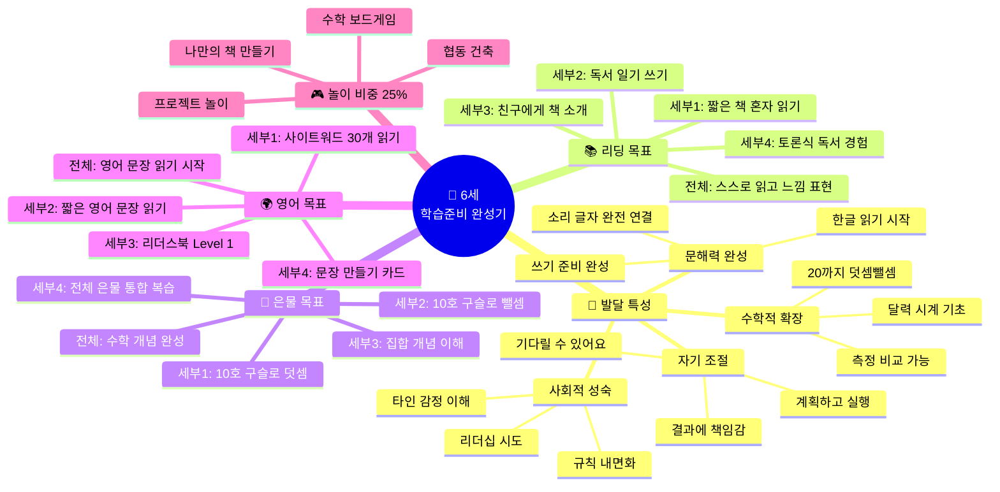

### 6세 전체·세부 목표 정리표

| 프로그램 | 전체 목표 | 세부 ① | 세부 ② | 세부 ③ | 세부 ④ | 성공 기준 |
|---------|---------|--------|--------|--------|--------|---------|
| **📚 리딩** | 스스로 읽고 표현 | 혼자 읽기 도전 | 독서 일기 쓰기 | 책 소개 발표 | 토론식 독서 | 짧은 책 혼자 읽는가? |
| **🧱 은물** | 수학 개념 완성 | 덧셈 (10호) | 뺄셈 (10호) | 집합 개념 | 전체 통합 복습 | 구슬로 3+2=5 하는가? |
| **🌍 영어** | 영어 문장 읽기 | 사이트워드 30개 | 짧은 문장 읽기 | 리더스북 Lv.1 | 문장 만들기 | "I like pizza" 읽는가? |
| **🎮 놀이** | 프로젝트형 놀이 | 목표 세우기 | 계획하고 실행 | 결과 발표 | — | 계획→실행 가능한가? |

### 6세 하루 시간표 (총 160분)

| 시간 | 활동 | 프로그램 | 세부 내용 | 교사 포인트 |
|------|------|---------|---------|-----------|
| 0~20분 | 영어 읽기 연습 | 🌍 영어 | 사이트워드 복습 + 짧은 문장 읽기 + 단어 쓰기 | "[I] [like] [pizza] 문장 만들어봐!" |
| 20~45분 | 스스로 읽기 | 📚 리딩 | 한글 그림책 소리 내어 읽기 도전 | 막혀도 바로 알려주지 않기, 소리 유도 |
| 45~70분 | 은물 10호 + 통합 | 🧱 은물 | 구슬로 덧셈·뺄셈 + 전체 은물 복습 | 이야기 덧셈 "토끼가 당근 3개+2개" |
| 70~95분 | 프로젝트 놀이 | 🎮 놀이 | 작은 책 만들기 / 나만의 도시 설계 | 계획→실행→발표 전 과정 경험 |
| 95~120분 | 자유 놀이 | 🎮 놀이 | 친구와 자유 활동 (보드게임, 만들기) | 자기 선택·자기 조절 경험 |
| 120~145분 | 독후 활동 | 📚 리딩 | 그림으로 책 표현 + 짧은 글쓰기 + 독서 일기 | "오늘 책 주인공에게 편지 써볼까?" |
| 145~160분 | 마무리 발표 | 정리 | 오늘 배운 것 3가지 말하기 | 구체적 칭찬으로 자신감 마무리 |

---

---

## 🎒 7세 — "초등 준비, 자기주도 학습 시작"

### 7세 발달 & 교육 마인드맵

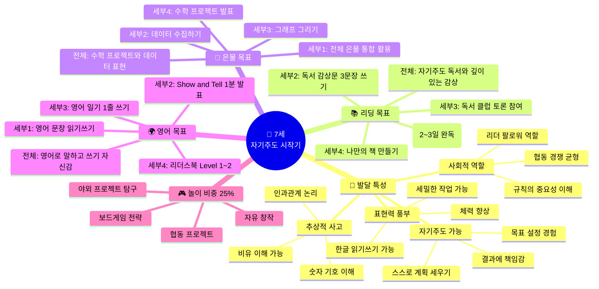

### 7세 전체·세부 목표 정리표

| 프로그램 | 전체 목표 | 세부 ① | 세부 ② | 세부 ③ | 세부 ④ | 성공 기준 |
|---------|---------|--------|--------|--------|--------|---------|
| **📚 리딩** | 자기주도 독서+감상 | 챕터북 도전 | 감상문 3문장 | 독서 클럽 토론 | 나만의 책 | 감상문 이유 포함 쓰는가? |
| **🧱 은물** | 수학 프로젝트+발표 | 전체 은물 통합 | 데이터 수집 | 그래프 그리기 | 발표 | 그래프 보고 설명하는가? |
| **🌍 영어** | 영어 말하기+쓰기 | 문장 읽기쓰기 | Show and Tell | 영어 일기 | 리더스북 | 1분 영어 발표 가능한가? |
| **🎮 놀이** | 프로젝트+전략+협동 | 팀 프로젝트 | 전략 게임 | 야외 탐구 | — | 계획→협력→완성 가능한가? |

### 7세 하루 시간표 (총 160분)

| 시간 | 활동 | 프로그램 | 세부 내용 | 교사 포인트 |
|------|------|---------|---------|-----------|
| 0~20분 | 영어 활동 | 🌍 영어 | 영어 일기 or 사이트워드 + 스스로 읽기 5분 | "Today I feel happy because..." 템플릿 |
| 20~45분 | 자기주도 독서 | 📚 리딩 | 스스로 책 선택 → 읽기 → 독서 일기 기록 | 관찰하며 필요시만 도움 |
| 45~70분 | 은물 수학 프로젝트 | 🧱 은물 | 주간 프로젝트 단계별 (조사→만들기→그래프) | "몇 명이 골랐어? 그래프로 그려볼까?" |
| 70~95분 | 협동 프로젝트 놀이 | 🎮 놀이 | 팀별 만들기·탐구 + 리더·팔로워 경험 | 역할 분담 도움, 갈등 해결 유도 |
| 95~120분 | 자유 놀이 | 🎮 놀이 | 보드게임, 창작, 바깥 놀이 자유 | 자기 선택 존중, 전략 격려 |
| 120~140분 | 영어 발표 | 🌍 영어 | Show and Tell or 영어 대화 연습 | "This is my ___. I like it because___." |
| 140~155분 | 독서 감상 나누기 | 📚 리딩 | 오늘 읽은 책 한 문장 발표 + 질문 | 친구 발표에 질문 유도 |
| 155~160분 | 마무리 | 정리 | Best Moment 나누기 + Goodbye! | 구체적 칭찬으로 자신감 마무리 |

---

---

# 🌟 PART 3 — 전체 통합 로드맵

## 2세→7세 성장 통합 흐름

```mermaid
flowchart TD
    START([👶 2세 입학]) --> Y2

    subgraph Y2["🟡 2세 — 씨앗 심기"]
        Y2R["📚 듣는 독서<br> 의성어 그림책"]
        Y2G["🧱 1·2호 감각 탐색<br> 공 굴리기·모양 비교"]
        Y2E["🌍 동요 듣기<br> Hello·Goodbye"]
        Y2P["🎮 놀이 40%<br> 감각·대근육"]
    end

    subgraph Y3["🟠 3세 — 싹 틔우기"]
        Y3R["📚 따라 읽기<br> 감정 이야기"]
        Y3G["🧱 3·4호 쌓기<br> 1~8 세기"]
        Y3E["🌍 따라 말하기<br> 색깔·숫자 영어"]
        Y3P["🎮 놀이 35%<br> 상상·역할극"]
    end

    subgraph Y4["🔴 4세 — 줄기 자라기"]
        Y4R["📚 예측·토론<br> 다른 결말 상상"]
        Y4G["🧱 5·6·7호 설계<br> 패턴·협동"]
        Y4E["🌍 파닉스 입문<br> A~M 소리"]
        Y4P["🎮 놀이 30%<br> 협동·창작"]
    end

    subgraph Y5["🟣 5세 — 잎 펼치기"]
        Y5R["📚 글자 인식<br> 한글 입문"]
        Y5G["🧱 8·9호 수·도형<br> 숫자 만들기"]
        Y5E["🌍 파닉스 완성<br> CVC 단어 읽기"]
        Y5P["🎮 놀이 30%<br> 규칙·수학 게임"]
    end

    subgraph Y6["🔵 6세 — 꽃 피우기"]
        Y6R["📚 스스로 읽기<br> 독서 일기"]
        Y6G["🧱 10호 수학<br> 덧셈·뺄셈"]
        Y6E["🌍 문장 읽기<br> 사이트워드 30개"]
        Y6P["🎮 놀이 25%<br> 프로젝트"]
    end

    subgraph Y7["⭐ 7세 — 열매 맺기"]
        Y7R["📚 깊이 읽기<br> 독서 토론·감상문"]
        Y7G["🧱 은물 통합<br> 수학 프로젝트"]
        Y7E["🌍 말하기·쓰기<br> Show and Tell"]
        Y7P["🎮 놀이 25%<br> 전략·협동"]
    end

    Y2 --> Y3 --> Y4 --> Y5 --> Y6 --> Y7

    Y7 --> GOAL([🎒 초등 입학 준비 완성<br> ✅ 한글 읽기·쓰기<br> ✅ 수학 덧셈·뺄셈<br> ✅ 영어 문장 읽기<br> ✅ 발표 자신감<br> ✅ 독서 습관<br> ✅ 자기주도 학습 기초])
```

---

## 📊 연령별 프로그램 비중 가이드

| 연령 | 📚 리딩 | 🧱 은물 | 🌍 영어 | 🎮 놀이 | 총 시간 |
|------|--------|--------|--------|--------|--------|
| **2세** | 20% (24분) | 25% (30분) | 15% (18분) | **40% (48분)** | 120분 |
| **3세** | 25% (33분) | 25% (33분) | 15% (20분) | **35% (44분)** | 130분 |
| **4세** | 25% (35분) | 25% (35분) | 20% (28분) | **30% (42분)** | 140분 |
| **5세** | 25% (38분) | 20% (30분) | 25% (38분) | **30% (44분)** | 150분 |
| **6세** | 30% (48분) | 20% (32분) | 25% (40분) | **25% (40분)** | 160분 |
| **7세** | 30% (48분) | 15% (24분) | 30% (48분) | **25% (40분)** | 160분 |

### 비중 변화 흐름

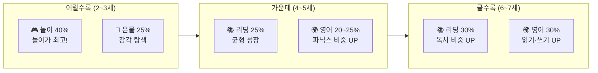

> **핵심 원칙**: 어릴수록 놀이 비중이 높고, 클수록 리딩·영어 비중이 올라갑니다. 하지만 7세에도 놀이는 25% 유지! 놀이 없는 학습은 효과가 떨어집니다.

---

## 📏 연령별 활동 집중 시간 기준

| 연령 | 최대 집중 시간 | 이상적 활동 단위 | 하루 전환 횟수 | 교사 팁 |
|------|-------------|--------------|-------------|--------|
| **2세** | 5~8분 | 5~10분 | 10~12회 | 짧게 자주! 같은 건 반복 OK |
| **3세** | 8~12분 | 10~15분 | 8~10회 | 역할극으로 집중 연장 가능 |
| **4세** | 10~15분 | 15~20분 | 6~8회 | 질문으로 흥미 유지 |
| **5세** | 15~20분 | 20~25분 | 5~7회 | 게임 요소 넣으면 집중↑ |
| **6세** | 20~25분 | 25~30분 | 4~6회 | 목표 제시하면 더 집중 |
| **7세** | 25~30분 | 25~30분 | 4~5회 | 자기 선택이 집중의 열쇠 |

---

## ✅ 교사 핵심 원칙 체크리스트

```mermaid
flowchart TD
    A([교사의 3가지 역할]) --> B[관찰자<br> 아이를 먼저 보기]
    A --> C[질문자<br> 답 주지 않고 질문하기]
    A --> D[격려자<br> 과정을 칭찬하기]

    B --> B1["뭘 좋아하나?<br> 어디서 막히나?<br> 어떤 표정인가?"]
    C --> C1["왜 그렇게 만들었어?<br> 다음엔 어떻게 될까?<br> 어떤 느낌이야?"]
    D --> D1["잘했어가 아닌<br> 열심히 했구나!<br> 또 해볼래?가 더 중요"]
```

| ❌ 절대 하지 말 것 | ✅ 꼭 할 것 | 이유 |
|:--:|:--:|------|
| "틀렸어!" | "어떻게 생각했어?" | 아이의 사고 과정이 더 중요 |
| 결과만 평가 | 과정을 구체적 칭찬 | "끝까지 해본 게 멋져!" |
| 모든 아이 같은 기대 | 개별 속도 존중 | 발달 속도는 아이마다 다름 |
| 30분 이상 앉히기 | 15분마다 몸 움직이기 | 집중력 한계 = 학습 효과 저하 |
| 영어 강요 | 놀이처럼 노출 | 강요 = 거부감 = 역효과 |
| 대신 해주기 | 실패 → 다시 시도 기회 | 문제 해결 능력 = 스스로 경험 |
| "조용히!" | "무슨 이야기 하고 있어?" | 아이의 소음 = 학습 중인 증거 |
| 비교하기 | 어제의 나와 비교 | "어제보다 더 잘 만들었네!" |

---

> 📝 **작성 기준** : 프뢰벨 교육 철학 (놀이 = 학습) + 발달심리학 연령별 특성 + 실전 교실 적용
> 🗓️ **작성일** : 2026년 4월 6일
> 👨‍🏫 **활용 대상** : 유아 교육 교사 및 AI 교육 컨텐츠 개발자
