# 🌸 프뢰벨 유아 교육 프로그램 안내
> 엄마·아빠가 꼭 알아야 할 연령별 × 주제별 × 단계별 교육 가이드

---

## 📌 한눈에 보는 전체 구조

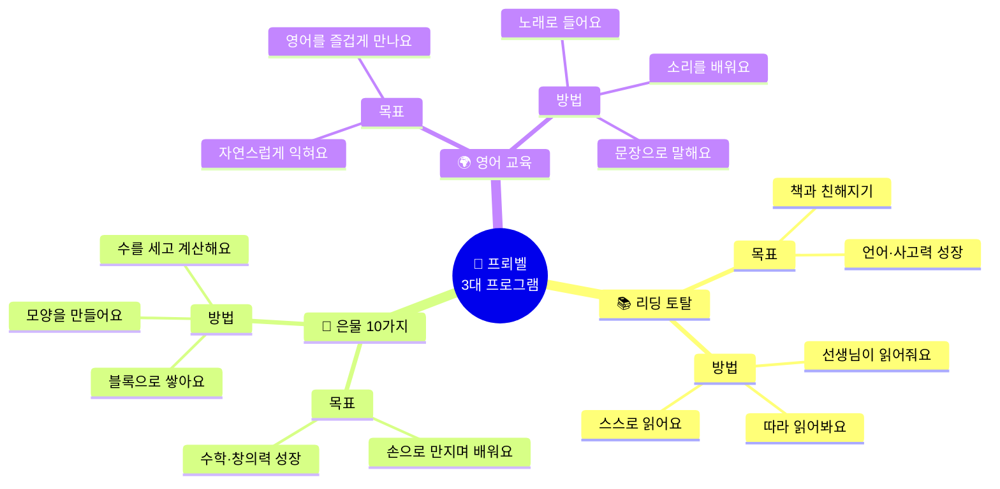

---

## 🗓️ 연령별 교육 한눈에 보기

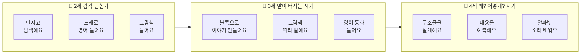

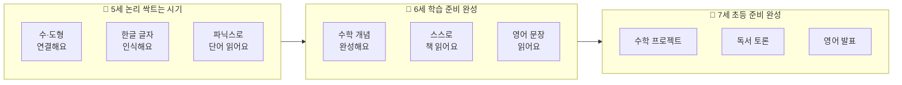

---

---

# 📚 주제 1 — 리딩 토탈 (독서 교육)

## 단계별 성장 흐름

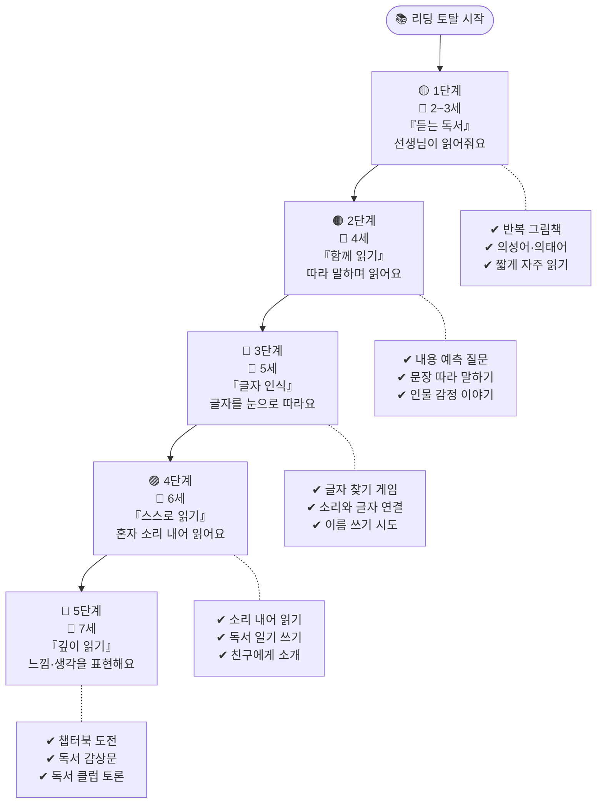

---

## 연령별 × 단계별 독서 활동표

| 연령 | 단계 | 하루 독서 시간 | 책 종류 | 부모가 도와줄 것 |
|------|------|-------------|--------|--------------|
| **2세** | 듣는 독서 | 5~10분 × 2~3회 | 의성어 그림책, 반복 구조 책 | 감정 넣어 읽어주기, 반응 기다려주기 |
| **3세** | 함께 읽기 | 10~12분 × 2회 | 이야기 있는 그림책 | "다음엔 어떻게 될까?" 질문하기 |
| **4세** | 따라 읽기 | 15분 × 2회 | 반복 문장 책, 감정 그림책 | 책 속 인물 감정 물어보기 |
| **5세** | 글자 인식 | 15~20분 × 1~2회 | 글자 큰 그림책, 한글 입문 | 글자 손가락으로 짚으며 읽기 |
| **6세** | 스스로 읽기 | 20분 × 1~2회 | 짧은 이야기책 | 막혀도 바로 알려주지 않기 |
| **7세** | 깊이 읽기 | 20~25분 × 1회 | 챕터북, 정보책 | "왜 그랬을까?" 함께 생각하기 |

---

## 📌 독서 수업 실제 장면 예시

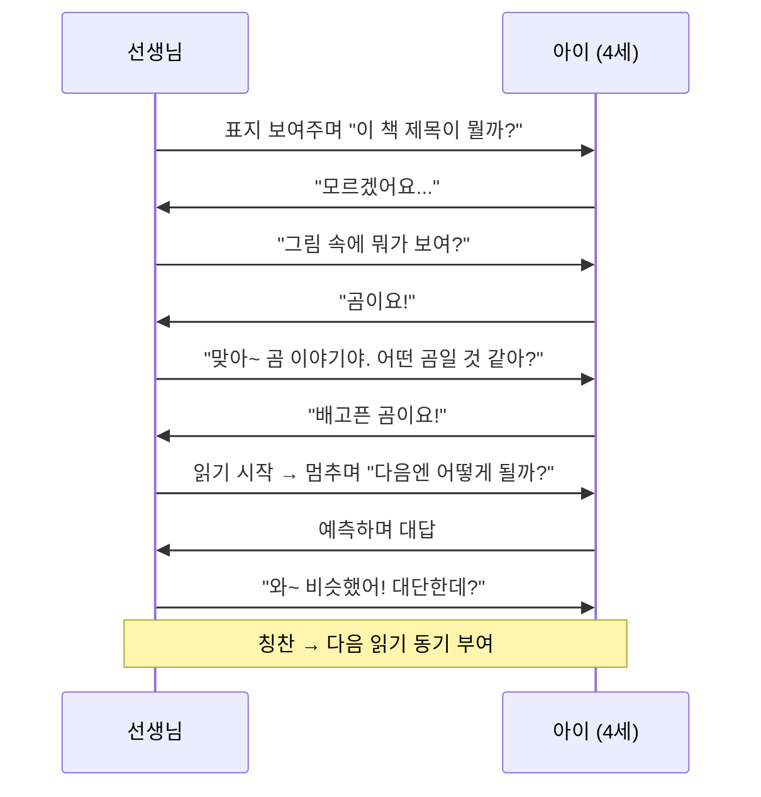

---

---

# 🧱 주제 2 — 은물 10가지 (교구 교육)

## 은물 단계별 성장 흐름

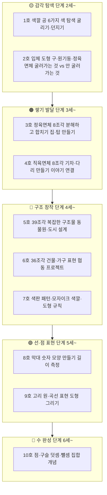

---

## 은물 연령별 × 교육 목표 도식

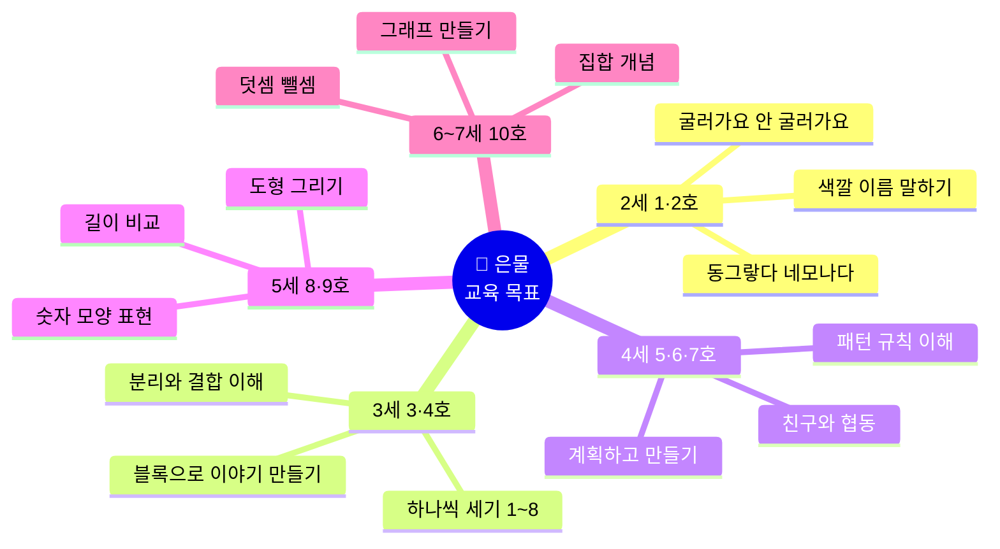

---

## 은물 수업 실제 장면 예시

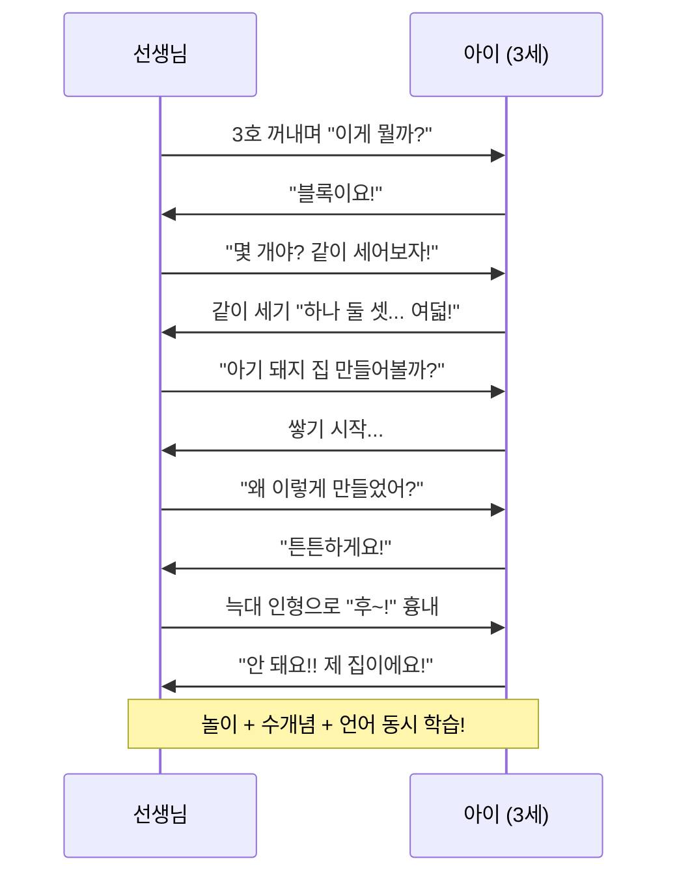

---

## 은물 단계별 기대 성과

| 단계 | 교구 | 배우는 것 | 부모가 확인할 것 |
|------|------|---------|--------------|
| **1단계** | 1·2호 | 색 이름, 입체 모양, 굴림 | 색깔 3가지 이상 말하나요? |
| **2단계** | 3·4호 | 1~8 세기, 분해·조합 | 블록 8개 정확히 세나요? |
| **3단계** | 5·6·7호 | 계획적 만들기, 패턴 | 만든 것에 이름 붙이나요? |
| **4단계** | 8·9호 | 숫자 모양, 길이, 도형 | 막대로 숫자 만드나요? |
| **5단계** | 10호 | 덧셈·뺄셈, 집합 | 구슬로 더하기 해결하나요? |

---

---

# 🌍 주제 3 — 영어 교육

## 단계별 성장 흐름

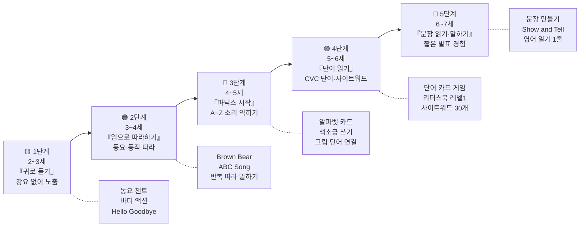

---

## 영어 교육 연령별 × 활동별 도식

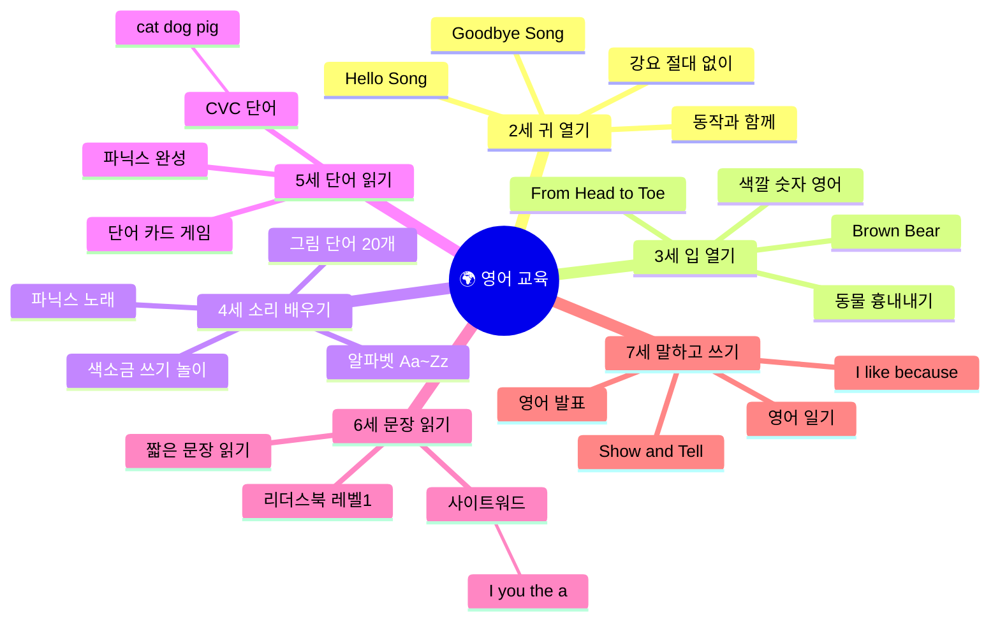

---

## 영어 수업 실제 장면 예시

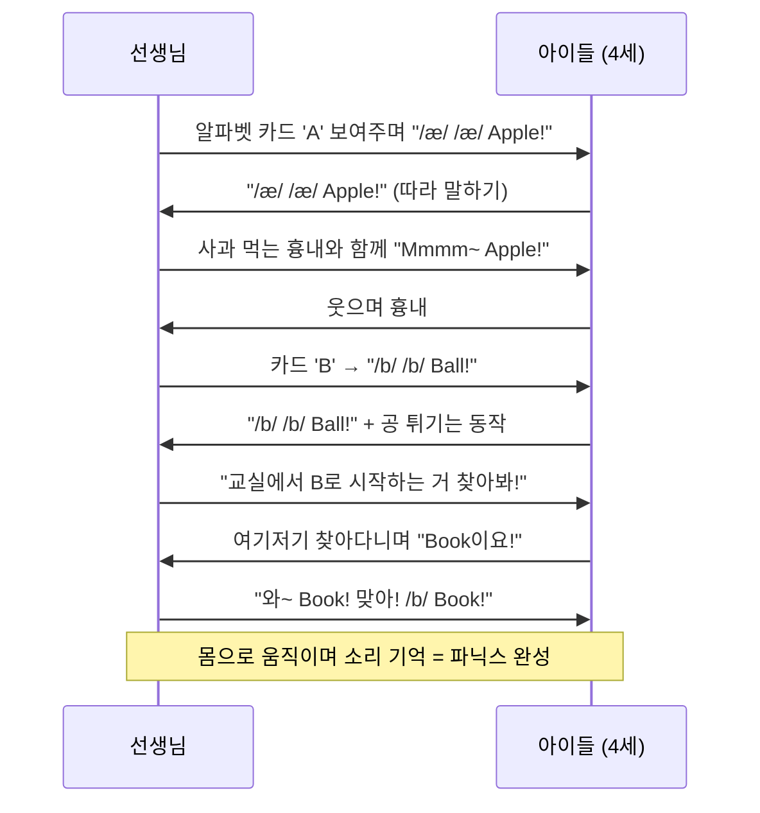

---

## 영어 연령별 기대 성과

| 연령 | 핵심 목표 | 성공 기준 | 부모가 집에서 도울 것 |
|------|---------|---------|------------------|
| **2세** | 영어 소리에 거부감 없기 | 영어 노래 나오면 몸 흔들기 | 영어 동요 틀어두기 (하루 20~30분) |
| **3세** | 짧은 영어 따라 말하기 | "Hello!" "Bye!" 자연스럽게 | 영어 그림책 함께 읽기 |
| **4세** | 알파벳 소리 인식 | A~Z 소리 20개 이상 말하기 | 알파벳 노래 함께 부르기 |
| **5세** | CVC 단어 읽기 | cat, dog, pig 등 10개 읽기 | 단어 카드 냉장고에 붙여두기 |
| **6세** | 사이트워드 + 짧은 문장 읽기 | 사이트워드 30개 읽기 | 영어 리더스북 함께 읽기 |
| **7세** | 영어 말하기·쓰기 경험 | Show and Tell 1분 발표 | "오늘 영어로 뭐 배웠어?" 대화 |

---

---

# 🎮 주제 4 — 놀이 교육 (통합)

## 놀이가 학습인 이유

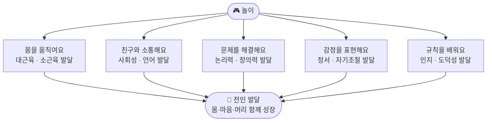

---

## 연령별 놀이 특성 및 방향

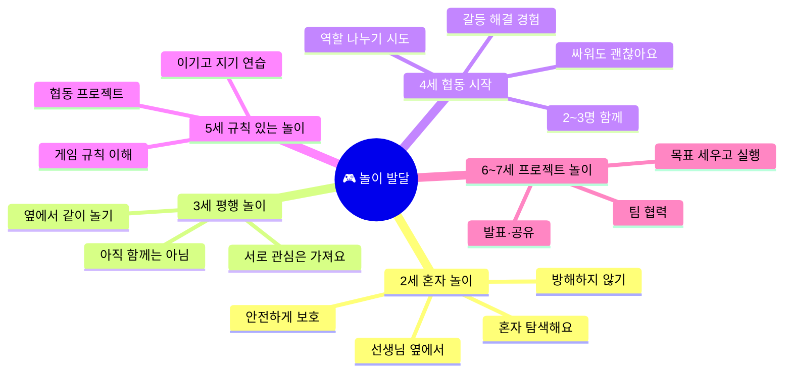

---

## 놀이 유형별 교육 효과

| 놀이 유형 | 대표 활동 | 주요 발달 영역 | 권장 연령 |
|---------|---------|-------------|---------|
| **감각 놀이** | 모래·물·점토 | 감각 발달, 정서 안정 | 2~4세 |
| **역할 놀이** | 가게·병원·가족 | 언어, 사회성, 공감 | 3~6세 |
| **쌓기 놀이** | 블록·은물·레고 | 수학, 공간, 창의력 | 2~7세 |
| **규칙 놀이** | 보드게임·빙고 | 논리, 자기조절, 수학 | 5~7세 |
| **창작 놀이** | 그리기·공작 | 표현력, 소근육, 자존감 | 3~7세 |
| **바깥 놀이** | 달리기·탐험 | 대근육, 정서, 집중력 | 모든 연령 |

---

---

# 📅 연령별 하루 시간표 (2~3시간)

## 하루 흐름 한눈에 보기

```mermaid
gantt
    title 연령별 하루 교육 흐름 (분 단위)
    dateFormat X
    axisFormat %s분

    section 2세 (120분)
    영어 노래       :0, 10
    은물 탐색       :10, 30
    그림책          :30, 40
    자유 놀이       :40, 60
    영어 몸 활동    :60, 70
    대근육 놀이     :70, 95
    마무리 독서     :95, 115
    정리            :115, 120

    section 4세 (140분)
    영어 파닉스     :0, 15
    은물 프로젝트   :15, 40
    그림책 토론     :40, 60
    협동 놀이       :60, 85
    파닉스 게임     :85, 105
    자유 창작       :105, 130
    마무리 발표     :130, 140

    section 7세 (160분)
    영어 활동       :0, 20
    자기주도 독서   :20, 45
    은물 프로젝트   :45, 70
    협동 놀이       :70, 95
    자유 놀이       :95, 120
    영어 발표       :120, 140
    독서 감상       :140, 160
```

---

## 연령별 시간 비중 (한눈에)

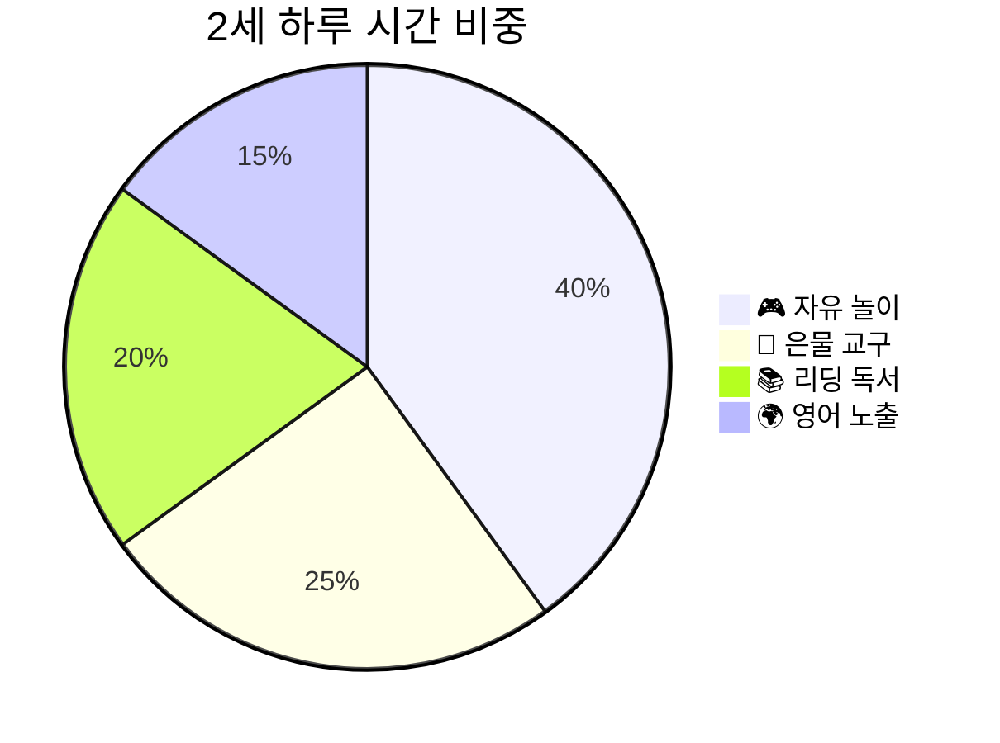

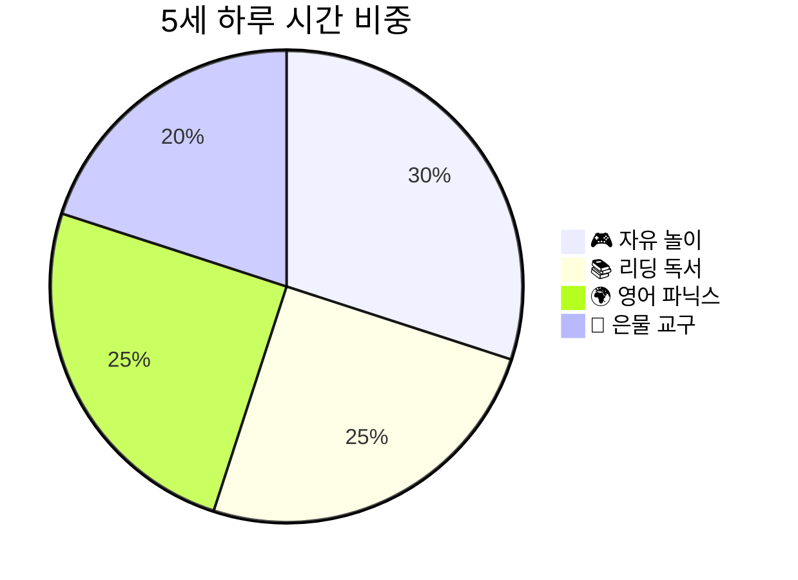

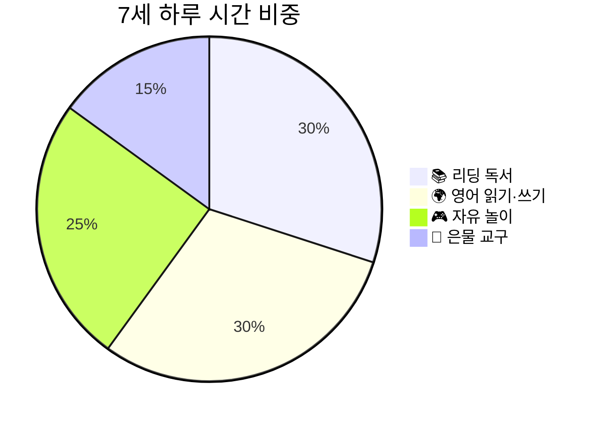

---

---

# 🌟 연령별 × 3대 프로그램 통합 로드맵

```mermaid
flowchart TD
    START([👶 2세 입학]) --> Y2

    subgraph Y2["2세 — 씨앗 심기"]
        direction LR
        Y2R[📚 리딩<br>그림책 들어요]
        Y2G[🧱 은물<br>1·2호 탐색]
        Y2E[🌍 영어<br>동요 듣기]
    end

    subgraph Y3["3세 — 싹 틔우기"]
        direction LR
        Y3R[📚 리딩<br>따라 말해요]
        Y3G[🧱 은물<br>3·4호 쌓기]
        Y3E[🌍 영어<br>동화책 노출]
    end

    subgraph Y4["4세 — 줄기 자라기"]
        direction LR
        Y4R[📚 리딩<br>예측·토론]
        Y4G[🧱 은물<br>5·6·7호 설계]
        Y4E[🌍 영어<br>파닉스 입문]
    end

    subgraph Y5["5세 — 잎 펼치기"]
        direction LR
        Y5R[📚 리딩<br>글자 인식]
        Y5G[🧱 은물<br>8·9호 수·도형]
        Y5E[🌍 영어<br>CVC 단어 읽기]
    end

    subgraph Y6["6세 — 꽃 피우기"]
        direction LR
        Y6R[📚 리딩<br>스스로 읽기]
        Y6G[🧱 은물<br>10호 수학 완성]
        Y6E[🌍 영어<br>문장 읽기]
    end

    subgraph Y7["7세 — 열매 맺기"]
        direction LR
        Y7R[📚 리딩<br>독서 토론·감상문]
        Y7G[🧱 은물<br>수학 프로젝트]
        Y7E[🌍 영어<br>발표·영어 일기]
    end

    Y2 --> Y3 --> Y4 --> Y5 --> Y6 --> Y7

    Y7 --> END([🎒 초등 입학 준비 완성<br>언어력 · 수학력 · 창의력 · 자신감])
```

---

---

# 💡 부모님이 꼭 알아야 할 것

## 연령별 핵심 메시지

| 연령 | 이 시기에 가장 중요한 것 | 부모가 해줄 것 | 하지 말아야 할 것 |
|------|------------------|-------------|---------------|
| **2세** | 안정감과 탐색 허용 | 옆에서 지켜봐 주세요 | 강요·비교 절대 금지 |
| **3세** | 말 많이 들려주기 | "왜?" 질문에 같이 생각하기 | "조용히 해" 자제하기 |
| **4세** | 실패 경험 허용 | 결과 아닌 과정 칭찬 | 대신 해주기 금지 |
| **5세** | 성공 경험 만들어주기 | 작은 것도 크게 칭찬 | 다른 아이와 비교 금지 |
| **6세** | 스스로 해보는 경험 | 막혀도 기다려주기 | "엄마가 해줄게" 자제 |
| **7세** | 자신감·자기 표현 | 발표 기회 만들어주기 | 초등 선행 압박 금지 |

---

## ❓ 부모님 자주 묻는 질문 (FAQ)

**Q. 영어를 너무 일찍 시작하면 한국어 발달에 방해가 되나요?**
> 2~4세의 영어 교육은 '노출' 중심입니다. 노래, 동화 등으로 자연스럽게 듣게 하는 것은 한국어 발달에 영향을 주지 않아요. 단, 영어를 강요하거나 한국어 대신 영어를 사용하게 강요하는 것은 피해야 합니다.

**Q. 은물 교구는 몇 호부터 시작해야 하나요?**
> 연령에 맞는 호수부터 시작하세요. 2세 → 1·2호 / 3세 → 3·4호 순으로 단계적으로 올라가는 것이 가장 좋습니다. 아이가 충분히 탐색하고 익숙해지면 다음 단계로 넘어가세요.

**Q. 아이가 책 읽기를 싫어해요. 어떻게 하나요?**
> 책을 억지로 읽히지 마세요. 대신 아이가 관심 있는 주제의 책을 골라주고, 부모·선생님이 즐겁게 읽어주는 모습을 보여주세요. '읽기'보다 '듣기'부터 시작하면 거부감이 줄어듭니다.

**Q. 하루에 2~3시간이면 너무 많지 않나요?**
> 2~3시간 전체가 학습이 아닙니다! 자유 놀이(30~40%)가 포함된 시간입니다. 놀이 자체가 학습이기 때문에 아이가 즐겁게 참여한다면 충분한 시간입니다.

---

> 📝 **이 자료는** 프뢰벨 교육 철학과 발달심리학을 바탕으로 작성되었습니다.
> 👨‍👩‍👧 **대상** : 2~7세 자녀를 둔 부모님 및 유아 교육 교사
> 🗓️ **작성일** : 2026년 4월 6일
