# 🌱 프뢰벨 유아 교육 실전 커리큘럼 완전 가이드
> 리딩 토탈 × 은물(10가지) × 영어 교육 | Mermaid 도식 + 실전 수업 시나리오 포함

---

## 🗺️ 전체 교육 시스템 마인드맵

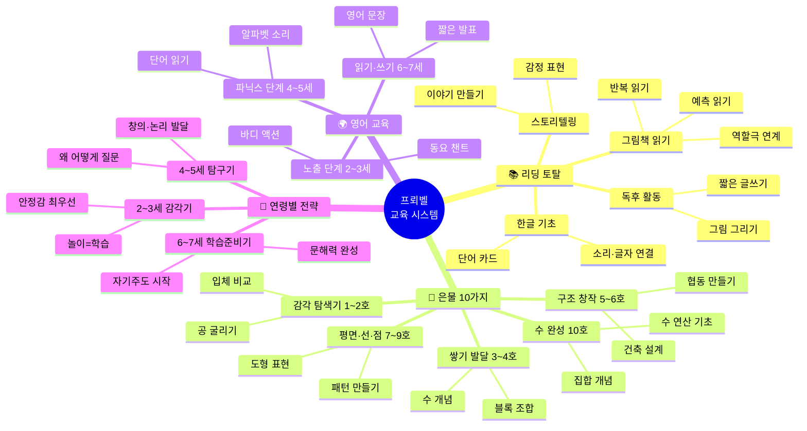

---

## 📊 3대 프로그램 흐름 도식

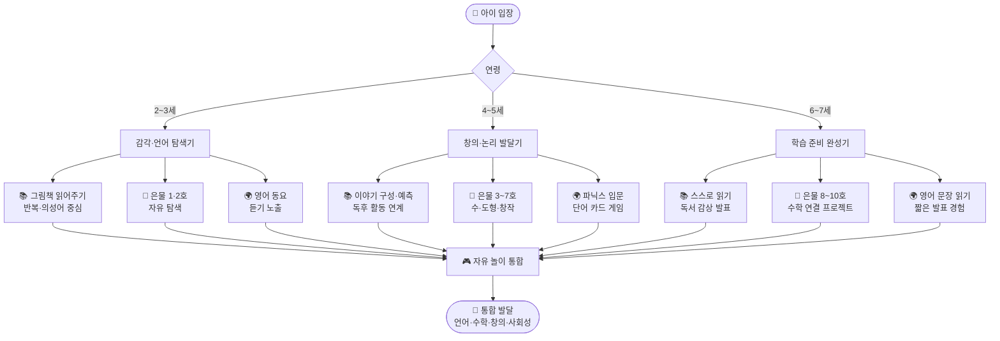

---

## 🧱 은물 10가지 상세 커리큘럼 흐름

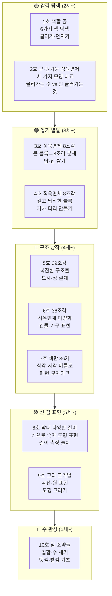

---

## 📚 리딩 토탈 단계별 흐름

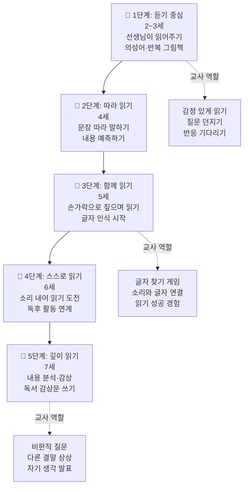

---

## 🌍 영어 교육 단계별 흐름

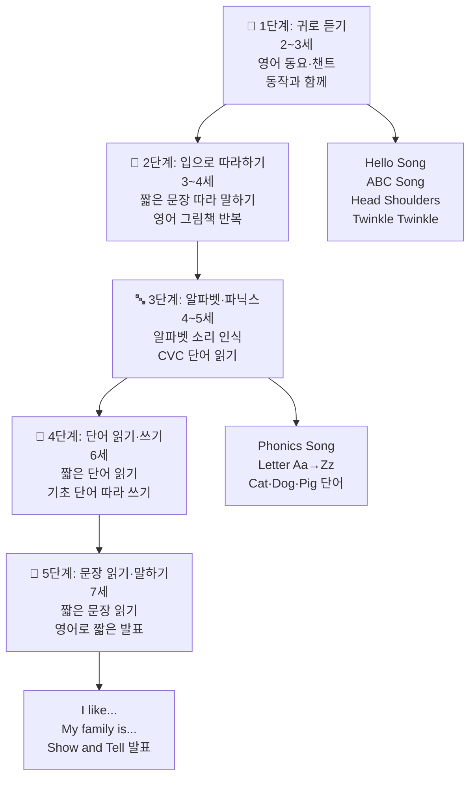

---

---

# 📅 연령별 실전 커리큘럼

---

## 👶 2세 실전 커리큘럼

### 2세 발달 & 교육 마인드맵

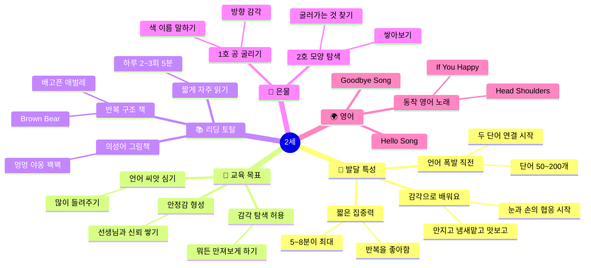

---

### 2세 실전 수업 예시

#### 🎯 수업 예시 1 — 은물 1호 "공 색깔 탐험" (15분)

```
수업 흐름
│
├── 📋 준비물 : 은물 1호 (빨·주·노·초·파·보 공 6개), 작은 바구니 3개
│
├── ⏱️ 도입 (3분)
│   └── 교사: "얘들아~ 오늘 선생님이 색깔 공을 가져왔어! 어떤 색이 있을까?"
│       └── 공을 하나씩 꺼내며 색 이름 말하기
│
├── ⏱️ 전개 (9분)
│   ├── 활동 1: 공을 바닥에 펼쳐두고 자유롭게 탐색 (3분)
│   │   └── 교사: "만져봐~ 어떤 느낌이야? 동글동글하지?"
│   ├── 활동 2: 색깔 바구니 찾기 (3분)
│   │   └── 교사: "빨간 공은 빨간 바구니에 넣어볼까?"
│   │       아이가 넣으면 → "와! 했다! 빨간 공!" 크게 반응
│   └── 활동 3: 공 굴리기 (3분)
│       └── 교사와 아이가 마주 앉아 굴리기
│           "데굴데굴~ 빨간 공이 간다!"
│
└── ⏱️ 마무리 (3분)
    └── "오늘 어떤 색 공이 제일 좋았어?"
        아이가 대답 → 교사가 반복해서 말해주기
        "아~ 파란 공! 파란 공이 좋았구나!"
```

| 교사가 꼭 기억할 것 | 이유 |
|-----------------|------|
| 색 이름을 먼저 말하고 기다린다 | 아이가 따라 말할 기회 주기 |
| 틀려도 절대 "아니야" 하지 않는다 | 안전한 언어 환경 형성 |
| 아이의 행동에 즉각 반응한다 | 상호작용 = 언어 발달 |
| 5분 이상 한 자리에 앉히지 않는다 | 2세 집중력 한계 |

---

#### 🎯 수업 예시 2 — 리딩 토탈 "배고픈 애벌레" 읽기 (12분)

```
수업 흐름
│
├── 📋 준비물 : 에릭 칼 [배고픈 애벌레] 그림책, 과일 모형 or 사진 카드
│
├── ⏱️ 도입 (2분)
│   └── 책 표지 보여주며
│       교사: "이 초록 친구가 뭘까? (기다림) 맞아~ 애벌레야!"
│       "배고프면 어떤 느낌이야?" → 배 만지며 "꼬르륵~"
│
├── ⏱️ 전개 (7분)
│   ├── 1페이지씩 천천히, 과일 나올 때마다 멈추기
│   │   "사과를 하나 먹었어요~ 사과!" (실물 카드 함께 보여주기)
│   ├── 반복 구조 활용
│   │   교사: "월요일에는 사과를…"
│   │   아이들: (함께) "하나!"
│   └── 의성어·의태어 강조
│       "냠냠냠~ 먹었어요!"
│
└── ⏱️ 마무리 (3분)
    └── "애벌레가 마지막에 뭐가 됐어?" → 나비 사진 보여주기
        "우리도 나비처럼 팔 펴볼까?" → 몸으로 표현하기
```

**실전 팁 — 2세 읽기 황금 규칙**

- 같은 책을 3~5일 연속 읽어도 된다 (아이들이 더 좋아함)
- 책 읽기 중 아이가 딴 곳 보면 → 멈추지 말고 계속 읽기
- 책보다 아이의 반응이 더 중요 (표정, 손짓 관찰)

---

#### 🎯 수업 예시 3 — 영어 "Head, Shoulders" 몸 놀이 (10분)

```
수업 흐름
│
├── 준비물 : 없음 (신체 활동)
│
├── 도입 (2분)
│   └── 교사: "선생님 머리 만져봐~ Head!"
│       아이: 머리 만지기
│       교사: "맞아! Head! 머리야!"
│
├── 전개 (6분)
│   ├── 1회: 교사가 천천히 노래하며 동작 보여주기
│   ├── 2회: 아이들과 함께 천천히
│   └── 3회: 빠르게 → 재미있게 웃으며
│       * 틀려도 크게 웃으며 계속 진행
│
└── 마무리 (2분)
    └── "이번엔 빨리빨리 해볼까?" → 더 빠르게
        아이들이 웃으면 성공!
```

---

### 2세 주간 커리큘럼 (5일)

| | 월요일 | 화요일 | 수요일 | 목요일 | 금요일 |
|--|-------|-------|-------|-------|-------|
| **리딩** | 새 그림책 소개 | 같은 책 반복 읽기 | 책 속 물건 찾기 | 같은 책 + 역할극 | 좋아하는 책 선택 |
| **은물** | 1호 색깔 탐색 | 1호 굴리기 놀이 | 2호 모양 탐색 | 2호 쌓아보기 | 1호+2호 자유 |
| **영어** | Hello Song | Head Shoulders | ABC Song | If You Happy | 이번 주 노래 복습 |
| **자유놀이** | 감각 놀이 | 모래/물 놀이 | 블록 탐색 | 역할 놀이 | 바깥 놀이 |

### 2세 하루 시간표 (120분 상세)

```
[2세 하루 120분 흐름]

00:00 ─── 🌍 영어 인사 노래 (10분)
          "Hello Hello, How are you?"
          동작과 함께 / 이름 부르기
          │
10:00 ─── 🧱 은물 탐색 (20분)
          1호 또는 2호 자유 탐색
          교사: 옆에서 언어 설명 붙여주기
          "빨간 공! 동글동글~"
          │
30:00 ─── 📚 그림책 읽기 (10분)
          같은 책 또는 새 책 1권
          의성어·몸짓 풍부하게
          │
40:00 ─── 🎮 자유 놀이 1 (20분)
          블록, 인형, 탐색 놀이
          교사: 개입 최소화, 관찰 위주
          │
60:00 ─── 🌍 영어 노래·몸 활동 (10분)
          Head Shoulders / If You Happy
          뛰고 점프하며 에너지 발산
          │
70:00 ─── 🎮 대근육 / 감각 놀이 (25분)
          공 굴리기, 터널 기어가기
          모래·물 감각 놀이
          │
95:00 ─── 📚 마무리 그림책 (10분)
          짧고 조용한 책 1권
          차분하게 마무리
          │
105:00 ── 정리 & 마무리 (15분)
          "오늘 뭐가 제일 재미있었어?"
          간단한 정리 참여
          영어로 Goodbye!
```

---

---

## 🐣 3세 실전 커리큘럼

### 3세 발달 & 교육 마인드맵

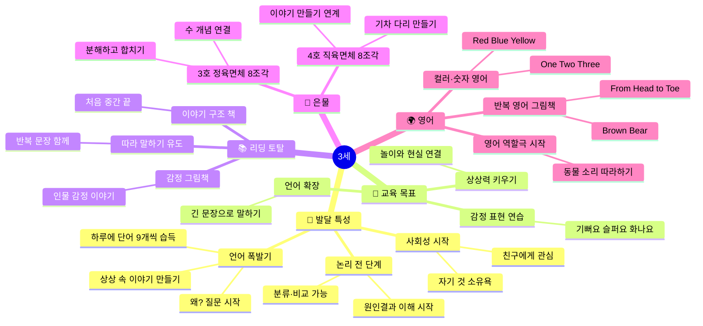

---

### 3세 실전 수업 예시

#### 🎯 수업 예시 1 — 은물 3호 "이야기 속 마을 만들기" (25분)

```
수업 흐름
│
├── 📋 준비물
│   └── 은물 3호 (정육면체 8조각), 그림책 [아기 돼지 삼형제]
│
├── ⏱️ 도입 (5분) — 그림책으로 시작
│   └── [아기 돼지 삼형제] 간단히 읽기
│       교사: "늑대가 집을 날려버렸대! 어떤 집이 안 날아갔지?"
│       아이: "벽돌 집이요!"
│       교사: "우리도 튼튼한 집 만들어볼까?"
│
├── ⏱️ 전개 (15분)
│   ├── 1단계: 은물 3호 꺼내기 (3분)
│   │   교사: "이 큰 정육면체를 쪼개면 몇 개가 될까?"
│   │   같이 세기 → "하나, 둘, 셋... 여덟!"
│   │
│   ├── 2단계: 집 만들기 도전 (8분)
│   │   교사: "아기 돼지 집을 만들어봐!"
│   │   → 자유롭게 쌓기 허용
│   │   → 무너지면 "괜찮아~ 다시 해보자!"
│   │
│   └── 3단계: 역할극 연결 (4분)
│       손 인형으로 늑대 역할
│       "후~ 날려볼까?" → 아이가 집 지키기
│       "우와~ 안 날아갔다! 튼튼한 집이야!"
│
└── ⏱️ 마무리 (5분)
    └── "몇 개 블록으로 만들었어?" 같이 세기
        "제일 힘든 게 뭐였어?" 감정 표현 유도
        완성된 집 앞에서 사진 찍기 (성취감)
```

**관찰 포인트 (교사 체크리스트)**

- [ ] 블록을 목적 있게 쌓는가? (무작위 vs 계획적)
- [ ] 무너졌을 때 다시 시도하는가?
- [ ] 만든 것에 이름을 붙이는가? (언어 발달 지표)
- [ ] 수 세기를 따라 하는가?

---

#### 🎯 수업 예시 2 — 리딩 토탈 "감정 그림책 토론" (20분)

```
수업 흐름 — [내 감정이야] 류 그림책 활용
│
├── 📋 준비물
│   └── 감정 그림책, 감정 카드 (기쁨·슬픔·화남·무서움·놀람)
│
├── ⏱️ 도입 (3분)
│   └── 감정 카드를 테이블에 펼쳐두기
│       교사: "이 얼굴들 중에 오늘 내 기분이랑 비슷한 거 골라봐"
│       아이가 카드 선택 → 이유 묻기
│
├── ⏱️ 전개 — 읽기 (10분)
│   ├── 책 읽으며 인물 감정 나올 때마다 멈추기
│   │   교사: "이 친구 지금 어떤 기분일까?"
│   │   아이: "슬퍼요"
│   │   교사: "맞아~ 슬프겠다. 너도 그런 적 있어?"
│   │
│   └── 표정 따라하기
│       교사: "이 얼굴 따라해봐~ 슬픈 얼굴!"
│       아이들: 표정 모방
│
└── ⏱️ 마무리 (7분)
    ├── 감정 카드 활동
    │   "오늘 책 속 친구 기분은?" → 카드 골라서 붙이기
    └── 감정 표현 연습
        "기분이 나쁠 때 어떻게 해?" → 건강한 표현 방법 이야기
        "선생님한테 말해!" / "깊게 숨 쉬어봐"
```

---

#### 🎯 수업 예시 3 — 영어 "Brown Bear 역할극" (15분)

```
수업 흐름
│
├── 📋 준비물
│   └── [Brown Bear, What do you see?] 그림책
│       동물 머리띠 또는 동물 그림 카드
│
├── ⏱️ 1회차 읽기 (5분)
│   └── 교사가 먼저 읽기
│       "Brown Bear, Brown Bear, What do you see?"
│       동물 나올 때마다 동작 추가 (곰처럼 팔 벌리기 등)
│
├── ⏱️ 2회차 함께 읽기 (5분)
│   └── 교사: "Brown Bear, Brown Bear~"
│       아이들: "What do you see?" (따라 말하기)
│
└── ⏱️ 역할극 (5분)
    └── 아이에게 동물 머리띠 나눠주기
        교사: "Red Bird, Red Bird, What do you see?"
        해당 아이: 일어나서 "I see a Yellow Duck!"
        → 모든 아이가 한 번씩 주인공 경험
```

**영어 수업 핵심 원칙 (3세)**

| 원칙 | 실천 방법 |
|------|---------|
| 강요 절대 금지 | 따라 말 안 해도 OK, 듣기만 해도 학습 중 |
| 100% 영어 고집 말기 | 한국어로 확인해줘도 됨 |
| 성공 경험 설계 | 쉬운 단어부터, 작은 성취에 크게 반응 |
| 몸을 움직이게 | 앉아서만 하는 영어는 3세에게 고문 |

---

### 3세 주간 커리큘럼 (5일)

| | 월요일 | 화요일 | 수요일 | 목요일 | 금요일 |
|--|-------|-------|-------|-------|-------|
| **리딩** | 새 그림책 소개 | 같은 책 + 느낌 나누기 | 감정 카드 활동 | 책 속 장면 그리기 | 아이가 직접 이야기 말하기 |
| **은물** | 3호 자유 탐색 | 3호로 이야기 속 장면 만들기 | 4호 기차 만들기 | 3+4호 마을 만들기 | 자유 만들기 + 발표 |
| **영어** | 새 영어 노래 배우기 | 영어 노래 + 동작 | 영어 그림책 읽기 | 영어 단어 카드 게임 | 이번 주 영어 복습 |
| **놀이** | 역할 놀이 (가게) | 모래·점토 놀이 | 그리기·만들기 | 블록 도시 만들기 | 바깥 놀이 |

---

---

## 🌱 4세 실전 커리큘럼

### 4세 발달 & 교육 마인드맵

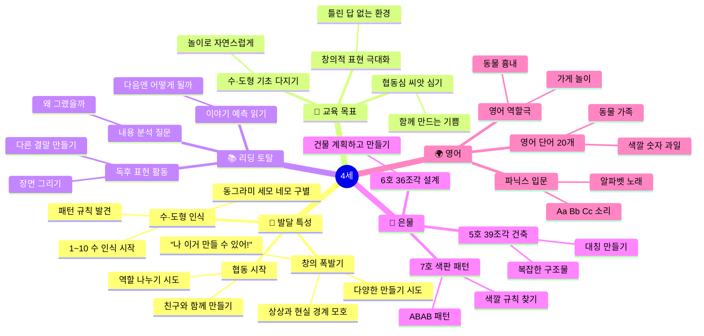

---

### 4세 실전 수업 예시

#### 🎯 수업 예시 1 — 은물 5·6호 "내가 설계한 동물원" 프로젝트 (30분)

```
프로젝트 수업 흐름
│
├── 📋 준비물
│   └── 은물 5호(39조각) + 6호(36조각)
│       동물 미니어처 또는 그림 카드
│       색종이, 풀 (울타리 표현용)
│
├── ⏱️ 1일차 — 계획하기 (10분)
│   ├── 교사: "우리가 동물원을 만들 거야. 어떤 동물이 있을까?"
│   ├── 화이트보드에 아이들이 말한 동물 적기
│   ├── "각 동물에게 어떤 집이 필요할까?"
│   │   코끼리 → 크고 넓은 집
│   │   토끼 → 작은 집
│   └── "누가 어떤 동물 집 만들 거야?" → 역할 배분
│
├── ⏱️ 2일차 — 만들기 (15분)
│   ├── 각자 맡은 동물 집 만들기
│   ├── 교사 역할: 돌아다니며 질문하기
│   │   "왜 이렇게 만들었어?" → 설명하게 유도
│   │   "더 튼튼하게 하려면 어떻게 할까?" → 문제해결 유도
│   └── 서로의 작품 보고 칭찬하기
│
└── ⏱️ 3일차 — 발표하기 (10분)
    ├── 각자 만든 집 앞에 서서 발표
    │   "저는 ○○ 집을 만들었어요. ○○은 ○○해서 이렇게 만들었어요."
    └── 전체 동물원 완성 → 사진 찍기 → 교실 전시
```

**프로젝트 수업의 핵심 — 4세**

```
틀린 만들기 = 없다
      │
      ▼
"왜 이렇게 만들었어?" 질문이 핵심
      │
      ▼
아이의 논리를 먼저 듣는다
      │
      ▼
그 다음 더 나은 방법을 제안 (강요 아닌 제안)
```

---

#### 🎯 수업 예시 2 — 리딩 토탈 "다른 결말 상상하기" (25분)

```
수업 흐름 — [늑대가 들려주는 아기돼지 삼형제] 활용
│
├── ⏱️ 도입 (5분)
│   └── 기존에 알던 [아기 돼지 삼형제] 기억하기
│       "늑대는 나쁜 늑대였지?" → 새 책 소개
│       "이번엔 늑대가 직접 이야기해준대!"
│
├── ⏱️ 읽기 (10분)
│   ├── 읽으면서 기존 이야기와 다른 점 찾기
│   ├── 교사: "이 늑대 진짜 나쁜 늑대일까? 어떻게 생각해?"
│   └── 다양한 의견 모두 수용 ("그렇게 생각할 수도 있겠다!")
│
├── ⏱️ 창작 활동 (8분)
│   └── "만약 네가 늑대라면 어떻게 했을까?"
│       → 그림으로 나만의 이야기 만들기
│       → 완성 후 친구에게 설명
│
└── ⏱️ 마무리 (2분)
    └── "같은 이야기인데 왜 다르게 느껴질까?"
        → 관점에 따라 달라진다는 것을 자연스럽게 경험
```

---

#### 🎯 수업 예시 3 — 파닉스 "알파벳 Aa~Cc 소리 탐험" (20분)

```
수업 흐름
│
├── 📋 준비물
│   └── 알파벳 카드 (대문자+소문자), 그림 카드 (apple, ball, cat)
│       색소금 쟁반 또는 모래판 (쓰기 놀이용)
│
├── ⏱️ 소리 배우기 (8분)
│   ├── Aa: 카드 보여주며
│   │   교사: "A~ Apple! /æ/ /æ/ Apple!"
│   │   아이들: "/æ/ /æ/ Apple!"
│   │   → 사과 먹는 흉내 내며
│   │
│   ├── Bb: "B~ Ball! /b/ /b/ Ball!"
│   │   → 공 튀기는 동작과 함께
│   │
│   └── Cc: "C~ Cat! /k/ /k/ Cat!"
│       → 고양이 수염 흉내
│
├── ⏱️ 소리 게임 (7분)
│   ├── 카드 뒤집기 게임
│   │   카드 뒤집으면 → 소리+단어 말하기
│   └── 첫소리 같은 것 찾기
│       "A로 시작하는 거 교실에서 찾아봐!"
│
└── ⏱️ 쓰기 놀이 (5분)
    └── 색소금 쟁반에 손가락으로 A, B, C 써보기
        틀려도 쉽게 지우고 다시!
        "마법 글씨판이야~"
```

---

### 4세 주간 커리큘럼 (5일)

| | 월요일 | 화요일 | 수요일 | 목요일 | 금요일 |
|--|-------|-------|-------|-------|-------|
| **리딩** | 새 책 소개 + 예측 | 내용 토론·감정 이야기 | 독후 그림 그리기 | 다른 결말 만들기 | 나만의 작은 책 만들기 |
| **은물** | 5·6호 자유 탐색 | 주제 프로젝트 계획 | 프로젝트 만들기 | 완성 + 감상 | 7호 패턴 만들기 |
| **영어** | 새 파닉스 소리 | 파닉스 게임 | 영어 그림책 연계 | 영어 역할극 | 이번 주 복습 |
| **놀이** | 협동 블록 | 가게 역할극 | 그리기 표현 | 수학 놀이 | 바깥 놀이 |

### 4세 하루 시간표 (140분 상세)

```
[4세 하루 140분 흐름]

00:00 ─── 🌍 영어 워밍업 (15분)
          파닉스 노래 + 오늘의 알파벳 소리
          영어 단어 카드 빠르게 보기
          │
15:00 ─── 🧱 은물 프로젝트 (25분)
          5호·6호·7호 선택 활동
          주제: 이번 주 그림책 연계 만들기
          │
40:00 ─── 📚 그림책 읽기·토론 (20분)
          읽기 + 예측 질문 + 내용 토론
          │
60:00 ─── 🎮 협동 놀이 (25분)
          2~4명이 함께 만들기 또는 역할극
          교사: 관찰하며 언어 붙여주기
          │
85:00 ─── 🌍 파닉스·영어 게임 (20분)
          카드 게임, 알파벳 빙고
          영어 노래 + 동작
          │
105:00 ── 🎮 자유 창작 놀이 (25분)
          그리기, 점토, 가위풀 공작
          개별 자유 선택
          │
130:00 ── 📚 마무리 + 발표 (10분)
          오늘 만든 것 1문장 발표
          "저는 ○○을 만들었어요"
```

---

---

## 🌿 5세 실전 커리큘럼

### 5세 발달 & 교육 마인드맵

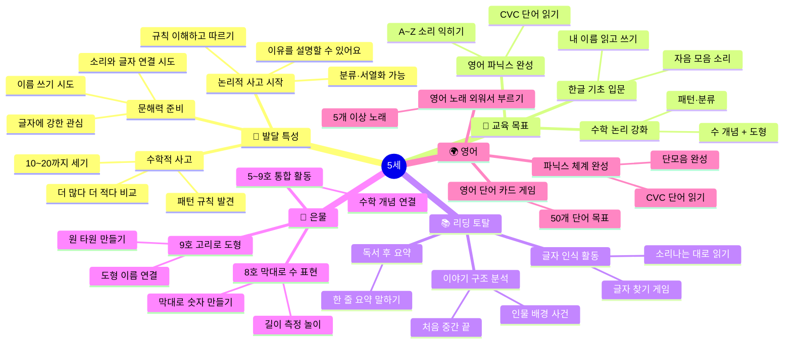

---

### 5세 실전 수업 예시

#### 🎯 수업 예시 1 — 은물 8·9호 "숫자 나라 탐험" (25분)

```
수업 흐름
│
├── 📋 준비물
│   └── 은물 8호(막대), 9호(고리), 숫자 카드 1~10
│       모눈 종이 (막대 놓기용)
│
├── ⏱️ 막대로 숫자 만들기 (10분)
│   ├── 숫자 카드 "1" 보여주기
│   │   교사: "막대로 숫자 1을 만들어봐!"
│   │   아이: 막대 1개 세워서 "1"자 만들기
│   │
│   ├── 숫자 "7" → 막대 2개로 7자 모양
│   ├── "+" 만들어보기 → 덧셈 기호로 연결
│   └── 도전: 내가 좋아하는 숫자 만들기
│
├── ⏱️ 고리로 도형 만들기 (10분)
│   ├── 교사: "고리 1개 = 원, 여러 개 겹치면?"
│   ├── 올림픽 링처럼 이어붙이기
│   ├── 교사: "삼각형을 고리로 만들 수 있을까?"
│   └── → 아이들의 창의적 시도 격려
│
└── ⏱️ 수·도형 연결 게임 (5분)
    └── 숫자 카드 뽑기 → 그 수만큼 막대 세기
        "3!" → 막대 3개 세기 → 3자 만들기
        → 수 개념·숫자 모양·세기 통합 경험
```

---

#### 🎯 수업 예시 2 — 리딩 토탈 "한글 글자 탐험가" (20분)

```
수업 흐름
│
├── 📋 준비물
│   └── 그림책, 자음·모음 카드
│       교실 환경 글자들 (이름표, 그림 라벨)
│
├── ⏱️ 글자 찾기 게임 (8분)
│   ├── 그림책 펼치기
│   │   교사: "이 책에서 'ㄱ'이 들어간 글자 찾아봐!"
│   │   아이들: 손가락으로 찾아 짚기
│   │
│   └── 교실 글자 탐험
│       이름표에서 내 이름 찾기
│       "우리 반에서 'ㄱ'으로 시작하는 이름 누구야?"
│
├── ⏱️ 소리-글자 연결 (7분)
│   ├── 자음카드 보며 소리 연습
│   │   "ㄱ 기역~ 가나다에서 ㄱ!"
│   ├── 모음카드
│   │   "ㅏ 아~" "ㅣ 이~"
│   └── 합쳐보기
│       "ㄱ + ㅏ = 가!" (박수 한 번)
│       "ㄴ + ㅏ = 나!" (박수 한 번)
│
└── ⏱️ 이름 쓰기 도전 (5분)
    └── 모래판 또는 화이트보드에 내 이름 첫 글자 쓰기
        틀려도 OK → "잘 됐어! 다시 해봐"
```

---

#### 🎯 수업 예시 3 — 파닉스 "CVC 단어 읽기 마법" (20분)

```
CVC 단어 = 자음(C) + 모음(V) + 자음(C)
예: c-a-t, d-o-g, p-i-g
│
├── 📋 준비물
│   └── CVC 단어 카드, 글자 블록 또는 자석 글자
│       동물 그림 카드 (cat, dog, pig, hen...)
│
├── ⏱️ 소리 블렌딩 (8분)
│   ├── 교사: "c... a... t → cat!"
│   │   손뼉 3번 치며 소리 합치기
│   │
│   ├── 아이들과 함께
│   │   교사가 소리 → 아이들이 합치기
│   │   "/k/ /æ/ /t/ → ?"
│   │   아이들: "cat!"
│   │
│   └── 점점 빠르게 도전
│
├── ⏱️ 단어 만들기 게임 (8분)
│   ├── 자석 글자로 단어 만들기
│   │   그림 카드 보여주기 → 단어 만들어보기
│   └── 짝꿍과 함께 단어 퀴즈
│       한 명이 그림 → 다른 친구가 스펠링 배열
│
└── ⏱️ 읽기 미션 (4분)
    └── 단어 카드 3~5장 연속 읽기 도전
        성공하면 "Reader Star ⭐" 스티커
        → 성취감이 파닉스 학습 가속화
```

---

### 5세 주간 커리큘럼 (5일)

| | 월요일 | 화요일 | 수요일 | 목요일 | 금요일 |
|--|-------|-------|-------|-------|-------|
| **리딩** | 새 책 + 글자 찾기 | 내용 토론 | 한글 소리 연습 | 이야기 구조 분석 | 1문장 요약 발표 |
| **은물** | 8호 막대 수 표현 | 9호 도형 만들기 | 8+9호 통합 | 수학 프로젝트 | 전체 복습 |
| **파닉스** | 새 단어군 소리 | 단어 읽기 게임 | CVC 단어 만들기 | 영어 책 연계 | 이번 주 단어 복습 |
| **놀이** | 수 놀이 게임 | 역할극 | 창의 만들기 | 협동 프로젝트 | 바깥 놀이 |

---

---

## 🌳 6세 실전 커리큘럼

### 6세 발달 & 교육 마인드맵

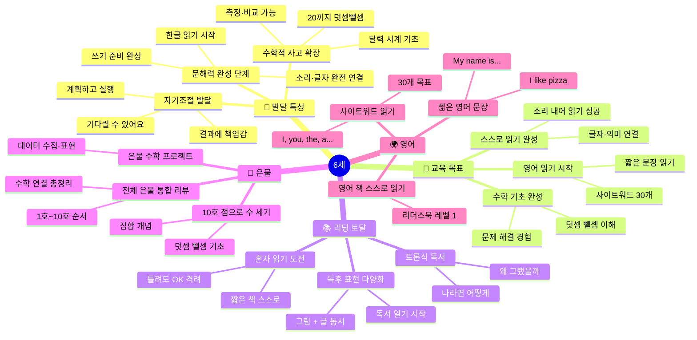

---

### 6세 실전 수업 예시

#### 🎯 수업 예시 1 — 은물 10호 "덧셈 마법사" (25분)

```
수업 흐름
│
├── 📋 준비물
│   └── 은물 10호 (조약돌 또는 작은 구슬)
│       덧셈 카드 (1+2=?, 3+3=? 등)
│       종이컵 2개 (집합 바구니)
│
├── ⏱️ 집합 개념 (8분)
│   ├── 종이컵 A에 구슬 3개
│   │   교사: "이 컵에 몇 개야?" → "3개요!"
│   ├── 종이컵 B에 구슬 2개
│   │   "이 컵에는?" → "2개요!"
│   └── 두 컵 합치기
│       "이제 다 합치면?" → "5개요!"
│       "3 더하기 2는 5! 3+2=5"
│       → 수식으로 쓰기 연결
│
├── ⏱️ 덧셈 카드 게임 (12분)
│   ├── 카드 뽑기 → 구슬로 직접 만들기 → 세기
│   │   "2+3 카드!" → 구슬 2개 + 3개 놓기 → "5!"
│   │
│   └── 이야기 덧셈
│       교사: "토끼가 당근 2개 가져왔어.
│             그런데 친구 토끼가 3개 더 가져왔어.
│             모두 몇 개?"
│       아이: 구슬로 직접 해결
│
└── ⏱️ 뺄셈 도전 (5분)
    └── 컵에서 구슬 빼기로 뺄셈 경험
        "5개에서 2개 가져가면?" → "3개요!"
        → 덧셈·뺄셈 역관계 자연 체험
```

---

#### 🎯 수업 예시 2 — 리딩 토탈 "나만의 독서 일기" (25분)

```
독서 일기 양식 예시 (6세 수준)
┌─────────────────────────────────────────┐
│ 날짜: ____월 ____일                      │
│ 책 이름: ___________________________    │
│                                         │
│ 주인공은? (그림 또는 글)                  │
│ [                    ]                  │
│                                         │
│ 이 책에서 가장 기억나는 장면은?            │
│ [                    ]                  │
│                                         │
│ 내 느낌은? (스티커 붙이기)               │
│  😊 재미있어요  😢 슬퍼요  😮 놀라워요  │
└─────────────────────────────────────────┘

수업 흐름
│
├── ⏱️ 스스로 읽기 (10분)
│   └── 짧은 그림책 혼자 읽기
│       교사: 옆에 앉아서 조용히 지켜보기
│       막히는 글자 → 바로 알려주지 말고
│       "어떤 소리가 날까?" 먼저 유도
│
├── ⏱️ 독서 일기 작성 (10분)
│   └── 그림 + 글 (한 단어도 OK)
│       쓰기 어려운 글자 → 교사가 옆에서 도움
│       완성도보다 '기록 경험'이 목표
│
└── ⏱️ 친구에게 소개 (5분)
    └── "내가 읽은 책은 ○○이야. 이 책은 ○○ 이야기야."
        → 1분 발표 경험
        박수로 마무리
```

---

#### 🎯 수업 예시 3 — 영어 "사이트워드 + 짧은 문장" (20분)

```
사이트워드란? → 모양으로 통째로 읽는 영어 단어
예: I, you, the, a, is, am, are, like, have, this

수업 흐름
│
├── 📋 준비물
│   └── 사이트워드 플래시카드 10장
│       문장 만들기 카드 (주어·동사·목적어 분리)
│
├── ⏱️ 사이트워드 복습 (8분)
│   ├── 카드를 빠르게 보여주기
│   │   1초에 1장 → 빠르게 읽기 도전
│   └── 카드 뒤집기 게임
│       카드 3장 뒤집어 두기 → 어디 있는지 찾기
│
├── ⏱️ 문장 만들기 (7분)
│   ├── 카드 조각 3종 제공
│   │   [I] [like] [pizza / dogs / cats / books]
│   ├── 아이가 원하는 문장 만들기
│   │   "I like dogs!"
│   └── 친구에게 읽어주기
│
└── ⏱️ 책 읽기 연결 (5분)
    └── 리더스북 Level 1 한 쪽 읽기 도전
        사이트워드 나오면 표시하며 읽기
        "I found 'like'!" → 스티커 붙이기
```

---

### 6세 주간 커리큘럼 (5일)

| | 월요일 | 화요일 | 수요일 | 목요일 | 금요일 |
|--|-------|-------|-------|-------|-------|
| **리딩** | 스스로 읽기 도전 | 독서 일기 작성 | 친구에게 책 소개 | 토론식 독서 | 나만의 책 만들기 |
| **은물** | 10호 덧셈 | 10호 뺄셈 | 은물 1~5호 복습 | 은물 6~10호 복습 | 수학 프로젝트 |
| **영어** | 사이트워드 복습 | 문장 만들기 | 리더스북 읽기 | 영어 게임 | 영어 발표 준비 |
| **놀이** | 수학 보드게임 | 독서 역할극 | 자유 창작 | 협동 프로젝트 | 바깥 놀이 |

---

---

## 🎒 7세 실전 커리큘럼

### 7세 발달 & 교육 마인드맵

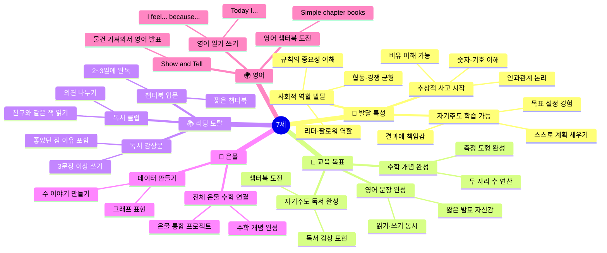

---

### 7세 실전 수업 예시

#### 🎯 수업 예시 1 — 은물 통합 "수학 데이터 프로젝트" (30분)

```
프로젝트: 우리 반 친구들이 좋아하는 것 조사하기
│
├── 📋 준비물
│   └── 은물 10호 (구슬), 모눈 종이
│       색연필, 조사지
│
├── ⏱️ 데이터 수집 (10분)
│   ├── 조사 주제 정하기
│   │   "좋아하는 과일은? 동물은? 색깔은?"
│   ├── 친구들에게 직접 질문하기
│   │   "너는 사과랑 딸기 중에 뭐가 좋아?"
│   └── 결과를 기록지에 표시
│       (동그라미 또는 타이 표시)
│
├── ⏱️ 구슬로 그래프 만들기 (10분)
│   ├── 은물 10호 구슬을 결과 수만큼 나열
│   │   사과 좋아하는 친구 수 = 구슬 ○개 한 줄
│   │   딸기 좋아하는 친구 수 = 구슬 ○개 한 줄
│   └── "어느 줄이 더 길어?" → 더 많다·적다 비교
│
├── ⏱️ 그래프 그리기 (7분)
│   └── 구슬 결과 → 모눈 종이에 막대 그래프 그리기
│       색칠하며 완성
│
└── ⏱️ 발표 (3분)
    └── "우리 반은 ○○을 가장 좋아해요. ○명이 좋아했어요."
        → 수학 + 언어 + 발표 통합
```

---

#### 🎯 수업 예시 2 — 리딩 토탈 "독서 클럽 토론" (25분)

```
독서 클럽 진행 방식
│
├── 📋 준비물
│   └── 같은 책을 읽은 3~4명 그룹
│       토론 질문 카드 (교사 준비)
│       포스트잇 (의견 메모용)
│
├── 토론 질문 카드 예시
│   ├── "이 책에서 가장 마음에 드는 인물은? 왜?"
│   ├── "만약 네가 주인공이라면 어떻게 했을까?"
│   ├── "이 책에서 배운 것은?"
│   └── "다음 이야기는 어떻게 됐을 것 같아?"
│
├── ⏱️ 개인 의견 준비 (5분)
│   └── 질문 1개 골라 포스트잇에 내 생각 적기
│
├── ⏱️ 토론 (15분)
│   ├── 돌아가며 발표
│   │   "나는 ○○이 마음에 들어. 왜냐하면 ○○이기 때문이야."
│   ├── 친구 의견에 반응
│   │   "나도 그렇게 생각해" / "나는 좀 달라~"
│   └── 교사: 사회자 역할 + 깊은 질문 추가
│
└── ⏱️ 정리 (5분)
    └── 각자 1문장 독서 감상 쓰기
        "이 책은 ○○한 책이다. 왜냐하면 ○○이기 때문이다."
```

---

#### 🎯 수업 예시 3 — 영어 "Show and Tell" 발표 (25분)

```
Show and Tell = 물건을 가져와서 영어로 소개하는 발표
│
├── 📋 사전 준비 (전날 숙제)
│   └── 집에서 좋아하는 물건 1개 가져오기
│       발표 문장 연습해오기
│
├── 발표 템플릿 (교사 제공)
│   "This is my ___________."
│   "It is (color/size) ___________."
│   "I like it because ___________."
│   예: "This is my toy robot.
│        It is red and big.
│        I like it because it can walk!"
│
├── ⏱️ 발표 준비 (5분)
│   └── 파트너와 연습하기
│       교사: 발음 도움 + 자신감 북돋기
│
├── ⏱️ 발표 (15분)
│   ├── 한 명씩 앞에 나와서 발표 (2~3분씩)
│   ├── 친구들: 경청 후 질문 1개
│   │   "What color is it?"
│   │   "Can I touch it?"
│   └── 발표 후 큰 박수
│
└── ⏱️ 마무리 (5분)
    └── 교사: 각자 잘한 점 구체적으로 칭찬
        "OO는 목소리가 컸어서 정말 잘 들렸어!"
        "△△는 'because'를 정말 잘 썼어!"
```

---

### 7세 주간 커리큘럼 (5일)

| | 월요일 | 화요일 | 수요일 | 목요일 | 금요일 |
|--|-------|-------|-------|-------|-------|
| **리딩** | 챕터북 읽기 시작 | 이어 읽기 + 예측 | 독서 토론 | 독서 감상문 쓰기 | 독서 클럽 |
| **은물** | 수학 프로젝트 계획 | 데이터 수집 | 그래프 만들기 | 발표 준비 | 수학 발표 |
| **영어** | 영어 일기 쓰기 | Show and Tell 준비 | 발표 연습 | 본 발표 | 영어 게임·복습 |
| **놀이** | 협동 보드게임 | 창의 만들기 | 야외 프로젝트 | 자유 놀이 | 바깥 놀이 |

### 7세 하루 시간표 (160분 상세)

```
[7세 하루 160분 흐름]

00:00 ─── 🌍 영어 웜업 (20분)
          영어 일기 쓰기 또는 사이트워드 복습
          영어 책 스스로 읽기 5분
          │
20:00 ─── 📚 자기주도 독서 (25분)
          스스로 책 선택 → 읽기 → 독서 일기
          교사: 관찰하며 필요시 도움
          │
45:00 ─── 🧱 은물 수학 프로젝트 (25분)
          주간 프로젝트 단계별 진행
          수학 개념 심화 연결
          │
70:00 ─── 🎮 협동 프로젝트 놀이 (25분)
          팀별 만들기·탐구 활동
          리더·팔로워 역할 경험
          │
95:00 ─── 🎮 자유 놀이 (25분)
          보드게임, 창의 만들기, 바깥 놀이
          │
120:00 ── 🌍 영어 발표 준비 (20분)
          Show and Tell 또는 발표 연습
          파트너와 영어 대화 연습
          │
140:00 ── 📚 독서 감상 나누기 (15분)
          오늘 읽은 책 한 문장 발표
          친구 발표에 질문하기
          │
155:00 ── 마무리 (5분)
          오늘의 Best Moment 나누기
          영어로 인사 Goodbye!
```

---

---

## 🎯 교사를 위한 핵심 가이드

### ⚡ 연령별 질문 전략

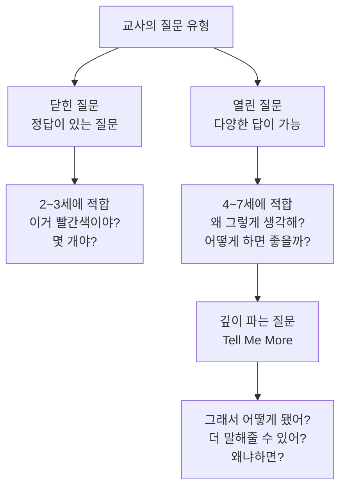

### 📏 연령별 활동 시간 적정선

| 연령 | 최대 집중 가능 시간 | 이상적 활동 단위 | 하루 전환 횟수 |
|------|-----------------|---------------|-------------|
| 2세 | 5~8분 | 5~10분 | 10~12회 |
| 3세 | 8~12분 | 10~15분 | 8~10회 |
| 4세 | 10~15분 | 15~20분 | 6~8회 |
| 5세 | 15~20분 | 20~25분 | 5~7회 |
| 6세 | 20~25분 | 25~30분 | 4~6회 |
| 7세 | 25~30분 | 25~30분 | 4~5회 |

> ⚠️ 집중 시간이 넘어가면 효과 없음 → 짧게 자주가 길게 한 번보다 효과적!

---

### 🚫 절대 하지 말아야 할 것 vs ✅ 꼭 해야 할 것

| ❌ 하지 말 것 | ✅ 꼭 할 것 |
|-------------|-----------|
| "틀렸어!" 라고 말하기 | "어떻게 생각했어?" 이유 묻기 |
| 결과물만 평가하기 | 과정을 구체적으로 칭찬하기 |
| 모든 아이에게 같은 기대 | 개별 발달 속도 존중 |
| 30분 이상 한 자리 앉히기 | 몸 움직이는 활동 번갈아 배치 |
| 영어 강요하기 | 놀이처럼 노출시키기 |
| 실패하지 않게 도와주기 | 실패 → 다시 시도할 기회 주기 |
| 조용한 환경만 고집하기 | 활동에 맞는 소음 허용 |
| 한 번에 너무 많이 설명 | 하나씩 단계적으로 안내 |

---

### 📊 월별 성장 관찰 체크리스트 (교사용)

```
리딩 토탈 관찰 항목
├── □ 책을 스스로 골라 읽으려 하는가?
├── □ 그림을 보고 내용을 예측하는가?
├── □ 이야기의 처음-중간-끝을 이해하는가?
├── □ 인물의 감정에 공감을 표현하는가?
└── □ 독후에 자기 생각을 말할 수 있는가?

은물 관찰 항목
├── □ 교구를 목적 있게 사용하는가?
├── □ 만든 것에 이름·이야기를 붙이는가?
├── □ 수 세기를 정확하게 하는가?
├── □ 도형 이름을 알고 사용하는가?
└── □ 실패 후 다시 시도하는가?

영어 관찰 항목
├── □ 영어 노래를 자연스럽게 따라 하는가?
├── □ 영어 단어를 들으면 반응하는가?
├── □ 파닉스 소리를 정확히 내는가?
├── □ 간단한 영어 문장을 읽을 수 있는가?
└── □ 영어로 말하기를 시도하는가?
```

---

> 📝 **작성 기준** : 프뢰벨 교육 철학 (놀이=학습) + 발달심리학 연령별 특성 + 실전 교실 적용
> 🗓️ **작성일** : 2026년 4월 6일
> 👨‍🏫 **대상** : 유아 교육 교사 및 AI 교육 컨텐츠 개발자
