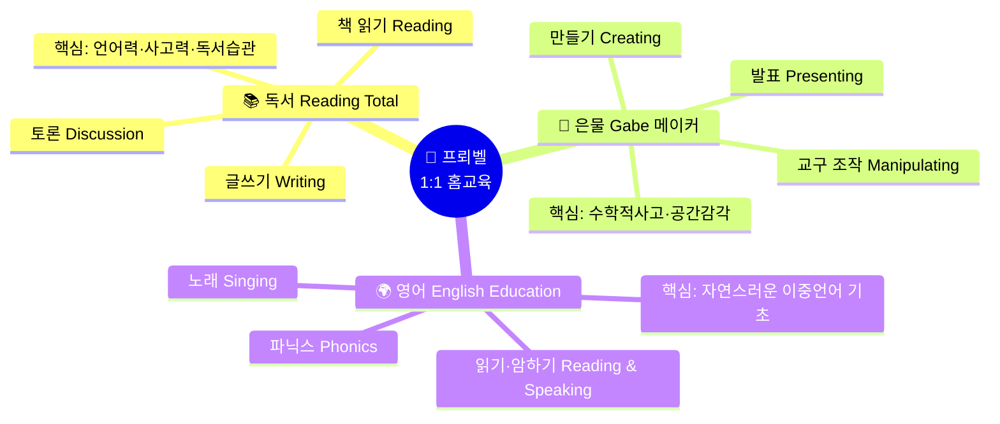
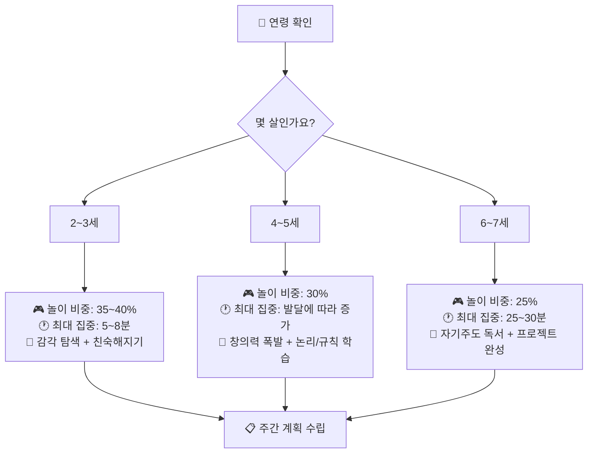
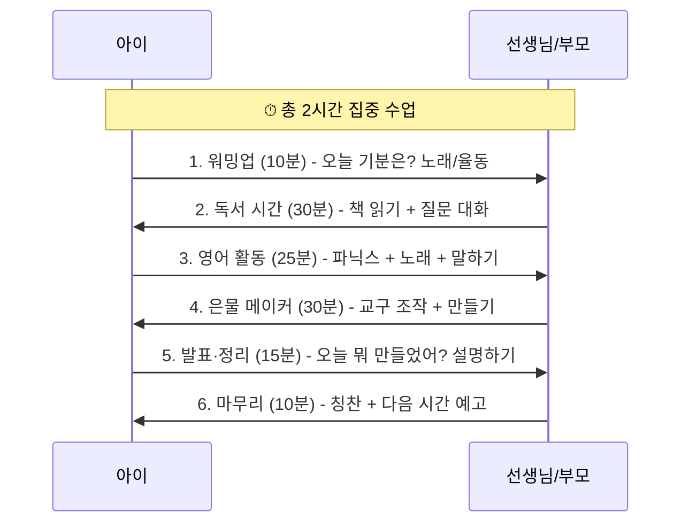
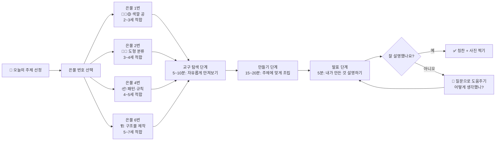
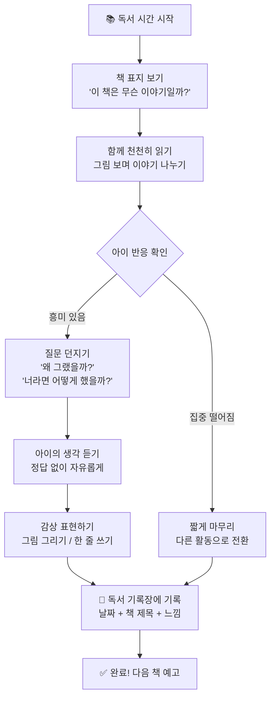
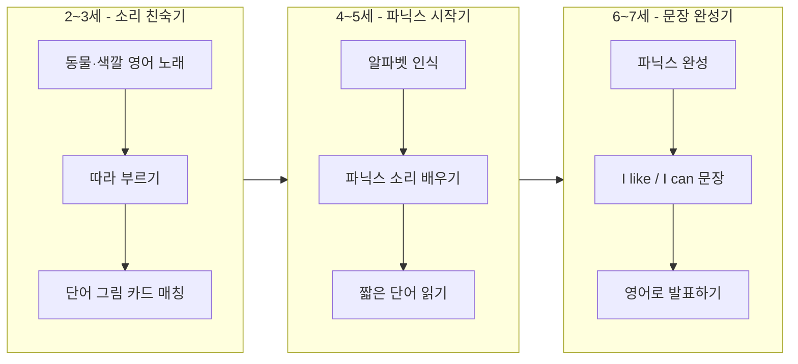

# 🌱 프뢰벨 유아 1:1 홈교육 주간 계획서
> 작성일: 2026-04-07 | 대상: 2~7세 유아 | 운영: 주 5일 (2시간) + 토요일 체험학습

---

## 📌 교육 철학

> **"놀이가 곧 학습이다"** — 프뢰벨 교육의 핵심 원칙
> 결과보다 **과정을 중시**하며, 아이의 사고와 시도 자체를 칭찬합니다.
> "어떻게 생각했니?" 라는 질문으로 아이 스스로 탐구하게 합니다.

---

## 1️⃣ 어린이집/영유 vs 프뢰벨 1:1 홈교육 비교표

| 비교 항목 | 🏫 어린이집 / 영유 | 🏠 프뢰벨 1:1 홈교육 |
|-----------|------------------|-------------------|
| **교사:아이 비율** | 1:5 ~ 1:20명 | **1:1 (완전 개인 맞춤)** |
| **집중 시간** | 15~20분 (산만하기 쉬움) | **25~50분 (연령별 맞춤)** |
| **커리큘럼** | 기관 표준화 (전체 동일) | **아이 수준·속도 맞춤형** |
| **교구 활용** | 여러 아이가 나눠 사용 | **1:1 전용 사용 (몰입↑)** |
| **부모 참여도** | 낮음 (등하원 위주) | **높음 (함께 학습 가능)** |
| **운영 시간** | 종일 (8~10시간) | **집중 2시간 (효율 극대화)** |
| **피드백 속도** | 느림 (선생님이 여러 아이 관리) | **즉각 피드백 가능** |
| **토요일 활동** | 없음 | **체험학습 (동물원·전시·문화)** |
| **학습 환경** | 단체 교실 | **조용하고 안정된 학습 공간** |
| **정서적 유대** | 교사가 여러 아이와 분산 | **깊은 신뢰 관계 형성** |
| **독서 습관** | 단체 책 읽기 (수동적) | **1:1 토론·감상 (능동적)** |
| **영어 노출** | 정해진 시간만 | **놀이·노래·일상 속 통합** |
| **창의 만들기** | 결과물 위주 | **과정 탐구 + 스스로 발표** |
| **비용 대비 효과** | 인당 비용 높음 / 효과 분산 | **집중 투자 → 효과 극대화** |

---

## 2️⃣ 핵심 3대 프로그램 구조

---

## 3️⃣ 연령별 학습 원칙 & 집중 시간

---

## 4️⃣ 2시간 일일 수업 구성 (운영 흐름)

---

## 5️⃣ 주간 교육 계획표 (월~금 + 토요일)

### 🗓 2~3세 주간 계획표

| 요일 | 주제 | 독서 (30분) | 영어 (25분) | 은물·메이커 (30분) | 오늘의 핵심 |
|------|------|------------|------------|------------------|-----------|
| **월** | 🐾 동물 세계 | 동물 그림책 함께 읽기 | 동물 노래 (Old MacDonald) | 은물 1번 공 — 색깔 맞추기 | 색깔·동물 이름 익히기 |
| **화** | 🌈 색깔 탐험 | 색깔 나라 이야기 | 색깔 영어 단어 (Red, Blue...) | 색종이 찢어 붙이기 | 손 근육 발달 + 색 인식 |
| **수** | 🍎 과일 친구 | 과일 그림책 | 과일 노래 (Fruit Song) | 점토로 과일 만들기 | 촉각 자극 + 이름 말하기 |
| **목** | 🏠 우리 집 | 가족 이야기 책 | Family 단어 (Mom, Dad...) | 블록으로 집 짓기 | 공간 개념 + 가족 표현 |
| **금** | ⭐ 이번 주 정리 | 좋아하는 책 다시 읽기 | 이번 주 배운 노래 모두 | 내 작품 전시하기 | 반복·복습·자신감 |
| **토** | 🌿 체험학습 | — | — | 동네 공원 / 키즈카페 | 실제 세계 탐색 |

---

### 🗓 4~5세 주간 계획표

| 요일 | 주제 | 독서 (30분) | 영어 (25분) | 은물·메이커 (30분) | 오늘의 핵심 |
|------|------|------------|------------|------------------|-----------|
| **월** | 🔢 숫자 세계 | 숫자 그림책 + "몇 개야?" 질문 | Numbers 1~10 노래 | 은물 2번 — 도형 분류하기 | 수 개념 + 논리적 분류 |
| **화** | 🌱 자연 탐구 | 식물 관찰 그림책 | Nature 단어 (Tree, Flower...) | 씨앗 심기 / 자연물 콜라주 | 과학적 호기심 자극 |
| **수** | 🎨 미술 이야기 | 그림책 작가 소개 | Colors & Shapes 표현 | 은물 4번 — 패턴 만들기 | 창의 표현 + 패턴 인식 |
| **목** | 🚗 교통수단 | 탈것 그림책 | Vehicles 단어 + 소리 흉내 | 종이 접기 (배, 비행기) | 공간 사고 + 어휘 확장 |
| **금** | 📖 내가 만든 책 | 이번 주 그림 모아 미니북 만들기 | 내 책을 영어로 소개하기 | 표지 꾸미기 + 발표 | 종합 표현 + 성취감 |
| **토** | 🦁 체험학습 | — | — | 동물원 / 자연사박물관 | 실물 관찰 + 어휘 연결 |

---

### 🗓 6~7세 주간 계획표

| 요일 | 주제 | 독서 (30분) | 영어 (25분) | 은물·메이커 (30분) | 오늘의 핵심 |
|------|------|------------|------------|------------------|-----------|
| **월** | 📐 수학 프로젝트 | 수학 동화 읽기 + 토론 | Math 영어 표현 (More, Less...) | 은물 6번 — 대칭 구조물 만들기 | 수학적 사고 + 공간 감각 |
| **화** | 🌍 세계 여행 | 세계 나라 그림책 | Hello! 세계 인사말 배우기 | 세계 지도 만들기 (콜라주) | 세계 시민 의식 + 지리 |
| **수** | 🔬 과학 실험 | 과학 관찰 그림책 | Science 단어 + 실험 설명 | 간단 실험 (물+기름, 자석 등) | 탐구력 + 영어 설명 연습 |
| **목** | 📝 글쓰기 도전 | 나의 이야기 구상하기 | 영어 문장 만들기 (I like...) | 나만의 이야기 책 제작 | 언어 표현 + 창작 능력 |
| **금** | 🏆 발표의 날 | 이번 주 읽은 책 감상문 발표 | 영어로 한 문장 발표 | 작품 전시 + 설명하기 | 자기표현 + 자신감 |
| **토** | 🎭 체험학습 | — | — | 어린이 미술관 / 문화 공연 | 예술 감수성 + 사회성 |

---

## 6️⃣ 토요일 체험학습 연간 로드맵

```mermaid
gantt
    title 토요일 체험학습 연간 계획 (분기별)
    dateFormat MM
    section 1분기 (1~3월)
    동네 도서관 탐험        :01, 1M
    키즈 과학 박물관        :02, 1M
    봄 자연 탐색 (공원)     :03, 1M

    section 2분기 (4~6월)
    동물원 관찰 학습        :04, 1M
    어린이 미술 전시관      :05, 1M
    텃밭 체험 (농장)        :06, 1M

    section 3분기 (7~9월)
    수족관 / 해양 체험      :07, 1M
    여름 자연 탐구 캠프     :08, 1M
    키즈 요리 체험          :09, 1M

    section 4분기 (10~12월)
    어린이 공연 / 뮤지컬    :10, 1M
    가을 낙엽 자연 미술     :11, 1M
    크리스마스 문화 체험    :12, 1M
```

---

## 7️⃣ 프뢰벨 은물 교구 활용 순서도

---

## 8️⃣ 독서 프로그램 운영 순서도

---

## 9️⃣ 영어 프로그램 단계별 구성

---

## 🔟 교육 효과 예상 지표

| 영역 | 3개월 후 | 6개월 후 | 1년 후 |
|------|---------|---------|-------|
| **독서** | 그림책 혼자 보기 가능 | 이야기 줄거리 말하기 | 감상문 작성 + 토론 가능 |
| **영어** | 노래 10곡 이상 | 알파벳 + 파닉스 기초 | 짧은 문장 읽기·말하기 |
| **은물 메이커** | 교구 조작 익숙 | 주제에 맞게 구성 | 스스로 기획·제작·발표 |
| **집중력** | 10분 유지 | 15~20분 유지 | 25~30분 유지 |
| **자신감** | 낯가림 줄어듦 | 발표 즐기기 시작 | 적극적 자기표현 |

---

## 📋 학부모 체크리스트 (주간 점검)

- [ ] 이번 주 읽은 책 제목을 기록했나요?
- [ ] 영어 노래를 3번 이상 함께 불렀나요?
- [ ] 아이가 만든 작품을 사진으로 남겼나요?
- [ ] 아이의 "어떻게 생각했니?" 대답을 들었나요?
- [ ] 토요일 체험학습 장소를 예약/준비했나요?
- [ ] 아이의 독서 기록장을 업데이트했나요?

---

## 💡 선생님(부모)을 위한 핵심 원칙 5가지

| # | 원칙 | 설명 | 나쁜 예 | 좋은 예 |
|---|------|------|---------|---------|
| 1 | **과정 칭찬** | 결과가 아닌 노력을 칭찬하기 | "와, 잘 만들었다!" | "어떻게 생각해서 이렇게 했어?" |
| 2 | **기다림** | 아이 스스로 답을 찾게 기다리기 | 바로 정답 알려주기 | 질문으로 힌트만 주기 |
| 3 | **놀이=학습** | 놀면서 배우는 것이 가장 효과적 | "이제 공부하자" | "같이 블록 게임 하자!" |
| 4 | **일관성** | 매일 같은 시간·장소에서 진행 | 불규칙한 시간 | 매일 오후 4시 시작 |
| 5 | **기록** | 아이 성장을 사진·글로 남기기 | 기억에만 의존 | 주간 포트폴리오 작성 |

---

> 📌 **운영 TIP**: 작은 어린이집 공간(2시간)에서 1:1 수업은 대형 기관보다 **3~5배 높은 학습 몰입도**를 보입니다.
> 아이가 "또 하고 싶어!"라고 말할 때까지 놀이처럼 운영하는 것이 핵심입니다. 🌟

---

*작성: 프뢰벨 유아교육 홈스쿨 커리큘럼 | 2026.04.07*
