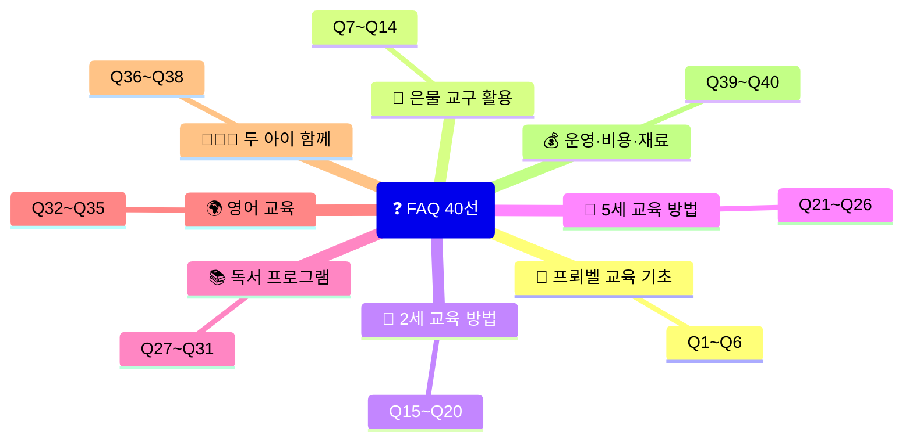
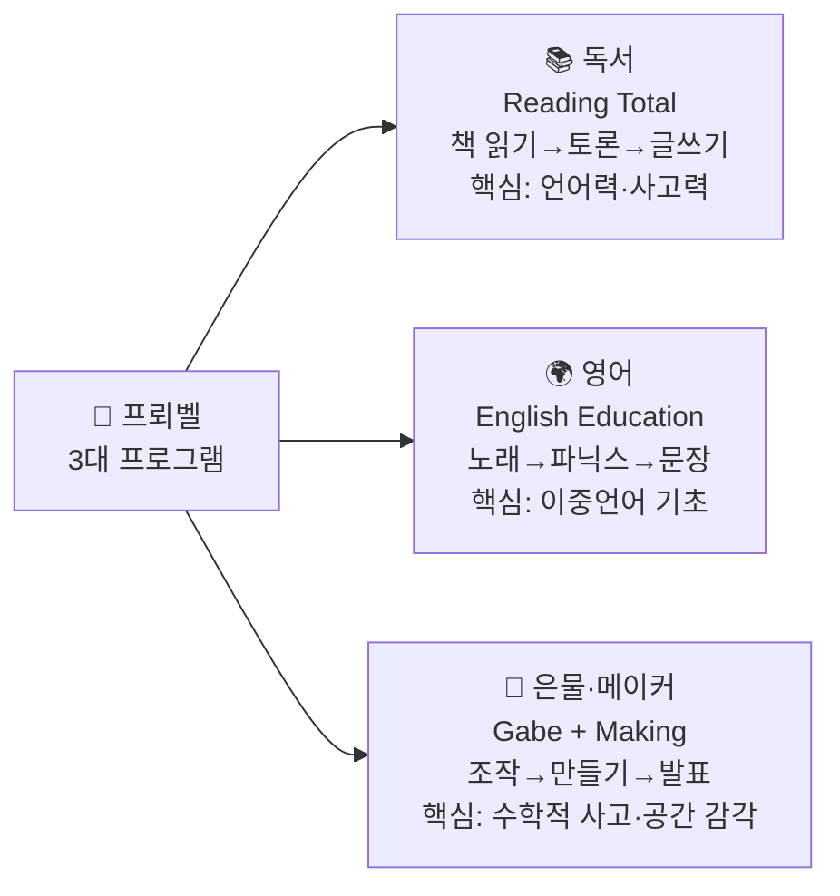
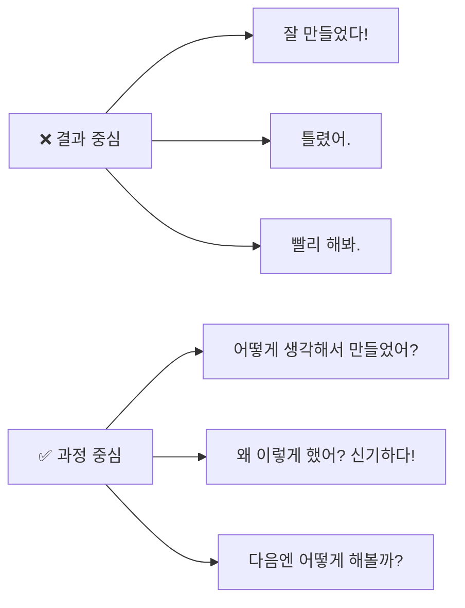
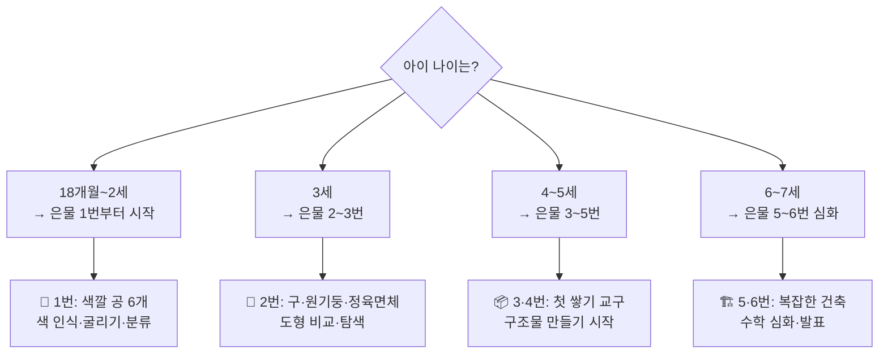
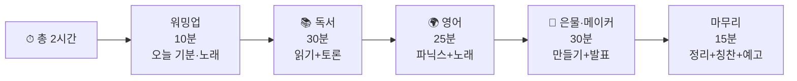
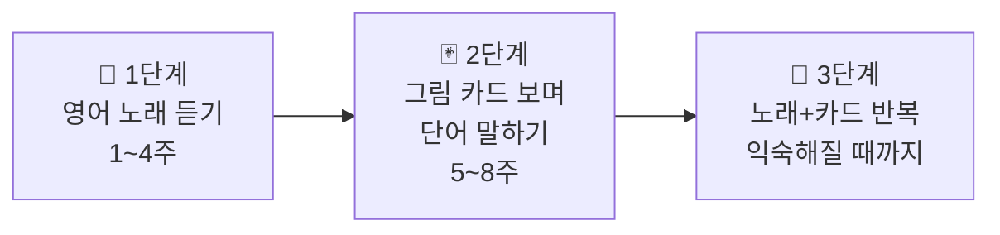
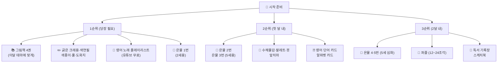

# ❓ 프뢰벨 홈교육 자주 묻는 질문 (FAQ) 40선
> 대상: 2세·5세 자녀를 둔 부모님 | 3대 프로그램: 📚 독서 · 🌍 영어 · 🧱 은물·메이커

---

## 🗂 FAQ 카테고리 구성

---

## 🌱 PART 1. 프뢰벨 교육 기초 (Q1~Q6)

---

### Q1. 프뢰벨 교육이 일반 어린이집·유치원과 다른 점이 뭔가요?

| 항목 | 어린이집·유치원 | 프뢰벨 홈교육 |
|------|--------------|------------|
| 교사:아이 비율 | 1:5~20명 | **1:1 완전 개인 맞춤** |
| 수업 집중도 | 낮음 (산만한 환경) | **매우 높음** |
| 교육 속도 | 전체 평균에 맞춤 | **아이 발달 속도에 맞춤** |
| 부모 참여 | 제한적 | **부모가 직접 교사 역할** |
| 은물 교구 | 여러 명이 나눠 사용 | **1:1 전용 집중 사용** |
| 피드백 | 느림 | **즉각 반응·즉각 칭찬** |

> ✅ **핵심 차이:** "놀이가 곧 학습"이라는 프뢰벨 철학을 1:1로 실천하기 때문에 대형 기관보다 **3~5배 높은 몰입도**가 가능합니다.

---

### Q2. 프뢰벨 3대 프로그램이 정확히 무엇인가요?

- **독서(리딩 토탈):** 그림책을 읽고, 이야기 나누고, 글로 표현하는 3단계 언어 프로그램
- **영어:** 노래로 시작해서 파닉스, 단어, 문장 말하기로 자연스럽게 이중언어를 익히는 프로그램
- **은물·메이커:** 프뢰벨이 만든 입체 교구(은물)를 조작하고, 만들고, 발표하는 창의·수학 프로그램

---

### Q3. 왜 하루 2시간만 하는 건가요? 더 하면 안 되나요?

> **하루 2시간 집중이 4시간 산만함보다 효과적입니다.**

| 구분 | 이유 |
|------|------|
| 🧠 뇌 과학 | 유아 뇌는 집중 후 반드시 휴식이 필요함 |
| 🔄 반복 효과 | 짧고 강하게 → 다음 날 또 → 반복이 진짜 학습 |
| ❤️ 즐거움 유지 | "또 하고 싶어요!"가 나올 때 멈추는 것이 핵심 |
| 🌱 자연스러운 성장 | 억지로 늘리면 학습 거부감이 생김 |

> ✅ **원칙:** 아이가 "더 하고 싶어요!" 할 때 끝내야 다음 시간을 기대합니다.

---

### Q4. 토요일 체험학습은 꼭 해야 하나요?

필수는 아니지만 **매우 권장**합니다. 이유는 다음과 같습니다.

| 체험 장소 | 연결되는 학습 |
|---------|------------|
| 동물원 | 동물 영어 단어, 은물로 동물원 만들기 |
| 도서관 | 독서 습관, 새 책 발견 |
| 자연 공원 | 씨앗 관찰, 낙엽 탁본 재료 수집 |
| 어린이 미술관 | 색깔 감수성, 화가 이름 배우기 |
| 과학 박물관 | 은물 과학 개념 실물 확인 |

> ✅ 주중에 배운 내용을 **실제 세계에서 확인하는 연결 고리** 역할을 합니다.

---

### Q5. 프뢰벨 교육에서 "결과보다 과정을 중시"한다는 게 무슨 뜻인가요?

> 아이가 블록으로 이상한 모양을 만들어도 **"어떻게 생각했어?"** 라고 물으면 아이는 스스로 생각하는 힘을 기릅니다.
> **"틀렸어"** 는 절대 금물! 유아 시기의 모든 시도는 옳습니다.

---

### Q6. 매일 빠짐없이 해야 하나요? 아이가 거부하면 어떻게 하나요?

| 상황 | 대처법 |
|------|--------|
| 아이가 "싫어요" 할 때 | 5분 쉬고 다시 제안 / 내일로 미루기 (2세 특히!) |
| 컨디션이 안 좋을 때 | 독서만 10분, 나머지 생략 가능 |
| 집중이 안 될 때 | 더 짧게 → 영어 노래 한 곡만 / 은물 한 개만 꺼내기 |
| 연속 3일 거부 시 | 활동 방법 바꾸기 (다른 그림책, 새 은물 번호) |

> ✅ **핵심 원칙:** **주 5일 중 3일 이상** 꾸준히 하면 충분합니다. 억지로 매일 하는 것보다 즐겁게 3일이 낫습니다.

---

## 🧱 PART 2. 은물 교구 활용 (Q7~Q14)

---

### Q7. 은물 번호가 많은데, 어디서 시작해야 하나요?

> ✅ **이번 계획:** 2세 = 1·2번 집중 / 5세 = 3번→4번→5번→6번 월별 단계 상승

---

### Q8. 은물 수업을 어떤 순서로 진행해야 하나요?

**프뢰벨 4단계 수업 흐름:**

| 단계 | 시간 | 내용 |
|------|------|------|
| **1단계 탐색** | 3~5분 | 은물 상자 함께 열기 / 자유롭게 만지기 |
| **2단계 활동** | 10~15분 | 생활형·형태형·미적형 중 하나 선택해 만들기 |
| **3단계 발표** | 3~5분 | "어떻게 만들었어?" 질문 → 아이 설명 듣기 |
| **4단계 정리** | 2~3분 | 함께 정리 + 칭찬 + 사진 찍기 |

> ✅ **2세:** 탐색+활동 위주 (발표는 짧게) / **5세:** 발표 시간 충분히 확보

---

### Q9. 은물 3대 놀이법(생활형·형태형·미적형)이 뭔가요?

| 놀이법 | 영어 이름 | 뜻 | 예시 (은물 3번) |
|--------|---------|-----|--------------|
| 🏠 **생활형** | Forms of Life | 실생활 사물 표현 | 의자·계단·집·나무 만들기 |
| 🔢 **형태형** | Forms of Knowledge | 수학적 탐구 | 8=4+4=2+2+2+2 수식 발견 |
| 🎨 **미적형** | Forms of Beauty | 대칭·패턴·아름다운 배열 | 좌우 대칭 꽃 무늬 만들기 |

> ✅ **매주 1가지 이상** 다루는 것을 목표로 합니다. 한 번 수업에 3가지 모두 할 필요는 없습니다.

---

### Q10. 은물 1번은 어떻게 활용하나요? (2세 전용)

**은물 1번 = 무지개색 공 6개 (빨·주·노·초·파·보)**

| 활동 유형 | 구체적 활동 | 배우는 것 |
|---------|----------|---------|
| 🏠 생활형 | 공 굴리기·숨기기·던지기 | 움직임·공간 감각 |
| 🔢 형태형 | 색깔별 분류 "빨간 공 다 찾아봐!" | 색 인식·분류 능력 |
| 🎨 미적형 | 무지개 순서대로 줄 세우기 | 순서·패턴 개념 |

> ✅ **주의:** 은물 1번 공은 **삼킬 위험이 없는 충분한 크기**입니다. 단, 항상 보호자 동반 필수.

---

### Q11. 은물 3·4·5번의 차이가 뭔가요? (5세용)

| 은물 | 구성 | 핵심 개념 | 대표 활동 |
|------|------|---------|---------|
| **3번** | 작은 정육면체 8개 | 전체와 부분 / 8=2×4 | 의자·계단·탑 만들기 |
| **4번** | 직육면체 8개 | 비율·균형·공간 | 집·다리·터널 만들기 |
| **5번** | 27개 혼합 블록 | 복잡한 공간 구성 | 성·동물원·마을 만들기 |

> ✅ **진행 순서:** 3번(4월) → 4번(5~6월) → 5번(7~9월) → 6번(10~12월)으로 **월별 단계 상승**

---

### Q12. 은물 수업 시 아이가 구조물을 부수거나 쏟으면 어떻게 하나요?

> 이것은 **완전히 정상적인 반응**입니다! 프뢰벨은 "무너뜨리는 것도 학습"이라고 했습니다.

| 반응 | 대처법 |
|------|--------|
| 블록을 쏟았을 때 | "와, 다 쏟았네! 이번엔 몇 개야?" → 세기로 연결 |
| 구조물을 부쉈을 때 | "또 만들 수 있어! 이번엔 다르게 해볼까?" |
| 한 가지만 반복할 때 | 그냥 두기 (반복이 곧 학습) |
| 아예 안 만지려 할 때 | 부모가 먼저 만들며 "엄마가 만들어볼게~" |

---

### Q13. 은물 외에 색종이·점토·퍼즐을 같이 써도 되나요?

**당연히 됩니다!** 프뢰벨 교육에서 은물은 **핵심 교구**이고, 나머지는 **보조 재료**입니다.

| 재료 | 어울리는 은물 활동 |
|------|----------------|
| 색종이 | 은물로 구조물 만든 뒤 → 색종이로 꾸미기 |
| 점토 | 은물로 형태 탐구 후 → 점토로 입체 표현 |
| 퍼즐 | 도형 개념 배운 뒤 → 퍼즐로 적용 |
| 물감 | 미적형 활동 이후 → 물감으로 색 표현 |

> ✅ **순서:** 은물 탐구 → 만들기 → 보조 재료로 꾸미기

---

### Q14. 은물 교구는 어디서 구매하나요? 비싼가요?

| 구매처 | 특징 |
|--------|------|
| 프뢰벨 공식몰 | 정품, 가격 높음 |
| 네이버 쇼핑 (중고) | 중고 가베/은물 검색, 합리적 가격 |
| 당근마켓 | 중고 교구, 가장 저렴 |
| 도서관·교육청 | 일부 지역 교구 대여 서비스 있음 |

> ✅ **팁:** 은물 1·2번 → 은물 3·4번 → 은물 5·6번 순서로 단계별 구매하면 비용 분산됩니다.
> 은물이 없는 달은 **색종이·블록·점토**로 대체 가능합니다.

---

## 👶 PART 3. 2세 교육 방법 (Q15~Q20)

---

### Q15. 2세 아이가 집중을 전혀 안 해요. 정상인가요?

**완전히 정상입니다!** 2세의 최대 집중 시간은 **5~8분**입니다.

> ✅ **비결:** 한 활동을 5분 이상 끌지 않기. 5분이 지나면 과감하게 다음으로 넘어가세요.

---

### Q16. 2세 아이에게 은물 교구가 위험하지 않나요?

| 은물 번호 | 안전 여부 | 이유 |
|---------|---------|------|
| **1번 (공)** | ✅ 안전 | 충분히 큰 크기, 부드러운 실 소재 |
| **2번 (도형)** | ⚠️ 보호자 동반 필수 | 나무 재질, 입에 넣지 않도록 주의 |
| **3번 이상** | ❌ 2세 비권장 | 작은 조각으로 질식 위험 |

> ✅ **원칙:** 2세는 **은물 1·2번만** 사용하고, 반드시 **옆에서 함께** 활동합니다.

---

### Q17. 2세 아이에게 영어를 가르쳐도 되나요? 너무 이르지 않나요?

**2세는 오히려 영어를 시작하기 가장 좋은 시기입니다!**

| 근거 | 내용 |
|------|------|
| 🧠 언어 습득 | 만 3세 이전은 모든 언어를 모국어처럼 습득 가능 |
| 🎵 음악적 접근 | 영어 노래는 말보다 먼저 뇌에 입력됨 |
| 🎯 방법 | 억지로 가르치지 않고 **노래·카드·놀이**로만 |
| ⚠️ 주의 | 한국어 발달을 방해하지 않도록 **영어는 보조적으로** |

> ✅ **2세 영어 목표:** 영어를 싫어하지 않게 만들기. 노래 5곡 따라 부르기면 성공!

---

### Q18. 2세 아이가 그림책을 찢거나 던지면 어떻게 하나요?

| 행동 | 의미 | 대처법 |
|------|------|--------|
| 책 찢기 | 탐구 본능 / 소근육 활동 | 찢어도 되는 잡지 따로 제공 |
| 책 던지기 | 관심 없음 / 다른 책 원함 | 다른 책으로 교체 / 잠깐 멈추기 |
| 그림만 보기 | 정상 발달 | 억지로 읽히지 말고 그림 보는 것 칭찬 |
| 같은 책만 요구 | 반복이 학습 | 같은 책 반복 읽기는 완전히 정상 |

> ✅ **보드북(두꺼운 책)** 사용을 권장합니다. 찢어지지 않고 안전합니다.

---

### Q19. 2세인데 말이 거의 없어요. 교육 효과가 있을까요?

**말이 없어도 뇌는 100% 흡수하고 있습니다!**

> 유아 언어 발달의 법칙:
> **인풋(Input) 1000시간 → 아웃풋(Output) 폭발**

| 단계 | 시기 | 현상 |
|------|------|------|
| 흡수기 | 0~24개월 | 말은 안 해도 모든 것을 듣고 저장 |
| 폭발기 | 24~36개월 | 갑자기 단어·문장이 쏟아짐 |
| 확장기 | 36개월 이후 | 복잡한 문장·대화 가능 |

> ✅ **지금 하고 있는 모든 독서·영어·은물 활동이 폭발기를 위한 준비입니다!**

---

### Q20. 2세 아이와 함께하는 가장 효과적인 독서 방법은?

**2세 독서 황금률 3가지:**

| 방법 | 구체적 실천 |
|------|----------|
| ① 의성어·의태어 강조 | "토끼가 깡충깡충!" "비가 추룩추룩!" 과장해서 읽기 |
| ② 그림 가리키며 대화 | "이게 뭐야?" → 아이 반응 기다리기 (3초 이상) |
| ③ 반복 읽기 환영 | 같은 책 10번 읽어달라 해도 OK! 반복이 언어력 |

> ✅ **금지 사항:** "이건 이거야" 정답 바로 알려주기 / 빨리 넘기기 / "집중해!" 강요하기

---

## 🧒 PART 4. 5세 교육 방법 (Q21~Q26)

---

### Q21. 5세 아이의 하루 2시간 수업 구성을 어떻게 나눠야 하나요?

> ✅ **탄력 운영:** 아이 컨디션에 따라 독서↔은물 순서 바꾸기 가능. 영어는 매일 꼭 포함.

---

### Q22. 5세인데 은물 블록을 쌓기만 하고 발표를 안 하려고 해요.

**발표를 강요하면 역효과입니다.** 단계적으로 유도하세요.

| 단계 | 방법 | 예시 |
|------|------|------|
| 1단계 | 부모가 먼저 발표 시범 | "엄마가 만든 건 집이에요. 문이 여기 있어요!" |
| 2단계 | 쉬운 질문으로 유도 | "이게 뭐야?" (네/아니오 아닌 질문) |
| 3단계 | 성공 경험 쌓기 | 짧은 발표도 크게 칭찬 |
| 4단계 | 자연스러운 발표 | "가족에게 보여주자!" |

> ✅ **목표:** 한 달에 1번이라도 30초 발표 → 두 달 뒤 2분 → 연말 5분

---

### Q23. 5세 아이가 파닉스를 너무 어려워해요. 어떻게 도와줄까요?

**파닉스는 노래로 먼저, 글자는 나중에!**

| 순서 | 방법 | 기간 |
|------|------|------|
| 1단계 | 알파벳 노래 (ABC Song) 매일 | 1~2주 |
| 2단계 | 알파벳 카드 보며 이름 말하기 | 1~2주 |
| 3단계 | 각 알파벳 소리 배우기 (A=애, B=브) | 1달 |
| 4단계 | 단어 카드로 연결 (Apple=A) | 1달 |
| 5단계 | 짧은 단어 읽기 (cat, dog) | 2달 |

> ✅ **가장 중요한 것:** 하루 10분만! 억지로 30분 하는 것보다 즐겁게 10분이 10배 효과적.

---

### Q24. 5세 아이가 글쓰기를 거부해요. 어떻게 시작하나요?

**글쓰기 4단계 준비 과정:**

| 단계 | 활동 | 목표 |
|------|------|------|
| 1단계 준비 | 미로 따라 그리기, 선 긋기 | 손 근육·연필 잡기 연습 |
| 2단계 모방 | 이름 한 글자씩 따라 쓰기 | 성공 경험 |
| 3단계 단어 | 좋아하는 단어 1개 쓰기 (사과, 강아지) | 의미 있는 쓰기 |
| 4단계 문장 | 그림 그리고 한 줄 설명 쓰기 | 완전한 표현 |

> ✅ **팁:** 일반 종이 대신 **격자 칸 노트**를 사용하면 훨씬 쓰기 쉬워집니다.

---

### Q25. 5세 아이의 독서 토론, 어떤 질문을 해야 하나요?

**질문의 질이 독서 효과를 결정합니다!**

| 질문 유형 | 나쁜 예 | 좋은 예 |
|---------|--------|--------|
| 사실 확인 | "주인공 이름이 뭐야?" | "주인공이 가장 힘들었던 때가 언제야?" |
| 감정 이해 | "재미있었어?" | "네가 토끼라면 어떤 기분이었을 것 같아?" |
| 상상력 | "결말 기억해?" | "결말이 이랬으면 어떨 것 같아?" |
| 연결 | "어디 사는 동물이야?" | "우리 동네에도 이런 동물이 있을까?" |

> ✅ **핵심:** 정답이 없는 질문을 하세요. 아이의 모든 대답은 정답입니다!

---

### Q26. 5세 아이가 은물 구조물을 항상 같은 것만 만들어요. 어떻게 다양하게 유도하나요?

| 방법 | 예시 |
|------|------|
| 주제 카드 제시 | "오늘은 바닷속!" 카드 보여주기 |
| 이야기로 유도 | "토끼가 살 집을 지어줘야 해!" |
| 부모가 반만 만들기 | "엄마가 기초 만들었으니 나머지는 네 차례" |
| 사진 보여주기 | 실제 건물·자연 사진 보여주고 "이거 만들어봐!" |
| 5세에게 2세 가르치기 | "동생에게 다른 것 만드는 법 알려줘!" |

---

## 📚 PART 5. 독서 프로그램 (Q27~Q31)

---

### Q27. 한 달에 책을 몇 권이나 읽어야 하나요?

| 연령 | 권장 권수 | 방법 |
|------|---------|------|
| **2세** | 월 4~8권 | 같은 책 여러 번 반복 OK |
| **5세** | 월 6~10권 | 새 책 + 좋아하는 책 재독 |

> ✅ **팁:** 도서관을 적극 활용하세요! 매주 2~3권 빌리면 비용 없이 풍부한 독서 가능.

---

### Q28. 어떤 그림책을 골라야 하나요? 기준이 있나요?

**이달의 테마에 맞춰 고르세요!**

| 선택 기준 | 내용 |
|---------|------|
| ① 주제 연결 | 이달의 은물·영어 주제와 같은 소재 |
| ② 그림 비중 | 2세: 그림 80%+, 5세: 글자 30% 이상 |
| ③ 반복 구조 | "세 마리 아기 돼지"처럼 반복 구조가 있는 책 |
| ④ 아이 선택 | 아이가 직접 고른 책이 가장 효과적 |
| ⑤ 국내+외국 | 한국 작가 + 외국 번역본 균형 |

---

### Q29. 독서 기록은 어떻게 해야 하나요?

**간단할수록 오래 지속됩니다!**

| 방법 | 2세 | 5세 |
|------|-----|-----|
| 기록 형식 | 사진 찍기 (책 + 아이 표정) | 독서 기록장 (날짜+제목+별점) |
| 주기 | 읽을 때마다 | 주 1회 정리 |
| 공유 | 가족 단톡방에 사진 올리기 | 연말 독서 목록 발표 |

> ✅ **목표:** 12월에 "올해 우리가 읽은 책 목록"을 함께 보는 것이 최고의 성취감!

---

### Q30. 2세와 5세 형제가 함께 독서할 수 있나요?

**가능하며 매우 효과적입니다!**

| 형태 | 방법 |
|------|------|
| 5세가 읽어주기 | 5세가 소리 내어 읽으면 독서 연습 + 2세 언어 자극 |
| 같은 책 다른 집중 | 2세는 그림 보기 / 5세는 내용 이해 |
| 이야기 나누기 | "동생은 어떤 그림이 좋아?" 5세가 통역사 역할 |

---

### Q31. 아이가 만화책이나 TV 영상만 보려고 해요. 어떻게 해야 하나요?

| 원칙 | 내용 |
|------|------|
| 금지 말고 시간 제한 | "TV는 저녁 30분, 책은 저녁 밥 먹고 같이" |
| 만화책도 독서 | 만화책도 스토리 이해·어휘 발달에 도움 |
| 책 먼저 보상 | "책 3권 읽으면 좋아하는 영상 볼 수 있어" |
| 서점 데려가기 | 아이가 직접 고른 책은 반드시 읽음 |

---

## 🌍 PART 6. 영어 교육 (Q32~Q35)

---

### Q32. 2세에게 영어를 어떻게 시작해야 하나요?

**2세 영어 3단계 시작법:**

**추천 시작 노래 5곡:**
1. Twinkle Twinkle Little Star
2. Old MacDonald Had a Farm
3. Rain Rain Go Away
4. Wheels on the Bus
5. If You're Happy and You Know It

---

### Q33. 5세 파닉스를 집에서 어떻게 가르치나요?

**파닉스 월별 학습 순서:**

| 월 | 파닉스 | 핵심 단어 |
|----|--------|---------|
| 4월 | A, B, C | Apple, Bee, Cat |
| 5월 | D, E, F | Dog, Egg, Fish |
| 6월 | G, H, I | Green, Hat, Ice |
| 7월 | J, K, L | Jump, King, Leaf |
| 8월 | M, N, O | Moon, Night, Open |
| 9월 | P, Q, R | Park, Queen, Rain |
| 10월 | S, T, U | Star, Tree, Up |
| 11월 | V, W, X | Van, Wind, eXit |
| 12월 | Y, Z + 전체 복습 | Year, Zebra |

> ✅ **하루 10분** 파닉스 카드 + 단어 쓰기 = 12월에 A~Z 완성!

---

### Q34. 영어 노래를 어디서 찾나요? 유튜브 채널을 추천해주세요.

| 채널명 | 특징 | 연령 |
|--------|------|------|
| **Super Simple Songs** | 느리고 명확한 발음, 다양한 주제 | 2~5세 |
| **Cocomelon** | 생활 영어, 친근한 캐릭터 | 1~4세 |
| **Pinkfong** | 핑크퐁 (한국 채널), 리듬감 좋음 | 2~5세 |
| **Blippi** | 실사 영상, 탐구·과학 주제 | 3~6세 |
| **StoryBots** | 파닉스·알파벳 특화 | 4~7세 |

> ✅ **활용법:** 수업 전 5분 유튜브 영어 노래 → 분위기 전환 + 영어 노출 효과

---

### Q35. 영어를 한국어와 섞어서 가르쳐도 되나요?

**혼용(코드 스위칭)은 완전히 자연스러운 과정입니다!**

| 상황 | 예시 | 평가 |
|------|------|------|
| 한국어 문장 + 영어 단어 | "The apple이 빨개요!" | ✅ 정상적 발달 |
| 영어 단어를 한국어로 | "fish가 물고기지!" | ✅ 연결 학습 |
| 완전히 영어로만 | "I see a big fish!" | ✅ 목표 단계 |

> ✅ **원칙:** 억지로 영어만 하게 강요하지 마세요. 자연스러운 혼용이 먼저, 분리는 나중에.

---

## 👨‍👩‍👧 PART 7. 두 아이 함께 교육 (Q36~Q38)

---

### Q36. 나이 차이 나는 2세·5세를 어떻게 동시에 가르치나요?

**"같은 주제, 다른 수준" 전략을 사용하세요!**

| 방법 | 2세 활동 | 5세 활동 | 포인트 |
|------|---------|---------|-------|
| **같은 책·다른 집중** | 그림 보기 | 내용 이해+토론 | 한 책을 두 가지 방법으로 |
| **같은 은물·다른 수준** | 색깔 분류 | 구조물 만들기 | 둘 다 은물 꺼내기 |
| **역할 분담 만들기** | 색칠 담당 | 설계 담당 | 협동 작품 완성 |
| **5세가 선생님** | 듣기 | 가르치기 | 5세 복습 효과 |

---

### Q37. 두 아이가 은물 교구를 놓고 싸우면 어떻게 하나요?

| 상황 | 해결법 |
|------|--------|
| 같은 교구 원할 때 | 은물 번호를 다르게 배정 (2세=1번, 5세=4번) |
| 5세가 2세 방해 시 | "동생 도와주는 역할" 부여 → 선생님 놀이 |
| 2세가 5세 작품 망가뜨릴 때 | 공간 분리 (책상 vs 바닥) |
| 둘 다 화날 때 | 잠깐 중단 → 간식 → 다시 시작 |

---

### Q38. 5세가 2세에게 가르쳐주면 정말 효과가 있나요?

**"가르치는 것이 최고의 학습"** — 교육학 핵심 원리

| 5세 효과 | 2세 효과 |
|---------|---------|
| 배운 것을 다시 정리 | 또래(형·누나)에게서 더 빨리 배움 |
| 설명 능력·발표력 향상 | 동경심으로 따라 하려는 동기 생김 |
| 자신감·리더십 형성 | 언어·인지 자극 |
| 복습 효과 3배 | 사회성 발달 |

> ✅ **실천법:** 매주 금요일 "동생 수업 시간" 5분 — 5세가 이번 주 배운 것 동생에게 설명

---

## 💰 PART 8. 운영·비용·재료 (Q39~Q40)

---

### Q39. 8개월 동안 총 비용이 얼마나 드나요?

| 항목 | 예상 비용 |
|------|---------|
| **은물 교구 (1~6번)** | 100,000~300,000원 (중고 가능) |
| **월별 소모품 (색종이·물감·점토 등)** | 약 56,000원 (8개월 합계) |
| **그림책** | 0원 (도서관 활용 시) / 권당 8,000~15,000원 |
| **영어 단어 카드** | 10,000~20,000원 |
| **퍼즐·블록 추가** | 10,000~30,000원 |
| **합계 (최소)** | **약 17~20만원** |
| **합계 (중간)** | **약 30~40만원** |

> ✅ **절약 팁:** 은물은 중고 구매 / 그림책은 도서관 / 색종이·물감은 대형마트 할인 시 구매

---

### Q40. 처음 시작할 때 가장 먼저 준비해야 할 것은 무엇인가요?

**우선순위 준비 목록:**

> ✅ **가장 중요한 준비물:** 교구나 재료보다 **부모의 마음가짐**입니다.
> "아이와 함께 즐기겠다"는 마음 하나면 충분합니다. 🌱

---

## 📋 한눈에 보는 FAQ 목차

| 번호 | 질문 | 카테고리 |
|------|------|---------|
| Q1 | 어린이집과의 차이점 | 프뢰벨 기초 |
| Q2 | 3대 프로그램이란? | 프뢰벨 기초 |
| Q3 | 왜 하루 2시간인가? | 프뢰벨 기초 |
| Q4 | 토요일 체험학습 꼭 해야 하나? | 프뢰벨 기초 |
| Q5 | 과정 중시란 무슨 뜻? | 프뢰벨 기초 |
| Q6 | 아이가 거부하면? | 프뢰벨 기초 |
| Q7 | 은물 어디서 시작? | 은물 활용 |
| Q8 | 은물 수업 순서 | 은물 활용 |
| Q9 | 3대 놀이법이란? | 은물 활용 |
| Q10 | 은물 1번 활용법 | 은물 활용 |
| Q11 | 은물 3·4·5번 차이 | 은물 활용 |
| Q12 | 아이가 블록 부수면? | 은물 활용 |
| Q13 | 색종이·점토 같이 써도? | 은물 활용 |
| Q14 | 은물 어디서 구매? | 은물 활용 |
| Q15 | 2세 집중 안 해요 | 2세 방법 |
| Q16 | 은물이 위험하지 않나요? | 2세 방법 |
| Q17 | 2세 영어 너무 이르나요? | 2세 방법 |
| Q18 | 책 찢거나 던지면? | 2세 방법 |
| Q19 | 2세가 말이 없어요 | 2세 방법 |
| Q20 | 2세 독서 방법 | 2세 방법 |
| Q21 | 5세 하루 수업 구성 | 5세 방법 |
| Q22 | 발표를 안 하려 해요 | 5세 방법 |
| Q23 | 파닉스 어려워해요 | 5세 방법 |
| Q24 | 글쓰기 거부해요 | 5세 방법 |
| Q25 | 독서 토론 질문법 | 5세 방법 |
| Q26 | 같은 것만 만들어요 | 5세 방법 |
| Q27 | 한 달에 책 몇 권? | 독서 |
| Q28 | 어떤 책을 골라야? | 독서 |
| Q29 | 독서 기록 방법 | 독서 |
| Q30 | 형제가 함께 독서? | 독서 |
| Q31 | 만화책·TV만 보려 해요 | 독서 |
| Q32 | 2세 영어 시작법 | 영어 |
| Q33 | 5세 파닉스 방법 | 영어 |
| Q34 | 유튜브 채널 추천 | 영어 |
| Q35 | 영어·한국어 섞어도? | 영어 |
| Q36 | 두 아이 동시 교육법 | 함께 |
| Q37 | 두 아이가 싸우면? | 함께 |
| Q38 | 5세가 2세 가르치기 효과? | 함께 |
| Q39 | 총 비용이 얼마인가? | 운영·비용 |
| Q40 | 첫 준비물 무엇부터? | 운영·비용 |

---

*작성: 프뢰벨 홈교육 FAQ 40선 | 2026.04.07 | 대상: 2세·5세 자녀 부모님*
